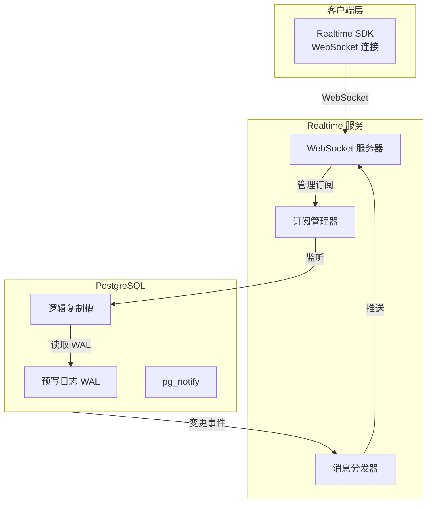
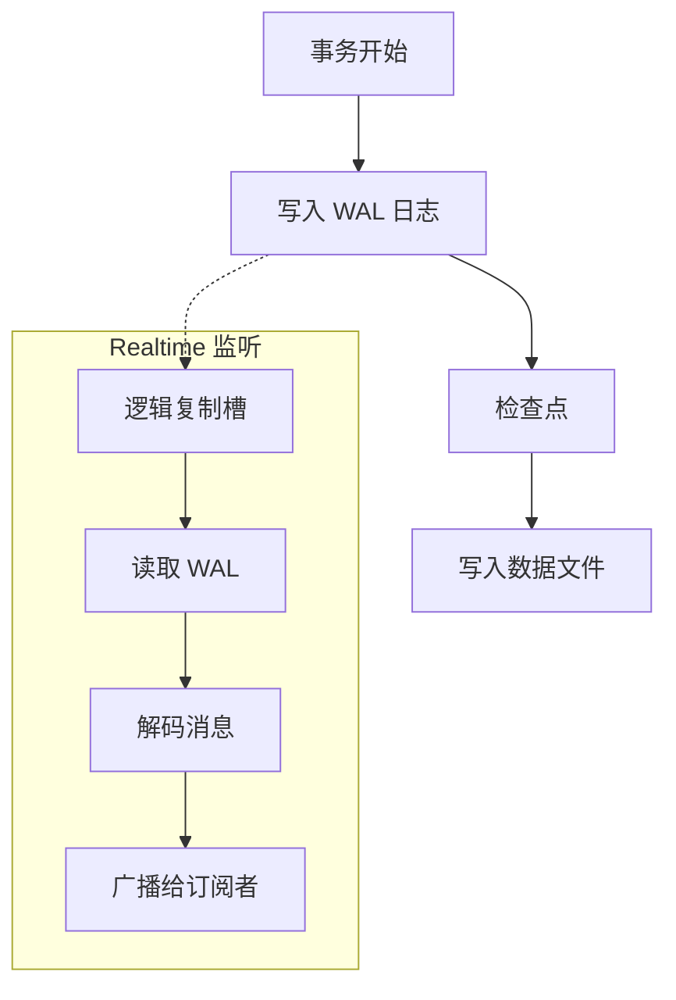
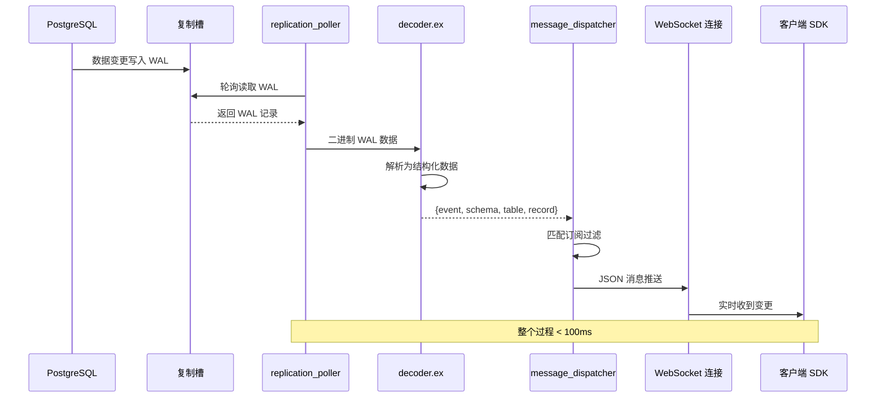
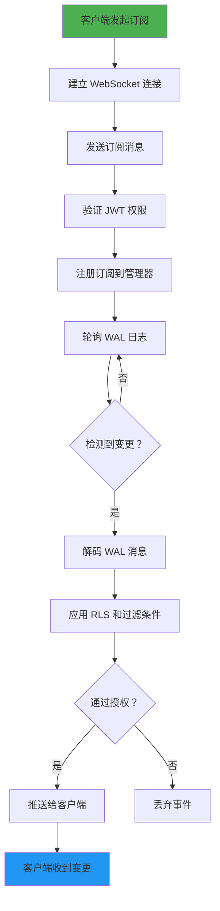

# 第 5 章：实时数据订阅 (Realtime) 活动流程解析

## 5.1 Realtime 架构概览

### 核心组件

Supabase Realtime 是一个基于 **Elixir** 构建的实时服务器，利用 PostgreSQL 的逻辑复制功能实现变更数据捕获（CDC），通过 WebSocket 将数据变更实时推送到客户端。



### 技术栈

| 组件 | 技术 | 职责 |
|------|------|------|
| **Realtime Server** | Elixir | WebSocket 连接管理、消息路由 |
| **PostgreSQL CDC** | 逻辑复制 | 捕获 INSERT/UPDATE/DELETE |
| **WebSocket** | 实时协议 | 双向通信、低延迟推送 |
| **Replication Slot** | 数据库特性 | 持续跟踪 WAL 变更 |

---

## 5.2 三种实时功能模式

### 模式对比

| 模式 | 说明 | 适用场景 | 延迟 |
|------|------|----------|------|
| **Postgres Changes** | 监听数据库变更（CDC） | 实时数据同步、协作编辑 | ~100ms |
| **Broadcast** | 向所有客户端广播消息 | 聊天室、通知推送 | <50ms |
| **Presence** | 在线状态同步 | 用户列表、协作指示器 | ~200ms |

### 使用示例

```javascript
// 初始化 Realtime 客户端
const realtime = supabase.channel('room-1')

// 1. Postgres Changes - 监听数据库变更
realtime.on(
  'postgres_changes',
  {
    event: '*',  // INSERT, UPDATE, DELETE, *
    schema: 'public',
    table: 'messages',
    filter: `user_id=eq.${userId}`  // 可选过滤
  },
  (payload) => {
    console.log('数据库变更:', payload)
    // payload 包含：
    // - eventType: 'INSERT' | 'UPDATE' | 'DELETE'
    // - schema: 表所属 schema
    // - table: 表名
    // - record: 新数据（INSERT/UPDATE）
    // - old_record: 旧数据（DELETE/UPDATE）
  }
)

// 2. Broadcast - 广播消息
realtime.on('broadcast', { event: 'reaction' }, (payload) => {
  console.log('收到广播:', payload)
})

// 发送广播
await realtime.send({
  type: 'broadcast',
  event: 'reaction',
  payload: { emoji: '👍' }
})

// 3. Presence - 在线状态
realtime.on('presence', { event: 'sync' }, () => {
  const state = realtime.presenceState()
  console.log('在线用户:', state)
  // state 结构：
  // {
  //   'user-1': [{ online_at: "...", meta: {...} }],
  //   'user-2': [{ online_at: "...", meta: {...} }]
  // }
})

// 加入频道（开始监听）
await realtime.subscribe()

```

---

## 5.3 变更数据捕获 (CDC) 原理

### 什么是 CDC？

**变更数据捕获 (Change Data Capture, CDC)** 是一种数据库技术，通过监听数据库的预写日志（WAL）来捕获数据变更，实现实时数据同步。

### CDC 核心优势

| 优势 | 说明 |
|------|------|
| **实时性** | 毫秒级数据同步延迟 |
| **可靠性** | 基于 PostgreSQL 内置复制机制 |
| **性能友好** | 不影响数据库主线程性能 |
| **一致性** | 遵循事务隔离级别 |

### WAL 预写日志机制



### PostgreSQL WAL 结构

WAL（Write-Ahead Logging）是 PostgreSQL 的事务日志，记录所有数据变更：

```
WAL 记录结构：
┌─────────────────────────────────────┐
│ LSN (Log Sequence Number)           │  ← 日志位置标识
├─────────────────────────────────────┤
│ Transaction ID                      │  ← 事务 ID
├─────────────────────────────────────┤
│ Operation Type (INSERT/UPDATE/...)  │  ← 操作类型
├─────────────────────────────────────┤
│ Table OID                           │  ← 表标识
├─────────────────────────────────────┤
│ Before Image (旧数据)                │  ← UPDATE/DELETE 前
├─────────────────────────────────────┤
│ After Image (新数据)                 │  ← INSERT/UPDATE 后
└─────────────────────────────────────┘

```

---

## 5.4 Realtime CDC 架构解析

### 核心模块

```
supabase/realtime/
├── lib/realtime/
│   ├── adapters/
│   │   └── postgres/
│   │       ├── decoder.ex      # WAL 消息解码器
│   │       └── protocol.ex     # 复制协议解析
│   └── extensions/
│       └── postgres_cdc_rls/
│           ├── cdc_rls.ex          # CDC + RLS 核心实现
│           ├── replication_poller.ex  # WAL 轮询器
│           ├── subscription_manager.ex # 订阅管理
│           └── message_dispatcher.ex  # 消息分发
```

### 模块职责详解

| 模块 | 职责 | 关键函数 |
|------|------|----------|
| **decoder.ex** | 解析 PostgreSQL 复制消息 | `parse/1`, `decode_wal/1` |
| **protocol.ex** | 处理复制协议 | `is_write/1`, `is_keep_alive/1` |
| **cdc_rls.ex** | CDC + RLS 集成 | 确保用户只接收授权数据 |
| **replication_poller.ex** | 从复制槽拉取 WAL | `start_link/1`, `poll/1` |
| **subscription_manager.ex** | 管理客户端订阅关系 | `subscribe/3`, `unsubscribe/2` |
| **message_dispatcher.ex** | 分发变更事件到 WebSocket | `dispatch/2` |

### 数据流路径详解



---

## 5.5 完整活动流程：从监听到同步

### 流程概览



### 阶段 1：建立连接

```javascript
// 客户端建立 WebSocket 连接
const channel = supabase.channel('chat-room', {
  config: {
    presence: { key: 'user-123' }  // Presence 标识
  }
})

// 底层发生的过程：
// 1. SDK 创建 WebSocket 连接 wss://<project>.supabase.co/realtime/v1
// 2. 发送 JOIN 消息，包含 Channel Topic 和配置
// 3. 服务端创建 Channel 进程（Elixir GenServer）
// 4. 返回 channel: "phx_reply" 确认

```

### 阶段 2：订阅数据库变更

```javascript
channel.on(
  'postgres_changes',
  {
    event: 'INSERT',
    schema: 'public',
    table: 'messages',
    filter: 'room_id=eq.1'
  },
  (payload) => {
    console.log('新消息:', payload)
  }
)

// 底层发生的过程：
// 1. SDK 发送 SUBSCRIPTION 消息到服务端
// 2. subscription_manager.ex 注册订阅关系
// 3. 检查 PostgreSQL 复制槽是否存在，不存在则创建
// 4. replication_poller.ex 开始轮询 WAL

```

### 阶段 3：WAL 变更捕获

```sql
-- PostgreSQL 内部过程：

-- 1. 客户端执行 INSERT
INSERT INTO messages (room_id, content) 
VALUES (1, 'Hello!');

-- 2. PostgreSQL 写入 WAL 日志
-- LSN: 0/12345678
-- Operation: INSERT
-- Table OID: 16384 (messages 表)
-- Record: {id: 1, room_id: 1, content: 'Hello!'}

-- 3. Realtime 通过复制槽读取
-- SELECT * FROM pg_logical_slot_get_changes(
--   'realtime_rls_slot',  -- 复制槽名称
--   NULL, NULL,           -- LSN 范围
--   'include-pk' '1',
--   'include-transaction' '0'
-- )

```

### 阶段 4：消息解码与过滤

```elixir
# lib/realtime/adapters/postgres/decoder.ex

# 解码器将二进制 WAL 消息转换为结构化数据
def parse_message(binary_data) do
  # 解析消息头
  <<lsn::64, transaction_id::32, ...>> = binary_data
  
  # 解析操作类型
  operation = case <<type::8>> do
    ?I -> :INSERT
    ?U -> :UPDATE
    ?D -> :DELETE
    ?R -> :RELATION  # 表结构变更
  end
  
  # 解析数据负载
  record = decode_tuple(body)
  
  %Write{
    lsn: lsn,
    operation: operation,
    table: table_name,
    record: record
  }
end

```

### 阶段 5：RLS 授权检查

```elixir
# lib/extensions/postgres_cdc_rls/cdc_rls.ex

# 检查用户是否有权接收此变更事件
def check_rls(user_id, schema, table, record) do
  # 执行 PostgreSQL RLS 策略检查
  query = """
    SELECT CASE 
      WHEN EXISTS (
        SELECT 1 FROM #{schema}.#{table}
        WHERE id = $1 AND user_id = $2
      ) THEN true
      ELSE false
    END
  """
  
  Repo.query!(query, [record.id, user_id])
end

```

### 阶段 6：WebSocket 推送

```elixir
# lib/realtime_web/channels/realtime_channel.ex

# 通过 WebSocket 推送变更事件
def push_change(client_pid, event) do
  payload = %{
    event_type: event.operation,
    schema: event.schema,
    table: event.table,
    record: event.record,
    old_record: event.old_record  # UPDATE/DELETE
  }
  
  Phoenix.Channel.push(client_pid, "postgres_changes", payload)
end

```

### 阶段 7：客户端接收

```javascript
// 客户端收到推送（通常在 100ms 内）
channel.on('postgres_changes', { event: 'INSERT', ... }, (payload) => {
  console.log('收到实时消息:', payload)
  // {
  //   eventType: 'INSERT',
  //   schema: 'public',
  //   table: 'messages',
  //   record: { id: 1, room_id: 1, content: 'Hello!' }
  // }
  
  // 更新 UI
  setMessages(prev => [...prev, payload.record])
})

```

---

## 5.6 订阅管理与性能优化

### 订阅过滤策略

```javascript
// 精确过滤（推荐）
channel.on('postgres_changes', {
  event: 'INSERT',
  schema: 'public',
  table: 'messages',
  filter: 'room_id=eq.1'  // 只接收 room_id=1 的消息
})

// 宽泛过滤（不推荐，会产生大量无用数据）
channel.on('postgres_changes', {
  event: '*',
  schema: 'public',
  table: '*'  // 监听所有表
})

```

### 批量变更处理

```javascript
// Realtime 支持批量推送变更（减少网络请求）
const channel = supabase.channel('bulk-channel', {
  config: {
    broadcast: {
      self: false,  // 不接收自己发送的消息
      acknowledge: true  // 需要服务端确认
    }
  }
})

// 服务端会合并短时间内（默认 100ms）的多个变更
// 一次性推送给客户端

```

### 断线重连机制

```javascript
// SDK 自动处理断线重连
supabase.realtime.setAuth(token)  // 重连前更新 Token

// 监听连接状态
supabase.realtime.onOpen(() => {
  console.log('WebSocket 已连接')
})

supabase.realtime.onClose(() => {
  console.log('WebSocket 已断开')
})

supabase.realtime.onError((error) => {
  console.error('WebSocket 错误:', error)
  // SDK 会自动尝试重连（指数退避）
})

```

### 性能最佳实践

| 优化项 | 建议 | 原因 |
|--------|------|------|
| **精确过滤** | 使用 `filter` 缩小范围 | 减少无用数据传输 |
| **频道隔离** | 不同功能使用不同频道 | 避免相互干扰 |
| **Presence 节流** | 限制更新频率（~1 秒） | 减少网络开销 |
| **批量订阅** | 合并相似订阅 | 减少复制槽数量 |
| **心跳检测** | 启用 WebSocket Ping | 及时发现断线 |

---

## 5.7 典型应用场景

### 场景 1：实时聊天应用

```javascript
// 1. 订阅聊天室消息
const channel = supabase.channel(`chat:${roomId}`)

channel
  .on('postgres_changes', {
    event: 'INSERT',
    schema: 'public',
    table: 'messages',
    filter: `room_id=eq.${roomId}`
  }, (payload) => {
    // 新消息到达，更新 UI
    addMessage(payload.record)
  })
  .on('presence', { event: 'sync' }, () => {
    // 更新在线用户列表
    const users = channel.presenceState()
    updateOnlineUsers(users)
  })
  .subscribe()

// 2. 发送消息
await supabase.from('messages').insert({
  room_id: roomId,
  content: 'Hello!'
})

// 3. 追踪在线状态
channel.track({ user_id: userId, name: '张三' })

```

### 场景 2：协作编辑（类似 Google Docs）

```javascript
// 1. 订阅文档变更
const docChannel = supabase.channel(`doc:${docId}`)

docChannel
  .on('postgres_changes', {
    event: 'UPDATE',
    schema: 'public',
    table: 'documents',
    filter: `id=eq.${docId}`
  }, (payload) => {
    // 应用变更（使用 OT 或 CRDT 算法）
    applyChange(payload.new_record.content)
  })
  .on('presence', { event: 'sync' }, () => {
    // 显示协作者光标位置
    const collaborators = docChannel.presenceState()
    renderCollaboratorCursors(collaborators)
  })
  .subscribe()

// 2. 追踪用户编辑状态
docChannel.track({
  user_id: userId,
  cursor_position: 123,
  selection: { start: 100, end: 150 }
})

```

### 场景 3：实时仪表盘

```javascript
// 1. 订阅订单数据
const dashboardChannel = supabase.channel('dashboard')

dashboardChannel
  .on('postgres_changes', {
    event: 'INSERT',
    schema: 'public',
    table: 'orders'
  }, (payload) => {
    // 实时更新销售统计
    updateMetrics(payload.record)
  })
  .subscribe()

// 2. 使用物化视图预计算
// SQL: 创建实时统计视图
CREATE MATERIALIZED VIEW order_stats AS
SELECT 
  COUNT(*) as total_orders,
  SUM(amount) as total_revenue,
  AVG(amount) as avg_order_value
FROM orders;

-- 实时刷新
REFRESH MATERIALIZED VIEW CONCURRENTLY order_stats;

```

---

## 本章小结

本章深入解析了 Supabase Realtime 实时数据订阅系统：

1. **架构概览**：Elixir 服务器、PostgreSQL CDC、WebSocket 三层架构
2. **三种模式**：Postgres Changes（数据库变更）、Broadcast（广播）、Presence（在线状态）
3. **CDC 原理**：WAL 预写日志、逻辑复制槽、变更捕获机制
4. **核心模块**：decoder（解码）、replication_poller（轮询）、subscription_manager（订阅）、dispatcher（分发）
5. **完整活动流程**：连接→订阅→WAL 捕获→解码→RLS 授权→推送→客户端接收
6. **性能优化**：精确过滤、频道隔离、批量订阅、断线重连
7. **应用场景**：实时聊天、协作编辑、实时仪表盘
