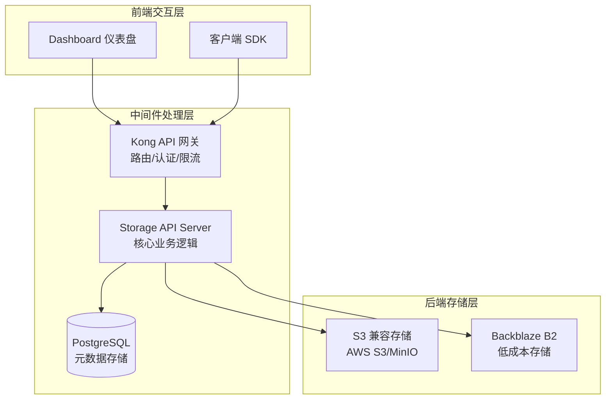
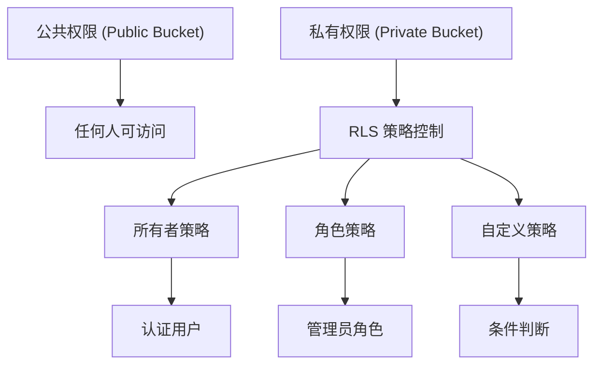
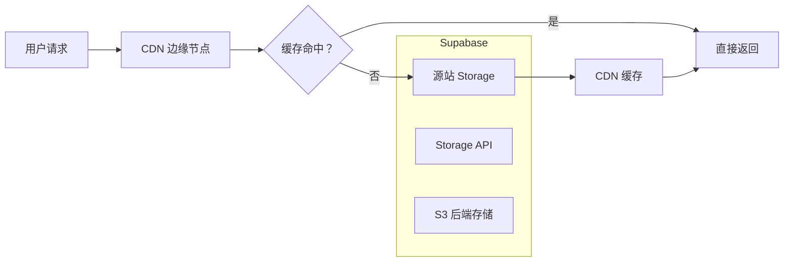

# 第 6 章：文件存储 (Storage) 架构与原理

## 6.1 Storage 架构概览

### 核心设计理念

Supabase Storage 是一款开源的 **S3 兼容对象存储服务**，其独特之处在于将**元数据存储在 PostgreSQL** 数据库中，为开发者提供了既熟悉又强大的存储解决方案。

### 分层架构设计



### 各层职责详解

| 层级 | 组件 | 职责 | 技术栈 |
|------|------|------|--------|
| **前端层** | Dashboard | 可视化管理界面 | React |
| | Client Libraries | 多语言 SDK（JS/Python 等） | TypeScript |
| **中间件层** | Kong API Gateway | 请求路由、认证鉴权、流量控制 | Nginx/Lua |
| | Storage API Server | 核心业务逻辑、元数据管理 | Node.js |
| | PostgreSQL | 存储文件元数据、权限策略 | PostgreSQL 15+ |
| **后端层** | S3 兼容存储 | 实际文件存储 | AWS S3/MinIO |
| | Backblaze B2 | 低成本冷存储选项 | Backblaze API |

---

## 6.2 核心架构特性

### 元数据管理优势

与传统对象存储不同，Supabase Storage 将元数据存储在 PostgreSQL 中：

| 特性 | 说明 |
|------|------|
| **SQL 查询能力** | 使用 SQL 查询文件元数据（名称、类型、大小等） |
| **RLS 权限集成** | 通过 PostgreSQL RLS 实现细粒度访问控制 |
| **事务一致性** | 文件操作与元数据更新在同一事务中 |
| **关联查询** | 文件数据与业务数据关联查询 |

### 元数据表结构

```sql
-- 存储桶表
CREATE TABLE storage.buckets (
  id TEXT PRIMARY KEY,
  name TEXT NOT NULL,
  owner UUID REFERENCES auth.users,
  public BOOLEAN DEFAULT false,
  file_size_limit BIGINT,
  allowed_mime_types TEXT[],
  created_at TIMESTAMPTZ DEFAULT NOW()
);

-- 对象（文件）表
CREATE TABLE storage.objects (
  id UUID PRIMARY KEY DEFAULT gen_random_uuid(),
  bucket_id TEXT REFERENCES storage.buckets,
  name TEXT NOT NULL,
  owner UUID REFERENCES auth.users,
  metadata JSONB,
  path_tokens TEXT[],  -- 路径分段，支持嵌套查询
  version TEXT,
  created_at TIMESTAMPTZ DEFAULT NOW(),
  updated_at TIMESTAMPTZ DEFAULT NOW()
);

-- 创建索引加速查询
CREATE INDEX idx_objects_bucket_name ON storage.objects(bucket_id, name);
CREATE INDEX idx_objects_path_tokens ON storage.objects USING GIN(path_tokens);

```

---

## 6.3 存储桶 (Bucket) 管理

### 核心概念

**存储桶** 是文件组织的基本单元，类似于文件夹但具有独立的权限配置。

### 创建与管理

```javascript
// 1. 创建存储桶
const { data, error } = await supabase.storage.createBucket(
  'user-uploads',  // 桶 ID
  {
    public: false,           // 私有桶
    fileSizeLimit: 52428800, // 50MB 限制
    allowedMimeTypes: ['image/jpeg', 'image/png'] // 允许的文件类型
  }
)

// 2. 获取存储桶列表
const { data } = await supabase.storage.listBuckets()

// 3. 获取存储桶详情
const { data } = await supabase.storage.getBucket('user-uploads')

// 4. 更新存储桶配置
await supabase.storage.updateBucket('user-uploads', {
  public: true,
  fileSizeLimit: 104857600  // 100MB
})

// 5. 删除存储桶
await supabase.storage.deleteBucket('user-uploads')

```

### 桶权限策略

```sql
-- 启用 RLS
ALTER TABLE storage.objects ENABLE ROW LEVEL SECURITY;

-- 策略 1：桶所有者可上传文件
CREATE POLICY "所有者上传" ON storage.objects
  FOR INSERT
  WITH CHECK (bucket_id = 'user-uploads' AND auth.uid() = owner);

-- 策略 2：任何人可读取公共桶文件
CREATE POLICY "公共读取" ON storage.objects
  FOR SELECT
  USING (bucket_id IN (SELECT id FROM storage.buckets WHERE public = true));

-- 策略 3：桶所有者可删除自己的文件
CREATE POLICY "所有者删除" ON storage.objects
  FOR DELETE
  USING (bucket_id = 'user-uploads' AND auth.uid() = owner);

```

---

## 6.4 文件上传与下载

### 上传方式

| 方式 | 说明 | 适用场景 |
|------|------|----------|
| **简单上传** | 一次性上传小文件 | < 5MB 的文件 |
| **分片上传** | 大文件分块上传 | > 50MB 的文件 |
| **签名 URL** | 客户端直传 S3 | 移动应用、前端直传 |

### 简单上传

```javascript
// 从 File 对象上传（Web）
const fileInput = document.querySelector('input[type="file"]')
const file = fileInput.files[0]

const { data, error } = await supabase.storage
  .from('user-uploads')
  .upload('profile-picture.jpg', file, {
    cacheControl: '3600',
    upsert: false  // 是否覆盖已存在的文件
  })

// 从 Buffer 上传（Node.js）
const fs = require('fs')
const fileData = fs.readFileSync('./local-file.jpg')

const { data, error } = await supabase.storage
  .from('user-uploads')
  .upload('documents/report.pdf', fileData, {
    contentType: 'application/pdf'
  })

```

### 分片上传（大文件）

```javascript
// 分片上传适用于 > 50MB 的大文件
const { data, error } = await supabase.storage
  .from('user-uploads')
  .createSignedUploadUrl('large-video.mp4')

// 返回上传 URL 和路径
// { signedUrl: 'https://...', path: 'large-video.mp4' }

// 使用分块上传
const CHUNK_SIZE = 5 * 1024 * 1024  // 5MB per chunk
const chunks = []

for (let i = 0; i < file.size; i += CHUNK_SIZE) {
  const chunk = file.slice(i, i + CHUNK_SIZE)
  chunks.push(chunk)
}

// 并行上传所有分片
await Promise.all(chunks.map((chunk, index) => 
  uploadChunk(data.signedUrl, chunk, index)
))

// 完成上传（合并分片）
await supabase.storage.from('user-uploads').moveToDestination(data.path)

```

### 下载文件

```javascript
// 1. 下载为 Blob
const { data, error } = await supabase.storage
  .from('user-uploads')
  .download('profile-picture.jpg')

// data 是 Blob 对象，可用于显示图片
const imageUrl = URL.createObjectURL(data)

// 2. 获取临时访问 URL（有效期可配置）
const { data } = await supabase.storage
  .from('user-uploads')
  .createSignedUrl('profile-picture.jpg', 60)  // 60 秒有效

// data.signedUrl = 'https://.../profile-picture.jpg?token=xxx'

// 3. 批量生成签名 URL
const { data } = await supabase.storage
  .from('user-uploads')
  .createSignedUrls(['file1.jpg', 'file2.jpg', 'file3.jpg'], 3600)

```

---

## 6.5 图片转换

### 支持的转换操作

| 操作 | 参数 | 说明 |
|------|------|------|
| **缩放** | `width`, `height` | 调整图片尺寸 |
| **裁剪** | `gravity`, `resize` | 智能裁剪 |
| **格式转换** | `format` | webp/jpeg/png |
| **质量调整** | `quality` | 1-100 |

### 转换示例

```javascript
// 1. 获取转换后的图片 URL
const { data } = supabase.storage
  .from('user-uploads')
  .getPublicUrl('profile-picture.jpg', {
    transform: {
      width: 200,
      height: 200,
      fit: 'cover',      // cover/contain/fill
      gravity: 'center', // center/smart/face
      format: 'webp',    // webp/jpeg/png
      quality: 80
    }
  })

// data.publicUrl = 'https://.../profile-picture.jpg?width=200&height=200&...'

// 2. 下载转换后的图片
const { data } = await supabase.storage
  .from('user-uploads')
  .download('profile-picture.jpg', {
    transform: {
      width: 100,
      height: 100
    }
  })

```

### 应用场景

| 场景 | 转换配置 |
|------|----------|
| **头像缩略图** | `width: 100, height: 100, fit: 'cover', gravity: 'face'` |
| **商品列表图** | `width: 300, height: 300, fit: 'cover'` |
| **响应式图片** | 生成多个尺寸版本 (`srcset`) |
| **Web 优化** | `format: 'webp', quality: 80` |

---

## 6.6 访问控制与权限

### 权限层级



### RLS 策略配置

```sql
-- 场景 1：用户只能访问自己的文件
CREATE POLICY "用户访问自己的文件" ON storage.objects
  FOR ALL
  USING (owner = auth.uid())
  WITH CHECK (owner = auth.uid());

-- 场景 2：公共读取，私有写入
CREATE POLICY "公共读取" ON storage.objects
  FOR SELECT
  USING (true);  -- 任何人都可以读取

CREATE POLICY "认证用户写入" ON storage.objects
  FOR INSERT
  WITH CHECK (auth.role() = 'authenticated');

-- 场景 3：基于角色的访问
CREATE POLICY "管理员访问所有" ON storage.objects
  FOR ALL
  USING (auth.jwt() ->> 'role' = 'admin');

-- 场景 4：限制文件类型
CREATE POLICY "只允许图片" ON storage.objects
  FOR INSERT
  WITH CHECK (
    metadata->>'mimetype' IN ('image/jpeg', 'image/png', 'image/gif')
  );

```

### 签名 URL 安全

```javascript
// 签名 URL 适用于临时授权访问
// 例如：付费内容预览、私有文件临时分享

// 生成 1 小时后过期的访问 URL
const { data } = await supabase.storage
  .from('premium-content')
  .createSignedUrl('exclusive-video.mp4', 3600)

// 安全最佳实践：
// 1. 设置合理的过期时间（不要太长）
// 2. 对于敏感操作，使用一次性 URL
// 3. 结合业务逻辑验证用户权限

```

---

## 6.7 CDN 分发原理

### CDN 集成架构



### CDN 工作流程

1. **首次请求**：CDN 边缘节点回源到 Supabase Storage，获取文件
2. **缓存存储**：CDN 将文件缓存到边缘节点
3. **后续请求**：直接从 CDN 边缘节点返回，无需回源
4. **缓存失效**：达到 TTL 或手动刷新后，重新回源

### 配置 CDN

```javascript
// 公共桶默认启用 CDN 加速
// 访问 URL 自动使用 CDN 域名

const { data } = supabase.storage
  .from('public-assets')
  .getPublicUrl('logo.png')

// data.publicUrl = 'https://<cdn-domain>.supabase.co/storage/v1/object/public/assets/logo.png'

// CDN 缓存控制
await supabase.storage
  .from('public-assets')
  .upload('cached-file.jpg', file, {
    cacheControl: '31536000'  // 1 年缓存
  })

```

### 缓存策略建议

| 文件类型 | Cache-Control | 说明 |
|----------|---------------|------|
| **静态资源** | `max-age=31536000` | JS/CSS/图片，长期缓存 |
| **用户头像** | `max-age=3600` | 1 小时缓存 |
| **动态内容** | `no-cache` | 每次验证 freshness |
| **私有文件** | `private` | 仅浏览器缓存 |

---

## 6.8 性能优化最佳实践

### 上传优化

| 优化项 | 方法 | 效果 |
|--------|------|------|
| **分片上传** | 大文件切分为 5MB 块 | 支持断点续传 |
| **并行上传** | 同时上传多个分片 | 减少上传时间 |
| **客户端直传** | 使用签名 URL 直传 S3 | 减少服务器负载 |
| **压缩预处理** | 前端压缩图片/视频 | 减少传输大小 |

### 下载优化

| 优化项 | 方法 | 效果 |
|--------|------|------|
| **CDN 加速** | 使用 CDN 边缘节点 | 减少延迟 |
| **图片转换** | 按需调整尺寸/格式 | 减少下载量 |
| **懒加载** | 滚动到视口再加载 | 减少初始请求 |
| **预缓存** | 预判用户需求预加载 | 提升体验 |

### 查询优化

```sql
-- 为常用查询创建索引
CREATE INDEX idx_objects_owner_bucket ON storage.objects(owner, bucket_id);
CREATE INDEX idx_objects_created_at ON storage.objects(created_at DESC);
CREATE INDEX idx_objects_metadata ON storage.objects USING GIN(metadata);

-- 使用路径令牌高效查询嵌套文件
SELECT * FROM storage.objects
WHERE bucket_id = 'user-uploads'
  AND path_tokens[1] = 'avatars'  -- 第一层路径
  AND owner = auth.uid();

```

---

## 本章小结

本章深入解析了 Supabase Storage 文件存储系统：

1. **架构设计**：前端层、中间件层（Kong+API+Postgres）、后端层（S3 兼容存储）
2. **元数据管理**：PostgreSQL 存储元数据，支持 SQL 查询、RLS 权限、事务一致性
3. **存储桶管理**：创建、配置、权限策略、文件类型限制
4. **文件操作**：简单上传、分片上传、签名 URL、下载
5. **图片转换**：缩放、裁剪、格式转换、质量调整
6. **访问控制**：RLS 策略、签名 URL、基于角色的权限
7. **CDN 分发**：边缘节点缓存、缓存策略、性能优化
