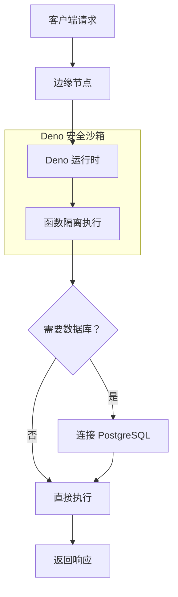

# 第 7 章：边缘函数 (Edge Functions) 与开发工具

## 7.1 Edge Functions 架构概览

### 核心概念

**Supabase Edge Functions** 是基于 **Deno 运行时** 的无服务器函数服务，允许开发者在全球边缘节点运行 TypeScript 代码，实现毫秒级冷启动和低延迟响应。

### 技术栈

| 组件 | 技术 | 职责 |
|------|------|------|
| **Deno Runtime** | Rust + V8 | 安全、现代的 JavaScript/TypeScript 运行时 |
| **Edge Runtime** | Supabase 自研 | 函数调度、隔离执行 |
| **全球边缘节点** | CDN 网络 | 就近执行、低延迟 |

### 与传统云函数的对比

| 特性 | AWS Lambda | Cloud Functions | Supabase Edge Functions |
|------|------------|-----------------|------------------------|
| **运行时** | Node.js/Python 等 | Node.js/Go/Python | Deno (TypeScript) |
| **冷启动** | 100ms-2s | 100ms-1s | <50ms |
| **部署位置** | 区域中心 | 区域中心 | 全球边缘节点 |
| **执行时长** | 最长 15 分钟 | 最长 9 分钟 | 最长 60 秒 |
| **内存限制** | 128MB-10GB | 128MB-32GB | 128MB |
| **数据库集成** | 需配置连接 | 需配置连接 | 直接访问 Supabase DB |

---

## 7.2 工作原理

### 执行流程



### Deno 安全模型

Deno 默认采用安全沙箱模式：

| 权限 | 说明 | 获取方式 |
|------|------|----------|
| **网络访问** | 默认禁止外部网络请求 | `--allow-net` |
| **文件系统** | 默认只读访问 | `--allow-read` |
| **环境变量** | 默认不可访问 | `--allow-env` |
| **数据库连接** | 通过 Supabase SDK | 内置支持 |

### 函数执行环境

```typescript
// Edge Function 运行环境
// - Deno 1.x+ 运行时
// - 支持 TypeScript 原生执行（无需编译）
// - 内置 Supabase JS SDK
// - 支持 ES Modules 导入

import { serve } from 'https://deno.land/std@0.168.0/http/server.ts'
import { createClient } from 'https://esm.sh/@supabase/supabase-js'

serve(async (req: Request) => {
  // 函数逻辑
  return new Response('Hello from Edge!')
})

```

---

## 7.3 开发环境搭建

### 本地开发三步骤

```bash
# 1. 启动本地 Supabase 开发环境
supabase start

# 输出：
# - Database: http://localhost:54322
# - Studio: http://localhost:54323
# - Functions: http://localhost:54321

# 2. 创建新的 Edge Function
supabase functions new hello-world

# 创建目录结构：
# supabase/functions/hello-world/
# └── index.ts

# 3. 本地运行函数服务
supabase functions serve hello-world --env-file .env.local

# 访问：http://localhost:54321/functions/v1/hello-world

```

### 函数模板结构

```typescript
// supabase/functions/hello-world/index.ts

import { serve } from 'https://deno.land/std@0.168.0/http/server.ts'
import { createClient } from 'https://esm.sh/@supabase/supabase-js@2'

serve(async (req: Request) => {
  try {
    // 1. 解析请求体
    const { name } = await req.json()
    
    // 2. 创建 Supabase 客户端
    const supabaseClient = createClient(
      Deno.env.get('SUPABASE_URL') ?? '',
      Deno.env.get('SUPABASE_ANON_KEY') ?? '',
      {
        global: {
          headers: { Authorization: req.headers.get('Authorization')! },
        },
      }
    )
    
    // 3. 执行数据库查询
    const { data, error } = await supabaseClient
      .from('users')
      .select('*')
      .eq('name', name)
      .single()
    
    if (error) throw error
    
    // 4. 返回响应
    return new Response(
      JSON.stringify({ data }),
      { 
        headers: { 'Content-Type': 'application/json' },
        status: 200 
      }
    )
    
  } catch (error) {
    return new Response(
      JSON.stringify({ error: error.message }),
      { 
        headers: { 'Content-Type': 'application/json' },
        status: 400 
      }
    )
  }
})

```

---

## 7.4 部署方式

### 方式 1：CLI 部署（推荐）

```bash
# 1. 登录 Supabase
supabase login

# 2. 链接项目
supabase link --project-ref xxxxxxxxxxxx

# 3. 部署单个函数
supabase functions deploy hello-world

# 4. 部署所有函数
supabase functions deploy

# 5. 查看函数列表
supabase functions list

# 6. 查看函数日志
supabase functions logs hello-world --follow

```

### 方式 2：Dashboard 可视化部署

1. 进入 Supabase Dashboard → Edge Functions
2. 点击 "Create new function"
3. 在在线编辑器中编写代码
4. 点击 "Save and Deploy"

**适用场景：** 快速迭代、团队协作、非技术人员参与

### 方式 3：CI/CD 自动化部署

```yaml
# .github/workflows/deploy-functions.yml

name: Deploy Edge Functions

on:
  push:
    branches: [main]
    paths:
      - 'supabase/functions/**'

jobs:
  deploy:
    runs-on: ubuntu-latest
    steps:
      - uses: actions/checkout@v3
      
      - name: Setup Supabase CLI
        uses: supabase/setup-cli@v1
        
      - name: Login
        run: supabase login ${{ secrets.SUPABASE_ACCESS_TOKEN }}
        
      - name: Link Project
        run: supabase link --project-ref ${{ secrets.PROJECT_REF }}
        
      - name: Deploy Functions
        run: supabase functions deploy

```

---

## 7.5 典型应用场景

### 场景 1：Webhook 处理

```typescript
// supabase/functions/stripe-webhook/index.ts

import { serve } from 'https://deno.land/std@0.168.0/http/server.ts'
import Stripe from 'https://esm.sh/stripe@12.0.0?target=deno'

serve(async (req: Request) => {
  // 1. 验证 Stripe 签名
  const signature = req.headers.get('Stripe-Signature')!
  const body = await req.text()
  
  const stripe = new Stripe(Deno.env.get('STRIPE_SECRET')!, {
    apiVersion: '2023-10-16',
  })
  
  const event = stripe.webhooks.constructEvent(
    body,
    signature,
    Deno.env.get('STRIPE_WEBHOOK_SECRET')!
  )
  
  // 2. 处理不同类型的事件
  switch (event.type) {
    case 'payment_intent.succeeded':
      const paymentIntent = event.data.object
      // 更新数据库订单状态
      await supabaseClient
        .from('orders')
        .update({ status: 'paid' })
        .eq('stripe_payment_intent_id', paymentIntent.id)
      break
      
    case 'customer.subscription.deleted':
      // 处理订阅取消
      break
  }
  
  return new Response(JSON.stringify({ received: true }), { status: 200 })
})

```

### 场景 2：AI 向量搜索

```typescript
// supabase/functions/search-embeddings/index.ts

import { serve } from 'https://deno.land/std@0.168.0/http/server.ts'
import { createClient } from 'https://esm.sh/@supabase/supabase-js@2'

serve(async (req: Request) => {
  // 1. 获取搜索查询
  const { query } = await req.json()
  
  // 2. 调用 OpenAI 生成嵌入向量
  const openAIResponse = await fetch('https://api.openai.com/v1/embeddings', {
    method: 'POST',
    headers: {
      'Authorization': `Bearer ${Deno.env.get('OPENAI_API_KEY')}`,
      'Content-Type': 'application/json'
    },
    body: JSON.stringify({
      model: 'text-embedding-ada-002',
      input: query
    })
  })
  
  const { data: { embedding } } = await openAIResponse.json()
  
  // 3. 调用 PostgreSQL 向量搜索函数
  const supabaseClient = createClient(
    Deno.env.get('SUPABASE_URL')!,
    Deno.env.get('SUPABASE_SERVICE_ROLE_KEY')!
  )
  
  const { data: documents } = await supabaseClient.rpc('match_documents', {
    query_embedding: embedding,
    match_threshold: 0.78,
    match_count: 5
  })
  
  return new Response(JSON.stringify({ documents }), { status: 200 })
})

```

### 场景 3：数据预处理与验证

```typescript
// supabase/functions/validate-user-input/index.ts

import { serve } from 'https://deno.land/std@0.168.0/http/server.ts'

serve(async (req: Request) => {
  const { email, username, password } = await req.json()
  
  // 1. 验证邮箱格式
  const emailRegex = /^[^\s@]+@[^\s@]+\.[^\s@]+$/
  if (!emailRegex.test(email)) {
    return new Response(
      JSON.stringify({ error: 'Invalid email format' }),
      { status: 400 }
    )
  }
  
  // 2. 验证用户名（3-20 字符，仅允许字母数字下划线）
  const usernameRegex = /^[a-zA-Z0-9_]{3,20}$/
  if (!usernameRegex.test(username)) {
    return new Response(
      JSON.stringify({ error: 'Username must be 3-20 characters' }),
      { status: 400 }
    )
  }
  
  // 3. 验证密码强度
  if (password.length < 8) {
    return new Response(
      JSON.stringify({ error: 'Password must be at least 8 characters' }),
      { status: 400 }
    )
  }
  
  // 4. 检查用户名是否已存在
  const supabaseClient = createClient(
    Deno.env.get('SUPABASE_URL')!,
    Deno.env.get('SUPABASE_SERVICE_ROLE_KEY')!
  )
  
  const { data: existingUser } = await supabaseClient
    .from('users')
    .select('id')
    .eq('username', username)
    .single()
  
  if (existingUser) {
    return new Response(
      JSON.stringify({ error: 'Username already taken' }),
      { status: 400 }
    )
  }
  
  // 5. 验证通过
  return new Response(
    JSON.stringify({ valid: true }),
    { status: 200 }
  )
})

```

### 场景 4：第三方 API 集成

```typescript
// supabase/functions/send-email/index.ts

import { serve } from 'https://deno.land/std@0.168.0/http/server.ts'

serve(async (req: Request) => {
  const { to, subject, body } = await req.json()
  
  // 使用 SendGrid 发送邮件
  const response = await fetch('https://api.sendgrid.com/v3/mail/send', {
    method: 'POST',
    headers: {
      'Authorization': `Bearer ${Deno.env.get('SENDGRID_API_KEY')}`,
      'Content-Type': 'application/json'
    },
    body: JSON.stringify({
      personalizations: [{ to: [{ email: to }] }],
      from: { email: 'noreply@example.com' },
      subject: subject,
      content: [{ type: 'text/plain', value: body }]
    })
  })
  
  if (response.ok) {
    return new Response(JSON.stringify({ success: true }), { status: 200 })
  } else {
    const error = await response.json()
    return new Response(JSON.stringify({ error }), { status: 500 })
  }
})

```

---

## 7.6 环境变量与密钥管理

### 本地开发环境

```bash
# .env.local 文件
SUPABASE_URL=http://localhost:54321
SUPABASE_ANON_KEY=eyJhbGc...
SUPABASE_SERVICE_ROLE_KEY=eyJhbGc...
STRIPE_SECRET_KEY=sk_test_...
OPENAI_API_KEY=sk-...
SENDGRID_API_KEY=SG....

```

### 生产环境配置

```bash
# 1. 设置函数环境变量（CLI）
supabase secrets set STRIPE_SECRET_KEY=sk_live_...
supabase secrets set OPENAI_API_KEY=sk-...

# 2. 查看已设置的环境变量
supabase secrets list

# 3. 删除环境变量
supabase secrets unset STRIPE_SECRET_KEY

```

### 安全最佳实践

| 实践 | 说明 |
|------|------|
| **不要硬编码密钥** | 始终使用 `Deno.env.get()` |
| **区分环境** | 开发用测试密钥，生产用正式密钥 |
| **最小权限原则** | 使用 `SUPABASE_ANON_KEY` 而非 `SERVICE_ROLE_KEY` |
| **定期轮换** | 定期更换 API 密钥 |

---

## 7.7 Supabase CLI 工具

### 核心命令

```bash
# 项目管理
supabase init              # 初始化项目
supabase login             # 登录账户
supabase link              # 链接远程项目
supabase unlink            # 取消链接

# 本地开发
supabase start             # 启动本地服务
supabase stop              # 停止本地服务
supabase status            # 查看运行状态

# 数据库
supabase db pull           # 拉取远程数据库结构
supabase db push           # 推送本地结构到远程
supabase db dump           # 导出数据库备份
supabase migration new     # 创建新迁移
supabase migration up      # 应用迁移
supabase migration down    # 回滚迁移

# Edge Functions
supabase functions new     # 创建新函数
supabase functions serve   # 本地运行
supabase functions deploy  # 部署到云端
supabase functions list    # 列出函数
supabase functions logs    # 查看日志

# 存储
supabase storage ls        # 列出存储桶
supabase storage cp        # 复制文件

```

### 数据库迁移工作流

```bash
# 1. 创建新的迁移文件
supabase migration new add_user_profiles

# 生成文件：supabase/migrations/YYYYMMDDHHMMSS_add_user_profiles.sql

# 2. 编辑迁移文件
# ALTER TABLE users ADD COLUMN avatar_url TEXT;

# 3. 本地测试
supabase db push

# 4. 提交代码到 Git
git add supabase/migrations/
git commit -m "feat: add avatar_url column"

# 5. 部署到生产环境
supabase db push --db-url postgresql://...

```

---

## 7.8 性能优化

### 冷启动优化

| 优化项 | 方法 | 效果 |
|--------|------|------|
| **减少依赖** | 只导入必要的模块 | 减少加载时间 |
| **使用 ES Modules** | 避免 CommonJS 转换 | 原生执行更快 |
| **缓存客户端** | 复用 Supabase 客户端 | 避免重复创建 |
| **精简代码** | 删除无用逻辑 | 减少执行时间 |

### 代码示例：优化前后对比

```typescript
// ❌ 优化前：每次都创建新客户端
serve(async (req: Request) => {
  const supabase = createClient(url, key)
  const { data } = await supabase.from('users').select()
  return new Response(JSON.stringify(data))
})

// ✅ 优化后：缓存客户端实例
let cachedClient: ReturnType<typeof createClient> | null = null

function getClient() {
  if (!cachedClient) {
    cachedClient = createClient(url, key)
  }
  return cachedClient
}

serve(async (req: Request) => {
  const { data } = await getClient().from('users').select()
  return new Response(JSON.stringify(data))
})

```

### 并发处理

```typescript
// 并行执行独立操作
serve(async (req: Request) => {
  const [users, posts, comments] = await Promise.all([
    supabase.from('users').select(),
    supabase.from('posts').select(),
    supabase.from('comments').select()
  ])
  
  return new Response(JSON.stringify({ users, posts, comments }))
})

```

---

## 本章小结

本章深入解析了 Supabase Edge Functions 与开发工具：

1. **架构概览**：Deno 运行时、全球边缘节点、安全沙箱
2. **工作原理**：函数隔离执行、权限模型、执行流程
3. **开发环境**：本地启动、函数创建、调试运行
4. **部署方式**：CLI 部署、Dashboard 可视化、CI/CD 自动化
5. **应用场景**：Webhook 处理、AI 向量搜索、数据验证、第三方 API 集成
6. **密钥管理**：环境变量设置、安全最佳实践
7. **CLI 工具**：项目管理、数据库迁移、函数部署
8. **性能优化**：冷启动优化、代码缓存、并发处理
