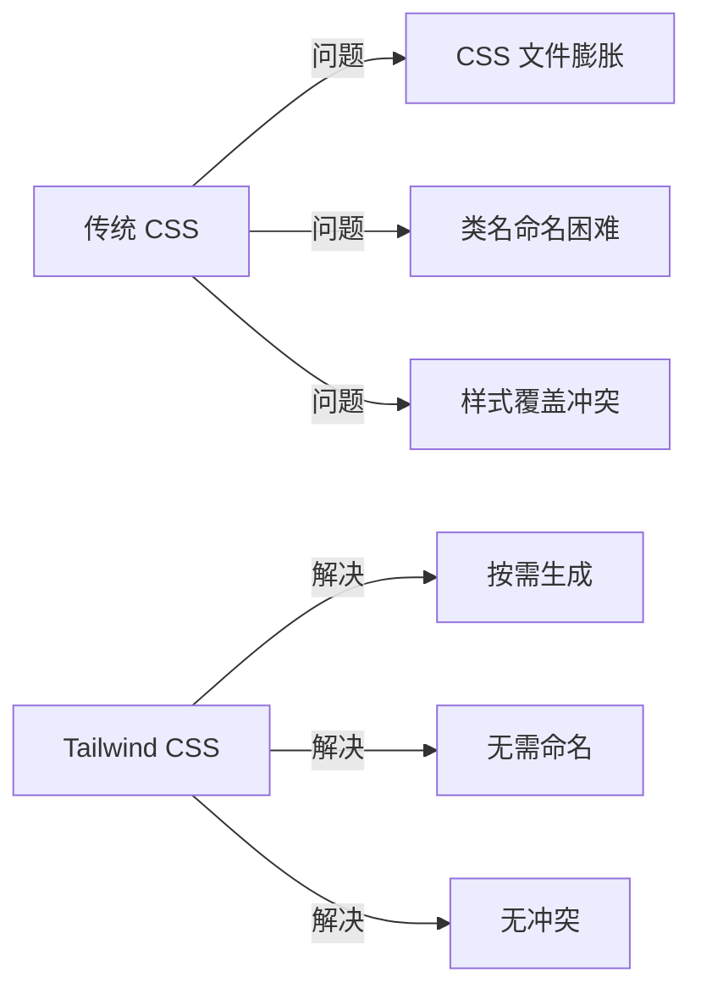
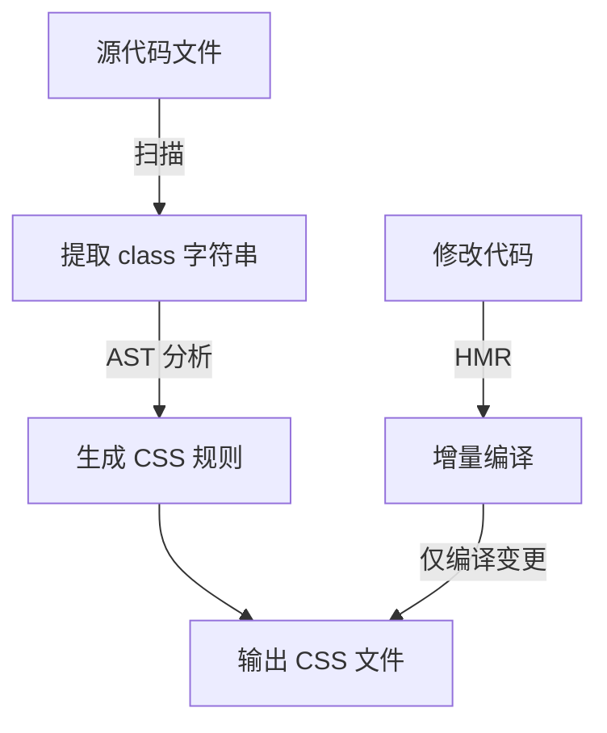

# Tailwind CSS 核心知识体系

> 原子化 CSS 框架

**最后更新：** 2026-04-05 | **版本：** 1.0.0

---

## 目录

1. [Tailwind CSS 基础认知](#第 1 章-tailwind-css-基础认知)
2. [快速开始与配置](#第 2 章-快速开始与配置)
3. [核心工具类](#第 3 章-核心工具类)
4. [响应式设计](#第 4 章-响应式设计)
5. [主题定制](#第 5 章-主题定制)
6. [JIT 即时编译原理](#第 6 章-jit-即时编译原理)
7. [高级特性](#第 7 章-高级特性)
8. [实战最佳实践](#第 8 章-实战最佳实践)

---

## 第 1 章 Tailwind CSS 基础认知

### 1.1 什么是 Tailwind CSS

Tailwind CSS 是一个**原子化（Utility-First）CSS 框架**，提供大量预定义的低级工具类，允许开发者直接在 HTML 中组合样式，无需编写自定义 CSS。

**核心定义：**
- 原子化 CSS：每个类只对应一个 CSS 属性
- Utility-First：优先使用工具类，必要时才写自定义 CSS
- 移动优先：默认样式针对移动设备，响应式通过前缀实现
- JIT 编译：即时生成实际使用的 CSS，体积极小

### 1.2 Tailwind CSS 与传统 CSS 对比



| 维度 | 传统 CSS | Tailwind CSS |
|------|----------|--------------|
| 类名命名 | 需手动命名（如 `.btn-primary`） | 无需命名，直接使用工具类 |
| CSS 体积 | 随项目增长而膨胀 | 仅包含实际使用的类 |
| 样式冲突 | 全局作用域，易冲突 | 原子类，无冲突 |
| 开发效率 | 需在 HTML/CSS 间切换 | 直接在 HTML 中编写 |
| 响应式 | 需写 `@media` 查询 | 使用前缀（如 `md:`） |
| 学习曲线 | 需掌握 CSS 语法 | 需记忆工具类 |

### 1.3 原子化设计哲学

**核心思想：** 将样式拆分为最小的不可再分的单元，每个单元只负责一个样式属性。

```html
<!-- 传统 CSS -->
<button class="btn-primary">点击</button>
<style>
.btn-primary {
  background-color: #3b82f6;
  color: white;
  padding: 0.5rem 1rem;
  border-radius: 0.375rem;
}
</style>

<!-- Tailwind CSS -->
<button class="bg-blue-500 text-white px-4 py-2 rounded">
  点击
</button>
```

**原子化优势：**

| 优势 | 说明 |
|------|------|
| 开发效率 | 无需在 HTML 和 CSS 文件间切换 |
| 设计一致性 | 预设值强制实施设计规范 |
| 体积优化 | JIT 只生成实际使用的 CSS |
| 维护简单 | 删除 HTML 即删除样式，无残留 |
| 响应式简单 | 前缀式响应式，无需写媒体查询 |

### 1.4 适用场景与局限性

#### 1.4.1 推荐使用场景

- ✅ **快速原型开发** - 无需编写 CSS，快速搭建界面
- ✅ **组件库开发** - 原子类适合构建可复用组件
- ✅ **团队协作项目** - 统一设计规范，减少样式冲突
- ✅ **响应式网站** - 内置响应式断点，开发简单
- ✅ **设计系统建设** - 主题系统支持统一设计语言

#### 1.4.2 局限性

- ⚠️ **HTML 类名冗长** - 多个工具类组合导致类名很长
- ⚠️ **学习成本** - 需记忆大量工具类名称
- ⚠️ **设计自由度** - 预设值可能限制创意实现
- ⚠️ **SEO 影响** - 类名无语义，对 SEO 无帮助

---

## 第 2 章 快速开始与配置

### 2.1 安装与初始化

#### 2.1.1 CLI 安装（推荐）

```bash
# 安装依赖
npm install -D tailwindcss postcss autoprefixer

# 初始化配置文件
npx tailwindcss init -p
```

#### 2.1.2 框架集成

```bash
# Create React App
npm install -D tailwindcss postcss autoprefixer
npx tailwindcss init

# Next.js
npm install -D tailwindcss postcss autoprefixer
npx tailwindcss init

# Vite + React
npm install -D tailwindcss postcss autoprefixer
npx tailwindcss init -p
```

### 2.2 配置文件

#### 2.2.1 tailwind.config.js 基础结构

```javascript
/** @type {import('tailwindcss').Config} */
module.exports = {
  // 扫描的文件路径
  content: [
    './src/**/*.{html,js,jsx,ts,tsx,vue}'
  ],
  
  // 主题配置
  theme: {
    extend: {}
  },
  
  // 插件
  plugins: []
}
```

#### 2.2.2 content 配置（重要）

```javascript
module.exports = {
  content: [
    // HTML 文件
    './index.html',
    
    // 源代码文件
    './src/**/*.{html,js,ts,jsx,tsx,vue}',
    
    // 排除 node_modules
    '!./node_modules/**'
  ]
}
```

**JIT 模式说明：**
- Tailwind CSS v3.0+ 默认启用 JIT 模式
- JIT 只扫描 `content` 中指定的文件
- 路径配置错误会导致样式丢失

### 2.3 CSS 入口文件

```css
/* src/index.css */
@tailwind base;
@tailwind components;
@tailwind utilities;
```

**指令说明：**

| 指令 | 作用 |
|------|------|
| `@tailwind base` | 基础样式重置（Preflight） |
| `@tailwind components` | 组件类定义 |
| `@tailwind utilities` | 工具类定义 |

### 2.4 构建配置

#### 2.4.1 开发模式

```bash
# 监听模式
npx tailwindcss -i ./src/input.css -o ./dist/output.css --watch
```

#### 2.4.2 生产模式

```bash
# 生产构建（自动压缩）
NODE_ENV=production npx tailwindcss -i ./src/input.css -o ./dist/output.css
```

#### 2.4.3 PostCSS 配置

```javascript
// postcss.config.js
module.exports = {
  plugins: {
    tailwindcss: {},
    autoprefixer: {}
  }
}
```

---

## 第 3 章 核心工具类

### 3.1 布局类（Layout）

```html
<!-- 显示 -->
<div class="block">块级元素</div>
<div class="inline-block">行内块级</div>
<div class="flex">Flex 布局</div>
<div class="grid">Grid 布局</div>
<div class="hidden">隐藏</div>

<!-- Flex 布局 -->
<div class="flex justify-center items-center">居中</div>
<div class="flex-row">水平排列</div>
<div class="flex-col">垂直排列</div>
<div class="flex-wrap">换行</div>
<div class="flex-1">占满剩余空间</div>

<!-- Grid 布局 -->
<div class="grid grid-cols-3">3 列网格</div>
<div class="grid grid-rows-2">2 行网格</div>
<div class="gap-4">间距 1rem</div>
<div class="col-span-2">跨 2 列</div>
```

### 3.2 间距类（Spacing）

```html
<!-- margin -->
<div class="m-4">margin: 1rem</div>
<div class="mx-4">margin-left/right: 1rem</div>
<div class="my-4">margin-top/bottom: 1rem</div>
<div class="mt-4">margin-top: 1rem</div>
<div class="mr-4">margin-right: 1rem</div>
<div class="mb-4">margin-bottom: 1rem</div>
<div class="ml-4">margin-left: 1rem</div>

<!-- padding -->
<div class="p-4">padding: 1rem</div>
<div class="px-4">padding-left/right: 1rem</div>
<div class="py-4">padding-top/bottom: 1rem</div>
<div class="pt-4">padding-top: 1rem</div>

<!-- 间距值 -->
<!-- 0, 0.5, 1, 1.5, 2, 2.5, 3, 4, 5, 6, 8, 10, 12, 16, 20, 24, 32, 40, 48, 56, 64, 80, 96 -->
<div class="p-0">0</div>
<div class="p-px">1px</div>
<div class="p-0.5">0.125rem (2px)</div>
<div class="p-1">0.25rem (4px)</div>
<div class="p-2">0.5rem (8px)</div>
<div class="p-4">1rem (16px)</div>
<div class="p-8">2rem (32px)</div>

<!-- 任意值 -->
<div class="p-[13px]">padding: 13px</div>
<div class="p-[2.5rem]">padding: 2.5rem</div>
```

### 3.3 颜色类（Colors）

```html
<!-- 背景色 -->
<div class="bg-blue-500">蓝色背景</div>
<div class="bg-red-500">红色背景</div>
<div class="bg-gray-100">灰色背景</div>
<div class="bg-white">白色背景</div>
<div class="bg-black">黑色背景</div>
<div class="bg-transparent">透明背景</div>

<!-- 文字颜色 -->
<p class="text-blue-500">蓝色文字</p>
<p class="text-gray-700">深灰文字</p>
<p class="text-white">白色文字</p>

<!-- 边框颜色 -->
<div class="border border-blue-500">蓝色边框</div>

<!-- 颜色阶梯 -->
<!-- 50, 100, 200, 300, 400, 500, 600, 700, 800, 900 -->
<div class="bg-blue-50">最浅蓝色</div>
<div class="bg-blue-500">标准蓝色</div>
<div class="bg-blue-900">最深蓝色</div>

<!-- 任意颜色 -->
<div class="bg-[#1da1f1]">自定义颜色</div>
<div class="text-[rgb(255,0,0)]">RGB 颜色</div>
```

### 3.4 排版类（Typography）

```html
<!-- 字体大小 -->
<p class="text-xs">12px</p>
<p class="text-sm">14px</p>
<p class="text-base">16px</p>
<p class="text-lg">18px</p>
<p class="text-xl">20px</p>
<p class="text-2xl">24px</p>
<p class="text-3xl">30px</p>
<p class="text-4xl">36px</p>
<p class="text-5xl">48px</p>

<!-- 字重 -->
<p class="font-light">300</p>
<p class="font-normal">400</p>
<p class="font-medium">500</p>
<p class="font-semibold">600</p>
<p class="font-bold">700</p>

<!-- 对齐 -->
<p class="text-left">左对齐</p>
<p class="text-center">居中对齐</p>
<p class="text-right">右对齐</p>
<p class="text-justify">两端对齐</p>

<!-- 行高 -->
<p class="leading-none">1</p>
<p class="leading-tight">1.25</p>
<p class="leading-normal">1.5</p>
<p class="leading-relaxed">1.625</p>
<p class="leading-loose">2</p>
```

### 3.5 尺寸类（Sizing）

```html
<!-- 宽度 -->
<div class="w-0">0</div>
<div class="w-1">0.25rem</div>
<div class="w-full">100%</div>
<div class="w-screen">100vw</div>
<div class="w-min">最小内容宽度</div>
<div class="w-max">最大内容宽度</div>
<div class="w-fit">适应内容</div>

<!-- 高度 -->
<div class="h-full">100%</div>
<div class="h-screen">100vh</div>

<!-- 最大/最小 -->
<div class="max-w-screen-lg">最大宽度 1024px</div>
<div class="min-h-screen">最小高度 100vh</div>

<!-- 任意值 -->
<div class="w-[350px]">宽度 350px</div>
<div class="h-[500px]">高度 500px</div>
```

### 3.6 边框与圆角（Borders）

```html
<!-- 边框宽度 -->
<div class="border">1px</div>
<div class="border-0">无边框</div>
<div class="border-2">2px</div>
<div class="border-4">4px</div>
<div class="border-t-2">上边框 2px</div>

<!-- 圆角 -->
<div class="rounded-none">0</div>
<div class="rounded-sm">0.125rem</div>
<div class="rounded">0.25rem</div>
<div class="rounded-md">0.375rem</div>
<div class="rounded-lg">0.5rem</div>
<div class="rounded-xl">0.75rem</div>
<div class="rounded-2xl">1rem</div>
<div class="rounded-3xl">1.5rem</div>
<div class="rounded-full">9999px (圆形)</div>

<!-- 边框样式 -->
<div class="border-solid">实线</div>
<div class="border-dashed">虚线</div>
<div class="border-dotted">点线</div>
```

### 3.7 效果类（Effects）

```html
<!-- 阴影 -->
<div class="shadow-sm">小阴影</div>
<div class="shadow">标准阴影</div>
<div class="shadow-md">中等阴影</div>
<div class="shadow-lg">大阴影</div>
<div class="shadow-xl">超大阴影</div>
<div class="shadow-none">无阴影</div>

<!-- 不透明度 -->
<div class="opacity-0">0%</div>
<div class="opacity-25">25%</div>
<div class="opacity-50">50%</div>
<div class="opacity-75">75%</div>
<div class="opacity-100">100%</div>

<!-- 模糊 -->
<div class="blur-sm">轻微模糊</div>
<div class="blur">标准模糊</div>
<div class="blur-md">中等模糊</div>
<div class="blur-lg">强模糊</div>
```

---

## 第 4 章 响应式设计

### 4.1 响应式断点

Tailwind 使用**移动优先**的响应式设计：

```javascript
// tailwind.config.js 默认断点
module.exports = {
  theme: {
    screens: {
      'sm': '640px',   // 小型设备（横屏手机）
      'md': '768px',   // 中型设备（平板）
      'lg': '1024px',  // 大型设备（桌面）
      'xl': '1280px',  // 超大设备
      '2xl': '1536px'  // 超大屏幕
    }
  }
}
```

**断点说明：**

| 断点 | 最小宽度 | 媒体查询 |
|------|----------|----------|
| `sm:` | 640px | `(min-width: 640px)` |
| `md:` | 768px | `(min-width: 768px)` |
| `lg:` | 1024px | `(min-width: 1024px)` |
| `xl:` | 1280px | `(min-width: 1280px)` |
| `2xl:` | 1536px | `(min-width: 1536px)` |

### 4.2 响应式工具类

```html
<!-- 响应式布局 -->
<div class="
  block           <!-- 默认（移动）显示为块级 -->
  sm:inline-block <!-- 640px+ 显示为行内块 -->
  md:inline       <!-- 768px+ 显示为行内 -->
  lg:block        <!-- 1024px+ 显示为块级 -->
">
  响应式显示
</div>

<!-- 响应式宽度 -->
<div class="
  w-full          <!-- 移动：100% -->
  sm:w-1/2        <!-- 640px+: 50% -->
  lg:w-1/4        <!-- 1024px+: 25% -->
">
  响应式宽度
</div>

<!-- 响应式间距 -->
<div class="
  p-2             <!-- 移动：0.5rem -->
  md:p-4          <!-- 768px+: 1rem -->
  xl:p-8          <!-- 1280px+: 2rem -->
">
  响应式内边距
</div>

<!-- 响应式文字 -->
<p class="
  text-base       <!-- 移动：16px -->
  md:text-lg      <!-- 768px+: 18px -->
  lg:text-xl      <!-- 1024px+: 20px -->
">
  响应式字体
</p>

<!-- 响应式 Flex -->
<div class="
  flex
  flex-col        <!-- 移动：垂直排列 -->
  md:flex-row     <!-- 768px+: 水平排列 -->
  justify-between
">
  <div>项目 1</div>
  <div>项目 2</div>
  <div>项目 3</div>
</div>
```

### 4.3 自定义断点

```javascript
// tailwind.config.js
module.exports = {
  theme: {
    screens: {
      'xs': '480px',    // 添加超小屏幕
      'sm': '640px',
      'md': '768px',
      'tablet': '820px',// 自定义平板断点
      'lg': '1024px',
      'xl': '1280px',
      '2xl': '1536px',
      
      // 最大宽度查询（需要插件或自定义 CSS）
      'max-md': { 'max': '767px' }
    }
  }
}
```

**使用自定义断点：**

```html
<div class="xs:text-sm md:text-lg tablet:text-xl">
  自定义断点响应式
</div>
```

---

## 第 5 章 主题定制

### 5.1 颜色主题定制

```javascript
// tailwind.config.js
module.exports = {
  theme: {
    extend: {
      colors: {
        // 添加新颜色
        'primary': '#3b82f6',
        'secondary': '#10b981',
        'accent': '#f59e0b',
        
        // 定义色阶
        'brand': {
          50: '#f0f9ff',
          100: '#e0f2fe',
          500: '#0ea5e9',
          900: '#0c4a6e'
        }
      }
    }
  }
}
```

**使用自定义颜色：**

```html
<div class="bg-primary text-brand-500">
  自定义颜色
</div>
```

### 5.2 间距定制

```javascript
module.exports = {
  theme: {
    extend: {
      spacing: {
        '18': '4.5rem',    // 添加 72px 间距
        '128': '32rem',    // 512px
        'screen': '100vw'  // 覆盖默认
      }
    }
  }
}
```

### 5.3 字体定制

```javascript
module.exports = {
  theme: {
    extend: {
      fontFamily: {
        'sans': ['Inter', 'sans-serif'],
        'mono': ['Fira Code', 'monospace'],
        'display': ['Playfair Display', 'serif']
      },
      fontSize: {
        'xs': ['0.75rem', { lineHeight: '1rem' }],
        'sm': ['0.875rem', { lineHeight: '1.25rem' }],
        'base': ['1rem', { lineHeight: '1.5rem' }],
        'xxl': ['2.25rem', { lineHeight: '2.5rem' }]
      }
    }
  }
}
```

### 5.4 完整配置示例

```javascript
/** @type {import('tailwindcss').Config} */
module.exports = {
  content: ['./src/**/*.{js,jsx,ts,tsx,vue}'],
  theme: {
    // 覆盖默认主题
    colors: {
      transparent: 'transparent',
      white: '#ffffff',
      black: '#000000'
    },
    extend: {
      // 扩展默认主题
      colors: {
        primary: {
          50: '#eff6ff',
          500: '#3b82f6',
          600: '#2563eb',
          700: '#1d4ed8'
        }
      },
      borderRadius: {
        '4xl': '2rem'
      },
      animation: {
        'fade-in': 'fadeIn 0.5s ease-in-out'
      },
      keyframes: {
        fadeIn: {
          '0%': { opacity: '0' },
          '100%': { opacity: '1' }
        }
      }
    }
  },
  plugins: [
    require('@tailwindcss/forms'),
    require('@tailwindcss/typography')
  ]
}
```

---

## 第 6 章 JIT 即时编译原理

### 6.1 什么是 JIT 模式

JIT（Just-In-Time）是 Tailwind CSS v2.1+ 引入的编译模式，v3.0+ 成为默认引擎。

**核心思想：** 按需生成 CSS，只编译实际使用的类。



### 6.2 JIT vs AOT 对比

| 维度 | AOT（传统模式） | JIT（即时模式） |
|------|----------------|----------------|
| 编译时机 | 构建时预生成所有类 | 开发时按需生成 |
| CSS 体积 | 数 MB（全量） | 几 KB（按需） |
| 编译速度 | 3-8 秒 | 800ms 首次，3ms 增量 |
| 任意值支持 | ❌ 需预定义 | ✅ `w-[350px]` |
| 变体支持 | ⚠️ 需配置启用 | ✅ 全部开箱即用 |

### 6.3 任意值语法

JIT 支持使用方括号语法直接指定任意值：

```html
<!-- 任意尺寸 -->
<div class="w-[350px] h-[500px]">任意尺寸</div>

<!-- 任意颜色 -->
<div class="bg-[#1da1f1] text-[rgb(255,0,0)]">任意颜色</div>

<!-- 任意间距 -->
<div class="p-[13px] m-[2.5rem]">任意间距</div>

<!-- 任意圆角 -->
<div class="rounded-[17px]">任意圆角</div>

<!-- 任意阴影 -->
<div class="shadow-[0_35px_60px_-15px_rgba(0,0,0,0.3)]">任意阴影</div>
```

### 6.4 JIT 工作原理

```javascript
// JIT 核心流程（简化）
module.exports = (config) => {
  return {
    postcssPlugin: 'tailwindcss-jit',
    plugins: [
      function(root, result) {
        // 1. 扫描 content 文件
        const classes = scanContent(config.content)
        
        // 2. 提取 class 字符串
        const utilities = extractUtilities(classes)
        
        // 3. 生成对应 CSS
        const css = generateCSS(utilities, config.theme)
        
        // 4. 输出结果
        root.append(css)
      }
    ]
  }
}
```

**关键点：**
- JIT 扫描 `content` 中指定的文件内容
- 使用 AST 分析 + 正则提取 class 字符串
- 只生成实际用到的 CSS 规则
- 增量编译时只处理变更部分

### 6.5 JIT 配置注意事项

```javascript
// ✅ 正确配置
module.exports = {
  content: [
    './src/**/*.{js,jsx,ts,tsx,vue}'
  ]
}

// ❌ 错误配置 - 路径太宽泛
module.exports = {
  content: [
    './**/*.{js,jsx,ts,tsx,vue}'  // 包含 node_modules
  ]
}

// ❌ 错误配置 - 排除构建产物
module.exports = {
  content: [
    './src/**/*.{js,jsx,ts,tsx,vue}',
    './dist/**/*.{js,jsx,ts,tsx,vue}'  // 不应扫描构建产物
  ]
}
```

---

## 第 7 章 高级特性

### 7.1 状态变体（Variants）

```html
<!-- Hover 状态 -->
<button class="bg-blue-500 hover:bg-blue-700">
  Hover 变色
</button>

<!-- Focus 状态 -->
<input class="focus:ring-2 focus:ring-blue-500" />

<!-- Active 状态 -->
<button class="active:scale-95">
  点击缩放
</button>

<!-- Disabled 状态 -->
<button class="disabled:opacity-50 disabled:cursor-not-allowed">
  禁用状态
</button>

<!-- 组合变体 -->
<button class="sm:hover:active:disabled:opacity-75">
  多层变体
</button>
```

### 7.2 暗黑模式

```javascript
// tailwind.config.js
module.exports = {
  darkMode: 'class'  // 或 'media'
}
```

```html
<!-- class 模式：手动切换 -->
<html class="dark">
  <div class="bg-white dark:bg-gray-900">
    暗黑模式背景
  </div>
  <p class="text-gray-900 dark:text-white">
    暗黑模式文字
  </p>
</html>
```

### 7.3 组状态（Group Hover）

```html
<!-- 父元素添加 group 类 -->
<div class="group">
  <!-- 子元素使用 group-hover -->
  <div class="group-hover:bg-blue-500">
    父元素 Hover 时子元素变色
  </div>
  <p class="group-hover:text-white">
    父元素 Hover 时文字变色
  </p>
</div>
```

### 7.4 @apply 指令

```css
/* 在 CSS 中使用 @apply 组合工具类 */
.btn-primary {
  @apply bg-blue-500 text-white px-4 py-2 rounded hover:bg-blue-700;
}

/* 响应式 @apply */
.card {
  @apply p-4 md:p-6 lg:p-8;
}
```

### 7.5 官方插件

```bash
# 安装插件
npm install -D @tailwindcss/forms
npm install -D @tailwindcss/typography
npm install -D @tailwindcss/aspect-ratio
npm install -D @tailwindcss/line-clamp
```

```javascript
// tailwind.config.js
module.exports = {
  plugins: [
    require('@tailwindcss/forms'),
    require('@tailwindcss/typography'),
    require('@tailwindcss/aspect-ratio'),
    require('@tailwindcss/line-clamp')
  ]
}
```

**插件功能：**

| 插件 | 功能 |
|------|------|
| forms | 表单元素样式优化 |
| typography | 长文本排版优化 |
| aspect-ratio | 宽高比工具类 |
| line-clamp | 文本截断工具类 |

---

## 第 8 章 实战最佳实践

### 8.1 组件开发模式

```jsx
// Button 组件
function Button({ variant = 'primary', children, ...props }) {
  const variants = {
    primary: 'bg-blue-500 text-white hover:bg-blue-700',
    secondary: 'bg-gray-200 text-gray-800 hover:bg-gray-300',
    danger: 'bg-red-500 text-white hover:bg-red-700'
  }
  
  return (
    <button 
      className={`px-4 py-2 rounded transition ${variants[variant]}`}
      {...props}
    >
      {children}
    </button>
  )
}
```

### 8.2 响应式布局模式

```jsx
// 响应式导航
function Navbar() {
  return (
    <nav className="
      flex flex-col
      md:flex-row
      items-center
      p-4
      bg-white
      shadow-md
    ">
      <div className="text-xl font-bold mb-4 md:mb-0">
        Logo
      </div>
      <ul className="
        flex flex-col
        md:flex-row
        gap-2 md:gap-4
      ">
        <li><a href="#" className="hover:text-blue-500">首页</a></li>
        <li><a href="#" className="hover:text-blue-500">关于</a></li>
        <li><a href="#" className="hover:text-blue-500">联系</a></li>
      </ul>
    </nav>
  )
}
```

### 8.3 设计系统建设

```javascript
// 统一设计令牌
module.exports = {
  theme: {
    extend: {
      colors: {
        // 品牌色
        brand: {
          50: '#f0f9ff',
          500: '#0ea5e9',
          900: '#0c4a6e'
        },
        // 中性色
        neutral: {
          100: '#f5f5f5',
          500: '#737373',
          900: '#171717'
        }
      },
      spacing: {
        // 统一间距
        'section': '4rem',
        'component': '2rem'
      }
    }
  }
}
```

### 8.4 性能优化

```javascript
// 优化 content 配置
module.exports = {
  content: [
    './src/**/*.{js,jsx,ts,tsx,vue}',
    '!./src/**/*.test.{js,jsx,ts,tsx}',  // 排除测试文件
    '!./src/**/*.story.{js,jsx,ts,tsx}'  // 排除 Storybook
  ]
}
```

### 8.5 常见问题与解决方案

#### 8.5.1 样式不生效

**问题：** 类名写了但样式没出现

**原因：** JIT 没扫描到该类名

**解决方案：**
```javascript
// ✅ 确保 content 包含该类名所在文件
module.exports = {
  content: ['./src/**/*.{js,jsx,ts,tsx,vue}']
}

// ✅ 动态类名使用 safelist
module.exports = {
  safelist: [
    /text-(red|blue|green)-(500|600)/,
    'bg-primary'
  ]
}
```

#### 8.5.2 构建体积过大

**问题：** 生产 CSS 文件过大

**解决方案：**
```javascript
// 确保启用 PurgeCSS（v3 默认启用）
module.exports = {
  content: ['./src/**/*.{js,jsx,ts,tsx,vue}']
}

// 检查是否有未使用的 import
// 确保只 import 必要的 CSS
```

#### 8.5.3 响应式不生效

**问题：** `md:` 等响应式类无效

**原因：** 断点配置错误或类名未扫描

**解决方案：**
```javascript
// 检查断点配置
module.exports = {
  theme: {
    screens: {
      'md': '768px',  // 确保配置正确
    }
  }
}

// 确保重启开发服务器
// npx tailwindcss -i input.css -o output.css --watch
```

---

## 附录 A：常用工具类速查

```bash
# 布局
block, inline-block, flex, grid, hidden
flex-row, flex-col, justify-center, items-center

# 间距
m-0 ~ m-96, p-0 ~ p-96
mx-4, my-4, mt-4, mr-4, mb-4, ml-4

# 尺寸
w-full, w-screen, h-full, h-screen
max-w-lg, min-h-screen

# 排版
text-xs/sm/base/lg/xl/2xl
font-normal/medium/bold
text-left/center/right

# 颜色
bg-blue-500, text-white, border-gray-300

# 边框圆角
border, border-2, border-4
rounded, rounded-lg, rounded-full

# 效果
shadow, shadow-lg, shadow-xl
opacity-0 ~ opacity-100
blur, blur-sm, blur-md

# 响应式
sm:, md:, lg:, xl:, 2xl:

# 状态变体
hover:, focus:, active:, disabled:
group-hover:, dark:
```

---

## 参考资料

- [Tailwind CSS 官方文档](https://tailwindcss.com/)
- [Tailwind CSS 中文文档](https://www.tailwindcss.cn/)
- [Tailwind UI](https://tailwindui.com/)

---

*文档版本：1.0.0 | 最后更新：2026-04-05*
