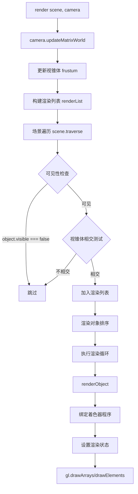

# Three.js 核心知识体系

## 第 1 章 基础认知：Web 3D 与 three.js 概述

### 1.1 WebGL 与浏览器 3D 渲染基础

#### 1.1.1 什么是 WebGL

**概念定义**：WebGL（Web Graphics Library）是一个 JavaScript API，可在任何兼容的 Web 浏览器中渲染高性能的交互式 3D 和 2D 图形，而无需使用插件。WebGL 通过引入一个与 OpenGL ES 2.0 非常一致的 API，使开发者可以直接跟 GPU 进行通信。

**核心特性**：
- **免插件**：原生集成于现代浏览器
- **硬件加速**：直接利用 GPU 进行图形计算
- **跨平台**：在桌面和移动浏览器中均可运行
- **基于着色器**：使用 GLSL（OpenGL Shading Language）编写顶点着色器和片元着色器

**来源**：https://blog.csdn.net/weixin_42508580/article/details/133669642

#### 1.1.2 WebGL 渲染管线

WebGL 程序分为两部分：
1. **CPU 端**：使用 JavaScript 编写，负责准备数据、调用 WebGL API
2. **GPU 端**：使用 GLSL 编写着色器程序，负责顶点变换和像素着色

**完整渲染流程**：

```
┌─────────────────────────────────────────────────────────────────┐
│                    WebGL 渲染管线                               │
├─────────────────────────────────────────────────────────────────┤
│  1. 准备顶点数据 → 2. 初始化 WebGL → 3. 编写着色器                │
│         ↓                ↓                  ↓                   │
│  TypedArray       createBuffer()      vertexShader              │
│  (Float32Array)   bindBuffer()        fragmentShader            │
│         ↓                ↓                  ↓                   │
│  4. 编译链接 → 5. 绑定属性 → 6. 绘制调用                         │
│         ↓                ↓                  ↓                   │
│  compileShader()  vertexAttribPointer()  drawArrays()           │
│  linkProgram()    enableVertexAttribArray() drawElements()      │
│         ↓                                                       │
│  7. GPU 执行：顶点着色器 → 光栅化 → 片元着色器 → 帧缓冲            │
└─────────────────────────────────────────────────────────────────┘
```

**来源**：https://download.csdn.net/blog/column/12873021/144992118、https://blog.csdn.net/PixelFlow/article/details/155910384

#### 1.1.3 着色器基础

**顶点着色器（Vertex Shader）**：处理每个顶点的位置变换
```glsl
// 顶点着色器示例
attribute vec2 a_position;  // 输入：顶点位置
void main() {
    gl_Position = vec4(a_position, 0.0, 1.0);  // 输出：裁剪坐标
}
```

**片元着色器（Fragment Shader）**：计算每个像素的最终颜色
```glsl
// 片元着色器示例
void main() {
    gl_FragColor = vec4(1.0, 0.0, 0.0, 1.0);  // 输出：红色
}
```

**来源**：https://download.csdn.net/blog/column/12873021/144992118

---

### 1.2 three.js 的定位与核心价值

#### 1.2.1 官方定义

**three.js** 是一个易于使用、轻量级、跨浏览器的通用 3D 库，当前版本包含 WebGL 和 WebGPU 渲染器，SVG 和 CSS3D 渲染器作为附加组件提供。

**来源**：https://blog.csdn.net/m0_55049655/article/details/155012925

#### 1.2.2 核心价值主张

| 问题 | three.js 解决方案 |
|------|------------------|
| WebGL API 过于底层复杂 | 提供高级封装，屏蔽 GLSL 和 WebGL 细节 |
| 手动管理顶点缓冲区和着色器 | 内置几何体、材质系统，开箱即用 |
| 场景管理和对象层级繁琐 | 基于 Object3D 的场景图系统 |
| 数学库和变换计算复杂 | 内置 Vector3、Matrix4、Quaternion 等数学工具 |

#### 1.2.3 应用场景

| 应用领域 | 使用优势 | 典型用例 |
|----------|----------|----------|
| 数据可视化 | 支持动态 3D 图表与空间映射 | 大屏数据展示、地理信息可视化 |
| 建筑预览 | 实现真实光照与材质模拟 | VR 看房、建筑漫游 |
| 在线教育 | 提供可交互的三维教学模型 | 虚拟实验室、3D 模型展示 |
| 游戏开发 | 完整的 3D 引擎能力 | Web 游戏、互动体验 |
| 数字孪生 | 实时渲染与物理仿真 | 工业监控、设备可视化 |

**来源**：https://blog.csdn.net/InstrWander/article/details/153125326、https://cloud.tencent.com/developer/article/2116218

---

### 1.3 three.js 核心架构概览

#### 1.3.1 组件结构

```
three.js 组成
├── 渲染器 Renderer
│   ├── WebGLRenderer（核心）
│   └── WebGPURenderer（新）
├── 场景 Scene
│   ├── 场景图 (Object3D 树)
│   └── 环境/雾
├── 相机 Camera
│   ├── PerspectiveCamera（透视）
│   └── OrthographicCamera（正交）
├── 对象 Object3D
│   ├── Mesh（网格）
│   ├── Line（线）
│   ├── Points（点）
│   └── Group（组）
├── 几何 Geometry
│   └── BufferGeometry（核心）
├── 材质 Material
│   ├── 基础材质
│   ├── PBR 材质
│   └── Shader 材质
├── 纹理 Texture
├── 光照 Light
├── 加载器 Loader
├── 动画 Animation
├── 控件 Controls（addons）
├── 后处理 Postprocessing（addons）
└── 辅助 Helpers
```

**来源**：https://blog.csdn.net/qq_44470322/article/details/154829671

#### 1.3.2 三大基石：Scene、Camera、Renderer

```javascript
// 1. 创建场景 - 所有 3D 对象的容器
const scene = new THREE.Scene();
scene.background = new THREE.Color(0x000000);

// 2. 创建透视相机 - 定义观察视角
const camera = new THREE.PerspectiveCamera(
    75,                                    // 视野角度 (FOV)
    window.innerWidth / window.innerHeight, // 宽高比
    0.1,                                   // 近裁剪面
    1000                                   // 远裁剪面
);
camera.position.z = 5;

// 3. 创建 WebGL 渲染器 - 负责最终渲染
const renderer = new THREE.WebGLRenderer({ 
    antialias: true  // 启用抗锯齿
});
renderer.setSize(window.innerWidth, window.innerHeight);
document.body.appendChild(renderer.domElement);
```

**来源**：https://threejs.org/docs/、https://cloud.tencent.com/developer/article/2504188

---

### 1.4 完整可运行示例

#### 1.4.1 旋转立方体

```html
<!DOCTYPE html>
<html lang="zh-CN">
<head>
    <meta charset="UTF-8">
    <title>Three.js 基础示例 - 旋转立方体</title>
    <style>
        body { margin: 0; overflow: hidden; }
        canvas { display: block; }
    </style>
</head>
<body>
    <script src="https://cdnjs.cloudflare.com/ajax/libs/three.js/r128/three.min.js"></script>
    <script>
        // 初始化场景
        const scene = new THREE.Scene();
        
        // 初始化相机
        const camera = new THREE.PerspectiveCamera(
            75, window.innerWidth / window.innerHeight, 0.1, 1000
        );
        camera.position.z = 5;
        
        // 初始化渲染器
        const renderer = new THREE.WebGLRenderer({ antialias: true });
        renderer.setSize(window.innerWidth, window.innerHeight);
        document.body.appendChild(renderer.domElement);
        
        // 创建几何体（立方体）和材质
        const geometry = new THREE.BoxGeometry();
        const material = new THREE.MeshBasicMaterial({ color: 0x00ff00 });
        const cube = new THREE.Mesh(geometry, material);
        scene.add(cube);
        
        // 动画循环
        function animate() {
            requestAnimationFrame(animate);
            
            // 每帧更新立方体旋转状态
            cube.rotation.x += 0.01;
            cube.rotation.y += 0.01;
            
            // 渲染场景
            renderer.render(scene, camera);
        }
        
        animate();
        
        // 响应窗口大小变化
        window.addEventListener('resize', () => {
            camera.aspect = window.innerWidth / window.innerHeight;
            camera.updateProjectionMatrix();
            renderer.setSize(window.innerWidth, window.innerHeight);
        });
    </script>
</body>
</html>
```

**来源**：https://blog.csdn.net/QuickSolve/article/details/153124831、https://cloud.tencent.com/developer/article/2504188

---

### 1.5 常见误区

#### 误区 1：three.js 就是 WebGL

**错误认知**：认为 three.js 和 WebGL 是同一技术。

**正确理解**：
- **WebGL** 是底层图形 API，直接操作 GPU
- **three.js** 是基于 WebGL 的高级封装库
- 使用 three.js 可以不写任何 WebGL 或 GLSL 代码

#### 误区 2：相机 FOV 越大越好

**错误认知**：认为视野角度（FOV）越大，能看到的越多。

**正确理解**：
- FOV 过大会导致画面畸变（鱼眼效果）
- 推荐值：50-75 度之间
- 游戏常用：60-70 度；建筑可视化常用：45-55 度

#### 误区 3：渲染器尺寸可以随意设置

**错误认知**：不处理窗口 resize 事件，导致 canvas 模糊或变形。

**正确做法**：
```javascript
window.addEventListener('resize', () => {
    // 更新相机宽高比
    camera.aspect = window.innerWidth / window.innerHeight;
    camera.updateProjectionMatrix();
    
    // 更新渲染器尺寸
    renderer.setSize(window.innerWidth, window.innerHeight);
    renderer.setPixelRatio(window.devicePixelRatio);
});
```

**来源**：https://blog.csdn.net/weixin_42508580/article/details/133669642

---

## 第 2 章 核心工作原理：渲染管线与架构设计

### 2.1 场景图（Scene Graph）架构

#### 2.1.1 概念定义

**场景图**是 three.js 中用于管理 3D 对象的树状层级结构。所有 3D 对象都继承自 `Object3D` 基类，通过父子关系组织成一个树形结构。

**核心特性**：
- **层级变换继承**：子对象继承父对象的 position、rotation、scale
- **高效遍历**：通过 `traverse()` 方法可以快速访问所有子对象
- **批量操作**：可以对整个分支进行统一变换

**来源**：https://blog.csdn.net/qq_34419312/article/details/149811807

#### 2.1.2 Object3D 树结构

```
Scene (根节点)
├── Camera
│   └── (可附加到移动平台)
├── DirectionalLight
├── Group (汽车组)
│   ├── Mesh (车身)
│   ├── Mesh (车轮 1)
│   ├── Mesh (车轮 2)
│   └── Mesh (车轮 3)
└── Mesh (地面)
```

#### 2.1.3 代码示例：使用 Group 组织对象

```javascript
import * as THREE from 'three';

const scene = new THREE.Scene();

// 创建汽车组 - 作为单一实体操作
const carGroup = new THREE.Group();
scene.add(carGroup);

// 车身
const bodyGeo = new THREE.BoxGeometry(2, 0.5, 1);
const bodyMat = new THREE.MeshBasicMaterial({ color: 0xff0000 });
const body = new THREE.Mesh(bodyGeo, bodyMat);
carGroup.add(body);

// 车轮
const wheelGeo = new THREE.CylinderGeometry(0.3, 0.3, 0.2, 16);
wheelGeo.rotateZ(Math.PI / 2); // 旋转 90 度使其立起
const wheelMat = new THREE.MeshBasicMaterial({ color: 0x333333 });

const wheel1 = new THREE.Mesh(wheelGeo, wheelMat);
wheel1.position.set(0.7, -0.3, 0.5);
carGroup.add(wheel1);

const wheel2 = wheel1.clone();
wheel2.position.z = -0.5;
carGroup.add(wheel2);

// 移动整个汽车组 - 所有子对象同步移动
carGroup.position.x = -3;
carGroup.rotation.y = Math.PI / 4;
```

**关键点**：Group 允许将多个对象作为单一实体操作，大幅简化复杂对象的变换控制。

**来源**：https://blog.csdn.net/qq_34419312/article/details/149811807

#### 2.1.4 场景图遍历

```javascript
// 遍历场景中的所有对象
scene.traverse((object) => {
    if (object.isMesh) {
        // 对所有网格对象执行操作
        object.castShadow = true;
        object.receiveShadow = true;
    }
});

// 按条件查找
const meshes = scene.children.filter(child => child.isMesh);

// 递归查找（使用 getChildByName 或自定义递归）
const target = scene.getObjectByName('myMesh');
```

---

### 2.2 渲染循环（Render Loop）

#### 2.2.1 requestAnimationFrame 机制

**概念定义**：`requestAnimationFrame` 是浏览器提供的动画 API，它会在下一次重绘前调用指定的回调函数，通常以 60fps 的频率执行。

**工作原理**：
1. 浏览器检测屏幕刷新率（通常 60Hz）
2. 在每次刷新前，自动调用注册的回调函数
3. 当标签页不可见时，自动暂停以节省资源

**来源**：https://blog.csdn.net/QuickSolve/article/details/153124831

#### 2.2.2 基础渲染循环

```javascript
function animate() {
    // 1. 请求下一帧
    requestAnimationFrame(animate);
    
    // 2. 更新场景状态
    cube.rotation.x += 0.01;
    cube.rotation.y += 0.01;
    
    // 3. 执行渲染
    renderer.render(scene, camera);
}

// 启动循环
animate();
```

#### 2.2.3 进阶：基于时间的动画

```javascript
let lastTime = 0;

function animate(time) {
    requestAnimationFrame(animate);
    
    // 计算时间增量（秒）
    const deltaTime = (time - lastTime) / 1000;
    lastTime = time;
    
    // 使用 deltaTime 确保动画速度一致
    cube.rotation.x += deltaTime * 0.5;  // 每秒旋转 0.5 弧度
    cube.rotation.y += deltaTime * 0.3;
    
    renderer.render(scene, camera);
}

animate(0);
```

#### 2.2.4 按需渲染（性能优化）

对于静态场景或交互驱动的场景，可以避免连续渲染：

```javascript
let needsRender = true;

function animate() {
    if (needsRender) {
        requestAnimationFrame(animate);
        renderer.render(scene, camera);
        needsRender = false;
    }
}

// 交互触发渲染
controls.addEventListener('change', () => {
    needsRender = true;
    animate();
});
```

---

### 2.3 WebGLRenderer 渲染管线

#### 2.3.1 渲染器架构

**WebGLRenderer** 是 three.js 的核心渲染引擎，负责将 3D 场景转换为 2D 像素。

**关键子模块**：

| 模块 | 源码路径 | 职责 |
|------|----------|------|
| WebGLRenderer | `src/renderers/WebGLRenderer.js` | 渲染器核心实现 |
| WebGLPrograms | `src/renderers/webgl/WebGLPrograms.js` | 着色器程序管理 |
| WebGLState | `src/renderers/webgl/WebGLState.js` | 渲染状态控制 |
| WebGLRenderLists | `src/renderers/webgl/WebGLRenderLists.js` | 渲染列表管理 |

**来源**：https://blog.csdn.net/gitblog_00340/article/details/152033893

#### 2.3.2 标准渲染流程



**核心渲染逻辑**（源码简化）：

```javascript
render: function(scene, camera) {
    // 1. 视锥体更新
    camera.updateMatrixWorld();
    _projScreenMatrix.multiplyMatrices(
        camera.projectionMatrix,
        camera.matrixWorldInverse
    );
    _frustum.setFromProjectionMatrix(_projScreenMatrix);
    
    // 2. 构建渲染列表
    const renderList = this.renderLists.get(scene, camera);
    renderList.init();
    
    // 3. 场景遍历与可见性检查
    scene.traverse((object) => {
        if (object.visible === false) return;
        if (object.isMesh || object.isLine || object.isPoints) {
            if (_frustum.intersectsObject(object)) {
                renderList.push(object);
            }
        }
    });
    
    // 4. 排序渲染对象
    renderList.sort();
    
    // 5. 执行渲染
    this.state.setCullFace(gl.BACK);
    this.state.enable(gl.DEPTH_TEST);
    
    for (let i = 0, l = renderList.length; i < l; i++) {
        const renderItem = renderList[i];
        this.renderObject(renderItem.object, scene, camera);
    }
}
```

**来源**：https://blog.csdn.net/gitblog_00340/article/details/152033893

#### 2.3.3 渲染状态管理

```javascript
// 渲染器初始化配置
const renderer = new THREE.WebGLRenderer({
    antialias: true,           // 抗锯齿（MSAA）
    alpha: true,               // 透明背景
    depth: true,               // 深度缓冲
    stencil: false,            // 模板缓冲
    preserveDrawingBuffer: false, // 保留绘图缓冲（用于截图）
    powerPreference: 'high-performance' // GPU 性能偏好
});

// 渲染状态设置
renderer.setClearColor(0x000000, 1);  // 清除颜色和透明度
renderer.setPixelRatio(window.devicePixelRatio);  // 像素比
renderer.setSize(width, height, false);  // false = 不更新 canvas 样式
```

---

### 2.4 缓冲几何体与 GPU 数据传输

#### 2.4.1 BufferGeometry 核心概念

**概念定义**：`BufferGeometry` 是 three.js 中几何体的高效表示方式，使用**类型化数组**（TypedArray）存储顶点数据，直接对应 WebGL 的 `gl.bufferData`，实现高效的 GPU 数据传输。

**为什么需要 BufferGeometry**：
- **性能优势**：类型化数组直接在内存中连续存储，避免 JavaScript 数组的对象开销
- **GPU 友好**：数据格式与 GPU 显存布局一致，零拷贝传输
- **内存效率**：相比旧版 Geometry，内存占用减少 50%+

**来源**：https://www.cnblogs.com/ljbguanli/p/19623452、https://cloud.tencent.com/developer/article/2276784

#### 2.4.2 核心术语

| 术语 | 定义 | 示例 |
|------|------|------|
| **顶点 (Vertex)** | 3D 空间中的一个点，由 X/Y/Z 三个坐标值组成 | `(0, 0, 0)` |
| **类型化数组** | 专门用于存储顶点数据的数组，比普通数组更节省内存、GPU 读取更快 | `Float32Array` |
| **BufferAttribute** | three.js 对「类型化数组」的封装，告诉 three.js「数组中的数据如何分组解析」 | `new BufferAttribute(vertices, 3)` |
| **属性 (Attribute)** | 几何体的「数据维度」，如 position、color、uv、normal 等 | `position`、`normal` |

**来源**：https://www.cnblogs.com/ljbguanli/p/19623452

#### 2.4.3 GPU 数据传输流程

```
┌─────────────────────────────────────────────────────────────────┐
│              GPU 数据传输流程                                    │
├─────────────────────────────────────────────────────────────────┤
│  JavaScript TypedArray                                        │
│         ↓ (封装)                                                │
│  BufferAttribute (vertex position / normal / uv / color)       │
│         ↓ (上传)                                                │
│  WebGLBuffer (gl.createBuffer + gl.bufferData)                 │
│         ↓ (绑定)                                                │
│  GPU 显存 (VRAM)                                                │
│         ↓ (着色器访问)                                           │
│  顶点着色器读取 attribute 数据                                    │
└─────────────────────────────────────────────────────────────────┘
```

**来源**：https://threejs.org/docs/#api/en/core/BufferGeometry

#### 2.4.4 基础使用流程

```javascript
import * as THREE from 'three';

// 步骤 1: 创建空的 BufferGeometry 容器
const geometry = new THREE.BufferGeometry();

// 步骤 2: 定义顶点数据（类型化数组）
// 顶点坐标数据：每 3 个值为一组 (X, Y, Z)，表示一个顶点的 3D 坐标
// 示例：6 个顶点，对应 2 个三角形（Mesh 默认按三角面渲染）
const vertices = new Float32Array([
    0, 0, 0,     // 顶点 1: (0, 0, 0)
    50, 0, 0,    // 顶点 2: (50, 0, 0)
    0, 50, 0,    // 顶点 3: (0, 50, 0)
    
    0, 0, 0,     // 顶点 4: (0, 0, 0) - 第二个三角形
    0, 50, 0,    // 顶点 5: (0, 50, 0)
    50, 50, 0    // 顶点 6: (50, 50, 0)
]);

// 步骤 3: 创建属性缓冲区对象
// 参数 2 (itemSize = 3) 表示每 3 个值为一组，解析为一个顶点的 XYZ 坐标
const positionAttribute = new THREE.BufferAttribute(vertices, 3);

// 步骤 4: 将属性添加到几何体
geometry.setAttribute('position', positionAttribute);

// 步骤 5: 创建材质和网格
const material = new THREE.MeshBasicMaterial({ 
    color: 0x00ff00,
    side: THREE.DoubleSide  // 双面渲染
});
const mesh = new THREE.Mesh(geometry, material);
scene.add(mesh);
```

**来源**：https://www.cnblogs.com/ljbguanli/p/19623452、https://cloud.tencent.com/developer/article/2276784

#### 2.4.5 常用顶点属性

```javascript
const geometry = new THREE.BufferGeometry();

// 1. 位置属性 (position) - 必需
const positions = new Float32Array([
    x1, y1, z1,
    x2, y2, z2,
    // ...
]);
geometry.setAttribute('position', new THREE.BufferAttribute(positions, 3));

// 2. 法线属性 (normal) - 光照计算必需
const normals = new Float32Array([
    nx1, ny1, nz1,
    nx2, ny2, nz2,
    // ...
]);
geometry.setAttribute('normal', new THREE.BufferAttribute(normals, 3));

// 3. UV 属性 (uv) - 纹理映射必需（每 2 个值一组：U, V）
const uvs = new Float32Array([
    u1, v1,
    u2, v2,
    // ...
]);
geometry.setAttribute('uv', new THREE.BufferAttribute(uvs, 2));

// 4. 颜色属性 (color) - 顶点着色必需
const colors = new Float32Array([
    r1, g1, b1,
    r2, g2, b2,
    // ...
]);
geometry.setAttribute('color', new THREE.BufferAttribute(colors, 3));

// 5. 索引属性 (index) - 可选，用于优化
const indices = new Uint16Array([
    0, 1, 2,  // 第一个三角形
    0, 2, 3   // 第二个三角形
]);
geometry.setIndex(new THREE.BufferAttribute(indices, 1));
```

**来源**：https://threejs.org/docs/#api/en/core/BufferGeometry

#### 2.4.6 BufferAttribute 类型对照表

| 类名 | 字节大小 | 对应 GLSL 类型 | 适用场景 |
|------|---------|---------------|---------|
| `Int8BufferAttribute` | 1 字节 | `int` | 骨骼权重（有符号） |
| `Uint8BufferAttribute` | 1 字节 | `uint` / `vec4`（归一化） | 颜色、索引 |
| `Int16BufferAttribute` | 2 字节 | `int` | 骨骼索引 |
| `Uint16BufferAttribute` | 2 字节 | `uint` | 中等模型索引 |
| `Int32BufferAttribute` | 4 字节 | `int` | 大索引值 |
| `Uint32BufferAttribute` | 4 字节 | `uint` | 超大模型索引 |
| `Float16BufferAttribute` | 2 字节 | `float`（半精度） | 节省内存 |
| `Float32BufferAttribute` | 4 字节 | `float` / `vec3` / `vec4` | 位置、法线、UV |

**来源**：https://threejs.org/docs/#api/en/core/BufferGeometry

#### 2.4.7 动态更新顶点数据

```javascript
// 在动画循环中更新顶点位置
function animate() {
    requestAnimationFrame(animate);
    
    const positions = geometry.attributes.position.array;
    const time = Date.now() * 0.001;
    
    // 更新顶点 Y 坐标（波浪效果）
    for (let i = 0; i < positions.length; i += 3) {
        positions[i + 1] += Math.sin(time + positions[i]) * 0.01;
    }
    
    // 关键：标记需要更新，three.js 会在下次渲染时同步到 GPU
    geometry.attributes.position.needsUpdate = true;
    
    renderer.render(scene, camera);
}
```

**关键点**：必须设置 `needsUpdate = true`，否则 GPU 不会同步最新的 CPU 端数据。

**来源**：https://threejs.org/docs/#api/en/core/BufferGeometry

#### 2.4.8 InterleavedBuffer（交错缓冲区）

当多个属性共享相同的顶点索引时，可以使用交错缓冲区优化内存布局：

```javascript
// 传统方式： separate buffers
// position: [x1, y1, z1, x2, y2, z2, ...]
// uv:       [u1, v1, u2, v2, ...]

// 交错方式：interleaved buffer
// data: [x1, y1, z1, u1, v1, x2, y2, z2, u2, v2, ...]

const stride = 5; // 3 (位置) + 2 (UV)
const data = new Float32Array(vertexCount * stride);

for (let i = 0; i < vertexCount; i++) {
    const offset = i * stride;
    data[offset + 0] = x;  // position.x
    data[offset + 1] = y;  // position.y
    data[offset + 2] = z;  // position.z
    data[offset + 3] = u;  // uv.x
    data[offset + 4] = v;  // uv.y
}

const interleavedBuffer = new THREE.InterleavedBuffer(data, stride);

geometry.setAttribute('position', 
    new THREE.InterleavedBufferAttribute(interleavedBuffer, 3, 0));
geometry.setAttribute('uv', 
    new THREE.InterleavedBufferAttribute(interleavedBuffer, 2, 3));
```

**优势**：
- **缓存友好**：顶点数据连续存储，GPU 读取更高效
- **内存减少**：避免多个独立缓冲区的开销

**来源**：https://threejs.org/docs/#api/en/core/BufferGeometry

---

### 2.5 完整示例：自定义几何体

```javascript
import * as THREE from 'three';

/**
 * 创建自定义六边形几何体
 * 使用 BufferGeometry + 索引缓冲
 */
function createHexagonGeometry(radius = 1) {
    const geometry = new THREE.BufferGeometry();
    
    // 六边形顶点（中心 + 6 个外围顶点）
    const vertices = [];
    
    // 中心点
    vertices.push(0, 0, 0);
    
    // 6 个外围顶点
    for (let i = 0; i < 6; i++) {
        const angle = (i / 6) * Math.PI * 2;
        vertices.push(
            Math.cos(angle) * radius,
            Math.sin(angle) * radius,
            0
        );
    }
    
    // 索引（6 个三角形，共享中心顶点）
    const indices = [];
    for (let i = 0; i < 6; i++) {
        indices.push(0, i + 1, i + 2);
    }
    // 闭合最后一个三角形
    indices[indices.length - 1] = 1;
    
    // 设置属性
    geometry.setAttribute('position', 
        new THREE.Float32BufferAttribute(vertices, 3));
    geometry.setIndex(indices);
    
    // 计算法线（用于光照）
    geometry.computeVertexNormals();
    
    return geometry;
}

// 使用示例
const hexGeometry = createHexagonGeometry(1);
const material = new THREE.MeshStandardMaterial({ 
    color: 0xffd700,
    side: THREE.DoubleSide
});
const hexagon = new THREE.Mesh(hexGeometry, material);
scene.add(hexagon);
```

---

### 2.6 常见误区

#### 误区 1：BufferGeometry 可以直接修改 array

**错误做法**：
```javascript
const positions = geometry.attributes.position.array;
positions[0] = 10;  // 修改了数据，但 GPU 不会更新
```

**正确做法**：
```javascript
const positions = geometry.attributes.position.array;
positions[0] = 10;
geometry.attributes.position.needsUpdate = true;  // 必须标记
```

#### 误区 2：使用普通数组存储顶点数据

**错误做法**：
```javascript
const vertices = [0, 0, 0, 1, 0, 0, 0, 1, 0];  // 普通数组
geometry.setAttribute('position', new THREE.BufferAttribute(vertices, 3));
// 会报错或渲染异常
```

**正确做法**：
```javascript
const vertices = new Float32Array([0, 0, 0, 1, 0, 0, 0, 1, 0]);  // 类型化数组
geometry.setAttribute('position', new THREE.BufferAttribute(vertices, 3));
```

#### 误区 3：忽略 itemSize 参数

**错误理解**：认为 itemSize 是可选的或可以随意设置。

**正确理解**：itemSize 必须是 2、3 或 4，对应 GLSL 的 vec2、vec3、vec4：
- `position` → itemSize = 3（XYZ）
- `uv` → itemSize = 2（UV）
- `normal` → itemSize = 3（XYZ）
- `color` → itemSize = 3 或 4（RGB 或 RGBA）

#### 误区 4：不使用索引缓冲

**问题**：对于共享顶点的几何体，不使用索引会导致顶点数据重复。

**优化前**（无索引）：
```javascript
// 两个三角形共享一条边，顶点重复
const vertices = new Float32Array([
    0, 0, 0,  1, 0, 0,  0, 1, 0,   // 三角形 1
    0, 0, 0,  0, 1, 0,  1, 1, 0    // 三角形 2 - (0,0,0) 和 (0,1,0) 重复
]);
```

**优化后**（使用索引）：
```javascript
// 4 个唯一点 + 索引
const vertices = new Float32Array([
    0, 0, 0,  1, 0, 0,  0, 1, 0,  1, 1, 0
]);
const indices = new Uint16Array([0, 1, 2, 0, 2, 3]);
geometry.setIndex(indices);
```

**来源**：https://threejs.org/docs/#api/en/core/BufferGeometry、https://www.cnblogs.com/ljbguanli/p/19623452

---

## 参考资料

1. **three.js 官方文档** - https://threejs.org/docs/
2. **three.js 官方手册** - https://threejs.org/manual/
3. **WebGL 渲染管线基础** - https://download.csdn.net/blog/column/12873021/144992118
4. **BufferGeometry 详解** - https://www.cnblogs.com/ljbguanli/p/19623452
5. **three.js 渲染管线定制** - https://blog.csdn.net/gitblog_00340/article/details/152033893
6. **WebGL 着色器编程** - https://blog.csdn.net/FuncLens/article/details/153269478

---

## 下一章预告

第 3 章将深入探讨 **几何体与材质系统**，包括：
- 内置几何体类型与使用场景
- 材质类型详解（Basic、Lambert、Phong、Standard）
- 纹理加载与 UV 映射
- 自定义 ShaderMaterial
