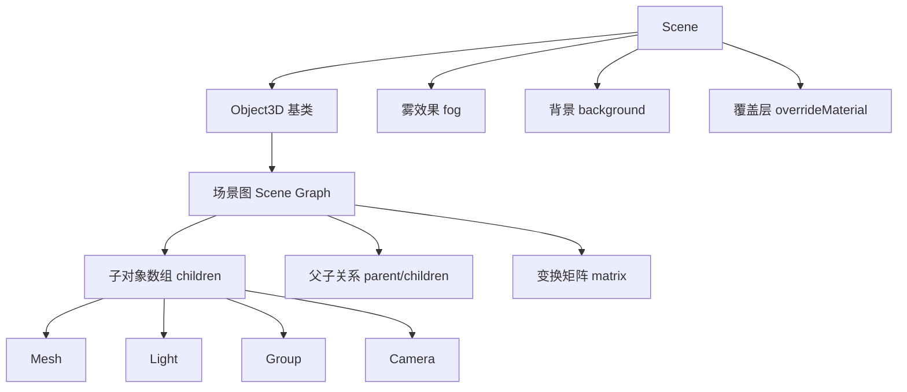
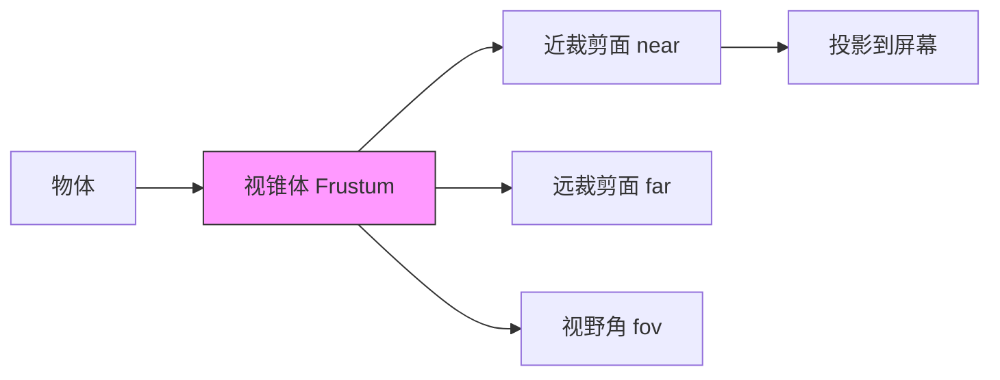
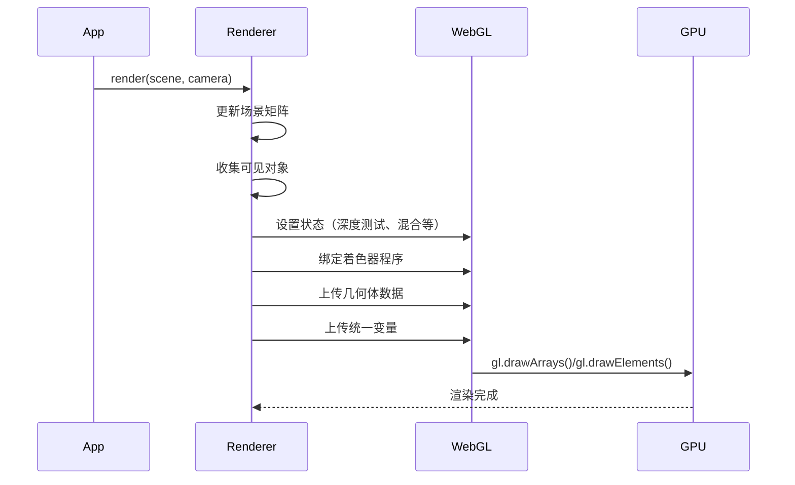
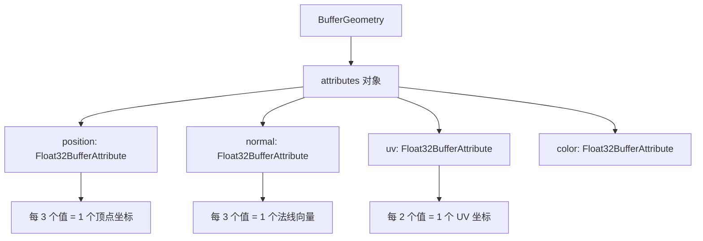
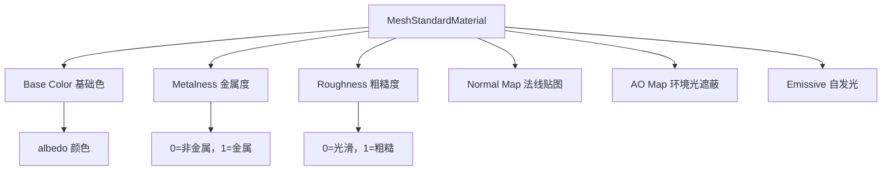

# Three.js 核心知识体系：第 3-5 章

> **调研来源说明：**
> - 主要来源：three.js 官方文档 (https://threejs.org/docs/)
> - 辅助来源：three.js 示例代码 (https://threejs.org/examples/)
> - 交叉验证：GitHub 源码、社区教程

---

## 第 3 章：核心 API 详解：场景、相机、渲染器

### 3.1 Scene（场景）

#### 3.1.1 概念定义

**是什么：** Scene 是 three.js 中所有 3D 对象的容器，类似于舞台或电影场景。所有的 Mesh（网格）、Light（光源）、Camera（相机）等对象都必须添加到场景中才能被渲染。

**为什么需要：** Scene 提供了一个统一的坐标空间和管理系统，负责：
- 组织和管理场景图（Scene Graph）中的所有对象
- 处理对象的层级关系和变换继承
- 管理雾效果（Fog）和背景（Background）
- 作为渲染器的输入，告诉渲染器"渲染什么"

#### 3.1.2 工作原理



**场景图（Scene Graph）：** Scene 继承自 Object3D，内部维护一个树形结构：
- 每个节点可以有多个子节点（children 数组）
- 每个节点最多一个父节点（parent 引用）
- 父节点的变换（位置、旋转、缩放）会自动传递给子节点
- 渲染时通过递归遍历场景图收集所有可见对象

#### 3.1.3 核心 API

```javascript
import * as THREE from 'three';

// 创建场景
const scene = new THREE.Scene();

// 常用属性
scene.background = new THREE.Color(0x000000);  // 背景颜色
scene.fog = new THREE.Fog(0x000000, 1, 100);   // 雾效果

// 添加对象
const cube = new THREE.Mesh(geometry, material);
scene.add(cube);

// 移除对象
scene.remove(cube);

// 获取对象
const objById = scene.getObjectById(id);
const objByName = scene.getObjectByName('name');

// 射线检测（判断点击位置是否有对象）
const raycaster = new THREE.Raycaster();
const intersects = raycaster.intersectObjects(scene.children);
```

**关键属性详解：**

| 属性 | 类型 | 说明 |
|------|------|------|
| `background` | Color/Texture | 场景背景，可以是颜色或立方体贴图 |
| `fog` | Fog/FogExp2 | 雾效果，Fog 线性雾，FogExp2 指数雾 |
| `children` | Array | 所有直接子对象的数组 |
| `autoUpdate` | Boolean | 是否自动更新矩阵，默认 true |
| `overrideMaterial` | Material | 覆盖所有对象的材质（调试用） |

#### 3.1.4 常见误区

**❌ 误区 1：场景只能有一个**
```javascript
// 错误理解：只能有一个 scene
const scene = new THREE.Scene();

// ✅ 正确：可以创建多个场景，用于不同视图或 LOD
const mainScene = new THREE.Scene();
const miniMapScene = new THREE.Scene();
```

**❌ 误区 2：移除对象后内存自动释放**
```javascript
// ❌ 仅调用 remove() 不会释放 GPU 内存
scene.remove(mesh);

// ✅ 正确做法：手动释放几何体和材质
mesh.geometry.dispose();
mesh.material.dispose();
scene.remove(mesh);
```

---

### 3.2 Camera（相机）

#### 3.2.1 概念定义

**是什么：** Camera 是从哪个视角观察场景的抽象，决定了 3D 世界如何投影到 2D 屏幕上。

**为什么需要：** 没有相机就无法"看到"场景。相机类型决定了视觉效果：
- **PerspectiveCamera（透视相机）：** 近大远小，符合人眼视觉
- **OrthographicCamera（正交相机）：** 等比例投影，无透视变形

#### 3.2.2 透视相机工作原理



**视锥体（Frustum）：** 相机可见的区域，形状如截断的金字塔：
- **fov（Field of View）：** 垂直视野角度，通常 45-75 度
- **aspect：** 宽高比，通常为 canvas.width / canvas.height
- **near：** 近裁剪面，小于此距离的物体不可见
- **far：** 远裁剪面，大于此距离的物体不可见

#### 3.2.3 核心 API

```javascript
import * as THREE from 'three';

// === 透视相机 ===
const camera = new THREE.PerspectiveCamera(
    75,                              // fov: 视野角度（度）
    window.innerWidth / window.innerHeight, // aspect: 宽高比
    0.1,                             // near: 近裁剪面
    1000                             // far: 远裁剪面
);
camera.position.set(0, 0, 5);        // 设置位置
camera.lookAt(0, 0, 0);              // 看向原点

// === 正交相机 ===
const orthoCamera = new THREE.OrthographicCamera(
    -10, 10,                         // left, right
    10, -10,                         // top, bottom
    0.1, 1000                        // near, far
);

// 窗口大小变化时更新
function onWindowResize() {
    camera.aspect = window.innerWidth / window.innerHeight;
    camera.updateProjectionMatrix(); // 必须调用！
    renderer.setSize(window.innerWidth, window.innerHeight);
}
```

**关键参数详解：**

| 参数 | 影响 | 推荐值 |
|------|------|--------|
| `fov` | 值越大视野越广，变形越明显 | 60-75（游戏常用） |
| `near` | 太小会导致深度精度问题 | 0.1 或 0.01 |
| `far` | 影响渲染性能和雾效果 | 根据场景大小设定 |
| `aspect` | 不正确会导致画面拉伸 | 始终与 canvas 一致 |

#### 3.2.4 常见误区

**❌ 误区 1：忘记更新投影矩阵**
```javascript
// ❌ 错误：只修改 aspect 不生效
camera.aspect = newAspect;

// ✅ 正确：必须调用 updateProjectionMatrix
camera.aspect = newAspect;
camera.updateProjectionMatrix();
```

**❌ 误区 2：near 值设置过小**
```javascript
// ❌ 问题：near=0.001 会导致深度冲突（z-fighting）
const camera = new THREE.PerspectiveCamera(75, aspect, 0.001, 1000);

// ✅ 建议：尽可能大的 near 值
const camera = new THREE.PerspectiveCamera(75, aspect, 0.1, 1000);
```

---

### 3.3 WebGLRenderer（渲染器）

#### 3.3.1 概念定义

**是什么：** WebGLRenderer 是将 3D 场景渲染到 canvas 的引擎，负责：
- 创建和管理 WebGL 上下文
- 执行 WebGL 绘图命令
- 处理阴影、后期处理等高级效果

**为什么需要：** 它是 three.js 与 WebGL API 之间的桥梁，将场景、相机转换为像素。

#### 3.3.2 渲染管线工作原理



#### 3.3.3 核心 API

```javascript
import * as THREE from 'three';

// 创建渲染器
const renderer = new THREE.WebGLRenderer({
    canvas: document.querySelector('canvas'),  // 指定 canvas
    antialias: true,                           // 抗锯齿
    alpha: true,                               // 支持透明
    precision: 'highp',                        // 精度
    powerPreference: 'high-performance'        // 性能偏好
});

// 基本设置
renderer.setSize(window.innerWidth, window.innerHeight);
renderer.setPixelRatio(Math.min(window.devicePixelRatio, 2)); // 限制 DPR
renderer.setClearColor(0x000000, 1);  // 背景色和透明度

// 阴影配置
renderer.shadowMap.enabled = true;
renderer.shadowMap.type = THREE.PCFSoftShadowMap;

// 颜色空间（three.js r152+）
renderer.outputColorSpace = THREE.SRGBColorSpace;

// 渲染循环
function animate() {
    requestAnimationFrame(animate);
    renderer.render(scene, camera);
}
animate();

// 清理资源
renderer.dispose();
renderer.forceContextLoss();
```

**重要选项详解：**

| 选项 | 说明 | 推荐设置 |
|------|------|----------|
| `antialias` | 边缘抗锯齿 | true（性能允许时） |
| `alpha` | canvas 透明背景 | 按需 |
| `powerPreference` | GPU 偏好 | 'high-performance' |
| `shadowMap.enabled` | 启用阴影 | true（需要阴影时） |
| `shadowMap.type` | 阴影类型 | PCFSoftShadowMap |

#### 3.3.4 阴影系统配置

```javascript
// 1. 渲染器启用阴影
renderer.shadowMap.enabled = true;
renderer.shadowMap.type = THREE.PCFSoftShadowMap;

// 2. 光源启用阴影
const light = new THREE.DirectionalLight(0xffffff, 1);
light.position.set(5, 10, 5);
light.castShadow = true;

// 配置阴影质量
light.shadow.mapSize.width = 2048;   // 阴影贴图分辨率
light.shadow.mapSize.height = 2048;
light.shadow.camera.near = 0.5;
light.shadow.camera.far = 50;
light.shadow.camera.left = -10;
light.shadow.camera.right = 10;
light.shadow.camera.top = 10;
light.shadow.camera.bottom = -10;
light.shadow.bias = -0.0001;        // 阴影偏移，防止伪影

// 3. 对象配置
mesh.castShadow = true;              // 投射阴影
mesh.receiveShadow = true;           // 接收阴影
```

#### 3.3.5 常见误区

**❌ 误区 1：不限制 pixelRatio 导致性能问题**
```javascript
// ❌ 问题：高 DPI 屏幕上 performance 急剧下降
renderer.setPixelRatio(window.devicePixelRatio);  // 可能是 3 或 4

// ✅ 正确：限制最大值为 2
renderer.setPixelRatio(Math.min(window.devicePixelRatio, 2));
```

**❌ 误区 2：阴影模糊或锯齿严重**
```javascript
// 问题原因：shadow map 分辨率太低
light.shadow.mapSize.width = 512;  // 默认值，太小

// ✅ 解决：提高分辨率 + 使用软阴影
renderer.shadowMap.type = THREE.PCFSoftShadowMap;
light.shadow.mapSize.width = 2048;
light.shadow.mapSize.height = 2048;
```

**❌ 误区 3：渲染后不清理内存**
```javascript
// ❌ 问题：组件卸载时不清理，内存泄漏
function cleanup() {
    geometry.dispose();
    material.dispose();
    renderer.dispose();           // 必须调用
    renderer.forceContextLoss();  // 强制释放 WebGL 上下文
}
```

---

## 第 4 章：3D 对象构建：几何体、材质、纹理

### 4.1 BufferGeometry（缓冲几何体）

#### 4.1.1 概念定义

**是什么：** BufferGeometry 是 three.js 中表示 3D 形状数据结构的方式，使用类型化数组（Typed Arrays）高效存储顶点数据。

**为什么使用 BufferGeometry：**
- **性能优势：** 直接使用 Float32Array 等类型化数组，GPU 友好
- **内存效率：** 比 Geometry（已废弃）节省 50% 以上内存
- **灵活性：** 可以自定义任何顶点属性（位置、法线、UV、颜色等）

#### 4.1.2 数据结构原理



**顶点属性布局：**
```
position:  [x0, y0, z0, x1, y1, z1, x2, y2, z2, ...]
            ↑──────┘ ↑──────┘ ↑──────┘
            顶点 0    顶点 1    顶点 2

normal:    [nx0, ny0, nz0, nx1, ny1, nz1, ...]
            ↑───────┘ ↑───────┘
            法线 0     法线 1

uv:        [u0, v0, u1, v1, u2, v2, ...]
            ↑───┘ ↑───┘ ↑───┘
            UV0   UV1   UV2
```

#### 4.1.3 创建自定义几何体

```javascript
import * as THREE from 'three';

// 创建三角形
const geometry = new THREE.BufferGeometry();

// 定义顶点位置（9 个值 = 3 个顶点 × 3 坐标）
const positions = new Float32Array([
    // 顶点 0
    -1.0, -1.0,  0.0,
    // 顶点 1
     1.0, -1.0,  0.0,
    // 顶点 2
     0.0,  1.0,  0.0
]);

// 定义法线（每个顶点一个法线）
const normals = new Float32Array([
    0.0, 0.0, 1.0,  // 顶点 0 法线
    0.0, 0.0, 1.0,  // 顶点 1 法线
    0.0, 0.0, 1.0   // 顶点 2 法线
});

// 定义 UV 坐标
const uvs = new Float32Array([
    0.0, 0.0,  // 顶点 0 UV
    1.0, 0.0,  // 顶点 1 UV
    0.5, 1.0   // 顶点 2 UV
]);

// 添加属性
geometry.setAttribute('position', new THREE.BufferAttribute(positions, 3));
geometry.setAttribute('normal', new THREE.BufferAttribute(normals, 3));
geometry.setAttribute('uv', new THREE.BufferAttribute(uvs, 2));

// 可选：定义索引（用于顶点复用）
// const indices = new Uint16Array([0, 1, 2]);
// geometry.setIndex(new THREE.BufferAttribute(indices, 1));
```

#### 4.1.4 内置几何体类型

| 几何体 | 用途 | 关键参数 |
|--------|------|----------|
| `BoxGeometry` | 立方体 | width, height, depth, widthSegments, heightSegments, depthSegments |
| `SphereGeometry` | 球体 | radius, widthSegments, heightSegments, phiStart, phiLength, thetaStart, thetaLength |
| `PlaneGeometry` | 平面 | width, height, widthSegments, heightSegments |
| `CylinderGeometry` | 圆柱 | radiusTop, radiusBottom, height, radialSegments |
| `ConeGeometry` | 圆锥 | radius, height, radialSegments |
| `TorusGeometry` | 圆环 | radius, tube, radialSegments, tubularSegments, arc |
| `CircleGeometry` | 圆形 | radius, segments, thetaStart, thetaLength |
| `CapsuleGeometry` | 胶囊体 | radius, length, capSegments, radialSegments |

```javascript
// 示例：创建细分球体
const sphere = new THREE.SphereGeometry(
    1,      // radius
    32,     // widthSegments（横向分段，越多越圆）
    32,     // heightSegments（纵向分段）
    0,      // phiStart（起始角度）
    Math.PI * 2,  // phiLength（水平覆盖角度）
    0,      // thetaStart（垂直起始角度）
    Math.PI       // thetaLength（垂直覆盖角度）
);
```

#### 4.1.5 常见误区

**❌ 误区 1：忘记计算法线导致光照异常**
```javascript
// ❌ 问题：自定义几何体没有法线，光照不起作用
const geometry = new THREE.BufferGeometry();
geometry.setAttribute('position', positions);

// ✅ 解决：手动计算法线
geometry.computeVertexNormals();
```

**❌ 误区 2：不释放几何体内存**
```javascript
// ❌ 问题：组件卸载时不释放
scene.remove(mesh);

// ✅ 正确：释放 GPU 内存
mesh.geometry.dispose();
scene.remove(mesh);
```

---

### 4.2 材质系统（Materials）

#### 4.2.1 材质类型总览

three.js 提供 35+ 种材质类型，分为以下几类：

**标准网格材质（最常用）：**
| 材质 | 特点 | 用途 |
|------|------|------|
| `MeshBasicMaterial` | 不受光照影响 | UI 元素、线框模式 |
| `MeshLambertMaterial` | 漫反射光照 | 无光泽表面（塑料、木材） |
| `MeshPhongMaterial` | 高光反射 | 光泽表面（金属、陶瓷） |
| `MeshStandardMaterial` | PBR 物理基础 | 写实渲染（推荐） |
| `MeshPhysicalMaterial` | 增强 PBR | 透明材质（玻璃、宝石） |
| `MeshToonMaterial` | 卡通着色 | 卡通风格渲染 |

**特殊用途材质：**
- `MeshNormalMaterial`：法线可视化
- `MeshDepthMaterial`：深度可视化
- `MeshDistanceMaterial`：距离渐变
- `MeshMatcapMaterial`：材质捕捉
- `ShadowMaterial`：仅显示阴影
- `SpriteMaterial`：精灵图

**线条和点材质：**
- `LineBasicMaterial`、`LineDashedMaterial`
- `PointsMaterial`

**高级材质：**
- `ShaderMaterial`：自定义着色器
- `RawShaderMaterial`：原生着色器（无 three.js 注入）
- `NodeMaterial`：节点式材质系统

#### 4.2.2 PBR（基于物理的渲染）工作流



**PBR 核心参数：**
```javascript
const material = new THREE.MeshStandardMaterial({
    // 基础光学属性
    color: 0xffffff,           // 基础颜色（albedo）
    metalness: 0.0,            // 金属度：0=绝缘体，1=金属
    roughness: 0.5,            // 粗糙度：0=镜面，1=漫反射
    
    // 纹理贴图
    map: colorTexture,         // 基础色贴图
    metalnessMap: metalTexture,// 金属度贴图（灰度）
    roughnessMap: roughTexture,// 粗糙度贴图（灰度）
    normalMap: normalTexture,  // 法线贴图
    aoMap: aoTexture,          // 环境光遮蔽贴图
    
    // 高级属性
    emissive: 0x000000,        // 自发光颜色
    emissiveIntensity: 1.0,    // 自发光强度
    envMap: environmentMap,    // 环境贴图（反射）
    
    // 表面细节
    bumpMap: bumpTexture,      // 凹凸贴图
    bumpScale: 0.05,
    displacementMap: dispTexture, // 置换贴图
    displacementScale: 1.0
});
```

**金属度和粗糙度参考值：**

| 材质 | metalness | roughness |
|------|-----------|-----------|
| 抛光金属 | 1.0 | 0.0-0.1 |
| 磨损金属 | 1.0 | 0.4-0.5 |
| 塑料 | 0.0-0.1 | 0.4-0.7 |
| 木材 | 0.0 | 0.5-0.8 |
| 玻璃 | 0.0 | 0.0-0.1 |
| 混凝土 | 0.0 | 0.7-0.9 |
| 皮肤 | 0.0 | 0.4-0.6 |

#### 4.2.3 材质对比示例

```javascript
// 1. BasicMaterial - 不受光照
const basicMat = new THREE.MeshBasicMaterial({
    color: 0xff0000
});
// 适用：线框模式、VR 左右眼独立渲染

// 2. LambertMaterial - 只有漫反射
const lambertMat = new THREE.MeshLambertMaterial({
    color: 0xff0000
});
// 适用：哑光表面（未抛光木材、石膏）

// 3. PhongMaterial - 漫反射 + 高光
const phongMat = new THREE.MeshPhongMaterial({
    color: 0xff0000,
    shininess: 100,    // 高光亮度
    specular: 0xffffff // 高光颜色
});
// 适用：光泽表面（陶瓷、抛光塑料）

// 4. StandardMaterial - PBR（推荐）
const standardMat = new THREE.MeshStandardMaterial({
    color: 0xff0000,
    metalness: 0.5,
    roughness: 0.5
});
// 适用：大多数写实场景

// 5. PhysicalMaterial - 增强 PBR
const physicalMat = new THREE.MeshPhysicalMaterial({
    color: 0xffffff,
    metalness: 0.0,
    roughness: 0.0,
    transmission: 1.0,      // 透射（玻璃）
    thickness: 0.5,         // 体积厚度
    ior: 1.5,               // 折射率
    clearcoat: 1.0,         // 清漆层
    clearcoatRoughness: 0.0
});
// 适用：玻璃、宝石、液体等透明材质
```

#### 4.2.4 双面渲染与透明

```javascript
const material = new THREE.MeshStandardMaterial({
    color: 0xff0000,
    
    // 双面渲染
    side: THREE.DoubleSide,  // THREE.FrontSide | BackSide | DoubleSide
    
    // 透明度
    transparent: true,       // 必须设置为 true
    opacity: 0.5,            // 0-1
    
    // 透明混合模式
    blending: THREE.NormalBlending,  // 正常混合
    // THREE.AdditiveBlending,        //  additive（光效）
    // THREE.SubtractiveBlending,     // 减色混合
    
    // 深度写入控制
    depthWrite: true,        // 透明物体通常设为 false
    depthTest: true,         // 深度测试
    
    // 渲染顺序
    polygonOffset: true,
    polygonOffsetFactor: 1,  // 防止 z-fighting
    polygonOffsetUnits: 1
});
```

#### 4.2.5 常见误区

**❌ 误区 1：透明物体渲染顺序错误**
```javascript
// ❌ 问题：透明物体可能遮挡不透明物体
const transparentMat = new THREE.MeshStandardMaterial({
    transparent: true,
    opacity: 0.5
    // depthWrite: true (默认) - 会写入深度缓冲
});

// ✅ 解决：禁用深度写入 + 正确排序
transparentMat.depthWrite = false;
// 并且先渲染不透明物体，最后渲染透明物体
```

**❌ 误区 2：SingleSide 导致背面不可见**
```javascript
// ❌ 问题：只能看到正面
const mat = new THREE.MeshStandardMaterial({
    side: THREE.FrontSide  // 默认
});

// ✅ 解决：双面渲染（性能开销约 2 倍）
const mat = new THREE.MeshStandardMaterial({
    side: THREE.DoubleSide
});
```

**❌ 误区 3：过度使用 High-Poly 材质**
```javascript
// ❌ 问题：简单物体使用复杂材质
const mat = new THREE.MeshPhysicalMaterial({...});  // 过度

// ✅ 根据需求选择材质
const mat = new THREE.MeshStandardMaterial({...});  // 足够
const mat = new THREE.MeshLambertMaterial({...});   // 更轻量
```

---

### 4.3 纹理系统（Textures）

#### 4.3.1 纹理加载

```javascript
import * as THREE from 'three';

const loader = new THREE.TextureLoader();

// 加载单张纹理
const texture = loader.load('path/to/texture.jpg', 
    () => console.log('加载完成'),
    (xhr) => console.log(`进度：${xhr.loaded / xhr.total * 100}%`),
    (err) => console.error('加载失败', err)
);

// 加载立方体贴图（环境贴图）
const cubeLoader = new THREE.CubeTextureLoader();
const envMap = cubeLoader.load([
    'px.jpg', 'nx.jpg',  // X 轴正负
    'py.jpg', 'ny.jpg',  // Y 轴正负
    'pz.jpg', 'nz.jpg'   // Z 轴正负
]);
```

#### 4.3.2 纹理类型

| 纹理类型 | 用途 | 通道说明 |
|----------|------|----------|
| `map`（颜色贴图） | 基础颜色/albedo | RGB |
| `normalMap`（法线贴图） | 表面凹凸细节 | RGB = XYZ 方向 |
| `roughnessMap`（粗糙度贴图） | 控制粗糙度变化 | R 通道（灰度） |
| `metalnessMap`（金属度贴图） | 控制金属度变化 | R 通道（灰度） |
| `aoMap`（环境光遮蔽） | 接触阴影 | R 通道（灰度） |
| `displacementMap`（置换贴图） | 顶点位移 | R 通道（灰度） |
| `bumpMap`（凹凸贴图） | 法线扰动 | R 通道（灰度） |
| `emissiveMap`（自发光贴图） | 自发光区域 | RGB |
| `alphaMap`（透明贴图） | 透明度遮罩 | R 通道（灰度） |

#### 4.3.3 纹理配置

```javascript
texture.wrapS = THREE.RepeatWrapping;    // 横向包裹
texture.wrapT = THREE.RepeatWrapping;    // 纵向包裹
texture.repeat.set(2, 2);                // 重复次数
texture.offset.set(0.5, 0.5);            // 偏移
texture.rotation = Math.PI / 4;          // 旋转
texture.center.set(0.5, 0.5);            // 旋转中心

// 过滤选项
texture.magFilter = THREE.LinearFilter;  // 放大过滤
texture.minFilter = THREE.LinearMipmapLinearFilter; // 缩小 + 多级渐远

// 颜色空间
texture.colorSpace = THREE.SRGBColorSpace; // 颜色纹理
// 或
texture.colorSpace = THREE.NoColorSpace;   // 数据纹理（法线、粗糙度等）
```

#### 4.3.4 常见误区

**❌ 误区 1：使用错误的颜色空间**
```javascript
// ❌ 问题：法线贴图使用 sRGB 导致颜色偏移
material.normalMap = normalTexture;
// normalTexture 默认 colorSpace = SRGBColorSpace

// ✅ 解决：数据纹理使用 NoColorSpace
normalTexture.colorSpace = THREE.NoColorSpace;
```

**❌ 误区 2：忽略纹理压缩**
```javascript
// ❌ 问题：使用未压缩的 PNG/JPG 大纹理
loader.load('huge_texture.png');  // 可能 10MB+

// ✅ 解决：使用 KTX2/Basis 压缩格式
const ktx2Loader = new THREE.KTX2Loader();
ktxLoader.load('texture.ktx2');  // 可能只有 1-2MB
```

---

## 第 5 章：光照、阴影与后期处理

### 5.1 光照类型详解

#### 5.1.1 光源总览

| 光源类型 | 特点 | 用途 |
|----------|------|------|
| `AmbientLight` | 均匀照射所有方向 | 基础环境光 |
| `DirectionalLight` | 平行光，模拟太阳 | 室外日光、月光 |
| `PointLight` | 点光源，向四周发射 | 灯泡、蜡烛 |
| `SpotLight` | 聚光灯，锥形照射 | 舞台灯、手电筒 |
| `HemisphereLight` | 天光 + 地光 | 室外环境照明 |
| `RectAreaLight` | 矩形区域光 | 屏幕、灯管（仅 Standard/Physical） |
| `IESSpotLight` | 真实 IES 配置文件聚光灯 | 专业照明设计 |

#### 5.1.2 各光源 API 详解

```javascript
import * as THREE from 'three';

// === 1. 环境光 ===
const ambient = new THREE.AmbientLight(
    0xffffff,  // 颜色
    0.5        // 强度
);
scene.add(ambient);

// === 2. 平行光（太阳）===
const dirLight = new THREE.DirectionalLight(
    0xffffff,  // 颜色
    1.0        // 强度
);
dirLight.position.set(5, 10, 5);  // 位置决定方向
dirLight.target = scene;          // 照射目标
scene.add(dirLight);
scene.add(dirLight.target);       // 必须添加 target

// 启用阴影
dirLight.castShadow = true;
dirLight.shadow.mapSize.set(2048, 2048);
dirLight.shadow.camera.near = 0.5;
dirLight.shadow.camera.far = 50;

// === 3. 点光源 ===
const pointLight = new THREE.PointLight(
    0xffaa00,  // 暖色
    100,       // 强度
    10,        // 衰减距离
    2          // 衰减指数
);
pointLight.position.set(0, 5, 0);
scene.add(pointLight);

// === 4. 聚光灯 ===
const spotLight = new THREE.SpotLight(
    0xffffff,
    100
);
spotLight.position.set(0, 10, 0);
spotLight.target = object;
spotLight.angle = Math.PI / 6;      // 锥形角度
spotLight.penumbra = 0.5;           // 边缘柔化（0-1）
spotLight.distance = 20;            // 最大距离
scene.add(spotLight);
scene.add(spotLight.target);

// === 5. 半球光（天光）===
const hemiLight = new THREE.HemisphereLight(
    0x88ccff,  // 天空颜色
    0x442200,  // 地面颜色
    0.8        // 强度
);
hemiLight.position.set(0, 10, 0);
scene.add(hemiLight);

// === 6. 矩形光（仅 Standard/Physical 材质支持）===
const rectLight = new THREE.RectAreaLight(
    0xffffff,  // 颜色
    5,         // 强度
    2,         // 宽度
    1          // 高度
);
rectLight.position.set(0, 2, 0);
rectLight.lookAt(0, 0, 0);
scene.add(rectLight);
```

#### 5.1.3 光照配置最佳实践

```javascript
// 典型的三点布光 setup
function setupThreePointLighting() {
    // 1. 主光（Key Light）- 最强，定义主体
    const keyLight = new THREE.DirectionalLight(0xffffff, 1.5);
    keyLight.position.set(5, 5, 5);
    keyLight.castShadow = true;
    
    // 2. 补光（Fill Light）- 较弱，填充阴影
    const fillLight = new THREE.DirectionalLight(0xffffff, 0.5);
    fillLight.position.set(-5, 0, 5);
    
    // 3. 背光（Rim Light）- 勾勒轮廓
    const rimLight = new THREE.DirectionalLight(0xffffff, 0.8);
    rimLight.position.set(0, 5, -5);
    
    // 4. 环境光 - 基础亮度
    const ambient = new THREE.AmbientLight(0x404040, 0.5);
    
    scene.add(keyLight, fillLight, rimLight, ambient);
}
```

#### 5.1.4 常见误区

**❌ 误区 1：忘记添加光源目标**
```javascript
// ❌ 问题：聚光灯/平行光不指向目标
const spotLight = new THREE.SpotLight(0xffffff, 100);
spotLight.position.set(0, 10, 0);
spotLight.target = object;
scene.add(spotLight);
// 忘记添加 target，导致光照方向不正确

// ✅ 正确
scene.add(spotLight.target);
```

**❌ 误区 2：强度值设置不合理**
```javascript
// ❌ 问题：使用过小的强度值（旧版本遗留）
const light = new THREE.DirectionalLight(0xffffff, 0.5);

// ✅ 建议：three.js r152+ 使用物理正确强度
const light = new THREE.DirectionalLight(0xffffff, 3);  // 室外可达 5-10
```

---

### 5.2 阴影系统

#### 5.2.1 阴影类型对比

| 阴影类型 | 质量 | 性能 | 特点 |
|----------|------|------|------|
| `BasicShadowMap` | 低 | 高 | 硬边，锯齿明显 |
| `PCFShadowMap` | 中 | 中 | 百分比渐近滤波 |
| `PCFSoftShadowMap` | 高 | 中 | 软阴影（推荐） |
| `VSMShadowMap` | 高 | 低 | 方差阴影，有光晕 |

#### 5.2.2 阴影完整配置

```javascript
// 1. 渲染器设置
renderer.shadowMap.enabled = true;
renderer.shadowMap.type = THREE.PCFSoftShadowMap;

// 2. 光源设置
const light = new THREE.DirectionalLight(0xffffff, 3);
light.castShadow = true;

// 阴影贴图分辨率（必须是 2 的幂）
light.shadow.mapSize.width = 2048;
light.shadow.mapSize.height = 2048;

// 阴影相机范围（只渲染这个范围内的阴影）
const d = 10;
light.shadow.camera.left = -d;
light.shadow.camera.right = d;
light.shadow.camera.top = d;
light.shadow.camera.bottom = -d;
light.shadow.camera.near = 0.5;
light.shadow.camera.far = 20;

// 减少阴影伪影
light.shadow.bias = -0.0001;

// 级联阴影（远距离场景）
light.shadow.camera.updateProjectionMatrix();

// 3. 物体设置
mesh.castShadow = true;     // 投射阴影
mesh.receiveShadow = true;  // 接收阴影
```

#### 5.2.3 阴影质量优化

```javascript
// 问题：阴影模糊或锯齿
// 解决方案 1：提高分辨率
light.shadow.mapSize.width = 4096;
light.shadow.mapSize.height = 4096;

// 解决方案 2：缩小阴影相机范围
// 让阴影相机只包裹需要的区域
function updateShadowCamera(camera, target) {
    const frustum = new THREE.Frustum();
    const projViewMatrix = new THREE.Matrix4();
    projViewMatrix.multiplyMatrices(camera.projectionMatrix, camera.matrixWorldInverse);
    frustum.setFromProjectionMatrix(projViewMatrix);
    
    // 计算阴影边界
    // ...（根据场景动态调整）
}

// 解决方案 3：使用接触硬化
material.shadowSide = THREE.FrontSide;
```

---

### 5.3 后期处理（Post-Processing）

#### 5.3.1 后期处理基础

```javascript
import * as THREE from 'three';
import { EffectComposer } from 'three/addons/postprocessing/EffectComposer.js';
import { RenderPass } from 'three/addons/postprocessing/RenderPass.js';
import { UnrealBloomPass } from 'three/addons/postprocessing/UnrealBloomPass.js';
import { SAOPass } from 'three/addons/postprocessing/SAOPass.js';
import { OutputPass } from 'three/addons/postprocessing/OutputPass.js';
import { FilmPass } from 'three/addons/postprocessing/FilmPass.js';

// 1. 创建合成器
const composer = new EffectComposer(renderer);

// 2. 添加渲染 Pass（必须第一个）
const renderPass = new RenderPass(scene, camera);
composer.addPass(renderPass);

// 3. 添加效果 Pass

// 泛光效果
const bloomPass = new UnrealBloomPass(
    new THREE.Vector2(window.innerWidth, window.innerHeight),
    0.5,    // strength 强度
    0.4,    // radius 半径
    0.85    // threshold 阈值
);
composer.addPass(bloomPass);

// 环境光遮蔽（SSAO）
const saoPass = new SAOPass(scene, camera, false, true);
composer.addPass(saoPass);

// 色彩校正输出
const outputPass = new OutputPass();
composer.addPass(outputPass);

// 4. 渲染循环中
function animate() {
    requestAnimationFrame(animate);
    // renderer.render(scene, camera);  // 不再使用
    composer.render();  // 使用合成器渲染
}
```

#### 5.3.2 常用后期效果

| 效果 | Pass 类型 | 用途 |
|------|-----------|------|
| Bloom（泛光） | UnrealBloomPass | 发光效果、高光溢出 |
| SSAO（环境光遮蔽） | SAOPass | 接触阴影增强 |
| Film Grain（胶片颗粒） | FilmPass | 复古电影效果 |
| Depth of Field（景深） | BokehPass | 背景虚化 |
| Chromatic Aberration（色差） | ShaderPass | 镜头畸变效果 |
| Color Correction（色彩校正） | OutputPass | 色调映射、伽马校正 |
| Motion Blur（运动模糊） | MotionBlurPass | 速度感 |

#### 5.3.3 完整后期处理示例

```javascript
import { EffectComposer } from 'three/addons/postprocessing/EffectComposer.js';
import { RenderPass } from 'three/addons/postprocessing/RenderPass.js';
import { UnrealBloomPass } from 'three/addons/postprocessing/UnrealBloomPass.js';
import { SAOPass } from 'three/addons/postprocessing/SAOPass.js';
import { OutputPass } from 'three/addons/postprocessing/OutputPass.js';
import { ShaderPass } from 'three/addons/postprocessing/ShaderPass.js';

// 色差着色器
const ChromaticAberrationShader = {
    uniforms: {
        tDiffuse: { value: null },
        distortion: { value: 0.02 }
    },
    vertexShader: `...`,
    fragmentShader: `...`
};

// 创建合成器
const composer = new EffectComposer(renderer);

// Pass 顺序很重要！
composer.addPass(new RenderPass(scene, camera));    // 1. 基础渲染
composer.addPass(new SAOPass(scene, camera));       // 2. SSAO
composer.addPass(new UnrealBloomPass(               // 3. 泛光
    new THREE.Vector2(width, height),
    0.6, 0.4, 0.85
));
composer.addPass(new ShaderPass(ChromaticAberrationShader)); // 4. 色差
composer.addPass(new OutputPass());                   // 5. 输出校正

// 动态调整效果
function setBloomStrength(val) {
    bloomPass.strength = val;
}
```

#### 5.3.4 常见误区

**❌ 误区 1：Pass 顺序错误**
```javascript
// ❌ 问题：OutputPass 应该最后
composer.addPass(new OutputPass());
composer.addPass(new BloomPass());  // Output 后还有效果，会被覆盖

// ✅ 正确顺序
composer.addPass(new RenderPass(scene, camera));
composer.addPass(new BloomPass());
composer.addPass(new OutputPass());  // 最后
```

**❌ 误区 2：性能问题**
```javascript
// ❌ 问题：全屏 SSAO + 高分辨率 Bloom 非常耗性能
const bloom = new UnrealBloomPass(new THREE.Vector2(3840, 2160), ...);

// ✅ 优化：使用较低分辨率或减少效果
const bloom = new UnrealBloomPass(new THREE.Vector2(1920, 1080), ...);
bloom.resolution = 0.5;  // 半分辨率
```

---

## 参考资源

| 来源 | URL | 类型 |
|------|-----|------|
| three.js 官方文档 | https://threejs.org/docs/ | API 参考 |
| three.js 示例 | https://threejs.org/examples/ | 代码示例 |
| three.js Journey | https://threejs-journey.com/ | 教程 |
| Discover Three.js | https://discoverthreejs.com/ | 在线书籍 |
| GitHub 源码 | https://github.com/mrdoob/three.js/ | 源码 |

---

> **文档版本：** v1.0
> **最后更新：** 2026-04-08
> **状态：** 草稿待审核
