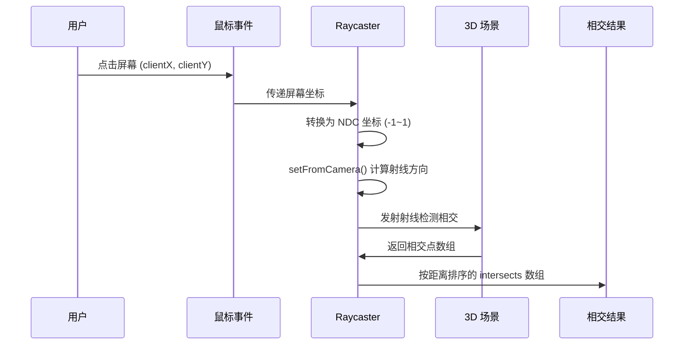

# Three.js 核心知识体系：第 6-8 章

> **调研日期**：2026-04-08  
> **调研来源**：Three.js 官方文档、CSDN、知乎、博客园等 10+ 来源交叉验证

---

## 第 6 章：交互、动画与控制器

### 6.1 事件系统与 Raycaster 射线检测

#### 6.1.1 概念定义

**Raycaster（射线投射器）** 是 Three.js 中实现 3D 场景交互的核心工具。它的本质是从相机位置发射一条虚拟射线，检测射线与场景中物体的交点，从而确定用户点击或悬停的目标对象。

**为什么需要 Raycaster？** 在 3D 场景中，鼠标点击提供的是 2D 屏幕坐标，而场景中的物体位于 3D 空间。Raycaster 建立了 2D 输入与 3D 空间的映射关系，实现了「点击 3D 物体」的交互能力。

#### 6.1.2 工作原理

Raycaster 的工作流程涉及多层坐标转换：



**坐标转换体系：**

1. **屏幕坐标归一化**：将鼠标像素坐标转换为标准设备坐标（NDC），范围 [-1, 1]
   ```javascript
   mouse.x = (event.clientX / window.innerWidth) * 2 - 1;
   mouse.y = -(event.clientY / window.innerHeight) * 2 + 1;
   ```

2. **投影矩阵转换**：通过相机投影矩阵将 NDC 转换为 3D 空间中的射线方向
   ```javascript
   raycaster.setFromCamera(mouse, camera);
   ```

3. **层级坐标处理**：对于嵌套在 Group 中的物体，需考虑局部坐标系与世界坐标系的转换

#### 6.1.3 核心 API

```javascript
import * as THREE from 'three';

// 构造函数
const raycaster = new THREE.Raycaster(origin, direction, near, far);

// 主要属性
raycaster.origin;        // 射线起点 (Vector3)
raycaster.direction;     // 射线方向 (Vector3，已归一化)
raycaster.near;          // 最小相交距离
raycaster.far;           // 最大相交距离
raycaster.camera;        // 用于 2D 拾取的相机
raycaster.layers;        // 图层过滤器

// 主要方法
raycaster.set(origin, direction);                      // 设置射线
raycaster.setFromCamera(coords, camera);               // 从相机设置射线
raycaster.intersectObject(object, recursive);          // 检测单个物体
raycaster.intersectObjects(objects, recursive);        // 检测多个物体
raycaster.intersectScene(scene);                       // 检测整个场景
```

#### 6.1.4 完整代码示例

**基础点击拾取：**

```javascript
import * as THREE from 'three';

const scene = new THREE.Scene();
const camera = new THREE.PerspectiveCamera(75, window.innerWidth / window.innerHeight, 0.1, 1000);
const renderer = new THREE.WebGLRenderer();

// 创建 Raycaster 和鼠标向量
const raycaster = new THREE.Raycaster();
const mouse = new THREE.Vector2();

// 添加可点击的物体
const geometry = new THREE.BoxGeometry();
const material = new THREE.MeshBasicMaterial({ color: 0x00ff00 });
const cube = new THREE.Mesh(geometry, material);
scene.add(cube);

// 鼠标点击事件处理
function onMouseClick(event) {
    // 1. 将鼠标位置转换为归一化设备坐标
    mouse.x = (event.clientX / window.innerWidth) * 2 - 1;
    mouse.y = -(event.clientY / window.innerHeight) * 2 + 1;

    // 2. 通过相机更新射线方向
    raycaster.setFromCamera(mouse, camera);

    // 3. 执行相交检测
    const intersects = raycaster.intersectObjects(scene.children);

    if (intersects.length > 0) {
        // intersects 数组按距离排序，intersects[0] 是最近的物体
        console.log('选中的物体:', intersects[0].object);
        console.log('相交点坐标:', intersects[0].point);
        console.log('相交距离:', intersects[0].distance);

        // 改变被点击物体的颜色
        intersects[0].object.material.color.set(0xff0000);
    }
}

window.addEventListener('click', onMouseClick);

// 渲染循环
function animate() {
    requestAnimationFrame(animate);
    renderer.render(scene, camera);
}
animate();
```

**悬停高亮效果：**

```javascript
let hoveredObject = null;
const raycaster = new THREE.Raycaster();
const mouse = new THREE.Vector2();

function onMouseMove(event) {
    mouse.x = (event.clientX / window.innerWidth) * 2 - 1;
    mouse.y = -(event.clientY / window.innerHeight) * 2 + 1;

    raycaster.setFromCamera(mouse, camera);
    const intersects = raycaster.intersectObjects(scene.children);

    // 恢复上一个悬停物体的颜色
    if (hoveredObject) {
        hoveredObject.material.emissive.set(0x000000);
        hoveredObject = null;
    }

    if (intersects.length > 0) {
        hoveredObject = intersects[0].object;
        hoveredObject.material.emissive.set(0x333333);  // 高亮显示
        document.body.style.cursor = 'pointer';
    } else {
        document.body.style.cursor = 'default';
    }
}

window.addEventListener('mousemove', onMouseMove);
```

#### 6.1.5 常见误区

| 误区 | 说明 | 正确做法 |
|------|------|----------|
| 忘记坐标归一化 | 直接使用屏幕像素坐标 | 必须转换为 NDC：`x * 2 - 1` 和 `-(y / height) * 2 + 1` |
| 未考虑相机位置 | Raycaster 与相机不同步 | 每次检测前调用 `setFromCamera()` |
| 忽略递归检测 | 只检测父物体，漏掉子物体 | `intersectObjects(objects, true)` 启用递归 |
| 性能问题 | 每帧检测所有物体 | 使用 `layers` 过滤或空间划分优化 |

---

### 6.2 相机控制器

#### 6.2.1 控制器类型对比

Three.js 提供多种控制器，适用于不同的交互场景：

| 控制器 | 适用场景 | 特点 |
|--------|----------|------|
| **OrbitControls** | 模型展示、3D 查看器 | 围绕目标点旋转、缩放、平移 |
| **TrackballControls** | 医学影像、自由视角 | 无固定「向上」方向，可任意翻转 |
| **FlyControls** | 飞行模拟、太空探索 | 类似飞行器的自由移动 |
| **FirstPersonControls** | FPS 游戏 | 第一人称视角，始终向上 |
| **PointerLockControls** | 沉浸式 3D 游戏 | 鼠标锁定，基于 Pointer Lock API |
| **DragControls** | 物体拖放 | 直接拖拽场景中的物体 |
| **TransformControls** | 3D 编辑器 | 类似 Blender 的变换 gizmo |

#### 6.2.2 OrbitControls 详解

**OrbitControls（轨道控制器）** 是最常用的控制器，允许用户通过鼠标操作使相机围绕目标点进行旋转、缩放和平移。

**工作原理：**
- 维护一个 `target` 点作为轨道中心
- 相机位置由球坐标（距离、极角、方位角）定义
- 鼠标操作转换为球坐标的变化

**核心 API：**

```javascript
import { OrbitControls } from 'three/addons/controls/OrbitControls.js';

const controls = new OrbitControls(camera, renderer.domElement);

// 主要属性
controls.enabled;           // 是否启用 (默认 true)
controls.target;            // 轨道中心点 (Vector3)
controls.minDistance;       // 最小缩放距离 (默认 0)
controls.maxDistance;       // 最大缩放距离 (默认 Infinity)
controls.minZoom;           // 最小缩放级别
controls.maxZoom;           // 最大缩放级别
controls.minPolarAngle;     // 最小垂直角度 (默认 0)
controls.maxPolarAngle;     // 最大垂直角度 (默认 Math.PI)
controls.enableDamping;     // 启用阻尼/惯性 (默认 false)
controls.dampingFactor;     // 阻尼系数 (默认 0.05)
controls.enableRotate;      // 启用旋转 (默认 true)
controls.enableZoom;        // 启用缩放 (默认 true)
controls.enablePan;         // 启用平移 (默认 true)
controls.autoRotate;        // 自动旋转 (默认 false)
controls.autoRotateSpeed;   // 自动旋转速度 (默认 2.0)

// 主要方法
controls.update();          // 更新控制器（启用阻尼时必须调用）
controls.reset();           // 重置到初始状态
controls.dispose();         // 释放资源
controls.saveState();       // 保存当前状态
controls.getPolarAngle();   // 获取垂直角度
controls.getAzimuthalAngle(); // 获取水平角度
```

**完整使用示例：**

```javascript
import * as THREE from 'three';
import { OrbitControls } from 'three/addons/controls/OrbitControls.js';

// 初始化场景、相机、渲染器
const scene = new THREE.Scene();
const camera = new THREE.PerspectiveCamera(75, window.innerWidth / window.innerHeight, 0.1, 1000);
const renderer = new THREE.WebGLRenderer();

// 创建控制器
const controls = new OrbitControls(camera, renderer.domElement);

// 配置控制器
controls.enableDamping = true;        // 启用阻尼，产生惯性效果
controls.dampingFactor = 0.05;        // 阻尼系数
controls.minDistance = 1;             // 最近缩放距离
controls.maxDistance = 100;           // 最远缩放距离
controls.autoRotate = true;           // 启用自动旋转
controls.autoRotateSpeed = 1.0;       // 旋转速度

// 设置初始相机位置
camera.position.set(0, 5, 10);
controls.target.set(0, 0, 0);
controls.update();

// 动画循环
function animate() {
    requestAnimationFrame(animate);

    // 启用阻尼时必须调用 update()
    controls.update();

    renderer.render(scene, camera);
}
animate();

// 窗口大小调整
window.addEventListener('resize', () => {
    camera.aspect = window.innerWidth / window.innerHeight;
    camera.updateProjectionMatrix();
    renderer.setSize(window.innerWidth, window.innerHeight);
});
```

#### 6.2.3 TransformControls（变换控制器）

**TransformControls** 提供类似 Blender 的 3D 变换 gizmo，用于在编辑器中拖拽、旋转、缩放物体。

```javascript
import { TransformControls } from 'three/addons/controls/TransformControls.js';

const transformControl = new TransformControls(camera, renderer.domElement);
transformControl.addEventListener('dragging-changed', (event) => {
    // 拖拽时禁用轨道控制器
    controls.enabled = !event.value;
});
scene.add(transformControl);

// 附加到物体
transformControl.attach(selectedMesh);

// 切换变换模式
window.addEventListener('keydown', (event) => {
    switch (event.key) {
        case 't': transformControl.setMode('translate'); break;  // 平移
        case 'r': transformControl.setMode('rotate'); break;     // 旋转
        case 's': transformControl.setMode('scale'); break;      // 缩放
    }
});
```

---

### 6.3 动画系统

#### 6.3.1 动画核心概念

Three.js 的动画系统基于**关键帧动画**（Keyframe Animation）原理，由三个核心类组成：

| 类 | 职责 | 比喻 |
|----|------|------|
| **AnimationClip** | 存储动画数据（关键帧轨道） | 「录像带」— 包含动画内容 |
| **AnimationMixer** | 驱动动画播放的引擎 | 「播放器」— 负责播放动画 |
| **AnimationAction** | 控制单个动画的播放状态 | 「遥控器」— 控制播放/暂停/淡入淡出 |

#### 6.3.2 AnimationClip（动画剪辑）

**AnimationClip** 是动画数据的容器，存储多个 **KeyframeTrack**（关键帧轨道）。

```javascript
import * as THREE from 'three';

// 构造器
const clip = new THREE.AnimationClip(name, duration, tracks, blendMode);

// 参数
// name: 剪辑名称
// duration: 动画时长（秒）
// tracks: KeyframeTrack 数组
// blendMode: 混合模式（默认 NormalAnimationBlendMode）

// 创建位置关键帧轨道
const positionTrack = new THREE.VectorKeyframeTrack(
    '.position',                    // 目标属性路径
    [0, 1, 2],                      // 时间点（秒）
    [0, 0, 0, 5, 0, 0, 5, 5, 0]     // 位置值 (x,y,z 按时间排列)
);

// 创建旋转关键帧轨道
const rotationTrack = new THREE.QuaternionKeyframeTrack(
    '.quaternion',
    [0, 1, 2],
    [0, 0, 0, 1, 0, 0, 0, 1, 0, 0, 0, 1]
);

// 创建动画剪辑
const clip = new THREE.AnimationClip(
    'walk',                         // 名称
    2,                              // 时长（秒）
    [positionTrack, rotationTrack]  // 轨道数组
);
```

**关键帧轨道类型：**

| 类型 | 用途 |
|------|------|
| `VectorKeyframeTrack` | 位置、缩放等 Vector3 属性 |
| `QuaternionKeyframeTrack` | 旋转（四元数） |
| `ColorKeyframeTrack` | 颜色 |
| `NumberKeyframeTrack` | 数值属性（如透明度） |
| `BooleanKeyframeTrack` | 布尔值 |
| `StringKeyframeTrack` | 字符串 |

#### 6.3.3 AnimationMixer（动画混合器）

**AnimationMixer** 是动画系统的核心引擎，负责驱动动画播放。

```javascript
// 构造器
const mixer = new THREE.AnimationMixer(root);
// root: Object3D - 动画作用的根对象（通常是加载的 3D 模型）

// 主要属性
mixer.root;           // 动画根对象
mixer.time;           // 当前时间（秒）
mixer.timeScale;      // 时间缩放（默认 1）

// 主要方法
mixer.clipAction(clip, optionalRoot, blendMode);  // 创建动画动作
mixer.update(deltaTime);                          // 更新动画（每帧调用）
mixer.stopAllAction();                            // 停止所有动画
mixer.existingAction();                           // 获取已存在的动作
```

#### 6.3.4 AnimationAction（动画动作）

**AnimationAction** 控制单个动画的播放状态，包括播放、暂停、淡入淡出等。

```javascript
// 通过 AnimationMixer 获取 AnimationAction
const action = mixer.clipAction(clip);

// 主要属性
action.clip;                    // 关联的动画剪辑
action.mixer;                   // 关联的混合器
action.paused;                  // 是否暂停
action.time;                    // 当前播放时间
action.timeScale;               // 播放速度
action.weight;                  // 权重（0-1，用于混合）
action.repetitions;             // 重复次数（默认 Infinity）
action.loop;                    // 循环模式
action.clampWhenFinished;       // 完成后保持最后一帧

// 循环模式
THREE.LoopOnce;      // 只播放一次
THREE.LoopRepeat;    // 重复播放
THREE.LoopPingPong;  // 往返播放（如 ping-pong）
```

**播放控制方法：**

```javascript
action.play();                    // 播放
action.stop();                    // 停止
action.pause();                   // 暂停
action.resume();                  // 恢复
action.fadeIn(duration);          // 淡入
action.fadeOut(duration);         // 淡出
action.fadeTo(duration, weight);  // 淡入到目标权重
action.setLoop(mode, repetitions); // 设置循环模式
```

#### 6.3.5 完整动画示例

**加载并播放 GLTF 模型动画：**

```javascript
import * as THREE from 'three';
import { GLTFLoader } from 'three/addons/loaders/GLTFLoader.js';

let mixer;
const clock = new THREE.Clock();

// 加载带有动画的模型
const loader = new GLTFLoader();
loader.load('models/character.glb', (gltf) => {
    const model = gltf.scene;
    scene.add(model);

    // 创建动画混合器
    mixer = new THREE.AnimationMixer(model);

    // 获取第一个动画剪辑
    const clip = gltf.animations[0];

    // 创建并播放动作
    const action = mixer.clipAction(clip);
    action.play();
});

// 渲染循环
function animate() {
    requestAnimationFrame(animate);

    const delta = clock.getDelta();

    // 更新动画混合器（必须调用）
    if (mixer) mixer.update(delta);

    renderer.render(scene, camera);
}
animate();
```

**动画切换（淡入淡出）：**

```javascript
function switchAnimation(clipName) {
    // 查找目标动画剪辑
    const clip = THREE.AnimationClip.findByName(gltf.animations, clipName);

    // 创建新动作并淡入
    const newAction = mixer.clipAction(clip);
    newAction.reset().fadeIn(0.3).play();

    // 淡出当前所有动作
    mixer.stopAllAction();
}

// 使用示例
switchAnimation('run');  // 切换到跑步动画
```

**动画混合（同时播放多个动画）：**

```javascript
// 上半身挥手 + 下半身走路
const walkAction = mixer.clipAction(walkClip);
const waveAction = mixer.clipAction(waveClip);

// 设置 waveAction 只影响上半身骨骼
waveAction.weight = 0.5;
waveAction.play();

// mixer 会自动混合两个动画
```

---

## 第 7 章：资源加载与工程化

### 7.1 GLTF/GLB 加载器

#### 7.1.1 为什么选择 GLTF？

**glTF（GL Transmission Format）** 被称为「3D 领域的 JPEG」，是 Khronos Group 制定的开放标准格式，已成为 Web 3D 的首选格式。

**glTF vs 其他格式对比：**

| 格式 | 特点 | 适用场景 |
|------|------|----------|
| **glTF/GLB** | 二进制格式，支持 PBR 材质、动画、压缩 | Web 3D 首选 |
| OBJ | 仅支持几何体，无材质动画 | 简单模型 |
| FBX | 商业格式，功能全但文件大 | 游戏开发 |
| Collada (.dae) | XML 格式，冗余大 | 已逐渐被淘汰 |

**GLB** 是 glTF 的二进制版本，将场景、网格、纹理等所有资源打包进单一文件，更适合网络传输。

#### 7.1.2 GLTFLoader 基础用法

```javascript
import { GLTFLoader } from 'three/addons/loaders/GLTFLoader.js';

const loader = new GLTFLoader();

loader.load(
    'path/to/model.glb',
    (gltf) => {
        // 加载成功
        scene.add(gltf.scene);

        // gltf 对象包含：
        // gltf.scene: 场景根节点
        // gltf.cameras: 相机数组
        // gltf.animations: 动画剪辑数组
        // gltf.parser: 底层解析器
    },
    (xhr) => {
        // 加载进度
        const percent = (xhr.loaded / xhr.total) * 100;
        console.log(`${percent.toFixed(2)}% loaded`);
    },
    (error) => {
        // 加载错误
        console.error('加载失败:', error);
    }
);
```

#### 7.1.3 模型加载后的处理

**自动缩放和居中：**

```javascript
loader.load('model.glb', (gltf) => {
    const model = gltf.scene;

    // 计算模型边界
    const box = new THREE.Box3().setFromObject(model);
    const size = box.getSize(new THREE.Vector3());
    const center = box.getCenter(new THREE.Vector3());

    // 计算缩放比例，使模型适应场景
    const maxSize = Math.max(size.x, size.y, size.z);
    const targetSize = 2.5;  // 目标大小
    const scale = targetSize / maxSize;
    model.scale.set(scale, scale, scale);

    // 居中模型
    model.position.sub(center.multiplyScalar(scale));

    scene.add(model);
});
```

**添加光照：**

```javascript
loader.load('model.glb', (gltf) => {
    const model = gltf.scene;

    // 模型可能需要光照才能正确显示
    const directionalLight = new THREE.DirectionalLight('#1E90FF', 1);
    directionalLight.position.set(-1.44, 2.2, 1);
    directionalLight.castShadow = true;
    scene.add(directionalLight);

    scene.add(model);
});
```

---

### 7.2 DRACO 压缩与优化

#### 7.2.1 DRACO 压缩原理

**DRACO** 是 Google 开发的 3D 几何压缩库，通过以下方式减小模型体积：

1. **顶点属性量化**：将 32 位浮点数转换为 16 位或 8 位整数
2. **拓扑结构优化**：重新组织三角形网格，使用更高效的编码
3. **熵编码**：类似 ZIP 的压缩算法，但针对 3D 数据优化

**压缩效果：**
- 几何数据可压缩到原始大小的 **10%-20%**
- 纹理贴图需配合其他工具（如 Basis Universal）

#### 7.2.2 使用 DRACOLoader

```javascript
import { GLTFLoader } from 'three/addons/loaders/GLTFLoader.js';
import { DRACOLoader } from 'three/addons/loaders/DRACOLoader.js';

// 创建 DRACO 加载器
const dracoLoader = new DRACOLoader();

// 设置解码器路径（从 CDN 或本地）
dracoLoader.setDecoderPath('https://www.gstatic.com/draco/versioned/decoders/1.5.7/');
dracoLoader.setDecoderConfig({ type: 'wasm' });  // 使用 WASM 版本，性能更好

// 将 DRACO 加载器传递给 GLTFLoader
const gltfLoader = new GLTFLoader();
gltfLoader.setDRACOLoader(dracoLoader);

// 加载压缩模型
gltfLoader.load('models/compressed-model.glb', (gltf) => {
    scene.add(gltf.scene);

    // 加载完成后释放 DRACO 资源
    dracoLoader.dispose();
});
```

#### 7.2.3 模型压缩命令行工具

使用 **gltf-pipeline** 压缩模型：

```bash
# 安装
npm install -g gltf-pipeline

# 基础压缩
gltf-pipeline -i input.glb -o output.glb -d

# 指定压缩级别（0-10，默认 7）
gltf-pipeline -i input.glb -o output.glb -d --draco.compressionLevel 7

# 查看压缩统计
gltf-pipeline -i output.glb --stats
```

**压缩效果对比：**

| 优化方式 | 原始大小 | 优化后大小 | 压缩率 |
|----------|----------|------------|--------|
| 未优化 | 32.4MB | - | - |
| Blender 基础优化 | 32.4MB | 18.7MB | 42% |
| glTF-Pipeline | 18.7MB | 6.2MB | 67% |
| Draco 压缩 | 6.2MB | 3.8MB | 39% |

---

### 7.3 LoadingManager 加载管理

**LoadingManager** 统一管理多个资源的加载进度。

```javascript
import * as THREE from 'three';
import { GLTFLoader } from 'three/addons/loaders/GLTFLoader.js';

// 创建 LoadingManager
const manager = new THREE.LoadingManager();

manager.onProgress = function (url, itemsLoaded, itemsTotal) {
    console.log(`加载中：${url} - ${itemsLoaded}/${itemsTotal}`);
    // 更新进度条
    const progress = (itemsLoaded / itemsTotal) * 100;
    loadingBar.style.width = progress + '%';
};

manager.onLoad = function () {
    console.log('所有资源加载完成!');
    loadingBar.style.display = 'none';
};

manager.onError = function (url) {
    console.error(`加载失败：${url}`);
};

// 设置基础路径和跨域
manager.basePath = '/assets/';
manager.crossOrigin = 'anonymous';

// 将 manager 传递给加载器
const loader = new GLTFLoader(manager);
loader.load('model.glb', (gltf) => {
    scene.add(gltf.scene);
});
```

---

### 7.4 性能优化最佳实践

#### 7.4.1 模型优化

1. **多边形控制**：
   - 单个主体模型：5,000 ~ 50,000 三角面
   - 背景/远景物体：500 ~ 2,000 三角面
   - 整个场景：控制在 300,000 三角面以内

2. **使用实例化渲染**：
   ```javascript
   // 传统方式：N 个对象 = N 次绘制调用
   for (let i = 0; i < 1000; i++) {
       const mesh = new THREE.Mesh(geometry, material);
       mesh.position.set(Math.random() * 100, 0, Math.random() * 100);
       scene.add(mesh);
   }

   // 实例化渲染：1 次绘制调用
   const instancedMesh = new THREE.InstancedMesh(geometry, material, 1000);
   for (let i = 0; i < 1000; i++) {
       const matrix = new THREE.Matrix4();
       matrix.setPosition(Math.random() * 100, 0, Math.random() * 100);
       instancedMesh.setMatrixAt(i, matrix);
   }
   scene.add(instancedMesh);
   ```

#### 7.4.2 纹理优化

1. **纹理尺寸**：使用 2 的幂次方（256, 512, 1024, 2048）
2. **纹理压缩**：使用 KTX2 或 Basis Universal 格式
3. **Mipmapping**：启用 mipmap 提高远距离渲染质量

#### 7.4.3 内存管理

```javascript
// 释放不再使用的资源
function disposeObject(object) {
    if (object.geometry) {
        object.geometry.dispose();
    }
    if (object.material) {
        if (Array.isArray(object.material)) {
            object.material.forEach(mat => mat.dispose());
        } else {
            object.material.dispose();
        }
    }
}

// 从场景移除并释放
scene.remove(mesh);
disposeObject(mesh);
```

---

## 第 8 章：常见误区与面试问题

### 8.1 常见开发误区

#### 8.1.1 坐标系与定位问题

**问题：墙体为何「飘」在空中或「陷」入地下？**

**原因**：Three.js 中，Mesh 的 position 是几何体中心点的位置。创建立方体时，中心在 (0,0,0)，直接将 position.y 设为 0 会导致一半在地下。

**解决方案：**
```javascript
// 错误示例
mesh.position.set(x, 0, z);  // 墙体中心在地面

// 正确示例
const wallHeight = 2.8;
mesh.position.set(x, wallHeight / 2, z);  // 墙体底部对齐地面
```

#### 8.1.2 渲染循环问题

**问题：动画卡顿或失真**

**常见原因：**
1. 在渲染循环中执行大量计算
2. 频繁创建/销毁对象
3. 忘记调用 `controls.update()`（启用阻尼时）

**正确做法：**
```javascript
// 错误：在每帧中创建新对象
function animate() {
    const geometry = new THREE.BoxGeometry();  // 每帧创建新几何体
    renderer.render(scene, camera);
}

// 正确：复用对象
const geometry = new THREE.BoxGeometry();
function animate() {
    // 只更新需要变化的属性
    mesh.rotation.y += 0.01;
    renderer.render(scene, camera);
}
```

#### 8.1.3 模型加载问题

**问题：模型加载后不显示**

**排查步骤：**

1. **检查控制台错误**
   ```javascript
   loader.load(
       'model.glb',
       (gltf) => { console.log('成功', gltf); },
       (xhr) => { console.log('进度', xhr); },
       (error) => { console.error('错误', error); }
   );
   ```

2. **检查相机位置**：模型可能太大或太小，调整相机 far 值
   ```javascript
   camera.far = 2000;
   camera.updateProjectionMatrix();
   ```

3. **添加光源**：模型可能在黑暗中
   ```javascript
   const light = new THREE.DirectionalLight(0xffffff, 1);
   scene.add(light);
   ```

4. **检查模型缩放**
   ```javascript
   // 放大或缩小 1000 倍尝试
   model.scale.set(1000, 1000, 1000);
   ```

#### 8.1.4 纹理模糊问题

**问题：场景模糊、纹理失真**

**解决方案：**
```javascript
// 1. 开启抗锯齿
const renderer = new THREE.WebGLRenderer({ antialias: true });

// 2. 设置设备像素比率（HiDPI 设备）
renderer.setPixelRatio(window.devicePixelRatio);

// 3. 设置合适的渲染尺寸
renderer.setSize(window.innerWidth, window.innerHeight);
```

---

### 8.2 调试技巧

#### 8.2.1 使用浏览器开发者工具

```javascript
// 在关键位置添加 console.log
console.log('相机位置:', camera.position);
console.log('场景物体:', scene.children);

// 使用 debugger 断点
function animate() {
    debugger;  // 在此处暂停
    renderer.render(scene, camera);
}
```

#### 8.2.2 可视化调试

```javascript
// 添加坐标轴辅助
const axesHelper = new THREE.AxesHelper(5);
scene.add(axesHelper);

// 添加网格辅助
const gridHelper = new THREE.GridHelper(10, 10);
scene.add(gridHelper);

// 显示边界盒
const box = new THREE.Box3().setFromObject(mesh);
const helper = new THREE.Box3Helper(box, 0xffff00);
scene.add(helper);
```

#### 8.2.3 性能分析

```javascript
// 使用 Three.js 内置性能监控
import Stats from 'three/examples/jsm/libs/stats.module';
const stats = new Stats();
document.body.appendChild(stats.dom);

function animate() {
    stats.begin();
    renderer.render(scene, camera);
    stats.end();
}
```

---

### 8.3 面试高频题（15 道）

#### 1. Three.js 的核心架构是什么？

**答案：** Three.js 基于三大核心组件：
- **Scene（场景）**：所有 3D 对象的容器
- **Camera（相机）**：定义观察视角
- **Renderer（渲染器）**：将场景渲染到画布

配合几何体（Geometry）、材质（Material）、网格（Mesh）、光源（Light）等组件构建 3D 场景。

#### 2. 透视相机和正交相机的区别？

**答案：**
- **PerspectiveCamera（透视相机）**：模拟人眼视觉，有透视效果（近大远小），适用于大多数 3D 场景
- **OrthographicCamera（正交相机）**：平行投影，无透视效果，物体大小不随距离变化，适用于建筑图纸、工程图

#### 3. Raycaster 的工作原理是什么？

**答案：** Raycaster 从相机发射射线，检测与场景物体的相交。工作流程：
1. 获取鼠标屏幕坐标
2. 转换为 NDC 坐标（-1~1）
3. 通过 `setFromCamera()` 计算射线方向
4. 执行相交检测，返回按距离排序的 intersects 数组

#### 4. 如何实现物体点击高亮？

**答案：**
```javascript
const raycaster = new THREE.Raycaster();
const mouse = new THREE.Vector2();

function onClick(event) {
    mouse.x = (event.clientX / width) * 2 - 1;
    mouse.y = -(event.clientY / height) * 2 + 1;
    raycaster.setFromCamera(mouse, camera);
    const intersects = raycaster.intersectObjects(scene.children);
    if (intersects.length > 0) {
        intersects[0].object.material.color.set(0xff0000);
    }
}
```

#### 5. AnimationMixer、AnimationClip、AnimationAction 的关系？

**答案：**
- **AnimationClip**：存储动画数据（录像带）
- **AnimationMixer**：驱动动画播放（播放器）
- **AnimationAction**：控制播放状态（遥控器）

#### 6. 如何切换模型动画？

**答案：** 使用淡入淡出实现平滑过渡：
```javascript
const newAction = mixer.clipAction(newClip);
newAction.reset().fadeIn(0.3).play();
mixer.stopAllAction();  // 淡出当前动作
```

#### 7. GLTF 和 GLB 的区别？

**答案：**
- **glTF**：JSON 格式，外部引用纹理和二进制数据
- **glB**：二进制格式，将所有资源打包进单一文件，更适合网络传输

#### 8. DRACO 压缩的原理是什么？

**答案：** DRACO 通过顶点量化、拓扑优化、熵编码将几何数据压缩到 10%-20%，是有损压缩但视觉几乎无损。

#### 9. 如何优化 3D 场景性能？

**答案：**
- 使用实例化渲染（InstancedMesh）减少 Draw Call
- 使用 Draco 压缩减小模型体积
- 启用 frustum culling（视锥剔除）
- 合理使用 LOD（多细节层次）

#### 10. 如何正确释放 Three.js 资源？

**答案：**
```javascript
function disposeObject(object) {
    if (object.geometry) object.geometry.dispose();
    if (object.material) {
        if (Array.isArray(object.material)) {
            object.material.forEach(m => m.dispose());
        } else {
            object.material.dispose();
        }
    }
}
```

#### 11. OrbitControls 启用阻尼后为什么动画不工作？

**答案：** 启用 `enableDamping` 后，必须在动画循环中调用 `controls.update()`：
```javascript
controls.enableDamping = true;
function animate() {
    controls.update();  // 必须调用
    renderer.render(scene, camera);
}
```

#### 12. 模型加载后看不到，可能的原因有哪些？

**答案：**
- 相机位置不当（太远/太近/在模型内部）
- 模型缩放比例异常
- 缺少光照
- 相机 far 值设置过小
- 材质颜色与背景相同

#### 13. 什么是 Draw Call？如何优化？

**答案：** Draw Call 是 CPU 向 GPU 发送的渲染指令。优化方法：
- 使用 `InstancedMesh` 实例化渲染
- 合并几何体（Geometry Merge）
- 使用纹理图集（Texture Atlas）

#### 14. Three.js 支持哪些光源类型？

**答案：**
- **AmbientLight**：环境光，均匀照亮
- **DirectionalLight**：平行光，模拟太阳光
- **PointLight**：点光源，向四周发射
- **SpotLight**：聚光灯，锥形照射
- **HemisphereLight**：半球光，模拟天光

#### 15. 如何实现第一人称控制器？

**答案：** 使用 `PointerLockControls`：
```javascript
import { PointerLockControls } from 'three/addons/controls/PointerLockControls.js';
const controls = new PointerLockControls(camera, renderer.domElement);
document.addEventListener('click', () => controls.lock());
```

---

### 8.4 参考资源

- **官方文档**：https://threejs.org/docs/
- **官方示例**：https://threejs.org/examples/
- **GitHub 仓库**：https://github.com/mrdoob/three.js
- **社区论坛**：https://discourse.threejs.org/

---

*本章完*
