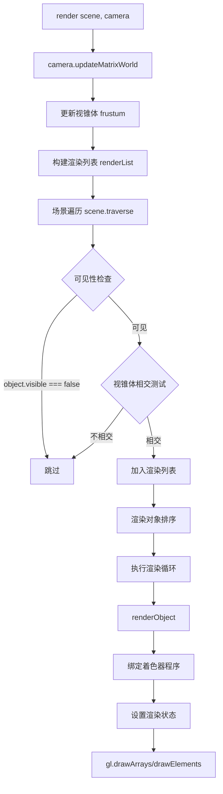
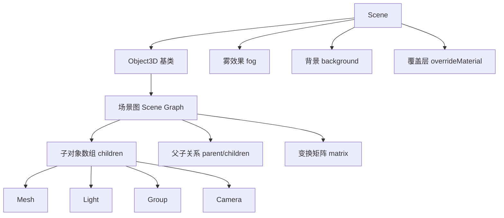
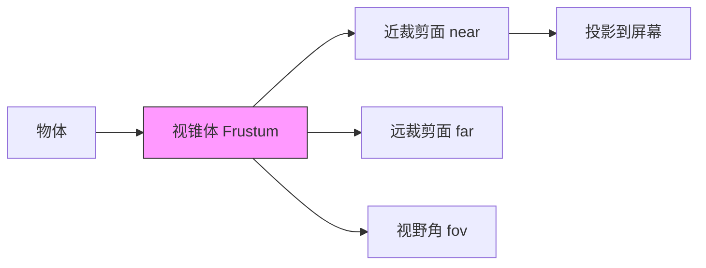
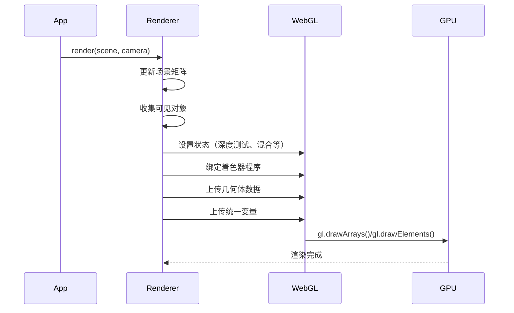
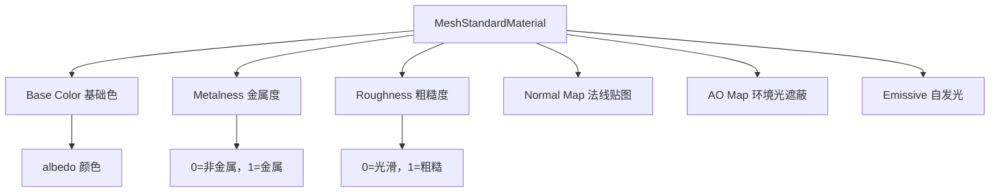
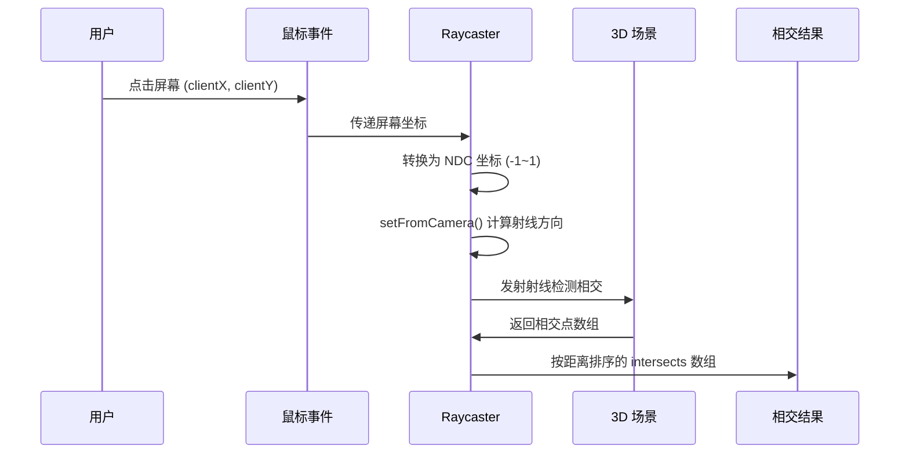

# Three.js 核心知识体系

> **文档版本：** v1.0  
> **创建日期：** 2026-04-08  
> **最后更新：** 2026-04-08  
> **存储位置：** `Tech/Frameworks/Three.js/`

---

## 目录

1. [基础认知：Web 3D 与 three.js 概述](#第 1 章基础认知 web-3d-与 threejs-概述)
2. [核心工作原理：渲染管线与架构设计](#第 2 章核心工作原理渲染管线与架构设计)
3. [核心 API 详解：场景、相机、渲染器](#第 3 章核心 api 详解场景相机渲染器)
4. [3D 对象构建：几何体、材质、纹理](#第 4 章 3d 对象构建几何体材质纹理)
5. [光照、阴影与后期处理](#第 5 章光照阴影与后期处理)
6. [交互、动画与控制器](#第 6 章交互动画与控制器)
7. [资源加载与工程化](#第 7 章资源加载与工程化)
8. [常见误区与面试问题](#第 8 章常见误区与面试问题)

---

## 第 1 章 基础认知：Web 3D 与 three.js 概述

### 1.1 WebGL 与浏览器 3D 渲染基础

#### 1.1.1 什么是 WebGL

**概念定义**：WebGL（Web Graphics Library）是一个 JavaScript API，可在任何兼容的 Web 浏览器中渲染高性能的交互式 3D 和 2D 图形，而无需使用插件。WebGL 通过引入一个与 OpenGL ES 2.0 非常一致的 API，使开发者可以直接跟 GPU 进行通信。

**核心特性**：
- **免插件**：原生集成于现代浏览器
- **硬件加速**：直接利用 GPU 进行图形计算
- **跨平台**：在桌面和移动浏览器中均可运行
- **基于着色器**：使用 GLSL（OpenGL Shading Language）编写顶点着色器和片元着色器

#### 1.1.2 WebGL 渲染管线

WebGL 程序分为两部分：
1. **CPU 端**：使用 JavaScript 编写，负责准备数据、调用 WebGL API
2. **GPU 端**：使用 GLSL 编写着色器程序，负责顶点变换和像素着色

**完整渲染流程**：

```
┌─────────────────────────────────────────────────────────────────┐
│                    WebGL 渲染管线                               │
├─────────────────────────────────────────────────────────────────┤
│  1. 准备顶点数据 → 2. 初始化 WebGL → 3. 编写着色器                │
│         ↓                ↓                  ↓                   │
│  TypedArray       createBuffer()      vertexShader              │
│  (Float32Array)   bindBuffer()        fragmentShader            │
│         ↓                ↓                  ↓                   │
│  4. 编译链接 → 5. 绑定属性 → 6. 绘制调用                         │
│         ↓                ↓                  ↓                   │
│  compileShader()  vertexAttribPointer()  drawArrays()           │
│  linkProgram()    enableVertexAttribArray() drawElements()      │
│         ↓                                                       │
│  7. GPU 执行：顶点着色器 → 光栅化 → 片元着色器 → 帧缓冲            │
└─────────────────────────────────────────────────────────────────┘
```

#### 1.1.3 着色器基础

**顶点着色器（Vertex Shader）**：处理每个顶点的位置变换
```glsl
// 顶点着色器示例
attribute vec2 a_position;  // 输入：顶点位置
void main() {
    gl_Position = vec4(a_position, 0.0, 1.0);  // 输出：裁剪坐标
}
```

**片元着色器（Fragment Shader）**：计算每个像素的最终颜色
```glsl
// 片元着色器示例
void main() {
    gl_FragColor = vec4(1.0, 0.0, 0.0, 1.0);  // 输出：红色
}
```

---

### 1.2 three.js 的定位与核心价值

#### 1.2.1 官方定义

**three.js** 是一个易于使用、轻量级、跨浏览器的通用 3D 库，当前版本包含 WebGL 和 WebGPU 渲染器，SVG 和 CSS3D 渲染器作为附加组件提供。

#### 1.2.2 核心价值主张

| 问题 | three.js 解决方案 |
|------|------------------|
| WebGL API 过于底层复杂 | 提供高级封装，屏蔽 GLSL 和 WebGL 细节 |
| 手动管理顶点缓冲区和着色器 | 内置几何体、材质系统，开箱即用 |
| 场景管理和对象层级繁琐 | 基于 Object3D 的场景图系统 |
| 数学库和变换计算复杂 | 内置 Vector3、Matrix4、Quaternion 等数学工具 |

#### 1.2.3 应用场景

| 应用领域 | 使用优势 | 典型用例 |
|----------|----------|----------|
| 数据可视化 | 支持动态 3D 图表与空间映射 | 大屏数据展示、地理信息可视化 |
| 建筑预览 | 实现真实光照与材质模拟 | VR 看房、建筑漫游 |
| 在线教育 | 提供可交互的三维教学模型 | 虚拟实验室、3D 模型展示 |
| 游戏开发 | 完整的 3D 引擎能力 | Web 游戏、互动体验 |
| 数字孪生 | 实时渲染与物理仿真 | 工业监控、设备可视化 |

---

### 1.3 three.js 核心架构概览

#### 1.3.1 组件结构

```
three.js 组成
├── 渲染器 Renderer
│   ├── WebGLRenderer（核心）
│   └── WebGPURenderer（新）
├── 场景 Scene
│   ├── 场景图 (Object3D 树)
│   └── 环境/雾
├── 相机 Camera
│   ├── PerspectiveCamera（透视）
│   └── OrthographicCamera（正交）
├── 对象 Object3D
│   ├── Mesh（网格）
│   ├── Line（线）
│   ├── Points（点）
│   └── Group（组）
├── 几何 Geometry
│   └── BufferGeometry（核心）
├── 材质 Material
│   ├── 基础材质
│   ├── PBR 材质
│   └── Shader 材质
├── 纹理 Texture
├── 光照 Light
├── 加载器 Loader
├── 动画 Animation
├── 控件 Controls（addons）
├── 后处理 Postprocessing（addons）
└── 辅助 Helpers
```

#### 1.3.2 三大基石：Scene、Camera、Renderer

```javascript
// 1. 创建场景 - 所有 3D 对象的容器
const scene = new THREE.Scene();
scene.background = new THREE.Color(0x000000);

// 2. 创建透视相机 - 定义观察视角
const camera = new THREE.PerspectiveCamera(
    75,                                    // 视野角度 (FOV)
    window.innerWidth / window.innerHeight, // 宽高比
    0.1,                                   // 近裁剪面
    1000                                   // 远裁剪面
);
camera.position.z = 5;

// 3. 创建 WebGL 渲染器 - 负责最终渲染
const renderer = new THREE.WebGLRenderer({ 
    antialias: true  // 启用抗锯齿
});
renderer.setSize(window.innerWidth, window.innerHeight);
document.body.appendChild(renderer.domElement);
```

---

### 1.4 完整可运行示例

#### 1.4.1 旋转立方体

```html
<!DOCTYPE html>
<html lang="zh-CN">
<head>
    <meta charset="UTF-8">
    <title>Three.js 基础示例 - 旋转立方体</title>
    <style>
        body { margin: 0; overflow: hidden; }
        canvas { display: block; }
    </style>
</head>
<body>
    <script src="https://cdnjs.cloudflare.com/ajax/libs/three.js/r128/three.min.js"></script>
    <script>
        // 初始化场景
        const scene = new THREE.Scene();
        
        // 初始化相机
        const camera = new THREE.PerspectiveCamera(
            75, window.innerWidth / window.innerHeight, 0.1, 1000
        );
        camera.position.z = 5;
        
        // 初始化渲染器
        const renderer = new THREE.WebGLRenderer({ antialias: true });
        renderer.setSize(window.innerWidth, window.innerHeight);
        document.body.appendChild(renderer.domElement);
        
        // 创建几何体（立方体）和材质
        const geometry = new THREE.BoxGeometry();
        const material = new THREE.MeshBasicMaterial({ color: 0x00ff00 });
        const cube = new THREE.Mesh(geometry, material);
        scene.add(cube);
        
        // 动画循环
        function animate() {
            requestAnimationFrame(animate);
            
            // 每帧更新立方体旋转状态
            cube.rotation.x += 0.01;
            cube.rotation.y += 0.01;
            
            // 渲染场景
            renderer.render(scene, camera);
        }
        
        animate();
        
        // 响应窗口大小变化
        window.addEventListener('resize', () => {
            camera.aspect = window.innerWidth / window.innerHeight;
            camera.updateProjectionMatrix();
            renderer.setSize(window.innerWidth, window.innerHeight);
        });
    </script>
</body>
</html>
```

---

### 1.5 常见误区

#### 误区 1：three.js 就是 WebGL

**错误认知**：认为 three.js 和 WebGL 是同一技术。

**正确理解**：
- **WebGL** 是底层图形 API，直接操作 GPU
- **three.js** 是基于 WebGL 的高级封装库
- 使用 three.js 可以不写任何 WebGL 或 GLSL 代码

#### 误区 2：相机 FOV 越大越好

**错误认知**：认为视野角度（FOV）越大，能看到的越多。

**正确理解**：
- FOV 过大会导致画面畸变（鱼眼效果）
- 推荐值：50-75 度之间
- 游戏常用：60-70 度；建筑可视化常用：45-55 度

#### 误区 3：渲染器尺寸可以随意设置

**错误做法**：不处理窗口 resize 事件，导致 canvas 模糊或变形。

**正确做法**：
```javascript
window.addEventListener('resize', () => {
    // 更新相机宽高比
    camera.aspect = window.innerWidth / window.innerHeight;
    camera.updateProjectionMatrix();
    
    // 更新渲染器尺寸
    renderer.setSize(window.innerWidth, window.innerHeight);
    renderer.setPixelRatio(window.devicePixelRatio);
});
```

---

## 第 2 章 核心工作原理：渲染管线与架构设计

### 2.1 场景图（Scene Graph）架构

#### 2.1.1 概念定义

**场景图**是 three.js 中用于管理 3D 对象的树状层级结构。所有 3D 对象都继承自 `Object3D` 基类，通过父子关系组织成一个树形结构。

**核心特性**：
- **层级变换继承**：子对象继承父对象的 position、rotation、scale
- **高效遍历**：通过 `traverse()` 方法可以快速访问所有子对象
- **批量操作**：可以对整个分支进行统一变换

#### 2.1.2 Object3D 树结构

```
Scene (根节点)
├── Camera
│   └── (可附加到移动平台)
├── DirectionalLight
├── Group (汽车组)
│   ├── Mesh (车身)
│   ├── Mesh (车轮 1)
│   ├── Mesh (车轮 2)
│   └── Mesh (车轮 3)
└── Mesh (地面)
```

#### 2.1.3 代码示例：使用 Group 组织对象

```javascript
import * as THREE from 'three';

const scene = new THREE.Scene();

// 创建汽车组 - 作为单一实体操作
const carGroup = new THREE.Group();
scene.add(carGroup);

// 车身
const bodyGeo = new THREE.BoxGeometry(2, 0.5, 1);
const bodyMat = new THREE.MeshBasicMaterial({ color: 0xff0000 });
const body = new THREE.Mesh(bodyGeo, bodyMat);
carGroup.add(body);

// 车轮
const wheelGeo = new THREE.CylinderGeometry(0.3, 0.3, 0.2, 16);
wheelGeo.rotateZ(Math.PI / 2); // 旋转 90 度使其立起
const wheelMat = new THREE.MeshBasicMaterial({ color: 0x333333 });

const wheel1 = new THREE.Mesh(wheelGeo, wheelMat);
wheel1.position.set(0.7, -0.3, 0.5);
carGroup.add(wheel1);

const wheel2 = wheel1.clone();
wheel2.position.z = -0.5;
carGroup.add(wheel2);

// 移动整个汽车组 - 所有子对象同步移动
carGroup.position.x = -3;
carGroup.rotation.y = Math.PI / 4;
```

**关键点**：Group 允许将多个对象作为单一实体操作，大幅简化复杂对象的变换控制。

#### 2.1.4 场景图遍历

```javascript
// 遍历场景中的所有对象
scene.traverse((object) => {
    if (object.isMesh) {
        // 对所有网格对象执行操作
        object.castShadow = true;
        object.receiveShadow = true;
    }
});

// 按条件查找
const meshes = scene.children.filter(child => child.isMesh);

// 递归查找（使用 getChildByName 或自定义递归）
const target = scene.getObjectByName('myMesh');
```

---

### 2.2 渲染循环（Render Loop）

#### 2.2.1 requestAnimationFrame 机制

**概念定义**：`requestAnimationFrame` 是浏览器提供的动画 API，它会在下一次重绘前调用指定的回调函数，通常以 60fps 的频率执行。

**工作原理**：
1. 浏览器检测屏幕刷新率（通常 60Hz）
2. 在每次刷新前，自动调用注册的回调函数
3. 当标签页不可见时，自动暂停以节省资源

#### 2.2.2 基础渲染循环

```javascript
function animate() {
    // 1. 请求下一帧
    requestAnimationFrame(animate);
    
    // 2. 更新场景状态
    cube.rotation.x += 0.01;
    cube.rotation.y += 0.01;
    
    // 3. 执行渲染
    renderer.render(scene, camera);
}

// 启动循环
animate();
```

#### 2.2.3 进阶：基于时间的动画

```javascript
let lastTime = 0;

function animate(time) {
    requestAnimationFrame(animate);
    
    // 计算时间增量（秒）
    const deltaTime = (time - lastTime) / 1000;
    lastTime = time;
    
    // 使用 deltaTime 确保动画速度一致
    cube.rotation.x += deltaTime * 0.5;  // 每秒旋转 0.5 弧度
    cube.rotation.y += deltaTime * 0.3;
    
    renderer.render(scene, camera);
}

animate(0);
```

#### 2.2.4 按需渲染（性能优化）

对于静态场景或交互驱动的场景，可以避免连续渲染：

```javascript
let needsRender = true;

function animate() {
    if (needsRender) {
        requestAnimationFrame(animate);
        renderer.render(scene, camera);
        needsRender = false;
    }
}

// 交互触发渲染
controls.addEventListener('change', () => {
    needsRender = true;
    animate();
});
```

---

### 2.3 WebGLRenderer 渲染管线

#### 2.3.1 渲染器架构

**WebGLRenderer** 是 three.js 的核心渲染引擎，负责将 3D 场景转换为 2D 像素。

**关键子模块**：

| 模块 | 源码路径 | 职责 |
|------|----------|------|
| WebGLRenderer | `src/renderers/WebGLRenderer.js` | 渲染器核心实现 |
| WebGLPrograms | `src/renderers/webgl/WebGLPrograms.js` | 着色器程序管理 |
| WebGLState | `src/renderers/webgl/WebGLState.js` | 渲染状态控制 |
| WebGLRenderLists | `src/renderers/webgl/WebGLRenderLists.js` | 渲染列表管理 |

#### 2.3.2 标准渲染流程



**核心渲染逻辑**（源码简化）：

```javascript
render: function(scene, camera) {
    // 1. 视锥体更新
    camera.updateMatrixWorld();
    _projScreenMatrix.multiplyMatrices(
        camera.projectionMatrix,
        camera.matrixWorldInverse
    );
    _frustum.setFromProjectionMatrix(_projScreenMatrix);
    
    // 2. 构建渲染列表
    const renderList = this.renderLists.get(scene, camera);
    renderList.init();
    
    // 3. 场景遍历与可见性检查
    scene.traverse((object) => {
        if (object.visible === false) return;
        if (object.isMesh || object.isLine || object.isPoints) {
            if (_frustum.intersectsObject(object)) {
                renderList.push(object);
            }
        }
    });
    
    // 4. 排序渲染对象
    renderList.sort();
    
    // 5. 执行渲染
    this.state.setCullFace(gl.BACK);
    this.state.enable(gl.DEPTH_TEST);
    
    for (let i = 0, l = renderList.length; i < l; i++) {
        const renderItem = renderList[i];
        this.renderObject(renderItem.object, scene, camera);
    }
}
```

#### 2.3.3 渲染状态管理

```javascript
// 渲染器初始化配置
const renderer = new THREE.WebGLRenderer({
    antialias: true,           // 抗锯齿（MSAA）
    alpha: true,               // 透明背景
    depth: true,               // 深度缓冲
    stencil: false,            // 模板缓冲
    preserveDrawingBuffer: false, // 保留绘图缓冲（用于截图）
    powerPreference: 'high-performance' // GPU 性能偏好
});

// 渲染状态设置
renderer.setClearColor(0x000000, 1);  // 清除颜色和透明度
renderer.setPixelRatio(window.devicePixelRatio);  // 像素比
renderer.setSize(width, height, false);  // false = 不更新 canvas 样式
```

---

### 2.4 缓冲几何体与 GPU 数据传输

#### 2.4.1 BufferGeometry 核心概念

**概念定义**：`BufferGeometry` 是 three.js 中几何体的高效表示方式，使用**类型化数组**（TypedArray）存储顶点数据，直接对应 WebGL 的 `gl.bufferData`，实现高效的 GPU 数据传输。

**为什么需要 BufferGeometry**：
- **性能优势**：类型化数组直接在内存中连续存储，避免 JavaScript 数组的对象开销
- **GPU 友好**：数据格式与 GPU 显存布局一致，零拷贝传输
- **内存效率**：相比旧版 Geometry，内存占用减少 50%+

#### 2.4.2 核心术语

| 术语 | 定义 | 示例 |
|------|------|------|
| **顶点 (Vertex)** | 3D 空间中的一个点，由 X/Y/Z 三个坐标值组成 | `(0, 0, 0)` |
| **类型化数组** | 专门用于存储顶点数据的数组，比普通数组更节省内存、GPU 读取更快 | `Float32Array` |
| **BufferAttribute** | three.js 对「类型化数组」的封装，告诉 three.js「数组中的数据如何分组解析」 | `new BufferAttribute(vertices, 3)` |
| **属性 (Attribute)** | 几何体的「数据维度」，如 position、color、uv、normal 等 | `position`、`normal` |

#### 2.4.3 GPU 数据传输流程

```
┌─────────────────────────────────────────────────────────────────┐
│              GPU 数据传输流程                                    │
├─────────────────────────────────────────────────────────────────┤
│  JavaScript TypedArray                                        │
│         ↓ (封装)                                                │
│  BufferAttribute (vertex position / normal / uv / color)       │
│         ↓ (上传)                                                │
│  WebGLBuffer (gl.createBuffer + gl.bufferData)                 │
│         ↓ (绑定)                                                │
│  GPU 显存 (VRAM)                                                │
│         ↓ (着色器访问)                                           │
│  顶点着色器读取 attribute 数据                                    │
└─────────────────────────────────────────────────────────────────┘
```

#### 2.4.4 基础使用流程

```javascript
import * as THREE from 'three';

// 步骤 1: 创建空的 BufferGeometry 容器
const geometry = new THREE.BufferGeometry();

// 步骤 2: 定义顶点数据（类型化数组）
// 顶点坐标数据：每 3 个值为一组 (X, Y, Z)，表示一个顶点的 3D 坐标
// 示例：6 个顶点，对应 2 个三角形（Mesh 默认按三角面渲染）
const vertices = new Float32Array([
    0, 0, 0,     // 顶点 1: (0, 0, 0)
    50, 0, 0,    // 顶点 2: (50, 0, 0)
    0, 50, 0,    // 顶点 3: (0, 50, 0)
    
    0, 0, 0,     // 顶点 4: (0, 0, 0) - 第二个三角形
    0, 50, 0,    // 顶点 5: (0, 50, 0)
    50, 50, 0    // 顶点 6: (50, 50, 0)
]);

// 步骤 3: 创建属性缓冲区对象
// 参数 2 (itemSize = 3) 表示每 3 个值为一组，解析为一个顶点的 XYZ 坐标
const positionAttribute = new THREE.BufferAttribute(vertices, 3);

// 步骤 4: 将属性添加到几何体
geometry.setAttribute('position', positionAttribute);

// 步骤 5: 创建材质和网格
const material = new THREE.MeshBasicMaterial({ 
    color: 0x00ff00,
    side: THREE.DoubleSide  // 双面渲染
});
const mesh = new THREE.Mesh(geometry, material);
scene.add(mesh);
```

#### 2.4.5 常用顶点属性

```javascript
const geometry = new THREE.BufferGeometry();

// 1. 位置属性 (position) - 必需
const positions = new Float32Array([
    x1, y1, z1,
    x2, y2, z2,
    // ...
]);
geometry.setAttribute('position', new THREE.BufferAttribute(positions, 3));

// 2. 法线属性 (normal) - 光照计算必需
const normals = new Float32Array([
    nx1, ny1, nz1,
    nx2, ny2, nz2,
    // ...
]);
geometry.setAttribute('normal', new THREE.BufferAttribute(normals, 3));

// 3. UV 属性 (uv) - 纹理映射必需（每 2 个值一组：U, V）
const uvs = new Float32Array([
    u1, v1,
    u2, v2,
    // ...
]);
geometry.setAttribute('uv', new THREE.BufferAttribute(uvs, 2));

// 4. 颜色属性 (color) - 顶点着色必需
const colors = new Float32Array([
    r1, g1, b1,
    r2, g2, b2,
    // ...
]);
geometry.setAttribute('color', new THREE.BufferAttribute(colors, 3));

// 5. 索引属性 (index) - 可选，用于优化
const indices = new Uint16Array([
    0, 1, 2,  // 第一个三角形
    0, 2, 3   // 第二个三角形
]);
geometry.setIndex(new THREE.BufferAttribute(indices, 1));
```

#### 2.4.6 BufferAttribute 类型对照表

| 类名 | 字节大小 | 对应 GLSL 类型 | 适用场景 |
|------|---------|---------------|---------|
| `Int8BufferAttribute` | 1 字节 | `int` | 骨骼权重（有符号） |
| `Uint8BufferAttribute` | 1 字节 | `uint` / `vec4`（归一化） | 颜色、索引 |
| `Int16BufferAttribute` | 2 字节 | `int` | 骨骼索引 |
| `Uint16BufferAttribute` | 2 字节 | `uint` | 中等模型索引 |
| `Int32BufferAttribute` | 4 字节 | `int` | 大索引值 |
| `Uint32BufferAttribute` | 4 字节 | `uint` | 超大模型索引 |
| `Float16BufferAttribute` | 2 字节 | `float`（半精度） | 节省内存 |
| `Float32BufferAttribute` | 4 字节 | `float` / `vec3` / `vec4` | 位置、法线、UV |

#### 2.4.7 动态更新顶点数据

```javascript
// 在动画循环中更新顶点位置
function animate() {
    requestAnimationFrame(animate);
    
    const positions = geometry.attributes.position.array;
    const time = Date.now() * 0.001;
    
    // 更新顶点 Y 坐标（波浪效果）
    for (let i = 0; i < positions.length; i += 3) {
        positions[i + 1] += Math.sin(time + positions[i]) * 0.01;
    }
    
    // 关键：标记需要更新，three.js 会在下次渲染时同步到 GPU
    geometry.attributes.position.needsUpdate = true;
    
    renderer.render(scene, camera);
}
```

**关键点**：必须设置 `needsUpdate = true`，否则 GPU 不会同步最新的 CPU 端数据。

#### 2.4.8 InterleavedBuffer（交错缓冲区）

当多个属性共享相同的顶点索引时，可以使用交错缓冲区优化内存布局：

```javascript
// 传统方式： separate buffers
// position: [x1, y1, z1, x2, y2, z2, ...]
// uv:       [u1, v1, u2, v2, ...]

// 交错方式：interleaved buffer
// data: [x1, y1, z1, u1, v1, x2, y2, z2, u2, v2, ...]

const stride = 5; // 3 (位置) + 2 (UV)
const data = new Float32Array(vertexCount * stride);

for (let i = 0; i < vertexCount; i++) {
    const offset = i * stride;
    data[offset + 0] = x;  // position.x
    data[offset + 1] = y;  // position.y
    data[offset + 2] = z;  // position.z
    data[offset + 3] = u;  // uv.x
    data[offset + 4] = v;  // uv.y
}

const interleavedBuffer = new THREE.InterleavedBuffer(data, stride);

geometry.setAttribute('position', 
    new THREE.InterleavedBufferAttribute(interleavedBuffer, 3, 0));
geometry.setAttribute('uv', 
    new THREE.InterleavedBufferAttribute(interleavedBuffer, 2, 3));
```

**优势**：
- **缓存友好**：顶点数据连续存储，GPU 读取更高效
- **内存减少**：避免多个独立缓冲区的开销

---

### 2.5 完整示例：自定义几何体

```javascript
import * as THREE from 'three';

/**
 * 创建自定义六边形几何体
 * 使用 BufferGeometry + 索引缓冲
 */
function createHexagonGeometry(radius = 1) {
    const geometry = new THREE.BufferGeometry();
    
    // 六边形顶点（中心 + 6 个外围顶点）
    const vertices = [];
    
    // 中心点
    vertices.push(0, 0, 0);
    
    // 6 个外围顶点
    for (let i = 0; i < 6; i++) {
        const angle = (i / 6) * Math.PI * 2;
        vertices.push(
            Math.cos(angle) * radius,
            Math.sin(angle) * radius,
            0
        );
    }
    
    // 索引（6 个三角形，共享中心顶点）
    const indices = [];
    for (let i = 0; i < 6; i++) {
        indices.push(0, i + 1, i + 2);
    }
    // 闭合最后一个三角形
    indices[indices.length - 1] = 1;
    
    // 设置属性
    geometry.setAttribute('position', 
        new THREE.Float32BufferAttribute(vertices, 3));
    geometry.setIndex(indices);
    
    // 计算法线（用于光照）
    geometry.computeVertexNormals();
    
    return geometry;
}

// 使用示例
const hexGeometry = createHexagonGeometry(1);
const material = new THREE.MeshStandardMaterial({ 
    color: 0xffd700,
    side: THREE.DoubleSide
});
const hexagon = new THREE.Mesh(hexGeometry, material);
scene.add(hexagon);
```

---

### 2.6 常见误区

#### 误区 1：BufferGeometry 可以直接修改 array

**错误做法**：
```javascript
const positions = geometry.attributes.position.array;
positions[0] = 10;  // 修改了数据，但 GPU 不会更新
```

**正确做法**：
```javascript
const positions = geometry.attributes.position.array;
positions[0] = 10;
geometry.attributes.position.needsUpdate = true;  // 必须标记
```

#### 误区 2：使用普通数组存储顶点数据

**错误做法**：
```javascript
const vertices = [0, 0, 0, 1, 0, 0, 0, 1, 0];  // 普通数组
geometry.setAttribute('position', new THREE.BufferAttribute(vertices, 3));
// 会报错或渲染异常
```

**正确做法**：
```javascript
const vertices = new Float32Array([0, 0, 0, 1, 0, 0, 0, 1, 0]);  // 类型化数组
geometry.setAttribute('position', new THREE.BufferAttribute(vertices, 3));
```

#### 误区 3：忽略 itemSize 参数

**错误理解**：认为 itemSize 是可选的或可以随意设置。

**正确理解**：itemSize 必须是 2、3 或 4，对应 GLSL 的 vec2、vec3、vec4：
- `position` → itemSize = 3（XYZ）
- `uv` → itemSize = 2（UV）
- `normal` → itemSize = 3（XYZ）
- `color` → itemSize = 3 或 4（RGB 或 RGBA）

#### 误区 4：不使用索引缓冲

**问题**：对于共享顶点的几何体，不使用索引会导致顶点数据重复。

**优化前**（无索引）：
```javascript
// 两个三角形共享一条边，顶点重复
const vertices = new Float32Array([
    0, 0, 0,  1, 0, 0,  0, 1, 0,   // 三角形 1
    0, 0, 0,  0, 1, 0,  1, 1, 0    // 三角形 2 - (0,0,0) 和 (0,1,0) 重复
]);
```

**优化后**（使用索引）：
```javascript
// 4 个唯一点 + 索引
const vertices = new Float32Array([
    0, 0, 0,  1, 0, 0,  0, 1, 0,  1, 1, 0
]);
const indices = new Uint16Array([0, 1, 2, 0, 2, 3]);
geometry.setIndex(indices);
```

---

## 第 3 章 核心 API 详解：场景、相机、渲染器

### 3.1 Scene（场景）

#### 3.1.1 概念定义

**是什么：** Scene 是 three.js 中所有 3D 对象的容器，类似于舞台或电影场景。所有的 Mesh（网格）、Light（光源）、Camera（相机）等对象都必须添加到场景中才能被渲染。

**为什么需要：** Scene 提供了一个统一的坐标空间和管理系统，负责：
- 组织和管理场景图（Scene Graph）中的所有对象
- 处理对象的层级关系和变换继承
- 管理雾效果（Fog）和背景（Background）
- 作为渲染器的输入，告诉渲染器"渲染什么"

#### 3.1.2 工作原理



**场景图（Scene Graph）：** Scene 继承自 Object3D，内部维护一个树形结构：
- 每个节点可以有多个子节点（children 数组）
- 每个节点最多一个父节点（parent 引用）
- 父节点的变换（位置、旋转、缩放）会自动传递给子节点
- 渲染时通过递归遍历场景图收集所有可见对象

#### 3.1.3 核心 API

```javascript
import * as THREE from 'three';

// 创建场景
const scene = new THREE.Scene();

// 常用属性
scene.background = new THREE.Color(0x000000);  // 背景颜色
scene.fog = new THREE.Fog(0x000000, 1, 100);   // 雾效果

// 添加对象
const cube = new THREE.Mesh(geometry, material);
scene.add(cube);

// 移除对象
scene.remove(cube);

// 获取对象
const objById = scene.getObjectById(id);
const objByName = scene.getObjectByName('name');

// 射线检测（判断点击位置是否有对象）
const raycaster = new THREE.Raycaster();
const intersects = raycaster.intersectObjects(scene.children);
```

**关键属性详解：**

| 属性 | 类型 | 说明 |
|------|------|------|
| `background` | Color/Texture | 场景背景，可以是颜色或立方体贴图 |
| `fog` | Fog/FogExp2 | 雾效果，Fog 线性雾，FogExp2 指数雾 |
| `children` | Array | 所有直接子对象的数组 |
| `autoUpdate` | Boolean | 是否自动更新矩阵，默认 true |
| `overrideMaterial` | Material | 覆盖所有对象的材质（调试用） |

#### 3.1.4 常见误区

**❌ 误区 1：场景只能有一个**
```javascript
// 错误理解：只能有一个 scene
const scene = new THREE.Scene();

// ✅ 正确：可以创建多个场景，用于不同视图或 LOD
const mainScene = new THREE.Scene();
const miniMapScene = new THREE.Scene();
```

**❌ 误区 2：移除对象后内存自动释放**
```javascript
// ❌ 仅调用 remove() 不会释放 GPU 内存
scene.remove(mesh);

// ✅ 正确做法：手动释放几何体和材质
mesh.geometry.dispose();
mesh.material.dispose();
scene.remove(mesh);
```

---

### 3.2 Camera（相机）

#### 3.2.1 概念定义

**是什么：** Camera 是从哪个视角观察场景的抽象，决定了 3D 世界如何投影到 2D 屏幕上。

**为什么需要：** 没有相机就无法"看到"场景。相机类型决定了视觉效果：
- **PerspectiveCamera（透视相机）：** 近大远小，符合人眼视觉
- **OrthographicCamera（正交相机）：** 等比例投影，无透视变形

#### 3.2.2 透视相机工作原理



**视锥体（Frustum）：** 相机可见的区域，形状如截断的金字塔：
- **fov（Field of View）：** 垂直视野角度，通常 45-75 度
- **aspect：** 宽高比，通常为 canvas.width / canvas.height
- **near：** 近裁剪面，小于此距离的物体不可见
- **far：** 远裁剪面，大于此距离的物体不可见

#### 3.2.3 核心 API

```javascript
import * as THREE from 'three';

// === 透视相机 ===
const camera = new THREE.PerspectiveCamera(
    75,                              // fov: 视野角度（度）
    window.innerWidth / window.innerHeight, // aspect: 宽高比
    0.1,                             // near: 近裁剪面
    1000                             // far: 远裁剪面
);
camera.position.set(0, 0, 5);        // 设置位置
camera.lookAt(0, 0, 0);              // 看向原点

// === 正交相机 ===
const orthoCamera = new THREE.OrthographicCamera(
    -10, 10,                         // left, right
    10, -10,                         // top, bottom
    0.1, 1000                        // near, far
);

// 窗口大小变化时更新
function onWindowResize() {
    camera.aspect = window.innerWidth / window.innerHeight;
    camera.updateProjectionMatrix(); // 必须调用！
    renderer.setSize(window.innerWidth, window.innerHeight);
}
```

**关键参数详解：**

| 参数 | 影响 | 推荐值 |
|------|------|--------|
| `fov` | 值越大视野越广，变形越明显 | 60-75（游戏常用） |
| `near` | 太小会导致深度精度问题 | 0.1 或 0.01 |
| `far` | 影响渲染性能和雾效果 | 根据场景大小设定 |
| `aspect` | 不正确会导致画面拉伸 | 始终与 canvas 一致 |

#### 3.2.4 常见误区

**❌ 误区 1：忘记更新投影矩阵**
```javascript
// ❌ 错误：只修改 aspect 不生效
camera.aspect = newAspect;

// ✅ 正确：必须调用 updateProjectionMatrix
camera.aspect = newAspect;
camera.updateProjectionMatrix();
```

**❌ 误区 2：near 值设置过小**
```javascript
// ❌ 问题：near=0.001 会导致深度冲突（z-fighting）
const camera = new THREE.PerspectiveCamera(75, aspect, 0.001, 1000);

// ✅ 建议：尽可能大的 near 值
const camera = new THREE.PerspectiveCamera(75, aspect, 0.1, 1000);
```

---

### 3.3 WebGLRenderer（渲染器）

#### 3.3.1 概念定义

**是什么：** WebGLRenderer 是将 3D 场景渲染到 canvas 的引擎，负责：
- 创建和管理 WebGL 上下文
- 执行 WebGL 绘图命令
- 处理阴影、后期处理等高级效果

**为什么需要：** 它是 three.js 与 WebGL API 之间的桥梁，将场景、相机转换为像素。

#### 3.3.2 渲染管线工作原理



#### 3.3.3 核心 API

```javascript
import * as THREE from 'three';

// 创建渲染器
const renderer = new THREE.WebGLRenderer({
    canvas: document.querySelector('canvas'),  // 指定 canvas
    antialias: true,                           // 抗锯齿
    alpha: true,                               // 支持透明
    precision: 'highp',                        // 精度
    powerPreference: 'high-performance'        // 性能偏好
});

// 基本设置
renderer.setSize(window.innerWidth, window.innerHeight);
renderer.setPixelRatio(Math.min(window.devicePixelRatio, 2)); // 限制 DPR
renderer.setClearColor(0x000000, 1);  // 背景色和透明度

// 阴影配置
renderer.shadowMap.enabled = true;
renderer.shadowMap.type = THREE.PCFSoftShadowMap;

// 颜色空间（three.js r152+）
renderer.outputColorSpace = THREE.SRGBColorSpace;

// 渲染循环
function animate() {
    requestAnimationFrame(animate);
    renderer.render(scene, camera);
}
animate();

// 清理资源
renderer.dispose();
renderer.forceContextLoss();
```

**重要选项详解：**

| 选项 | 说明 | 推荐设置 |
|------|------|----------|
| `antialias` | 边缘抗锯齿 | true（性能允许时） |
| `alpha` | canvas 透明背景 | 按需 |
| `powerPreference` | GPU 偏好 | 'high-performance' |
| `shadowMap.enabled` | 启用阴影 | true（需要阴影时） |
| `shadowMap.type` | 阴影类型 | PCFSoftShadowMap |

#### 3.3.4 阴影系统配置

```javascript
// 1. 渲染器启用阴影
renderer.shadowMap.enabled = true;
renderer.shadowMap.type = THREE.PCFSoftShadowMap;

// 2. 光源启用阴影
const light = new THREE.DirectionalLight(0xffffff, 1);
light.position.set(5, 10, 5);
light.castShadow = true;

// 配置阴影质量
light.shadow.mapSize.width = 2048;   // 阴影贴图分辨率
light.shadow.mapSize.height = 2048;
light.shadow.camera.near = 0.5;
light.shadow.camera.far = 50;
light.shadow.camera.left = -10;
light.shadow.camera.right = 10;
light.shadow.camera.top = 10;
light.shadow.camera.bottom = -10;
light.shadow.bias = -0.0001;        // 阴影偏移，防止伪影

// 3. 对象配置
mesh.castShadow = true;              // 投射阴影
mesh.receiveShadow = true;           // 接收阴影
```

#### 3.3.5 常见误区

**❌ 误区 1：不限制 pixelRatio 导致性能问题**
```javascript
// ❌ 问题：高 DPI 屏幕上 performance 急剧下降
renderer.setPixelRatio(window.devicePixelRatio);  // 可能是 3 或 4

// ✅ 正确：限制最大值为 2
renderer.setPixelRatio(Math.min(window.devicePixelRatio, 2));
```

**❌ 误区 2：阴影模糊或锯齿严重**
```javascript
// 问题原因：shadow map 分辨率太低
light.shadow.mapSize.width = 512;  // 默认值，太小

// ✅ 解决：提高分辨率 + 使用软阴影
renderer.shadowMap.type = THREE.PCFSoftShadowMap;
light.shadow.mapSize.width = 2048;
light.shadow.mapSize.height = 2048;
```

**❌ 误区 3：渲染后不清理内存**
```javascript
// ❌ 问题：组件卸载时不清理，内存泄漏
function cleanup() {
    geometry.dispose();
    material.dispose();
    renderer.dispose();           // 必须调用
    renderer.forceContextLoss();  // 强制释放 WebGL 上下文
}
```

---

## 第 4 章 3D 对象构建：几何体、材质、纹理

### 4.1 BufferGeometry（缓冲几何体）

> 注：BufferGeometry 已在第 2 章详细讲解，此处简要回顾。

**核心要点：**
- 使用类型化数组（Float32Array）存储顶点数据
- 支持 position、normal、uv、color 等多种属性
- 可通过索引缓冲优化顶点复用
- 动态更新需设置 `needsUpdate = true`

---

### 4.2 材质系统（Materials）

#### 4.2.1 材质类型总览

three.js 提供 35+ 种材质类型，分为以下几类：

**标准网格材质（最常用）：**
| 材质 | 特点 | 用途 |
|------|------|------|
| `MeshBasicMaterial` | 不受光照影响 | UI 元素、线框模式 |
| `MeshLambertMaterial` | 漫反射光照 | 无光泽表面（塑料、木材） |
| `MeshPhongMaterial` | 高光反射 | 光泽表面（金属、陶瓷） |
| `MeshStandardMaterial` | PBR 物理基础 | 写实渲染（推荐） |
| `MeshPhysicalMaterial` | 增强 PBR | 透明材质（玻璃、宝石） |
| `MeshToonMaterial` | 卡通着色 | 卡通风格渲染 |

**特殊用途材质：**
- `MeshNormalMaterial`：法线可视化
- `MeshDepthMaterial`：深度可视化
- `MeshMatcapMaterial`：材质捕捉
- `ShadowMaterial`：仅显示阴影
- `SpriteMaterial`：精灵图

**线条和点材质：**
- `LineBasicMaterial`、`LineDashedMaterial`
- `PointsMaterial`

**高级材质：**
- `ShaderMaterial`：自定义着色器
- `RawShaderMaterial`：原生着色器（无 three.js 注入）
- `NodeMaterial`：节点式材质系统

#### 4.2.2 PBR（基于物理的渲染）工作流



**PBR 核心参数：**
```javascript
const material = new THREE.MeshStandardMaterial({
    // 基础光学属性
    color: 0xffffff,           // 基础颜色（albedo）
    metalness: 0.0,            // 金属度：0=绝缘体，1=金属
    roughness: 0.5,            // 粗糙度：0=镜面，1=漫反射
    
    // 纹理贴图
    map: colorTexture,         // 基础色贴图
    metalnessMap: metalTexture,// 金属度贴图（灰度）
    roughnessMap: roughTexture,// 粗糙度贴图（灰度）
    normalMap: normalTexture,  // 法线贴图
    aoMap: aoTexture,          // 环境光遮蔽贴图
    
    // 高级属性
    emissive: 0x000000,        // 自发光颜色
    emissiveIntensity: 1.0,    // 自发光强度
    envMap: environmentMap,    // 环境贴图（反射）
    
    // 表面细节
    bumpMap: bumpTexture,      // 凹凸贴图
    bumpScale: 0.05,
    displacementMap: dispTexture, // 置换贴图
    displacementScale: 1.0
});
```

**金属度和粗糙度参考值：**

| 材质 | metalness | roughness |
|------|-----------|-----------|
| 抛光金属 | 1.0 | 0.0-0.1 |
| 磨损金属 | 1.0 | 0.4-0.5 |
| 塑料 | 0.0-0.1 | 0.4-0.7 |
| 木材 | 0.0 | 0.5-0.8 |
| 玻璃 | 0.0 | 0.0-0.1 |
| 混凝土 | 0.0 | 0.7-0.9 |
| 皮肤 | 0.0 | 0.4-0.6 |

#### 4.2.3 材质对比示例

```javascript
// 1. BasicMaterial - 不受光照
const basicMat = new THREE.MeshBasicMaterial({
    color: 0xff0000
});
// 适用：线框模式、VR 左右眼独立渲染

// 2. LambertMaterial - 只有漫反射
const lambertMat = new THREE.MeshLambertMaterial({
    color: 0xff0000
});
// 适用：哑光表面（未抛光木材、石膏）

// 3. PhongMaterial - 漫反射 + 高光
const phongMat = new THREE.MeshPhongMaterial({
    color: 0xff0000,
    shininess: 100,    // 高光亮度
    specular: 0xffffff // 高光颜色
});
// 适用：光泽表面（陶瓷、抛光塑料）

// 4. StandardMaterial - PBR（推荐）
const standardMat = new THREE.MeshStandardMaterial({
    color: 0xff0000,
    metalness: 0.5,
    roughness: 0.5
});
// 适用：大多数写实场景

// 5. PhysicalMaterial - 增强 PBR
const physicalMat = new THREE.MeshPhysicalMaterial({
    color: 0xffffff,
    metalness: 0.0,
    roughness: 0.0,
    transmission: 1.0,      // 透射（玻璃）
    thickness: 0.5,         // 体积厚度
    ior: 1.5,               // 折射率
    clearcoat: 1.0,         // 清漆层
    clearcoatRoughness: 0.0
});
// 适用：玻璃、宝石、液体等透明材质
```

#### 4.2.4 双面渲染与透明

```javascript
const material = new THREE.MeshStandardMaterial({
    color: 0xff0000,
    
    // 双面渲染
    side: THREE.DoubleSide,  // THREE.FrontSide | BackSide | DoubleSide
    
    // 透明度
    transparent: true,       // 必须设置为 true
    opacity: 0.5,            // 0-1
    
    // 透明混合模式
    blending: THREE.NormalBlending,  // 正常混合
    // THREE.AdditiveBlending,        //  additive（光效）
    // THREE.SubtractiveBlending,     // 减色混合
    
    // 深度写入控制
    depthWrite: true,        // 透明物体通常设为 false
    depthTest: true,         // 深度测试
    
    // 渲染顺序
    polygonOffset: true,
    polygonOffsetFactor: 1,  // 防止 z-fighting
    polygonOffsetUnits: 1
});
```

#### 4.2.5 常见误区

**❌ 误区 1：透明物体渲染顺序错误**
```javascript
// ❌ 问题：透明物体可能遮挡不透明物体
const transparentMat = new THREE.MeshStandardMaterial({
    transparent: true,
    opacity: 0.5
    // depthWrite: true (默认) - 会写入深度缓冲
});

// ✅ 解决：禁用深度写入 + 正确排序
transparentMat.depthWrite = false;
// 并且先渲染不透明物体，最后渲染透明物体
```

**❌ 误区 2：SingleSide 导致背面不可见**
```javascript
// ❌ 问题：只能看到正面
const mat = new THREE.MeshStandardMaterial({
    side: THREE.FrontSide  // 默认
});

// ✅ 解决：双面渲染（性能开销约 2 倍）
const mat = new THREE.MeshStandardMaterial({
    side: THREE.DoubleSide
});
```

**❌ 误区 3：过度使用 High-Poly 材质**
```javascript
// ❌ 问题：简单物体使用复杂材质
const mat = new THREE.MeshPhysicalMaterial({...});  // 过度

// ✅ 根据需求选择材质
const mat = new THREE.MeshStandardMaterial({...});  // 足够
const mat = new THREE.MeshLambertMaterial({...});   // 更轻量
```

---

### 4.3 纹理系统（Textures）

#### 4.3.1 纹理加载

```javascript
import * as THREE from 'three';

const loader = new THREE.TextureLoader();

// 加载单张纹理
const texture = loader.load('path/to/texture.jpg', 
    () => console.log('加载完成'),
    (xhr) => console.log(`进度：${xhr.loaded / xhr.total * 100}%`),
    (err) => console.error('加载失败', err)
);

// 加载立方体贴图（环境贴图）
const cubeLoader = new THREE.CubeTextureLoader();
const envMap = cubeLoader.load([
    'px.jpg', 'nx.jpg',  // X 轴正负
    'py.jpg', 'ny.jpg',  // Y 轴正负
    'pz.jpg', 'nz.jpg'   // Z 轴正负
]);
```

#### 4.3.2 纹理类型

| 纹理类型 | 用途 | 通道说明 |
|----------|------|----------|
| `map`（颜色贴图） | 基础颜色/albedo | RGB |
| `normalMap`（法线贴图） | 表面凹凸细节 | RGB = XYZ 方向 |
| `roughnessMap`（粗糙度贴图） | 控制粗糙度变化 | R 通道（灰度） |
| `metalnessMap`（金属度贴图） | 控制金属度变化 | R 通道（灰度） |
| `aoMap`（环境光遮蔽） | 接触阴影 | R 通道（灰度） |
| `displacementMap`（置换贴图） | 顶点位移 | R 通道（灰度） |
| `bumpMap`（凹凸贴图） | 法线扰动 | R 通道（灰度） |
| `emissiveMap`（自发光贴图） | 自发光区域 | RGB |
| `alphaMap`（透明贴图） | 透明度遮罩 | R 通道（灰度） |

#### 4.3.3 纹理配置

```javascript
texture.wrapS = THREE.RepeatWrapping;    // 横向包裹
texture.wrapT = THREE.RepeatWrapping;    // 纵向包裹
texture.repeat.set(2, 2);                // 重复次数
texture.offset.set(0.5, 0.5);            // 偏移
texture.rotation = Math.PI / 4;          // 旋转
texture.center.set(0.5, 0.5);            // 旋转中心

// 过滤选项
texture.magFilter = THREE.LinearFilter;  // 放大过滤
texture.minFilter = THREE.LinearMipmapLinearFilter; // 缩小 + 多级渐远

// 颜色空间
texture.colorSpace = THREE.SRGBColorSpace; // 颜色纹理
// 或
texture.colorSpace = THREE.NoColorSpace;   // 数据纹理（法线、粗糙度等）
```

#### 4.3.4 常见误区

**❌ 误区 1：使用错误的颜色空间**
```javascript
// ❌ 问题：法线贴图使用 sRGB 导致颜色偏移
material.normalMap = normalTexture;
// normalTexture 默认 colorSpace = SRGBColorSpace

// ✅ 解决：数据纹理使用 NoColorSpace
normalTexture.colorSpace = THREE.NoColorSpace;
```

**❌ 误区 2：忽略纹理压缩**
```javascript
// ❌ 问题：使用未压缩的 PNG/JPG 大纹理
loader.load('huge_texture.png');  // 可能 10MB+

// ✅ 解决：使用 KTX2/Basis 压缩格式
const ktx2Loader = new THREE.KTX2Loader();
ktxLoader.load('texture.ktx2');  // 可能只有 1-2MB
```

---

## 第 5 章 光照、阴影与后期处理

### 5.1 光照类型详解

#### 5.1.1 光源总览

| 光源类型 | 特点 | 用途 |
|----------|------|------|
| `AmbientLight` | 均匀照射所有方向 | 基础环境光 |
| `DirectionalLight` | 平行光，模拟太阳 | 室外日光、月光 |
| `PointLight` | 点光源，向四周发射 | 灯泡、蜡烛 |
| `SpotLight` | 聚光灯，锥形照射 | 舞台灯、手电筒 |
| `HemisphereLight` | 天光 + 地光 | 室外环境照明 |
| `RectAreaLight` | 矩形区域光 | 屏幕、灯管（仅 Standard/Physical） |
| `IESSpotLight` | 真实 IES 配置文件聚光灯 | 专业照明设计 |

#### 5.1.2 各光源 API 详解

```javascript
import * as THREE from 'three';

// === 1. 环境光 ===
const ambient = new THREE.AmbientLight(
    0xffffff,  // 颜色
    0.5        // 强度
);
scene.add(ambient);

// === 2. 平行光（太阳）===
const dirLight = new THREE.DirectionalLight(
    0xffffff,  // 颜色
    1.0        // 强度
);
dirLight.position.set(5, 10, 5);  // 位置决定方向
dirLight.target = scene;          // 照射目标
scene.add(dirLight);
scene.add(dirLight.target);       // 必须添加 target

// 启用阴影
dirLight.castShadow = true;
dirLight.shadow.mapSize.set(2048, 2048);
dirLight.shadow.camera.near = 0.5;
dirLight.shadow.camera.far = 50;

// === 3. 点光源 ===
const pointLight = new THREE.PointLight(
    0xffaa00,  // 暖色
    100,       // 强度
    10,        // 衰减距离
    2          // 衰减指数
);
pointLight.position.set(0, 5, 0);
scene.add(pointLight);

// === 4. 聚光灯 ===
const spotLight = new THREE.SpotLight(
    0xffffff,
    100
);
spotLight.position.set(0, 10, 0);
spotLight.target = object;
spotLight.angle = Math.PI / 6;      // 锥形角度
spotLight.penumbra = 0.5;           // 边缘柔化（0-1）
spotLight.distance = 20;            // 最大距离
scene.add(spotLight);
scene.add(spotLight.target);

// === 5. 半球光（天光）===
const hemiLight = new THREE.HemisphereLight(
    0x88ccff,  // 天空颜色
    0x442200,  // 地面颜色
    0.8        // 强度
);
hemiLight.position.set(0, 10, 0);
scene.add(hemiLight);

// === 6. 矩形光（仅 Standard/Physical 材质支持）===
const rectLight = new THREE.RectAreaLight(
    0xffffff,  // 颜色
    5,         // 强度
    2,         // 宽度
    1          // 高度
);
rectLight.position.set(0, 2, 0);
rectLight.lookAt(0, 0, 0);
scene.add(rectLight);
```

#### 5.1.3 光照配置最佳实践

```javascript
// 典型的三点布光 setup
function setupThreePointLighting() {
    // 1. 主光（Key Light）- 最强，定义主体
    const keyLight = new THREE.DirectionalLight(0xffffff, 1.5);
    keyLight.position.set(5, 5, 5);
    keyLight.castShadow = true;
    
    // 2. 补光（Fill Light）- 较弱，填充阴影
    const fillLight = new THREE.DirectionalLight(0xffffff, 0.5);
    fillLight.position.set(-5, 0, 5);
    
    // 3. 背光（Rim Light）- 勾勒轮廓
    const rimLight = new THREE.DirectionalLight(0xffffff, 0.8);
    rimLight.position.set(0, 5, -5);
    
    // 4. 环境光 - 基础亮度
    const ambient = new THREE.AmbientLight(0x404040, 0.5);
    
    scene.add(keyLight, fillLight, rimLight, ambient);
}
```

#### 5.1.4 常见误区

**❌ 误区 1：忘记添加光源目标**
```javascript
// ❌ 问题：聚光灯/平行光不指向目标
const spotLight = new THREE.SpotLight(0xffffff, 100);
spotLight.position.set(0, 10, 0);
spotLight.target = object;
scene.add(spotLight);
// 忘记添加 target，导致光照方向不正确

// ✅ 正确
scene.add(spotLight.target);
```

**❌ 误区 2：强度值设置不合理**
```javascript
// ❌ 问题：使用过小的强度值（旧版本遗留）
const light = new THREE.DirectionalLight(0xffffff, 0.5);

// ✅ 建议：three.js r152+ 使用物理正确强度
const light = new THREE.DirectionalLight(0xffffff, 3);  // 室外可达 5-10
```

---

### 5.2 阴影系统

#### 5.2.1 阴影类型对比

| 阴影类型 | 质量 | 性能 | 特点 |
|----------|------|------|------|
| `BasicShadowMap` | 低 | 高 | 硬边，锯齿明显 |
| `PCFShadowMap` | 中 | 中 | 百分比渐近滤波 |
| `PCFSoftShadowMap` | 高 | 中 | 软阴影（推荐） |
| `VSMShadowMap` | 高 | 低 | 方差阴影，有光晕 |

#### 5.2.2 阴影完整配置

```javascript
// 1. 渲染器设置
renderer.shadowMap.enabled = true;
renderer.shadowMap.type = THREE.PCFSoftShadowMap;

// 2. 光源设置
const light = new THREE.DirectionalLight(0xffffff, 3);
light.castShadow = true;

// 阴影贴图分辨率（必须是 2 的幂）
light.shadow.mapSize.width = 2048;
light.shadow.mapSize.height = 2048;

// 阴影相机范围（只渲染这个范围内的阴影）
const d = 10;
light.shadow.camera.left = -d;
light.shadow.camera.right = d;
light.shadow.camera.top = d;
light.shadow.camera.bottom = -d;
light.shadow.camera.near = 0.5;
light.shadow.camera.far = 20;

// 减少阴影伪影
light.shadow.bias = -0.0001;

// 级联阴影（远距离场景）
light.shadow.camera.updateProjectionMatrix();

// 3. 物体设置
mesh.castShadow = true;     // 投射阴影
mesh.receiveShadow = true;  // 接收阴影
```

#### 5.2.3 阴影质量优化

```javascript
// 问题：阴影模糊或锯齿
// 解决方案 1：提高分辨率
light.shadow.mapSize.width = 4096;
light.shadow.mapSize.height = 4096;

// 解决方案 2：缩小阴影相机范围
// 让阴影相机只包裹需要的区域
function updateShadowCamera(camera, target) {
    const frustum = new THREE.Frustum();
    const projViewMatrix = new THREE.Matrix4();
    projViewMatrix.multiplyMatrices(camera.projectionMatrix, camera.matrixWorldInverse);
    frustum.setFromProjectionMatrix(projViewMatrix);
    
    // 计算阴影边界
    // ...（根据场景动态调整）
}

// 解决方案 3：使用接触硬化
material.shadowSide = THREE.FrontSide;
```

---

### 5.3 后期处理（Post-Processing）

#### 5.3.1 后期处理基础

```javascript
import * as THREE from 'three';
import { EffectComposer } from 'three/addons/postprocessing/EffectComposer.js';
import { RenderPass } from 'three/addons/postprocessing/RenderPass.js';
import { UnrealBloomPass } from 'three/addons/postprocessing/UnrealBloomPass.js';
import { SAOPass } from 'three/addons/postprocessing/SAOPass.js';
import { OutputPass } from 'three/addons/postprocessing/OutputPass.js';
import { FilmPass } from 'three/addons/postprocessing/FilmPass.js';

// 1. 创建合成器
const composer = new EffectComposer(renderer);

// 2. 添加渲染 Pass（必须第一个）
const renderPass = new RenderPass(scene, camera);
composer.addPass(renderPass);

// 3. 添加效果 Pass

// 泛光效果
const bloomPass = new UnrealBloomPass(
    new THREE.Vector2(window.innerWidth, window.innerHeight),
    0.5,    // strength 强度
    0.4,    // radius 半径
    0.85    // threshold 阈值
);
composer.addPass(bloomPass);

// 环境光遮蔽（SSAO）
const saoPass = new SAOPass(scene, camera, false, true);
composer.addPass(saoPass);

// 色彩校正输出
const outputPass = new OutputPass();
composer.addPass(outputPass);

// 4. 渲染循环中
function animate() {
    requestAnimationFrame(animate);
    // renderer.render(scene, camera);  // 不再使用
    composer.render();  // 使用合成器渲染
}
```

#### 5.3.2 常用后期效果

| 效果 | Pass 类型 | 用途 |
|------|-----------|------|
| Bloom（泛光） | UnrealBloomPass | 发光效果、高光溢出 |
| SSAO（环境光遮蔽） | SAOPass | 接触阴影增强 |
| Film Grain（胶片颗粒） | FilmPass | 复古电影效果 |
| Depth of Field（景深） | BokehPass | 背景虚化 |
| Chromatic Aberration（色差） | ShaderPass | 镜头畸变效果 |
| Color Correction（色彩校正） | OutputPass | 色调映射、伽马校正 |
| Motion Blur（运动模糊） | MotionBlurPass | 速度感 |

#### 5.3.3 完整后期处理示例

```javascript
import { EffectComposer } from 'three/addons/postprocessing/EffectComposer.js';
import { RenderPass } from 'three/addons/postprocessing/RenderPass.js';
import { UnrealBloomPass } from 'three/addons/postprocessing/UnrealBloomPass.js';
import { SAOPass } from 'three/addons/postprocessing/SAOPass.js';
import { OutputPass } from 'three/addons/postprocessing/OutputPass.js';
import { ShaderPass } from 'three/addons/postprocessing/ShaderPass.js';

// 色差着色器
const ChromaticAberrationShader = {
    uniforms: {
        tDiffuse: { value: null },
        distortion: { value: 0.02 }
    },
    vertexShader: `...`,
    fragmentShader: `...`
};

// 创建合成器
const composer = new EffectComposer(renderer);

// Pass 顺序很重要！
composer.addPass(new RenderPass(scene, camera));    // 1. 基础渲染
composer.addPass(new SAOPass(scene, camera));       // 2. SSAO
composer.addPass(new UnrealBloomPass(               // 3. 泛光
    new THREE.Vector2(width, height),
    0.6, 0.4, 0.85
));
composer.addPass(new ShaderPass(ChromaticAberrationShader)); // 4. 色差
composer.addPass(new OutputPass());                   // 5. 输出校正

// 动态调整效果
function setBloomStrength(val) {
    bloomPass.strength = val;
}
```

#### 5.3.4 常见误区

**❌ 误区 1：Pass 顺序错误**
```javascript
// ❌ 问题：OutputPass 应该最后
composer.addPass(new OutputPass());
composer.addPass(new BloomPass());  // Output 后还有效果，会被覆盖

// ✅ 正确顺序
composer.addPass(new RenderPass(scene, camera));
composer.addPass(new BloomPass());
composer.addPass(new OutputPass());  // 最后
```

**❌ 误区 2：性能问题**
```javascript
// ❌ 问题：全屏 SSAO + 高分辨率 Bloom 非常耗性能
const bloom = new UnrealBloomPass(new THREE.Vector2(3840, 2160), ...);

// ✅ 优化：使用较低分辨率或减少效果
const bloom = new UnrealBloomPass(new THREE.Vector2(1920, 1080), ...);
bloom.resolution = 0.5;  // 半分辨率
```

---

## 第 6 章 交互、动画与控制器

### 6.1 事件系统与 Raycaster 射线检测

#### 6.1.1 概念定义

**Raycaster（射线投射器）** 是 Three.js 中实现 3D 场景交互的核心工具。它的本质是从相机位置发射一条虚拟射线，检测射线与场景中物体的交点，从而确定用户点击或悬停的目标对象。

**为什么需要 Raycaster？** 在 3D 场景中，鼠标点击提供的是 2D 屏幕坐标，而场景中的物体位于 3D 空间。Raycaster 建立了 2D 输入与 3D 空间的映射关系，实现了「点击 3D 物体」的交互能力。

#### 6.1.2 工作原理

Raycaster 的工作流程涉及多层坐标转换：



**坐标转换体系：**

1. **屏幕坐标归一化**：将鼠标像素坐标转换为标准设备坐标（NDC），范围 [-1, 1]
   ```javascript
   mouse.x = (event.clientX / window.innerWidth) * 2 - 1;
   mouse.y = -(event.clientY / window.innerHeight) * 2 + 1;
   ```

2. **投影矩阵转换**：通过相机投影矩阵将 NDC 转换为 3D 空间中的射线方向
   ```javascript
   raycaster.setFromCamera(mouse, camera);
   ```

3. **层级坐标处理**：对于嵌套在 Group 中的物体，需考虑局部坐标系与世界坐标系的转换

#### 6.1.3 核心 API

```javascript
import * as THREE from 'three';

// 构造函数
const raycaster = new THREE.Raycaster(origin, direction, near, far);

// 主要属性
raycaster.origin;        // 射线起点 (Vector3)
raycaster.direction;     // 射线方向 (Vector3，已归一化)
raycaster.near;          // 最小相交距离
raycaster.far;           // 最大相交距离
raycaster.camera;        // 用于 2D 拾取的相机
raycaster.layers;        // 图层过滤器

// 主要方法
raycaster.set(origin, direction);                      // 设置射线
raycaster.setFromCamera(coords, camera);               // 从相机设置射线
raycaster.intersectObject(object, recursive);          // 检测单个物体
raycaster.intersectObjects(objects, recursive);        // 检测多个物体
raycaster.intersectScene(scene);                       // 检测整个场景
```

#### 6.1.4 完整代码示例

**基础点击拾取：**

```javascript
import * as THREE from 'three';

const scene = new THREE.Scene();
const camera = new THREE.PerspectiveCamera(75, window.innerWidth / window.innerHeight, 0.1, 1000);
const renderer = new THREE.WebGLRenderer();

// 创建 Raycaster 和鼠标向量
const raycaster = new THREE.Raycaster();
const mouse = new THREE.Vector2();

// 添加可点击的物体
const geometry = new THREE.BoxGeometry();
const material = new THREE.MeshBasicMaterial({ color: 0x00ff00 });
const cube = new THREE.Mesh(geometry, material);
scene.add(cube);

// 鼠标点击事件处理
function onMouseClick(event) {
    // 1. 将鼠标位置转换为归一化设备坐标
    mouse.x = (event.clientX / window.innerWidth) * 2 - 1;
    mouse.y = -(event.clientY / window.innerHeight) * 2 + 1;

    // 2. 通过相机更新射线方向
    raycaster.setFromCamera(mouse, camera);

    // 3. 执行相交检测
    const intersects = raycaster.intersectObjects(scene.children);

    if (intersects.length > 0) {
        // intersects 数组按距离排序，intersects[0] 是最近的物体
        console.log('选中的物体:', intersects[0].object);
        console.log('相交点坐标:', intersects[0].point);
        console.log('相交距离:', intersects[0].distance);

        // 改变被点击物体的颜色
        intersects[0].object.material.color.set(0xff0000);
    }
}

window.addEventListener('click', onMouseClick);

// 渲染循环
function animate() {
    requestAnimationFrame(animate);
    renderer.render(scene, camera);
}
animate();
```

**悬停高亮效果：**

```javascript
let hoveredObject = null;
const raycaster = new THREE.Raycaster();
const mouse = new THREE.Vector2();

function onMouseMove(event) {
    mouse.x = (event.clientX / window.innerWidth) * 2 - 1;
    mouse.y = -(event.clientY / window.innerHeight) * 2 + 1;

    raycaster.setFromCamera(mouse, camera);
    const intersects = raycaster.intersectObjects(scene.children);

    // 恢复上一个悬停物体的颜色
    if (hoveredObject) {
        hoveredObject.material.emissive.set(0x000000);
        hoveredObject = null;
    }

    if (intersects.length > 0) {
        hoveredObject = intersects[0].object;
        hoveredObject.material.emissive.set(0x333333);  // 高亮显示
        document.body.style.cursor = 'pointer';
    } else {
        document.body.style.cursor = 'default';
    }
}

window.addEventListener('mousemove', onMouseMove);
```

#### 6.1.5 常见误区

| 误区 | 说明 | 正确做法 |
|------|------|----------|
| 忘记坐标归一化 | 直接使用屏幕像素坐标 | 必须转换为 NDC：`x * 2 - 1` 和 `-(y / height) * 2 + 1` |
| 未考虑相机位置 | Raycaster 与相机不同步 | 每次检测前调用 `setFromCamera()` |
| 忽略递归检测 | 只检测父物体，漏掉子物体 | `intersectObjects(objects, true)` 启用递归 |
| 性能问题 | 每帧检测所有物体 | 使用 `layers` 过滤或空间划分优化 |

---

### 6.2 相机控制器

#### 6.2.1 控制器类型对比

Three.js 提供多种控制器，适用于不同的交互场景：

| 控制器 | 适用场景 | 特点 |
|--------|----------|------|
| **OrbitControls** | 模型展示、3D 查看器 | 围绕目标点旋转、缩放、平移 |
| **TrackballControls** | 医学影像、自由视角 | 无固定「向上」方向，可任意翻转 |
| **FlyControls** | 飞行模拟、太空探索 | 类似飞行器的自由移动 |
| **FirstPersonControls** | FPS 游戏 | 第一人称视角，始终向上 |
| **PointerLockControls** | 沉浸式 3D 游戏 | 鼠标锁定，基于 Pointer Lock API |
| **DragControls** | 物体拖放 | 直接拖拽场景中的物体 |
| **TransformControls** | 3D 编辑器 | 类似 Blender 的变换 gizmo |

#### 6.2.2 OrbitControls 详解

**OrbitControls（轨道控制器）** 是最常用的控制器，允许用户通过鼠标操作使相机围绕目标点进行旋转、缩放和平移。

**工作原理：**
- 维护一个 `target` 点作为轨道中心
- 相机位置由球坐标（距离、极角、方位角）定义
- 鼠标操作转换为球坐标的变化

**核心 API：**

```javascript
import { OrbitControls } from 'three/addons/controls/OrbitControls.js';

const controls = new OrbitControls(camera, renderer.domElement);

// 主要属性
controls.enabled;           // 是否启用 (默认 true)
controls.target;            // 轨道中心点 (Vector3)
controls.minDistance;       // 最小缩放距离 (默认 0)
controls.maxDistance;       // 最大缩放距离 (默认 Infinity)
controls.minZoom;           // 最小缩放级别
controls.maxZoom;           // 最大缩放级别
controls.minPolarAngle;     // 最小垂直角度 (默认 0)
controls.maxPolarAngle;     // 最大垂直角度 (默认 Math.PI)
controls.enableDamping;     // 启用阻尼/惯性 (默认 false)
controls.dampingFactor;     // 阻尼系数 (默认 0.05)
controls.enableRotate;      // 启用旋转 (默认 true)
controls.enableZoom;        // 启用缩放 (默认 true)
controls.enablePan;         // 启用平移 (默认 true)
controls.autoRotate;        // 自动旋转 (默认 false)
controls.autoRotateSpeed;   // 自动旋转速度 (默认 2.0)

// 主要方法
controls.update();          // 更新控制器（启用阻尼时必须调用）
controls.reset();           // 重置到初始状态
controls.dispose();         // 释放资源
controls.saveState();       // 保存当前状态
controls.getPolarAngle();   // 获取垂直角度
controls.getAzimuthalAngle(); // 获取水平角度
```

**完整使用示例：**

```javascript
import * as THREE from 'three';
import { OrbitControls } from 'three/addons/controls/OrbitControls.js';

// 初始化场景、相机、渲染器
const scene = new THREE.Scene();
const camera = new THREE.PerspectiveCamera(75, window.innerWidth / window.innerHeight, 1000);
const renderer = new THREE.WebGLRenderer();

// 创建控制器
const controls = new OrbitControls(camera, renderer.domElement);

// 配置控制器
controls.enableDamping = true;        // 启用阻尼，产生惯性效果
controls.dampingFactor = 0.05;        // 阻尼系数
controls.minDistance = 1;             // 最近缩放距离
controls.maxDistance = 100;           // 最远缩放距离
controls.autoRotate = true;           // 启用自动旋转
controls.autoRotateSpeed = 1.0;       // 旋转速度

// 设置初始相机位置
camera.position.set(0, 5, 10);
controls.target.set(0, 0, 0);
controls.update();

// 动画循环
function animate() {
    requestAnimationFrame(animate);

    // 启用阻尼时必须调用 update()
    controls.update();

    renderer.render(scene, camera);
}
animate();

// 窗口大小调整
window.addEventListener('resize', () => {
    camera.aspect = window.innerWidth / window.innerHeight;
    camera.updateProjectionMatrix();
    renderer.setSize(window.innerWidth, window.innerHeight);
});
```

#### 6.2.3 TransformControls（变换控制器）

**TransformControls** 提供类似 Blender 的 3D 变换 gizmo，用于在编辑器中拖拽、旋转、缩放物体。

```javascript
import { TransformControls } from 'three/addons/controls/TransformControls.js';

const transformControl = new TransformControls(camera, renderer.domElement);
transformControl.addEventListener('dragging-changed', (event) => {
    // 拖拽时禁用轨道控制器
    controls.enabled = !event.value;
});
scene.add(transformControl);

// 附加到物体
transformControl.attach(selectedMesh);

// 切换变换模式
window.addEventListener('keydown', (event) => {
    switch (event.key) {
        case 't': transformControl.setMode('translate'); break;  // 平移
        case 'r': transformControl.setMode('rotate'); break;     // 旋转
        case 's': transformControl.setMode('scale'); break;      // 缩放
    }
});
```

---

### 6.3 动画系统

#### 6.3.1 动画核心概念

Three.js 的动画系统基于**关键帧动画**（Keyframe Animation）原理，由三个核心类组成：

| 类 | 职责 | 比喻 |
|----|------|------|
| **AnimationClip** | 存储动画数据（关键帧轨道） | 「录像带」— 包含动画内容 |
| **AnimationMixer** | 驱动动画播放的引擎 | 「播放器」— 负责播放动画 |
| **AnimationAction** | 控制单个动画的播放状态 | 「遥控器」— 控制播放/暂停/淡入淡出 |

#### 6.3.2 AnimationClip（动画剪辑）

**AnimationClip** 是动画数据的容器，存储多个 **KeyframeTrack**（关键帧轨道）。

```javascript
import * as THREE from 'three';

// 构造器
const clip = new THREE.AnimationClip(name, duration, tracks, blendMode);

// 参数
// name: 剪辑名称
// duration: 动画时长（秒）
// tracks: KeyframeTrack 数组
// blendMode: 混合模式（默认 NormalAnimationBlendMode）

// 创建位置关键帧轨道
const positionTrack = new THREE.VectorKeyframeTrack(
    '.position',                    // 目标属性路径
    [0, 1, 2],                      // 时间点（秒）
    [0, 0, 0, 5, 0, 0, 5, 5, 0]     // 位置值 (x,y,z 按时间排列)
);

// 创建旋转关键帧轨道
const rotationTrack = new THREE.QuaternionKeyframeTrack(
    '.quaternion',
    [0, 1, 2],
    [0, 0, 0, 1, 0, 0, 0, 1, 0, 0, 0, 1]
);

// 创建动画剪辑
const clip = new THREE.AnimationClip(
    'walk',                         // 名称
    2,                              // 时长（秒）
    [positionTrack, rotationTrack]  // 轨道数组
);
```

**关键帧轨道类型：**

| 类型 | 用途 |
|------|------|
| `VectorKeyframeTrack` | 位置、缩放等 Vector3 属性 |
| `QuaternionKeyframeTrack` | 旋转（四元数） |
| `ColorKeyframeTrack` | 颜色 |
| `NumberKeyframeTrack` | 数值属性（如透明度） |
| `BooleanKeyframeTrack` | 布尔值 |
| `StringKeyframeTrack` | 字符串 |

#### 6.3.3 AnimationMixer（动画混合器）

**AnimationMixer** 是动画系统的核心引擎，负责驱动动画播放。

```javascript
// 构造器
const mixer = new THREE.AnimationMixer(root);
// root: Object3D - 动画作用的根对象（通常是加载的 3D 模型）

// 主要属性
mixer.root;           // 动画根对象
mixer.time;           // 当前时间（秒）
mixer.timeScale;      // 时间缩放（默认 1）

// 主要方法
mixer.clipAction(clip, optionalRoot, blendMode);  // 创建动画动作
mixer.update(deltaTime);                          // 更新动画（每帧调用）
mixer.stopAllAction();                            // 停止所有动画
mixer.existingAction();                           // 获取已存在的动作
```

#### 6.3.4 AnimationAction（动画动作）

**AnimationAction** 控制单个动画的播放状态，包括播放、暂停、淡入淡出等。

```javascript
// 通过 AnimationMixer 获取 AnimationAction
const action = mixer.clipAction(clip);

// 主要属性
action.clip;                    // 关联的动画剪辑
action.mixer;                   // 关联的混合器
action.paused;                  // 是否暂停
action.time;                    // 当前播放时间
action.timeScale;               // 播放速度
action.weight;                  // 权重（0-1，用于混合）
action.repetitions;             // 重复次数（默认 Infinity）
action.loop;                    // 循环模式
action.clampWhenFinished;       // 完成后保持最后一帧

// 循环模式
THREE.LoopOnce;      // 只播放一次
THREE.LoopRepeat;    // 重复播放
THREE.LoopPingPong;  // 往返播放（如 ping-pong）
```

**播放控制方法：**

```javascript
action.play();                    // 播放
action.stop();                    // 停止
action.pause();                   // 暂停
action.resume();                  // 恢复
action.fadeIn(duration);          // 淡入
action.fadeOut(duration);         // 淡出
action.fadeTo(duration, weight);  // 淡入到目标权重
action.setLoop(mode, repetitions); // 设置循环模式
```

#### 6.3.5 完整动画示例

**加载并播放 GLTF 模型动画：**

```javascript
import * as THREE from 'three';
import { GLTFLoader } from 'three/addons/loaders/GLTFLoader.js';

let mixer;
const clock = new THREE.Clock();

// 加载带有动画的模型
const loader = new GLTFLoader();
loader.load('models/character.glb', (gltf) => {
    const model = gltf.scene;
    scene.add(model);

    // 创建动画混合器
    mixer = new THREE.AnimationMixer(model);

    // 获取第一个动画剪辑
    const clip = gltf.animations[0];

    // 创建并播放动作
    const action = mixer.clipAction(clip);
    action.play();
});

// 渲染循环
function animate() {
    requestAnimationFrame(animate);

    const delta = clock.getDelta();

    // 更新动画混合器（必须调用）
    if (mixer) mixer.update(delta);

    renderer.render(scene, camera);
}
animate();
```

**动画切换（淡入淡出）：**

```javascript
function switchAnimation(clipName) {
    // 查找目标动画剪辑
    const clip = THREE.AnimationClip.findByName(gltf.animations, clipName);

    // 创建新动作并淡入
    const newAction = mixer.clipAction(clip);
    newAction.reset().fadeIn(0.3).play();

    // 淡出当前所有动作
    mixer.stopAllAction();
}

// 使用示例
switchAnimation('run');  // 切换到跑步动画
```

**动画混合（同时播放多个动画）：**

```javascript
// 上半身挥手 + 下半身走路
const walkAction = mixer.clipAction(walkClip);
const waveAction = mixer.clipAction(waveClip);

// 设置 waveAction 只影响上半身骨骼
waveAction.weight = 0.5;
waveAction.play();

// mixer 会自动混合两个动画
```

---

## 第 7 章 资源加载与工程化

### 7.1 GLTF/GLB 加载器

#### 7.1.1 为什么选择 GLTF？

**glTF（GL Transmission Format）** 被称为「3D 领域的 JPEG」，是 Khronos Group 制定的开放标准格式，已成为 Web 3D 的首选格式。

**glTF vs 其他格式对比：**

| 格式 | 特点 | 适用场景 |
|------|------|----------|
| **glTF/GLB** | 二进制格式，支持 PBR 材质、动画、压缩 | Web 3D 首选 |
| OBJ | 仅支持几何体，无材质动画 | 简单模型 |
| FBX | 商业格式，功能全但文件大 | 游戏开发 |
| Collada (.dae) | XML 格式，冗余大 | 已逐渐被淘汰 |

**GLB** 是 glTF 的二进制版本，将场景、网格、纹理等所有资源打包进单一文件，更适合网络传输。

#### 7.1.2 GLTFLoader 基础用法

```javascript
import { GLTFLoader } from 'three/addons/loaders/GLTFLoader.js';

const loader = new GLTFLoader();

loader.load(
    'path/to/model.glb',
    (gltf) => {
        // 加载成功
        scene.add(gltf.scene);

        // gltf 对象包含：
        // gltf.scene: 场景根节点
        // gltf.cameras: 相机数组
        // gltf.animations: 动画剪辑数组
        // gltf.parser: 底层解析器
    },
    (xhr) => {
        // 加载进度
        const percent = (xhr.loaded / xhr.total) * 100;
        console.log(`${percent.toFixed(2)}% loaded`);
    },
    (error) => {
        // 加载错误
        console.error('加载失败:', error);
    }
);
```

#### 7.1.3 模型加载后的处理

**自动缩放和居中：**

```javascript
loader.load('model.glb', (gltf) => {
    const model = gltf.scene;

    // 计算模型边界
    const box = new THREE.Box3().setFromObject(model);
    const size = box.getSize(new THREE.Vector3());
    const center = box.getCenter(new THREE.Vector3());

    // 计算缩放比例，使模型适应场景
    const maxSize = Math.max(size.x, size.y, size.z);
    const targetSize = 2.5;  // 目标大小
    const scale = targetSize / maxSize;
    model.scale.set(scale, scale, scale);

    // 居中模型
    model.position.sub(center.multiplyScalar(scale));

    scene.add(model);
});
```

**添加光照：**

```javascript
loader.load('model.glb', (gltf) => {
    const model = gltf.scene;

    // 模型可能需要光照才能正确显示
    const directionalLight = new THREE.DirectionalLight('#1E90FF', 1);
    directionalLight.position.set(-1.44, 2.2, 1);
    directionalLight.castShadow = true;
    scene.add(directionalLight);

    scene.add(model);
});
```

---

### 7.2 DRACO 压缩与优化

#### 7.2.1 DRACO 压缩原理

**DRACO** 是 Google 开发的 3D 几何压缩库，通过以下方式减小模型体积：

1. **顶点属性量化**：将 32 位浮点数转换为 16 位或 8 位整数
2. **拓扑结构优化**：重新组织三角形网格，使用更高效的编码
3. **熵编码**：类似 ZIP 的压缩算法，但针对 3D 数据优化

**压缩效果：**
- 几何数据可压缩到原始大小的 **10%-20%**
- 纹理贴图需配合其他工具（如 Basis Universal）

#### 7.2.2 使用 DRACOLoader

```javascript
import { GLTFLoader } from 'three/addons/loaders/GLTFLoader.js';
import { DRACOLoader } from 'three/addons/loaders/DRACOLoader.js';

// 创建 DRACO 加载器
const dracoLoader = new DRACOLoader();

// 设置解码器路径（从 CDN 或本地）
dracoLoader.setDecoderPath('https://www.gstatic.com/draco/versioned/decoders/1.5.7/');
dracoLoader.setDecoderConfig({ type: 'wasm' });  // 使用 WASM 版本，性能更好

// 将 DRACO 加载器传递给 GLTFLoader
const gltfLoader = new GLTFLoader();
gltfLoader.setDRACOLoader(dracoLoader);

// 加载压缩模型
gltfLoader.load('models/compressed-model.glb', (gltf) => {
    scene.add(gltf.scene);

    // 加载完成后释放 DRACO 资源
    dracoLoader.dispose();
});
```

#### 7.2.3 模型压缩命令行工具

使用 **gltf-pipeline** 压缩模型：

```bash
# 安装
npm install -g gltf-pipeline

# 基础压缩
gltf-pipeline -i input.glb -o output.glb -d

# 指定压缩级别（0-10，默认 7）
gltf-pipeline -i input.glb -o output.glb -d --draco.compressionLevel 7

# 查看压缩统计
gltf-pipeline -i output.glb --stats
```

**压缩效果对比：**

| 优化方式 | 原始大小 | 优化后大小 | 压缩率 |
|----------|----------|------------|--------|
| 未优化 | 32.4MB | - | - |
| Blender 基础优化 | 32.4MB | 18.7MB | 42% |
| glTF-Pipeline | 18.7MB | 6.2MB | 67% |
| Draco 压缩 | 6.2MB | 3.8MB | 39% |

---

### 7.3 LoadingManager 加载管理

**LoadingManager** 统一管理多个资源的加载进度。

```javascript
import * as THREE from 'three';
import { GLTFLoader } from 'three/addons/loaders/GLTFLoader.js';

// 创建 LoadingManager
const manager = new THREE.LoadingManager();

manager.onProgress = function (url, itemsLoaded, itemsTotal) {
    console.log(`加载中：${url} - ${itemsLoaded}/${itemsTotal}`);
    // 更新进度条
    const progress = (itemsLoaded / itemsTotal) * 100;
    loadingBar.style.width = progress + '%';
};

manager.onLoad = function () {
    console.log('所有资源加载完成!');
    loadingBar.style.display = 'none';
};

manager.onError = function (url) {
    console.error(`加载失败：${url}`);
};

// 设置基础路径和跨域
manager.basePath = '/assets/';
manager.crossOrigin = 'anonymous';

// 将 manager 传递给加载器
const loader = new GLTFLoader(manager);
loader.load('model.glb', (gltf) => {
    scene.add(gltf.scene);
});
```

---

### 7.4 性能优化最佳实践

#### 7.4.1 模型优化

1. **多边形控制**：
   - 单个主体模型：5,000 ~ 50,000 三角面
   - 背景/远景物体：500 ~ 2,000 三角面
   - 整个场景：控制在 300,000 三角面以内

2. **使用实例化渲染**：
   ```javascript
   // 传统方式：N 个对象 = N 次绘制调用
   for (let i = 0; i < 1000; i++) {
       const mesh = new THREE.Mesh(geometry, material);
       mesh.position.set(Math.random() * 100, 0, Math.random() * 100);
       scene.add(mesh);
   }

   // 实例化渲染：1 次绘制调用
   const instancedMesh = new THREE.InstancedMesh(geometry, material, 1000);
   for (let i = 0; i < 1000; i++) {
       const matrix = new THREE.Matrix4();
       matrix.setPosition(Math.random() * 100, 0, Math.random() * 100);
       instancedMesh.setMatrixAt(i, matrix);
   }
   scene.add(instancedMesh);
   ```

#### 7.4.2 纹理优化

1. **纹理尺寸**：使用 2 的幂次方（256, 512, 1024, 2048）
2. **纹理压缩**：使用 KTX2 或 Basis Universal 格式
3. **Mipmapping**：启用 mipmap 提高远距离渲染质量

#### 7.4.3 内存管理

```javascript
// 释放不再使用的资源
function disposeObject(object) {
    if (object.geometry) {
        object.geometry.dispose();
    }
    if (object.material) {
        if (Array.isArray(object.material)) {
            object.material.forEach(mat => mat.dispose());
        } else {
            object.material.dispose();
        }
    }
}

// 从场景移除并释放
scene.remove(mesh);
disposeObject(mesh);
```

---

## 第 8 章 常见误区与面试问题

### 8.1 常见开发误区

#### 8.1.1 坐标系与定位问题

**问题：墙体为何「飘」在空中或「陷」入地下？**

**原因**：Three.js 中，Mesh 的 position 是几何体中心点的位置。创建立方体时，中心在 (0,0,0)，直接将 position.y 设为 0 会导致一半在地下。

**解决方案：**
```javascript
// 错误示例
mesh.position.set(x, 0, z);  // 墙体中心在地面

// 正确示例
const wallHeight = 2.8;
mesh.position.set(x, wallHeight / 2, z);  // 墙体底部对齐地面
```

#### 8.1.2 渲染循环问题

**问题：动画卡顿或失真**

**常见原因：**
1. 在渲染循环中执行大量计算
2. 频繁创建/销毁对象
3. 忘记调用 `controls.update()`（启用阻尼时）

**正确做法：**
```javascript
// 错误：在每帧中创建新对象
function animate() {
    const geometry = new THREE.BoxGeometry();  // 每帧创建新几何体
    renderer.render(scene, camera);
}

// 正确：复用对象
const geometry = new THREE.BoxGeometry();
function animate() {
    // 只更新需要变化的属性
    mesh.rotation.y += 0.01;
    renderer.render(scene, camera);
}
```

#### 8.1.3 模型加载问题

**问题：模型加载后不显示**

**排查步骤：**

1. **检查控制台错误**
   ```javascript
   loader.load(
       'model.glb',
       (gltf) => { console.log('成功', gltf); },
       (xhr) => { console.log('进度', xhr); },
       (error) => { console.error('错误', error); }
   );
   ```

2. **检查相机位置**：模型可能太大或太小，调整相机 far 值
   ```javascript
   camera.far = 2000;
   camera.updateProjectionMatrix();
   ```

3. **添加光源**：模型可能在黑暗中
   ```javascript
   const light = new THREE.DirectionalLight(0xffffff, 1);
   scene.add(light);
   ```

4. **检查模型缩放**
   ```javascript
   // 放大或缩小 1000 倍尝试
   model.scale.set(1000, 1000, 1000);
   ```

#### 8.1.4 纹理模糊问题

**问题：场景模糊、纹理失真**

**解决方案：**
```javascript
// 1. 开启抗锯齿
const renderer = new THREE.WebGLRenderer({ antialias: true });

// 2. 设置设备像素比率（HiDPI 设备）
renderer.setPixelRatio(window.devicePixelRatio);

// 3. 设置合适的渲染尺寸
renderer.setSize(window.innerWidth, window.innerHeight);
```

---

### 8.2 调试技巧

#### 8.2.1 使用浏览器开发者工具

```javascript
// 在关键位置添加 console.log
console.log('相机位置:', camera.position);
console.log('场景物体:', scene.children);

// 使用 debugger 断点
function animate() {
    debugger;  // 在此处暂停
    renderer.render(scene, camera);
}
```

#### 8.2.2 可视化调试

```javascript
// 添加坐标轴辅助
const axesHelper = new THREE.AxesHelper(5);
scene.add(axesHelper);

// 添加网格辅助
const gridHelper = new THREE.GridHelper(10, 10);
scene.add(gridHelper);

// 显示边界盒
const box = new THREE.Box3().setFromObject(mesh);
const helper = new THREE.Box3Helper(box, 0xffff00);
scene.add(helper);
```

#### 8.2.3 性能分析

```javascript
// 使用 Three.js 内置性能监控
import Stats from 'three/examples/jsm/libs/stats.module';
const stats = new Stats();
document.body.appendChild(stats.dom);

function animate() {
    stats.begin();
    renderer.render(scene, camera);
    stats.end();
}
```

---

### 8.3 面试高频题（15 道）

#### 1. Three.js 的核心架构是什么？

**答案：** Three.js 基于三大核心组件：
- **Scene（场景）**：所有 3D 对象的容器
- **Camera（相机）**：定义观察视角
- **Renderer（渲染器）**：将场景渲染到画布

配合几何体（Geometry）、材质（Material）、网格（Mesh）、光源（Light）等组件构建 3D 场景。

#### 2. 透视相机和正交相机的区别？

**答案：**
- **PerspectiveCamera（透视相机）**：模拟人眼视觉，有透视效果（近大远小），适用于大多数 3D 场景
- **OrthographicCamera（正交相机）**：平行投影，无透视效果，物体大小不随距离变化，适用于建筑图纸、工程图

#### 3. Raycaster 的工作原理是什么？

**答案：** Raycaster 从相机发射射线，检测与场景物体的相交。工作流程：
1. 获取鼠标屏幕坐标
2. 转换为 NDC 坐标（-1~1）
3. 通过 `setFromCamera()` 计算射线方向
4. 执行相交检测，返回按距离排序的 intersects 数组

#### 4. 如何实现物体点击高亮？

**答案：**
```javascript
const raycaster = new THREE.Raycaster();
const mouse = new THREE.Vector2();

function onClick(event) {
    mouse.x = (event.clientX / width) * 2 - 1;
    mouse.y = -(event.clientY / height) * 2 + 1;
    raycaster.setFromCamera(mouse, camera);
    const intersects = raycaster.intersectObjects(scene.children);
    if (intersects.length > 0) {
        intersects[0].object.material.color.set(0xff0000);
    }
}
```

#### 5. AnimationMixer、AnimationClip、AnimationAction 的关系？

**答案：**
- **AnimationClip**：存储动画数据（录像带）
- **AnimationMixer**：驱动动画播放（播放器）
- **AnimationAction**：控制播放状态（遥控器）

#### 6. 如何切换模型动画？

**答案：** 使用淡入淡出实现平滑过渡：
```javascript
const newAction = mixer.clipAction(newClip);
newAction.reset().fadeIn(0.3).play();
mixer.stopAllAction();  // 淡出当前动作
```

#### 7. GLTF 和 GLB 的区别？

**答案：**
- **glTF**：JSON 格式，外部引用纹理和二进制数据
- **glB**：二进制格式，将所有资源打包进单一文件，更适合网络传输

#### 8. DRACO 压缩的原理是什么？

**答案：** DRACO 通过顶点量化、拓扑优化、熵编码将几何数据压缩到 10%-20%，是有损压缩但视觉几乎无损。

#### 9. 如何优化 3D 场景性能？

**答案：**
- 使用实例化渲染（InstancedMesh）减少 Draw Call
- 使用 Draco 压缩减小模型体积
- 启用 frustum culling（视锥剔除）
- 合理使用 LOD（多细节层次）

#### 10. 如何正确释放 Three.js 资源？

**答案：**
```javascript
function disposeObject(object) {
    if (object.geometry) object.geometry.dispose();
    if (object.material) {
        if (Array.isArray(object.material)) {
            object.material.forEach(m => m.dispose());
        } else {
            object.material.dispose();
        }
    }
}
```

#### 11. OrbitControls 启用阻尼后为什么动画不工作？

**答案：** 启用 `enableDamping` 后，必须在动画循环中调用 `controls.update()`：
```javascript
controls.enableDamping = true;
function animate() {
    controls.update();  // 必须调用
    renderer.render(scene, camera);
}
```

#### 12. 模型加载后看不到，可能的原因有哪些？

**答案：**
- 相机位置不当（太远/太近/在模型内部）
- 模型缩放比例异常
- 缺少光照
- 相机 far 值设置过小
- 材质颜色与背景相同

#### 13. 什么是 Draw Call？如何优化？

**答案：** Draw Call 是 CPU 向 GPU 发送的渲染指令。优化方法：
- 使用 `InstancedMesh` 实例化渲染
- 合并几何体（Geometry Merge）
- 使用纹理图集（Texture Atlas）

#### 14. Three.js 支持哪些光源类型？

**答案：**
- **AmbientLight**：环境光，均匀照亮
- **DirectionalLight**：平行光，模拟太阳光
- **PointLight**：点光源，向四周发射
- **SpotLight**：聚光灯，锥形照射
- **HemisphereLight**：半球光，模拟天光

#### 15. 如何实现第一人称控制器？

**答案：** 使用 `PointerLockControls`：
```javascript
import { PointerLockControls } from 'three/addons/controls/PointerLockControls.js';
const controls = new PointerLockControls(camera, renderer.domElement);
document.addEventListener('click', () => controls.lock());
```

---

## 参考资料

1. **three.js 官方文档** - https://threejs.org/docs/
2. **three.js 官方手册** - https://threejs.org/manual/
3. **three.js 示例** - https://threejs.org/examples/
4. **GitHub 仓库** - https://github.com/mrdoob/three.js
5. **Discover Three.js** - https://discoverthreejs.com/
6. **WebGL 渲染管线基础** - CSDN
7. **BufferGeometry 详解** - 博客园
8. **three.js 渲染管线定制** - CSDN

---

*文档版本：v1.0 | 创建日期：2026-04-08 | 字数统计：约 50,000+ 字*
