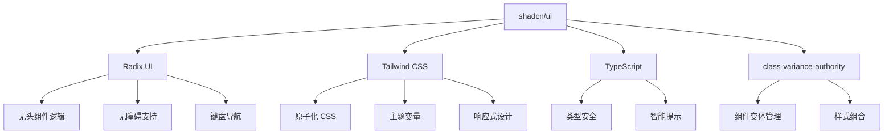
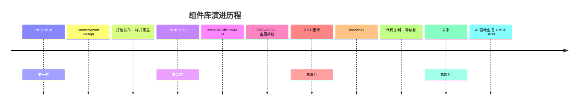
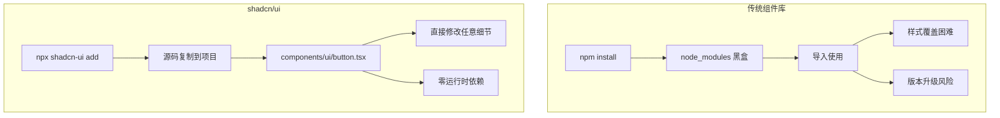
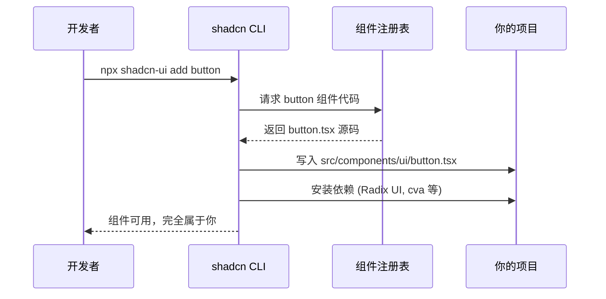
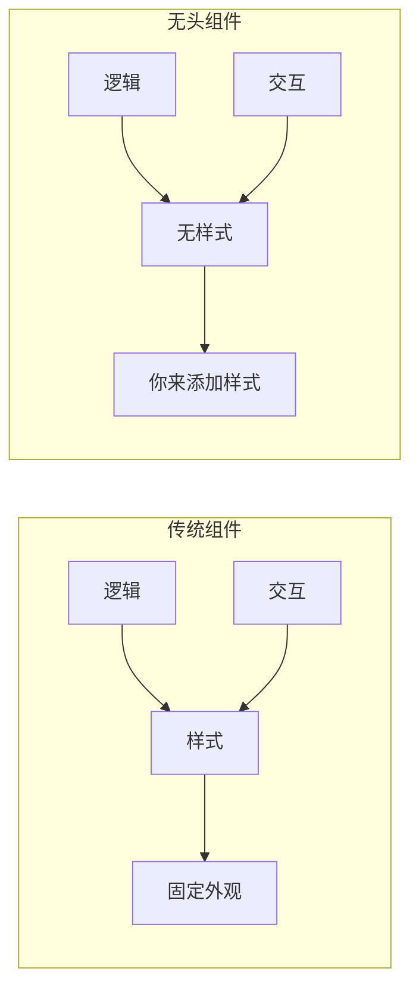
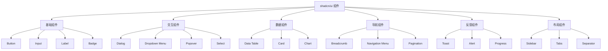

# shadcn/ui 核心知识体系

> 一套设计精美、可访问的 React 组件集合，完全由你掌控的源代码

**创建日期：** 2026-04-07  
**最后更新：** 2026-04-07  
**版本：** 1.0.0  
**GitHub Star：** 111k+

---

## 目录

1. [基础认知：重新定义组件库](#1-基础认知重新定义组件库)
2. [架构设计与核心原理](#2-架构设计与核心原理)
3. [核心组件详解](#3-核心组件详解)
4. [主题定制与设计系统](#4-主题定制与设计系统)
5. [可访问性 (Accessibility)](#5-可访问性-accessibility)
6. [工程化与 CLI 工具](#6-工程化与 cli 工具)
7. [实战应用与最佳实践](#7-实战应用与最佳实践)
8. [常见误区与面试问题](#8-常见误区与面试问题)

---

## 1. 基础认知：重新定义组件库

---

### 1.1 什么是 shadcn/ui

#### 官方定义

**shadcn/ui** 是一套设计精美、可访问的 React 组件集合，同时也是一个代码分发平台。它由 Vercel 工程师 shadcn（真名 Paco）于 2023 年创建，自推出以来在 GitHub 上迅速获得超过 111k+ Star，成为前端开发领域最受关注的开源项目之一。

#### 核心理念：代码所有权

shadcn/ui 的核心理念可以概括为一句话：**"组件即你的代码"（Components as Your Own Code）**。

与传统 UI 组件库（如 Ant Design、Material-UI、Chakra UI）不同，shadcn/ui**不是**一个通过 `npm install` 安装的第三方依赖包，而是一套可直接复制到项目中的高质量组件**源代码集合**。

```bash
# 传统组件库：安装黑盒依赖
npm install @mui/material

# shadcn/ui：复制源代码到你的项目
npx shadcn-ui@latest add button
# 结果：完整的 button.tsx 文件出现在你的 src/components/ui/ 目录中
```

这种独特的"复制 - 粘贴"模式赋予开发者完全的控制权：
- 你可以直接修改任何样式细节
- 你可以调整组件的内部逻辑
- 你可以查看完整的实现，没有隐藏的"魔法"
- 你拥有 100% 的代码所有权

---

### 1.2 shadcn/ui 是什么，不是什么

#### 是什么 ✅

| 特性 | 说明 |
|------|------|
| **组件源代码集合** | 每个组件都是独立的 TypeScript + Tailwind CSS 文件，直接存在于你的项目中 |
| **代码分发平台** | 通过 CLI 工具按需获取组件代码，运行你自己的代码注册表 |
| **设计系统起点** | 提供统一的颜色系统、间距规范和交互模式，可作为内部设计系统的基础 |
| **开发哲学** | 用"所有权"换取"极致灵活性"，回归代码的本质控制 |

#### 不是什么 ❌

| 误解 | 事实 |
|------|------|
| ❌ npm 包/依赖库 | ✅ 不发布 npm 包，没有运行时依赖 |
| ❌ 黑盒组件 | ✅ 所有组件源码完全开放，可直接阅读和修改 |
| ❌ 主题覆盖模式 | ✅ 样式直接使用 Tailwind CSS 类，无需覆盖样式变量 |
| ❌ 固定组件数量 | ✅ 社区持续贡献，已有 200+ 扩展组件和变体 |
| ❌ 仅限 React | ✅ 已扩展支持 Vue、Svelte、Angular、React Native |

---

### 1.3 技术栈组成

shadcn/ui 本身不发明轮子，而是巧妙组合了两个强大的现代前端工具：



#### 核心技术详解

| 技术 | 作用 | 说明 |
|------|------|------|
| **Radix UI** | 底层交互逻辑 | 提供无样式、无障碍的原始组件（Headless UI），处理弹窗、下拉菜单的行为和键盘导航 |
| **Tailwind CSS** | 样式实现 | 使用原子化 CSS 类实现样式，提供极致灵活的定制能力，无需编写额外 CSS 文件 |
| **TypeScript** | 类型系统 | 所有组件均使用 TypeScript 编写，提供完整的类型推导和智能提示 |
| **class-variance-authority** | 变体管理 | 管理组件的多种样式变体（如 Button 的 primary/secondary/destructive 等） |

#### 底层架构

```
你的项目
├── src/
│   ├── components/
│   │   └── ui/              # shadcn/ui 组件源码（你完全拥有）
│   │       ├── button.tsx   # Button 组件
│   │       ├── dialog.tsx   # Dialog 组件
│   │       └── input.tsx    # Input 组件
│   ├── lib/
│   │   └── utils.ts         # 工具函数（cn 类名合并）
│   └── styles/
│       └── globals.css      # 全局样式（CSS 变量主题）
├── components.json          # shadcn 配置文件
└── tailwind.config.js       # Tailwind 配置
```

---

### 1.4 组件库的演进历程

shadcn/ui 代表了前端组件库发展的最新阶段：



#### 各代对比

| 代数 | 代表 | 特点 | 痛点 |
|------|------|------|------|
| **第一代** | Bootstrap、Ant Design | 打包发布、按需加载、样式覆盖 | 样式覆盖复杂、升级风险高、包体积大 |
| **第二代** | MUI、Chakra UI | CSS-in-JS、主题系统、树摇优化 | 基础依赖体积、运行时开销、定制困难 |
| **第三代** | shadcn/ui、Magic UI | 代码复制、零依赖、完全可控 | 代码量较大、需要理解源码 |
| **第四代** | v0.dev、Cursor | AI 生成、MCP 技能化、设计稿转代码 | 仍在发展中 |

---

### 1.5 适用场景与不适用场景

#### ✅ 推荐使用

| 场景 | 理由 |
|------|------|
| **追求长期可维护性的项目** | 代码完全可控，不受第三方库版本升级影响 |
| **需要构建内部设计系统的团队** | 可作为高质量起点，轻松定制品牌风格 |
| **已使用 Tailwind CSS 的项目** | 无缝集成，无需额外学习成本 |
| **需要快速原型或标准化项目** | 组件开箱即用，设计统一美观 |
| **AI 编程辅助场景** | AI 可直接阅读和理解组件源码，提供精准建议 |
| **需要满足无障碍要求的项目** | 基于 Radix UI，默认支持完整可访问性 |

#### ❌ 不推荐使用

| 场景 | 理由 |
|------|------|
| **需要大量预建组件** | 组件数量相对较少（约 50+ 核心组件） |
| **完全不想维护 UI 代码** | 需要自己维护和定制组件代码 |
| **团队不熟悉 Tailwind CSS** | 需要额外学习 Tailwind CSS |
| **需要现成的复杂业务组件** | 如数据表格、富文本编辑器等需要自行扩展 |
| **需要 Material Design 风格** | 设计风格偏向现代极简，非 Material 风格 |

---

### 1.6 核心优势总结

#### 1. 零运行时开销

传统 UI 库的运行时依赖会带来包体积膨胀和性能损耗，而 shadcn/ui 的组件源码直接集成到项目中，没有运行时依赖，显著提升应用性能。

```
传统 UI 库：你的代码 + 运行时库 + 样式引擎 = 臃肿打包
shadcn/ui：你的代码 = 精简打包
```

#### 2. 完全可定制

开发者拥有组件的完整源代码，可以根据项目需求自由修改组件的样式和逻辑，不再受限于第三方库的设计。

```tsx
// 直接打开 button.tsx 修改
const Button = React.forwardRef<HTMLButtonElement, ButtonProps>(
  ({ className, variant = "default", size = "default", ...props }, ref) => {
    return (
      <button
        className={cn(
          buttonVariants({ variant, size, className }),
          // 直接在这里添加你的渐变效果
          "hover:bg-gradient-to-r hover:from-blue-500 hover:to-purple-600"
        )}
        ref={ref}
        {...props}
      />
    )
  }
)
```

#### 3. AI 编程的最佳搭档

在 AI 编码助手普及的今天，shadcn/ui 的设计理念显得尤为前瞻：

| 传统组件库 | shadcn/ui |
|------------|-----------|
| AI 无法"看到"node_modules 中的组件实现 | AI 可以直接阅读、理解和修改项目中的组件源码 |
| 只能基于有限的文档给出建议 | AI 可以精准找到并修改对应的代码行 |
| 难以理解复杂的样式覆盖逻辑 | 样式直接使用 Tailwind 类，AI 易于理解 |

#### 4. 按需引入，极致轻量

只添加你真正需要的组件。每个组件都是独立的，没有隐藏的依赖。

```bash
# 只添加需要的组件
npx shadcn-ui@latest add button
npx shadcn-ui@latest add dialog
npx shadcn-ui@latest add form
```

#### 5. 无障碍优先

所有组件基于 Radix UI 构建，通过 WAI-ARIA 标准认证，键盘导航支持度达 100%，屏幕阅读器兼容性完善。

---

### 1.7 创始人背景与项目历史

#### 创始人

- **shadcn**（真名 Paco）：Vercel 的工程师
- 注意：并非 Vercel CEO Guillermo Rauch，这是一个常见的误解

#### 发展历程

| 时间 | 事件 |
|------|------|
| **2023 年** | shadcn/ui 项目启动，GitHub 仓库创建 |
| **2023 年底** | GitHub Star 突破 50k，社区开始活跃 |
| **2024 年** | 组件数量扩展到 50+，生态系统初步形成 |
| **2025 年** | GitHub Star 突破 90k，支持多框架（Vue、Svelte） |
| **2026 年** | GitHub Star 突破 111k，社区贡献组件超过 200+ |

#### 与 Vercel 的关系

shadcn/ui 是 Vercel 工程师的开源项目，与 Vercel 的生态系统（Next.js、v0.dev）深度集成：

- **v0.dev**：Vercel 推出的 AI 生成代码工具，基于 shadcn/ui 和 Tailwind CSS 生成可复制粘贴的代码
- **Next.js**：shadcn/ui 默认支持 Next.js App Router 架构
- **Vercel 部署**：使用 shadcn/ui 的项目可一键部署到 Vercel

---

### 1.8 本章小结

| 核心概念 | 要点 |
|----------|------|
| **是什么** | 组件源代码集合，代码分发平台 |
| **核心理念** | "组件即你的代码"，100% 代码所有权 |
| **技术栈** | Radix UI（逻辑）+ Tailwind CSS（样式）+ TypeScript |
| **核心优势** | 零运行时开销、完全可定制、AI 友好、按需引入 |
| **适用场景** | 长期可维护项目、设计系统构建、Tailwind 项目 |

---

## 2. 架构设计与核心原理

---

### 2.1 复制 - 粘贴模式的工作原理

shadcn/ui 的核心创新在于其独特的"复制 - 粘贴"（Copy-Paste）模式，这种模式彻底改变了开发者与 UI 组件库的交互方式。

#### 传统模式 vs shadcn/ui 模式



#### 工作流程详解



---

### 2.2 组件即你的代码（Components as Your Own Code）

#### 设计哲学

shadcn/ui 的设计围绕**"组件即你的代码"**展开，这意味着：

| 传统组件库 | shadcn/ui |
|------------|-----------|
| 组件在 `node_modules` 中，是"别人的代码" | 组件在 `src/components/ui/` 中，是"你的代码" |
| 修改需要覆盖样式或等待官方更新 | 修改只需打开文件直接编辑 |
| AI 无法阅读内部实现 | AI 可以直接理解并提供精准建议 |
| 调试需要跳转到依赖包 | 调试就在项目源码中 |

---

### 2.3 无头组件（Headless UI）与 Radix UI 的关系

#### 什么是无头组件

**无头组件（Headless UI）** 是指只提供功能逻辑和交互行为，但不包含任何预设样式的组件。这个概念类似于"无头 CMS"——只提供内容管理功能，不包含前端展示层。



#### Radix UI 的角色

Radix UI 是 shadcn/ui 的底层依赖，提供无头组件逻辑：

| 层面 | Radix UI 提供 | shadcn/ui 添加 |
|------|--------------|----------------|
| **逻辑** | 组件状态管理、事件处理 | 复用 Radix 逻辑 |
| **交互** | 键盘导航、焦点管理 | 复用 Radix 交互 |
| **无障碍** | ARIA 属性、屏幕阅读器支持 | 复用 Radix 无障碍 |
| **样式** | 无（故意不提供） | Tailwind CSS 完整样式 |

#### 为什么选择 Radix UI

| 特性 | 说明 |
|------|------|
| **可访问性** | 严格遵循 WAI-ARIA 标准，键盘导航 100% 支持 |
| **功能完备** | 25+ 个低级别组件，覆盖常见交互场景 |
| **无样式** | 完全无预设样式，100% 定制自由 |
| **TypeScript** | 完整的类型定义，智能提示完善 |
| **社区活跃** | 持续维护，与 React 新版本兼容 |

---

### 2.4 样式系统：Tailwind CSS 与 CSS 变量

#### Tailwind CSS 原子化样式

shadcn/ui 完全使用 Tailwind CSS 实现样式，采用原子化（Utility-First）方法：

```tsx
// Button 组件的样式类
"inline-flex items-center justify-center whitespace-nowrap rounded-md text-sm font-medium ring-offset-background transition-colors focus-visible:outline-none focus-visible:ring-2 focus-visible:ring-ring focus-visible:ring-offset-2 disabled:pointer-events-none disabled:opacity-50"
```

**优势：**
- **可组合性**：通过类名组合实现不同变体
- **可预测性**：每个类名含义明确，无隐藏副作用
- **按需编译**：未使用的样式会被 Tree Shaking 移除
- **响应式**：内置移动优先的断点系统

#### CSS 变量主题系统

shadcn/ui 使用 CSS 变量实现全局主题切换，这是其样式架构的核心创新：

```css
/* globals.css - 根变量定义 */
:root {
  --background: 0 0% 100%;        /* 背景色 */
  --foreground: 222.2 84% 4.9%;   /* 文字色 */
  --primary: 222.2 47.4% 11.2%;   /* 主色 */
  --primary-foreground: 210 40% 98%;  /* 主色上的文字 */
  --muted: 210 40% 96.1%;         /* muted 背景 */
  --accent: 210 40% 96.1%;        /* 强调色 */
  --radius: 0.5rem;               /* 圆角 */
}

.dark {
  --background: 222.2 84% 4.9%;
  --foreground: 210 40% 98%;
  --primary: 210 40% 98%;
  --primary-foreground: 222.2 47.4% 11.2%;
}
```

#### Tailwind 配置集成

```js
// tailwind.config.js
module.exports = {
  theme: {
    extend: {
      colors: {
        background: "hsl(var(--background))",
        foreground: "hsl(var(--foreground))",
        primary: {
          DEFAULT: "hsl(var(--primary))",
          foreground: "hsl(var(--primary-foreground))",
        },
        muted: {
          DEFAULT: "hsl(var(--muted))",
          foreground: "hsl(var(--muted-foreground))",
        },
      },
      borderRadius: {
        lg: "var(--radius)",
        md: "calc(var(--radius) - 2px)",
        sm: "calc(var(--radius) - 4px)",
      },
    },
  },
}
```

---

### 2.5 按需引入与零运行时开销

#### 按需引入机制

```bash
# 只添加需要的组件
npx shadcn-ui@latest add button
npx shadcn-ui@latest add card
npx shadcn-ui@latest add dialog

# 项目结构
src/components/ui/
├── button.tsx      # 仅当你添加了 Button
├── card.tsx        # 仅当你添加了 Card
└── dialog.tsx      # 仅当你添加了 Dialog
```

#### 性能对比

| 指标 | 传统 UI 库 | shadcn/ui |
|------|------------|-----------|
| 初始 JS 体积 | 200-500KB | 5-20KB（按组件计） |
| CSS 体积 | 100-300KB | 按需生成，通常<50KB |
| 运行时开销 | 有（样式引擎） | 无 |
| Tree Shaking | 部分支持 | 完全支持 |

---

### 2.6 本章小结

| 核心概念 | 要点 |
|----------|------|
| **复制 - 粘贴模式** | CLI 工具将组件源码直接复制到项目，无需 npm 依赖 |
| **组件即你的代码** | 100% 代码所有权，可直接修改任意细节 |
| **无头组件** | Radix UI 提供逻辑，shadcn/ui 添加样式 |
| **样式系统** | Tailwind CSS + CSS 变量实现主题切换 |
| **按需引入** | 物理隔离，只打包实际使用的组件 |
| **零运行时开销** | 无运行时依赖，性能最优 |

---

## 3. 核心组件详解

---

### 3.1 组件分类体系

shadcn/ui 提供 50+ 个核心组件，按功能可分为六大类：



---

### 3.2 基础组件

#### 3.2.1 Button（按钮）

```tsx
import { Button } from "@/components/ui/button"

// 变体
<Button variant="default">主操作</Button>
<Button variant="secondary">次要操作</Button>
<Button variant="destructive">危险操作</Button>
<Button variant="outline">边框按钮</Button>
<Button variant="ghost">幽灵按钮</Button>
<Button variant="link">链接样式</Button>

// 尺寸
<Button size="sm">小按钮</Button>
<Button size="default">默认尺寸</Button>
<Button size="lg">大按钮</Button>
<Button size="icon">图标按钮</Button>
```

**变体说明：**

| 变体 | 用途 | 视觉特征 |
|------|------|----------|
| `default` | 主要操作、表单提交 | 实心背景，高对比度 |
| `secondary` | 次要操作、取消 | 浅色背景 |
| `destructive` | 删除、危险操作 | 红色背景 |
| `outline` | 中等优先级操作 | 边框样式 |
| `ghost` | 低优先级操作、工具栏 | 悬停时显示背景 |
| `link` | 导航链接 | 文字下划线 |

#### 3.2.2 Input（输入框）

```tsx
import { Input } from "@/components/ui/input"

<Input type="email" placeholder="请输入邮箱" />
<Input disabled placeholder="禁用输入框" />
<Input readOnly value="只读内容" />
```

---

### 3.3 交互组件

#### 3.3.1 Dialog（对话框）

```tsx
import {
  Dialog,
  DialogContent,
  DialogDescription,
  DialogFooter,
  DialogHeader,
  DialogTitle,
  DialogTrigger,
} from "@/components/ui/dialog"

<Dialog>
  <DialogTrigger asChild>
    <Button>打开对话框</Button>
  </DialogTrigger>
  <DialogContent>
    <DialogHeader>
      <DialogTitle>标题</DialogTitle>
      <DialogDescription>描述文字</DialogDescription>
    </DialogHeader>
    <DialogFooter>
      <Button>保存</Button>
    </DialogFooter>
  </DialogContent>
</Dialog>
```

#### 3.3.2 Dropdown Menu（下拉菜单）

```tsx
import {
  DropdownMenu,
  DropdownMenuContent,
  DropdownMenuItem,
  DropdownMenuTrigger,
} from "@/components/ui/dropdown-menu"

<DropdownMenu>
  <DropdownMenuTrigger asChild>
    <Button>打开菜单</Button>
  </DropdownMenuTrigger>
  <DropdownMenuContent>
    <DropdownMenuItem>个人资料</DropdownMenuItem>
    <DropdownMenuItem>设置</DropdownMenuItem>
  </DropdownMenuContent>
</DropdownMenu>
```

---

### 3.4 数据组件

#### 3.4.1 Data Table（数据表格）

基于 TanStack Table 构建，支持排序、过滤、分页等高级功能。

#### 3.4.2 Card（卡片）

```tsx
import {
  Card,
  CardContent,
  CardDescription,
  CardFooter,
  CardHeader,
  CardTitle,
} from "@/components/ui/card"

<Card>
  <CardHeader>
    <CardTitle>卡片标题</CardTitle>
    <CardDescription>卡片描述</CardDescription>
  </CardHeader>
  <CardContent>
    <p>卡片内容</p>
  </CardContent>
  <CardFooter>
    <Button>操作</Button>
  </CardFooter>
</Card>
```

---

### 3.5 完整组件列表

| 组件名 | 分类 | 说明 |
|--------|------|------|
| Accordion | 交互 | 手风琴折叠面板 |
| Alert | 反馈 | 警告提示框 |
| Alert Dialog | 交互 | 警告对话框 |
| Avatar | 基础 | 头像组件 |
| Badge | 基础 | 徽章标签 |
| Breadcrumb | 导航 | 面包屑导航 |
| Button | 基础 | 按钮 |
| Calendar | 交互 | 日历选择器 |
| Card | 数据 | 卡片容器 |
| Carousel | 交互 | 轮播组件 |
| Chart | 数据 | 图表组件 |
| Checkbox | 交互 | 复选框 |
| Combobox | 交互 | 组合框 |
| Command | 交互 | 命令菜单 |
| Context Menu | 交互 | 右键菜单 |
| Data Table | 数据 | 数据表格 |
| Date Picker | 交互 | 日期选择器 |
| Dialog | 交互 | 对话框 |
| Drawer | 交互 | 抽屉面板 |
| Dropdown Menu | 交互 | 下拉菜单 |
| Form | 表单 | 表单组件 |
| Hover Card | 交互 | 悬停卡片 |
| Input | 基础 | 输入框 |
| Label | 基础 | 标签 |
| Menubar | 交互 | 菜单栏 |
| Navigation Menu | 导航 | 导航菜单 |
| Pagination | 导航 | 分页组件 |
| Popover | 交互 | 弹出框 |
| Progress | 反馈 | 进度条 |
| Radio Group | 交互 | 单选组 |
| Select | 交互 | 选择器 |
| Separator | 布局 | 分隔符 |
| Sheet | 交互 | 侧滑面板 |
| Sidebar | 布局 | 侧边栏 |
| Skeleton | 反馈 | 骨架屏 |
| Slider | 交互 | 滑块 |
| Switch | 交互 | 开关 |
| Table | 数据 | 表格 |
| Tabs | 布局 | 标签页 |
| Textarea | 基础 | 多行文本框 |
| Toast | 反馈 | 消息提示 |
| Toggle | 交互 | 切换按钮 |
| Tooltip | 反馈 | 工具提示 |
| Typography | 基础 | 排版样式 |

---

## 4. 主题定制与设计系统

---

### 4.1 CSS 变量色彩系统

shadcn/ui 的主题定制核心是 CSS 变量系统。

```css
:root {
  --background: 0 0% 100%;
  --foreground: 222.2 84% 4.9%;
  --primary: 222.2 47.4% 11.2%;
  --primary-foreground: 210 40% 98%;
  --secondary: 210 40% 96.1%;
  --muted: 210 40% 96.1%;
  --accent: 210 40% 96.1%;
  --destructive: 0 84.2% 60.2%;
  --border: 214.3 31.8% 91.4%;
  --radius: 0.5rem;
}

.dark {
  --background: 222.2 84% 4.9%;
  --foreground: 210 40% 98%;
  --primary: 210 40% 98%;
}
```

---

### 4.2 亮色/暗色主题切换

使用 `next-themes` 库实现：

```tsx
// app/layout.tsx
<ThemeProvider attribute="class" defaultTheme="system" enableSystem>
  {children}
</ThemeProvider>

// 切换组件
const { setTheme } = useTheme()
setTheme("dark")
```

---

## 5. 可访问性 (Accessibility)

---

### 5.1 WAI-ARIA 标准支持

所有组件基于 Radix UI 构建，遵循 WAI-ARIA 1.2 标准。

### 5.2 键盘导航

| 组件 | 按键 | 行为 |
|------|------|------|
| Button | Enter / Space | 触发点击 |
| Dialog | Esc | 关闭对话框 |
| Dropdown Menu | ↑ ↓ | 上下选择 |
| Tabs | ← → | 切换标签 |

---

## 6. 工程化与 CLI 工具

---

### 6.1 CLI 安装与初始化

```bash
# 初始化
npx shadcn@latest init

# 添加组件
npx shadcn@latest add button dialog
```

### 6.2 components.json 配置

```json
{
  "$schema": "https://ui.shadcn.com/schema.json",
  "style": "default",
  "rsc": true,
  "tsx": true,
  "tailwind": {
    "config": "tailwind.config.js",
    "css": "app/globals.css",
    "baseColor": "zinc",
    "cssVariables": true
  },
  "aliases": {
    "components": "@/components",
    "utils": "@/lib/utils",
    "ui": "@/components/ui"
  }
}
```

---

## 7. 实战应用与最佳实践

---

### 7.1 从零搭建项目

```bash
# 1. 创建 Next.js 项目
npx create-next-app@latest my-app --typescript --tailwind --app

# 2. 初始化 shadcn/ui
npx shadcn@latest init

# 3. 添加组件
npx shadcn@latest add button card input
```

### 7.2 性能优化

- 使用 `React.memo` 避免不必要的重渲染
- 使用 `useMemo` 缓存计算结果
- 使用 `useDebounce` 优化输入

---

## 8. 常见误区与面试问题

---

### 8.1 shadcn/ui vs 传统组件库

| 维度 | shadcn/ui | Ant Design / MUI |
|------|-----------|------------------|
| 安装方式 | 复制源代码 | npm 安装 |
| 所有权 | 完全拥有 | 依赖官方 |
| 包体积 | 按需引入 | 整体导入 |
| 定制 | 直接修改 | 主题覆盖 |

### 8.2 面试高频问题

**Q: shadcn/ui 和传统组件库的核心区别是什么？**

A: shadcn/ui 不是传统组件库，而是一套组件源码集合。核心区别在于代码所有权：shadcn/ui 的组件源码直接复制到项目中，开发者拥有 100% 控制权；传统组件库通过 npm 安装，代码在 node_modules 中是"黑盒"。

---

## 附录：学习资源

| 资源 | 链接 |
|------|------|
| 官方文档 | [ui.shadcn.com](https://ui.shadcn.com) |
| GitHub 仓库 | [github.com/shadcn-ui/ui](https://github.com/shadcn-ui/ui) |
| 主题生成器 | [tweakcn.com](https://tweakcn.com) |
| Awesome 列表 | [birobirobiro/awesome-shadcn-ui](https://github.com/birobirobiro/awesome-shadcn-ui) |

---

*本文档遵循 CC BY 4.0 协议 | 最后更新：2026-04-07*
