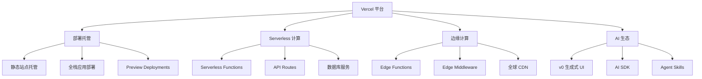

# 第 1 章：Vercel 基础认知

## 1.1 什么是 Vercel？

Vercel 是一个专为现代 Web 应用设计的云端部署与托管平台，由 Next.js 团队开发并维护。其核心使命是让开发者更专注于代码本身，而不是繁琐的服务器配置，实现从开发到上线的全流程自动化。

**核心定位：**
- **前端应用托管**：支持静态网站、单页应用（SPA）、全栈 Web 应用
- **Serverless 架构**：无需管理服务器，按需自动扩展
- **全球 CDN 加速**：静态资源自动部署到全球边缘节点
- **自动 CI/CD**：连接 GitHub/GitLab/Bitbucket 后，每次 `git push` 自动触发构建和部署

**设计哲学：**
```
Develop. Preview. Ship. —— 开发、预览、发布，一体化完成
```

---

## 1.2 Vercel 的发展历史与核心定位

### 发展历程

| 时间 | 事件 |
|------|------|
| 2015 年 | Guillermo Rauch 创立 ZEIT 公司（Vercel 前身） |
| 2020 年 | 完成 2100 万美元 A 轮融资，正式更名为 Vercel |
| 2023 年 4 月 | 以 170 亿元人民币估值位列《2023 胡润全球独角兽榜》第 404 位 |
| 2023 年 9 月 | 发布 AI 生成式 UI 系统 v0 测试版（基于 React 和 Tailwind CSS） |
| 2025 年 5 月 | v0 正式版推出，超过 10 万用户申请测试 |
| 2025 年 6 月 | 估值增至 240 亿元，《2025 全球独角兽榜》第 302 位 |
| 2025 年 8 月 | 完成新一轮融资，估值约 648 亿元人民币（90 亿美元） |
| 2025 年 10 月 | Meta 采用 Vercel 替代内部系统，实现与 GitHub 整合的分钟级部署 |
| 2025 年 11 月 | 应用 Anthropic Claude Opus 4.5 模型生成完整购物网站前端 |
| 2026 年 1 月 | 发布 Agent Skills 开源项目，为 AI 编程智能体提供标准化技能包管理器 |

### 核心产品矩阵



---

## 1.3 Vercel 的三大核心产品

### 1. 部署托管（Deployment & Hosting）

**核心特性：**
- **零配置部署**：自动识别主流框架（Next.js/React/Vue/Svelte/Angular/Nuxt/Gatsby 等）
- **全球 CDN 加速**：覆盖 70+ 边缘节点，静态资源自动压缩优化
- **自动 CI/CD**：代码提交后 5 秒内完成部署
- **Preview Deployments**：每个 PR 生成独立预览链接
- **免费 SSL 证书**：自动签发 HTTPS 证书
- **自定义域名**：支持绑定自己的域名，免费配置 DNS

### 2. Serverless 计算（Serverless Compute）

**Serverless Functions（区域函数）：**
- 运行在特定云区域，提供完整 Node.js 环境
- 按需自动扩展，无需管理服务器
- 适合数据库操作、复杂业务逻辑、支付处理等场景
- 响应速度稳定在 200ms 以内

**Edge Functions（边缘函数）：**
- 运行在全球 300+ 边缘节点上
- 基于 V8 引擎的轻量级 Edge Runtime
- 全球延迟控制在 50ms 内
- 适合路由转发、身份验证、个性化内容、A/B 测试

### 3. AI 生态系统（AI Ecosystem）

**v0 生成式 UI 系统：**
- 基于 AI 模型生成 React 代码
- 使用 shadcn/ui 和 Tailwind CSS
- 训练过程不使用 Vercel 客户数据或代码
- 支持与 GitHub 整合的分钟级部署

**Vercel AI SDK：**
- 为 AI 应用开发提供标准化工具链
- 支持流式响应处理
- 内置身份验证与安全机制

**Agent Skills（2026 年 1 月发布）：**
- 为 AI 编程智能体提供标准化技能包管理器
- 将专业知识封装为可复用的技能模块

---

## 1.4 Vercel vs 传统部署方案

| 特性 | Vercel | 传统部署（Nginx + CDN） |
|------|--------|------------------------|
| 配置复杂度 | 零配置，自动识别框架 | 需手动配置 SSL、缓存策略、反向代理 |
| 部署速度 | `git push` 后 5 秒内完成 | 需手动构建、上传、重启服务 |
| 扩展能力 | 自动按需扩展 | 需预先规划服务器容量 |
| 预览部署 | 每个 PR 自动生成预览链接 | 需手动搭建预览环境 |
| 全球 CDN | 内置，自动分发 | 需单独配置 CDN 服务 |
| 成本模型 | 按使用量计费，免费额度充足 | 固定服务器成本 + CDN 费用 |
| 维护成本 | 几乎为零 | 需持续运维和监控 |

---

## 1.5 Vercel 的典型应用场景

### 场景 1：Next.js 全栈应用
- **最适合**：Vercel 由 Next.js 团队开发，对 Next.js 提供原生支持
- **特性利用**：App Router、Server Components、ISR、Edge Functions

### 场景 2：静态站点/文档网站
- **适合框架**：React、Vue、Svelte、Gatsby、Docusaurus、Nuxt
- **特性利用**：静态资源 CDN、自动优化、零配置部署

### 场景 3：AI 应用
- **特性利用**：Vercel AI SDK、流式响应、Serverless Functions
- **典型用例**：聊天机器人、AI 生成内容、智能助手

### 场景 4：电商/营销页面
- **特性利用**：Preview Deployments、A/B 测试、全球 CDN
- **优势**：快速迭代、全球访问速度、高并发处理

### 场景 5：企业级应用
- **特性利用**：团队协作、权限管理、监控日志、自定义域名
- **优势**：安全合规、可扩展性、专业支持

---

## 1.6 核心客户与生态影响

### 知名客户
- **OpenAI**：官方使用 Vercel 部署
- **Netflix**：部分前端应用
- **Stripe**：支付相关页面
- **Meta**：2025 年 10 月采用 Vercel 替代内部系统

### 开源项目
- **Next.js**：React 全栈框架（GitHub 60k+ stars）
- **SWR**：React Hooks 数据请求库
- **Vercel AI SDK**：AI 应用开发工具链
- **Agent Skills**：AI 智能体技能包管理器

### 市场估值
- 2025 年 8 月：90 亿美元
- 累计融资：超过 5.6 亿美元
- 云托管业务毛利率：76%

---

*第 1 章完成 | 草稿保存至 `.work/vercel/drafts/chapter-1.md`*
