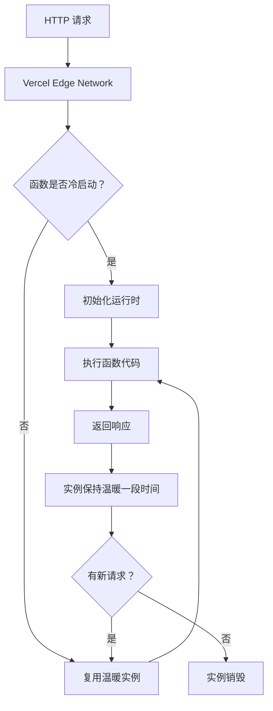
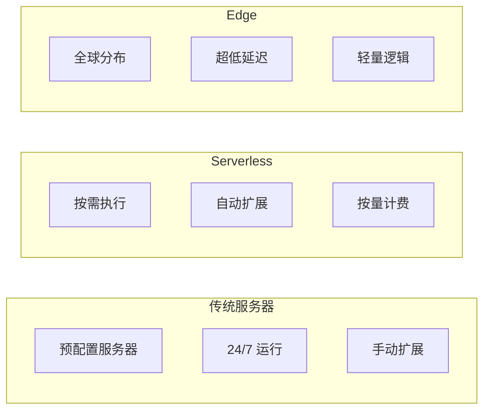

# 第 3 章：Serverless Functions

## 3.1 Serverless Functions 工作原理

### 什么是 Serverless Functions？

Vercel Serverless Functions（无服务器函数）是一种**按需执行**的云函数，无需管理服务器基础设施，代码仅在请求触发时运行并自动扩展。

### 核心特性

| 特性 | 说明 |
|------|------|
| **零运维** | 无需配置、监控或维护服务器 |
| **按需执行** | 仅在请求触发时运行，无请求时不消耗资源 |
| **自动扩展** | 从零到数百万并发，自动处理流量峰值 |
| **按量计费** | 仅按实际执行时间和次数计费 |
| **多语言支持** | Node.js、Python、Go、Ruby 等 |

### 架构原理



### 与其他计算模式对比



### 执行流程详解

**1. 冷启动（Cold Start）**
- 函数首次被调用或长时间未调用后的启动
- 包括：运行时初始化、代码加载、依赖安装
- 典型时间：100ms - 2s（取决于运行时和代码大小）

**2. 热启动（Warm Start）**
- 复用已初始化的函数实例
- 典型时间：10ms - 50ms

**3. 执行限制**
| 参数 | 限制 |
|------|------|
| 最大执行时间（Hobby） | 10 秒 |
| 最大执行时间（Pro） | 60 秒 |
| 最大执行时间（Enterprise） | 900 秒（15 分钟） |
| 最大内存 | 1024 MB |
| 最大包大小 | 50 MB |

---

## 3.2 函数编写与部署

### 函数文件结构

在 Vercel 项目中，Serverless Functions 放置在 `api/` 目录下：

```
my-project/
├── api/
│   ├── hello.js              # /api/hello 端点
│   ├── users/
│   │   ├── index.js          # /api/users 端点
│   │   └── [id].js           # /api/users/:id 端点（动态路由）
│   └── webhook/
│       └── stripe.js         # /api/webhook/stripe 端点
├── public/
└── package.json
```

### 基本函数示例

**Node.js 函数（hello.js）：**
```javascript
// api/hello.js
export default function handler(req, res) {
  const { name = 'World' } = req.query;
  
  res.status(200).json({
    message: `Hello, ${name}!`,
    timestamp: new Date().toISOString(),
  });
}
```

**异步函数：**
```javascript
// api/data.js
export default async function handler(req, res) {
  // 等待异步操作
  const data = await fetchDataFromDatabase();
  
  res.status(200).json({ data });
}
```

**动态路由（[id].js）：**
```javascript
// api/users/[id].js
export default function handler(req, res) {
  const { id } = req.query;
  
  // 根据 ID 获取用户
  const user = getUserById(id);
  
  if (user) {
    res.status(200).json(user);
  } else {
    res.status(404).json({ error: 'User not found' });
  }
}
```

### HTTP 方法处理

```javascript
// api/users.js
export default function handler(req, res) {
  switch (req.method) {
    case 'GET':
      // 获取用户列表
      return getUsers(res);
    
    case 'POST':
      // 创建新用户
      return createUser(req, res);
    
    case 'PUT':
      // 更新用户
      return updateUser(req, res);
    
    case 'DELETE':
      // 删除用户
      return deleteUser(req, res);
    
    default:
      res.setHeader('Allow', ['GET', 'POST', 'PUT', 'DELETE']);
      res.status(405).end(`Method ${req.method} Not Allowed`);
  }
}
```

### 访问请求数据

```javascript
// api/echo.js
export default function handler(req, res) {
  // 1. 查询参数 (?name=John)
  const { name } = req.query;
  
  // 2. 路由参数 (api/users/[id].js)
  const { id } = req.query; // 或 req.params
  
  // 3. 请求体 (POST/PUT)
  const body = req.body;
  
  // 4. 请求头
  const authHeader = req.headers.authorization;
  
  // 5. Cookies
  const cookie = req.cookies?.sessionId;
  
  res.json({ name, id, body, authHeader, cookie });
}
```

---

## 3.3 运行时与区域选择

### 支持的运行时

**Node.js Serverless Functions：**
| Node.js 版本 | 状态 |
|-------------|------|
| 18.x | ✅ 支持 |
| 20.x | ✅ 推荐 |
| 22.x | ✅ 支持 |

**Python（需配置）：**
```json
// vercel.json
{
  "functions": {
    "api/*.py": {
      "runtime": "python3.9"
    }
  }
}
```

**Go（需配置）：**
```json
// vercel.json
{
  "functions": {
    "api/*.go": {
      "runtime": "go1.x"
    }
  }
}
```

### 区域配置

Serverless Functions 部署在指定的云区域，影响：
- **延迟**：离用户越近越快
- **数据驻留**：满足合规要求
- **成本**：不同区域价格可能不同

**配置方式 1：vercel.json**
```json
{
  "regions": ["iad1"] 
}
```

**可用区域：**
| 区域代码 | 位置 | 适用地区 |
|---------|------|---------|
| `iad1` | 美国东部（弗吉尼亚） | 北美、欧洲 |
| `sfo1` | 美国西部（旧金山） | 北美西海岸、亚洲 |
| `pdx1` | 美国西部（波特兰） | 北美西海岸 |
| `cle1` | 美国中部（克利夫兰） | 北美中部 |
| `hnd1` | 日本（东京） | 东亚、东南亚 |
| `syd1` | 澳大利亚（悉尼） | 大洋洲 |

**配置方式 2：单个函数配置**
```javascript
// api/database.js
export const config = {
  regions: ['hnd1'], // 仅在日本区域运行
};

export default function handler(req, res) {
  // ...
}
```

---

## 3.4 API Routes 集成（Next.js）

### Next.js Pages Router

```javascript
// pages/api/hello.js
export default function handler(req, res) {
  res.status(200).json({ message: 'Hello from Next.js!' });
}
```

### Next.js App Router（Route Handlers）

```javascript
// app/api/hello/route.js
import { NextResponse } from 'next/server';

export async function GET(request) {
  return NextResponse.json({ message: 'Hello from App Router!' });
}

export async function POST(request) {
  const body = await request.json();
  return NextResponse.json({ received: body });
}
```

### 数据库连接示例

```javascript
// lib/db.js
import { Pool } from '@vercel/postgres';

const pool = new Pool({
  connectionString: process.env.DATABASE_URL,
});

export async function query(text, params) {
  const client = await pool.connect();
  try {
    return await client.query(text, params);
  } finally {
    client.release();
  }
}

// pages/api/users.js
import { query } from '../../lib/db';

export default async function handler(req, res) {
  const result = await query('SELECT * FROM users');
  res.json(result.rows);
}
```

---

## 3.5 性能优化与成本考量

### 冷启动优化

**问题：** 冷启动导致首次请求延迟高

**优化策略：**

**1. 代码分割**
```javascript
// ❌ 不好：加载所有依赖
import { heavy, unused, alsoUnused } from 'large-library';

// ✅ 好：按需加载
import { onlyWhatINeed } from 'lightweight-alternative';
```

**2. 连接复用**
```javascript
// ❌ 不好：每次请求创建新连接
export default async function handler(req, res) {
  const client = await createDatabaseConnection();
  const data = await client.query('SELECT * FROM users');
  await client.close();
  res.json(data);
}

// ✅ 好：模块级缓存连接
let cachedClient = null;

async function getClient() {
  if (!cachedClient) {
    cachedClient = await createDatabaseConnection();
  }
  return cachedClient;
}

export default async function handler(req, res) {
  const client = await getClient();
  const data = await client.query('SELECT * FROM users');
  res.json(data);
}
```

**3. 预热策略**
```javascript
// 使用 Vercel Cron Jobs 定期调用
// api/warmup.js
export default function handler(req, res) {
  res.json({ status: 'warm' });
}

// vercel.json
{
  "crons": [{
    "path": "/api/warmup",
    "schedule": "*/5 * * * *" // 每 5 分钟调用一次
  }]
}
```

### 成本优化

**计费维度：**
| 维度 | 说明 |
|------|------|
| 执行次数 | 函数被调用的次数 |
| 执行时间 | 函数运行时长（GB-秒） |
| 数据传输 | 出站流量 |

**优化建议：**

1. **减少不必要的调用**
   - 使用 CDN 缓存静态响应
   - 客户端缓存不常变更的数据

2. **优化执行时间**
   - 数据库查询优化
   - 异步操作并行化

3. **选择合适的计划**
   | 计划 | 每月免费额度 | 超出价格 |
   |------|-------------|---------|
   | Hobby | 100 GB-秒 | $0.000016667/GB-秒 |
   | Pro | 500 GB-秒 | $0.000013333/GB-秒 |
   | Enterprise | 自定义 | 协商定价 |

### 监控与调试

**1. 实时日志**
```bash
# 通过 CLI 查看实时日志
vercel logs [deployment-url]

# 查看特定函数日志
vercel logs [deployment-url] /api/hello
```

**2. 错误追踪**
- Vercel 仪表板 → Analytics → Functions
- 查看错误率、执行时间、调用次数

**3. 本地调试**
```bash
# 使用 Vercel CLI 本地运行
vercel dev

# 访问 http://localhost:3000/api/hello
```

---

*第 3 章完成 | 草稿保存至 `.work/vercel/drafts/chapter-3.md`*
