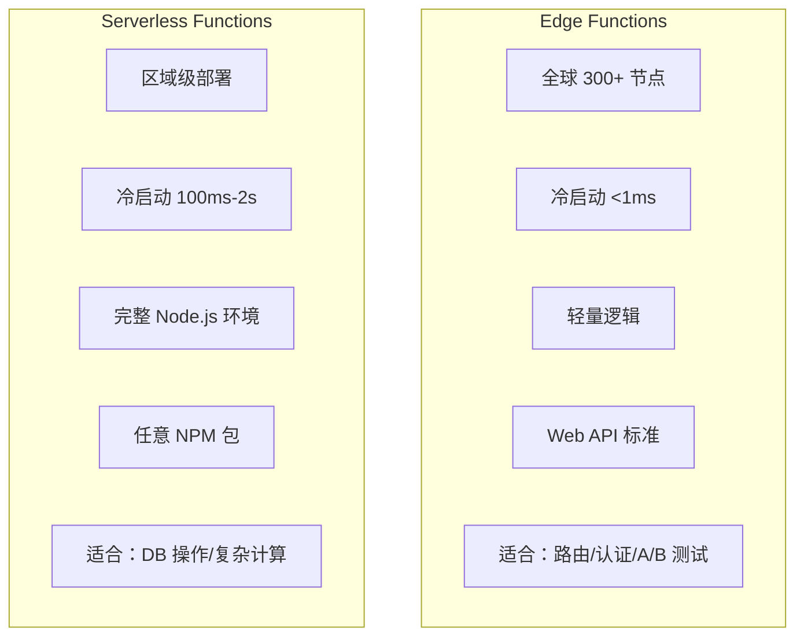
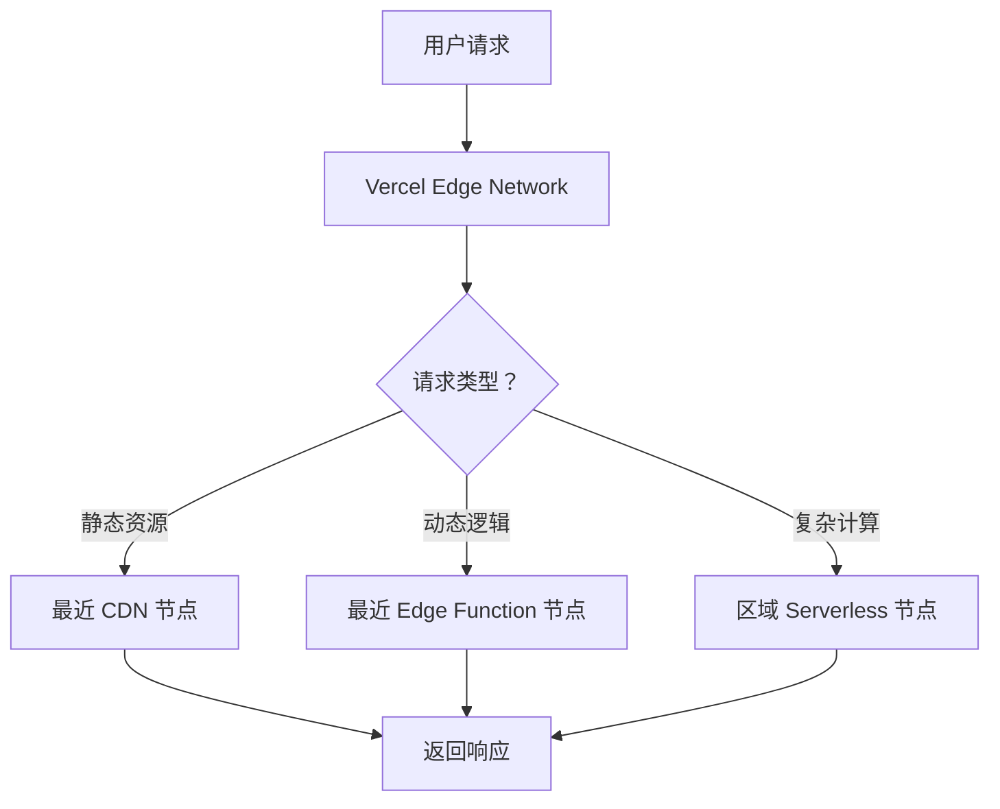
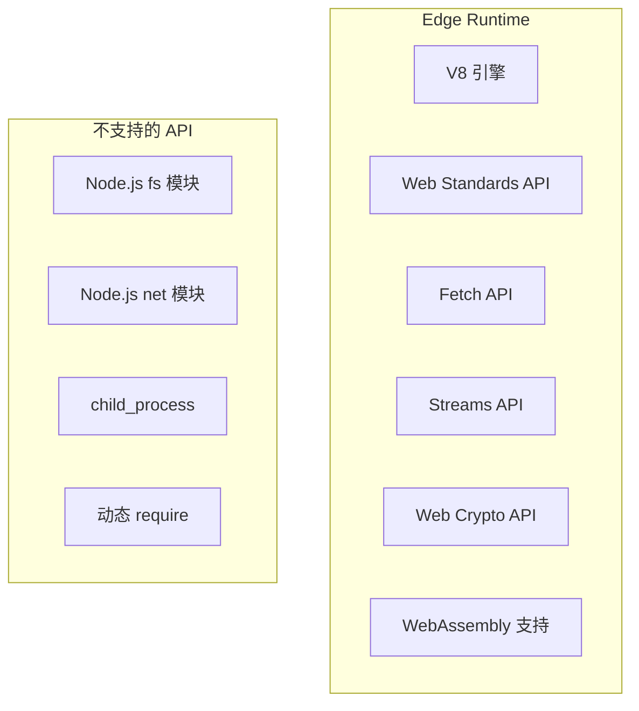
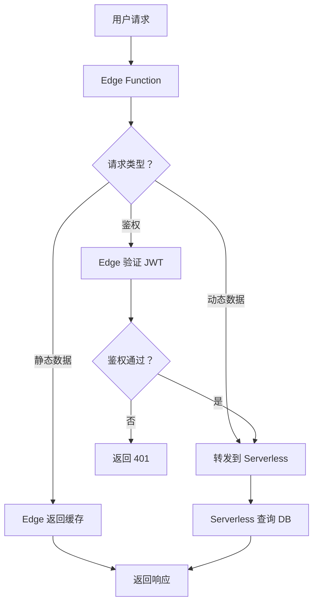
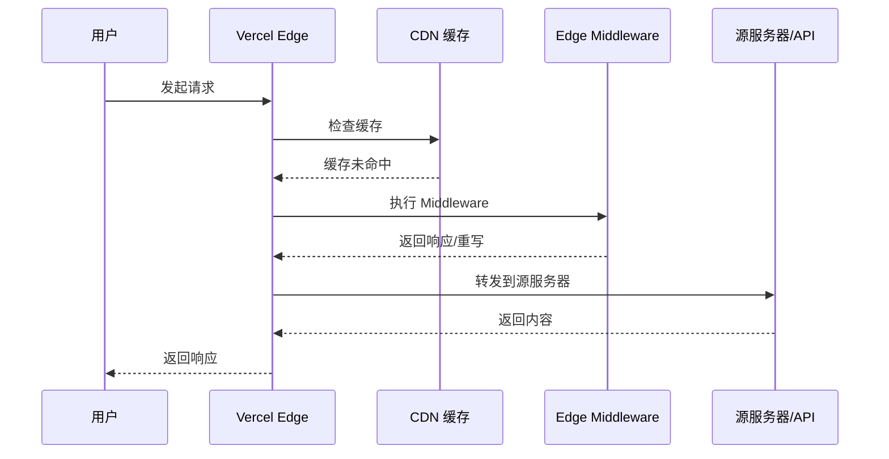

# 第 4 章：Edge Functions 与边缘计算

## 4.1 Edge Functions 架构解析

### 什么是 Edge Functions？

Vercel Edge Functions 是一种在**全球边缘节点**上运行的轻量级函数，能够在最接近用户的区域执行代码，将延迟降至最低。

### 核心特性

| 特性 | 说明 |
|------|------|
| **全球分布** | 运行在 Vercel 300+ 边缘节点（70+ PoPs） |
| **超低延迟** | 全球延迟控制在 50ms 内 |
| **快速启动** | 冷启动时间 <1ms |
| **轻量运行时** | 基于 V8 引擎的 Edge Runtime |
| **标准 API** | 使用 Web Standards API（Request/Response） |

### Edge vs Serverless 对比



**详细对比：**

| 维度 | Edge Functions | Serverless Functions |
|------|---------------|---------------------|
| **运行位置** | 全球边缘节点 | 指定云区域（如 iad1） |
| **启动延迟** | <1ms | 100ms - 2s |
| **运行时** | Edge Runtime（V8） | Node.js（完整环境） |
| **API 支持** | Web Standards API | 完整 Node.js API |
| **NPM 包** | 有限（需兼容 Edge） | 无限制 |
| **执行时间** | 最大 50ms CPU 时间 | 10s - 900s |
| **典型延迟** | 全球 <50ms | 依赖区域位置 |
| **成本** | $0.00001/执行单元 | $0.000016667/GB-秒 |

### 架构示意



---

## 4.2 Edge Runtime 技术原理

### 什么是 Edge Runtime？

Edge Runtime 是 Vercel 自研的轻量级 JavaScript 运行时，基于 Chrome 浏览器使用的 **V8 引擎**构建，但移除了浏览器相关的 API，保留了 Web Standards API。

### 运行时架构



### 支持的 API

**✅ 支持的 Web Standards：**
```javascript
// Request/Response API
const request = new Request(url);
const response = new Response('Hello');

// Fetch API
const res = await fetch(url);

// Headers API
const headers = new Headers();
headers.append('Content-Type', 'application/json');

// Streams API
const stream = new ReadableStream();

// Web Crypto API
const digest = await crypto.subtle.digest('SHA-256', data);

// URL/URLPattern API
const url = new URL('/path', 'https://example.com');

// WebAssembly
const wasm = await WebAssembly.instantiateStreaming(...);
```

**❌ 不支持的 Node.js API：**
```javascript
// 文件系统
require('fs')          // ❌
require('path')        // ❌
require('os')          // ❌

// 网络
require('net')         // ❌
require('http')        // ❌

// 子进程
require('child_process') // ❌

// 其他
process.cwd()          // ❌
__dirname              // ❌
```

### 性能优化机制

**1. 预热实例池**
- Edge 节点维护预热的运行时实例池
- 请求到达时立即分配实例
- 无冷启动延迟

**2. 代码分发**
- 函数代码预先分发到所有边缘节点
- 无需在请求时下载代码
- 保证全球一致的启动速度

**3. 执行单元计费**
- 按 CPU 时间计费（50ms 为单位）
- 比 Serverless 便宜约 15 倍（相同工作量）

---

## 4.3 Edge Functions 实战场景

### 场景 1：A/B 测试路由

```javascript
// middleware.ts (Next.js)
import { NextResponse } from 'next/server';

export function middleware(request) {
  const url = request.nextUrl.clone();
  
  // 根据 Cookie 分流用户
  const abTest = request.cookies.get('ab-test')?.value;
  
  if (!abTest) {
    // 随机分配 A 组或 B 组
    const group = Math.random() < 0.5 ? 'a' : 'b';
    const response = NextResponse.next();
    response.cookies.set('ab-test', group, { maxAge: 60 * 60 * 24 * 30 });
    return response;
  }
  
  // 根据分组重定向
  if (abTest === 'b') {
    url.pathname = '/new-design';
    return NextResponse.rewrite(url);
  }
  
  return NextResponse.next();
}

export const config = {
  matcher: '/',
};
```

### 场景 2：地理定位个性化

```javascript
// app/api/location/route.js
import { NextResponse } from 'next/server';

export function GET(request) {
  // 从请求头获取地理位置
  const country = request.headers.get('x-vercel-ip-country') || 'Unknown';
  const city = request.headers.get('x-vercel-ip-city') || 'Unknown';
  const timezone = request.headers.get('x-vercel-ip-timezone') || 'UTC';
  
  return NextResponse.json({
    country,
    city,
    timezone,
    message: `Hello from ${city}, ${country}!`,
  });
}
```

### 场景 3：请求鉴权

```javascript
// middleware.ts
import { NextResponse } from 'next/server';
import { jwtVerify } from 'jose';

export async function middleware(request) {
  const token = request.cookies.get('auth-token')?.value;
  
  if (!token) {
    return NextResponse.redirect(new URL('/login', request.url));
  }
  
  try {
    // 验证 JWT 令牌
    await jwtVerify(token, new TextEncoder().encode(process.env.JWT_SECRET));
    return NextResponse.next();
  } catch (error) {
    return NextResponse.redirect(new URL('/login', request.url));
  }
}

export const config = {
  matcher: ['/dashboard/:path*', '/api/protected/:path*'],
};
```

### 场景 4：响应缓存

```javascript
// app/api/data/route.js
import { NextResponse } from 'next/server';

export async function GET(request) {
  const cacheKey = 'api-data-cache';
  
  // 检查缓存（使用 KV 存储）
  const cached = await getFromCache(cacheKey);
  if (cached) {
    return new NextResponse(cached, {
      headers: {
        'x-cache': 'HIT',
        'cache-control': 'public, max-age=60',
      },
    });
  }
  
  // 获取新数据
  const data = await fetchExpensiveData();
  
  // 写入缓存
  await setToCache(cacheKey, data, 60);
  
  return new NextResponse(JSON.stringify(data), {
    headers: {
      'x-cache': 'MISS',
      'cache-control': 'public, max-age=60',
      'content-type': 'application/json',
    },
  });
}
```

### 场景 5：请求重写/代理

```javascript
// middleware.ts
import { NextResponse } from 'next/server';

export function middleware(request) {
  const url = request.nextUrl.clone();
  
  // 将旧路径重写为新路径
  if (url.pathname.startsWith('/docs/v1')) {
    url.pathname = url.pathname.replace('/v1', '/v2');
    return NextResponse.rewrite(url);
  }
  
  // 代理外部 API
  if (url.pathname.startsWith('/api/proxy/')) {
    const targetUrl = url.pathname.replace('/api/proxy/', 'https://external-api.com/');
    url.href = targetUrl;
    return NextResponse.rewrite(url);
  }
  
  return NextResponse.next();
}
```

---

## 4.4 Edge vs Serverless 选择指南

### 选择 Edge Functions 的场景

| 场景 | 理由 |
|------|------|
| **低延迟要求** | 全球 <50ms 延迟 |
| **简单逻辑** | 路由、重定向、头部修改 |
| **高并发读取** | 缓存命中、A/B 测试 |
| **边缘缓存** | 根据用户特征返回不同内容 |
| **成本敏感** | 按执行单元计费，成本更低 |

### 选择 Serverless Functions 的场景

| 场景 | 理由 |
|------|------|
| **数据库操作** | 需要完整 Node.js 驱动 |
| **复杂计算** | 执行时间 >50ms |
| **第三方 API** | 需要特定 NPM 包支持 |
| **文件处理** | 需要文件系统访问 |
| **后台任务** | 长时间运行的任务 |

### 混合架构示例



**代码实现：**
```javascript
// middleware.ts (Edge) - 处理鉴权
export async function middleware(request) {
  const token = request.cookies.get('token')?.value;
  
  if (!token || !isValidToken(token)) {
    return NextResponse.json({ error: 'Unauthorized' }, { status: 401 });
  }
  
  // 鉴权通过，转发到 Serverless
  return NextResponse.next();
}

// app/api/data/route.js (Serverless) - 处理业务逻辑
import { db } from '@/lib/db';

export async function GET(request) {
  // 执行数据库查询
  const data = await db.query('SELECT * FROM products');
  return Response.json(data);
}
```

---

## 4.5 边缘中间件 (Edge Middleware)

### 什么是 Edge Middleware？

Edge Middleware 是在**缓存之后、请求之前**运行的 Edge Function，用于在请求到达页面或 API 之前执行逻辑。

### 执行时机



### Middleware vs Edge Functions 区别

| 维度 | Edge Middleware | Edge Functions |
|------|---------------|---------------|
| **执行时机** | 缓存之后，源请求之前 | 直接在边缘执行 |
| **主要用途** | 修改请求/响应 | 返回完整响应 |
| **访问缓存** | 可以访问缓存内容 | 无法访问缓存 |
| **文件位置** | `middleware.ts`（根目录） | `app/**/route.ts` 或 `api/*.ts` |

### 典型应用场景

**1. 国际化路由**
```javascript
// middleware.ts
import { NextResponse } from 'next/server';

export function middleware(request) {
  const { pathname } = request.nextUrl;
  
  // 检查是否有地区前缀
  const pathnameHasLocale = pathname.startsWith('/en') || pathname.startsWith('/zh');
  
  if (!pathnameHasLocale) {
    // 获取用户地区
    const locale = request.headers.get('x-vercel-ip-country') === 'CN' ? 'zh' : 'en';
    
    // 重定向到带地区前缀的 URL
    request.nextUrl.pathname = `/${locale}${pathname}`;
    return NextResponse.redirect(request.nextUrl);
  }
  
  return NextResponse.next();
}
```

**2. 机器人检测**
```javascript
// middleware.ts
import { NextResponse } from 'next/server';

export function middleware(request) {
  const userAgent = request.headers.get('user-agent') || '';
  
  // 检测已知的爬虫/机器人
  const botPatterns = [
    /bot/i, /crawler/i, /spider/i, /scraper/i
  ];
  
  if (botPatterns.some(pattern => pattern.test(userAgent))) {
    // 允许善意爬虫（Google、Bing 等）
    const allowedBots = ['Googlebot', 'Bingbot', 'Bytespider'];
    if (!allowedBots.some(bot => userAgent.includes(bot))) {
      // 阻止恶意爬虫
      return new NextResponse('Blocked', { status: 403 });
    }
  }
  
  return NextResponse.next();
}
```

### 性能最佳实践

1. **减少 Middleware 执行时间**
   - 避免复杂计算
   - 使用简单的条件判断

2. **精确配置 matcher**
   ```javascript
   export const config = {
     // 仅在特定路径运行
     matcher: ['/dashboard/:path*', '/api/:path*'],
     
     // 排除静态资源
     // matcher: '/((?!_next/static|_next/image|favicon.ico).*)',
   };
   ```

3. **利用响应头部**
   ```javascript
   const response = NextResponse.next();
   response.headers.set('x-custom-header', 'value');
   return response;
   ```

---

*第 4 章完成 | 草稿保存至 `.work/vercel/drafts/chapter-4.md`*
