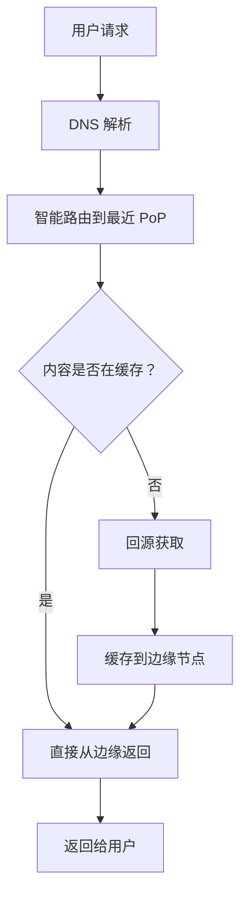
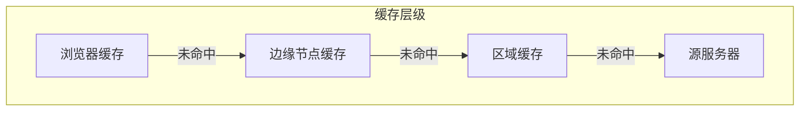
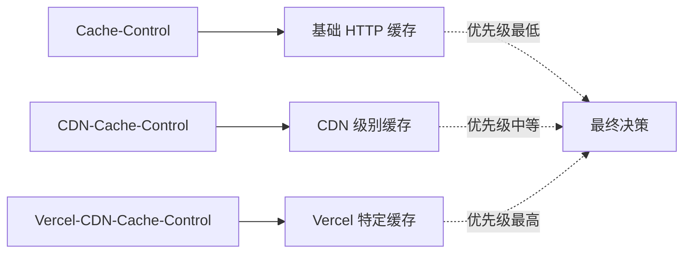
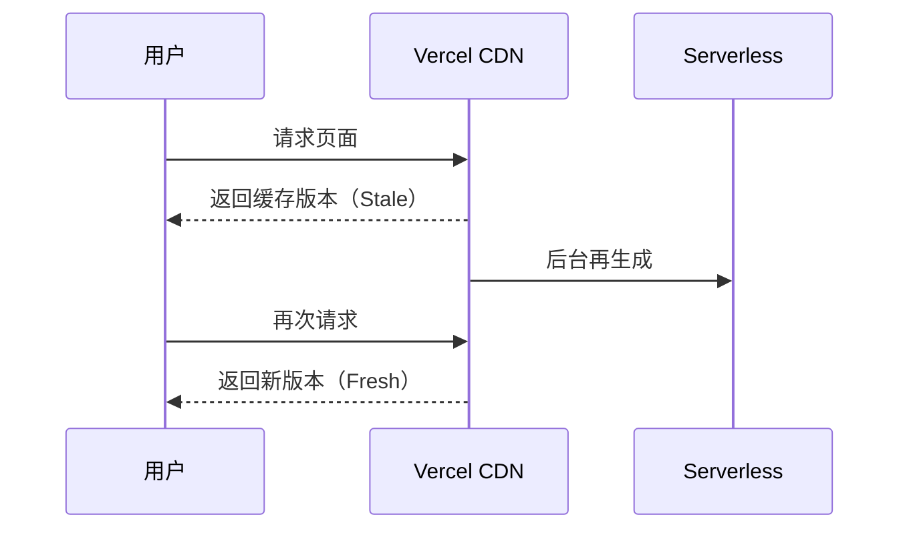

# 第 5 章：全球 CDN 与性能优化

## 5.1 Vercel CDN 网络架构

### 全球网络覆盖

Vercel CDN 是一个全球分布式内容分发网络，通过 70+ PoPs（Points of Presence）和 125+ 边缘节点，将内容缓存到离用户最近的位置。

### 网络架构



### 核心特性

| 特性 | 说明 |
|------|------|
| **智能路由** | 自动选择最优路径和节点 |
| **HTTP/2 + HTTP/3** | 支持最新协议，提升传输效率 |
| **自动压缩** | Gzip/Brotli 自动压缩 |
| **图片优化** | 自动格式转换（WebP/AVIF） |
| **DDoS 防护** | L3/L4/L7 全方位防护 |

### 缓存层级



---

## 5.2 静态资源优化

### 自动优化机制

**1. 图片优化**
```javascript
// Next.js Image 组件自动优化
import Image from 'next/image';

<Image
  src="/photo.jpg"
  alt="Description"
  width={800}
  height={600}
  priority  // 关键图片优先加载
  quality={75}  // 压缩质量
  sizes="(max-width: 768px) 100vw, 50vw"  // 响应式尺寸
/>
```

**优化效果：**
- 自动转换为 WebP/AVIF 格式
- 按需加载不同尺寸
- 懒加载非关键图片
- 减少 80%+ 图片体积

**2. 字体优化**
```javascript
// Next.js Font 优化
import { Inter } from 'next/font/google';

const inter = Inter({
  subsets: ['latin'],
  display: 'swap',  // 避免 FOIT
  preload: true,    // 预加载
});
```

**3. 脚本优化**
```javascript
// Next.js Script 组件
import Script from 'next/script';

<Script
  src="https://analytics.example.com/script.js"
  strategy="lazyOnload"  // 空闲时加载
  onLoad={() => console.log('Script loaded')}
/>
```

### 文件压缩

| 文件类型 | 压缩方式 | 压缩率 |
|---------|---------|-------|
| HTML/CSS/JS | Brotli/Gzip | 70-90% |
| 图片 | WebP/AVIF | 50-80% |
| 字体 | WOFF2 | 30-50% |

---

## 5.3 缓存控制策略

### 三层缓存控制头

Vercel 使用三层缓存控制头：



### 缓存头详解

**1. Cache-Control（基础）**
```http
Cache-Control: public, max-age=31536000, immutable
```

| 指令 | 说明 |
|------|------|
| `public` | 可被任何缓存存储 |
| `private` | 仅浏览器可缓存 |
| `max-age=3600` | 缓存 1 小时 |
| `s-maxage=3600` | CDN 缓存 1 小时 |
| `immutable` | 内容永不变更（哈希文件名） |
| `no-store` | 不缓存 |
| `no-cache` | 每次都验证 |

**2. CDN-Cache-Control（CDN 级别）**
```http
CDN-Cache-Control: max-age=86400
```

**3. Vercel-CDN-Cache-Control（Vercel 特定）**
```http
Vercel-CDN-Cache-Control: max-age=604800
```

### 基于标签的缓存失效（Tag-based Invalidation）

**设置缓存标签：**
```javascript
// api/data.js
export default async function handler(req, res) {
  const data = await fetchData();
  
  res.setHeader('Vercel-CDN-Cache-Control', 'max-age=3600');
  res.setHeader('Vercel-Cache-Tag', 'posts,homepage');
  
  res.json(data);
}
```

**清除缓存：**
```bash
# Vercel Dashboard API
curl -X POST https://api.vercel.com/v2/projects/[id]/cache-tags \
  -H "Authorization: Bearer [token]" \
  -d '{"tags": ["posts", "homepage"]}'
```

**Next.js 中使用：**
```javascript
// app/posts/page.js
import { revalidateTag } from 'next/cache';

export default async function Page() {
  const posts = await fetch('https://...', {
    next: { tags: ['posts'] },
  });
  
  return <div>{/* ... */}</div>;
}

// 清除缓存
revalidateTag('posts');
```

---

## 5.4 缓存策略最佳实践

### 不同内容类型的推荐策略

| 内容类型 | 推荐策略 | 示例 |
|---------|---------|------|
| **静态资源（哈希文件）** | `max-age=31536000, immutable` | JS/CSS/图片 |
| **HTML 页面** | `no-cache` 或 `max-age=0, must-revalidate` | 动态页面 |
| **API 响应** | `max-age=60, stale-while-revalidate` | 数据接口 |
| **用户特定内容** | `private, no-store` | 个人中心 |

### vercel.json 配置示例

```json
{
  "headers": [
    {
      "source": "/static/(.*)",
      "headers": [
        {
          "key": "Cache-Control",
          "value": "public, max-age=31536000, immutable"
        }
      ]
    },
    {
      "source": "/api/(.*)",
      "headers": [
        {
          "key": "Cache-Control",
          "value": "public, max-age=60, stale-while-revalidate=300"
        }
      ]
    },
    {
      "source": "/(.*)",
      "headers": [
        {
          "key": "X-Content-Type-Options",
          "value": "nosniff"
        },
        {
          "key": "X-Frame-Options",
          "value": "DENY"
        }
      ]
    }
  ]
}
```

---

## 5.5 性能监控与分析

### Vercel Analytics

**核心指标：**
| 指标 | 说明 | 优秀值 |
|------|------|-------|
| **LCP** | 最大内容绘制 | <2.5s |
| **FID** | 首次输入延迟 | <100ms |
| **CLS** | 累积布局偏移 | <0.1 |
| **TTFB** | 首字节时间 | <800ms |

### Web Vitals 监控

```javascript
// app/analytics.js
import { useReportWebVitals } from 'next/web-vitals';

export function useWebVitals() {
  useReportWebVitals((metric) => {
    // 发送到分析服务
    fetch('/api/analytics', {
      method: 'POST',
      body: JSON.stringify(metric),
    });
  });
}
```

### 缓存命中率分析

**查看缓存指标：**
1. Vercel Dashboard → Analytics → Cache
2. 查看缓存命中率、回源率
3. 分析缓存标签使用情况

**优化建议：**
- 缓存命中率 <90% → 增加缓存时间
- 回源率高 → 检查缓存策略
- 特定地区延迟高 → 检查该地区节点覆盖

---

## 5.6 增量静态再生（ISR）

### ISR 工作原理



### Next.js ISR 配置

```javascript
// pages/posts/[id].js
export async function getStaticProps({ params }) {
  const post = await fetchPost(params.id);
  
  return {
    props: { post },
    // 每 60 秒重新生成
    revalidate: 60,
  };
}

export async function getStaticPaths() {
  return {
    paths: [],
    fallback: 'blocking', // 或 true/blocking
  };
}
```

### on-demand ISR

```javascript
// app/api/revalidate/route.js
import { revalidatePath, revalidateTag } from 'next/cache';

export async function POST(request) {
  const { path, tag } = await request.json();
  
  if (path) {
    revalidatePath(path);
  }
  
  if (tag) {
    revalidateTag(tag);
  }
  
  return Response.json({ revalidated: true });
}
```

---

*第 5 章完成 | 草稿保存至 `.work/vercel/drafts/chapter-5.md`*
