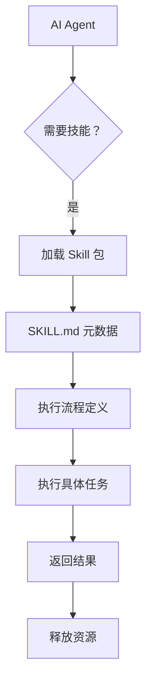

# 第 6 章：Vercel AI 生态系统

## 6.1 Vercel AI SDK 概述

### 什么是 Vercel AI SDK？

Vercel AI SDK 是一个用于构建 AI 驱动应用的完整工具链，提供流式响应处理、多模型支持、React Hooks 等功能，让开发者轻松集成 AI 能力到 Web 应用中。

### 核心特性

| 特性 | 说明 |
|------|------|
| **流式响应** | 原生支持 SSE（Server-Sent Events）流式传输 |
| **多模型支持** | OpenAI、Anthropic、Google、本地模型等 |
| **React Hooks** | `useChat`、`useCompletion`、`useEmbedding` |
| **服务端集成** | Next.js App Router、Server Actions 支持 |
| **类型安全** | 完整的 TypeScript 类型定义 |

### 安装与配置

```bash
npm install ai
```

**基础用法：**
```javascript
// app/api/chat/route.js
import { streamText } from 'ai';
import { openai } from '@ai-sdk/openai';

export async function POST(req) {
  const { messages } = await req.json();
  
  const result = streamText({
    model: openai('gpt-4o'),
    messages,
  });
  
  return result.toDataStreamResponse();
}
```

**客户端 Hook：**
```javascript
// components/chat.js
'use client';

import { useChat } from 'ai/react';

export default function Chat() {
  const { messages, input, handleInputChange, handleSubmit } = useChat();
  
  return (
    <div>
      {messages.map(m => (
        <div key={m.id}>{m.role}: {m.content}</div>
      ))}
      <form onSubmit={handleSubmit}>
        <input value={input} onChange={handleInputChange} />
        <button type="submit">发送</button>
      </form>
    </div>
  );
}
```

---

## 6.2 v0 生成式 UI 系统

### 什么是 v0？

v0 是 Vercel 推出的 AI 生成式 UI 系统，可根据自然语言描述生成 React 组件代码，基于 shadcn/ui 和 Tailwind CSS 构建。

### 核心特性

| 特性 | 说明 |
|------|------|
| **文本转 UI** | 输入自然语言描述，生成完整组件代码 |
| **基于 shadcn/ui** | 使用高质量的 Radix UI 组件 |
| **Tailwind CSS** | 实用优先的样式系统 |
| **可复制粘贴** | 生成的代码可直接使用 |
| **GitHub 集成** | 一键部署到 Vercel |

### 使用示例

**输入提示词：**
```
创建一个带有搜索功能的任务管理面板，包含待办、进行中、已完成三个状态列
```

**生成的代码结构：**
```jsx
import { useState } from 'react';
import { Card, CardContent, CardHeader, CardTitle } from '@/components/ui/card';
import { Input } from '@/components/ui/input';
import { Badge } from '@/components/ui/badge';

export default function TaskBoard() {
  const [searchTerm, setSearchTerm] = useState('');
  const [tasks] = useState([
    { id: 1, title: '完成任务 1', status: 'todo' },
    { id: 2, title: '进行中任务 2', status: 'in-progress' },
    { id: 3, title: '已完成任务 3', status: 'done' },
  ]);
  
  return (
    <div className="p-6">
      <Input
        placeholder="搜索任务..."
        value={searchTerm}
        onChange={(e) => setSearchTerm(e.target.value)}
      />
      <div className="grid grid-cols-3 gap-4 mt-4">
        {/* 任务列 */}
      </div>
    </div>
  );
}
```

### 数据隐私

- **不使用客户数据训练**：v0 的训练数据完全来自公开数据
- **代码隔离**：用户生成的代码不会被用于改进模型
- **企业级安全**：支持私有部署选项

---

## 6.3 Agent Skills 项目

### 什么是 Agent Skills？

Agent Skills 是 Vercel 于 2026 年 1 月发布的开源项目，旨在为 AI 编程智能体提供标准化的技能包管理器。

### 核心理念



### Skill 包结构

```
skill-name/
├── SKILL.md              # 技能描述与执行流程
├── package.json          # 依赖配置
├── scripts/
│   └── run.js           # 执行脚本
├── templates/
│   └── template.md      # 模板文件
└── examples/
    └── example.md       # 使用示例
```

### SKILL.md 示例

```markdown
# Skill Name: Vercel Deploy Expert

## Description
帮助开发者在 Vercel 平台上部署全栈应用的专业技能

## Capabilities
- 自动检测框架类型
- 配置环境变量
- 优化部署设置
- 故障排查

## Input Schema
{
  "projectPath": "string",
  "targetEnvironment": "production|preview"
}

## Execution Flow
1. 检测项目框架
2. 读取 package.json
3. 配置 vercel.json
4. 执行部署
5. 验证部署状态
```

### 核心价值

| 价值 | 说明 |
|------|------|
| **知识封装** | 将专家经验转化为可执行技能 |
| **标准化** | 统一技能包格式，便于复用 |
| **渐进式披露** | 按需加载，降低 Token 消耗 |
| **跨 Agent 兼容** | 任何 Agent 都可调用 |

---

## 6.4 AI 应用部署最佳实践

### 流式响应优化

**1. 使用 Edge Functions**
```javascript
// app/api/chat/route.js
import { streamText } from 'ai';
import { openai } from '@ai-sdk/openai';

// 强制使用 Edge Runtime
export const runtime = 'edge';

export async function POST(req) {
  const { messages } = await req.json();
  
  const result = streamText({
    model: openai('gpt-4o'),
    messages,
  });
  
  return result.toDataStreamResponse();
}
```

**2. 启用请求缓存**
```javascript
import { kv } from '@vercel/kv';

export async function POST(req) {
  const { messages } = await req.json();
  
  // 生成缓存键
  const cacheKey = `chat:${hashMessages(messages)}`;
  
  // 检查缓存
  const cached = await kv.get(cacheKey);
  if (cached) {
    return new Response(cached, {
      headers: { 'x-cache': 'HIT' },
    });
  }
  
  // 执行并缓存
  const result = await streamText({ model, messages });
  await kv.set(cacheKey, result, { ex: 3600 });
  
  return result.toDataStreamResponse();
}
```

### 环境变量安全

```javascript
// ✅ 正确：服务端读取
// app/api/chat/route.js
const apiKey = process.env.OPENAI_API_KEY;

// ❌ 错误：客户端暴露
// components/chat.js
const apiKey = process.env.NEXT_PUBLIC_OPENAI_API_KEY; // 会泄露到客户端
```

### 身份验证

```javascript
// middleware.ts
import { NextResponse } from 'next/server';

export async function middleware(request) {
  const token = request.cookies.get('auth-token')?.value;
  
  if (!token) {
    return NextResponse.redirect(new URL('/login', request.url));
  }
  
  // 验证令牌
  try {
    await verifyToken(token);
    return NextResponse.next();
  } catch {
    return NextResponse.redirect(new URL('/login', request.url));
  }
}

export const config = {
  matcher: '/api/chat/:path*',
};
```

---

## 6.5 安全与身份验证

### 常见安全问题

**1. API 密钥泄露**
```markdown
❌ 错误做法：
- 将 API 密钥硬编码在客户端代码
- 将 .env 文件提交到 Git
- 使用 NEXT_PUBLIC_ 前缀存储敏感密钥

✅ 正确做法：
- 所有 API 调用通过 Serverless Functions
- API 密钥仅在服务端使用
- 使用 Vercel 环境变量管理
```

**2. Server Actions 安全**
```javascript
// ✅ 安全的 Server Action
'use server';

import { auth } from '@/lib/auth';
import { db } from '@/lib/db';

export async function createPost(formData) {
  // 1. 身份验证
  const user = await auth.getCurrentUser();
  if (!user) throw new Error('Unauthorized');
  
  // 2. 权限检查
  if (!user.canCreatePost) throw new Error('Forbidden');
  
  // 3. 输入验证
  const title = formData.get('title');
  if (!title || title.length < 5) {
    throw new Error('Title must be at least 5 characters');
  }
  
  // 4. 业务逻辑
  return db.post.create({ title, userId: user.id });
}
```

**3. 速率限制**
```javascript
// middleware.ts
import { kv } from '@vercel/kv';
import { NextResponse } from 'next/server';

export async function middleware(request) {
  const ip = request.ip || '127.0.0.1';
  const key = `rate-limit:${ip}`;
  
  const current = await kv.incr(key);
  if (current === 1) {
    await kv.expire(key, 60); // 1 分钟窗口
  }
  
  if (current > 10) {
    return new NextResponse('Too many requests', { status: 429 });
  }
  
  return NextResponse.next();
}
```

### Vercel AI SDK 安全特性

| 特性 | 说明 |
|------|------|
| **LoadAPIKeyError** | 自动检测 API 密钥加载失败 |
| **流式验证** | 验证每个流式响应块 |
| **错误隔离** | 捕获并隔离模型错误 |
| **审计日志** | 记录所有 API 调用 |

---

*第 6 章完成 | 草稿保存至 `.work/vercel/drafts/chapter-6.md`*
