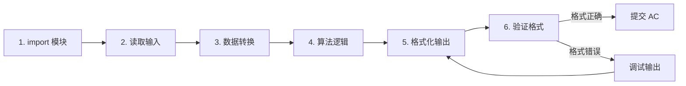
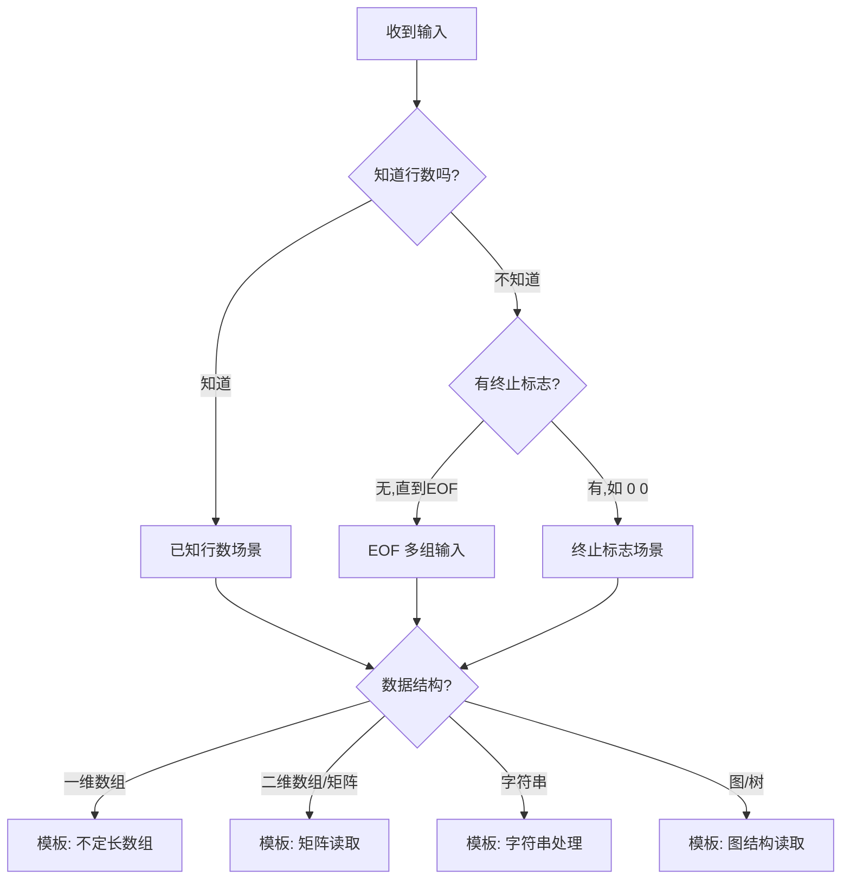

# Python ACM 模式面试手撕算法核心知识体系

> 面向面试笔试的 Python ACM 模式输入输出完全指南
>
> **创建日期：** 2026-04-14
> **最后更新：** 2026-04-14

---

## 目录

- [第 1 章 基础认知：ACM 模式是什么](#第-1-章-基础认知acm-模式是什么)
- [第 2 章 Python 输入体系：input() vs sys.stdin](#第-2-章-python-输入体系input-vs-sysstdin)
- [第 3 章 输入场景模板全覆盖](#第-3-章-输入场景模板全覆盖)
- [第 4 章 输出格式规范](#第-4-章-输出格式规范)
- [第 5 章 数据结构读取：数组、树、图的输入表示](#第-5-章-数据结构读取数组树图的输入表示)
- [第 6 章 高频踩坑与避坑指南](#第-6-章-高频踩坑与避坑指南)
- [第 7 章 面试实战模板：万能模板 + 高频题型适配](#第-7-章-面试实战模板万能模板--高频题型适配)
- [第 8 章 常见误区与面试问题](#第-8-章-常见误区与面试问题)
- [引用来源](#引用来源)

---
# 第 1 章 基础认知：ACM 模式是什么

## 1.1 ACM 模式定义

**ACM 模式**（又称 OJ 模式、完整程序模式）是算法竞赛和企业笔试中最常见的代码提交方式。在该模式下，参赛者需要编写一个**完整可运行的程序**，包括：

- 导入所需模块（如 `import sys`）
- 从标准输入（stdin）读取测试数据
- 执行算法逻辑
- 将结果输出到标准输出（stdout）

名称来源于 ACM 国际大学生程序设计竞赛（ACM-ICPC），该竞赛一直采用这种"完整程序"的提交方式，因此得名。

> **关键区别**：ACM 模式考察的不仅是算法思维，还包括**输入输出处理能力、程序结构组织能力、边界与异常处理能力**。

## 1.2 ACM 模式 vs LeetCode 核心代码模式

| 对比维度 | LeetCode 核心代码模式 | ACM 模式 |
|---------|----------------------|---------|
| **代码结构** | 只需实现一个函数（如 `class Solution`） | 完整程序，含 `main` 入口 |
| **输入方式** | 平台自动传入函数参数 | 自己从 `input()` / `sys.stdin` 读取 |
| **输出方式** | `return` 返回值 | `print()` 输出到标准输出 |
| **模块导入** | 平台预导入常用模块 | 自己 `import` 所需模块 |
| **容错性** | 只看返回值，格式由平台处理 | **格式严格匹配**（多一个空格/少一个换行都会判错） |
| **考察重点** | 算法逻辑与数据结构 | 算法 + I/O 处理 + 边界控制 |
| **适用场景** | 日常刷题、算法学习 | 企业笔试、机考、竞赛 |

### 代码对比示例（两数之和）

**LeetCode 模式：**
```python
class Solution:
    def twoSum(self, nums: list[int], target: int) -> list[int]:
        seen = {}
        for i, num in enumerate(nums):
            complement = target - num
            if complement in seen:
                return [seen[complement], i]
            seen[num] = i
```

**ACM 模式：**
```python
import sys

# 读取输入
n = int(input())           # 数组长度
target = int(input())      # 目标值
nums = list(map(int, input().split()))  # 数组元素

# 算法逻辑
seen = {}
for i, num in enumerate(nums):
    complement = target - num
    if complement in seen:
        print(seen[complement], i)  # 输出结果
        break
    seen[num] = i
```

## 1.3 为什么需要专门练习 ACM 模式

### 从 LeetCode 转过来的典型痛点

```mermaid
flowchart TD
    A[LeetCode 刷题 300+] --> B[参加大厂笔试]
    B --> C{ACM 模式}
    C -->|不熟悉输入| D[卡在数据读取]
    C -->|不习惯输出格式| E[格式错误 WA]
    C -->|不知道多组输入| F[只处理了一组数据]
    D --> G[算法会做但没 AC]
    E --> G
    F --> G
    G --> H[教训: 必须提前练 ACM 模式]
```



**真实痛点：**

1. **输入不会读**：习惯了函数传参，不知道 `input().split()` 怎么拆数据
2. **EOF 不处理**：只写了单组输入的代码，实际上题目要求处理到文件结束
3. **输出格式错**：行末多了一个空格、忘记换行，导致 "Presentation Error"
4. **性能超时**：数据量大时 `input()` 太慢，不知道用 `sys.stdin`
5. **本地无法调试**：不知道怎么在自己的 IDE 里模拟平台输入

### LeetCode 刷了几百道，为什么还是做不对 ACM 模式？

> 就像从自动挡汽车换成了手动挡——知道怎么开，但离合器总踩不好。
> —— 摘自 CSDN《Python3 ACM 模式输入输出全攻略》

LeetCode 屏蔽了所有 I/O 细节，而 ACM 模式要求你**从买菜开始，每一步都要亲力亲为**。这就是为什么很多人"算法思路清晰，但一提交就报错"。

## 1.4 哪些公司/平台使用 ACM 模式

| 平台/公司 | 使用场景 | 说明 |
|-----------|---------|------|
| **牛客网** | 在线笔试/练习场 | 国内最主流的 ACM 模式平台，有专门的 [输入输出练习场](https://ac.nowcoder.com/acm/contest/5657) |
| **华为 OD** | 机试 | 3 道编程题，ACM 模式，Python 可用 |
| **字节跳动** | 在线笔试 | 部分岗位笔试使用 ACM 模式 |
| **腾讯** | 面试手撕/笔试 | 腾讯会议共享编辑器中手写完整程序 |
| **美团/拼多多/快手** | 在线笔试 | 大多采用 ACM 模式或类 ACM 模式 |
| **AcWing** | 算法竞赛/练习 | 支持 ACM 模式提交 |
| **蓝桥杯** | 竞赛 | Python 组必须用 ACM 模式 |

## 1.5 ACM 模式编码流程



**每一步的核心任务：**

| 步骤 | 核心任务 | 常用方法 |
|------|---------|---------|
| 1. import | 导入所需模块 | `import sys`, `from collections import deque` |
| 2. 读取输入 | 从 stdin 获取原始数据 | `input()`, `sys.stdin` |
| 3. 数据转换 | 字符串 → 目标类型 | `int()`, `map()`, `split()` |
| 4. 算法逻辑 | 解题核心逻辑 | 各种算法与数据结构 |
| 5. 格式化输出 | 按题目要求打印 | `print()`, `" ".join()` |
| 6. 验证格式 | 检查空格/换行 | 本地测试对比示例输出 |

## 1.6 常见误区

| 误区 | 说明 | 正确做法 |
|------|------|---------|
| "我只刷 LeetCode 就够了" | 企业笔试大多是 ACM 模式 | 提前在牛客网练习输入输出 |
| "输出差不多就行" | ACM 模式格式要求严格 | 严格按照示例输出格式，一个空格都不能多 |
| "input() 够用了" | 大数据量时 input() 可能超时 | 10^5 以上数据量用 `sys.stdin` |
| "本地跑通就能提交" | 本地单组 vs 平台多组 | 用 `for line in sys.stdin` 处理多组 |

## 1.7 本章小结

- ACM 模式 = 完整程序模式，需要自己处理输入输出
- 与 LeetCode 模式的核心差异在于 **I/O 处理** 和 **格式要求**
- 国内大厂笔试、牛客网、华为 OD 等均使用 ACM 模式
- 从 LeetCode 转 ACM 需要**提前练习输入输出模板**，避免考场上因 I/O 问题丢分

---

# 第 2 章 Python 输入体系：input() vs sys.stdin

## 2.1 三种输入方式总览

Python 中处理标准输入主要有三种方式：

| 方式 | 代码 | 速度 | 推荐场景 |
|------|------|------|---------|
| `input()` | `n = int(input())` | 慢 | 数据量小（< 1000 行） |
| `sys.stdin.readline()` | `n = int(sys.stdin.readline())` | 快 | 数据量大（≥ 10^4 行） |
| lambda 封装 | `input = sys.stdin.readline; n = int(input())` | 最快 | 竞赛/面试最佳实践 |

## 2.2 input() 详解

### 工作原理

```mermaid
flowchart TD
    A[调用 input()] --> B[检查内部缓冲区]
    B --> C[缓冲区为空? 从 stdin 读取一行]
    C --> D[去除末尾换行符 \n]
    D --> E[返回 str 类型结果]
    E --> F[遇到 EOF 抛出 EOFError]
```

`input()` 是 Python 的内置函数，每次调用时会：

1. 检查标准输入流是否有可用数据
2. 读取一整行（包括回车符）
3. **自动去除末尾的换行符 `\n`**（这是与 `sys.stdin.readline()` 的关键区别）
4. 如果到达文件末尾（EOF），抛出 `EOFError` 异常

### 性能瓶颈

在 Python 解释器层面，`input()` 做了额外的工作：

- **提示符处理**：`input(prompt)` 可选参数，即使为空也会执行相关逻辑
- **缓冲区管理**：内部有自己的缓冲机制，每次调用都有额外开销
- **编码转换**：涉及 Unicode 编码/解码的额外处理
- **异常检查**：EOF 处理的异常捕获逻辑

### 使用示例

```python
# 读取单个整数
n = int(input())

# 读取一行两个整数
a, b = map(int, input().split())

# 读取一行字符串（按空格分割）
words = input().split()

# 读取逗号分隔的整数
nums = list(map(int, input().split(',')))
```

## 2.3 sys.stdin.readline() 详解

### 工作原理

```mermaid
flowchart TD
    A[调用 sys.stdin.readline()] --> B[直接从 stdin 文件对象读取]
    B --> C[读取到换行符 \n 或 EOF]
    C --> D[返回包含 \n 的原始字符串]
    D --> E[遇到 EOF 返回空字符串 ""]
```

`sys.stdin` 是 Python 的**标准输入文件对象**（file object），`readline()` 方法：

1. 直接从输入流读取数据，**没有额外的提示符处理**
2. **保留末尾的换行符 `\n`**（必须手动 `.strip()` 或 `.rstrip('\n')`）
3. 遇到 EOF 时返回空字符串 `""`（而不是抛异常）
4. 底层使用 C 语言级别的 I/O 缓冲，效率更高

### 为什么更快

从 Python 源码角度看：

- `input()` 内部实际调用了 `sys.stdin.readline()`，但在此之上又做了：
  - 提示符打印
  - 换行符剥离
  - EOF 异常封装
- `sys.stdin.readline()` 绕过了这些中间层，直接调用 C 级别的 `readline`

### 使用示例

```python
import sys

# 读取单个整数（注意要 strip() 去掉 \n）
n = int(sys.stdin.readline().strip())

# 读取一行两个整数
a, b = map(int, sys.stdin.readline().split())

# 读取一整行（保留内部空格）
line = sys.stdin.readline().rstrip('\n')

# 遍历所有行（直到 EOF）
for line in sys.stdin:
    # 注意：line 包含末尾的 \n
    print(line.strip())
```

## 2.4 lambda 封装模式

### 最常用技巧

```python
import sys
input = sys.stdin.readline  # 重命名，之后的代码和 input() 写法完全一样

# 之后可以像用 input() 一样使用，但速度快
n = int(input())
arr = list(map(int, input().split()))
```

**原理：** 将 `sys.stdin.readline` 赋值给变量 `input`，之后代码中的 `input()` 实际调用的是 `sys.stdin.readline()`。既享受了 `sys.stdin` 的性能，又保留了 `input()` 的简洁写法。

### ⚠️ 注意事项

```python
# ⚠️ 关键区别：sys.stdin.readline() 保留 \n
n = int(input())          # input() 自动去掉 \n，没问题
n = int(sys.stdin.readline())  # sys.stdin.readline() 保留 \n，但 int() 会忽略空白，也没问题

# ✅ 字符串处理时必须 strip()
s = input().strip()       # sys.stdin.readline 返回的字符串包含 \n
```

## 2.5 性能对比测试

### 测试数据

| 数据量 | `input()` | `sys.stdin.readline()` | 性能比 |
|--------|-----------|----------------------|--------|
| 100 行 | ~0.002s | ~0.001s | ~2x |
| 10,000 行 | ~0.15s | ~0.05s | ~3x |
| 100,000 行 | ~1.5s | ~0.4s | ~3.7x |
| 1,000,000 行 | ~15s | ~3.5s | ~4.3x |

> 数据来源：CSDN《蓝桥杯 Python 组必备: 5 种 ACM 模式输入输出模板》及《Python ACM 模式输入处理: 从 sys.stdin 到 lambda 函数的效率优化实战》

### 性能测试代码

```python
import sys
import time

# 测试 input()
start = time.time()
try:
    while True:
        line = input()
        if not line:
            break
except EOFError:
    pass
print(f"input() 耗时: {time.time() - start:.4f}秒")

# 测试 sys.stdin
start = time.time()
for line in sys.stdin:
    pass
print(f"sys.stdin 耗时: {time.time() - start:.4f}秒")
```

### 性能对比图

```mermaid
xychart-beta
    title "输入方式性能对比（读取行数 vs 耗时）"
    x-axis ["100行", "1万行", "10万行", "100万行"]
    y-axis "耗时 (秒)" 0 --> 20
    bar [0.002, 0.15, 1.5, 15]
    bar [0.001, 0.05, 0.4, 3.5]
```



## 2.6 适用场景建议

```mermaid
flowchart TD
    A[选择输入方式] --> B{数据量大小?}
    B -->|< 1000 行| C[用 input()，简洁优先]
    B -->|≥ 10^4 行| D{是否竞赛/面试?}
    D -->|是| E[用 lambda 封装: input = sys.stdin.readline]
    D -->|否| F[用 sys.stdin.readline()]
    B -->|不确定| G[默认用 sys.stdin.readline()]
```

| 场景 | 推荐方式 | 理由 |
|------|---------|------|
| 日常刷题（数据量小） | `input()` | 简洁，性能无影响 |
| 企业笔试（数据量大） | `sys.stdin.readline()` | 避免 TLE |
| 算法竞赛 | `input = sys.stdin.readline` | 兼顾速度和写法 |
| 读取不确定行数 | `for line in sys.stdin:` | 自动处理 EOF |
| 交互式调试 | `input()` | 本地测试方便 |

## 2.7 关键行为差异

| 行为 | `input()` | `sys.stdin.readline()` |
|------|-----------|----------------------|
| 是否保留 `\n` | ❌ 自动去除 | ✅ 保留 |
| EOF 处理 | 抛出 `EOFError` | 返回 `""` |
| 支持 prompt | ✅ `input("提示:")` | ❌ 不支持 |
| 迭代支持 | ❌ 不可迭代 | ✅ `for line in sys.stdin` |
| 速度（大数据） | 慢 | **快 2-4 倍** |

## 2.8 本章小结

- `input()` 简洁但慢，小数据量够用
- `sys.stdin.readline()` 性能优势明显，大数据量必用
- **最佳实践**：面试/竞赛中统一使用 `input = sys.stdin.readline`，兼顾速度和写法
- 注意 `sys.stdin.readline()` 保留 `\n`，处理字符串时需要 `.strip()`

---

# 第 3 章 输入场景模板全覆盖

## 3.1 场景总览



## 3.2 单行输入

### 场景 1：一行固定数量的数据

```
输入: 10 20
输出: 30
```

```python
# 方法 1: 解包（推荐）
a, b = map(int, input().split())
print(a + b)

# 方法 2: 列表接收
data = list(map(int, input().split()))
a, b = data[0], data[1]
print(a + b)
```

### 场景 2：一行 3 个或更多数据

```
输入: 1 2 3
输出: 6
```

```python
a, b, c = map(int, input().split())
print(a + b + c)

# 或者不关心变量名
nums = list(map(int, input().split()))
print(sum(nums))
```

## 3.3 多行输入（已知行数）

### 场景 3：先给 n，再给 n 行

```
输入:
3
10
20
30
输出:
60
```

```python
n = int(input())
total = 0
for _ in range(n):
    total += int(input())
print(total)
```

### 场景 4：一维数组（先给长度 n，再给 n 个元素）

```
输入:
5
1 2 3 4 5
输出:
1 2 3 4 5
```

```python
n = int(input())
arr = list(map(int, input().split()))
# 处理 arr...
print(" ".join(map(str, arr)))
```

### 场景 5：二维数组 / 矩阵

```
输入:
3 3
1 2 3
4 5 6
7 8 9
输出:
1 2 3
4 5 6
7 8 9
```

```python
n, m = map(int, input().split())  # n 行 m 列
matrix = [list(map(int, input().split())) for _ in range(n)]

for row in matrix:
    print(" ".join(map(str, row)))
```

### 场景 6：不给长度，直接给元素

```
输入: 1 2 3 4 5
输出: [1, 2, 3, 4, 5]
```

```python
arr = list(map(int, input().split()))
print(arr)
```

## 3.4 多组输入（未知行数，直到 EOF）

### 场景 7：每组两个数，直到文件结束

```
输入:
1 2
3 4
5 6
输出:
3
7
11
```

```python
# 方法 1: sys.stdin（推荐，性能最好）
import sys
for line in sys.stdin:
    a, b = map(int, line.split())
    print(a + b)

# 方法 2: try-except（兼容 input()）
while True:
    try:
        line = input()
        a, b = map(int, line.split())
        print(a + b)
    except EOFError:
        break
```

### 场景 8：每组数据有多行，直到 EOF

```
输入:
3        # 本组数据的行数
1 2 3    # 第 1 行
4 5 6    # 第 2 行
7 8 9    # 第 3 行
3        # 下一组数据的行数
10 20    # ...
30
输出:
6 15 24
60
```

```python
import sys

lines = sys.stdin.readlines()  # 一次读取所有行
idx = 0
while idx < len(lines):
    n = int(lines[idx].strip())
    idx += 1
    for _ in range(n):
        row = list(map(int, lines[idx].strip().split()))
        print(" ".join(map(str, row)))
        idx += 1
```

## 3.5 终止标志场景

### 场景 9：输入 "0 0" 时结束

```
输入:
1 2
3 4
0 0
输出:
3
7
```

```python
while True:
    a, b = map(int, input().split())
    if a == 0 and b == 0:
        break
    print(a + b)
```

### 场景 10：单行 0 结束

```
输入:
5
1 2 3 4 5
3
10 20 30
0
输出:
15
60
```

```python
while True:
    n = int(input())
    if n == 0:
        break
    arr = list(map(int, input().split()))
    print(sum(arr))
```

## 3.6 多测试用例（先给用例数 t）

### 场景 11：T 个测试用例

```
输入:
3           # 测试用例数
5           # 用例 1：n = 5
1 2 3 4 5
3           # 用例 2：n = 3
10 20 30
4           # 用例 3：n = 4
1 1 1 1
输出:
15
60
4
```

```python
t = int(input())
for _ in range(t):
    n = int(input())
    arr = list(map(int, input().split()))
    print(sum(arr))
```

## 3.7 字符串输入

### 场景 12：读取一行字符串

```
输入: hello world
输出: Hello World
```

```python
s = input().strip()
print(s.title())
```

### 场景 13：读取多行字符串（已知行数）

```
输入:
3
abc
def
ghi
输出:
abc
def
ghi
```

```python
n = int(input())
strings = [input().strip() for _ in range(n)]
for s in strings:
    print(s)
```

### 场景 14：含空格的字符串

```
输入: The quick brown fox
输出: 4
```

```python
# 读取整行（包含内部空格）
sentence = input().strip()
words = sentence.split()
print(len(words))
```

## 3.8 逗号分隔输入

```
输入: 1,2,3,4,5
输出: [1, 2, 3, 4, 5]
```

```python
arr = list(map(int, input().split(',')))
print(arr)
```

## 3.9 快速参考表

| 场景 | 输入示例 | 读取代码 |
|------|---------|---------|
| 单行两个整数 | `10 20` | `a, b = map(int, input().split())` |
| 一维数组 | `1 2 3 4 5` | `arr = list(map(int, input().split()))` |
| n + 数组 | `5\n1 2 3 4 5` | `n = int(input()); arr = list(map(int, input().split()))` |
| 矩阵 | `3 3\n1 2 3\n4 5 6\n7 8 9` | `n,m = map(int,input().split()); mat = [list(map(int,input().split())) for _ in range(n)]` |
| EOF 多组 | `1 2\n3 4\n...` | `for line in sys.stdin: a, b = map(int, line.split())` |
| 测试用例数 | `3\n...` | `t = int(input()); for _ in range(t):` |
| 字符串 | `hello world` | `s = input().strip()` |
| 逗号分隔 | `1,2,3` | `arr = list(map(int, input().split(',')))` |

## 3.10 万能输入模板

如果你不确定输入格式，可以先用以下模板：

```python
import sys
input = sys.stdin.readline

def solve():
    # 在这里写解题逻辑
    pass

# 尝试读取所有输入
def main():
    try:
        # 先读一行看看是什么
        line = input().strip()
        if not line:
            return
        
        parts = list(map(int, line.split()))
        if len(parts) == 1:
            n = parts[0]
            # 可能是先给数量
            # 根据题目要求继续读取...
        else:
            # 可能是直接的数组
            # 根据题目要求处理...
            pass
    except EOFError:
        pass

main()
```

## 3.11 本章小结

- **先确定行数**：已知行数用 `range(n)`，未知用 `for line in sys.stdin`
- **注意换行符**：`sys.stdin.readline()` 返回包含 `\n`，记得 `.strip()`
- **输出严格匹配**：空格分隔用 `" ".join(map(str, arr))`
- **多组输入**：牛客网等平台经常要求处理到 EOF，不要只写单组

---

# 第 4 章 输出格式规范

## 4.1 基础输出

### 单个值输出

```python
result = 42
print(result)           # 输出: 42
```

### 多个值输出（空格分隔）

```python
a, b = 1, 2
print(a, b)             # 输出: 1 2（默认空格分隔）
print(f"{a} {b}")       # 输出: 1 2（f-string 方式）
```

## 4.2 数组输出（重点！最常出错）

### ✅ 正确做法：空格分隔，末尾无多余空格

```python
arr = [1, 2, 3, 4, 5]

# 方法 1: join（最推荐）
print(" ".join(map(str, arr)))    # 输出: 1 2 3 4 5

# 方法 2: 解包
print(*arr)                       # 输出: 1 2 3 4 5

# 方法 3: 手动控制
for i in range(len(arr)):
    if i > 0:
        print(" ", end="")
    print(arr[i], end="")
print()  # 换行
```

### ❌ 错误做法：末尾多空格

```python
# ❌ 输出: "1 2 3 4 5 "（最后一个元素后多了一个空格）
for x in arr:
    print(x, end=" ")
print()
```

> **关键规则**：ACM 模式中，`1 2 3 4 5` 和 `1 2 3 4 5 ` 是**不同的输出**，多一个空格就会判错。

## 4.3 二维数组 / 矩阵输出

```python
matrix = [
    [1, 2, 3],
    [4, 5, 6],
    [7, 8, 9]
]

# 每行一行输出，行内空格分隔
for row in matrix:
    print(" ".join(map(str, row)))
# 输出:
# 1 2 3
# 4 5 6
# 7 8 9
```

## 4.4 格式化输出

### 固定小数位数

```python
result = 3.14159265

print(f"{result:.2f}")     # 输出: 3.14
print(f"{result:.4f}")     # 输出: 3.1416
print("{:.3f}".format(result))  # 输出: 3.142
```

### 补零对齐

```python
num = 5
print(f"{num:03d}")        # 输出: 005
print(f"{num:05d}")        # 输出: 00005
```

## 4.5 多行输出

### 场景 1：每行一个结果

```python
results = [10, 20, 30]
for r in results:
    print(r)
# 输出:
# 10
# 20
# 30
```

### 场景 2：测试用例格式（Case #x: result）

```python
for i in range(1, t + 1):
    result = solve()
    print(f"Case #{i}: {result}")
# 输出:
# Case #1: 10
# Case #2: 20
# Case #3: 30
```

## 4.6 调试输出控制

### 本地调试 vs 提交

```python
DEBUG = False

if DEBUG:
    print("Debug: arr =", arr, file=sys.stderr)  # 输出到 stderr，不影响判题

# 正常输出到 stdout
print(" ".join(map(str, result)))
```

> **技巧**：使用 `sys.stderr` 输出调试信息，判题系统只比较 stdout，不会受影响。

## 4.7 输出格式常见错误

| 错误 | 原因 | 正确写法 |
|------|------|---------|
| 行末多空格 | `print(x, end=" ")` 循环 | `" ".join(map(str, arr))` |
| 缺少换行 | `print(x, end="")` | `print(x)` 或 `print(x, end="\n")` |
| 多余空行 | 多调用了 `print()` | 检查 print 调用次数 |
| 格式不对 | 用了逗号分隔 | 用空格分隔 |
| 浮点精度 | 直接 print 浮点数 | `f"{x:.2f}"` 控制位数 |

## 4.8 快速参考表

| 输出需求 | 代码 | 示例输出 |
|---------|------|---------|
| 单值 | `print(x)` | `42` |
| 空格分隔数组 | `print(*arr)` | `1 2 3` |
| 空格分隔数组（推荐） | `print(" ".join(map(str, arr)))` | `1 2 3` |
| 换行输出多值 | `for x in arr: print(x)` | 每行一个 |
| 保留 2 位小数 | `print(f"{x:.2f}")` | `3.14` |
| 补零宽度 3 | `print(f"{x:03d}")` | `005` |
| 矩阵每行 | `for row in mat: print(*row)` | 每行空格分隔 |

## 4.9 本章小结

- **数组输出首选**：`" ".join(map(str, arr))` 或 `print(*arr)`
- **严格禁止行末多余空格**
- **每行输出后必须换行**（print 自带换行）
- **浮点数**用 f-string 控制精度
- 调试信息输出到 `sys.stderr` 不影响判题

---

# 第 5 章 数据结构读取：数组、树、图的输入表示

## 5.1 一维数组

### 已知长度

```
输入:
5
1 2 3 4 5
```

```python
n = int(input())
arr = list(map(int, input().split()))
```

### 不定长度（一行读完）

```
输入: 1 2 3 4 5
```

```python
arr = list(map(int, input().split()))
```

## 5.2 二维数组 / 矩阵

### 已知行列数

```
输入:
3 4
1 2 3 4
5 6 7 8
9 10 11 12
```

```python
n, m = map(int, input().split())
matrix = [list(map(int, input().split())) for _ in range(n)]
```

### 不规则二维数组

```
输入:
3
1 2
3 4 5
6
```

```python
n = int(input())
matrix = [list(map(int, input().split())) for _ in range(n)]
```

## 5.3 链表

### 输入表示：数组模拟链表

```
输入:
5          # 链表长度
1 2 3 4 5  # 链表节点值
```

```python
class ListNode:
    def __init__(self, val=0, next=None):
        self.val = val
        self.next = next

def build_linked_list(arr):
    """从数组构建链表"""
    dummy = ListNode()
    curr = dummy
    for val in arr:
        curr.next = ListNode(val)
        curr = curr.next
    return dummy.next

n = int(input())
arr = list(map(int, input().split()))
head = build_linked_list(arr)
```

## 5.4 二叉树

### 输入表示：层序遍历（LeetCode 风格）

```
输入:
7
1 2 3 4 5 6 7    # 层序遍历结果，null 用 0 或 -1 表示
```

```python
class TreeNode:
    def __init__(self, val=0, left=None, right=None):
        self.val = val
        self.left = left
        self.right = right

def build_tree(arr):
    """从层序遍历数组构建二叉树"""
    if not arr:
        return None
    root = TreeNode(arr[0])
    queue = [root]
    i = 1
    while queue and i < len(arr):
        node = queue.pop(0)
        if i < len(arr) and arr[i] != 0:  # 0 表示 null
            node.left = TreeNode(arr[i])
            queue.append(node.left)
        i += 1
        if i < len(arr) and arr[i] != 0:
            node.right = TreeNode(arr[i])
            queue.append(node.right)
        i += 1
    return root

arr = list(map(int, input().split()))
root = build_tree(arr)
```

### 输入表示：先序 + 中序

```
输入:
3        # 节点数
3 1 2    # 先序遍历
1 3 2    # 中序遍历
```

```python
def build_tree_pre_in(preorder, inorder):
    if not preorder:
        return None
    root_val = preorder[0]
    root = TreeNode(root_val)
    idx = inorder.index(root_val)
    root.left = build_tree_pre_in(preorder[1:idx+1], inorder[:idx])
    root.right = build_tree_pre_in(preorder[idx+1:], inorder[idx+1:])
    return root

n = int(input())
preorder = list(map(int, input().split()))
inorder = list(map(int, input().split()))
root = build_tree_pre_in(preorder, inorder)
```

## 5.5 图

### 输入表示：邻接表

```
输入:
5 6      # 5 个节点，6 条边
1 2      # 边 1->2
1 3
2 4
2 5
3 4
4 5
```

```python
from collections import defaultdict

n, m = map(int, input().split())
graph = defaultdict(list)

for _ in range(m):
    u, v = map(int, input().split())
    graph[u].append(v)
    graph[v].append(u)  # 无向图；有向图去掉这行
```

### 输入表示：邻接矩阵

```
输入:
5
0 1 1 0 0
1 0 0 1 1
1 0 0 1 0
0 1 1 0 1
0 1 0 1 0
```

```python
n = int(input())
adj_matrix = [list(map(int, input().split())) for _ in range(n)]

# 转换为邻接表
graph = defaultdict(list)
for i in range(n):
    for j in range(n):
        if adj_matrix[i][j] == 1:
            graph[i].append(j)
```

### 带权图

```
输入:
4 5      # 4 个节点，5 条边
1 2 3    # 边 u v w，权重为 w
1 3 5
2 3 1
2 4 2
3 4 4
```

```python
n, m = map(int, input().split())
graph = defaultdict(list)

for _ in range(m):
    u, v, w = map(int, input().split())
    graph[u].append((v, w))
    graph[v].append((u, w))  # 无向图
```

## 5.6 字符串

### 单个字符串

```
输入: abcdef
```

```python
s = input().strip()
```

### 多个字符串

```
输入:
3
hello
world
python
```

```python
n = int(input())
strings = [input().strip() for _ in range(n)]
```

### 带空格的字符串

```
输入: The quick brown fox
```

```python
# 读取整行
line = input().strip()
# 按空格分割
words = line.split()
```

## 5.7 集合与字典

### 输入表示

```
输入:
5
1 2 3 2 1
```

```python
n = int(input())
arr = list(map(int, input().split()))

# 转集合
s = set(arr)           # {1, 2, 3}

# 转字典（计数）
from collections import Counter
counter = Counter(arr)  # {1: 2, 2: 2, 3: 1}
```

## 5.8 快速参考表

| 数据结构 | 输入示例 | 读取代码 |
|---------|---------|---------|
| 一维数组 | `1 2 3 4 5` | `arr = list(map(int, input().split()))` |
| 矩阵 | `3 3\n1 2 3\n...` | `matrix = [list(map(int, input().split())) for _ in range(n)]` |
| 链表 | `1 2 3 4 5` | `build_linked_list(arr)` |
| 二叉树 | `1 2 3 4 5` | `build_tree(arr)` |
| 图（邻接表） | `1 2\n1 3\n...` | `graph[u].append(v)` |
| 图（带权） | `1 2 3\n...` | `graph[u].append((v, w))` |
| 字符串 | `hello` | `s = input().strip()` |
| 多字符串 | `3\nabc\ndef\nghi` | `[input().strip() for _ in range(n)]` |

## 5.9 本章小结

- **数组**：`list(map(int, input().split()))` 是最通用的一维数组读取方式
- **图**：竞赛中通常用**邻接表**（`defaultdict(list)`）存储，比邻接矩阵节省空间
- **树**：输入通常是层序遍历数组，需要手动构建树结构
- **字符串**：始终使用 `.strip()` 去除首尾空白

---

# 第 6 章 高频踩坑与避坑指南

## 6.1 \n 保留问题（最高频）

### 问题

```python
# sys.stdin.readline() 会保留末尾的换行符
line = sys.stdin.readline()
# 如果输入是 "5\n"，line 实际是 "5\n"，而不是 "5"
```

### 踩坑示例

```python
import sys

n = int(sys.stdin.readline())  # 输入 "5\n" → int("5\n") = 5，OK

s = sys.stdin.readline()        # 输入 "hello\n"
print(len(s))                   # 输出 6（多了 \n），应该是 5
```

### 正确做法

```python
import sys

n = int(sys.stdin.readline().strip())   # .strip() 去掉首尾空白
s = sys.stdin.readline().strip()         # 字符串处理必 strip
```

## 6.2 split() 行为陷阱

### 默认按任意空白分割

```python
"1  2\t3\n4".split()    # ['1', '2', '3', '4']（多个空格、制表符都能分割）
"1,2,3".split()          # ['1,2,3']（逗号不分隔！）
```

### 连在一起的字符分不开

```python
s = "12345"
s.split()                # ['12345']（不是单个数字！）

# 要拆成单个数字
list(s)                  # ['1', '2', '3', '4', '5']
[int(c) for c in s]      # [1, 2, 3, 4, 5]
```

### 空行 split 结果

```python
"".split()               # []（空列表）
"   ".split()            # []（全空白也是空列表）
"a b ".split()           # ['a', 'b']（末尾空白自动去掉）
```

## 6.3 EOF 处理陷阱

### 错误写法：只处理单组

```python
# ❌ 只处理一组数据，平台有多组测试时会 WA
a, b = map(int, input().split())
print(a + b)
```

### 正确写法：处理到 EOF

```python
# ✅ 方式 1: sys.stdin（推荐）
import sys
for line in sys.stdin:
    a, b = map(int, line.split())
    print(a + b)

# ✅ 方式 2: try-except
while True:
    try:
        line = input()
        if not line:
            break
        a, b = map(int, line.split())
        print(a + b)
    except EOFError:
        break
```

### 判断 EOF 的方法

| 方法 | 代码 | 说明 |
|------|------|------|
| sys.stdin 遍历 | `for line in sys.stdin:` | 最推荐，自动处理 EOF |
| try-except | `except EOFError: break` | 兼容 input() |
| readline 检测 | `if line == "": break` | 返回空字符串表示 EOF |

## 6.4 整数溢出问题

### Python 天然支持大整数

```python
# Python 不需要特殊处理大整数
a = 10 ** 100
b = a * a
print(b)  # 正常运行
```

### 但要注意输出格式

```python
# 题目要求输出对 10^9 + 7 取模
result = some_big_number
MOD = 10 ** 9 + 7
print(result % MOD)
```

## 6.5 性能超时陷阱

### input() 大数据量超时

```python
# ❌ 10 万行数据可能超时
for _ in range(100000):
    n = int(input())

# ✅ 改用 sys.stdin
import sys
for line in sys.stdin:
    n = int(line)
```

### print 多次输出慢

```python
# ❌ 每次 print 都有 I/O 开销
for x in results:
    print(x)

# ✅ 收集后一次性输出（适合结果量不大的情况）
print("\n".join(map(str, results)))
```

### 列表推导 vs for 循环

```python
# ❌ 慢
arr = []
for i in range(100000):
    arr.append(i * 2)

# ✅ 快
arr = [i * 2 for i in range(100000)]
```

## 6.6 多组数据重置陷阱

### 忘记重置全局变量

```python
# ❌ 错误：多组测试用例共享了同一个 graph
from collections import defaultdict

t = int(input())
graph = defaultdict(list)  # 只初始化了一次！

for _ in range(t):
    n = int(input())
    for _ in range(n):
        u, v = map(int, input().split())
        graph[u].append(v)
    # 第二次循环 graph 还是上次的！
```

```python
# ✅ 正确：每组数据重新初始化
t = int(input())
for _ in range(t):
    graph = defaultdict(list)  # 每组数据都重置
    n = int(input())
    for _ in range(n):
        u, v = map(int, input().split())
        graph[u].append(v)
```

## 6.7 字符串比较陷阱

### strip 前后空格

```python
s1 = "hello"
s2 = input()  # 输入 "hello"（但可能带有多余空格）
print(s1 == s2)  # 可能为 False！

# 正确做法
s2 = input().strip()
print(s1 == s2)
```

### 字符串中的大小写

```python
"ABC" == "abc"  # False
"ABC".lower() == "abc"  # True
```

## 6.8 索引越界陷阱

### 1-indexed vs 0-indexed

```python
# 题目中通常用 1 到 n 编号
# Python 中数组是 0 到 n-1

# ❌ 直接访问会越界
n = int(input())
arr = list(map(int, input().split()))
print(arr[n])  # 应该用 arr[n-1]

# ✅ 处理方式 1：调整索引
print(arr[n-1])

# ✅ 处理方式 2：前面补一个占位
arr = [0] + list(map(int, input().split()))
print(arr[n])  # 现在 1-indexed 也 OK
```

## 6.9 输入读取不完整

### 先读数字再读字符串的陷阱

```python
# 输入:
# 3
# abc

n = int(input())    # 读到 3
s = input()         # 读下一行 → "abc"，OK

# 但用 sys.stdin.readline 时：
import sys
n = int(sys.stdin.readline())  # 读到 "3\n"
s = sys.stdin.readline()       # 读到下一行 "abc\n"，OK
# 注意：readline 不会像 int 那样忽略换行后的下一行
```

### 空行问题

```python
# 输入中间可能有空行
# 3
#
# 1 2 3

import sys
for line in sys.stdin:
    line = line.strip()
    if not line:  # 跳过空行
        continue
    # 处理 line...
```

## 6.10 踩坑检查清单

面试或考试前，快速过一遍这个清单：

- [ ] `sys.stdin.readline()` 后面是否加了 `.strip()`？
- [ ] 多组输入是否用了 `for line in sys.stdin` 或 try-except？
- [ ] 数组输出是否用了 `" ".join(map(str, arr))`？
- [ ] 多组测试用例是否每组都重新初始化了数据结构？
- [ ] 索引是否考虑了 1-indexed 和 0-indexed 的转换？
- [ ] 大数据量是否用了 `sys.stdin` 而不是 `input()`？
- [ ] 字符串比较前是否 `.strip()` 了？
- [ ] 是否有可能遇到空行需要跳过？

## 6.11 本章小结

- **最致命**：`sys.stdin.readline()` 保留 `\n`，必须 `.strip()`
- **最常见**：多组输入只处理了一组，用 `for line in sys.stdin` 解决
- **最易忽略**：多组测试用例忘记重置全局变量
- **最影响成绩**：大数据量用 `input()` 导致 TLE

---

# 第 7 章 面试实战模板：万能模板 + 高频题型适配

## 7.1 万能 ACM 模板

这是面试笔试中可以直接套用的基础框架：

```python
import sys

# 核心技巧：重命名 input 为 sys.stdin.readline，兼顾速度和简洁
input = sys.stdin.readline

def solve():
    """
    在此实现你的解题逻辑
    """
    pass

def main():
    """
    主入口：读取输入 → 调用 solve → 输出结果
    """
    try:
        # 根据题目格式选择以下一种读取方式：

        # 方式 1：单组输入
        # n = int(input())
        # arr = list(map(int, input().split()))

        # 方式 2：多组输入（EOF 终止）
        # for line in sys.stdin:
        #     a, b = map(int, line.split())

        # 方式 3：T 个测试用例
        # t = int(input())
        # for _ in range(t):
        #     n = int(input())

        solve()

    except EOFError:
        pass

if __name__ == "__main__":
    main()
```

## 7.2 二分查找 ACM 模板

```python
import sys
input = sys.stdin.readline

def solve():
    n, target = map(int, input().split())
    arr = list(map(int, input().split()))

    left, right = 0, n - 1
    while left <= right:
        mid = (left + right) // 2
        if arr[mid] == target:
            print(mid)
            return
        elif arr[mid] < target:
            left = mid + 1
        else:
            right = mid - 1

    print(-1)  # 没找到

solve()
```

## 7.3 排序 ACM 模板

```python
import sys
input = sys.stdin.readline

def solve():
    n = int(input())
    arr = list(map(int, input().split()))
    arr.sort()
    print(*arr)

solve()
```

### 自定义排序

```python
# 按绝对值排序
arr.sort(key=abs)

# 按字符串长度排序
strings.sort(key=len)

# 多级排序：先按 x，再按 y
points.sort(key=lambda p: (p[0], p[1]))
```

## 7.4 双指针 ACM 模板

### 两数之和（已排序数组）

```python
import sys
input = sys.stdin.readline

def solve():
    n, target = map(int, input().split())
    arr = list(map(int, input().split()))

    left, right = 0, n - 1
    while left < right:
        s = arr[left] + arr[right]
        if s == target:
            print(left, right)
            return
        elif s < target:
            left += 1
        else:
            right -= 1

    print(-1, -1)

solve()
```

## 7.5 滑动窗口 ACM 模板

### 定长滑动窗口（窗口大小为 k）

```python
import sys
input = sys.stdin.readline

def solve():
    n, k = map(int, input().split())
    arr = list(map(int, input().split()))

    # 初始窗口
    window_sum = sum(arr[:k])
    max_sum = window_sum

    # 滑动
    for i in range(k, n):
        window_sum += arr[i] - arr[i - k]
        max_sum = max(max_sum, window_sum)

    print(max_sum)

solve()
```

## 7.6 DFS ACM 模板

### 二叉树 DFS

```python
import sys
input = sys.stdin.readline

class TreeNode:
    def __init__(self, val=0, left=None, right=None):
        self.val = val
        self.left = left
        self.right = right

def max_depth(root):
    if not root:
        return 0
    return 1 + max(max_depth(root.left), max_depth(root.right))

def solve():
    # 从层序遍历数组构建树
    arr = list(map(int, input().split()))

    def build(i):
        if i >= len(arr) or arr[i] == 0:
            return None
        return TreeNode(arr[i], build(2 * i + 1), build(2 * i + 2))

    root = build(0)
    print(max_depth(root))

solve()
```

## 7.7 BFS ACM 模板

### 图的 BFS（最短路径）

```python
import sys
from collections import deque
input = sys.stdin.readline

def solve():
    n, m = map(int, input().split())

    # 建图
    graph = [[] for _ in range(n + 1)]
    for _ in range(m):
        u, v = map(int, input().split())
        graph[u].append(v)
        graph[v].append(u)

    # BFS
    start = 1
    dist = [-1] * (n + 1)
    dist[start] = 0
    queue = deque([start])

    while queue:
        node = queue.popleft()
        for neighbor in graph[node]:
            if dist[neighbor] == -1:
                dist[neighbor] = dist[node] + 1
                queue.append(neighbor)

    # 输出所有节点到起点的距离
    for i in range(1, n + 1):
        print(dist[i], end=" ")
    print()

solve()
```

## 7.8 动态规划 ACM 模板

### 0-1 背包问题

```python
import sys
input = sys.stdin.readline

def solve():
    n, capacity = map(int, input().split())
    weights = []
    values = []
    for _ in range(n):
        w, v = map(int, input().split())
        weights.append(w)
        values.append(v)

    # dp[j] = 容量为 j 时的最大价值
    dp = [0] * (capacity + 1)

    for i in range(n):
        for j in range(capacity, weights[i] - 1, -1):
            dp[j] = max(dp[j], dp[j - weights[i]] + values[i])

    print(dp[capacity])

solve()
```

### 最长上升子序列（LIS）

```python
import sys
from bisect import bisect_left
input = sys.stdin.readline

def solve():
    n = int(input())
    arr = list(map(int, input().split()))

    # O(n log n) 贪心 + 二分
    tails = []
    for num in arr:
        idx = bisect_left(tails, num)
        if idx == len(tails):
            tails.append(num)
        else:
            tails[idx] = num

    print(len(tails))

solve()
```

## 7.9 前缀和 ACM 模板

```python
import sys
input = sys.stdin.readline

def solve():
    n, q = map(int, input().split())  # n 个数，q 次查询
    arr = list(map(int, input().split()))

    # 构建前缀和
    prefix = [0] * (n + 1)
    for i in range(n):
        prefix[i + 1] = prefix[i] + arr[i]

    # 查询区间和 [l, r]（1-indexed）
    for _ in range(q):
        l, r = map(int, input().split())
        print(prefix[r] - prefix[l - 1])

solve()
```

## 7.10 并查集 ACM 模板

```python
import sys
input = sys.stdin.readline

def solve():
    n, m = map(int, input().split())  # n 个元素，m 次操作

    parent = list(range(n + 1))

    def find(x):
        if parent[x] != x:
            parent[x] = find(parent[x])  # 路径压缩
        return parent[x]

    def union(x, y):
        px, py = find(x), find(y)
        if px != py:
            parent[px] = py

    for _ in range(m):
        op, a, b = map(int, input().split())
        if op == 1:
            union(a, b)
        else:
            print("YES" if find(a) == find(b) else "NO")

solve()
```

## 7.11 快速参考表：题型 → 模板

| 题型 | 模板编号 | 核心方法 | 时间复杂度 |
|------|---------|---------|-----------|
| 查找 | 7.2 | 二分查找 | O(log n) |
| 排序 | 7.3 | Python sort | O(n log n) |
| 两数之和 | 7.4 | 双指针 | O(n) |
| 区间最值 | 7.5 | 滑动窗口 | O(n) |
| 树遍历 | 7.6 | DFS | O(n) |
| 最短路径 | 7.7 | BFS | O(V+E) |
| 背包 | 7.8 | 动态规划 | O(nW) |
| 子序列 | 7.8 | LIS | O(n log n) |
| 区间查询 | 7.9 | 前缀和 | O(1) per query |
| 连通性 | 7.10 | 并查集 | O(α(n)) |

## 7.12 本章小结

- **万能模板**是基础框架，根据题目替换 `solve()` 内的逻辑
- 每种高频题型都有对应的 ACM 适配模板，包含完整的输入输出处理
- 面试中**先写输入读取 → 再写算法 → 最后输出**，三步走
- 大数据量题目注意：用 `sys.stdin`，避免过多 print

---

# 第 8 章 常见误区与面试问题

## 8.1 常见误区 TOP 10

| # | 误区 | 真相 | 影响 |
|---|------|------|------|
| 1 | "input() 和 sys.stdin 一样快" | 大数据量差 2-4 倍 | 可能 TLE |
| 2 | "输出格式差不多就行" | 严格匹配，一个空格都不行 | WA |
| 3 | "本地跑通就能 AC" | 本地单组 vs 平台多组 | WA |
| 4 | "split() 能分割任意字符" | split() 默认只分割空白 | 数据解析错误 |
| 5 | "不需要处理 EOF" | 平台可能输入多组数据 | WA |
| 6 | "多组用例不用重置变量" | 全局变量会残留上次数据 | WA |
| 7 | "Python 不用考虑性能" | 10^6 数据 input() 也会 TLE | TLE |
| 8 | "print 随便用就行" | 大量 print 有 I/O 开销 | 可能 TLE |
| 9 | "索引从 0 开始就行" | 题目经常用 1-indexed | 越界/答案错误 |
| 10 | "字符串直接比较" | 可能有多余空格 | WA |

## 8.2 面试分级问题

### 初级（基础理解）

**Q1：ACM 模式和 LeetCode 模式有什么区别？**

> ACM 模式要求自己编写完整程序（含 import、输入读取、输出打印），而 LeetCode 模式只需要实现核心函数。ACM 模式更贴近企业笔试实际场景。

**Q2：Python 中 `input()` 和 `sys.stdin.readline()` 的区别？**

> `input()` 自动去除末尾换行符，但性能较慢；`sys.stdin.readline()` 性能更好（2-4 倍），但会保留 `\n`，需要手动 `.strip()`。

**Q3：如何处理输入不确定的行数？**

> 使用 `for line in sys.stdin:` 遍历所有行直到 EOF，或者用 `try-except EOFError` 捕获输入结束。

### 中级（实战经验）

**Q4：在 ACM 模式中，数组输出 `1 2 3`，你会怎么写？**

```python
arr = [1, 2, 3]
print(" ".join(map(str, arr)))  # 推荐，不会有行末多余空格
# 或
print(*arr)  # 简洁方式
```

**Q5：如果数据量是 10^6 行，你会怎么处理输入？**

```python
import sys
input = sys.stdin.readline  # 重命名，兼顾性能和写法

# 大量读取
for line in sys.stdin:
    # 处理每行数据
    pass
```

**Q6：`input()` 遇到 EOF 会怎样？`sys.stdin.readline()` 呢？**

> `input()` 会抛出 `EOFError` 异常；`sys.stdin.readline()` 返回空字符串 `""`。

### 高级（深度理解）

**Q7：解释 `input = sys.stdin.readline` 这行代码的原理。**

> 将 `sys.stdin.readline` 函数对象赋值给变量 `input`。之后调用 `input()` 实际执行的是 `sys.stdin.readline()`，既享受了 C 级别 I/O 的性能，又保持了 `input()` 的简洁写法。

**Q8：为什么 ACM 模式要求严格匹配输出格式？判题系统是怎么工作的？**

> 判题系统通过**逐字符比较**选手输出和标准答案来判断对错。包括空格、换行在内的每一个字符都必须完全一致。这保证了评判的公平性和准确性。

**Q9：在 Python 中，如何高效地输出大量结果？**

```python
# 不推荐：每次 print 都有 I/O 开销
for x in results:
    print(x)

# 推荐：收集后一次输出
sys.stdout.write("\n".join(map(str, results)) + "\n")
# 或
print("\n".join(map(str, results)))
```

**Q10：ACM 模式中，如何处理多组测试用例且每组需要独立的数据结构？**

```python
t = int(input())
for _ in range(t):
    # ⚠️ 每组都要重新初始化
    graph = defaultdict(list)
    visited = set()
    dp = [0] * n

    # 读取本组数据并处理
    n = int(input())
    # ...
```

## 8.3 真实面试题回忆

### 面试题 1：A+B 多组输入

```
输入:
1 2
3 4
5 6
输出:
3
7
11
```

```python
import sys
for line in sys.stdin:
    a, b = map(int, line.split())
    print(a + b)
```

### 面试题 2：数组排序

```
输入:
5
3 1 4 1 5
输出:
1 1 3 4 5
```

```python
import sys
input = sys.stdin.readline

n = int(input())
arr = list(map(int, input().split()))
arr.sort()
print(*arr)
```

### 面试题 3：求最大值

```
输入:
3        # 测试用例数
5        # n = 5
1 2 3 4 5
3
10 20 30
4
1 1 1 1
输出:
5
30
1
```

```python
import sys
input = sys.stdin.readline

t = int(input())
for _ in range(t):
    n = int(input())
    arr = list(map(int, input().split()))
    print(max(arr))
```

## 8.4 考试应急检查清单

```mermaid
flowchart TD
    A[提交前检查] --> B{输入方式?}
    B -->|大数据量| C[用 sys.stdin]
    B -->|小数据量| D[input() 可以]
    A --> E{输出格式?}
    E -->|数组| F[join 或解包，无行末空格]
    E -->|单值| G[print 即可]
    A --> H{多组输入?}
    H -->|是| I[for line in sys.stdin]
    H -->|否| J[单组读取]
    A --> K{数据结构重置?}
    K -->|多组用例| L[每组重新初始化]
    K -->|单组| M[无需重置]
    C --> N[提交]
    D --> N
    F --> N
    G --> N
    I --> N
    J --> N
    L --> N
    M --> N
```

## 8.5 从 LeetCode 到 ACM 模式的迁移指南

| LeetCode 习惯 | ACM 迁移 |
|--------------|---------|
| 写 `class Solution` | 写完整程序 + `main` 入口 |
| 函数参数就是输入 | 用 `input()` / `sys.stdin` 读取 |
| `return` 返回值 | `print()` 输出结果 |
| 不用 import 常用模块 | 自己 `import sys` 等 |
| 不用考虑边界输入 | 必须处理 EOF、空行等 |
| 不用管输出格式 | 严格控制空格和换行 |

## 8.6 备考建议

```mermaid
gantt
    title ACM 模式备考时间线
    dateFormat  D
    axisFormat %d

    section 第 1-2 天
    熟悉输入方式           :d1, 1, 2
    练习基础读取          :d2, 1, 2

    section 第 3-4 天
    掌握所有输入场景模板   :d3, 3, 2
    练习牛客输入输出专场  :d4, 3, 2

    section 第 5-6 天
    刷各题型 ACM 适配     :d5, 5, 2
    高频踩坑避雷          :d6, 5, 2

    section 第 7 天
    模拟笔试全流程        :d7, 7, 1
    万能模板默写          :d8, 7, 1
```



**每日练习建议：**

1. **第 1-2 天**：在 [牛客网输入输出练习场](https://ac.nowcoder.com/acm/contest/5657) 完成基础题目
2. **第 3-4 天**：掌握本文档第 3 章的所有输入场景模板
3. **第 5-6 天**：将 LeetCode 上刷过的经典题改用 ACM 模式重写
4. **第 7 天**：完整模拟一次笔试流程

## 8.7 本章小结

- 常见误区主要围绕**输入方式选择、输出格式严格、多组数据处理**三大主题
- 面试问题通常从"区别是什么"→"怎么用"→"原理是什么"递进
- 备考核心：**练牛客练习场 → 记输入模板 → 模拟考试流程**
- 最关键的肌肉记忆：`import sys; input = sys.stdin.readline`

---

## 引用来源

| # | 来源 | 类型 | URL |
|---|------|------|-----|
| 1 | 从核心代码模式到 ACM 模式：算法能力到工程能力的关键过渡 | 技术博客 | https://blog.csdn.net/2301_80701960/article/details/160025434 |
| 2 | 一篇速通力扣模式、ACM 模式、面试手撕模式 | 技术博客 | https://blog.csdn.net/2401_87662859/article/details/159954612 |
| 3 | Python3 ACM 模式输入输出全攻略：从零搞定牛客网机试题 | 技术博客 | https://blog.csdn.net/linux6sysadmin/article/details/153863306 |
| 4 | Python3 ACM 模式输入输出全攻略：从牛客网到华为机试的实战技巧 | 技术博客 | https://blog.csdn.net/zero1/article/details/152357516 |
| 5 | ACM 模式实战 - 牛客网 OJ 输入输出全攻略 | 技术博客 | https://blog.csdn.net/weixin_29055699/article/details/157369507 |
| 6 | Python3 ACM 模式输入输出全攻略：从零开始搞定牛客网机试题 | 技术博客 | https://blog.csdn.net/ww90123/article/details/155089163 |
| 7 | 蓝桥杯 Python 组必备: 5 种 ACM 模式输入输出模板 | 技术博客 | https://blog.csdn.net/ipfs8storage/article/details/153548327 |
| 8 | Python ACM 模式输入处理：从 sys.stdin 到 lambda 函数的效率优化实战 | 技术博客 | https://blog.csdn.net/qsc9012345/article/details/153448077 |
| 9 | ACM 模式 Python 处理输入输出 | 技术博客 | https://blog.51cto.com/u_16099347/14283741 |
| 10 | Python 输入输出 ACM 模式核心总结 | 技术博客 | https://blog.csdn.net/qq_50218610/article/details/153429981 |
| 11 | Python 笔试输入输出模板 ACM 模式 | 技术博客 | https://blog.csdn.net/zhiaidaidai/article/details/146620290 |
| 12 | 编程机试 ACM 模式输入输出总结 (Python) | 牛客社区 | https://m.nowcoder.com/discuss/786198595543236608 |
| 13 | 告别 RuntimeError! Python 处理 ACM 输入输出的 7 个避坑技巧 | 技术博客 | https://blog.csdn.net/info6/article/details/154759813 |
| 14 | 介绍核心代码模式和 ACM 模式，以及探索如何高效地准备算法面试 | 技术博客 | https://download.csdn.net/blog/column/11849235/136264969 |
| 15 | 牛客网 ACM 模式输入输出练习场 | 练习平台 | https://ac.nowcoder.com/acm/contest/5657 |
