# 二分算法核心知识体系 — 第 1-3 章（草稿）

> **本文件为草稿，存放于 `.work/binary-search/drafts/` 目录，待审校后整合到主文档。**
> 
> **引用来源：**
> - [灵神 · 二分算法题单](https://leetcode.cn/circle/discuss/SqopEo/)
> - [OI Wiki · 二分查找](https://oi-wiki.org/basic/binary/)
> - [CP-Algorithms · Binary Search](https://cp-algorithms.com/num_methods/binary_search.html)
> - [灵神 · 刷题路线](https://leetcode.cn/discuss/post/3141566/)

---

## 1. 基础认知与二分本质

### 1.1 什么是二分算法

**定义：** 二分算法是一类通过"每次将候选区间减半"来加速搜索或求解的算法范式。最经典的形态是**二分查找**（Binary Search）——在一个有序数组中以 O(log n) 的时间复杂度定位目标元素。

**费曼式解释：** 想象你在猜一个 1~100 之间的整数，每次只能问"是比 X 大还是比 X 小"。最优策略永远是猜中间数——猜 50，如果回答"大了"，你就排除了 51~100 这整整一半；下次再猜剩余区间的中间。这样每问一次，候选范围就减半，最多只需 log₂(100) ≈ 7 次就能锁定答案。这就是二分的本质：**用 log(n) 次决策，从 n 个候选者中锁定唯一目标。**

#### 时间复杂度 O(log n) 的数学基础

设初始搜索区间长度为 $n$，每次将区间折半：

| 轮次 k | 剩余区间长度 |
|--------|-------------|
| 0 | $n$ |
| 1 | $n/2$ |
| 2 | $n/4$ |
| ... | ... |
| k | $n/2^k$ |

当剩余区间长度缩减到 1 时，搜索结束：

$$\frac{n}{2^k} = 1 \implies k = \log_2 n$$

因此二分查找的**最坏时间复杂度和平均时间复杂度均为 O(log n)**。[来源：CP-Algorithms](https://cp-algorithms.com/num_methods/binary_search.html)、[OI Wiki](https://oi-wiki.org/basic/binary/)

> **关键洞察（灵神）：** "花费一个 log 的时间，增加了一个条件。" —— 每次二分操作本质上是将搜索空间乘以 1/2 这个约束条件，以对数代价换取指数级缩减。

---

### 1.2 红蓝染色法核心理念

红蓝染色法是理解二分最直观的可视化模型。[来源：灵神题单](https://leetcode.cn/circle/discuss/SqopEo/)

**核心思想：**

- **红色（Red）：** 不满足条件 `check(x) == False` 的位置
- **蓝色（Blue）：** 满足条件 `check(x) == True` 的位置
- **二分的本质：** 在红蓝交界处寻找分界线

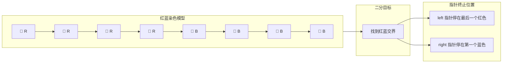

#### 为什么叫"染色法"？

假设有一个 `check(x)` 函数，它返回 True 或 False。当我们把 `check(x)` 为 False 的位置涂成红色，为 True 的位置涂成蓝色，就形成了一个**红蓝分割的序列**：

```
索引： 0   1   2   3   4   5   6   7   8   9
值：  [1,  2,  3,  5,  5,  5,  7,  8,  9,  10]
check(x>=5):
染色： 🔴  🔴  🔴  🔵  🔵  🔵  🔵  🔵  🔵  🔵
```

二分做的就是**用 O(log n) 步找到第一个蓝色格子**（或最后一个红色格子）。

#### 循环不变量

开区间写法的核心循环不变量：

```
check(left)  始终为 False（红色）
check(right) 始终为 True（蓝色）
```

循环结束时 `left + 1 == right`，right 就是第一个蓝色格子的位置。

---

### 1.3 数据范围与时间复杂度对照表

在算法竞赛和面试中，数据范围是选择算法的重要信号。[来源：OI Wiki](https://oi-wiki.org/basic/binary/)

| 数据范围 n | 允许的时间复杂度 | 常见算法 |
|-----------|----------------|---------|
| n ≤ 10 | O(n!) | 全排列、暴力枚举 |
| n ≤ 20 | O(2^n) | 子集枚举、状态压缩 DP |
| n ≤ 500 | O(n³) | Floyd 最短路、区间 DP |
| n ≤ 5000 | O(n²) | 朴素 DP、冒泡排序 |
| **n ≤ 10⁵ ~ 10⁶** | **O(n log n) / O(n)** | **二分、排序、双指针、树状数组** |
| n ≤ 10⁹ | O(log n) 或 O(√n) | **二分答案、数学推导** |
| n ≤ 10¹⁸ | O(log n) | **矩阵快速幂、二分答案** |

> **实战信号：**
> - 当 n ≤ 10⁵ 且数组有序（或具有单调性）→ 优先考虑 O(log n) 的二分
> - 当 n ≤ 10⁹ 且答案具有单调性 → 优先考虑**二分答案**（对答案值域二分，而非对数组下标二分）

---

### 1.4 二分的三种场景总览

二分算法可归纳为三大场景：[来源：灵神题单](https://leetcode.cn/circle/discuss/SqopEo/)

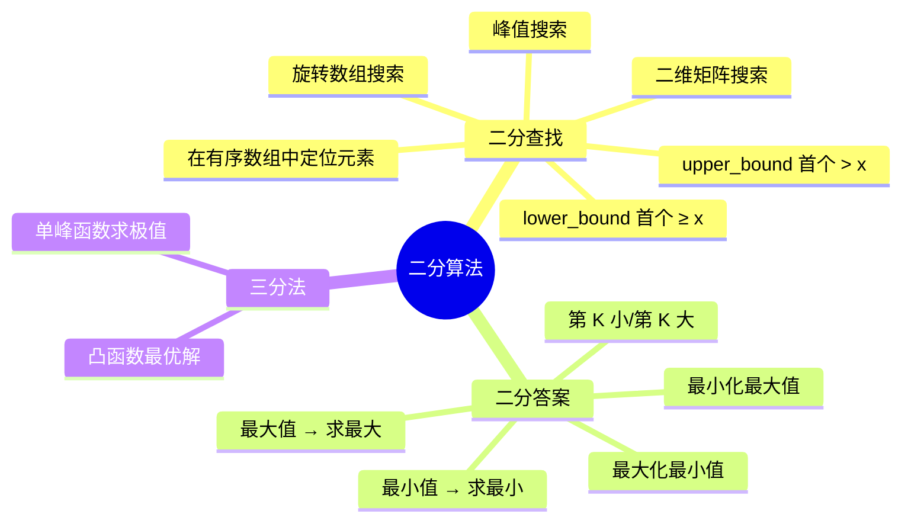

**场景一：二分查找**
- **操作对象：** 数组下标区间 `[left, right)`
- **前提条件：** 数组有序或局部有序（如旋转数组、峰值数组）
- **典型问题：** 查找目标值、找边界、找插入位置

**场景二：二分答案**
- **操作对象：** 答案值域 `[min_val, max_val]`
- **前提条件：** 答案具有单调性（若 x 可行，则 x+1 或 x-1 也可行）
- **典型问题：** 最小化最大值、最大化最小值、第 K 小数
- **核心思路：** "题目求什么，就二分什么"——构造一个虚拟的 `check(ans)` 数组并对其二分

**场景三：三分法**
- **操作对象：** 连续函数定义域
- **前提条件：** 函数为单峰函数（先增后减或先减后增）
- **典型问题：** 1515. 服务中心的最佳位置
- **注意：** 三分法与二分思路类似但比较方式不同，本文重点在前两种场景

---

### 1.5 为什么二分能快：信息论视角

从信息论的角度看，二分查找的最优性有严格的理论支撑。[来源：CP-Algorithms](https://cp-algorithms.com/num_methods/binary_search.html)

**核心命题：** 从 n 个等可能的候选者中确定唯一目标，至少需要 log₂(n) bits 的信息量。

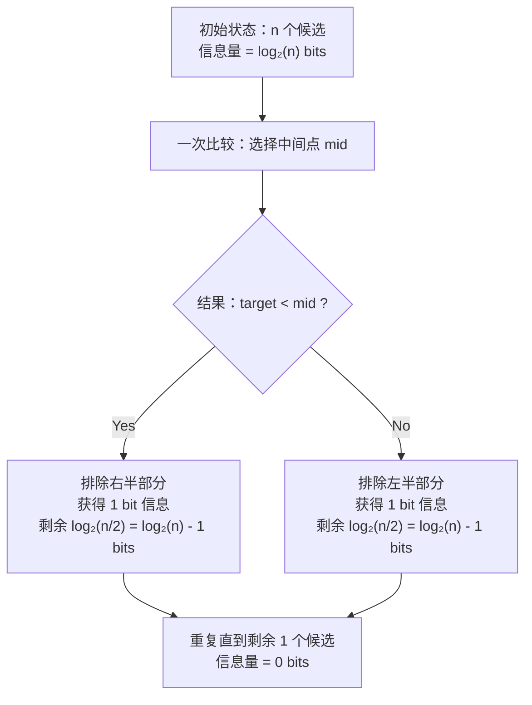

**解释：**
- 每次比较（`target < mid` 或 `check(mid)`）只有两种可能结果：True 或 False
- 一次 True/False 的决策 = 获得 1 bit 的信息量 = 候选空间减半
- 要从 n 个候选者中锁定 1 个，需要 log₂(n) bits
- 因此最少需要 log₂(n) 次比较 → 这就是 O(log n) 的信息论下界

**关键推论：** 二分查找在"基于比较"的搜索模型中是**最优**的——没有任何基于比较的算法能在最坏情况下比 O(log n) 更快地定位目标。

---

## 2. 二分查找（Binary Search）

### 2.1 核心前提：有序性

**二分查找的绝对前提：搜索空间必须具有单调性（有序性）。**

[来源：OI Wiki](https://oi-wiki.org/basic/binary/) 指出："如果把满足条件看做 1，不满足看做 0，至少对于这个条件的这一维度是有序的。"

这句话的深层含义是：**有序性不仅指数值大小排序，还泛指任何具有单调性的判断条件。**

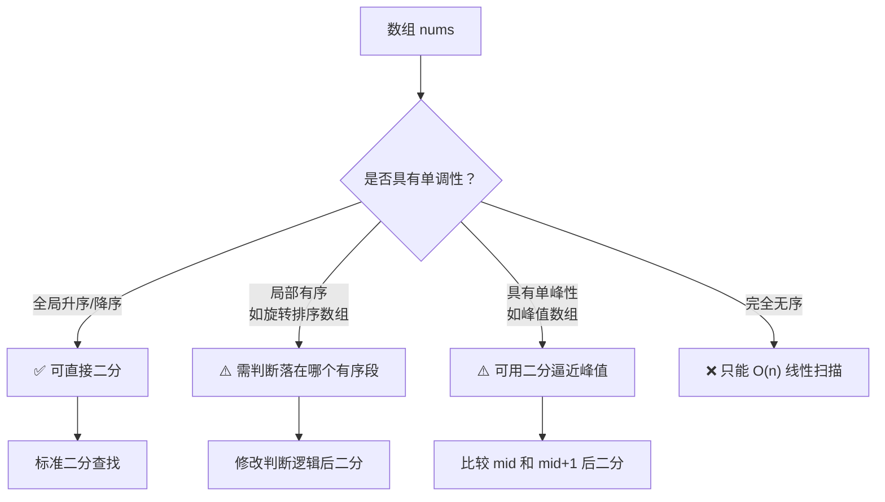

**常见误解：** "二分只能用于排好序的数组"——这是不准确的。二分可以用于**任何满足单调性条件的场景**，即使数组本身没有排序。关键在于：能否定义一个 `check(x)` 函数，使得 `check(x)` 的输出呈现 `False, False, ..., True, True, ...` 的红蓝分布。

---

### 2.2 lowerBound 模板（找首个 ≥ x 的位置）

lowerBound 是二分查找最核心的模板。找到它，其他变形都能推导出来。[来源：灵神题单](https://leetcode.cn/circle/discuss/SqopEo/)

#### 开区间写法（推荐）

```python
def lower_bound(nums: list[int], x: int) -> int:
    """
    在有序数组 nums 中找到首个 ≥ x 的元素的下标。
    
    如果所有元素都 < x，返回 len(nums)。
    
    开区间写法：left 和 right 都是"哨兵"位置，
    真正的搜索区间是 (left, right)，不包含两端。
    """
    left, right = -1, len(nums)  # left=-1（红色哨兵），right=n（蓝色哨兵）
    
    # 循环条件：left 和 right 不相邻时继续
    while left + 1 < right:
        mid = (left + right) // 2  # 等价于 left + (right - left) // 2
        
        # check 函数：nums[mid] >= x ?
        if nums[mid] >= x:
            # mid 是蓝色（满足条件），第一个蓝色在 mid 或更左边
            right = mid
        else:
            # mid 是红色（不满足），第一个蓝色在 mid 右边
            left = mid
    
    # 循环结束时 left + 1 == right
    # right 就是首个 ≥ x 的位置（第一个蓝色格子）
    return right
```

#### 逐行解析

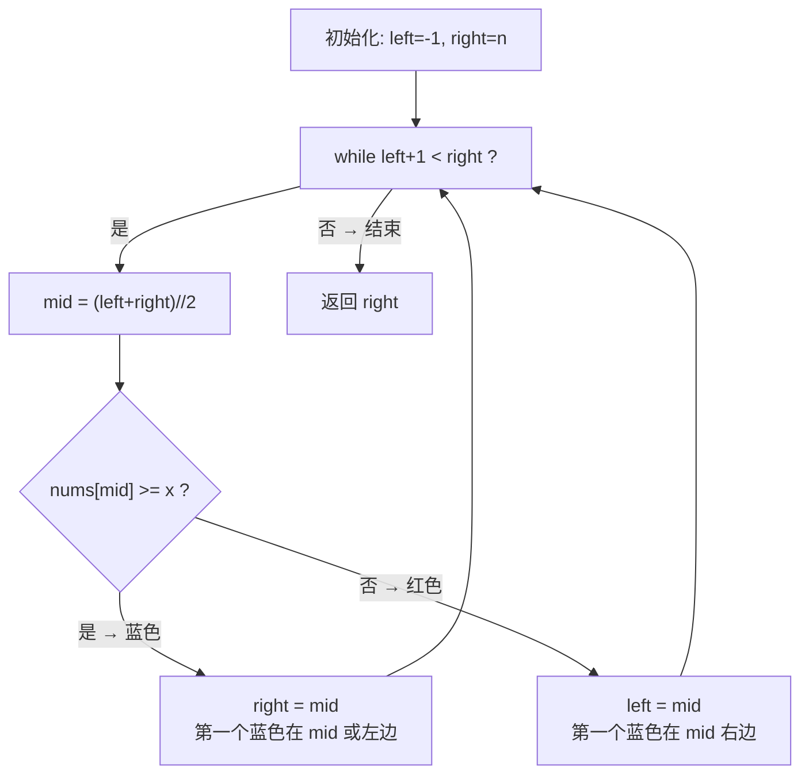

**循环过程示例：** `nums = [1, 3, 5, 5, 7], x = 5`

| 轮次 | left | right | mid | nums[mid] | 判断 | 更新 |
|------|------|-------|-----|-----------|------|------|
| 1 | -1 | 5 | 2 | 5 | 5 ≥ 5 ✓ (蓝) | right = 2 |
| 2 | -1 | 2 | 0 | 1 | 1 ≥ 5 ✗ (红) | left = 0 |
| 3 | 0 | 2 | 1 | 3 | 3 ≥ 5 ✗ (红) | left = 1 |
| 4 | 1 | 2 | - | - | left+1 == right | 结束，返回 2 |

结果：下标 2 对应 `nums[2] = 5`，确实是首个 ≥ 5 的位置。

#### 为什么开区间写法不需要 +1/-1？

闭区间写法中，`mid` 已经被检查过，所以下次搜索要排除它（`left = mid + 1` 或 `right = mid - 1`）。但开区间写法中：

- `left` 和 `right` 是**哨兵**，它们永远不在搜索区间内
- `mid` 落在 `(left, right)` 内部，`mid` 被检查后成为新的 `left` 或 `right`
- 新的 `left` 或 `right` 自动排除了 `mid`，无需 +1/-1

> **灵神原话：** "开区间写法不需要思考加一减一等细节，推荐使用开区间写二分。"

---

### 2.3 upperBound 模板（找首个 > x 的位置）

upperBound 与 lowerBound 仅一行代码的区别：

```python
def upper_bound(nums: list[int], x: int) -> int:
    """
    在有序数组 nums 中找到首个 > x 的元素的下标。
    
    如果所有元素都 ≤ x，返回 len(nums)。
    
    与 lower_bound 唯一区别：判断条件从 >= 改为 >
    """
    left, right = -1, len(nums)
    
    while left + 1 < right:
        mid = (left + right) // 2
        
        if nums[mid] > x:  # ← 唯一区别：> 而非 >=
            right = mid
        else:
            left = mid
    
    return right
```

#### lowerBound vs upperBound 对比

```mermaid
flowchart LR
    subgraph lower_bound 找首个 ≥ x
        direction LR
        L1[1] --> L2[3] --> L3[5] --> L4[5] --> L5[7]
        style L3 fill:#60a5fa
        style L4 fill:#ffffff
    end
    
    subgraph upper_bound 找首个 > x
        direction LR
        U1[1] --> U2[3] --> U3[5] --> U4[5] --> U5[7]
        style U3 fill:#ffffff
        style U4 fill:#ffffff
        style U5 fill:#60a5fa
    end
```

对于 `nums = [1, 3, 5, 5, 7], x = 5`：
- `lower_bound(nums, 5)` → 返回 2（`nums[2] = 5`，首个 ≥ 5）
- `upper_bound(nums, 5)` → 返回 4（`nums[4] = 7`，首个 > 5）

**关系：** `upper_bound(x)` 等价于 `lower_bound(x + 1)`（对于整数数组）。

---

### 2.4 开区间写法 vs 闭区间写法

| 维度 | 开区间 `(left, right)` | 闭区间 `[left, right]` |
|------|----------------------|----------------------|
| 初始值 | `left = -1, right = n` | `left = 0, right = n - 1` |
| 循环条件 | `left + 1 < right` | `left <= right` |
| mid 计算 | `mid = (left + right) // 2` | `mid = left + (right - left) // 2` |
| 更新 left | `left = mid` | `left = mid + 1` |
| 更新 right | `right = mid` | `right = mid - 1` |
| 返回值 | `right`（或 `left`） | `left` 或需要额外判断 |
| +1/-1 细节 | **不需要** | **需要** |
| 推荐度 | ✅ **推荐** | ⚠️ 容易出错 |

#### 为什么推荐开区间？

1. **无需记忆 +1/-1：** 闭区间写法中 `mid` 已经被检查过，必须 `mid+1` 或 `mid-1` 来排除，这是最常见的 Bug 来源
2. **哨兵语义清晰：** `left = -1` 表示"左边没有"，`right = n` 表示"右边没有"，语义自明
3. **返回值统一：** 循环结束后 `right` 就是答案（首个蓝色），无需额外判断
4. **循环不变量简洁：** `check(left) = False, check(right) = True` 始终成立

> [来源：灵神题单](https://leetcode.cn/circle/discuss/SqopEo/)、[CP-Algorithms](https://cp-algorithms.com/num_methods/binary_search.html)

---

### 2.5 lowerBound 的四大常用转化表格

基于 `lower_bound` 模板，通过调整初始值和判断条件，可以推导出所有四种边界查询：[来源：灵神题单](https://leetcode.cn/circle/discuss/SqopEo/)

| 查询目标 | 判断条件 | 初始 left | 初始 right | 返回值 | 不存在时返回 |
|---------|---------|-----------|-----------|--------|------------|
| 首个 **≥ x** | `nums[mid] >= x` | -1 | n | `right` | n（越界） |
| 首个 **> x** | `nums[mid] > x` | -1 | n | `right` | n（越界） |
| 最后 **< x** | `nums[mid] < x` | -1 | n | `left` | -1（越界） |
| 最后 **≤ x** | `nums[mid] <= x` | -1 | n | `left` | -1（越界） |

#### 记忆口诀

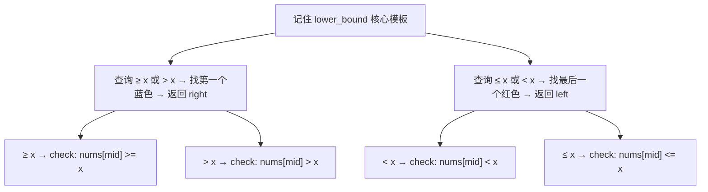

**核心记忆法：**
- 找"第一个满足条件的"（≥ 或 >）→ 返回 **right**
- 找"最后一个不满足条件的"（< 或 ≤）→ 返回 **left**
- 只需要改 `check` 里的比较符号，其他代码完全不变

---

### 2.6 基础题目映射表（灵神题单 §1.1）

以下题目均可直接用 `lower_bound` / `upper_bound` 模板或其简单转化解决：

| LeetCode 题号 | 题目名称 | 解法映射 | 难度 | 说明 |
|-------------|---------|---------|------|------|
| [704](https://leetcode.cn/problems/binary-search/) | 二分查找 | `lower_bound` → 验证 `nums[right] == x` | 简单 | 标准模板题 |
| [35](https://leetcode.cn/problems/search-insert-position/) | 搜索插入位置 | `lower_bound(x)` 的返回值即为插入位置 | 简单 | lower_bound 直接应用 |
| [744](https://leetcode.cn/problems/find-smallest-letter-greater-than-target/) | 寻找比目标字母大的最小字母 | `upper_bound(target) % n` | 简单 | 循环数组的 upper_bound |
| [2529](https://leetcode.cn/problems/maximum-count-of-positive-integer-and-negative-integer/) | 正整数和负整数的最大计数 | `lower_bound(0)` 和 upper_bound 的转化 | 简单 | 统计正负数个数 |
| [34](https://leetcode.cn/problems/find-first-and-last-position-of-element-in-sorted-array/) | 在排序数组中查找元素的第一个和最后一个位置 | `[lower_bound(x), lower_bound(x+1) - 1]` | 中等 | 两次 lower_bound |

#### 题目 34 详解：查找元素的第一个和最后一个位置

这是 `lower_bound` 最经典的组合应用：

```python
def searchRange(nums: list[int], target: int) -> list[int]:
    """
    查找 target 在排序数组中的第一个和最后一个位置。
    如果不存在，返回 [-1, -1]。
    
    思路：
    - 第一个位置 = lower_bound(target)
    - 最后一个位置 = lower_bound(target + 1) - 1
    """
    start = lower_bound(nums, target)
    
    # 检查 target 是否真的存在
    if start == len(nums) or nums[start] != target:
        return [-1, -1]
    
    end = lower_bound(nums, target + 1) - 1
    return [start, end]
```

---

### 2.7 源码级解析：bisect 模块的 Python 实现

Python 标准库 `bisect` 模块提供了 `bisect_left`（等价于 lower_bound）和 `bisect_right`（等价于 upper_bound）的实现。[来源：Python 官方文档](https://docs.python.org/3/library/bisect.html)、[CP-Algorithms](https://cp-algorithms.com/num_methods/binary_search.html)

#### bisect_left 源码（等价于 lower_bound）

```python
def bisect_left(a, x, lo=0, hi=None):
    """
    在有序列表 a 的 a[lo:hi] 范围内，找到首个 >= x 的插入位置。
    
    如果 x 已存在于 a 中，返回的插入位置在已有元素的左侧。
    
    参数:
        a: 有序列表
        x: 目标值
        lo: 搜索起始位置（默认 0）
        hi: 搜索结束位置（默认 len(a)，即搜索整个列表）
    
    返回:
        插入位置的下标（首个 >= x 的位置）
    """
    if lo < 0:
        raise ValueError('lo must be non-negative')
    if hi is None:
        hi = len(a)
    
    # 注意：Python bisect 使用闭区间风格 [lo, hi]
    while lo < hi:
        mid = (lo + hi) // 2
        
        # 使用 a[mid] < x（而非 a[mid] >= x）
        # 这是为了在 a[mid] == x 时继续向左搜索
        if a[mid] < x:
            lo = mid + 1  # x 在右半部分
        else:
            hi = mid      # x 在左半部分或就是 mid
    
    return lo  # lo == hi，即为插入位置
```

#### bisect_right 源码（等价于 upper_bound）

```python
def bisect_right(a, x, lo=0, hi=None):
    """
    在有序列表 a 的 a[lo:hi] 范围内，找到首个 > x 的插入位置。
    
    如果 x 已存在于 a 中，返回的插入位置在已有元素的右侧。
    """
    if lo < 0:
        raise ValueError('lo must be non-negative')
    if hi is None:
        hi = len(a)
    
    while lo < hi:
        mid = (lo + hi) // 2
        
        # 使用 a[mid] <= x（而非 a[mid] > x）
        # 这是为了在 a[mid] == x 时继续向右搜索
        if x < a[mid]:
            hi = mid      # x 在左半部分
        else:
            lo = mid + 1  # x 在右半部分或就是 mid
    
    return lo
```

#### 关键差异解析

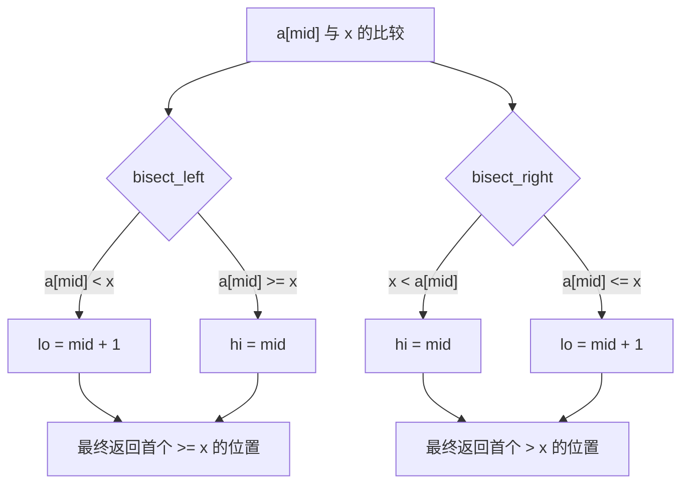

**对比本文推荐的开区间写法：**

| 方面 | Python bisect（闭区间） | 本文开区间写法 |
|------|----------------------|--------------|
| 区间 | `[lo, hi]` | `(left, right)` |
| 循环条件 | `lo < hi` | `left + 1 < right` |
| mid 处理 | 需要 `mid + 1` | 不需要 |
| 返回值 | `lo`（= `hi`） | `right` |
| 本质 | **完全等价**，只是区间定义不同 | |

> **关键理解：** Python 的 `bisect_left` 判断条件是 `a[mid] < x`（小于才往右走），而本文模板判断条件是 `a[mid] >= x`（满足就收缩右边界）。这两种写法逻辑等价，只是 from 不同方向思考：
> - `bisect_left`："如果 `a[mid] < x`，那 x 一定在右边"
> - 本文模板："如果 `a[mid] >= x`，那第一个 ≥ x 可能在 mid 或左边"

---

## 3. 二分查找进阶

### 3.1 旋转排序数组搜索

旋转排序数组是指：将一个升序数组在某个 pivot 点旋转后得到的数组。例如 `[0,1,2,4,5,6,7]` 在索引 3 处旋转后变为 `[4,5,6,7,0,1,2]`。[来源：灵神题单](https://leetcode.cn/circle/discuss/SqopEo/)

#### 核心观察

旋转后的数组具有一个关键性质：**从中间点 mid 分割，至少有一侧是有序的。**

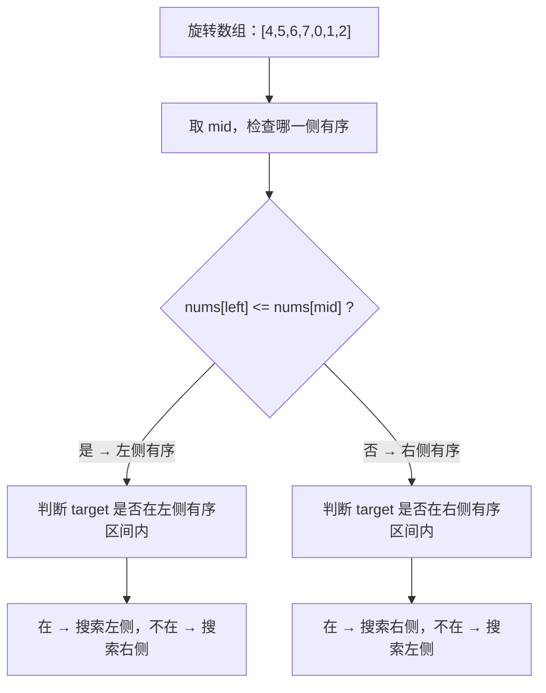

#### 题目映射表

| LeetCode 题号 | 题目名称 | 难度 | 关键思路 |
|-------------|---------|------|---------|
| [33](https://leetcode.cn/problems/search-in-rotated-sorted-array/) | 搜索旋转排序数组 | 中等 | 判断哪侧有序，再判断 target 范围 |
| [81](https://leetcode.cn/problems/search-in-rotated-sorted-array-ii/) | 搜索旋转排序数组 II | 中等 | 有重复元素，`nums[left] == nums[mid]` 时 `left++` |
| [153](https://leetcode.cn/problems/find-minimum-in-rotated-sorted-array/) | 寻找旋转排序数组中的最小值 | 中等 | `nums[mid] > nums[right]` → 最小值在右侧 |
| [154](https://leetcode.cn/problems/find-minimum-in-rotated-sorted-array-ii/) | 寻找旋转排序数组中的最小值 II | 困难 | 有重复元素，`nums[mid] == nums[right]` 时 `right--` |

#### 33 题核心代码

```python
def search(nums: list[int], target: int) -> int:
    """
    在旋转排序数组中搜索 target。
    
    核心思路：mid 分割后，至少有一侧有序。
    判断哪侧有序 → 判断 target 是否在该侧 → 决定搜索方向。
    """
    left, right = 0, len(nums) - 1
    
    while left <= right:
        mid = (left + right) // 2
        
        if nums[mid] == target:
            return mid
        
        # 判断左侧是否有序
        if nums[left] <= nums[mid]:
            # 左侧有序，检查 target 是否在左侧范围内
            if nums[left] <= target < nums[mid]:
                right = mid - 1  # target 在左侧
            else:
                left = mid + 1   # target 在右侧
        else:
            # 右侧有序，检查 target 是否在右侧范围内
            if nums[mid] < target <= nums[right]:
                left = mid + 1   # target 在右侧
            else:
                right = mid - 1  # target 在左侧
    
    return -1
```

#### 常见误区

> **误区：** "旋转数组无序了，不能用二分"
>
> **正解：** 旋转数组不是完全无序的——它由两个有序段组成。关键在于每次取 mid 后，**至少有一半是有序的**，我们利用这个有序性来判断 target 的范围。

---

### 3.2 寻找峰值

峰值元素是指其值严格大于相邻元素的元素。在数组中至少存在一个峰值。[来源：灵神题单](https://leetcode.cn/circle/discuss/SqopEo/)

#### 为什么峰值可以用二分？

**核心洞察：** 比较 `nums[mid]` 和 `nums[mid + 1]`，就能判断峰值在哪一侧：

- `nums[mid] < nums[mid + 1]` → mid 处于**上升趋势**，峰值在右侧
- `nums[mid] > nums[mid + 1]` → mid 处于**下降趋势**，峰值在 mid 或左侧

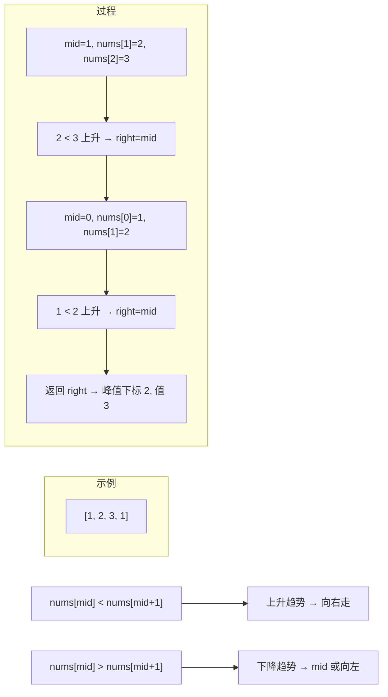

#### 题目映射表

| LeetCode 题号 | 题目名称 | 难度 | 关键思路 |
|-------------|---------|------|---------|
| [162](https://leetcode.cn/problems/find-peak-element/) | 寻找峰值 | 中等 | `nums[mid] < nums[mid+1]` → 右，否则左 |
| [1901](https://leetcode.cn/problems/find-a-peak-element-ii/) | 寻找峰值 II | 中等 | 二维版，对行二分 + 列找最大值 |
| [852](https://leetcode.cn/problems/peak-index-in-a-mountain-array/) | 山脉数组的峰顶索引 | 中等 | 保证单峰，同 162 |
| [1095](https://leetcode.cn/problems/find-in-mountain-array/) | 山脉数组中查找目标值 | 困难 | 先找峰值 → 再在左坡二分找 target → 再在右坡二分 |

#### 162 题核心代码

```python
def findPeakElement(nums: list[int]) -> int:
    """
    寻找峰值元素的下标。
    
    核心思路：比较 nums[mid] 和 nums[mid+1] 判断上升/下降趋势。
    上升说明峰值在右边，下降说明峰值在左边（可能是 mid 本身）。
    
    题目保证 nums[-1] = nums[n] = -∞，所以至少有一个峰值。
    """
    left, right = 0, len(nums) - 1
    
    while left < right:
        mid = (left + right) // 2
        
        if nums[mid] < nums[mid + 1]:
            # 上升趋势：峰值在 mid 右边（不包含 mid）
            left = mid + 1
        else:
            # 下降趋势：峰值可能是 mid，也可能在左边
            right = mid
    
    # left == right 时收敛到峰值
    return left
```

#### 常见误区

> **误区：** "数组无序就不能二分"
>
> **正解：** 二分不要求全局有序，只需要存在**单调性方向**即可。峰值问题中，`nums[mid] < nums[mid+1]` 意味着从 mid 往右走是上升的，而 `nums[n] = -∞` 保证最终会下降，所以峰值一定在右侧。这就是单调性。

---

### 3.3 未知长度数组搜索

某些场景下，数组长度未知，只能通过接口（如 `ArrayReader.get(i)`）访问元素。[来源：CP-Algorithms](https://cp-algorithms.com/num_methods/binary_search.html)

#### 核心思路：先扩界，再二分

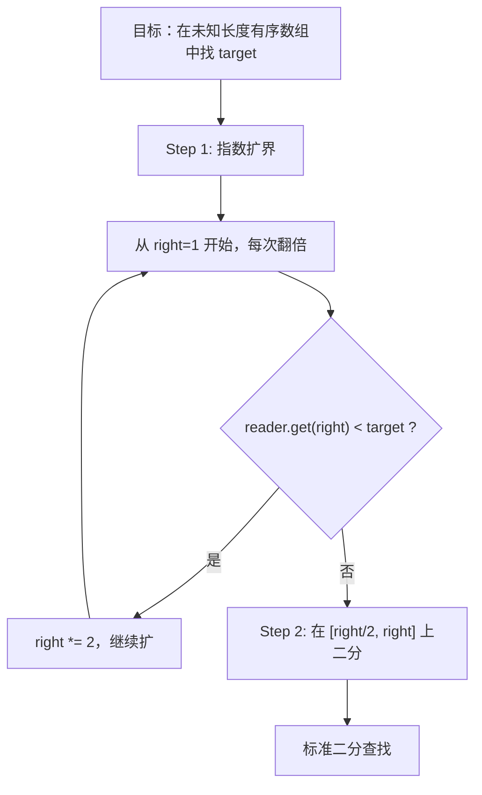

#### 代码实现

```python
def search(reader, target: int) -> int:
    """
    在未知长度的有序数组中搜索 target。
    reader.get(i) 返回下标 i 处的值，越界返回 2^31 - 1（无穷大）。
    
    两步走：
    1. 指数扩界：right 从 1 开始，每次翻倍，直到 reader.get(right) >= target
    2. 在 [left, right] 上执行标准二分查找
    """
    # Step 1: 指数扩界
    right = 1
    while reader.get(right) < target:
        left = right
        right *= 2
    
    left = right // 2  # left 从 right/2 开始
    
    # Step 2: 标准二分查找
    while left <= right:
        mid = (left + right) // 2
        val = reader.get(mid)
        
        if val == target:
            return mid
        elif val < target:
            left = mid + 1
        else:
            right = mid - 1
    
    return -1
```

**时间复杂度：** 扩界 O(log target_index) + 二分 O(log target_index) = O(log target_index)，仍然保持对数复杂度。

---

### 3.4 二维矩阵搜索

二维矩阵的二分搜索有两种经典模式：[来源：灵神题单](https://leetcode.cn/circle/discuss/SqopEo/)

#### 模式一：逐行视为有序（LeetCode 74）

当矩阵**每行升序排列，且每行首元素 > 上一行尾元素**时，整个矩阵可视为一维有序数组：

```
[ 1,  3,  5,  7]
[10, 11, 16, 20]
[23, 30, 34, 60]
```

等价于一维数组：`[1, 3, 5, 7, 10, 11, 16, 20, 23, 30, 34, 60]`

```python
def searchMatrix(matrix: list[list[int]], target: int) -> bool:
    """
    在 m×n 矩阵中搜索 target，矩阵整体有序。
    
    技巧：将二维下标 (r, c) 映射为一维下标 i：
      r = i // n, c = i % n
    然后在 [0, m*n - 1] 上做标准二分查找。
    """
    m, n = len(matrix), len(matrix[0])
    left, right = 0, m * n - 1
    
    while left <= right:
        mid = (left + right) // 2
        r, c = mid // n, mid % n
        val = matrix[r][c]
        
        if val == target:
            return True
        elif val < target:
            left = mid + 1
        else:
            right = mid - 1
    
    return False
```

#### 模式二：步进搜索（LeetCode 240）

当矩阵**每行升序、每列升序**但行之间不保证整体有序时：

```
[ 1,  4,  7, 11, 15]
[ 2,  5,  8, 12, 19]
[ 3,  6,  9, 16, 22]
[10, 13, 14, 17, 24]
[18, 21, 23, 26, 30]
```

```python
def searchMatrix2(matrix: list[list[int]], target: int) -> bool:
    """
    在 m×n 矩阵中搜索 target，每行每列均升序。
    
    技巧：从右上角出发，利用行列的单调性：
    - 当前值 > target → 往左走（排除当前列）
    - 当前值 < target → 往下走（排除当前行）
    - 每次排除一行或一列，O(m + n)
    """
    if not matrix or not matrix[0]:
        return False
    
    m, n = len(matrix), len(matrix[0])
    r, c = 0, n - 1  # 从右上角开始
    
    while r < m and c >= 0:
        if matrix[r][c] == target:
            return True
        elif matrix[r][c] > target:
            c -= 1  # 当前值太大，往左走（当前列所有元素都 > target）
        else:
            r += 1  # 当前值太小，往下走（当前行所有元素都 < target）
    
    return False
```

#### 题目映射表

| LeetCode 题号 | 题目名称 | 难度 | 模式 | 解法 |
|-------------|---------|------|------|------|
| [74](https://leetcode.cn/problems/search-a-2d-matrix/) | 搜索二维矩阵 | 中等 | 整体有序 | 二维→一维映射 + 二分 |
| [240](https://leetcode.cn/problems/search-a-2d-matrix-ii/) | 搜索二维矩阵 II | 中等 | 行列各自有序 | 右上角步进搜索 O(m+n) |

---

### 3.5 特殊二分场景

#### 场景一：寻找中位数（LeetCode 4 — 两个正序数组的中位数）

**问题：** 给定两个长度分别为 m 和 n 的正序数组，求合并后数组的中位数。要求 O(log(m+n))。

**核心思路：** 在较短的数组上做二分，找到一个分割点使得左半部分的所有元素 ≤ 右半部分的所有元素。

```mermaid
flowchart TD
    A["两个正序数组 nums1 和 nums2"] --> B["在较短数组上二分切割点 i"]
    B --> C["j = (m+n+1)//2 - i"]
    C --> D{"nums1[i-1] <= nums2[j] 且 nums2[j-1] <= nums1[i] ?"}
    D -->|是| E["找到正确切割，计算中位数"]
    D -->|否 → nums1[i-1] > nums2[j]| F["i 太大，向左二分"]
    D -->|否 → nums2[j-1] > nums1[i]| G["i 太小，向右二分"]
```

```python
def findMedianSortedArrays(nums1: list[int], nums2: list[int]) -> float:
    """
    求两个正序数组的中位数，要求 O(log(min(m, n)))。
    
    核心思路：在较短数组上二分找切割点 i，
    使得左半部分（nums1[0..i-1] + nums2[0..j-1]）
    的所有元素 ≤ 右半部分（nums1[i..] + nums2[j..]）。
    """
    # 保证在较短的数组上二分
    if len(nums1) > len(nums2):
        nums1, nums2 = nums2, nums1
    
    m, n = len(nums1), len(nums2)
    left, right = 0, m
    
    while left <= right:
        i = (left + right) // 2       # nums1 的切割点
        j = (m + n + 1) // 2 - i      # nums2 的切割点
        
        nums1_left  = float('-inf') if i == 0 else nums1[i-1]
        nums1_right = float('inf')  if i == m else nums1[i]
        nums2_left  = float('-inf') if j == 0 else nums2[j-1]
        nums2_right = float('inf')  if j == n else nums2[j]
        
        if nums1_left <= nums2_right and nums2_left <= nums1_right:
            # 找到正确切割
            if (m + n) % 2 == 0:
                return (max(nums1_left, nums2_left) + min(nums1_right, nums2_right)) / 2
            else:
                return max(nums1_left, nums2_left)
        elif nums1_left > nums2_right:
            right = i - 1  # i 太大
        else:
            left = i + 1   # i 太小
```

#### 场景二：完全二叉树的节点数（LeetCode 222）

**问题：** 给定一棵完全二叉树，求节点总数。要求优于 O(n)。

**核心思路：** 完全二叉树的左右子树中至少有一棵是满二叉树。满二叉树的节点数 = $2^h - 1$。利用这个性质，每次只需遍历一条路径。

```python
def countNodes(root) -> int:
    """
    计算完全二叉树的节点数，要求 O(log²n)。
    
    核心思路：
    1. 计算左子树高度 left_h 和右子树高度 right_h
    2. 如果 left_h == right_h → 左子树是满的，节点数 = 2^left_h - 1 + 递归右子树
    3. 如果 left_h != right_h → 右子树是满的（高度少 1），节点数 = 2^right_h - 1 + 递归左子树
    """
    if not root:
        return 0
    
    left_h = right_h = 0
    node = root
    while node:
        left_h += 1
        node = node.left
    
    node = root
    while node:
        right_h += 1
        node = node.right
    
    if left_h == right_h:
        # 满二叉树，直接公式计算
        return (1 << left_h) - 1
    else:
        # 不是满的，递归计算左右子树
        return 1 + countNodes(root.left) + countNodes(root.right)
```

**为什么有"二分"思想？** 每次判断左右子树高度，可以确定一棵子树是满的（直接公式计算），另一棵递归——每次排除了一半的计算量。

---

### 3.6 进阶题目映射表

#### 灵神题单 §1.2：进阶二分

| LeetCode 题号 | 题目名称 | 难度 | 关键技巧 |
|-------------|---------|------|---------|
| [1385](https://leetcode.cn/problems/find-the-distance-value-between-two-arrays/) | 两个数组间的距离值 | 简单 | 排序 + lower_bound |
| [1170](https://leetcode.cn/problems/compare-strings-by-frequency-of-the-smallest-character/) | 比较字符串最小字母频次 | 中等 | 计数 + 前缀和 + 二分 |
| [2300](https://leetcode.cn/problems/successful-pairs-of-spells-and-potions/) | 咒语和药水的成功对数 | 中等 | 排序 + lower_bound 转化 |
| [2389](https://leetcode.cn/problems/longest-subsequence-with-limited-sum/) | 和有限的最长子序列 | 中等 | 前缀和 + upper_bound |
| [2080](https://leetcode.cn/problems/range-frequency-queries/) | 区间内某个数字的频率 | 中等 | 预处理 + 两次 lower_bound 做差 |

#### 灵神题单 §1.3：旋转数组 / 峰值

| LeetCode 题号 | 题目名称 | 难度 | 关键技巧 |
|-------------|---------|------|---------|
| [33](https://leetcode.cn/problems/search-in-rotated-sorted-array/) | 搜索旋转排序数组 | 中等 | 判断哪侧有序 |
| [81](https://leetcode.cn/problems/search-in-rotated-sorted-array-ii/) | 搜索旋转排序数组 II | 中等 | 处理重复元素 |
| [153](https://leetcode.cn/problems/find-minimum-in-rotated-sorted-array/) | 寻找旋转排序数组中的最小值 | 中等 | `nums[mid] > nums[right]` 判据 |
| [154](https://leetcode.cn/problems/find-minimum-in-rotated-sorted-array-ii/) | 寻找旋转排序数组中的最小值 II | 困难 | 最坏 O(n)，重复时 `right--` |
| [162](https://leetcode.cn/problems/find-peak-element/) | 寻找峰值 | 中等 | `nums[mid] < nums[mid+1]` |
| [1901](https://leetcode.cn/problems/find-a-peak-element-ii/) | 寻找峰值 II | 中等 | 二维峰值 |
| [852](https://leetcode.cn/problems/peak-index-in-a-mountain-array/) | 山脉数组的峰顶索引 | 中等 | 保证单峰 |
| [1095](https://leetcode.cn/problems/find-in-mountain-array/) | 山脉数组中查找目标值 | 困难 | 找峰值 + 两次二分 |

---

> **本文档为第 1-3 章草稿，后续章节（4-8 章）涵盖：二分答案、最小化最大值、最大化最小值、第 K 小问题、三分法、综合实战与总结。**


## 4. 二分答案：求最小

### 4.1 什么是二分答案

#### 概念定义

**二分答案（Binary Search on Answer）** 是一种将"枚举答案"替换为"二分答案"的算法技巧。

当题目要求的是**"满足某种条件的最小（或最大）值"**，且这个值位于一个**确定范围**内时，可以不用从小到大逐一尝试，而是用二分法在值域上做猜测。

#### 核心思想：为什么能二分？

暴力做法是从最小可能值开始，逐一检查每个值是否满足条件。如果值域为 `[1, 10^9]`，暴力需要 10^9 次检查，必然超时。

二分答案的关键观察是：**如果答案 x 满足条件，那么所有大于 x 的值也都满足条件**（或反过来，所有小于 x 的值也都满足）。这就是**单调性**——答案空间被一个临界点分成了"不合格"和"合格"两部分。

```
不合格 不合格 不合格 | 合格 合格 合格 合格
← left            right →
                  ↑
              临界点 = 最小合格值
```

这个结构天然适合二分查找。每次猜测中间值 mid，用 check(mid) 验证：
- 如果 mid 合格，说明答案 ≤ mid，缩小到左半边继续搜索
- 如果 mid 不合格，说明答案 > mid，缩小到右半边继续搜索

**时间复杂度对比：**
- 暴力枚举：O(N × check)，N 为值域大小
- 二分答案：O(log N × check)

这就是灵神所说的 **"花费一个 log 的时间，增加了一个条件"**——多了一个单调性条件，换来时间从 N 变成 log N。

#### 二分答案三要素（OI Wiki）

能使用二分答案的题目，通常满足三个条件：

1. **固定区间**：答案落在某个确定的范围内，如 `[1, 10^9]`
2. **易于验证**：给定一个候选答案，可以快速判断是否可行（check 函数）
3. **单调性**：可行解对于区间满足单调性——如果 x 合格，则 x+1 也合格（求最小场景）

---

### 4.2 求最小模板（开区间写法）

#### 模板代码

```python
def binary_search_minimum():
    """
    求满足 check(x) == True 的最小 x 值。
    开区间写法：(left, right) 中，left 永远不合格，right 永远合格。
    """
    left = min_possible - 1    # 左边界：已知不合格的值
    right = max_possible + 1   # 右边界：已知合格的值

    while left + 1 < right:    # 开区间为空时终止：left + 1 == right
        mid = (left + right) >> 1   # 等价于 (left + right) // 2
        if check(mid):              # mid 合格，尝试更小的值
            right = mid
        else:                       # mid 不合格，需要更大的值
            left = mid

    return right  # right 就是最小的合格值
```

#### 逐行解析

```python
left = min_possible - 1
right = max_possible + 1
```

**初始值设定原则：**
- `left` 设为"已知不合格"的值，即最小可能答案减 1
- `right` 设为"已知合格"的值，即最大可能答案加 1

> **为什么要减 1 / 加 1？** 因为开区间 `(left, right)` 需要保证 `left` 永远不合格、`right` 永远合格。这样循环结束后 `right` 就是答案。
>
> 举例：如果答案范围是 `[1, 10^9]`，则 `left = 0`, `right = 10^9 + 1`。0 肯定不合格（比最小可能还小），10^9+1 肯定合格（比最大可能还大）。

```python
while left + 1 < right:
```

**循环终止条件：** 当 `left + 1 == right` 时，开区间 `(left, right)` 中已经没有整数，搜索结束。此时 `right` 就是最小合格值。

```python
mid = (left + right) >> 1
```

计算中点。使用位运算 `>> 1` 等价于整除 2，在 Python 中对大整数也能正确处理（不会溢出）。

```python
if check(mid):
    right = mid
else:
    left = mid
```

**核心逻辑：**
- `check(mid) == True` → mid 合格，但可能还有更小的合格值 → `right = mid`（缩小右边界）
- `check(mid) == False` → mid 不合格，需要更大的值 → `left = mid`（缩小左边界）

```python
return right
```

**返回值：** 循环终止时 `right` 就是最小的合格值。因为在整个过程中，`right` 始终被维护为"合格的值"，且每次 `right` 被更新时都是往更小的方向走。

#### 为什么用开区间 (left, right)？

开区间写法有三个核心优势：

1. **不需要处理等号**：闭区间写法需要想清楚 `left = mid + 1` 还是 `left = mid`，容易出错。开区间统一用 `left = mid` 和 `right = mid`，逻辑一致。

2. **不需要判断返回 left 还是 right**：循环终止时 `right` 就是答案，不需要根据题目情况调整。

3. **循环终止条件统一**：`left + 1 == right` 是唯一的终止条件，含义明确——开区间中已经没有整数。

#### 开区间 vs 闭区间对比

```python
# 开区间写法（推荐）✅
left, right = 0, 10**9 + 1
while left + 1 < right:
    mid = (left + right) >> 1
    if check(mid):
        right = mid
    else:
        left = mid
return right

# 闭区间写法（容易出错）❌
left, right = 1, 10**9
while left <= right:
    mid = (left + right) >> 1
    if check(mid):
        ans = mid
        right = mid - 1  # 这里需要减 1，容易遗忘
    else:
        left = mid + 1   # 这里需要加 1，容易遗忘
return ans
```

开区间写法中，`left` 和 `right` 的更新都是 `= mid`（不减 1、不加 1），因为开区间本身就不包含端点。

#### Mermaid 图解：开区间收缩过程

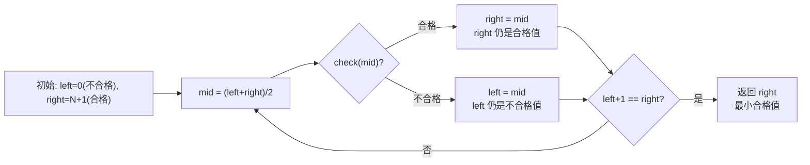

---

### 4.3 check 函数设计原则

check 函数是二分答案的灵魂。设计时需要考虑三个维度：

#### 1. 单调性（核心前提）

**check 函数必须具有单调性：** 如果 `check(x) == True`，则对所有 `y > x`，`check(y) == True` 也必须成立。

> **如何判断单调性？** 问自己一个问题：如果答案 x 可行，那么答案 x+1 是否一定可行？
>
> - **875 爱吃香蕉**：如果每小时吃 6 根能在 8 小时内吃完，那每小时吃 7 根也一定能 → 单调 ✅
> - **1011 运包裹**：如果船的载重 15 能在 5 天内运完，那载重 20 也一定能 → 单调 ✅
> - **修车时间**：如果 10 分钟能修完所有车，那 15 分钟也一定能 → 单调 ✅

#### 2. 正确性

check 函数必须准确地模拟题目条件，不能遗漏边界情况。

> **常见错误：**
> - 累加过程中没有考虑溢出（Python 无此问题，但其他语言需要注意）
> - 整除方向错误（向上取整 vs 向下取整）
> - 计数条件写反（≥ 写成 ≤）

#### 3. 时间复杂度

check 函数通常需要在 O(n) 或更快的时间内完成。因为二分会调用 check 函数 O(log N) 次，总时间复杂度为 O(n × log N)。

| 操作 | check 复杂度 | 二分复杂度 | 总复杂度 |
|------|-------------|-----------|---------|
| 遍历数组 | O(n) | O(log max_ans) | O(n × log max_ans) |
| 数学计算 | O(1) | O(log max_ans) | O(log max_ans) |
| 排序 + 遍历 | O(n log n) | O(log max_ans) | O(n log n × log max_ans) |

---

### 4.4 经典题目详解

#### 题目 1：875. 爱吃香蕉的珂珂

**题目简述：** 珂珂要在 H 小时内吃完 N 堆香蕉。每小时可以吃 K 根（不足 K 根也按 K 算时间）。求最小的 K。

**思路分析：**
- 答案范围：K 最小为 1（每小时吃 1 根），最大为 max(piles)（直接吃最大的一堆）
- 单调性：吃速越快，用时越短 → 如果 K=6 能吃完，K=7 也一定能
- check(K)：计算以速度 K 吃完所有堆需要的总时间，判断是否 ≤ H

```python
from typing import List
import math

class Solution:
    def minEatingSpeed(self, piles: List[int], h: int) -> int:
        def check(k: int) -> bool:
            """以速度 k 吃，能否在 h 小时内吃完？"""
            hours = 0
            for pile in piles:
                # 向上取整：pile/k 向上取整
                # 技巧：(pile + k - 1) // k 等价于 ceil(pile / k)
                hours += (pile + k - 1) // k
            return hours <= h

        left = 0           # 0 肯定不行（速度为 0）
        right = max(piles) # 最大堆的大小一定够（一小时吃完一堆）

        while left + 1 < right:
            mid = (left + right) >> 1
            if check(mid):
                right = mid  # 速度 mid 够了，试试更慢的
            else:
                left = mid   # 速度 mid 不够，需要更快

        return right
```

**关键细节：**
- 向上取整技巧：`(pile + k - 1) // k` 避免了浮点运算
- 右边界取 `max(piles)` 而非 `10^9`，因为最多吃最大堆那么大就够用了
- check 函数中 hours 累加可能很大，但 Python 整数无溢出问题

---

#### 题目 2：1011. 在 D 天内送达包裹的能力

**题目简述：** 传送带上的包裹有各自的重量，船每天只能运一次，船上货物不能超过载重。求能在 D 天内运完的最小载重。

**思路分析：**
- 答案范围：最小载重 = max(weights)（至少能装下最重的单个包裹），最大载重 = sum(weights)（一次全运走）
- 单调性：载重越大，需要的天数越少
- check(capacity)：模拟每天的运输，计算需要多少天

```python
from typing import List

class Solution:
    def shipWithinDays(self, weights: List[int], days: int) -> int:
        def check(capacity: int) -> bool:
            """载重为 capacity，能否在 days 天内运完？"""
            needed_days = 1  # 至少需要 1 天
            current_load = 0  # 当前船上已装载的重量

            for w in weights:
                if current_load + w <= capacity:
                    # 还能装下这个包裹
                    current_load += w
                else:
                    # 装不下了，需要新的一天
                    needed_days += 1
                    current_load = w  # 新的一天从当前包裹开始

            return needed_days <= days

        # 左边界：至少能装下最重的单个包裹
        left = max(weights) - 1  # 减 1 使其不合格
        # 右边界：一次全运走
        right = sum(weights)

        while left + 1 < right:
            mid = (left + right) >> 1
            if check(mid):
                right = mid  # 载重够了，试试更小的
            else:
                left = mid   # 载重不够，需要更大的

        return right
```

**关键细节：**
- **左边界必须是 max(weights)**：如果载重小于最重的包裹，永远运不完
- check 函数是**贪心模拟**：能装就装，装不下就换下一天——这恰好是最优策略
- 天数从 1 开始计数（至少需要一天）

---

#### 题目 3：2594. 修车的最少时间

**题目简述：** 有 n 个修车工，每个工人的等级为 rank[i]。一个等级为 r 的工人修 k 辆车需要 r × k² 分钟。求修完 cars 辆车的最少时间。

**思路分析：**
- 答案范围：最小时间 0，最大时间 = min(rank) × cars²（最慢的工人独自修完）
- 单调性：时间越长，能修的车越多
- check(time)：计算在给定时间内，所有工人一共能修多少辆车

```python
from typing import List
import math

class Solution:
    def repairCars(self, ranks: List[int], cars: int) -> int:
        def check(time: int) -> bool:
            """在 time 分钟内，能否修完 cars 辆车？"""
            total = 0
            for r in ranks:
                # 等级 r 的工人在 time 分钟内最多能修 sqrt(time/r) 辆
                # k^2 * r <= time  =>  k <= sqrt(time / r)
                total += int(math.isqrt(time // r))
            return total >= cars

        left = 0
        # 最大时间：最慢的工人独自修完所有车
        right = min(ranks) * cars * cars

        while left + 1 < right:
            mid = (left + right) >> 1
            if check(mid):
                right = mid  # 时间够了，试试更短的
            else:
                left = mid   # 时间不够，需要更长

        return right
```

**关键细节：**
- 公式推导：`r × k² ≤ time` → `k ≤ sqrt(time/r)`
- 使用 `math.isqrt` 做整数开方，避免浮点精度问题
- `time // r` 确保被开方的值是整数
- 右边界取 `min(ranks) * cars * cars` 是宽松上界，实际答案通常远小于此

---

### 4.5 题目映射表（灵神题单 §2.1 全部题目）

以下是灵神二分题单中 **§2.1 求最小** 的全部题目：

| 题号 | 题目名称 | 难度分 | check 函数思路 | 答案范围 |
|------|---------|--------|---------------|---------|
| [475](https://leetcode.cn/problems/heaters/) | 供暖器 | — | 半径 r 能否覆盖所有房屋 | [0, max(pos)] |
| [875](https://leetcode.cn/problems/koko-eating-bananas/) | 爱吃香蕉的珂珂 | 1766 | 速度 K 能否在 H 小时内吃完 | [1, max(piles)] |
| [1011](https://leetcode.cn/problems/capacity-to-ship-packages-within-d-days/) | 在 D 天内送达包裹的能力 | 1725 | 载重 W 能否在 D 天内运完 | [max(weights), sum(weights)] |
| [1283](https://leetcode.cn/problems/find-the-smallest-divisor-given-a-threshold/) | 使结果不超过阈值的最小除数 | 1542 | 除数 d 是否使总和 ≤ threshold | [1, max(nums)] |
| [1482](https://leetcode.cn/problems/minimum-number-of-days-to-make-m-bouquets/) | 制作 m 束花所需的最少天数 | 1946 | day 天内能否制作 m 束花 | [1, max(bloomDay)] |
| [2187](https://leetcode.cn/problems/minimum-time-to-complete-trips/) | 完成旅途的最少时间 | 1641 | 时间 t 内能否完成 totalTrips 次旅途 | [1, min(time) × totalTrips] |
| [2594](https://leetcode.cn/problems/minimum-time-to-repair-cars/) | 修车的最少时间 | 1915 | 时间 t 内能否修完 cars 辆车 | [1, min(rank) × cars²] |
| [3048](https://leetcode.cn/problems/earliest-second-to-mark-indices-i/) | 标记所有下标的最早秒数 I | 2263 | 秒数 s 能否标记所有下标 | [1, n] |
| [3296](https://leetcode.cn/problems/minimum-number-of-seconds-to-make-mountain-height-zero/) | 移山所需的最少秒数 | ~1850 | 秒数 s 能否将山的高度减到 0 | [1, ...] |
| [3639](https://leetcode.cn/problems/minimum-time-to-activate-string/) | 变为活跃状态的最小时间 | 1853 | 时间 t 能否使字符串变为活跃 | [1, ...] |

> **提示**：初次刷题建议先刷难度分 ≤ 1700 的基础题（875、1011、1283、2187），再挑战更难的题目。

---

## 5. 二分答案：求最大

### 5.1 求最大模板（开区间写法）

#### 模板代码

```python
def binary_search_maximum():
    """
    求满足 check(x) == True 的最大 x 值。
    开区间写法：(left, right) 中，left 永远合格，right 永远不合格。
    """
    left = min_possible - 1    # 左边界：已知合格的值
    right = max_possible + 1   # 右边界：已知不合格的值

    while left + 1 < right:    # 开区间为空时终止
        mid = (left + right) >> 1
        if check(mid):              # mid 合格，尝试更大的值
            left = mid
        else:                       # mid 不合格，需要更小的值
            right = mid

    return left  # left 就是最大的合格值
```

#### 逐行解析

与求最小模板相比，求最大模板有 **两处对称的改变**：

```python
# 求最小：left=不合格, right=合格
# 求最大：left=合格, right=不合格
left = min_possible - 1    # 现在 left 是合格的下界
right = max_possible + 1   # 现在 right 是不合格的上界
```

```python
# 求最小：check(mid)==True → right=mid（往小的方向缩）
# 求最大：check(mid)==True → left=mid（往大的方向扩）
if check(mid):
    left = mid   # mid 合格，尝试更大的 ← 这里反了
else:
    right = mid  # mid 不合格，需要更小的 ← 这里也反了
```

```python
# 求最小：返回 right
# 求最大：返回 left
return left  # left 是最大的合格值
```

#### 与求最小的对称关系

求最小和求最大是**完全对称**的，可以用一个统一的理解框架：

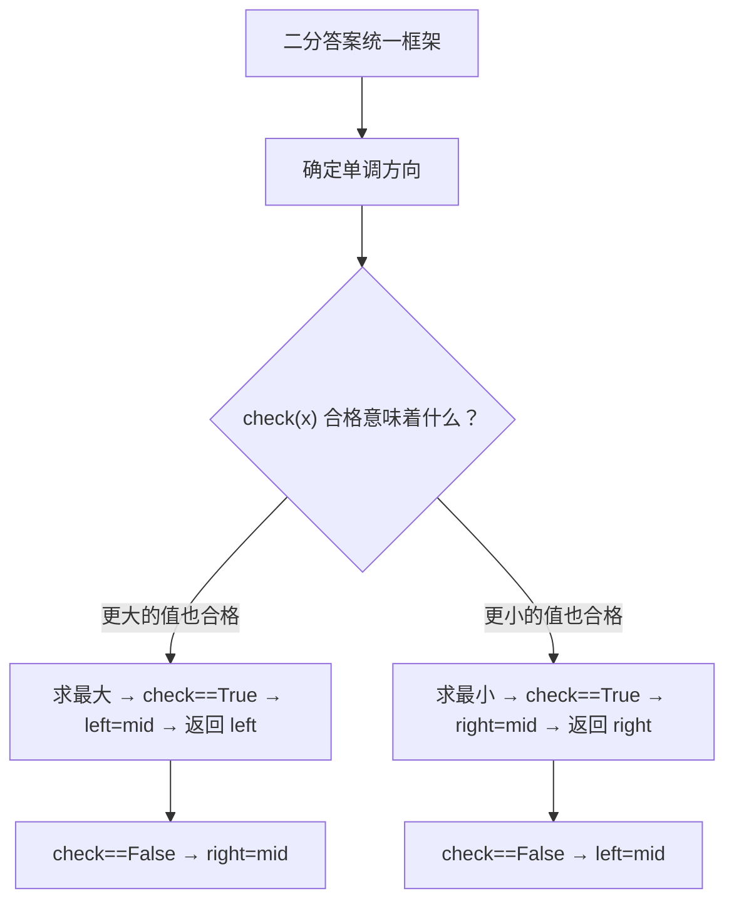

**记忆口诀：**

> **"谁被更新，最后就返回谁。"**
> - check 为 True 时更新 left → 返回 left（求最大）
> - check 为 True 时更新 right → 返回 right（求最小）

#### 开区间状态维护

| 操作 | 求最小 | 求最大 |
|------|--------|--------|
| **left 的含义** | 永远不合格 | 永远合格 |
| **right 的含义** | 永远合格 | 永远不合格 |
| **check(mid)==True** | right = mid | left = mid |
| **check(mid)==False** | left = mid | right = mid |
| **返回值** | right | left |

---

### 5.2 经典题目详解

#### 题目 1：275. H 指数 II

**题目简述：** 给定按升序排列的引用次数数组 citations，求 h 指数。h 指数的定义是：有 h 篇论文至少被引用了 h 次。

**思路分析：**
- 答案范围：h 最小为 0，最大为 n（论文总数）
- 单调性：如果 h 篇论文每篇至少 h 次引用成立，那 h-1 篇每篇至少 h-1 次引用也一定成立（h 越大越难满足）
- 注意：这里的 check 是"h 是否可行"，如果 h 可行，则所有比 h 小的值都可行 → 这是**求最大**场景

```python
from typing import List

class Solution:
    def hIndex(self, citations: List[int]) -> int:
        n = len(citations)

        def check(h: int) -> bool:
            """h 指数是否可行？即是否有至少 h 篇论文被引用至少 h 次"""
            # 数组升序排列，从右数第 h 篇论文的引用次数
            # 如果 citations[n-h] >= h，说明从该篇开始往后至少 h 篇都 >= h
            return citations[n - h] >= h

        left = -1    # -1 肯定合格（0 篇论文每篇至少 -1 次引用，废话但正确）
        right = n + 1  # n+1 肯定不合格（不可能有 n+1 篇论文）

        while left + 1 < right:
            mid = (left + right) >> 1
            if check(mid):
                left = mid   # h=mid 可行，试试更大的 h
            else:
                right = mid  # h=mid 不可行，需要更小的 h

        return left
```

**关键细节：**
- 由于数组是**升序排列**的，如果 `citations[n-h] >= h`，说明从索引 `n-h` 到 `n-1` 共有 `h` 篇论文，每篇引用都 ≥ h
- left 初始为 -1 是一种"永远合格"的哨兵值（任何数组的 h 指数至少为 0）

---

#### 题目 2：2226. 每个小孩最多能分到多少糖果

**题目简述：** 给定 piles 表示每堆糖果的数量，有 k 个小孩。每堆糖果只能分给一个小孩（可以拆分堆，但每堆的糖果只能给一个人）。求每个小孩最多能分到多少糖果。

**思路分析：**
- 答案范围：每个小孩最少分到 0 颗，最多分到 max(piles) 颗
- 单调性：如果每个小孩分到 x 颗可行，那么分到 x-1 颗也可行（分得更少更容易满足）→ 求最大
- check(x)：每堆糖果能为 `pile // x` 个小孩提供 x 颗糖果，总和是否 ≥ k

```python
from typing import List

class Solution:
    def maximumCandies(self, piles: List[int], k: int) -> int:
        def check(x: int) -> bool:
            """每个小孩分 x 颗，能否满足 k 个小孩？"""
            if x == 0:
                return True  # 分 0 颗永远可行
            count = 0
            for pile in piles:
                count += pile // x  # 一堆能分给几个人
            return count >= k

        left = 0             # 0 一定合格
        right = max(piles) + 1  # max(piles)+1 一定不合格

        while left + 1 < right:
            mid = (left + right) >> 1
            if check(mid):
                left = mid   # 每人 mid 颗够了，试试更多
            else:
                right = mid  # 每人 mid 颗不够，需要更少

        return left
```

**关键细节：**
- `x == 0` 需要特判，因为 `pile // 0` 会除零错误
- 左边界设为 0（一定合格），右边界设为 `max(piles) + 1`（一定不合格）
- check 函数的核心是**整除计数**：一堆 pile 颗糖，每人 x 颗，能分给 `pile // x` 个人

---

#### 题目 3：1642. 可以到达的最远建筑

**题目简述：** 你面前有一排建筑，高度用数组 heights 表示。你可以用梯子或砖块来跨越高度差。给定 bricks（砖块总数）和 ladders（梯子数量），求你能到达的最远建筑索引。

**思路分析：**
- 答案范围：最远可以到达索引 0（原地不动），最远可以到达索引 n-1（全部通过）
- 单调性：如果能到达索引 i，那么一定也能到达索引 i-1 → 求最大
- check(i)：从索引 0 到索引 i 的所有高度差中，用 ladders 覆盖最大的 ladders 个差值，其余用砖块，判断砖块是否够用

```python
from typing import List
import heapq

class Solution:
    def furthestBuilding(self, heights: List[int], bricks: int, ladders: int) -> int:
        n = len(heights)

        def check(idx: int) -> bool:
            """能否到达索引 idx？"""
            # 收集从 0 到 idx 所有需要跨越的高度差
            diffs = []
            for i in range(idx):
                diff = heights[i + 1] - heights[i]
                if diff > 0:  # 只有上坡才需要工具
                    diffs.append(diff)

            # 用 ladders 覆盖最大的 ladders 个高度差，其余用 bricks
            if len(diffs) <= ladders:
                return True  # 梯子够用

            diffs.sort(reverse=True)
            needed_bricks = sum(diff for diff in diffs[ladders:])
            return needed_bricks <= bricks

        left = -1    # -1 肯定合格（不需要移动）
        right = n    # n 肯定不合格（超出范围）

        while left + 1 < right:
            mid = (left + right) >> 1
            if check(mid):
                left = mid   # 能到 mid，试试更远的
            else:
                right = mid  # 到不了 mid，需要更近

        return left
```

**关键细节：**
- check 函数中，最优策略是**用梯子覆盖最大的高度差**（因为梯子可以跨越任意高度，而砖块受总量限制）
- check 的复杂度为 O(n log n)（排序），二分调用 O(log n) 次，总复杂度 O(n log² n)
- 更优的做法是用**最小堆 + 反悔贪心**做到 O(n log n)，但二分答案写法更直观

**更优的反悔贪心解法（供参考）：**

```python
class Solution:
    def furthestBuilding(self, heights: List[int], bricks: int, ladders: int) -> int:
        min_heap = []  # 最小堆，维护当前用梯子跨越的高度差

        for i in range(len(heights) - 1):
            diff = heights[i + 1] - heights[i]
            if diff <= 0:
                continue  # 下坡不需要工具

            heapq.heappush(min_heap, diff)

            if len(min_heap) > ladders:
                # 梯子用完了，把最小的高度差改用砖块
                bricks -= heapq.heappop(min_heap)

            if bricks < 0:
                return i  # 砖块不够了，最远到 i

        return len(heights) - 1  # 全部通过
```

> **说明：** 1642 题实际上用反悔贪心更优，但作为二分答案的练习题仍然有价值，可以帮助理解 check 函数的设计思路。

---

### 5.3 题目映射表（灵神题单 §2.2 全部题目）

以下是灵神二分题单中 **§2.2 求最大** 的全部题目：

| 题号 | 题目名称 | 难度分 | check 函数思路 | 答案范围 |
|------|---------|--------|---------------|---------|
| [275](https://leetcode.cn/problems/h-index-ii/) | H 指数 II | — | h 指数是否可行（至少 h 篇 ≥ h 次引用） | [0, n] |
| [2226](https://leetcode.cn/problems/maximum-candies-allocated-to-k-children/) | 每个小孩最多能分到多少糖果 | 1646 | 每人 x 颗能否满足 k 个小孩 | [0, max(piles)] |
| [2982](https://leetcode.cn/problems/find-longest-special-substring-that-occurs-thrice-ii/) | 找出出现至少三次的最长特殊子字符串 II | 1773 | 长度 L 的特殊子串是否出现 ≥ 3 次 | [1, n] |
| [2576](https://leetcode.cn/problems/find-the-maximum-number-of-marked-indices/) | 求出最多标记下标 | 1843 | 能否标记 2×t 个下标 | [0, n/2] |
| [1898](https://leetcode.cn/problems/maximum-number-of-removable-characters/) | 可移除字符的最大数目 | 1913 | 移除前 k 个字符后 p 仍是子序列 | [0, len(removable)] |
| [1802](https://leetcode.cn/problems/maximum-value-at-a-given-index-in-a-bounded-array/) | 有界数组中指定下标处的最大值 | 1929 | 指定位置值为 v 时总和是否 ≤ maxSum | [1, maxSum] |
| [1642](https://leetcode.cn/problems/furthest-building-you-can-reach/) | 可以到达的最远建筑 | 1962 | 能否到达索引 idx | [0, n-1] |
| [2861](https://leetcode.cn/problems/maximum-number-of-alloys/) | 最大合金数 | 1981 | 能否制造 k 个合金 | [0, ...] |
| [3007](https://leetcode.cn/problems/maximum-number-that-sum-of-the-prices-is-less-than-or-equal-to-k/) | 价值和小于等于 K 的最大数字 | 2258 | 数字 x 的价值和是否 ≤ k | [0, ...] |
| [2141](https://leetcode.cn/problems/maximum-running-time-of-n-computers/) | 同时运行 N 台电脑的最长时间 | 2265 | 能否让 n 台电脑同时运行 t 分钟 | [1, sum(batteries)/n] |
| [2258](https://leetcode.cn/problems/escape-the-spreading-fire/) | 逃离火灾 | 2347 | 能否在等待 t 分钟后安全逃离 | [0, ...] |
| [2071](https://leetcode.cn/problems/maximum-number-of-tasks-you-can-assign/) | 你可以安排的最多任务数目 | 2648 | 能否安排 k 个任务 | [0, n] |
| [LCP 78](https://leetcode.cn/problems/Nsibyl/) | 城墙防线 | — | 最小防御差为 x 是否可行 | [0, ...] |

> **提示**：初次刷题建议先刷难度分 ≤ 1700 的基础题（275、2226），再逐步挑战更难的题目。

---

## 附录：求最小 vs 求最大速查卡

```
┌──────────────────────────────────────────────────────────┐
│                   二分答案速查卡                          │
├─────────────────────────┬────────────────────────────────┤
│       求最小             │         求最大                  │
├─────────────────────────┼────────────────────────────────┤
│ left = 不合格            │ left = 合格                    │
│ right = 合格             │ right = 不合格                 │
│ check(mid)==True → right │ check(mid)==True → left        │
│ check(mid)==False → left │ check(mid)==False → right      │
│ 返回 right               │ 返回 left                      │
│ 例：最少天数、最小载重    │ 例：最大 h 指数、最多糖果       │
└─────────────────────────┴────────────────────────────────┘

  统一循环结构（两者相同）：

    while left + 1 < right:
        mid = (left + right) >> 1
        if check(mid):
            ??? = mid    # 求最小用 right，求最大用 left
        else:
            ??? = mid    # 求最小用 left， 求最大用 right

    return ???           # 求最小返回 right，求最大返回 left
```


## 6. 二分间接值与第 K 小

### 6.1 什么是对"间接值"二分

**一句话解释**：当问题的答案**不在输入数据中**，而是需要通过某种规则"构造"出来时，我们仍然可以对这个答案进行二分搜索。这就是"对间接值二分"，也叫"二分答案"。

**核心概念**：

传统二分是在一个已知的有序数组中搜索某个元素（答案必然在数组里）。而二分答案的思路完全不同：

1. **答案空间是连续的整数范围**（比如 `[1, 10^9]`），而不是输入中的离散值
2. **我们不知道答案是什么**，但我们可以写一个 `check(x)` 函数来判断"答案是否 ≤ x"
3. 如果 `check(x)` 具有**单调性**（x 越大越容易满足），就可以二分

**为什么能用二分**：

```
check(x) 的返回值随 x 的变化：

x = 1     2     3     4     5     6     7
      False False False True  True  True  True
                        ^
                   第一个 True → 这就是我们要找的答案
```

只要 `check(x)` 的取值从 False 变成 True 后不会再变回 False（即单调非递减），就可以二分。

**通用模板**（开区间写法）：

```python
def binary_search_answer(left: int, right: int) -> int:
    """
    二分答案模板（开区间写法）
    left:  check(left) 恒为 False 的边界
    right: check(right) 恒为 True 的边界
    
    返回：最小的满足 check(x) == True 的 x
    """
    while left + 1 < right:  # 开区间 (left, right) 非空
        mid = (left + right) // 2
        if check(mid):
            right = mid  # mid 可能是答案，收缩右边界
        else:
            left = mid   # mid 不满足，答案一定在右边
    
    return right  # right 是第一个满足 check 的值
```

```mermaid
flowchart TD
    A[问题：求满足某条件的最小值/最大值] --> B{check 函数具有单调性?}
    B -->|否| C[不能使用二分答案]
    B -->|是| D[确定二分上下界 left, right]
    D --> E[left 满足 check=false<br>right 满足 check=true]
    E --> F{left + 1 < right?}
    F -->|是| G[mid = (left + right) // 2]
    G --> H{check(mid)?}
    H -->|True| I[right = mid]
    H -->|False| J[left = mid]
    I --> F
    J --> F
    F -->|否| K[返回 right]
```

**关键理解**：二分答案本质上是将"求最优解"的问题，转化为"判断可行性"的问题。后者往往比前者容易得多。

> 来源：灵神题单第二节「二分答案」—— "花费一个 log 的时间，增加了一个条件。"

---

### 6.2 最小化最大值专题（灵神题单 §2.4）

#### 核心思路

**问题特征**：我们要把一个资源分配给多个对象，要求**所有对象中"最大值"尽可能小**。

**思维转换**：

> 原问题："如何分配，使得最大值最小？" → 二分后的问题："能否让所有对象的最大值都不超过 x？"

一旦转换成功，check 函数就变成了一个**贪心模拟**问题：

1. 假设所有对象的上限是 `x`
2. 贪心地分配资源，看能否满足所有约束
3. 能 → 说明 `x` 可以更小，尝试 `right = mid`
4. 不能 → 说明 `x` 太小了，尝试 `left = mid`

```mermaid
flowchart LR
    A["求 min(max(...))"] --> B["二分猜测答案 x"]
    B --> C["check: 能否让所有值 ≤ x?"]
    C -->|能| D[right = mid "尝试更小的 x"]
    C -->|不能| E[left = mid "需要更大的 x"]
    D --> B
    E --> B
```

**为什么 check 函数往往用贪心**：因为一旦上限 `x` 确定了，我们的策略就很简单——能少分就少分，留更多余地给后面。这正是贪心的思想。

#### 经典题目详解

**题目一：LCR 410 - 分割数组的最大值（LeetCode 410，难度 2147）**

> 将数组分成 `k` 个非空连续子数组，使得这些子数组各自和的最大值最小。

**分析**：

- **答案范围**：`[max(nums), sum(nums)]`
  - 下界 `max(nums)`：每个子数组至少要包含一个元素，最大值不可能小于单个元素的最大值
  - 上界 `sum(nums)`：最差情况是整个数组作为一个子数组

- **check(x) 设计**：给定上限 `x`，贪心地将数组分段，每段的和不超过 `x`，最少需要分几段？如果段数 ≤ k，说明可行。

```python
from typing import List

class Solution:
    def splitArray(self, nums: List[int], k: int) -> int:
        def check(x: int) -> bool:
            """判断是否可以用最多 k 段，每段和不超过 x"""
            sub_sum = 0  # 当前段的和
            count = 1    # 已分的段数（至少 1 段）
            for num in nums:
                if sub_sum + num > x:
                    count += 1   # 当前段放不下了，新开一段
                    sub_sum = num  # 新段从当前元素开始
                else:
                    sub_sum += num
            return count <= k  # 段数不超过 k 即可行
        
        left, right = max(nums), sum(nums)
        while left + 1 < right:
            mid = (left + right) // 2
            if check(mid):
                right = mid
            else:
                left = mid
        
        return right
```

**易错点**：
- check 函数中 `count` 初始值为 1（不是 0），因为即使数组只有一个元素也算一段
- 如果某个元素本身就大于 `x`，check 必然返回 False（但这里下界已经是 `max(nums)`，所以不会发生）

---

**题目二：LCR 778 - 水位上升的泳池中游泳（LeetCode 778，难度 2097）**

> N×N 网格，每个格子有高度。从 `(0,0)` 走到 `(n-1,n-1)`，t 时刻水面高度为 t，你只能在高度 ≤ t 的格子之间移动。求最早什么时刻能到达终点。

**分析**：

- **答案范围**：`[grid[0][0], n*n - 1]`
  - 下界至少是起点高度（你从起点出发）
  - 上界是最大可能高度

- **check(t)**：当水面高度为 t 时，能否从起点走到终点？这变成了经典的 BFS/DFS 连通性问题。

```python
from typing import List
from collections import deque

class Solution:
    def swimInWater(self, grid: List[List[int]]) -> int:
        n = len(grid)
        
        def check(t: int) -> bool:
            """BFS 判断 t 时刻能否从 (0,0) 走到 (n-1,n-1)"""
            if grid[0][0] > t:
                return False  # 起点就被淹了
            
            visited = [[False] * n for _ in range(n)]
            queue = deque([(0, 0)])
            visited[0][0] = True
            
            while queue:
                x, y = queue.popleft()
                if x == n - 1 and y == n - 1:
                    return True
                for dx, dy in [(0, 1), (0, -1), (1, 0), (-1, 0)]:
                    nx, ny = x + dx, y + dy
                    if 0 <= nx < n and 0 <= ny < n and not visited[nx][ny] and grid[nx][ny] <= t:
                        visited[nx][ny] = True
                        queue.append((nx, ny))
            
            return False
        
        left, right = grid[0][0], n * n - 1
        while left + 1 < right:
            mid = (left + right) // 2
            if check(mid):
                right = mid
            else:
                left = mid
        
        return right
```

**复杂度分析**：每次 check 是 O(n²)，二分 log(n²) 次，总复杂度 O(n² log n)。

---

**题目三：LCR 1631 - 最小体力消耗路径（LeetCode 1631，难度 1948）**

> m×n 网格，从 `(0,0)` 到 `(m-1,n-1)`。一条路径的"体力消耗"是路径上相邻格子高度差的绝对值的最大值。求最小体力消耗。

**分析**：

- **答案范围**：`[0, 10^6]`（高度范围 1 到 10^6，最大差值不超过 10^6）
- **check(h)**：是否存在一条路径，使得每步的高度差都不超过 h？同样是 BFS/DFS 或并查集。

```python
from typing import List
from collections import deque

class Solution:
    def minimumEffortPath(self, heights: List[List[int]]) -> int:
        m, n = len(heights), len(heights[0])
        
        def check(h: int) -> bool:
            """BFS 判断是否存在路径，每步高度差 ≤ h"""
            visited = [[False] * n for _ in range(m)]
            queue = deque([(0, 0)])
            visited[0][0] = True
            
            while queue:
                x, y = queue.popleft()
                if x == m - 1 and y == n - 1:
                    return True
                for dx, dy in [(0, 1), (0, -1), (1, 0), (-1, 0)]:
                    nx, ny = x + dx, y + dy
                    if 0 <= nx < m and 0 <= ny < n and not visited[nx][ny]:
                        if abs(heights[nx][ny] - heights[x][y]) <= h:
                            visited[nx][ny] = True
                            queue.append((nx, ny))
            
            return False
        
        left, right = 0, 10**6
        while left + 1 < right:
            mid = (left + right) // 2
            if check(mid):
                right = mid
            else:
                left = mid
        
        return right
```

#### 题目映射表

| LeetCode | 题目名称 | 难度分 | check 方法 | 答案下界 | 答案上界 |
|----------|---------|--------|-----------|---------|---------|
| 410 | 分割数组的最大值 | 2147 | 贪心分段 | max(nums) | sum(nums) |
| 2064 | 分配给商店的最多商品的最小值 | 1886 | 贪心分配 | 1 | max(quantities) |
| 1760 | 袋子里最少数目的球 | 1940 | 贪心分割 | 1 | max(nums) |
| 1631 | 最小体力消耗路径 | 1948 | BFS/DFS | 0 | 10^6 |
| 2439 | 最小化数组中的最大值 | 1965 | 贪心模拟 | max(nums) | max(nums) |
| 2560 | 打家劫舍 IV | 2081 | 贪心选择 | min(nums) | max(nums) |
| 778 | 水位上升的泳池中游泳 | 2097 | BFS/DFS | grid[0][0] | n²-1 |
| 2616 | 最小化数对的最大差值 | 2155 | 贪心配对 | 0 | max-min |
| 2513 | 最小化两个数组中的最大值 | 2302 | 数学计算 | 1 | max(div1,div2) |
| 3419 | 图的最大边权的最小值 | 2243 | 并查集/BFS | 0 | max(weight) |
| LCP 12 | 小张刷题计划 | - | 贪心分段 | max(time) | sum(time) |
| 774 | 最小化去加油站的最大距离 | - | 贪心插入 | 0 | 10^8 |

> 来源：灵神题单 §2.4 最小化最大值

---

### 6.3 最大化最小值专题（灵神题单 §2.5）

#### 核心思路

**问题特征**：我们要从一组候选中选出若干个元素，使得**被选元素之间"最小距离/最小差值"尽可能大**。

**思维转换**：

> 原问题："如何选择，使得最小值最大？" → 二分后的问题："能否让所有被选元素之间的差值都 ≥ x？"

这与 6.2 的"最小化最大值"是对称的：

| 类型 | 目标 | check 含义 | 返回值 | 更新策略 |
|------|------|-----------|--------|---------|
| 最小化最大值 | min(max(...)) | 所有值 ≤ x 可行吗？ | 最小的可行 x | check=True → right=mid |
| 最大化最小值 | max(min(...)) | 所有值 ≥ x 可行吗？ | 最大的可行 x | check=True → left=mid |

**最大化最小值的模板**（与最小化最大值不同）：

```python
def binary_search_max_min(left: int, right: int) -> int:
    """
    最大化最小值模板（开区间写法）
    返回：最大的满足 check(x) == True 的 x
    """
    while left + 1 < right:
        mid = (left + right) // 2
        if check(mid):
            left = mid   # mid 可行，尝试更大的值
        else:
            right = mid  # mid 不可行，答案一定更小
    
    return left  # left 是最大的可行值
```

**关键区别**：`check=True` 时更新的是 `left`（而不是 `right`），因为我们要找的是**最大的可行值**。

```mermaid
flowchart TD
    A["求 max(min(...))"] --> B["二分猜测答案 x"]
    B --> C["check: 能否让所有间距 ≥ x?"]
    C -->|能| D[left = mid "尝试更大的 x"]
    C -->|不能| E[right = mid "需要更小的 x"]
    D --> B
    E --> B
    B --> F["返回 left"]
```

#### 经典题目详解

**题目一：LCR 1552 - 两球之间的磁力（LeetCode 1552）**

> 在 `m` 个篮子中放 `m` 个球，篮子位置在数组 `position` 中给出。求任意两球之间最小距离的最大值。

**分析**：

- **排序**：先将 `position` 排序
- **答案范围**：`[1, (max - min) // (m - 1)]`
  - 下界 1：最小距离至少是 1
  - 上界是均分情况下的间距（所有球均匀分布）
- **check(d)**：能否在篮子中放 m 个球，使得任意相邻球的距离 ≥ d？贪心：从第一个篮子开始，每次选满足距离要求的最近篮子。

```python
from typing import List

class Solution:
    def maxDistance(self, position: List[int], m: int) -> int:
        position.sort()
        
        def check(d: int) -> bool:
            """贪心：能否放置 m 个球，相邻间距 ≥ d"""
            count = 1        # 第一个球放在 position[0]
            prev = position[0]  # 上一个球的位置
            for i in range(1, len(position)):
                if position[i] - prev >= d:
                    count += 1
                    prev = position[i]
                    if count >= m:
                        return True  # 球已放够
            return False
        
        left, right = 1, (position[-1] - position[0]) // (m - 1)
        while left + 1 < right:
            mid = (left + right) // 2
            if check(mid):
                left = mid  # 可以更大
            else:
                right = mid
        
        return left
```

**贪心正确性证明**：如果存在一种放置方案使得最小间距 ≥ d，那么贪心方案也一定可以。因为贪心每次都选满足条件的最近位置，这给后续留下了最大的空间。如果贪心都放不下 m 个球，任何方案都放不下。

---

**题目二：LCR 2517 - 礼盒的最大甜蜜度（LeetCode 2517，难度 2021）**

> 从 `price` 数组中选 k 个不同价格的礼盒，使得任意两个礼盒价格差的最小值最大。

**分析**：这与 LCR 1552 完全同构，只是问题描述换了个包装。

```python
from typing import List

class Solution:
    def maximumTastiness(self, price: List[int], k: int) -> int:
        price.sort()
        
        def check(d: int) -> bool:
            count = 1
            prev = price[0]
            for i in range(1, len(price)):
                if price[i] - prev >= d:
                    count += 1
                    prev = price[i]
                    if count >= k:
                        return True
            return False
        
        left, right = 0, (price[-1] - price[0]) // (k - 1)
        while left + 1 < right:
            mid = (left + right) // 2
            if check(mid):
                left = mid
            else:
                right = mid
        
        return left
```

#### 题目映射表

| LeetCode | 题目名称 | 难度分 | check 方法 | 答案下界 | 答案上界 |
|----------|---------|--------|-----------|---------|---------|
| 3281 | 范围内整数的最大得分 | 1768 | 贪心放置 | 1 | range 长度 |
| 2517 | 礼盒的最大甜蜜度 | 2021 | 贪心选择 | 0 | (max-min)/(k-1) |
| 1552 | 两球之间的磁力 | - | 贪心选择 | 1 | (max-min)/(m-1) |
| 3710 | 最大划分因子 | 2135 | 贪心分组 | 1 | max_val |
| 2812 | 找出最安全路径 | 2154 | BFS + 预处理 | 0 | n |
| 2528 | 最大化城市的最小电量 | 2236 | 贪心 + 差分 | 0 | max_power |
| 1102 | 得分最高的路径 | - | BFS/DFS | min_val | max_val |
| 1231 | 分享巧克力 | - | 贪心切割 | 1 | max(sweetness) |

> 来源：灵神题单 §2.5 最大化最小值

---

### 6.4 第 K 小/大专题（灵神题单 §2.6）

#### 核心思路

**问题定义**：给定一个隐式定义的集合（可能非常大，无法全部展开），求第 k 小（或第 k 大）的元素。

**关键洞察**：

> "第 k 小"等价于："求最小的 x，满足 ≤ x 的数至少有 k 个。"

这是二分答案的又一变形：
- `check(x)` = "集合中 ≤ x 的元素个数是否 ≥ k？"
- 如果 `check(x)` 为 True，说明 x 可能偏大（或刚好），尝试更小的值
- 如果 `check(x)` 为 False，说明 x 偏小，需要更大的值

```mermaid
flowchart TD
    A["求第 k 小的元素"] --> B["转化为: 求最小的 x, 使 count(≤x) ≥ k"]
    B --> C["二分猜测 x"]
    C --> D["count(x): 统计 ≤ x 的元素个数"]
    D --> E{"count(x) ≥ k?"}
    E -->|是| F[right = mid "x 可能是答案"]
    E -->|否| G[left = mid "x 太小"]
    F --> C
    G --> C
    C --> H["返回 right"]
```

**设计难点**：计数函数 `count(x)` 的效率和正确性。

#### 计数函数设计技巧

**技巧一：利用有序性 O(n) 计数**

当数据有序时，可以用双指针或二分来计数。

**技巧二：利用数学公式 O(1) 或 O(log n) 计数**

某些问题中，≤ x 的元素个数可以通过数学公式直接算出（如容斥原理）。

**技巧三：嵌套二分**

在 `count(x)` 内部再使用一次二分来加速计数。

#### 经典题目详解

**题目一：LCR 378 - 有序矩阵中第 K 小的元素（LeetCode 378）**

> n×n 矩阵，每行每列都按非递减顺序排列。求矩阵中第 k 小的元素。

**分析**：
- **答案范围**：`[matrix[0][0], matrix[n-1][n-1]]`
- **count(x)**：统计矩阵中 ≤ x 的元素个数。利用行列有序的性质，从右上角开始，O(n) 完成计数。

```python
from typing import List

class Solution:
    def kthSmallest(self, matrix: List[List[int]], k: int) -> int:
        n = len(matrix)
        
        def count_less_equal(x: int) -> int:
            """统计矩阵中 ≤ x 的元素个数，O(n)"""
            cnt = 0
            i, j = n - 1, 0  # 从左下角开始
            while i >= 0 and j < n:
                if matrix[i][j] <= x:
                    cnt += i + 1  # 第 j 列中，从第 0 行到第 i 行都 ≤ x
                    j += 1        # 向右移动
                else:
                    i -= 1        # 向上移动
            return cnt
        
        left, right = matrix[0][0], matrix[n-1][n-1]
        while left + 1 < right:
            mid = (left + right) // 2
            if count_less_equal(mid) >= k:
                right = mid
            else:
                left = mid
        
        return right
```

**count_less_equal 的正确性**：从左下角出发：
- 如果 `matrix[i][j] ≤ x`，则第 j 列从第 0 行到第 i 行共 `i+1` 个元素都 ≤ x（因为列有序），向右探索更大的值
- 如果 `matrix[i][j] > x`，则第 i 行从第 j 列开始往右都 > x（因为行有序），向上探索更小的值

---

**题目二：LCR 719 - 找出第 K 小的数对距离（LeetCode 719）**

> 给定整数数组 `nums`，求所有数对 `(nums[i], nums[j])`（i < j）的绝对差值中，第 k 小的值。

**分析**：
- 数对总数是 C(n,2) = n*(n-1)/2，可能达到 O(n²)，无法全部展开
- **答案范围**：`[0, max(nums) - min(nums)]`
- **count(x)**：有多少个数对的绝对差值 ≤ x？先排序，然后用滑动窗口。

```python
from typing import List

class Solution:
    def smallestDistancePair(self, nums: List[int], k: int) -> int:
        nums.sort()
        n = len(nums)
        
        def count_pairs(x: int) -> int:
            """统计差值 ≤ x 的数对个数，O(n)"""
            cnt = 0
            left = 0
            for right in range(n):
                while nums[right] - nums[left] > x:
                    left += 1  # 收缩左边界
                cnt += right - left  # [left, right-1] 都与 right 构成差值 ≤ x 的数对
            return cnt
        
        left, right = 0, nums[-1] - nums[0]
        while left + 1 < right:
            mid = (left + right) // 2
            if count_pairs(mid) >= k:
                right = mid
            else:
                left = mid
        
        return right
```

**滑动窗口理解**：对于每个 `right`，找到最小的 `left` 使得 `nums[right] - nums[left] ≤ x`。那么 `left` 到 `right-1` 之间的所有元素与 `right` 构成的数对差值都 ≤ x，共有 `right - left` 对。

---

**题目三：LCR 2040 - 两个有序数组的第 K 小乘积（LeetCode 2040，难度 2518）**

> 两个升序数组 `nums1` 和 `nums2`，求所有乘积 `nums1[i] * nums2[j]` 中第 k 小的值。

**分析**：
- 乘积总数是 O(n*m)，不能全部展开
- **答案范围**：取决于正负数，`[-10^10, 10^10]`
- **count(x)**：有多少对 `(i, j)` 满足 `nums1[i] * nums2[j] ≤ x`？需要对 nums1 的每个元素，在 nums2 中二分查找满足条件的 j 的个数。

```python
from typing import List
from bisect import bisect_right, bisect_left

class Solution:
    def kthSmallestProduct(self, nums1: List[int], nums2: List[int], k: int) -> int:
        n = len(nums2)
        
        def count_le(x: int) -> int:
            """统计 nums1[i] * nums2[j] ≤ x 的对数"""
            cnt = 0
            for num in nums1:
                if num == 0:
                    cnt += n if x >= 0 else 0
                elif num > 0:
                    # nums2[j] ≤ x / num，二分查找上界
                    cnt += bisect_right(nums2, x // num)
                else:
                    # num < 0: nums2[j] ≥ ceil(x / num)
                    # 等价于 nums2[j] ≥ (x // num) 向上取整
                    # 负数除法要特别小心
                    threshold = x // num
                    if x % num != 0:
                        threshold += 1  # 向上取整
                    cnt += n - bisect_left(nums2, threshold)
            return cnt
        
        left, right = -10**10, 10**10
        while left + 1 < right:
            mid = (left + right) // 2
            if count_le(mid) >= k:
                right = mid
            else:
                left = mid
        
        return right
```

**易错点**：负数除法时 `//` 是向下取整（Python 行为），但我们需要的是不等式的正确方向。当 `num < 0` 时，`nums1[i] * nums2[j] ≤ x` 等价于 `nums2[j] ≥ ceil(x / num)`。

#### 题目映射表

| LeetCode | 题目名称 | 难度分 | count 方法 | 答案范围 |
|----------|---------|--------|-----------|---------|
| 378 | 有序矩阵中第 K 小的元素 | - | 二维遍历 O(n) | [min, max] |
| 719 | 找出第 K 小的数对距离 | - | 滑动窗口 O(n) | [0, max-min] |
| 2040 | 两个有序数组的第 K 小乘积 | 2518 | 逐个二分 O(n log m) | [-10¹⁰, 10¹⁰] |
| 668 | 乘法表中第 K 小的数 | - | 逐行计数 O(n) | [1, n*m] |
| 878 | 第 N 个神奇数字 | 1897 | 容斥原理 O(1) | [1, 10⁹] |
| 1201 | 丑数 III | 2039 | 容斥原理 O(1) | [1, 2×10⁹] |
| 793 | 阶乘函数后 K 个零 | 2100 | 阶乘零计数 O(log n) | [0, 5×10⁹] |
| 786 | 第 K 个最小的质数分数 | 2169 | 双指针 O(n) | [0, 1] |
| 1439 | 有序矩阵中的第 k 个最小数组和 | 2134 | 优先队列 + 二分 | [sum(mins), sum(maxs)] |
| 373 | 查找和最小的 K 对数字 | - | 优先队列 | - |
| 2386 | 找出数组的第 K 大和 | 2648 | 排序 + 优先队列 | - |
| 3116 | 单面值组合的第 K 小金额 | 2387 | 容斥原理 | [1, 10¹⁴] |
| 3134 | 找出唯一性数组的中位数 | 2451 | 滑动窗口 | [1, n] |
| 1918 | 第 K 小的子数组和 | - | 前缀和 + 二分 | [min, sum] |

> 来源：灵神题单 §2.6 第 K 小/大

---

### 6.5 二分间接值（灵神题单 §2.3）

**什么算"间接值"**：答案不是输入中的某个值，也不是直接可以枚举的离散值，而是需要通过某种数学关系或构造规则推导出来的值。

这类题目的 `check` 函数往往需要一些**创造性思维**，不像 6.2 和 6.3 那样有明显的贪心模板。

#### 经典题目

**题目一：LCR 3143 - 正方形中的最多点数（LeetCode 3143，难度 1697）**

> 给定一组点，每个点有标签。找一个以原点为中心、边平行于坐标轴的正方形，使得正方形内（含边界）的点中标签互不相同，求最多能包含多少个点。

**分析**：
- **二分的对象**：正方形的半边长 `d`（正方形范围是 `[-d, d] × [-d, d]`）
- **答案范围**：`[0, max_coord]`
- **check(d)**：边长为 `2d` 的正方形内，所有点的标签是否互不相同？如果是，记录点数。

```python
from typing import List

class Solution:
    def maxPointsInsideSquare(self, points: List[List[int]], s: str) -> int:
        n = len(points)
        
        def check(d: int) -> tuple:
            """返回 (是否合法, 点数)"""
            seen = set()
            for i in range(n):
                if max(abs(points[i][0]), abs(points[i][1])) <= d:
                    label = s[i]
                    if label in seen:
                        return (False, 0)  # 标签冲突
                    seen.add(label)
            return (True, len(seen))
        
        # 收集所有可能的半边长
        distances = []
        for i in range(n):
            d = max(abs(points[i][0]), abs(points[i][1]))
            distances.append(d)
        distances.sort()
        distances.append(10**9 + 1)  # 哨兵
        
        # 二分索引
        left, right = -1, len(distances) - 1
        while left + 1 < right:
            mid = (left + right) // 2
            valid, _ = check(distances[mid])
            if valid:
                left = mid
            else:
                right = mid
        
        # 返回 left 对应的点数
        _, cnt = check(distances[left])
        return cnt
```

**思路变化**：这里二分的是"距离阈值"而非直接的值。我们将所有可能的临界距离排序后二分索引。

---

**题目二：LCR 1648 - 销售价值减少的颜色球（LeetCode 1648，难度 2050）**

> 你有不同颜色的球，每种颜色的球有 `inventory[i]` 个。每次卖出一个球，获得的价值等于当前剩余同色球的数量（卖出后减少）。求卖出 `orders` 个球的最大总价值。

**分析**：
- **关键观察**：最优策略总是卖当前数量最多的球（贪心）。所以我们关心的是"卖到某个阈值时能卖多少个球"。
- **二分对象**：最低卖到的球数阈值 `t`
- **check(t)**：如果只卖数量 > t 的球，能卖多少个？

```python
from typing import List

MOD = 10**9 + 7

class Solution:
    def maxProfit(self, inventory: List[int], orders: int) -> int:
        def count_above(t: int) -> int:
            """统计 > t 的球总数"""
            return sum(max(0, inv - t) for inv in inventory)
        
        # 二分找阈值 t：> t 的球数 >= orders 的最小 t
        left, right = 0, max(inventory)
        while left + 1 < right:
            mid = (left + right) // 2
            if count_above(mid) >= orders:
                right = mid
            else:
                left = mid
        
        t = right
        # 计算价值
        ans = 0
        remaining = orders
        for inv in inventory:
            if inv > t:
                cnt = inv - t  # 卖了 cnt 个
                if cnt > remaining:
                    # 只能再卖 remaining 个
                    cnt = remaining
                # 从 inv 卖到 inv-cnt+1，等差数列求和
                ans += (inv + (inv - cnt + 1)) * cnt // 2
                ans %= MOD
                remaining -= cnt
                if remaining == 0:
                    break
        
        return ans % MOD
```

> 来源：灵神题单 §2.3 二分间接值

---

## 7. 三分法与其他

### 7.1 三分法原理

**定义**：三分法（Ternary Search）是用于在**单峰函数**上寻找极值点的算法。它将搜索区间分成三段，通过比较中间两个点的函数值来排除三分之一的区间。

**什么函数可以用三分法**：

1. **单峰函数（Unimodal Function）**：函数在定义域内有且仅有一个极大值（或极小值）点
   - 先递增后递减 → 求最大值
   - 先递减后递增 → 求最小值

2. **凸函数/凹函数**：这些函数也是单峰的

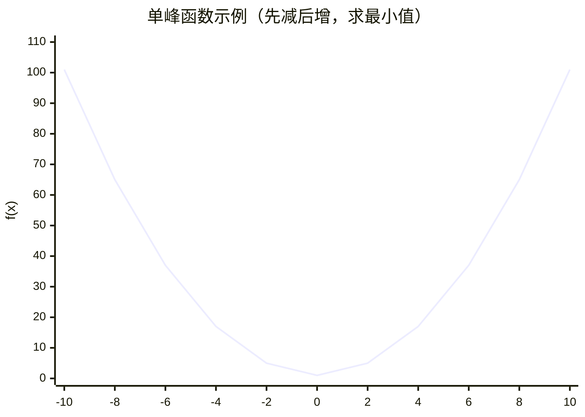

> 上图展示了一个单峰函数 f(x) = x² + 1，在 x=0 处取得最小值。

**三分法 vs 求导**：

| 方法 | 适用场景 | 精度 | 条件 |
|------|---------|------|------|
| 求导 | 函数有解析表达式且可导 | 精确 | 需要导数公式 |
| 三分法 | 只能计算函数值（黑箱） | 数值近似 | 函数单峰 |
| 黄金分割 | 同上，但每次只需计算 1 个新点 | 数值近似 | 函数单峰 |

**三分法的工作原理**：

假设我们要在区间 `[left, right]` 上找单峰函数的最小值：

1. 在区间内取两个三等分点：`m1 = left + (right - left) / 3`，`m2 = right - (right - left) / 3`
2. 比较 `f(m1)` 和 `f(m2)`：
   - 如果 `f(m1) < f(m2)`：最小值一定在 `[left, m2]` 中（因为 m2 在上升段），舍弃 `[m2, right]`
   - 如果 `f(m1) > f(m2)`：最小值一定在 `[m1, right]` 中（因为 m1 在下降段），舍弃 `[left, m1]`
   - 如果 `f(m1) == f(m2)`：最小值在 `[m1, m2]` 中（这种情况在浮点数中很少出现）

3. 重复步骤 1-2，直到区间长度 < eps

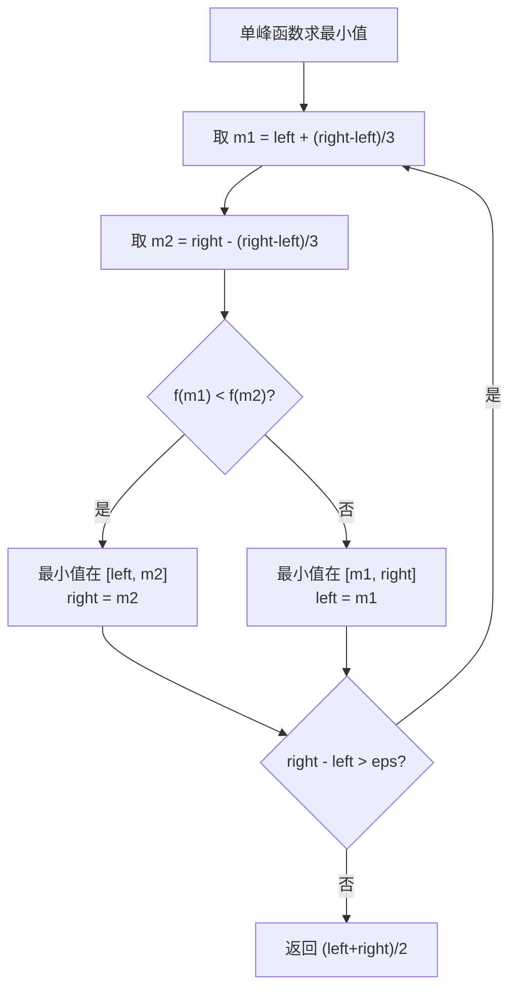

**为什么每次只排除 1/3**：因为我们需要两个采样点来判断峰值在哪个方向。相比二分的 1/2 排除率，三分法的效率略低，但适用于不需要导数的极值搜索场景。

> 来源：OI Wiki <https://oi-wiki.org/basic/binary/>、CP-Algorithms <https://cp-algorithms.com/num_methods/binary_search.html>

---

### 7.2 三分法模板（Python 实现）

```python
def ternary_search_min(f, left: float, right: float, eps: float = 1e-7) -> float:
    """
    三分法求单峰函数的最小值点。
    
    参数:
        f: 目标函数，接受一个浮点数，返回一个浮点数
        left: 搜索区间左端点
        right: 搜索区间右端点
        eps: 精度控制，当区间长度 < eps 时停止
    
    返回:
        最小值点的 x 坐标
    
    时间复杂度: O(log₃((right-left)/eps))
    空间复杂度: O(1)
    """
    while right - left > eps:
        m1 = left + (right - left) / 3  # 左三等分点
        m2 = right - (right - left) / 3  # 右三等分点
        if f(m1) < f(m2):
            right = m2  # 最小值在左半部分
        else:
            left = m1   # 最小值在右半部分
    
    return (left + right) / 2


def ternary_search_max(f, left: float, right: float, eps: float = 1e-7) -> float:
    """
    三分法求单峰函数的最大值点。
    
    返回:
        最大值点的 x 坐标
    """
    while right - left > eps:
        m1 = left + (right - left) / 3
        m2 = right - (right - left) / 3
        if f(m1) > f(m2):
            right = m2  # 最大值在左半部分
        else:
            left = m1   # 最大值在右半部分
    
    return (left + right) / 2
```

**离散版本的三分法**（整数域）：

```python
def ternary_search_int(f, left: int, right: int) -> int:
    """
    三分法求整数域上单峰函数的最小值点。
    
    返回:
        最小值点的整数坐标
    """
    while right - left > 2:
        m1 = left + (right - left) // 3
        m2 = right - (right - left) // 3
        if f(m1) < f(m2):
            right = m2
        else:
            left = m1
    
    # 区间长度 ≤ 2，暴力枚举
    return min(range(left, right + 1), key=f)
```

**精度控制要点**：
- `eps = 1e-7`：通常足够，迭代次数约 `log₃(区间长度 × 10⁷)`
- 迭代次数上限：约 100 次迭代即可将 `[-10⁹, 10⁹]` 缩到 `1e-7` 精度
- 固定迭代次数写法（避免浮点精度问题）：

```python
def ternary_search_fixed_iter(f, left: float, right: float, iterations: int = 100) -> float:
    """固定迭代次数版本的三分法，更稳定"""
    for _ in range(iterations):
        m1 = left + (right - left) / 3
        m2 = right - (right - left) / 3
        if f(m1) < f(m2):
            right = m2
        else:
            left = m1
    return (left + right) / 2
```

---

### 7.3 经典题目：LCR 1515 - 服务中心的最佳位置（LeetCode 1515，难度 2157）

> 给定平面上 n 个用户的位置，求一个点 `(x, y)`，使得该点到所有用户的欧几里得距离之和最小。

**分析**：

- **目标函数**：f(x, y) = Σ √((x - xi)² + (y - yi)²)
- 这是一个**凸函数**（欧几里得距离之和是凸的），所以可以用三分法
- 但这是**二维**的，需要嵌套三分法：先对 x 三分，在 x 确定后对 y 三分

```python
from typing import List
import math

class Solution:
    def getMinDistSum(self, positions: List[List[float]]) -> float:
        n = len(positions)
        
        def dist_sum(x: float, y: float) -> float:
            """计算点 (x, y) 到所有用户的距离之和"""
            return sum(math.sqrt((x - px) ** 2 + (y - py) ** 2) for px, py in positions)
        
        def ternary_y(x: float) -> float:
            """给定 x，对 y 三分求最优值"""
            lo, hi = 0.0, 100.0
            for _ in range(50):
                m1 = lo + (hi - lo) / 3
                m2 = hi - (hi - lo) / 3
                if dist_sum(x, m1) < dist_sum(x, m2):
                    hi = m2
                else:
                    lo = m1
            return dist_sum(x, (lo + hi) / 2)
        
        # 对 x 三分，内部嵌套对 y 三分
        lo, hi = 0.0, 100.0
        for _ in range(50):
            m1 = lo + (hi - lo) / 3
            m2 = hi - (hi - lo) / 3
            if ternary_y(m1) < ternary_y(m2):
                hi = m2
            else:
                lo = m1
        
        # 计算最优值
        best_x = (lo + hi) / 2
        best_y_lo, best_y_hi = 0.0, 100.0
        for _ in range(50):
            m1 = best_y_lo + (best_y_hi - best_y_lo) / 3
            m2 = best_y_hi - (best_y_hi - best_y_lo) / 3
            if dist_sum(best_x, m1) < dist_sum(best_x, m2):
                best_y_hi = m2
            else:
                best_y_lo = m1
        best_y = (best_y_lo + best_y_hi) / 2
        
        return dist_sum(best_x, best_y)
```

**注意**：实际竞赛中，这道题也可以用**梯度下降**或**模拟退火**来求解。三分法是一种更确定的方法，但效率不是最优的。

> 来源：灵神题单第三节「三分法」

---

### 7.4 其他二分场景

#### 7.4.1 LC 4 - 寻找两个正序数组的中位数

**问题**：两个升序数组 `nums1`（长 m）和 `nums2`（长 n），求合并后的中位数。要求 O(log(m+n))。

**思路**：这不是在某个数组上二分，而是在"分割点"上二分。

```python
from typing import List
import math

class Solution:
    def findMedianSortedArrays(self, nums1: List[int], nums2: List[int]) -> float:
        # 保证 nums1 是较短的数组
        if len(nums1) > len(nums2):
            nums1, nums2 = nums2, nums1
        
        m, n = len(nums1), len(nums2)
        total_left = (m + n + 1) // 2  # 左半部分需要的元素个数
        
        left, right = 0, m
        while left <= right:
            i = (left + right) // 2  # nums1 中取前 i 个
            j = total_left - i       # nums2 中取前 j 个
            
            # 边界处理：i=0 表示 nums1 不贡献任何左半元素
            max_left1 = -math.inf if i == 0 else nums1[i - 1]
            min_right1 = math.inf if i == m else nums1[i]
            max_left2 = -math.inf if j == 0 else nums2[j - 1]
            min_right2 = math.inf if j == n else nums2[j]
            
            if max_left1 <= min_right2 and max_left2 <= min_right1:
                # 找到正确的分割点
                if (m + n) % 2 == 1:
                    return max(max_left1, max_left2)
                else:
                    return (max(max_left1, max_left2) + min(min_right1, min_right2)) / 2
            elif max_left1 > min_right2:
                right = i - 1  # nums1 取的太多了
            else:
                left = i + 1   # nums1 取的太少了
        
        return 0.0  # 不应到达
```

**关键洞察**：将两个数组合并为一个长度为 m+n 的数组，中位数就是第 (m+n)/2 个元素。我们通过在较短数组上二分"分割点"，使得分割点左边的所有元素 ≤ 分割点右边的所有元素。

---

#### 7.4.2 LC 69 - x 的平方根

**问题**：求 √x 的整数部分（向下取整）。

```python
class Solution:
    def mySqrt(self, x: int) -> int:
        if x <= 1:
            return x
        
        left, right = 1, x
        while left + 1 < right:
            mid = (left + right) // 2
            if mid * mid <= x:
                left = mid   # mid 可能是答案
            else:
                right = mid  # mid 太大了
        
        return left
```

**本质**：在 `[1, x]` 上找最大的整数 `ans` 使得 `ans² ≤ x`。这是一个"最大化满足条件的值"的问题。

---

#### 7.4.3 LC 278 - 第一个错误的版本

**问题**：有 n 个版本 [1, 2, ..., n]，从某个版本开始之后的所有版本都是错误的。找出第一个错误的版本。API 提供 `isBadVersion(version)` → bool。

```python
class Solution:
    def firstBadVersion(self, n: int) -> int:
        left, right = 1, n
        while left + 1 < right:
            mid = (left + right) // 2
            if isBadVersion(mid):
                right = mid  # mid 是坏的，第一个坏版本在 mid 或之前
            else:
                left = mid   # mid 是好的，第一个坏版本在 mid 之后
        
        if isBadVersion(left):
            return left
        return right
```

**本质**：经典的 `lower_bound` 问题。`isBadVersion` 的返回值序列是 `[False, False, ..., False, True, True, ..., True]`，找第一个 True。

---

#### 7.4.4 LC 540 - 有序数组中的单一元素

**问题**：有序数组中每个元素都出现两次，只有一个元素出现一次。找出这个单一元素。要求 O(log n)。

**分析**：利用下标奇偶性与配对的关系。

- 在没有单一元素之前：每对元素的第一个出现在偶数下标，第二个出现在奇数下标
- 单一元素之后：这个规律反转

```python
from typing import List

class Solution:
    def singleNonDuplicate(self, nums: List[int]) -> int:
        left, right = 0, len(nums) - 1
        
        while left < right:
            mid = (left + right) // 2
            # 确保 mid 是偶数（指向每对的第一个元素）
            if mid % 2 == 1:
                mid -= 1
            
            if nums[mid] == nums[mid + 1]:
                # 配对正常，单一元素在右边
                left = mid + 2
            else:
                # 配对异常，单一元素在左边（含 mid）
                right = mid
        
        return nums[left]
```

**理解**：每次取偶数下标 mid，如果 `nums[mid] == nums[mid+1]` 说明前半部分都是成对的，单一元素在右半部分；否则在左半部分。

---

### 7.5 题目映射表（灵神题单 第三节 + 第四节）

#### 第三节：三分法

| LeetCode | 题目名称 | 难度分 | 说明 |
|----------|---------|--------|------|
| 1515 | 服务中心的最佳位置 | 2157 | 二维嵌套三分 / 梯度下降 |

#### 第四节：其他

| LeetCode | 题目名称 | 难度分 | 考点 | 思路 |
|----------|---------|--------|------|------|
| 69 | x 的平方根 | - | 二分答案 | 最大化 ans² ≤ x |
| 74 | 搜索二维矩阵 | - | 二维二分 | 按行二分 |
| 278 | 第一个错误的版本 | - | lower_bound | 经典模板 |
| 374 | 猜数字大小 | - | 二分查找 | 经典模板 |
| 162 | 寻找峰值 | - | 二分 | 比较相邻元素 |
| 1901 | 寻找峰值 II | - | 二分 | 降维处理 |
| 852 | 山脉数组的峰顶索引 | - | 二分 | 比较 mid 和 mid+1 |
| 1095 | 山脉数组中查找目标值 | 1827 | 二分 + 山脉 | 先找峰，再两边二分 |
| 153 | 寻找旋转排序数组中的最小值 | - | 二分 | 比较 mid 与 right |
| 154 | 寻找旋转排序数组中的最小值 II | - | 二分 | 处理重复元素 |
| 33 | 搜索旋转排序数组 | - | 二分 | 判断哪边有序 |
| 81 | 搜索旋转排序数组 II | - | 二分 | 处理重复元素 |
| 222 | 完全二叉树的节点个数 | - | 二分 + 树 | 利用完全二叉树性质 |
| 1539 | 第 k 个缺失的正整数 | - | 二分 | 缺失数计数 |
| 540 | 有序数组中的单一元素 | - | 二分 | 奇偶下标配对 |
| 4 | 寻找两个正序数组的中位数 | - | 二分 | 分割点二分 |
| 1064 | 不动点 | - | 二分 | nums[i] == i |
| 702 | 搜索长度未知的有序数组 | - | 指数扩展 + 二分 | 先扩展再二分 |
| 302 | 包含全部黑色像素的最小矩形 | - | 二分 | 四个方向各二分一次 |

> 来源：灵神题单第三节「三分法」+ 第四节「其他」

---

## 8. 常见陷阱与刷题路线

### 8.1 边界陷阱（left/right 初始值、循环条件、返回值）

二分算法最让人头疼的就是边界条件。三个要素必须**一致**：

```mermaid
flowchart TD
    A[二分三要素] --> B[1. left 和 right 的初始值]
    A --> C[2. 循环条件]
    A --> D[3. 返回值]
    B --> E["闭区间 [L, R]\nleft=0, right=n-1"]
    B --> F["开区间 (L, R)\nleft=-1, right=n"]
    C --> G["while left <= right\n闭区间用"]
    C --> H["while left + 1 < right\n开区间用"]
    D --> I["返回 left 或 right\n需要判断"]
```

**三种主流写法的对比**：

| 写法 | 初始值 | 循环条件 | mid 更新 | 返回值 | 适用场景 |
|------|--------|---------|---------|--------|---------|
| 闭区间 | `left=0, right=n-1` | `left <= right` | `mid±1` | 循环内判断 | 查找确切值 |
| 左闭右开 | `left=0, right=n` | `left < right` | 一边 `mid+1` | `left` | 查找插入位置 |
| **开区间（推荐）** | `left=边界False, right=边界True` | `left + 1 < right` | 都不 ±1 | `right` | **二分答案** |

**开区间写法为什么推荐**：
- `left` 永远代表"不满足条件"的边界
- `right` 永远代表"满足条件"的边界
- 循环结束时，`right` 就是答案
- 不用在循环内判断，不容易出错

```python
# 开区间模板（灵神推荐）
def lower_bound(nums: list, target: int) -> int:
    """找到第一个 ≥ target 的元素的下标"""
    left, right = -1, len(nums)  # 开区间 (-1, n)
    while left + 1 < right:
        mid = (left + right) // 2
        if nums[mid] >= target:
            right = mid
        else:
            left = mid
    return right  # 如果 right == n 说明不存在 ≥ target 的元素
```

**常见错误**：

```python
# ❌ 错误：闭区间写法中忘记 mid±1
left, right = 0, len(nums) - 1
while left <= right:
    mid = (left + right) // 2
    if nums[mid] >= target:
        right = mid  # 错！应该是 right = mid - 1，否则可能死循环

# ✅ 正确：闭区间必须 ±1
right = mid - 1

# ✅ 或者改用开区间写法（不需要 ±1）
left, right = -1, len(nums)
while left + 1 < right:
    mid = (left + right) // 2
    if nums[mid] >= target:
        right = mid  # 开区间不需要 ±1
    else:
        left = mid
```

---

### 8.2 死循环陷阱（mid 计算方式、区间收缩方向）

**死循环的本质原因**：区间收缩方向与 mid 计算方式不匹配，导致 `left` 或 `right` 不移动。

**经典死循环场景**：

```python
# ❌ 死循环：区间 [left, right] 长度为 1 时 mid = left，
#    如果走 left = mid 分支，区间不变
left, right = 0, 1
while left < right:
    mid = (left + right) // 2  # mid = 0
    if condition(mid):
        left = mid   # left 仍然是 0 → 死循环！
    else:
        right = mid - 1
```

**解决方案**：

| 场景 | mid 计算 | 更新策略 |
|------|---------|---------|
| `left = mid` | `mid = (left + right + 1) // 2`（上取整） | `right = mid - 1` |
| `right = mid` | `mid = (left + right) // 2`（下取整） | `left = mid + 1` |
| **开区间写法** | `mid = (left + right) // 2` | `left = mid` 或 `right = mid`（都不 ±1） |

**开区间写法天然避免死循环**：因为循环条件是 `left + 1 < right`，区间长度至少为 2，mid 一定严格在 left 和 right 之间，所以 `left = mid` 和 `right = mid` 都会缩小区间。

---

### 8.3 check 函数设计误区

#### 误区一：不满足单调性

```python
# ❌ 错误示例：check 函数不单调
def check(x):
    return x == 5  # 只在 x=5 时为 True，其他都是 False
    # True 序列：F F F F F T F F F F → 不单调！无法二分
```

**判断单调性的方法**：如果 `check(x) = True`，那么对于所有 `y > x`（或 `y < x`，取决于方向），`check(y)` 也必须为 True。

**实际例子**：

```python
# ✅ 单调：x 越大，越容易完成任务
def check(x):
    """给定每天能做 x 道题，能否在 7 天内做完 50 道？"""
    return x * 7 >= 50  # x=7 → False, x=8 → True → 单调！

# ❌ 不单调：某些 x 值反而不行
def check_bad(x):
    """这个函数在 x=3 和 x=7 时为 True，其他为 False"""
    return x in (3, 7)  # T F F F F F F T → 不单调！
```

#### 误区二：遗漏边界情况

```python
# ❌ 错误：check 函数没有处理 k=0 的情况
def check_kth(d):
    cnt = 0
    for i in range(len(nums) - 1):
        for j in range(i + 1, len(nums)):
            if nums[j] - nums[i] <= d:
                cnt += 1
    return cnt >= k  # k=0 时永远是 True
```

#### 误区三：check 函数效率太低

二分答案的时间复杂度是 `O(check_cost × log(答案范围))`。如果 check 函数是 O(n²)，而答案范围是 10⁹，总复杂度可能是 O(n² × 30)，容易超时。

**优化思路**：
- check 中嵌套二分而非线性扫描
- 用前缀和 / 滑动窗口 / 双指针代替暴力计数
- 利用数学公式直接计算

---

### 8.4 整数溢出陷阱

**问题**：当 `left` 和 `right` 都很大时，`left + right` 可能溢出。

```python
# ❌ 可能溢出（在 C++/Java 中）
mid = (left + right) // 2  # 当 left + right > 2³¹-1 时溢出

# ✅ 安全写法
mid = left + (right - left) // 2

# ✅ Python 不需要担心（自动处理大整数），但其他语言必须注意
```

**其他语言中的安全写法**：

```cpp
// C++
int mid = left + (right - left) / 2;  // 推荐
int mid = (left + right) >> 1;        // 位运算，但仍有溢出风险

// C++17 起
int mid = std::midpoint(left, right); // 最安全
```

```java
// Java
int mid = left + (right - left) / 2;  // 推荐
int mid = (left + right) >>> 1;       // 无符号右移，避免溢出
```

**Python 用户的注意**：虽然 Python 不会整数溢出，但在竞赛中如果要移植代码到 C++/Java，这个坑必须知道。

---

### 8.5 灵神题单完整映射表

#### 第一节：基础二分查找

| 难度分 | LeetCode | 题目名称 | 知识点 |
|--------|----------|---------|--------|
| - | 704 | 二分查找 | 模板 |
| - | 35 | 搜索插入位置 | lower_bound |
| - | 34 | 在排序数组中查找元素的第一个和最后一个位置 | lower_bound + upper_bound |
| - | 744 | 寻找比目标字母大的最小字母 | upper_bound |
| - | 2529 | 正整数和负整数的最大计数 | lower_bound |
| - | 2389 | 和有限的最长子序列 | 前缀和 + 二分 |
| 1235 | 1385 | 两个数组间的距离值 | lower_bound |
| 1432 | 1170 | 比较字符串最小字母出现频次 | 计数 + 二分 |
| 1477 | 2300 | 咒语和药水的成功对数 | 排序 + 二分 |
| 1702 | 2080 | 区间内查询数字的频率 | 哈希 + 二分 |
| 1721 | 2563 | 统计公平数对的数目 | 排序 + 二分 |
| 1724 | 2070 | 每一个查询的最大美丽值 | 排序 + 二分 |
| 1771 | 1146 | 快照数组 | 二分查找版本 |
| - | 981 | 基于时间的键值存储 | 二分查找版本 |
| 1851 | 3508 | 设计路由器 | 二分 |
| - | 658 | 找到 K 个最接近的元素 | 二分 + 双指针 |
| 1934 | 1818 | 绝对差值和 | 排序 + 二分 |
| 2001 | 911 | 在线选举 | 二分 |
| - | LCP 08 | 剧情触发时间 | 前缀和 + 二分 |
| - | 1182 | 与目标颜色间的最短距离 | 预处理 + 二分 |
| - | 2819 | 购买巧克力后的最小相对损失 | 排序 + 二分 |

#### 第二节：二分答案

**§2.1 最小化（找最小可行值）**

| 难度分 | LeetCode | 题目名称 | check 方法 |
|--------|----------|---------|-----------|
| 1542 | 1283 | 使结果不超过阈值的最小除数 | 求和 |
| 1641 | 2187 | 完成旅途的最少时间 | 计数 |
| 1725 | 1011 | 在 D 天内送达包裹的能力 | 贪心分段 |
| 1766 | 875 | 爱吃香蕉的珂珂 | 求和 |
| - | 3296 | 移山所需的最少秒数 | 数学 |
| 1853 | 3639 | 变为活跃状态的最小时间 | 贪心 |
| - | 475 | 供暖器 | 贪心 |
| 1915 | 2594 | 修车的最少时间 | 计数 |
| 1946 | 1482 | 制作 m 束花所需的最少天数 | 贪心 |
| 2263 | 3048 | 标记所有下标的最早秒数 I | 贪心 + 优先队列 |
| - | 3807 | 修复边以遍历图的最小成本 | 图论 + 二分 |
| - | 2604 | 吃掉所有谷子的最短时间 | 贪心 |
| - | 2702 | 使数字变为非正数的最小操作次数 | 贪心 |

**§2.2 最大化（找最大可行值）**

| 难度分 | LeetCode | 题目名称 | check 方法 |
|--------|----------|---------|-----------|
| - | 275 | H 指数 II | 计数 |
| 1646 | 2226 | 每个小孩最多能分到多少糖果 | 贪心 |
| 1773 | 2982 | 找出出现至少三次的最长特殊子字符串 II | 计数 |
| 1843 | 2576 | 求出最多标记下标 | 贪心配对 |
| 1913 | 1898 | 可移除字符的最大数目 | 子序列判断 |
| 1929 | 1802 | 有界数组中指定下标处的最大值 | 数学 |
| 1962 | 1642 | 可以到达的最远建筑 | 贪心 + 优先队列 |
| 1981 | 2861 | 最大合金数 | 贪心 |
| 2258 | 3007 | 价值和小于等于 K 的最大数字 | 数位 DP |
| 2265 | 2141 | 同时运行 N 台电脑的最长时间 | 贪心 |
| 2347 | 2258 | 逃离火灾 | BFS + 二分 |
| 2648 | 2071 | 你可以安排的最多任务数目 | 贪心 + 单调队列 |
| - | LCP 78 | 城墙防线 | 贪心 |
| - | 1618 | 找出适应屏幕的最大字号 | 模拟 |
| - | 1891 | 割绳子 | 计数 |
| - | 2137 | 通过倒水操作让所有的水桶所含水量相等 | 贪心 |
| - | 3344 | 最大尺寸数组 | 贪心 |
| - | 644 | 子数组最大平均数 II | 前缀和 + 二分 |

**§2.3 二分间接值**

| 难度分 | LeetCode | 题目名称 |
|--------|----------|---------|
| 1697 | 3143 | 正方形中的最多点数 |
| 2050 | 1648 | 销售价值减少的颜色球 |

**§2.4 最小化最大值**

| 难度分 | LeetCode | 题目名称 | check 方法 |
|--------|----------|---------|-----------|
| - | 410 | 分割数组的最大值 | 贪心分段 |
| 1886 | 2064 | 分配给商店的最多商品的最小值 | 贪心分配 |
| - | 3613 | 最小化连通分量的最大成本 | 并查集 |
| 1940 | 1760 | 袋子里最少数目的球 | 贪心分割 |
| 1948 | 1631 | 最小体力消耗路径 | BFS/DFS |
| 1965 | 2439 | 最小化数组中的最大值 | 贪心模拟 |
| 2081 | 2560 | 打家劫舍 IV | 贪心选择 |
| 2097 | 778 | 水位上升的泳池中游泳 | BFS/DFS |
| 2155 | 2616 | 最小化数对的最大差值 | 贪心配对 |
| 2243 | 3419 | 图的最大边权的最小值 | 并查集/BFS |
| 2302 | 2513 | 最小化两个数组中的最大值 | 数学 |
| - | 3733 | 完成所有送货任务的最少时间 | 贪心 |
| 2376 | 3399 | 字符相同的最短子字符串 II | 数学 |
| 2410 | 3605 | 数组的最小稳定性因子 | 贪心 |
| - | LCP 12 | 小张刷题计划 | 贪心分段 |
| - | 774 | 最小化去加油站的最大距离 | 贪心插入 |

**§2.5 最大化最小值**

| 难度分 | LeetCode | 题目名称 |
|--------|----------|---------|
| 1768 | 3281 | 范围内整数的最大得分 |
| 1998 | 3620 | 恢复网络路径 |
| 2021 | 2517 | 礼盒的最大甜蜜度 |
| - | 1552 | 两球之间的磁力 |
| 2135 | 3710 | 最大划分因子 |
| 2154 | 2812 | 找出最安全路径 |
| 2236 | 2528 | 最大化城市的最小电量 |
| 2301 | 3600 | 升级后最大生成树稳定性 |
| 2748 | 3449 | 最大化游戏分数的最小值 |
| 2806 | 3464 | 正方形上的点之间的最大距离 |
| - | 1102 | 得分最高的路径 |
| - | 1231 | 分享巧克力 |

**§2.6 第 K 小/大**

| 难度分 | LeetCode | 题目名称 |
|--------|----------|---------|
| - | 668 | 乘法表中第 K 小的数 |
| - | 378 | 有序矩阵中第 K 小的元素 |
| - | 719 | 找出第 K 小的数对距离 |
| 1897 | 878 | 第 N 个神奇数字 |
| 2039 | 1201 | 丑数 III |
| 2100 | 793 | 阶乘函数后 K 个零 |
| - | 373 | 查找和最小的 K 对数字 |
| 2134 | 1439 | 有序矩阵中的第 k 个最小数组和 |
| 2169 | 786 | 第 K 个最小的质数分数 |
| 2387 | 3116 | 单面值组合的第 K 小金额 |
| 2451 | 3134 | 找出唯一性数组的中位数 |
| 2518 | 2040 | 两个有序数组的第 K 小乘积 |
| 2648 | 2386 | 找出数组的第 K 大和 |
| - | 1508 | 子数组和排序后的区间和 |
| - | 3691 | 最大子数组总值 II |
| - | 3520 | 逆序对计数的最小阈值 |
| - | 1918 | 第 K 小的子数组和 |

#### 第三节：三分法

| 难度分 | LeetCode | 题目名称 |
|--------|----------|---------|
| 2157 | 1515 | 服务中心的最佳位置 |

#### 第四节：其他

| 难度分 | LeetCode | 题目名称 | 考点 |
|--------|----------|---------|------|
| - | 69 | x 的平方根 | 二分答案 |
| - | 74 | 搜索二维矩阵 | 二维二分 |
| - | 278 | 第一个错误的版本 | lower_bound |
| - | 374 | 猜数字大小 | 二分查找 |
| - | 162 | 寻找峰值 | 二分 |
| - | 1901 | 寻找峰值 II | 二分 |
| - | 852 | 山脉数组的峰顶索引 | 二分 |
| 1827 | 1095 | 山脉数组中查找目标值 | 二分 + 交互 |
| - | 153 | 寻找旋转排序数组中的最小值 | 二分 |
| - | 154 | 寻找旋转排序数组中的最小值 II | 二分（含重复） |
| - | 33 | 搜索旋转排序数组 | 二分 |
| - | 81 | 搜索旋转排序数组 II | 二分（含重复） |
| - | 222 | 完全二叉树的节点个数 | 二分 + 树 |
| - | 1539 | 第 k 个缺失的正整数 | 二分 |
| - | 540 | 有序数组中的单一元素 | 二分 |
| - | 4 | 寻找两个正序数组的中位数 | 分割点二分 |
| - | 1064 | 不动点 | 二分 |
| - | 702 | 搜索长度未知的有序数组 | 指数扩展 + 二分 |
| - | 2936 | 包含相等值数字块的数量 | 二分 |
| - | 1060 | 有序数组中的缺失元素 | 二分 |
| - | 1198 | 找出所有行中最小公共元素 | 二分 |
| - | 1428 | 至少有一个 1 的最左端列 | 二分（交互） |
| - | 1533 | 找到最大整数的索引 | 指数扩展 + 二分 |
| - | 2387 | 行排序矩阵的中位数 | 二分 |
| - | 302 | 包含全部黑色像素的最小矩形 | 二分 |

---

### 8.6 刷题路线建议

#### 新手村路线（难度分 ≤ 1700）

**目标**：掌握二分的基本模板和直觉。按顺序刷，不要跳题。

```mermaid
flowchart LR
    A["第一阶段\n基础模板"] --> B["第二阶段\n二分答案"]
    B --> C["第三阶段\n进阶应用"]
    
    subgraph A[" "]
        A1[704 二分查找] --> A2[35 搜索插入位置] --> A3[34 查找范围] --> A4[278 第一个错误版本]
    end
    
    subgraph B[" "]
        B1[69 平方根] --> B2[875 爱吃香蕉的珂珂 ★1766] --> B3[1283 最小除数 ★1542] --> B4[1552 磁力 ★-]
    end
    
    subgraph C[" "]
        C1[410 分割数组 ★2147] --> C2[1515 服务中心 ★2157] --> C3[719 数对距离 ★-]
    end
```

**具体题目（按难度分升序）**：

| 序号 | LeetCode | 题目 | 难度分 | 核心技能 |
|------|----------|------|--------|---------|
| 1 | 704 | 二分查找 | - | 基础模板 |
| 2 | 35 | 搜索插入位置 | - | lower_bound |
| 3 | 34 | 查找元素范围 | - | lower + upper |
| 4 | 278 | 第一个错误版本 | - | 模板应用 |
| 5 | 69 | x 的平方根 | - | 二分答案入门 |
| 6 | 540 | 单一元素 | - | 下标奇偶技巧 |
| 7 | 162 | 寻找峰值 | - | 相邻比较 |
| 8 | 1539 | 第 k 个缺失正整数 | - | 缺失计数 |
| 9 | 1385 | 两个数组间的距离值 | 1235 | 排序 + 二分 |
| 10 | 1170 | 比较字符串最小频次 | 1432 | 计数 + 二分 |
| 11 | 1283 | 最小除数 | 1542 | 二分答案 |
| 12 | 2080 | 区间频率查询 | 1702 | 哈希 + 二分 |
| 13 | 2300 | 咒语和药水 | 1477 | 排序 + 二分 |
| 14 | 875 | 爱吃香蕉的珂珂 | 1766 | 经典二分答案 |

#### 进阶路线（难度分 1700-2200）

| 序号 | LeetCode | 题目 | 难度分 | 核心技能 |
|------|----------|------|--------|---------|
| 1 | 2563 | 公平数对 | 1721 | 双指针 + 二分 |
| 2 | 2070 | 最大美丽值 | 1724 | 离线处理 + 二分 |
| 3 | 1818 | 绝对差值和 | 1934 | 贪心 + 二分 |
| 4 | 1011 | D 天送达包裹 | 1725 | 二分答案 + 贪心 |
| 5 | 2594 | 修车的最少时间 | 1915 | 二分答案 |
| 6 | 1482 | 制作花束 | 1946 | 二分答案 |
| 7 | 410 | 分割数组最大值 | 2147 | 经典二分答案 |
| 8 | 778 | 水位上升泳池 | 2097 | BFS + 二分答案 |
| 9 | 2517 | 最大甜蜜度 | 2021 | 最大化最小值 |
| 10 | 378 | 有序矩阵第 K 小 | - | 二维计数 |
| 11 | 719 | 第 K 小数对距离 | - | 滑动窗口计数 |
| 12 | 1515 | 服务中心最佳位置 | 2157 | 三分法 |

#### 高手路线（难度分 ≥ 2200）

| 序号 | LeetCode | 题目 | 难度分 | 核心技能 |
|------|----------|------|--------|---------|
| 1 | 3048 | 标记下标最早秒数 | 2263 | 贪心 + 二分 + 优先队列 |
| 2 | 3007 | 价值和 ≤ K 最大数字 | 2258 | 数位 DP + 二分 |
| 3 | 2141 | 同时运行 N 台电脑 | 2265 | 贪心 + 二分 |
| 4 | 2513 | 最小化两数组最大值 | 2302 | 数学 + 二分 |
| 5 | 2812 | 最安全路径 | 2154 | BFS + 二分 + 预处理 |
| 6 | 2560 | 打家劫舍 IV | 2081 | 贪心 + 二分 |
| 7 | 2616 | 最小化数对差值 | 2155 | 贪心配对 + 二分 |
| 8 | 2040 | 第 K 小乘积 | 2518 | 负数处理 + 二分 |
| 9 | 3116 | 第 K 小金额 | 2387 | 容斥 + 二分 |
| 10 | 2386 | 第 K 大和 | 2648 | 排序 + 优先队列 |

---

### 8.7 二分算法与其他算法的结合

二分算法很少孤立使用。实际题目中，二分往往是"外层框架"，内层需要配合其他算法来完成 check 函数。

#### 二分 + 贪心

**最常见的组合**。check 函数中用贪心策略判断可行性。

```mermaid
flowchart LR
    A[二分答案框架] --> B["check(x):\n给定上限 x"]
    B --> C[贪心策略判断]
    C --> D{是否可行?}
    D -->|是| E[right = x]
    D -->|否| F[left = x]
```

**典型题目**：
- 410 分割数组最大值：贪心分段
- 1552 两球之间的磁力：贪心选点
- 875 爱吃香蕉的珂珂：直接计算
- 1011 D 天送达包裹：贪心分段

#### 二分 + 图论（BFS/DFS/并查集）

**check 函数中判断图的连通性或最短路径**。

```mermaid
flowchart TD
    A[二分答案 x] --> B["check(x):\n边权 ≤ x 的边构成的子图"]
    B --> C[BFS/DFS 判断连通性]
    C --> D{起点终点连通?}
    D -->|是| E[right = x]
    D -->|否| F[left = x]
```

**典型题目**：
- 778 水位上升的泳池中游泳：BFS 判断连通性
- 1631 最小体力消耗路径：BFS/DFS
- 2258 逃离火灾：BFS 预处理安全时间
- 3419 图的最大边权的最小值：并查集

#### 二分 + DP

check 函数中用动态规划判断可行性。这类题目通常难度较高。

**典型题目**：
- 3007 价值和小于等于 K 的最大数字：数位 DP
- 410 分割数组最大值（DP 解法）：dp[i][j] 表示前 i 个数分 j 段的最小最大和

#### 二分 + 数据结构

**check 函数中需要高效查询或维护数据结构**。

```mermaid
flowchart LR
    A[二分答案] --> B[check 中需要查询]
    B --> C["树状数组 / 线段树\n维护频次"]
    B --> D["优先队列\n维护最值"]
    B --> E["哈希表\n快速查找"]
```

**典型题目**：
- 2080 区间内查询数字的频率：哈希表 + 二分
- 1146 快照数组：二分查找版本
- 2071 最多任务数：单调队列

#### 二分 + 数学

**check 函数用数学公式直接计算**。

**典型题目**：
- 878 第 N 个神奇数字：容斥原理
- 1201 丑数 III：容斥原理
- 793 阶乘函数后 K 个零：Legendre 公式
- 2513 最小化两个数组最大值：数学推导

#### 二分 + 三分

有些题目外层用二分缩小范围，内层用三分求精。

**典型题目**：
- 1515 服务中心的最佳位置：可以用二分确定大区域，再三分求精确位置（更常见的是直接三分或梯度下降）

---

> **总结**：二分算法的本质是**利用单调性将对问题的求解从 O(n) 降低到 O(log n)**。掌握了"二分答案"的思想后，许多看似困难的优化问题都可以转化为简单的可行性判断问题。关键不在于记住模板，而在于：
> 1. 识别问题是否具有单调性
> 2. 正确设计 check 函数
> 3. 选择合适的二分模板（开区间推荐）
> 4. 处理边界情况不出错
