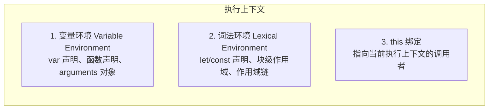
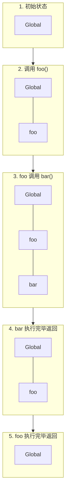
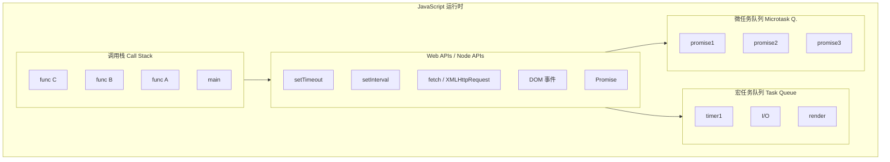
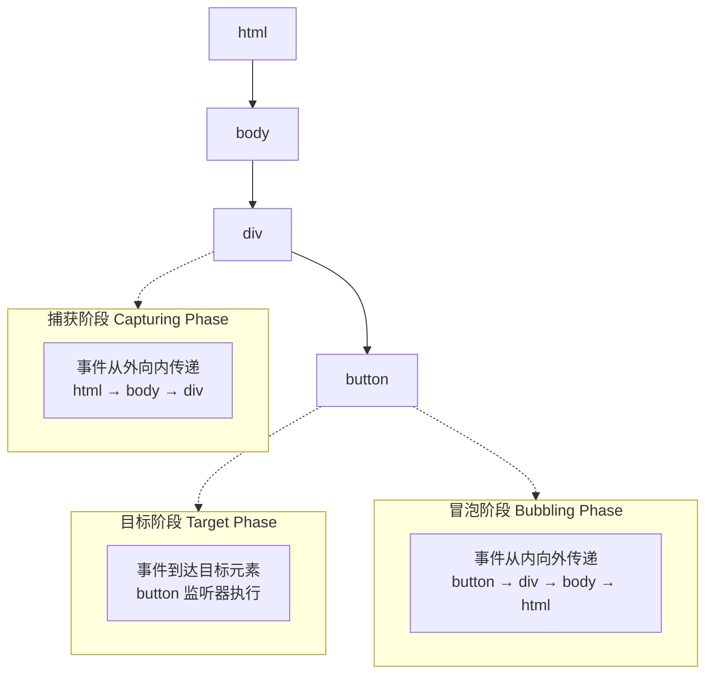
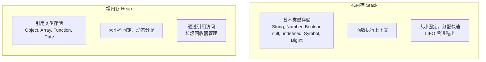
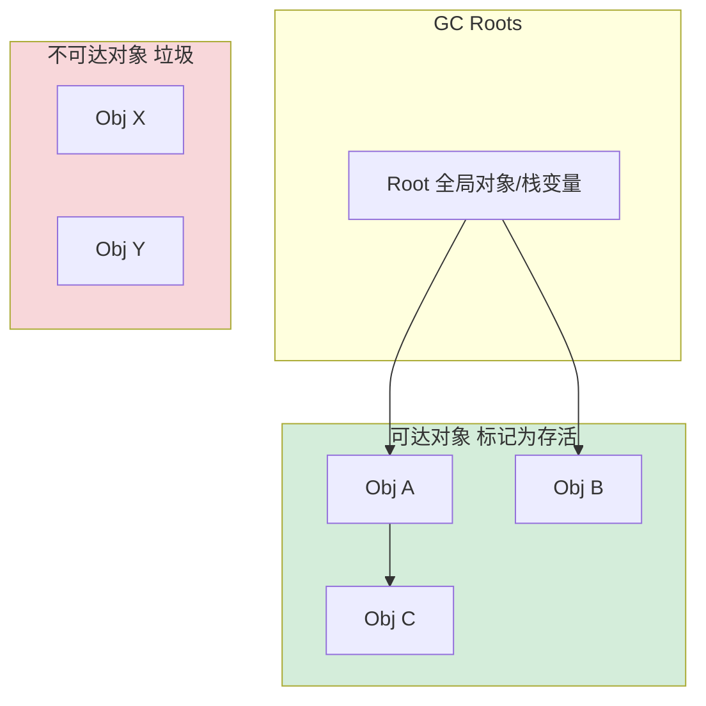
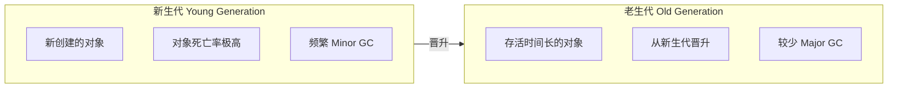

# JavaScript 核心知识体系

> 全面的 JavaScript 核心概念、原理与最佳实践指南

---

## 目录

1. [JavaScript 概述](#1-javascript-概述)
2. [语言基础](#2-语言基础)
3. [核心概念](#3-核心概念)
   - [3.1 执行上下文](#31-执行上下文)
   - [3.2 变量提升](#32-变量提升)
   - [3.3 事件循环](#33-事件循环)
   - [3.4 闭包](#34-闭包)
   - [3.5 this 指向](#35-this-指向)
   - [3.6 原型与原型链](#36-原型与原型链)
4. [函数与作用域](#4-函数与作用域)
   - [4.1 函数定义方式](#41-函数定义方式)
   - [4.2 作用域](#42-作用域)
   - [4.3 闭包](#43-闭包)（简要回顾）
   - [4.4 this 指向](#44-this-指向)（简要回顾）
5. [对象与原型](#5-对象与原型)
   - [5.1 对象创建方式](#51-对象创建方式)
   - [5.2 原型链](#52-原型链)（简要回顾）
   - [5.3 继承实现](#53-继承实现)
6. [异步编程](#6-异步编程)
7. [DOM 与 BOM](#7-dom-与-bom)
8. [事件机制](#8-事件机制)
9. [ES6+ 新特性](#9-es6-新特性)
10. [内存与性能](#10-内存与性能)

---

## 1. JavaScript 概述

### 1.1 三大组成部分

| 组成部分 | 说明 | 核心作用 |
|----------|------|----------|
| **ECMAScript** | 语言的语法核心 | 定义变量、函数、数据类型、运算符等基础语法规则 |
| **DOM** | 文档对象模型 | 页面文档的编程接口，获取、修改、添加或删除 HTML 元素 |
| **BOM** | 浏览器对象模型 | 浏览器窗口的编程接口，操作浏览器窗口本身 |

### 1.2 语言特性

- **动态类型**：变量无需声明类型，运行时自动推断
- **弱类型**：类型可自动转换（`"5" + 3 → "53"`，`"5" - 3 → 2`）
- **基于原型**：对象继承通过原型链实现
- **单线程 + 事件循环**：通过异步回调、Promise、async/await 处理并发
- **函数是一等公民**：函数可赋值、传参、返回

### 1.3 运行环境

#### 一、浏览器环境

浏览器是 JavaScript 最早的宿主环境，也是目前最普及的 JS 运行平台。

**JS 引擎：** 不同浏览器使用不同的 JavaScript 引擎来解析和执行代码：

| 浏览器 | JS 引擎 | 开发商 |
|--------|---------|--------|
| Chrome | V8 | Google |
| Firefox | SpiderMonkey | Mozilla |
| Safari | JavaScriptCore | Apple |
| Edge | V8 | Microsoft |

**核心 API：**
- **DOM API**：操作 HTML 元素、修改样式、处理事件
- **BOM API**：控制浏览器窗口、获取地址栏信息、操作历史记录

**安全限制（沙箱机制）：**
- 无法直接操作本地文件系统
- 无法访问操作系统底层资源
- 仅能在当前网页上下文中执行
- 受同源策略限制，无法跨域访问资源

---

#### 二、Node.js 环境

2009 年，Node.js 的诞生让 JavaScript 突破了浏览器的限制，实现了服务端运行能力。

**Node.js 是什么？**

Node.js 不是新语言，也不是框架，而是一个**基于 Chrome V8 引擎的独立 JavaScript 运行环境**。

```
┌────────────────────────────────────────────┐
│            Node.js 架构                    │
├────────────────────────────────────────────┤
│  JavaScript 代码 (你的应用)                 │
│           ↓                                │
│  Node.js 内置 API                          │
│  (fs、http、path、os 等模块)                │
│           ↓                                │
│  Chrome V8 引擎                            │
│  (解析、编译、执行 JS 代码)                  │
│           ↓                                │
│  LibUV 库                                  │
│  (事件循环、异步 I/O、线程池)               │
│           ↓                                │
│  操作系统 (Windows/Linux/macOS)            │
└────────────────────────────────────────────┘
```

**核心特性：**
- **事件驱动**：通过回调函数处理异步事件
- **非阻塞 I/O**：异步操作不会阻塞主线程
- **单线程模型**：通过事件循环处理高并发
- **丰富的内置模块**：文件系统、网络通信、数据库操作等

**Node.js 能做什么？**
- 构建 Web 服务器（Express、Koa）
- 操作本地文件系统
- 网络编程（HTTP、TCP、UDP）
- 数据库操作（MongoDB、MySQL）
- 构建 CLI 工具
- 桌面应用（Electron）

---

#### 三、浏览器 vs Node.js 对比

| 特性 | 浏览器 | Node.js |
|------|--------|---------|
| **JS 引擎** | V8/SpiderMonkey/JavaScriptCore | V8 |
| **DOM/BOM** | ✅ 支持 | ❌ 不支持 |
| **文件系统** | ❌ 不支持（沙箱限制） | ✅ 支持（fs 模块） |
| **网络请求** | XMLHttpRequest/Fetch | http/https 模块 |
| **全局对象** | `window` | `global` |
| **模块系统** | ES Module (现代浏览器) | CommonJS / ES Module |
| **事件循环** | 宏任务/微任务 | 6 个阶段（更复杂） |

---

#### 四、其他运行环境

| 环境 | 用途 | 说明 |
|------|------|------|
| **Electron** | 桌面应用开发 | VS Code、Slack、Discord 都基于 Electron |
| **React Native** | 移动应用开发 | 使用 JS 编写 iOS/Android 应用 |
| **Deno** | 现代 JS 运行时 | Node.js 作者新作品，更安全，原生支持 TypeScript |
| **Bun** | 高性能运行时 | 基于 JavaScriptCore，比 Node.js 更快 |
| **小程序** | 微信/支付宝小程序 | 受限的 JS 运行环境，提供专属 API |
| **Serverless** | 无服务器计算 | 云函数环境，按需执行 |

---

#### 五、JavaScript 运行机制

**编译与执行流程：**

```
1. 源代码 → 词法分析 → Token 流
2. Token 流 → 语法分析 → AST（抽象语法树）
3. AST → 字节码（解释执行）
4. 热点代码 → JIT 编译 → 机器码（优化执行）
```

**V8 引擎的 JIT 编译：**

V8 使用即时编译（Just-In-Time）技术，将 JavaScript 编译为机器码执行：
- **解释器（Ignition）**：快速生成字节码，立即执行
- **编译器（TurboFan）**：识别热点代码，优化编译为机器码
- **性能提升**：比早期解释执行快 10 倍以上

---

## 2. 语言基础

### 2.1 变量声明

#### 一、作用域（Scope）详解

**什么是作用域？**

作用域是指**变量在代码中可访问的范围**。JavaScript 通过作用域来控制变量的生命周期和可见性。

**作用域的类型：**

```
┌────────────────────────────────────────────────┐
│            JavaScript 作用域类型               │
├────────────────────────────────────────────────┤
│                                                │
│  1. 全局作用域（Global Scope）                 │
│     - 在任何函数外部声明的变量                 │
│     - 整个程序执行期间都存在                 │
│     - 任何地方都可以访问                       │
│                                                │
│  2. 函数作用域（Function Scope）               │
│     - 在函数内部声明的变量                     │
│     - 只在函数内部可访问                       │
│     - var 声明的变量属于函数作用域             │
│                                                │
│  3. 块级作用域（Block Scope）                  │
│     - 在 {} 代码块内声明的变量                 │
│     - 只在代码块内可访问                       │
│     - let/const 声明的变量属于块级作用域       │
│                                                │
│  4. 作用域链（Scope Chain）                    │
│     - 内层作用域可以访问外层作用域的变量       │
│     - 外层作用域无法访问内层作用域的变量       │
│     - 从内向外逐层查找，直到全局作用域         │
│                                                │
└────────────────────────────────────────────────┘
```

**作用域示例：**

```javascript
// 全局作用域
let globalVar = '全局变量';

function outer() {
  // 函数作用域
  let functionVar = '函数变量';
  
  if (true) {
    // 块级作用域
    let blockVar = '块级变量';
    console.log(globalVar);     // ✅ 可访问
    console.log(functionVar);   // ✅ 可访问
  }
  
  console.log(blockVar);  // ❌ ReferenceError: blockVar is not defined
}

console.log(globalVar);   // ✅ 可访问
console.log(functionVar); // ❌ ReferenceError: functionVar is not defined
```

**作用域链示例：**

```javascript
let a = 1;  // 全局作用域

function outer() {
  let b = 2;  // outer 函数作用域
  
  function inner() {
    let c = 3;  // inner 函数作用域
    console.log(a);  // 1 - 沿作用域链向上找
    console.log(b);  // 2 - 沿作用域链向上找
    console.log(c);  // 3 - 当前作用域
  }
  
  inner();
  console.log(c);  // ❌ ReferenceError: c is not defined
}
```

---

#### 二、var vs let vs const 多维度对比

| 对比维度 | var | let | const |
|----------|-----|-----|-------|
| **作用域类型** | 函数作用域 | 块级作用域 | 块级作用域 |
| **变量提升** | ✅ 有提升（初始化为 undefined） | ❌ 无提升（存在 TDZ） | ❌ 无提升（存在 TDZ） |
| **重复声明** | ✅ 允许 | ❌ 不允许 | ❌ 不允许 |
| **必须初始化** | ❌ 不需要 | ❌ 不需要 | ✅ 必须初始化 |
| **可重新赋值** | ✅ 可以 | ✅ 可以 | ❌ 不可以 |
| **挂载到 window** | ✅ 会挂载 | ❌ 不会挂载 | ❌ 不会挂载 |
| **暂时性死区（TDZ）** | ❌ 无 | ✅ 有 | ✅ 有 |
| **循环中的行为** | ❌ 共享同一个变量 | ✅ 每个迭代独立变量 | ✅ 每个迭代独立变量 |
| **推荐使用度** | ❌ 不推荐 | ✅ 需要可变时用 | ✅✅ 优先使用 |

---

#### 三、核心差异详解

**1. 作用域差异：**

```javascript
// var - 函数作用域
function testVar() {
  if (true) {
    var x = 1;
  }
  console.log(x); // 1 - var 没有块级作用域，x 在函数内任何地方都可访问
}

// let/const - 块级作用域
function testLet() {
  if (true) {
    let y = 2;
    const z = 3;
  }
  console.log(y); // ❌ ReferenceError
  console.log(z); // ❌ ReferenceError
}
```

**2. 变量提升差异：**

```javascript
// var - 变量提升（Hoisting）
console.log(a); // undefined（不报错，因为提升了）
var a = 10;

// 实际执行过程：
var a;          // ① 声明提升，初始化为 undefined
console.log(a); // ② 输出 undefined
a = 10;         // ③ 赋值

// let/const - 存在暂时性死区（TDZ）
console.log(b); // ❌ ReferenceError: Cannot access 'b' before initialization
let b = 20;

// TDZ 区域：从代码块开始到 let 声明之前，变量不可访问
```

**3. 循环中的行为差异：**

```javascript
// var - 共享同一个变量（经典面试题）
for (var i = 0; i < 3; i++) {
  setTimeout(() => {
    console.log(i); // 3, 3, 3 - 所有回调共享同一个 i
  }, 100);
}

// let - 每个迭代独立变量
for (let j = 0; j < 3; j++) {
  setTimeout(() => {
    console.log(j); // 0, 1, 2 - 每个回调有自己的 j
  }, 100);
}

// var 的解决方案：使用 IIFE
for (var i = 0; i < 3; i++) {
  (function(k) {
    setTimeout(() => {
      console.log(k); // 0, 1, 2
    }, 100);
  })(i);
}
```

**4. 重复声明差异：**

```javascript
// var - 允许重复声明
var name = 'Kei';
var name = 'Tom';  // ✅ 不报错，覆盖原值
console.log(name); // 'Tom'

// let/const - 不允许重复声明
let age = 25;
let age = 30;  // ❌ SyntaxError: Identifier 'age' has already been declared
```

**5. 挂载到 window 对象：**

```javascript
// 全局作用域中
var a = 1;
let b = 2;
const c = 3;

console.log(window.a); // 1 - var 声明的全局变量会挂载到 window
console.log(window.b); // undefined - let 不会
console.log(window.c); // undefined - const 不会
```

**6. const 的「不可变」真相：**

```javascript
// 基本类型 - 确实不可变
const num = 10;
num = 20;  // ❌ TypeError: Assignment to constant variable

// 引用类型 - 地址不可变，内容可变
const obj = { name: 'Kei' };
obj.name = 'Tom';     // ✅ 可以修改属性
obj.age = 30;         // ✅ 可以添加属性
obj = { name: 'Bob' }; // ❌ TypeError: 不能重新赋值

// 真正不可变的对象需要使用 Object.freeze()
const frozen = Object.freeze({ name: 'Kei' });
frozen.name = 'Tom';  // ❌ 严格模式下报错，非静默失败
console.log(frozen.name); // 'Kei'
```

---

#### 四、最佳实践

```
┌────────────────────────────────────────────────┐
│           变量声明最佳实践                     │
├────────────────────────────────────────────────┤
│                                                │
│  1. 优先使用 const                            │
│     - 默认假设所有变量都不应该改变             │
│     - 只有确定需要重新赋值时才用 let           │
│                                                │
│  2. 彻底抛弃 var                              │
│     - 函数作用域容易导致 bug                   │
│     - 变量提升让代码难读                       │
│     - 没有理由再使用它                         │
│                                                │
│  3. 理解 const 的局限性                       │
│     - const 只保证引用不变，不保证内容不变     │
│     - 需要真正不可变时使用 Object.freeze()     │
│                                                │
│  4. 注意循环中的变量声明                       │
│     - 循环计数器用 let，避免 var 的共享问题    │
│                                                │
│  5. 避免 TDZ 陷阱                              │
│     - 不要在声明之前使用 let/const 变量        │
│                                                │
└────────────────────────────────────────────────┘
```

**推荐代码风格：**

```javascript
// ✅ 好的实践
const MAX_RETRY = 3;           // 常量用大写
let count = 0;                 // 需要可变时用 let
const config = { debug: true }; // 对象引用不变

// ❌ 不好的实践
var name = 'Kei';              // 不要用 var
let PI = 3.14;                 // 常量应该用 const
const x;                       // const 必须初始化
x = 10;                        // ❌ 报错
```

---

### 2.2 数据类型

#### 基本类型（栈内存）
- `String` - 字符串
- `Number` - 数字
- `Boolean` - 布尔值
- `Undefined` - 未定义
- `Null` - 空值
- `Symbol` (ES6) - 唯一值
- `BigInt` (ES10) - 大整数

#### 引用类型（堆内存）
- `Object` - 对象
- `Array` - 数组
- `Function` - 函数
- `Date` - 日期
- `RegExp` - 正则表达式

### 2.3 类型判断

```javascript
// typeof - 判断基本类型
typeof 123;           // "number"
typeof "hello";       // "string"
typeof true;          // "boolean"
typeof undefined;     // "undefined"
typeof {};            // "object"
typeof [];            // "object"
typeof null;          // "object"
typeof function(){};  // "function"

// instanceof - 判断引用类型
[] instanceof Array;  // true

// Object.prototype.toString.call() - 精确判断
Object.prototype.toString.call([]);  // "[object Array]"
```

### 2.4 运算符

| 运算符 | 说明 |
|--------|------|
| `==` vs `===` | `==` 允许类型转换，`===` 严格相等 |
| `??` | 空值合并运算符 |
| `?.` | 可选链操作符 |
| `**` | 指数运算符 (ES6) |

---

## 3. 核心概念

### 3.1 执行上下文（Execution Context）

**什么是执行上下文？**

执行上下文是 JavaScript 代码执行时所处的环境，包含了代码执行所需的所有信息。可以理解为函数或全局代码的「运行环境」。

**执行上下文的组成：**



**执行上下文栈（Call Stack）：**



**三种类型的执行上下文：**

| 类型 | 触发时机 | 特点 |
|------|---------|------|
| 全局执行上下文 | 代码开始执行 | 创建全局对象（浏览器为 window），this 指向全局对象 |
| 函数执行上下文 | 函数被调用 | 创建 arguments 对象，this 由调用方式决定 |
| eval 执行上下文 | eval() 调用 | 不推荐使用，变量会泄露到外层作用域 |

---

### 3.2 变量提升（Hoisting）

**什么是变量提升？**

变量提升是指 JavaScript 引擎在代码执行前，会将变量和函数的声明「提升」到当前作用域顶部的行为。这是 JavaScript 编译阶段的行为。

**底层原理：两阶段处理**

```
JavaScript 引擎处理代码分为两个阶段：

阶段 1：创建/编译阶段
├─ 扫描所有声明（var、let、const、function、class）
├─ 将声明注册到执行上下文的变量环境中
└─ 确定作用域结构

阶段 2：执行阶段
├─ 逐行执行代码
├─ 进行赋值操作
└─ 执行函数调用
```

**var 变量提升：**

```javascript
// 实际代码
console.log(a);  // undefined（不是报错！）
var a = 10;

// 引擎眼中的代码（经过提升处理）
var a;           // 声明被提升到顶部，初始化为 undefined
console.log(a);  // 访问时 a 已存在，值为 undefined
a = 10;          // 赋值留在原地
```

**let/const 与暂时性死区（TDZ）：**

```javascript
// let/const 也存在提升，但行为不同
console.log(b);  // ReferenceError: Cannot access 'b' before initialization

let b = 20;

// 引擎处理过程：
// 阶段 1：创建阶段
// - b 被注册到词法环境中
// - 标记为「未初始化」状态
// - 进入暂时性死区（TDZ）
//
// 阶段 2：执行阶段
// - 执行到 let b 之前，b 处于 TDZ 中
// - 访问 TDZ 中的变量抛出 ReferenceError
// - 执行 let b = 20 后，b 离开 TDZ，可以正常访问

// TDZ 范围示意：
{
  // ↓ TDZ 开始（b 存在但不可访问）
  console.log(b);  // ReferenceError
  // ↓ TDZ 结束（b 可访问）
  let b = 20;
  console.log(b);  // 20 ✓
}
```

**函数提升 vs 变量提升：**

```javascript
// 函数声明会被完全提升（包括函数体）
sayHello();  // "Hello!" ✓
function sayHello() {
  console.log('Hello!');
}

// 函数表达式只有变量提升，函数体不提升
sayHi();  // TypeError: sayHi is not a function
var sayHi = function() {
  console.log('Hi!');
};

// 等价于：
var sayHi;     // 提升
sayHi();       // 此时 sayHi = undefined
sayHi = function() {...};  // 赋值
```

**常见误区：**

```javascript
// ❌ 错误：参数也会进入 TDZ
function test() {
  console.log(a);  // undefined（var 提升）
  console.log(b);  // ReferenceError（let TDZ）
  console.log(c);  // ReferenceError（const TDZ）

  var a = 1;
  let b = 2;
  const c = 3;
}

// ❌ 错误：块级作用域内的提升
if (true) {
  console.log(x);  // ReferenceError
  let x = 10;
}
```

---

### 3.3 事件循环（Event Loop）

**为什么需要事件循环？**

JavaScript 是单线程语言，同一时间只能执行一个任务。为了处理异步操作（定时器、网络请求、用户事件等），JavaScript 引入了事件循环机制。

**事件循环的完整架构：**



**任务分类：**

| 类型 | 宏任务（Macro Task） | 微任务（Micro Task） |
|------|---------------------|---------------------|
| 别名 | Task | Jobs |
| 执行时机 | 每轮事件循环执行一个 | 当前宏任务后立即执行全部 |
| 是否阻塞渲染 | 是 | 是 |
| 常见类型 | setTimeout、setInterval、I/O、UI 渲染、script 整体代码 | Promise.then/catch/finally、queueMicrotask、MutationObserver |
| 优先级 | 低 | 高 |

**事件循环执行流程：**

```
1. 执行同步代码（调用栈）
   ↓
2. 同步代码执行完毕，调用栈清空
   ↓
3. 执行所有微任务（清空微任务队列）
   ↓
4. 如需渲染，执行 UI 渲染
   ↓
5. 执行一个宏任务
   ↓
6. 回到步骤 3
   ↓
7. 循环往复...
```

**经典执行顺序题目：**

```javascript
console.log('1. script start');

setTimeout(() => {
  console.log('2. setTimeout');
}, 0);

Promise.resolve()
  .then(() => {
    console.log('3. promise 1');
  })
  .then(() => {
    console.log('4. promise 2');
  });

console.log('5. script end');

// 输出顺序：
// 1. script start     (同步代码)
// 5. script end       (同步代码)
// 3. promise 1        (微任务)
// 4. promise 2        (微任务，由前一个 then 产生)
// 2. setTimeout       (宏任务)
```

**微任务优先级的意义：**

```javascript
// 场景：确保某些回调在所有同步操作后、下一个宏任务前执行
Promise.resolve().then(() => {
  // 这个回调会在当前同步代码完成后立即执行
  // 优先于 setTimeout、I/O 等宏任务
  updateUI();
});

// 使用场景：
// 1. React 的批处理更新
// 2. Vue 的响应式更新
// 3. 确保异步操作后的 DOM 更新
```

**Node.js 中的特殊微任务：**

```javascript
// process.nextTick 是 Node.js 特有的微任务
// 优先级高于 Promise.then

process.nextTick(() => {
  console.log('nextTick');
});

Promise.resolve().then(() => {
  console.log('Promise.then');
});

// 输出顺序：
// nextTick（优先级最高）
// Promise.then
```

---

### 3.4 闭包（Closure）

**概念定义**

**闭包**是指函数能够记住并访问其创建时所在的作用域，即使该函数在其作用域之外执行。

**核心理解**：
- 闭包不是一种特殊的函数，而是**函数 + 函数创建时的作用域**的组合
- 闭包让函数可以"记住"它诞生时的环境
- 闭包是 JavaScript 作用域规则的必然产物

**工作原理**

```javascript
function outer() {
  let count = 0;  // 外层函数的局部变量
  
  function inner() {
    count++;      // inner 引用了 outer 的变量
    console.log(count);
  }
  
  return inner;   // 返回 inner 函数
}

const fn = outer();
fn(); // 1
fn(); // 2
fn(); // 3
```

**闭包形成过程**

```
┌─────────────────────────────────────────┐
│          闭包形成过程                    │
├─────────────────────────────────────────┤
│  1. outer() 执行，创建执行上下文         │
│     - count = 0 存储在词法环境中         │
│     - inner 函数定义，绑定外部作用域     │
├─────────────────────────────────────────┤
│  2. outer() 返回 inner 函数              │
│     - 按理应销毁 outer 的上下文          │
│     - 但 inner 引用了 count，形成闭包   │
│     - count 所在的词法环境被保留        │
├─────────────────────────────────────────┤
│  3. fn() 调用时                          │
│     - 通过 [[Scope]] 找到外部词法环境   │
│     - 访问并修改同一个 count 变量        │
└─────────────────────────────────────────┘
```

**函数的 [[Scope]] 属性**

```javascript
function outer() {
  let x = 1;
  function inner() {
    console.log(x);
  }
  return inner;
}

const fn = outer();
console.dir(fn); // 查看 [[Scope]]: { x: 1 }
```

每个函数内部都有一个 `[[Scope]]` 属性，存储了函数创建时的作用域链。

**经典应用场景**

**1. 数据私有化（模块模式）**

```javascript
function createCounter() {
  let count = 0;  // 私有变量，外部无法直接访问
  
  return {
    increment: () => ++count,
    decrement: () => --count,
    getCount: () => count
  };
}

const counter = createCounter();
counter.increment(); // 1
counter.increment(); // 2
console.log(counter.count); // undefined（私有，无法访问）
```

**2. 函数工厂**

```javascript
function createMultiplier(factor) {
  return function(number) {
    return number * factor;
  };
}

const double = createMultiplier(2);
const triple = createMultiplier(3);

console.log(double(5)); // 10
console.log(triple(5)); // 15
```

**3. 防抖与节流**

```javascript
// 防抖（debounce）
function debounce(fn, delay) {
  let timer = null;  // 通过闭包保存 timer
  
  return function(...args) {
    clearTimeout(timer);
    timer = setTimeout(() => fn.apply(this, args), delay);
  };
}

// 节流（throttle）
function throttle(fn, limit) {
  let inThrottle = false;
  
  return function(...args) {
    if (!inThrottle) {
      fn.apply(this, args);
      inThrottle = true;
      setTimeout(() => inThrottle = false, limit);
    }
  };
}
```

**经典面试题：循环中的闭包**

```javascript
// ❌ 错误示例
for (var i = 0; i < 3; i++) {
  setTimeout(() => {
    console.log(i); // 输出：3, 3, 3
  }, 100);
}

// 原因：var 是函数作用域，三个定时器共享同一个 i
// 当定时器执行时，i 已经是 3

// ✅ 解决方案 1：使用 let（块级作用域）
for (let i = 0; i < 3; i++) {
  setTimeout(() => {
    console.log(i); // 输出：0, 1, 2
  }, 100);
}

// ✅ 解决方案 2：使用 IIFE 创建新作用域
for (var i = 0; i < 3; i++) {
  (function(j) {
    setTimeout(() => {
      console.log(j); // 输出：0, 1, 2
    }, 100);
  })(i);
}
```

**常见误区**

| 误区 | 正确理解 |
|------|----------|
| "闭包会导致内存泄漏" | 闭包本身不是泄漏，只有不合理地持有大对象才会 |
| "只有返回函数才形成闭包" | 任何函数引用外部变量都形成闭包（如回调、事件监听器） |
| "闭包中的变量是值的拷贝" | 闭包引用的是**变量本身**，不是值的拷贝 |

**闭包的内存管理**

```javascript
// ⚠️ 注意：闭包持有大对象会导致内存占用
function createLargeClosure() {
  const largeArray = new Array(1000000).fill('data');
  return function() {
    console.log('Hello'); // 实际上不需要 largeArray
  };
}

// ✅ 优化：只引用需要的变量
function createOptimizedClosure() {
  const largeArray = new Array(1000000).fill('data');
  const neededValue = largeArray.length;
  return function() {
    console.log(neededValue);
  };
}
```

---

### 3.5 this 指向

**概念定义**

**this** 是 JavaScript 中的一个特殊标识符，在函数执行时自动绑定到某个对象。

**核心理解**：
- `this` 的值在**函数调用时**确定，不是定义时
- `this` 的绑定规则有 4 种：默认绑定、隐式绑定、显式绑定、new 绑定
- 箭头函数的 `this` 由**词法作用域**决定（继承外层）

**this 绑定规则优先级**

```
优先级从高到低：

1. new 绑定        → new Foo()
2. 显式绑定        → call/apply/bind
3. 隐式绑定        → obj.fn()
4. 默认绑定        → fn()

箭头函数：不遵守以上规则，继承外层 this
```

**1. 默认绑定（独立调用）**

```javascript
function sayHello() {
  console.log(this);
}

sayHello(); 
// 非严格模式：window（浏览器）/ global（Node.js）
// 严格模式：undefined

// 箭头函数
const arrow = () => {
  console.log(this);
};
arrow(); // 始终继承外层 this
```

**2. 隐式绑定（作为对象方法调用）**

```javascript
const obj = {
  name: 'Kei',
  sayHello: function() {
    console.log(this.name); // 'Kei'
  }
};

obj.sayHello(); // this 绑定到 obj

// 隐式丢失问题
const fn = obj.sayHello;
fn(); // undefined（默认绑定，this 指向 window）
```

**3. 显式绑定（call/apply/bind）**

```javascript
function greet(greeting, punctuation) {
  console.log(`${greeting}, ${this.name}${punctuation}`);
}

const person = { name: 'Kei' };

greet.call(person, 'Hello', '!');     // Hello, Kei!
greet.apply(person, ['Hi', '?']);     // Hi, Kei?

const boundGreet = greet.bind(person);
boundGreet('Hey', '.');               // Hey, Kei.
```

**call vs apply vs bind**

| 方法 | 执行时机 | 参数形式 | 返回值 |
|------|---------|---------|--------|
| `call` | 立即执行 | 逐个传递 | 函数执行结果 |
| `apply` | 立即执行 | 数组传递 | 函数执行结果 |
| `bind` | 返回新函数 | 逐个传递 | 绑定后的函数 |

**4. new 绑定（构造函数调用）**

```javascript
function Person(name) {
  this.name = name;
  this.sayHello = function() {
    console.log(`Hello, ${this.name}`);
  };
}

const p = new Person('Kei');
p.sayHello(); // Hello, Kei
```

**new 操作符内部流程**

```javascript
function newOperator(Constructor, ...args) {
  // 1. 创建一个空对象
  const obj = {};
  
  // 2. 将对象的 __proto__ 指向构造函数的 prototype
  obj.__proto__ = Constructor.prototype;
  
  // 3. 执行构造函数，this 绑定到新对象
  const result = Constructor.apply(obj, args);
  
  // 4. 如果构造函数返回对象，则返回该对象；否则返回新对象
  return (typeof result === 'object' && result !== null) ? result : obj;
}
```

**箭头函数的 this**

```javascript
const obj = {
  name: 'Kei',
  regular: function() {
    console.log(this.name); // 'Kei'（隐式绑定）
  },
  arrow: () => {
    console.log(this.name); // undefined（箭头函数继承外层 this）
  }
};

obj.regular(); // 'Kei'
obj.arrow();   // undefined
```

**实用技巧：箭头函数固定 this**

```javascript
// 场景：setTimeout 中保持 this
class Timer {
  constructor() {
    this.seconds = 0;
    
    // ❌ 普通函数：this 指向 window
    setInterval(function() {
      this.seconds++; // TypeError
    }, 1000);
    
    // ✅ 箭头函数：this 继承自类实例
    setInterval(() => {
      this.seconds++; // 正常工作
    }, 1000);
  }
}
```

**常见误区**

| 误区 | 正确理解 |
|------|----------|
| "this 指向函数定义的位置" | this 指向**函数调用时的调用者** |
| "箭头函数的 this 可以修改" | 箭头函数的 this 是词法继承，call/apply/bind 无效 |
| "对象方法中的 this 永远指向对象" | 方法赋值给变量后独立调用，this 会丢失 |

---

### 3.6 原型与原型链（Prototype & Prototype Chain）

**概念定义**

**原型**是 JavaScript 实现对象继承的核心机制，每个函数都有一个 `prototype` 属性，指向一个原型对象。

**原型链**是当访问对象的属性或方法时，JavaScript 引擎沿着 `__proto__` 向上查找的链路。

**核心理解**：
- 函数有 `prototype` 属性（原型对象）
- 对象有 `__proto__` 属性（指向构造函数的 `prototype`）
- 原型链的终点是 `Object.prototype`，其 `__proto__` 为 `null`

**函数、对象与原型的关系**

```
┌─────────────────────────────────────────────────┐
│          JavaScript 原型链结构                  │
├─────────────────────────────────────────────────┤
│                                                 │
│   function Person() {}                          │
│         │                                       │
│         │ .prototype                            │
│         ▼                                       │
│   Person.prototype ──► { constructor: Person }  │
│         ▲                                       │
│         │ .__proto__                            │
│         │                                       │
│   const p = new Person()                        │
│         │                                       │
│         │ .__proto__                            │
│         ▼                                       │
│   Person.prototype (同上)                       │
│         │                                       │
│         │ .__proto__                            │
│         ▼                                       │
│   Object.prototype ──► { toString, ... }        │
│         │                                       │
│         │ .__proto__                            │
│         ▼                                       │
│   null (原型链终点)                             │
│                                                 │
└─────────────────────────────────────────────────┘
```

**原型链查找规则**

```javascript
function Person(name) {
  this.name = name;
}

// 在原型上添加方法
Person.prototype.sayHello = function() {
  console.log(`Hello, ${this.name}`);
};

const p = new Person('Kei');

p.sayHello(); // Hello, Kei
// 查找过程：
// 1. p 自身有 name 属性吗？有 → 返回
// 2. p 自身有 sayHello 方法吗？没有
// 3. 沿 __proto__ 找到 Person.prototype
// 4. Person.prototype 有 sayHello 吗？有 → 返回

// 验证原型链
console.log(p.__proto__ === Person.prototype);       // true
console.log(Person.prototype.__proto__ === Object.prototype); // true
console.log(Object.prototype.__proto__ === null);    // true
```

**hasOwnProperty 检查是否为自身属性**

```javascript
const obj = {
  a: 1
};

const proto = {
  b: 2,
  c: 3
};

// 设置原型链
Object.setPrototypeOf(obj, proto);

console.log(obj.a); // 1（自身属性）
console.log(obj.b); // 2（原型链上找到）
console.log(obj.toString()); // [object Object]（继续向上找到 Object.prototype）

// hasOwnProperty 检查
console.log(obj.hasOwnProperty('a')); // true
console.log(obj.hasOwnProperty('b')); // false（在原型链上）
```

**instanceof 运算符**

```javascript
function Person() {}
function Dog() {}

const p = new Person();

console.log(p instanceof Person); // true
// 原理：检查 Person.prototype 是否在 p 的原型链上

console.log(p instanceof Object); // true
// 原理：Object.prototype 在原型链顶端

// 手动实现 instanceof
function myInstanceof(obj, Constructor) {
  let proto = Object.getPrototypeOf(obj);
  while (proto !== null) {
    if (proto === Constructor.prototype) {
      return true;
    }
    proto = Object.getPrototypeOf(proto);
  }
  return false;
}
```

**原型链的实际应用**

**1. 方法共享（节省内存）**

```javascript
// ❌ 不推荐：每个实例都创建新函数
function Person(name) {
  this.name = name;
  this.sayHello = function() {
    console.log(`Hello, ${this.name}`);
  };
}

const p1 = new Person('Kei');
const p2 = new Person('Anna');
console.log(p1.sayHello === p2.sayHello); // false（各自独立，浪费内存）

// ✅ 推荐：方法定义在原型上
function Person(name) {
  this.name = name;
}
Person.prototype.sayHello = function() {
  console.log(`Hello, ${this.name}`);
};

const p1 = new Person('Kei');
const p2 = new Person('Anna');
console.log(p1.sayHello === p2.sayHello); // true（共享同一函数）
```

**2. Object.create() 创建对象**

```javascript
// 不使用 new，直接指定原型
const proto = {
  greet: function() {
    console.log(`Hello, ${this.name}`);
  }
};

const obj = Object.create(proto);
obj.name = 'Kei';
obj.greet(); // Hello, Kei

// 验证
console.log(Object.getPrototypeOf(obj) === proto); // true
```

**常见误区**

| 误区 | 正确理解 |
|------|----------|
| "prototype 是对象的属性" | `prototype` 是**函数**的属性，对象有的是 `__proto__` |
| "原型链越长性能越好" | 原型链过长会影响属性查找性能 |
| "修改原型不影响已创建的实例" | 修改原型后，已存在的实例也能立即访问新方法 |

**最佳实践**

```javascript
// ✅ 推荐：使用 Object.create 实现继承
function Parent() {}
function Child() {
  Parent.call(this);
}
Child.prototype = Object.create(Parent.prototype);
Child.prototype.constructor = Child;

// ✅ 推荐：使用 class 语法（ES6，底层仍是原型）
class Parent {}
class Child extends Parent {}

// ❌ 不推荐：直接修改 __proto__
obj.__proto__ = someProto; // 性能问题，已弃用

// ✅ 推荐：使用 Object.setPrototypeOf
Object.setPrototypeOf(obj, someProto);
```

---

## 4. 函数与作用域

### 4.1 函数定义方式

```javascript
// 函数声明
function greet1(name) {
  return "Hello, " + name;
}

// 函数表达式
const greet2 = function(name) {
  return "Hello, " + name;
};

// 箭头函数 (ES6)
const greet3 = (name) => `Hello, ${name}`;

// 箭头函数 - 简写
const add = (a, b) => a + b;
```

### 4.2 作用域

```javascript
// 全局作用域
const globalVar = "global";

// 函数作用域
function myFunc() {
  var functionVar = "function scope";
}

// 块级作用域 (let/const)
if (true) {
  let blockVar = "block scope";
  const blockConst = "block const";
}
```

### 4.3 闭包（Closure）

> **注意**：闭包已在 [3.4 节](#34-闭包-closure) 详细讲解，本节从略。

**核心要点回顾**

```javascript
// 闭包 = 函数 + 词法作用域
function createCounter() {
  let count = 0;
  return function() {
    count++;
    return count;
  };
}

const counter = createCounter();
console.log(counter());  // 1
console.log(counter());  // 2
```

**应用场景**：数据私有化、函数工厂、回调函数、柯里化、防抖与节流

**详细讲解**：请参阅 [3.4 闭包](#34-闭包-closure)

---

### 4.4 this 指向

> **注意**：this 指向已在 [3.5 节](#35-this-指向) 详细讲解，本节从略。

**核心要点回顾**

```javascript
// 普通函数 - 谁调用指向谁
function greet() {
  console.log(this.name);
}

// 箭头函数 - 继承父级作用域的 this
const obj = {
  name: "Alice",
  greet: () => {
    console.log(this.name);  // 指向外层作用域
  }
};

// 绑定 this
func.call(thisArg, arg1, arg2);
func.apply(thisArg, [args]);
func.bind(thisArg);
```

**绑定规则优先级**：new 绑定 > 显式绑定 > 隐式绑定 > 默认绑定

**详细讲解**：请参阅 [3.5 this 指向](#35-this-指向)

---

## 5. 对象与原型

### 5.1 对象创建方式

```javascript
// 对象字面量
const obj1 = { name: "Alice" };

// 构造函数
function Person(name) {
  this.name = name;
}
const obj2 = new Person("Bob");

// Object.create()
const obj3 = Object.create({ name: "Charlie" });

// class 语法糖 (ES6)
class Dog {
  constructor(name) {
    this.name = name;
  }
}
const obj4 = new Dog("Buddy");
```

### 5.2 原型链（Prototype Chain）

> **注意**：原型链已在 [3.6 节](#36-原型与原型链-prototype--prototype-chain) 详细讲解，本节从略。

**核心要点回顾**

**为什么需要原型链？**

JavaScript 中每个对象都可以有另一个对象作为它的原型，原型对象又有自己的原型，形成一条链。这是 JavaScript 实现继承和属性共享的机制。

**三个关键概念**

| 概念 | 说明 | 谁拥有 |
|------|------|--------|
| `__proto__`（隐式原型） | 每个对象都有，指向原型对象 | 所有对象 |
| `prototype`（显式原型） | 指向实例的原型 | 只有函数 |
| `constructor`（构造函数引用） | 原型对象上，指向对应函数 | 原型对象 |

**原型链关系**

```javascript
function Person(name) {
  this.name = name;
}

const alice = new Person('Alice');

// 验证关系
alice.__proto__ === Person.prototype        // true
Person.prototype.__proto__ === Object.prototype  // true
Object.prototype.__proto__ === null         // true
Person.prototype.constructor === Person     // true
```

**属性查找机制**

```javascript
alice.name;
// 1. 查找 alice 对象自身 → 找到 → 返回

alice.sayHello();
// 1. 查找 alice 对象自身 → 未找到
// 2. 沿原型链查找 Person.prototype → 找到 → 执行

alice.toString();
// 1. 查找 alice 对象自身 → 未找到
// 2. 沿原型链查找 Person.prototype → 未找到
// 3. 继续沿原型链查找 Object.prototype → 找到 → 执行
```

**详细讲解**：请参阅 [3.6 原型与原型链](#36-原型与原型链-prototype--prototype-chain)

---

### 5.3 继承实现

```javascript
// class 继承 (ES6) - 语法糖，底层仍是原型链
class Animal {
  constructor(type) {
    this.type = type;
  }
  speak() {
    console.log("Animal speaks");
  }
}

class Dog extends Animal {
  constructor(type, name) {
    super(type);  // 调用父类构造函数
    this.name = name;
  }
  speak() {
    super.speak();  // 调用父类方法
    console.log(`${this.name} barks`);
  }
}
```

---

### 5.4 常用数组方法

| 方法 | 说明 | 返回值 |
|------|------|--------|
| `forEach()` | 遍历 | undefined |
| `map()` | 映射 | 新数组 |
| `filter()` | 过滤 | 新数组 |
| `reduce()` | 归并 | 单个值 |
| `find()` | 查找首个匹配 | 元素 |
| `some()` | 是否有匹配 | boolean |
| `every()` | 是否全部匹配 | boolean |
| `slice()` | 截取数组 | 新数组 |
| `splice()` | 修改数组 | 被删除元素 |

---

## 6. 异步编程

### 6.1 演进历程

```
回调函数 → Promise → async/await → (ES2026) 更强大的异步原语
```

#### 三种异步编程方式的原理对比

**1. 回调函数的原理**

```
┌─────────────────────────────────────────┐
│          回调函数工作原理                │
├─────────────────────────────────────────┤
│                                         │
│  1. 注册回调函数到异步 API               │
│     setTimeout(() => {...}, 1000)       │
│                                         │
│  2. 异步 API 交由宿主环境处理             │
│     浏览器/Node.js 启动定时器             │
│                                         │
│  3. 主线程继续执行，不等待               │
│     调用栈清空                           │
│                                         │
│  4. 时间到，回调函数加入宏任务队列       │
│     等待事件循环调度                     │
│                                         │
│  5. 事件循环从队列取出回调执行           │
│     回调函数进入调用栈                   │
│                                         │
└─────────────────────────────────────────┘
```

**本质**：回调函数是**事件驱动**模式，将"完成后做什么"作为参数传递给异步函数。

**2. Promise 的原理**

```
┌─────────────────────────────────────────┐
│          Promise 工作原理                │
├─────────────────────────────────────────┤
│                                         │
│  Promise = 状态机 + 微任务队列           │
│                                         │
│  状态机：                                │
│  pending → fulfilled (resolve)          │
│  pending → rejected (reject)            │
│  状态一旦改变，不可逆转                  │
│                                         │
│  链式调用原理：                          │
│  每次.then() 返回新 Promise               │
│  前一个.then() 的返回值                  │
│  作为后一个.then() 的参数                 │
│                                         │
│  微任务调度：                            │
│  .then() 回调被加入微任务队列            │
│  当前同步代码执行完后立即执行            │
│                                         │
└─────────────────────────────────────────┘
```

**本质**：Promise 是**状态机 + 观察者模式**的结合，将异步操作的结果封装为可组合的对象。

**3. async/await 的原理**

```
┌─────────────────────────────────────────┐
│       async/await 工作原理               │
├─────────────────────────────────────────┤
│                                         │
│  async/await = Generator + 状态机        │
│                                         │
│  async 函数：                            │
│  - 自动返回 Promise                      │
│  - 内部异常自动包装为 reject             │
│                                         │
│  await 表达式：                          │
│  1. 暂停 async 函数执行                   │
│  2. 等待右侧 Promise 结果                 │
│  3. 将后续代码包装为.then() 回调          │
│  4. 结果返回后恢复函数执行               │
│                                         │
│  编译器转换（简化版）：                   │
│                                         │
│  async function fn() {                  │
│    const a = await A();                 │
│    const b = await B(a);                │
│    return b;                            │
│  }                                      │
│                                         │
│  // 转换为                               │
│                                         │
│  function fn() {                        │
│    return A().then(a =>                 │
│      B(a).then(b =>                     │
│        b                                │
│      )                                  │
│    );                                   │
│  }                                      │
│                                         │
└─────────────────────────────────────────┘
```

**本质**：async/await 是**Generator 的语法糖**，由编译器自动将异步代码"转换"为同步风格。

#### 三种方式的深度对比

| 维度 | 回调函数 | Promise | async/await |
|------|---------|---------|-------------|
| **编程模型** | 事件驱动 | 函数式链式 | 同步风格 |
| **底层实现** | 事件循环 + 任务队列 | 状态机 + 微任务 | Generator + Promise |
| **控制流** | 嵌套回调，难控制 | 链式调用，可串联 | 顺序执行，可中断 |
| **错误传播** | 每层单独处理 | 沿链向下传播 | 类似同步 try/catch |
| **栈追踪** | 困难（回调分割） | 中等（链式分割） | 清晰（完整调用栈） |
| **组合能力** | 差 | 强（Promise.all 等） | 强（配合 Promise 原语） |
| **调试体验** | 困难 | 中等 | 优秀 |

#### 代码转换示例：三种方式实现同一功能

```javascript
// 需求：依次读取三个文件，后一个依赖前一个的结果

// ========== 方式 1：回调函数 ==========
readFile('file1.txt', 'utf-8', (err, data1) => {
  if (err) {
    console.error('失败:', err);
    return;
  }
  readFile('file2.txt', 'utf-8', (err, data2) => {
    if (err) {
      console.error('失败:', err);
      return;
    }
    readFile('file3.txt', 'utf-8', (err, data3) => {
      if (err) {
        console.error('失败:', err);
        return;
      }
      console.log('完成:', data1, data2, data3);
    });
  });
});

// ========== 方式 2：Promise 链 ==========
readFileP('file1.txt')
  .then(data1 => readFileP('file2.txt'))
  .then(data2 => readFileP('file3.txt'))
  .then(data3 => {
    console.log('完成:', data1, data2, data3);
  })
  .catch(err => {
    console.error('失败:', err);
  });

// ========== 方式 3：async/await ==========
async function readFiles() {
  try {
    const data1 = await readFileP('file1.txt');
    const data2 = await readFileP('file2.txt');
    const data3 = await readFileP('file3.txt');
    console.log('完成:', data1, data2, data3);
  } catch (err) {
    console.error('失败:', err);
  }
}
```

---

### 6.2 Promise

**什么是 Promise？**

Promise 是 JavaScript 中用于处理异步操作的对象。它代表一个异步操作的最终完成（或失败）及其结果值。Promise 有三种状态，状态一旦改变就不可逆。

**Promise 状态机：**

```mermaid
stateDiagram-v2
    [*] --> pending: 创建 Promise

    state pending {
        [*] --> waiting
    end

    pending --> fulfilled: resolve()
    pending --> rejected: reject()
    pending --> rejected: throw error

    fulfilled --> [*]
    rejected --> [*]

    note right of pending
        状态转换规则
        pending → fulfilled (resolve)
        pending → rejected (reject/throw)
        fulfilled/rejected → 不可变
    end note
```

**Promise 简化实现：**

```javascript
class MyPromise {
  constructor(executor) {
    this.state = 'pending';      // 初始状态
    this.value = undefined;      // 成功的值
    this.reason = undefined;     // 失败的原因
    this.onFulfilledCallbacks = []; // then 回调队列
    this.onRejectedCallbacks = [];  // catch 回调队列

    // resolve 函数
    const resolve = (value) => {
      if (this.state === 'pending') {
        this.state = 'fulfilled';
        this.value = value;
        // 执行所有已注册的 then 回调
        this.onFulfilledCallbacks.forEach(fn => fn());
      }
    };

    // reject 函数
    const reject = (reason) => {
      if (this.state === 'pending') {
        this.state = 'rejected';
        this.reason = reason;
        this.onRejectedCallbacks.forEach(fn => fn());
      }
    };

    // 立即执行 executor，出错则 reject
    try {
      executor(resolve, reject);
    } catch (error) {
      reject(error);
    }
  }

  then(onFulfilled, onRejected) {
    return new MyPromise((resolve, reject) => {
      if (this.state === 'fulfilled') {
        try {
          const result = onFulfilled(this.value);
          resolve(result);
        } catch (error) {
          reject(error);
        }
      }

      if (this.state === 'rejected') {
        try {
          const result = onRejected(this.reason);
          reject(result);
        } catch (error) {
          reject(error);
        }
      }

      if (this.state === 'pending') {
        // 状态未确定，将回调加入队列
        this.onFulfilledCallbacks.push(() => {
          const result = onFulfilled(this.value);
          resolve(result);
        });
        this.onRejectedCallbacks.push(() => {
          const result = onRejected(this.reason);
          reject(result);
        });
      }
    });
  }
}
```

**then 链原理：**

```javascript
// then 方法总是返回一个新的 Promise
fetch('/api/user')
  .then(response => response.json())  // 返回 Promise<Response>
  .then(data => {                     // 接收上一个 then 的返回值
    console.log(data);
    return data.id;                   // 返回值被包装成 resolved Promise
  })
  .then(id => {                       // 接收上一个 then 的返回值
    console.log('User ID:', id);
  })
  .catch(error => {                   // 捕获链上任何位置的错误
    console.error(error);
  });

// then 链的执行流程：
// 1. 第一个 then 注册回调，等待 fetch 完成
// 2. fetch 完成后，执行第一个 then 的回调
// 3. 第一个 then 的返回值被包装成新的 Promise
// 4. 第二个 then 等待第一个 then 返回的 Promise
// 5. 依此类推...
```

**Promise 与微任务：**

```javascript
// Promise.then 的回调被注册为微任务
console.log('script start');

Promise.resolve()
  .then(() => {
    console.log('then 1');
    // then 内部返回的新 Promise 也会创建微任务
    return Promise.resolve();
  })
  .then(() => {
    console.log('then 2');
  });

console.log('script end');

// 输出顺序：
// script start
// script end
// then 1      ← 微任务
// then 2      ← then 1 返回的 Promise 创建的微任务
```

**Promise 方法的对比：**

| 方法 | 成功条件 | 失败条件 | 返回值 |
|------|---------|---------|--------|
| `Promise.all()` | 所有 Promise 都成功 | 任一 Promise 失败 | 所有结果的数组 |
| `Promise.race()` | 任一 Promise 完成 | 任一 Promise 失败 | 第一个完成的结果 |
| `Promise.allSettled()` | 所有 Promise 都完成 | 不会失败 | 所有结果的状态数组 |
| `Promise.any()` | 任一 Promise 成功 | 所有 Promise 都失败 | 第一个成功的结果 |

```javascript
// Promise.all - 所有都成功
Promise.all([
  Promise.resolve(1),
  Promise.resolve(2),
  Promise.resolve(3)
]).then(results => {
  console.log(results); // [1, 2, 3]
});

// Promise.all - 一个失败则全部失败
Promise.all([
  Promise.resolve(1),
  Promise.reject('error'),
  Promise.resolve(3)
]).catch(error => {
  console.error(error); // 'error'
});

// Promise.race - 竞速
Promise.race([
  new Promise(resolve => setTimeout(() => resolve('slow'), 1000)),
  new Promise(resolve => setTimeout(() => resolve('fast'), 100))
]).then(result => {
  console.log(result); // 'fast'
});

// Promise.allSettled - 等待全部完成（无论成功失败）
Promise.allSettled([
  Promise.resolve(1),
  Promise.reject('error'),
  Promise.resolve(3)
]).then(results => {
  console.log(results);
  // [
  //   { status: 'fulfilled', value: 1 },
  //   { status: 'rejected', reason: 'error' },
  //   { status: 'fulfilled', value: 3 }
  // ]
});

// Promise.any - 首个成功
Promise.any([
  Promise.reject('error1'),
  Promise.resolve('success'),
  Promise.resolve('success2')
]).then(result => {
  console.log(result); // 'success'
});
```

**常见误区：**

```javascript
// ❌ 错误：忘记返回 Promise
function getData() {
  fetch('/api/data')
    .then(data => console.log(data));
  // 忘记 return，调用者无法链式调用
}

// ✅ 正确
function getData() {
  return fetch('/api/data')
    .then(data => data.json());
}

// ❌ 错误：在 Promise 构造函数中嵌套 Promise
new Promise((resolve, reject) => {
  fetch('/api/data')
    .then(response => resolve(response.json()));
});

// ✅ 正确：直接返回
fetch('/api/data')
  .then(response => response.json());

// ❌ 错误：未处理 Promise  rejection
fetch('/api/data')
  .then(data => processData(data));
// 如果 fetch 失败，没有 catch 处理

// ✅ 正确：总是添加错误处理
fetch('/api/data')
  .then(data => processData(data))
  .catch(error => console.error(error));
```

---

### 6.3 async/await

```javascript
async function fetchData() {
  try {
    const response = await fetch("https://api.example.com/data");
    const data = await response.json();
    return data;
  } catch (error) {
    console.error("Error:", error);
  }
}

// Top-level await (ES2022+)
const data = await fetchData();
```

---

## 7. DOM 与 BOM

### 7.1 DOM 操作

```javascript
// 获取元素
document.getElementById("id");
document.querySelector(".class");
document.querySelectorAll("div");

// 修改内容
element.textContent = "Hello";
element.innerHTML = "<span>Hello</span>";

// 修改属性
element.setAttribute("title", "Tooltip");
element.getAttribute("title");

// 修改样式
element.style.color = "red";
element.classList.add("active");
element.classList.remove("active");
element.classList.toggle("active");

// 创建/删除元素
const newEl = document.createElement("div");
element.appendChild(newEl);
element.removeChild(childEl);
```

### 7.2 BOM 操作

```javascript
// window 对象
window.innerWidth;
window.innerHeight;

// location 对象
location.href;
location.search;
location.hash;

// history 对象
history.back();
history.forward();
history.go(-1);

// 定时器
setTimeout(() => {}, 1000);
setInterval(() => {}, 1000);
clearTimeout(timerId);
clearInterval(intervalId);
```

---

## 8. 事件机制

### 8.1 事件绑定

```javascript
// HTML 属性 (不推荐)
<button onclick="handleClick()">点击</button>

// DOM 0 级
element.onclick = function() {};

// DOM 2 级 (推荐)
element.addEventListener("click", handler);
element.removeEventListener("click", handler);
```

### 8.2 事件传播（Event Propagation）

**什么是事件传播？**

当 DOM 元素上的事件被触发时，事件会在 DOM 树中传播，经历三个阶段：捕获阶段、目标阶段、冒泡阶段。

**事件传播三阶段：**



**三个阶段详解：**

```
1. 捕获阶段（Capturing Phase）
   - 事件从 window 开始，逐级向下传播到目标元素的父节点
   - 默认情况下，此阶段的事件监听器不会被触发
   - 可通过 addEventListener 的第三个参数设置为 true 来启用

2. 目标阶段（Target Phase）
   - 事件到达实际触发事件的元素
   - 目标元素的事件监听器在此阶段执行

3. 冒泡阶段（Bubbling Phase）
   - 事件从目标元素开始，逐级向上传播到 window
   - 默认情况下，事件监听器在此阶段被触发
   - 大多数事件都支持冒泡
```

**代码示例：**

```html
<div id="parent">
  <button id="child">点击我</button>
</div>

<script>
const parent = document.getElementById('parent');
const child = document.getElementById('child');

// 捕获阶段监听（第三个参数为 true 或 capture: true）
parent.addEventListener('click', () => {
  console.log('parent - 捕获阶段');
}, true);

child.addEventListener('click', () => {
  console.log('child - 捕获阶段');
}, true);

// 冒泡阶段监听（默认，第三个参数为 false 或 omit）
parent.addEventListener('click', () => {
  console.log('parent - 冒泡阶段');
}, false);

child.addEventListener('click', () => {
  console.log('child - 冒泡阶段');
}, false);

// 点击按钮后的输出顺序：
// parent - 捕获阶段
// child - 捕获阶段
// child - 冒泡阶段（目标阶段）
// parent - 冒泡阶段
</script>
```

**阻止事件传播：**

```javascript
// stopPropagation() - 阻止事件继续传播
child.addEventListener('click', (e) => {
  e.stopPropagation();
  console.log('child clicked');
  // 父元素的监听器不会被触发
});

// stopImmediatePropagation() - 阻止事件传播并阻止同阶段其他监听器
child.addEventListener('click', (e) => {
  e.stopImmediatePropagation();
  console.log('first listener');
});

child.addEventListener('click', () => {
  console.log('这个监听器不会被执行');
});
```

**阻止默认行为：**

```javascript
// preventDefault() - 阻止事件的默认行为
const link = document.querySelector('a');
link.addEventListener('click', (e) => {
  e.preventDefault();
  console.log('链接点击，但不会跳转');
});

// 表单提交阻止
form.addEventListener('submit', (e) => {
  e.preventDefault();
  // 表单不会提交，可以进行 AJAX 提交
});
```

**事件对象（Event Object）：**

```javascript
element.addEventListener('click', (event) => {
  // event.target: 实际触发事件的元素（可能是子元素）
  // event.currentTarget: 当前绑定监听器的元素
  // event.type: 事件类型，如 'click', 'mouseover'
  // event.bubbles: 事件是否冒泡
  // event.cancelable: 事件是否可取消
  // event.preventDefault(): 阻止默认行为
  // event.stopPropagation(): 阻止事件传播
  // event.phase: 事件阶段（1=捕获，2=目标，3=冒泡）

  console.log('target:', event.target);
  console.log('currentTarget:', event.currentTarget);
});
```

**常见误区：**

```javascript
// ❌ 错误：混淆 target 和 currentTarget
parent.addEventListener('click', (e) => {
  console.log(e.target);        // 可能是子元素
  console.log(e.currentTarget); // 始终是 parent
});

// ✅ 正确：根据需求选择
// 如果需要实际点击的元素 → e.target
// 如果需要绑定监听器的元素 → e.currentTarget

// ❌ 错误：在捕获阶段使用 stopPropagation 可能影响其他捕获监听器
parent.addEventListener('click', (e) => {
  e.stopPropagation(); // 会阻止后续捕获阶段和冒泡阶段
}, true);

// ✅ 正确：明确意图
// 如果只想阻止冒泡，在冒泡监听器中处理
```

---

### 8.3 事件委托

```javascript
// 利用事件冒泡，在父元素上处理子元素事件
document.querySelector("ul").addEventListener("click", (e) => {
  if (e.target.tagName === "LI") {
    console.log("Clicked:", e.target.textContent);
  }
});
```

---

## 9. ES6+ 新特性

### 9.1 let/const

```javascript
let mutable = 1;
const IMMUTABLE = 2;
```

### 9.2 解构赋值

```javascript
// 数组解构
const [a, b] = [1, 2];

// 对象解构
const { name, age } = { name: "Alice", age: 25 };

// 参数解构
function greet({ name, age }) {}
```

### 9.3 模板字符串

```javascript
const name = "Alice";
console.log(`Hello, ${name}!`);
```

### 9.4 默认参数

```javascript
function greet(name = "Guest") {
  return `Hello, ${name}!`;
}
```

### 9.5 展开运算符

```javascript
// 展开数组
const arr = [1, 2, ...[3, 4]];

// 展开对象
const obj = { ...{ a: 1 }, b: 2 };
```

### 9.6 模块化

```javascript
// 导出
export const foo = "bar";
export default function() {};

// 导入
import foo, { bar } from "./module.js";
```

### 9.7 可选链与空值合并

```javascript
// 可选链
const value = obj?.nested?.property;

// 空值合并
const name = user.name ?? "Guest";
```

---

## 10. 内存与性能

### 10.1 内存管理

**JavaScript 内存模型：**



**栈内存 vs 堆内存：**

```javascript
// 栈内存：值类型直接存储
let a = 10;        // 栈中直接存储值 10
let b = 'hello';   // 栈中直接存储字符串
let c = true;      // 栈中直接存储布尔值

// 堆内存：引用类型存储引用
let obj = { name: 'Alice' };  // 栈中存储引用地址，堆中存储实际对象
let arr = [1, 2, 3];          // 栈中存储引用地址，堆中存储实际数组

// 赋值行为差异
let x = 10;
let y = x;       // 复制值，x 和 y 独立
y = 20;
console.log(x);  // 10（不受影响）

let obj1 = { name: 'Alice' };
let obj2 = obj1;  // 复制引用，obj1 和 obj2 指向同一对象
obj2.name = 'Bob';
console.log(obj1.name);  // 'Bob'（受影响）
```

---

### 10.2 垃圾回收机制（Garbage Collection）

**什么是垃圾回收？**

垃圾回收（GC）是 JavaScript 引擎自动管理内存的机制，它会定期找出并清理不再使用的对象，释放内存空间。

**标记 - 清除算法（Mark-and-Sweep）：**

```
现代浏览器使用的垃圾回收算法。

工作流程：

1. GC 从根对象（Roots）开始遍历
   - Roots: window, document, 全局变量，当前调用栈

2. 标记阶段（Mark）
   - 从 Roots 出发，递归遍历所有可到达的对象
   - 被访问到的对象标记为「存活」

3. 清除阶段（Sweep）
   - 遍历堆内存中的所有对象
   - 未被标记的对象视为「垃圾」
   - 回收垃圾对象占用的内存

4. 整理阶段（Compact，可选）
   - 整理内存碎片，提高分配效率
```

**标记 - 清除示意图：**



**分代回收（Generational GC）：**



---

### 10.3 内存泄漏常见场景

**1. 意外的全局变量：**

```javascript
// ❌ 错误：忘记声明变量
function foo() {
  bar = 'I am global!';  // 隐式全局变量
}

// ✅ 正确：始终使用声明关键字
function foo() {
  const bar = 'I am local!';
}

// 全局变量不会被 GC 回收（除非手动删除）
```

**2. 未清理的定时器：**

```javascript
// ❌ 错误：定时器未清理
function setup() {
  setInterval(() => {
    console.log('永远不会停止');
  }, 1000);
}

// ✅ 正确：组件卸载时清理
let timerId;
function setup() {
  timerId = setInterval(() => {
    console.log('定时任务');
  }, 1000);
}

function cleanup() {
  clearInterval(timerId);
}
```

**3. 闭包引用：**

```javascript
// ❌ 错误：闭包持有大对象引用
function createHandler() {
  const largeData = new Array(1000000).fill('data');
  return function() {
    console.log('handler');
    // 即使不使用 largeData，它也永远不会被回收
  };
}

// ✅ 正确：只闭包需要的数据
function createHandler() {
  const neededData = 'some text';
  return function() {
    console.log('handler', neededData);
  };
}
```

**4. 未移除的事件监听器：**

```javascript
// ❌ 错误：元素移除后监听器未清理
const button = document.querySelector('button');
button.addEventListener('click', handler);
button.remove();  // 监听器仍然存在，可能导致内存泄漏

// ✅ 正确：移除前清理监听器
const button = document.querySelector('button');
button.addEventListener('click', handler);
// ...
button.removeEventListener('click', handler);
button.remove();
```

**5. DOM 引用泄露：**

```javascript
// ❌ 错误：在全局存储 DOM 引用
const cachedElements = [];
function process() {
  const el = document.querySelector('.item');
  cachedElements.push(el);  // 即使元素被删除，引用仍存在
}

// ✅ 正确：使用 WeakMap 或及时清理
const cachedElements = new WeakMap();  // WeakMap 不会阻止 GC
```

---

### 10.4 性能优化

**1. 减少 DOM 操作：**

```javascript
// ❌ 错误：频繁操作 DOM
for (let i = 0; i < 100; i++) {
  const div = document.createElement('div');
  document.body.appendChild(div);  // 触发 100 次重排
}

// ✅ 正确：使用 DocumentFragment
const fragment = document.createDocumentFragment();
for (let i = 0; i < 100; i++) {
  const div = document.createElement('div');
  fragment.appendChild(div);
}
document.body.appendChild(fragment);  // 只触发 1 次重排
```

**2. 使用事件委托：**

```javascript
// ❌ 错误：每个子元素都绑定监听器
document.querySelectorAll('li').forEach(li => {
  li.addEventListener('click', handler);
});

// ✅ 正确：在父元素上委托
document.querySelector('ul').addEventListener('click', (e) => {
  if (e.target.tagName === 'LI') {
    handler(e);
  }
});
```

**3. 防抖（Debounce）：**

```javascript
// 防抖：n 秒后执行，n 秒内再次触发则重新计时
function debounce(fn, delay) {
  let timer = null;
  return function(...args) {
    clearTimeout(timer);
    timer = setTimeout(() => {
      fn.apply(this, args);
    }, delay);
  };
}

// 使用场景：搜索框输入、窗口 resize
const searchInput = document.querySelector('#search');
searchInput.addEventListener('input', debounce((e) => {
  fetch(`/api/search?q=${e.target.value}`);
}, 300));
```

**4. 节流（Throttle）：**

```javascript
// 节流：n 秒内只执行一次
function throttle(fn, delay) {
  let lastTime = 0;
  return function(...args) {
    const now = Date.now();
    if (now - lastTime >= delay) {
      lastTime = now;
      fn.apply(this, args);
    }
  };
}

// 使用场景：滚动加载、按钮点击
window.addEventListener('scroll', throttle(() => {
  loadMoreContent();
}, 200));
```

**5. 懒加载（Lazy Loading）：**

```javascript
// 图片懒加载
const images = document.querySelectorAll('img[data-src]');

const imageObserver = new IntersectionObserver((entries, observer) => {
  entries.forEach(entry => {
    if (entry.isIntersecting) {
      const img = entry.target;
      img.src = img.dataset.src;
      img.removeAttribute('data-src');
      observer.unobserve(img);
    }
  });
});

images.forEach(img => imageObserver.observe(img));
```

---

## 附录：常用代码片段

### 深拷贝

```javascript
// JSON 方式（简单场景）
const copy = JSON.parse(JSON.stringify(obj));

// 递归方式（完整方案）
function deepClone(obj, hash = new WeakMap()) {
  if (obj === null || typeof obj !== "object") return obj;
  if (hash.has(obj)) return hash.get(obj);

  const clone = Array.isArray(obj) ? [] : {};
  hash.set(obj, clone);

  for (let key in obj) {
    if (obj.hasOwnProperty(key)) {
      clone[key] = deepClone(obj[key], hash);
    }
  }

  return clone;
}
```

### 防抖与节流

```javascript
// 防抖
function debounce(fn, delay) {
  let timer = null;
  return function(...args) {
    clearTimeout(timer);
    timer = setTimeout(() => fn.apply(this, args), delay);
  };
}

// 节流
function throttle(fn, delay) {
  let lastTime = 0;
  return function(...args) {
    const now = Date.now();
    if (now - lastTime >= delay) {
      fn.apply(this, args);
      lastTime = now;
    }
  };
}
```

---

*文档创建日期：2026-03-24*
