# 计算机网络第 1-3 章：基础与体系结构

> **文档说明**：本文档涵盖计算机网络基础概述、网络体系结构、物理层与数据链路层的核心知识
> **调研日期**：2026-04-01
> **参考来源**：谢希仁《计算机网络》、RFC 文档、IEEE 802 标准、Cisco 官方文档

---

## 目录

1. [第 1 章：计算机网络概述](#第 1 章计算机网络概述)
   - [1.1 计算机网络的定义](#11-计算机网络的定义)
   - [1.2 网络发展历程：从 ARPANET 到现代互联网](#12-网络发展历程从-arpanet-到现代互联网)
   - [1.3 网络功能与分类](#13-网络功能与分类)
   - [1.4 网络拓扑结构](#14-网络拓扑结构)
   - [1.5 网络性能指标详解](#15-网络性能指标详解)
2. [第 2 章：网络体系结构](#第 2 章网络体系结构)
   - [2.1 分层设计思想](#21-分层设计思想)
   - [2.2 OSI 七层参考模型](#22-osi-七层参考模型)
   - [2.3 TCP/IP 四层模型](#23-tcpip-四层模型)
   - [2.4 五层混合模型（教学用）](#24-五层混合模型教学用)
   - [2.5 数据封装与解封装过程](#25-数据封装与解封装过程)
3. [第 3 章：物理层与数据链路层](#第 3 章物理层与数据链路层)
   - [3.1 传输介质详解](#31-传输介质详解)
   - [3.2 以太网技术](#32-以太网技术)
   - [3.3 MAC 地址与 ARP 协议](#33-mac-地址与-arp-协议)
   - [3.4 交换机工作原理](#34-交换机工作原理)

---

# 第 1 章：计算机网络概述

## 1.1 计算机网络的定义

### 概念定义

**计算机网络**是指将地理位置不同的具有独立功能的多台计算机及其外部设备，通过通信线路连接起来，在网络操作系统、网络管理软件及网络通信协议的管理和协调下，实现**资源共享**和**信息传递**的计算机系统。

**核心要素**：
- **自治性**：网络中的每台计算机都是独立的，能够自主运行
- **互联性**：通过传输介质和通信设备实现物理连接
- **协议约束**：遵循统一的通信协议标准

### 为什么需要计算机网络？

在计算机网络出现之前，计算机是孤立的信息处理工具。网络化的核心价值在于：

1. **资源共享**：硬件资源（打印机、存储设备）、软件资源（应用程序）、数据资源（数据库）可以被多个用户共享
2. **信息传递**：突破地理限制，实现快速、可靠的数据通信
3. **分布式处理**：将大型任务分解到多台计算机并行处理
4. **可靠性提升**：通过冗余设计，单点故障不会导致整个系统瘫痪

---

## 1.2 网络发展历程：从 ARPANET 到现代互联网

### 1.2.1 冷战背景与 ARPANET 诞生

**历史背景**：

1957 年，苏联成功发射人类第一颗人造卫星"Sputnik"，震惊美国政府。作为响应，美国国防部于 1958 年成立**高级研究计划局**（ARPA, Advanced Research Projects Agency），负责将前沿科技应用于军事领域。

1961 年，苏联成功发射洲际核导弹，美国本土面临核打击威胁。ARPA 受命研究一种**分布式指挥系统**：当部分节点被摧毁后，其他节点仍能相互通信。

**ARPANET 关键里程碑**：

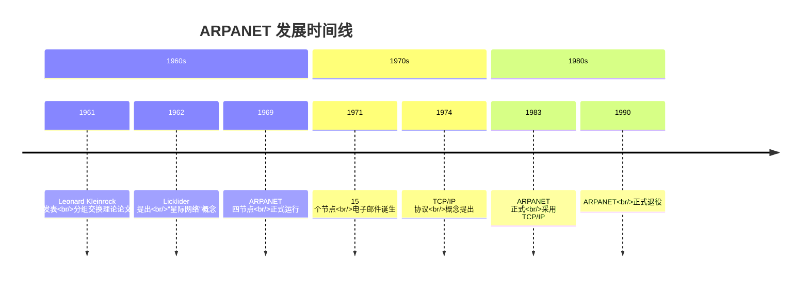

**1969 年 10 月 29 日**，ARPANET 首次成功发送消息。当天晚上 10:30，加州大学洛杉矶分校（UCLA）的 Charlie Kline 试图向斯坦福研究院（SRI）发送"LOGIN"，但在传送完"LO"后系统崩溃，人类历史上第一次网络通信以"LO"开始。

### 1.2.2 技术演进三阶段

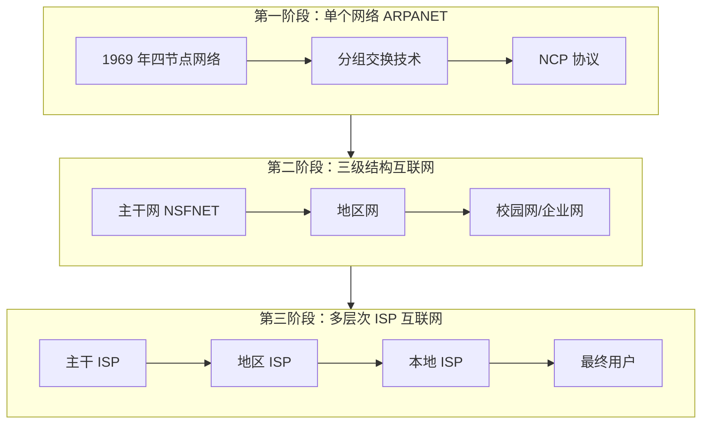

**关键转折点**：

| 时间 | 事件 | 意义 |
|------|------|------|
| 1983.01 | ARPANET 全面切换 TCP/IP | 异构网络互联成为可能 |
| 1986 | NSFNET 建立 | 替代 ARPANET 成为主干网 |
| 1989 | Tim Berners-Lee 提出 WWW | 互联网从学术工具转为大众平台 |
| 1995 | NSFNET 退役，商业化 ISP 接管 | 互联网进入商业化时代 |

### 1.2.3 中国互联网发展历程

- **1986 年**：中国学术网（CANET）启动
- **1987 年 9 月 20 日**：钱天白发送中国首封电子邮件"Across the Great Wall we can reach every corner in the world"
- **1990 年**：完成 CN 域名注册
- **1994 年 4 月**：实现与 Internet 的 TCP/IP 全功能连接

---

## 1.3 网络功能与分类

### 1.3.1 按覆盖范围分类

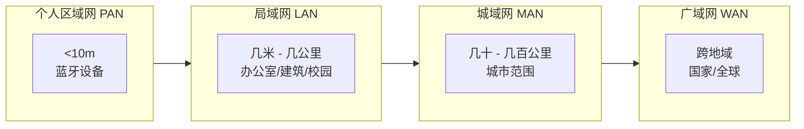

**详细对比**：

| 类型 | 覆盖范围 | 典型应用 | 传输介质 | 速率 |
|------|----------|----------|----------|------|
| **PAN** | <10m | 蓝牙耳机、智能手表 | 无线电波 | 1-100 Mbps |
| **LAN** | 几米-几公里 | 办公室、校园、家庭 | 双绞线/光纤/WiFi | 100 Mbps-10 Gbps |
| **MAN** | 几十-几百公里 | 城市宽带骨干网、政务网 | 光纤、微波 | 100 Mbps-10 Gbps |
| **WAN** | 跨地域/全球 | Internet、企业专网 | 光纤、卫星 | 10 Mbps-100 Gbps |

### 1.3.2 按传输技术分类

**广播式网络（Broadcast Network）**：
- 所有节点共享单一通信信道
- 一个节点发送的数据，其他所有节点都能接收
- 典型：传统以太网、WiFi

**点对点网络（Point-to-Point Network）**：
- 数据在发送方和接收方之间直接传输
- 支持并发通信
- 典型：现代交换式以太网、PPP 协议

### 1.3.3 按所有权分类

| 类型 | 特点 | 示例 |
|------|------|------|
| **公用网** | 向公众开放，由电信运营商建设 | Internet、电信网 |
| **专用网** | 特定组织内部使用，安全性高 | 军队网络、银行专网 |

---

## 1.4 网络拓扑结构

### 1.4.1 拓扑结构定义

**网络拓扑**（Network Topology）是指网络中节点（计算机、网络设备等）与链路（传输介质）的几何排列形式，反映网络中各实体间的**物理连接关系**。

### 1.4.2 常见拓扑结构对比

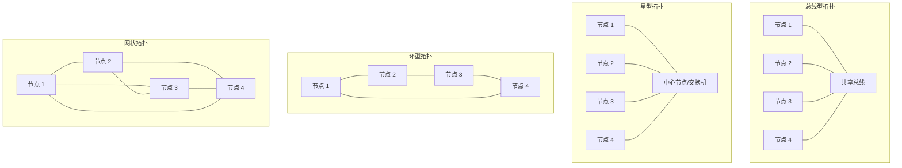

### 1.4.3 各拓扑结构特性分析

| 拓扑类型 | 优点 | 缺点 | 典型应用 |
|----------|------|------|----------|
| **总线型** | 结构简单、成本低、易于安装 | 单点故障影响全网、冲突检测复杂、故障诊断困难 | 早期以太网（10BASE-2/5） |
| **星型** | 集中控制、易于管理、单节点故障不影响其他 | 中心节点故障导致全网瘫痪、布线成本高 | 现代以太网、电话网络 |
| **环型** | 延迟固定、无需冲突检测 | 单点故障全网瘫痪、扩展性差 | 令牌环网、FDDI |
| **树型** | 易于扩展、分层管理 | 根节点故障影响整枝、复杂度随层级增加 | 企业网络、ISP 网络 |
| **网状型** | 高可靠性、多路径冗余 | 成本极高、布线复杂 | 广域网骨干、军事网络 |

### 1.4.4 冲突域与广播域

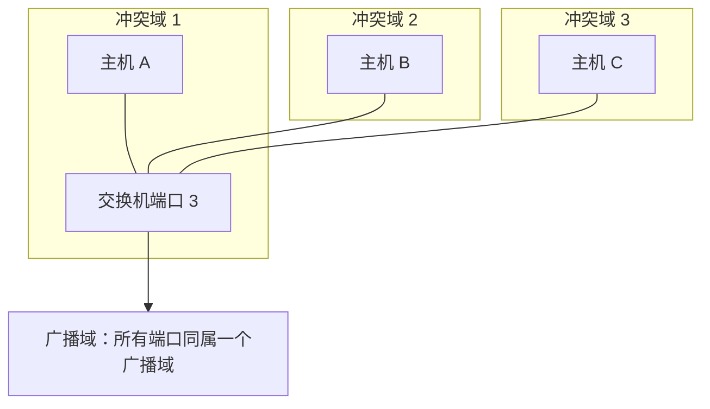

- **冲突域（Collision Domain）**：连接在同一共享介质上的所有节点构成的区域，同一时刻只能有一个节点发送数据
- **广播域（Broadcast Domain）**：能接收到同一广播帧的所有节点构成的区域

**关键结论**：
- 集线器（Hub）：所有端口在同一冲突域和广播域
- 交换机（Switch）：每个端口是独立冲突域，所有端口在同一广播域
- 路由器（Router）：每个端口是独立冲突域和广播域

---

## 1.5 网络性能指标详解

### 1.5.1 速率（Rate）

**定义**：连接在计算机网络上的主机在数字信道上传送数据位数的速率，也称为**数据率**（Data Rate）或**比特率**（Bit Rate）。

**单位换算**：
```
1 b/s = 1 bit/s（比特每秒）
1 kb/s = 10³ b/s = 1,000 b/s
1 Mb/s = 10⁶ b/s = 1,000,000 b/s
1 Gb/s = 10⁹ b/s
1 Tb/s = 10¹² b/s

注意：存储容量使用 2 的幂次
1 Byte = 8 bits
1 KB = 2¹⁰ B = 1,024 B
1 MB = 2²⁰ B = 1,048,576 B
```

**示例计算**：
> 一个数据块大小为 100 MB，网卡发送速率为 100 Mbps，发送完该数据块需要多少时间？
> 
> 解：100 MB = 100 × 2²⁰ × 8 bits ≈ 838,860,800 bits
> 时间 = 数据量 / 速率 = 838,860,800 / (100 × 10⁶) ≈ 8.39 秒

### 1.5.2 带宽（Bandwidth）

**两种含义**：

1. **模拟信号系统**：信号所包含的各种不同频率成分所占据的频率范围
   - 单位：赫兹（Hz）、kHz、MHz、GHz
   - 例如：电话信道带宽约 3.1 kHz（300 Hz - 3.4 kHz）

2. **计算机网络**：网络信道所能传送的**最高数据率**
   - 单位：b/s、kb/s、Mb/s、Gb/s
   - 表示网络的"通信线路所能传送数据的能力"

**带宽与速率的关系**：
- 带宽是**理论上限**，速率是**实际值**
- 实际速率 ≤ 带宽

### 1.5.3 吞吐量（Throughput）

**定义**：单位时间内通过某个网络（或信道、接口）的**实际数据量**，也称为"实际带宽"。

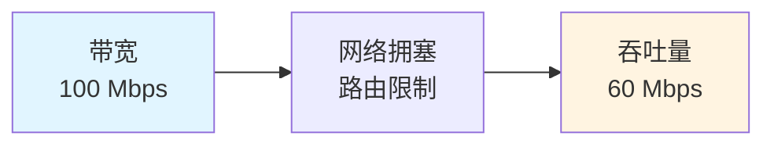

**关键理解**：
- 吞吐量 ≤ 带宽
- 受网络拥塞、路由器性能、链路质量等因素影响
- 类比：带宽是车道宽度，吞吐量是单位时间实际通过的车流量

**示例场景**：
> 1000 Mbps 宽带的路由器连接三部手机，每部手机以 10 MB/s 速度下载：
> - 路由器带宽：1000 Mbps ≈ 125 MB/s
> - 实际吞吐量：3 × 10 MB/s = 30 MB/s

### 1.5.4 时延（Delay / Latency）

**定义**：数据（报文或分组）从网络一端传送到另一端所需的时间。

**时延的四个组成部分**：

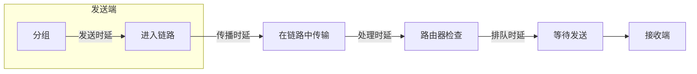

| 时延类型 | 定义 | 计算公式 | 影响因素 |
|----------|------|----------|----------|
| **发送时延** | 将分组从主机发送到传输介质所需时间 | 分组长度 (bit) / 发送速率 (bit/s) | 分组大小、链路带宽 |
| **传播时延** | 电磁波在信道中传播所需时间 | 信道长度 (m) / 电磁波传播速率 (m/s) | 物理距离、介质类型 |
| **处理时延** | 路由器检查分组、决定转发路径的时间 | - | 路由器性能、处理复杂度 |
| **排队时延** | 分组在路由器队列中等待的时间 | - | 网络拥塞程度 |

**总时延公式**：
```
总时延 = 发送时延 + 传播时延 + 处理时延 + 排队时延
```

**典型值参考**：
- 光纤中电磁波传播速率：约 2 × 10⁸ m/s（光速的 2/3）
- 铜线中电磁波传播速率：约 2.3 × 10⁸ m/s
- 路由器处理时延：微秒级（μs）
- 排队时延：变化最大，拥塞时可达毫秒级（ms）

### 1.5.5 时延带宽积（Delay-Bandwidth Product）

**定义**：传播时延与带宽的乘积，表示链路中"在途"的最大比特数。

```
时延带宽积 = 传播时延 × 带宽
单位：bit（比特）
```

**物理意义**：
- 将链路想象为管道，时延带宽积就是管道能容纳的最大水量
- 发送端连续发送数据，当第一个比特到达接收端时，链路上存在的比特总数

**示例计算**：
> 链路长度 1000 km，带宽 1 Gbps，电磁波传播速率 2×10⁸ m/s
> 
> 传播时延 = 1000×10³ m / (2×10⁸ m/s) = 5 ms
> 
> 时延带宽积 = 5×10⁻³ s × 10⁹ bit/s = 5×10⁶ bit = 5 Mbit

**应用**：
- 用于设计最短帧长（如以太网最小帧长 64 字节）
- 影响 TCP 窗口大小设计

### 1.5.6 往返时间（RTT, Round-Trip Time）

**定义**：从发送方发送数据开始，到接收方收到并发送确认，发送方收到确认为止的总时间。

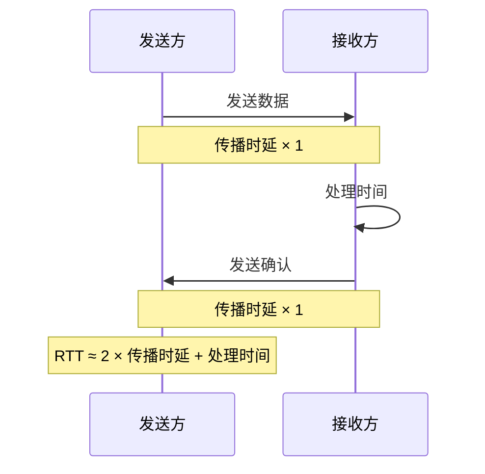

**近似计算**：
```
RTT ≈ 2 × 传播时延（忽略处理时间时）
```

**重要应用**：
- TCP 连接建立（三次握手）至少需要 1 个 RTT
- TCP 拥塞控制基于 RTT 计算超时重传时间

**典型 RTT 值**：
| 场景 | RTT 典型值 |
|------|-----------|
| 同一局域网 | <1 ms |
| 同城 | 5-20 ms |
| 国内跨省 | 30-60 ms |
| 跨洲（中美） | 150-250 ms |
| 卫星链路 | 250-270 ms |

### 1.5.7 利用率（Utilization）

**信道利用率**：
```
信道利用率 = 有数据通过的时间 / (有数据 + 无数据) 的总时间
```

**网络利用率**：所有信道利用率的加权平均值

**利用率与时延的关系**：
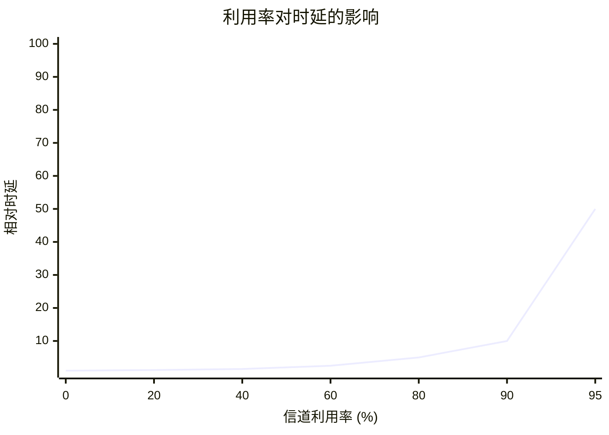

根据排队论理论，当信道利用率接近 100% 时，时延会急剧增加：
```
当前时延 ≈ 空闲时延 / (1 - 利用率)
```

**最佳实践**：网络利用率通常应控制在 50% 以下，预留缓冲空间应对流量突发。

### 1.5.8 性能指标综合对比

| 指标 | 定义 | 单位 | 关注点 |
|------|------|------|--------|
| **速率** | 数据传输速率 | b/s | 发送能力 |
| **带宽** | 理论最高速率 | b/s | 链路容量上限 |
| **吞吐量** | 实际通过的数据量 | b/s | 网络实际表现 |
| **时延** | 数据传输所需时间 | ms/μs | 响应速度 |
| **时延带宽积** | 链路容纳的最大比特数 | bit | 链路"容积" |
| **RTT** | 往返一次的时间 | ms | 交互延迟 |
| **利用率** | 信道使用比例 | % | 网络负载程度 |

---

# 第 2 章：网络体系结构

## 2.1 分层设计思想

### 2.1.1 为什么需要分层？

计算机网络是极其复杂的系统，包含硬件、软件、协议等多个层面。分层设计的核心价值在于：

1. **复杂问题分解**：将庞大系统分解为相对独立的子系统
2. **模块化设计**：各层独立实现，便于开发和维护
3. **技术隔离**：某层技术变化不影响其他层
4. **标准化促进**：每层可独立制定标准

### 2.1.2 分层基本原则

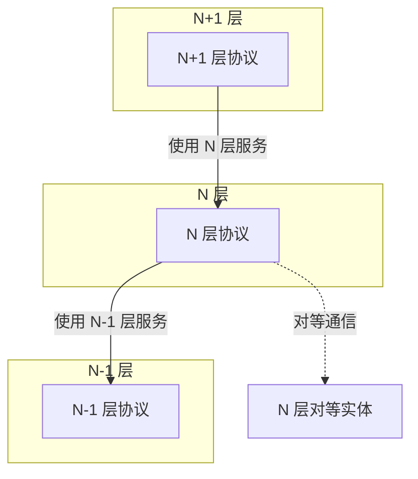

- **每层向上层提供服务**，同时使用下层提供的服务
- **对等实体通信**：N 层与 N 层之间通过 N-1 层提供的服务进行逻辑通信
- **服务访问点（SAP）**：相邻层之间的接口

### 2.1.3 关键术语

| 术语 | 定义 |
|------|------|
| **协议（Protocol）** | 控制两个对等实体进行通信的规则的集合 |
| **服务（Service）** | 下层为上层提供的功能，通过 SAP 访问 |
| **接口（Interface）** | 相邻层之间交换信息的连接点 |
| **服务数据单元（SDU）** | 需要传输的有效数据 |
| **协议数据单元（PDU）** | 对等实体间传输的数据单位 |
| **协议控制信息（PCI）** | 协议头部和尾部，用于控制通信 |

---

## 2.2 OSI 七层参考模型

### 2.2.1 模型概述

**OSI（Open Systems Interconnection）参考模型**由国际标准化组织（ISO）于 1984 年发布，旨在解决早期网络标准不统一的问题。

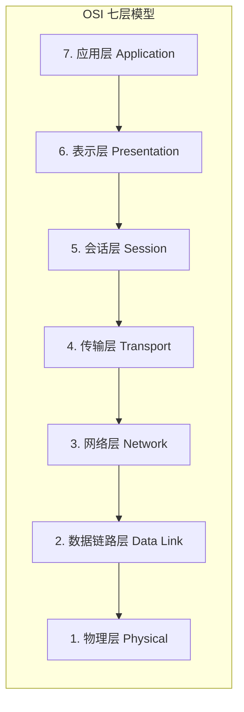

### 2.2.2 各层功能详解

#### 第 1 层：物理层（Physical Layer）

**功能定义**：定义物理设备和传输介质的机械、电气、功能和规程特性。

**核心任务**：
- 定义接口形状、引脚数量和功能
- 定义电压范围、信号类型（电信号/光信号）
- 定义比特流的编码方式（曼彻斯特编码等）
- 定义传输速率和传输模式（单工/半双工/全双工）

**协议/设备示例**：
- 协议：RS-232、V.35、IEEE 802.3 物理层
- 设备：中继器（Repeater）、集线器（Hub）
- PDU：**比特（bit）**

#### 第 2 层：数据链路层（Data Link Layer）

**功能定义**：在相邻节点之间建立可靠的数据链路，实现帧的可靠传输。

**核心任务**：
- **成帧**：将网络层数据包封装成帧（Frame）
- **物理寻址**：使用 MAC 地址标识设备
- **差错控制**：通过 CRC 校验检测传输错误
- **流量控制**：协调发送方和接收方的速率
- **介质访问控制**：解决共享介质的争用问题（CSMA/CD）

**协议/设备示例**：
- 协议：以太网（IEEE 802.3）、PPP、HDLC
- 设备：交换机（Switch）、网桥（Bridge）
- PDU：**帧（Frame）**

#### 第 3 层：网络层（Network Layer）

**功能定义**：负责为分组在不同网络之间选择路由和转发。

**核心任务**：
- **逻辑寻址**：使用 IP 地址标识网络位置
- **路由选择**：根据路由表选择最佳路径
- **分组转发**：将数据包从源网络转发到目的网络
- **拥塞控制**：避免网络过载
- **异构网络互联**：实现不同网络之间的互通

**协议/设备示例**：
- 协议：IP、ICMP、ARP、RIP、OSPF
- 设备：路由器（Router）
- PDU：**分组/数据包（Packet）**

#### 第 4 层：传输层（Transport Layer）

**功能定义**：提供端到端（进程到进程）的通信服务。

**核心任务**：
- **端口寻址**：使用端口号标识应用进程
- **分段与重组**：将大数据分割成适合网络传输的段
- **连接管理**：建立、维护和释放连接
- **可靠传输**：通过确认和重传保证数据完整性（TCP）
- **流量控制**：滑动窗口机制
- **复用与分用**：多应用共享网络资源

**协议/设备示例**：
- 协议：TCP（面向连接、可靠）、UDP（无连接、尽力而为）
- 设备：防火墙（部分工作在此层）
- PDU：**段（Segment，TCP）/数据报（Datagram，UDP）**

#### 第 5 层：会话层（Session Layer）

**功能定义**：管理应用程序之间的会话（对话）控制。

**核心任务**：
- **会话建立**：协商通信参数
- **会话维护**：保持通信状态
- **会话终止**：优雅地结束通信
- **同步点管理**：在长传输中设置检查点，便于恢复

**协议示例**：
- NetBIOS、RPC（远程过程调用）
- 实际应用中，会话控制多由应用层协议实现（如 HTTP Cookie）

#### 第 6 层：表示层（Presentation Layer）

**功能定义**：处理两个系统之间交换信息的表示方式。

**核心任务**：
- **数据格式转换**：不同系统的数据格式兼容（如 ASCII/EBCDIC）
- **数据加密/解密**：保障通信安全
- **数据压缩/解压缩**：提高传输效率

**协议示例**：
- SSL/TLS（加密）
- JPEG、MPEG（压缩编码）
- 实际应用中多由应用层处理

#### 第 7 层：应用层（Application Layer）

**功能定义**：直接为用户的应用程序提供网络服务。

**核心任务**：
- 定义应用程序之间的通信规则
- 提供用户与网络的接口

**协议示例**：
- HTTP（万维网）
- FTP（文件传输）
- SMTP/POP3（电子邮件）
- DNS（域名解析）
- PDU：**报文（Message）**

### 2.2.3 各层数据单元总结

| 层级 | 名称 | PDU | 典型协议 | 寻址方式 |
|------|------|-----|----------|----------|
| 应用层 | Application | 报文 | HTTP, FTP, SMTP | 域名/URL |
| 表示层 | Presentation | - | SSL, JPEG | - |
| 会话层 | Session | - | NetBIOS, RPC | 会话 ID |
| 传输层 | Transport | 段/数据报 | TCP, UDP | 端口号 |
| 网络层 | Network | 数据包 | IP, ICMP | IP 地址 |
| 数据链路层 | Data Link | 帧 | Ethernet, PPP | MAC 地址 |
| 物理层 | Physical | 比特 | RS-232 | - |

---

## 2.3 TCP/IP 四层模型

### 2.3.1 模型概述

**TCP/IP 模型**源于 ARPANET 和 Internet 的实践，是支撑现代互联网的**事实标准**。

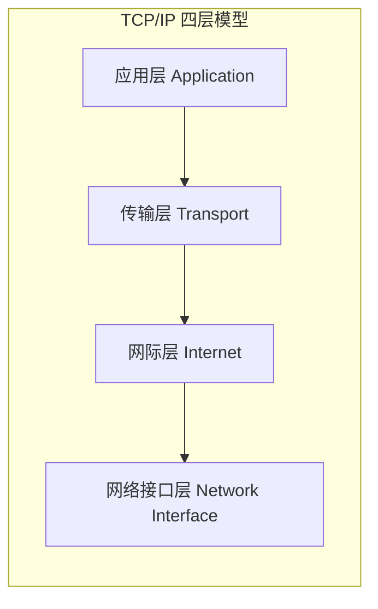

### 2.3.2 各层功能

| 层级 | 功能 | 典型协议 | 对应 OSI 层 |
|------|------|----------|-------------|
| **应用层** | 处理特定应用程序细节 | HTTP, FTP, SMTP, DNS, SSH | 应用层 + 表示层 + 会话层 |
| **传输层** | 提供端到端通信 | TCP, UDP | 传输层 |
| **网际层** | 处理分组在网络中的活动 | IP, ICMP, ARP | 网络层 |
| **网络接口层** | 处理硬件细节 | Ethernet, WiFi, PPP | 数据链路层 + 物理层 |

### 2.3.3 OSI 与 TCP/IP 模型对比

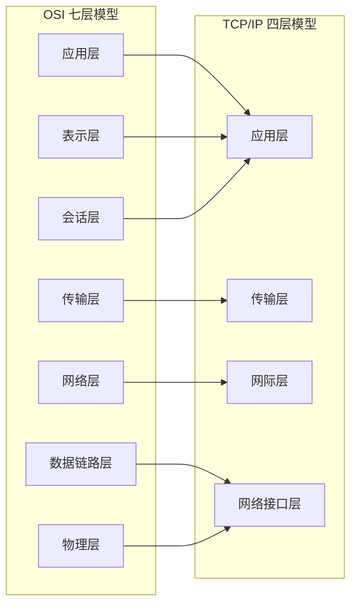

| 对比维度 | OSI 模型 | TCP/IP 模型 |
|----------|----------|-------------|
| **制定者** | ISO（国际标准化组织） | IETF（互联网工程任务组） |
| **发布年份** | 1984 | 1974（TCP/IP），1980 年代定型 |
| **层次数量** | 7 层 | 4 层 |
| **设计理念** | 先有模型，后有协议（理论驱动） | 先有协议，后有模型（实践驱动） |
| **实用性** | 理论完整但复杂，未广泛实现 | 简洁实用，支撑全球互联网 |
| **主要价值** | 教学参考、概念框架 | 实际部署、工业标准 |

---

## 2.4 五层混合模型（教学用）

### 2.4.1 模型设计

为兼顾教学清晰性和实用性，通常采用**五层混合模型**：

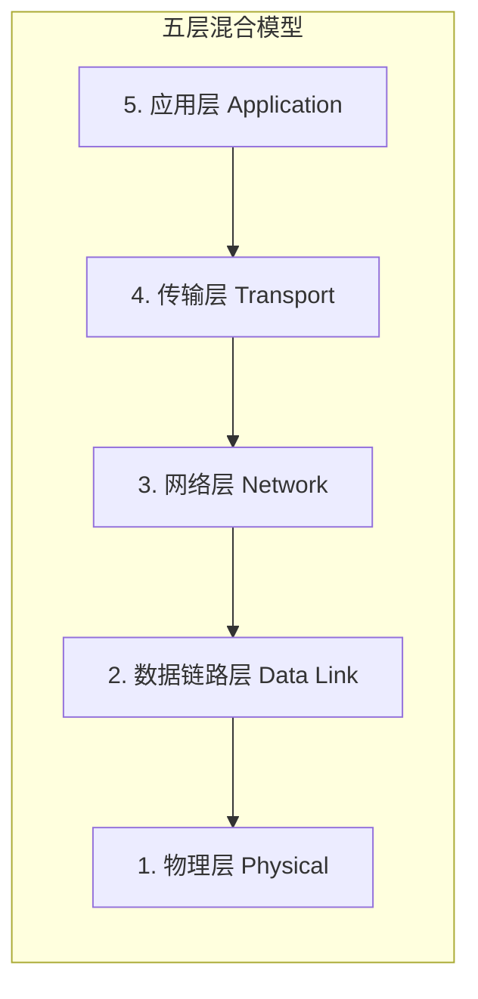

### 2.4.2 与 OSI、TCP/IP 的对应关系

| 五层模型 | OSI 七层 | TCP/IP 四层 | PDU |
|----------|----------|-------------|-----|
| 应用层 | 应用层、表示层、会话层 | 应用层 | 报文 |
| 传输层 | 传输层 | 传输层 | 段/数据报 |
| 网络层 | 网络层 | 网际层 | 数据包 |
| 数据链路层 | 数据链路层 | 网络接口层 | 帧 |
| 物理层 | 物理层 | 网络接口层 | 比特 |

---

## 2.5 数据封装与解封装过程

### 2.5.1 封装过程（发送端）

**定义**：数据从应用层向下传递，每层添加本层的协议控制信息（头部/尾部）。

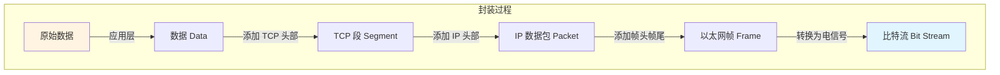

**详细步骤**：

1. **应用层**：生成原始数据（如 HTTP 请求）
2. **传输层**：添加 TCP 头部（包含源/目的端口号），形成**段（Segment）**
3. **网络层**：添加 IP 头部（包含源/目的 IP 地址），形成**数据包（Packet）**
4. **数据链路层**：添加帧头（源/目的 MAC 地址）和帧尾（FCS 校验），形成**帧（Frame）**
5. **物理层**：转换为电信号/光信号，在介质上传输

### 2.5.2 解封装过程（接收端）

**定义**：数据从物理层向上传递，每层剥离本层的协议控制信息。


### 2.5.3 完整通信流程

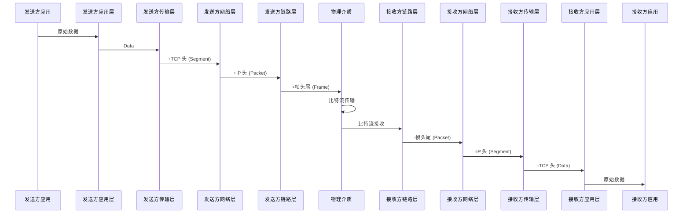

### 2.5.4 网络设备与层级对应

| 设备 | 工作层级 | 处理内容 |
|------|----------|----------|
| **集线器（Hub）** | 物理层 | 信号放大和转发 |
| **交换机（Switch）** | 数据链路层 | 基于 MAC 地址转发帧 |
| **路由器（Router）** | 网络层 | 基于 IP 地址转发数据包 |
| **防火墙（Firewall）** | 传输层/应用层 | 基于端口/协议过滤 |

---

# 第 3 章：物理层与数据链路层

## 3.1 传输介质详解

### 3.1.1 传输介质分类

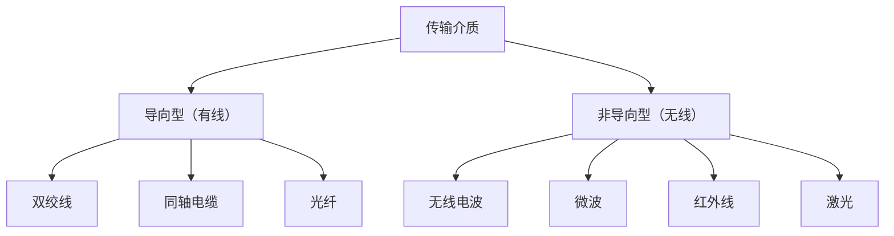

### 3.1.2 双绞线（Twisted Pair）

**结构特点**：
- 两根绝缘铜导线相互绞合，减少电磁干扰（EMI）
- 绞合节距越小，抗干扰能力越强

**分类**：

| 类型 | 英文 | 特点 | 典型应用 |
|------|------|------|----------|
| **非屏蔽双绞线** | UTP | 无金属屏蔽层，成本低，易于安装 | 大多数局域网 |
| **屏蔽双绞线** | STP | 有金属屏蔽层，抗干扰能力强 | 工业环境、高干扰区域 |

**UTP 类别与性能**：

| 类别 | 频率带宽 | 最高速率 | 最大距离 | 应用 |
|------|----------|----------|----------|------|
| CAT3 | 16 MHz | 10 Mbps | 100m | 10BASE-T（已淘汰） |
| CAT5 | 100 MHz | 100 Mbps | 100m | 100BASE-TX |
| CAT5e | 100 MHz | 1 Gbps | 100m | 1000BASE-T |
| CAT6 | 250 MHz | 10 Gbps | 55m | 10GBASE-T |
| CAT6A | 500 MHz | 10 Gbps | 100m | 10GBASE-T |
| CAT7 | 600 MHz | 10 Gbps+ | 100m | 高端应用 |

**连接器**：RJ-45（8 针模块化插头）

**线序标准**：
- T568A：白绿、绿、白橙、蓝、白蓝、橙、白棕、棕
- T568B：白橙、橙、白绿、蓝、白蓝、绿、白棕、棕

### 3.1.3 同轴电缆（Coaxial Cable）

**结构**：
```
┌─────────────────────────────────────┐
│ 外护套（PVC）                        │
│  ┌───────────────────────────────┐  │
│  │ 编织屏蔽层                     │  │
│  │  ┌─────────────────────────┐  │  │
│  │  │ 绝缘层                   │  │  │
│  │  │  ┌───────────────────┐  │  │  │
│  │  │  │ 铜导体（芯线）     │  │  │  │
│  │  │  └───────────────────┘  │  │  │
│  │  └─────────────────────────┘  │  │
│  └───────────────────────────────┘  │
└─────────────────────────────────────┘
```

**分类**：

| 类型 | 阻抗 | 用途 | 最大距离 | 现状 |
|------|------|------|----------|------|
| **基带同轴电缆** | 50Ω | 以太网（10BASE-2/5） | 185m/500m | 已淘汰 |
| **宽带同轴电缆** | 75Ω | 有线电视（CATV） | 数公里 | 仍在用 |

**历史意义**：早期以太网的主要传输介质，现已被双绞线和光纤取代。

### 3.1.4 光纤（Optical Fiber）

**工作原理**：利用光的**全反射**原理传输光信号。

**结构**：
```
┌─────────────────────────────────────┐
│ 护套（Jacket）                       │
│  ┌───────────────────────────────┐  │
│  │ 加强层（芳纶纤维）             │  │
│  │  ┌─────────────────────────┐  │  │
│  │  │ 包层（Cladding）         │  │  │
│  │  │  ┌───────────────────┐  │  │  │
│  │  │  │ 纤芯（Core）       │  │  │  │
│  │  │  └───────────────────┘  │  │  │
│  │  └─────────────────────────┘  │  │
│  └───────────────────────────────┘  │
└─────────────────────────────────────┘
```

**分类对比**：

| 特性 | 单模光纤（SMF） | 多模光纤（MMF） |
|------|-----------------|-----------------|
| **纤芯直径** | 8-10 μm | 50-62.5 μm |
| **光源** | 激光二极管（LD） | 发光二极管（LED） |
| **传输模式** | 单一模式 | 多种模式 |
| **传输距离** | 数十 - 数百公里 | 2km 以内 |
| **带宽** | 极高（100 Gbps+） | 较高（10-40 Gbps） |
| **成本** | 较高 | 较低 |
| **典型应用** | 长距离骨干网 | 数据中心、园区网 |

**光纤优势**：
- 带宽极高，传输速率可达 100 Gbps 以上
- 损耗极低，中继距离长
- 不受电磁干扰（EMI）
- 安全性高，难以窃听
- 重量轻，体积小

**光纤连接器**：
- SC：方形插拔式
- LC：小型方形（常用于 SFP 模块）
- ST：卡口式
- FC：螺纹式

### 3.1.5 无线传输介质

**电磁波谱与通信应用**：

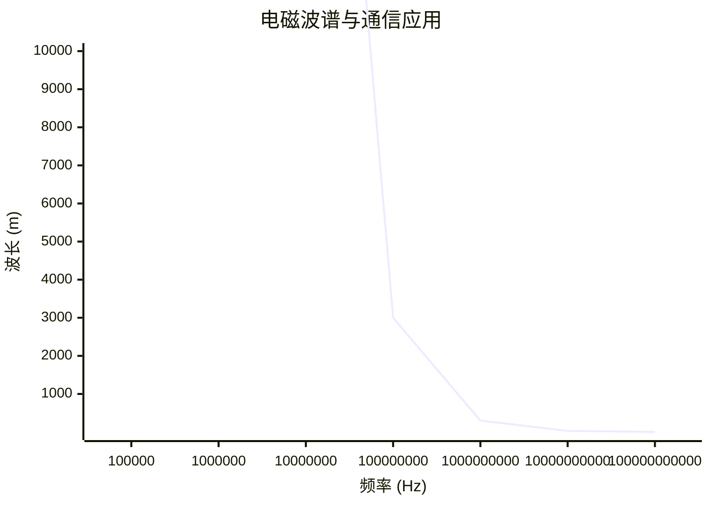

| 类型 | 频率范围 | 特点 | 典型应用 |
|------|----------|------|----------|
| **无线电波** | 10⁴-10⁸ Hz | 绕射能力强，穿透性好 | AM/FM 广播、短波通信 |
| **微波** | 10⁸-10¹¹ Hz | 直线传播，需视距传输 | 卫星通信、地面微波接力 |
| **红外线** | 3×10¹¹-4×10¹⁴ Hz | 短距离，不可穿透障碍 | 遥控器、IrDA |
| **可见光** | 4×10¹⁴-8×10¹⁴ Hz | 新兴技术 | Li-Fi、 VLC |

**无线通信特点**：
- 移动性强，无需物理连接
- 易受环境干扰（天气、障碍物）
- 安全性较弱，信号易被截获
- 频谱资源有限，需合理分配

### 3.1.6 传输介质综合对比

| 介质 | 速率 | 距离 | 抗干扰性 | 成本 | 典型应用 |
|------|------|------|----------|------|----------|
| UTP | 10M-10Gbps | ≤100m | 中等 | 低 | 局域网 |
| STP | 10M-10Gbps | ≤100m | 高 | 中 | 工业环境 |
| 同轴电缆 | 10-100Mbps | ≤500m | 高 | 中 | 有线电视 |
| 多模光纤 | 100M-100Gbps | ≤2km | 极高 | 中高 | 数据中心 |
| 单模光纤 | 1Gbps-10Tbps | ≤100km+ | 极高 | 高 | 骨干网 |
| 无线电波 | 10M-1Gbps | 视环境 | 低 | 低 | WiFi、蓝牙 |
| 微波 | 10M-10Gbps | 视距 | 中 | 中 | 卫星、基站 |

---

## 3.2 以太网技术

### 3.2.1 以太网概述

**定义**：以太网（Ethernet）是一种**局域网（LAN）技术标准**，规定了网络拓扑结构、介质访问控制方式、帧格式、传输速率等。

**核心特征**：
- 采用**CSMA/CD**（载波侦听多路访问/冲突检测）介质访问控制
- 支持多种传输介质（双绞线、光纤）
- 速率从 10 Mbps 发展到 400 Gbps

### 3.2.2 以太网发展历程

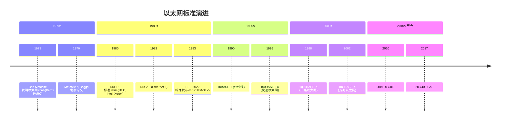

### 3.2.3 以太网标准命名规则

**格式**：`<速率>BASE<介质/距离>`

| 标准 | 速率 | 介质 | 最大距离 |
|------|------|------|----------|
| 10BASE-5 | 10 Mbps | 粗同轴电缆 | 500m |
| 10BASE-2 | 10 Mbps | 细同轴电缆 | 185m |
| 10BASE-T | 10 Mbps | 双绞线（CAT3+） | 100m |
| 100BASE-TX | 100 Mbps | 双绞线（CAT5+） | 100m |
| 1000BASE-T | 1 Gbps | 双绞线（CAT5e+） | 100m |
| 1000BASE-SX | 1 Gbps | 多模光纤 | 550m |
| 1000BASE-LX | 1 Gbps | 单模光纤 | 5km |
| 10GBASE-SR | 10 Gbps | 多模光纤 | 400m |
| 10GBASE-LR | 10 Gbps | 单模光纤 | 10km |

### 3.2.4 以太网帧结构（Ethernet II）

**帧格式详解**：

```
┌────────────┬────────────┬────────────┬────────────┬────────────┬────────────┬────────────┬────────────┐
│   前导码    │  帧起始符   │  目的 MAC   │   源 MAC    │    类型     │    数据     │    FCS      │  帧间隙    │
│ Preamble   │    SFD     │ Destination│   Source   │   Type    │   Data     │  校验序列   │    IFG     │
│  7 字节     │   1 字节    │   6 字节    │   6 字节    │  2 字节     │ 46-1500 字节 │  4 字节     │  12 字节    │
│ 10101010... │  10101011  │   MAC 地址   │   MAC 地址   │ 0800=IP   │  有效载荷    │   CRC32     │  (非帧部分) │
│            │            │            │            │ 0806=ARP  │            │            │            │
└────────────┴────────────┴────────────┴────────────┴────────────┴────────────┴────────────┴────────────┘
                                        以太网帧头（14 字节）            有效载荷                  帧尾
```

**各字段详解**：

| 字段 | 长度 | 功能说明 |
|------|------|----------|
| **前导码（Preamble）** | 7 字节 | 同步时钟，比特模式 10101010 重复，使接收方锁定信号频率 |
| **帧起始定界符（SFD）** | 1 字节 | 标志帧开始，固定值 10101011（0xAB） |
| **目的 MAC 地址** | 6 字节 | 接收方的物理地址，可为单播/组播/广播 |
| **源 MAC 地址** | 6 字节 | 发送方的物理地址，必须是单播地址 |
| **类型字段** | 2 字节 | 标识上层协议：0x0800=IPv4，0x0806=ARP，0x86DD=IPv6 |
| **数据（有效载荷）** | 46-1500 字节 | 上层协议数据，不足 46 字节需填充（Padding） |
| **帧校验序列（FCS）** | 4 字节 | 32 位 CRC 校验，检测传输错误 |
| **帧间隙（IFG）** | 12 字节 | 帧之间的最小间隔，用于设备恢复 |

**最小帧长与最大帧长**：

- **最小帧长**：64 字节（14 字节头 + 46 字节数据 + 4 字节 FCS）
  - 原因：确保 CSMA/CD 能检测到冲突
  - 计算：2 × 传播时延 × 带宽 = 2 × 25.6μs × 10Mbps ≈ 512 bit = 64 字节

- **最大帧长**：1518 字节（14 字节头 + 1500 字节数据 + 4 字节 FCS）
  - 限制原因：避免单帧占用信道过久，影响其他节点

- **巨型帧（Jumbo Frame）**：某些设备支持 9000 字节，需硬件支持

### 3.2.5 常见误区与最佳实践

**常见误区**：

1. **误区**：以太网就是网线
   - **正解**：以太网是技术标准，网线只是传输介质之一

2. **误区**：MAC 地址全球唯一，永远不变
   - **正解**：MAC 地址可软件修改（MAC 地址欺骗），虚拟机 MAC 由软件分配

3. **误区**：数据字段可以任意小
   - **正解**：最小 46 字节，不足需填充，否则冲突检测失效

**最佳实践**：

1. 使用 CAT5e 或以上双绞线支持千兆以太网
2. 确保双绞线长度不超过 100m 限制
3. 数据中心推荐使用光纤（多模短距，单模长距）
4. 避免双绞线与强电线缆平行走线，减少干扰

---

## 3.3 MAC 地址与 ARP 协议

### 3.3.1 MAC 地址详解

**定义**：MAC 地址（Media Access Control Address）是网络设备的**物理地址**，用于在数据链路层唯一标识网络接口。

**地址结构**：
```
┌────────────┬────────────┐
│  OUI 前 24 位  │  扩展标识 24 位  │
│ (厂商编码)    │ (设备序列号)  │
└────────────┴────────────┘
      第 1 字节第 8 位：0=单播，1=组播
      第 1 字节第 7 位：0=全球唯一，1=本地管理
```

**地址格式**：
- 十六进制表示：`00-1A-2B-3C-4D-5E` 或 `00:1A:2B:3C:4D:5E` 或 `001A.2B3C.4D5E`
- 48 位二进制，共 2⁴⁸ ≈ 281 万亿个地址

**地址类型**：

| 类型 | 第 1 字节第 8 位 | 示例 | 说明 |
|------|-----------------|------|------|
| **单播（Unicast）** | 0 | 00-1A-2B-3C-4D-5E | 一对一通信 |
| **组播（Multicast）** | 1 | 01-00-5E-xx-xx-xx | 一对多（组） |
| **广播（Broadcast）** | 全 1 | FF-FF-FF-FF-FF-FF | 一对所有 |

**常见厂商 OUI 示例**：
| OUI（前 3 字节） | 厂商 |
|-----------------|------|
| 00-00-0C | Cisco |
| 00-1A-2B | 华为 |
| 00-1B-44 | Dell |
| 00-50-56 | VMware（虚拟网卡） |
| 08-00-27 | VirtualBox（虚拟网卡） |

### 3.3.2 ARP 协议（Address Resolution Protocol）

**问题引入**：

在局域网通信中，网络层知道目标 IP 地址，但数据链路层需要 MAC 地址才能封装帧。**ARP 协议就是解决 IP 地址到 MAC 地址映射的问题**。

```mermaid
flowchart TB
    A[网络层<br/>知道 IP 地址<br/>192.168.1.100] -->|需要 | B[数据链路层<br/>需要 MAC 地址<br/>??-??-??-??-??-??]
    B --> C[ARP 协议<br/>IP → MAC 映射]
```

### 3.3.3 ARP 工作原理

**工作流程**：

```mermaid
sequenceDiagram
    participant A as 主机 A<br/>192.168.1.10
    participant B as 主机 B<br/>192.168.1.20
    participant C as 主机 C<br/>192.168.1.30
    participant ARP_A as A 的 ARP 缓存
    participant ARP_B as B 的 ARP 缓存
    
    A->>ARP_A: 查询 192.168.1.20 的 MAC
    ARP_A-->>A: 未找到
    
    A->>A: 构造 ARP 请求
    Note over A: 发送方 IP: 192.168.1.10<br/>发送方 MAC: AA-AA-AA-AA-AA-AA<br/>目标 IP: 192.168.1.20<br/>目标 MAC: 00-00-00-00-00-00
    
    A->>B: ARP 请求 (广播)
    A->>C: ARP 请求 (广播)
    Note over A,C: 所有主机收到广播
    
    C->>C: IP 不匹配，丢弃
    B->>ARP_B: 记录 A 的映射
    B->>B: 构造 ARP 响应
    Note over B: 发送方 IP: 192.168.1.20<br/>发送方 MAC: BB-BB-BB-BB-BB-BB
    
    B->>A: ARP 响应 (单播)
    
    A->>ARP_A: 记录 B 的映射<br/>192.168.1.20 → BB-BB-BB-BB-BB-BB
    
    Note over A,B: 现在 A 可以向 B 发送数据帧
```

**详细步骤**：

1. **查询 ARP 缓存**：主机 A 先检查本地 ARP 缓存是否有目标 IP 的 MAC 映射
2. **发送 ARP 请求**：若缓存未命中，构造 ARP 请求并以**广播**方式发送
3. **接收并处理**：所有主机收到广播，只有目标 IP 匹配的主机 B 处理
4. **更新双方缓存**：
   - 主机 B 记录主机 A 的 IP-MAC 映射（从请求中获取）
   - 主机 B 发送 ARP 响应（**单播**）
5. **收到响应**：主机 A 记录主机 B 的 MAC 地址，开始通信

### 3.3.4 ARP 报文格式

```
┌────────────────────────────────────────────────────────────────┐
│                     以太网帧头 (14 字节)                        │
│  目的 MAC: FF-FF-FF-FF-FF-FF (广播) / 单播地址                   │
│  源 MAC: 发送方 MAC 地址                                          │
│  类型：0x0806 (ARP)                                             │
├────────────────────────────────────────────────────────────────┤
│                     ARP 报文 (28 字节)                          │
│  ┌─────────────────┬─────────────────┐                         │
│  │ 硬件类型 (2 字节)  │ 协议类型 (2 字节)  │                         │
│  │ 以太网=1        │ IPv4=0x0800     │                         │
│  ├─────────────────┼─────────────────┤                         │
│  │ 硬件长度 (1 字节)  │ 协议长度 (1 字节)  │                         │
│  │ MAC=6          │ IPv4=4         │                         │
│  ├─────────────────┴─────────────────┤                         │
│  │           操作码 (2 字节)            │                         │
│  │        1=请求，2=响应              │                         │
│  ├───────────────────────────────────┤                         │
│  │         发送方 MAC 地址 (6 字节)       │                         │
│  ├───────────────────────────────────┤                         │
│  │         发送方 IP 地址 (4 字节)        │                         │
│  ├───────────────────────────────────┤                         │
│  │         目标 MAC 地址 (6 字节)         │                         │
│  │        (请求中为全 0)                 │                         │
│  ├───────────────────────────────────┤                         │
│  │         目标 IP 地址 (4 字节)          │                         │
│  └───────────────────────────────────┘                         │
└────────────────────────────────────────────────────────────────┘
```

**字段详解**：

| 字段 | 长度 | ARP 请求 | ARP 响应 |
|------|------|----------|----------|
| 硬件类型 | 2 字节 | 1（以太网） | 1 |
| 协议类型 | 2 字节 | 0x0800（IPv4） | 0x0800 |
| 硬件长度 | 1 字节 | 6 | 6 |
| 协议长度 | 1 字节 | 4 | 4 |
| 操作码 | 2 字节 | 1（请求） | 2（响应） |
| 发送方 MAC | 6 字节 | 请求方 MAC | 响应方 MAC |
| 发送方 IP | 4 字节 | 请求方 IP | 响应方 IP |
| 目标 MAC | 6 字节 | 00-00-00-00-00-00 | 请求方 MAC |
| 目标 IP | 4 字节 | 目标 IP | 目标 IP |

### 3.3.5 ARP 缓存

**缓存机制**：

- **动态表项**：通过 ARP 协议自动学习，有老化时间（通常 2-20 分钟）
- **静态表项**：管理员手动配置，永久有效，不会被覆盖

**查看 ARP 缓存**：
```bash
# Windows
arp -a

# Linux / macOS
ip neigh show
# 或
arp -n
```

**示例输出**：
```
接口：192.168.1.10 --- 0xb
  Internet 地址         物理地址              类型
  192.168.1.1           00-1a-2b-3c-4d-5e   动态
  192.168.1.20          aa-bb-cc-dd-ee-ff   动态
  192.168.1.255         ff-ff-ff-ff-ff-ff   静态
```

### 3.3.6 跨网段通信与 ARP

**场景**：主机 A（192.168.1.10）要与主机 B（192.168.2.10）通信（不同网段）

```mermaid
flowchart TB
    subgraph 网络 1[192.168.1.0/24]
        A[主机 A<br/>192.168.1.10<br/>MAC: AA-AA-AA-AA-AA-AA]
        GW1[网关/路由器<br/>192.168.1.1<br/>MAC: GW1-MAC]
    end
    
    subgraph 网络 2[192.168.2.0/24]
        GW2[网关/路由器<br/>192.168.2.1<br/>MAC: GW2-MAC]
        B[主机 B<br/>192.168.2.10<br/>MAC: BB-BB-BB-BB-BB-BB]
    end
    
    A -->|1. ARP 请求网关 MAC| GW1
    GW1 -->|2. ARP 响应| A
    A -->|3. 发送数据帧给网关 | GW1
    GW1 -->|4. 路由查询 | GW2
    GW2 -->|5. ARP 请求主机 B MAC| B
    B -->|6. ARP 响应 | GW2
    GW2 -->|7. 转发数据帧 | B
```

**关键点**：
- 跨网段通信时，主机只需知道**网关的 MAC 地址**
- 路由器负责在不同网段间转发数据包
- 每一跳都需要 ARP 解析下一跳的 MAC 地址

### 3.3.7 ARP 安全问题

**ARP 欺骗（ARP Spoofing）**：

攻击者发送伪造的 ARP 响应，将攻击者的 MAC 地址与合法 IP 地址绑定，实现中间人攻击。

```mermaid
sequenceDiagram
    participant A as 主机 A
    participant G as 网关
    participant M as 攻击者
    
    M->>A: 伪造 ARP 响应<br/>网关 IP → 攻击者 MAC
    M->>G: 伪造 ARP 响应<br/>主机 A IP → 攻击者 MAC
    
    A->>M: 发送给网关的数据
    M->>G: 转发 (窃听后)
    G->>M: 发送给 A 的数据
    M->>A: 转发 (窃听后)
    
    Note over M: 中间人攻击成功
```

**防护措施**：
1. **静态 ARP 表项**：关键设备使用静态绑定
2. **ARP 监控工具**：检测 ARP 欺骗行为
3. **端口安全**：交换机限制端口 MAC 数量
4. **网络分段**：VLAN 隔离减小攻击面

---

## 3.4 交换机工作原理

### 3.4.1 交换机概述

**定义**：交换机（Switch）是工作在**数据链路层**的网络设备，用于连接多个网络节点，基于 MAC 地址进行数据帧转发。

**与集线器的区别**：

| 特性 | 集线器（Hub） | 交换机（Switch） |
|------|--------------|-----------------|
| 工作层级 | 物理层 | 数据链路层 |
| 转发方式 | 广播（所有端口） | 基于 MAC 地址单播 |
| 冲突域 | 所有端口同一冲突域 | 每端口独立冲突域 |
| 带宽利用 | 共享带宽 | 独享带宽 |
| 全双工支持 | 不支持 | 支持 |

### 3.4.2 交换机转发原理

```mermaid
flowchart TB
    A[收到数据帧] --> B{检查源 MAC}
    B -->|学习 | C[更新 MAC 地址表<br/>源 MAC → 入端口]
    C --> D{检查目的 MAC}
    
    D -->|已知单播 | E[从对应端口转发]
    D -->|未知单播 | F[泛洪广播<br/>除入端口外所有端口]
    D -->|广播 | F
    D -->|组播 | F
    
    E --> G[转发完成]
    F --> G
```

### 3.4.3 MAC 地址表（转发表）

**表项结构**：

| MAC 地址 | 端口 | VLAN | 类型 | 老化时间 |
|----------|------|------|------|----------|
| AA-AA-AA-AA-AA-AA | 1 | 1 | 动态 | 300s |
| BB-BB-BB-BB-BB-BB | 2 | 1 | 动态 | 250s |
| CC-CC-CC-CC-CC-CC | 3 | 1 | 静态 | 永久 |

**学习过程详解**：

```mermaid
sequenceDiagram
    participant PC1 as PC1<br/>MAC: AA
    participant PC2 as PC2<br/>MAC: BB
    participant PC3 as PC3<br/>MAC: CC
    participant SW as 交换机
    
    Note over SW: 初始 MAC 地址表为空
    
    PC1->>SW: 数据帧<br/>源：AA, 目的：BB
    SW->>SW: 学习：AA → 端口 1
    Note over SW: MAC 表：{AA: 端口 1}
    
    SW->>PC2: 泛洪 (目的未知)
    SW->>PC3: 泛洪
    
    PC2->>SW: 响应帧<br/>源：BB, 目的：AA
    SW->>SW: 学习：BB → 端口 2
    Note over SW: MAC 表：{AA: 端口 1, BB: 端口 2}
    
    SW->>PC1: 单播转发 (AA 已知)
    
    Note over SW,PC1: 后续 AA↔BB 通信直接单播转发
```

### 3.4.4 交换机工作模式

| 模式 | 说明 | 优点 | 缺点 |
|------|------|------|------|
| **存储转发（Store-and-Forward）** | 接收完整帧，校验 FCS 后转发 | 差错检测，隔离冲突 | 延迟较高 |
| **直通式（Cut-Through）** | 读取目的 MAC 后立即转发 | 延迟极低 | 可能转发错误帧 |
| **无碎片（Fragment-Free）** | 接收前 64 字节后转发 | 平衡延迟和错误检测 | 仍可能转发部分错误帧 |

### 3.4.5 冲突域与广播域

```mermaid
flowchart TB
    subgraph Hub[集线器]
        H1[端口 1] 
        H2[端口 2]
        H3[端口 3]
        H4[端口 4]
    end
    
    subgraph SW[交换机]
        S1[端口 1]
        S2[端口 2]
        S3[端口 3]
        S4[端口 4]
    end
    
    subgraph CD1[冲突域 1]
        H1 & H2 & H3 & H4
    end
    
    subgraph CD2[冲突域 2]
        S1
    end
    
    subgraph CD3[冲突域 3]
        S2
    end
    
    subgraph CD4[冲突域 4]
        S3
    end
    
    subgraph CD5[冲突域 5]
        S4
    end
    
    subgraph BD1[广播域]
        S1 & S2 & S3 & S4
    end
    
    style CD1 fill:#ffe0e0
    style BD1 fill:#e0e0ff
```

**关键结论**：
- **集线器**：所有端口在同一冲突域和广播域
- **交换机**：每端口是独立冲突域，所有端口在同一广播域
- **路由器**：每端口是独立冲突域和广播域

### 3.4.6 生成树协议（STP）

**问题**：网络中存在冗余链路时，可能形成环路，导致广播风暴。

**解决方案**：IEEE 802.1D 生成树协议（STP）通过阻塞部分端口，将网状拓扑转换为无环树形拓扑。

```mermaid
graph TD
    subgraph 物理拓扑
        SW1[交换机 1] --- SW2[交换机 2]
        SW2 --- SW3[交换机 3]
        SW3 --- SW1
    end
    
    subgraph 逻辑拓扑 (STP)
        SW1_STP[交换机 1<br/>根桥] === SW2_STP[交换机 2<br/>指定端口]
        SW2_STP === SW3_STP[交换机 3<br/>指定端口]
        SW3_STP -.阻塞.-> SW1_STP
    end
    
    物理拓扑 -.STP 计算.-> 逻辑拓扑 (STP)
```

**STP 端口状态**：
1. **阻塞（Blocking）**：不转发数据，只接收 BPDU
2. **侦听（Listening）**：接收/发送 BPDU，不转发数据
3. **学习（Learning）**：学习 MAC 地址，不转发数据
4. **转发（Forwarding）**：正常转发数据
5. **禁用（Disabled）**：端口关闭

---

## 附录：关键术语表

| 术语 | 英文 | 定义 |
|------|------|------|
| ARPANET | ARPANET | 美国国防部高级研究计划局网络，互联网前身 |
| ISP | Internet Service Provider | 互联网服务提供商 |
| CSMA/CD | Carrier Sense Multiple Access with Collision Detection | 载波侦听多路访问/冲突检测 |
| CRC | Cyclic Redundancy Check | 循环冗余校验 |
| FCS | Frame Check Sequence | 帧校验序列 |
| MAC | Media Access Control | 介质访问控制 |
| OUI | Organizationally Unique Identifier | 组织唯一标识符 |
| STP | Spanning Tree Protocol | 生成树协议 |
| VLAN | Virtual LAN | 虚拟局域网 |

---

## 参考文献

1. 谢希仁。《计算机网络》（第 8 版）. 电子工业出版社
2. Andrew S. Tanenbaum. 《Computer Networks》（5th Edition）. Pearson
3. RFC 826 - An Ethernet Address Resolution Protocol
4. IEEE 802.3 - Ethernet Standard
5. Cisco Systems. "Introduction to Ethernet Technologies"
6. 百度百科。"ARP"、"OSI 七层模型"、"以太网帧格式"
7. CSDN 博客系列。计算机网络基础教程

---

*文档版本：v1.0*
*最后更新：2026-04-01*
