# 计算机网络 第 7-8 章：网络安全基础与现代网络技术

> **文档版本**：v1.0  
> **调研日期**：2026-04-01  
> **存储位置**：`Tech/Fundamentals/Network/.work/network/drafts/chapter-7-8.md`

---

## 目录

- [第 7 章 网络安全基础](#第 7 章-网络安全基础)
  - [7.1 加密技术基础](#71-加密技术基础)
  - [7.2 认证与数字签名](#72-认证与数字签名)
  - [7.3 防火墙与入侵检测](#73-防火墙与入侵检测)
  - [7.4 常见网络攻击与防护](#74-常见网络攻击与防护)
- [第 8 章 现代网络技术](#第 8 章-现代网络技术)
  - [8.1 无线网络技术](#81-无线网络技术)
  - [8.2 CDN 与负载均衡](#82-cdn-与负载均衡)
  - [8.3 云计算与边缘计算](#83-云计算与边缘计算)
  - [8.4 物联网网络架构](#84-物联网网络架构)

---

# 第 7 章 网络安全基础

## 7.1 加密技术基础

### 7.1.1 对称加密 (Symmetric Encryption)

#### 概念定义

**对称加密**是指加密和解密使用**相同密钥**的加密方式。发送方使用密钥对明文进行加密，接收方使用同一密钥对密文进行解密，还原出原始的明文信息。

**为什么需要对称加密**：在数据传输过程中，明文传输极易被窃听和篡改。对称加密通过数学算法将明文转换为不可读的密文，确保即使数据被截获，攻击者也无法获取原始信息。

#### 工作原理

对称加密的工作流程包含以下四个步骤：

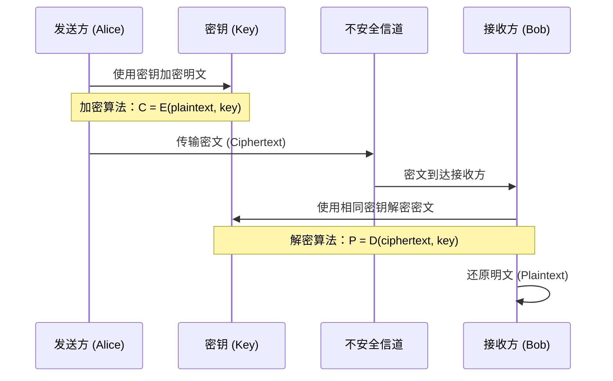

**核心算法机制**：

1. **密钥生成**：数据发送方首先生成一个加密密钥，这个密钥在加密和解密过程中都是相同的
2. **加密过程**：发送方使用生成的密钥和特定的加密算法，对明文进行加密处理，生成复杂的加密密文
3. **传输过程**：密文通过不安全的信道传输给接收方
4. **解密过程**：接收方收到加密后的密文后，使用与发送方相同的密钥和相应的解密算法，对密文进行解密

#### 常见对称加密算法对比

| 算法 | 密钥长度 | 块大小 | 安全性 | 性能 | 适用场景 |
|------|----------|--------|--------|------|----------|
| **DES** | 56 位 | 64 位 | ❌ 已破解 | 快 | 历史遗留系统 (不推荐使用) |
| **3DES** | 112/168 位 | 64 位 | ⚠️ 逐渐淘汰 | 中 | 银行等传统行业 |
| **AES** | 128/192/256 位 | 128 位 | ✅ 安全 | 快 | 现代标准，广泛使用 |
| **ChaCha20** | 256 位 | 512 位 | ✅ 安全 | 极快 | 移动设备、TLS 1.3 |

**AES 算法详解**（当前标准）：

- **密钥长度**：支持 128 位、192 位、256 位三种密钥长度
- **工作原理**：AES 采用替换 - 置换网络 (SPN) 结构，通过多轮迭代实现加密
  - AES-128：10 轮迭代
  - AES-192：12 轮迭代
  - AES-256：14 轮迭代
- **每轮操作**：
  1. **SubBytes**：字节替换，使用 S 盒进行非线性变换
  2. **ShiftRows**：行移位，状态矩阵的行进行循环移位
  3. **MixColumns**：列混合，每列与固定多项式相乘
  4. **AddRoundKey**：轮密钥加，与轮密钥进行异或运算

#### 代码示例

```python
from cryptography.hazmat.primitives.ciphers import Cipher, algorithms, modes
from cryptography.hazmat.backends import default_backend
import os

# AES-256 加密示例
def aes_encrypt(plaintext: bytes, key: bytes) -> bytes:
    """
    AES-256-CBC 加密
    :param plaintext: 明文数据
    :param key: 32 字节 (256 位) 密钥
    :return: IV + 密文
    """
    # 生成随机初始化向量 (IV)
    iv = os.urandom(16)
    
    # 创建 AES 加密器
    cipher = Cipher(algorithms.AES(key), modes.CBC(iv), backend=default_backend())
    encryptor = cipher.encryptor()
    
    # PKCS7 填充 (AES 块大小为 16 字节)
    padding_length = 16 - (len(plaintext) % 16)
    padded_data = plaintext + bytes([padding_length] * padding_length)
    
    # 加密
    ciphertext = encryptor.update(padded_data) + encryptor.finalize()
    
    # 返回 IV + 密文 (IV 需要与密文一起存储，用于解密)
    return iv + ciphertext

def aes_decrypt(ciphertext_with_iv: bytes, key: bytes) -> bytes:
    """
    AES-256-CBC 解密
    :param ciphertext_with_iv: IV + 密文
    :param key: 32 字节 (256 位) 密钥
    :return: 解密后的明文
    """
    # 提取 IV 和密文
    iv = ciphertext_with_iv[:16]
    ciphertext = ciphertext_with_iv[16:]
    
    # 创建 AES 解密器
    cipher = Cipher(algorithms.AES(key), modes.CBC(iv), backend=default_backend())
    decryptor = cipher.decryptor()
    
    # 解密
    padded_data = decryptor.update(ciphertext) + decryptor.finalize()
    
    # 移除 PKCS7 填充
    padding_length = padded_data[-1]
    plaintext = padded_data[:-padding_length]
    
    return plaintext

# 使用示例
key = os.urandom(32)  # 256 位密钥
message = b"Sensitive data requiring encryption"
encrypted = aes_encrypt(message, key)
decrypted = aes_decrypt(encrypted, key)
print(f"原文：{message}")
print(f"解密：{decrypted}")
```

#### 源码/底层解析

**AES 加密核心流程**（以 AES-128 为例）：

```c
// AES-128 加密伪代码 (参考 OpenSSL 实现)
void AES_encrypt(const uint8_t *input, uint8_t *output, const AES_KEY *key) {
    uint8_t state[4][4];  // 16 字节状态矩阵
    
    // 1. 初始轮密钥加
    load_state(input, state);
    AddRoundKey(state, key->round_key[0]);
    
    // 2. 9 轮主循环
    for (int round = 1; round < 10; round++) {
        SubBytes(state);      // 字节替换 (S 盒查表)
        ShiftRows(state);     // 行移位
        MixColumns(state);    // 列混合
        AddRoundKey(state, key->round_key[round]);
    }
    
    // 3. 最终轮 (无 MixColumns)
    SubBytes(state);
    ShiftRows(state);
    AddRoundKey(state, key->round_key[10]);
    
    store_state(state, output);
}
```

**密钥扩展算法**（Key Expansion）：
- 输入：128 位原始密钥
- 输出：11 个 128 位轮密钥（初始 + 10 轮）
- 扩展过程：通过 RotWord、SubWord、Xor 与 Rcon 常量生成

#### 密钥配送问题

**问题描述**：对称加密最大的挑战是**密钥如何安全地传递给通信双方**。如果密钥在传输过程中被窃取，加密就形同虚设。

**解决方案**：
1. **事先共享密钥**：通信双方提前通过安全渠道（如面对面）共享密钥
2. **密钥分配中心 (KDC)**：由可信第三方分配临时会话密钥
3. **Diffie-Hellman 密钥交换**：通过数学方法在不安全信道上协商共享密钥
4. **非对称加密辅助**：使用非对称加密传递对称密钥（混合加密）

#### 常见误区

| 误区 | 正确理解 |
|------|----------|
| ❌ "密钥越长越安全，所以永远用 256 位" | ✅ 密钥长度需权衡安全性和性能，AES-128 已足够安全，256 位用于高安全场景 |
| ❌ "对称加密可以单独使用" | ✅ 实际应用中必须配合安全的密钥交换机制 |
| ❌ "DES 还能用，只是强度低一些" | ✅ DES 已被证明可在数小时内破解，应完全弃用 |
| ❌ "ECB 模式简单好用" | ✅ ECB 模式会暴露明文模式，应使用 CBC、GCM 等模式 |

#### 最佳实践

1. **首选 AES-GCM 模式**：同时提供加密和认证（AEAD）
2. **使用安全的随机数生成器**：密钥和 IV 必须是密码学安全的随机数
3. **定期轮换密钥**：减少密钥泄露的影响范围
4. **不要在代码中硬编码密钥**：使用密钥管理系统（如 AWS KMS、HashiCorp Vault）
5. **使用认证加密**：选择 GCM、CCM 等 AEAD 模式，避免加密后篡改

---

### 7.1.2 非对称加密 (Asymmetric Encryption)

#### 概念定义

**非对称加密**是指加密和解密使用**不同密钥**的加密方式。这两个密钥分别是：
- **公钥 (Public Key)**：可以公开给任何人，用于加密数据
- **私钥 (Private Key)**：由用户严格保密，用于解密数据

**为什么需要非对称加密**：解决对称加密中的密钥配送问题。公钥可以公开发布，任何人使用公钥加密的信息，只有私钥持有者才能解密。

#### 工作原理

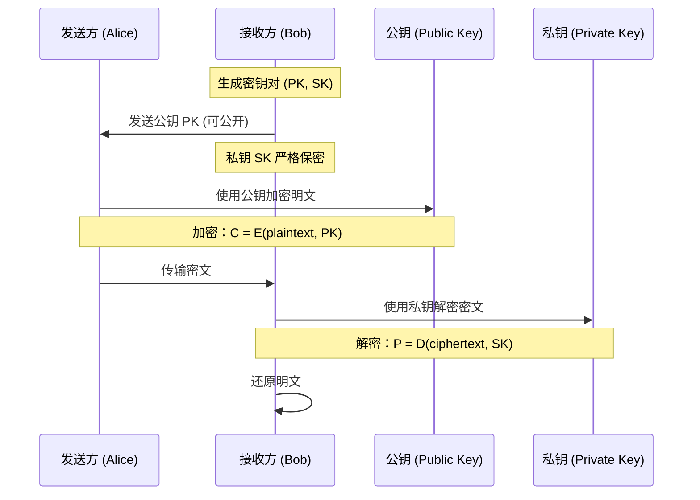

**核心特性**：
1. **公钥加密，私钥解密**：用于保密通信
2. **私钥签名，公钥验签**：用于数字签名（见 7.2 节）
3. **计算复杂度**：非对称加密比对称加密慢 1000 倍以上

#### 常见非对称加密算法

| 算法 | 全称 | 数学基础 | 密钥长度 | 安全性 | 特点 |
|------|------|----------|----------|--------|------|
| **RSA** | Rivest-Shamir-Adleman | 大整数分解难题 | 2048-4096 位 | ✅ 安全 | 应用最广泛，支持加密和签名 |
| **ECC** | Elliptic Curve Cryptography | 椭圆曲线离散对数 | 256-521 位 | ✅ 安全 | 相同强度下密钥更短，计算更快 |
| **DSA** | Digital Signature Algorithm | 离散对数问题 | 2048-3072 位 | ✅ 安全 | 仅用于数字签名 |
| **Ed25519** | Edwards-curve DSA | 扭曲爱德华兹曲线 | 256 位 | ✅ 安全 | 高性能签名，用于 SSH、区块链 |

**RSA 算法详解**：

- **数学基础**：基于大整数分解难题
  - 选择两个大质数 p 和 q
  - 计算 n = p × q（模数）
  - 计算欧拉函数 φ(n) = (p-1)(q-1)
  - 选择公钥指数 e（通常为 65537）
  - 计算私钥指数 d，满足 e × d ≡ 1 (mod φ(n))
- **加密**：c = m^e mod n
- **解密**：m = c^d mod n

**ECC 算法详解**：

- **数学基础**：基于椭圆曲线离散对数问题
  - 椭圆曲线方程：y² = x³ + ax + b
  - 在有限域上定义曲线点运算
- **优势**：
  - 256 位 ECC ≈ 3072 位 RSA 的安全强度
  - 计算速度更快，资源消耗更低
  - 适合移动设备和物联网

#### 代码示例

```python
from cryptography.hazmat.primitives.asymmetric import rsa, padding
from cryptography.hazmat.primitives import hashes, serialization
from cryptography.hazmat.backends import default_backend

# 1. 生成 RSA 密钥对
def generate_rsa_keypair(key_size=2048):
    """
    生成 RSA 密钥对
    :param key_size: 密钥长度 (推荐 2048 或 4096)
    :return: (私钥，公钥)
    """
    private_key = rsa.generate_private_key(
        public_exponent=65537,  # 标准公钥指数
        key_size=key_size,
        backend=default_backend()
    )
    public_key = private_key.public_key()
    return private_key, public_key

# 2. RSA 加密
def rsa_encrypt(public_key, plaintext: bytes) -> bytes:
    """
    使用 RSA 公钥加密
    :param public_key: 接收方的公钥
    :param plaintext: 明文数据 (长度受限)
    :return: 密文
    """
    ciphertext = public_key.encrypt(
        plaintext,
        padding.OAEP(  # 最优非对称加密填充
            mgf=padding.MGF1(algorithm=hashes.SHA256()),
            algorithm=hashes.SHA256(),
            label=None
        )
    )
    return ciphertext

# 3. RSA 解密
def rsa_decrypt(private_key, ciphertext: bytes) -> bytes:
    """
    使用 RSA 私钥解密
    :param private_key: 接收方的私钥
    :param ciphertext: 密文
    :return: 明文
    """
    plaintext = private_key.decrypt(
        ciphertext,
        padding.OAEP(
            mgf=padding.MGF1(algorithm=hashes.SHA256()),
            algorithm=hashes.SHA256(),
            label=None
        )
    )
    return plaintext

# 4. 密钥序列化 (保存/传输)
def serialize_public_key(public_key) -> bytes:
    """将公钥序列化为 PEM 格式"""
    return public_key.public_bytes(
        encoding=serialization.Encoding.PEM,
        format=serialization.PublicFormat.SubjectPublicKeyInfo
    )

def serialize_private_key(private_key, password: bytes = None) -> bytes:
    """将私钥序列化为 PEM 格式 (可加密)"""
    return private_key.private_bytes(
        encoding=serialization.Encoding.PEM,
        format=serialization.PrivateFormat.PKCS8,
        encryption_algorithm=(
            serialization.BestAvailableEncryption(password)
            if password else serialization.NoEncryption()
        )
    )

# 使用示例
private_key, public_key = generate_rsa_keypair(2048)
message = b"Secret message"  # RSA 加密数据长度有限制
encrypted = rsa_encrypt(public_key, message)
decrypted = rsa_decrypt(private_key, encrypted)
print(f"原文：{message}")
print(f"解密：{decrypted}")
```

#### 源码/底层解析

**RSA 加密底层实现**（简化版）：

```c
// RSA 加密核心计算 (参考 mbedTLS)
int rsa_encrypt(rsa_context *ctx, const uint8_t *input, uint8_t *output) {
    // 1. PKCS#1 v2.1 OAEP 填充
    uint8_t padded[RSA_KEY_SIZE / 8];
    oaep_encode(input, padded, ctx->public_key);
    
    // 2. 模幂运算：c = m^e mod n
    // 使用蒙哥马利幂运算优化
    mpi_modexp(output, padded, ctx->e, ctx->n);
    
    return 0;
}

// RSA 解密核心计算
int rsa_decrypt(rsa_context *ctx, const uint8_t *input, uint8_t *output) {
    // 1. 模幂运算：m = c^d mod n
    // 使用 CRT (中国剩余定理) 优化，加速 4 倍
    mpi_modexp_crt(output, input, ctx->d, ctx->p, ctx->q);
    
    // 2. OAEP 去填充并验证
    oaep_decode(output, ctx->private_key);
    
    return 0;
}
```

**性能优化技术**：
1. **中国剩余定理 (CRT)**：将大数运算分解为两个较小数的运算，加速约 4 倍
2. **蒙哥马利幂运算**：避免大数除法，提高模幂运算效率
3. **滑动窗口指数运算**：减少乘法次数

#### 常见误区

| 误区 | 正确理解 |
|------|----------|
| ❌ "非对称加密比对称加密安全，所以只用非对称" | ✅ 非对称加密慢，仅用于密钥交换和签名，数据传输用对称加密 |
| ❌ "RSA 密钥 1024 位够了" | ✅ 1024 位 RSA 已被认为不安全，最低使用 2048 位 |
| ❌ "公钥加密和数字签名是一回事" | ❌ 公钥加密：公钥加密→私钥解密；数字签名：私钥签名→公钥验签 |
| ❌ "ECC 是 RSA 的替代品" | ✅ ECC 是另一种非对称算法，不是 RSA 的直接替代，两者各有适用场景 |

#### 最佳实践

1. **选择合适的密钥长度**：RSA 至少 2048 位，推荐 3072 位；ECC 使用 256 位以上
2. **使用 OAEP 填充**：避免 PKCS#1 v1.5 的已知漏洞
3. **私钥保护**：使用密码加密存储，或存储在硬件安全模块 (HSM) 中
4. **定期更换密钥**：建议每年更换一次
5. **使用认证库**：不要自己实现加密算法，使用 OpenSSL、cryptography 等成熟库

---

### 7.1.3 混合加密 (Hybrid Encryption)

#### 概念定义

**混合加密**是结合对称加密和非对称加密优点的加密方案：
- 使用**对称加密**加密大量数据（速度快）
- 使用**非对称加密**加密对称密钥（解决密钥配送问题）

**为什么需要混合加密**：
- 对称加密：速度快，但密钥配送困难
- 非对称加密：解决密钥配送，但速度慢
- 混合加密：两者结合，既安全又高效

#### 工作原理

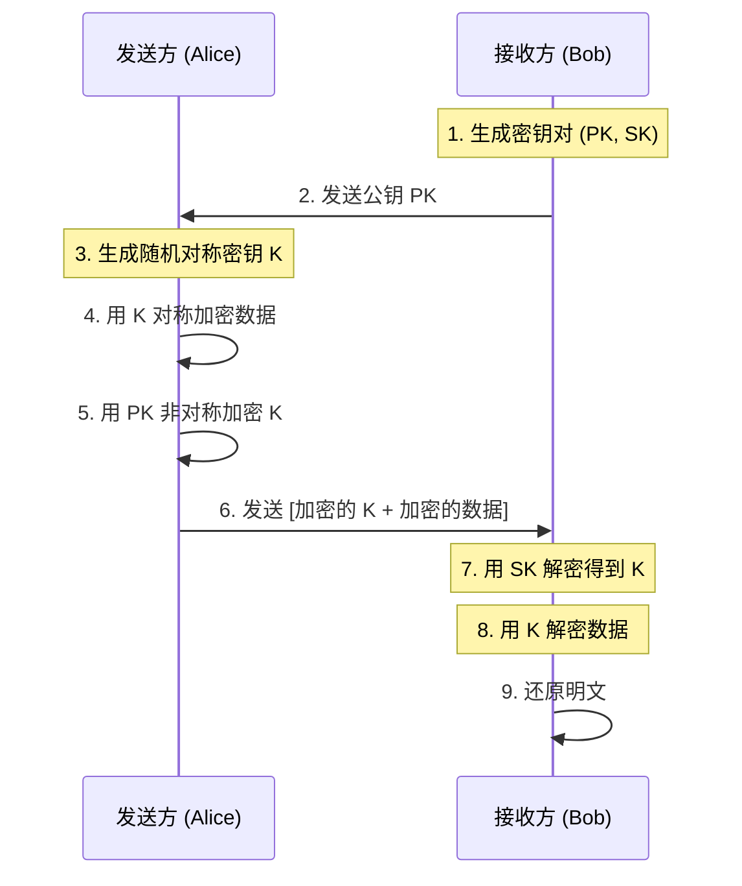

**工作流程**：
1. 接收方生成密钥对，将公钥发送给发送方
2. 发送方生成随机对称密钥（会话密钥）
3. 发送方使用对称密钥加密数据
4. 发送方使用接收方的公钥加密对称密钥
5. 发送方将加密的对称密钥和加密的数据一起发送
6. 接收方使用私钥解密得到对称密钥
7. 接收方使用对称密钥解密数据

#### 实际应用场景

**HTTPS/TLS 协议**是混合加密的典型应用：

| 阶段 | 加密方式 | 用途 |
|------|----------|------|
| 握手阶段 | 非对称加密 (RSA/ECC) | 交换对称密钥 |
| 数据传输 | 对称加密 (AES/ChaCha20) | 加密实际数据 |

#### 代码示例

```python
from cryptography.hazmat.primitives.asymmetric import rsa, padding
from cryptography.hazmat.primitives.ciphers import Cipher, algorithms, modes
from cryptography.hazmat.primitives import hashes
from cryptography.hazmat.backends import default_backend
import os

class HybridEncryption:
    """混合加密系统"""
    
    def __init__(self):
        self.backend = default_backend()
    
    def generate_keypair(self):
        """生成 RSA 密钥对"""
        private_key = rsa.generate_private_key(
            public_exponent=65537,
            key_size=2048,
            backend=self.backend
        )
        return private_key, private_key.public_key()
    
    def encrypt(self, public_key, plaintext: bytes) -> tuple:
        """
        混合加密
        :param public_key: 接收方公钥
        :param plaintext: 明文
        :return: (加密的对称密钥，IV, 密文)
        """
        # 1. 生成随机 AES-256 密钥
        aes_key = os.urandom(32)
        
        # 2. 使用 AES 加密数据
        iv = os.urandom(16)
        cipher = Cipher(algorithms.AES(aes_key), modes.GCM(iv), backend=self.backend)
        encryptor = cipher.encryptor()
        ciphertext = encryptor.update(plaintext) + encryptor.finalize()
        
        # 3. 使用 RSA 加密 AES 密钥
        encrypted_key = public_key.encrypt(
            aes_key,
            padding.OAEP(
                mgf=padding.MGF1(algorithm=hashes.SHA256()),
                algorithm=hashes.SHA256(),
                label=None
            )
        )
        
        return encrypted_key, iv, encryptor.tag, ciphertext
    
    def decrypt(self, private_key, encrypted_key: bytes, iv: bytes, 
                tag: bytes, ciphertext: bytes) -> bytes:
        """
        混合解密
        :param private_key: 接收方私钥
        :param encrypted_key: 加密的 AES 密钥
        :param iv: 初始化向量
        :param tag: GCM 认证标签
        :param ciphertext: 密文
        :return: 明文
        """
        # 1. 使用 RSA 解密 AES 密钥
        aes_key = private_key.decrypt(
            encrypted_key,
            padding.OAEP(
                mgf=padding.MGF1(algorithm=hashes.SHA256()),
                algorithm=hashes.SHA256(),
                label=None
            )
        )
        
        # 2. 使用 AES 解密数据
        cipher = Cipher(algorithms.AES(aes_key), modes.GCM(iv, tag), 
                       backend=self.backend)
        decryptor = cipher.decryptor()
        plaintext = decryptor.update(ciphertext) + decryptor.finalize()
        
        return plaintext

# 使用示例
hybrid = HybridEncryption()
private_key, public_key = hybrid.generate_keypair()

message = b"This is a secret message that needs to be securely transmitted."
encrypted_key, iv, tag, ciphertext = hybrid.encrypt(public_key, message)
decrypted = hybrid.decrypt(private_key, encrypted_key, iv, tag, ciphertext)

print(f"原文：{message}")
print(f"解密：{decrypted}")
print(f"AES 密钥长度：{len(encrypted_key)} 字节 (RSA 加密后)")
```

#### 常见误区

| 误区 | 正确理解 |
|------|----------|
| ❌ "混合加密就是双重加密" | ✅ 混合加密是用非对称加密保护对称密钥，不是双重加密数据 |
| ❌ "每次通信都要重新生成密钥对" | ✅ 密钥对可以长期使用，对称会话密钥每次通信生成 |
| ❌ "混合加密比单一加密慢" | ✅ 混合加密整体性能接近对称加密，因为只有一小部分数据用非对称加密 |

#### 最佳实践

1. **使用 AES-GCM 模式**：提供加密和认证
2. **每次通信生成新会话密钥**：前向安全性
3. **使用 OAEP 填充**：避免 RSA 攻击
4. **密钥长度匹配**：AES-256 配合 RSA-3072 或 ECC-256

---

## 7.2 认证与数字签名

### 7.2.1 数字签名原理

#### 概念定义

**数字签名 (Digital Signature)** 是一种用于验证数字消息或文档真实性的密码学技术。它提供了：
- **真实性**：确认消息确实来自声称的发送者
- **完整性**：确认消息在传输过程中未被篡改
- **不可否认性**：发送者事后不能否认自己发送过该消息

**为什么需要数字签名**：在网络通信中，如何确认收到的消息确实来自声称的发送者，且未被第三方篡改？数字签名通过密码学方法解决这一问题。

#### 工作原理

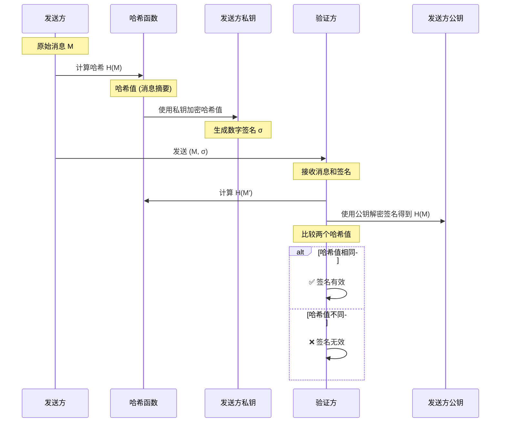

**签名生成过程**：
1. 发送方计算消息的哈希值（消息摘要）
2. 发送方使用自己的私钥加密哈希值，生成数字签名
3. 发送方将原始消息和签名一起发送

**签名验证过程**：
1. 接收方使用相同的哈希函数计算消息的哈希值
2. 接收方使用发送方的公钥解密签名，得到原始哈希值
3. 比较两个哈希值：
   - 相同 → 签名有效（消息真实且完整）
   - 不同 → 签名无效（消息被篡改或来源不可信）

#### 常见数字签名算法

| 算法 | 全称 | 数学基础 | 密钥长度 | 签名长度 | 特点 |
|------|------|----------|----------|----------|------|
| **RSA-PSS** | RSA Probabilistic Signature Scheme | 大整数分解 | 2048-4096 位 | 与密钥同长 | 广泛支持，安全性高 |
| **DSA** | Digital Signature Algorithm | 离散对数 | 2048-3072 位 | 256-512 位 | 美国联邦标准，仅用于签名 |
| **ECDSA** | Elliptic Curve DSA | 椭圆曲线 | 256-521 位 | 64-132 字节 | 密钥短，速度快，用于比特币 |
| **Ed25519** | Edwards-curve DSA | 扭曲爱德华兹曲线 | 256 位 | 64 字节 | 高性能，抗侧信道攻击 |

#### 代码示例

```python
from cryptography.hazmat.primitives.asymmetric import ec, padding
from cryptography.hazmat.primitives import hashes, serialization
from cryptography.hazmat.backends import default_backend
from cryptography.exceptions import InvalidSignature
import os

class DigitalSignature:
    """数字签名系统"""
    
    def __init__(self):
        self.backend = default_backend()
    
    def generate_ecdsa_keypair(self):
        """生成 ECDSA 密钥对 (使用 P-256 曲线)"""
        private_key = ec.generate_private_key(ec.SECP256R1(), self.backend)
        public_key = private_key.public_key()
        return private_key, public_key
    
    def generate_ed25519_keypair(self):
        """生成 Ed25519 密钥对"""
        from cryptography.hazmat.primitives.asymmetric.ed25519 import Ed25519PrivateKey
        private_key = Ed25519PrivateKey.generate()
        public_key = private_key.public_key()
        return private_key, public_key
    
    def sign_ecdsa(self, private_key, message: bytes) -> bytes:
        """
        使用 ECDSA 签名
        :param private_key: 私钥
        :param message: 待签名消息
        :return: 数字签名
        """
        signature = private_key.sign(message, ec.ECDSA(hashes.SHA256()))
        return signature
    
    def verify_ecdsa(self, public_key, message: bytes, signature: bytes) -> bool:
        """
        验证 ECDSA 签名
        :param public_key: 公钥
        :param message: 原始消息
        :param signature: 数字签名
        :return: 是否有效
        """
        try:
            public_key.verify(signature, message, ec.ECDSA(hashes.SHA256()))
            return True
        except InvalidSignature:
            return False
    
    def sign_ed25519(self, private_key, message: bytes) -> bytes:
        """使用 Ed25519 签名"""
        return private_key.sign(message)
    
    def verify_ed25519(self, public_key, message: bytes, signature: bytes) -> bool:
        """验证 Ed25519 签名"""
        try:
            public_key.verify(signature, message)
            return True
        except InvalidSignature:
            return False

# 使用示例
ds = DigitalSignature()
private_key, public_key = ds.generate_ecdsa_keypair()

message = b"This message needs to be signed for authenticity."
signature = ds.sign_ecdsa(private_key, message)

# 验证签名
is_valid = ds.verify_ecdsa(public_key, message, signature)
print(f"签名验证结果：{'✅ 有效' if is_valid else '❌ 无效'}")

# 篡改消息后验证
tampered_message = b"This message has been tampered with!"
is_valid_tampered = ds.verify_ecdsa(public_key, tampered_message, signature)
print(f"篡改后验证：{'✅ 有效' if is_valid_tampered else '❌ 无效 (正确)'}")
```

#### 源码/底层解析

**ECDSA 签名算法原理**：

```
签名生成 (私钥 d, 消息 m):
1. 计算哈希：e = H(m)
2. 生成随机数 k ∈ [1, n-1]
3. 计算曲线点：(x1, y1) = k × G (G 为基点)
4. 计算 r = x1 mod n
5. 计算 s = k^(-1) × (e + d × r) mod n
6. 签名：(r, s)

签名验证 (公钥 Q, 消息 m, 签名 (r, s)):
1. 验证 r, s ∈ [1, n-1]
2. 计算哈希：e = H(m)
3. 计算 w = s^(-1) mod n
4. 计算 u1 = e × w mod n, u2 = r × w mod n
5. 计算曲线点：(x1, y1) = u1 × G + u2 × Q
6. 验证 r ≡ x1 (mod n)
```

#### 常见误区

| 误区 | 正确理解 |
|------|----------|
| ❌ "数字签名就是加密" | ✅ 签名是私钥加密哈希值用于验证，加密是公钥加密数据用于保密 |
| ❌ "签名可以保证消息机密性" | ✅ 签名只能验证真实性和完整性，消息本身是明文的 |
| ❌ "任何哈希算法都可以用于签名" | ✅ 必须使用密码学安全的哈希算法（如 SHA-256），MD5/SHA-1 已不安全 |

#### 最佳实践

1. **使用 ECDSA 或 Ed25519**：比 RSA 更高效，密钥更短
2. **使用 SHA-256 或更强的哈希算法**：避免 MD5、SHA-1
3. **私钥安全存储**：使用 HSM 或安全飞地
4. **签名前规范数据格式**：避免签名覆盖范围歧义

---

### 7.2.2 CA 证书与公钥基础设施 (PKI)

#### 概念定义

**数字证书 (Digital Certificate)** 是由证书颁发机构 (CA) 签发的电子文档，用于证明某个实体（个人、组织、服务器）的身份及其公钥的有效性。

**证书颁发机构 (CA, Certificate Authority)** 是负责签发、认证和管理数字证书的权威第三方机构。

**公钥基础设施 (PKI, Public Key Infrastructure)** 是一套创建、管理、分发、使用、存储和撤销数字证书和公钥的系统。

**为什么需要 CA 证书**：非对称加密需要公钥，但如何确保你拿到的公钥确实属于声称的所有者？CA 作为可信第三方，通过数字证书将公钥与身份信息绑定，并提供验证机制。

#### 数字证书的结构 (X.509 标准)

```
X.509 证书包含以下字段：
┌─────────────────────────────────────┐
│ 版本号 (Version)                    │
│ 序列号 (Serial Number)              │
│ 签名算法标识 (Signature Algorithm)  │
│ 颁发者 (Issuer)                     │
│ 有效期 (Validity)                   │
│   - 生效时间 (Not Before)           │
│   - 过期时间 (Not After)            │
│ 主体 (Subject)                      │
│ 主体公钥信息 (Subject Public Key)   │
│ 颁发者唯一标识符 (可选)             │
│ 主体唯一标识符 (可选)               │
│ 扩展信息 (Extensions)               │
│   - 密钥用法 (Key Usage)            │
│   - 扩展密钥用法 (Extended Key Usage)│
│   - 主题备用名称 (Subject Alt Name) │
│   - CRL 分发点                       │
│   - 认证机构信息访问 (AIA)          │
│ 颁发者签名 (Issuer Signature)       │
└─────────────────────────────────────┘
```

#### 证书链与信任体系

```mermaid
graph TD
    RootCA[根 CA<br/>(自签名证书)] -->|签发 | IntermediateCA[中间 CA<br/>(由根 CA 签名)]
    IntermediateCA -->|签发 | ServerCert[服务器证书<br/>(由中间 CA 签名)]
    
    subgraph 信任链验证
        ServerCert -->|验证签名 | IntermediateCA
        IntermediateCA -->|验证签名 | RootCA
        RootCA -->|预置于 | Browser[浏览器/操作系统信任库]
    end
    
    style RootCA fill:#90EE90
    style IntermediateCA fill:#87CEEB
    style ServerCert fill:#FFD700
```

**证书链验证过程**：
1. 客户端获取服务器证书
2. 使用中间 CA 的公钥验证服务器证书的签名
3. 使用根 CA 的公钥验证中间 CA 证书的签名
4. 验证根 CA 是否存在于本地信任库
5. 验证证书有效期和吊销状态

#### 证书的签发与验证流程

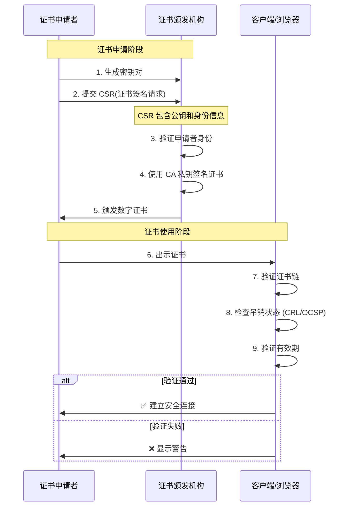

#### 代码示例

```python
from cryptography import x509
from cryptography.x509.oid import NameOID, ExtensionOID
from cryptography.hazmat.primitives import hashes, serialization
from cryptography.hazmat.primitives.asymmetric import rsa
from cryptography.hazmat.backends import default_backend
from datetime import datetime, timedelta, timezone
import ipaddress

def generate_ca_certificate():
    """生成自签名的根 CA 证书"""
    # 生成 CA 密钥对
    private_key = rsa.generate_private_key(
        public_exponent=65537,
        key_size=4096,
        backend=default_backend()
    )
    
    # 构建证书主题
    subject = issuer = x509.Name([
        x509.NameAttribute(NameOID.COUNTRY_NAME, "CN"),
        x509.NameAttribute(NameOID.STATE_OR_PROVINCE_NAME, "Beijing"),
        x509.NameAttribute(NameOID.LOCALITY_NAME, "Beijing"),
        x509.NameAttribute(NameOID.ORGANIZATION_NAME, "My Organization"),
        x509.NameAttribute(NameOID.COMMON_NAME, "My Root CA"),
    ])
    
    # 构建证书
    cert = x509.CertificateBuilder().subject_name(
        subject
    ).issuer_name(
        issuer
    ).public_key(
        private_key.public_key()
    ).serial_number(
        x509.random_serial_number()
    ).not_valid_before(
        datetime.now(timezone.utc)
    ).not_valid_after(
        datetime.now(timezone.utc) + timedelta(days=3650)  # 10 年有效期
    ).add_extension(
        x509.BasicConstraints(ca=True, path_length=None),
        critical=True,
    ).add_extension(
        x509.KeyUsage(
            digital_signature=True,
            key_cert_sign=True,
            crl_sign=True,
            content_commitment=False,
            key_encipherment=False,
            data_encipherment=False,
            key_agreement=False,
            encipher_only=False,
            decipher_only=False,
        ),
        critical=True,
    ).sign(private_key, hashes.SHA256(), default_backend())
    
    return private_key, cert

def generate_server_certificate(ca_private_key, ca_cert, domain_name):
    """生成服务器证书 (由 CA 签名)"""
    # 生成服务器密钥对
    private_key = rsa.generate_private_key(
        public_exponent=65537,
        key_size=2048,
        backend=default_backend()
    )
    
    # 构建证书主题
    subject = x509.Name([
        x509.NameAttribute(NameOID.COUNTRY_NAME, "CN"),
        x509.NameAttribute(NameOID.ORGANIZATION_NAME, "My Organization"),
        x509.NameAttribute(NameOID.COMMON_NAME, domain_name),
    ])
    
    # 构建证书
    cert = x509.CertificateBuilder().subject_name(
        subject
    ).issuer_name(
        ca_cert.subject
    ).public_key(
        private_key.public_key()
    ).serial_number(
        x509.random_serial_number()
    ).not_valid_before(
        datetime.now(timezone.utc)
    ).not_valid_after(
        datetime.now(timezone.utc) + timedelta(days=365)  # 1 年有效期
    ).add_extension(
        x509.BasicConstraints(ca=False, path_length=None),
        critical=True,
    ).add_extension(
        x509.KeyUsage(
            digital_signature=True,
            key_encipherment=True,
            content_commitment=False,
            data_encipherment=False,
            key_agreement=False,
            key_cert_sign=False,
            crl_sign=False,
            encipher_only=False,
            decipher_only=False,
        ),
        critical=True,
    ).add_extension(
        x509.SubjectAlternativeName([
            x509.DNSName(domain_name),
            x509.DNSName(f"www.{domain_name}"),
        ]),
        critical=False,
    ).add_extension(
        x509.ExtendedKeyUsage([
            x509.OID_SERVER_AUTH,
        ]),
        critical=False,
    ).sign(ca_private_key, hashes.SHA256(), default_backend())
    
    return private_key, cert

# 使用示例
ca_private_key, ca_cert = generate_ca_certificate()
server_private_key, server_cert = generate_server_certificate(
    ca_private_key, ca_cert, "example.com"
)

# 序列化证书
cert_pem = server_cert.public_bytes(serialization.Encoding.PEM)
print("服务器证书:")
print(cert_pem.decode())
```

#### 证书吊销机制

**证书吊销列表 (CRL, Certificate Revocation List)**：
- CA 定期发布的已吊销证书列表
- 客户端下载并检查证书是否在列表中
- 缺点：更新延迟，列表可能很大

**在线证书状态协议 (OCSP, Online Certificate Status Protocol)**：
- 实时查询证书状态
- 客户端向 OCSP 响应器发送证书序列号
- 响应：good / revoked / unknown

**OCSP Stapling**：
- 服务器定期从 CA 获取 OCSP 响应
- 在 TLS 握手时一并提供给客户端
- 减少客户端延迟，保护隐私

#### 常见误区

| 误区 | 正确理解 |
|------|----------|
| ❌ "HTTPS 就是绝对安全的" | ✅ HTTPS 只保证传输安全，不保证服务器本身可信 |
| ❌ "证书永远不会被破解" | ✅ 证书有有效期，且可能被吊销，需要定期检查 |
| ❌ "自签名证书和 CA 证书一样安全" | ✅ 自签名证书没有第三方验证，容易被中间人攻击 |
| ❌ "证书只需要申请一次" | ✅ 证书有过期时间，需要定期更新 |

#### 最佳实践

1. **使用可信 CA 签发的证书**：如 Let's Encrypt、DigiCert、Sectigo
2. **启用 OCSP Stapling**：提高性能和隐私
3. **使用 HSTS**：强制 HTTPS，防止 SSL 剥离攻击
4. **监控证书过期时间**：设置自动续期
5. **实施证书透明度 (CT)**：监控所有颁发的证书

---

## 7.3 防火墙与入侵检测

### 7.3.1 防火墙技术

#### 概念定义

**防火墙 (Firewall)** 是一种网络安全系统，根据预定义的安全规则监控和控制网络流量。它是内部信任网络与外部不可信任网络之间的逻辑屏障。

**为什么需要防火墙**：网络边界需要访问控制，只允许合法流量通过，阻止恶意访问。防火墙作为第一道防线，实现网络隔离和访问控制。

#### 防火墙的工作原理

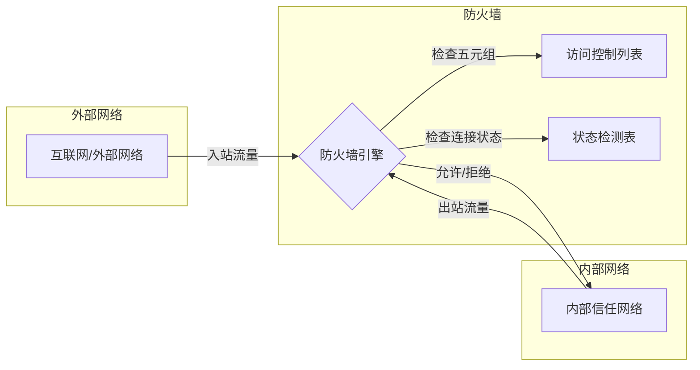

**五元组检查**：
- 源 IP 地址 (Source IP)
- 目的 IP 地址 (Destination IP)
- 源端口 (Source Port)
- 目的端口 (Destination Port)
- 协议 (Protocol: TCP/UDP/ICMP)

#### 防火墙类型对比

| 类型 | 工作层级 | 原理 | 优点 | 缺点 | 适用场景 |
|------|----------|------|------|------|----------|
| **包过滤防火墙** | 网络层 (L3) | 基于 IP/端口过滤 | 速度快，开销小 | 无状态，易被欺骗 | 基础边界防护 |
| **状态检测防火墙** | 传输层 (L4) | 跟踪连接状态 | 更智能，能识别异常连接 | 需要维护状态表 | 现代网络边界 |
| **应用层防火墙** | 应用层 (L7) | 深度解析应用协议 | 可防御应用层攻击 | 性能开销大 | Web 应用防护 |
| **下一代防火墙 (NGFW)** | 全层次 | 整合多种技术 | 全面防护，可视化 | 成本高，配置复杂 | 企业核心边界 |

#### 防火墙工作模式

```mermaid
graph TD
    subgraph 路由模式
        R1[路由器] -->|三层转发 | FW_R[防火墙<br/>(配置 IP)]
        FW_R -->|三层转发 | Switch1[内部交换机]
    end
    
    subgraph 透明模式
        Switch2[外部交换机] -->|二层转发 | FW_T[防火墙<br/>(无 IP)]
        FW_T -->|二层转发 | Switch3[内部交换机]
    end
    
    subgraph 混合模式
        R2[路由器] -->|部分接口三层 | FW_M[防火墙<br/>(部分接口有 IP)]
        FW_M -->|部分接口二层 | Switch4[内部交换机]
    end
```

**路由模式**：
- 接口配置 IP 地址，作为三层设备工作
- 适用于网络边界，需要路由转发的场景

**透明模式**：
- 接口不配置 IP，类似二层交换机
- 适用于改造项目，保持原有网络拓扑

**混合模式**：
- 部分接口路由模式，部分接口透明模式
- 适用于复杂网络环境

#### 区域划分与安全策略

**典型防火墙区域**：

| 区域 | 安全级别 | 说明 | 典型设备 |
|------|----------|------|----------|
| **Local** | 100 | 防火墙本身 | - |
| **Trust** | 85 | 内部信任网络 | 内部服务器、办公网络 |
| **DMZ** | 50 | 军事缓冲区 | 对外 Web 服务器、邮件服务器 |
| **Untrust** | 5 | 外部不可信网络 | 互联网 |

**安全策略设计原则**：
1. **默认拒绝**：未明确允许的流量一律拒绝
2. **最小权限**：只开放必要的端口和服务
3. **区域隔离**：不同安全级别区域之间严格隔离
4. **入站严格，出站宽松**：入站流量严格限制，出站流量可适当宽松

#### 代码示例 (iptables 规则)

```bash
#!/bin/bash
# Linux iptables 防火墙配置示例

# 清空现有规则
iptables -F
iptables -X
iptables -Z

# 设置默认策略：默认拒绝所有
iptables -P INPUT DROP
iptables -P FORWARD DROP
iptables -P OUTPUT ACCEPT

# 允许回环接口
iptables -A INPUT -i lo -j ACCEPT
iptables -A OUTPUT -o lo -j ACCEPT

# 允许已建立的连接和相关连接
iptables -A INPUT -m state --state ESTABLISHED,RELATED -j ACCEPT

# 允许 SSH (22 端口)，限制来源 IP
iptables -A INPUT -p tcp -s 192.168.1.0/24 --dport 22 -j ACCEPT

# 允许 HTTP (80 端口) 和 HTTPS (443 端口)
iptables -A INPUT -p tcp --dport 80 -j ACCEPT
iptables -A INPUT -p tcp --dport 443 -j ACCEPT

# 允许 ICMP (Ping)，但限速
iptables -A INPUT -p icmp --icmp-type echo-request -m limit --limit 1/s -j ACCEPT

# 防止 SYN Flood 攻击
iptables -A INPUT -p tcp --syn -m limit --limit 1/s --limit-burst 3 -j ACCEPT

# 记录被拒绝的连接 (日志)
iptables -A INPUT -j LOG --log-prefix "IPTABLES-DROP: " --log-level 4

# 保存规则
iptables-save > /etc/iptables/rules.v4
```

#### 常见误区

| 误区 | 正确理解 |
|------|----------|
| ❌ "防火墙能防御所有攻击" | ✅ 防火墙主要防御网络层攻击，无法防御应用层攻击和内部攻击 |
| ❌ "配置了防火墙就安全了" | ✅ 防火墙只是安全体系的一部分，需要配合其他措施 |
| ❌ "规则越多越安全" | ✅ 规则应该简洁明了，复杂规则容易产生漏洞 |
| ❌ "出站流量不需要控制" | ✅ 出站流量也需要监控，防止数据泄露和僵尸网络 |

#### 最佳实践

1. **实施默认拒绝策略**：只允许明确需要的流量
2. **定期审计规则**：清理过期和无用的规则
3. **启用日志记录**：监控异常流量
4. **定期更新固件**：修复已知漏洞
5. **多因素认证**：管理防火墙的访问需要多重认证

---

### 7.3.2 入侵检测系统 (IDS) 与入侵防御系统 (IPS)

#### 概念定义

**入侵检测系统 (IDS, Intrusion Detection System)** 是一种网络安全设备或软件，用于监控网络或系统活动，检测可疑行为并发出警报。

**入侵防御系统 (IPS, Intrusion Prevention System)** 在 IDS 的基础上增加了主动防护功能，不仅能检测攻击，还能实时阻断攻击。

**为什么需要 IDS/IPS**：防火墙只能基于规则过滤流量，无法检测新型攻击和异常行为。IDS/IPS 通过深度检测和特征匹配，发现并阻止更复杂的攻击。

#### IDS 与 IPS 的对比

```mermaid
graph TB
    subgraph IDS 入侵检测系统
        IDS_Mode[旁路部署<br/>(镜像端口)]
        IDS_Action[检测 + 告警<br/>(不阻断)]
        IDS_Adv[不影响正常流量<br/>(即使故障也不中断)]
    end
    
    subgraph IPS 入侵防御系统
        IPS_Mode[串联部署<br/>(在线路径)]
        IPS_Action[检测 + 阻断<br/>(主动防御)]
        IPS_Adv[实时阻止攻击<br/>(故障可能影响流量)]
    end
    
    IDS_Mode -.->|对比 | IPS_Mode
    IDS_Action -.->|对比 | IPS_Action
    IDS_Adv -.->|对比 | IPS_Adv
```

| 特性 | IDS (入侵检测) | IPS (入侵防御) |
|------|----------------|----------------|
| **部署方式** | 旁路 (镜像端口) | 串联 (在线路径) |
| **主要功能** | 检测 + 告警 | 检测 + 阻断 |
| **响应速度** | 事后分析 | 实时阻断 |
| **对网络影响** | 无影响 | 可能引入延迟 |
| **故障影响** | 无影响 | 可能中断网络 |
| **适用场景** | 监控、合规审计 | 主动防护 |

#### IDS 检测类型

```mermaid
graph TD
    IDS[入侵检测系统]
    
    IDS --> NIDS[基于网络的 IDS<br/>(NIDS)]
    IDS --> HIDS[基于主机的 IDS<br/>(HIDS)]
    
    NIDS --> NIDS_Desc[监控整个网络流量<br/>部署在关键网络节点]
    NIDS --> NIDS_Pro[覆盖范围广<br/>检测网络层攻击]
    NIDS --> NIDS_Con[无法检测加密流量<br/>高流量环境性能压力大]
    
    HIDS --> HIDS_Desc[安装在特定主机上<br/>监控系统日志和文件]
    HIDS --> HIDS_Pro[检测主机层面攻击<br/>可检测加密流量]
    HIDS --> HIDS_Con[需要部署在每个主机<br/>管理复杂度高]
```

#### 检测技术

**1. 特征检测 (Signature-based Detection)**

- **原理**：与已知攻击特征库进行匹配
- **优点**：准确率高，误报率低
- **缺点**：无法检测未知攻击（零日攻击）

**示例特征**：
```
# Snort 规则示例
alert tcp $EXTERNAL_NET any -> $HOME_NET 80 (
    msg:"SQL Injection Attempt";
    flow:to_server,established;
    content:"UNION SELECT";
    nocase;
    classtype:web-application-attack;
    sid:1000001;
    rev:1;
)
```

**2. 异常检测 (Anomaly-based Detection)**

- **原理**：建立正常行为基线，检测偏离基线的行为
- **优点**：可检测未知攻击
- **缺点**：误报率较高，需要训练基线

**3. 协议分析 (Protocol Analysis)**

- **原理**：深度解析协议，检测违规使用
- **优点**：可发现协议层面的攻击
- **缺点**：需要支持多种协议

#### 代码示例 (使用 Scapy 进行简单 IDS 检测)

```python
from scapy.all import sniff, TCP, IP
from scapy.layers.http import HTTPRequest
import logging

# 配置日志
logging.basicConfig(
    level=logging.INFO,
    format='%(asctime)s - %(levelname)s - %(message)s'
)
logger = logging.getLogger("SimpleIDS")

# 定义攻击特征
SIGNATURES = {
    'sql_injection': [
        b"UNION SELECT",
        b"OR 1=1",
        b"DROP TABLE",
        b"--",
    ],
    'xss_attack': [
        b"<script>",
        b"javascript:",
        b"onerror=",
    ],
    'port_scan': [],  # 通过行为检测
}

# 端口扫描检测器
class PortScanDetector:
    def __init__(self, threshold=10):
        self.threshold = threshold
        self.connections = {}  # {src_ip: {dst_ip: [ports]}}
    
    def check(self, packet):
        if IP in packet and TCP in packet:
            src_ip = packet[IP].src
            dst_ip = packet[IP].dst
            dst_port = packet[TCP].dport
            
            if src_ip not in self.connections:
                self.connections[src_ip] = {}
            if dst_ip not in self.connections[src_ip]:
                self.connections[src_ip][dst_ip] = set()
            
            self.connections[src_ip][dst_ip].add(dst_port)
            
            # 检查是否超过阈值
            port_count = len(self.connections[src_ip][dst_ip])
            if port_count > self.threshold:
                logger.warning(
                    f"可能的端口扫描：{src_ip} -> {dst_ip} "
                    f"(扫描了 {port_count} 个端口)"
                )
                return True
        return False

# HTTP 攻击检测
def detect_http_attack(packet):
    if TCP in packet and packet[TCP].payload:
        payload = bytes(packet[TCP].payload)
        
        # 检测 SQL 注入
        for signature in SIGNATURES['sql_injection']:
            if signature.upper() in payload.upper():
                logger.warning(
                    f"SQL 注入尝试检测：{packet[IP].src} -> {packet[IP].dst}"
                )
                return True
        
        # 检测 XSS 攻击
        for signature in SIGNATURES['xss_attack']:
            if signature.lower() in payload.lower():
                logger.warning(
                    f"XSS 攻击尝试检测：{packet[IP].src} -> {packet[IP].dst}"
                )
                return True
    return False

# 数据包回调函数
def packet_callback(packet):
    # 端口扫描检测
    scan_detector.check(packet)
    
    # HTTP 攻击检测
    if packet.haslayer(TCP) and packet[TCP].dport in [80, 443, 8080]:
        detect_http_attack(packet)

# 启动 IDS
if __name__ == "__main__":
    scan_detector = PortScanDetector(threshold=10)
    
    logger.info("简单 IDS 系统启动中...")
    logger.info("按 Ctrl+C 停止")
    
    try:
        # 嗅探网络流量
        sniff(
            filter="tcp",
            prn=packet_callback,
            store=0
        )
    except KeyboardInterrupt:
        logger.info("IDS 系统停止")
```

#### 常见误区

| 误区 | 正确理解 |
|------|----------|
| ❌ "IDS/IPS 可以替代防火墙" | ✅ IDS/IPS 是防火墙的补充，不是替代 |
| ❌ "IPS 可以阻止所有攻击" | ✅ IPS 只能阻止已知特征的攻击，新型攻击需要其他措施 |
| ❌ "部署后就不用管了" | ✅ 需要定期更新特征库，调整检测规则 |
| ❌ "IDS 误报都是问题" | ✅ 一定误报率是正常的，关键是调优降低误报 |

#### 最佳实践

1. **分层部署**：在网络边界、关键网段、核心服务器前分别部署
2. **定期更新特征库**：保持对最新攻击的检测能力
3. **调优检测规则**：根据实际环境调整阈值，降低误报
4. **建立响应流程**：检测到攻击后需要有明确的响应流程
5. **日志关联分析**：将 IDS 日志与其他安全设备日志关联分析

---

## 7.4 常见网络攻击与防护

### 7.4.1 DDoS 攻击与防护

#### 概念定义

**DDoS (Distributed Denial of Service)** 分布式拒绝服务攻击是一种通过控制大量被感染的设备（僵尸网络）向目标发送海量请求，耗尽目标资源，使其无法为正常用户提供服务的攻击方式。

**为什么 DDoS 如此危险**：攻击者利用"以量压质"的策略，通过三种资源消耗实现攻击：
- **带宽消耗**：填满网络通道（占比 68%）
- **计算消耗**：高 CPU 负载请求（占比 23%）
- **连接消耗**：耗尽连接池（占比 9%）

#### DDoS 攻击类型

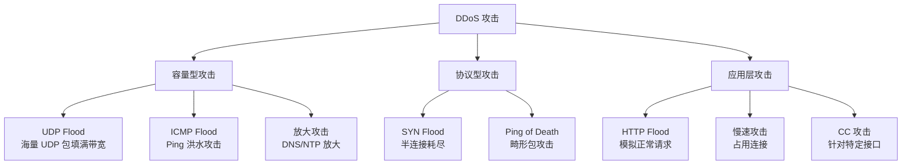

#### 典型攻击详解

**1. SYN Flood（SYN 洪水攻击）**

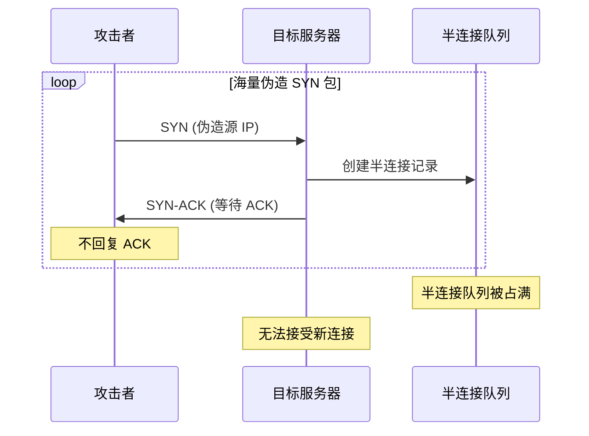

**攻击原理**：
- 利用 TCP 三次握手的漏洞
- 发送大量 SYN 包但不完成握手
- 服务器的半连接队列被占满，无法处理合法连接

**2. UDP Flood**

- 向目标发送海量 UDP 包
- 服务器需要处理每个包，消耗带宽和 CPU
- 针对 DNS、视频流等 UDP 服务

**3. HTTP Flood / CC 攻击**

- 模拟正常用户的 HTTP 请求
- 针对数据库查询、搜索接口等耗时操作
- 消耗服务器应用层资源

#### DDoS 防护技术

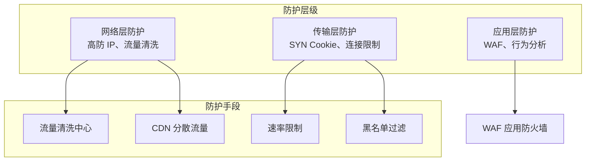

**1. 流量清洗技术**

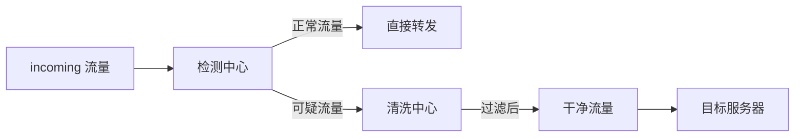

**工作流程**：
1. **流量牵引**：通过 BGP 路由通告将可疑流量引导至清洗中心
2. **特征识别**：基于五元组建立流量基线
3. **过滤处理**：
   - 静态过滤：阻断已知恶意 IP 段
   - 动态过滤：基于速率限制
   - 行为分析：检测异常请求模式
4. **干净流量回注**：将清洗后的流量转发至目标

**2. SYN Cookie 技术**

```python
# SYN Cookie 实现原理
import hashlib
import time

def generate_syn_cookie(client_ip, client_port, server_ip, server_port, secret):
    """
    生成 SYN Cookie
    :param client_ip: 客户端 IP
    :param client_port: 客户端端口
    :param server_ip: 服务器 IP
    :param server_port: 服务器端口
    :param secret: 服务器密钥 (定期更换)
    :return: SYN Cookie (序列号)
    """
    # 计算时间戳 (每 60 秒变化一次)
    timestamp = int(time.time()) // 60
    
    # 生成 Hash 值
    data = f"{client_ip}:{client_port}:{server_ip}:{server_port}:{timestamp}:{secret}"
    hash_value = hashlib.md5(data.encode()).hexdigest()
    
    # 取前 24 位作为 Cookie
    cookie = int(hash_value[:6], 16) & 0xFFFFFF
    
    # 将时间戳编码到 Cookie 中
    syn_cookie = (timestamp << 24) | cookie
    
    return syn_cookie

def verify_syn_cookie(client_ip, client_port, server_ip, server_port, 
                      secret, syn_cookie, ack_number):
    """
    验证 ACK 中的 SYN Cookie
    :return: 是否有效
    """
    # 提取时间戳
    timestamp = (syn_cookie >> 24) & 0xFFFFFFFF
    current_timestamp = int(time.time()) // 60
    
    # 允许 2 个时间窗口的偏差
    if abs(current_timestamp - timestamp) > 2:
        return False
    
    # 重新计算 Cookie
    expected_cookie = generate_syn_cookie(
        client_ip, client_port, server_ip, server_port, secret
    )
    expected_ack = expected_cookie + 1
    
    return ack_number == expected_ack
```

**3. 速率限制与黑名单**

```python
from collections import defaultdict
import time

class DDoSProtection:
    """简单的 DDoS 防护实现"""
    
    def __init__(self, requests_per_second=100, blacklist_duration=300):
        self.rps_limit = requests_per_second
        self.blacklist_duration = blacklist_duration
        self.request_counts = defaultdict(list)  # {ip: [timestamps]}
        self.blacklist = set()  # 黑名单 IP
        self.blacklist_expiry = {}  # {ip: expiry_time}
    
    def is_allowed(self, client_ip):
        """检查请求是否允许"""
        current_time = time.time()
        
        # 检查黑名单
        if client_ip in self.blacklist:
            if current_time > self.blacklist_expiry[client_ip]:
                # 黑名单过期，移除
                self.blacklist.remove(client_ip)
                del self.blacklist_expiry[client_ip]
            else:
                return False
        
        # 清理过期的请求记录 (超过 1 秒的)
        self.request_counts[client_ip] = [
            ts for ts in self.request_counts[client_ip]
            if current_time - ts < 1
        ]
        
        # 检查速率限制
        if len(self.request_counts[client_ip]) >= self.rps_limit:
            # 超过限制，加入黑名单
            self.blacklist.add(client_ip)
            self.blacklist_expiry[client_ip] = current_time + self.blacklist_duration
            return False
        
        # 记录请求
        self.request_counts[client_ip].append(current_time)
        return True
    
    def get_stats(self):
        """获取统计信息"""
        return {
            'tracked_ips': len(self.request_counts),
            'blacklisted_ips': len(self.blacklist),
        }
```

#### 常见误区

| 误区 | 正确理解 |
|------|----------|
| ❌ "带宽够大就不怕 DDoS" | ✅ 应用层攻击不依赖带宽，再大带宽也可能被攻陷 |
| ❌ "防火墙可以防御 DDoS" | ✅ 传统防火墙无法应对大规模 DDoS，需要专业防护 |
| ❌ "云防护可以完全抵御" | ✅ 云防护有上限，超大规模攻击仍可能突破 |

#### 最佳实践

1. **分层防护**：网络层 + 传输层 + 应用层立体防护
2. **带宽冗余**：预留 3-5 倍业务峰值带宽
3. **CDN 分散**：利用 CDN 节点分散攻击流量
4. **建立应急响应**：制定 DDoS 应急预案
5. **使用云防护服务**：如 AWS Shield、阿里云 DDoS 高防

---

### 7.4.2 XSS 跨站脚本攻击

#### 概念定义

**XSS (Cross-Site Scripting)** 跨站脚本攻击是一种通过向网页注入恶意脚本，使其在其他用户的浏览器中执行的攻击方式。

**为什么 XSS 如此普遍**：XSS 约占所有 Web 攻击的 40%，原因是：
- Web 应用广泛使用用户输入
- 很多开发者对输入输出处理不当
- 攻击门槛相对较低

#### XSS 攻击类型

```mermaid
graph TD
    XSS[XSS 跨站脚本攻击]
    
    XSS --> Reflected[反射型 XSS<br/>(非持久性)]
    XSS --> Stored[存储型 XSS<br/>(持久性)]
    XSS --> DOM[DOM 型 XSS<br/>(客户端)]
    
    Reflected --> Ref_Desc[恶意脚本在 URL 中<br/>服务器反射后执行]
    Reflected --> Ref_Example[搜索、登录页面]
    
    Stored --> Stor_Desc[恶意脚本存储在数据库<br/>每次访问都执行]
    Stored --> Stor_Example[评论、论坛发帖]
    
    DOM --> Dom_Desc[前端 JS 处理不当<br/>不经过服务器]
    DOM --> Dom_Example[location、innerHTML]
```

#### 攻击流程详解

**1. 反射型 XSS**

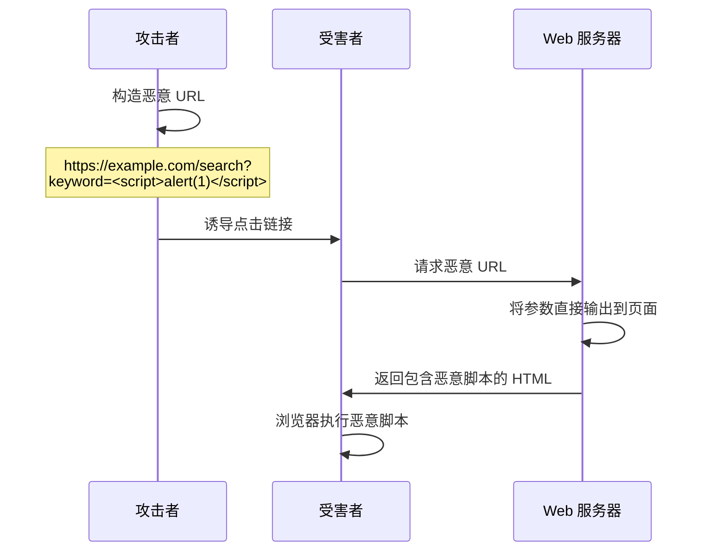

**2. 存储型 XSS**

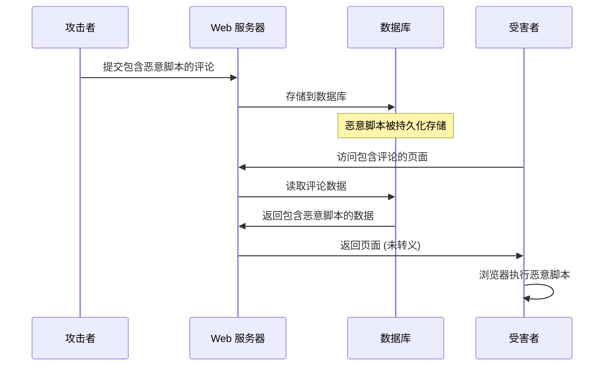

#### 代码示例 (漏洞与修复)

**❌ 漏洞代码示例**：

```python
# Flask 应用 - 存在 XSS 漏洞
from flask import Flask, request

app = Flask(__name__)

@app.route('/search')
def search():
    keyword = request.args.get('keyword', '')
    # ❌ 直接返回用户输入，未转义
    return f'''
    <html>
        <body>
            <h1>搜索结果：{keyword}</h1>
        </body>
    </html>
    '''

@app.route('/comment', methods=['POST'])
def comment():
    content = request.form.get('content', '')
    # ❌ 直接存储用户输入，未过滤
    save_to_database(content)  # 假设的数据库保存函数
    return '评论成功'
```

**✅ 修复代码示例**：

```python
# Flask 应用 - 修复 XSS 漏洞
from flask import Flask, request, escape
from markupsafe import Markup

app = Flask(__name__)

@app.route('/search')
def search():
    keyword = request.args.get('keyword', '')
    # ✅ 使用 escape 转义用户输入
    safe_keyword = escape(keyword)
    return f'''
    <html>
        <body>
            <h1>搜索结果：{safe_keyword}</h1>
        </body>
    </html>
    '''

@app.route('/comment', methods=['POST'])
def comment():
    content = request.form.get('content', '')
    # ✅ 存储前进行过滤
    safe_content = sanitize_html(content)
    save_to_database(safe_content)
    return '评论成功'

def sanitize_html(html):
    """
    清理 HTML 中的危险标签
    使用 bleach 库进行白名单过滤
    """
    import bleach
    
    # 允许的标签白名单
    allowed_tags = ['p', 'br', 'strong', 'em', 'u', 'a']
    allowed_attrs = {'a': ['href', 'title']}
    allowed_protocols = ['http', 'https']
    
    return bleach.clean(
        html,
        tags=allowed_tags,
        attributes=allowed_attrs,
        protocols=allowed_protocols
    )
```

**前端修复示例**：

```javascript
// ❌ 不安全的 DOM 操作
function unsafeDisplay(userInput) {
    document.getElementById('output').innerHTML = userInput;
}

// ✅ 安全的 DOM 操作
function safeDisplay(userInput) {
    // 使用 textContent 而非 innerHTML
    document.getElementById('output').textContent = userInput;
}

// ✅ 如果必须使用 HTML，进行转义
function escapeHtml(text) {
    const div = document.createElement('div');
    div.textContent = text;
    return div.innerHTML;
}

function safeHtmlDisplay(userInput) {
    document.getElementById('output').innerHTML = escapeHtml(userInput);
}

// ✅ 使用框架的自动转义功能 (React)
function SafeComponent({ userInput }) {
    // React 自动转义，除非使用 dangerouslySetInnerHTML
    return <div>{userInput}</div>;
}
```

#### 防护技术

**1. 输入验证与过滤**

```python
import re
from html import escape

def validate_and_sanitize_input(user_input: str) -> str:
    """
    输入验证与清理
    1. 长度限制
    2. 字符白名单
    3. HTML 转义
    """
    # 1. 长度限制
    if len(user_input) > 1000:
        raise ValueError("输入过长")
    
    # 2. 移除危险字符 (根据业务需求)
    # 注意：不要过度依赖黑名单
    dangerous_patterns = [
        r'<script[^>]*>.*?</script>',
        r'javascript:',
        r'on\w+\s*=',
    ]
    for pattern in dangerous_patterns:
        user_input = re.sub(pattern, '', user_input, flags=re.IGNORECASE | re.DOTALL)
    
    # 3. HTML 转义
    return escape(user_input)
```

**2. Content Security Policy (CSP)**

```python
# Flask 应用 - 设置 CSP 头部
@app.after_request
def set_csp(response):
    # 只允许来自本站的脚本
    csp_policy = (
        "default-src 'self'; "
        "script-src 'self'; "
        "style-src 'self' 'unsafe-inline'; "
        "img-src 'self' data: https:; "
        "font-src 'self'; "
        "frame-ancestors 'none';"
    )
    response.headers['Content-Security-Policy'] = csp_policy
    return response
```

**3. HttpOnly Cookie**

```python
# 设置 HttpOnly Cookie，防止 JS 读取
from flask import make_response

@app.route('/login', methods=['POST'])
def login():
    response = make_response('登录成功')
    # ✅ 设置 HttpOnly，JS 无法读取
    response.set_cookie(
        'session_id',
        generate_session_id(),
        httponly=True,      # 禁止 JS 访问
        secure=True,        # 仅 HTTPS 传输
        samesite='Lax'      # 防止 CSRF
    )
    return response
```

#### 常见误区

| 误区 | 正确理解 |
|------|----------|
| ❌ "只过滤<script>标签就够了" | ✅ 还有事件处理器 (onclick 等)、javascript: 协议等 |
| ❌ "后端转义就够了" | ✅ 前后端都需要转义，尤其是 DOM 型 XSS |
| ❌ "使用框架就不会有 XSS" | ✅ 框架提供保护，但不当使用 (如 dangerouslySetInnerHTML) 仍会引入漏洞 |

#### 最佳实践

1. **输出编码**：所有用户输入输出前都要转义
2. **使用 CSP**：设置内容安全策略作为最后一道防线
3. **HttpOnly Cookie**：防止 XSS 窃取会话
4. **使用安全框架**：React、Vue 等框架默认提供 XSS 防护
5. **定期安全审计**：使用工具扫描 XSS 漏洞

---

### 7.4.3 CSRF 跨站请求伪造

#### 概念定义

**CSRF (Cross-Site Request Forgery)** 跨站请求伪造是一种利用用户已登录身份，诱导用户浏览器发送恶意请求的攻击方式。

**攻击本质**："借刀杀人"——攻击者利用用户的有效会话（Cookie），让服务器误以为是用户的主动操作。

#### 攻击原理

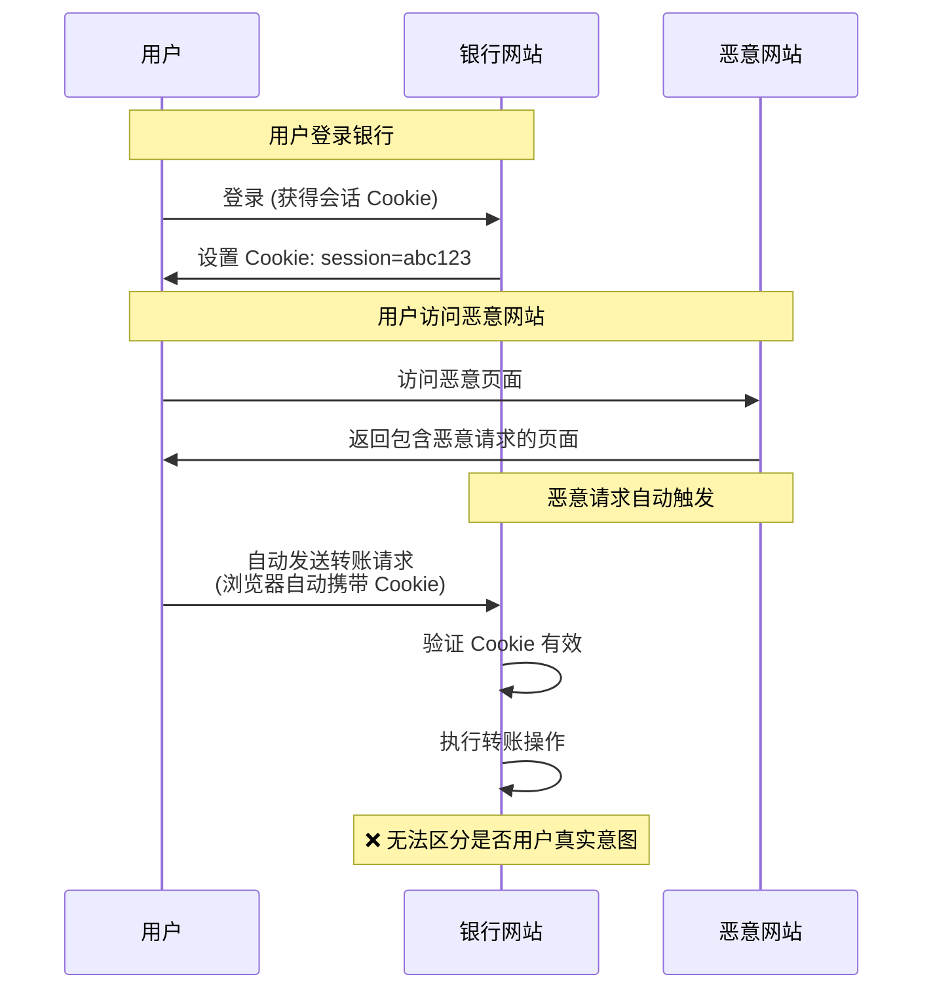

**攻击成立的 3 个核心条件**：
1. **用户已认证**：用户已登录目标网站，会话 Cookie 有效
2. **请求可伪造**：攻击者能构造出符合接口要求的请求
3. **用户被诱导**：攻击者能诱导用户触发请求

#### CSRF vs XSS

| 特性 | CSRF | XSS |
|------|------|-----|
| **攻击目标** | 利用用户身份执行操作 | 窃取用户信息 |
| **是否需要 Cookie** | 依赖 Cookie 自动发送 | 试图窃取 Cookie |
| **用户交互** | 用户无需点击 (自动触发) | 通常需要用户触发 |
| **防护重点** | 验证请求来源 | 过滤恶意输入 |

#### 攻击示例

**GET 请求型 CSRF**：

```html
<!-- 恶意网站中的隐藏代码 -->
<!-- 利用 img 标签自动加载发起请求 -->


<!-- 或者使用自动提交的表单 -->
<form action="https://bank.com/transfer" method="GET" id="csrf-form">
    <input type="hidden" name="to" value="attacker" />
    <input type="hidden" name="amount" value="10000" />
</form>
<script>
    document.getElementById('csrf-form').submit();
</script>
```

**POST 请求型 CSRF**：

```html
<!-- 恶意网站中的隐藏表单 -->
<form action="https://bank.com/transfer" method="POST" id="csrf-form">
    <input type="hidden" name="to" value="attacker" />
    <input type="hidden" name="amount" value="10000" />
</form>
<script>
    // 页面加载后自动提交
    window.onload = function() {
        document.getElementById('csrf-form').submit();
    };
</script>
```

#### 防护技术

**1. CSRF Token**

```mermaid
sequenceDiagram
    participant User as 用户
    participant Server as 服务器
    participant Attacker as 攻击者
    
    Note over User,Server: 获取表单时
    User->>Server: 请求表单页面
    Server->>Server: 生成随机 Token
    Server->>User: 返回表单 (包含 Token)
    Note over User: <input type="hidden" <br/>name="csrf_token" value="xyz123">
    
    Note over User,Server: 提交表单时
    User->>Server: 提交表单 (包含 Token)
    Server->>Server: 验证 Token
    alt Token 有效
        Server->>Server: 处理请求
    else Token 无效/缺失
        Server->>User: 拒绝请求
    end
    
    Note over Attacker,Server: 攻击者尝试伪造
    Attacker->>Server: 伪造请求 (无 Token)
    Server->>Server: Token 验证失败
    Server->>Attacker: ❌ 拒绝请求
```

**代码示例**：

```python
from flask import Flask, request, session, abort
from functools import wraps
import secrets

app = Flask(__name__)
app.secret_key = secrets.token_hex(32)

def generate_csrf_token():
    """生成 CSRF Token"""
    if 'csrf_token' not in session:
        session['csrf_token'] = secrets.token_hex(32)
    return session['csrf_token']

def csrf_protect(f):
    """CSRF 保护装饰器"""
    @wraps(f)
    def decorated_function(*args, **kwargs):
        if request.method in ['POST', 'PUT', 'DELETE']:
            token = request.form.get('csrf_token') or \
                    request.headers.get('X-CSRF-Token')
            
            if not token or token != session.get('csrf_token'):
                abort(403, 'CSRF token missing or invalid')
        
        return f(*args, **kwargs)
    return decorated_function

@app.route('/transfer', methods=['POST'])
@csrf_protect
def transfer():
    to_account = request.form.get('to')
    amount = request.form.get('amount')
    # 处理转账
    return '转账成功'

# 模板中使用
# <input type="hidden" name="csrf_token" value="{{ generate_csrf_token() }}">
```

**2. SameSite Cookie 属性**

```python
# 设置 SameSite Cookie
response.set_cookie(
    'session_id',
    session_id,
    samesite='Strict',  # 或 'Lax'
    httponly=True,
    secure=True
)
```

| SameSite 值 | 行为 |
|-------------|------|
| `Strict` | 所有跨站请求都不发送 Cookie |
| `Lax` | 仅安全导航 (GET) 发送 Cookie |
| `None` | 所有请求都发送 Cookie (需 Secure) |

**3. 验证 Referer/Origin 头部**

```python
from urllib.parse import urlparse

@app.before_request
def check_csrf_referer():
    """检查 Referer/Origin 头部"""
    if request.method in ['POST', 'PUT', 'DELETE']:
        origin = request.headers.get('Origin')
        referer = request.headers.get('Referer')
        
        # 解析域名
        allowed_host = 'bank.com'
        
        if origin:
            parsed = urlparse(origin)
            if parsed.netloc != allowed_host:
                abort(403, 'Invalid origin')
        elif referer:
            parsed = urlparse(referer)
            if parsed.netloc != allowed_host:
                abort(403, 'Invalid referer')
```

#### 常见误区

| 误区 | 正确理解 |
|------|----------|
| ❌ "只有 GET 请求有 CSRF 风险" | ✅ POST 请求同样可以被伪造 |
| ❌ "设置了 Token 就绝对安全" | ✅ Token 需要正确实现（每个会话唯一、安全随机） |
| ❌ "HTTPS 可以防止 CSRF" | ✅ HTTPS 加密传输，但不能阻止 CSRF |

#### 最佳实践

1. **使用 CSRF Token**：所有状态变更操作都需要 Token
2. **设置 SameSite Cookie**：使用 `SameSite=Strict` 或 `Lax`
3. **验证 Referer/Origin**：作为额外防护层
4. **敏感操作二次确认**：转账、改密码等需要重新验证
5. **不要使用 GET 进行状态变更**：GET 请求应该是幂等的

---

### 7.4.4 中间人攻击 (MITM)

#### 概念定义

**中间人攻击 (Man-in-the-Middle, MITM)** 是一种网络攻击方式，攻击者秘密插入到两个通信实体之间，分别与两端建立独立联系，拦截、窃听甚至篡改通信内容，而通信双方对此毫无察觉。

#### 攻击类型

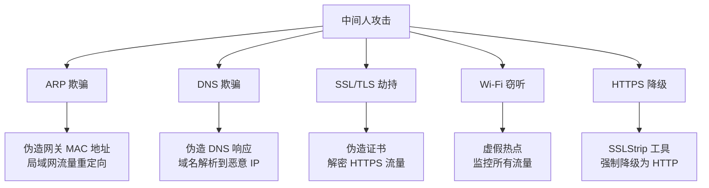

#### 攻击原理详解

**1. ARP 欺骗**

```mermaid
graph LR
    subgraph 正常通信
        A[设备 A] -->|直接通信 | GW[网关]
    end
    
    subgraph ARP 欺骗后
        A2[设备 A] -->|认为攻击者是网关 | Attacker[攻击者]
        Attacker -->|转发并监控 | GW2[网关]
    end
```

**攻击过程**：
1. 攻击者发送伪造的 ARP 响应
2. 受害设备将攻击者 MAC 与网关 IP 关联
3. 所有流量经过攻击者
4. 攻击者可以查看、修改流量

**2. DNS 欺骗**

```mermaid
sequenceDiagram
    participant User as 用户
    participant Attacker as 攻击者
    participant DNS as DNS 服务器
    
    User->>DNS: 查询 example.com
    Attacker->>User: 伪造 DNS 响应 (更快到达)
    Note over Attacker: example.com -> 1.2.3.4 (恶意 IP)
    User->>Attacker: 访问 1.2.3.4 (以为是 example.com)
```

**3. SSL/TLS 劫持**

```mermaid
sequenceDiagram
    participant User as 用户
    participant Attacker as 攻击者
    participant Server as 服务器
    
    User->>Attacker: 请求 https://bank.com
    Attacker->>Server: 建立正常 HTTPS 连接
    Attacker->>User: 返回伪造证书
    Note over Attacker: 证书域名不匹配<br/>或自签名证书
    User->>Attacker: (可能)忽略警告继续
    User->>Attacker: 发送敏感信息
    Attacker->>Attacker: 解密并查看数据
    Attacker->>Server: 转发请求
```

#### 防护技术

**1. 使用 HTTPS 并验证证书**

```python
import requests
from requests.adapters import HTTPAdapter
from urllib3.util.ssl_ import create_urllib3_context

# 创建安全会话
class SecureSession:
    def __init__(self):
        self.session = requests.Session()
        
        # 禁用不安全的协议
        self.session.mount('https://', HTTPAdapter(
            ssl_context=create_urllib3_context(
                ciphers='ECDHE+AESGCM:ECDHE+CHACHA20:DHE+AESGCM',
                options=requests.packages.urllib3.util.ssl_.OP_NO_SSLv2 |
                        requests.packages.urllib3.util.ssl_.OP_NO_SSLv3 |
                        requests.packages.urllib3.util.ssl_.OP_NO_TLSv1 |
                        requests.packages.urllib3.util.ssl_.OP_NO_TLSv1_1
            )
        ))
        
        # 强制验证证书
        self.session.verify = True
    
    def get(self, url):
        return self.session.get(url, timeout=30)

# 使用
secure = SecureSession()
response = secure.get('https://bank.com')
```

**2. HTTP Strict Transport Security (HSTS)**

```python
# 服务器设置 HSTS 头部
@app.after_request
def set_hsts(response):
    # 强制浏览器 1 年内只使用 HTTPS
    response.headers['Strict-Transport-Security'] = \
        'max-age=31536000; includeSubDomains; preload'
    return response
```

**3. 证书绑定 (Certificate Pinning)**

```python
import requests
from requests.adapters import HTTPAdapter

# 证书绑定 - 只接受特定证书
class PinnedAdapter(HTTPAdapter):
    def __init__(self, fingerprint, **kwargs):
        self.fingerprint = fingerprint
        super().__init__(**kwargs)
    
    def cert_verify(self, conn, url, verify, cert):
        super().cert_verify(conn, url, verify=False, cert=cert)
        # 验证证书指纹
        cert_der = conn.sock.getpeercert(binary_form=True)
        import hashlib
        actual_fingerprint = hashlib.sha256(cert_der).hexdigest()
        if actual_fingerprint != self.fingerprint:
            raise Exception("Certificate fingerprint mismatch!")

session = requests.Session()
session.mount('https://', PinnedAdapter(
    fingerprint='expected_sha256_fingerprint_here'
))
```

**4. 使用 VPN**

```python
# VPN 加密所有流量，防止局域网 MITM
# 配置 OpenVPN 或 WireGuard
# 所有流量通过加密隧道传输
```

#### 常见误区

| 误区 | 正确理解 |
|------|----------|
| ❌ "HTTPS 就绝对不会被 MITM" | ✅ 如果用户忽略证书警告，仍可能被攻击 |
| ❌ "公共 Wi-Fi 只是速度慢" | ✅ 公共 Wi-Fi 是 MITM 的高风险环境 |
| ❌ "只有网银需要注意" | ✅ 任何登录会话都可能被劫持 |

#### 最佳实践

1. **始终使用 HTTPS**：确保通信加密
2. **验证证书**：不要忽略浏览器警告
3. **使用 HSTS**：强制 HTTPS 连接
4. **避免公共 Wi-Fi**：或使用 VPN
5. **启用双因素认证**：即使密码泄露也有保护

---

# 第 8 章 现代网络技术

## 8.1 无线网络技术

### 8.1.1 Wi-Fi 标准与演进

#### Wi-Fi 标准对比

| 代际 | 标准 | 名称 | 发布时间 | 频段 | 最大速率 | 关键技术 |
|------|------|------|----------|------|----------|----------|
| 4 | 802.11n | Wi-Fi 4 | 2009 | 2.4/5 GHz | 600 Mbps | MIMO, 40MHz |
| 5 | 802.11ac | Wi-Fi 5 | 2013 | 5 GHz | 6.9 Gbps | 256-QAM, MU-MIMO(下行), 160MHz |
| 6 | 802.11ax | Wi-Fi 6 | 2019 | 2.4/5 GHz | 9.6 Gbps | OFDMA, MU-MIMO(上下行), 1024-QAM |
| 6E | 802.11ax | Wi-Fi 6E | 2020 | 2.4/5/6 GHz | 9.6 Gbps | 新增 6GHz 频段 |
| 7 | 802.11be | Wi-Fi 7 | 2024 | 2.4/5/6 GHz | 40 Gbps | 320MHz, MLO, 4096-QAM |

#### Wi-Fi 6 (802.11ax) 关键技术

**1. OFDMA (正交频分复用多址接入)**

```mermaid
graph TB
    subgraph OFDM (传统)
        OFDM1[整个信道分配给<br/>单个用户]
        OFDM2[时间片轮询<br/>效率低]
    end
    
    subgraph OFDMA (Wi-Fi 6)
        subgraph RU1[资源单元 1]
            U1[用户 1]
        end
        subgraph RU2[资源单元 2]
            U2[用户 2]
        end
        subgraph RU3[资源单元 3]
            U3[用户 3]
        end
        subgraph RU4[资源单元 4]
            U4[用户 4]
        end
    end
    
    Note over OFDMA: 同时服务多个用户<br/>频谱效率提升 4 倍
```

**OFDMA 工作原理**：
- 将信道划分为多个资源单元 (RU, Resource Unit)
- 最小 RU：26 个子载波 (2MHz)
- 最大 RU：996 个子载波 (77.8MHz)
- 同时服务多个用户，降低延迟

**RU 配置**：

| RU 大小 | 子载波数 | 带宽 | 适用场景 |
|---------|----------|------|----------|
| RU26 | 26 | 2 MHz | IoT 设备、语音 |
| RU52 | 52 | 4 MHz | 即时消息 |
| RU106 | 106 | 8 MHz | 网页浏览 |
| RU242 | 242 | 20 MHz | 视频流 |
| RU484 | 484 | 40 MHz | 高清视频 |
| RU996 | 996 | 80 MHz | 4K 视频 |

**2. MU-MIMO (多用户多输入多输出)**

```mermaid
graph LR
    subgraph SU-MIMO (Wi-Fi 5)
        AP1[AP] -->|时间 1| Device1[设备 1]
        AP1 -.->|时间 2| Device2[设备 2]
        AP1 -.->|时间 3| Device3[设备 3]
    end
    
    subgraph MU-MIMO (Wi-Fi 6)
        AP2[AP] -->|同时 | D1[设备 1]
        AP2 -->|同时 | D2[设备 2]
        AP2 -->|同时 | D3[设备 3]
    end
```

**MU-MIMO 对比**：

| 特性 | Wi-Fi 5 (下行) | Wi-Fi 6 (上下行) |
|------|----------------|------------------|
| 方向 | 仅下行 | 上行 + 下行 |
| 最大用户数 | 4 | 8 |
| 天线要求 | 4×4 | 8×8 |

**3. 1024-QAM 调制**

- **QAM (正交幅度调制)**：同时利用载波的幅度和相位传递信息
- **Wi-Fi 5**：256-QAM (每符号 8 bit)
- **Wi-Fi 6**：1024-QAM (每符号 10 bit)
- **速率提升**：(10-8)/8 = 25% 提升

```mermaid
graph LR
    subgraph 256-QAM
        QAM1[256 个状态点<br/>8 bit/符号]
    end
    
    subgraph 1024-QAM
        QAM2[1024 个状态点<br/>10 bit/符号]
    end
    
    QAM1 -.->|密度提升 | QAM2
    Note over QAM2: 需要更高信噪比
```

**4. BSS Coloring (BSS 着色机制)**

```mermaid
graph TB
    AP1[AP 1 - Color 1]
    AP2[AP 2 - Color 2]
    
    Client[客户端收到两个 AP 信号]
    
    AP1 -->|Color=1| Client
    AP2 -->|Color=2| Client
    
    Client -->|判断 | Decision{颜色是否相同？}
    Decision -->|相同 | Wait[等待 (同 BSS)]
    Decision -->|不同 | Transmit[可并发传输 (不同 BSS)]
    
    Note over Transmit: 空间复用提升<br/>高密度场景性能
```

**BSS Coloring 作用**：
- 为每个 BSS (基本服务集) 分配颜色标识 (0-7)
- 客户端收到不同颜色的信号时，可判断为干扰而非自身 BSS
- 允许并发传输，提升高密度场景性能

**5. TWT (目标唤醒时间)**

```mermaid
gantt
    title TWT 调度示例
    dateFormat X
    axisFormat %s
    
    section AP
    TWT 协商 : 0, 100
    服务时间 1 : 200, 250
    服务时间 2 : 500, 550
    服务时间 3 : 800, 850
    
    section IoT 设备 1
    睡眠 : 0, 200
    唤醒传输 : 200, 250
    睡眠 : 250, 500
    唤醒传输 : 500, 550
    睡眠 : 550, 800
    
    section IoT 设备 2
    睡眠 : 0, 500
    唤醒传输 : 500, 550
    睡眠 : 550, 800
    唤醒传输 : 800, 850
```

**TWT 节能原理**：
- AP 与设备协商唤醒时间表
- 设备在约定时间唤醒传输数据
- 其他时间保持睡眠，降低功耗
- 特别适合 IoT 设备

#### Wi-Fi 7 (802.11be) 新技术

**1. 320MHz 信道**
- Wi-Fi 6：最大 160MHz
- Wi-Fi 7：最大 320MHz (6GHz 频段)
- 速率翻倍

**2. MLO (Multi-Link Operation)**

```mermaid
graph LR
    subgraph Wi-Fi 6
        AP1[AP] -->|2.4GHz 或 5GHz<br/>单链路 | Device[设备]
    end
    
    subgraph Wi-Fi 7
        AP2[AP] -->|2.4GHz| Device2[设备]
        AP2 -->|5GHz| Device2
        AP2 -->|6GHz| Device2
        Note over AP2,Device2: 多链路聚合<br/>更低延迟
    end
```

**3. 4096-QAM**
- 每符号 12 bit
- 比 1024-QAM 提升 20%

---

### 8.1.2 5G 关键技术

#### 5G 三大应用场景

```mermaid
graph TB
    5G[5G 应用场景]
    
    5G --> eMBB[eMBB<br/>增强移动宽带]
    5G --> uRLLC[uRLLC<br/>超高可靠低时延]
    5G --> mMTC[mMTC<br/>海量机器类通信]
    
    eMBB --> eMBB_Example[4K/8K 视频<br/>VR/AR<br/>峰值速率 20Gbps]
    uRLLC --> uRLLC_Example[自动驾驶<br/>远程手术<br/>时延<1ms]
    mMTC --> mMTC_Example[物联网<br/>智能城市<br/>100 万设备/km²]
```

#### 5G 核心技术

**1. 大规模 MIMO (Massive MIMO)**

- **原理**：在基站部署数十至数百根天线
- **波束赋形**：将信号定向发送到用户
- **空间复用**：同时服务多个用户
- **增益**：频谱效率提升 5-10 倍

**2. 毫米波 (mmWave)**

| 特性 | Sub-6 GHz | 毫米波 (24-100 GHz) |
|------|-----------|---------------------|
| 覆盖范围 | 广 (数公里) | 小 (数百米) |
| 穿透能力 | 较强 | 弱 (易被遮挡) |
| 带宽 | 有限 | 极宽 (GHz 级) |
| 速率 | <1Gbps | >10Gbps |

**3. 网络切片 (Network Slicing)**

```mermaid
graph TB
    Physical[物理网络基础设施]
    
    subgraph 网络切片层
        Slice1[切片 1: eMBB<br/>视频流]
        Slice2[切片 2: uRLLC<br/>自动驾驶]
        Slice3[切片 3: mMTC<br/>物联网]
    end
    
    Physical --> Slice1
    Physical --> Slice2
    Physical --> Slice3
    
    Note over Slice1: 高带宽<br/>中等时延
    Note over Slice2: 低时延<br/>高可靠
    Note over Slice3: 低功耗<br/>大连接
```

**4. 边缘计算 (MEC)**

- **原理**：将计算和存储资源下沉到网络边缘
- **优势**：降低时延，减轻核心网压力
- **应用**：AR/VR、自动驾驶、工业控制

---

## 8.2 CDN 与负载均衡

### 8.2.1 CDN 工作原理

#### 概念定义

**CDN (Content Delivery Network)** 内容分发网络通过将内容缓存至全球分布的边缘节点，构建分布式网络体系，使用户能够从最近的节点获取内容，降低延迟，提升访问速度。

#### CDN 架构

```mermaid
graph TB
    subgraph 用户层
        User1[用户 1]
        User2[用户 2]
        User3[用户 3]
    end
    
    subgraph 边缘节点层
        Edge1[边缘节点 1<br/>北京]
        Edge2[边缘节点 2<br/>上海]
        Edge3[边缘节点 3<br/>广州]
    end
    
    subgraph 区域中心层
        Regional1[区域中心<br/>华北]
        Regional2[区域中心<br/>华东]
    end
    
    subgraph 源站层
        Origin[源站服务器]
    end
    
    User1 --> Edge1
    User2 --> Edge2
    User3 --> Edge3
    
    Edge1 --> Regional1
    Edge2 --> Regional2
    Edge3 --> Regional2
    
    Regional1 --> Origin
    Regional2 --> Origin
```

#### CDN 工作流程

```mermaid
sequenceDiagram
    participant User as 用户
    participant DNS as 本地 DNS
    participant GSLB as 全局负载均衡
    participant Edge as CDN 边缘节点
    participant Origin as 源站
    
    Note over User,Origin: 1. DNS 解析阶段
    User->>DNS: 请求 www.example.com
    DNS->>GSLB: 查询最优节点
    GSLB->>GSLB: 根据用户 IP、节点负载等<br/>选择最优节点
    GSLB->>DNS: 返回边缘节点 IP
    DNS->>User: 返回边缘节点 IP
    
    Note over User,Origin: 2. 内容获取阶段
    User->>Edge: 请求资源
    alt 缓存命中
        Edge->>User: 直接返回缓存内容
    else 缓存未命中
        Edge->>Origin: 回源请求
        Origin->>Edge: 返回原始内容
        Edge->>Edge: 缓存内容
        Edge->>User: 返回内容
    end
```

#### 智能调度算法

**1. 基于地理位置**

```python
def geo_based_scheduling(user_ip, nodes):
    """基于地理位置的节点选择"""
    user_location = geo_ip_lookup(user_ip)  # IP 地理位置库
    
    best_node = None
    min_distance = float('inf')
    
    for node in nodes:
        distance = haversine_distance(
            user_location,
            node.location
        )
        if distance < min_distance:
            min_distance = distance
            best_node = node
    
    return best_node
```

**2. 基于网络质量**

```python
def network_quality_scheduling(user_ip, nodes):
    """基于网络质量的节点选择"""
    best_node = None
    best_score = 0
    
    for node in nodes:
        # 测量延迟、丢包率、带宽
        latency = measure_latency(user_ip, node.ip)
        packet_loss = measure_packet_loss(user_ip, node.ip)
        bandwidth = measure_bandwidth(user_ip, node.ip)
        
        # 综合评分
        score = (
            100 - latency * 0.5 - 
            packet_loss * 2 + 
            bandwidth * 0.1
        )
        
        if score > best_score:
            best_score = score
            best_node = node
    
    return best_node
```

**3. 基于负载**

```python
def load_based_scheduling(nodes):
    """基于节点负载的选择"""
    available_nodes = [
        node for node in nodes 
        if node.load < node.max_load
        and node.health_status == 'healthy'
    ]
    
    if not available_nodes:
        return None
    
    # 选择负载最低的节点
    return min(available_nodes, key=lambda n: n.load)
```

#### CDN 缓存策略

**多级缓存架构**：

```mermaid
graph LR
    subgraph 边缘节点
        L1[L1 缓存<br/>内存 (热数据)]
        L2[L2 缓存<br/>SSD (温数据)]
        L3[L3 缓存<br/>HDD (冷数据)]
    end
    
    L1 --> L2
    L2 --> L3
    L3 --> Origin[回源]
```

**缓存淘汰策略**：

| 策略 | 原理 | 适用场景 |
|------|------|----------|
| **LRU** | 最近最少使用 | 通用场景 |
| **LFU** | 最不经常使用 | 热点内容稳定 |
| **TTL** | 基于过期时间 | 时效性内容 |

---

### 8.2.2 负载均衡技术

#### 负载均衡算法

| 算法 | 原理 | 优点 | 缺点 | 适用场景 |
|------|------|------|------|----------|
| **轮询 (Round Robin)** | 按顺序分配请求 | 简单、公平 | 不考虑服务器负载 | 服务器性能相近 |
| **加权轮询** | 根据权重分配 | 可适配不同性能 | 权重需手动配置 | 异构服务器集群 |
| **最少连接** | 分配给连接数最少的服务器 | 动态感知负载 | 需要维护连接数 | 长连接场景 |
| **IP Hash** | 根据 IP 哈希分配 | 会话保持 | 可能不均衡 | 需要会话保持 |
| **响应时间** | 分配给响应最快的服务器 | 优化用户体验 | 实现复杂 | 对延迟敏感 |

#### 负载均衡器类型

```mermaid
graph TB
    LB[负载均衡]
    
    LB --> L4[L4 负载均衡<br/>(传输层)]
    LB --> L7[L7 负载均衡<br/>(应用层)]
    
    L4 --> L4_Pro[基于 IP/端口<br/>性能好]
    L4 --> L4_Con[无法感知应用内容]
    
    L7 --> L7_Pro[基于 URL/Cookie<br/>灵活调度]
    L7 --> L7_Con[性能开销较大]
```

#### Nginx 配置示例

```nginx
# L4 负载均衡 (TCP)
stream {
    upstream backend {
        least_conn;  # 最少连接算法
        server 192.168.1.1:8080 weight=3;
        server 192.168.1.2:8080 weight=2;
        server 192.168.1.3:8080 weight=1;
        
        # 健康检查
        check interval=5s falls=3 passes=2;
    }
    
    server {
        listen 80;
        proxy_pass backend;
    }
}

# L7 负载均衡 (HTTP)
http {
    upstream api_backend {
        ip_hash;  # IP 哈希，会话保持
        
        server 192.168.1.10:8080 max_fails=3 fail_timeout=30s;
        server 192.168.1.11:8080 max_fails=3 fail_timeout=30s;
        server 192.168.1.12:8080 max_fails=3 fail_timeout=30s backup;
    }
    
    server {
        listen 80;
        
        location /api/ {
            proxy_pass http://api_backend;
            proxy_connect_timeout 5s;
            proxy_read_timeout 30s;
            
            # 健康检查响应头
            add_header X-Upstream-Server $upstream_addr;
        }
    }
}
```

---

## 8.3 云计算与边缘计算

### 8.3.1 云计算网络架构

#### 云计算网络层次

```mermaid
graph TB
    subgraph 物理网络层
        Switch[物理交换机]
        Router[物理路由器]
        NIC[网卡]
    end
    
    subgraph 虚拟化层
        vSwitch[虚拟交换机]
        vRouter[虚拟路由器]
        VXLAN[VXLAN 隧道]
    end
    
    subgraph 虚拟网络层
        VPC[虚拟私有云 VPC]
        Subnet[子网]
        SG[安全组]
        ACL[网络 ACL]
    end
    
    subgraph 服务层
        ELB[负载均衡]
        NAT[NAT 网关]
        VPN[VPN 网关]
    end
    
    Physical --> Virtualization
    Virtualization --> VirtualNetwork
    VirtualNetwork --> Service
```

#### VPC (虚拟私有云)

```mermaid
graph TB
    subgraph VPC
        subnet1[子网 1<br/>10.0.1.0/24]
        subnet2[子网 2<br/>10.0.2.0/24]
        subnet3[子网 3<br/>10.0.3.0/24 (DMZ)]
        
        RT[路由表]
        IGW[互联网网关]
        NGW[NAT 网关]
    end
    
    subnet1 --> RT
    subnet2 --> RT
    subnet3 --> RT
    
    RT --> IGW
    subnet1 --> NGW
    subnet2 --> NGW
    
    IGW --> Internet[互联网]
    NGW --> Internet
```

#### SDN (软件定义网络)

```mermaid
graph TB
    subgraph 应用层
        App1[网络应用 1]
        App2[网络应用 2]
    end
    
    subgraph 控制层
        Controller[SDN 控制器<br/>集中控制]
    end
    
    subgraph 数据层
        Switch1[交换机 1]
        Switch2[交换机 2]
        Switch3[交换机 3]
    end
    
    App1 -->|北向 API| Controller
    App2 -->|北向 API| Controller
    
    Controller -->|南向 API (OpenFlow)| Switch1
    Controller -->|南向 API (OpenFlow)| Switch2
    Controller -->|南向 API (OpenFlow)| Switch3
    
    Switch1 -.->|数据转发 | Switch2
    Switch2 -.->|数据转发 | Switch3
```

**SDN 核心特性**：
1. **控制面与数据面分离**：集中控制，分布转发
2. **可编程性**：通过 API 控制网络行为
3. **网络虚拟化**：逻辑网络与物理网络解耦

---

### 8.3.2 边缘计算

#### 边缘计算架构

```mermaid
graph TB
    subgraph 云端
        Cloud[云计算中心<br/>集中式处理]
    end
    
    subgraph 边缘层
        Edge1[边缘节点 1]
        Edge2[边缘节点 2]
        Edge3[边缘节点 3]
    end
    
    subgraph 设备层
        Device1[IoT 设备 1]
        Device2[IoT 设备 2]
        Device3[IoT 设备 3]
    end
    
    Device1 --> Edge1
    Device2 --> Edge1
    Device3 --> Edge2
    
    Edge1 -->|数据聚合 | Cloud
    Edge2 -->|数据聚合 | Cloud
    Edge3 -->|数据聚合 | Cloud
```

#### 云边协同

| 特性 | 云计算 | 边缘计算 |
|------|--------|----------|
| **位置** | 集中式数据中心 | 靠近数据源 |
| **延迟** | 高 (100ms+) | 低 (<10ms) |
| **带宽** | 消耗大 | 节省带宽 |
| **处理能力** | 强大 | 有限 |
| **适用场景** | 大数据分析、训练 | 实时处理、推理 |

---

## 8.4 物联网网络架构

### 8.4.1 IoT 协议栈

```mermaid
graph TB
    subgraph 应用层
        MQTT[MQTT]
        CoAP[CoAP]
        HTTP[HTTP/HTTPS]
        AMQP[AMQP]
    end
    
    subgraph 传输层
        TCP[TCP]
        UDP[UDP]
        DTLS[DTLS]
    end
    
    subgraph 网络层
        IPv4[IPv4]
        IPv6[IPv6]
        IPv6LoWPAN[6LoWPAN]
    end
    
    subgraph 链路层
        WiFi[Wi-Fi]
        Zigbee[Zigbee]
        BLE[蓝牙 LE]
        LoRa[LoRaWAN]
    end
    
    subgraph 物理层
        PHY1[2.4GHz]
        PHY2[Sub-1GHz]
        PHY3[蜂窝]
    end
    
    应用层 --> 传输层
    传输层 --> 网络层
    网络层 --> 链路层
    链路层 --> 物理层
```

### 8.4.2 MQTT 协议

#### 概念定义

**MQTT (Message Queuing Telemetry Transport)** 是一种轻量级、发布/订阅模式的消息传输协议，专为低带宽、高延迟或不稳定网络环境设计。

#### 工作原理

```mermaid
graph TB
    subgraph 发布者
        Publisher1[发布者 1<br/>传感器]
        Publisher2[发布者 2<br/>设备]
    end
    
    subgraph Broker
        Broker[MQTT Broker<br/>消息代理]
        Topics[(主题队列)]
    end
    
    subgraph 订阅者
        Subscriber1[订阅者 1<br/>云端]
        Subscriber2[订阅者 2<br/>应用]
    end
    
    Publisher1 -->|发布 | Topics
    Publisher2 -->|发布 | Topics
    
    Topics --> Broker
    Broker -->|推送 | Subscriber1
    Broker -->|推送 | Subscriber2
```

**MQTT 消息结构**：

```
MQTT 报文格式：
┌─────────────────────────────────────┐
│ 固定报头 (Fixed Header)             │
│ - 报文类型 (CONNECT, PUBLISH 等)    │
│ - 标志位                            │
│ - 剩余长度                          │
├─────────────────────────────────────┤
│ 可变报头 (Variable Header)          │
│ - 主题名长度                        │
│ - 主题名                            │
│ - 报文 ID (QoS 1/2 时)              │
├─────────────────────────────────────┤
│ 载荷 (Payload)                      │
│ - 消息内容                          │
└─────────────────────────────────────┘
```

**QoS 等级**：

| QoS | 名称 | 保证 | 开销 | 适用场景 |
|-----|------|------|------|----------|
| 0 | At most once | 最多一次 | 最低 | 传感器数据 (可丢失) |
| 1 | At least once | 至少一次 | 中等 | 控制命令 |
| 2 | Exactly once | 仅一次 | 最高 | 金融交易 |

#### 代码示例

```python
import paho.mqtt.client as mqtt
import json

# MQTT 客户端配置
class MQTTClient:
    def __init__(self, broker_host, broker_port, client_id):
        self.client = mqtt.Client(
            client_id=client_id,
            protocol=mqtt.MQTTv5
        )
        self.client.on_connect = self.on_connect
        self.client.on_message = self.on_message
        
        # 设置认证
        self.client.username_pw_set("username", "password")
        
        # 设置遗嘱消息
        self.client.will_set(
            topic="devices/status",
            payload=json.dumps({"status": "offline"}),
            qos=1,
            retain=True
        )
        
        self.broker_host = broker_host
        self.broker_port = broker_port
    
    def on_connect(self, client, userdata, flags, rc, properties=None):
        """连接回调"""
        if rc == 0:
            print("✅ 连接成功")
            # 订阅主题
            self.client.subscribe("devices/commands", qos=1)
        else:
            print(f"❌ 连接失败，错误码：{rc}")
    
    def on_message(self, client, userdata, msg):
        """消息接收回调"""
        print(f"收到消息：{msg.topic} - {msg.payload}")
    
    def publish(self, topic, payload, qos=1):
        """发布消息"""
        self.client.publish(topic, json.dumps(payload), qos=qos)
    
    def connect(self):
        """连接 Broker"""
        self.client.connect(self.broker_host, self.broker_port, keepalive=60)
    
    def loop_start(self):
        """启动后台循环"""
        self.client.loop_start()

# 使用示例
client = MQTTClient("broker.emqx.io", 1883, "device_001")
client.connect()
client.loop_start()

# 发布传感器数据
client.publish("sensors/temperature", {
    "device_id": "device_001",
    "temperature": 25.5,
    "humidity": 60,
    "timestamp": 1234567890
}, qos=1)
```

---

### 8.4.3 CoAP 协议

#### 概念定义

**CoAP (Constrained Application Protocol)** 是一种专为资源受限设备设计的应用层协议，基于 UDP，模仿 HTTP 的 RESTful 模型。

#### CoAP vs MQTT

| 特性 | CoAP | MQTT |
|------|------|------|
| **传输层** | UDP | TCP |
| **模式** | 请求/响应 | 发布/订阅 |
| **头部开销** | 4 字节 | 最小 2 字节 |
| **多播支持** | 支持 | 不支持 |
| **消息确认** | Confirmable/Non-confirmable | QoS 0/1/2 |
| **资源发现** | 支持 (/.well-known/core) | 不支持 |

#### CoAP 消息格式

```
CoAP 报文格式 (最小 4 字节)：
┌─────────────────────────────────┐
│ Ver (2) | T (2) | TKL (4)       │
│ Code (8)                        │
│ Message ID (16)                 │
│ Token (0-8 bytes)               │
│ Options (Variable)              │
│ Payload Marker (0xFF)           │
│ Payload (Variable)              │
└─────────────────────────────────┘

Ver: 版本 (当前为 1)
T: 消息类型
  - 00: Confirmable (需要确认)
  - 01: Non-confirmable (无需确认)
  - 10: Acknowledgement (确认)
  - 11: Reset (重置)
Code: 请求/响应码
  - 0.00: Empty
  - 0.01-0.31: 请求方法 (GET, POST, PUT, DELETE)
  - 2.xx-5.xx: 响应码
```

#### 代码示例

```python
import asyncio
import aiocoap
from aiocoap import Message, Context, resource

# CoAP 服务器
class TemperatureResource(resource.Resource):
    """温度传感器资源"""
    
    def __init__(self):
        super().__init__()
        self.temperature = 25.5
    
    async def render_get(self, request):
        """处理 GET 请求"""
        return Message(
            code=aiocoap.Code.CONTENT,
            payload=json.dumps({
                "temperature": self.temperature
            }).encode()
        )
    
    async def render_put(self, request):
        """处理 PUT 请求 (更新温度)"""
        data = json.loads(request.payload)
        self.temperature = data.get("temperature", self.temperature)
        return Message(code=aiocoap.Code.CHANGED)

async def main():
    # 创建资源树
    root = resource.Site()
    root.add_resource(["temperature"], TemperatureResource())
    
    # 启动服务器
    context = await Context.create_local_context()
    context.add_server_site(root)
    
    print("CoAP 服务器启动，监听端口 5683")
    await asyncio.Future()

if __name__ == "__main__":
    asyncio.run(main())

# CoAP 客户端示例
async def coap_client():
    protocol = await Context.create_client_context()
    
    # GET 请求
    request = Message(code=aiocoap.Code.GET)
    response = await protocol.request(
        request,
        uri="coap://localhost/temperature"
    ).response
    print(f"温度：{response.payload}")

```

---

### 8.4.4 LPWAN 技术

#### LPWAN 技术对比

```mermaid
graph TB
    LPWAN[LPWAN 低功耗广域网]
    
    LPWAN --> Licensed[授权频谱]
    LPWAN --> Unlicensed[非授权频谱]
    
    Licensed --> NB_IoT[NB-IoT<br/>蜂窝物联网]
    Licensed --> LTE_M[LTE-M<br/>Cat-M1]
    
    Unlicensed --> LoRa[LoRaWAN]
    Unlicensed --> Sigfox[Sigfox]
```

| 技术 | 频谱 | 覆盖范围 | 速率 | 功耗 | 成本 |
|------|------|----------|------|------|------|
| **NB-IoT** | 授权 | 城市级 | ~250 kbps | 低 | 中 |
| **LTE-M** | 授权 | 城市级 | ~1 Mbps | 中 | 中 |
| **LoRaWAN** | 非授权 | 10-15km | 0.3-50 kbps | 极低 | 低 |
| **Sigfox** | 非授权 | 10-40km | 100 bps | 极低 | 低 |

#### NB-IoT 技术特点

**优势**：
- **深度覆盖**：比 GSM 增强 20dB，可覆盖地下室
- **低功耗**：电池寿命可达 10 年
- **大连接**：单小区支持 5 万设备
- **低成本**：模块成本低于 5 美元

**应用场景**：
- 智能抄表（水、电、气）
- 智能停车
- 资产追踪
- 环境监测

#### LoRaWAN 架构

```mermaid
graph TB
    subgraph 终端设备
        Device1[LoRa 设备 1]
        Device2[LoRa 设备 2]
    end
    
    subgraph 网关层
        Gateway1[LoRaWAN 网关 1]
        Gateway2[LoRaWAN 网关 2]
    end
    
    subgraph 网络层
        NS[网络服务器 NS]
    end
    
    subgraph 应用层
        AS[应用服务器 AS]
    end
    
    Device1 -->|LoRa 无线 | Gateway1
    Device2 -->|LoRa 无线 | Gateway1
    Device2 -->|LoRa 无线 | Gateway2
    
    Gateway1 -->|IP 回传 | NS
    Gateway2 -->|IP 回传 | NS
    
    NS --> AS
```

---

## 引用来源

1. 对称加密原理 - CSDN: https://blog.csdn.net/xiayan827/article/details/146352704
2. 非对称加密与混合加密 - 腾讯云: https://cloud.tencent.com/developer/article/2605313
3. CA 证书与 PKI - 阿里云: https://developer.aliyun.com/article/1551287
4. 防火墙与 IDS/IPS - 腾讯云: https://cloud.tencent.com/developer/article/2616827
5. DDoS 攻击与防护 - 百度智能云: https://cloud.baidu.com/article/3713529
6. XSS 与 CSRF 攻击 - CSDN: https://blog.csdn.net/wananxuexihu/article/details/156985643
7. 中间人攻击 - 百度百科: https://baike.baidu.com/item/MITMA/1716845
8. Wi-Fi 6 技术详解 - 锐捷网络: https://ruijie.com.cn/jszl/81858/
9. CDN 技术原理 - 百度智能云: https://cloud.baidu.com/article/4170830
10. 云计算网络架构 - 百度百科: https://baike.baidu.com/item/云计算网络/4223845
11. MQTT 协议详解 - 腾讯云: https://cloud.tencent.com/developer/article/2385360
12. 物联网通信协议 - 华为云: https://bbs.huaweicloud.com/blogs/303403

---

*文档结束*
