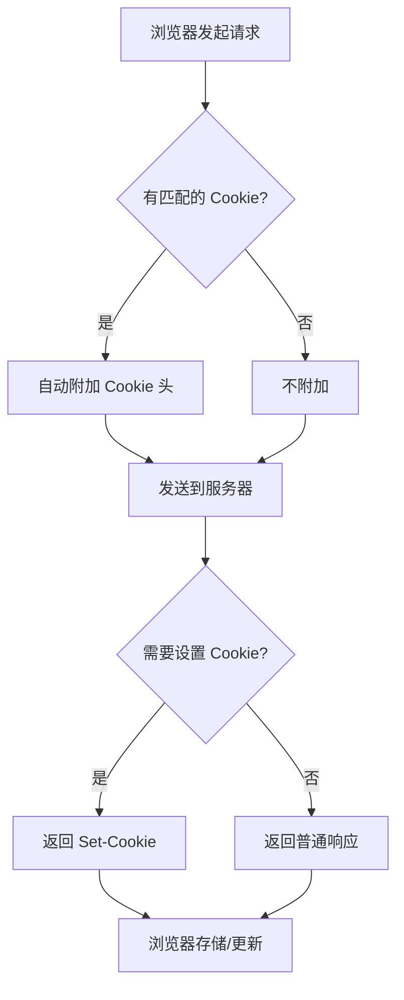
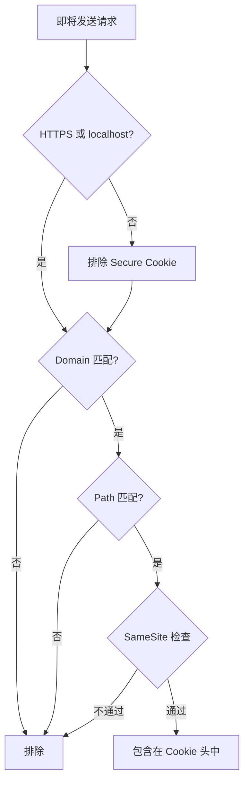
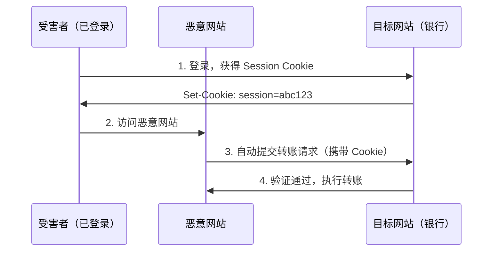
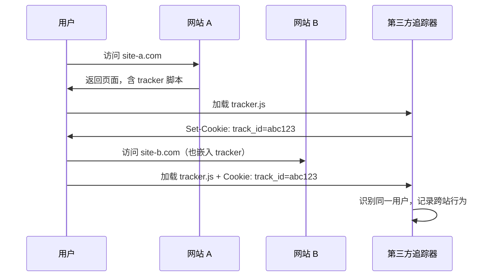
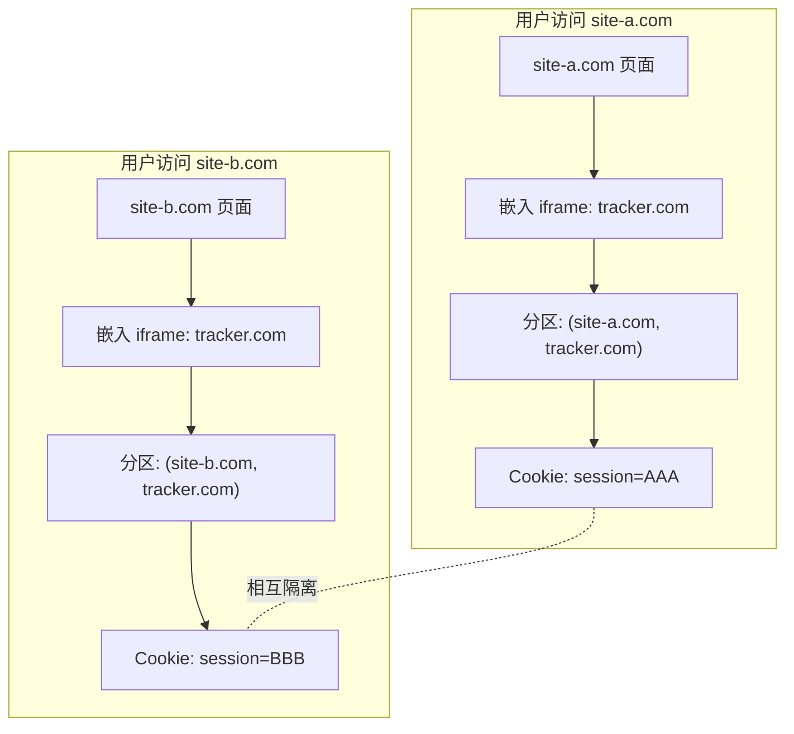
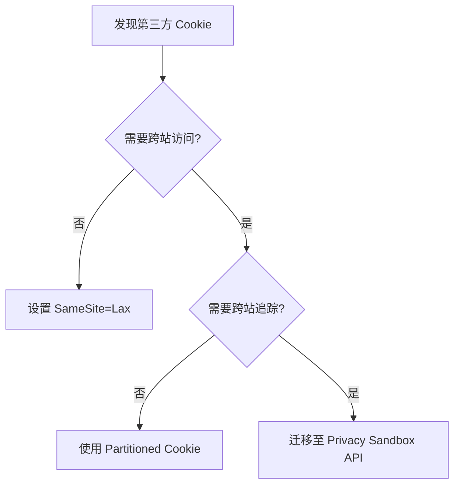

# Cookie 核心知识体系

> **版本：** v1.0 | **创建日期：** 2026-04-09
> **调研来源：** MDN Web Docs、RFC 6265、RFC 6265bis、Google Privacy Sandbox、OWASP、Apple Safari、Mozilla Firefox 等 20+ 来源

---

## 目录

- [第 1 章：基础认知](#第-1-章基础认知)
  - [1.1 Cookie 的定义与本质](#11-cookie-的定义与本质)
  - [1.2 历史演进](#12-历史演进)
  - [1.3 Cookie vs Session vs localStorage vs sessionStorage](#13-cookie-vs-session-vs-localstorage-vs-sessionstorage)
  - [1.4 Cookie 的核心应用场景](#14-cookie-的核心应用场景)
- [第 2 章：核心属性与 API](#第-2-章核心属性与-api)
  - [2.1 Set-Cookie 响应头](#21-set-cookie-响应头)
  - [2.2 Cookie 请求头](#22-cookie-请求头)
  - [2.3 属性详解](#23-属性详解)
  - [2.4 document.cookie API](#24-documentcookie-api)
  - [2.5 服务端设置示例](#25-服务端设置示例)
  - [2.6 常用库：js-cookie](#26-常用库js-cookie)
- [第 3 章：工作流程与作用域](#第-3-章工作流程与作用域)
  - [3.1 完整的请求/响应流程](#31-完整的请求响应流程)
  - [3.2 同源策略与 Cookie 的关系](#32-同源策略与-cookie-的关系)
  - [3.3 跨子域共享](#33-跨子域共享)
  - [3.4 Path 属性的作用域限制](#34-path-属性的作用域限制)
  - [3.5 Cookie 的可见性规则](#35-cookie-的可见性规则)
  - [3.6 第一方 Cookie vs 第三方 Cookie](#36-第一方-cookie-vs-第三方-cookie)
- [第 4 章：安全机制](#第-4-章安全机制)
  - [4.1 HttpOnly 详解](#41-httponly-详解)
  - [4.2 Secure 详解](#42-secure-详解)
  - [4.3 SameSite 详解](#43-samesite-详解)
  - [4.4 CSRF 攻击原理与 Cookie 防御](#44-csrf-攻击原理与-cookie-防御)
  - [4.5 Cookie 前缀保护](#45-cookie-前缀保护)
  - [4.6 Cookie 安全最佳实践清单](#46-cookie-安全最佳实践清单)
- [第 5 章：第三方 Cookie 与隐私](#第-5-章第三方-cookie-与隐私)
  - [5.1 第三方 Cookie 的定义与工作机制](#51-第三方-cookie-的定义与工作机制)
  - [5.2 第三方 Cookie 的正当用途](#52-第三方-cookie-的正当用途)
  - [5.3 隐私风险：跨站追踪与用户画像](#53-隐私风险跨站追踪与用户画像)
  - [5.4 Chrome 3PCD 计划与时间线](#54-chrome-3pcd-计划与时间线)
  - [5.5 Privacy Sandbox 替代方案](#55-privacy-sandbox-替代方案)
  - [5.6 Firefox ETP 机制](#56-firefox-etp-机制)
  - [5.7 Safari ITP 机制](#57-safari-itp-机制)
  - [5.8 GDPR 与 Cookie 同意弹窗合规](#58-gdpr-与-cookie-同意弹窗合规)
- [第 6 章：CHIPS 分区 Cookie](#第-6-章chips-分区-cookie)
  - [6.1 CHIPS 概述](#61-chips-概述)
  - [6.2 Partitioned 属性详解](#62-partitioned-属性详解)
  - [6.3 与 SameSite=None 的关系和区别](#63-与-samesitenone-的关系和区别)
  - [6.4 Top-Level Site 概念与分区机制](#64-top-level-site-概念与分区机制)
  - [6.5 使用场景](#65-使用场景)
  - [6.6 浏览器兼容性](#66-浏览器兼容性)
  - [6.7 与 Privacy Sandbox 的关系](#67-与-privacy-sandbox-的关系)
  - [6.8 前端开发者的迁移指南](#68-前端开发者的迁移指南)
- [第 7 章：实战应用](#第-7-章实战应用)
  - [7.1 登录态管理](#71-登录态管理)
  - [7.2 多语言与主题偏好](#72-多语言与主题偏好)
  - [7.3 购物车与临时状态](#73-购物车与临时状态)
  - [7.4 CSRF Token 双重提交防御](#74-csrf-token-双重提交防御)
  - [7.5 A/B 测试追踪](#75-ab-测试追踪)
  - [7.6 Nginx 反向代理 Cookie 配置](#76-nginx-反向代理-cookie-配置)
  - [7.7 跨域 Cookie 配置](#77-跨域-cookie-配置)
  - [7.8 移动端 WebView Cookie 同步](#78-移动端-webview-cookie-同步)
- [第 8 章：常见误区与面试问题](#第-8-章常见误区与面试问题)
  - [8.1 常见误区](#81-常见误区)
  - [8.2 面试高频题（初级）](#82-面试高频题初级)
  - [8.3 面试高频题（中级）](#83-面试高频题中级)
  - [8.4 面试高频题（高级）](#84-面试高频题高级)

---

## 第 1 章：基础认知

### 1.1 Cookie 的定义与本质

**定义**：Cookie（也称 web cookie 或 browser cookie）是服务器发送给用户浏览器的一小段数据。浏览器可以选择存储它，并在后续对同一服务器的请求中将其发送回去。通过这种方式，Cookie 使无状态的 HTTP 协议能够维持有状态的会话。

**本质**：HTTP 协议本身是**无状态协议**（stateless protocol），即每个请求之间相互独立，服务器无法判断两个请求是否来自同一用户。Cookie 是 HTTP 协议的一部分（定义于 RFC 6265），作为对无状态协议的**有状态补充机制**而存在。

**核心工作机制**：
1. 服务器通过 `Set-Cookie` 响应头向浏览器发送键值对数据
2. 浏览器存储这些数据，并在后续请求中通过 `Cookie` 请求头自动回传
3. 服务器通过 Cookie 内容识别用户身份、维持会话状态

**关键约束**：
- 每个 Cookie 最大 **4KB**（RFC 6265 规定）
- 每个域名下的 Cookie 数量有限（浏览器通常限制在数百个，Chrome 为 180 个）
- Cookie 会**随每次请求自动发送**到匹配的服务器，影响网络性能

**信息来源**：
- MDN: https://developer.mozilla.org/en-US/docs/Web/HTTP/Cookies
- RFC 6265 Section 1: https://datatracker.ietf.org/doc/html/rfc6265#section-1

---

### 1.2 历史演进

Cookie 的标准化历程反映了 Web 安全与隐私意识的不断提升：

| 时间 | 规范 | 核心贡献 |
|------|------|----------|
| **1994 年** | Netscape Cookie 规范 | Lou Montulli（网景公司第 9 号工程师）发明了 Cookie，解决了 HTTP 无状态的问题。1994 年 10 月 Netscape Navigator 率先支持，1995 年 10 月 IE2 跟进 |
| **1997 年** | RFC 2109 | 首个 IETF 标准，正式定义了 Cookie 机制，引入 `Path`、`Domain`、`Secure` 等属性 |
| **2000 年** | RFC 2965 | 修订版，引入 `Set-Cookie2` 和 `Cookie2` 头（与 `Set-Cookie` 不兼容）。由于浏览器兼容性问题，从未被广泛实现 |
| **2011 年** | **RFC 6265** | **现行标准**，由 Adam Barth 编写。统一了混乱的实现，废弃 RFC 2109 和 RFC 2965。删除了 `Set-Cookie2`，只保留 `Set-Cookie` |
| **2016-2026** | **RFC 6265bis** | 增量更新草案。主要新增：`SameSite` 属性标准化（默认 Lax）、`__Secure-`/`__Host-` Cookie 前缀、`Partitioned` 属性（CHIPS） |

**演进驱动因素**：
1. **安全需求**：XSS、CSRF 攻击促使引入 `HttpOnly`、`SameSite`、`Secure` 等属性
2. **隐私保护**：第三方追踪催生 SameSite 默认值变更、CHIPS 分区存储
3. **实现统一**：各浏览器对早期规范的差异化实现需要通过标准来收敛

**信息来源**：
- RFC 6265bis draft-22: https://datatracker.ietf.org/doc/html/draft-ietf-httpbis-rfc6265bis
- Google CHIPS: https://developers.google.com/privacy-sandbox/3pcd/chips

---

### 1.3 Cookie vs Session vs localStorage vs sessionStorage

| 特性 | Cookie | Session | localStorage | sessionStorage |
|------|--------|---------|--------------|----------------|
| **存储位置** | 客户端（浏览器） | 服务端（内存/数据库/Redis） | 客户端（浏览器） | 客户端（浏览器） |
| **容量限制** | 每个 ~4KB，每域名数百个 | 取决于服务端存储 | 通常 5-10 MB | 通常 5-10 MB |
| **生命周期** | 可设置过期时间或会话级 | 服务端控制（通常 20-30 分钟超时） | 持久化，除非手动删除 | 关闭标签页/窗口即清除 |
| **是否自动发送** | **是**，每次匹配请求自动携带 | 否（Session ID 通常通过 Cookie 传递） | 否 | 否 |
| **跨域能力** | 通过 `Domain` 属性可跨子域 | 不支持 | 同源策略限制 | 同源策略限制 |
| **安全性** | 中等（需配合 `HttpOnly`、`Secure`、`SameSite`） | 高（数据在服务端） | 低（可被 XSS 读取） | 低（可被 XSS 读取） |
| **访问方式** | `document.cookie` / HTTP 头 | 服务端 API | `localStorage.getItem()` | `sessionStorage.getItem()` |
| **主要用途** | 会话标识、认证令牌 | 敏感会话数据 | 用户偏好、缓存数据 | 表单草稿、临时状态 |

**选型指南**：
1. **需要服务端识别用户身份**：Cookie + Session（Cookie 存 Session ID）
2. **仅客户端需要的持久化数据**：localStorage（如主题偏好）
3. **临时页面状态**：sessionStorage（如多步表单）
4. **认证令牌**：优先使用 HttpOnly + Secure Cookie 存储 JWT/Session ID

**实战示例：合理组合使用**

```javascript
// 1. 认证：通过 HttpOnly Cookie 传递 Session ID 或 JWT（服务端设置）
//    Set-Cookie: session_id=abc123; HttpOnly; Secure; SameSite=Strict; Path=/

// 2. 用户偏好：localStorage（不敏感，不需要发送到服务端）
localStorage.setItem('theme', 'dark');

// 3. 临时表单草稿：sessionStorage（关闭标签即清除）
sessionStorage.setItem('form_draft', JSON.stringify({ name: '...' }));
```

---

### 1.4 Cookie 的核心应用场景

#### 场景一：会话管理（Session Management）

```http
# 登录响应
HTTP/1.1 200 OK
Set-Cookie: session_id=abc123def456; Path=/; HttpOnly; Secure; SameSite=Strict

# 后续请求（浏览器自动携带）
GET /dashboard HTTP/1.1
Host: example.com
Cookie: session_id=abc123def456
```

#### 场景二：个性化（Personalization）

```javascript
document.cookie = `theme=dark; path=/; max-age=${365 * 24 * 60 * 60}`;
```

#### 场景三：追踪与分析（Tracking）

- **第一方追踪**：网站自身分析用户行为
- **第三方追踪**：跨站广告网络通过嵌入内容设置 Cookie，实现跨站用户画像

#### 场景四：安全防护

CSRF Token 通常通过 Cookie 传递：`Set-Cookie: csrf_token=xYz789; Path=/; SameSite=Strict`

---

## 第 2 章：核心属性与 API

### 2.1 Set-Cookie 响应头

`Set-Cookie` 是 HTTP 响应头，用于服务器指示浏览器存储 Cookie。一个响应可以包含多个 `Set-Cookie` 头。

**基本语法**：`Set-Cookie: <cookie-name>=<cookie-value>[; <attribute>=<value>]*`

**完整示例**：
```http
Set-Cookie: session_id=abc123; Path=/; Domain=.example.com; Expires=Wed, 09 Jun 2026 10:18:14 GMT; Max-Age=31536000; Secure; HttpOnly; SameSite=Strict
```

| 字段 | 是否必需 | 说明 |
|------|----------|------|
| `<cookie-name>=<cookie-value>` | 必需 | Cookie 的名称和值 |
| `Domain` | 可选 | 指定哪些主机可以接收此 Cookie |
| `Path` | 可选 | 指定哪些路径可以接收此 Cookie |
| `Expires` | 可选 | 绝对过期时间（HTTP-date 格式） |
| `Max-Age` | 可选 | 相对过期时间（秒数），优先于 Expires |
| `Secure` | 可选 | 仅通过 HTTPS 发送 |
| `HttpOnly` | 可选 | 禁止 JavaScript 访问 |
| `SameSite` | 可选 | 控制跨站请求发送（Strict/Lax/None） |
| `Partitioned` | 可选 | 使用分区存储（CHIPS） |

**注意事项**：
- Cookie 名称不能包含控制字符或分隔符（空格、逗号、分号等）
- 多字节字符建议使用 percent-encoding（`encodeURIComponent`）

**信息来源**：
- MDN: https://developer.mozilla.org/en-US/docs/Web/HTTP/Headers/Set-Cookie
- RFC 6265 Section 4.1: https://datatracker.ietf.org/doc/html/rfc6265#section-4.1

---

### 2.2 Cookie 请求头

`Cookie` 是 HTTP 请求头，浏览器自动将匹配的 Cookie 发送给服务器。

**语法**：`Cookie: <cookie-name>=<cookie-value>[; <cookie-name>=<cookie-value>]*`

**示例**：
```http
GET /api/user HTTP/1.1
Host: example.com
Cookie: session_id=abc123; theme=dark; language=zh-CN
```

**关键特性**：
- 多个 Cookie 用 `; `（分号+空格）分隔
- 仅包含名称和值，**不包含任何属性**
- 前端代码**无法**通过 `fetch()` 手动设置 `Cookie` 请求头

---

### 2.3 属性详解

#### 2.3.1 Domain（域）

- **不指定**：Cookie 仅发送给设置它的**确切主机**（host-only cookie）
- **指定为 `.example.com`**：Cookie 发送给 `example.com` 及其所有子域名
- 前导点（`.example.com`）在现代浏览器中**被忽略**，`example.com` 和 `.example.com` 效果相同
- 不能设置为公共后缀（如 `.com`）

```http
# 让所有子域名共享的认证 Cookie
Set-Cookie: session_id=abc123; Domain=.example.com; Path=/; Secure; HttpOnly
```

#### 2.3.2 Path（路径）

- **不指定**：默认为设置 Cookie 的请求 URL 的路径
- `Path=/docs` 匹配：`/docs`、`/docs/`、`/docs/Web/`
- `Path=/docs` 不匹配：`/`、`/docsets`、`/fr/docs`
- Path 不是安全机制

#### 2.3.3 Expires / Max-Age

| 属性 | 类型 | 说明 |
|------|------|------|
| `Expires` | 绝对时间 | `Wed, 09 Jun 2026 10:18:14 GMT` |
| `Max-Age` | 相对秒数 | `31536000`（1 年），优先于 Expires |

- 不指定时，Cookie 为**会话 Cookie**，浏览器关闭时删除
- `Max-Age=0` 或负数：立即过期（用于删除 Cookie）
- **最佳实践**：优先使用 `Max-Age` 而非 `Expires`

#### 2.3.4 Secure

- Cookie 仅通过 HTTPS 连接发送（localhost 除外）
- HTTP 站点**无法**设置 `Secure` Cookie

#### 2.3.5 HttpOnly

- 禁止 JavaScript（如 `document.cookie`）访问此 Cookie
- 有效缓解 XSS 攻击中 Cookie 被窃取的风险
- 仍会随 `fetch`/`XMLHttpRequest` 请求自动发送

#### 2.3.6 SameSite

| 值 | 行为 | 适用场景 |
|----|------|----------|
| **Strict** | 仅同站请求发送 | 敏感操作 Cookie |
| **Lax** | 同站请求 + 跨站顶级导航 GET | 大多数 Cookie 的默认值 |
| **None** | 所有请求都发送（**必须**配合 `Secure`） | 第三方嵌入内容 |

- 不指定时，现代浏览器默认视为 `Lax`
- `SameSite=None` 必须配合 `Secure`，否则 Cookie 被拒绝

#### 2.3.7 Partitioned（分区存储 - CHIPS）

- 必须同时设置 `Secure` 和 `SameSite=None`
- 必须设置 `Path=/`
- 通常使用 `__Host-` 前缀

```http
Set-Cookie: __Host-embed_session=abc123; Secure; Path=/; SameSite=None; Partitioned
```

**来源**：https://developers.google.com/privacy-sandbox/3pcd/chips

---

### 2.4 document.cookie API

#### 2.4.1 读取 Cookie

```javascript
// 读取当前页面可见的所有 Cookie
console.log(document.cookie);
// => "session_id=abc123; theme=dark"

// 解析为对象
function getCookies() {
  return document.cookie.split('; ').reduce((acc, cookie) => {
    const [name, ...valueParts] = cookie.split('=');
    acc[name] = decodeURIComponent(valueParts.join('='));
    return acc;
  }, {});
}

// 获取单个 Cookie
function getCookie(name) {
  const match = document.cookie.match(new RegExp('(^|;\\s*)' + name + '=([^;]*)'));
  return match ? decodeURIComponent(match[2]) : null;
}
```

**注意**：`HttpOnly` Cookie **不会**出现在 `document.cookie` 中。

#### 2.4.2 设置 Cookie

```javascript
// 基本设置（会话 Cookie）
document.cookie = 'theme=dark';

// 带过期时间
document.cookie = `theme=dark; max-age=${365 * 24 * 60 * 60}; path=/`;

// 含特殊字符的值（必须编码）
document.cookie = `name=${encodeURIComponent('张三')}; path=/`;
```

#### 2.4.3 删除 Cookie

```javascript
// 设置 Max-Age=0
document.cookie = `name=; max-age=0; path=/`;

// 注意：删除时必须匹配原始 Cookie 的 path 和 domain
```

**来源**：MDN: https://developer.mozilla.org/en-US/docs/Web/API/Document/cookie

---

### 2.5 服务端设置示例

#### Express.js

```javascript
app.post('/login', (req, res) => {
  res.cookie('session_id', 'abc123', {
    httpOnly: true,
    secure: true,
    sameSite: 'strict',
    path: '/',
    maxAge: 24 * 60 * 60 * 1000
  });
  res.json({ success: true });
});

app.post('/logout', (req, res) => {
  res.clearCookie('session_id', { path: '/' });
  res.json({ success: true });
});
```

#### Spring Boot

```java
@PostMapping("/login")
public ResponseEntity<String> login(HttpServletResponse response) {
    Cookie cookie = new Cookie("session_id", "abc123");
    cookie.setHttpOnly(true);
    cookie.setSecure(true);
    cookie.setPath("/");
    cookie.setMaxAge(24 * 60 * 60);
    response.addCookie(cookie);
    return ResponseEntity.ok("Login successful");
}
```

#### Nginx

```nginx
location / {
    proxy_pass http://backend:8080;
    proxy_cookie_flags ~ secure httponly samesite=strict;
}
```

---

### 2.6 常用库：js-cookie

[js-cookie](https://github.com/js-cookie/js-cookie) 是最流行的前端 Cookie 操作库（<800 bytes gzipped），RFC 6265 兼容。

```javascript
import Cookies from 'js-cookie';

// 设置
Cookies.set('name', 'value', { expires: 7, path: '/' });

// 读取
Cookies.get('name');

// 删除
Cookies.remove('name');

// 带完整属性
Cookies.set('session', 'abc', {
  expires: 7,
  secure: true,
  sameSite: 'strict'
});
```

**为什么使用 js-cookie**：简化操作、自动编码、支持 Date/天数过期、跨浏览器兼容。

---

## 第 3 章：工作流程与作用域

### 3.1 完整的请求/响应流程

```mermaid
sequenceDiagram
    participant User as 用户浏览器
    participant Server as Web 服务器

    Note over User,Server: 阶段一：首次访问（无 Cookie）
    User->>Server: GET / HTTP/1.1
    Server-->>User: 200 OK + Set-Cookie: session_id=abc; Path=/; HttpOnly; Secure; Max-Age=3600
    Note over User: 浏览器存储 Cookie

    Note over User,Server: 阶段二：后续请求（自动携带）
    User->>Server: GET /dashboard\nCookie: session_id=abc
    Note over Server: 识别用户，返回个性化内容
    Server-->>User: 200 OK
```



---

### 3.2 同源策略与 Cookie 的关系

| 机制 | 定义 | 与 Cookie 的关系 |
|------|------|-----------------|
| **同源策略** | 协议 + 域名 + 端口完全相同 | 限制 JS 读取其他源的 Cookie |
| **Cookie 作用域** | 由 `Domain` 和 `Path` 控制 | 决定浏览器自动发送哪些 Cookie |

**跨域请求携带 Cookie**：
```javascript
fetch('https://api.example.com/data', {
  credentials: 'include'  // 必须！否则 Cookie 不会发送
});
// 服务端必须响应：
// Access-Control-Allow-Origin: https://frontend.example.com（不能是 *）
// Access-Control-Allow-Credentials: true
```

---

### 3.3 跨子域共享

设置 `Domain=.example.com` 时，Cookie 对所有子域名可见：

```
域名                      Cookie 是否发送
----                      --------------
example.com               ✅
www.example.com           ✅
api.example.com           ✅
notexample.com            ❌
example.com.evil.com      ❌
```

**风险**：一个子域被攻破会影响整个域名体系。

---

### 3.4 Path 属性的作用域限制

```
Path=/          → 所有路径
Path=/docs      → /docs, /docs/Web, /docs/Web/HTTP
Path=/admin     → /admin, /admin/settings
```

**注意**：Path 不是安全机制，不能防止从其他路径读取 Cookie。

---

### 3.5 Cookie 的可见性规则

#### 浏览器发送给服务器的可见性



#### JavaScript 的可见性

| Cookie 设置方式 | `document.cookie` 是否可见 |
|----------------|--------------------------|
| 无 `HttpOnly` | ✅ 可见 |
| 有 `HttpOnly` | ❌ 不可见 |
| 不同 Path/Domain | ❌ 请求路径不匹配时不可见 |

---

### 3.6 第一方 Cookie vs 第三方 Cookie

| 类型 | 定义 | 设置者 | 典型用途 |
|------|------|--------|----------|
| **第一方** | 用户直接访问的站点设置 | 当前站点 | 会话管理、个性化 |
| **第三方** | 嵌入的第三方资源设置 | 嵌入内容提供方 | 跨站追踪、广告投放 |

**淘汰时间线**：
- 2017：Safari（ITP）率先限制
- 2019：Firefox（ETP）默认阻止
- 2024：Chrome 开始逐步淘汰
- 2025：Chrome 默认阻止第三方 Cookie

**信息来源**：
- Google Privacy Sandbox: https://developers.google.com/privacy-sandbox/3pcd
- MDN Third-party cookies: https://developer.mozilla.org/en-US/docs/Web/Privacy/Privacy_sandbox/Third-party_cookies

---

## 第 4 章：安全机制

### 4.1 HttpOnly 详解

`HttpOnly` 指示浏览器：该 Cookie 不可通过 JavaScript 访问，只能在 HTTP 请求中自动携带。

**有效缓解 XSS 窃取 Cookie**，但不能阻止攻击者以用户身份发起请求（因为浏览器仍会自动携带）。

**Express.js 示例**：
```javascript
app.use(session({
  secret: process.env.SESSION_SECRET,
  cookie: {
    httpOnly: true,
    secure: true,
    sameSite: 'strict',
    maxAge: 24 * 60 * 60 * 1000
  }
}));
```

**误区**：HttpOnly 只能阻止 XSS 读取 Cookie，不能阻止 CSRF 攻击或页面劫持。需配合 CSP 和输入输出转义。

---

### 4.2 Secure 详解

`Secure` 属性指示浏览器：该 Cookie 只能通过 HTTPS 协议传输。

**判断逻辑**：
- `http://` → 不携带 Secure Cookie
- `https://` → 携带 Secure Cookie
- `localhost/127.0.0.1` → 携带 Secure Cookie（开发例外）

```javascript
// 根据环境动态设置
res.cookie('sessionId', value, {
  secure: process.env.NODE_ENV === 'production',
  httpOnly: true,
  sameSite: 'lax'
});
```

**误区**：Secure 只防止传输中窃听（中间人攻击），不防止本地读取。

---

### 4.3 SameSite 详解

**关键区分**：SameSite 使用的是 **eTLD+1**（有效顶级域名 + 一级域名）来判断是否同站：
- `www.example.com` 和 `api.example.com` → **同站**（eTLD+1 都是 `example.com`）
- `example.com` 和 `evil.com` → **跨站**

**Chrome 80+ 默认值变更**（2020 年 2 月）：未设置 `SameSite` 的 Cookie 自动视为 `Lax`，导致大量依赖隐式跨站 Cookie 的网站出现功能异常。

---

### 4.4 CSRF 攻击原理与 Cookie 防御



**防御方案**：
- `SameSite=Strict`：跨站请求不携带 Cookie → 攻击失败
- `SameSite=Lax`：POST 跨站请求不携带 Cookie → 大多数 CSRF 被防御
- `SameSite=None`：需额外使用 CSRF Token 机制

---

### 4.5 Cookie 前缀保护

Cookie 前缀是 RFC 6265bis 定义的**防御纵深机制**，浏览器在设置阶段强制校验：

| 前缀 | Secure | 无 Domain | Path=/ | 防御目标 |
|------|--------|----------|--------|---------|
| 无前缀 | 无要求 | 无要求 | 无要求 | 无 |
| `__Secure-` | 必须 | 无要求 | 无要求 | 防止 HTTP 明文传输泄露 |
| `__Host-` | 必须 | 必须 | 必须 | 防止子域劫持和路径操纵 |

**推荐使用 `__Host-`** 用于 session ID 等最高安全级别的 Cookie。

---

### 4.6 Cookie 安全最佳实践清单

| # | 实践项 | 说明 |
|---|--------|------|
| 1 | 敏感 Cookie 设置 `HttpOnly` | 防止 XSS 读取 |
| 2 | 所有 Cookie 设置 `Secure` | 防止中间人窃听 |
| 3 | 合理设置 `SameSite` | Strict 用于敏感操作，Lax 用于一般场景 |
| 4 | 使用 `__Host-` 前缀 | 最高安全级别的 session Cookie |
| 5 | 设置合理的 `Max-Age` | 敏感 Cookie 设置短生命周期 |
| 6 | 不存储敏感信息 | 只存不透明标识符，不存密码、信用卡号 |
| 7 | 登录后重新生成 session ID | 防止 session fixation 攻击 |
| 8 | 使用宽泛的 `Domain` 时要谨慎 | 子域均可读取 |
| 9 | `Path` 不是安全机制 | 不能依赖 Path 做访问控制 |
| 10 | 实施 CSP 策略 | 作为 XSS 的第二道防线 |

---

## 第 5 章：第三方 Cookie 与隐私

### 5.1 第三方 Cookie 的定义与工作机制

**第三方 Cookie** 由嵌入在当前页面中的第三方资源（`<iframe>`、`<script>`、``）设置，其域名与当前页面不同。当用户访问包含该第三方资源的任意网站时，该第三方都能读取之前设置的 Cookie。



---

### 5.2 第三方 Cookie 的正当用途

| 用途 | 说明 | 示例 |
|------|------|------|
| **跨站 SSO** | 多个不同域名站点共享登录体系 | Google 账号登录 YouTube、Gmail |
| **联盟归因** | 追踪推荐链接到购买的路径 | 博客推荐商品，用户在电商购买 |
| **反欺诈** | 识别异常浏览模式 | 检测同一 IP 大量点击 |
| **嵌入组件状态** | iframe 内组件维持登录态 | Disqus 评论系统显示已登录 |

---

### 5.3 隐私风险：跨站追踪与用户画像

广告商通过在大量网站部署追踪脚本，构建用户完整浏览画像：兴趣、消费能力、地理位置等，用于精准广告定价，但也导致信息茧房和数据泄露风险。

---

### 5.4 Chrome 3PCD 计划与时间线

| 时间 | 里程碑 | 状态 |
|------|--------|------|
| 2019 年 | Privacy Sandbox 项目启动 | 已完成 |
| 2024 年 1 月 | 对 1% Chrome 用户限制第三方 Cookie | 已完成 |
| **2025 年** | 改为 **User Choice API**，让用户选择是否允许 | 进行中 |

**关键变更**：Google 从"完全移除"改为"让用户选择"。Chrome 133+ 引入 Third-Party Cookie User Choice 机制。

**测试工具**：
- `chrome --test-third-party-cookie-phaseout`
- Chrome DevTools → Application → Cookies → 按 SameSite 筛选
- Issues 面板自动诊断 Cookie 问题

---

### 5.5 Privacy Sandbox 替代方案

> **2025 年 10 月更新**：Google 宣布将逐步停用部分 Privacy Sandbox API。以下供理解技术演进参考。

| API | 用途 | 原理 |
|-----|------|------|
| **Topics API** | 基于兴趣的广告定向 | 浏览器本地推断兴趣类别，不上传浏览历史 |
| **Attribution Reporting** | 广告效果归因 | 延迟发送含噪声的归因报告，无法关联个人 |
| **Protected Audience** | 再营销和自定义受众 | 浏览器本地运行广告竞价逻辑 |

---

### 5.6 Firefox ETP 机制

| 级别 | 阻止内容 |
|------|---------|
| **标准** | 社交媒体跟踪器、跨站跟踪器、加密挖矿程序 |
| **严格** | 标准级别 + 跟踪性内容（视频、广告等） |

与 Safari ITP 的区别：Firefox 基于已知跟踪器列表拦截，Safari 基于机器学习自动识别。

---

### 5.7 Safari ITP 机制

智能防跟踪（ITP）自 2017 年起默认启用，是业界最激进的保护方案：

**时间策略**：
- **第三方 Cookie**：默认完全阻止
- **已知跟踪器的第一方 Cookie**：限制 24 小时
- **普通第一方 Cookie**：最长 7 天

**非 Cookie 跟踪覆盖**：URL 跟踪参数剥离、Canvas 指纹干扰、WebGL 信息限制。

> 来源：Apple 官方: https://support.apple.com/zh-cn/guide/safari/sfri40732/mac

---

### 5.8 GDPR 与 Cookie 同意弹窗合规

| 法规 | 核心要求 |
|------|---------|
| **GDPR** | 合法处理基础、透明度、数据主体权利 |
| **ePrivacy Directive** | 事前同意（opt-in）、按类别分别同意 |

**合规检查清单**：
- 必要 Cookie：无需同意，但需在隐私政策中说明
- 分析/广告 Cookie：需要用户明确同意
- 必须提供"全部拒绝"按钮（与"全部接受"同等便捷）
- 不能默认勾选非必要的 Cookie 类别

---

## 第 6 章：CHIPS 分区 Cookie

### 6.1 CHIPS 概述

**CHIPS**（Cookies Having Independent Partitioned State）允许第三方 Cookie 存在，但将其存储按"顶层站点"分区隔离。同一个第三方服务嵌入在不同网站中时，每个网站拥有该服务的一份独立 Cookie 副本，互不干扰。

> 来源：Google Privacy Sandbox - https://developers.google.com/privacy-sandbox/3pcd/chips
> 来源：PrivacyCG 提案 - https://github.com/privacycg/CHIPS

---

### 6.2 Partitioned 属性详解

```http
Set-Cookie: __Host-embed_session=abc123; Path=/; Secure; SameSite=None; Partitioned
```

**必须配合**：`Secure` + `SameSite=None`。推荐使用 `__Host-` 前缀。

---

### 6.3 与 SameSite=None 的关系和区别

| 维度 | `SameSite=None` | `SameSite=None + Partitioned` |
|------|----------------|-------------------------------|
| 跨站请求发送 | 发送 | 发送 |
| 存储模型 | **全局共享** | **分区隔离** |
| 跨站追踪风险 | **高** | **低** |

`Partitioned` 是在 `SameSite=None` 基础上的增强——两者配合使用。

---

### 6.4 Top-Level Site 概念与分区机制

**Top-Level Site**：用户在浏览器地址栏中直接访问的站点的 eTLD+1。



---

### 6.5 使用场景

**嵌入式组件跨域登录态**：
```http
# 在 site-a.com 中
Set-Cookie: __Host-disqus_session=abc123; Path=/; Secure; SameSite=None; Partitioned

# 在 site-b.com 中（同一评论组件）
Set-Cookie: __Host-disqus_session=xyz789; Path=/; Secure; SameSite=None; Partitioned
# 两个 session 完全独立
```

---

### 6.6 浏览器兼容性

| 浏览器 | CHIPS 支持 | 最低版本 |
|--------|-----------|---------|
| **Chrome** | ✅ | 114+ |
| **Edge** | ✅ | 114+ |
| **Safari** | ⚠️ 部分支持 | 16.1+ |
| **Firefox** | ⚠️ 实验性 | 123+ |

---

### 6.7 与 Privacy Sandbox 的关系

| API | 与 CHIPS 的关系 |
|-----|---------------|
| **CHIPS** | 基础设施层：提供分区存储基础 |
| **Topics API** | 替代方案：无需 Cookie 推断兴趣 |
| **Attribution Reporting** | 替代方案：无需跨站 Cookie 归因 |
| **Storage Access API** | 互补：CHIPS 不适用时的备用方案 |

---

### 6.8 前端开发者的迁移指南

**决策流程**：


**实施步骤**：
1. 盘点 Cookie 使用情况（Chrome DevTools → Application → Cookies）
2. 分类与决策（按上图流程）
3. 设置 Partitioned Cookie（需手动添加属性，多数框架未原生支持）
4. 测试验证（`chrome --test-third-party-cookie-phaseout`）

**常见陷阱**：
| 陷阱 | 解决方案 |
|------|---------|
| 忘记 `Secure` | `Partitioned` 必须配合 `Secure` + `SameSite=None` |
| 设置了 `Domain` | 移除 `Domain` 属性（`__Host-` 前缀要求） |
| iframe 跳转新 tab 丢失会话 | 使用 Storage Access API 或 FedCM |

---

## 第 7 章：实战应用

### 7.1 登录态管理

**为什么选择 HttpOnly Cookie 存储 JWT**：

| 存储位置 | XSS 风险 | CSRF 风险 | 推荐度 |
|----------|----------|-----------|--------|
| `localStorage` | 高（JS 可读取） | 低 | 不推荐 |
| **HttpOnly Cookie** | 低（JS 不可读） | 中（需 CSRF 防护） | **推荐** |

**服务端（Express + JWT）**：
```javascript
app.post('/api/login', async (req, res) => {
  // 验证用户...
  const token = jwt.sign({ sub: user.id, email: user.email }, JWT_SECRET, { expiresIn: '7d' });
  res.cookie('auth_token', token, {
    httpOnly: true,
    secure: process.env.NODE_ENV === 'production',
    sameSite: 'lax',
    maxAge: 7 * 24 * 60 * 60 * 1000,
    path: '/'
  });
  res.json({ success: true, user: { id: user.id, email: user.email } });
});

app.post('/api/logout', (req, res) => {
  res.clearCookie('auth_token', { path: '/' });
  res.json({ success: true });
});
```

**前端（Fetch）**：
```javascript
// 必须设置 credentials: 'include'
const response = await fetch('/api/login', {
  method: 'POST',
  headers: { 'Content-Type': 'application/json' },
  credentials: 'include',
  body: JSON.stringify({ email, password })
});
```

---

### 7.2 多语言与主题偏好

**为什么不用 localStorage**：localStorage 仅客户端 JS 可读取，SSR 阶段服务端无法获取，导致首屏闪烁。Cookie 自动随 HTTP 请求发送，服务端首屏即可读取。

**Next.js 中间件**：
```typescript
// middleware.ts
export function middleware(request: NextRequest) {
  const response = NextResponse.next();
  let locale = request.cookies.get('locale')?.value || 'zh-CN';
  request.headers.set('x-user-locale', locale);
  return response;
}
```

**服务端组件读取**：
```jsx
// app/layout.jsx
import { cookies } from 'next/headers';
export default function RootLayout({ children }) {
  const locale = cookies().get('locale')?.value || 'zh-CN';
  return <html lang={locale}>{children}</html>;
}
```

---

### 7.3 购物车与临时状态

**策略**：`localStorage` 存储购物车详情（容量大、不影响请求），Cookie 存储购物车 ID（用于登录后服务端关联）。

```javascript
class CartManager {
  _getOrCreateCartId() {
    let cartId = this._getCookie('cart_id');
    if (!cartId) {
      cartId = `cart_${Date.now()}_${Math.random().toString(36).substr(2, 9)}`;
      this._setCookie('cart_id', cartId, 30);
    }
    return cartId;
  }
  // ... 使用 localStorage 存储详情
}
```

---

### 7.4 CSRF Token 双重提交防御

**原理**：
1. 服务端生成随机 CSRF Token，写入 Cookie（`HttpOnly = false`）
2. 前端读取 Cookie 中的 Token，放入请求头 `X-CSRF-Token`
3. 服务端比对 Cookie 和请求头中的 Token 是否一致

**为什么有效**：恶意网站可以触发浏览器发送 Cookie，但无法读取 Cookie 内容（同源策略），因此无法在请求头中填入正确的 Token。

```javascript
// 服务端中间件
function verifyCsrfToken(req, res, next) {
  const cookieToken = req.cookies?.csrf_token;
  const headerToken = req.headers['x-csrf-token'];
  if (!cookieToken || !headerToken || !safeCompare(cookieToken, headerToken)) {
    return res.status(403).json({ error: 'CSRF Token 不匹配' });
  }
  next();
}
```

---

### 7.5 A/B 测试追踪

**确定性哈希分流**：同一用户每次计算结果相同，确保分组一致性。

```javascript
function assignVariant(experimentId, userId) {
  const hash = crypto.createHash('sha256')
    .update(`${experimentId}:${userId}`)
    .digest('hex');
  const bucket = parseInt(hash.substring(0, 8), 16) % 100;
  // 根据权重分配到桶位
  return variant;
}

// 中间件自动写入 Cookie
res.cookie(`ab_${expId}`, variant, {
  httpOnly: false,  // 前端需要读取变体
  secure: true,
  sameSite: 'lax',
  maxAge: 30 * 24 * 60 * 60 * 1000,
  path: '/'
});
```

---

### 7.6 Nginx 反向代理 Cookie 配置

当后端设置的 Cookie 的 Domain/Path 与前端访问地址不匹配时，使用 Nginx 重写：

```nginx
# 场景 1：重写 Domain
proxy_cookie_domain 192.168.1.10 .example.com;

# 场景 2：重写 Path
proxy_cookie_path / /app/;

# 场景 3：同时重写
proxy_cookie_domain ~\.?b\.example\.com a.example.com;
proxy_cookie_path / /api/;
```

---

### 7.7 跨域 Cookie 配置

**必须同时满足三个条件**：
1. CORS：`Access-Control-Allow-Origin`（精确域名，非 `*`）+ `Access-Control-Allow-Credentials: true`
2. Cookie：`SameSite=None; Secure`
3. 前端：`credentials: 'include'`

```javascript
// 服务端 CORS
app.use(cors({
  origin: 'https://app.example.com',  // 精确域名
  credentials: true
}));

// Cookie
res.cookie('auth_token', token, {
  httpOnly: true,
  secure: true,
  sameSite: 'none'  // 跨域必须
});

// 前端
fetch('https://api.example.com/api/login', {
  credentials: 'include'
});
```

**推荐方案**：通过 Nginx 反向代理将 API 和前端放在同一域名下，避免跨域问题。

---

### 7.8 移动端 WebView Cookie 同步

**Android**：
```java
CookieManager cookieManager = CookieManager.getInstance();
cookieManager.setAcceptCookie(true);
cookieManager.setCookie(url, "auth_token=" + token + "; domain=.example.com; path=/; Secure");
// 必须在 loadUrl 之前调用
webView.loadUrl(url);
```

**iOS WKWebView**：
```swift
HTTPCookieStorage.shared.setCookie(cookie)
configuration.websiteDataStore.httpCookieStore.setCookie(cookie)
```

**常见问题**：
| 问题 | 解决方法 |
|------|---------|
| Cookie 未生效 | `setCookie` 必须在 `loadUrl` 之前 |
| iOS Cookie 丢失 | 使用 `WKWebsiteDataStore.httpCookieStore` |
| Chrome 118+ 不生效 | `setAcceptThirdPartyCookies(true)` |

---

## 第 8 章：常见误区与面试问题

### 8.1 常见误区

#### 误区 1：Cookie 和 Session 是一回事

```
❌ "Session 就是服务端的 Cookie"
✅ Cookie 是客户端存储机制，Session 是服务端状态管理。
   SessionID 是 Cookie 中存储的编号，用来在服务端找到对应的 Session 数据。
```

#### 误区 2：SameSite=Lax 就完全安全了

```
❌ "设置 SameSite=Lax 就不用管 CSRF 了"
✅ Lax 只阻止跨站 POST/PUT/DELETE，但 GET 请求仍携带 Cookie。
   完整方案：SameSite + CSRF Token + Origin/Referer 校验
```

#### 误区 3：HttpOnly 可以防 CSRF

```
❌ "设置了 HttpOnly 就不用担心 CSRF"
✅ HttpOnly → 防 XSS（阻止 document.cookie 读取）
   SameSite/CSRF Token → 防 CSRF（阻止跨站请求利用 Cookie）
   两者是互补的防护维度
```

#### 误区 4：忽视 Cookie 容量限制（4KB）

```
❌ "Cookie 大一点无所谓"
✅ Cookie 随每个 HTTP 请求自动发送（包括图片、CSS、JS）。
   50 个资源请求 × 4KB = 200KB 冗余数据。
   可能触发 431 Request Header Fields Too Large 错误。
```

#### 误区 5：Secure 可以加密 Cookie 内容

```
❌ "设置了 Secure，Cookie 内容就是加密的"
✅ Secure 只保证通过 HTTPS 传输，Cookie 内容仍是明文。
   需要 HttpOnly + HTTPS + 服务端签名/加密
```

#### 误区 6：第三方 Cookie 被禁后功能异常不排查

```
❌ "功能不正常，应该不是 Cookie 的问题"
✅ Safari 已完全禁用，Chrome 正在逐步淘汰。
   检查 DevTools → Application → Cookies → 查看是否被拦截
```

#### 误区 7：document.cookie 可以读取所有 Cookie

```
❌ "document.cookie 能获取所有 Cookie"
✅ 只能读取未设置 HttpOnly 的 Cookie。HttpOnly Cookie 对 JS 完全不可见。
```

#### 误区 8：__Host- 前缀可以跨子域共享

```
❌ "__Host- 前缀能在所有子域共享"
✅ 恰恰相反！__Host- 强制 host-only，禁止设置 Domain，无法跨子域。
   需要跨子域：设置 Domain=.example.com（不带前缀）
```

#### 误区 9：Cookie 过期后立即被删除

```
❌ "过期就会被浏览器自动删除"
✅ 过期 Cookie 不会在请求中发送，但磁盘上可能仍然存在（延迟清理）。
   立即删除：服务端设置 Max-Age=0
```

#### 误区 10：Cookie 的 Domain 必须以点开头

```
❌ "Domain 必须以 . 开头"
✅ `.example.com` 和 `example.com` 在现代浏览器中行为一致。
```

---

### 8.2 面试高频题（初级）

**Q1：Cookie 是什么？作用是什么？**
> 服务器发送到浏览器并保存在本地的一小段文本数据。通过 `Set-Cookie` 响应头下发，后续请求通过 `Cookie` 请求头自动携带。解决 HTTP 无状态问题，实现会话跟踪。

**Q2：Cookie 的大小和数量限制？**
> 单个 Cookie ≤ 4KB，每域名约 50-150 个。超出限制浏览器静默拒绝。

**Q3：Cookie 和 localStorage 的区别？**
> Cookie 容量 4KB、自动随请求发送、服务端可读；localStorage 容量 5MB、不发送、仅客户端可读。

**Q4：HttpOnly、Secure、SameSite 分别防什么？**
> HttpOnly → 防 XSS 窃取；Secure → 防中间人窃听；SameSite → 防 CSRF。

**Q5：如何删除 Cookie？**
> 设置同名同 Path 同 Domain 的 Cookie，`Max-Age=0` 或 `Expires=过去时间`。

**Q6：会话 Cookie 和持久化 Cookie 的区别？**
> 会话 Cookie 未设置过期时间，关闭浏览器清除；持久 Cookie 设置了 `Expires`/`Max-Age`。

**Q7：Cookie 可以被跨域访问吗？**
> 不可跨主域，但可在同一主域的子域间共享（`Domain=.example.com`）。跨域携带需要 CORS 配合。

---

### 8.3 面试高频题（中级）

**Q8：SameSite 三个值的区别？**
> Strict：仅同站请求发送；Lax（默认）：同站 + 跨站顶级导航 GET；None：所有请求都发送（需 Secure）。

**Q9：如何防御 CSRF 攻击？**
> 双重提交 Cookie、Synchronizer Token、SameSite Cookie、自定义请求头、Referer 校验、用户二次确认。

**Q10：Cookie 的 Domain 和 Path 如何影响作用域？**
> Domain 决定哪些域名可访问（`.example.com` 包含所有子域），Path 决定哪些路径可访问（前缀匹配）。

**Q11：什么是 Cookie Tossing 攻击？**
> 攻击者在子域设置大量同名 Cookie，干扰或覆盖父域 Cookie。防御：使用 `__Host-` 前缀 + Path=/ + 服务端验证签名。

**Q12：Cookie 每次请求都发送，如何优化性能？**
> 静态资源放 CDN/独立域名、减少 Cookie 数量、压缩 Cookie 值、合理设置 Path、及时清理过期 Cookie。

---

### 8.4 面试高频题（高级）

**Q13：第三方 Cookie 被淘汰后有哪些替代方案？**
> CHIPS（分区 Cookie）、Storage Access API、第一方 Cookie（反向代理）、Related Website Sets、Privacy Sandbox API、服务端关联。

**Q14：CHIPS 的工作原理？**
> 通过 `Partitioned` 属性将 Cookie 按顶级站点分区存储。同一个第三方服务在不同站点看到不同的 Cookie 副本，无法跨站追踪。必须配合 `Secure` + `SameSite=None`。

**Q15：请设计分布式 Cookie 认证方案？**
> JWT + HttpOnly Cookie + Redis 黑名单。各服务节点独立验证 JWT（无状态），Redis 存储强制登出的 Token 黑名单。短过期时间 + Refresh Token。

**Q16：`__Host-` 和 `__Secure-` 前缀的区别？**
> `__Host-`：必须 Secure + Path=/ + 无 Domain（最高安全级）；`__Secure-`：只要求 Secure（可跨子域）。

**Q17：浏览器禁用 Cookie 后如何维持会话？**
> URL 重写、隐藏表单字段、自定义请求头（Authorization: Bearer）、localStorage + Token、WebSocket。

**Q18：Cookie 的 Priority 属性？**
> 控制 Cookie 数量超限时哪些被优先保留。High（会话认证）> Medium（默认）> Low（追踪类）。

**Q19：浏览器存储方案选型策略？**
> 需服务端读取 → Cookie；同标签页临时 → sessionStorage；长期持久化简单数据 → localStorage；大量结构化数据 → IndexedDB；网络请求缓存 → Cache API。

---

## 信息来源汇总

| # | 来源 | URL |
|---|------|-----|
| 1 | MDN Web Docs - HTTP Cookies | https://developer.mozilla.org/en-US/docs/Web/HTTP/Cookies |
| 2 | MDN Web Docs - Set-Cookie header | https://developer.mozilla.org/en-US/docs/Web/HTTP/Headers/Set-Cookie |
| 3 | MDN Web Docs - Document.cookie API | https://developer.mozilla.org/en-US/docs/Web/API/Document/cookie |
| 4 | RFC 6265 - HTTP State Management | https://www.rfc-editor.org/rfc/rfc6265 |
| 5 | RFC 6265bis draft-22 | https://datatracker.ietf.org/doc/html/draft-ietf-httpbis-rfc6265bis |
| 6 | Google Privacy Sandbox - CHIPS | https://developers.google.com/privacy-sandbox/3pcd/chips |
| 7 | Google Privacy Sandbox - 3PCD | https://developers.google.com/privacy-sandbox/3pcd |
| 8 | Google Privacy Sandbox - Topics API | https://developers.google.com/privacy-sandbox/relevance |
| 9 | js-cookie GitHub | https://github.com/js-cookie/js-cookie |
| 10 | OWASP CSRF Prevention | https://cheatsheetseries.owasp.org/cheatsheets/Cross-Site_Request_Forgery_Prevention_Cheat_Sheet.html |
| 11 | Apple Safari 阻止跨站跟踪 | https://support.apple.com/zh-cn/guide/safari/sfri40732/mac |
| 12 | Firefox ETP | https://support.mozilla.org/af/kb/enhanced-tracking-protection-firefox-ios |
| 13 | PrivacyCG CHIPS 提案 | https://github.com/privacycg/CHIPS |
| 14 | Mozilla 标准立场 - CHIPS | https://github.com/mozilla/standards-positions/issues/678 |
| 15 | WebKit 标准立场 - CHIPS | https://github.com/WebKit/standards-positions/issues/50 |
| 16 | Google Ads 3PCD FAQ | https://support.google.com/google-ads/answer/14762010 |
| 17 | Express.js Cookie API | https://expressjs.com/en/api.html#res.cookie |
| 18 | Nginx proxy_cookie_flags | https://nginx.org/en/docs/http/ngx_http_proxy_module.html#proxy_cookie_flags |

---

*Cookie 核心知识体系 v1.0 | 创建时间：2026-04-09*
*8 章结构，约 25,000+ 字，覆盖基础认知、属性体系、安全机制、隐私合规、CHIPS 前沿、实战应用和面试问题*
