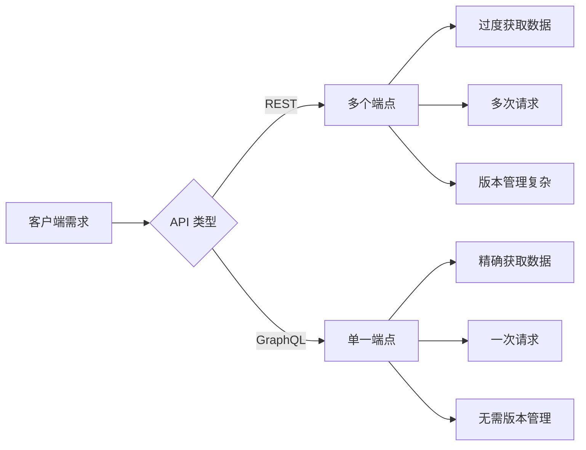
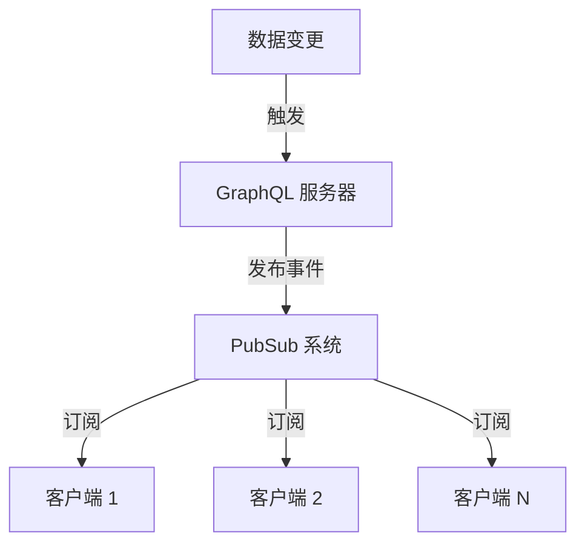
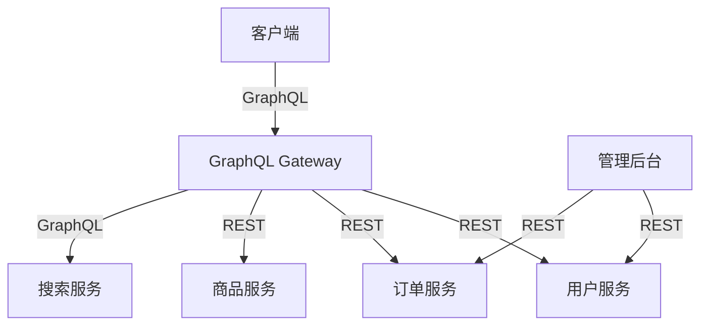

# GraphQL 核心知识体系

> 现代 API 查询语言

**最后更新：** 2026-04-05 | **版本：** 1.0.0

---

## 目录

1. [GraphQL 基础认知](#第 1 章-graphql-基础认知)
2. [Schema 与类型系统](#第 2 章-schema-与类型系统)
3. [查询与变更](#第 3 章-查询与变更)
4. [Resolver 与数据获取](#第 4 章-resolver-与数据获取)
5. [订阅与实时更新](#第 5 章-订阅与实时更新)
6. [性能优化](#第 6 章-性能优化)
7. [安全与最佳实践](#第 7 章-安全与最佳实践)
8. [GraphQL vs REST](#第 8 章-graphql-vs-rest)

---

## 第 1 章 GraphQL 基础认知

### 1.1 什么是 GraphQL

GraphQL 是由 Facebook（现 Meta）开发的**开源数据查询语言和运行时**，旨在通过提供一种比 REST 更高效、更灵活的 API 数据获取方式，解决传统 REST API 的过度获取和获取不足问题。

**核心定义：**
- GraphQL 是一种**查询语言**，类似 SQL 之于数据库
- GraphQL 是一种**运行时**，用于执行查询并返回结果
- GraphQL 是一种**规范**，定义了类型系统、验证规则和执行语义

### 1.2 GraphQL 与 REST 对比



| 维度 | REST | GraphQL |
|------|------|---------|
| 端点数量 | 多个（/users, /posts, /comments） | 单一（/graphql） |
| 数据获取 | 服务器决定返回内容 | 客户端决定需要什么 |
| 请求次数 | 可能需要多次 | 通常一次即可 |
| 过度获取 | 常见（返回不需要的字段） | 避免（只获取需要的） |
| 版本管理 | 需要（/v1/, /v2/） | 不需要（通过 Schema 演进） |
| 类型系统 | 弱（依赖文档） | 强（Schema 定义） |
| 错误处理 | HTTP 状态码 | 统一的错误格式 |

### 1.3 GraphQL 核心特性

#### 1.3.1 精确数据获取

```graphql
# REST: 返回完整的用户对象（可能包含不需要的字段）
GET /api/users/123
# 响应：{ id, name, email, phone, address, createdAt, updatedAt, ... }

# GraphQL: 只获取需要的字段
query {
  user(id: 123) {
    id
    name
    email
  }
}
# 响应：{ id, name, email }
```

#### 1.3.2 嵌套资源获取

```graphql
# REST: 可能需要 3 次请求
GET /api/users/123
GET /api/users/123/posts
GET /api/posts/456/comments

# GraphQL: 一次请求获取所有数据
query {
  user(id: 123) {
    id
    name
    posts {
      id
      title
      comments {
        id
        content
      }
    }
  }
}
```

#### 1.3.3 强类型系统

```graphql
# Schema 定义
type User {
  id: ID!
  name: String!
  email: String!
  age: Int
  posts: [Post!]!
}

type Post {
  id: ID!
  title: String!
  content: String!
  author: User!
}
```

### 1.4 GraphQL 六大约束

| 约束 | 说明 |
|------|------|
| **Schema 定义** | 所有数据类型和操作必须在 Schema 中定义 |
| **强类型** | 每个字段都有明确的类型定义 |
| **层级结构** | 查询结果与查询结构一致 |
| **客户端指定** | 客户端决定返回哪些字段 |
| **单一端点** | 所有操作都发送到同一个端点 |
| **向后兼容** | Schema 演进应保持向后兼容 |

### 1.5 适用场景

#### 1.5.1 推荐使用场景

- ✅ **复杂数据需求** - 前端需要灵活组合多个资源
- ✅ **移动端应用** - 网络带宽有限，需要精确获取数据
- ✅ **多客户端** - Web、iOS、Android 需要不同数据结构
- ✅ **快速迭代** - 前端需求频繁变化
- ✅ **微服务聚合** - 需要聚合多个服务的数据

#### 1.5.2 不推荐场景

- ⚠️ **简单 CRUD 应用** - REST 更简单直接
- ⚠️ **需要 HTTP 缓存** - GraphQL 使用 POST，缓存复杂
- ⚠️ **文件上传为主** - REST 更适合文件操作
- ⚠️ **团队无 GraphQL 经验** - 学习曲线较陡

---

## 第 2 章 Schema 与类型系统

### 2.1 Schema 基础

Schema 是 GraphQL API 的核心，定义了客户端可以执行的所有操作和数据结构。

```graphql
# Schema 入口
schema {
  query: Query        # 查询入口
  mutation: Mutation  # 变更入口（可选）
  subscription: Subscription  # 订阅入口（可选）
}
```

### 2.2 类型系统

#### 2.2.1 标量类型（Scalar Types）

GraphQL 内置的 5 种标量类型：

| 类型 | 说明 | 示例 |
|------|------|------|
| `Int` | 32 位整数 | `42`, `-17` |
| `Float` | 双精度浮点数 | `3.14`, `-0.01` |
| `String` | UTF-8 字符串 | `"Hello"`, `"世界"` |
| `Boolean` | 布尔值 | `true`, `false` |
| `ID` | 唯一标识符 | `"123"`, `"abc-456"` |

#### 2.2.2 对象类型（Object Types）

```graphql
# 定义对象类型
type User {
  id: ID!           # 非空 ID
  name: String!     # 非空字符串
  email: String!    # 非空字符串
  age: Int          # 可为空
  posts: [Post!]!   # 非空数组，数组元素非空
}

type Post {
  id: ID!
  title: String!
  content: String!
  author: User!     # 关联类型
  comments: [Comment!]!
  createdAt: String
}
```

**类型修饰符：**

| 语法 | 含义 | 示例 |
|------|------|------|
| `String` | 可为空 | `name: String` |
| `String!` | 非空 | `name: String!` |
| `[String]` | 字符串数组（可为空） | `tags: [String]` |
| `[String!]` | 非空字符串数组 | `tags: [String!]` |
| `[String]!` | 非空数组 | `tags: [String]!` |
| `[String!]!` | 非空数组，元素非空 | `tags: [String!]!` |

#### 2.2.3 接口类型（Interface Types）

```graphql
# 定义接口
interface Character {
  id: ID!
  name: String!
  appearsIn: [Episode!]!
}

# 实现接口的类型
type Human implements Character {
  id: ID!
  name: String!
  appearsIn: [Episode!]!
  starships: [Starship!]!
}

type Droid implements Character {
  id: ID!
  name: String!
  appearsIn: [Episode!]!
  primaryFunction: String
}
```

#### 2.2.4 联合类型（Union Types）

```graphql
# 联合类型可以是多种类型之一
union SearchResult = Human | Droid | Starship

# 查询时使用内联片段
query {
  search(text: "Luke") {
    ... on Human {
      name
      height
    }
    ... on Droid {
      name
      primaryFunction
    }
    ... on Starship {
      name
      length
    }
  }
}
```

#### 2.2.5 枚举类型（Enum Types）

```graphql
# 定义枚举
enum Episode {
  NEWHOPE
  EMPIRE
  JEDI
}

enum Role {
  ADMIN
  EDITOR
  VIEWER
}

# 使用枚举
type User {
  id: ID!
  role: Role!
}

type Query {
  hero(episode: Episode): Character
}
```

#### 2.2.6 输入类型（Input Types）

```graphql
# 定义输入类型（用于 Mutation 参数）
input CreateUserInput {
  name: String!
  email: String!
  age: Int
}

input UpdateUserInput {
  id: ID!
  name: String
  email: String
}

# 使用输入类型
type Mutation {
  createUser(input: CreateUserInput!): User!
  updateUser(input: UpdateUserInput!): User
}
```

### 2.3 指令（Directives）

```graphql
# @include - 条件包含
query {
  user(id: 123) {
    id
    name
    email @include(if: $showEmail)
  }
}

# @skip - 条件跳过
query {
  user(id: 123) {
    id
    name
    phone @skip(if: $hidePhone)
  }
}

# @deprecated - 标记废弃
type User {
  id: ID!
  name: String!
  
  # @deprecated(reason: "使用 email 字段代替")
  username: String @deprecated(reason: "已废弃")
  
  email: String!
}

# @cacheControl - 缓存控制（Apollo 扩展）
type Query {
  popularPosts: [Post!]! @cacheControl(maxAge: 300)
  user(id: ID!): User @cacheControl(maxAge: 60)
}
```

---

## 第 3 章 查询与变更

### 3.1 查询（Queries）

#### 3.1.1 基础查询

```graphql
# 简单查询
query {
  user(id: 123) {
    id
    name
    email
  }
}

# 简写形式（省略 query）
{
  user(id: 123) {
    id
    name
    email
  }
}
```

#### 3.1.2 带参数查询

```graphql
# 带参数的查询
query {
  user(id: 123) {
    id
    name
  }
  post(id: 456) {
    id
    title
  }
}

# 带多个参数
query {
  posts(limit: 10, offset: 0) {
    id
    title
  }
}
```

#### 3.1.3 命名查询

```graphql
# 命名查询（便于调试和缓存）
query GetUser {
  user(id: 123) {
    id
    name
  }
}

query GetPost {
  post(id: 456) {
    id
    title
  }
}
```

#### 3.1.4 变量查询

```graphql
# 定义变量
query GetUser($userId: ID!, $includeEmail: Boolean = false) {
  user(id: $userId) {
    id
    name
    email @include(if: $includeEmail)
  }
}

# 变量值（在请求体中单独传递）
{
  "userId": "123",
  "includeEmail": true
}
```

#### 3.1.5 片段（Fragments）

```graphql
# 定义片段
query {
  user(id: 123) {
    ...UserFields
  }
  post(id: 456) {
    author {
      ...UserFields
    }
  }
}

fragment UserFields on User {
  id
  name
  email
}

# 条件片段
query {
  search(text: "Luke") {
    ...HumanFields
    ... on Droid {
      primaryFunction
    }
  }
}

fragment HumanFields on Human {
  name
  height
}
```

### 3.2 变更（Mutations）

#### 3.2.1 基础变更

```graphql
# 创建资源
mutation {
  createUser(name: "张三", email: "zhangsan@example.com") {
    id
    name
    email
  }
}

# 更新资源
mutation {
  updateUser(id: 123, name: "李四") {
    id
    name
  }
}

# 删除资源
mutation {
  deleteUser(id: 123) {
    success
    message
  }
}
```

#### 3.2.2 使用输入类型

```graphql
mutation {
  createUser(input: {
    name: "张三"
    email: "zhangsan@example.com"
    age: 25
  }) {
    id
    name
    email
  }
}

# 使用变量
mutation CreateUser($input: CreateUserInput!) {
  createUser(input: $input) {
    id
    name
    email
  }
}

# 变量值
{
  "input": {
    "name": "张三",
    "email": "zhangsan@example.com",
    "age": 25
  }
}
```

#### 3.2.3 多个变更操作

```graphql
# 注意：多个变更会顺序执行
mutation {
  createUser(name: "张三") {
    id
  }
  createPost(title: "Hello", authorId: 1) {
    id
  }
}
```

### 3.3 订阅（Subscriptions）

#### 3.3.1 基础订阅

```graphql
# 实时订阅新消息
subscription {
  newMessage {
    id
    content
    sender {
      id
      name
    }
  }
}

# 订阅订单状态变化
subscription {
  orderStatusChanged(orderId: "123") {
    id
    status
    updatedAt
  }
}
```

#### 3.3.2 带参数订阅

```graphql
subscription OnNewPost($userId: ID!) {
  newPost(userId: $userId) {
    id
    title
    content
    createdAt
  }
}
```

---

## 第 4 章 Resolver 与数据获取

### 4.1 Resolver 基础

Resolver 是 GraphQL 中实际获取数据的函数。每个字段都对应一个 Resolver。

```javascript
// Resolver 映射
const resolvers = {
  Query: {
    user: (parent, args, context, info) => {
      return db.user.find(args.id)
    },
    posts: (parent, args, context, info) => {
      return db.posts.findAll()
    }
  },
  Mutation: {
    createUser: (parent, args, context, info) => {
      return db.user.create(args.input)
    }
  },
  User: {
    posts: (parent, args, context, info) => {
      return db.posts.findByUserId(parent.id)
    }
  }
}
```

### 4.2 Resolver 参数

Resolver 接收四个参数：

```javascript
const resolver = (parent, args, context, info) => {
  // parent: 父字段的解析结果
  // args: 传递给字段的参数
  // context: 共享的上下文对象（包含数据库连接、认证信息等）
  // info: 字段详细信息（用于高级场景）
  
  return data
}
```

### 4.3 N+1 问题与 DataLoader

#### 4.3.1 N+1 问题

```javascript
// ❌ 问题代码：查询 100 个用户会执行 101 次 SQL
const resolvers = {
  User: {
    posts: async (user) => {
      // 每个用户执行一次查询
      return db.posts.findByUserId(user.id)
    }
  }
}

// 查询
query {
  users {
    id
    name
    posts {
      title
    }
  }
}

// 执行的 SQL
// 1 次：SELECT * FROM users
// 100 次：SELECT * FROM posts WHERE user_id = ? (每个用户一次)
```

#### 4.3.2 DataLoader 解决方案

```javascript
import DataLoader from 'dataloader'

// 创建 DataLoader
const userLoader = new DataLoader(async (userIds) => {
  // 批量查询
  const users = await db.users.findByIds(userIds)
  // 按 ID 映射返回结果
  return userIds.map(id => users.find(u => u.id === id))
})

const postLoader = new DataLoader(async (userIds) => {
  // 一次性查询所有用户的帖子
  const posts = await db.posts.findByUserIds(userIds)
  // 按用户 ID 分组
  const postsByUser = {}
  posts.forEach(post => {
    if (!postsByUser[post.userId]) {
      postsByUser[post.userId] = []
    }
    postsByUser[post.userId].push(post)
  })
  return userIds.map(id => postsByUser[id] || [])
})

// 在 Resolver 中使用
const resolvers = {
  User: {
    posts: (user) => postLoader.load(user.id)
  },
  Query: {
    user: (_, { id }) => userLoader.load(id)
  }
}

// 将 loader 放入 context
const context = {
  userLoader,
  postLoader
}
```

#### 4.3.3 DataLoader 工作原理

```mermaid
flowchart TD
    A[请求 1: load(1)] --> B[收集请求]
    C[请求 2: load(2)] --> B
    D[请求 3: load(3)] --> B
    E[请求 N: load(N)] --> B
    
    B --> F{批次触发}
    F -->|自动批处理 | G[批量查询：findByIds([1,2,3,...,N])]
    G --> H[映射结果]
    H --> I[分发结果给各请求]
```

**DataLoader 两大核心机制：**

| 机制 | 说明 |
|------|------|
| **批量查询** | 收集一段时间内的所有请求，合并为单次数据库查询 |
| **结果缓存** | 缓存查询结果，同一请求多次调用只执行一次 |

---

## 第 5 章 订阅与实时更新

### 5.1 订阅架构



### 5.2 实现订阅

#### 5.2.1 Schema 定义

```graphql
type Subscription {
  # 新消息
  newMessage(channelId: ID!): Message!
  
  # 订单状态变化
  orderStatusChanged(orderId: ID!): OrderStatus!
  
  # 新用户注册
  userRegistered: User!
}
```

#### 5.2.2 Resolver 实现（Apollo）

```javascript
import { PubSub } from 'graphql-subscriptions'
const pubsub = new PubSub()

const resolvers = {
  Subscription: {
    newMessage: {
      subscribe: (_, { channelId }, context) => {
        return pubsub.asyncIterator(`NEW_MESSAGE:${channelId}`)
      }
    },
    orderStatusChanged: {
      subscribe: (_, { orderId }, context) => {
        return pubsub.asyncIterator(`ORDER_STATUS:${orderId}`)
      }
    }
  },
  Mutation: {
    sendMessage: async (_, { channelId, content }, context) => {
      const message = await db.message.create({ channelId, content })
      // 发布事件
      pubsub.publish(`NEW_MESSAGE:${channelId}`, {
        newMessage: message
      })
      return message
    }
  }
}
```

### 5.3 WebSocket 传输

```javascript
// 客户端配置（Apollo Client）
import { WebSocketLink } from '@apollo/client/link/ws'
import { SubscriptionClient } from 'subscriptions-transport-ws'

const wsClient = new SubscriptionClient('ws://localhost:4000/graphql', {
  reconnect: true,
  connectionParams: {
    authToken: 'Bearer token123'
  }
})

const wsLink = new WebSocketLink(wsClient)
```

---

## 第 6 章 性能优化

### 6.1 查询复杂度分析

```javascript
// 定义字段复杂度
const complexityConfig = {
  maximumComplexity: 1000,
  fieldComplexities: {
    'Query.users': () => 10,
    'Query.user': () => 1,
    'User.posts': () => 5,
    'Post.comments': () => 3
  }
}

// 限制查询深度
const depthLimit = require('graphql-depth-limit')
server.use('/graphql', graphqlHTTP({
  validationRules: [depthLimit(5)]
}))
```

### 6.2 分页优化

#### 6.2.1 偏移量分页（Offset-based）

```graphql
# 查询
query {
  posts(offset: 0, limit: 10) {
    id
    title
  }
}

# 问题：深度分页性能差
# SELECT * FROM posts LIMIT 10 OFFSET 10000  -- 慢
```

#### 6.2.2 游标分页（Cursor-based）

```graphql
# 连接类型
type PostConnection {
  edges: [PostEdge!]!
  pageInfo: PageInfo!
}

type PostEdge {
  cursor: String!
  node: Post!
}

type PageInfo {
  hasNextPage: Boolean!
  hasPreviousPage: Boolean!
  startCursor: String
  endCursor: String
}

# 查询
query {
  posts(first: 10, after: "YXJyYXljb25uZWN0aW9uOjEw") {
    edges {
      cursor
      node {
        id
        title
      }
    }
    pageInfo {
      hasNextPage
      endCursor
    }
  }
}
```

### 6.3 缓存策略

#### 6.3.1 服务端缓存

```javascript
// Redis 缓存
const cache = require('apollo-server-cache-redis')

const server = new ApolloServer({
  typeDefs,
  resolvers,
  cache: new cache.RedisCache({
    host: 'localhost',
    port: 6379
  })
})
```

#### 6.3.2 客户端缓存（Apollo Client）

```javascript
import { ApolloClient, InMemoryCache } from '@apollo/client'

const client = new ApolloClient({
  uri: '/graphql',
  cache: new InMemoryCache({
    typePolicies: {
      Query: {
        fields: {
          posts: {
            keyArgs: ['userId'],
            merge(existing, incoming) {
              return incoming
            }
          }
        }
      }
    }
  })
})
```

### 6.4 查询批处理

```javascript
// 批处理多个查询
POST /graphql
Content-Type: application/json

[
  {
    "query": "query { user(id: 1) { name } }"
  },
  {
    "query": "query { post(id: 2) { title } }"
  }
]
```

---

## 第 7 章 安全与最佳实践

### 7.1 认证与授权

#### 7.1.1 JWT 认证

```javascript
// 验证 Token
const context = async ({ req }) => {
  const token = req.headers.authorization || ''
  
  try {
    const user = await verifyToken(token)
    return { user }
  } catch (e) {
    throw new AuthenticationError('认证失败')
  }
}

// Resolver 中验证
const resolvers = {
  Query: {
    me: (_, __, { user }) => {
      if (!user) throw new AuthenticationError('未认证')
      return user
    }
  }
}
```

#### 7.1.2 字段级授权

```javascript
const resolvers = {
  Post: {
    views: async (post, _, { user }) => {
      // 只有作者或管理员可查看访问数
      if (!user || (user.id !== post.authorId && !user.isAdmin)) {
        throw new ForbiddenError('无权限查看')
      }
      return post.views
    }
  }
}
```

### 7.2 输入验证

```javascript
import { UserInputError } from 'apollo-server'

const resolvers = {
  Mutation: {
    createUser: async (_, { input }) => {
      // 验证邮箱
      const emailRegex = /^[^\s@]+@[^\s@]+\.[^\s@]+$/
      if (!emailRegex.test(input.email)) {
        throw new UserInputError('邮箱格式不正确')
      }
      
      // 验证用户名长度
      if (input.name.length < 2 || input.name.length > 50) {
        throw new UserInputError('用户名长度必须在 2-50 之间')
      }
      
      return db.user.create(input)
    }
  }
}
```

### 7.3 速率限制

```javascript
import rateLimit from 'express-rate-limit'

const limiter = rateLimit({
  windowMs: 15 * 60 * 1000,  // 15 分钟
  max: 100,  // 最多 100 个请求
  message: {
    errors: [{ message: '请求过多，请稍后重试' }]
  }
})

app.use('/graphql', limiter)
```

### 7.4 错误处理

```javascript
const { ApolloServer, ApolloError } = require('apollo-server')

// 自定义错误
class BusinessError extends ApolloError {
  constructor(message, code, properties) {
    super(message, code, properties)
    this.name = 'BusinessError'
  }
}

// 全局错误格式化
const server = new ApolloServer({
  typeDefs,
  resolvers,
  formatError: (error) => {
    // 开发环境返回详细信息
    if (process.env.NODE_ENV === 'development') {
      return error
    }
    
    // 生产环境隐藏敏感信息
    return {
      message: error.message,
      code: error.extensions?.code || 'INTERNAL_SERVER_ERROR'
    }
  }
})
```

---

## 第 8 章 GraphQL vs REST

### 8.1 详细对比

| 对比维度 | REST | GraphQL |
|----------|------|---------|
| **架构风格** | 资源导向 | 查询语言 |
| **端点** | 多个（/users, /posts） | 单一（/graphql） |
| **HTTP 方法** | GET/POST/PUT/DELETE | 主要使用 POST |
| **数据格式** | 服务器决定 | 客户端决定 |
| **过度获取** | 常见 | 避免 |
| **请求次数** | 可能多次 | 通常一次 |
| **版本管理** | 需要（/v1/, /v2/） | 不需要 |
| **类型系统** | 弱（依赖文档） | 强（Schema 定义） |
| **缓存** | HTTP 缓存原生支持 | 需要额外实现 |
| **文件上传** | 原生支持 | 需要扩展 |
| **实时监控** | 需要额外实现 | 订阅支持 |
| **学习曲线** | 低 | 中等 |

### 8.2 选择建议

#### 8.2.1 选择 REST 的场景

```
✅ 简单 CRUD 应用
✅ 需要充分利用 HTTP 缓存
✅ 文件上传为主的场景
✅ 已有成熟 REST API
✅ 团队无 GraphQL 经验
✅ 需要简单快速上手
```

#### 8.2.2 选择 GraphQL 的场景

```
✅ 复杂数据需求
✅ 多客户端（Web/iOS/Android）需要不同数据结构
✅ 移动端应用（网络带宽有限）
✅ 前端需求频繁变化
✅ 需要聚合多个数据源
✅ 实时更新需求
```

### 8.3 混合架构

很多公司采用 REST + GraphQL 混合架构：



**混合架构优势：**
- 保留现有 REST 投资
- 前端享受 GraphQL 灵活性
- 内部服务保持简单 REST
- 渐进式迁移，风险可控

---

## 附录 A：快速参考卡

### 常用 Schema 定义

```graphql
# 标量
String, Int, Float, Boolean, ID

# 修饰符
String       # 可为空
String!      # 非空
[String]     # 数组
[String!]    # 非空元素数组
[String]!    # 非空数组
[String!]!   # 非空数组，元素非空

# 指令
@include(if: Boolean)
@skip(if: Boolean)
@deprecated(reason: String)
```

### 查询模板

```graphql
# 基础查询
{
  user(id: 123) {
    id
    name
  }
}

# 带变量
query GetUser($id: ID!) {
  user(id: $id) {
    id
    name
  }
}

# 带片段
fragment UserFields on User {
  id
  name
  email
}

{
  user(id: 123) {
    ...UserFields
  }
}
```

### 变更模板

```graphql
mutation {
  createUser(input: {
    name: "张三"
    email: "test@example.com"
  }) {
    id
    name
  }
}
```

---

## 参考资料

- [GraphQL 官方文档](https://graphql.org/)
- [Apollo GraphQL](https://www.apollographql.com/)
- [GraphQL 规范](https://spec.graphql.org/)

---

*文档版本：1.0.0 | 最后更新：2026-04-05*
