# 浏览器核心知识体系

> 浏览器工作原理与性能优化全景指南

**最后更新：** 2026-04-05 | **版本：** 1.0.0

---

## 目录

1. [浏览器基础认知](#第 1 章 - 浏览器基础认知)
2. [渲染流水线](#第 2 章 - 渲染流水线)
3. [JavaScript 引擎原理](#第 3 章-javascript-引擎原理)
4. [事件循环与任务调度](#第 4 章 - 事件循环与任务调度)
5. [网络栈与缓存机制](#第 5 章 - 网络栈与缓存机制)
6. [浏览器存储](#第 6 章 - 浏览器存储)
7. [浏览器安全模型](#第 7 章 - 浏览器安全模型)
8. [性能优化实战](#第 8 章 - 性能优化实战)

---

## 第 1 章 浏览器基础认知

### 1.1 浏览器架构演进

#### 1.1.1 单进程架构（早期浏览器）

早期浏览器采用单进程架构，所有功能模块运行在同一进程中：

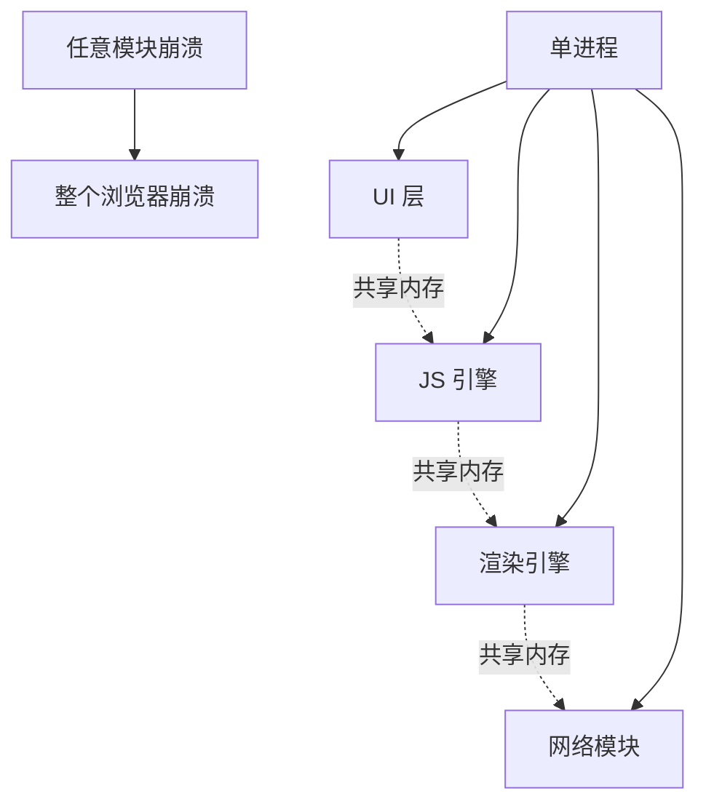

**问题：**
- 一个标签页崩溃导致整个浏览器崩溃
- 恶意网站可窃取其他标签页数据
- 内存泄漏影响所有标签页

#### 1.1.2 多进程架构（现代 Chrome）

现代 Chrome 采用多进程架构，将不同功能模块隔离：

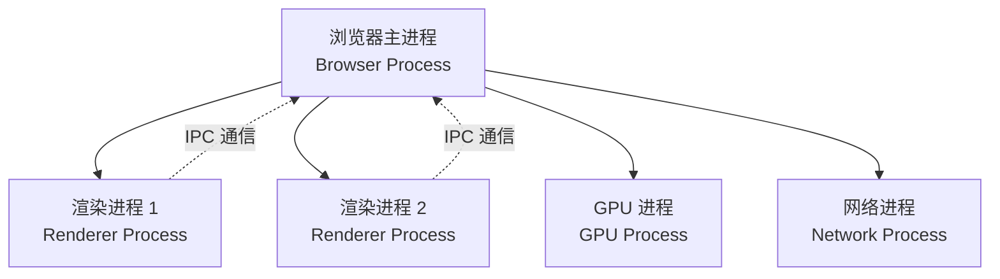

### 1.2 浏览器进程详解

| 进程 | 职责 | 特点 |
|------|------|------|
| **浏览器主进程** | UI 显示、用户交互、子进程管理、存储 | 唯一存在，浏览器的"大脑" |
| **渲染进程** | HTML/CSS/JS 解析、页面渲染、事件处理 | 每个标签页独立，运行在沙箱中 |
| **GPU 进程** | 图形加速、WebGL、Canvas、3D CSS | 处理所有图形渲染任务 |
| **网络进程** | HTTP/HTTPS 请求、缓存、Cookie 管理 | 所有标签页共享 |
| **插件进程** | 第三方插件/扩展运行 | 隔离防止崩溃影响浏览器 |

### 1.3 渲染进程内部线程

渲染进程内部包含多个协作线程：

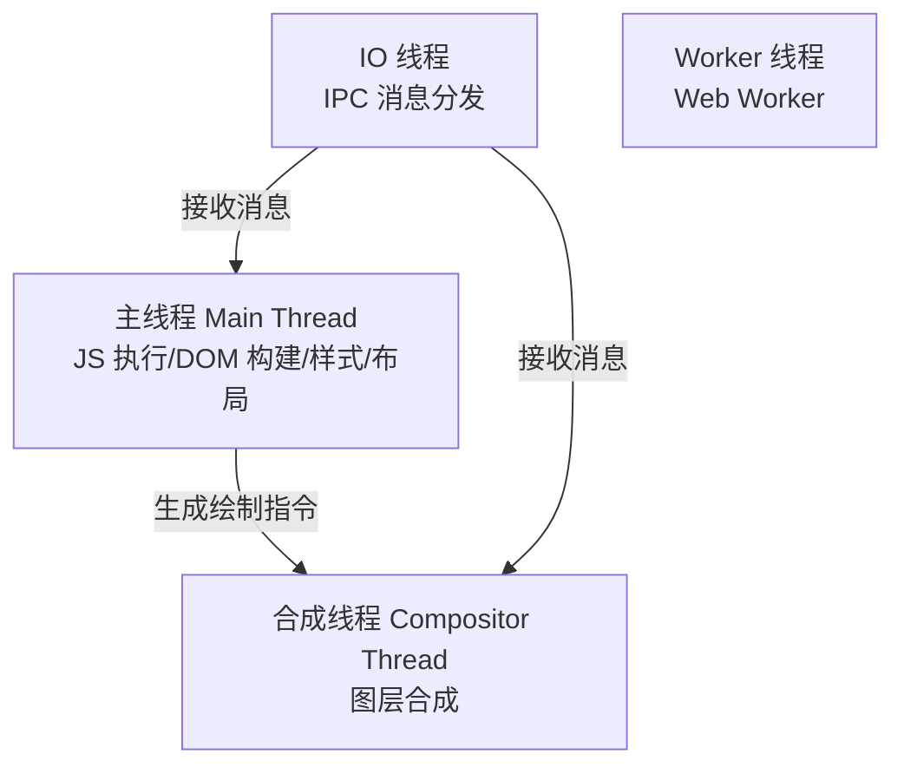

### 1.4 安全沙箱模型

**沙箱原理：** 在渲染进程和操作系统之间建立"隔离墙"

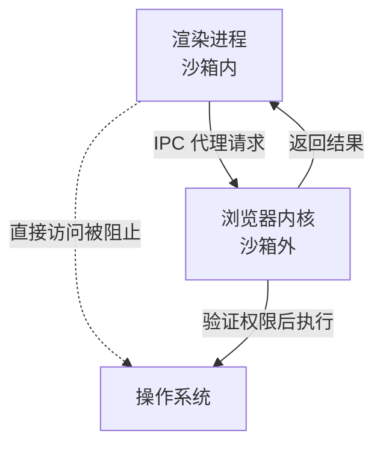

**沙箱限制：**
- **文件系统** - 渲染进程无法直接访问，需通过浏览器内核代理
- **网络访问** - 需通过浏览器内核发起请求
- **用户输入** - 事件由浏览器内核接收，再分发给渲染进程
- **窗口句柄** - 渲染进程生成位图，由浏览器内核复制到屏幕

---

## 第 2 章 渲染流水线

### 2.1 渲染流程全景

浏览器渲染是流水线作业，包含 6 个关键阶段：

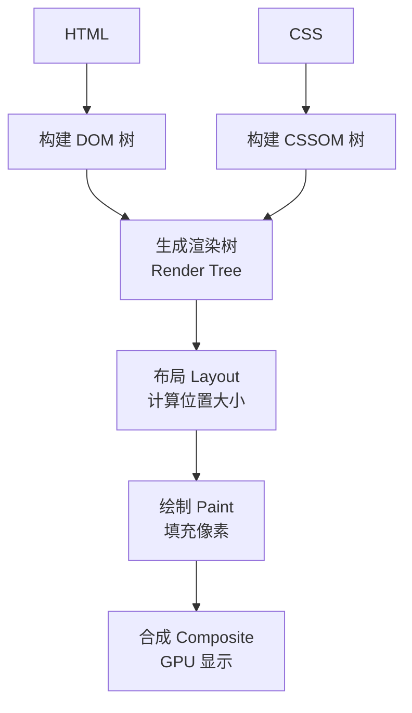

### 2.2 DOM 构建（Parse HTML）

**过程：** 字节流 → 字符串 → Token → Node → DOM Tree

```javascript
// HTML 示例
<html>
  <head>
    <title>测试</title>
    <link rel="stylesheet" href="style.css">
  </head>
  <body>
    <div id="app">Hello</div>
    <script src="app.js"></script>
  </body>
</html>
```

**DOM 树结构：**
```
Document
└── html
    ├── head
    │   ├── title
    │   │   └── #text "测试"
    │   └── link (style.css)
    └── body
        ├── div#app
        │   └── #text "Hello"
        └── script (app.js)
```

**关键特性：**
- HTML 解析是**流式**的，边下载边解析
- 遇到 `<script>` 标签会**暂停解析**，下载并执行 JS
- 使用 `async`/`defer` 可避免阻塞

### 2.3 CSSOM 构建（Parse CSS）

**过程：** CSS 字节流 → Token → Node → CSSOM Tree

```css
/* style.css */
body { font-size: 16px; }
#app { color: red; }
```

**CSSOM 树结构：**
```
root
├── body { font-size: 16px; }
└── #app { color: red; }
```

**关键特性：**
- CSS 不会阻塞 DOM 构建，但会**阻塞渲染树构建**
- 渲染树需要 DOM + CSSOM 合并后才能生成
- CSS 加载慢会导致**白屏**

### 2.4 渲染树生成（Render Tree）

**合并规则：** DOM + CSSOM → Render Tree

```mermaid
flowchart LR
    DOM[DOM 树<br/>结构信息] + CSSOM[CSSOM 树<br/>样式信息] --> RenderTree[渲染树<br/>可见节点 + 样式]
```

**过滤规则：**
- `<head>` 标签不进入渲染树
- `display: none` 的元素不进入渲染树
- `visibility: hidden` 的元素**会**进入渲染树（占据布局空间）

### 2.5 布局（Layout / Reflow）

**任务：** 计算每个可见节点在屏幕上的确切位置和大小

**触发回流的操作：**
| 操作类型 | 示例 |
|----------|------|
| 增删 DOM 节点 | `appendChild()`, `removeChild()` |
| 修改布局属性 | `width`, `height`, `margin`, `padding` |
| 读取布局信息 | `offsetTop`, `clientWidth`, `getBoundingClientRect()` |
| 窗口变化 | `resize` 事件 |

**回流影响范围：**
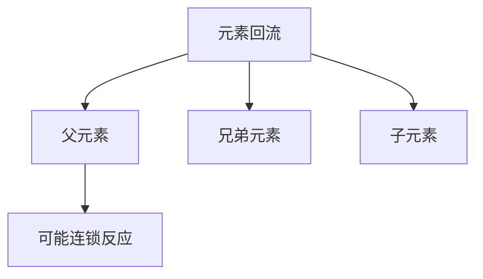

### 2.6 绘制（Paint）

**任务：** 将布局树节点转换为屏幕像素

**绘制内容：** 文本、颜色、边框、阴影、图片

**触发重绘的操作：**
- 修改 `color`, `background-color`
- 修改 `border-color`
- 修改 `visibility`

### 2.6.5 光栅化（Rasterization）

**定义：** 将矢量绘图指令转换为像素位图的过程。

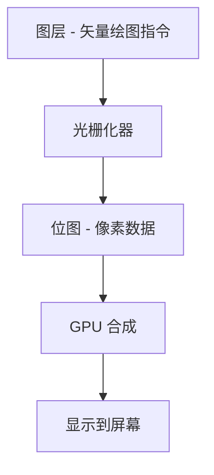

**为什么需要光栅化？**

| 阶段 | 输出形式 | 特点 |
|------|----------|------|
| **绘制阶段** | 矢量绘图指令 | "画一个圆"、"填充红色" |
| **光栅化后** | 像素位图 | 每个像素点的具体颜色值 |
| **屏幕显示** | 像素点阵 | GPU 直接处理的格式 |

**光栅化过程：**

```
1. 接收图层（包含矢量绘图指令）
         ↓
2. 计算覆盖（每个像素是否被图形覆盖）
         ↓
3. 填充颜色（被覆盖的像素填充对应颜色）
         ↓
4. 输出位图（供 GPU 合成使用）
```

**性能考量：**

| 因素 | 影响 | 优化方式 |
|------|------|----------|
| **图层大小** | 图层越大，像素越多，光栅化越慢 | 避免过大的独立图层 |
| **图层数量** | 图层越多，总光栅化时间越长 | 合理分层，不过度拆分 |
| **效果复杂度** | 半透明、模糊、阴影增加计算量 | 减少复杂效果的叠加 |

**分层光栅化优化：**

```
传统方式（单图层）
┌─────────────────────────────┐
│ 整个页面作为一个图层          │
│ 任何更新都需要重新光栅化     │
└─────────────────────────────┘
         ↓ 慢

分层方式（多图层）
┌─────────────┐  ┌─────────────┐
│ 图层 1       │  │ 图层 2       │
│ (静态背景)   │  │ (滚动内容)   │
│ 光栅化一次   │  │ 单独更新     │
└─────────────┘  └─────────────┘
         ↓ 快，GPU 并行处理
```

**光栅化与动画性能：**

```css
/* ❌ 慢：触发回流 + 重绘 + 重新光栅化 */
.element {
  top: 0;
  transition: top 0.3s;
}
.element:hover {
  top: 100px;  /* 位置变化 → 重新布局 → 重新绘制 → 重新光栅化 */
}

/* ✅ 快：只触发合成，光栅化结果复用 */
.element {
  transform: translateY(0);
  will-change: transform;  /* 提示浏览器预创建图层 */
  transition: transform 0.3s;
}
.element:hover {
  transform: translateY(100px);  /* 只改变合成位置，光栅化结果直接复用 */
}
```

**关键理解：**
- `top`/`left` 变化 → 整个流程重新走 → 慢
- `transform` 变化 → 仅合成阶段更新，光栅化结果复用 → 快

### 2.8 合成（Composite）

**现代浏览器优化：** 分层渲染 + GPU 加速

**触发新图层的 CSS：**
```css
/* 提升元素到独立图层 */
transform: translateZ(0);
will-change: transform;
position: fixed;
opacity: 0.99;  /* hack 方式 */
```

**合成流程：**
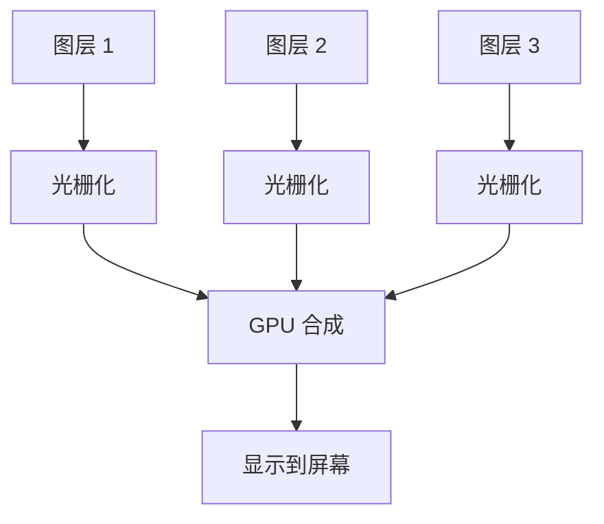

### 2.9 性能优化建议

```javascript
// ❌ 差：强制同步布局
element.style.height = '100px';
const height = element.offsetHeight;  // 触发回流
element.style.height = '200px';
const newHeight = element.offsetHeight;  // 再次触发回流

// ✅ 好：批量读写
element.style.height = '100px';
element.style.height = '200px';
const height = element.offsetHeight;  // 只触发一次回流
const newHeight = element.offsetHeight;
```

**优化策略：**
- 批量修改样式，使用 class 切换替代逐条修改
- 避免强制同步布局（先读后写）
- 使用 `transform` + `will-change` 提升图层
- 使用虚拟节点减少 DOM 操作

---

## 第 3 章 JavaScript 引擎原理

### 3.1 V8 引擎架构

V8 采用"解释 + JIT 编译"混合策略：

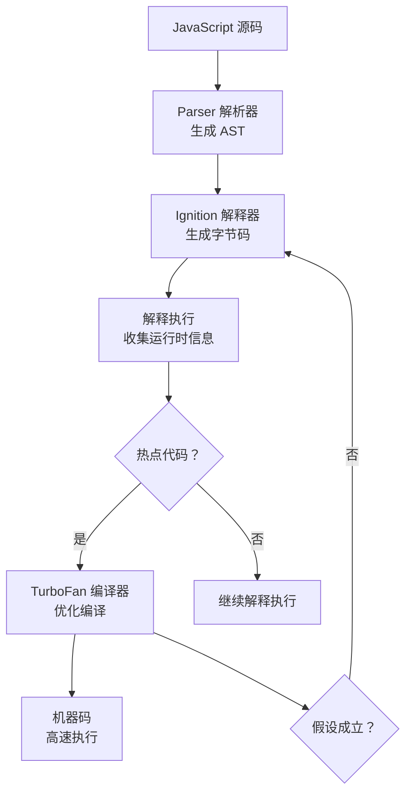

### 3.2 编译流程详解

#### 3.2.1 词法分析与语法分析

```javascript
// JavaScript 源码
function add(a, b) {
  return a + b;
}

// 生成的 AST（简化）
{
  type: "Program",
  body: [{
    type: "FunctionDeclaration",
    id: { type: "Identifier", name: "add" },
    params: [
      { type: "Identifier", name: "a" },
      { type: "Identifier", name: "b" }
    ],
    body: {
      type: "BlockStatement",
      body: [{
        type: "ReturnStatement",
        argument: {
          type: "BinaryExpression",
          operator: "+",
          left: { type: "Identifier", name: "a" },
          right: { type: "Identifier", name: "b" }
        }
      }]
    }
  }]
}
```

#### 3.2.2 Ignition 生成字节码

字节码是平台无关的中间表示，轻量且启动快：

```
// add 函数的字节码（简化）
Function add:
  0: LdaArg [0]         // 加载参数 a
  2: LdaArg [1]         // 加载参数 b
  4: Add                // 执行加法
  5: Return             // 返回结果
```

#### 3.2.3 TurboFan JIT 编译

**热点代码识别条件：**
- 函数调用次数超过阈值（如 100 次）
- 循环迭代频次超过阈值
- 变量类型稳定（始终为同一种类型）

**优化技术：**
| 优化技术 | 说明 |
|----------|------|
| 类型推测与去虚拟化 | 将动态属性访问转为直接偏移计算 |
| 内联函数调用 | 消除小函数调用开销 |
| 逃逸分析与栈上分配 | 避免不必要的堆内存分配 |
| 特定 CPU 架构优化 | 生成 x64 或 ARM64 原生机器码 |

### 3.3 去优化（Deoptimization）

当运行时假设失败时，V8 会回退到解释器：

```javascript
// 初始调用 - 参数都是 number
function add(a, b) {
  return a + b;
}
add(1, 2);  // TurboFan 优化为机器码：直接相加

// 后续调用 - 参数变为 string
add('1', '2');  // 去优化！回退到 Ignition 解释执行
```

**去优化触发条件：**
- 变量类型变化（number → string）
- 对象隐藏类变化（新增/删除属性）
- 内置函数行为变化

### 3.4 内存管理与垃圾回收

#### 3.4.1 内存分代模型

V8 将堆内存分为两个区域：

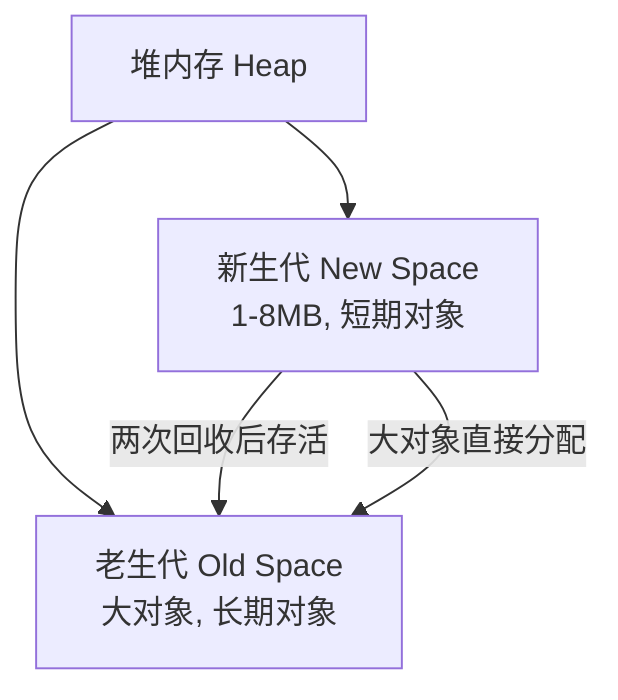

#### 3.4.2 新生代 Scavenge 算法

基于 Cheney 半空间复制算法：

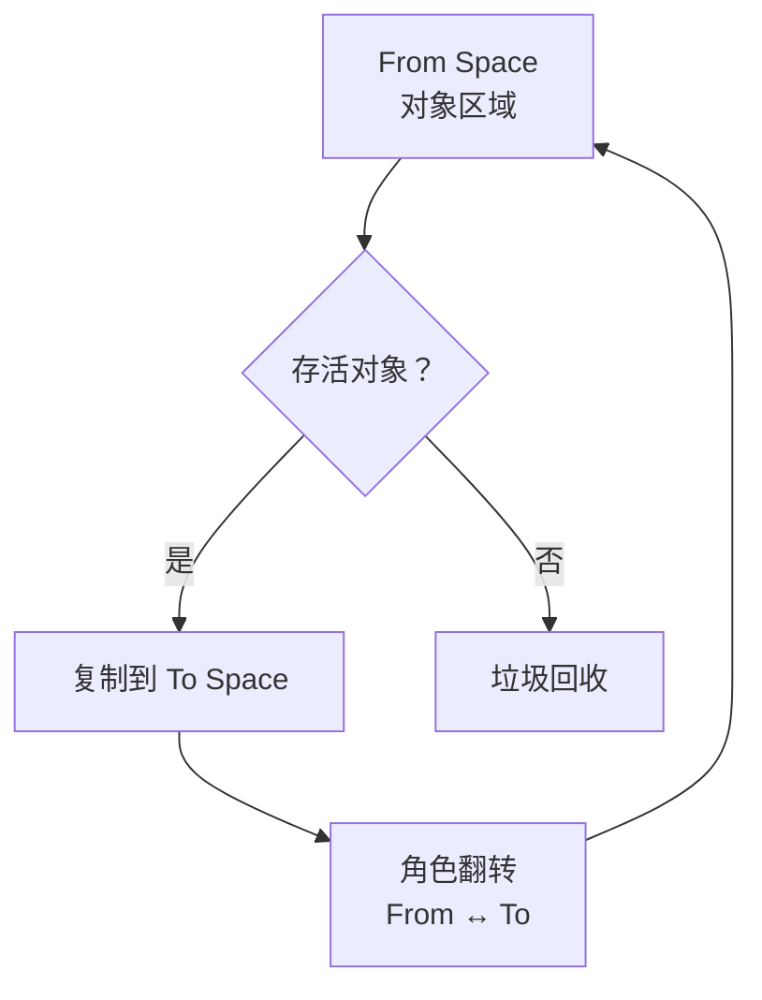

**算法特点：**
- 将新生代分为 From Space 和 To Space
- 存活对象复制到 To Space
- 角色翻转，清空原 From Space
- 仅复制存活对象，减少 GC 停顿

**对象晋升条件：**
- 经过两次 Scavenge 回收后仍存活
- To Space 使用超过 25%

#### 3.4.3 老生代 Mark-Sweep/Mark-Compact

**Mark-Sweep（标记 - 清除）：**
1. 从根元素（全局对象、调用栈）开始遍历
2. 标记所有可达对象为活动对象
3. 清除未标记对象（垃圾）

**Mark-Compact（标记 - 整理）：**
1. 标记阶段与 Mark-Sweep 相同
2. 将存活对象向内存一端移动
3. 清理边界外内存，减少碎片

#### 3.4.4 Orinoco 垃圾回收器

V8 新一代 GC，减少主线程停顿：

| 技术 | 说明 |
|------|------|
| 并行 Scavenge | 利用多核 CPU 同时进行新生代回收 |
| 增量标记 | 将标记分解为多个小步骤，穿插在 JS 执行间隙 |
| 并发标记与清扫 | 主线程执行时，后台线程同时进行标记和清扫 |

**停顿时间优化：**
- 传统 GC：1.5GB 堆内存需要 50ms
- Orinoco：降低到 5-10ms

---

## 第 4 章 事件循环与任务调度

### 4.1 Event Loop 模型

JavaScript 是单线程，Event Loop 是异步操作的执行机制：

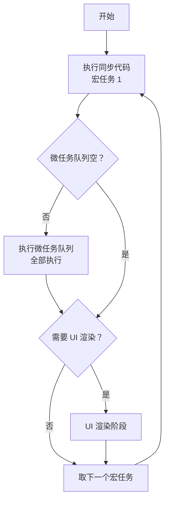

### 4.2 任务分类

#### 4.2.1 宏任务（MacroTask）

每次事件循环只取一个宏任务执行：

| 宏任务 | 说明 |
|--------|------|
| `script` 整体代码 | 第一个宏任务 |
| `setTimeout` / `setInterval` | 定时器回调 |
| I/O 操作 | 文件读写、网络请求回调 |
| UI Rendering | 浏览器绘制 |
| DOM 事件 | 点击、滚动等事件回调 |

#### 4.2.2 微任务（MicroTask）

当前宏任务执行完后立即执行所有微任务：

| 微任务 | 说明 |
|--------|------|
| `Promise.then` / `.catch` / `.finally` | Promise 回调 |
| `queueMicrotask` | 原生微任务 API |
| `MutationObserver` | DOM 变化监听 |
| `process.nextTick` | Node.js 环境，优先级最高 |

### 4.3 执行顺序示例

```javascript
console.log('1. script start');  // 同步

setTimeout(() => {
  console.log('2. setTimeout');  // 宏任务
}, 0);

Promise.resolve().then(() => {
  console.log('3. Promise.then 1');  // 微任务
});

Promise.resolve().then(() => {
  console.log('4. Promise.then 2');  // 微任务
  queueMicrotask(() => {
    console.log('5. queueMicrotask');  // 微任务中的微任务
  });
});

console.log('6. script end');  // 同步

// 输出顺序：
// 1. script start
// 6. script end
// 3. Promise.then 1
// 4. Promise.then 2
// 5. queueMicrotask
// 2. setTimeout
```

### 4.4 UI 渲染时机

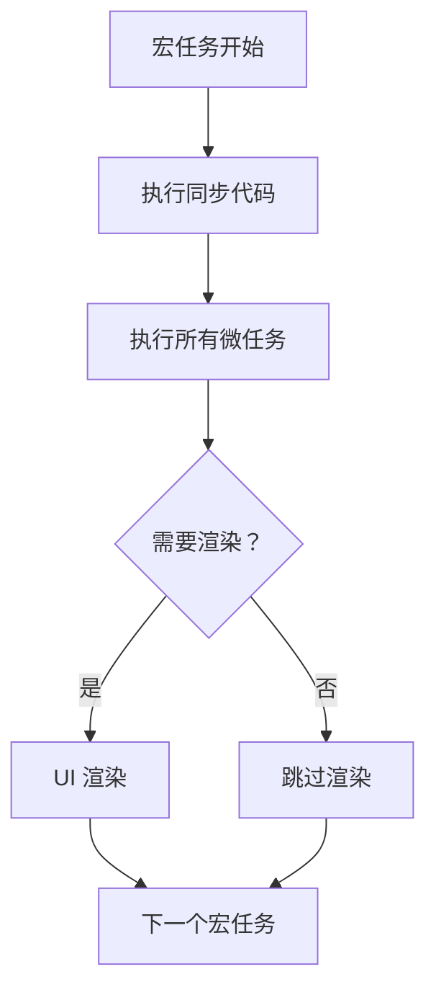

**关键点：**
- 微任务在 UI 渲染**之前**执行
- 微任务队列清空后才可能渲染
- 微任务中产生新微任务会**阻塞渲染**

```javascript
// ❌ 差：微任务阻塞渲染
function bad() {
  queueMicrotask(bad);  // 无限循环，UI 卡死
}
bad();

// ✅ 好：使用宏任务
function good() {
  setTimeout(good, 0);  // 允许渲染
}
good();
```

### 4.5 Node.js 事件循环差异

Node.js 事件循环分为 6 个阶段：

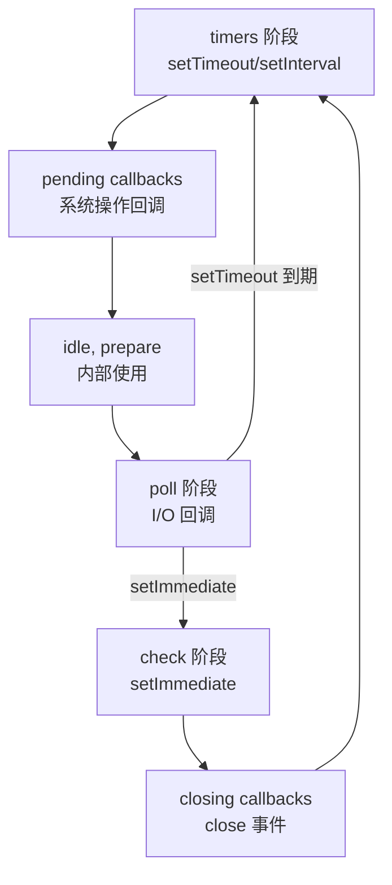

**浏览器 vs Node.js：**
| 特性 | 浏览器 | Node.js |
|------|--------|---------|
| 微任务队列 | 单一队列 | nextTick 队列 + 其他微任务队列 |
| 宏任务顺序 | 单一队列 | 分阶段执行 |
| UI 渲染 | 有 | 无 |

---

## 第 5 章 网络栈与缓存机制

### 5.1 浏览器网络栈架构

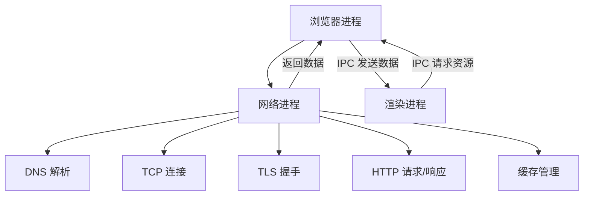

### 5.2 HTTP 缓存机制

#### 5.2.1 强缓存（Strong Cache）

浏览器直接复用本地缓存，不发起请求：

```http
# 响应头设置
HTTP/1.1 200 OK
Cache-Control: max-age=31536000, public
Expires: Wed, 21 Oct 2026 07:28:00 GMT

# 命中强缓存时
HTTP/1.1 200 OK
(from disk cache) 或 (from memory cache)
```

**Cache-Control 指令：**

| 指令 | 说明 |
|------|------|
| `max-age=秒` | 缓存有效期（相对时间） |
| `public` | 允许浏览器和代理服务器缓存 |
| `private` | 仅允许浏览器缓存 |
| `no-cache` | 禁用强缓存，需走协商缓存 |
| `no-store` | 完全禁止缓存 |

**Expires（HTTP/1.0）：**
- 绝对过期时间
- 依赖客户端时间，可能不准确
- 优先级低于 Cache-Control

#### 5.2.2 协商缓存（304 Cache）

强缓存失效后，浏览器向服务器验证资源是否更新：

```http
# 第一次请求
GET /style.css
HTTP/1.1 200 OK
Last-Modified: Mon, 10 Nov 2025 09:10:11 GMT
ETag: "d41d8cd98f00b204"

# 第二次请求（携带缓存标识）
GET /style.css
If-Modified-Since: Mon, 10 Nov 2025 09:10:11 GMT
If-None-Match: "d41d8cd98f00b204"

# 服务器响应（未更新）
HTTP/1.1 304 Not Modified
```

**协商缓存字段对比：**

| 字段对 | 说明 | 缺点 |
|--------|------|------|
| `Last-Modified` + `If-Modified-Since` | 基于最后修改时间 | 精度仅到秒级 |
| `ETag` + `If-None-Match` | 基于资源唯一标识（哈希） | 生成 ETag 增加服务器开销 |

### 5.3 缓存存储位置

| 缓存类型 | 特点 | 适用场景 |
|----------|------|----------|
| **Service Worker** | 可编程控制，支持离线访问 | PWA 应用 |
| **Memory Cache** | 读取极快，关闭标签即释放 | 小型资源、当前页面 |
| **Disk Cache** | 持久化，容量大，读取较慢 | 大型资源、图片视频 |
| **Push Cache** | HTTP/2 服务器推送，会话级 | 临时推送资源 |

### 5.4 Service Worker 缓存

Service Worker 是可编程的网络代理：

```javascript
// 注册 Service Worker
if ('serviceWorker' in navigator) {
  navigator.serviceWorker.register('/sw.js')
}

// sw.js 缓存策略
const CACHE_NAME = 'v1'
const urlsToCache = ['/index.html', '/style.css', '/app.js']

// 安装阶段缓存
self.addEventListener('install', event => {
  event.waitUntil(
    caches.open(CACHE_NAME)
      .then(cache => cache.addAll(urlsToCache))
  )
})

// 拦截请求
self.addEventListener('fetch', event => {
  event.respondWith(
    caches.match(event.request)
      .then(response => response || fetch(event.request))
  )
})
```

### 5.5 缓存策略最佳实践

```javascript
// 不同资源的缓存策略
const cacheStrategy = {
  // HTML 文件：不缓存或短期协商缓存
  'text/html': 'no-cache',
  
  // CSS/JS：版本化 + 长期缓存
  'text/css': 'max-age=31536000, immutable',
  'application/javascript': 'max-age=31536000, immutable',
  
  // 图片：长期缓存
  'image/*': 'max-age=31536000',
  
  // 字体：长期缓存
  'font/*': 'max-age=31536000',
  
  // API 接口：根据业务需求
  'application/json': 'no-store'  // 敏感数据
}
```

---

## 第 6 章 浏览器存储

### 6.1 存储方式对比

| 存储方式 | 容量限制 | 生命周期 | 是否随请求发送 | API |
|----------|----------|----------|----------------|-----|
| **Cookie** | 4KB/个 | 可设置过期时间 | ✅ 是 | `document.cookie` |
| **localStorage** | 5-10MB | 永久 | ❌ 否 | `setItem/getItem` |
| **sessionStorage** | 5-10MB | 会话级（关闭标签） | ❌ 否 | `setItem/getItem` |
| **IndexedDB** | 无限制 | 永久 | ❌ 否 | 异步事务 API |

### 6.2 Cookie

#### 6.2.1 Cookie 结构

```http
# 服务器设置 Cookie
Set-Cookie: name=value; Expires=Wed, 21 Oct 2026 07:28:00 GMT; Path=/; Domain=example.com; Secure; HttpOnly; SameSite=Lax

# 客户端发送 Cookie
Cookie: name=value
```

**Cookie 属性：**
| 属性 | 说明 |
|------|------|
| `Expires` / `Max-Age` | 过期时间 |
| `Path` | 有效路径 |
| `Domain` | 有效域名 |
| `Secure` | 仅 HTTPS 传输 |
| `HttpOnly` | 禁止 JS 访问 |
| `SameSite` | 限制跨站发送（Lax/Strict/None） |

#### 6.2.2 Cookie 限制

| 限制项 | 数值 |
|--------|------|
| 单个 Cookie 大小 | ≤ 4KB |
| 每域名 Cookie 数 | ≤ 20-50 个（浏览器不同） |
| 总 Cookie 数 | ≤ 300 个 |

### 6.3 Web Storage

#### 6.3.1 localStorage

```javascript
// 存储数据
localStorage.setItem('key', 'value')
localStorage.username = '张三'

// 读取数据
const value = localStorage.getItem('key')
const username = localStorage.username

// 删除数据
localStorage.removeItem('key')

// 清空所有
localStorage.clear()

// 存储对象（需序列化）
localStorage.setItem('user', JSON.stringify({
  id: 1,
  name: '张三'
}))

const user = JSON.parse(localStorage.getItem('user'))
```

#### 6.3.2 sessionStorage

用法与 localStorage 相同，但生命周期不同：

```javascript
// 存储数据（关闭标签后丢失）
sessionStorage.setItem('temp', 'value')

// 读取数据
const temp = sessionStorage.getItem('temp')

// 监听存储变化（仅同一标签页内）
window.addEventListener('storage', (e) => {
  console.log(e.key, e.oldValue, e.newValue)
})
```

### 6.4 IndexedDB

#### 6.4.1 基本概念

IndexedDB 是事务型 NoSQL 数据库：

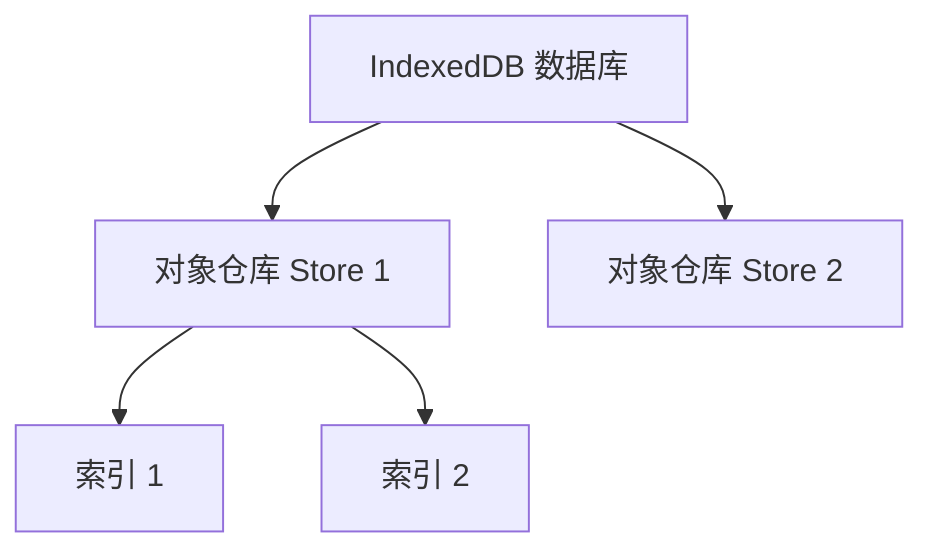

#### 6.4.2 基本操作

```javascript
// 打开数据库
const request = indexedDB.open('MyDB', 1)

// 数据库升级（创建表结构）
request.onupgradeneeded = (event) => {
  const db = event.target.result
  const store = db.createObjectStore('users', { keyPath: 'id' })
  store.createIndex('name', 'name', { unique: false })
  store.createIndex('email', 'email', { unique: true })
}

// 添加数据
request.onsuccess = (event) => {
  const db = event.target.result
  const tx = db.transaction('users', 'readwrite')
  const store = tx.objectStore('users')
  
  store.add({ id: 1, name: '张三', email: 'zhangsan@example.com' })
  store.add({ id: 2, name: '李四', email: 'lisi@example.com' })
}

// 查询数据
const tx = db.transaction('users', 'readonly')
const store = tx.objectStore('users')
const index = store.index('name')

index.get('张三').onsuccess = (e) => {
  console.log(e.target.result)
}
```

### 6.5 存储选择指南

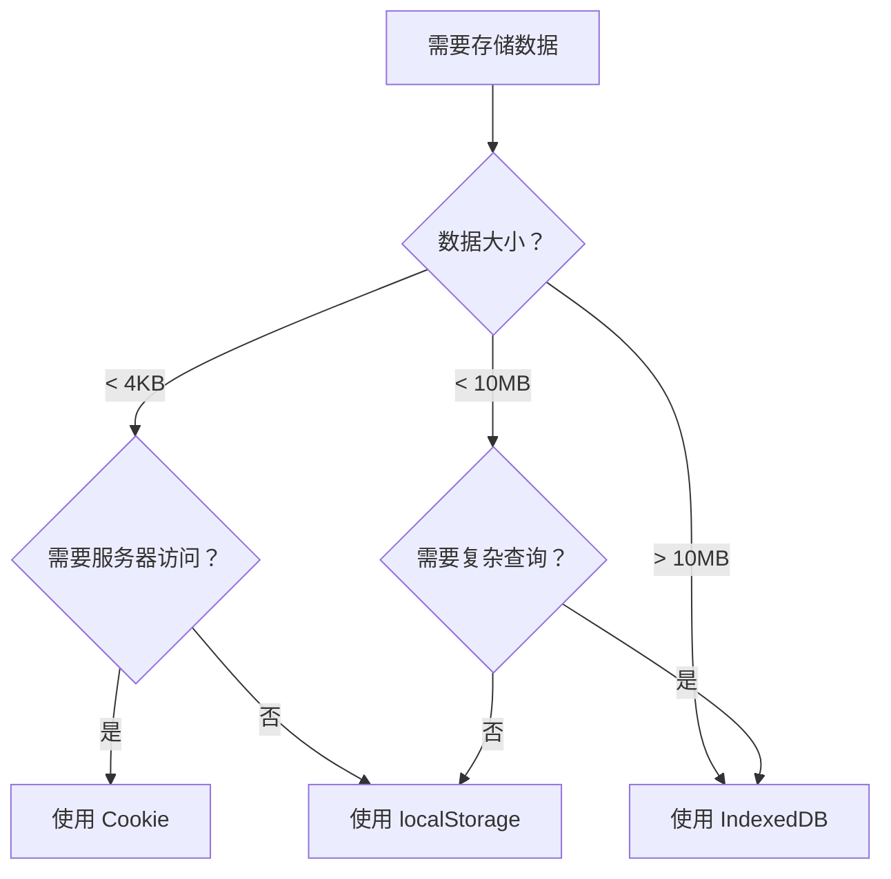

---

## 第 7 章 浏览器安全模型

### 7.1 同源策略（SOP）

#### 7.1.1 同源定义

**三要素：** 协议 + 域名 + 端口 完全一致

| URL 1 | URL 2 | 是否同源 |
|-------|-------|----------|
| `http://example.com` | `http://example.com/page` | ✅ 是 |
| `http://example.com` | `https://example.com` | ❌ 否（协议不同） |
| `http://example.com` | `http://sub.example.com` | ❌ 否（域名不同） |
| `http://example.com:80` | `http://example.com:8080` | ❌ 否（端口不同） |

#### 7.1.2 同源策略限制

| 限制内容 | 说明 |
|----------|------|
| Cookie/LocalStorage/IndexedDB | 无法读取非同源存储 |
| DOM 访问 | 无法访问 iframe 父/子页面 DOM |
| AJAX 请求 | 请求可发送，但浏览器拒绝响应 |

#### 7.1.3 跨域解决方案

```javascript
// 1. CORS（服务器端设置）
// 服务器响应头
Access-Control-Allow-Origin: https://example.com
Access-Control-Allow-Methods: GET, POST, PUT
Access-Control-Allow-Headers: Content-Type

// 2. JSONP（仅 GET 请求，已淘汰）
const script = document.createElement('script')
script.src = 'https://api.com/data?callback=handleData'
document.body.appendChild(script)

// 3. postMessage（安全通信）
// 父窗口发送
iframe.contentWindow.postMessage('message', 'https://child.com')

// 子窗口接收
window.addEventListener('message', (event) => {
  if (event.origin === 'https://parent.com') {
    console.log(event.data)
  }
})

// 4. 代理服务器
// 前端请求同域代理，代理转发到目标 API
fetch('/proxy?url=https://api.com/data')
```

### 7.2 内容安全策略（CSP）

#### 7.2.1 CSP 基础配置

```http
# HTTP 响应头
Content-Security-Policy: default-src 'self'; script-src 'self' https://trusted.cdn.com; style-src 'self' 'unsafe-inline'

# meta 标签方式
<meta http-equiv="Content-Security-Policy" 
      content="default-src 'self'; script-src 'self'">
```

#### 7.2.2 常用指令

| 指令 | 说明 | 示例 |
|------|------|------|
| `default-src` | 默认策略 | `default-src 'self'` |
| `script-src` | 脚本来源 | `script-src 'self' https://cdn.com` |
| `style-src` | 样式来源 | `style-src 'self' 'unsafe-inline'` |
| `img-src` | 图片来源 | `img-src 'self' data: https:` |
| `connect-src` | AJAX/WebSocket 目标 | `connect-src 'self' https://api.com` |
| `frame-ancestors` | 允许嵌入的父页面 | `frame-ancestors 'none'` |

#### 7.2.3 XSS 防护

```javascript
// CSP 禁止内联脚本
// script-src 'self' https://cdn.com;

// ❌ 被阻止
<script>alert('XSS')</script>
<div onclick="alert('XSS')">点击</div>

// ✅ 允许（外部脚本）
<script src="https://cdn.com/app.js"></script>

// ✅ 允许（nonce 方式）
// script-src 'self' 'nonce-abc123'
<script nonce="abc123">alert('安全')</script>
```

### 7.3 XSS 防御措施

#### 7.3.1 输入验证与过滤

```javascript
import DOMPurify from 'dompurify'

// 消毒 HTML
const dirty = '<script>alert("XSS")</script>Hello'
const clean = DOMPurify.sanitize(dirty)
// clean = 'Hello'

// 白名单配置
const clean2 = DOMPurify.sanitize(userInput, {
  ALLOWED_TAGS: ['b', 'i', 'em', 'strong'],
  ALLOWED_ATTR: ['href']
})
```

#### 7.3.2 输出编码

```javascript
// ❌ 不安全
element.innerHTML = userInput

// ✅ 安全
element.textContent = userInput

// React 自动转义
function Comment({ content }) {
  return <div>{content}</div>  // 自动 HTML 转义
}

// HTML 实体编码表
// < → &lt;  > → &gt;  & → &amp;  " → &quot;  ' → &#x27;
```

### 7.4 其他安全头

```http
# 防止 MIME 类型嗅探
X-Content-Type-Options: nosniff

# 防止点击劫持
X-Frame-Options: DENY

# XSS 保护（旧版浏览器）
X-XSS-Protection: 1; mode=block

# 强制 HTTPS
Strict-Transport-Security: max-age=63072000; includeSubDomains

# Referrer 策略
Referrer-Policy: strict-origin-when-cross-origin
```

---

## 第 8 章 性能优化实战

### 8.1 Core Web Vitals 指标

| 指标 | 含义 | 良好阈值 | 优化方向 |
|------|------|----------|----------|
| **LCP** | 最大内容绘制时间 | ≤ 2.5 秒 | 优化图片、CDN、减少阻塞 |
| **INP** | 交互响应延迟 | ≤ 200 毫秒 | 减少 JS 执行、任务切片 |
| **CLS** | 累积布局偏移 | ≤ 0.1 | 预留尺寸、避免插入内容 |

### 8.2 关键渲染路径优化

#### 8.2.1 减少阻塞资源

```html
<!-- ❌ 阻塞渲染 -->
<link rel="stylesheet" href="style.css">
<script src="app.js"></script>

<!-- ✅ 优化 -->
<!-- CSS 预加载 -->
<link rel="preload" href="critical.css" as="style">
<link rel="stylesheet" href="critical.css">
<link rel="stylesheet" href="non-critical.css" media="print" onload="this.media='all'">

<!-- JS 异步加载 -->
<script src="app.js" defer></script>
<script src="analytics.js" async></script>
```

#### 8.2.2 图片优化

```html
<!-- 现代格式 + 回退 -->
<picture>
  <source srcset="image.webp" type="image/webp">
  <source srcset="image.jpg" type="image/jpeg">
  
</picture>

<!-- 首屏关键图片预加载 -->
<link rel="preload" href="hero.jpg" as="image">
```

**优化策略：**
- 使用 WebP/AVIF 格式（体积减少 30-50%）
- 首屏图片直接加载，非首屏懒加载
- CDN 自动格式转换 + 压缩

#### 8.2.3 字体优化

```css
/* font-display: swap 避免 FOIT */
@font-face {
  font-family: 'MyFont';
  src: url('font.woff2') format('woff2');
  font-display: swap;
}

/* 关键文字内联 Base64 */
@font-face {
  font-family: 'CriticalFont';
  src: url(data:font/woff2;base64,d09GMgAB...) format('woff2');
}
```

### 8.3 JavaScript 优化

#### 8.3.1 代码分割

```javascript
// webpack 配置
module.exports = {
  optimization: {
    splitChunks: {
      chunks: 'all',
      cacheGroups: {
        vendors: {
          test: /[\\/]node_modules[\\/]/,
          name: 'vendors',
          priority: 10
        }
      }
    }
  }
}

// 动态导入
const Chart = () => import('chart.js')
```

#### 8.3.2 任务切片

```javascript
// ❌ 长任务阻塞主线程
function processData(data) {
  for (let i = 0; i < data.length; i++) {
    // 耗时操作
  }
}

// ✅ 任务切片
function processDataAsync(data) {
  let i = 0
  function chunk() {
    const end = Math.min(i + 100, data.length)
    for (; i < end; i++) {
      // 处理数据
    }
    if (i < data.length) {
      requestIdleCallback(chunk)
    }
  }
  chunk()
}
```

#### 8.3.3 Web Worker

```javascript
// main.js
const worker = new Worker('worker.js')
worker.postMessage({ type: 'COMPUTE', data: largeData })
worker.onmessage = (e) => {
  console.log('结果:', e.data)
}

// worker.js
self.onmessage = (e) => {
  const result = heavyComputation(e.data.data)
  self.postMessage(result)
}
```

### 8.4 性能监控

```javascript
// Core Web Vitals 监控
import { onLCP, onINP, onCLS } from 'web-vitals'

onLCP((metric) => {
  console.log('LCP:', metric.value)
  // 发送到分析服务
})

onINP((metric) => {
  console.log('INP:', metric.value)
})

onCLS((metric) => {
  console.log('CLS:', metric.value)
})

// Performance API
performance.mark('startLoad')
// ... 加载资源
performance.mark('endLoad')
performance.measure('loadTime', 'startLoad', 'endLoad')
const measure = performance.getEntriesByName('loadTime')[0]
console.log('加载耗时:', measure.duration)
```

### 8.5 Lighthouse 检查清单

| 类别 | 检查项 | 目标分数 |
|------|--------|----------|
| **性能** | LCP < 2.5s, INP < 200ms, CLS < 0.1 | ≥ 90 |
| **无障碍** | 色彩对比度、ARIA 标签、键盘导航 | ≥ 90 |
| **最佳实践** | HTTPS、无弃用 API、无错误 | ≥ 90 |
| **SEO** | 标题、描述、结构化数据 | ≥ 90 |
| **PWA** | Service Worker、离线可用、可安装 | 100 |

---

## 附录 A：快速参考卡

### 渲染流程速记

```
HTML → DOM →\
            → Render Tree → Layout → Paint → Rasterize → Composite → Display
CSS → CSSOM →
```

**光栅化（Rasterization）：** 矢量绘图指令 → 像素位图

### 任务优先级

```
同步代码 > 微任务队列 > UI 渲染 > 宏任务队列
```

### 缓存优先级

```
Service Worker > Memory Cache > Disk Cache > Push Cache > 网络请求
```

### 安全头配置

```http
Content-Security-Policy: default-src 'self'
X-Content-Type-Options: nosniff
X-Frame-Options: DENY
Strict-Transport-Security: max-age=63072000
```

---

## 参考资料

- [Chrome 多进程架构](https://blog.csdn.net/weixin_42382758/article/details/157032646)
- [浏览器渲染流水线](https://blog.csdn.net/qq_25416827/article/details/159348695)
- [V8 引擎原理](https://m.php.cn/faq/2208882.html)
- [V8 垃圾回收机制](https://cloud.tencent.com/developer/article/1829840)
- [事件循环与任务队列](https://cloud.tencent.com/developer/article/2600753)
- [HTTP 缓存机制](https://blog.csdn.net/an524415864/article/details/159825750)
- [浏览器存储技术](https://developer.aliyun.com/article/1195790)
- [同源策略与跨域](https://baike.baidu.com/item/同源策略/3927875)
- [内容安全策略 CSP](https://blog.csdn.net/liuyun_12138/article/details/149074449)
- [Core Web Vitals 优化](https://blog.csdn.net/2501_93878723/article/details/154287445)

---

*文档版本：1.0.0 | 最后更新：2026-04-05*
