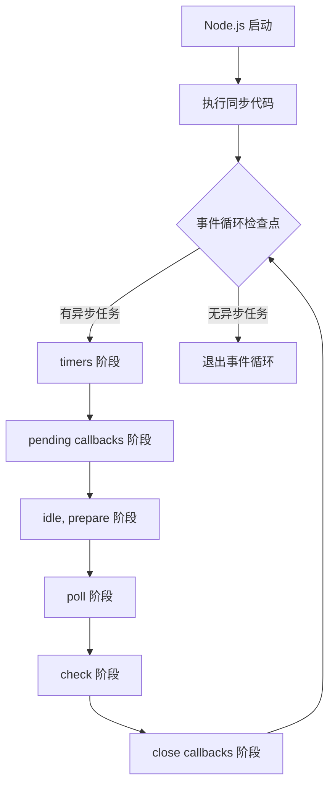
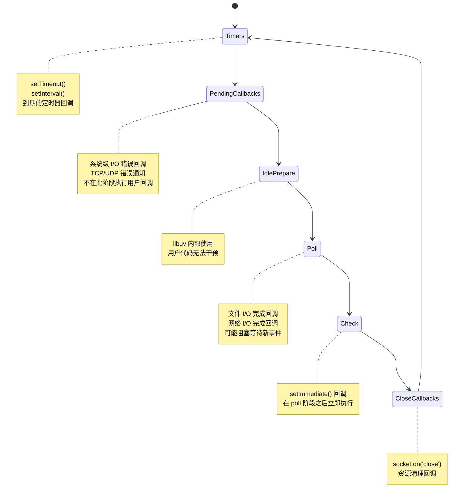
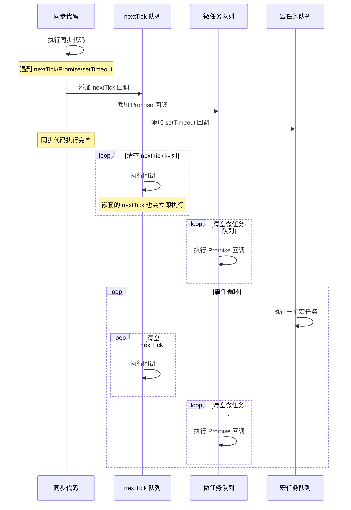
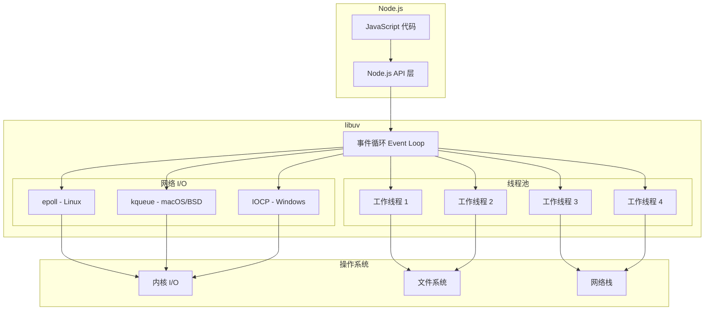
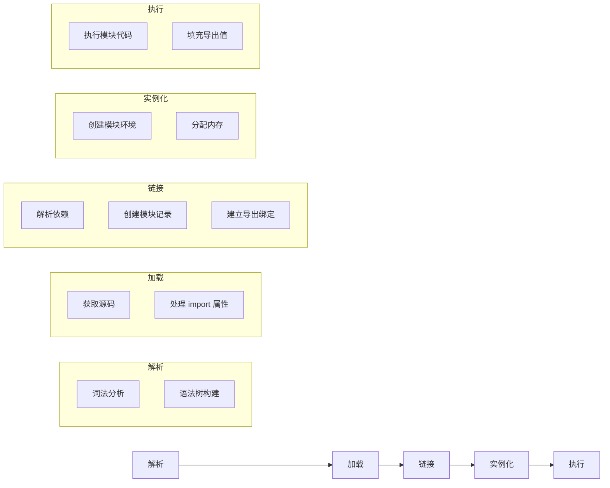

# Node.js 核心知识体系

## 第 3 章 事件循环深度解析

---

### 3.1 事件循环（Event Loop）的工作原理

#### 概念定义：是什么与为什么

**事件循环（Event Loop）** 是 Node.js 异步非阻塞 I/O 模型的核心机制，它是一个无限循环的消息分发系统，负责调度和执行所有异步回调。

**为什么需要事件循环？**

JavaScript 本质是单线程语言，同一时间只能执行一个任务。如果采用同步阻塞模型处理 I/O 操作（如文件读取、网络请求），线程会在等待 I/O 完成时完全挂起，导致：
- CPU 资源闲置浪费
- 无法响应其他用户请求
- 并发能力极低

Node.js 通过事件循环 + 异步 I/O 的组合解决了这个问题：
1. JavaScript 发起 I/O 请求后不等待结果，继续执行后续代码
2. I/O 操作由操作系统/线程池在后台完成
3. 完成后将回调函数加入事件循环的队列
4. 事件循环在合适的时机执行回调

```
┌─────────────────────────────────────────────────────────────┐
│                     JavaScript 代码                          │
│                     (单线程执行)                              │
└─────────────────────────┬───────────────────────────────────┘
                          │ 发起异步请求
                          ▼
┌─────────────────────────────────────────────────────────────┐
│                    Node.js API 层                            │
│                 (fs, http, net, timers 等)                   │
└─────────────────────────┬───────────────────────────────────┘
                          │ 委托底层处理
                          ▼
┌─────────────────────────────────────────────────────────────┐
│                   libuv 事件循环                             │
│  ┌─────────────────────────────────────────────────────┐   │
│  │  事件队列: timers | I/O | check | close callbacks  │   │
│  └─────────────────────────────────────────────────────┘   │
└─────────────────────────┬───────────────────────────────────┘
                          │
          ┌───────────────┴───────────────┐
          ▼                               ▼
┌──────────────────┐          ┌──────────────────┐
│   系统内核 I/O     │          │    libuv 线程池   │
│  (epoll/kqueue)  │          │   (文件/DNS/加密) │
└──────────────────┘          └──────────────────┘
```

**来源：**
- Node.js 官方文档 - The Node.js Event Loop
- libuv 官方文档 - libuv design overview
- https://nodejs.org/en/docs/guides/event-loop-timers-and-nexttick/

---

#### 工作原理：事件循环的完整流程

事件循环在 Node.js 启动时初始化，按固定顺序反复迭代执行，每次迭代称为一个"tick"。每个 tick 的处理流程如下：



**完整执行流程示例：**

```javascript
// event-loop-flow.js
const fs = require('fs');

console.log('1. 同步代码开始');

// timers 阶段回调
setTimeout(() => {
  console.log('2. timers: setTimeout 回调');
}, 0);

// check 阶段回调
setImmediate(() => {
  console.log('3. check: setImmediate 回调');
});

// poll 阶段回调 (I/O)
fs.readFile(__filename, () => {
  console.log('4. poll: 文件读取完成回调');
  
  // 在 I/O 回调中设置定时器
  setTimeout(() => {
    console.log('5. timers: 嵌套的 setTimeout');
  }, 0);
  
  // 在 I/O 回调中设置 immediate
  setImmediate(() => {
    console.log('6. check: 嵌套的 setImmediate');
  });
});

console.log('7. 同步代码结束');

// 输出顺序：
// 1. 同步代码开始
// 7. 同步代码结束
// 2. timers: setTimeout 回调 (或 3. check: setImmediate 回调 - 取决于执行时机)
// 3. check: setImmediate 回调 (或 2. timers: setTimeout 回调)
// 4. poll: 文件读取完成回调
// 5. timers: 嵌套的 setTimeout
// 6. check: 嵌套的 setImmediate
```

**关键点说明：**

1. **同步代码优先**：所有同步代码在事件循环开始前执行完毕
2. **阶段间清空**：每个阶段会执行完队列中所有回调后才进入下一阶段
3. **微任务插队**：process.nextTick 和 Promise 微任务会在阶段切换时插队执行
4. **循环终止**：当没有待处理的异步任务时，事件循环自动退出

**来源：**
- Node.js 官方文档 - Don't Block the Event Loop
- https://nodejs.org/en/docs/guides/dont-block-the-event-loop/

---

#### 源码级解析：事件循环的内部结构

libuv 使用 C 语言实现事件循环，核心数据结构如下：

```c
// libuv 中 event loop 的核心结构 (简化版)
struct uv_loop_s {
  void* data;                      // 用户数据
  unsigned int n_handles;          // 活跃 handle 数量
  unsigned int n_reqs;             // 活跃 request 数量
  
  // 六个阶段的队列
  uv_timer_t* timer_heap;          // timers 阶段的定时器堆
  uv_queue_t pending_queue;        // pending callbacks 队列
  uv_queue_t idle_handles;         // idle 阶段 handles
  uv_queue_t poll_handles;         // poll 阶段 handles  
  uv_queue_t check_handles;        // check 阶段 handles
  uv_queue_t close_handles;        // close callbacks 队列
  
  // 特殊队列
  uv_queue_t endgame_handles;      // 等待关闭的 handles
  int stop_flag;                   // 停止标志
};
```

**事件循环主循环（简化伪代码）：**

```c
int uv_run(uv_loop_t* loop, uv_run_mode mode) {
  while (!loop->stop_flag) {
    // 1. 更新定时器时间
    uv__update_time(loop);
    
    // 2. 检查是否还有活跃任务
    if (!has_active_handles_or_requests(loop)) {
      break;  // 退出循环
    }
    
    // 3. 执行 timers 阶段
    uv__run_timers(loop);
    
    // 4. 执行 pending callbacks 阶段
    uv__run_pending(loop);
    
    // 5. 执行 idle 阶段
    uv__run_idle(loop);
    
    // 6. 执行 poll 阶段 (可能阻塞)
    uv__io_poll(loop);
    
    // 7. 执行 check 阶段
    uv__run_check(loop);
    
    // 8. 执行 close callbacks 阶段
    uv__run_closing_handles(loop);
  }
  return loop->stop_flag;
}
```

**来源：**
- libuv 源码 - include/uv.h
- https://github.com/libuv/libuv/blob/v1.x/include/uv.h

---

### 3.2 事件循环的六个阶段详解

事件循环包含六个主要阶段，每个阶段都有一个 FIFO（先进先出）队列存储待执行的回调。



---

#### 阶段一：Timers（定时器阶段）

**执行内容：**
- `setTimeout(callback, delay)` 到期的回调
- `setInterval(callback, delay)` 到期的回调

**关键机制：**

1. **最小延迟时间**：即使设置 delay=0，实际延迟也至少为 1ms（某些系统为 4ms）
2. **时间抖动（Jitter）**：回调执行时间通常晚于预期，受系统负载和其他回调影响
3. **定时器堆**：使用最小堆数据结构，按到期时间排序，O(log n) 插入/删除

```javascript
// timers 阶段示例
console.log('开始');

setTimeout(() => {
  console.log('timeout 100ms');
}, 100);

setTimeout(() => {
  console.log('timeout 0ms');
}, 0);

// 实际输出：
// 开始
// timeout 0ms (实际延迟可能 1-4ms)
// timeout 100ms (实际延迟可能 100-110ms)
```

**定时器精度问题：**

```javascript
// 定时器精度测试
const start = Date.now();

setTimeout(() => {
  const elapsed = Date.now() - start;
  console.log(`期望 100ms, 实际 ${elapsed}ms`);
  
  // 阻塞操作模拟重负载
  while (Date.now() - start < 500) {
    // 空循环阻塞 500ms
  }
}, 100);

// 后续定时器会受影响
setTimeout(() => {
  const elapsed = Date.now() - start;
  console.log(`期望 200ms, 实际 ${elapsed}ms`);
}, 200);

// 输出示例：
// 期望 100ms, 实际 105ms
// 期望 200ms, 实际 605ms (因为前面阻塞了 500ms)
```

**源码解析：libuv 定时器实现**

```c
// libuv/src/unix/core.c - 定时器比较函数
static int timer_less_than(const uv__heap_node_t* a, 
                           const uv__heap_node_t* b) {
  const uv_timer_t* ta = container_of(a, uv_timer_t, heap_node);
  const uv_timer_t* tb = container_of(b, uv_timer_t, heap_node);
  
  // 按到期时间排序，时间相同则按插入顺序
  if (ta->timeout < tb->timeout) return 1;
  if (tb->timeout < ta->timeout) return 0;
  // 先插入的优先级更高 (FIFO)
  return ta->id < tb->id;
}

// 运行定时器 - 执行所有到期的回调
void uv__run_timers(uv_loop_t* loop) {
  uint64_t current_time = uv__hrtime(UV_CLOCK_FAST) / 1000000;
  
  while (loop->timer_heap != NULL) {
    uv_timer_t* handle = heap_min(loop->timer_heap);
    
    // 如果最小堆顶的定时器还未到期，停止执行
    if (handle->timeout > current_time) break;
    
    // 移除已到期定时器并执行回调
    heap_remove_min(loop->timer_heap);
    uv__make_close_pending(handle);
    handle->timeout = 0;
    
    if (handle->timer_cb != NULL) {
      handle->timer_cb(handle);
    }
  }
}
```

**来源：**
- Node.js 官方文档 - timers 阶段
- libuv 源码 - src/timer.c
- https://nodejs.org/api/timers.html

---

#### 阶段二：Pending Callbacks（待处理回调阶段）

**执行内容：**
- 某些系统操作的错误回调（如 TCP、UDP、文件系统错误）
- 上一轮循环中被延迟的 I/O 回调
- `socket.on('error', ...)` 类型的系统级错误

**不在此阶段执行：**
- `setTimeout` / `setInterval` 回调（在 timers 阶段）
- `setImmediate` 回调（在 check 阶段）
- `close` 事件回调（在 close callbacks 阶段）

```javascript
// pending callbacks 示例 - 系统级 I/O 错误
const net = require('net');

const server = net.createServer((socket) => {
  socket.on('error', (err) => {
    // 这类错误回调可能在 pending callbacks 阶段执行
    console.error('Socket error:', err);
  });
  
  // 强制触发错误
  socket.setKeepAlive(true, -1000);  // 无效参数可能触发错误
});

server.listen(3000);
```

**重要说明：**
pending callbacks 阶段主要由 libuv 内部使用，普通用户代码很少直接与此阶段交互。大多数用户级别的 I/O 回调实际上在 poll 阶段执行。

**来源：**
- Node.js 官方文档 - Event Loop 阶段说明
- https://nodejs.org/en/docs/guides/event-loop-timers-and-nexttick/

---

#### 阶段三：Idle / Prepare（空闲/准备阶段）

**执行内容：**
- 仅 libuv 内部使用
- 用户代码无法干预或注册此阶段的回调

**作用：**
为 libuv 提供内部清理和准备工作的执行时机，例如：
- 处理内部状态转换
- 准备下一阶段的执行环境

**注意：** 此阶段对用户透明，不需要关注。

---

#### 阶段四：Poll（轮询阶段）

**执行内容：**
- 文件 I/O 完成回调（fs.readFile, fs.writeFile 等）
- 网络 I/O 完成回调（HTTP 请求、TCP/UDP 连接）
- 除 close 回调、定时器回调、setImmediate 外的所有 I/O 回调

**关键特性：**

1. **可能阻塞**：如果 poll 队列为空且没有 pending 的 setImmediate，事件循环会阻塞在此阶段等待新 I/O 事件
2. **最大执行上限**：单次 poll 阶段最多执行 I/O_CALLBACKS_MAX 个回调（默认约 100 个），防止单个阶段占用过长时间
3. **阻塞退出条件**：
   - poll 队列非空时：同步执行所有回调直至队列为空或达到上限
   - poll 队列为空时：
     - 如果有 setImmediate：立即进入 check 阶段
     - 如果没有 setImmediate：阻塞等待新 I/O 事件加入

```javascript
// poll 阶段示例
const fs = require('fs');

console.log('开始读取文件');

// 文件 I/O 回调在 poll 阶段执行
fs.readFile(__filename, 'utf8', (err, data) => {
  console.log('文件读取完成');
  
  // 在 I/O 回调中设置定时器
  setTimeout(() => {
    console.log('定时器回调');
  }, 0);
  
  // 在 I/O 回调中设置 immediate
  setImmediate(() => {
    console.log('immediate 回调');
  });
});

console.log('等待文件读取...');

// 输出顺序：
// 开始读取文件
// 等待文件读取...
// 文件读取完成
// 定时器回调 (下一个 tick 的 timers 阶段)
// immediate 回调 (下一个 tick 的 check 阶段)
```

**阻塞行为示例：**

```javascript
// poll 阶段阻塞示例
const fs = require('fs');

console.log('脚本开始');

fs.readFile(__filename, () => {
  console.log('文件读取完成');
  
  // 设置一个长时间阻塞
  const start = Date.now();
  while (Date.now() - start < 100) {
    // 阻塞 100ms
  }
});

// 如果没有其他异步任务，事件循环会阻塞在 poll 阶段
// 等待文件读取完成
```

**源码解析：poll 阶段实现**

```c
// libuv/src/unix/epoll.c - Linux 上的 poll 实现
void uv__io_poll(uv_loop_t* loop, int timeout) {
  struct epoll_event events[MAX_EVENTS];
  int nfds;
  
  // 如果队列为空且没有 immediate，阻塞等待
  if (loop->pending_queue_empty && !has_immediate(loop)) {
    nfds = epoll_wait(loop->backend_fd, events, MAX_EVENTS, timeout);
  } else {
    // 否则立即返回
    nfds = epoll_wait(loop->backend_fd, events, MAX_EVENTS, 0);
  }
  
  // 处理就绪的事件
  for (int i = 0; i < nfds; i++) {
    uv__io_t* w = container_of(events[i].data.ptr, uv__io_t, watcher);
    w->cb(loop, w, events[i].events);
  }
}
```

**来源：**
- Node.js 官方文档 - poll 阶段
- libuv 源码 - src/unix/epoll.c
- https://nodejs.org/api/fs.html

---

#### 阶段五：Check（检查阶段）

**执行内容：**
- `setImmediate(callback)` 的回调

**关键特性：**

1. **立即执行**：在 poll 阶段之后立即执行
2. **不阻塞**：check 阶段不会阻塞等待
3. **I/O 回调后立即执行**：适合在 I/O 操作完成后立即执行某些逻辑

```javascript
// check 阶段示例
console.log('脚本开始');

setImmediate(() => {
  console.log('immediate 回调');
});

setTimeout(() => {
  console.log('timeout 回调');
}, 0);

console.log('脚本结束');

// 输出顺序（多数情况）：
// 脚本开始
// 脚本结束
// timeout 回调 (timers 阶段优先)
// immediate 回调 (check 阶段)

// 但如果在 I/O 回调中：
fs.readFile(__filename, () => {
  setTimeout(() => console.log('timeout in I/O'), 0);
  setImmediate(() => console.log('immediate in I/O'));
});
// 输出：
// immediate in I/O (总是先执行)
// timeout in I/O
```

**setImmediate vs setTimeout 深度对比：**

```javascript
// 递归调用测试
function recursiveSetImmediate(n) {
  if (n <= 0) return;
  setImmediate(() => {
    console.log(`immediate #${n}`);
    recursiveSetImmediate(n - 1);
  });
}

function recursiveSetTimeout(n) {
  if (n <= 0) return;
  setTimeout(() => {
    console.log(`timeout #${n}`);
    recursiveSetTimeout(n - 1);
  }, 0);
}

recursiveSetImmediate(5);
recursiveSetTimeout(5);

// 输出：
// immediate #5, #4, #3, #2, #1 (同一 tick 内执行)
// timeout #5, #4, #3, #2, #1 (每个 timeout 需要新的 tick)
```

**源码解析：check 阶段实现**

```c
// libuv/src/check.c
void uv__run_check(uv_loop_t* loop) {
  struct uv__queue* q = uv__queue_head(&loop->check_handles);
  
  while (q != &loop->check_handles) {
    uv_check_t* h = container_of(q, uv_check_t, queue);
    struct uv__queue* w = uv__queue_next(q);
    
    uv__queue_remove(q);
    uv__queue_insert_tail(&loop->check_handles, q);
    
    h->check_cb(h);
    
    q = w;
  }
}
```

**来源：**
- Node.js 官方文档 - setImmediate
- libuv 源码 - src/check.c
- https://nodejs.org/api/timers.html#setimmediatecallback-args

---

#### 阶段六：Close Callbacks（关闭回调阶段）

**执行内容：**
- `socket.on('close', ...)` 回调
- `stream.on('close', ...)` 回调
- 资源清理回调

```javascript
// close callbacks 阶段示例
const net = require('net');

const server = net.createServer((socket) => {
  socket.on('close', () => {
    console.log('连接已关闭');
  });
  
  socket.on('end', () => {
    console.log('连接结束');
    socket.destroy();
  });
  
  socket.write('Hello');
  socket.end();
});

server.listen(3000);
```

**重要注意事项：**

1. **资源清理**：确保在 close 回调中释放相关资源
2. **避免死循环**：在 close 回调中不要重新打开相同资源
3. **错误处理**：close 回调中也可能抛出错误，需要妥善处理

**来源：**
- Node.js 官方文档 - close 事件
- https://nodejs.org/api/net.html#event-close

---

### 3.3 宏任务与微任务的执行顺序（nextTick vs Promise）

#### 概念定义

**宏任务（Macro Task）**：在事件循环的某个阶段执行的回调，包括：
- `setTimeout` / `setInterval` 回调
- `setImmediate` 回调
- I/O 回调
- close 回调

**微任务（Micro Task）**：在当前阶段执行完毕后、下一阶段开始前立即执行的任务，包括：
- `process.nextTick` 回调
- `Promise.then` / `Promise.catch` / `Promise.finally` 回调
- `queueMicrotask` 回调

**关键区别：**
- 宏任务在下一个阶段执行
- 微任务在当前阶段结束后立即执行，甚至早于下一个宏任务

---

#### process.nextTick 深度解析

**是什么：**
`process.nextTick` 是 Node.js 特有的 API，用于在当前操作完成后、事件循环进入下一阶段之前立即执行回调。

**为什么存在：**
1. **保持 API 一致性**：某些 API 需要同步或异步执行，nextTick 确保回调总是在一致时机调用
2. **错误处理**：在构造函数中抛出错误很难捕获，nextTick 允许在对象创建后触发错误事件
3. **资源清理**：确保清理逻辑在当前同步代码完成后立即执行

```javascript
// nextTick 优先级示例
console.log('1. 同步代码');

process.nextTick(() => {
  console.log('2. nextTick 回调');
  
  // nextTick 可以递归调用，会立即执行
  process.nextTick(() => {
    console.log('3. 嵌套的 nextTick');
  });
});

Promise.resolve().then(() => {
  console.log('4. Promise 回调');
});

setTimeout(() => {
  console.log('5. setTimeout 回调');
}, 0);

// 输出：
// 1. 同步代码
// 2. nextTick 回调
// 3. 嵌套的 nextTick
// 4. Promise 回调
// 5. setTimeout 回调
```

**nextTick 队列与 Promise 微任务队列的区别：**

```javascript
// 执行顺序深度测试
console.log('start');

process.nextTick(() => {
  console.log('nextTick 1');
  process.nextTick(() => console.log('nextTick 2'));
});

Promise.resolve().then(() => {
  console.log('Promise 1');
  Promise.resolve().then(() => console.log('Promise 2'));
});

setTimeout(() => console.log('timeout'));

console.log('end');

// 输出：
// start
// end
// nextTick 1
// nextTick 2
// Promise 1
// Promise 2
// timeout
```

**关键点：**
1. nextTick 队列优先级高于 Promise 微任务队列
2. nextTick 队列会在当前阶段完全清空后才处理微任务
3. nextTick 中嵌套的 nextTick 会立即执行，而 Promise 嵌套则需要等待

---

#### 源码级解析：nextTick 内部实现

```javascript
// Node.js lib/internal/process/task_queues.js (简化版)

const kMaxTicks = 1e4;  // 最大 tick 数限制
let tickQueue = [];      // nextTick 队列
let running = false;     // 是否正在运行

function nextTick(callback) {
  tickQueue.push(callback);
  if (!running) {
    running = true;
    process._rawDebug('draining nextTick queue');
    drainQueue();
  }
}

function drainQueue() {
  let count = 0;
  while (count < kMaxTicks && tickQueue.length > 0) {
    const callback = tickQueue.shift();
    callback();
    count++;
  }
  running = false;
}

// process.nextTick 暴露给用户
process.nextTick = nextTick;
```

**C++ 层实现（简化）：**

```cpp
// Node.js src/node.cc
void ProcessNextTicks(v8::Local<v8::Context> context) {
  Environment* env = Environment::GetCurrent(context);
  
  while (env->has_next_tick_scheduled()) {
    const std::vector<v8::Local<v8::Function>>& callbacks = 
        env->get_next_tick_callbacks();
    
    for (auto& cb : callbacks) {
      cb->Call(context, Null(context), 0, nullptr);
    }
    
    callbacks.clear();
  }
}
```

**来源：**
- Node.js 源码 - lib/internal/process/task_queues.js
- Node.js 源码 - src/node.cc
- https://nodejs.org/api/process.html#process_process_nexttick_callback_args

---

#### Promise 微任务执行机制

**是什么：**
Promise 微任务是 ECMAScript 标准定义的异步机制，在同步代码执行完毕后、下一个宏任务之前执行。

**执行时机：**

```javascript
// Promise 微任务执行时机
console.log('1. script start');

setTimeout(() => {
  console.log('2. setTimeout');
}, 0);

Promise.resolve()
  .then(() => {
    console.log('3. Promise.then 1');
    return Promise.resolve();
  })
  .then(() => {
    console.log('4. Promise.then 2');
  });

setTimeout(() => {
  console.log('5. setTimeout 2');
}, 0);

console.log('6. script end');

// 输出：
// 1. script start
// 6. script end
// 3. Promise.then 1
// 4. Promise.then 2
// 2. setTimeout
// 5. setTimeout 2
```

**微任务队列处理流程：**

```javascript
// 每个宏任务执行完毕后的微任务处理
while (macrotaskQueue.length > 0) {
  const macrotask = macrotaskQueue.shift();
  execute(macrotask);
  
  // 执行完一个宏任务后，清空微任务队列
  while (microtaskQueue.length > 0) {
    const microtask = microtaskQueue.shift();
    execute(microtask);
  }
}
```

---

#### 完整执行顺序图示



---

#### 常见误区

**误区 1：nextTick 和 Promise 优先级相同**

```javascript
// 错误认知：认为 nextTick 和 Promise 执行顺序不确定

// 实际情况：nextTick 总是优先于 Promise
process.nextTick(() => console.log('nextTick'));
Promise.resolve().then(() => console.log('Promise'));
// 输出：nextTick -> Promise
```

**误区 2：setTimeout(fn, 0) 会立即执行**

```javascript
// 错误认知：认为 setTimeout(fn, 0) 会立即执行

// 实际情况：需要等待至少 1ms 且要等到下一个 timers 阶段
console.log('start');
setTimeout(() => console.log('timeout'), 0);
console.log('end');
// 输出：start -> end -> timeout
```

**误区 3：微任务在宏任务执行过程中也能插队**

```javascript
// 错误认知：认为宏任务执行中的微任务会立即执行

// 实际情况：宏任务内部的微任务要等到当前宏任务完成
setTimeout(() => {
  console.log('macro start');
  Promise.resolve().then(() => console.log('micro in macro'));
  console.log('macro end');
}, 0);
// 输出：macro start -> macro end -> micro in macro
```

---

#### 最佳实践

**1. 使用 nextTick 处理错误**

```javascript
class MyClass {
  constructor(data) {
    if (!data) {
      // 使用 nextTick 确保错误在一致时机抛出
      process.nextTick(() => {
        this.emit('error', new Error('data is required'));
      });
      return;
    }
    this.data = data;
  }
}
```

**2. 避免 nextTick 递归导致栈溢出**

```javascript
// 危险：无限递归的 nextTick
function dangerous() {
  process.nextTick(dangerous);
}
dangerous();  // 最终导致内存耗尽

// 安全：使用 setTimeout 限制递归深度
function safe(n) {
  if (n <= 0) return;
  setTimeout(() => safe(n - 1), 0);
}
safe(10000);
```

**3. 使用 queueMicrotask 替代 Promise.resolve().then**

```javascript
// 推荐方式
queueMicrotask(() => {
  console.log('microtask');
});

// 等价但更简洁
Promise.resolve().then(() => {
  console.log('microtask');
});
```

**来源：**
- Node.js 官方文档 - process.nextTick
- https://nodejs.org/api/process.html

---

### 3.4 非阻塞 I/O 与 libuv 的 I/O 多路复用

#### 概念定义：阻塞 I/O 与非阻塞 I/O

**阻塞 I/O（Blocking I/O）：**
当应用程序发起 I/O 请求（如读取文件、网络请求）时，当前线程会阻塞等待 I/O 操作完成，期间无法执行任何其他任务。

```javascript
// 阻塞 I/O 示例
const fs = require('fs');

console.log('开始读取');
const data = fs.readFileSync('/path/to/file');  // 线程阻塞在这里
console.log('读取完成');  // 只有读取完成后才能执行

// 问题：如果文件很大或磁盘慢，后续代码完全无法执行
```

**非阻塞 I/O（Non-blocking I/O）：**
应用程序发起 I/O 请求后立即返回，不等待结果，I/O 操作在后台完成，完成后通过回调、Promise 或事件通知应用程序。

```javascript
// 非阻塞 I/O 示例
const fs = require('fs');

console.log('开始读取');
fs.readFile('/path/to/file', (err, data) => {
  console.log('读取完成');  // 回调在 I/O 完成后执行
});
console.log('继续执行');  // 不会等待读取完成

// 输出：开始读取 -> 继续执行 -> 读取完成
```

---

#### libuv 架构解析

libuv 是 Node.js 异步 I/O 的核心库，提供跨平台的 I/O 多路复用机制。



**libuv 核心组件：**

| 组件 | 作用 | 使用场景 |
|------|------|----------|
| 事件循环 | 调度和执行异步回调 | 所有异步操作 |
| epoll/kqueue/IOCP | I/O 多路复用 | 网络 I/O、非阻塞文件 I/O |
| 线程池 | 执行阻塞操作 | 文件 I/O、DNS 查询、加密 |
| 异步 I/O API | 统一的跨平台接口 | fs、net、http 等模块 |

---

#### I/O 多路复用机制对比

**1. epoll（Linux）**

epoll 是 Linux 2.6+ 内核提供的高效 I/O 多路复用机制，采用事件驱动模型。

**工作原理：**
1. 应用通过 `epoll_create` 创建 epoll 实例
2. 通过 `epoll_ctl` 注册感兴趣的 fd 和事件类型
3. 通过 `epoll_wait` 阻塞等待事件
4. 内核维护就绪列表，有事件时唤醒应用

**优势：**
- O(1) 时间复杂度，不受 fd 数量影响
- 内核主动通知，无需轮询
- 支持边缘触发（ET）和水平触发（LT）

```c
// epoll 使用示例（简化）
int epfd = epoll_create(1);

struct epoll_event event;
event.events = EPOLLIN | EPOLLET;  // 读事件 + 边缘触发
event.data.fd = sockfd;

epoll_ctl(epfd, EPOLL_CTL_ADD, sockfd, &event);

// 等待事件
struct epoll_event events[MAX_EVENTS];
int nfds = epoll_wait(epfd, events, MAX_EVENTS, -1);

for (int i = 0; i < nfds; i++) {
    handle_event(events[i].data.fd);
}
```

**来源：** Linux epoll 官方文档

---

**2. kqueue（macOS/BSD）**

kqueue 是 BSD 系统（包括 macOS）的事件通知接口，功能比 epoll 更强大。

**工作原理：**
1. 通过 `kqueue()` 创建队列
2. 通过 `kevent()` 注册事件过滤器
3. 通过 `kevent()` 等待事件

**支持的过滤器类型：**
- `EVFILT_READ`：读就绪
- `EVFILT_WRITE`：写就绪
- `EVFILT_TIMER`：定时器
- `EVFILT_SIGNAL`：信号
- `EVFILT_VNODE`：文件状态变化

```c
// kqueue 使用示例（简化）
int kq = kqueue();

struct kevent change;
EV_SET(&change, sockfd, EVFILT_READ, EV_ADD, 0, 0, NULL);

struct kevent events[MAX_EVENTS];
int nev = kevent(kq, &change, 1, events, MAX_EVENTS, NULL);

for (int i = 0; i < nev; i++) {
    handle_event(events[i].ident);
}
```

---

**3. IOCP（Windows）**

IOCP（I/O Completion Port）是 Windows 特有的异步 I/O 机制，设计用于高并发场景。

**工作原理：**
1. 创建完成端口
2. 将 socket/file handle 关联到完成端口
3. 发起异步 I/O 请求（立即返回）
4. I/O 完成后，系统将完成包放入完成端口队列
5. 工作线程从队列取出完成包处理

**优势：**
- 真正的异步 I/O，不需要事件循环轮询
- 内核自动调度线程，负载均衡
- 无上下文切换开销

```cpp
// IOCP 简化示例
HANDLE hCP = CreateIoCompletionPort(INVALID_HANDLE_VALUE, NULL, 0, 0);

// 关联 socket 到完成端口
CreateIoCompletionPort(hSocket, hCP, (ULONG_PTR)context, 0);

// 发起异步读取
ReadFile(hSocket, buffer, size, NULL, &overlapped);

// 工作线程等待完成包
DWORD bytes;
ULONG_PTR key;
LPOVERLAPPED ov;
GetQueuedCompletionStatus(hCP, &bytes, &key, &ov, INFINITE);

// 处理完成
handle_completion(key, bytes, ov);
```

---

#### 三种机制对比表

| 特性 | epoll | kqueue | IOCP |
|------|-------|--------|------|
| 平台 | Linux 2.6+ | macOS/BSD | Windows |
| 模型 | 事件通知 | 事件过滤 | 完成端口 |
| 时间复杂度 | O(1) | O(1) | O(1) |
| 触发方式 | ET/LT | 边缘/水平 | 完成通知 |
| 支持事件 | 读/写/异常 | 读/写/定时/信号/文件 | 所有 I/O |
| API 调用 | 3 个系统调用 | 2 个系统调用 | 多个 API |
| 线程模型 | 单线程事件循环 | 单线程事件循环 | 多线程池 |

---

#### Node.js 中的 I/O 多路复用实现

**网络 I/O（使用 epoll/kqueue/IOCP）：**

```javascript
const net = require('net');

const server = net.createServer((socket) => {
  // 连接建立，socket 被注册到 epoll/kqueue/IOCP
  socket.on('data', (data) => {
    // 数据到达时，内核通知 libuv，回调在 poll 阶段执行
    console.log('收到数据:', data.toString());
  });
  
  socket.on('end', () => {
    console.log('连接断开');
  });
});

server.listen(3000, () => {
  console.log('服务器监听 3000 端口');
  
  // 此时事件循环在 poll 阶段阻塞，等待连接事件
  // 当有新连接时，内核唤醒事件循环，执行回调
});
```

**文件 I/O（使用线程池）：**

```javascript
const fs = require('fs');

// 文件 I/O 使用线程池，不是 epoll/kqueue
fs.readFile('/path/to/file', (err, data) => {
  // 回调在工作线程完成读取后，由事件循环调度执行
  console.log('文件读取完成');
});

// 调整线程池大小（默认 4）
process.env.UV_THREADPOOL_SIZE = 8;
```

**为什么文件 I/O 使用线程池？**
- 大多数操作系统不支持异步文件 I/O（Linux AIO 仅限于 O_DIRECT）
- 文件操作（尤其是磁盘 I/O）可能阻塞，使用线程池避免阻塞事件循环
- 线程池大小有限，大量文件 I/O 可能导致排队

---

#### 源码解析：libuv I/O 多路复用

```c
// libuv/src/unix/linux.c - Linux epoll 实现

static int uv__epoll_init(uv_loop_t* loop) {
  int fd;
  
  // 创建 epoll 实例
  fd = epoll_create1(O_CLOEXEC);
  if (fd < 0) return UV__ERR(errno);
  
  loop->backend_fd = fd;
  loop->io_watcher.cb = uv__io_poll;  // 设置 poll 回调
  
  return 0;
}

// 注册 fd 到 epoll
static void uv__epoll_add(uv_loop_t* loop, int fd, int events) {
  struct epoll_event e;
  
  e.events = events;  // EPOLLIN, EPOLLOUT 等
  e.data.fd = fd;
  
  epoll_ctl(loop->backend_fd, EPOLL_CTL_ADD, fd, &e);
}

// 主 poll 函数
void uv__io_poll(uv_loop_t* loop, int timeout) {
  struct epoll_event events[MAX_EVENTS];
  int nfds;
  
  // 阻塞等待事件
  nfds = epoll_wait(loop->backend_fd, events, MAX_EVENTS, timeout);
  
  if (nfds > 0) {
    for (int i = 0; i < nfds; i++) {
      uv__io_t* w = container_of(events[i].data.ptr, uv__io_t, watcher);
      w->cb(loop, w, events[i].events);  // 执行回调
    }
  }
}
```

**来源：**
- libuv 源码 - src/unix/linux.c
- libuv 源码 - src/unix/core.c

---

#### 常见误区

**误区 1：所有 I/O 都是异步的**

```javascript
// 错误：fs.readFile 在某些情况下是同步的
// 实际：fs.readFile 总是异步，但使用线程池

// 真正的同步 I/O
const data = fs.readFileSync('/path/to/file');  // 阻塞

// 异步 I/O
fs.readFile('/path/to/file', (err, data) => {
  // 非阻塞
});
```

**误区 2：线程池越大越好**

```javascript
// 错误：盲目增大线程池
process.env.UV_THREADPOOL_SIZE = 100;  // 可能导致更多上下文切换

// 正确：根据 CPU 核心数调整
const os = require('os');
process.env.UV_THREADPOOL_SIZE = os.cpus().length * 2;
```

**误区 3：epoll 没有性能问题**

```javascript
// 错误：认为 epoll 总是高效
// 实际：边缘触发（ET）模式下，必须循环读取直到 EAGAIN
// 否则可能遗漏数据

socket.setEncoding('utf8');
socket.on('data', (data) => {
  // 必须处理完所有数据
  while (true) {
    const chunk = socket.read();
    if (chunk === null) break;
    process(chunk);
  }
});
```

---

#### 最佳实践

**1. 避免阻塞事件循环**

```javascript
// 错误：同步操作阻塞事件循环
app.get('/heavy', (req, res) => {
  const result = heavyComputation();  // 阻塞 1 秒
  res.send(result);
});

// 正确：使用 Worker Threads
const { Worker } = require('worker_threads');
app.get('/heavy', (req, res) => {
  const worker = new Worker('./heavy.js');
  worker.on('message', (result) => res.send(result));
});
```

**2. 监控事件循环延迟**

```javascript
// 使用 eventLoopUtilization 监控
const { performance } = require('perf_hooks');
const { eventLoopUtilization } = performance;

let last = eventLoopUtilization();
setInterval(() => {
  const current = eventLoopUtilization();
  const elu = eventLoopUtilization(current, last);
  console.log('事件循环利用率:', elu.utilization);
  last = current;
}, 1000);
```

**3. 合理设置线程池大小**

```javascript
// 根据工作负载类型调整
// 文件密集型：增加线程池
process.env.UV_THREADPOOL_SIZE = 16;

// CPU 密集型：使用 Worker Threads
const { Worker } = require('worker_threads');
```

**来源：**
- Node.js 官方文档 - Don't Block the Event Loop
- https://nodejs.org/en/docs/guides/dont-block-the-event-loop/

---

### 3.5 事件发射器 EventEmitter 源码级解析

#### 概念定义

**EventEmitter** 是 Node.js 中实现事件驱动架构的核心类，提供发布-订阅模式的基础实现。

**核心功能：**
- `on(event, listener)`：注册持续监听器
- `once(event, listener)`：注册一次性监听器
- `emit(event, ...args)`：触发事件
- `off(event, listener)`：移除监听器
- `listenerCount(event)`：获取监听器数量

```javascript
const { EventEmitter } = require('events');

class MyEmitter extends EventEmitter {}

const emitter = new MyEmitter();

// 注册监听器
emitter.on('data', (data) => {
  console.log('收到数据:', data);
});

// 触发事件
emitter.emit('data', 'hello');
```

---

#### 源码级解析：EventEmitter 内部实现

**核心数据结构：**

```javascript
// Node.js events.js (简化版)
function EventEmitter() {
  this._events = Object.create(null);
  this._eventsCount = 0;
  this._maxListeners = 10;  // 默认最大监听器数
}

// 内部结构示例：
// emitter._events = {
//   'data': [listener1, listener2, listener3],
//   'error': errorHandler,  // 单个监听器时直接存储
//   Symbol(kCapture): false
// }
```

**on 方法实现：**

```javascript
EventEmitter.prototype.on = function(type, listener) {
  if (typeof listener !== 'function') {
    throw new TypeError('listener must be a function');
  }
  
  let events = this._events;
  let existing;
  
  // 检查是否已存在监听器
  if (events) {
    existing = events[type];
  } else {
    events = this._events = Object.create(null);
    this._eventsCount = 0;
  }
  
  if (!existing) {
    // 没有监听器，直接存储
    events[type] = listener;
  } else if (typeof existing === 'function') {
    // 一个监听器，转换为数组
    events[type] = [existing, listener];
  } else {
    // 多个监听器，添加到数组
    existing.push(listener);
  }
  
  // 检查监听器数量限制
  const max = this._maxListeners || 10;
  if (max > 0 && events[type].length > max) {
    console.warn('MaxListenersExceededWarning');
  }
  
  this._eventsCount++;
  return this;
};
```

**once 方法实现：**

```javascript
EventEmitter.prototype.once = function(type, listener) {
  if (typeof listener !== 'function') {
    throw new TypeError('listener must be a function');
  }
  
  // 创建包装函数
  const wrapper = function(...args) {
    // 先移除自身
    emitter.removeListener(type, wrapper);
    // 再调用原始监听器
    listener.apply(this, args);
  };
  
  wrapper.listener = listener;
  
  return this.on(type, wrapper);
};

// 使用示例
emitter.once('connect', () => {
  console.log('只执行一次');
});
```

**emit 方法实现：**

```javascript
EventEmitter.prototype.emit = function(type, ...args) {
  let events = this._events;
  if (!events) return false;
  
  const handler = events[type];
  if (!handler) return false;
  
  // 单个监听器
  if (typeof handler === 'function') {
    handler.apply(this, args);
    return true;
  }
  
  // 多个监听器
  const len = handler.length;
  for (let i = 0; i < len; i++) {
    handler[i].apply(this, args);
  }
  return true;
};
```

**removeListener 方法实现：**

```javascript
EventEmitter.prototype.removeListener = function(type, listener) {
  if (typeof listener !== 'function') {
    throw new TypeError('listener must be a function');
  }
  
  const events = this._events;
  if (!events) return this;
  
  const handler = events[type];
  if (!handler) return this;
  
  if (handler === listener || handler.listener === listener) {
    // 只有一个监听器且匹配
    delete events[type];
  } else if (typeof handler === 'function') {
    // 单个监听器但不匹配
    return this;
  } else {
    // 多个监听器，查找并移除
    for (let i = 0; i < handler.length; i++) {
      if (handler[i] === listener || handler[i].listener === listener) {
        handler.splice(i, 1);
        break;
      }
    }
  }
  
  return this;
};
```

---

#### EventEmitter 完整类结构

```javascript
const EventEmitter = require('events');

class MyEmitter extends EventEmitter {
  constructor() {
    super();
    // 设置最大监听器数
    this.setMaxListeners(20);
  }
  
  // 触发带参数的oevent
  emitData(data) {
    this.emit('data', data);
  }
  
  // 触发错误事件
  emitError(err) {
    this.emit('error', err);
  }
}

const emitter = new MyEmitter();

// 监听事件
emitter.on('data', (data) => {
  console.log('data:', data);
});

// 监听错误
emitter.on('error', (err) => {
  console.error('error:', err.message);
});

// 一次性监听
emitter.once('ready', () => {
  console.log('ready - 只执行一次');
});

// 获取监听器数量
console.log(emitter.listenerCount('data'));  // 1

// 移除监听器
const handler = (data) => console.log(data);
emitter.on('data', handler);
emitter.off('data', handler);

// 获取所有监听器
console.log(emitter.listeners('data'));
```

---

#### 事件执行顺序与 this 指向

```javascript
const emitter = new EventEmitter();

// this 指向测试
const obj = {
  name: 'MyObject'
};

// 普通函数：this 指向 emitter
emitter.on('test1', function() {
  console.log('this:', this);  // EventEmitter 实例
});

// 箭头函数：this 指向定义时的作用域
emitter.on('test2', () => {
  console.log('this:', this);  // 外层作用域的 this
});

// 绑定 this
emitter.on('test3', function() {
  console.log('this:', this);
}.bind(obj));

emitter.emit('test1');
emitter.emit('test2');
emitter.emit('test3');
```

---

#### 特殊事件

**newListener 事件：**

```javascript
const emitter = new EventEmitter();

// 监听 newListener 事件
emitter.on('newListener', (event, listener) => {
  console.log(`添加了监听器：${event}`);
});

emitter.on('data', () => {});
// 输出：添加了监听器：data
```

**removeListener 事件：**

```javascript
emitter.on('removeListener', (event, listener) => {
  console.log(`移除了监听器：${event}`);
});
```

**error 事件特殊处理：**

```javascript
// 如果 emit('error') 但没有监听器，会抛出未捕获异常
const emitter = new EventEmitter();

// 错误：没有监听 error 事件
emitter.emit('error', new Error('Something wrong'));
// 抛出：Uncaught Error: Something wrong

// 正确：监听 error 事件
emitter.on('error', (err) => {
  console.error('处理错误:', err.message);
});
```

---

#### 常见误区

**误区 1：exports 和 module.exports 可以混用**

```javascript
// 错误：exports = xxx 不会导出
exports = function() {};  // 无效

// 正确：使用 module.exports
module.exports = function() {};
```

**误区 2：EventEmitter 会自动异步执行**

```javascript
// 错误：认为 emit 是异步的
emitter.on('data', (data) => {
  console.log('1. listener');
});
emitter.emit('data');
console.log('2. after emit');
// 输出：1. listener -> 2. after emit (同步执行)

// 正确：需要异步时手动包裹
emitter.on('data', (data) => {
  setImmediate(() => console.log('async'));
});
```

**误区 3：监听器数量限制是硬性限制**

```javascript
// 错误：超过 10 个监听器就报错
// 实际：只是警告，可以通过 setMaxListeners 调整
emitter.setMaxListeners(100);
```

---

#### 最佳实践

**1. 继承 EventEmitter**

```javascript
const { EventEmitter } = require('events');

class Database extends EventEmitter {
  async connect() {
    try {
      // 连接逻辑
      this.emit('connected');
    } catch (err) {
      this.emit('error', err);
    }
  }
}

const db = new Database();
db.on('connected', () => console.log('数据库已连接'));
db.on('error', (err) => console.error('数据库错误:', err));
db.connect();
```

**2. 使用 util.inherits（传统方式）**

```javascript
const util = require('util');
const EventEmitter = require('events');

function MyEmitter() {
  EventEmitter.call(this);
}

util.inherits(MyEmitter, EventEmitter);
```

**3. 内存泄漏防范**

```javascript
// 及时移除监听器
const handler = (data) => console.log(data);
emitter.on('data', handler);

// 使用完后移除
emitter.removeListener('data', handler);

// 或使用 once
emitter.once('data', handler);
```

**来源：**
- Node.js 官方文档 - Events
- Node.js 源码 - lib/events.js
- https://nodejs.org/api/events.html

---

## 第 4 章 模块系统底层机制

---

### 4.1 CommonJS 规范：module 对象、require 实现原理

#### 概念定义

**CommonJS** 是 Node.js 使用的模块系统规范，定义了一套同步的模块加载机制。

**核心特性：**
- 同步加载：`require()` 是同步操作，会阻塞直到模块加载完成
- 运行时加载：模块在运行时动态加载和解析
- 值拷贝导出：导出的是值的拷贝（基本类型）或引用（对象/函数）
- 模块缓存：加载后的模块会被缓存，重复 require 返回缓存实例

```javascript
// CommonJS 基本用法
// circle.js
const { PI } = Math;

exports.area = (r) => PI * r ** 2;
exports.circumference = (r) => 2 * PI * r;

// app.js
const circle = require('./circle.js');
console.log(circle.area(4));  // 50.26548245743669
```

---

#### module 对象详解

**module 对象属性：**

| 属性 | 描述 |
|------|------|
| `module.exports` | 模块的实际导出对象 |
| `module.id` | 模块的唯一标识符 |
| `module.filename` | 模块的绝对路径 |
| `module.loaded` | 是否已加载完成 |
| `module.parent` | 父模块（谁 require 了这个模块） |
| `module.children` | 子模块数组（这个模块 require 了哪些） |
| `module.paths` | 模块搜索路径数组 |
| `module.isPreloading` | 是否在预加载中 |

```javascript
// module 对象属性测试
console.log('module.id:', module.id);           // '.'
console.log('module.filename:', module.filename); // 绝对路径
console.log('module.loaded:', module.loaded);   // false -> true
console.log('module.parent:', module.parent);   // null 或父模块
console.log('module.children:', module.children); // []
console.log('module.paths:', module.paths);     // 搜索路径
```

---

#### require 函数详解

**require 方法：**

| 方法 | 描述 |
|------|------|
| `require(id)` | 加载模块 |
| `require.resolve(id)` | 返回模块的绝对路径 |
| `require.cache` | 缓存的模块对象 |
| `require.extensions` | 文件扩展名处理器（已废弃） |
| `require.main` | 主模块对象 |

```javascript
// require 方法测试

// 1. require.resolve - 获取模块路径
const path = require.resolve('./circle.js');
console.log(path);  // /absolute/path/to/circle.js

// 2. require.cache - 查看缓存
console.log(require.cache);

// 3. require.main - 判断是否为主模块
console.log(require.main === module);  // true 表示当前文件是入口

// 4. require.extensions - 自定义加载器（不推荐使用）
require.extensions['.txt'] = (module, filename) => {
  const fs = require('fs');
  module.exports = fs.readFileSync(filename, 'utf8');
};
```

---

#### 模块包装器（Module Wrapper）

Node.js 在加载模块时会将代码包装在一个函数中，创建模块作用域：

```javascript
// 原始代码
// circle.js
const { PI } = Math;
exports.area = (r) => PI * r ** 2;

// 实际执行的代码（包装后）
(function(exports, require, module, __filename, __dirname) {
  const { PI } = Math;
  exports.area = (r) => PI * r ** 2;
});
```

**包装函数的参数：**
- `exports`：`module.exports` 的引用
- `require`：模块加载函数
- `module`：当前模块对象
- `__filename`：当前文件的绝对路径
- `__dirname`：当前文件所在目录的绝对路径

**为什么需要包装？**
1. **创建模块作用域**：避免全局变量污染
2. **注入特殊变量**：提供 `exports`、`require`、`module` 等
3. **支持 `__filename` 和 `__dirname`**：这些变量不是全局的，而是包装函数注入的

```javascript
// 验证包装函数
console.log(typeof exports);        // 'object'
console.log(typeof require);        // 'function'
console.log(typeof module);         // 'object'
console.log(typeof __filename);     // 'string'
console.log(typeof __dirname);      // 'string'

// 这些变量在其他 JavaScript 环境中不存在
```

---

#### exports vs module.exports

```javascript
// 核心区别：exports 是 module.exports 的引用

// 场景 1：添加属性（两者等价）
exports.name = 'Alice';
module.exports.name = 'Alice';

// 场景 2：重新赋值（只有 module.exports 有效）
exports = { name: 'Alice' };  // 无效！exports 被重新赋值，与 module.exports 断开
module.exports = { name: 'Alice' };  // 有效

// 场景 3：导出函数或类
// 错误
exports = function() {};

// 正确
module.exports = function() {};

// 或者
exports.default = function() {};
```

---

#### 模块缓存机制

```javascript
// 第一次加载
const a = require('./module-a.js');
console.log(require.cache);  // 包含 module-a

// 第二次加载（返回缓存）
const a2 = require('./module-a.js');
console.log(a === a2);  // true，同一实例

// 清除缓存
delete require.cache[require.resolve('./module-a.js')];
const a3 = require('./module-a.js');  // 重新加载
console.log(a === a3);  // false，新实例
```

**缓存查找流程：**

```mermaid
flowchart TD
    A[require('./module')] --> B{检查缓存}
    B -->|缓存命中 | C[返回缓存的 module.exports]
    B -->|缓存未命中 | D[创建新 Module 对象]
    D --> E[解析模块路径]
    E --> F[读取文件内容]
    F --> G[包装代码]
    G --> H[执行模块代码]
    H --> I[缓存 module 对象]
    I --> J[返回 module.exports]
```

---

#### 源码解析：Module._load

```javascript
// Node.js lib/internal/modules/cjs/loader.js (简化版)

Module._load = function(request, parent, isMain) {
  // 1. 解析模块路径
  const filename = Module._resolveFilename(request, parent, isMain);
  
  // 2. 检查缓存
  const cachedModule = Module._cache[filename];
  if (cachedModule !== undefined) {
    return cachedModule.exports;  // 返回缓存
  }
  
  // 3. 创建新模块
  const module = new Module(filename, parent);
  
  // 4. 缓存模块（在加载前缓存，防止循环依赖）
  Module._cache[filename] = module;
  
  try {
    // 5. 加载模块
    module.load(filename);
    return module.exports;
  } catch (err) {
    // 6. 加载失败，清除缓存
    delete Module._cache[filename];
    throw err;
  }
};

// Module.prototype.load
Module.prototype.load = function(filename) {
  const extension = path.extname(filename);
  
  // 根据扩展名调用对应的加载函数
  Module._extensions[extension](this, filename);
  
  this.loaded = true;
};

// .js 文件加载
Module._extensions['.js'] = function(module, filename) {
  const content = fs.readFileSync(filename, 'utf8');
  module._compile(content, filename);
};

// 模块编译
Module.prototype._compile = function(content, filename) {
  // 1. 包装代码
  const wrapper = Module.wrap(content);
  
  // 2. 创建 VM 脚本
  const compiledWrapper = vm.runInThisContext(wrapper, {
    filename: filename,
    lineOffset: 0
  });
  
  // 3. 执行模块代码
  const result = compiledWrapper.call(
    this.exports,      // this 指向
    this.exports,      // exports
    require,           // require
    this,              // module
    filename,          // __filename
    path.dirname(filename)  // __dirname
  );
  
  return result;
};

// 模块包装函数
Module.wrap = function(script) {
  return '(function(exports, require, module, __filename, __dirname) { ' +
         script +
         '\n});';
};
```

---

### 4.2 ES Modules(ESM) 规范：静态分析、链接与实例化

#### 概念定义

**ES Modules (ESM)** 是 JavaScript 官方的模块标准，Node.js 从 v12+ 开始全面支持。

**与 CommonJS 的核心区别：**

| 特性 | CommonJS | ES Modules |
|------|----------|------------|
| 导入语法 | `require()` | `import` |
| 导出语法 | `module.exports` | `export` |
| 加载时机 | 运行时动态加载 | 编译时静态分析 |
| 执行顺序 | 同步加载 | 异步加载 |
| 导出绑定 | 值拷贝 | 实时绑定（引用） |
| this 指向 | 指向 exports | 指向 undefined |
| 文件扩展名 | `.js` | `.mjs` 或 `"type": "module"` |

```javascript
// ESM 基本用法
// add.mjs
export function add(a, b) {
  return a + b;
}

// app.mjs
import { add } from './add.mjs';
console.log(add(1, 2));  // 3
```

---

#### 静态分析与编译时检查

**静态分析的优势：**

1. **编译时优化**：可以在编译时确定依赖关系，进行 tree-shaking
2. **循环依赖处理**：ESM 能更好地处理循环依赖
3. **语法检查**：导入不存在的导出会在编译时报错

```javascript
// ESM 静态分析示例
// 以下代码在编译时就会报错，因为 './math.js' 没有导出 'subtract'
import { add, subtract } from './math.mjs';
// SyntaxError: The requested module './math.mjs' does not provide an export named 'subtract'
```

**CommonJS 运行时加载：**

```javascript
// CommonJS 可以动态加载
const moduleName = Math.random() > 0.5 ? './a.js' : './b.js';
const module = require(moduleName);  // 运行时决定
```

**ESM 动态导入：**

```javascript
// ESM 动态导入（返回 Promise）
const moduleName = Math.random() > 0.5 ? './a.mjs' : './b.mjs';
import(moduleName).then(module => {
  // 使用模块
});

// top-level await
const module = await import('./module.mjs');
```

---

#### 链接与实例化

**ESM 加载流程：**



**1. 解析（Parsing）**
- 词法分析：将源码分解为 token
- 语法分析：构建抽象语法树（AST）
- 提取 import/export 语句

**2. 加载（Loading）**
- 根据 import specifier 获取源码
- 处理模块属性（如 import attributes）

**3. 链接（Linking）**
- 解析所有依赖
- 创建模块记录（Module Record）
- 建立导出绑定（export bindings）

**4. 实例化（Instantiation）**
- 创建模块环境
- 为变量分配内存空间

**5. 执行（Evaluation）**
- 执行模块代码
- 填充导出值

---

#### 实时绑定 vs 值拷贝

**CommonJS 值拷贝：**

```javascript
// counter.js (CJS)
let count = 0;
module.exports = {
  get count() { return count; },
  increment() { count++; }
};

// app.js (CJS)
const counter = require('./counter.js');
counter.increment();
console.log(counter.count);  // 1
```

**ESM 实时绑定：**

```javascript
// counter.mjs (ESM)
export let count = 0;
export function increment() {
  count++;
}

// app.mjs (ESM)
import { count, increment } from './counter.mjs';
increment();
console.log(count);  // 1（实时绑定）

// 甚至可以修改导入的变量
// 注意：这在实际开发中不推荐
import { count } from './counter.mjs';
count = 100;  // 会修改原始模块的 count
```

---

#### import.meta

`import.meta` 是 ESM 特有的元对象，包含模块相关信息：

```javascript
// import.meta.url - 当前模块的 URL
console.log(import.meta.url);
// file:///path/to/module.mjs

// import.meta.dirname - 当前模块所在目录（Node.js 20.11+）
console.log(import.meta.dirname);
// /path/to

// import.meta.filename - 当前模块的文件路径（Node.js 20.11+）
console.log(import.meta.filename);
// /path/to/module.mjs

// import.meta.resolve - 解析模块路径
const resolved = import.meta.resolve('./module.mjs');
console.log(resolved);
```

---

### 4.3 CJS 与 ESM 的互操作与迁移指南

#### ESM 中导入 CommonJS

```javascript
// ESM 导入 CJS
// CJS 模块: ./cjs-module.js
module.exports = {
  name: 'CJS Module',
  greet() { console.log('Hello from CJS'); }
};

// ESM 导入
import cjsModule from './cjs-module.js';  // default 导入
console.log(cjsModule.name);  // 'CJS Module'
cjsModule.greet();

// 命名导入（需要 CJS 导出特定格式）
// CJS: exports.named = 'value';
import { named } from './cjs-module.js';
```

**注意事项：**
- CJS 模块的 `module.exports` 在 ESM 中作为 `default` 导出
- 不能使用 `import { name } from './cjs.js'` 直接解构 CJS 导出

---

#### CommonJS 中导入 ESM

```javascript
// CJS 不能直接 require ESM
// 以下代码会报错：
// const esm = require('./esm.mjs');  // ERR_REQUIRE_ESM

// 正确方式：使用动态 import()
async function loadESM() {
  const esm = await import('./esm.mjs');
  return esm;
}

loadESM().then(module => {
  console.log(module);
});
```

---

#### package.json 配置

```json
{
  // 方式 1：使用 .mjs 扩展名（ESM）
  // 方式 2：使用 "type": "module"（所有.js 视为 ESM）
  "type": "module",
  
  // 方式 3：使用 .cjs 强制指定 CJS
  // 方式 4：不设置 type，默认 CJS
}
```

**迁移策略：**

**阶段 1：双格式支持**

```json
{
  "main": "./dist/index.cjs",
  "module": "./dist/index.mjs",
  "exports": {
    ".": {
      "import": "./dist/index.mjs",
      "require": "./dist/index.cjs"
    }
  }
}
```

**阶段 2：完全迁移到 ESM**

```javascript
// 从
module.exports = { foo, bar };
const mod = require('./mod');

// 到
export { foo, bar };
import mod from './mod';
```

---

#### 互操作完整示例

```javascript
// === CommonJS 模块 ===
// cjs-module.js
const value = 'CJS';

function getValue() {
  return value;
}

module.exports = {
  value,
  getValue
};

// === ES Module 模块 ===
// esm-module.mjs
export const value = 'ESM';

export function getValue() {
  return value;
}

// === ESM 导入 CJS ===
// esm-import-cjs.mjs
import cjs from './cjs-module.js';
console.log(cjs.value);  // 'CJS'

// === CJS 导入 ESM ===
// cjs-import-esm.cjs
async function main() {
  const esm = await import('./esm-module.mjs');
  console.log(esm.value);  // 'ESM'
}
main();
```

---

### 4.4 模块解析算法：路径查找、缓存机制、循环依赖处理

#### 模块类型识别

Node.js 根据以下规则识别模块类型：

```
┌─────────────────────────────────┐
│   文件扩展名是什么？             │
└─────────────┬───────────────────┘
              │
     ┌────────┼────────┐
     │        │        │
     ▼        ▼        ▼
   .mjs     .cjs     .js
     │        │        │
     │        │        ▼
     │        │   检查 package.json
     │        │        │
     │        │   ┌────┴────┐
     │        │   │ type 字段 │
     │        │   └────┬────┘
     │        │        │
     │        │   ┌────┼────┐
     │        │   ▼    ▼    ▼
     │        │ module commonjs 无设置
     │        │   │    │    │
     │        │   ▼    ▼    ▼
     │        │  ESM  CJS  CJS
     ▼        ▼    │
    ESM      ESM   │
                  ▼
               默认为 CJS
```

---

#### 路径解析算法

**1. 核心模块**

```javascript
// 以 node: 开头或内置模块名
require('node:fs');
require('fs');
require('http');

// 解析流程：
// 1. 检查是否在核心模块列表
// 2. 是则直接返回，不进行路径查找
```

**2. 相对/绝对路径**

```javascript
// 以 ./ 或 ../ 或 / 开头
require('./module.js');
require('../lib/module.js');
require('/absolute/path/module.js');

// 解析流程：
// 1. 解析为绝对路径
// 2. 检查文件是否存在
// 3. 如果无扩展名，按 .js, .json, .node 顺序尝试
// 4. 如果是目录，检查 package.json 的 main 字段或 index 文件
```

**3. 模块名称（node_modules 查找）**

```javascript
// 不带路径前缀
require('lodash');
require('@scope/package');

// 解析流程：
// 1. 从当前目录开始查找 node_modules
// 2. 逐级向上查找父目录的 node_modules
// 3. 检查全局 node_modules
```

**node_modules 查找路径示例：**

```
项目结构：
/home/user/my-project/
├── node_modules/          # 级别 1
├── src/
│   ├── utils/
│   │   └── helper.js      # require('lodash')
│   └── lib/
│       └── module.js      # require('lodash')
│
└── package.json

查找路径（从 /home/user/my-project/src/utils/helper.js）：
1. /home/user/my-project/src/utils/node_modules
2. /home/user/my-project/src/node_modules
3. /home/user/my-project/node_modules  ← 找到
4. /home/user/node_modules
5. /home/node_modules
6. /node_modules
```

---

#### 模块解析完整流程图

```mermaid
flowchart TD
    A[require(id)] --> B{是否为 node:前缀？}
    B -->|是 | C[加载核心模块]
    B -->|否 | D{是否以/./../开头？}
    D -->|是 | E[路径解析]
    D -->|否 | F[node_modules 查找]
    
    E --> E1[解析为绝对路径]
    E1 --> E2{文件存在？}
    E2 -->|是 | E3[加载文件]
    E2 -->|否 | E4{是目录？}
    E4 -->|是 | E5[检查 package.json]
    E5 --> E6[加载 main 或 index]
    E4 -->|否 | E7[抛出错误]
    
    F --> F1[当前目录 node_modules]
    F1 --> F2{找到？}
    F2 -->|否 | F3[父目录 node_modules]
    F3 --> F2
    F2 -->|是 | F4[应用包解析逻辑]
    
    C --> G[返回模块]
    E3 --> G
    E6 --> G
    F4 --> G
```

---

#### 缓存机制

```javascript
// Module._cache 结构
Module._cache = {
  '/path/to/module.js': {
    id: '/path/to/module.js',
    exports: { /* 导出对象 */ },
    loaded: true,
    children: [/* 子模块 */],
    filename: '/path/to/module.js',
    path: '/path/to'
  }
};

// 缓存命中测试
const a = require('./module');
const b = require('./module');
console.log(a === b);  // true

// 清除缓存
delete require.cache[require.resolve('./module')];
const c = require('./module');
console.log(a === c);  // false
```

---

#### 循环依赖处理

**场景：**
```
A.js require B.js
B.js require A.js
```

**CommonJS 处理：**

```javascript
// a.js
console.log('a.js 开始执行');
const b = require('./b.js');
console.log('a.js: b =', b);
module.exports = { name: 'A' };

// b.js
console.log('b.js 开始执行');
const a = require('./a.js');
console.log('b.js: a =', a);
module.exports = { name: 'B' };

// 执行结果：
// a.js 开始执行
// b.js 开始执行
// b.js: a = {}  (空对象，因为 a.js 还没执行完)
// a.js: b = { name: 'B' }
```

**ESM 处理：**

```javascript
// a.mjs
import { b } from './b.mjs';
console.log('a.mjs: b =', b);
export const a = 'A';

// b.mjs
import { a } from './a.mjs';
console.log('b.mjs: a =', a);
export const b = 'B';

// 执行结果：
// b.mjs: a = undefined  (a 还未初始化)
// a.mjs: b = 'B'
```

**解决方案：**

1. **重构代码**：提取公共依赖到独立模块
2. **延迟加载**：在函数内部 require
3. **使用 ESM**：ESM 的循环依赖处理更可靠

```javascript
// 延迟加载示例
// a.js
function getB() {
  return require('./b.js');
}
module.exports = { getB };

// b.js
const a = require('./a.js');  // 此时 a.js 已加载完成
module.exports = { name: 'B' };
```

---

### 4.5 模块加载器源码级分析（Module._load 内部实现）

#### 完整加载流程

```mermaid
flowchart TD
    A[require(id)] --> B[Module._load]
    B --> C[解析文件名]
    C --> D[检查缓存]
    D -->|命中 | E[返回 exports]
    D -->|未命中 | F[创建 Module]
    F --> G[缓存 Module]
    G --> H[调用 module.load]
    H --> I[根据扩展名选择加载器]
    I --> J[.js 加载器]
    I --> K[.json 加载器]
    I --> L[.node 加载器]
    J --> M[读取文件内容]
    K --> M
    L --> M
    M --> N[编译代码]
    N --> O[执行模块]
    O --> P[返回 exports]
```

---

#### Module._load 源码解析

```javascript
// Node.js lib/internal/modules/cjs/loader.js

Module._load = function(request, parent, isMain) {
  // ========== 第 1 步：解析模块路径 ==========
  const filename = Module._resolveFilename(request, parent, isMain);
  
  // ========== 第 2 步：检查缓存 ==========
  const cachedModule = Module._cache[filename];
  if (cachedModule !== undefined) {
    // 缓存命中，直接返回
    return cachedModule.exports;
  }
  
  // ========== 第 3 步：核心模块检查 ==========
  if (nativeModule.canBeRequiredByUsers(request)) {
    // 加载核心模块（如 fs, http 等）
    return nativeModule.load(request);
  }
  
  // ========== 第 4 步：创建新模块 ==========
  const module = new Module(filename, parent);
  
  // ========== 第 5 步：预缓存 ==========
  // 在加载前缓存，防止循环依赖导致无限递归
  Module._cache[filename] = module;
  
  // ========== 第 6 步：加载模块 ==========
  try {
    module.load(filename);
    return module.exports;
  } catch (err) {
    // ========== 第 7 步：加载失败处理 ==========
    delete Module._cache[filename];
    throw err;
  }
};
```

---

#### Module._resolveFilename 源码解析

```javascript
Module._resolveFilename = function(request, parent, isMain, options) {
  // 1. 处理 node: 前缀
  if (request.startsWith('node:')) {
    request = request.slice(5);
  }
  
  // 2. 检查是否是核心模块
  if (nativeModule.nonInternalExists(request)) {
    return request;
  }
  
  // 3. 解析路径
  const paths = Module._resolveLookupPaths(request, parent);
  
  // 4. 查找文件
  const filename = Module._findPath(request, paths, isMain);
  
  if (!filename) {
    const err = new Error(`Cannot find module '${request}'`);
    err.code = 'MODULE_NOT_FOUND';
    throw err;
  }
  
  return filename;
};
```

---

#### Module._findPath 源码解析

```javascript
Module._findPath = function(request, paths, isMain) {
  // 1. 获取请求的扩展名
  const extension = path.extname(request);
  
  // 2. 如果是文件路径，直接检查
  if (path.isAbsolute(request)) {
    return tryFile(request, isMain);
  }
  
  // 3. 遍历搜索路径
  for (const basePath of paths) {
    // 3.1 尝试直接作为文件加载
    let filename = tryFile(path.join(basePath, request), isMain);
    if (filename) return filename;
    
    // 3.2 尝试添加扩展名
    if (!extension) {
      for (const ext of ['.js', '.json', '.node']) {
        filename = tryFile(path.join(basePath, request + ext), isMain);
        if (filename) return filename;
      }
    }
    
    // 3.3 尝试作为目录加载
    filename = tryDirectory(path.join(basePath, request), isMain);
    if (filename) return filename;
  }
  
  return false;
};

// 尝试加载文件
function tryFile(request, isMain) {
  const stat = fs.statSync(request);
  if (stat.isFile()) {
    return path.resolve(request);
  }
  return false;
}

// 尝试加载目录
function tryDirectory(request, isMain) {
  // 检查 package.json
  const pkgPath = path.join(request, 'package.json');
  if (fs.existsSync(pkgPath)) {
    const pkg = JSON.parse(fs.readFileSync(pkgPath, 'utf8'));
    if (pkg.main) {
      const mainPath = path.join(request, pkg.main);
      const result = tryFile(mainPath, isMain);
      if (result) return result;
    }
  }
  
  // 检查 index 文件
  for (const ext of ['.js', '.json', '.node']) {
    const indexPath = path.join(request, 'index' + ext);
    const result = tryFile(indexPath, isMain);
    if (result) return result;
  }
  
  return false;
}
```

---

#### 加载器扩展机制

```javascript
// Module._extensions 定义
Module._extensions = {
  '.js': function(module, filename) {
    const content = fs.readFileSync(filename, 'utf8');
    module._compile(content, filename);
  },
  
  '.json': function(module, filename) {
    const content = fs.readFileSync(filename, 'utf8');
    module.exports = JSON.parse(content);
  },
  
  '.node': function(module, filename) {
    module.exports = process.dlopen(module, filename);
  }
};

// 自定义加载器（不推荐，已废弃）
require.extensions['.txt'] = function(module, filename) {
  const content = fs.readFileSync(filename, 'utf8');
  module.exports = content;
};
```

---

#### 模块编译源码解析

```javascript
Module.prototype._compile = function(content, filename) {
  // 1. 创建 Module 包装函数
  const wrapper = Module.wrap(content);
  // wrapper 结果：
  // '(function(exports, require, module, __filename, __dirname) { 
  //   ' + content + '\n});'
  
  // 2. 创建 VM 脚本
  const compiledWrapper = vm.runInThisContext(wrapper, {
    filename: filename,
    lineOffset: 0,
    displayErrors: true
  });
  
  // 3. 准备参数
  const args = [
    this.exports,      // exports
    require,           // require
    this,              // module
    filename,          // __filename
    path.dirname(filename)  // __dirname
  ];
  
  // 4. 执行模块代码
  const result = compiledWrapper.apply(this.exports, args);
  
  return result;
};
```

---

#### ESM 加载器钩子

```javascript
// ESM 自定义加载器 (--loader)
// my-loader.mjs

export async function resolve(specifier, context, defaultResolve) {
  // 自定义解析逻辑
  if (specifier.startsWith('@')) {
    // 处理别名
    return {
      url: 'file:///path/to/' + specifier.slice(1),
      shortCircuit: true
    };
  }
  
  return defaultResolve(specifier, context, defaultResolve);
}

export async function load(url, context, defaultLoad) {
  // 自定义加载逻辑
  if (url.endsWith('.custom')) {
    return {
      format: 'module',
      source: 'export default "custom"'
    };
  }
  
  return defaultLoad(url, context, defaultLoad);
}
```

---

## 参考资料

1. Node.js 官方文档 - Event Loop
   https://nodejs.org/en/docs/guides/event-loop-timers-and-nexttick/

2. Node.js 官方文档 - Don't Block the Event Loop
   https://nodejs.org/en/docs/guides/dont-block-the-event-loop/

3. Node.js 官方文档 - Modules: CommonJS modules
   https://nodejs.org/api/modules.html

4. Node.js 官方文档 - Modules: ECMAScript modules
   https://nodejs.org/api/esm.html

5. Node.js 官方文档 - Events
   https://nodejs.org/api/events.html

6. libuv 官方文档
   https://libuv.org/

7. libuv 源码
   https://github.com/libuv/libuv

8. Node.js 源码
   https://github.com/nodejs/node

9. Linux epoll 文档
   https://man7.org/linux/man-pages/man7/epoll.7.html

10. kqueue 文档
    https://www.freebsd.org/cgi/man.cgi?kqueue
