# Node.js 核心知识体系

## 第 5 章 异步编程模式演进

> **本章导读**：JavaScript 的异步编程经历了从回调函数到 Promise，再到 async/await 的演进历程。本章将深入剖析每种模式的内部实现原理，揭示事件循环、微任务调度、状态机等底层机制，帮助读者建立完整的异步编程知识体系。

---

## 5.1 回调函数与错误处理（错误优先回调约定）

### 5.1.1 概念定义

**回调函数（Callback Function）** 是作为参数传递给其他函数的函数，在异步操作中用于在操作完成后执行后续逻辑。Node.js 采用**错误优先回调（Error-first Callback）**约定，这是异步错误处理的基础范式。

**为什么需要错误优先回调？** 在异步编程中，错误无法通过传统的 try-catch 捕获，因为异步操作完成时，原始调用栈早已执行完毕。错误优先回调通过统一的参数约定，强制开发者显式处理错误，避免错误被静默忽略。

### 5.1.2 错误优先回调约定

Node.js 核心模块遵循的回调模式：**回调函数的第一个参数始终是错误对象（Error），后续参数才是实际数据**。

```javascript
const fs = require('fs');

// 错误优先回调的标准格式
fs.readFile('example.txt', 'utf8', function(error, data) {
  if (error) {
    // 错误处理逻辑 - 必须首先检查
    console.error('读取文件时发生错误:', error.message);
    return; // 错误时提前返回，避免继续执行
  }
  // 正常处理逻辑
  console.log('文件内容:', data);
});
```

**关键约定：**
1. **第一个参数是 Error 对象**：如果操作失败，第一个参数为 Error 实例；如果成功，则为 `null` 或 `undefined`
2. **后续参数是结果数据**：成功时的返回值从第二个参数开始
3. **回调必须被调用**：异步操作完成时，回调必须被调用一次且仅一次

### 5.1.3 底层实现机制

Node.js 的回调执行依赖于**事件循环（Event Loop）**和**libuv 线程池**。

```cpp
// libuv 线程池中的任务结构（简化版）
struct uv__work {
  void (*work)(struct uv__work *w);    // 实际工作函数
  void (*done)(struct uv__work *w, int status); // 完成回调
  struct uv_loop_s* loop;              // 事件循环指针
  void* wq[2];                         // 工作队列节点
};
```

**异步文件读取流程：**

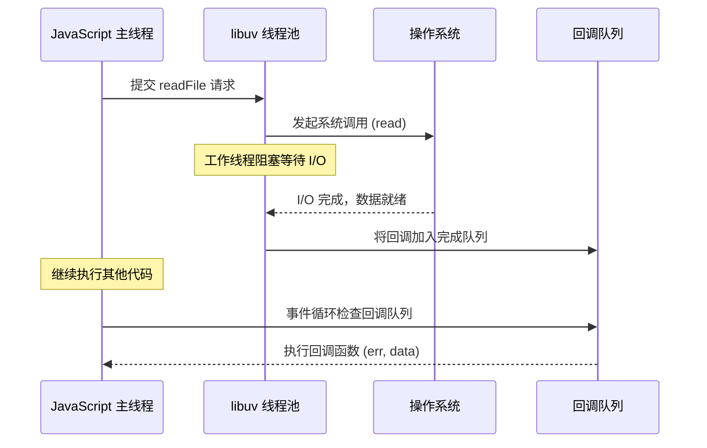

### 5.1.4 回调地狱（Callback Hell）

当多个异步操作需要顺序执行时，嵌套回调会导致代码难以维护：

```javascript
// ❌ 回调地狱示例
fs.readFile('user.json', 'utf8', (err, userData) => {
  if (err) throw err;
  const user = JSON.parse(userData);
  
  fs.readFile('posts.json', 'utf8', (err, postData) => {
    if (err) throw err;
    const posts = JSON.parse(postData);
    
    fs.readFile('comments.json', 'utf8', (err, commentData) => {
      if (err) throw err;
      const comments = JSON.parse(commentData);
      
      // 最终处理逻辑
      render(user, posts, comments);
    });
  });
});
```

**问题根源：**
- 代码向右缩进，可读性差
- 错误处理重复且分散
- 流程控制复杂，难以追踪执行顺序

### 5.1.5 常见误区

| 误区 | 正确理解 |
|------|----------|
| 忽略错误参数检查 | 必须首先检查 `if (error)` |
| 在回调中抛出异常 | 应调用回调传递错误，而非 `throw` |
| 多次调用回调 | 回调只能被调用一次 |
| 同步代码中使用异步回调 | 同步操作应直接返回结果 |

### 5.1.6 最佳实践

**1. 使用辅助函数处理错误：**

```javascript
function handleFileRead(path, callback) {
  fs.readFile(path, 'utf8', (err, data) => {
    if (err) {
      if (err.code === 'ENOENT') {
        // 文件不存在的特殊处理
        return callback(null, null);
      }
      return callback(err);
    }
    callback(null, data);
  });
}
```

**2. 使用 async/await 替代嵌套回调（后续章节详解）：**

```javascript
// ✅ 使用 Promise 化后的 API
const fs = require('fs').promises;

async function loadData() {
  try {
    const userData = await fs.readFile('user.json', 'utf8');
    const postData = await fs.readFile('posts.json', 'utf8');
    const commentData = await fs.readFile('comments.json', 'utf8');
    
    return {
      user: JSON.parse(userData),
      posts: JSON.parse(postData),
      comments: JSON.parse(commentData)
    };
  } catch (error) {
    console.error('加载数据失败:', error);
    throw error;
  }
}
```

---

## 5.2 Promise 内部实现：状态机、微任务调度

### 5.2.1 概念定义

**Promise** 是表示异步操作最终完成或失败的对象。它是一个**状态机**，内部维护一个状态（pending/fulfilled/rejected）和对应的值。

**为什么需要 Promise？**
- 解决回调地狱问题，支持链式调用
- 统一异步错误处理机制
- 提供组合多个异步操作的能力（Promise.all、Promise.race）
- 作为 async/await 的基础

### 5.2.2 Promise 状态机原理

**Promise/A+ 规范**定义了 Promise 的三种状态及转换规则：

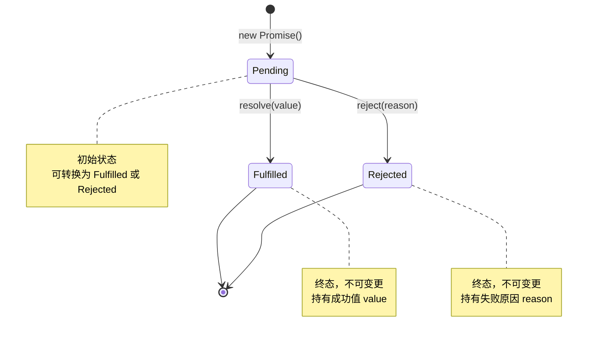

**状态转换规则（Promise/A+ 规范 2.1）：**

1. **Pending（等待态）**
   - 初始状态，既可转换为 fulfilled，也可转换为 rejected
   - 可能转换到任一终态

2. **Fulfilled（成功态）**
   - 必须不能转换到其他状态
   - 必须拥有一个不可变的 value

3. **Rejected（失败态）**
   - 必须不能转换到其他状态
   - 必须拥有一个不可变的 reason

### 5.2.3 Promise 内部实现源码解析

以下是符合 Promise/A+ 规范的简化实现：

```javascript
// Promise 的三种状态
const PENDING = 'pending';
const FULFILLED = 'fulfilled';
const REJECTED = 'rejected';

class MyPromise {
  constructor(executor) {
    this.status = PENDING;      // 当前状态
    this.value = undefined;     // fulfilled 时的值
    this.reason = undefined;    // rejected 时的原因
    
    // 回调队列（支持多次 then 调用）
    this.onFulfilledCallbacks = [];
    this.onRejectedCallbacks = [];
    
    // 绑定 this，确保回调中 this 指向正确
    this._resolve = this._resolve.bind(this);
    this._reject = this._reject.bind(this);
    
    // 立即执行 executor
    try {
      executor(this._resolve, this._reject);
    } catch (error) {
      this._reject(error);
    }
  }
  
  _resolve(value) {
    // 状态只能从 pending 转换一次
    if (this.status !== PENDING) return;
    
    // 处理 thenable 对象（解决 Promise 嵌套）
    if (value instanceof MyPromise) {
      value.then(this._resolve, this._reject);
      return;
    }
    
    this.status = FULFILLED;
    this.value = value;
    
    // 微任务调度：异步执行回调
    queueMicrotask(() => {
      this.onFulfilledCallbacks.forEach(cb => cb(value));
    });
  }
  
  _reject(reason) {
    if (this.status !== PENDING) return;
    
    this.status = REJECTED;
    this.reason = reason;
    
    queueMicrotask(() => {
      this.onRejectedCallbacks.forEach(cb => cb(reason));
    });
  }
  
  then(onFulfilled, onRejected) {
    // 默认值处理（规范 2.2.7.3）
    onFulfilled = typeof onFulfilled === 'function' 
      ? onFulfilled 
      : value => value;
    
    onRejected = typeof onRejected === 'function' 
      ? onRejected 
      : reason => { throw reason; };
    
    // 返回新 Promise 实现链式调用
    return new MyPromise((resolve, reject) => {
      const handleFulfilled = () => {
        try {
          const x = onFulfilled(this.value);
          this._resolvePromise(x, resolve, reject);
        } catch (error) {
          reject(error);
        }
      };
      
      const handleRejected = () => {
        try {
          const x = onRejected(this.reason);
          this._resolvePromise(x, resolve, reject);
        } catch (error) {
          reject(error);
        }
      };
      
      // 根据状态决定立即执行还是加入队列
      switch (this.status) {
        case FULFILLED:
          queueMicrotask(handleFulfilled);
          break;
        case REJECTED:
          queueMicrotask(handleRejected);
          break;
        case PENDING:
          this.onFulfilledCallbacks.push(handleFulfilled);
          this.onRejectedCallbacks.push(handleRejected);
          break;
      }
    });
  }
  
  _resolvePromise(x, resolve, reject) {
    // 循环引用检测（规范 2.3.1）
    if (x === this) {
      return reject(new TypeError('Chaining cycle detected'));
    }
    
    // 处理 thenable 对象
    if (x !== null && (typeof x === 'object' || typeof x === 'function')) {
      try {
        const then = x.then;
        if (typeof then === 'function') {
          // 调用 then 方法（规范 2.3.3.3）
          then.call(x, resolve, reject);
        } else {
          resolve(x);
        }
      } catch (error) {
        reject(error);
      }
    } else {
      resolve(x);
    }
  }
}
```

### 5.2.4 微任务调度机制

**为什么 Promise 回调要异步执行？**

根据 Promise/A+ 规范 2.2.4，`onFulfilled` 必须在**执行上下文栈仅包含平台代码**后才能执行。这保证了：
1. **调用栈清空**：then 回调在新的执行上下文中运行
2. **执行顺序可预测**：所有 Promise 回调在当前事件循环后执行
3. **避免同步副作用**：防止状态变更时立即执行回调导致的意外行为

**微任务（Microtask）与宏任务（Macrotask）对比：**

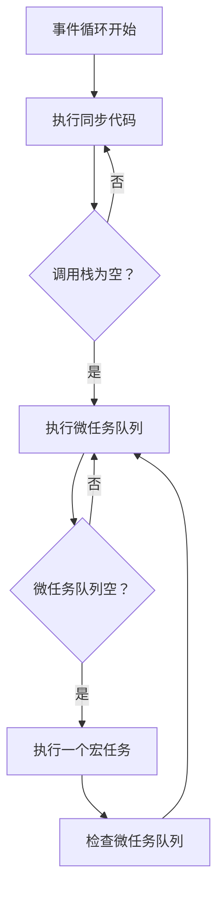

**执行优先级：**
```
同步代码 > process.nextTick > Promise 微任务 > 宏任务 (setTimeout/setInterval)
```

```javascript
// 验证执行顺序
console.log('同步 1');

Promise.resolve().then(() => {
  console.log('Promise 1');
});

setTimeout(() => {
  console.log('setTimeout 1');
}, 0);

process.nextTick(() => {
  console.log('nextTick 1');
});

console.log('同步 2');

// 输出顺序：
// 同步 1 → 同步 2 → nextTick 1 → Promise 1 → setTimeout 1
```

### 5.2.5 常见误区

| 误区 | 正确理解 |
|------|----------|
| Promise 状态可以多次变更 | 状态只能变更一次，之后不可变 |
| then 回调同步执行 | then 回调始终异步执行（微任务） |
| catch 能捕获所有错误 | 只能捕获 Promise 链中的错误，无法捕获外部异常 |
| Promise.all 遇到错误会等待所有完成 | 遇到第一个 reject 立即返回，其他操作继续执行但结果被丢弃 |

### 5.2.6 最佳实践

**1. 始终处理 Promise 的 reject：**

```javascript
// ❌ 未处理的 Promise reject
fetch('/api/data')
  .then(response => response.json());

// ✅ 添加错误处理
fetch('/api/data')
  .then(response => response.json())
  .catch(error => console.error('请求失败:', error));
```

**2. 使用 Promise.allSettled 处理多个独立异步操作：**

```javascript
// Promise.all 一个失败全部失败
const results = await Promise.all([
  fetch('/api/users'),
  fetch('/api/posts'),
  fetch('/api/comments')
]);

// Promise.allSettled 等待所有完成，分别处理结果
const results = await Promise.allSettled([
  fetch('/api/users'),
  fetch('/api/posts'),
  fetch('/api/comments')
]);

results.forEach((result, index) => {
  if (result.status === 'fulfilled') {
    console.log(`请求 ${index} 成功:`, result.value);
  } else {
    console.error(`请求 ${index} 失败:`, result.reason);
  }
});
```

---

## 5.3 async/await 的 Generator 实现原理

### 5.3.1 概念定义

**async/await** 是 ES2017 引入的异步编程语法，基于 Promise 和 Generator，让异步代码看起来像同步代码。

**为什么需要 async/await？**
- 消除回调嵌套和链式调用，代码更简洁
- 支持传统的 try-catch 错误处理
- 支持调试器断点调试
- 更符合人类线性思维模式

### 5.3.2 Generator 函数基础

**Generator 函数**是可以暂停和恢复执行的特殊函数，通过 `yield` 表达式暂停执行，通过 `next()` 方法恢复执行。

```javascript
function* generatorFunc() {
  console.log('开始执行');
  const a = yield 1;
  console.log('收到值:', a);
  const b = yield 2;
  console.log('收到值:', b);
  return a + b;
}

const gen = generatorFunc();
console.log(gen.next());      // { value: 1, done: false }
console.log(gen.next(10));    // { value: 2, done: false }
console.log(gen.next(20));    // { value: 30, done: true }
```

**Generator 内部机制：**

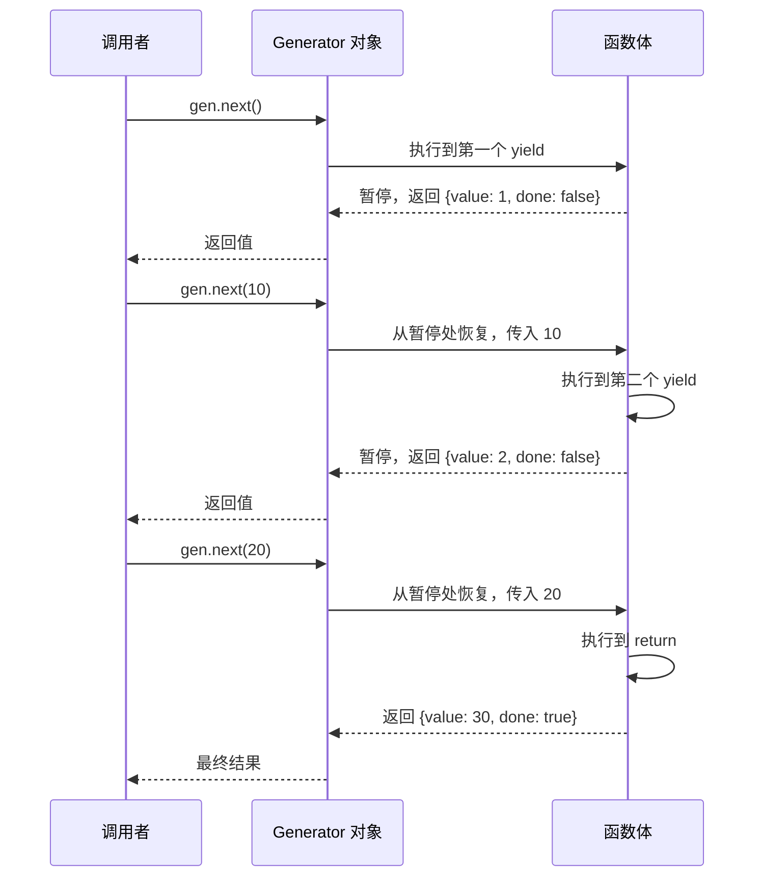

### 5.3.3 async/await 的 Generator 实现

async/await 本质上是 Generator 函数的语法糖，通过自动执行器实现。

**手动实现 Generator 自动执行器（co 模块原理）：**

```javascript
function co(genFunc) {
  const gen = genFunc();
  
  return new Promise((resolve, reject) => {
    function next(result) {
      const ret = gen.next(result);
      
      if (ret.done) {
        return resolve(ret.value);
      }
      
      // ret.value 可能是 Promise 或其他 thenable 对象
      Promise.resolve(ret.value)
        .then(next)
        .catch(reject);
    }
    
    next();
  });
}

// 使用示例
co(function* () {
  const data1 = yield fetch('/api/data1');
  const data2 = yield fetch('/api/data2');
  return { data1, data2 };
}).then(result => {
  console.log(result);
});
```

**async/await 等价转换：**

```javascript
// async/await 语法
async function fetchData() {
  try {
    const response = await fetch('/api/data');
    const data = await response.json();
    return data;
  } catch (error) {
    console.error('获取数据失败:', error);
    throw error;
  }
}

// 等价的 Generator + co 实现
function fetchData() {
  return co(function* () {
    try {
      const response = yield fetch('/api/data');
      const data = yield response.json();
      return data;
    } catch (error) {
      console.error('获取数据失败:', error);
      throw error;
    }
  });
}
```

### 5.3.4 async 函数返回值的内部处理

async 函数始终返回 Promise，即使返回的是非 Promise 值：

```javascript
async function foo() {
  return 42;  // 实际返回 Promise.resolve(42)
}

foo().then(value => console.log(value)); // 42
```

**编译器转换逻辑（简化）：**

```javascript
// 原始 async 函数
async function add(a, b) {
  return a + b;
}

// 编译器转换后
function add(a, b) {
  return Promise.resolve(a + b);
}
```

**遇到 await 时的转换：**

```javascript
// 原始 async 函数
async function fetchUsers() {
  const response = await fetch('/api/users');
  const users = await response.json();
  return users;
}

// 编译器转换后（简化版）
function fetchUsers() {
  return co(function* () {
    const response = yield fetch('/api/users');
    const users = yield response.json();
    return users;
  });
}
```

### 5.3.5 await 的暂停机制

await 会暂停 async 函数的执行，等待 Promise 结算：

```javascript
async function demo() {
  console.log('1. 开始');
  
  const result = await new Promise(resolve => {
    setTimeout(() => {
      console.log('3. Promise 完成');
      resolve('结果');
    }, 1000);
  });
  
  console.log('4. 收到结果:', result);
  return result;
}

console.log('0. 调用 demo');
demo().then(() => {
  console.log('5. demo 完成');
});
console.log('2. 继续执行主线程');

// 输出顺序：
// 0. 调用 demo
// 1. 开始
// 2. 继续执行主线程
// (1 秒后)
// 3. Promise 完成
// 4. 收到结果：结果
// 5. demo 完成
```

**内部状态机实现：**

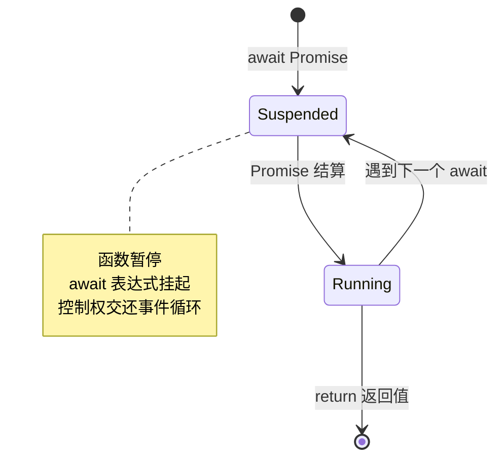

### 5.3.6 常见误区

| 误区 | 正确理解 |
|------|----------|
| await 会阻塞整个程序 | 只阻塞 async 函数内部，不阻塞主线程 |
| async/await 比 Promise 更快 | 实际上有额外开销，但代码更可读 |
| 可以并行使用 await | 顺序 await 是串行执行，应使用 Promise.all 并行 |
| try-catch 能捕获所有错误 | 未 await 的 Promise 错误需要用 .catch() 处理 |

### 5.3.7 最佳实践

**1. 避免顺序 await 导致的性能问题：**

```javascript
// ❌ 串行执行（耗时 3 秒）
async function fetchData() {
  const users = await fetch('/api/users');      // 1 秒
  const posts = await fetch('/api/posts');      // 1 秒
  const comments = await fetch('/api/comments'); // 1 秒
  return { users, posts, comments };
}

// ✅ 并行执行（耗时 1 秒）
async function fetchData() {
  const [users, posts, comments] = await Promise.all([
    fetch('/api/users'),
    fetch('/api/posts'),
    fetch('/api/comments')
  ]);
  return { users, posts, comments };
}
```

**2. 使用 IIFE 处理顶层 await（Node.js 14.8+ 支持顶层 await 前）：**

```javascript
// Node.js 14.8 之前，模块顶层不能使用 await
(async () => {
  const data = await fetchData();
  console.log(data);
})();
```

---

## 5.4 并发控制：Promise.all、Promise.race 源码分析

### 5.4.1 Promise.all 源码解析

**Promise.all** 接收一个 Promise 数组，等待所有 Promise 完成，返回结果数组。

**实现原理：**
- 内部计数器跟踪已完成的 Promise 数量
- 每个 Promise 完成后将结果存入对应位置
- 任一 Promise reject，立即 reject 整个 Promise.all

```javascript
function promiseAll(promises) {
  return new Promise((resolve, reject) => {
    if (!Array.isArray(promises)) {
      return reject(new TypeError('Argument is not an array'));
    }
    
    if (promises.length === 0) {
      return resolve([]);
    }
    
    const results = new Array(promises.length);
    let completedCount = 0;
    let rejected = false;
    
    promises.forEach((promise, index) => {
      Promise.resolve(promise)
        .then(value => {
          if (rejected) return;
          
          results[index] = value;
          completedCount++;
          
          if (completedCount === promises.length) {
            resolve(results);
          }
        })
        .catch(error => {
          if (rejected) return;
          
          rejected = true;
          reject(error);
        });
    });
  });
}
```

**执行流程图：**

```mermaid
flowchart TD
    Start[开始] --> CheckEmpty{promises 为空？}
    CheckEmpty -->|是 | ResolveEmpty[resolve([])]
    CheckEmpty -->|否 | Init[初始化 results 数组和计数器]
    Init --> Loop[遍历每个 Promise]
    Loop --> ResolvePromise{Promise 状态}
    ResolvePromise -->|fulfilled| StoreResult[存储结果到对应位置]
    ResolvePromise -->|rejected| ImmediateReject[reject 整个 Promise.all]
    StoreResult --> CheckComplete{全部完成？}
    CheckComplete -->|否 | Next[下一个 Promise]
    CheckComplete -->|是 | ResolveAll[resolve 结果数组]
    Next --> Loop
    ImmediateReject --> End[结束]
    ResolveAll --> End
    ResolveEmpty --> End
```

### 5.4.2 Promise.race 源码解析

**Promise.race** 接收一个 Promise 数组，返回第一个完成的 Promise 的结果。

```javascript
function promiseRace(promises) {
  return new Promise((resolve, reject) => {
    if (!Array.isArray(promises)) {
      return reject(new TypeError('Argument is not an array'));
    }
    
    for (const promise of promises) {
      Promise.resolve(promise)
        .then(resolve)  // 第一个 fulfilled 的 resolve
        .catch(reject); // 第一个 rejected 的 reject
    }
  });
}
```

### 5.4.3 Promise.allSettled 和 Promise.any

**Promise.allSettled**（ES2020）：等待所有 Promise 完成，返回所有结果（包含状态）。

```javascript
function promiseAllSettled(promises) {
  return promiseAll(promises.map(promise =>
    Promise.resolve(promise)
      .then(value => ({ status: 'fulfilled', value }))
      .catch(reason => ({ status: 'rejected', reason }))
  ));
}

// 使用示例
Promise.allSettled([
  Promise.resolve(1),
  Promise.reject('error'),
  Promise.resolve(3)
]).then(results => {
  console.log(results);
  // [
  //   { status: 'fulfilled', value: 1 },
  //   { status: 'rejected', reason: 'error' },
  //   { status: 'fulfilled', value: 3 }
  // ]
});
```

**Promise.any**（ES2021）：返回第一个成功的 Promise，全部失败则抛出 AggregateError。

```javascript
function promiseAny(promises) {
  return new Promise((resolve, reject) => {
    const errors = [];
    let completedCount = 0;
    
    promises.forEach((promise, index) => {
      Promise.resolve(promise)
        .then(resolve)  // 第一个成功的 resolve
        .catch(error => {
          errors[index] = error;
          completedCount++;
          
          if (completedCount === promises.length) {
            reject(new AggregateError(errors, 'All promises were rejected'));
          }
        });
    });
  });
}
```

### 5.4.4 并发控制实战应用

**1. 限制并发请求数量：**

```javascript
class PromisePool {
  constructor(concurrency) {
    this.concurrency = concurrency;  // 最大并发数
    this.running = 0;                // 当前运行数
    this.queue = [];                 // 等待队列
  }
  
  add(task) {
    return new Promise((resolve, reject) => {
      this.queue.push({ task, resolve, reject });
      this.run();
    });
  }
  
  run() {
    while (this.running < this.concurrency && this.queue.length > 0) {
      const { task, resolve, reject } = this.queue.shift();
      this.running++;
      
      Promise.resolve(task())
        .then(result => {
          this.running--;
          resolve(result);
          this.run();  // 检查是否有新任务可执行
        })
        .catch(error => {
          this.running--;
          reject(error);
          this.run();
        });
    }
  }
}

// 使用示例
const pool = new PromisePool(3);  // 限制最多 3 个并发

const tasks = Array.from({ length: 10 }, (_, i) => () =>
  fetch(`/api/data/${i}`).then(r => r.json())
);

Promise.all(tasks.map(task => pool.add(task)))
  .then(results => console.log('全部完成:', results));
```

**2. 超时控制：**

```javascript
function withTimeout(promise, timeoutMs) {
  const timeout = new Promise((_, reject) => {
    setTimeout(() => reject(new Error(`Timeout after ${timeoutMs}ms`)), timeoutMs);
  });
  
  return Promise.race([promise, timeout]);
}

// 使用示例
const data = await withTimeout(
  fetch('/api/slow-endpoint'),
  5000  // 5 秒超时
);
```

---

## 第 6 章 核心 API 与内置模块

> **本章导读**：Node.js 提供丰富的内置模块用于文件系统操作、路径处理、网络服务和流处理。本章将深入剖析这些核心 API 的内部实现机制，包括同步/异步实现原理、跨平台路径处理、TCP 连接管理、流式数据传输和多线程通信。

---

## 6.1 fs 文件系统：同步/异步实现、流式读取

### 6.1.1 概念定义

**fs 模块**是 Node.js 用于文件系统操作的核心模块，提供同步和异步两种 API 形式。

**为什么需要同步和异步两种形式？**
- **同步方法**：简单脚本、初始化阶段、CLI 工具等场景，代码更直观
- **异步方法**：服务器应用、高并发场景，避免阻塞事件循环

### 6.1.2 同步与异步实现对比

```javascript
const fs = require('fs');

// 同步读取（阻塞）
const syncData = fs.readFileSync('file.txt', 'utf8');
console.log('同步读取完成:', syncData);

// 异步读取（非阻塞）
fs.readFile('file.txt', 'utf8', (err, data) => {
  if (err) throw err;
  console.log('异步读取完成:', data);
});
```

**底层实现差异：**

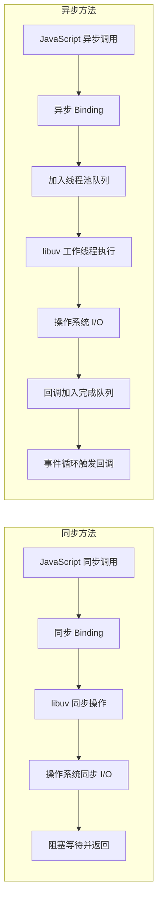

### 6.1.3 libuv 线程池实现

Node.js 的异步文件操作通过 libuv 线程池实现，默认线程池大小为 4（可通过 `UV_THREADPOOL_SIZE` 环境变量调整）。

**线程池工作流程：**

```cpp
// libuv 中的工作请求结构（简化）
struct uv_fs_t {
  uv_req_t req;           // 请求头
  uv_fs_type fs_type;     // 操作类型 (READ, WRITE, etc.)
  uv_loop_t* loop;        // 事件循环
  const char* path;       // 文件路径
  uv_file file;           // 文件描述符
  void* data;             // 数据缓冲区
  uv_fs_cb cb;            // 完成回调
};

// 异步读取实现（伪代码）
void uv_fs_read(uv_loop_t* loop, uv_fs_t* req, ...) {
  // 创建工作请求
  req->fs_type = UV_FS_READ;
  
  // 提交到线程池
  uv__work_submit(loop, &req->work_req, uv__fs_work, uv__fs_done);
}

// 工作线程中执行的实际 I/O
void uv__fs_work(struct uv__work* w) {
  uv_fs_t* req = container_of(w, uv_fs_t, work_req);
  // 执行实际的 read 系统调用（阻塞）
  req->result = read(req->file, req->data, ...);
}

// I/O 完成后在主线程调用回调
void uv__fs_done(struct uv__work* w, int status) {
  uv_fs_t* req = container_of(w, uv_fs_t, work_req);
  req->cb(req);  // 调用 JavaScript 回调
}
```

### 6.1.4 流式读取机制

对于大文件，流式读取可以显著降低内存占用。

```javascript
const fs = require('fs');

// 创建可读流，每次读取 64KB
const readableStream = fs.createReadStream('large-file.txt', {
  highWaterMark: 64 * 1024,  // 缓冲区大小
  encoding: 'utf8',
  start: 0,                   // 起始位置
  end: Infinity               // 结束位置
});

let data = '';

readableStream.on('data', (chunk) => {
  data += chunk;  // 逐块处理
  console.log('收到数据块:', chunk.length, '字节');
});

readableStream.on('end', () => {
  console.log('读取完成，总大小:', data.length, '字节');
});

readableStream.on('error', (err) => {
  console.error('读取错误:', err);
});
```

**流式读取内部机制：**

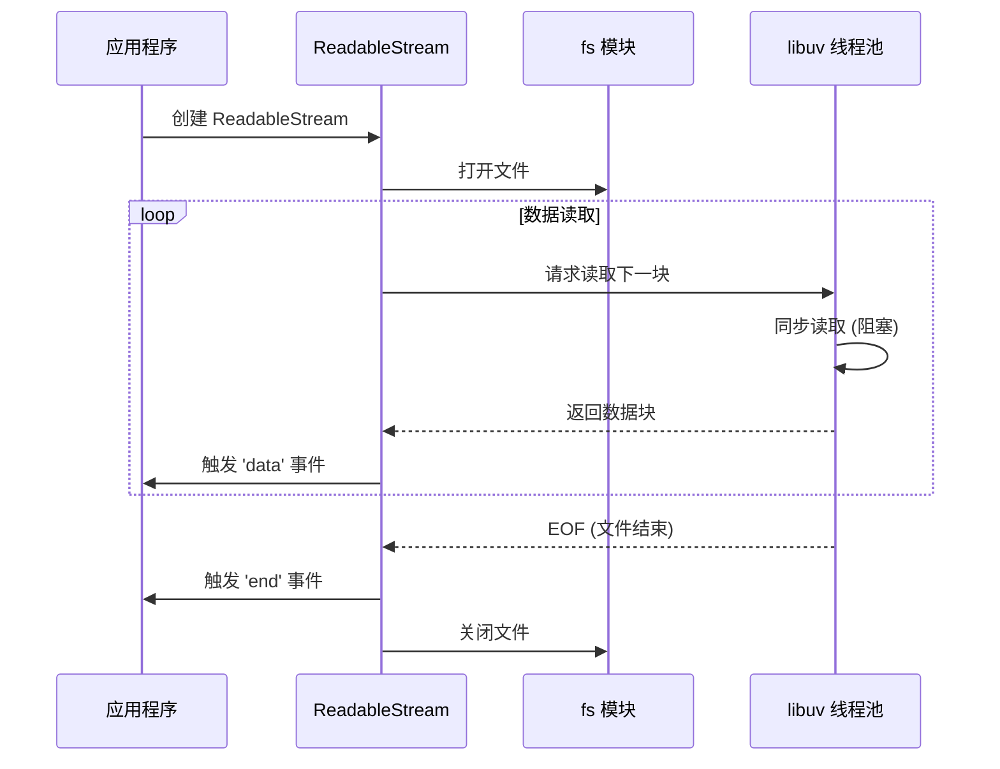

### 6.1.5 常见误区

| 误区 | 正确理解 |
|------|----------|
| 同步方法性能更好 | 同步方法阻塞事件循环，高并发场景应避免 |
| 流式读取只适用于大文件 | 任何需要逐步处理数据的场景都适用 |
| 文件操作不需要错误处理 | 文件可能不存在、权限不足等，必须处理错误 |
| createReadStream 立即读取文件 | 实际在第一次调用 read() 或监听 data 事件时才开始 |

### 6.1.6 最佳实践

**1. 使用 stream.pipeline 简化流式处理：**

```javascript
const fs = require('fs');
const { pipeline } = require('stream');
const { promisify } = require('util');

const pipelineAsync = promisify(pipeline);

// 复制文件（自动处理错误和关闭）
async function copyFile(src, dest) {
  await pipelineAsync(
    fs.createReadStream(src),
    fs.createWriteStream(dest)
  );
  console.log('文件复制完成');
}
```

**2. 使用 async iterator 消费流：**

```javascript
const fs = require('fs');
const { createInterface } = require('readline');

async function processLines(filePath) {
  const stream = fs.createReadStream(filePath, { encoding: 'utf8' });
  const rl = createInterface({
    input: stream,
    crlfDelay: Infinity
  });
  
  for await (const line of rl) {
    console.log('行:', line);
  }
}
```

---

## 6.2 path 路径处理：跨平台路径解析

### 6.2.1 概念定义

**path 模块**提供文件系统路径的实用工具，自动处理 Windows 和 POSIX（Linux/macOS）系统的路径差异。

**为什么需要 path 模块？**
- **路径分隔符差异**：Windows 使用 `\`，POSIX 使用 `/`
- **路径解析规则差异**：Windows 有盘符（C:\），POSIX 从根目录（/）开始
- **跨平台兼容性**：确保代码在不同操作系统上一致运行

### 6.2.2 核心方法详解

```javascript
const path = require('path');

// 1. path.join - 连接路径片段
const joined = path.join('/user', 'docs', 'file.txt');
console.log(joined);
// POSIX: /user/docs/file.txt
// Windows: \user\docs\file.txt

// 2. path.resolve - 解析为绝对路径
const resolved = path.resolve('src', 'app.js');
console.log(resolved);
// 假设当前目录：/home/user/project
// 输出：/home/user/project/src/app.js

// 3. path.normalize - 规范化路径
const normalized = path.normalize('/user//docs/../file.txt');
console.log(normalized);
// POSIX: /user/file.txt
// Windows: \user\file.txt

// 4. path.parse - 解析路径为对象
const parsed = path.parse('/user/docs/file.txt');
console.log(parsed);
// {
//   root: '/',
//   dir: '/user/docs',
//   base: 'file.txt',
//   ext: '.txt',
//   name: 'file'
// }

// 5. path.format - 从对象构建路径
const formatted = path.format({
  dir: '/user/docs',
  base: 'file.txt'
});
console.log(formatted);  // /user/docs/file.txt
```

### 6.2.3 跨平台路径处理

```javascript
// 路径分隔符
console.log(path.sep);
// POSIX: '/'
// Windows: '\\'

console.log(path.delimiter);
// POSIX: ':'
// Windows: ';'

// 强制使用特定平台的路径处理
console.log(path.win32.join('C:', 'temp', 'file.txt'));
// 始终输出：C:\temp\file.txt

console.log(path.posix.join('/user', 'docs', 'file.txt'));
// 始终输出：/user/docs/file.txt
```

### 6.2.4 底层实现原理

path 模块根据运行时平台自动选择实现：

```javascript
// path 模块内部实现（简化）
const isWindows = process.platform === 'win32';

module.exports = isWindows
  ? require('./path/win32')   // Windows 实现
  : require('./path/posix');  // POSIX 实现

// path/posix.js 中的实现示例
exports.join = function(...paths) {
  if (paths.length === 0) return '.';
  
  let joined;
  for (let i = 0; i < paths.length; i++) {
    const arg = paths[i];
    if (arg.length > 0) {
      if (joined === undefined) {
        joined = arg;
      } else {
        joined += '/' + arg;
      }
    }
  }
  
  if (joined === undefined) return '.';
  return normalizeString(joined, !isPathSeparator(paths[0]));
};
```

### 6.2.5 常见误区

| 误区 | 正确理解 |
|------|----------|
| 直接使用字符串拼接路径 | 应使用 path.join 确保跨平台兼容 |
| path.join 会验证文件存在 | path 模块只处理字符串，不访问文件系统 |
| path.resolve 总是返回正确路径 | 只进行字符串解析，不验证路径是否有效 |
| 所有系统都区分大小写 | Windows/macOS 不区分，Linux 区分 |

### 6.2.6 最佳实践

**1. 始终使用 path 模块处理路径：**

```javascript
// ❌ 不好的做法（Windows 不兼容）
const filePath = './data/' + filename;

// ✅ 正确的做法
const filePath = path.join('data', filename);
```

**2. 使用 path.resolve 获取绝对路径：**

```javascript
// 获取项目根目录
const projectRoot = path.resolve(__dirname, '..');

// 读取配置文件
const configPath = path.resolve(projectRoot, 'config', 'app.json');
```

---

## 6.3 http/https 网络服务：TCP 连接、HTTP 解析器

### 6.3.1 概念定义

**http 模块**提供创建 HTTP 服务器和客户端的能力，基于 TCP 协议实现 HTTP/1.1 协议。

**HTTP 与 TCP 的关系：**

```mermaid
graph TD
    A[HTTP 应用层] --> B[TCP 传输层]
    B --> C[IP 网络层]
    C --> D[数据链路层]
    
    note right of A
        请求/响应模型
        无状态协议
        文本/二进制格式
    end note
    
    note right of B
        面向连接
        可靠传输
        流量控制
    end note
```

### 6.3.2 HTTP 服务器创建与请求处理

```javascript
const http = require('http');

const server = http.createServer((req, res) => {
  // req: http.IncomingMessage (可读流)
  // res: http.ServerResponse (可写流)
  
  res.writeHead(200, {
    'Content-Type': 'application/json'
  });
  
  res.end(JSON.stringify({ message: 'Hello World' }));
});

server.listen(3000, () => {
  console.log('服务器运行在 http://localhost:3000/');
});
```

### 6.3.3 TCP 连接管理

**HTTP 服务器继承自 net.Server**，底层使用 TCP 连接：

```javascript
// http.createServer 内部实现（简化）
const http = require('http');
const net = require('net');

// http.Server 继承自 net.Server
class Server extends net.Server {
  constructor(options, requestListener) {
    super();
    
    // 监听 connection 事件（TCP 连接建立）
    this.on('connection', (socket) => {
      this.onConnection(socket);
    });
    
    // 监听 request 事件（HTTP 请求解析完成）
    this.on('request', requestListener);
  }
  
  onConnection(socket) {
    // 创建 HTTP 解析器
    const parser = new HTTPParser(HTTPParser.REQUEST);
    
    // 解析 HTTP 请求
    socket.on('data', (data) => {
      parser.execute(data);
    });
  }
}
```

**TCP 三次握手与 HTTP 请求流程：**

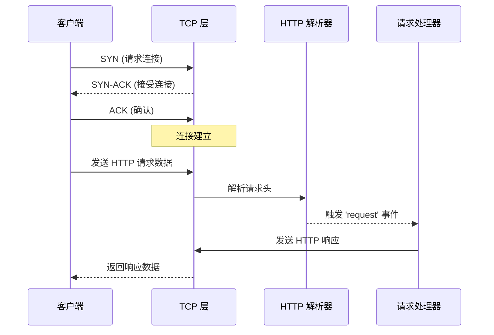

### 6.3.4 HTTP 解析器内部机制

Node.js 使用 C++ 实现的 HTTP 解析器（llhttp），性能远优于 JavaScript 实现：

```cpp
// llhttp 解析器状态机（简化）
typedef enum llhttp_state {
  S_START,           // 起始状态
  S_METHOD,          // 解析方法 (GET, POST...)
  S_URL,             // 解析 URL
  S_HEADERS,         // 解析请求头
  S_BODY,            // 解析请求体
  S_MESSAGE_DONE,    // 消息完成
  S_ERROR            // 错误状态
} llhttp_state_t;

// 解析回调
llhttp_settings_t settings = {
  .on_message_begin = on_message_begin,
  .on_url = on_url,
  .on_header_field = on_header_field,
  .on_header_value = on_header_value,
  .on_message_complete = on_message_complete
};

// 执行解析
llhttp_execute(&parser, data, len);
```

### 6.3.5 常见误区

| 误区 | 正确理解 |
|------|----------|
| http 模块支持 HTTPS | HTTPS 需要使用 https 模块 |
| 请求体自动解析 | 需要手动监听 data 事件或使用中间件 |
| 服务器自动处理并发 | Node.js 单线程，CPU 密集型任务会阻塞 |
| 连接默认保持打开 | 需要设置 Keep-Alive 头或使用 agent |

### 6.3.6 最佳实践

**1. 使用流式处理大请求体：**

```javascript
const fs = require('fs');
const http = require('http');

http.createServer((req, res) => {
  if (req.url === '/upload' && req.method === 'POST') {
    // 直接流式写入文件
    const fileStream = fs.createWriteStream('upload.bin');
    req.pipe(fileStream);
    
    fileStream.on('finish', () => {
      res.writeHead(200);
      res.end('上传成功');
    });
  }
});
```

**2. 设置合理的超时和 Keep-Alive：**

```javascript
const server = http.createServer((req, res) => {
  // 设置超时
  req.setTimeout(30000, () => {
    res.writeHead(408);
    res.end('Request Timeout');
  });
  
  // 启用 Keep-Alive
  res.setHeader('Connection', 'keep-alive');
  res.setHeader('Keep-Alive', 'timeout=5, max=1000');
  
  res.end('Hello');
});

// 设置服务器超时
server.timeout = 60000;
server.keepAliveTimeout = 65000;
```

---

## 6.4 stream 流处理：Readable/Writable/Duplex/Transform 内部机制

### 6.4.1 概念定义

**Stream（流）** 是 Node.js 中处理流式数据的抽象接口，将数据分解为可管理的块，实现高效的 I/O 操作。

**四种流类型：**

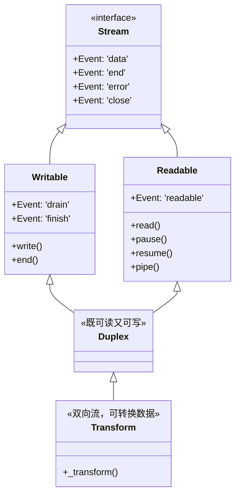

### 6.4.2 Readable 流内部机制

**两种读取模式：**

1. **流动模式（Flowing Mode）**：数据自动推送给消费者
2. **暂停模式（Paused Mode）**：需要显式调用 `read()` 拉取数据

```javascript
const fs = require('fs');

// 流动模式
const stream1 = fs.createReadStream('file.txt');
stream1.on('data', (chunk) => {
  console.log('收到数据:', chunk);
});

// 暂停模式
const stream2 = fs.createReadStream('file.txt');
stream2.pause();  // 暂停流动

// 手动拉取数据
const chunk = stream2.read();
stream2.resume();  // 恢复流动
```

**Readable 流内部状态机：**

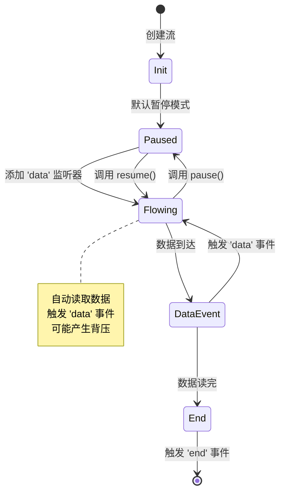

**Readable 内部实现（简化）：**

```javascript
const { Readable } = require('stream');

class CustomReadable extends Readable {
  constructor(options) {
    super(options);
    this._currentIndex = 0;
    this._maxIndex = 10;
  }
  
  // 核心方法：被调用时提供数据
  _read(size) {
    // 推入数据到内部缓冲区
    while (this._currentIndex < this._maxIndex) {
      const chunk = `数据块 ${this._currentIndex}`;
      
      // push 返回 false 表示内部缓冲区已满（超过 highWaterMark）
      if (!this.push(chunk)) {
        // 停止推送，等待消费者消费
        return;
      }
      this._currentIndex++;
    }
    
    // 数据读完，推入 null 表示结束
    this.push(null);
  }
}
```

### 6.4.3 Writable 流内部机制

**Writable 流处理写入和背压：**

```javascript
const fs = require('fs');

const writable = fs.createWriteStream('output.txt');

// 写入数据
for (let i = 0; i < 100; i++) {
  const shouldContinue = writable.write(`第 ${i} 块数据\n`);
  
  // 处理背压：如果返回 false，停止写入，等待 drain 事件
  if (!shouldContinue) {
    writable.once('drain', () => {
      console.log('缓冲区已清空，可以继续写入');
    });
  }
}

writable.end('最后一块数据');
```

**背压（Backpressure）机制：**

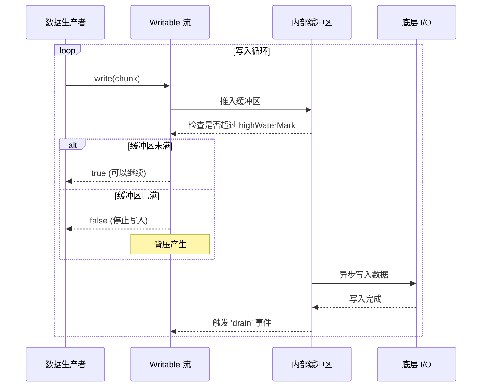

**Writable 内部实现（简化）：**

```javascript
const { Writable } = require('stream');

class CustomWritable extends Writable {
  constructor(options) {
    super(options);
    this.buffer = [];
    this.isWriting = false;
  }
  
  // 核心方法：处理写入的数据
  _write(chunk, encoding, callback) {
    // 模拟异步写入
    setTimeout(() => {
      console.log('写入数据:', chunk.toString());
      // 写入完成，调用 callback
      callback();
    }, 100);
  }
  
  // 处理多个 chunks 批量写入（可选）
  _writev(chunks, callback) {
    console.log('批量写入:', chunks.length, '个块');
    // 批量处理
    callback();
  }
}
```

### 6.4.4 Duplex 和 Transform 流

**Duplex 流：双向通信**

```javascript
const { Duplex } = require('stream');

class EchoStream extends Duplex {
  _read(size) {
    // 从某处读取数据（如网络 socket）
    this.push('收到的数据');
  }
  
  _write(chunk, encoding, callback) {
    // 写入数据到某处
    console.log('写入:', chunk.toString());
    callback();
  }
}
```

**Transform 流：数据转换**

```javascript
const { Transform } = require('stream');

// 简单的转换流示例
const upperCaseTransform = new Transform({
  transform(chunk, encoding, callback) {
    // 转换为大写
    this.push(chunk.toString().toUpperCase());
    callback();
  }
});

// 使用 Transform 流
process.stdin
  .pipe(upperCaseTransform)
  .pipe(process.stdout);
```

**Transform 流的加密应用：**

```javascript
const { Transform } = require('stream');
const crypto = require('crypto');

class EncryptTransform extends Transform {
  constructor(password) {
    super();
    this.cipher = crypto.createCipher('aes-128-cbc', password);
  }
  
  _transform(chunk, encoding, callback) {
    const encrypted = this.cipher.update(chunk);
    this.push(encrypted);
    callback();
  }
  
  _flush(callback) {
    const final = this.cipher.final();
    this.push(final);
    callback();
  }
}
```

### 6.4.5 内部缓冲与 highWaterMark

**highWaterMark 是流内部缓冲区的阈值**，超过此值会触发背压。

```javascript
const { Readable, Writable } = require('stream');

// 创建自定义 highWaterMark 的流
const readable = new Readable({
  highWaterMark: 1024,  // 1KB
  read(size) {
    this.push('数据');
  }
});

const writable = new Writable({
  highWaterMark: 1024,  // 1KB
  write(chunk, encoding, callback) {
    callback();
  }
});

console.log(readable.readableHighWaterMark);  // 1024
console.log(writable.writableHighWaterMark);  // 1024
```

**缓冲区长度计算：**

```javascript
const writable = fs.createWriteStream('output.txt');

console.log('初始长度:', writable.writableLength);  // 0

writable.write('chunk1');
console.log('写入后长度:', writable.writableLength);  // 6

writable.write('chunk2');
console.log('继续写入长度:', writable.writableLength);

writable.on('drain', () => {
  console.log('drain 后长度:', writable.writableLength);  // 0
});
```

### 6.4.6 常见误区

| 误区 | 正确理解 |
|------|----------|
| stream 自动处理所有情况 | 需要手动处理背压和错误 |
| highWaterMark 是硬性限制 | 只是警示阈值，超过仍可继续写入 |
| pipe() 自动处理错误 | 需要使用 pipeline() 或手动处理 |
| Transform 只能转换文本 | 可以处理任意二进制数据 |

### 6.4.7 最佳实践

**1. 使用 stream.pipeline 自动处理错误：**

```javascript
const { pipeline } = require('stream');
const fs = require('fs');
const zlib = require('zlib');

pipeline(
  fs.createReadStream('input.txt'),
  zlib.createGzip(),
  fs.createWriteStream('output.txt.gz'),
  (err) => {
    if (err) {
      console.error('管道错误:', err);
    } else {
      console.log('管道完成');
    }
  }
);
```

**2. 使用 async iterator 消费流：**

```javascript
const fs = require('fs');

async function processStream() {
  const stream = fs.createReadStream('file.txt', { encoding: 'utf8' });
  
  for await (const chunk of stream) {
    console.log('处理数据块:', chunk);
  }
  
  console.log('流处理完成');
}
```

---

## 6.5 worker_threads 多线程：SharedArrayBuffer、MessageChannel

### 6.5.1 概念定义

**worker_threads 模块**允许在 Node.js 应用中创建多线程，用于处理 CPU 密集型任务。

**为什么需要 worker_threads？**
- Node.js 单线程模型不适合 CPU 密集型任务
- 主线程被阻塞会导致事件循环停滞
- 多线程可以充分利用多核 CPU

**与 child_process 的区别：**

```mermaid
graph TB
    subgraph worker_threads
        Main[主线程] <-->|共享内存 | Worker1[工作线程 1]
        Main <-->|共享内存 | Worker2[工作线程 2]
        note right of worker_threads: 共享内存，低开销
    end
    
    subgraph child_process
        Main2[主进程] <-->|IPC 通信 | Child1[子进程 1]
        Main2 <-->|IPC 通信 | Child2[子进程 2]
        note right of child_process: 独立内存，高开销
    end
```

### 6.5.2 基本使用

```javascript
const { Worker, isMainThread, parentPort, workerData } = require('worker_threads');

if (isMainThread) {
  // 主线程代码
  const worker = new Worker(__filename, {
    workerData: { input: 'Hello from main thread' }
  });
  
  worker.on('message', (msg) => {
    console.log('收到 worker 消息:', msg);
  });
  
  worker.on('error', (err) => {
    console.error('Worker 错误:', err);
  });
  
  worker.postMessage('Message to worker');
} else {
  // 工作线程代码
  parentPort.on('message', (msg) => {
    console.log('收到主线程消息:', msg);
    console.log('workerData:', workerData);
    
    // 返回结果
    parentPort.postMessage('Hello from worker');
  });
}
```

### 6.5.3 线程间通信机制

**MessageChannel 通信原理：**

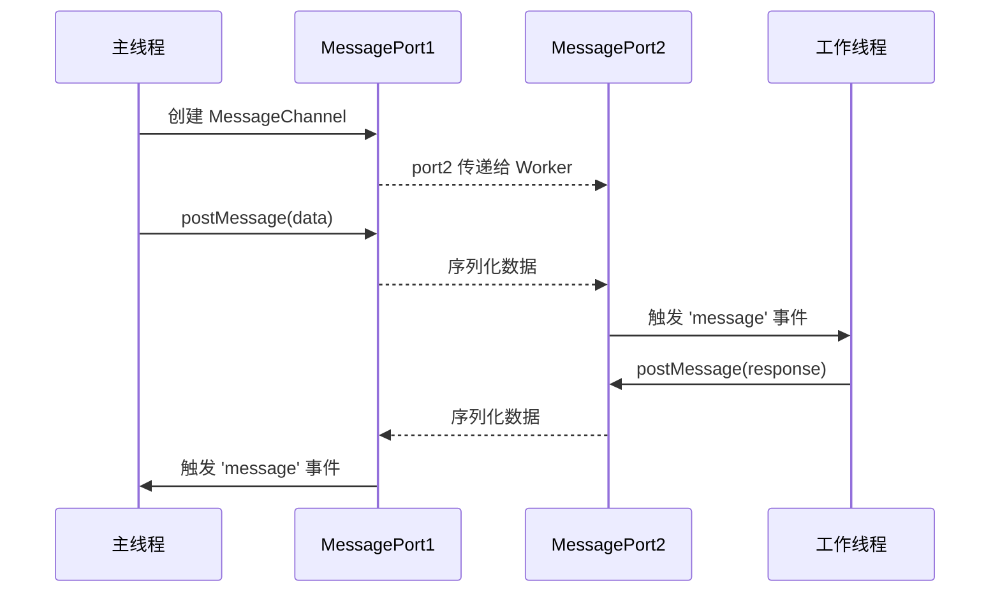

**使用 MessageChannel 进行线程间通信：**

```javascript
const { Worker, MessageChannel } = require('worker_threads');

// 主线程
const channel = new MessageChannel();

const worker = new Worker('./worker.js');
worker.postMessage({ port: channel.port1 }, [channel.port1]);

channel.port2.on('message', (msg) => {
  console.log('收到消息:', msg);
});

// worker.js
const { parentPort } = require('worker_threads');

parentPort.on('message', (msg) => {
  const port = msg.port;
  
  port.on('message', (data) => {
    console.log('收到数据:', data);
    port.postMessage('已接收');
  });
});
```

### 6.5.4 共享内存：SharedArrayBuffer

**SharedArrayBuffer 允许多线程共享内存**，避免数据复制开销：

```javascript
const { Worker, isMainThread, parentPort } = require('worker_threads');

if (isMainThread) {
  // 创建共享内存 (4 字节)
  const sharedBuffer = new SharedArrayBuffer(4);
  const sharedArray = new Int32Array(sharedBuffer);
  
  // 创建工作线程
  const worker = new Worker(__filename, {
    workerData: { sharedBuffer }
  });
  
  // 等待 worker 完成
  worker.on('message', () => {
    console.log('最终结果:', sharedArray[0]);  // 10
  });
  
  // 传输共享内存（零拷贝）
  worker.postMessage({ sharedBuffer }, [sharedBuffer]);
} else {
  const { sharedBuffer } = workerData;
  const sharedArray = new Int32Array(sharedBuffer);
  
  // 使用 Atomics 进行原子操作
  for (let i = 0; i < 10; i++) {
    Atomics.add(sharedArray, 0, 1);
  }
  
  parentPort.postMessage('done');
}
```

**Atomics API 提供的原子操作：**

```javascript
const sharedBuffer = new SharedArrayBuffer(4);
const sharedArray = new Int32Array(sharedBuffer);

// 原子写
Atomics.store(sharedArray, 0, 42);

// 原子读
const value = Atomics.load(sharedArray, 0);

// 原子加法
Atomics.add(sharedArray, 0, 1);

// 原子比较交换（实现锁）
const expected = 0;
const replacement = 1;
const status = Atomics.compareExchange(sharedArray, 0, expected, replacement);
// 如果当前值为 0，则设置为 1，返回原值
```

### 6.5.5 线程间数据转移

**使用 transferList 实现零拷贝数据传输：**

```javascript
const { Worker } = require('worker_threads');

// 创建 ArrayBuffer
const buffer = new ArrayBuffer(1024 * 1024);  // 1MB

// 创建 worker 并转移 buffer（零拷贝）
const worker = new Worker('./worker.js', {
  workerData: { buffer },
  transferList: [buffer]  // 转移所有权
});

// 转移后，主线程无法再访问 buffer
console.log(buffer.byteLength);  // 0（已被转移）
```

### 6.5.6 常见误区

| 误区 | 正确理解 |
|------|----------|
| worker_threads 适合所有场景 | 只适合 CPU 密集型任务，I/O 密集型用异步即可 |
| 共享内存可以随意访问 | 需要使用 Atomics 避免竞态条件 |
| worker 可以访问所有主线程变量 | worker 有独立上下文，需要通过 message 通信 |
| 创建 worker 没有开销 | 创建线程有成本，应复用 worker |

### 6.5.7 最佳实践

**1. 使用 worker 池复用线程：**

```javascript
const { Worker } = require('worker_threads');

class WorkerPool {
  constructor(script, size = 4) {
    this.workers = [];
    this.queue = [];
    
    for (let i = 0; i < size; i++) {
      const worker = new Worker(script);
      worker.on('message', (msg) => {
        // 任务完成，处理下一个
        this.queue.shift()[1](msg);
        this.runNext(worker);
      });
      this.workers.push({ worker, busy: false });
    }
  }
  
  run(task) {
    return new Promise((resolve) => {
      const idleWorker = this.workers.find(w => !w.busy);
      
      if (idleWorker) {
        idleWorker.busy = true;
        idleWorker.worker.postMessage(task);
        this.queue.push([idleWorker, resolve]);
      } else {
        this.queue.push([null, resolve, task]);
      }
    });
  }
  
  runNext(workerInfo) {
    const next = this.queue.find(q => q[2]);
    if (next) {
      workerInfo.busy = true;
      workerInfo.worker.postMessage(next[2]);
      next[2] = null;
    } else {
      workerInfo.busy = false;
    }
  }
}
```

**2. 使用 parentPort 进行高效通信：**

```javascript
// 主线程
const worker = new Worker('./worker.js');

// 发送大量数据时使用 transferList
const buffer = new ArrayBuffer(1024 * 1024);
worker.postMessage({ data: buffer }, [buffer]);

// 工作线程
const { parentPort, workerData } = require('worker_threads');
parentPort.postMessage(workerData.data, [workerData.data]);
```

---

## 参考资料

1. **Promise/A+ 规范**: https://promisesaplus.com/
2. **Node.js 官方文档 - Stream**: https://nodejs.org/api/stream.html
3. **Node.js 官方文档 - Worker Threads**: https://nodejs.org/api/worker_threads.html
4. **Node.js 官方文档 - HTTP**: https://nodejs.org/api/http.html
5. **libuv 源码剖析**: https://github.com/libuv/libuv
6. **Node.js 事件循环机制解析**: CSDN, OSCHINA 等技术社区文章

---

## 本章小结

本章深入探讨了 Node.js 异步编程模式的演进和核心 API 的内部实现：

- **第 5 章** 从回调函数到 Promise 再到 async/await，揭示了状态机、微任务调度、Generator 自动执行器等底层原理
- **第 6 章** 剖析了 fs、path、http、stream、worker_threads 等核心模块的内部机制，包括 libuv 线程池、背压机制、共享内存等关键技术点

理解这些底层原理有助于：
- 编写更高效的异步代码
- 正确处理背压和内存问题
- 合理使用多线程优化 CPU 密集型任务
- 深入理解 Node.js 的运行机制
