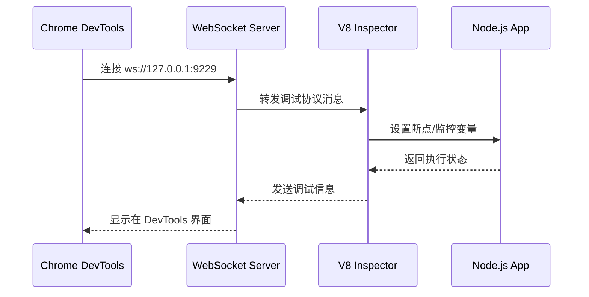
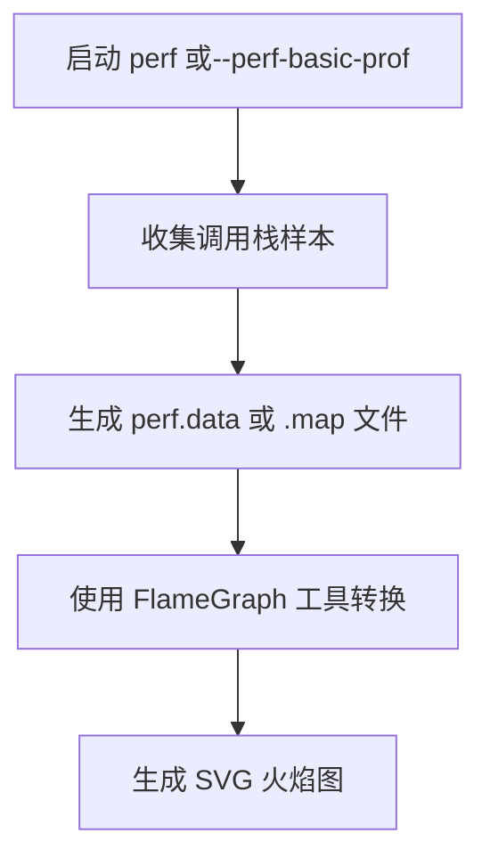
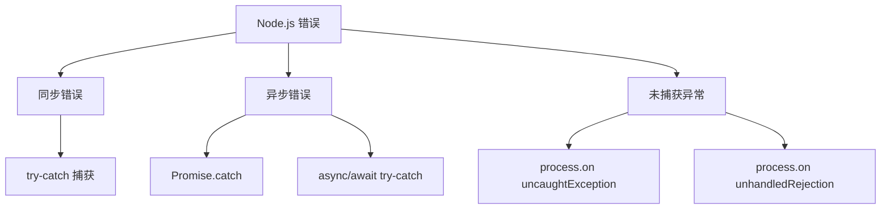
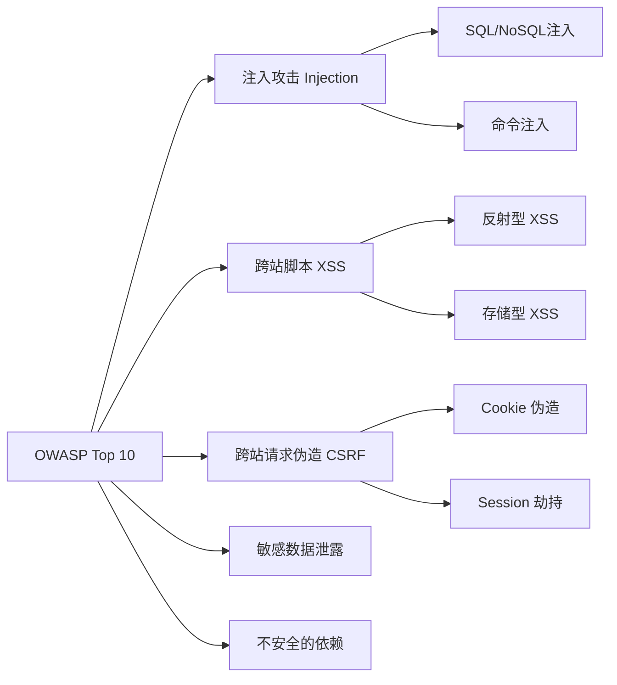
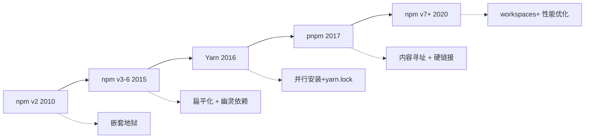
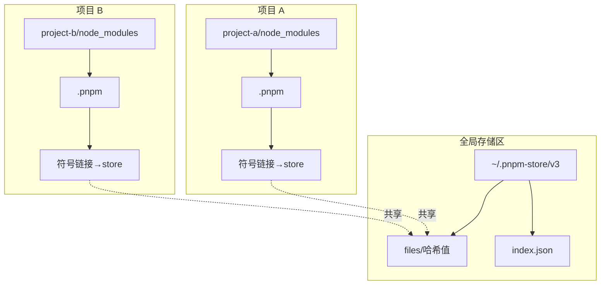
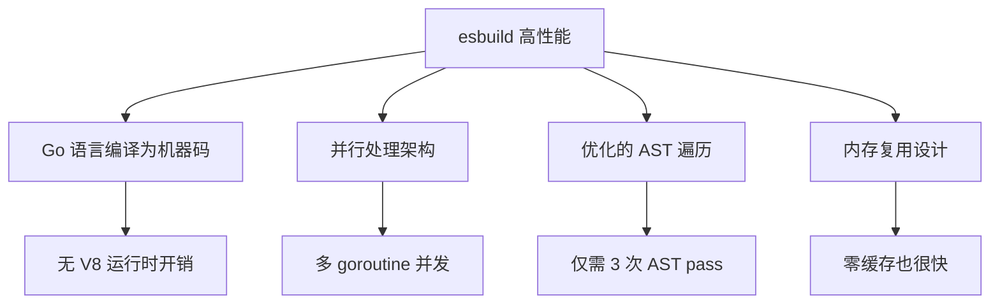
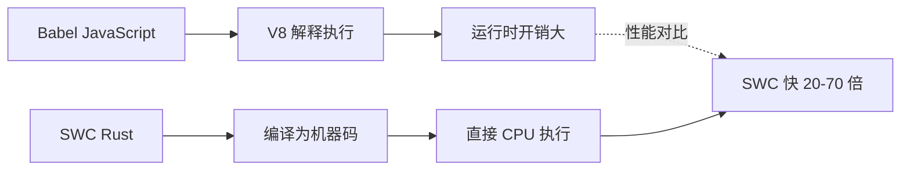
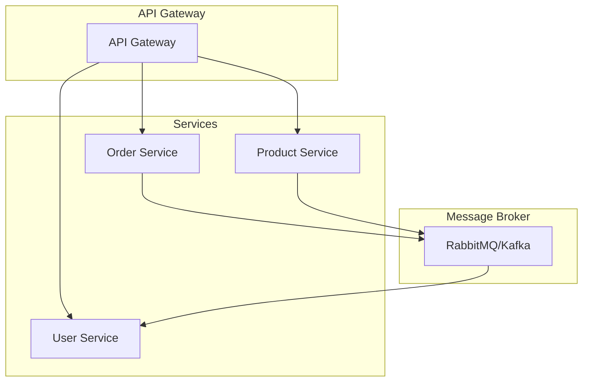

# Node.js 核心知识体系

## 第 7 章 工程化与最佳实践

---

## 7.1 项目结构与依赖管理

### 7.1.1 项目结构的演进与标准化

**概念定义**

项目结构是 Node.js 应用程序的骨架，它定义了代码、配置、测试和资源的组织方式。良好的项目结构不仅提升代码可维护性，还能让新成员快速理解系统架构。

**为什么需要标准化项目结构**

Node.js 项目因其灵活性而闻名，但这种灵活性也带来了"结构混乱"的风险。根据 2023 年 Node.js 社区调查，超过 67% 的开发者认为不一致的项目结构是导致维护成本增加的主要原因。

**标准项目结构模型**

```
my-nodejs-project/
├── src/                      # 源代码目录
│   ├── controllers/          # 业务逻辑控制器
│   ├── models/               # 数据模型定义
│   ├── routes/               # 路由定义
│   ├── middlewares/          # 中间件函数
│   ├── services/             # 业务服务层
│   ├── utils/                # 工具函数
│   └── index.js              # 入口文件
├── config/                   # 配置文件
│   ├── default.js            # 默认配置
│   ├── development.js        # 开发环境配置
│   ├── production.js         # 生产环境配置
│   └── test.js               # 测试环境配置
├── tests/                    # 测试文件
│   ├── unit/                 # 单元测试
│   ├── integration/          # 集成测试
│   └── e2e/                  # 端到端测试
├── scripts/                  # 构建/部署脚本
├── docs/                     # 项目文档
├── public/                   # 静态资源
├── logs/                     # 日志目录
├── .env                      # 环境变量 (不提交到版本控制)
├── .env.example              # 环境变量模板
├── .gitignore                # Git 忽略规则
├── .nvmrc                    # Node.js 版本指定
├── package.json              # 项目元数据与依赖配置
├── package-lock.json         # 依赖版本锁定文件
├── .npmrc                    # npm 配置
└── README.md                 # 项目说明
```

**各层级职责解析**

| 目录/文件 | 职责 | 关键说明 |
|-----------|------|----------|
| `src/` | 核心业务代码 | 所有源代码应位于此目录，便于打包和转译 |
| `config/` | 环境配置 | 使用配置管理库 (如 `config`) 实现环境隔离 |
| `tests/` | 测试代码 | 与源码目录结构保持镜像关系 |
| `.nvmrc` | Node 版本 | 确保团队使用一致的运行环境 |
| `package.json` | 依赖管理 | 明确区分 `dependencies` 和 `devDependencies` |

---

### 7.1.2 package.json 深度解析

**概念定义**

`package.json` 是 Node.js 项目的核心配置文件，它不仅是项目的"身份证"，更是依赖管理、脚本执行和模块发布的控制中枢。

**工作原理**

npm 在安装依赖时，会读取 `package.json` 中的依赖声明，从 registry 下载包并解析依赖树。语义化版本 (SemVer) 规则决定了哪些版本可以被自动升级。

```json
{
  "name": "my-nodejs-app",
  "version": "1.0.0",
  "description": "A Node.js application demonstrating best practices",
  "main": "src/index.js",
  "type": "module",
  "scripts": {
    "start": "node src/index.js",
    "dev": "nodemon src/index.js",
    "build": "tsc",
    "test": "jest --coverage",
    "lint": "eslint src/**/*.js",
    "prestart": "npm run build",
    "postinstall": "node scripts/postinstall.js"
  },
  "keywords": ["nodejs", "rest-api", "best-practices"],
  "author": "Your Name <your.email@example.com>",
  "license": "MIT",
  "repository": {
    "type": "git",
    "url": "https://github.com/yourusername/my-nodejs-app.git"
  },
  "bugs": {
    "url": "https://github.com/yourusername/my-nodejs-app/issues"
  },
  "homepage": "https://github.com/yourusername/my-nodejs-app#readme",
  "engines": {
    "node": ">=18.0.0",
    "npm": ">=9.0.0"
  },
  "dependencies": {
    "express": "^4.18.2",
    "mongoose": "^7.5.0",
    "dotenv": "^16.3.1",
    "helmet": "^7.0.0",
    "cors": "^2.8.5"
  },
  "devDependencies": {
    "jest": "^29.6.4",
    "eslint": "^8.48.0",
    "nodemon": "^3.0.1",
    "typescript": "^5.2.2",
    "@types/node": "^20.5.9"
  },
  "optionalDependencies": {
    "fsevents": "^2.3.3"
  },
  "peerDependencies": {
    "react": ">=16.8.0"
  }
}
```

**关键字段深度解析**

**1. 语义化版本控制 (SemVer)**

语义化版本号格式为 `major.minor.patch` (主版本号。次版本号.补丁号)。

```
^1.2.3  =>  >=1.2.3 且 <2.0.0   (允许次版本和补丁更新)
~1.2.3  =>  >=1.2.3 且 <1.3.0   (仅允许补丁更新)
1.2.3   =>  精确版本 1.2.3      (不允许任何自动更新)
*       =>  任意版本           (不推荐，可能导致破坏性更新)
```

**源码/底层解析：版本解析算法**

npm 使用 `node-semver` 库进行版本解析。核心算法维护一个"可满足范围"，当多个依赖声明同一包的不同版本时，npm 尝试找到一个满足所有约束的版本。

```javascript
// node-semver 简化版解析逻辑
const semver = require('semver');

// 版本范围解析
semver.satisfies('1.2.5', '^1.2.3');  // true
semver.satisfies('1.3.0', '^1.2.3');  // true
semver.satisfies('2.0.0', '^1.2.3');  // false

// 寻找最大满足版本
semver.maxSatisfying(
  ['1.2.3', '1.2.4', '1.3.0', '2.0.0'],
  '^1.2.3'
);  // '1.3.0'
```

**常见误区**

❌ **误区 1**: `^` 和 `~` 可以混用

```javascript
// 错误理解
^1.0.0  // 不是"最新 1.x.x"，而是 <2.0.0
~1.0.0  // 不是"最新 1.0.x"，而是 <1.1.0
```

❌ **误区 2**: 生产环境可以使用 `latest` 标签

```json
// 危险做法
"dependencies": {
  "express": "latest"
}
// 这可能导致生产环境在下次安装时使用破坏性更新
```

✅ **最佳实践**: 生产环境锁定精确版本

```json
// 推荐做法
"dependencies": {
  "express": "4.18.2"
}
// 使用 package-lock.json 确保版本一致性
```

---

### 7.1.3 依赖管理机制对比

**npm、Yarn、pnpm 核心原理对比**

```mermaid
graph TB
    subgraph npm["npm (扁平化依赖)"]
        A1[project/node_modules] --> A2[pkg-a]
        A1 --> A3[pkg-b]
        A1 --> A4[lodash@4.17.21]
        A2 --> A5[node_modules/lodash@4.17.21]
        A3 --> A6[node_modules/lodash@4.17.21]
    end
    
    subgraph pnpm["pnpm (内容寻址 + 符号链接)"]
        B1[project/node_modules] --> B2[.pnpm 存储区]
        B2 --> B3[全局 store/hash1]
        B2 --> B4[全局 store/hash2]
        B3 -.-> B5[实际文件内容]
        B4 -.-> B5
    end
```

**依赖解析机制对比**

| 特性 | npm | Yarn | pnpm |
|------|-----|------|------|
| **依赖存储方式** | 项目内嵌套/扁平化 | 同 npm | 全局内容寻址存储 |
| **安装速度** | 中等 | 较快 (并行安装) | 最快 (硬链接复用) |
| **磁盘空间** | 重复存储，占用大 | 同 npm | 共享存储，节省 50%+ |
| **幽灵依赖问题** | 存在 | 存在 | 严格隔离，不存在 |
| **锁定文件** | `package-lock.json` | `yarn.lock` | `pnpm-lock.yaml` |

**pnpm 内容寻址存储原理**

pnpm 的核心创新在于**内容寻址存储 (Content-Addressable Storage, CAS)** 和**硬链接/符号链接**机制。

```
全局存储区结构 (~/.pnpm-store):
├── v3/
│   ├── files/
│   │   ├── 9a/
│   │   │   └── 9abc123...  (文件内容哈希)
│   │   ├── 7b/
│   │   │   └── 7bcd456...
│   │   └── ...
│   └── index.json          (哈希到路径的映射)

项目安装流程:
1. 计算包内容的哈希值
2. 检查全局存储区是否已存在
3. 如存在，创建硬链接到项目 node_modules
4. 如不存在，下载后存入存储区再创建链接
```

**代码示例：pnpm 安装流程模拟**

```javascript
// pnpm 安装流程简化版
const fs = require('fs');
const path = require('path');
const crypto = require('crypto');

const GLOBAL_STORE = path.join(os.homedir(), '.pnpm-store');

async function installPackage(packageName, version) {
  // 1. 下载包内容
  const packageContent = await downloadPackage(packageName, version);
  
  // 2. 计算内容哈希
  const hash = crypto
    .createHash('sha256')
    .update(packageContent)
    .digest('hex');
  
  // 3. 检查是否已存在于全局存储
  const storePath = path.join(GLOBAL_STORE, 'files', hash.slice(0, 2), hash);
  
  if (!fs.existsSync(storePath)) {
    // 4. 存入全局存储
    fs.writeFileSync(storePath, packageContent);
  }
  
  // 5. 创建硬链接到项目
  const projectPath = path.join(process.cwd(), 'node_modules', packageName);
  fs.linkSync(storePath, projectPath);
  
  return { hash, storePath, projectPath };
}
```

**最佳实践**

1. **选择包管理器**: 新项目推荐使用 pnpm，节省磁盘空间并避免幽灵依赖
2. **锁定文件**: 始终提交 `package-lock.json` / `pnpm-lock.yaml` 到版本控制
3. **依赖分类**: 明确区分 `dependencies` (运行时) 和 `devDependencies` (开发时)
4. **定期审计**: 使用 `npm audit` 或 `pnpm audit` 检查安全漏洞

---

## 7.2 调试与性能分析

### 7.2.1 Node.js 内置调试工具

**概念定义**

Node.js 提供了多种内置调试和性能分析工具，包括 `--inspect` (V8 Inspector 协议)、`--prof` (CPU 性能分析器) 和 `diagnostics_channel` (诊断通道)。

**--inspect 工作原理**

`--inspect` 参数启动 V8 Inspector 协议，该协议基于 WebSocket 实现，允许 Chrome DevTools 连接到 Node.js 进程进行调试。



**使用方法**

```bash
# 1. 基本用法 (默认端口 9229)
node --inspect app.js

# 2. 指定端口
node --inspect=9230 app.js

# 3. 允许远程连接 (注意安全风险)
node --inspect=0.0.0.0:9229 app.js

# 4. 启动时等待调试器连接
node --inspect-brk app.js

# 5. 动态附加到运行中的进程
node -e "require('inspector').open(9229)"
```

**Chrome DevTools 调试面板功能**

| 面板 | 功能 | 使用场景 |
|------|------|----------|
| **Sources** | 断点调试、单步执行 | 定位逻辑错误 |
| **Console** | 控制台输出、REPL | 查看日志、执行表达式 |
| **Performance** | CPU/内存时间线 | 分析性能瓶颈 |
| **Memory** | 堆快照、内存分配 | 检测内存泄漏 |
| **Network** | 网络请求分析 | 调试 HTTP 请求 |

**代码示例：使用 inspect 调试**

```javascript
// app.js
const express = require('express');
const app = express();

app.get('/users/:id', (req, res) => {
  const userId = req.params.id;
  
  // 在 Chrome DevTools 中设置断点
  debugger;  // 执行到这里会暂停
  
  const user = getUserById(userId);
  
  if (!user) {
    return res.status(404).json({ error: 'User not found' });
  }
  
  res.json(user);
});

app.listen(3000, () => {
  console.log('Server running on port 3000');
});
```

---

### 7.2.2 CPU 性能分析 (--prof)

**概念定义**

`--prof` 参数启用 V8 内置的 CPU 性能分析器，它会生成一个日志文件，记录函数调用的耗时信息。

**工作原理**

V8 性能分析器采用**采样 (Sampling)** 技术，每隔一定时间 (默认 1ms) 记录当前正在执行的函数。采样结束后，通过 `--prof-process` 工具将二进制日志转换为可读报告。


**使用方法**

```bash
# 1. 启动性能分析
node --prof app.js

# 2. 生成分析报告
node --prof-process isolate-0xnnnnnnnnnnnn-v8.log > processed.txt

# 3. 查看报告
cat processed.txt
```

**性能分析报告解读**

```
Statistical profiling result from isolate-0x12345678-v8.log

 [Shared libraries]:
   ticks  total  nonlib  name
     80    45.2%   12.3%  /usr/lib/system/libsystem_kernel.dylib
    120    67.8%   18.5%  /Users/xxx/node/bin/node

 [JavaScript]:
   ticks  total  nonlib  name
     45    25.4%    6.9%  LazyCompile: *processRequest app.js:15
     30    16.9%    4.6%  LazyCompile: *handleUserInput app.js:28
     15     8.5%    2.3%  Builtin: ArrayPrototypeMap

 [C++]:
   ticks  total  nonlib  name
     20    11.3%    3.1%  Builtins_CEntry_Return1_DontSaveFPRegs
```

**关键指标说明**

- **ticks**: 采样命中次数
- **total**: 占总采样数的百分比
- **nonlib**: 占非库代码的百分比
- **LazyCompile**: JIT 编译的函数
- **Builtin**: V8 内置函数

**常见误区**

❌ **误区**: `--prof` 会影响生产环境性能

✅ **事实**: 采样开销通常在 2-5%，但不应在生产环境使用。生产环境应使用异步采样工具如 `clinic.js`。

---

### 7.2.3 火焰图 (Flame Graph)

**概念定义**

火焰图是一种可视化的性能分析图表，通过堆叠的矩形展示函数调用栈中每个函数的 CPU 时间占比。火焰图的宽度代表函数被采样的频率，颜色用于区分不同的调用栈。

**工作原理**

火焰图基于性能分析器 (如 `perf`、`--perf-basic-prof`) 的采样数据，将调用栈信息转换为 SVG 图形。X 轴表示抽样数 (按字母排序)，Y 轴表示调用栈深度。



**生成火焰图步骤**

**Linux/macOS 环境:**

```bash
# 1. 安装 perf (Linux)
sudo apt install linux-tools-common

# 2. 使用--perf-basic-prof 启动应用
node --perf-basic-prof app.js

# 3. 使用 perf 记录
sudo perf record -F 99 -p $(pgrep -f app.js) -g -- sleep 30

# 4. 导出调用栈数据
sudo perf script > out.perf

# 5. 生成火焰图
git clone https://github.com/brendangregg/FlameGraph
cd FlameGraph
./stackcollapse-perf.pl ../out.perf | ./flamegraph.pl > flame.svg
```

**Node.js 简化方法 (使用 0x 工具):**

```bash
# 安装 0x
npm install -g 0x

# 生成火焰图
0x app.js

# 自动打开浏览器展示火焰图
```

**火焰图解读**

```
        ┌─────────────────┐
        │   main (100%)   │  ← 顶层函数，占用 100% CPU
        └────────┬────────┘
        ┌────────┴────────┐
        │ processRequest  │  ← 被 main 调用，占用 80% CPU
        │     (80%)       │
        └────────┬────────┘
     ┌───────────┴───────────┐
     │                       │
┌────▼────┐           ┌─────▼─────┐
│ getUser │           │handleInput│
│  (30%)  │           │   (50%)   │  ← 宽度代表 CPU 时间占比
└─────────┘           └───────────┘
```

**平顶 (Plateau) 分析**

火焰图中如果顶部出现"平顶"，表示该函数可能是性能瓶颈：

```
        ┌─────────────────────────────────┐
        │         computeHash             │  ← 平顶，热点函数
        │           (45%)                 │
        └─────────────────────────────────┘
```

**常见误区**

❌ **误区**: X 轴代表时间

✅ **事实**: X 轴代表抽样数，按字母顺序排列，不代表时间先后。

❌ **误区**: 颜色有特定含义

✅ **事实**: 颜色用于区分不同的调用栈，没有特定语义。

---

### 7.2.4 Clinic.js 性能诊断工具

**概念定义**

Clinic.js 是 Node.js 生态系统的性能诊断工具套件，包含 `doctor`、`bubbleprof`、`flame` 和 `heapprofiler` 四个子工具，专门用于诊断 Node.js 应用的性能问题。

**Clinic.js 工具集**

| 工具 | 用途 | 输出 |
|------|------|------|
| **doctor** | 自动诊断常见问题 | 诊断报告 |
| **bubbleprof** | 异步调用分析 | 气泡图 |
| **flame** | CPU 火焰图 | 交互式火焰图 |
| **heapprofiler** | 内存泄漏检测 | 堆快照对比 |

**使用方法**

```bash
# 安装
npm install -g @clinic/clinic

# 1. doctor - 自动诊断
clinic doctor -- node app.js

# 2. flame - 生成火焰图
clinic flame -- node app.js

# 3. bubbleprof - 异步分析
clinic bubbleprof -- node app.js

# 4. heapprofiler - 内存分析
clinic heapprofiler -- node app.js
```

**Doctor 诊断报告解读**

Clinic.js doctor 会自动运行一系列测试，检测以下问题：

1. **CPU 使用率过高**: 识别占用 CPU 的函数
2. **事件循环阻塞**: 检测同步操作阻塞事件循环
3. **内存泄漏**: 分析堆增长趋势
4. **文件描述符泄漏**: 检查未关闭的文件句柄

```
┌────────────────────────────────────┐
│         Clinic Doctor Report       │
├────────────────────────────────────┤
│ ✅ Event Loop Delay: Normal        │
│ ⚠️  CPU Usage: High (78%)          │
│ ✅ Memory Usage: Normal            │
│ ❌ File Descriptors: Leaking       │
└────────────────────────────────────┘
```

---

### 7.2.5 内存泄漏检测

**概念定义**

内存泄漏指应用程序不再使用的对象未被垃圾回收器 (GC) 释放，导致内存持续增长。Node.js 作为单进程应用，内存泄漏最终会导致进程崩溃。

**常见内存泄漏原因**

1. **全局变量**: 未声明的变量自动成为全局对象属性
2. **闭包引用**: 闭包持有外部函数作用域的引用
3. **定时器/监听器**: 未清除的 `setInterval` 或事件监听器
4. **缓存无上限**: 无限增长的缓存对象

**代码示例：常见内存泄漏模式**

```javascript
// ❌ 泄漏 1: 全局变量
function leak1() {
  leaked = [];  // 未使用 var/let/const，成为全局变量
  for (let i = 0; i < 1000000; i++) {
    leaked.push(i);
  }
}

// ❌ 泄漏 2: 闭包引用
function createLeak() {
  const largeData = new Array(1000000).fill('data');
  return function() {
    console.log(largeData.length);  // largeData 无法被 GC
  };
}

// ❌ 泄漏 3: 未清除的定时器
const interval = setInterval(() => {
  console.log('This interval will run forever');
}, 1000);
// 忘记调用 clearInterval(interval)

// ❌ 泄漏 4: 事件监听器累积
emitter.on('event', () => {
  // 每次调用都添加新监听器，旧监听器不会被 GC
});
```

**检测方法**

```javascript
// 使用 process.memoryUsage() 监控内存
function monitorMemory() {
  const usage = process.memoryUsage();
  console.log({
    heapUsed: `${Math.round(usage.heapUsed / 1024 / 1024)} MB`,
    heapTotal: `${Math.round(usage.heapTotal / 1024 / 1024)} MB`,
    rss: `${Math.round(usage.rss / 1024 / 1024)} MB`
  });
}

// 定期记录
setInterval(monitorMemory, 5000);
```

**Chrome DevTools 堆快照分析**

1. 打开 DevTools → Memory 面板
2. 点击 "Take heap snapshot"
3. 执行操作后再次拍摄快照
4. 对比两次快照，查找 "Retained Size" 增长的对象

**最佳实践**

1. 始终使用 `let`/`const` 声明变量
2. 及时清除定时器和事件监听器
3. 为缓存设置大小限制 (如 LRU Cache)
4. 使用 `WeakMap`/`WeakSet` 存储弱引用

---

## 7.3 错误处理与日志

### 7.3.1 错误类型与处理策略

**概念定义**

错误处理是 Node.js 应用程序健壮性的核心。Node.js 提供多种错误处理机制，包括同步错误 (try-catch)、异步错误 (Promise.catch) 和未捕获异常处理。

**Node.js 错误分类**



**错误处理模式对比**

| 模式 | 适用场景 | 示例 |
|------|----------|------|
| **try-catch** | 同步代码 | `try { JSON.parse(str) } catch(e) {}` |
| **Promise.catch** | Promise 链 | `.then().catch()` |
| **async/await** | 异步函数 | `try { await fn() } catch(e) {}` |
| **error-first callback** | 传统回调 | `(err, result) => {}` |

**错误处理最佳实践**

```javascript
// ✅ 模式 1: async/await 错误处理
async function getUser(id) {
  try {
    const user = await db.users.findById(id);
    if (!user) {
      const error = new Error('User not found');
      error.code = 'USER_NOT_FOUND';
      error.statusCode = 404;
      throw error;
    }
    return user;
  } catch (error) {
    logger.error('Failed to get user', { id, error });
    throw error;  // 重新抛出，让上层处理
  }
}

// ✅ 模式 2: Express 错误处理中间件
app.use((err, req, res, next) => {
  logger.error('Request error', {
    method: req.method,
    url: req.url,
    error: err.message,
    stack: err.stack
  });
  
  const statusCode = err.statusCode || 500;
  res.status(statusCode).json({
    error: err.message,
    code: err.code || 'INTERNAL_ERROR'
  });
});

// ✅ 模式 3: 全局未捕获异常处理
process.on('uncaughtException', (error) => {
  logger.error('Uncaught exception', { error });
  // 记录后优雅退出
  process.exit(1);
});

process.on('unhandledRejection', (reason, promise) => {
  logger.error('Unhandled rejection', { reason });
});
```

**自定义错误类**

```javascript
// 使用 ES6 Class 创建自定义错误
class AppError extends Error {
  constructor(message, code, statusCode) {
    super(message);
    this.name = 'AppError';
    this.code = code;
    this.statusCode = statusCode;
    this.isOperational = true;  // 标记为业务错误
    
    Error.captureStackTrace(this, this.constructor);
  }
}

class NotFoundError extends AppError {
  constructor(resource) {
    super(`${resource} not found`, 'NOT_FOUND', 404);
    this.name = 'NotFoundError';
  }
}

class ValidationError extends AppError {
  constructor(message, field) {
    super(message, 'VALIDATION_ERROR', 400);
    this.name = 'ValidationError';
    this.field = field;
  }
}

// 使用示例
app.get('/users/:id', async (req, res, next) => {
  const user = await getUser(req.params.id);
  if (!user) {
    return next(new NotFoundError('User'));
  }
  res.json(user);
});
```

**常见误区**

❌ **误区 1**: 在生产环境使用 `process.exit()` 处理所有错误

```javascript
// 错误做法
process.on('uncaughtException', (error) => {
  console.error(error);
  process.exit(1);  // 直接退出可能导致请求中断
});
```

✅ **正确做法**: 记录错误后优雅关闭服务器

```javascript
process.on('uncaughtException', async (error) => {
  logger.error('Uncaught exception', { error });
  
  // 停止接受新连接
  server.close(() => {
    // 关闭数据库连接
    await db.close();
    process.exit(1);
  });
  
  // 强制退出超时
  setTimeout(() => process.exit(1), 10000);
});
```

❌ **误区 2**: 吞掉错误不处理

```javascript
// 错误做法
async function getData() {
  try {
    return await fetchData();
  } catch (error) {
    // 空 catch，错误被吞掉
  }
}
```

---

### 7.3.2 日志系统设计

**概念定义**

日志是应用程序的"黑匣子"，记录运行状态、错误信息和用户行为。良好的日志系统应支持结构化、分级、异步写入和日志轮转。

**日志级别标准**

| 级别 | 用途 | 示例 |
|------|------|------|
| **ERROR** | 需要立即处理的错误 | 数据库连接失败 |
| **WARN** | 潜在问题，不影响当前操作 | 配置项缺失，使用默认值 |
| **INFO** | 重要业务事件 | 用户登录、订单创建 |
| **DEBUG** | 调试信息，开发环境使用 | 函数入参/返回值 |
| **TRACE** | 详细的追踪信息 | 每个函数入口/出口 |

**Winston 日志库配置**

```javascript
// 使用 Winston 配置结构化日志
const winston = require('winston');
const { combine, timestamp, json, colorize } = winston.format;

const logger = winston.createLogger({
  level: process.env.LOG_LEVEL || 'info',
  format: combine(
    timestamp({ format: 'YYYY-MM-DD HH:mm:ss' }),
    json()  // 结构化 JSON 格式
  ),
  defaultMeta: { service: 'user-service' },
  transports: [
    // 错误日志写入单独文件
    new winston.transports.File({
      filename: 'logs/error.log',
      level: 'error',
      maxsize: 5242880,  // 5MB
      maxFiles: 5
    }),
    // 所有日志写入文件
    new winston.transports.File({
      filename: 'logs/combined.log',
      maxsize: 5242880,
      maxFiles: 5
    })
  ]
});

// 开发环境添加控制台输出
if (process.env.NODE_ENV !== 'production') {
  logger.add(new winston.transports.Console({
    format: combine(
      colorize(),
      winston.format.simple()
    )
  }));
}

// 使用示例
logger.info('User logged in', { userId: 123, ip: req.ip });
logger.error('Database connection failed', { error, retryCount: 3 });
```

**Pino 高性能日志**

```javascript
// Pino 比 Winston 性能更高 (10 倍 +)
const pino = require('pino');

const logger = pino({
  level: 'info',
  transport: {
    target: 'pino-pretty',  // 开发环境美化输出
    options: {
      colorize: true,
      translateTime: 'SYS:standard'
    }
  }
});

// 结构化日志
logger.info({ userId: 123, action: 'login' }, 'User action');
logger.error({ err: error }, 'Operation failed');
```

**日志轮转策略**

```javascript
// 使用 winston-daily-rotate-file 实现日志轮转
const DailyRotateFile = require('winston-daily-rotate-file');

const transport = new DailyRotateFile({
  filename: 'logs/application-%DATE%.log',
  datePattern: 'YYYY-MM-DD',
  maxSize: '20m',    // 单个文件最大 20MB
  maxFiles: '14d',   // 保留 14 天日志
  compression: 'gzip' // 压缩旧日志
});

logger.add(transport);
```

**最佳实践**

1. **结构化日志**: 始终使用 JSON 格式，便于日志分析系统 (如 ELK) 解析
2. **敏感信息脱敏**: 不记录密码、Token、信用卡号等敏感数据
3. **异步写入**: 日志写入不应阻塞主线程
4. **上下文信息**: 包含 requestId、userId 等追踪信息
5. **日志采样**: 高频日志 (如 DEBUG) 在生产环境采样记录

---

## 7.4 安全最佳实践

### 7.4.1 Node.js 安全威胁模型

**概念定义**

安全威胁模型识别应用程序可能面临的攻击类型和攻击面。Node.js 应用常见威胁包括注入攻击、跨站脚本 (XSS)、跨站请求伪造 (CSRF) 和依赖漏洞。

**OWASP Top 10 与 Node.js**



**Node.js特有风险**

1. **原型污染 (Prototype Pollution)**: 恶意代码修改 `Object.prototype`
2. **事件循环阻塞**: 同步操作导致 DoS
3. **模块劫持**: 恶意包伪装成合法依赖
4. **反序列化漏洞**: `eval()` 或 `Function()` 执行用户输入

---

### 7.4.2 输入验证与注入攻击防护

**概念定义**

输入验证是防止注入攻击的第一道防线。所有用户输入 (请求参数、请求体、HTTP 头) 都应被视为不可信数据，必须经过验证和清理。

**SQL/NoSQL 注入防护**

```javascript
// ❌ 危险做法：直接拼接查询
app.post('/search', async (req, res) => {
  const query = {
    $where: `this.name === '${req.body.name}'`  // 可注入 JS 代码
  };
  const results = await db.collection('users').find(query);
  res.json(results);
});

// ✅ 正确做法：参数化查询
app.post('/search', async (req, res) => {
  const { name } = req.body;
  // 使用操作符进行类型安全比较
  const query = { name: { $eq: name } };
  const results = await db.collection('users').find(query);
  res.json(results);
});
```

**使用 express-validator 进行输入验证**

```javascript
const { body, param, query, validationResult } = require('express-validator');

// 注册接口验证
app.post('/register', [
  body('email')
    .isEmail()
    .normalizeEmail()
    .withMessage('Valid email required'),
  body('password')
    .isLength({ min: 8 })
    .withMessage('Password must be at least 8 characters')
    .matches(/\d/)
    .withMessage('Password must contain a number'),
  body('username')
    .isAlphanumeric()
    .isLength({ min: 3, max: 20 })
    .trim()
    .escape()
], async (req, res) => {
  const errors = validationResult(req);
  if (!errors.isEmpty()) {
    return res.status(400).json({ errors: errors.array() });
  }
  
  // 安全处理
  const { email, password, username } = req.body;
  await createUser({ email, password, username });
  res.status(201).json({ message: 'User created' });
});
```

**命令注入防护**

```javascript
const { exec, execFile } = require('child_process');

// ❌ 危险做法：直接拼接命令
app.post('/clone', (req, res) => {
  const repoUrl = req.body.url;
  exec(`git clone ${repoUrl}`, (error) => {  // 可注入任意命令
    if (error) return res.status(500).send(error.message);
    res.send('Repository cloned');
  });
});

// ✅ 正确做法：参数分离
app.post('/clone', (req, res) => {
  const repoUrl = req.body.url;
  // 验证 URL 格式
  if (!isValidGitUrl(repoUrl)) {
    return res.status(400).send('Invalid URL');
  }
  // execFile 不会通过 shell 执行
  execFile('git', ['clone', repoUrl], (error) => {
    if (error) return res.status(500).send(error.message);
    res.send('Repository cloned');
  });
});
```

---

### 7.4.3 XSS 与 CSRF 防护

**概念定义**

- **XSS (跨站脚本攻击)**: 攻击者向页面注入恶意脚本，窃取用户 Cookie 或执行恶意操作
- **CSRF (跨站请求伪造)**: 攻击者诱导已登录用户向目标网站发送恶意请求

**XSS 防护策略**

```javascript
const helmet = require('helmet');
const xss = require('xss-clean');

app.use(helmet());  // 设置安全 HTTP 头
app.use(xss());     // 清理用户输入

// Content-Security-Policy 配置
app.use(helmet.contentSecurityPolicy({
  directives: {
    defaultSrc: ["'self'"],
    scriptSrc: ["'self'", "trusted.cdn.com"],
    styleSrc: ["'self'", "'unsafe-inline'"],
    imgSrc: ["'self'", "data:", "https:"],
    connectSrc: ["'self'"],
    fontSrc: ["'self'"],
    objectSrc: ["'none'"],
    mediaSrc: ["'self'"],
    frameSrc: ["'none'"]
  }
}));

// 输出编码
app.get('/user/:name', (req, res) => {
  const name = req.params.name;
  // 使用模板引擎自动编码
  res.render('profile', { name });  // EJS/Pug 自动 HTML 编码
});
```

**CSRF 防护实现**

```javascript
const csurf = require('csurf');
const session = require('express-session');

// 配置 Session
app.use(session({
  secret: process.env.SESSION_SECRET,
  resave: false,
  saveUninitialized: false,
  cookie: {
    httpOnly: true,  // 防止 XSS 读取 Cookie
    secure: process.env.NODE_ENV === 'production',
    sameSite: 'strict'  // 防止 CSRF
  }
}));

// CSRF 保护
const csrfProtection = csurf({ cookie: true });

// 需要 CSRF 保护的路由
app.post('/transfer', csrfProtection, async (req, res) => {
  const { toAccount, amount } = req.body;
  await transferMoney(req.user.id, toAccount, amount);
  res.json({ success: true });
});

// 在表单中添加 CSRF Token
app.get('/transfer-form', (req, res) => {
  const token = req.csrfToken();
  res.render('transfer', { csrfToken: token });
});

// 模板中使用
// <input type="hidden" name="_csrf" value="<%= csrfToken %>">
```

---

### 7.4.4 安全 HTTP 头配置

**Helmet 中间件配置**

```javascript
const helmet = require('helmet');

app.use(helmet({
  // Content-Security-Policy
  contentSecurityPolicy: {
    directives: {
      defaultSrc: ["'self'"],
      scriptSrc: ["'self'"],
      styleSrc: ["'self'", "'unsafe-inline'"]
    }
  },
  
  // 防止点击劫持
  frameguard: { action: 'deny' },
  
  // 防止 MIME 类型嗅探
  noSniff: true,
  
  // 防止 XSS (旧浏览器)
  xssFilter: true,
  
  // 禁用 IE 下载保护
  ieNoOpen: true,
  
  // DNS 预取控制
  dnsPrefetchControl: { allow: false },
  
  // HSTS (生产环境必须)
  hsts: {
    maxAge: 31536000,
    includeSubDomains: true,
    preload: true
  }
}));
```

---

### 7.4.5 依赖安全审计

**npm audit 使用**

```bash
# 检查安全漏洞
npm audit

# 自动修复
npm audit fix

# 强制修复 (可能破坏兼容性)
npm audit fix --force

# 详细报告
npm audit --audit-level=high
```

**package.json 安全配置**

```json
{
  "scripts": {
    "preinstall": "npx only-allow pnpm",
    "postinstall": "npm audit --audit-level=high"
  },
  "os": ["!win32"],
  "engines": {
    "node": ">=18.0.0"
  }
}
```

**安全最佳实践清单**

1. 定期运行 `npm audit` 检查漏洞
2. 使用 `npm ci` 代替 `npm install` 确保依赖一致性
3. 不执行未经验证的第三方代码
4. 限制 `child_process` 使用，避免 Shell 注入
5. 使用 HTTPS 传输敏感数据
6. 设置安全的 Cookie 属性 (httpOnly, secure, sameSite)
7. 实施速率限制防止暴力攻击
8. 记录所有安全相关事件

---

## 第 8 章 生态工具链与实战

---

## 8.1 npm/pnpm/yarn 包管理器原理

### 8.1.1 包管理器架构对比

**概念定义**

包管理器是 JavaScript 生态的核心基础设施，负责依赖下载、安装、版本解析和生命周期管理。npm、Yarn 和 pnpm 采用不同的架构设计解决相同的依赖管理问题。

**三代包管理器演进**



**架构对比表**

| 特性 | npm | Yarn Classic | pnpm |
|------|-----|--------------|------|
| **依赖存储** | 项目 node_modules | 同 npm | 全局 store |
| **链接方式** | 复制文件 | 复制文件 | 硬链接 + 符号链接 |
| **依赖提升** | 是 (扁平化) | 是 | 否 (严格隔离) |
| **幽灵依赖** | 存在 | 存在 | 不存在 |
| **磁盘效率** | 低 (重复存储) | 低 | 高 (共享存储) |
| **安装速度** | 慢 | 中 | 快 |

---

### 8.1.2 pnpm 内容寻址存储详解

**工作原理**

pnpm 的核心创新是**内容寻址存储 (CAS)** 和**硬链接/符号链接**的组合使用。



**安装流程源码解析**

```rust
// pnpm 核心安装逻辑 (简化版)
pub async fn install_package(package: &Package, store: &Store) -> Result<()> {
    // 1. 计算包内容的哈希
    let content_hash = compute_content_hash(&package.tarball).await?;
    
    // 2. 检查是否已存在于全局存储
    let store_path = store.get_path(&content_hash);
    
    if !store_path.exists() {
        // 3. 下载并解压到存储区
        let tarball = download_package(&package.url).await?;
        extract_to_store(&tarball, &store_path)?;
    }
    
    // 4. 创建硬链接到项目
    let project_path = get_project_node_modules_path(&package.name);
    create_hard_link(&store_path, &project_path)?;
    
    Ok(())
}
```

**硬链接 vs 符号链接**

```
硬链接 (Hard Link):
- 直接指向文件系统的 inode
- 删除原文件不影响硬链接
- 不能跨文件系统

符号链接 (Symbolic Link):
- 指向文件路径的快捷方式
- 删除原文件则链接失效
- 可以跨文件系统

pnpm 同时使用两者:
- 全局存储区内部使用硬链接
- 项目 node_modules 使用符号链接
```

**依赖隔离机制**

```
pnpm 的 node_modules 结构:

node_modules/
├── .pnpm/                    # pnpm 专用目录
│   ├── lodash@4.17.21/
│   │   └── node_modules/
│   │       └── lodash -> ../../store/hash1
│   └── express@4.18.2/
│       └── node_modules/
│           ├── accepts -> ../../store/hash2
│           └── body-parser -> ../../store/hash3
├── lodash -> ./.pnpm/lodash@4.17.21/node_modules/lodash
└── express -> ./.pnpm/express@4.18.2/node_modules/express

每个包只能访问其声明的依赖，无法访问"幽灵依赖"
```

**常见误区**

❌ **误区**: pnpm 不支持某些包

✅ **事实**: pnpm 严格依赖隔离会暴露未声明的依赖，这是正确行为而非兼容性问题。

---

## 8.2 构建工具与转译器

### 8.2.1 esbuild 极速构建原理

**概念定义**

esbuild 是一个用 Go 语言编写的 JavaScript 打包器和转译器，以其惊人的构建速度著称，比传统工具 (如 Webpack、Rollup) 快 10-100 倍。

**性能对比基准**

| 工具 | 语言 | 构建时间 (1MB JS) | 相对速度 |
|------|------|------------------|----------|
| Babel | JavaScript | 2.4s | 1x |
| SWC | Rust | 0.3s | 8x |
| esbuild | Go | 0.02s | 120x |

**esbuild 性能优势来源**



**源码/底层解析：并行处理架构**

```go
// esbuild 核心并行逻辑 (简化版)
type bundler struct {
    parseQueue chan *module
    buildQueue chan *module
}

func (b *bundler) build() {
    // 启动多个工作 goroutine
    for i := 0; i < runtime.NumCPU(); i++ {
        go b.worker()
    }
}

func (b *bundler) worker() {
    for module := range b.parseQueue {
        // 1. 解析模块
        ast := parseModule(module)
        
        // 2. 分析依赖
        deps := analyzeDependencies(ast)
        
        // 3. 加入构建队列
        b.buildQueue <- module
    }
}
```

**AST 处理优化**

传统工具需要 6-10 次 AST 遍历，esbuild 仅需 3 次：

```
1. Parse: 源代码 → AST
2. Transform: AST 转换 (语法降级、优化)
3. Generate: AST → 目标代码
```

**使用示例**

```javascript
// 1. 命令行使用
esbuild src/index.js --bundle --outfile=dist/bundle.js --minify

// 2. Node.js API
const esbuild = require('esbuild');

esbuild.build({
  entryPoints: ['src/index.js'],
  bundle: true,
  outfile: 'dist/bundle.js',
  minify: true,
  sourcemap: true,
  target: ['es2020'],
  platform: 'node',
  format: 'cjs'
}).catch(() => process.exit(1));

// 3. 作为 TypeScript 转译器
esbuild.buildSync({
  entryPoints: ['src/index.ts'],
  outfile: 'dist/index.js',
  format: 'cjs',
  platform: 'node',
  target: 'node18'
});
```

**常见误区**

❌ **误区**: esbuild 支持所有 Babel 功能

✅ **事实**: esbuild 不支持 Babel 插件系统，某些高级转换 (如装饰器) 需要额外配置。

---

### 8.2.2 SWC 转译器深度解析

**概念定义**

SWC (Speedy Web Compiler) 是一个用 Rust 编写的超快速 JavaScript/TypeScript 转译器，在单线程上比 Babel 快 20 倍，四核环境下快 70 倍。

**性能对比原理**



**源码/底层解析：Rust vs JavaScript**

```rust
// SWC 核心转译逻辑 (简化版)
use swc_core::{
    common::{SourceMap, FileName},
    ecma::{parser::{Syntax, TsSyntax}, transforms::typescript::ts_transform},
};

pub fn transpile_ts(source: &str) -> Result<String> {
    // 1. 词法分析 (Lexical Analysis)
    let tokens = lexer.tokenize(source)?;
    
    // 2. 语法分析 (Parsing)
    let ast = parser.parse_ast(tokens)?;
    
    // 3. TypeScript 转换
    let transformed = ts_transform(ast, config);
    
    // 4. 代码生成 (Code Generation)
    let output = codegen.generate(transformed)?;
    
    Ok(output)
}
```

**编译型语言性能优势**

| 阶段 | Babel (JavaScript) | SWC (Rust) |
|------|-------------------|-----------|
| **词法分析** | 正则 + 字符串操作 | 状态机编译优化 |
| **语法分析** | 递归下降 | LALR(1) 生成 |
| **AST 遍历** | 解释器执行 | 机器码直接执行 |
| **内存管理** | GC 回收 | RAII + 手动控制 |

**使用示例**

```javascript
// 1. 作为 Babel 替代品
// .swcrc
{
  "jsc": {
    "parser": {
      "syntax": "typescript",
      "tsx": true,
      "decorators": true
    },
    "target": "es2020"
  },
  "module": {
    "type": "commonjs"
  }
}

// 2. 与 Next.js 集成
// next.config.js
module.exports = {
  swcMinify: true,
  compiler: {
    removeConsole: process.env.NODE_ENV === 'production'
  }
};

// 3. 作为 Jest 转译器
// jest.config.js
module.exports = {
  transform: {
    '^.+\\.(t|j)sx?$': '@swc/jest'
  }
};
```

---

## 8.3 主流框架对比

### 8.3.1 Express/Fastify/Nest.js 架构分析

**概念定义**

Node.js Web 框架提供路由、中间件、请求处理等核心功能。Express、Fastify 和 Nest.js 代表了三代不同的设计理念。

**架构对比**


**框架特性对比表**

| 特性 | Express | Fastify | Nest.js |
|------|---------|---------|---------|
| **设计哲学** | 极简主义 | 高性能 | 企业级架构 |
| **性能基准** | 1x | 3-5x | 0.8x |
| **TypeScript** | 支持 (社区类型) | 原生支持 | 原生支持 |
| **依赖注入** | 无 | 无 | 内置 |
| **中间件** | 传统中间件 | 钩子函数 | 装饰器 + 中间件 |
| **学习曲线** | 低 | 中 | 高 |
| **适用场景** | 小型 API/原型 | 高性能 API | 大型企业应用 |

**基准测试数据 (2024)**

测试环境：Node.js 18, 100 并发连接，10 秒持续时间

| 框架 | 请求/秒 | 延迟 (P99) | 内存使用 |
|------|---------|-----------|----------|
| **Express** | 15,000 | 8.2ms | 45MB |
| **Fastify** | 45,000 | 3.1ms | 38MB |
| **Nest.js (Express)** | 12,000 | 9.5ms | 62MB |
| **Nest.js (Fastify)** | 38,000 | 3.8ms | 55MB |

---

### 8.3.2 框架选型指南

**Express 适用场景**

- 快速原型开发
- 小型 API 服务
- 团队熟悉 Express 生态
- 需要大量中间件支持

```javascript
// Express 示例
const express = require('express');
const app = express();

app.use(express.json());

app.get('/users/:id', async (req, res, next) => {
  try {
    const user = await getUser(req.params.id);
    res.json(user);
  } catch (error) {
    next(error);
  }
});

app.listen(3000);
```

**Fastify 适用场景**

- 高性能 API 需求
- JSON Schema 验证
- 低延迟场景

```javascript
// Fastify 示例
const fastify = require('fastify')();

fastify.get('/users/:id', {
  schema: {
    params: {
      type: 'object',
      properties: {
        id: { type: 'string' }
      },
      required: ['id']
    },
    response: {
      200: {
        type: 'object',
        properties: {
          id: { type: 'string' },
          name: { type: 'string' }
        }
      }
    }
  }
}, async (request, reply) => {
  const user = await getUser(request.params.id);
  return user;
});

fastify.listen({ port: 3000 });
```

**Nest.js 适用场景**

- 大型企业级应用
- 需要依赖注入和模块化
- 团队有 Angular/Spring 背景
- 长期维护项目

```typescript
// Nest.js 示例
import { Controller, Get, Param, Injectable, Module } from '@nestjs/common';

@Injectable()
class UserService {
  async findById(id: string) {
    return { id, name: 'John Doe' };
  }
}

@Controller('users')
class UserController {
  constructor(private userService: UserService) {}
  
  @Get(':id')
  async getUser(@Param('id') id: string) {
    return this.userService.findById(id);
  }
}

@Module({
  providers: [UserService],
  controllers: [UserController]
})
export class UserModule {}
```

---

## 8.4 实战案例

### 8.4.1 RESTful API 实战

**项目结构**

```
rest-api/
├── src/
│   ├── controllers/
│   │   └── user.controller.ts
│   ├── models/
│   │   └── user.model.ts
│   ├── routes/
│   │   └── user.routes.ts
│   ├── middlewares/
│   │   ├── auth.middleware.ts
│   │   └── error.middleware.ts
│   └── index.ts
├── package.json
└── tsconfig.json
```

**完整代码示例**

```typescript
// src/models/user.model.ts
import mongoose from 'mongoose';

const userSchema = new mongoose.Schema({
  email: {
    type: String,
    required: true,
    unique: true,
    lowercase: true,
    trim: true
  },
  password: {
    type: String,
    required: true,
    minlength: 8
  },
  name: String,
  role: {
    type: String,
    enum: ['user', 'admin'],
    default: 'user'
  }
}, { timestamps: true });

export const User = mongoose.model('User', userSchema);

// src/controllers/user.controller.ts
import { Request, Response, NextFunction } from 'express';
import bcrypt from 'bcrypt';
import { User } from '../models/user.model';
import { NotFoundError, ValidationError } from '../middlewares/error.middleware';

export class UserController {
  async create(req: Request, res: Response, next: NextFunction) {
    try {
      const { email, password, name } = req.body;
      
      // 验证
      if (!email || !password) {
        throw new ValidationError('Email and password required');
      }
      
      // 检查是否已存在
      const existing = await User.findOne({ email });
      if (existing) {
        throw new ValidationError('Email already registered', 409);
      }
      
      // 哈希密码
      const hashedPassword = await bcrypt.hash(password, 12);
      
      // 创建用户
      const user = await User.create({
        email,
        password: hashedPassword,
        name
      });
      
      res.status(201).json({
        id: user._id,
        email: user.email,
        name: user.name
      });
    } catch (error) {
      next(error);
    }
  }

  async getById(req: Request, res: Response, next: NextFunction) {
    try {
      const user = await User.findById(req.params.id);
      if (!user) {
        throw new NotFoundError('User');
      }
      res.json(user);
    } catch (error) {
      next(error);
    }
  }

  async update(req: Request, res: Response, next: NextFunction) {
    try {
      const { name, email } = req.body;
      const user = await User.findByIdAndUpdate(
        req.params.id,
        { name, email },
        { new: true, runValidators: true }
      );
      if (!user) {
        throw new NotFoundError('User');
      }
      res.json(user);
    } catch (error) {
      next(error);
    }
  }

  async delete(req: Request, res: Response, next: NextFunction) {
    try {
      const user = await User.findByIdAndDelete(req.params.id);
      if (!user) {
        throw new NotFoundError('User');
      }
      res.status(204).send();
    } catch (error) {
      next(error);
    }
  }
}

// src/routes/user.routes.ts
import { Router } from 'express';
import { UserController } from '../controllers/user.controller';
import { authMiddleware } from '../middlewares/auth.middleware';

const router = Router();
const controller = new UserController();

router.post('/users', controller.create.bind(controller));
router.get('/users/:id', controller.getById.bind(controller));
router.put('/users/:id', authMiddleware, controller.update.bind(controller));
router.delete('/users/:id', authMiddleware, controller.delete.bind(controller));

export default router;

// src/index.ts
import express from 'express';
import mongoose from 'mongoose';
import helmet from 'helmet';
import cors from 'cors';
import userRoutes from './routes/user.routes';
import { errorMiddleware } from './middlewares/error.middleware';

const app = express();

// 中间件
app.use(helmet());
app.use(cors());
app.use(express.json());

// 路由
app.use('/api', userRoutes);

// 错误处理
app.use(errorMiddleware);

// 启动
const PORT = process.env.PORT || 3000;
mongoose.connect(process.env.MONGODB_URI!)
  .then(() => {
    app.listen(PORT, () => {
      console.log(`Server running on port ${PORT}`);
    });
  })
  .catch(console.error);
```

---

### 8.4.2 WebSocket 实时通信实战

**技术选型**

- `ws`: 轻量级 WebSocket 库
- `Socket.IO`: 功能完整的实时通信框架 (支持房间、命名空间、自动重连)

**使用 ws 库实现聊天室**

```javascript
// server.js
const express = require('express');
const http = require('http');
const WebSocket = require('ws');

const app = express();
const server = http.createServer(app);
const wss = new WebSocket.Server({ server });

// 存储客户端连接
const clients = new Map();

wss.on('connection', (ws, req) => {
  const clientId = generateId();
  clients.set(clientId, ws);
  
  console.log(`Client ${clientId} connected`);
  
  // 发送欢迎消息
  ws.send(JSON.stringify({
    type: 'connected',
    clientId,
    message: 'Welcome to the chat!'
  }));
  
  // 广播用户加入
  broadcast({
    type: 'user_joined',
    clientId,
    timestamp: new Date().toISOString()
  }, clientId);
  
  // 处理消息
  ws.on('message', (data) => {
    try {
      const message = JSON.parse(data.toString());
      
      switch (message.type) {
        case 'chat':
          handleChatMessage(clientId, message.content);
          break;
        case 'typing':
          broadcastTyping(clientId, message.isTyping);
          break;
      }
    } catch (error) {
      console.error('Message parse error:', error);
    }
  });
  
  // 处理断开
  ws.on('close', () => {
    clients.delete(clientId);
    console.log(`Client ${clientId} disconnected`);
    
    broadcast({
      type: 'user_left',
      clientId,
      timestamp: new Date().toISOString()
    });
  });
  
  // 处理错误
  ws.on('error', (error) => {
    console.error(`Client ${clientId} error:`, error);
  });
});

function handleChatMessage(clientId, content) {
  broadcast({
    type: 'chat',
    clientId,
    content,
    timestamp: new Date().toISOString()
  });
}

function broadcastTyping(clientId, isTyping) {
  broadcast({
    type: 'typing',
    clientId,
    isTyping
  }, clientId);
}

function broadcast(message, excludeId = null) {
  const data = JSON.stringify(message);
  clients.forEach((ws, id) => {
    if (id !== excludeId && ws.readyState === WebSocket.OPEN) {
      ws.send(data);
    }
  });
}

function generateId() {
  return Math.random().toString(36).substring(2, 15);
}

server.listen(3000, () => {
  console.log('WebSocket server running on port 3000');
});
```

**客户端代码**

```html
<!-- index.html -->
<!DOCTYPE html>
<html>
<head>
  <title>WebSocket Chat</title>
</head>
<body>
  <div id="messages"></div>
  <input id="messageInput" placeholder="Type a message...">
  <button onclick="sendMessage()">Send</button>

  <script>
    const ws = new WebSocket('ws://localhost:3000');
    const messagesDiv = document.getElementById('messages');
    const input = document.getElementById('messageInput');

    ws.onmessage = (event) => {
      const message = JSON.parse(event.data);
      appendMessage(message);
    };

    function sendMessage() {
      const content = input.value.trim();
      if (content) {
        ws.send(JSON.stringify({
          type: 'chat',
          content
        }));
        input.value = '';
      }
    }

    function appendMessage(message) {
      const div = document.createElement('div');
      div.textContent = `[${message.type}] ${message.clientId}: ${message.content}`;
      messagesDiv.appendChild(div);
    }

    input.addEventListener('keypress', (e) => {
      if (e.key === 'Enter') sendMessage();
    });
  </script>
</body>
</html>
```

---

### 8.4.3 微服务架构实战

**微服务通信模式**



**使用 gRPC 实现服务间通信**

```protobuf
// user.proto
syntax = "proto3";

package user;

service UserService {
  rpc GetUser(GetUserRequest) returns (User);
  rpc CreateUser(CreateUserRequest) returns (User);
}

message GetUserRequest {
  string id = 1;
}

message CreateUserRequest {
  string email = 1;
  string password = 2;
  string name = 3;
}

message User {
  string id = 1;
  string email = 2;
  string name = 3;
  string role = 4;
}
```

```javascript
// user-service.js
const grpc = require('@grpc/grpc-js');
const protoLoader = require('@grpc/proto-loader');

const packageDefinition = protoLoader.loadSync('user.proto');
const userProto = grpc.loadPackageDefinition(packageDefinition).user;

const server = new grpc.Server();

server.addService(userProto.UserService.service, {
  getUser: (call, callback) => {
    const { id } = call.request;
    // 查询数据库
    getUserById(id)
      .then(user => callback(null, user))
      .catch(err => callback(err));
  },
  createUser: async (call, callback) => {
    const { email, password, name } = call.request;
    const user = await createUserInDb({ email, password, name });
    callback(null, user);
  }
});

server.bindAsync('0.0.0.0:50051', grpc.ServerCredentials.createInsecure(), () => {
  console.log('User service running on port 50051');
  server.start();
});
```

**服务发现与负载均衡**

```javascript
// service-registry.js
const clients = new Map();

function registerService(serviceName, address) {
  if (!clients.has(serviceName)) {
    clients.set(serviceName, []);
  }
  clients.get(serviceName).push(address);
}

function getServiceAddress(serviceName) {
  const addresses = clients.get(serviceName);
  if (!addresses || addresses.length === 0) {
    throw new Error(`Service ${serviceName} not found`);
  }
  // 简单轮询负载均衡
  const index = Math.floor(Math.random() * addresses.length);
  return addresses[index];
}
```

---

## 本章小结

第 7-8 章深入探讨了 Node.js 工程化与生态工具链的核心知识：

1. **项目结构与依赖管理**: 标准化目录结构、package.json 深度配置、包管理器原理对比
2. **调试与性能分析**: --inspect 调试器、--prof 性能分析、火焰图、Clinic.js 工具集
3. **错误处理与日志**: 错误分类处理、结构化日志、日志轮转策略
4. **安全最佳实践**: 输入验证、XSS/CSRF 防护、依赖审计
5. **包管理器原理**: npm/Yarn/pnpm 架构对比、pnpm 内容寻址存储机制
6. **构建工具**: esbuild 并行处理原理、SWC Rust 转译器优势
7. **框架选型**: Express/Fastify/Nest.js 性能对比与适用场景
8. **实战案例**: RESTful API、WebSocket、微服务架构实现

---

## 参考资料

1. Node.js 官方文档 - https://nodejs.org/docs/
2. npm 官方文档 - https://docs.npmjs.com/
3. pnpm 官方文档 - https://pnpm.io/motivation
4. Clinic.js 官方文档 - https://clinicjs.org/
5. Express 官方文档 - https://expressjs.com/
6. Fastify 官方文档 - https://www.fastify.io/
7. Nest.js 官方文档 - https://docs.nestjs.com/
8. esbuild 官方文档 - https://esbuild.github.io/
9. SWC 官方文档 - https://swc.rs/
10. OWASP Top 10 - https://owasp.org/www-project-top-ten/
