# Node.js 核心知识体系

## 第 1 章 Node.js 基础认知

### 1.1 Node.js 是什么：JavaScript 运行时与环境

#### 概念定义

**Node.js** 是一个免费、开源、跨平台的 JavaScript 运行时环境，它让开发人员能够创建服务器、Web 应用、命令行工具和脚本。Node.js 的核心定位是**让 JavaScript 能够运行在浏览器之外**，将 JavaScript 从前端脚本语言扩展为全栈开发语言。

**关键理解**：Node.js 不是编程语言（JavaScript 才是），也不是框架，而是一个**运行时环境（Runtime Environment）**。它提供了 JavaScript 运行所需的全部能力，包括：
- V8 引擎：执行 JavaScript 代码
- libuv 库：提供异步 I/O 能力
- 核心模块：fs、http、path 等内置功能
- npm：包管理器生态

#### 工作原理

Node.js 的运行机制可以概括为：**单线程事件循环 + 非阻塞 I/O + 底层多线程支撑**。

```
┌─────────────────────────────────────────────────────────────┐
│                    JavaScript 代码                           │
│                    (单线程执行)                              │
└─────────────────────────────────────────────────────────────┘
                            │
                            ▼
┌─────────────────────────────────────────────────────────────┐
│                    V8 引擎                                   │
│              (解析、编译、执行 JavaScript)                    │
└─────────────────────────────────────────────────────────────┘
                            │
                            ▼
┌─────────────────────────────────────────────────────────────┐
│                   libuv 库                                   │
│         ┌──────────────┐    ┌─────────────────────┐         │
│         │  事件循环     │    │    线程池          │         │
│         │  (Event Loop) │    │  (Thread Pool)     │         │
│         │              │    │  ┌──┬──┬──┬──┐     │         │
│         │  Timers      │    │  │T1│T2│T3│T4│ ... │         │
│         │  Poll        │    │  └──┴──┴──┴──┘     │         │
│         │  Check       │    │                     │         │
│         │  ...         │    │  处理：文件 I/O     │         │
│         └──────────────┘    │        DNS 查询      │         │
│                             │        加密解密      │         │
│                             └─────────────────────┘         │
└─────────────────────────────────────────────────────────────┘
                            │
                            ▼
┌─────────────────────────────────────────────────────────────┐
│                    操作系统 API                               │
│              (文件系统、网络、进程等)                          │
└─────────────────────────────────────────────────────────────┘
```

#### 代码示例

最基础的 Node.js HTTP 服务器示例：

```javascript
// server.mjs - 使用 ES Module 语法
import { createServer } from 'node:http';

const server = createServer((req, res) => {
  res.writeHead(200, { 'Content-Type': 'text/plain' });
  res.end('Hello World!\n');
});

// 在本地 3000 端口启动服务
server.listen(3000, '127.0.0.1', () => {
  console.log('Server running at http://127.0.0.1:3000/');
});
```

运行方式：
```bash
node server.mjs
```

#### 常见误区

| 误区 | 正确理解 |
|------|----------|
| "Node.js 是编程语言" | Node.js 是运行时，JavaScript 才是语言 |
| "Node.js 完全是单线程" | JavaScript 执行是单线程，但底层 libuv 使用线程池处理 I/O |
| "Node.js 适合所有场景" | CPU 密集型任务不适合 Node.js，适合 I/O 密集型场景 |
| "异步一定比同步快" | 异步的优势是并发处理能力，单次操作未必更快 |

#### 最佳实践

1. **使用 ES Module 语法**：Node.js 已全面支持 ESM，优先使用 `import/export`
2. **使用 `node:` 前缀**：引用内置模块时添加 `node:` 前缀，明确区分内置模块与第三方模块
3. **避免阻塞操作**：不要在主线程执行同步 I/O 或 CPU 密集型计算

---

### 1.2 Node.js 的发展历史与定位演变

#### 发展历史时间线

```
2009 年 ──→ Ryan Dahl 在柏林 JavaScript 大会上首次展示 Node.js
   │
   ├─ 灵感来源：浏览器开发者工具中"查看源代码"按钮的启发
   ├─ 核心洞察：事件循环 + 非阻塞 I/O 模型
   └─ 初始目标：解决 Apache 等传统服务器的 C10K 问题
   │
2010 年 ──→ npm 0.1.0 发布，生态开始萌芽
   │
2012 年 ──→ Node.js 0.8.0 发布，npm 注册量突破 50 万
   │
2015 年 ──→ Node.js 4.0 发布，合并 io.js 分支，ES6 支持
   │
2017 年 ──→ Node.js 8.0 发布，async/await 正式支持
   │
2019 年 ──→ Node.js 12.0 发布，性能大幅提升
   │
2023 年 ──→ Node.js 20.x LTS 发布，权限模型实验性功能
   │
2026 年 ──→ 原生 TypeScript 支持、HTTP/3 默认启用、AI 能力内置
```

#### 定位演变

**第一代（2009-2015）：实验性运行时**
- 定位：JavaScript 运行在服务器上的尝试
- 特点：单线程事件驱动、非阻塞 I/O
- 场景：实时应用、聊天服务器

**第二代（2015-2020）：全栈开发平台**
- 定位：前后端统一的开发语言
- 特点：npm 生态爆发、Express/Koa 等框架成熟
- 场景：Web 后端、构建工具、桌面应用（Electron）

**第三代（2020-2024）：企业级运行时**
- 定位：生产环境首选运行时之一
- 特点：LTS 长期支持、安全性增强、性能优化
- 场景：微服务、API 网关、Serverless

**第四代（2025-）：智能开发平台**
- 定位：全栈开发平台 + AI 集成
- 特点：原生 TypeScript、HTTP/3、权限模型、内置 AI 能力
- 场景：AI 应用、高性能网络、安全敏感场景

#### 来源
- [Node.js 官方文档 - 关于页面](https://nodejs.org/zh-cn/)
- [Node.js 发展历程 - CSDN](https://blog.csdn.net/m0_73467482/article/details/157034968)

---

### 1.3 2026 年新一代 Node.js 核心特性

#### 1.3.1 原生 TypeScript 支持（类型剥离）

**概念定义**

Node.js 2026 版本引入了**类型剥离（Type Stripping）**功能，通过 `--experimental-strip-types` 标志可以直接运行 TypeScript 文件，无需任何编译配置。

**工作原理**

类型剥离的工作流程：
1. 解析 TypeScript 文件
2. 移除类型注解、接口和仅用于类型的构造
3. 执行生成的 JavaScript

```
TypeScript 源代码
      │
      ▼
┌─────────────────┐
│   解析器        │  移除：
│   (Parser)      │  - 类型注解 (x: number)
│                 │  - 接口 (interface)
│                 │  - 泛型 (<T>)
│                 │  - 类型导入 (import type)
└─────────────────┘
      │
      ▼
JavaScript 代码（无类型检查，直接执行）
```

**性能优势**：类型剥离比完整 TypeScript 编译快 10-20 倍，因为没有类型检查、没有转换，只是单纯移除类型语法。

**代码示例**

```typescript
// index.ts - 直接运行，无需编译
interface User {
  name: string;
  age: number;
}

const getUser = (): User => {
  return {
    name: 'Node.js 2026',
    age: 17 // 2009 年诞生，2026 年迎来 17 周年
  };
};

console.log(getUser());
```

运行命令：
```bash
# 开发模式（带热重载）
node --experimental-strip-types --watch server.ts

# 生产模式（先类型检查，再运行）
tsc --noEmit  # 仅类型检查
node --experimental-strip-types server.ts
```

**常见误区**
- ❌ "类型剥离会进行类型检查" — 不会，类型剥离只移除类型，不检查类型
- ❌ "不再需要 TypeScript 编译器" — 开发时可以用类型剥离，但生产环境仍建议 `tsc --noEmit` 做类型验证

**最佳实践**
1. 开发时使用类型剥离快速迭代
2. 生产构建前单独运行类型检查
3. 避免使用需要完整 TypeScript 编译的特性（如枚举）

**来源**
- [2026 年 Node.js 新特性 - GitHub](https://github.com/mqyqingfeng/Blog/issues/408)
- [2026 新一代 Node.js 新特性 - CSDN](https://blog.csdn.net/qq_52342911/article/details/158345756)

---

#### 1.3.2 HTTP/3 默认启用

**概念定义**

HTTP/3 是第三代 HTTP 协议，基于 QUIC 传输协议，使用 UDP 而非 TCP 作为传输层协议。Node.js 2026 版本中 HTTP/3 支持已稳定并**默认启用**。

**工作原理**

HTTP/3 vs HTTP/2 vs HTTP/1.1：

```
HTTP/1.1: 多个 TCP 连接，队头阻塞严重
┌────────┐ ┌────────┐ ┌────────┐
│  Request 1 │  Request 2 │  Request 3 │
└────────┘ └────────┘ └────────┘
     │           │           │
     ▼           ▼           ▼
  TCP 连接 1   TCP 连接 2   TCP 连接 3

HTTP/2: 单个 TCP 连接，多路复用，但 TCP 队头阻塞仍存在
┌────────────────────────────────┐
│       单个 TCP 连接             │
│  ┌───┬─────┬───┬───────┬───┐  │
│  │R1 │ R2  │R3 │  R4   │R5 │  │
│  └───┴─────┴───┴───────┴───┘  │
└────────────────────────────────┘

HTTP/3: QUIC over UDP，彻底解决队头阻塞
┌────────────────────────────────┐
│         QUIC 连接               │
│  (基于 UDP，独立流，无阻塞)      │
│  ┌───┐ ┌─────┐ ┌───┐ ┌───┐    │
│  │R1 │ │ R2  │ │R3 │ │R4 │    │
│  └───┘ └─────┘ └───┘ └───┘    │
└────────────────────────────────┘
```

**代码示例**

```javascript
import { request } from 'node:http';

const req = request('https://api.example.com/data', (res) => {
  console.log('Protocol:', res.httpVersion); // 3.0
  res.on('data', (chunk) => console.log(chunk.toString()));
});
req.end();
```

**性能优势**
- 更低的连接建立延迟（0-RTT 握手）
- 彻底解决队头阻塞问题
- 更好的网络切换体验（移动端）

**来源**
- [2026 年 Node.js 新特性 - GitHub](https://github.com/mqyqingfeng/Blog/issues/408)

---

#### 1.3.3 权限模型（Permission Model）

**概念定义**

Node.js 20.x 正式推出的权限模型，通过 `--experimental-permission` 标志可以在程序运行时限制对特定资源的访问，实现**最小权限原则**。

**工作原理**

权限模型通过白名单机制控制资源访问：

```
启动时指定允许的权限
        │
        ▼
┌─────────────────────────────────┐
│     权限检查层                    │
│  ┌─────────────────────────┐   │
│  │ 文件系统访问检查          │   │
│  │ 网络访问检查              │   │
│  │ 子进程访问检查            │   │
│  │ Worker 线程检查          │   │
│  └─────────────────────────┘   │
└─────────────────────────────────┘
        │
   允许？─┼─拒绝
        │
        ▼
   操作系统 API
```

**代码示例**

```bash
# 限制所有权限，仅允许读取 /tmp 目录
node --experimental-permission --allow-fs-read=/tmp/ index.js

# 允许所有读取和写入权限
node --experimental-permission \
  --allow-fs-read=* \
  --allow-fs-write=* \
  index.js

# 允许网络访问特定域名
node --experimental-permission --allow-net=example.com,api.github.com index.js
```

**常见误区**
- ❌ "权限模型是生产环境的安全银弹" — 权限模型是防御层之一，不能替代代码审计
- ❌ "Unix 域套接字也受权限控制" — 早期版本中 UDS 是权限模型的盲区（2026 年已修复）

**最佳实践**
1. 生产环境始终启用权限模型
2. 遵循最小权限原则，只授予必要的权限
3. 使用路径白名单而非通配符 `*`

**来源**
- [Node.js 20 特性 - 腾讯云](https://cloud.tencent.com/developer/article/2343576)
- [Node.js 安全补丁 - 网易](https://www.163.com/dy/article/KOUP7M8Q05561FZJ.html)

---

### 1.4 Node.js 的应用场景与适用边界

#### 适用场景

| 场景 | 适合原因 | 典型应用 |
|------|----------|----------|
| **I/O 密集型服务** | 非阻塞 I/O 模型，高并发处理能力强 | API 网关、代理服务器 |
| **实时应用** | 事件驱动 + WebSocket 支持 | 聊天室、协作工具、实时推送 |
| **前端工程化** | JavaScript 统一技术栈 | 构建工具（Webpack、Vite）、脚手架 |
| **Serverless** | 冷启动快，资源占用低 | 云函数、边缘计算 |
| **桌面应用** | Electron 生态成熟 | VS Code、Slack、Discord |
| **AI 应用集成** | 2026 年内置 AI 能力 | AI 智能体、RAG 系统 |

#### 不适用场景

| 场景 | 不适合原因 | 替代方案 |
|------|------------|----------|
| **CPU 密集型计算** | 单线程模型，阻塞事件循环 | Go、Rust、Python（多进程） |
| **高并发计算** | V8 内存限制，GC 停顿 | Java、C++ |
| **强类型安全要求** | JavaScript 类型系统限制 | TypeScript + 编译检查、Go、Rust |

#### 2026 年运行时对比

| 特性 | Node.js | Bun | Deno 2.0 |
|------|---------|-----|----------|
| **兼容性** | 行业标准，npm 生态完整 | 高度兼容 Node.js | 兼容层支持 npm |
| **工具链** | 需配合 ESLint、Prettier 等 | 内置打包、测试、运行 | 内置工具链 |
| **性能** | 长期运行稳定性优 | 冷启动、安装速度极快 | 安全性优先 |
| **安全性** | 权限模型（实验中） | 基础权限控制 | 默认沙箱，强制权限 |
| **TypeScript** | 原生支持（类型剥离） | 原生支持 | 原生支持 |

**来源**
- [Node.js、Bun 与 Deno 选择指南 - SegmentFault](https://segmentfault.com/a/1190000047629590)

---

## 第 2 章 底层架构与运行机制

### 2.1 Node.js 整体架构：V8 + libuv + Core Modules

#### 架构概览

Node.js 的整体架构可以分为四层：

```
┌─────────────────────────────────────────────────────────────┐
│                    应用层 (Application)                      │
│              用户编写的 JavaScript/TypeScript 代码            │
└─────────────────────────────────────────────────────────────┘
                              │
                              ▼
┌─────────────────────────────────────────────────────────────┐
│                 核心模块层 (Core Modules)                    │
│   ┌─────┐ ┌─────┐ ┌──────┐ ┌─────┐ ┌──────┐ ┌─────────┐   │
│   │ fs  │ │ http│ │ path │ │ os  │ │ crypto│ │ worker  │   │
│   └─────┘ └─────┘ └──────┘ └─────┘ └──────┘ └─────────┘   │
│              用 JavaScript 和 C++ 编写的内置模块              │
└─────────────────────────────────────────────────────────────┘
                              │
                              ▼
┌─────────────────────────────────────────────────────────────┐
│                    绑定层 (Bindings)                         │
│              JavaScript 与 C++ 之间的桥梁                     │
│         ┌──────────────────┐  ┌──────────────────┐         │
│         │   Node Bindings  │  │  Native Addons  │         │
│         └──────────────────┘  └──────────────────┘         │
└─────────────────────────────────────────────────────────────┘
                              │
              ┌───────────────┴───────────────┐
              │                               │
              ▼                               ▼
┌─────────────────────────┐     ┌─────────────────────────┐
│      V8 引擎             │     │       libuv 库          │
│  ┌───────────────────┐  │     │  ┌───────────────────┐  │
│  │  Ignition        │  │     │  │   Event Loop      │  │
│  │  (字节码解释器)   │  │     │  │   (事件循环)      │  │
│  ├───────────────────┤  │     │  ├───────────────────┤  │
│  │  TurboFan        │  │     │  │   Thread Pool     │  │
│  │  (优化编译器)     │  │     │  │   (线程池)        │  │
│  ├───────────────────┤  │     │  ├───────────────────┤  │
│  │  Sparkplug       │  │     │  │   Async I/O       │  │
│  │  (基线编译器)     │  │     │  │   (异步 I/O)      │  │
│  └───────────────────┘  │     │  └───────────────────┘  │
│      JavaScript 执行    │     │      系统 I/O 操作        │
└─────────────────────────┘     └─────────────────────────┘
                              │
                              ▼
┌─────────────────────────────────────────────────────────────┐
│                    操作系统层 (OS)                           │
│         文件系统 │ 网络 │ 进程 │ 信号 │ 定时器              │
└─────────────────────────────────────────────────────────────┘
```

#### 核心组件职责

| 组件 | 职责 | 实现语言 |
|------|------|----------|
| **V8** | 执行 JavaScript 代码，JIT 编译优化 | C++ |
| **libuv** | 提供事件循环和异步 I/O 能力 | C |
| **Core Modules** | 封装底层能力，提供 JavaScript API | JavaScript + C++ |
| **Bindings** | JavaScript 与 C++ 之间的调用桥接 | C++ |

#### 源码解析

Node.js 启动流程的核心代码（简化版）：

```cpp
// src/node_main.cc
int main(int argc, char* argv[]) {
  // 1. 初始化 V8 引擎
  v8::V8::InitializeICUDefaultLocation(argv[0]);
  v8::V8::InitializeExternalStartupData(argv[0]);
  v8::Platform* platform = node::CreateDefaultPlatform();
  v8::V8::InitializePlatform(platform);
  v8::V8::Initialize();

  // 2. 创建 V8 Isolate（隔离区）
  v8::Isolate* isolate = v8::Isolate::CreateNew();
  
  // 3. 初始化 Node.js 环境
  node::Environment* env = node::CreateEnvironment(isolate);
  
  // 4. 加载并执行 JavaScript 入口文件
  node::LoadEnvironment(env, "require('module').loadMainModule()");
  
  // 5. 启动事件循环
  int exit_code = node::SpinEventLoop(env);
  
  // 6. 清理资源
  node::FreeEnvironment(env);
  v8::V8::Dispose();
  v8::V8::ShutdownPlatform();
  
  return exit_code;
}
```

#### 启动流程详解：从 `node index.js` 到 JS 第一行代码执行

当你执行 `node index.js` 时，经历的是 **C++ 层面的初始化流程**，而非 V8 解释执行流程：

```
1. main() 函数启动 (C++ 原生可执行文件入口，运行在操作系统上)
   ↓
2. 初始化 V8 引擎
   - CreateDefaultPlatform(): 创建 V8 运行的平台抽象层
   - V8::Initialize(): 初始化 V8 内部状态
   ↓
3. 创建 V8 Isolate（隔离区）
   - Isolate::CreateNew(): 每个 Node.js 进程一个独立的 V8 执行沙箱
   ↓
4. 创建 Node.js Environment
   - CreateEnvironment(): 将 V8 和 libuv 绑定到一起
   - 挂载全局对象 (global, process, console 等)
   ↓
5. 加载 JavaScript 入口文件
   - LoadEnvironment() → 执行 "require('module').loadMainModule()"
   - Core Modules 加载并解析 index.js
   ↓
6. 启动事件循环
   - SpinEventLoop(): 进入事件循环，index.js 中的代码开始执行
```

**关键理解**：
- `main()` 是 C++ 编译后的原生程序，**不是在 V8 中运行的**
- V8 在第 2-3 步才被初始化，是一个被创建的"工具"
- 你写的 JavaScript 代码在第 6 步才开始执行，前面 5 步全是 C++ 初始化

#### 模块数据流向：从 JavaScript 到操作系统

当调用 `fs.readFile('a.txt')` 时，数据需要穿过 **4 层架构**：

```
JS:  fs.readFile('a.txt', cb)
     ↓
     require('fs') → JS 层 API 封装
     (lib/fs.js 提供 JavaScript 接口)
     ↓
Bindings (C++ 桥接层)
     node::MakeCallback() / NODE_BINDING()
     把 JS 函数调用翻译成 C++ 函数调用
     ↓
libuv (C 库)
     uv_fs_open() → uv_fs_read()
     提交任务到线程池，避免阻塞事件循环
     ↓
OS API (系统调用)
     open("a.txt", O_RDONLY)
     read(fd, buffer, size)
     ↓
     读取结果沿原路返回 → 回调在事件循环中执行
```

**核心要点**：
- 内置模块通常是 **JS + C++ 混合实现**：JS 提供 API 接口，C++ 提供底层实现
- **Bindings 层是不可缺少的一环**：它是 V8 的 JS 世界与 C++ 世界之间的翻译器
- 文件 I/O 实际在线程池中**同步执行**，但对主线程表现为异步

**来源**
- [Node.js 官方架构文档](https://nodejs.org/zh-cn/)
- [libuv 源码分析 - CSDN](https://blog.csdn.net/AnitaSun/article/details/124082843)
- [Node.js 源码解读：启动流程 - 掘金](https://juejin.cn/post/6844903915887869966)

---

### 2.2 V8 引擎工作原理：JIT 编译、优化编译器 TurboFan

#### 概念定义

**V8 引擎** 是由 Google 开发的开源 JavaScript 引擎，用 C++ 编写。它的核心职责是**将 JavaScript 代码转换为 CPU 能够直接执行的机器码**。

**关键特性**：
- JIT（Just-In-Time）即时编译
- 垃圾回收（GC）
- 隐藏类（Hidden Classes）
- 内联缓存（Inline Caching）

#### V8 执行流程

```
JavaScript 源代码
      │
      ▼
┌─────────────────┐
│   解析器        │  将源代码解析为抽象语法树 (AST)
│   (Parser)      │
└─────────────────┘
      │ AST
      ▼
┌─────────────────┐
│   Ignition      │  将 AST 转换为字节码 (Bytecode)
│   (解释器)      │  逐行解释执行，收集类型反馈
└─────────────────┘
      │ 字节码 + 类型反馈
      ▼
┌─────────────────┐
│   TurboFan      │  将热点代码编译为高效机器码
│   (优化编译器)  │  基于类型反馈进行推测优化
└─────────────────┘
      │ 机器码
      ▼
┌─────────────────┐
│   CPU 执行       │
└─────────────────┘
```

#### JIT 编译三阶段

**第一阶段：解析与 AST 生成**

```javascript
// 源代码
function add(a, b) {
  return a + b;
}
```

解析后的 AST 结构：
```
Program
  └── FunctionDeclaration (add)
        ├── params: [Identifier(a), Identifier(b)]
        └── body: BlockStatement
              └── ReturnStatement
                    └── BinaryExpression(+)
                          ├── left: Identifier(a)
                          └── right: Identifier(b)
```

**第二阶段：Ignition 字节码生成与解释执行**

Ignition 生成的字节码（简化表示）：
```
Function add:
  0: LoadContext[a]        ; 加载参数 a
  2: LoadContext[b]        ; 加载参数 b
  4: Add                   ; 执行加法
  5: Return                ; 返回结果
```

Ignition 在执行过程中会收集**类型反馈（Type Feedback）**：
- 记录函数参数、返回值的实际类型
- 记录属性访问的类型信息
- 记录操作符两侧的操作数类型

**第三阶段：TurboFan 优化编译**

当某段代码被频繁执行（成为"热点代码"），TurboFan 会介入：

**热点代码（Hot Code）定义**：被频繁执行的代码（循环体、被多次调用的函数）。V8 内部维护执行计数器，每次 Ignition 执行字节码时计数器 +1，超过阈值（如约 10000 次）即标记为"热点"，交由 TurboFan 优化编译。

> **注意**：热点 ≠ 类型稳定。类型稳定是优化能持续生效的前提条件。两者组合有 4 种情况：

| 场景 | 是否热点 | 类型是否稳定 | V8 的处理 |
|------|----------|-------------|-----------|
| 循环 10000 次 `add(i, j)` | 是 | 是 | TurboFan 优化，极快 |
| 调用 10000 次 `add(1, 2)` | 是 | 是 | TurboFan 优化，极快 |
| 调用 10000 次，每次类型不同 | 是 | 否 | 优化 → 频繁去优化 → **比纯解释还慢** |
| 只执行 5 次的代码 | 否 | 无所谓 | Ignition 直接解释，不优化 |

```
字节码 + 类型反馈
      │
      ▼
┌─────────────────┐
│ 类型反馈分析     │  分析运行时收集的类型信息
└─────────────────┘
      │
      ▼
┌─────────────────┐
│ Sea of Nodes    │  将代码表示为节点图 (而非指令序列)
│   中间表示      │
└─────────────────┘
      │
      ▼
┌─────────────────┐
│ 优化 Passes     │  多轮优化:
│                 │  - 常量传播与折叠
│                 │  - 死代码消除
│                 │  - 循环不变量外提
│                 │  - 内联优化
└─────────────────┘
      │
      ▼
┌─────────────────┐
│ 代码生成         │  生成优化的机器码
└─────────────────┘
```

#### TurboFan 的 Sea of Nodes 架构

TurboFan 采用创新的**Sea of Nodes**中间表示，将代码表示为节点图：

```
        ┌─────────┐
        │  参数 a  │
        └────┬────┘
             │
        ┌────▼────┐
        │  参数 b  │
        └────┬────┘
             │
      ┌──────┴──────┐
      │             │
┌─────▼─────┐ ┌────▼─────┐
│  类型检查  │ │ 类型检查  │
│   (int)   │ │  (int)   │
└─────┬─────┘ └────┬─────┘
      │            │
      └─────┬──────┘
            │
      ┌─────▼─────┐
      │   Add     │  ← 优化后的加法节点
      └─────┬─────┘
            │
      ┌─────▼─────┐
      │   Return  │
      └───────────┘
```

**优势**：
- 轻松识别和消除冗余计算
- 进行更有效的循环优化
- 实现复杂的代码重组

#### 去优化（Deoptimization）机制

当 TurboFan 的优化假设不再成立时，V8 会执行去优化：

```javascript
// 第一次调用：参数都是 number
add(1, 2);  // TurboFan 优化为整数加法

// 后续调用：参数类型变化
add(1, "2");  // 类型假设失败，触发去优化
              // 回退到 Ignition 解释执行
```

去优化流程：
```
优化后的机器码执行
        │
        │ 运行时类型检查失败
        ▼
┌─────────────────┐
│   去优化陷阱     │  捕获类型不匹配
└─────────────────┘
        │
        ▼
┌─────────────────┐
│  恢复执行上下文  │  保存/恢复寄存器、重建栈帧、丢弃优化机器码
└─────────────────┘
        │
        ▼
┌─────────────────┐
│  恢复解释执行    │  回到 Ignition 字节码
└─────────────────┘
        │
        ▼
┌─────────────────┐
│  丢弃优化代码    │  等待下次优化机会
└─────────────────┘
```

**去优化的代价**：
- **上下文恢复**：需要从优化后的机器码状态回退到 Ignition 字节码的中间执行状态，涉及寄存器状态保存/恢复、栈帧重建
- **内存回收**：已优化的机器码被丢弃，需要 V8 GC 回收
- **性能惩罚**：类型频繁变化的热点代码，TurboFan 优化后反复去优化，实际性能比纯解释执行更慢

**为什么不用直接类型检查代替推测优化**：
JavaScript 是动态类型语言，如果 TurboFan 每次执行都在机器码中插入类型检查（如 `typeof` 判断），运行时开销极大。推测优化的思路是：**假设类型不变**，直接生成最优代码（如整数加法编译为 CPU 原生 `ADD` 指令，不做任何检查），只在运行时类型变化时才去优化。这样在类型稳定的场景下，JavaScript 性能接近 C++。
```

#### 代码示例

```javascript
// 性能优化示例：保持类型稳定

// ✅ 推荐：参数类型稳定
function calculateTotal(prices) {
  let total = 0;
  for (let i = 0; i < prices.length; i++) {
    total += prices[i]; // 始终接收 number[] 类型
  }
  return total;
}

// ❌ 不推荐：类型频繁变化导致去优化
function processValue(value) {
  return value * 2; // 如果 value 有时是 string，会触发去优化
}
```

#### 常见误区

| 误区 | 正确理解 |
|------|----------|
| "V8 直接执行 JavaScript" | V8 先将 JS 编译为机器码，不是解释执行 |
| "优化越多越好" | 过度优化可能导致频繁去优化，反而更慢 |
| "TurboFan 会做类型检查" | TurboFan 基于类型反馈做推测，不运行时检查 |

#### 最佳实践

1. **保持函数参数类型稳定**：避免同一函数接收不同类型的参数
2. **避免隐藏类频繁变化**：对象创建时定义所有属性
3. **使用数组而非类数组对象**：数组有专门的优化路径
4. **避免过大的函数**：大函数难以优化，拆分为小函数

**来源**
- [V8 引擎工作原理 - CSDN](https://blog.csdn.net/gitblog_00996/article/details/153676555)
- [TurboFan 编译器详解 - CSDN](https://blog.csdn.net/gitblog_00267/article/details/152187581)
- [V8 字节码与 JIT 编译 - 知乎](http://zhuanlan.zhihu.com/p/1999436785332278438)

---

### 2.3 libuv 库架构设计：线程池、异步 I/O 模型

#### 概念定义

**libuv** 是一个开源的异步 I/O 库，最初为 Node.js 开发，现已被多个项目采用。libuv 的核心设计目标是**提供跨平台的异步 I/O 能力**。

**关键特点**：
- 跨平台：支持 Linux、macOS、Windows
- 事件驱动：基于事件循环的异步模型
- 线程池：处理阻塞 I/O 操作
- 高性能：利用 epoll、kqueue、IOCP 等系统特性

#### libuv 整体架构

```
┌─────────────────────────────────────────────────────────────┐
│                    libuv 架构                                │
│                                                             │
│  ┌─────────────────────────────────────────────────────┐   │
│  │                 事件循环 (Event Loop)                │   │
│  │                                                      │   │
│  │  ┌──────────┐  ┌──────────┐  ┌──────────┐          │   │
│  │  │ Timers   │  │   Poll   │  │  Check   │          │   │
│  │  │  阶段    │  │   阶段   │  │  阶段    │          │   │
│  │  └──────────┘  └──────────┘  └──────────┘          │   │
│  │                                                      │   │
│  └─────────────────────────────────────────────────────┘   │
│                           │                                 │
│         ┌─────────────────┼─────────────────┐              │
│         │                 │                 │              │
│         ▼                 ▼                 ▼              │
│  ┌─────────────┐  ┌─────────────┐  ┌─────────────┐        │
│  │  异步 I/O    │  │   线程池    │  │   信号处理   │        │
│  │  (epoll/   │  │  (Thread    │  │   (Signal   │        │
│  │   kqueue/  │  │   Pool)     │  │   Handling) │        │
│  │   IOCP)    │  │             │  │             │        │
│  └─────────────┘  │  ┌──┬──┬──┬──┐│  └─────────────┘        │
│                   │  │T1│T2│T3│T4││                          │
│                   │  └──┴──┴──┴──┘│                          │
│                   │    默认 4 线程   │                          │
│                   └─────────────────┘                          │
└─────────────────────────────────────────────────────────────┘
```

#### 事件循环（Event Loop）执行流程

libuv 事件循环的核心函数 `uv_run` 执行以下阶段：

```c
int uv_run(uv_loop_t *loop, uv_run_mode mode) {
  while (loop->stop_flag == 0) {
    uv__update_time(loop);      // 1. 更新时间
    uv__run_timers(loop);       // 2. 执行到期的定时器
    uv__run_pending(loop);      // 3. 执行延迟的 I/O 回调
    uv__run_idle(loop);         // 4. 执行 idle 回调
    uv__run_prepare(loop);      // 5. 执行 prepare 回调
    uv__io_poll(loop, timeout); // 6. 轮询 I/O 事件（核心）
    uv__run_check(loop);        // 7. 执行 check 回调
    uv__run_closing_handles(loop); // 8. 处理关闭的句柄
  }
}
```

**各阶段说明**：

| 阶段 | 职责 | 典型应用 |
|------|------|----------|
| **Timers** | 执行到期的 setTimeout/setInterval 回调 | 定时任务 |
| **Pending** | 执行延迟的 I/O 回调 | 延迟处理的网络事件 |
| **Idle** | 空闲时执行 | 后台任务 |
| **Prepare** | 轮询前准备 | 内部使用 |
| **Poll** | 轮询 I/O 事件，阻塞等待新事件 | 网络请求、文件读取完成 |
| **Check** | 轮询后执行 | setImmediate 回调 |
| **Close** | 处理关闭的句柄 | 资源清理 |

#### 线程池（Thread Pool）架构

**为什么需要线程池**：

libuv 的事件循环是单线程的，但某些操作（如文件 I/O、DNS 查询）无法用异步方式实现，需要阻塞执行。线程池的作用就是**在后台线程中执行这些阻塞操作，避免阻塞事件循环**。

**线程池初始化**：

```c
// 线程池大小可通过环境变量控制
// 默认值：4 个线程
process.env.UV_THREADPOOL_SIZE = 8;  // 设置为 8 个线程
```

**线程池工作流程**：

```
主线程（事件循环）
      │
      │ 1. 提交任务
      ▼
┌─────────────────┐
│   任务队列      │  uv_queue_work()
│   (Work Queue)  │
└─────────────────┘
      │
      │ 2. 空闲线程获取任务
      ▼
┌─────┬─────┬─────┬─────┐
│ T1  │ T2  │ T3  │ T4  │  ← 工作线程
└─────┴─────┴─────┴─────┘
      │
      │ 3. 执行阻塞 I/O
      ▼
┌─────────────────┐
│  文件系统        │
│  DNS 查询        │
│  加密解密        │
│  用户自定义任务  │
└─────────────────┘
      │
      │ 4. 任务完成，回调加入事件循环
      ▼
主线程接收回调，继续执行
```

**工作线程入口函数**（简化版）：

```c
static void worker(void *arg) {
  uv_work_t *work = (uv_work_t *)arg;
  
  // 1. 执行用户的工作回调
  work->work_cb(work);
  
  // 2. 通知主线程任务完成
  uv_mutex_lock(&loop->wq_mutex);
  // 将完成的任务加入完成队列
  uv_cond_signal(&loop->work_cond);
  uv_mutex_unlock(&loop->wq_mutex);
}
```

#### 跨平台异步 I/O 封装

libuv 在不同操作系统上使用不同的 I/O 多路复用机制：

| 操作系统 | I/O 多路复用机制 |
|----------|-----------------|
| Linux | epoll |
| macOS/FreeBSD | kqueue |
| Windows | IOCP (完成端口) |

**epoll 封装示例**（Linux）：

```c
// libuv 内部使用 epoll 监听文件描述符
int uv__io_poll(uv_loop_t *loop, int timeout) {
  struct epoll_event events[MAX_EVENTS];
  int nfds = epoll_wait(loop->backend_fd, events, MAX_EVENTS, timeout);
  
  // 处理触发的事件
  for (int i = 0; i < nfds; i++) {
    uv__io_t *w = (uv__io_t*)events[i].data.ptr;
    w->cb(loop, w, events[i].events);
  }
}
```

#### 代码示例

```javascript
const fs = require('fs');
const { Worker, isMainThread } = require('worker_threads');

// 异步文件读取（使用 libuv 线程池）
fs.readFile('/path/to/file', 'utf8', (err, data) => {
  if (err) throw err;
  console.log(data);
});

// 自定义线程池任务
const crypto = require('crypto');

// 加密操作会在线程池中执行
crypto.pbkdf2('password', 'salt', 100000, 64, 'sha512', (err, key) => {
  if (err) throw err;
  console.log('Derived key:', key.toString('hex'));
});
```

#### 常见误区

| 误区 | 正确理解 |
|------|----------|
| "Node.js 完全是单线程" | JavaScript 执行是单线程，但 libuv 使用线程池处理 I/O |
| "线程池越大越好" | 线程池过大会增加上下文切换开销，默认 4 通常是合理的 |
| "所有 I/O 都是异步的" | 文件 I/O 实际在线程池中同步执行，只是对主线程异步 |
| "网络 I/O 也占用线程池" | 网络 I/O 由 OS 的 epoll/kqueue/IOCP 异步处理，不占用线程池线程 |

#### 文件 I/O 与网络 I/O 执行路径对比

| 维度 | `fs.readFile`（文件 I/O） | `net.connect`（网络 I/O） |
|------|--------------------------|--------------------------|
| **底层执行方式** | libuv **线程池**中**同步**执行 | 操作系统 **epoll/kqueue/IOCP** 异步执行 |
| **系统调用** | `open()` + `read()`（阻塞） | `epoll_wait()`（非阻塞，OS 通知） |
| **是否占用线程** | ✅ 占用一个工作线程 | ❌ 不占用线程，由 OS 内核处理 |
| **为什么不同** | 大多数文件系统**没有**原生异步 I/O | 网络栈天然支持异步多路复用 |

**关键理解**：网络 I/O 是**真正的异步**——OS 内核在数据包到达时通知 libuv；文件 I/O 是**伪异步**——在线程池中同步执行，只是对主线程不阻塞。

#### 最佳实践

1. **合理设置线程池大小**：CPU 密集型 I/O 操作多时，可适当增加 `UV_THREADPOOL_SIZE`，但不宜过大（上下文切换开销）
2. **避免阻塞事件循环**：不要在主线程执行同步 I/O 或 CPU 密集型计算
3. **使用 Worker Threads 处理 CPU 密集型任务**：对于真正的并行计算，使用 Worker Threads 而非线程池
4. **大文件使用流式读取**：使用 `fs.createReadStream` 替代 `fs.readFile`，分段读取避免长时间占用线程

#### 线程池调优：流式读取与分批调度

**场景**：需要同时读取 100 个文件，默认 4 线程的线程池会发生什么？

前 4 个文件在线程池中并发执行，其余 96 个全部排队等待。虽然不会崩溃，但整体吞吐率下降，且大量 `fs.readFile` 回调积压可能导致回调队列溢出。

**解决方案一：流式读取（Stream）**

不一次性把整个文件读入内存，而是切分成小块，每次只读一小块：

```javascript
// ❌ 传统方式：100 个文件 = 100 次 fs.readFile，全部占用线程池
for (let i = 0; i < 100; i++) {
  fs.readFile(`file-${i}.txt`, (err, data) => { /* ... */ });
}

// ✅ 流式读取：不占满线程池，可按节奏消费
const fs = require('fs');
const stream = fs.createReadStream('large-file.txt', {
  highWaterMark: 64 * 1024  // 每次读 64KB
});

stream.on('data', (chunk) => {
  process(chunk);  // 每次收到 chunk 就处理，不需要等整个文件读完
});

stream.on('end', () => {
  console.log('文件读完');
});
```

流式读取通过 `stream.pause()` / `stream.resume()` 可以主动控制读取节奏，减少单个文件对线程池的占用时间。

**适用场景**：大文件处理（日志分析、文件上传/下载、音视频流）

**解决方案二：分批调度（Batch Scheduling）**

控制并发数量，不让 100 个请求同时提交到线程池：

```javascript
// ✅ 分批调度：每次只并发 4 个
async function processFilesInBatches(files, batchSize = 4) {
  const results = [];
  for (let i = 0; i < files.length; i += batchSize) {
    const batch = files.slice(i, i + batchSize);
    const batchResults = await Promise.all(
      batch.map(f => fs.promises.readFile(f, 'utf8'))
    );
    results.push(...batchResults);
    console.log(`已完成 ${i + batchSize} / ${files.length}`);
  }
  return results;
}

processFilesInBatches(files, 4);
```

执行时序：
```
批次 1: [文件1] [文件2] [文件3] [文件4]  ← 4 个线程同时工作
        └──── 完成 ────┘
批次 2: [文件5] [文件6] [文件7] [文件8]  ← 等上一批完成再开始
        └──── 完成 ────┘
批次 3: [文件9] ...
```

**适用场景**：批量处理、数据迁移、批量图片压缩

**方案对比：**

| 维度 | 流式读取 | 分批调度 |
|------|----------|----------|
| 解决的问题 | 单个大文件内存占用 + 线程占用 | 多个文件并发过多 |
| 核心思路 | 分段读取，按需消费 | 控制并发数量 |
| 对线程池的影响 | 减少单个文件占用线程的时间 | 直接限制并发线程数 |

**来源**
- [libuv 源码分析 - CSDN](https://blog.csdn.net/AnitaSun/article/details/124082843)
- [libuv 基本介绍 - 百度开发者中心](https://developer.baidu.com/article/details/3294892)
- [Node.js Libuv 线程池 - CSDN](https://blog.csdn.net/qq_36287830/article/details/153885623)

---

### 2.4 内存管理：堆/栈、垃圾回收机制（Scavenge + Mark-Sweep）

#### 内存布局

Node.js 的内存（常驻内存 Resident Set）分为**堆（Heap）**和**栈（Stack）**两部分：

```
┌─────────────────────────────────────────────────────────────┐
│                    Node.js 内存布局                          │
│                                                             │
│  ┌─────────────────────────────────────────────────────┐   │
│  │                      堆 (Heap)                       │   │
│  │                  (V8 引擎管理)                       │   │
│  │                                                      │   │
│  │  ┌─────────────────────────────────────────────┐    │   │
│  │  │              新生代 (New Space)              │    │   │
│  │  │          (From Space | To Space)            │    │   │
│  │  │          Scavenge 算法 (Minor GC)           │    │   │
│  │  └─────────────────────────────────────────────┘    │   │
│  │                                                      │   │
│  │  ┌─────────────────────────────────────────────┐    │   │
│  │  │              老生代 (Old Space)              │    │   │
│  │  │   ┌──────────┐ ┌──────────┐ ┌────────────┐ │    │   │
│  │  │   │ 指针空间 │ │ 数据空间 │ │  代码空间  │ │    │   │
│  │  │   │(Pointer) │ │  (Data)  │ │   (Code)   │ │    │   │
│  │  │   └──────────┘ └──────────┘ └────────────┘ │    │   │
│  │  │   ┌─────────────────────────────────────┐  │    │   │
│  │  │   │           大对象空间               │  │    │   │
│  │  │   │        (Large Object Space)        │  │    │   │
│  │  │   └────────────────────────────────────┘  │    │   │
│  │  │         Mark-Sweep & Mark-Compact         │    │   │
│  │  │              (Major GC)                   │    │   │
│  │  └─────────────────────────────────────────────┘    │   │
│  └─────────────────────────────────────────────────────┘   │
│                                                             │
│  ┌─────────────────────────────────────────────────────┐   │
│  │                   栈 (Stack)                         │   │
│  │              (操作系统管理)                          │   │
│  │   - 原始数据类型 (number, boolean, null, undefined) │   │
│  │   - 函数调用栈帧                                     │   │
│  │   - 函数执行上下文                                   │   │
│  └─────────────────────────────────────────────────────┘   │
└─────────────────────────────────────────────────────────────┘
```

#### 堆内存详解

**新生代（New Space / Young Generation）**：
- 用途：临时存储新创建的对象
- 大小：较小（默认约 16MB）
- 算法：Scavenge 算法（复制算法）
- 特点：对象存活时间短，GC 频繁但快速

**老生代（Old Space / Old Generation）**：
- 用途：存储存活时间较长的对象
- 大小：较大（默认约 1.4GB，64 位系统）
- 算法：Mark-Sweep + Mark-Compact
- 特点：对象存活时间长，GC 较慢

**内部空间划分**：

| 空间 | 用途 |
|------|------|
| **指针空间** | 存储包含指向其他对象指针的对象 |
| **数据空间** | 存储仅含数据不含指针的对象（如字符串） |
| **代码空间** | 存放代码段，是唯一的可执行内存 |
| **大对象空间** | 存放超过其他空间限制的大对象，不会被移动 |

#### 栈内存详解

**栈（Stack）** 用于存储：
- 原始数据类型（number、boolean、null、undefined、symbol）
- 函数调用时的栈帧
- 函数执行上下文

栈的空间由操作系统管理，开发者无需过于关心。栈溢出（Stack Overflow）通常由无限递归导致。

#### 垃圾回收机制

V8 的垃圾回收采用**分代回收 + 增量标记**策略。

**1. Scavenge 算法（新生代 GC / Minor GC）**

Scavenge 使用**复制算法**，将新生代空间对半划分为两个区域：
- **From Space**：对象区域
- **To Space**：空闲区域

**工作流程**：

```
初始状态:
From Space: [对象 A][对象 B][      ][对象 C][      ]
To Space:   [                          空闲        ]

GC 触发:
1. 标记存活对象 (A 和 C 被引用，B 未被引用)
2. 将存活对象复制到 To Space
3. 清除 From Space

GC 后:
From Space: [                          空闲        ]
To Space:   [对象 A][对象 C][      ][      ][      ]

空间角色互换:
To Space 变成新的 From Space
From Space 变成新的 To Space
```

**Scavenge 算法优缺点**：
- ✅ 优点：效率高，不产生内存碎片
- ❌ 缺点：需要双倍空间，存活对象多时效率低

> **为什么新生代和老生代用不同的 GC 算法？**
> 新生代约 95% 的对象很快死亡，存活率低，Scavenge 只需复制少量对象到 To Space，非常高效。
> 老生代对象存活时间长，如果用 Scavenge 需要复制大量对象且需要双倍空间（老生代约 1.4GB），成本极高。Mark-Sweep 只需遍历和标记，不移动对象，但会产生内存碎片，因此需要 Mark-Compact 定期整理。

**2. Mark-Sweep 算法（老生代 GC / Major GC）**

**工作流程**：

```
第一阶段：标记（Mark）
┌─────────────────────────────────────────┐
│   [对象 A] ──→ [对象 B]    [对象 C]     │
│      ↑           │            │         │
│      │           ↓            ↓         │
│   [ROOT]      [对象 D]      [对象 E]    │
│                                           │
│  从 ROOT 开始遍历，标记所有可达对象        │
│  A、B、D 被标记为存活，C、E 未被标记       │
└─────────────────────────────────────────┘

第二阶段：清除（Sweep）
┌─────────────────────────────────────────┐
│   [对象 A] ──→ [对象 B]    [  空闲  ]   │
│      ↑           │                      │
│      │           ↓                      │
│   [ROOT]      [对象 D]    [  空闲  ]   │
│                                           │
│  清除未被标记的对象 (C 和 E)               │
└─────────────────────────────────────────┘

第三阶段：整理（Compact，可选）
┌─────────────────────────────────────────┐
│   [对象 A][对象 B][对象 D][  空闲  ]   │
│                                           │
│  将存活对象紧凑排列，消除内存碎片          │
└─────────────────────────────────────────┘
```

**Mark-Sweep 算法优缺点**：
- ✅ 优点：不需要双倍空间
- ❌ 缺点：会产生内存碎片，需要 Mark-Compact 整理

#### 内存查看与调优

**查看内存使用情况**：

```javascript
const usage = process.memoryUsage();
console.log({
  rss: usage.rss / 1024 / 1024 + ' MB',      // 进程占用的总内存
  heapTotal: usage.heapTotal / 1024 / 1024 + ' MB',  // 堆总大小
  heapUsed: usage.heapUsed / 1024 / 1024 + ' MB',    // 堆已使用大小
  external: usage.external / 1024 / 1024 + ' MB'     // V8 内部 C++ 对象内存
});
```

**调整内存限制**：

```bash
# 调整老生代内存限制（默认约 1.4GB）
node --max-old-space-size=2048 index.js

# 调整新生代内存限制
node --max-semi-space-size=1024 index.js

# 查看 V8 所有内存相关参数
node --v8-options | grep max
```

#### 常见误区

| 误区 | 正确理解 |
|------|----------|
| "GC 会自动处理所有内存问题" | GC 无法处理逻辑错误导致的内存泄漏（如全局变量积累） |
| "堆内存越大越好" | 堆内存过大会导致 GC 时间变长，影响性能 |
| "手动触发 GC 能提升性能" | 频繁手动 GC 会干扰 V8 的自动调优，通常不建议 |

#### 最佳实践

1. **避免全局变量积累**：全局变量不会被 GC 回收
2. **及时清理定时器**：setInterval 等定时器会保持引用
3. **注意闭包引用**：闭包会保持对外部变量的引用
4. **使用 WeakMap/WeakSet**：弱引用不会阻止 GC 回收

#### 内存泄漏排查流程

**场景**：Node.js 服务内存持续增长，最终 OOM（Out of Memory）。

**排查五步法：**

```
第 1 步：确认内存增长
  ↓
  process.memoryUsage() 观察 heapUsed 是否持续上升不下降
  正常情况：heapUsed 呈锯齿形（GC 后回落）
  异常情况：heapUsed 持续上升，GC 后也不回落

第 2 步：抓取堆快照（Heap Snapshot）
  ↓
  启动时加 --inspect 参数：
    node --inspect index.js
  打开 Chrome DevTools → Memory → Take Heap Snapshot
  间隔一段时间抓取第二个快照，对比差异

第 3 步：定位泄漏源
  ↓
  Chrome DevTools 的 Retainers 视图查看引用链
  找出谁在持有不该持有的对象
  按 Constructor 过滤，查看增长最快的对象类型

第 4 步：常见泄漏点排查
  ↓
  ┌─────────────────────────────────────────────────────┐
  │ 1. 全局变量积累    global.cache = {} 不断写入不删除  │
  │ 2. 事件监听器未清  EventEmitter.on 没有对应 off      │
  │    除                                         │
  │ 3. 闭包持有大对象  闭包引用外部变量导致无法 GC      │
  │    引用                                         │
  │ 4. 定时器/Interval  setInterval 未清理，回调保持引用│
  │    未清理                                         │
  │ 5. 缓存无过期策略  Map/Object 做缓存，无 maxSize/   │
  │                     TTL 限制                      │
  └─────────────────────────────────────────────────────┘

第 5 步：修复后验证
  ↓
  修复代码后，重新观察 heapUsed 是否呈正常锯齿形
  长时间运行（数小时）确认无持续增长
```

**工具推荐：**

| 工具 | 用途 | 使用方式 |
|------|------|----------|
| `process.memoryUsage()` | 实时监控内存 | 定时打印或写入日志 |
| Chrome DevTools Memory | 堆快照对比分析 | `node --inspect` 启动后连接 |
| `clinic.js` | 自动诊断内存泄漏 | `clinic doctor -- node index.js` |
| `node --heapsnapshot-signal=SIGUSR2` | 通过信号触发快照 | 生产环境无需重启即可抓快照 |

**来源**
- [V8 内存管理及垃圾回收机制 - 腾讯云](https://cloud.tencent.com/developer/article/1663176)
- [Node.js 内存管理 - 知乎](https://zhuanlan.zhihu.com/p/2018258123039744694)
- [V8 引擎内存管理 - CSDN](https://blog.csdn.net/qq_36287830/article/details/153665421)

---

### 2.5 进程与线程：单线程模型背后的多线程支撑

#### 概念定义

**进程（Process）**：操作系统资源分配的基本单位，拥有独立的内存空间。

**线程（Thread）**：CPU 调度的基本单位，共享进程的内存空间。

**Node.js 的"单线程"**：指的是**JavaScript 执行线程是单线程**，但底层 libuv 使用线程池提供多线程支撑。

#### Node.js 线程模型

```
┌─────────────────────────────────────────────────────────────┐
│                    Node.js 进程                             │
│                                                             │
│  ┌─────────────────────────────────────────────────────┐   │
│  │              JavaScript 主线程                       │   │
│  │              (事件循环 + 用户代码)                   │   │
│  │                                                      │   │
│  │  ┌─────────────────────────────────────────────┐    │   │
│  │  │              V8 引擎                         │    │   │
│  │  │   - 执行 JavaScript 代码                      │    │   │
│  │  │   - JIT 编译优化                             │    │   │
│  │  │   - 垃圾回收                                │    │   │
│  │  └─────────────────────────────────────────────┘    │   │
│  └─────────────────────────────────────────────────────┘   │
│                                                             │
│  ┌─────────────────────────────────────────────────────┐   │
│  │                 libuv 线程池                        │   │
│  │                                                      │   │
│  │   ┌─────┐ ┌─────┐ ┌─────┐ ┌─────┐                  │   │
│  │   │ T1  │ │ T2  │ │ T3  │ │ T4  │  默认 4 个线程    │   │
│  │   └─────┘ └─────┘ └─────┘ └─────┘                  │   │
│  │                                                      │   │
│  │   处理：文件 I/O、DNS 查询、加密解密等阻塞操作          │   │
│  └─────────────────────────────────────────────────────┘   │
│                                                             │
│  ┌─────────────────────────────────────────────────────┐   │
│  │              Worker Threads (可选)                   │   │
│  │                                                      │   │
│  │   ┌─────────┐ ┌─────────┐ ┌─────────┐              │   │
│  │   │ Worker1 │ │ Worker2 │ │ Worker3 │  用户创建    │   │
│  │   └─────────┘ └─────────┘ └─────────┘              │   │
│  │                                                      │   │
│  │   处理：CPU 密集型计算、并行任务                      │   │
│  └─────────────────────────────────────────────────────┘   │
└─────────────────────────────────────────────────────────────┘
```

#### 为什么 JavaScript 是单线程？

**历史原因**：JavaScript 设计之初就是为了操作 DOM，如果允许多线程同时操作 DOM，会产生复杂的同步问题。

**举例**：
```javascript
// 假设 JavaScript 允许多线程
// 线程 A
document.getElementById('app').innerHTML = '<p>Content A</p>';

// 线程 B（同时执行）
document.getElementById('app').innerHTML = '<p>Content B</p>';

// 线程 A
document.getElementById('app').classList.add('active');
// 此时元素内容可能是 B，但类名是 A 加的，状态不一致！
```

**解决方案**：采用单线程 + 事件循环模型，避免并发操作 DOM 的问题。

#### 单线程的优势

| 优势 | 说明 |
|------|------|
| **无锁编程** | 不需要处理线程同步、死锁问题 |
| **简化编程模型** | 代码执行顺序可预测 |
| **避免竞态条件** | 不会出现数据竞争 |

#### 单线程的劣势

| 劣势 | 影响 | 解决方案 |
|------|------|----------|
| **无法利用多核 CPU** | 多核 CPU 只有一个核心被利用 | Worker Threads |
| **CPU 密集型任务阻塞** | 长时间计算阻塞事件循环 | 异步拆分、Worker Threads |
| **错误导致整个进程崩溃** | 未捕获异常会终止整个进程 | 进程管理器（PM2） |

#### 多线程支撑：libuv 线程池

虽然 JavaScript 是单线程执行，但 libuv 线程池在后台提供多线程支撑：

```javascript
const fs = require('fs');

// 这个异步操作实际在线程池中执行
fs.readFile('large-file.txt', 'utf8', (err, data) => {
  // 文件读取完成后，回调在主线程执行
  console.log(data);
});

// 主线程不会被阻塞，可以继续处理其他请求
```

**线程池执行流程**：
```
主线程提交 readFile 任务
        │
        ▼
┌─────────────────┐
│   任务队列      │
└─────────────────┘
        │
        │ 空闲线程获取任务
        ▼
┌─────────────────┐
│  工作线程 T1    │  ← 在线程池中执行阻塞的文件读取
│  (阻塞 I/O)     │
└─────────────────┘
        │
        │ 读取完成
        ▼
主线程接收回调，继续执行
```

#### Worker Threads：真正的多线程

Node.js 12+ 提供了 Worker Threads 模块，允许创建真正的多线程：

```javascript
const { Worker, isMainThread, parentPort, workerData } = require('worker_threads');

if (isMainThread) {
  // 主线程代码
  const worker = new Worker(__filename, {
    workerData: { start: 0, end: 1000000000 }
  });
  
  worker.on('message', (result) => {
    console.log('计算结果:', result);
  });
  
  worker.postMessage('start');
} else {
  // Worker 线程代码
  parentPort.on('message', () => {
    // 执行 CPU 密集型计算
    let sum = 0;
    for (let i = workerData.start; i < workerData.end; i++) {
      sum += i;
    }
    parentPort.postMessage(sum);
  });
}
```

#### 事件循环（Event Loop）深度解析

**Node.js 事件循环的 6 个阶段**：

```
   ┌───────────────────────────┐
┌─>│           timers          │  setTimeout/setInterval 回调
│  └─────────────┬─────────────┘
│                │
│  ┌─────────────▼─────────────┐
│  │     pending callbacks     │  延迟的 I/O 回调
│  └─────────────┬─────────────┘
│                │
│  ┌─────────────▼─────────────┐
│  │       idle, prepare       │  内部使用
│  └─────────────┬─────────────┘
│                │
│  ┌─────────────▼─────────────┐
│  │           poll            │  执行 I/O 回调，阻塞等待新事件
│  └─────────────┬─────────────┘
│                │
│  ┌─────────────▼─────────────┐
│  │           check           │  setImmediate 回调
│  └─────────────┬─────────────┘
│                │
│  ┌─────────────▼─────────────┐
└──│      close callbacks      │  关闭回调（如 socket.on('close')）
   └───────────────────────────┘
```

#### 宏任务与微任务

**宏任务（MacroTask）**：
- setTimeout / setInterval
- setImmediate（Node.js 特有）
- I/O 操作
- UI 渲染

**微任务（MicroTask）**：
- Promise.then / Promise.catch
- process.nextTick（Node.js 特有，优先级最高）
- queueMicrotask

**执行顺序**：
```
同步代码 → 微任务队列 → 一个宏任务 → 微任务队列 → 下一个宏任务 → ...
```

**示例**：
```javascript
console.log('1. 同步代码');

setTimeout(() => {
  console.log('2. setTimeout (宏任务)');
}, 0);

Promise.resolve().then(() => {
  console.log('3. Promise.then (微任务)');
});

process.nextTick(() => {
  console.log('4. process.nextTick (微任务，优先级最高)');
});

console.log('5. 同步代码结束');

// 输出顺序:
// 1. 同步代码
// 5. 同步代码结束
// 4. process.nextTick (微任务，优先级最高)
// 3. Promise.then (微任务)
// 2. setTimeout (宏任务)
```

#### 常见误区

| 误区 | 正确理解 |
|------|----------|
| "Node.js 完全是单线程" | JavaScript 执行是单线程，底层有多线程支撑 |
| "异步操作都在不同线程执行" | 异步 I/O 可能在线程池，也可能由操作系统异步完成 |
| "Worker Threads 可以共享内存" | Worker 有独立的 V8 实例，通过消息传递通信 |

#### 最佳实践

1. **I/O 密集型用事件循环**：网络请求、文件读写等场景使用异步 I/O
2. **CPU 密集型用 Worker Threads**：加密解密、大数据计算等场景使用 Worker
3. **避免阻塞事件循环**：不要在主线程执行同步 I/O 或长时间计算
4. **使用 process.nextTick 进行紧急回调**：优先级高于 Promise

**来源**
- [JavaScript 事件循环 - 腾讯云](https://cloud.tencent.com/developer/article/2600753)
- [事件循环、宏/微任务 - 腾讯云](https://cloud.tencent.com/developer/article/2430800)

---

## 参考来源

1. [Node.js 官方文档](https://nodejs.org/zh-cn/)
2. [Node.js 下载安装教程 - CSDN](https://blog.csdn.net/m0_73467482/article/details/157034968)
3. [Node.js、Bun 与 Deno 选择指南 - SegmentFault](https://segmentfault.com/a/1190000047629590)
4. [2026 新一代 Node.js 新特性 - CSDN](https://blog.csdn.net/qq_52342911/article/details/158345756)
5. [2026 年 Node.js 新特性 - GitHub](https://github.com/mqyqingfeng/Blog/issues/408)
6. [V8 引擎 TurboFan 编译原理 - CSDN](https://blog.csdn.net/gitblog_00996/article/details/153676555)
7. [V8 字节码与 JIT 编译 - CSDN](https://blog.csdn.net/weixin_38764750/article/details/157067324)
8. [TurboFan 编译器详解 - CSDN](https://blog.csdn.net/gitblog_00267/article/details/152187581)
9. [V8 引擎工作原理 - 知乎](http://zhuanlan.zhihu.com/p/1999436785332278438)
10. [libuv 线程池与异步 I/O - CSDN](https://blog.csdn.net/qq_36287830/article/details/153885623)
11. [libuv 源码分析 - CSDN](https://blog.csdn.net/AnitaSun/article/details/124082843)
12. [libuv 基本介绍 - 百度开发者中心](https://developer.baidu.com/article/details/3294892)
13. [Node.js 内存管理 - 腾讯云](https://cloud.tencent.com/developer/article/1683960)
14. [V8 内存管理及垃圾回收 - 腾讯云](https://cloud.tencent.com/developer/article/1663176)
15. [V8 内存管理 - 知乎](https://zhuanlan.zhihu.com/p/2018258123039744694)
16. [JavaScript 事件循环 - 腾讯云](https://cloud.tencent.com/developer/article/2600753)
17. [事件循环、宏/微任务 - 腾讯云](https://cloud.tencent.com/developer/article/2430800)
# Node.js 核心知识体系

## 第 3 章 事件循环深度解析

---

### 3.1 事件循环（Event Loop）的工作原理

#### 概念定义：是什么与为什么

**事件循环（Event Loop）** 是 Node.js 异步非阻塞 I/O 模型的核心机制，它是一个无限循环的消息分发系统，负责调度和执行所有异步回调。

**为什么需要事件循环？**

JavaScript 本质是单线程语言，同一时间只能执行一个任务。如果采用同步阻塞模型处理 I/O 操作（如文件读取、网络请求），线程会在等待 I/O 完成时完全挂起，导致：
- CPU 资源闲置浪费
- 无法响应其他用户请求
- 并发能力极低

Node.js 通过事件循环 + 异步 I/O 的组合解决了这个问题：
1. JavaScript 发起 I/O 请求后不等待结果，继续执行后续代码
2. I/O 操作由操作系统/线程池在后台完成
3. 完成后将回调函数加入事件循环的队列
4. 事件循环在合适的时机执行回调

```
┌─────────────────────────────────────────────────────────────┐
│                     JavaScript 代码                          │
│                     (单线程执行)                              │
└─────────────────────────┬───────────────────────────────────┘
                          │ 发起异步请求
                          ▼
┌─────────────────────────────────────────────────────────────┐
│                    Node.js API 层                            │
│                 (fs, http, net, timers 等)                   │
└─────────────────────────┬───────────────────────────────────┘
                          │ 委托底层处理
                          ▼
┌─────────────────────────────────────────────────────────────┐
│                   libuv 事件循环                             │
│  ┌─────────────────────────────────────────────────────┐   │
│  │  事件队列: timers | I/O | check | close callbacks  │   │
│  └─────────────────────────────────────────────────────┘   │
└─────────────────────────┬───────────────────────────────────┘
                          │
          ┌───────────────┴───────────────┐
          ▼                               ▼
┌──────────────────┐          ┌──────────────────┐
│   系统内核 I/O     │          │    libuv 线程池   │
│  (epoll/kqueue)  │          │   (文件/DNS/加密) │
└──────────────────┘          └──────────────────┘
```

**来源：**
- Node.js 官方文档 - The Node.js Event Loop
- libuv 官方文档 - libuv design overview
- https://nodejs.org/en/docs/guides/event-loop-timers-and-nexttick/

---

#### 工作原理：事件循环的完整流程

事件循环在 Node.js 启动时初始化，按固定顺序反复迭代执行，每次迭代称为一个"tick"。每个 tick 的处理流程如下：

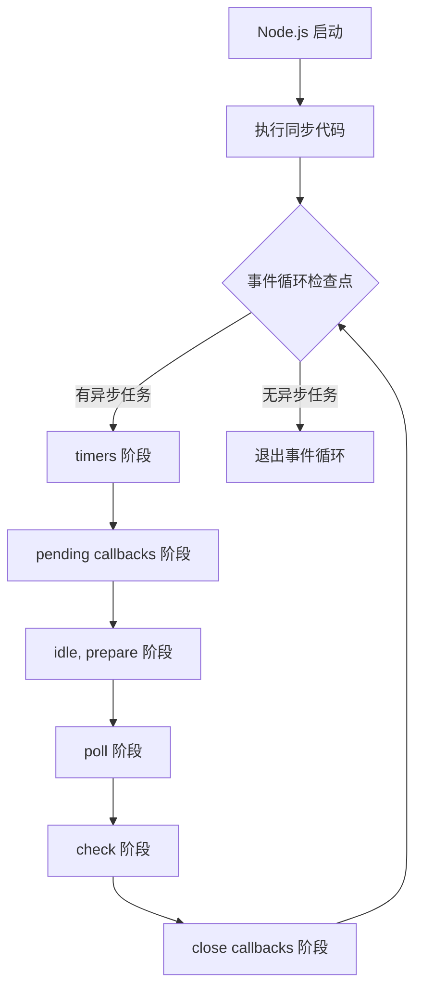

**完整执行流程示例：**

```javascript
// event-loop-flow.js
const fs = require('fs');

console.log('1. 同步代码开始');

// timers 阶段回调
setTimeout(() => {
  console.log('2. timers: setTimeout 回调');
}, 0);

// check 阶段回调
setImmediate(() => {
  console.log('3. check: setImmediate 回调');
});

// poll 阶段回调 (I/O)
fs.readFile(__filename, () => {
  console.log('4. poll: 文件读取完成回调');
  
  // 在 I/O 回调中设置定时器
  setTimeout(() => {
    console.log('5. timers: 嵌套的 setTimeout');
  }, 0);
  
  // 在 I/O 回调中设置 immediate
  setImmediate(() => {
    console.log('6. check: 嵌套的 setImmediate');
  });
});

console.log('7. 同步代码结束');

// 输出顺序：
// 1. 同步代码开始
// 7. 同步代码结束
// 2. timers: setTimeout 回调 (或 3. check: setImmediate 回调 - 取决于执行时机)
// 3. check: setImmediate 回调 (或 2. timers: setTimeout 回调)
// 4. poll: 文件读取完成回调
// 5. timers: 嵌套的 setTimeout
// 6. check: 嵌套的 setImmediate
```

**关键点说明：**

1. **同步代码优先**：所有同步代码在事件循环开始前执行完毕
2. **阶段间清空**：每个阶段会执行完队列中所有回调后才进入下一阶段
3. **微任务插队**：process.nextTick 和 Promise 微任务会在阶段切换时插队执行
4. **循环终止**：当没有待处理的异步任务时，事件循环自动退出

**来源：**
- Node.js 官方文档 - Don't Block the Event Loop
- https://nodejs.org/en/docs/guides/dont-block-the-event-loop/

---

#### 源码级解析：事件循环的内部结构

libuv 使用 C 语言实现事件循环，核心数据结构如下：

```c
// libuv 中 event loop 的核心结构 (简化版)
struct uv_loop_s {
  void* data;                      // 用户数据
  unsigned int n_handles;          // 活跃 handle 数量
  unsigned int n_reqs;             // 活跃 request 数量
  
  // 六个阶段的队列
  uv_timer_t* timer_heap;          // timers 阶段的定时器堆
  uv_queue_t pending_queue;        // pending callbacks 队列
  uv_queue_t idle_handles;         // idle 阶段 handles
  uv_queue_t poll_handles;         // poll 阶段 handles  
  uv_queue_t check_handles;        // check 阶段 handles
  uv_queue_t close_handles;        // close callbacks 队列
  
  // 特殊队列
  uv_queue_t endgame_handles;      // 等待关闭的 handles
  int stop_flag;                   // 停止标志
};
```

**事件循环主循环（简化伪代码）：**

```c
int uv_run(uv_loop_t* loop, uv_run_mode mode) {
  while (!loop->stop_flag) {
    // 1. 更新定时器时间
    uv__update_time(loop);
    
    // 2. 检查是否还有活跃任务
    if (!has_active_handles_or_requests(loop)) {
      break;  // 退出循环
    }
    
    // 3. 执行 timers 阶段
    uv__run_timers(loop);
    
    // 4. 执行 pending callbacks 阶段
    uv__run_pending(loop);
    
    // 5. 执行 idle 阶段
    uv__run_idle(loop);
    
    // 6. 执行 poll 阶段 (可能阻塞)
    uv__io_poll(loop);
    
    // 7. 执行 check 阶段
    uv__run_check(loop);
    
    // 8. 执行 close callbacks 阶段
    uv__run_closing_handles(loop);
  }
  return loop->stop_flag;
}
```

**来源：**
- libuv 源码 - include/uv.h
- https://github.com/libuv/libuv/blob/v1.x/include/uv.h

---

### 3.2 事件循环的六个阶段详解

事件循环包含六个主要阶段，每个阶段都有一个 FIFO（先进先出）队列存储待执行的回调。

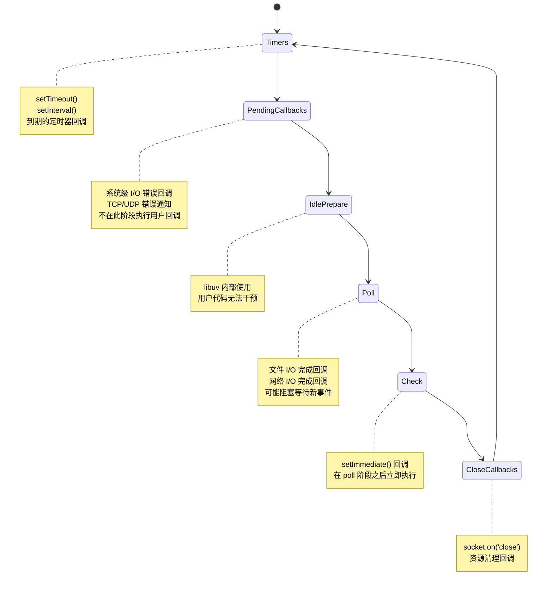

---

#### 阶段一：Timers（定时器阶段）

**执行内容：**
- `setTimeout(callback, delay)` 到期的回调
- `setInterval(callback, delay)` 到期的回调

**关键机制：**

1. **最小延迟时间**：即使设置 delay=0，实际延迟也至少为 1ms（某些系统为 4ms）
2. **时间抖动（Jitter）**：回调执行时间通常晚于预期，受系统负载和其他回调影响
3. **定时器堆**：使用最小堆数据结构，按到期时间排序，O(log n) 插入/删除

```javascript
// timers 阶段示例
console.log('开始');

setTimeout(() => {
  console.log('timeout 100ms');
}, 100);

setTimeout(() => {
  console.log('timeout 0ms');
}, 0);

// 实际输出：
// 开始
// timeout 0ms (实际延迟可能 1-4ms)
// timeout 100ms (实际延迟可能 100-110ms)
```

**定时器精度问题：**

```javascript
// 定时器精度测试
const start = Date.now();

setTimeout(() => {
  const elapsed = Date.now() - start;
  console.log(`期望 100ms, 实际 ${elapsed}ms`);
  
  // 阻塞操作模拟重负载
  while (Date.now() - start < 500) {
    // 空循环阻塞 500ms
  }
}, 100);

// 后续定时器会受影响
setTimeout(() => {
  const elapsed = Date.now() - start;
  console.log(`期望 200ms, 实际 ${elapsed}ms`);
}, 200);

// 输出示例：
// 期望 100ms, 实际 105ms
// 期望 200ms, 实际 605ms (因为前面阻塞了 500ms)
```

**源码解析：libuv 定时器实现**

```c
// libuv/src/unix/core.c - 定时器比较函数
static int timer_less_than(const uv__heap_node_t* a, 
                           const uv__heap_node_t* b) {
  const uv_timer_t* ta = container_of(a, uv_timer_t, heap_node);
  const uv_timer_t* tb = container_of(b, uv_timer_t, heap_node);
  
  // 按到期时间排序，时间相同则按插入顺序
  if (ta->timeout < tb->timeout) return 1;
  if (tb->timeout < ta->timeout) return 0;
  // 先插入的优先级更高 (FIFO)
  return ta->id < tb->id;
}

// 运行定时器 - 执行所有到期的回调
void uv__run_timers(uv_loop_t* loop) {
  uint64_t current_time = uv__hrtime(UV_CLOCK_FAST) / 1000000;
  
  while (loop->timer_heap != NULL) {
    uv_timer_t* handle = heap_min(loop->timer_heap);
    
    // 如果最小堆顶的定时器还未到期，停止执行
    if (handle->timeout > current_time) break;
    
    // 移除已到期定时器并执行回调
    heap_remove_min(loop->timer_heap);
    uv__make_close_pending(handle);
    handle->timeout = 0;
    
    if (handle->timer_cb != NULL) {
      handle->timer_cb(handle);
    }
  }
}
```

**来源：**
- Node.js 官方文档 - timers 阶段
- libuv 源码 - src/timer.c
- https://nodejs.org/api/timers.html

---

#### 阶段二：Pending Callbacks（待处理回调阶段）

**执行内容：**
- 某些系统操作的错误回调（如 TCP、UDP、文件系统错误）
- 上一轮循环中被延迟的 I/O 回调
- `socket.on('error', ...)` 类型的系统级错误

**不在此阶段执行：**
- `setTimeout` / `setInterval` 回调（在 timers 阶段）
- `setImmediate` 回调（在 check 阶段）
- `close` 事件回调（在 close callbacks 阶段）

```javascript
// pending callbacks 示例 - 系统级 I/O 错误
const net = require('net');

const server = net.createServer((socket) => {
  socket.on('error', (err) => {
    // 这类错误回调可能在 pending callbacks 阶段执行
    console.error('Socket error:', err);
  });
  
  // 强制触发错误
  socket.setKeepAlive(true, -1000);  // 无效参数可能触发错误
});

server.listen(3000);
```

**重要说明：**
pending callbacks 阶段主要由 libuv 内部使用，普通用户代码很少直接与此阶段交互。大多数用户级别的 I/O 回调实际上在 poll 阶段执行。

**来源：**
- Node.js 官方文档 - Event Loop 阶段说明
- https://nodejs.org/en/docs/guides/event-loop-timers-and-nexttick/

---

#### 阶段三：Idle / Prepare（空闲/准备阶段）

**执行内容：**
- 仅 libuv 内部使用
- 用户代码无法干预或注册此阶段的回调

**作用：**
为 libuv 提供内部清理和准备工作的执行时机，例如：
- 处理内部状态转换
- 准备下一阶段的执行环境

**注意：** 此阶段对用户透明，不需要关注。

---

#### 阶段四：Poll（轮询阶段）

**执行内容：**
- 文件 I/O 完成回调（fs.readFile, fs.writeFile 等）
- 网络 I/O 完成回调（HTTP 请求、TCP/UDP 连接）
- 除 close 回调、定时器回调、setImmediate 外的所有 I/O 回调

**关键特性：**

1. **可能阻塞**：如果 poll 队列为空且没有 pending 的 setImmediate，事件循环会阻塞在此阶段等待新 I/O 事件
2. **最大执行上限**：单次 poll 阶段最多执行 I/O_CALLBACKS_MAX 个回调（默认约 100 个），防止单个阶段占用过长时间
3. **阻塞退出条件**：
   - poll 队列非空时：同步执行所有回调直至队列为空或达到上限
   - poll 队列为空时：
     - 如果有 setImmediate：立即进入 check 阶段
     - 如果没有 setImmediate：阻塞等待新 I/O 事件加入

```javascript
// poll 阶段示例
const fs = require('fs');

console.log('开始读取文件');

// 文件 I/O 回调在 poll 阶段执行
fs.readFile(__filename, 'utf8', (err, data) => {
  console.log('文件读取完成');
  
  // 在 I/O 回调中设置定时器
  setTimeout(() => {
    console.log('定时器回调');
  }, 0);
  
  // 在 I/O 回调中设置 immediate
  setImmediate(() => {
    console.log('immediate 回调');
  });
});

console.log('等待文件读取...');

// 输出顺序：
// 开始读取文件
// 等待文件读取...
// 文件读取完成
// 定时器回调 (下一个 tick 的 timers 阶段)
// immediate 回调 (下一个 tick 的 check 阶段)
```

**阻塞行为示例：**

```javascript
// poll 阶段阻塞示例
const fs = require('fs');

console.log('脚本开始');

fs.readFile(__filename, () => {
  console.log('文件读取完成');
  
  // 设置一个长时间阻塞
  const start = Date.now();
  while (Date.now() - start < 100) {
    // 阻塞 100ms
  }
});

// 如果没有其他异步任务，事件循环会阻塞在 poll 阶段
// 等待文件读取完成
```

**源码解析：poll 阶段实现**

```c
// libuv/src/unix/epoll.c - Linux 上的 poll 实现
void uv__io_poll(uv_loop_t* loop, int timeout) {
  struct epoll_event events[MAX_EVENTS];
  int nfds;
  
  // 如果队列为空且没有 immediate，阻塞等待
  if (loop->pending_queue_empty && !has_immediate(loop)) {
    nfds = epoll_wait(loop->backend_fd, events, MAX_EVENTS, timeout);
  } else {
    // 否则立即返回
    nfds = epoll_wait(loop->backend_fd, events, MAX_EVENTS, 0);
  }
  
  // 处理就绪的事件
  for (int i = 0; i < nfds; i++) {
    uv__io_t* w = container_of(events[i].data.ptr, uv__io_t, watcher);
    w->cb(loop, w, events[i].events);
  }
}
```

**来源：**
- Node.js 官方文档 - poll 阶段
- libuv 源码 - src/unix/epoll.c
- https://nodejs.org/api/fs.html

---

#### 阶段五：Check（检查阶段）

**执行内容：**
- `setImmediate(callback)` 的回调

**关键特性：**

1. **立即执行**：在 poll 阶段之后立即执行
2. **不阻塞**：check 阶段不会阻塞等待
3. **I/O 回调后立即执行**：适合在 I/O 操作完成后立即执行某些逻辑

```javascript
// check 阶段示例
console.log('脚本开始');

setImmediate(() => {
  console.log('immediate 回调');
});

setTimeout(() => {
  console.log('timeout 回调');
}, 0);

console.log('脚本结束');

// 输出顺序（多数情况）：
// 脚本开始
// 脚本结束
// timeout 回调 (timers 阶段优先)
// immediate 回调 (check 阶段)

// 但如果在 I/O 回调中：
fs.readFile(__filename, () => {
  setTimeout(() => console.log('timeout in I/O'), 0);
  setImmediate(() => console.log('immediate in I/O'));
});
// 输出：
// immediate in I/O (总是先执行)
// timeout in I/O
```

**setImmediate vs setTimeout 深度对比：**

```javascript
// 递归调用测试
function recursiveSetImmediate(n) {
  if (n <= 0) return;
  setImmediate(() => {
    console.log(`immediate #${n}`);
    recursiveSetImmediate(n - 1);
  });
}

function recursiveSetTimeout(n) {
  if (n <= 0) return;
  setTimeout(() => {
    console.log(`timeout #${n}`);
    recursiveSetTimeout(n - 1);
  }, 0);
}

recursiveSetImmediate(5);
recursiveSetTimeout(5);

// 输出：
// immediate #5, #4, #3, #2, #1 (同一 tick 内执行)
// timeout #5, #4, #3, #2, #1 (每个 timeout 需要新的 tick)
```

**源码解析：check 阶段实现**

```c
// libuv/src/check.c
void uv__run_check(uv_loop_t* loop) {
  struct uv__queue* q = uv__queue_head(&loop->check_handles);
  
  while (q != &loop->check_handles) {
    uv_check_t* h = container_of(q, uv_check_t, queue);
    struct uv__queue* w = uv__queue_next(q);
    
    uv__queue_remove(q);
    uv__queue_insert_tail(&loop->check_handles, q);
    
    h->check_cb(h);
    
    q = w;
  }
}
```

**来源：**
- Node.js 官方文档 - setImmediate
- libuv 源码 - src/check.c
- https://nodejs.org/api/timers.html#setimmediatecallback-args

---

#### 阶段六：Close Callbacks（关闭回调阶段）

**执行内容：**
- `socket.on('close', ...)` 回调
- `stream.on('close', ...)` 回调
- 资源清理回调

```javascript
// close callbacks 阶段示例
const net = require('net');

const server = net.createServer((socket) => {
  socket.on('close', () => {
    console.log('连接已关闭');
  });
  
  socket.on('end', () => {
    console.log('连接结束');
    socket.destroy();
  });
  
  socket.write('Hello');
  socket.end();
});

server.listen(3000);
```

**重要注意事项：**

1. **资源清理**：确保在 close 回调中释放相关资源
2. **避免死循环**：在 close 回调中不要重新打开相同资源
3. **错误处理**：close 回调中也可能抛出错误，需要妥善处理

**来源：**
- Node.js 官方文档 - close 事件
- https://nodejs.org/api/net.html#event-close

---

### 3.3 宏任务与微任务的执行顺序（nextTick vs Promise）

#### 概念定义

**宏任务（Macro Task）**：在事件循环的某个阶段执行的回调，包括：
- `setTimeout` / `setInterval` 回调
- `setImmediate` 回调
- I/O 回调
- close 回调

**微任务（Micro Task）**：在当前阶段执行完毕后、下一阶段开始前立即执行的任务，包括：
- `process.nextTick` 回调
- `Promise.then` / `Promise.catch` / `Promise.finally` 回调
- `queueMicrotask` 回调

**关键区别：**
- 宏任务在下一个阶段执行
- 微任务在当前阶段结束后立即执行，甚至早于下一个宏任务

---

#### process.nextTick 深度解析

**是什么：**
`process.nextTick` 是 Node.js 特有的 API，用于在当前操作完成后、事件循环进入下一阶段之前立即执行回调。

**为什么存在：**
1. **保持 API 一致性**：某些 API 需要同步或异步执行，nextTick 确保回调总是在一致时机调用
2. **错误处理**：在构造函数中抛出错误很难捕获，nextTick 允许在对象创建后触发错误事件
3. **资源清理**：确保清理逻辑在当前同步代码完成后立即执行

```javascript
// nextTick 优先级示例
console.log('1. 同步代码');

process.nextTick(() => {
  console.log('2. nextTick 回调');
  
  // nextTick 可以递归调用，会立即执行
  process.nextTick(() => {
    console.log('3. 嵌套的 nextTick');
  });
});

Promise.resolve().then(() => {
  console.log('4. Promise 回调');
});

setTimeout(() => {
  console.log('5. setTimeout 回调');
}, 0);

// 输出：
// 1. 同步代码
// 2. nextTick 回调
// 3. 嵌套的 nextTick
// 4. Promise 回调
// 5. setTimeout 回调
```

**nextTick 队列与 Promise 微任务队列的区别：**

```javascript
// 执行顺序深度测试
console.log('start');

process.nextTick(() => {
  console.log('nextTick 1');
  process.nextTick(() => console.log('nextTick 2'));
});

Promise.resolve().then(() => {
  console.log('Promise 1');
  Promise.resolve().then(() => console.log('Promise 2'));
});

setTimeout(() => console.log('timeout'));

console.log('end');

// 输出：
// start
// end
// nextTick 1
// nextTick 2
// Promise 1
// Promise 2
// timeout
```

**关键点：**
1. nextTick 队列优先级高于 Promise 微任务队列
2. nextTick 队列会在当前阶段完全清空后才处理微任务
3. nextTick 中嵌套的 nextTick 会立即执行，而 Promise 嵌套则需要等待

---

#### 源码级解析：nextTick 内部实现

```javascript
// Node.js lib/internal/process/task_queues.js (简化版)

const kMaxTicks = 1e4;  // 最大 tick 数限制
let tickQueue = [];      // nextTick 队列
let running = false;     // 是否正在运行

function nextTick(callback) {
  tickQueue.push(callback);
  if (!running) {
    running = true;
    process._rawDebug('draining nextTick queue');
    drainQueue();
  }
}

function drainQueue() {
  let count = 0;
  while (count < kMaxTicks && tickQueue.length > 0) {
    const callback = tickQueue.shift();
    callback();
    count++;
  }
  running = false;
}

// process.nextTick 暴露给用户
process.nextTick = nextTick;
```

**C++ 层实现（简化）：**

```cpp
// Node.js src/node.cc
void ProcessNextTicks(v8::Local<v8::Context> context) {
  Environment* env = Environment::GetCurrent(context);
  
  while (env->has_next_tick_scheduled()) {
    const std::vector<v8::Local<v8::Function>>& callbacks = 
        env->get_next_tick_callbacks();
    
    for (auto& cb : callbacks) {
      cb->Call(context, Null(context), 0, nullptr);
    }
    
    callbacks.clear();
  }
}
```

**来源：**
- Node.js 源码 - lib/internal/process/task_queues.js
- Node.js 源码 - src/node.cc
- https://nodejs.org/api/process.html#process_process_nexttick_callback_args

---

#### Promise 微任务执行机制

**是什么：**
Promise 微任务是 ECMAScript 标准定义的异步机制，在同步代码执行完毕后、下一个宏任务之前执行。

**执行时机：**

```javascript
// Promise 微任务执行时机
console.log('1. script start');

setTimeout(() => {
  console.log('2. setTimeout');
}, 0);

Promise.resolve()
  .then(() => {
    console.log('3. Promise.then 1');
    return Promise.resolve();
  })
  .then(() => {
    console.log('4. Promise.then 2');
  });

setTimeout(() => {
  console.log('5. setTimeout 2');
}, 0);

console.log('6. script end');

// 输出：
// 1. script start
// 6. script end
// 3. Promise.then 1
// 4. Promise.then 2
// 2. setTimeout
// 5. setTimeout 2
```

**微任务队列处理流程：**

```javascript
// 每个宏任务执行完毕后的微任务处理
while (macrotaskQueue.length > 0) {
  const macrotask = macrotaskQueue.shift();
  execute(macrotask);
  
  // 执行完一个宏任务后，清空微任务队列
  while (microtaskQueue.length > 0) {
    const microtask = microtaskQueue.shift();
    execute(microtask);
  }
}
```

---

#### 完整执行顺序图示

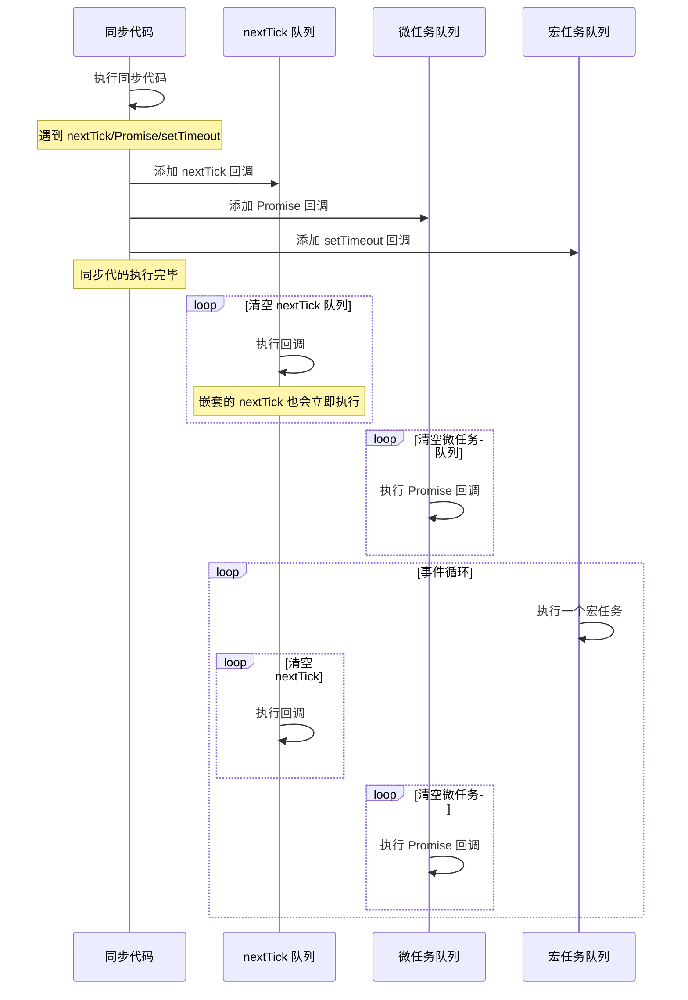

---

#### 常见误区

**误区 1：nextTick 和 Promise 优先级相同**

```javascript
// 错误认知：认为 nextTick 和 Promise 执行顺序不确定

// 实际情况：nextTick 总是优先于 Promise
process.nextTick(() => console.log('nextTick'));
Promise.resolve().then(() => console.log('Promise'));
// 输出：nextTick -> Promise
```

**误区 2：setTimeout(fn, 0) 会立即执行**

```javascript
// 错误认知：认为 setTimeout(fn, 0) 会立即执行

// 实际情况：需要等待至少 1ms 且要等到下一个 timers 阶段
console.log('start');
setTimeout(() => console.log('timeout'), 0);
console.log('end');
// 输出：start -> end -> timeout
```

**误区 3：微任务在宏任务执行过程中也能插队**

```javascript
// 错误认知：认为宏任务执行中的微任务会立即执行

// 实际情况：宏任务内部的微任务要等到当前宏任务完成
setTimeout(() => {
  console.log('macro start');
  Promise.resolve().then(() => console.log('micro in macro'));
  console.log('macro end');
}, 0);
// 输出：macro start -> macro end -> micro in macro
```

---

#### 最佳实践

**1. 使用 nextTick 处理错误**

```javascript
class MyClass {
  constructor(data) {
    if (!data) {
      // 使用 nextTick 确保错误在一致时机抛出
      process.nextTick(() => {
        this.emit('error', new Error('data is required'));
      });
      return;
    }
    this.data = data;
  }
}
```

**2. 避免 nextTick 递归导致栈溢出**

```javascript
// 危险：无限递归的 nextTick
function dangerous() {
  process.nextTick(dangerous);
}
dangerous();  // 最终导致内存耗尽

// 安全：使用 setTimeout 限制递归深度
function safe(n) {
  if (n <= 0) return;
  setTimeout(() => safe(n - 1), 0);
}
safe(10000);
```

**3. 使用 queueMicrotask 替代 Promise.resolve().then**

```javascript
// 推荐方式
queueMicrotask(() => {
  console.log('microtask');
});

// 等价但更简洁
Promise.resolve().then(() => {
  console.log('microtask');
});
```

**来源：**
- Node.js 官方文档 - process.nextTick
- https://nodejs.org/api/process.html

---

### 3.4 非阻塞 I/O 与 libuv 的 I/O 多路复用

#### 概念定义：阻塞 I/O 与非阻塞 I/O

**阻塞 I/O（Blocking I/O）：**
当应用程序发起 I/O 请求（如读取文件、网络请求）时，当前线程会阻塞等待 I/O 操作完成，期间无法执行任何其他任务。

```javascript
// 阻塞 I/O 示例
const fs = require('fs');

console.log('开始读取');
const data = fs.readFileSync('/path/to/file');  // 线程阻塞在这里
console.log('读取完成');  // 只有读取完成后才能执行

// 问题：如果文件很大或磁盘慢，后续代码完全无法执行
```

**非阻塞 I/O（Non-blocking I/O）：**
应用程序发起 I/O 请求后立即返回，不等待结果，I/O 操作在后台完成，完成后通过回调、Promise 或事件通知应用程序。

```javascript
// 非阻塞 I/O 示例
const fs = require('fs');

console.log('开始读取');
fs.readFile('/path/to/file', (err, data) => {
  console.log('读取完成');  // 回调在 I/O 完成后执行
});
console.log('继续执行');  // 不会等待读取完成

// 输出：开始读取 -> 继续执行 -> 读取完成
```

---

#### libuv 架构解析

libuv 是 Node.js 异步 I/O 的核心库，提供跨平台的 I/O 多路复用机制。

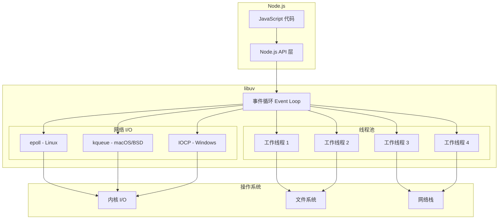

**libuv 核心组件：**

| 组件 | 作用 | 使用场景 |
|------|------|----------|
| 事件循环 | 调度和执行异步回调 | 所有异步操作 |
| epoll/kqueue/IOCP | I/O 多路复用 | 网络 I/O、非阻塞文件 I/O |
| 线程池 | 执行阻塞操作 | 文件 I/O、DNS 查询、加密 |
| 异步 I/O API | 统一的跨平台接口 | fs、net、http 等模块 |

---

#### I/O 多路复用机制对比

**1. epoll（Linux）**

epoll 是 Linux 2.6+ 内核提供的高效 I/O 多路复用机制，采用事件驱动模型。

**工作原理：**
1. 应用通过 `epoll_create` 创建 epoll 实例
2. 通过 `epoll_ctl` 注册感兴趣的 fd 和事件类型
3. 通过 `epoll_wait` 阻塞等待事件
4. 内核维护就绪列表，有事件时唤醒应用

**优势：**
- O(1) 时间复杂度，不受 fd 数量影响
- 内核主动通知，无需轮询
- 支持边缘触发（ET）和水平触发（LT）

```c
// epoll 使用示例（简化）
int epfd = epoll_create(1);

struct epoll_event event;
event.events = EPOLLIN | EPOLLET;  // 读事件 + 边缘触发
event.data.fd = sockfd;

epoll_ctl(epfd, EPOLL_CTL_ADD, sockfd, &event);

// 等待事件
struct epoll_event events[MAX_EVENTS];
int nfds = epoll_wait(epfd, events, MAX_EVENTS, -1);

for (int i = 0; i < nfds; i++) {
    handle_event(events[i].data.fd);
}
```

**来源：** Linux epoll 官方文档

---

**2. kqueue（macOS/BSD）**

kqueue 是 BSD 系统（包括 macOS）的事件通知接口，功能比 epoll 更强大。

**工作原理：**
1. 通过 `kqueue()` 创建队列
2. 通过 `kevent()` 注册事件过滤器
3. 通过 `kevent()` 等待事件

**支持的过滤器类型：**
- `EVFILT_READ`：读就绪
- `EVFILT_WRITE`：写就绪
- `EVFILT_TIMER`：定时器
- `EVFILT_SIGNAL`：信号
- `EVFILT_VNODE`：文件状态变化

```c
// kqueue 使用示例（简化）
int kq = kqueue();

struct kevent change;
EV_SET(&change, sockfd, EVFILT_READ, EV_ADD, 0, 0, NULL);

struct kevent events[MAX_EVENTS];
int nev = kevent(kq, &change, 1, events, MAX_EVENTS, NULL);

for (int i = 0; i < nev; i++) {
    handle_event(events[i].ident);
}
```

---

**3. IOCP（Windows）**

IOCP（I/O Completion Port）是 Windows 特有的异步 I/O 机制，设计用于高并发场景。

**工作原理：**
1. 创建完成端口
2. 将 socket/file handle 关联到完成端口
3. 发起异步 I/O 请求（立即返回）
4. I/O 完成后，系统将完成包放入完成端口队列
5. 工作线程从队列取出完成包处理

**优势：**
- 真正的异步 I/O，不需要事件循环轮询
- 内核自动调度线程，负载均衡
- 无上下文切换开销

```cpp
// IOCP 简化示例
HANDLE hCP = CreateIoCompletionPort(INVALID_HANDLE_VALUE, NULL, 0, 0);

// 关联 socket 到完成端口
CreateIoCompletionPort(hSocket, hCP, (ULONG_PTR)context, 0);

// 发起异步读取
ReadFile(hSocket, buffer, size, NULL, &overlapped);

// 工作线程等待完成包
DWORD bytes;
ULONG_PTR key;
LPOVERLAPPED ov;
GetQueuedCompletionStatus(hCP, &bytes, &key, &ov, INFINITE);

// 处理完成
handle_completion(key, bytes, ov);
```

---

#### 三种机制对比表

| 特性 | epoll | kqueue | IOCP |
|------|-------|--------|------|
| 平台 | Linux 2.6+ | macOS/BSD | Windows |
| 模型 | 事件通知 | 事件过滤 | 完成端口 |
| 时间复杂度 | O(1) | O(1) | O(1) |
| 触发方式 | ET/LT | 边缘/水平 | 完成通知 |
| 支持事件 | 读/写/异常 | 读/写/定时/信号/文件 | 所有 I/O |
| API 调用 | 3 个系统调用 | 2 个系统调用 | 多个 API |
| 线程模型 | 单线程事件循环 | 单线程事件循环 | 多线程池 |

---

#### Node.js 中的 I/O 多路复用实现

**网络 I/O（使用 epoll/kqueue/IOCP）：**

```javascript
const net = require('net');

const server = net.createServer((socket) => {
  // 连接建立，socket 被注册到 epoll/kqueue/IOCP
  socket.on('data', (data) => {
    // 数据到达时，内核通知 libuv，回调在 poll 阶段执行
    console.log('收到数据:', data.toString());
  });
  
  socket.on('end', () => {
    console.log('连接断开');
  });
});

server.listen(3000, () => {
  console.log('服务器监听 3000 端口');
  
  // 此时事件循环在 poll 阶段阻塞，等待连接事件
  // 当有新连接时，内核唤醒事件循环，执行回调
});
```

**文件 I/O（使用线程池）：**

```javascript
const fs = require('fs');

// 文件 I/O 使用线程池，不是 epoll/kqueue
fs.readFile('/path/to/file', (err, data) => {
  // 回调在工作线程完成读取后，由事件循环调度执行
  console.log('文件读取完成');
});

// 调整线程池大小（默认 4）
process.env.UV_THREADPOOL_SIZE = 8;
```

**为什么文件 I/O 使用线程池？**
- 大多数操作系统不支持异步文件 I/O（Linux AIO 仅限于 O_DIRECT）
- 文件操作（尤其是磁盘 I/O）可能阻塞，使用线程池避免阻塞事件循环
- 线程池大小有限，大量文件 I/O 可能导致排队

---

#### 源码解析：libuv I/O 多路复用

```c
// libuv/src/unix/linux.c - Linux epoll 实现

static int uv__epoll_init(uv_loop_t* loop) {
  int fd;
  
  // 创建 epoll 实例
  fd = epoll_create1(O_CLOEXEC);
  if (fd < 0) return UV__ERR(errno);
  
  loop->backend_fd = fd;
  loop->io_watcher.cb = uv__io_poll;  // 设置 poll 回调
  
  return 0;
}

// 注册 fd 到 epoll
static void uv__epoll_add(uv_loop_t* loop, int fd, int events) {
  struct epoll_event e;
  
  e.events = events;  // EPOLLIN, EPOLLOUT 等
  e.data.fd = fd;
  
  epoll_ctl(loop->backend_fd, EPOLL_CTL_ADD, fd, &e);
}

// 主 poll 函数
void uv__io_poll(uv_loop_t* loop, int timeout) {
  struct epoll_event events[MAX_EVENTS];
  int nfds;
  
  // 阻塞等待事件
  nfds = epoll_wait(loop->backend_fd, events, MAX_EVENTS, timeout);
  
  if (nfds > 0) {
    for (int i = 0; i < nfds; i++) {
      uv__io_t* w = container_of(events[i].data.ptr, uv__io_t, watcher);
      w->cb(loop, w, events[i].events);  // 执行回调
    }
  }
}
```

**来源：**
- libuv 源码 - src/unix/linux.c
- libuv 源码 - src/unix/core.c

---

#### 常见误区

**误区 1：所有 I/O 都是异步的**

```javascript
// 错误：fs.readFile 在某些情况下是同步的
// 实际：fs.readFile 总是异步，但使用线程池

// 真正的同步 I/O
const data = fs.readFileSync('/path/to/file');  // 阻塞

// 异步 I/O
fs.readFile('/path/to/file', (err, data) => {
  // 非阻塞
});
```

**误区 2：线程池越大越好**

```javascript
// 错误：盲目增大线程池
process.env.UV_THREADPOOL_SIZE = 100;  // 可能导致更多上下文切换

// 正确：根据 CPU 核心数调整
const os = require('os');
process.env.UV_THREADPOOL_SIZE = os.cpus().length * 2;
```

**误区 3：epoll 没有性能问题**

```javascript
// 错误：认为 epoll 总是高效
// 实际：边缘触发（ET）模式下，必须循环读取直到 EAGAIN
// 否则可能遗漏数据

socket.setEncoding('utf8');
socket.on('data', (data) => {
  // 必须处理完所有数据
  while (true) {
    const chunk = socket.read();
    if (chunk === null) break;
    process(chunk);
  }
});
```

---

#### 最佳实践

**1. 避免阻塞事件循环**

```javascript
// 错误：同步操作阻塞事件循环
app.get('/heavy', (req, res) => {
  const result = heavyComputation();  // 阻塞 1 秒
  res.send(result);
});

// 正确：使用 Worker Threads
const { Worker } = require('worker_threads');
app.get('/heavy', (req, res) => {
  const worker = new Worker('./heavy.js');
  worker.on('message', (result) => res.send(result));
});
```

**2. 监控事件循环延迟**

```javascript
// 使用 eventLoopUtilization 监控
const { performance } = require('perf_hooks');
const { eventLoopUtilization } = performance;

let last = eventLoopUtilization();
setInterval(() => {
  const current = eventLoopUtilization();
  const elu = eventLoopUtilization(current, last);
  console.log('事件循环利用率:', elu.utilization);
  last = current;
}, 1000);
```

**3. 合理设置线程池大小**

```javascript
// 根据工作负载类型调整
// 文件密集型：增加线程池
process.env.UV_THREADPOOL_SIZE = 16;

// CPU 密集型：使用 Worker Threads
const { Worker } = require('worker_threads');
```

**来源：**
- Node.js 官方文档 - Don't Block the Event Loop
- https://nodejs.org/en/docs/guides/dont-block-the-event-loop/

---

### 3.5 事件发射器 EventEmitter 源码级解析

#### 概念定义

**EventEmitter** 是 Node.js 中实现事件驱动架构的核心类，提供发布-订阅模式的基础实现。

**核心功能：**
- `on(event, listener)`：注册持续监听器
- `once(event, listener)`：注册一次性监听器
- `emit(event, ...args)`：触发事件
- `off(event, listener)`：移除监听器
- `listenerCount(event)`：获取监听器数量

```javascript
const { EventEmitter } = require('events');

class MyEmitter extends EventEmitter {}

const emitter = new MyEmitter();

// 注册监听器
emitter.on('data', (data) => {
  console.log('收到数据:', data);
});

// 触发事件
emitter.emit('data', 'hello');
```

---

#### 源码级解析：EventEmitter 内部实现

**核心数据结构：**

```javascript
// Node.js events.js (简化版)
function EventEmitter() {
  this._events = Object.create(null);
  this._eventsCount = 0;
  this._maxListeners = 10;  // 默认最大监听器数
}

// 内部结构示例：
// emitter._events = {
//   'data': [listener1, listener2, listener3],
//   'error': errorHandler,  // 单个监听器时直接存储
//   Symbol(kCapture): false
// }
```

**on 方法实现：**

```javascript
EventEmitter.prototype.on = function(type, listener) {
  if (typeof listener !== 'function') {
    throw new TypeError('listener must be a function');
  }
  
  let events = this._events;
  let existing;
  
  // 检查是否已存在监听器
  if (events) {
    existing = events[type];
  } else {
    events = this._events = Object.create(null);
    this._eventsCount = 0;
  }
  
  if (!existing) {
    // 没有监听器，直接存储
    events[type] = listener;
  } else if (typeof existing === 'function') {
    // 一个监听器，转换为数组
    events[type] = [existing, listener];
  } else {
    // 多个监听器，添加到数组
    existing.push(listener);
  }
  
  // 检查监听器数量限制
  const max = this._maxListeners || 10;
  if (max > 0 && events[type].length > max) {
    console.warn('MaxListenersExceededWarning');
  }
  
  this._eventsCount++;
  return this;
};
```

**once 方法实现：**

```javascript
EventEmitter.prototype.once = function(type, listener) {
  if (typeof listener !== 'function') {
    throw new TypeError('listener must be a function');
  }
  
  // 创建包装函数
  const wrapper = function(...args) {
    // 先移除自身
    emitter.removeListener(type, wrapper);
    // 再调用原始监听器
    listener.apply(this, args);
  };
  
  wrapper.listener = listener;
  
  return this.on(type, wrapper);
};

// 使用示例
emitter.once('connect', () => {
  console.log('只执行一次');
});
```

**emit 方法实现：**

```javascript
EventEmitter.prototype.emit = function(type, ...args) {
  let events = this._events;
  if (!events) return false;
  
  const handler = events[type];
  if (!handler) return false;
  
  // 单个监听器
  if (typeof handler === 'function') {
    handler.apply(this, args);
    return true;
  }
  
  // 多个监听器
  const len = handler.length;
  for (let i = 0; i < len; i++) {
    handler[i].apply(this, args);
  }
  return true;
};
```

**removeListener 方法实现：**

```javascript
EventEmitter.prototype.removeListener = function(type, listener) {
  if (typeof listener !== 'function') {
    throw new TypeError('listener must be a function');
  }
  
  const events = this._events;
  if (!events) return this;
  
  const handler = events[type];
  if (!handler) return this;
  
  if (handler === listener || handler.listener === listener) {
    // 只有一个监听器且匹配
    delete events[type];
  } else if (typeof handler === 'function') {
    // 单个监听器但不匹配
    return this;
  } else {
    // 多个监听器，查找并移除
    for (let i = 0; i < handler.length; i++) {
      if (handler[i] === listener || handler[i].listener === listener) {
        handler.splice(i, 1);
        break;
      }
    }
  }
  
  return this;
};
```

---

#### EventEmitter 完整类结构

```javascript
const EventEmitter = require('events');

class MyEmitter extends EventEmitter {
  constructor() {
    super();
    // 设置最大监听器数
    this.setMaxListeners(20);
  }
  
  // 触发带参数的oevent
  emitData(data) {
    this.emit('data', data);
  }
  
  // 触发错误事件
  emitError(err) {
    this.emit('error', err);
  }
}

const emitter = new MyEmitter();

// 监听事件
emitter.on('data', (data) => {
  console.log('data:', data);
});

// 监听错误
emitter.on('error', (err) => {
  console.error('error:', err.message);
});

// 一次性监听
emitter.once('ready', () => {
  console.log('ready - 只执行一次');
});

// 获取监听器数量
console.log(emitter.listenerCount('data'));  // 1

// 移除监听器
const handler = (data) => console.log(data);
emitter.on('data', handler);
emitter.off('data', handler);

// 获取所有监听器
console.log(emitter.listeners('data'));
```

---

#### 事件执行顺序与 this 指向

```javascript
const emitter = new EventEmitter();

// this 指向测试
const obj = {
  name: 'MyObject'
};

// 普通函数：this 指向 emitter
emitter.on('test1', function() {
  console.log('this:', this);  // EventEmitter 实例
});

// 箭头函数：this 指向定义时的作用域
emitter.on('test2', () => {
  console.log('this:', this);  // 外层作用域的 this
});

// 绑定 this
emitter.on('test3', function() {
  console.log('this:', this);
}.bind(obj));

emitter.emit('test1');
emitter.emit('test2');
emitter.emit('test3');
```

---

#### 特殊事件

**newListener 事件：**

```javascript
const emitter = new EventEmitter();

// 监听 newListener 事件
emitter.on('newListener', (event, listener) => {
  console.log(`添加了监听器：${event}`);
});

emitter.on('data', () => {});
// 输出：添加了监听器：data
```

**removeListener 事件：**

```javascript
emitter.on('removeListener', (event, listener) => {
  console.log(`移除了监听器：${event}`);
});
```

**error 事件特殊处理：**

```javascript
// 如果 emit('error') 但没有监听器，会抛出未捕获异常
const emitter = new EventEmitter();

// 错误：没有监听 error 事件
emitter.emit('error', new Error('Something wrong'));
// 抛出：Uncaught Error: Something wrong

// 正确：监听 error 事件
emitter.on('error', (err) => {
  console.error('处理错误:', err.message);
});
```

---

#### 常见误区

**误区 1：exports 和 module.exports 可以混用**

```javascript
// 错误：exports = xxx 不会导出
exports = function() {};  // 无效

// 正确：使用 module.exports
module.exports = function() {};
```

**误区 2：EventEmitter 会自动异步执行**

```javascript
// 错误：认为 emit 是异步的
emitter.on('data', (data) => {
  console.log('1. listener');
});
emitter.emit('data');
console.log('2. after emit');
// 输出：1. listener -> 2. after emit (同步执行)

// 正确：需要异步时手动包裹
emitter.on('data', (data) => {
  setImmediate(() => console.log('async'));
});
```

**误区 3：监听器数量限制是硬性限制**

```javascript
// 错误：超过 10 个监听器就报错
// 实际：只是警告，可以通过 setMaxListeners 调整
emitter.setMaxListeners(100);
```

---

#### 最佳实践

**1. 继承 EventEmitter**

```javascript
const { EventEmitter } = require('events');

class Database extends EventEmitter {
  async connect() {
    try {
      // 连接逻辑
      this.emit('connected');
    } catch (err) {
      this.emit('error', err);
    }
  }
}

const db = new Database();
db.on('connected', () => console.log('数据库已连接'));
db.on('error', (err) => console.error('数据库错误:', err));
db.connect();
```

**2. 使用 util.inherits（传统方式）**

```javascript
const util = require('util');
const EventEmitter = require('events');

function MyEmitter() {
  EventEmitter.call(this);
}

util.inherits(MyEmitter, EventEmitter);
```

**3. 内存泄漏防范**

```javascript
// 及时移除监听器
const handler = (data) => console.log(data);
emitter.on('data', handler);

// 使用完后移除
emitter.removeListener('data', handler);

// 或使用 once
emitter.once('data', handler);
```

**来源：**
- Node.js 官方文档 - Events
- Node.js 源码 - lib/events.js
- https://nodejs.org/api/events.html

---

## 第 4 章 模块系统底层机制

---

### 4.1 CommonJS 规范：module 对象、require 实现原理

#### 概念定义

**CommonJS** 是 Node.js 使用的模块系统规范，定义了一套同步的模块加载机制。

**核心特性：**
- 同步加载：`require()` 是同步操作，会阻塞直到模块加载完成
- 运行时加载：模块在运行时动态加载和解析
- 值拷贝导出：导出的是值的拷贝（基本类型）或引用（对象/函数）
- 模块缓存：加载后的模块会被缓存，重复 require 返回缓存实例

```javascript
// CommonJS 基本用法
// circle.js
const { PI } = Math;

exports.area = (r) => PI * r ** 2;
exports.circumference = (r) => 2 * PI * r;

// app.js
const circle = require('./circle.js');
console.log(circle.area(4));  // 50.26548245743669
```

---

#### module 对象详解

**module 对象属性：**

| 属性 | 描述 |
|------|------|
| `module.exports` | 模块的实际导出对象 |
| `module.id` | 模块的唯一标识符 |
| `module.filename` | 模块的绝对路径 |
| `module.loaded` | 是否已加载完成 |
| `module.parent` | 父模块（谁 require 了这个模块） |
| `module.children` | 子模块数组（这个模块 require 了哪些） |
| `module.paths` | 模块搜索路径数组 |
| `module.isPreloading` | 是否在预加载中 |

```javascript
// module 对象属性测试
console.log('module.id:', module.id);           // '.'
console.log('module.filename:', module.filename); // 绝对路径
console.log('module.loaded:', module.loaded);   // false -> true
console.log('module.parent:', module.parent);   // null 或父模块
console.log('module.children:', module.children); // []
console.log('module.paths:', module.paths);     // 搜索路径
```

---

#### require 函数详解

**require 方法：**

| 方法 | 描述 |
|------|------|
| `require(id)` | 加载模块 |
| `require.resolve(id)` | 返回模块的绝对路径 |
| `require.cache` | 缓存的模块对象 |
| `require.extensions` | 文件扩展名处理器（已废弃） |
| `require.main` | 主模块对象 |

```javascript
// require 方法测试

// 1. require.resolve - 获取模块路径
const path = require.resolve('./circle.js');
console.log(path);  // /absolute/path/to/circle.js

// 2. require.cache - 查看缓存
console.log(require.cache);

// 3. require.main - 判断是否为主模块
console.log(require.main === module);  // true 表示当前文件是入口

// 4. require.extensions - 自定义加载器（不推荐使用）
require.extensions['.txt'] = (module, filename) => {
  const fs = require('fs');
  module.exports = fs.readFileSync(filename, 'utf8');
};
```

---

#### 模块包装器（Module Wrapper）

Node.js 在加载模块时会将代码包装在一个函数中，创建模块作用域：

```javascript
// 原始代码
// circle.js
const { PI } = Math;
exports.area = (r) => PI * r ** 2;

// 实际执行的代码（包装后）
(function(exports, require, module, __filename, __dirname) {
  const { PI } = Math;
  exports.area = (r) => PI * r ** 2;
});
```

**包装函数的参数：**
- `exports`：`module.exports` 的引用
- `require`：模块加载函数
- `module`：当前模块对象
- `__filename`：当前文件的绝对路径
- `__dirname`：当前文件所在目录的绝对路径

**为什么需要包装？**
1. **创建模块作用域**：避免全局变量污染
2. **注入特殊变量**：提供 `exports`、`require`、`module` 等
3. **支持 `__filename` 和 `__dirname`**：这些变量不是全局的，而是包装函数注入的

```javascript
// 验证包装函数
console.log(typeof exports);        // 'object'
console.log(typeof require);        // 'function'
console.log(typeof module);         // 'object'
console.log(typeof __filename);     // 'string'
console.log(typeof __dirname);      // 'string'

// 这些变量在其他 JavaScript 环境中不存在
```

---

#### exports vs module.exports

```javascript
// 核心区别：exports 是 module.exports 的引用

// 场景 1：添加属性（两者等价）
exports.name = 'Alice';
module.exports.name = 'Alice';

// 场景 2：重新赋值（只有 module.exports 有效）
exports = { name: 'Alice' };  // 无效！exports 被重新赋值，与 module.exports 断开
module.exports = { name: 'Alice' };  // 有效

// 场景 3：导出函数或类
// 错误
exports = function() {};

// 正确
module.exports = function() {};

// 或者
exports.default = function() {};
```

---

#### 模块缓存机制

```javascript
// 第一次加载
const a = require('./module-a.js');
console.log(require.cache);  // 包含 module-a

// 第二次加载（返回缓存）
const a2 = require('./module-a.js');
console.log(a === a2);  // true，同一实例

// 清除缓存
delete require.cache[require.resolve('./module-a.js')];
const a3 = require('./module-a.js');  // 重新加载
console.log(a === a3);  // false，新实例
```

**缓存查找流程：**

```mermaid
flowchart TD
    A[require('./module')] --> B{检查缓存}
    B -->|缓存命中 | C[返回缓存的 module.exports]
    B -->|缓存未命中 | D[创建新 Module 对象]
    D --> E[解析模块路径]
    E --> F[读取文件内容]
    F --> G[包装代码]
    G --> H[执行模块代码]
    H --> I[缓存 module 对象]
    I --> J[返回 module.exports]
```

---

#### 源码解析：Module._load

```javascript
// Node.js lib/internal/modules/cjs/loader.js (简化版)

Module._load = function(request, parent, isMain) {
  // 1. 解析模块路径
  const filename = Module._resolveFilename(request, parent, isMain);
  
  // 2. 检查缓存
  const cachedModule = Module._cache[filename];
  if (cachedModule !== undefined) {
    return cachedModule.exports;  // 返回缓存
  }
  
  // 3. 创建新模块
  const module = new Module(filename, parent);
  
  // 4. 缓存模块（在加载前缓存，防止循环依赖）
  Module._cache[filename] = module;
  
  try {
    // 5. 加载模块
    module.load(filename);
    return module.exports;
  } catch (err) {
    // 6. 加载失败，清除缓存
    delete Module._cache[filename];
    throw err;
  }
};

// Module.prototype.load
Module.prototype.load = function(filename) {
  const extension = path.extname(filename);
  
  // 根据扩展名调用对应的加载函数
  Module._extensions[extension](this, filename);
  
  this.loaded = true;
};

// .js 文件加载
Module._extensions['.js'] = function(module, filename) {
  const content = fs.readFileSync(filename, 'utf8');
  module._compile(content, filename);
};

// 模块编译
Module.prototype._compile = function(content, filename) {
  // 1. 包装代码
  const wrapper = Module.wrap(content);
  
  // 2. 创建 VM 脚本
  const compiledWrapper = vm.runInThisContext(wrapper, {
    filename: filename,
    lineOffset: 0
  });
  
  // 3. 执行模块代码
  const result = compiledWrapper.call(
    this.exports,      // this 指向
    this.exports,      // exports
    require,           // require
    this,              // module
    filename,          // __filename
    path.dirname(filename)  // __dirname
  );
  
  return result;
};

// 模块包装函数
Module.wrap = function(script) {
  return '(function(exports, require, module, __filename, __dirname) { ' +
         script +
         '\n});';
};
```

---

### 4.2 ES Modules(ESM) 规范：静态分析、链接与实例化

#### 概念定义

**ES Modules (ESM)** 是 JavaScript 官方的模块标准，Node.js 从 v12+ 开始全面支持。

**与 CommonJS 的核心区别：**

| 特性 | CommonJS | ES Modules |
|------|----------|------------|
| 导入语法 | `require()` | `import` |
| 导出语法 | `module.exports` | `export` |
| 加载时机 | 运行时动态加载 | 编译时静态分析 |
| 执行顺序 | 同步加载 | 异步加载 |
| 导出绑定 | 值拷贝 | 实时绑定（引用） |
| this 指向 | 指向 exports | 指向 undefined |
| 文件扩展名 | `.js` | `.mjs` 或 `"type": "module"` |

```javascript
// ESM 基本用法
// add.mjs
export function add(a, b) {
  return a + b;
}

// app.mjs
import { add } from './add.mjs';
console.log(add(1, 2));  // 3
```

---

#### 静态分析与编译时检查

**静态分析的优势：**

1. **编译时优化**：可以在编译时确定依赖关系，进行 tree-shaking
2. **循环依赖处理**：ESM 能更好地处理循环依赖
3. **语法检查**：导入不存在的导出会在编译时报错

```javascript
// ESM 静态分析示例
// 以下代码在编译时就会报错，因为 './math.js' 没有导出 'subtract'
import { add, subtract } from './math.mjs';
// SyntaxError: The requested module './math.mjs' does not provide an export named 'subtract'
```

**CommonJS 运行时加载：**

```javascript
// CommonJS 可以动态加载
const moduleName = Math.random() > 0.5 ? './a.js' : './b.js';
const module = require(moduleName);  // 运行时决定
```

**ESM 动态导入：**

```javascript
// ESM 动态导入（返回 Promise）
const moduleName = Math.random() > 0.5 ? './a.mjs' : './b.mjs';
import(moduleName).then(module => {
  // 使用模块
});

// top-level await
const module = await import('./module.mjs');
```

---

#### 链接与实例化

**ESM 加载流程：**

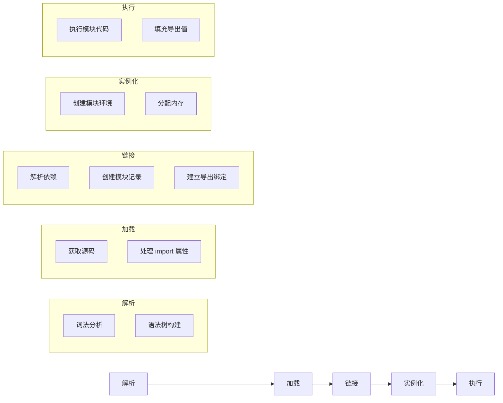

**1. 解析（Parsing）**
- 词法分析：将源码分解为 token
- 语法分析：构建抽象语法树（AST）
- 提取 import/export 语句

**2. 加载（Loading）**
- 根据 import specifier 获取源码
- 处理模块属性（如 import attributes）

**3. 链接（Linking）**
- 解析所有依赖
- 创建模块记录（Module Record）
- 建立导出绑定（export bindings）

**4. 实例化（Instantiation）**
- 创建模块环境
- 为变量分配内存空间

**5. 执行（Evaluation）**
- 执行模块代码
- 填充导出值

---

#### 实时绑定 vs 值拷贝

**CommonJS 值拷贝：**

```javascript
// counter.js (CJS)
let count = 0;
module.exports = {
  get count() { return count; },
  increment() { count++; }
};

// app.js (CJS)
const counter = require('./counter.js');
counter.increment();
console.log(counter.count);  // 1
```

**ESM 实时绑定：**

```javascript
// counter.mjs (ESM)
export let count = 0;
export function increment() {
  count++;
}

// app.mjs (ESM)
import { count, increment } from './counter.mjs';
increment();
console.log(count);  // 1（实时绑定）

// 甚至可以修改导入的变量
// 注意：这在实际开发中不推荐
import { count } from './counter.mjs';
count = 100;  // 会修改原始模块的 count
```

---

#### import.meta

`import.meta` 是 ESM 特有的元对象，包含模块相关信息：

```javascript
// import.meta.url - 当前模块的 URL
console.log(import.meta.url);
// file:///path/to/module.mjs

// import.meta.dirname - 当前模块所在目录（Node.js 20.11+）
console.log(import.meta.dirname);
// /path/to

// import.meta.filename - 当前模块的文件路径（Node.js 20.11+）
console.log(import.meta.filename);
// /path/to/module.mjs

// import.meta.resolve - 解析模块路径
const resolved = import.meta.resolve('./module.mjs');
console.log(resolved);
```

---

### 4.3 CJS 与 ESM 的互操作与迁移指南

#### ESM 中导入 CommonJS

```javascript
// ESM 导入 CJS
// CJS 模块: ./cjs-module.js
module.exports = {
  name: 'CJS Module',
  greet() { console.log('Hello from CJS'); }
};

// ESM 导入
import cjsModule from './cjs-module.js';  // default 导入
console.log(cjsModule.name);  // 'CJS Module'
cjsModule.greet();

// 命名导入（需要 CJS 导出特定格式）
// CJS: exports.named = 'value';
import { named } from './cjs-module.js';
```

**注意事项：**
- CJS 模块的 `module.exports` 在 ESM 中作为 `default` 导出
- 不能使用 `import { name } from './cjs.js'` 直接解构 CJS 导出

---

#### CommonJS 中导入 ESM

```javascript
// CJS 不能直接 require ESM
// 以下代码会报错：
// const esm = require('./esm.mjs');  // ERR_REQUIRE_ESM

// 正确方式：使用动态 import()
async function loadESM() {
  const esm = await import('./esm.mjs');
  return esm;
}

loadESM().then(module => {
  console.log(module);
});
```

---

#### package.json 配置

```json
{
  // 方式 1：使用 .mjs 扩展名（ESM）
  // 方式 2：使用 "type": "module"（所有.js 视为 ESM）
  "type": "module",
  
  // 方式 3：使用 .cjs 强制指定 CJS
  // 方式 4：不设置 type，默认 CJS
}
```

**迁移策略：**

**阶段 1：双格式支持**

```json
{
  "main": "./dist/index.cjs",
  "module": "./dist/index.mjs",
  "exports": {
    ".": {
      "import": "./dist/index.mjs",
      "require": "./dist/index.cjs"
    }
  }
}
```

**阶段 2：完全迁移到 ESM**

```javascript
// 从
module.exports = { foo, bar };
const mod = require('./mod');

// 到
export { foo, bar };
import mod from './mod';
```

---

#### 互操作完整示例

```javascript
// === CommonJS 模块 ===
// cjs-module.js
const value = 'CJS';

function getValue() {
  return value;
}

module.exports = {
  value,
  getValue
};

// === ES Module 模块 ===
// esm-module.mjs
export const value = 'ESM';

export function getValue() {
  return value;
}

// === ESM 导入 CJS ===
// esm-import-cjs.mjs
import cjs from './cjs-module.js';
console.log(cjs.value);  // 'CJS'

// === CJS 导入 ESM ===
// cjs-import-esm.cjs
async function main() {
  const esm = await import('./esm-module.mjs');
  console.log(esm.value);  // 'ESM'
}
main();
```

---

### 4.4 模块解析算法：路径查找、缓存机制、循环依赖处理

#### 模块类型识别

Node.js 根据以下规则识别模块类型：

```
┌─────────────────────────────────┐
│   文件扩展名是什么？             │
└─────────────┬───────────────────┘
              │
     ┌────────┼────────┐
     │        │        │
     ▼        ▼        ▼
   .mjs     .cjs     .js
     │        │        │
     │        │        ▼
     │        │   检查 package.json
     │        │        │
     │        │   ┌────┴────┐
     │        │   │ type 字段 │
     │        │   └────┬────┘
     │        │        │
     │        │   ┌────┼────┐
     │        │   ▼    ▼    ▼
     │        │ module commonjs 无设置
     │        │   │    │    │
     │        │   ▼    ▼    ▼
     │        │  ESM  CJS  CJS
     ▼        ▼    │
    ESM      ESM   │
                  ▼
               默认为 CJS
```

---

#### 路径解析算法

**1. 核心模块**

```javascript
// 以 node: 开头或内置模块名
require('node:fs');
require('fs');
require('http');

// 解析流程：
// 1. 检查是否在核心模块列表
// 2. 是则直接返回，不进行路径查找
```

**2. 相对/绝对路径**

```javascript
// 以 ./ 或 ../ 或 / 开头
require('./module.js');
require('../lib/module.js');
require('/absolute/path/module.js');

// 解析流程：
// 1. 解析为绝对路径
// 2. 检查文件是否存在
// 3. 如果无扩展名，按 .js, .json, .node 顺序尝试
// 4. 如果是目录，检查 package.json 的 main 字段或 index 文件
```

**3. 模块名称（node_modules 查找）**

```javascript
// 不带路径前缀
require('lodash');
require('@scope/package');

// 解析流程：
// 1. 从当前目录开始查找 node_modules
// 2. 逐级向上查找父目录的 node_modules
// 3. 检查全局 node_modules
```

**node_modules 查找路径示例：**

```
项目结构：
/home/user/my-project/
├── node_modules/          # 级别 1
├── src/
│   ├── utils/
│   │   └── helper.js      # require('lodash')
│   └── lib/
│       └── module.js      # require('lodash')
│
└── package.json

查找路径（从 /home/user/my-project/src/utils/helper.js）：
1. /home/user/my-project/src/utils/node_modules
2. /home/user/my-project/src/node_modules
3. /home/user/my-project/node_modules  ← 找到
4. /home/user/node_modules
5. /home/node_modules
6. /node_modules
```

---

#### 模块解析完整流程图

```mermaid
flowchart TD
    A[require(id)] --> B{是否为 node:前缀？}
    B -->|是 | C[加载核心模块]
    B -->|否 | D{是否以/./../开头？}
    D -->|是 | E[路径解析]
    D -->|否 | F[node_modules 查找]
    
    E --> E1[解析为绝对路径]
    E1 --> E2{文件存在？}
    E2 -->|是 | E3[加载文件]
    E2 -->|否 | E4{是目录？}
    E4 -->|是 | E5[检查 package.json]
    E5 --> E6[加载 main 或 index]
    E4 -->|否 | E7[抛出错误]
    
    F --> F1[当前目录 node_modules]
    F1 --> F2{找到？}
    F2 -->|否 | F3[父目录 node_modules]
    F3 --> F2
    F2 -->|是 | F4[应用包解析逻辑]
    
    C --> G[返回模块]
    E3 --> G
    E6 --> G
    F4 --> G
```

---

#### 缓存机制

```javascript
// Module._cache 结构
Module._cache = {
  '/path/to/module.js': {
    id: '/path/to/module.js',
    exports: { /* 导出对象 */ },
    loaded: true,
    children: [/* 子模块 */],
    filename: '/path/to/module.js',
    path: '/path/to'
  }
};

// 缓存命中测试
const a = require('./module');
const b = require('./module');
console.log(a === b);  // true

// 清除缓存
delete require.cache[require.resolve('./module')];
const c = require('./module');
console.log(a === c);  // false
```

---

#### 循环依赖处理

**场景：**
```
A.js require B.js
B.js require A.js
```

**CommonJS 处理：**

```javascript
// a.js
console.log('a.js 开始执行');
const b = require('./b.js');
console.log('a.js: b =', b);
module.exports = { name: 'A' };

// b.js
console.log('b.js 开始执行');
const a = require('./a.js');
console.log('b.js: a =', a);
module.exports = { name: 'B' };

// 执行结果：
// a.js 开始执行
// b.js 开始执行
// b.js: a = {}  (空对象，因为 a.js 还没执行完)
// a.js: b = { name: 'B' }
```

**ESM 处理：**

```javascript
// a.mjs
import { b } from './b.mjs';
console.log('a.mjs: b =', b);
export const a = 'A';

// b.mjs
import { a } from './a.mjs';
console.log('b.mjs: a =', a);
export const b = 'B';

// 执行结果：
// b.mjs: a = undefined  (a 还未初始化)
// a.mjs: b = 'B'
```

**解决方案：**

1. **重构代码**：提取公共依赖到独立模块
2. **延迟加载**：在函数内部 require
3. **使用 ESM**：ESM 的循环依赖处理更可靠

```javascript
// 延迟加载示例
// a.js
function getB() {
  return require('./b.js');
}
module.exports = { getB };

// b.js
const a = require('./a.js');  // 此时 a.js 已加载完成
module.exports = { name: 'B' };
```

---

### 4.5 模块加载器源码级分析（Module._load 内部实现）

#### 完整加载流程

```mermaid
flowchart TD
    A[require(id)] --> B[Module._load]
    B --> C[解析文件名]
    C --> D[检查缓存]
    D -->|命中 | E[返回 exports]
    D -->|未命中 | F[创建 Module]
    F --> G[缓存 Module]
    G --> H[调用 module.load]
    H --> I[根据扩展名选择加载器]
    I --> J[.js 加载器]
    I --> K[.json 加载器]
    I --> L[.node 加载器]
    J --> M[读取文件内容]
    K --> M
    L --> M
    M --> N[编译代码]
    N --> O[执行模块]
    O --> P[返回 exports]
```

---

#### Module._load 源码解析

```javascript
// Node.js lib/internal/modules/cjs/loader.js

Module._load = function(request, parent, isMain) {
  // ========== 第 1 步：解析模块路径 ==========
  const filename = Module._resolveFilename(request, parent, isMain);
  
  // ========== 第 2 步：检查缓存 ==========
  const cachedModule = Module._cache[filename];
  if (cachedModule !== undefined) {
    // 缓存命中，直接返回
    return cachedModule.exports;
  }
  
  // ========== 第 3 步：核心模块检查 ==========
  if (nativeModule.canBeRequiredByUsers(request)) {
    // 加载核心模块（如 fs, http 等）
    return nativeModule.load(request);
  }
  
  // ========== 第 4 步：创建新模块 ==========
  const module = new Module(filename, parent);
  
  // ========== 第 5 步：预缓存 ==========
  // 在加载前缓存，防止循环依赖导致无限递归
  Module._cache[filename] = module;
  
  // ========== 第 6 步：加载模块 ==========
  try {
    module.load(filename);
    return module.exports;
  } catch (err) {
    // ========== 第 7 步：加载失败处理 ==========
    delete Module._cache[filename];
    throw err;
  }
};
```

---

#### Module._resolveFilename 源码解析

```javascript
Module._resolveFilename = function(request, parent, isMain, options) {
  // 1. 处理 node: 前缀
  if (request.startsWith('node:')) {
    request = request.slice(5);
  }
  
  // 2. 检查是否是核心模块
  if (nativeModule.nonInternalExists(request)) {
    return request;
  }
  
  // 3. 解析路径
  const paths = Module._resolveLookupPaths(request, parent);
  
  // 4. 查找文件
  const filename = Module._findPath(request, paths, isMain);
  
  if (!filename) {
    const err = new Error(`Cannot find module '${request}'`);
    err.code = 'MODULE_NOT_FOUND';
    throw err;
  }
  
  return filename;
};
```

---

#### Module._findPath 源码解析

```javascript
Module._findPath = function(request, paths, isMain) {
  // 1. 获取请求的扩展名
  const extension = path.extname(request);
  
  // 2. 如果是文件路径，直接检查
  if (path.isAbsolute(request)) {
    return tryFile(request, isMain);
  }
  
  // 3. 遍历搜索路径
  for (const basePath of paths) {
    // 3.1 尝试直接作为文件加载
    let filename = tryFile(path.join(basePath, request), isMain);
    if (filename) return filename;
    
    // 3.2 尝试添加扩展名
    if (!extension) {
      for (const ext of ['.js', '.json', '.node']) {
        filename = tryFile(path.join(basePath, request + ext), isMain);
        if (filename) return filename;
      }
    }
    
    // 3.3 尝试作为目录加载
    filename = tryDirectory(path.join(basePath, request), isMain);
    if (filename) return filename;
  }
  
  return false;
};

// 尝试加载文件
function tryFile(request, isMain) {
  const stat = fs.statSync(request);
  if (stat.isFile()) {
    return path.resolve(request);
  }
  return false;
}

// 尝试加载目录
function tryDirectory(request, isMain) {
  // 检查 package.json
  const pkgPath = path.join(request, 'package.json');
  if (fs.existsSync(pkgPath)) {
    const pkg = JSON.parse(fs.readFileSync(pkgPath, 'utf8'));
    if (pkg.main) {
      const mainPath = path.join(request, pkg.main);
      const result = tryFile(mainPath, isMain);
      if (result) return result;
    }
  }
  
  // 检查 index 文件
  for (const ext of ['.js', '.json', '.node']) {
    const indexPath = path.join(request, 'index' + ext);
    const result = tryFile(indexPath, isMain);
    if (result) return result;
  }
  
  return false;
}
```

---

#### 加载器扩展机制

```javascript
// Module._extensions 定义
Module._extensions = {
  '.js': function(module, filename) {
    const content = fs.readFileSync(filename, 'utf8');
    module._compile(content, filename);
  },
  
  '.json': function(module, filename) {
    const content = fs.readFileSync(filename, 'utf8');
    module.exports = JSON.parse(content);
  },
  
  '.node': function(module, filename) {
    module.exports = process.dlopen(module, filename);
  }
};

// 自定义加载器（不推荐，已废弃）
require.extensions['.txt'] = function(module, filename) {
  const content = fs.readFileSync(filename, 'utf8');
  module.exports = content;
};
```

---

#### 模块编译源码解析

```javascript
Module.prototype._compile = function(content, filename) {
  // 1. 创建 Module 包装函数
  const wrapper = Module.wrap(content);
  // wrapper 结果：
  // '(function(exports, require, module, __filename, __dirname) { 
  //   ' + content + '\n});'
  
  // 2. 创建 VM 脚本
  const compiledWrapper = vm.runInThisContext(wrapper, {
    filename: filename,
    lineOffset: 0,
    displayErrors: true
  });
  
  // 3. 准备参数
  const args = [
    this.exports,      // exports
    require,           // require
    this,              // module
    filename,          // __filename
    path.dirname(filename)  // __dirname
  ];
  
  // 4. 执行模块代码
  const result = compiledWrapper.apply(this.exports, args);
  
  return result;
};
```

---

#### ESM 加载器钩子

```javascript
// ESM 自定义加载器 (--loader)
// my-loader.mjs

export async function resolve(specifier, context, defaultResolve) {
  // 自定义解析逻辑
  if (specifier.startsWith('@')) {
    // 处理别名
    return {
      url: 'file:///path/to/' + specifier.slice(1),
      shortCircuit: true
    };
  }
  
  return defaultResolve(specifier, context, defaultResolve);
}

export async function load(url, context, defaultLoad) {
  // 自定义加载逻辑
  if (url.endsWith('.custom')) {
    return {
      format: 'module',
      source: 'export default "custom"'
    };
  }
  
  return defaultLoad(url, context, defaultLoad);
}
```

---

## 参考资料

1. Node.js 官方文档 - Event Loop
   https://nodejs.org/en/docs/guides/event-loop-timers-and-nexttick/

2. Node.js 官方文档 - Don't Block the Event Loop
   https://nodejs.org/en/docs/guides/dont-block-the-event-loop/

3. Node.js 官方文档 - Modules: CommonJS modules
   https://nodejs.org/api/modules.html

4. Node.js 官方文档 - Modules: ECMAScript modules
   https://nodejs.org/api/esm.html

5. Node.js 官方文档 - Events
   https://nodejs.org/api/events.html

6. libuv 官方文档
   https://libuv.org/

7. libuv 源码
   https://github.com/libuv/libuv

8. Node.js 源码
   https://github.com/nodejs/node

9. Linux epoll 文档
   https://man7.org/linux/man-pages/man7/epoll.7.html

10. kqueue 文档
    https://www.freebsd.org/cgi/man.cgi?kqueue
# Node.js 核心知识体系

## 第 5 章 异步编程模式演进

> **本章导读**：JavaScript 的异步编程经历了从回调函数到 Promise，再到 async/await 的演进历程。本章将深入剖析每种模式的内部实现原理，揭示事件循环、微任务调度、状态机等底层机制，帮助读者建立完整的异步编程知识体系。

---

## 5.1 回调函数与错误处理（错误优先回调约定）

### 5.1.1 概念定义

**回调函数（Callback Function）** 是作为参数传递给其他函数的函数，在异步操作中用于在操作完成后执行后续逻辑。Node.js 采用**错误优先回调（Error-first Callback）**约定，这是异步错误处理的基础范式。

**为什么需要错误优先回调？** 在异步编程中，错误无法通过传统的 try-catch 捕获，因为异步操作完成时，原始调用栈早已执行完毕。错误优先回调通过统一的参数约定，强制开发者显式处理错误，避免错误被静默忽略。

### 5.1.2 错误优先回调约定

Node.js 核心模块遵循的回调模式：**回调函数的第一个参数始终是错误对象（Error），后续参数才是实际数据**。

```javascript
const fs = require('fs');

// 错误优先回调的标准格式
fs.readFile('example.txt', 'utf8', function(error, data) {
  if (error) {
    // 错误处理逻辑 - 必须首先检查
    console.error('读取文件时发生错误:', error.message);
    return; // 错误时提前返回，避免继续执行
  }
  // 正常处理逻辑
  console.log('文件内容:', data);
});
```

**关键约定：**
1. **第一个参数是 Error 对象**：如果操作失败，第一个参数为 Error 实例；如果成功，则为 `null` 或 `undefined`
2. **后续参数是结果数据**：成功时的返回值从第二个参数开始
3. **回调必须被调用**：异步操作完成时，回调必须被调用一次且仅一次

### 5.1.3 底层实现机制

Node.js 的回调执行依赖于**事件循环（Event Loop）**和**libuv 线程池**。

```cpp
// libuv 线程池中的任务结构（简化版）
struct uv__work {
  void (*work)(struct uv__work *w);    // 实际工作函数
  void (*done)(struct uv__work *w, int status); // 完成回调
  struct uv_loop_s* loop;              // 事件循环指针
  void* wq[2];                         // 工作队列节点
};
```

**异步文件读取流程：**

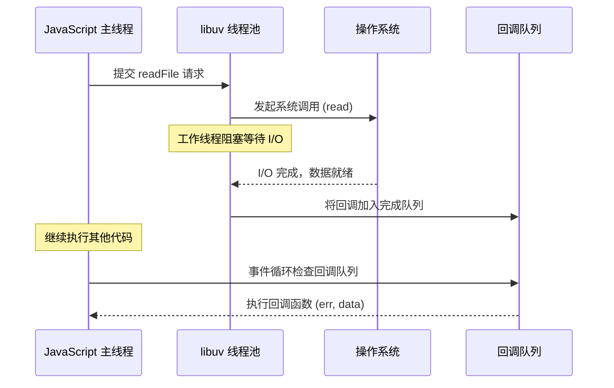

### 5.1.4 回调地狱（Callback Hell）

当多个异步操作需要顺序执行时，嵌套回调会导致代码难以维护：

```javascript
// ❌ 回调地狱示例
fs.readFile('user.json', 'utf8', (err, userData) => {
  if (err) throw err;
  const user = JSON.parse(userData);
  
  fs.readFile('posts.json', 'utf8', (err, postData) => {
    if (err) throw err;
    const posts = JSON.parse(postData);
    
    fs.readFile('comments.json', 'utf8', (err, commentData) => {
      if (err) throw err;
      const comments = JSON.parse(commentData);
      
      // 最终处理逻辑
      render(user, posts, comments);
    });
  });
});
```

**问题根源：**
- 代码向右缩进，可读性差
- 错误处理重复且分散
- 流程控制复杂，难以追踪执行顺序

### 5.1.5 常见误区

| 误区 | 正确理解 |
|------|----------|
| 忽略错误参数检查 | 必须首先检查 `if (error)` |
| 在回调中抛出异常 | 应调用回调传递错误，而非 `throw` |
| 多次调用回调 | 回调只能被调用一次 |
| 同步代码中使用异步回调 | 同步操作应直接返回结果 |

### 5.1.6 最佳实践

**1. 使用辅助函数处理错误：**

```javascript
function handleFileRead(path, callback) {
  fs.readFile(path, 'utf8', (err, data) => {
    if (err) {
      if (err.code === 'ENOENT') {
        // 文件不存在的特殊处理
        return callback(null, null);
      }
      return callback(err);
    }
    callback(null, data);
  });
}
```

**2. 使用 async/await 替代嵌套回调（后续章节详解）：**

```javascript
// ✅ 使用 Promise 化后的 API
const fs = require('fs').promises;

async function loadData() {
  try {
    const userData = await fs.readFile('user.json', 'utf8');
    const postData = await fs.readFile('posts.json', 'utf8');
    const commentData = await fs.readFile('comments.json', 'utf8');
    
    return {
      user: JSON.parse(userData),
      posts: JSON.parse(postData),
      comments: JSON.parse(commentData)
    };
  } catch (error) {
    console.error('加载数据失败:', error);
    throw error;
  }
}
```

---

## 5.2 Promise 内部实现：状态机、微任务调度

### 5.2.1 概念定义

**Promise** 是表示异步操作最终完成或失败的对象。它是一个**状态机**，内部维护一个状态（pending/fulfilled/rejected）和对应的值。

**为什么需要 Promise？**
- 解决回调地狱问题，支持链式调用
- 统一异步错误处理机制
- 提供组合多个异步操作的能力（Promise.all、Promise.race）
- 作为 async/await 的基础

### 5.2.2 Promise 状态机原理

**Promise/A+ 规范**定义了 Promise 的三种状态及转换规则：

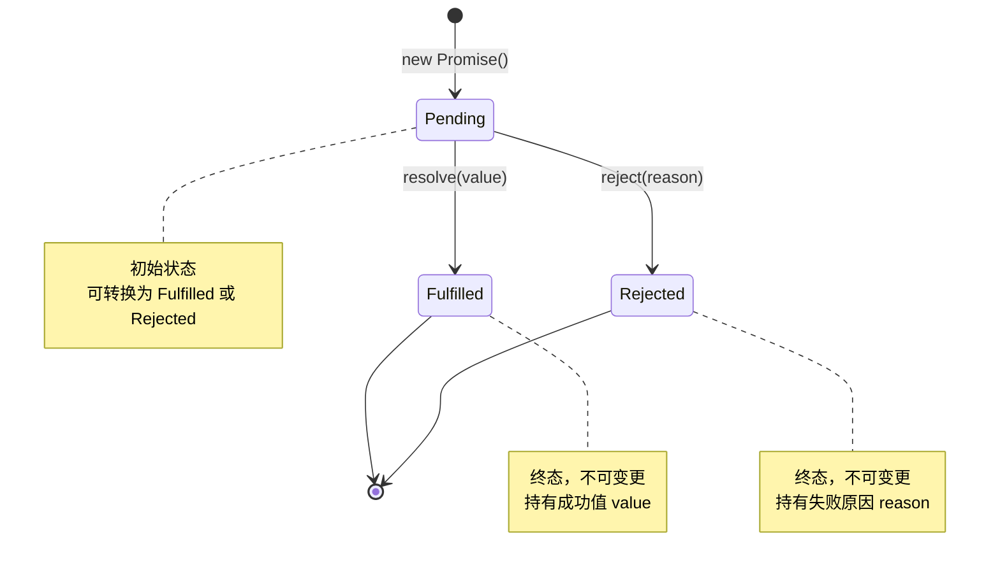

**状态转换规则（Promise/A+ 规范 2.1）：**

1. **Pending（等待态）**
   - 初始状态，既可转换为 fulfilled，也可转换为 rejected
   - 可能转换到任一终态

2. **Fulfilled（成功态）**
   - 必须不能转换到其他状态
   - 必须拥有一个不可变的 value

3. **Rejected（失败态）**
   - 必须不能转换到其他状态
   - 必须拥有一个不可变的 reason

### 5.2.3 Promise 内部实现源码解析

以下是符合 Promise/A+ 规范的简化实现：

```javascript
// Promise 的三种状态
const PENDING = 'pending';
const FULFILLED = 'fulfilled';
const REJECTED = 'rejected';

class MyPromise {
  constructor(executor) {
    this.status = PENDING;      // 当前状态
    this.value = undefined;     // fulfilled 时的值
    this.reason = undefined;    // rejected 时的原因
    
    // 回调队列（支持多次 then 调用）
    this.onFulfilledCallbacks = [];
    this.onRejectedCallbacks = [];
    
    // 绑定 this，确保回调中 this 指向正确
    this._resolve = this._resolve.bind(this);
    this._reject = this._reject.bind(this);
    
    // 立即执行 executor
    try {
      executor(this._resolve, this._reject);
    } catch (error) {
      this._reject(error);
    }
  }
  
  _resolve(value) {
    // 状态只能从 pending 转换一次
    if (this.status !== PENDING) return;
    
    // 处理 thenable 对象（解决 Promise 嵌套）
    if (value instanceof MyPromise) {
      value.then(this._resolve, this._reject);
      return;
    }
    
    this.status = FULFILLED;
    this.value = value;
    
    // 微任务调度：异步执行回调
    queueMicrotask(() => {
      this.onFulfilledCallbacks.forEach(cb => cb(value));
    });
  }
  
  _reject(reason) {
    if (this.status !== PENDING) return;
    
    this.status = REJECTED;
    this.reason = reason;
    
    queueMicrotask(() => {
      this.onRejectedCallbacks.forEach(cb => cb(reason));
    });
  }
  
  then(onFulfilled, onRejected) {
    // 默认值处理（规范 2.2.7.3）
    onFulfilled = typeof onFulfilled === 'function' 
      ? onFulfilled 
      : value => value;
    
    onRejected = typeof onRejected === 'function' 
      ? onRejected 
      : reason => { throw reason; };
    
    // 返回新 Promise 实现链式调用
    return new MyPromise((resolve, reject) => {
      const handleFulfilled = () => {
        try {
          const x = onFulfilled(this.value);
          this._resolvePromise(x, resolve, reject);
        } catch (error) {
          reject(error);
        }
      };
      
      const handleRejected = () => {
        try {
          const x = onRejected(this.reason);
          this._resolvePromise(x, resolve, reject);
        } catch (error) {
          reject(error);
        }
      };
      
      // 根据状态决定立即执行还是加入队列
      switch (this.status) {
        case FULFILLED:
          queueMicrotask(handleFulfilled);
          break;
        case REJECTED:
          queueMicrotask(handleRejected);
          break;
        case PENDING:
          this.onFulfilledCallbacks.push(handleFulfilled);
          this.onRejectedCallbacks.push(handleRejected);
          break;
      }
    });
  }
  
  _resolvePromise(x, resolve, reject) {
    // 循环引用检测（规范 2.3.1）
    if (x === this) {
      return reject(new TypeError('Chaining cycle detected'));
    }
    
    // 处理 thenable 对象
    if (x !== null && (typeof x === 'object' || typeof x === 'function')) {
      try {
        const then = x.then;
        if (typeof then === 'function') {
          // 调用 then 方法（规范 2.3.3.3）
          then.call(x, resolve, reject);
        } else {
          resolve(x);
        }
      } catch (error) {
        reject(error);
      }
    } else {
      resolve(x);
    }
  }
}
```

### 5.2.4 微任务调度机制

**为什么 Promise 回调要异步执行？**

根据 Promise/A+ 规范 2.2.4，`onFulfilled` 必须在**执行上下文栈仅包含平台代码**后才能执行。这保证了：
1. **调用栈清空**：then 回调在新的执行上下文中运行
2. **执行顺序可预测**：所有 Promise 回调在当前事件循环后执行
3. **避免同步副作用**：防止状态变更时立即执行回调导致的意外行为

**微任务（Microtask）与宏任务（Macrotask）对比：**

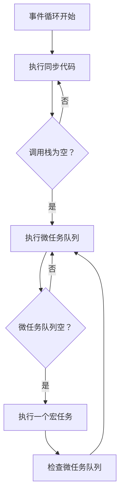

**执行优先级：**
```
同步代码 > process.nextTick > Promise 微任务 > 宏任务 (setTimeout/setInterval)
```

```javascript
// 验证执行顺序
console.log('同步 1');

Promise.resolve().then(() => {
  console.log('Promise 1');
});

setTimeout(() => {
  console.log('setTimeout 1');
}, 0);

process.nextTick(() => {
  console.log('nextTick 1');
});

console.log('同步 2');

// 输出顺序：
// 同步 1 → 同步 2 → nextTick 1 → Promise 1 → setTimeout 1
```

### 5.2.5 常见误区

| 误区 | 正确理解 |
|------|----------|
| Promise 状态可以多次变更 | 状态只能变更一次，之后不可变 |
| then 回调同步执行 | then 回调始终异步执行（微任务） |
| catch 能捕获所有错误 | 只能捕获 Promise 链中的错误，无法捕获外部异常 |
| Promise.all 遇到错误会等待所有完成 | 遇到第一个 reject 立即返回，其他操作继续执行但结果被丢弃 |

### 5.2.6 最佳实践

**1. 始终处理 Promise 的 reject：**

```javascript
// ❌ 未处理的 Promise reject
fetch('/api/data')
  .then(response => response.json());

// ✅ 添加错误处理
fetch('/api/data')
  .then(response => response.json())
  .catch(error => console.error('请求失败:', error));
```

**2. 使用 Promise.allSettled 处理多个独立异步操作：**

```javascript
// Promise.all 一个失败全部失败
const results = await Promise.all([
  fetch('/api/users'),
  fetch('/api/posts'),
  fetch('/api/comments')
]);

// Promise.allSettled 等待所有完成，分别处理结果
const results = await Promise.allSettled([
  fetch('/api/users'),
  fetch('/api/posts'),
  fetch('/api/comments')
]);

results.forEach((result, index) => {
  if (result.status === 'fulfilled') {
    console.log(`请求 ${index} 成功:`, result.value);
  } else {
    console.error(`请求 ${index} 失败:`, result.reason);
  }
});
```

---

## 5.3 async/await 的 Generator 实现原理

### 5.3.1 概念定义

**async/await** 是 ES2017 引入的异步编程语法，基于 Promise 和 Generator，让异步代码看起来像同步代码。

**为什么需要 async/await？**
- 消除回调嵌套和链式调用，代码更简洁
- 支持传统的 try-catch 错误处理
- 支持调试器断点调试
- 更符合人类线性思维模式

### 5.3.2 Generator 函数基础

**Generator 函数**是可以暂停和恢复执行的特殊函数，通过 `yield` 表达式暂停执行，通过 `next()` 方法恢复执行。

```javascript
function* generatorFunc() {
  console.log('开始执行');
  const a = yield 1;
  console.log('收到值:', a);
  const b = yield 2;
  console.log('收到值:', b);
  return a + b;
}

const gen = generatorFunc();
console.log(gen.next());      // { value: 1, done: false }
console.log(gen.next(10));    // { value: 2, done: false }
console.log(gen.next(20));    // { value: 30, done: true }
```

**Generator 内部机制：**

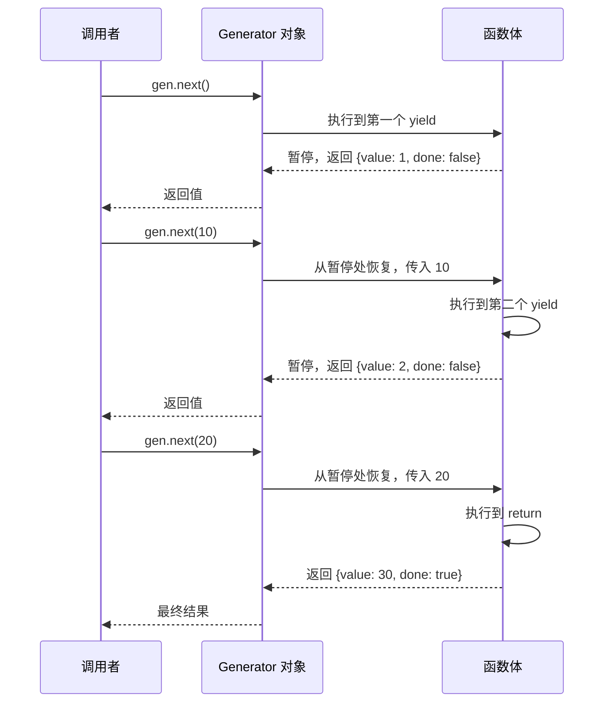

### 5.3.3 async/await 的 Generator 实现

async/await 本质上是 Generator 函数的语法糖，通过自动执行器实现。

**手动实现 Generator 自动执行器（co 模块原理）：**

```javascript
function co(genFunc) {
  const gen = genFunc();
  
  return new Promise((resolve, reject) => {
    function next(result) {
      const ret = gen.next(result);
      
      if (ret.done) {
        return resolve(ret.value);
      }
      
      // ret.value 可能是 Promise 或其他 thenable 对象
      Promise.resolve(ret.value)
        .then(next)
        .catch(reject);
    }
    
    next();
  });
}

// 使用示例
co(function* () {
  const data1 = yield fetch('/api/data1');
  const data2 = yield fetch('/api/data2');
  return { data1, data2 };
}).then(result => {
  console.log(result);
});
```

**async/await 等价转换：**

```javascript
// async/await 语法
async function fetchData() {
  try {
    const response = await fetch('/api/data');
    const data = await response.json();
    return data;
  } catch (error) {
    console.error('获取数据失败:', error);
    throw error;
  }
}

// 等价的 Generator + co 实现
function fetchData() {
  return co(function* () {
    try {
      const response = yield fetch('/api/data');
      const data = yield response.json();
      return data;
    } catch (error) {
      console.error('获取数据失败:', error);
      throw error;
    }
  });
}
```

### 5.3.4 async 函数返回值的内部处理

async 函数始终返回 Promise，即使返回的是非 Promise 值：

```javascript
async function foo() {
  return 42;  // 实际返回 Promise.resolve(42)
}

foo().then(value => console.log(value)); // 42
```

**编译器转换逻辑（简化）：**

```javascript
// 原始 async 函数
async function add(a, b) {
  return a + b;
}

// 编译器转换后
function add(a, b) {
  return Promise.resolve(a + b);
}
```

**遇到 await 时的转换：**

```javascript
// 原始 async 函数
async function fetchUsers() {
  const response = await fetch('/api/users');
  const users = await response.json();
  return users;
}

// 编译器转换后（简化版）
function fetchUsers() {
  return co(function* () {
    const response = yield fetch('/api/users');
    const users = yield response.json();
    return users;
  });
}
```

### 5.3.5 await 的暂停机制

await 会暂停 async 函数的执行，等待 Promise 结算：

```javascript
async function demo() {
  console.log('1. 开始');
  
  const result = await new Promise(resolve => {
    setTimeout(() => {
      console.log('3. Promise 完成');
      resolve('结果');
    }, 1000);
  });
  
  console.log('4. 收到结果:', result);
  return result;
}

console.log('0. 调用 demo');
demo().then(() => {
  console.log('5. demo 完成');
});
console.log('2. 继续执行主线程');

// 输出顺序：
// 0. 调用 demo
// 1. 开始
// 2. 继续执行主线程
// (1 秒后)
// 3. Promise 完成
// 4. 收到结果：结果
// 5. demo 完成
```

**内部状态机实现：**

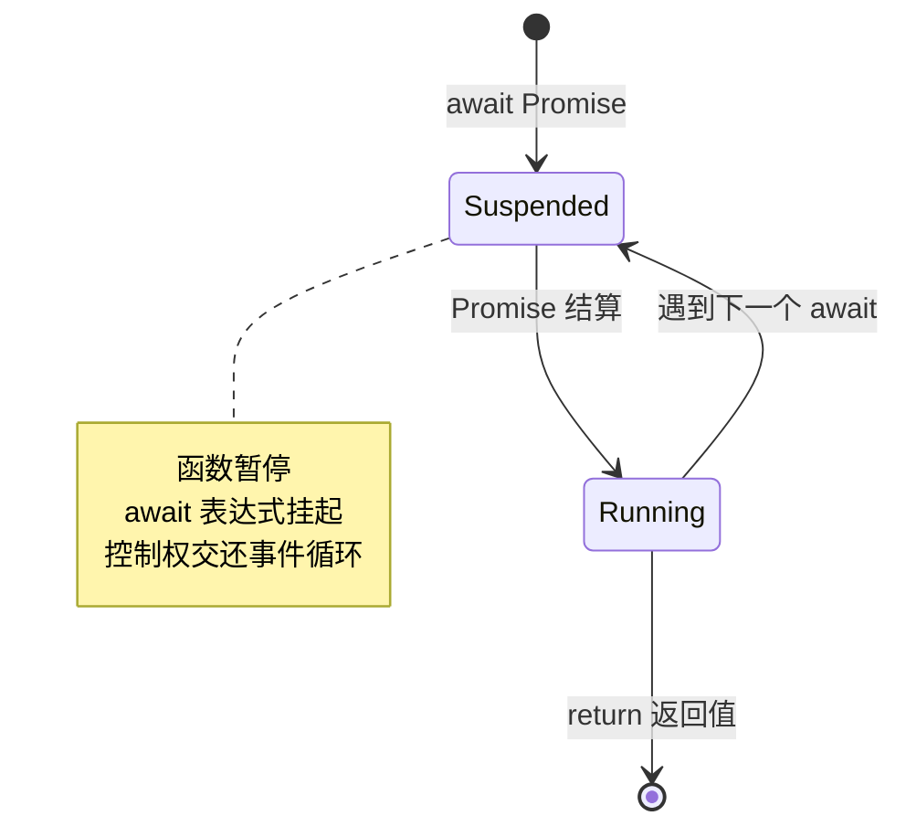

### 5.3.6 常见误区

| 误区 | 正确理解 |
|------|----------|
| await 会阻塞整个程序 | 只阻塞 async 函数内部，不阻塞主线程 |
| async/await 比 Promise 更快 | 实际上有额外开销，但代码更可读 |
| 可以并行使用 await | 顺序 await 是串行执行，应使用 Promise.all 并行 |
| try-catch 能捕获所有错误 | 未 await 的 Promise 错误需要用 .catch() 处理 |

### 5.3.7 最佳实践

**1. 避免顺序 await 导致的性能问题：**

```javascript
// ❌ 串行执行（耗时 3 秒）
async function fetchData() {
  const users = await fetch('/api/users');      // 1 秒
  const posts = await fetch('/api/posts');      // 1 秒
  const comments = await fetch('/api/comments'); // 1 秒
  return { users, posts, comments };
}

// ✅ 并行执行（耗时 1 秒）
async function fetchData() {
  const [users, posts, comments] = await Promise.all([
    fetch('/api/users'),
    fetch('/api/posts'),
    fetch('/api/comments')
  ]);
  return { users, posts, comments };
}
```

**2. 使用 IIFE 处理顶层 await（Node.js 14.8+ 支持顶层 await 前）：**

```javascript
// Node.js 14.8 之前，模块顶层不能使用 await
(async () => {
  const data = await fetchData();
  console.log(data);
})();
```

---

## 5.4 并发控制：Promise.all、Promise.race 源码分析

### 5.4.1 Promise.all 源码解析

**Promise.all** 接收一个 Promise 数组，等待所有 Promise 完成，返回结果数组。

**实现原理：**
- 内部计数器跟踪已完成的 Promise 数量
- 每个 Promise 完成后将结果存入对应位置
- 任一 Promise reject，立即 reject 整个 Promise.all

```javascript
function promiseAll(promises) {
  return new Promise((resolve, reject) => {
    if (!Array.isArray(promises)) {
      return reject(new TypeError('Argument is not an array'));
    }
    
    if (promises.length === 0) {
      return resolve([]);
    }
    
    const results = new Array(promises.length);
    let completedCount = 0;
    let rejected = false;
    
    promises.forEach((promise, index) => {
      Promise.resolve(promise)
        .then(value => {
          if (rejected) return;
          
          results[index] = value;
          completedCount++;
          
          if (completedCount === promises.length) {
            resolve(results);
          }
        })
        .catch(error => {
          if (rejected) return;
          
          rejected = true;
          reject(error);
        });
    });
  });
}
```

**执行流程图：**

```mermaid
flowchart TD
    Start[开始] --> CheckEmpty{promises 为空？}
    CheckEmpty -->|是 | ResolveEmpty[resolve([])]
    CheckEmpty -->|否 | Init[初始化 results 数组和计数器]
    Init --> Loop[遍历每个 Promise]
    Loop --> ResolvePromise{Promise 状态}
    ResolvePromise -->|fulfilled| StoreResult[存储结果到对应位置]
    ResolvePromise -->|rejected| ImmediateReject[reject 整个 Promise.all]
    StoreResult --> CheckComplete{全部完成？}
    CheckComplete -->|否 | Next[下一个 Promise]
    CheckComplete -->|是 | ResolveAll[resolve 结果数组]
    Next --> Loop
    ImmediateReject --> End[结束]
    ResolveAll --> End
    ResolveEmpty --> End
```

### 5.4.2 Promise.race 源码解析

**Promise.race** 接收一个 Promise 数组，返回第一个完成的 Promise 的结果。

```javascript
function promiseRace(promises) {
  return new Promise((resolve, reject) => {
    if (!Array.isArray(promises)) {
      return reject(new TypeError('Argument is not an array'));
    }
    
    for (const promise of promises) {
      Promise.resolve(promise)
        .then(resolve)  // 第一个 fulfilled 的 resolve
        .catch(reject); // 第一个 rejected 的 reject
    }
  });
}
```

### 5.4.3 Promise.allSettled 和 Promise.any

**Promise.allSettled**（ES2020）：等待所有 Promise 完成，返回所有结果（包含状态）。

```javascript
function promiseAllSettled(promises) {
  return promiseAll(promises.map(promise =>
    Promise.resolve(promise)
      .then(value => ({ status: 'fulfilled', value }))
      .catch(reason => ({ status: 'rejected', reason }))
  ));
}

// 使用示例
Promise.allSettled([
  Promise.resolve(1),
  Promise.reject('error'),
  Promise.resolve(3)
]).then(results => {
  console.log(results);
  // [
  //   { status: 'fulfilled', value: 1 },
  //   { status: 'rejected', reason: 'error' },
  //   { status: 'fulfilled', value: 3 }
  // ]
});
```

**Promise.any**（ES2021）：返回第一个成功的 Promise，全部失败则抛出 AggregateError。

```javascript
function promiseAny(promises) {
  return new Promise((resolve, reject) => {
    const errors = [];
    let completedCount = 0;
    
    promises.forEach((promise, index) => {
      Promise.resolve(promise)
        .then(resolve)  // 第一个成功的 resolve
        .catch(error => {
          errors[index] = error;
          completedCount++;
          
          if (completedCount === promises.length) {
            reject(new AggregateError(errors, 'All promises were rejected'));
          }
        });
    });
  });
}
```

### 5.4.4 并发控制实战应用

**1. 限制并发请求数量：**

```javascript
class PromisePool {
  constructor(concurrency) {
    this.concurrency = concurrency;  // 最大并发数
    this.running = 0;                // 当前运行数
    this.queue = [];                 // 等待队列
  }
  
  add(task) {
    return new Promise((resolve, reject) => {
      this.queue.push({ task, resolve, reject });
      this.run();
    });
  }
  
  run() {
    while (this.running < this.concurrency && this.queue.length > 0) {
      const { task, resolve, reject } = this.queue.shift();
      this.running++;
      
      Promise.resolve(task())
        .then(result => {
          this.running--;
          resolve(result);
          this.run();  // 检查是否有新任务可执行
        })
        .catch(error => {
          this.running--;
          reject(error);
          this.run();
        });
    }
  }
}

// 使用示例
const pool = new PromisePool(3);  // 限制最多 3 个并发

const tasks = Array.from({ length: 10 }, (_, i) => () =>
  fetch(`/api/data/${i}`).then(r => r.json())
);

Promise.all(tasks.map(task => pool.add(task)))
  .then(results => console.log('全部完成:', results));
```

**2. 超时控制：**

```javascript
function withTimeout(promise, timeoutMs) {
  const timeout = new Promise((_, reject) => {
    setTimeout(() => reject(new Error(`Timeout after ${timeoutMs}ms`)), timeoutMs);
  });
  
  return Promise.race([promise, timeout]);
}

// 使用示例
const data = await withTimeout(
  fetch('/api/slow-endpoint'),
  5000  // 5 秒超时
);
```

---

## 第 6 章 核心 API 与内置模块

> **本章导读**：Node.js 提供丰富的内置模块用于文件系统操作、路径处理、网络服务和流处理。本章将深入剖析这些核心 API 的内部实现机制，包括同步/异步实现原理、跨平台路径处理、TCP 连接管理、流式数据传输和多线程通信。

---

## 6.1 fs 文件系统：同步/异步实现、流式读取

### 6.1.1 概念定义

**fs 模块**是 Node.js 用于文件系统操作的核心模块，提供同步和异步两种 API 形式。

**为什么需要同步和异步两种形式？**
- **同步方法**：简单脚本、初始化阶段、CLI 工具等场景，代码更直观
- **异步方法**：服务器应用、高并发场景，避免阻塞事件循环

### 6.1.2 同步与异步实现对比

```javascript
const fs = require('fs');

// 同步读取（阻塞）
const syncData = fs.readFileSync('file.txt', 'utf8');
console.log('同步读取完成:', syncData);

// 异步读取（非阻塞）
fs.readFile('file.txt', 'utf8', (err, data) => {
  if (err) throw err;
  console.log('异步读取完成:', data);
});
```

**底层实现差异：**

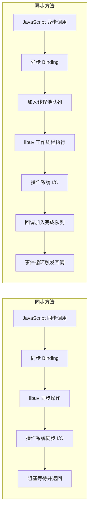

### 6.1.3 libuv 线程池实现

Node.js 的异步文件操作通过 libuv 线程池实现，默认线程池大小为 4（可通过 `UV_THREADPOOL_SIZE` 环境变量调整）。

**线程池工作流程：**

```cpp
// libuv 中的工作请求结构（简化）
struct uv_fs_t {
  uv_req_t req;           // 请求头
  uv_fs_type fs_type;     // 操作类型 (READ, WRITE, etc.)
  uv_loop_t* loop;        // 事件循环
  const char* path;       // 文件路径
  uv_file file;           // 文件描述符
  void* data;             // 数据缓冲区
  uv_fs_cb cb;            // 完成回调
};

// 异步读取实现（伪代码）
void uv_fs_read(uv_loop_t* loop, uv_fs_t* req, ...) {
  // 创建工作请求
  req->fs_type = UV_FS_READ;
  
  // 提交到线程池
  uv__work_submit(loop, &req->work_req, uv__fs_work, uv__fs_done);
}

// 工作线程中执行的实际 I/O
void uv__fs_work(struct uv__work* w) {
  uv_fs_t* req = container_of(w, uv_fs_t, work_req);
  // 执行实际的 read 系统调用（阻塞）
  req->result = read(req->file, req->data, ...);
}

// I/O 完成后在主线程调用回调
void uv__fs_done(struct uv__work* w, int status) {
  uv_fs_t* req = container_of(w, uv_fs_t, work_req);
  req->cb(req);  // 调用 JavaScript 回调
}
```

### 6.1.4 流式读取机制

对于大文件，流式读取可以显著降低内存占用。

```javascript
const fs = require('fs');

// 创建可读流，每次读取 64KB
const readableStream = fs.createReadStream('large-file.txt', {
  highWaterMark: 64 * 1024,  // 缓冲区大小
  encoding: 'utf8',
  start: 0,                   // 起始位置
  end: Infinity               // 结束位置
});

let data = '';

readableStream.on('data', (chunk) => {
  data += chunk;  // 逐块处理
  console.log('收到数据块:', chunk.length, '字节');
});

readableStream.on('end', () => {
  console.log('读取完成，总大小:', data.length, '字节');
});

readableStream.on('error', (err) => {
  console.error('读取错误:', err);
});
```

**流式读取内部机制：**

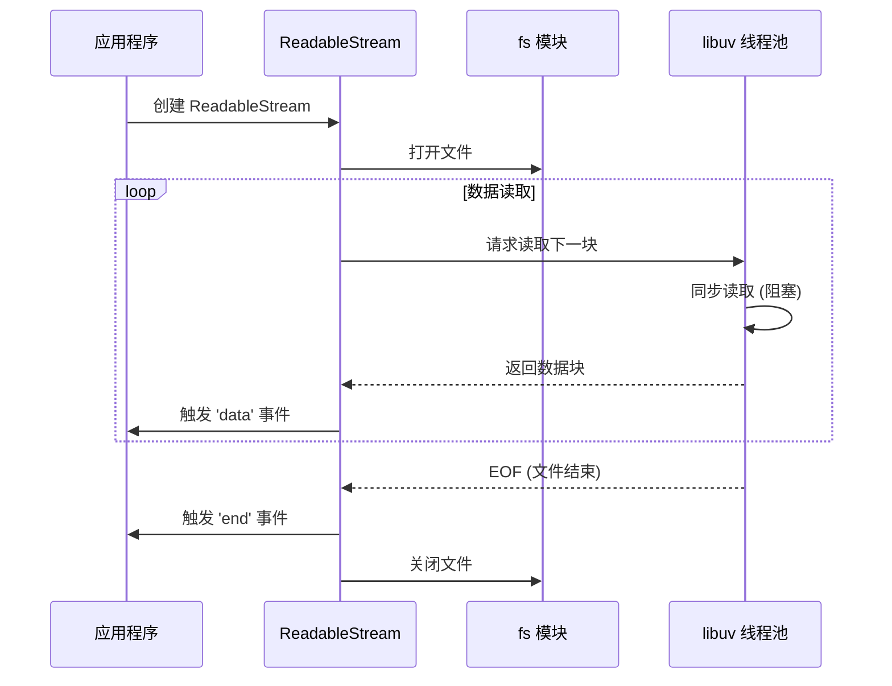

### 6.1.5 常见误区

| 误区 | 正确理解 |
|------|----------|
| 同步方法性能更好 | 同步方法阻塞事件循环，高并发场景应避免 |
| 流式读取只适用于大文件 | 任何需要逐步处理数据的场景都适用 |
| 文件操作不需要错误处理 | 文件可能不存在、权限不足等，必须处理错误 |
| createReadStream 立即读取文件 | 实际在第一次调用 read() 或监听 data 事件时才开始 |

### 6.1.6 最佳实践

**1. 使用 stream.pipeline 简化流式处理：**

```javascript
const fs = require('fs');
const { pipeline } = require('stream');
const { promisify } = require('util');

const pipelineAsync = promisify(pipeline);

// 复制文件（自动处理错误和关闭）
async function copyFile(src, dest) {
  await pipelineAsync(
    fs.createReadStream(src),
    fs.createWriteStream(dest)
  );
  console.log('文件复制完成');
}
```

**2. 使用 async iterator 消费流：**

```javascript
const fs = require('fs');
const { createInterface } = require('readline');

async function processLines(filePath) {
  const stream = fs.createReadStream(filePath, { encoding: 'utf8' });
  const rl = createInterface({
    input: stream,
    crlfDelay: Infinity
  });
  
  for await (const line of rl) {
    console.log('行:', line);
  }
}
```

---

## 6.2 path 路径处理：跨平台路径解析

### 6.2.1 概念定义

**path 模块**提供文件系统路径的实用工具，自动处理 Windows 和 POSIX（Linux/macOS）系统的路径差异。

**为什么需要 path 模块？**
- **路径分隔符差异**：Windows 使用 `\`，POSIX 使用 `/`
- **路径解析规则差异**：Windows 有盘符（C:\），POSIX 从根目录（/）开始
- **跨平台兼容性**：确保代码在不同操作系统上一致运行

### 6.2.2 核心方法详解

```javascript
const path = require('path');

// 1. path.join - 连接路径片段
const joined = path.join('/user', 'docs', 'file.txt');
console.log(joined);
// POSIX: /user/docs/file.txt
// Windows: \user\docs\file.txt

// 2. path.resolve - 解析为绝对路径
const resolved = path.resolve('src', 'app.js');
console.log(resolved);
// 假设当前目录：/home/user/project
// 输出：/home/user/project/src/app.js

// 3. path.normalize - 规范化路径
const normalized = path.normalize('/user//docs/../file.txt');
console.log(normalized);
// POSIX: /user/file.txt
// Windows: \user\file.txt

// 4. path.parse - 解析路径为对象
const parsed = path.parse('/user/docs/file.txt');
console.log(parsed);
// {
//   root: '/',
//   dir: '/user/docs',
//   base: 'file.txt',
//   ext: '.txt',
//   name: 'file'
// }

// 5. path.format - 从对象构建路径
const formatted = path.format({
  dir: '/user/docs',
  base: 'file.txt'
});
console.log(formatted);  // /user/docs/file.txt
```

### 6.2.3 跨平台路径处理

```javascript
// 路径分隔符
console.log(path.sep);
// POSIX: '/'
// Windows: '\\'

console.log(path.delimiter);
// POSIX: ':'
// Windows: ';'

// 强制使用特定平台的路径处理
console.log(path.win32.join('C:', 'temp', 'file.txt'));
// 始终输出：C:\temp\file.txt

console.log(path.posix.join('/user', 'docs', 'file.txt'));
// 始终输出：/user/docs/file.txt
```

### 6.2.4 底层实现原理

path 模块根据运行时平台自动选择实现：

```javascript
// path 模块内部实现（简化）
const isWindows = process.platform === 'win32';

module.exports = isWindows
  ? require('./path/win32')   // Windows 实现
  : require('./path/posix');  // POSIX 实现

// path/posix.js 中的实现示例
exports.join = function(...paths) {
  if (paths.length === 0) return '.';
  
  let joined;
  for (let i = 0; i < paths.length; i++) {
    const arg = paths[i];
    if (arg.length > 0) {
      if (joined === undefined) {
        joined = arg;
      } else {
        joined += '/' + arg;
      }
    }
  }
  
  if (joined === undefined) return '.';
  return normalizeString(joined, !isPathSeparator(paths[0]));
};
```

### 6.2.5 常见误区

| 误区 | 正确理解 |
|------|----------|
| 直接使用字符串拼接路径 | 应使用 path.join 确保跨平台兼容 |
| path.join 会验证文件存在 | path 模块只处理字符串，不访问文件系统 |
| path.resolve 总是返回正确路径 | 只进行字符串解析，不验证路径是否有效 |
| 所有系统都区分大小写 | Windows/macOS 不区分，Linux 区分 |

### 6.2.6 最佳实践

**1. 始终使用 path 模块处理路径：**

```javascript
// ❌ 不好的做法（Windows 不兼容）
const filePath = './data/' + filename;

// ✅ 正确的做法
const filePath = path.join('data', filename);
```

**2. 使用 path.resolve 获取绝对路径：**

```javascript
// 获取项目根目录
const projectRoot = path.resolve(__dirname, '..');

// 读取配置文件
const configPath = path.resolve(projectRoot, 'config', 'app.json');
```

---

## 6.3 http/https 网络服务：TCP 连接、HTTP 解析器

### 6.3.1 概念定义

**http 模块**提供创建 HTTP 服务器和客户端的能力，基于 TCP 协议实现 HTTP/1.1 协议。

**HTTP 与 TCP 的关系：**

```mermaid
graph TD
    A[HTTP 应用层] --> B[TCP 传输层]
    B --> C[IP 网络层]
    C --> D[数据链路层]
    
    note right of A
        请求/响应模型
        无状态协议
        文本/二进制格式
    end note
    
    note right of B
        面向连接
        可靠传输
        流量控制
    end note
```

### 6.3.2 HTTP 服务器创建与请求处理

```javascript
const http = require('http');

const server = http.createServer((req, res) => {
  // req: http.IncomingMessage (可读流)
  // res: http.ServerResponse (可写流)
  
  res.writeHead(200, {
    'Content-Type': 'application/json'
  });
  
  res.end(JSON.stringify({ message: 'Hello World' }));
});

server.listen(3000, () => {
  console.log('服务器运行在 http://localhost:3000/');
});
```

### 6.3.3 TCP 连接管理

**HTTP 服务器继承自 net.Server**，底层使用 TCP 连接：

```javascript
// http.createServer 内部实现（简化）
const http = require('http');
const net = require('net');

// http.Server 继承自 net.Server
class Server extends net.Server {
  constructor(options, requestListener) {
    super();
    
    // 监听 connection 事件（TCP 连接建立）
    this.on('connection', (socket) => {
      this.onConnection(socket);
    });
    
    // 监听 request 事件（HTTP 请求解析完成）
    this.on('request', requestListener);
  }
  
  onConnection(socket) {
    // 创建 HTTP 解析器
    const parser = new HTTPParser(HTTPParser.REQUEST);
    
    // 解析 HTTP 请求
    socket.on('data', (data) => {
      parser.execute(data);
    });
  }
}
```

**TCP 三次握手与 HTTP 请求流程：**

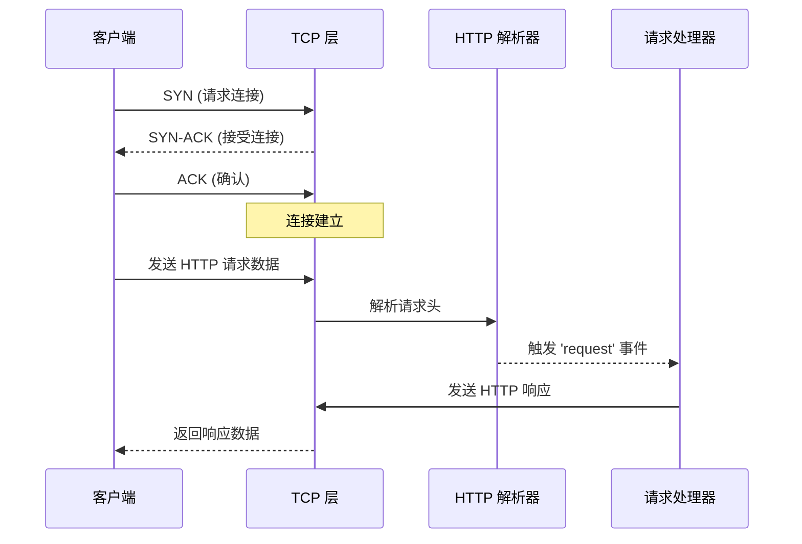

### 6.3.4 HTTP 解析器内部机制

Node.js 使用 C++ 实现的 HTTP 解析器（llhttp），性能远优于 JavaScript 实现：

```cpp
// llhttp 解析器状态机（简化）
typedef enum llhttp_state {
  S_START,           // 起始状态
  S_METHOD,          // 解析方法 (GET, POST...)
  S_URL,             // 解析 URL
  S_HEADERS,         // 解析请求头
  S_BODY,            // 解析请求体
  S_MESSAGE_DONE,    // 消息完成
  S_ERROR            // 错误状态
} llhttp_state_t;

// 解析回调
llhttp_settings_t settings = {
  .on_message_begin = on_message_begin,
  .on_url = on_url,
  .on_header_field = on_header_field,
  .on_header_value = on_header_value,
  .on_message_complete = on_message_complete
};

// 执行解析
llhttp_execute(&parser, data, len);
```

### 6.3.5 常见误区

| 误区 | 正确理解 |
|------|----------|
| http 模块支持 HTTPS | HTTPS 需要使用 https 模块 |
| 请求体自动解析 | 需要手动监听 data 事件或使用中间件 |
| 服务器自动处理并发 | Node.js 单线程，CPU 密集型任务会阻塞 |
| 连接默认保持打开 | 需要设置 Keep-Alive 头或使用 agent |

### 6.3.6 最佳实践

**1. 使用流式处理大请求体：**

```javascript
const fs = require('fs');
const http = require('http');

http.createServer((req, res) => {
  if (req.url === '/upload' && req.method === 'POST') {
    // 直接流式写入文件
    const fileStream = fs.createWriteStream('upload.bin');
    req.pipe(fileStream);
    
    fileStream.on('finish', () => {
      res.writeHead(200);
      res.end('上传成功');
    });
  }
});
```

**2. 设置合理的超时和 Keep-Alive：**

```javascript
const server = http.createServer((req, res) => {
  // 设置超时
  req.setTimeout(30000, () => {
    res.writeHead(408);
    res.end('Request Timeout');
  });
  
  // 启用 Keep-Alive
  res.setHeader('Connection', 'keep-alive');
  res.setHeader('Keep-Alive', 'timeout=5, max=1000');
  
  res.end('Hello');
});

// 设置服务器超时
server.timeout = 60000;
server.keepAliveTimeout = 65000;
```

---

## 6.4 stream 流处理：Readable/Writable/Duplex/Transform 内部机制

### 6.4.1 概念定义

**Stream（流）** 是 Node.js 中处理流式数据的抽象接口，将数据分解为可管理的块，实现高效的 I/O 操作。

**四种流类型：**

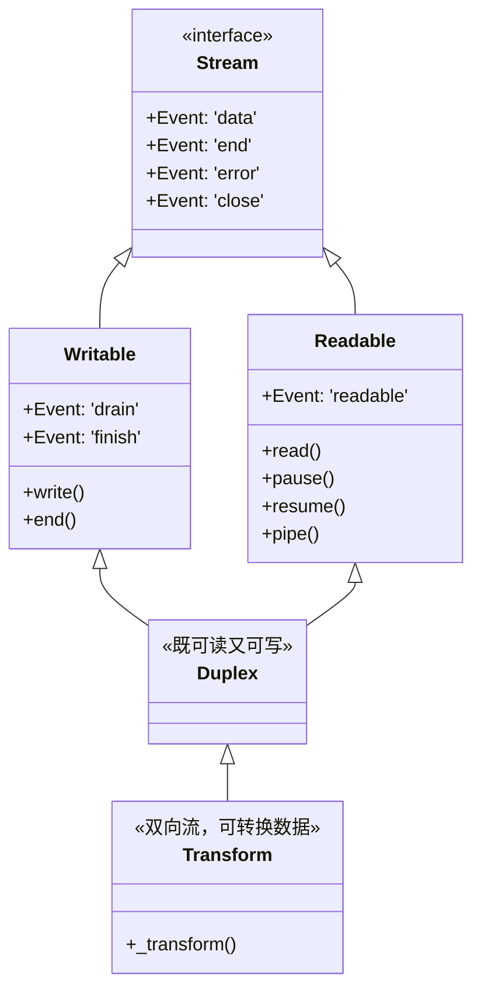

### 6.4.2 Readable 流内部机制

**两种读取模式：**

1. **流动模式（Flowing Mode）**：数据自动推送给消费者
2. **暂停模式（Paused Mode）**：需要显式调用 `read()` 拉取数据

```javascript
const fs = require('fs');

// 流动模式
const stream1 = fs.createReadStream('file.txt');
stream1.on('data', (chunk) => {
  console.log('收到数据:', chunk);
});

// 暂停模式
const stream2 = fs.createReadStream('file.txt');
stream2.pause();  // 暂停流动

// 手动拉取数据
const chunk = stream2.read();
stream2.resume();  // 恢复流动
```

**Readable 流内部状态机：**

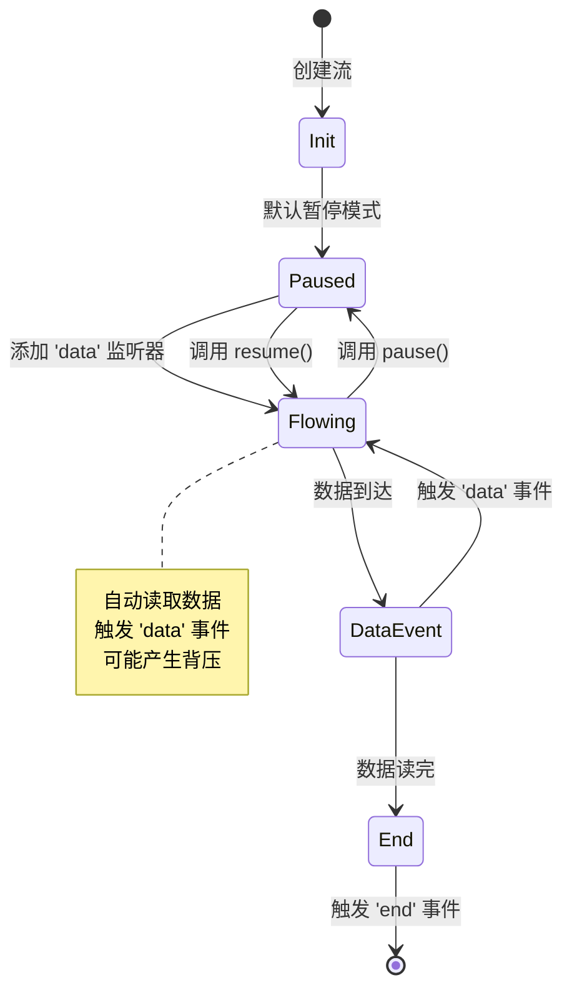

**Readable 内部实现（简化）：**

```javascript
const { Readable } = require('stream');

class CustomReadable extends Readable {
  constructor(options) {
    super(options);
    this._currentIndex = 0;
    this._maxIndex = 10;
  }
  
  // 核心方法：被调用时提供数据
  _read(size) {
    // 推入数据到内部缓冲区
    while (this._currentIndex < this._maxIndex) {
      const chunk = `数据块 ${this._currentIndex}`;
      
      // push 返回 false 表示内部缓冲区已满（超过 highWaterMark）
      if (!this.push(chunk)) {
        // 停止推送，等待消费者消费
        return;
      }
      this._currentIndex++;
    }
    
    // 数据读完，推入 null 表示结束
    this.push(null);
  }
}
```

### 6.4.3 Writable 流内部机制

**Writable 流处理写入和背压：**

```javascript
const fs = require('fs');

const writable = fs.createWriteStream('output.txt');

// 写入数据
for (let i = 0; i < 100; i++) {
  const shouldContinue = writable.write(`第 ${i} 块数据\n`);
  
  // 处理背压：如果返回 false，停止写入，等待 drain 事件
  if (!shouldContinue) {
    writable.once('drain', () => {
      console.log('缓冲区已清空，可以继续写入');
    });
  }
}

writable.end('最后一块数据');
```

**背压（Backpressure）机制：**

```mermaid
sequenceDiagram
    participant Producer as 数据生产者
    participant Writable as Writable 流
    participant Buffer as 内部缓冲区
    participant Consumer as 底层 I/O
    
    loop 写入循环
        Producer->>Writable: write(chunk)
        Writable->>Buffer: 推入缓冲区
        Buffer-->>Writable: 检查是否超过 highWaterMark
        
        alt 缓冲区未满
            Writable-->>Producer: true (可以继续)
        else 缓冲区已满
            Writable-->>Producer: false (停止写入)
            Note over Writable: 背压产生
        end
        
        Buffer->>Consumer: 异步写入数据
        Consumer-->>Buffer: 写入完成
        Buffer-->>Writable: 触发 'drain' 事件
    end
```

**Writable 内部实现（简化）：**

```javascript
const { Writable } = require('stream');

class CustomWritable extends Writable {
  constructor(options) {
    super(options);
    this.buffer = [];
    this.isWriting = false;
  }
  
  // 核心方法：处理写入的数据
  _write(chunk, encoding, callback) {
    // 模拟异步写入
    setTimeout(() => {
      console.log('写入数据:', chunk.toString());
      // 写入完成，调用 callback
      callback();
    }, 100);
  }
  
  // 处理多个 chunks 批量写入（可选）
  _writev(chunks, callback) {
    console.log('批量写入:', chunks.length, '个块');
    // 批量处理
    callback();
  }
}
```

### 6.4.4 Duplex 和 Transform 流

**Duplex 流：双向通信**

```javascript
const { Duplex } = require('stream');

class EchoStream extends Duplex {
  _read(size) {
    // 从某处读取数据（如网络 socket）
    this.push('收到的数据');
  }
  
  _write(chunk, encoding, callback) {
    // 写入数据到某处
    console.log('写入:', chunk.toString());
    callback();
  }
}
```

**Transform 流：数据转换**

```javascript
const { Transform } = require('stream');

// 简单的转换流示例
const upperCaseTransform = new Transform({
  transform(chunk, encoding, callback) {
    // 转换为大写
    this.push(chunk.toString().toUpperCase());
    callback();
  }
});

// 使用 Transform 流
process.stdin
  .pipe(upperCaseTransform)
  .pipe(process.stdout);
```

**Transform 流的加密应用：**

```javascript
const { Transform } = require('stream');
const crypto = require('crypto');

class EncryptTransform extends Transform {
  constructor(password) {
    super();
    this.cipher = crypto.createCipher('aes-128-cbc', password);
  }
  
  _transform(chunk, encoding, callback) {
    const encrypted = this.cipher.update(chunk);
    this.push(encrypted);
    callback();
  }
  
  _flush(callback) {
    const final = this.cipher.final();
    this.push(final);
    callback();
  }
}
```

### 6.4.5 内部缓冲与 highWaterMark

**highWaterMark 是流内部缓冲区的阈值**，超过此值会触发背压。

```javascript
const { Readable, Writable } = require('stream');

// 创建自定义 highWaterMark 的流
const readable = new Readable({
  highWaterMark: 1024,  // 1KB
  read(size) {
    this.push('数据');
  }
});

const writable = new Writable({
  highWaterMark: 1024,  // 1KB
  write(chunk, encoding, callback) {
    callback();
  }
});

console.log(readable.readableHighWaterMark);  // 1024
console.log(writable.writableHighWaterMark);  // 1024
```

**缓冲区长度计算：**

```javascript
const writable = fs.createWriteStream('output.txt');

console.log('初始长度:', writable.writableLength);  // 0

writable.write('chunk1');
console.log('写入后长度:', writable.writableLength);  // 6

writable.write('chunk2');
console.log('继续写入长度:', writable.writableLength);

writable.on('drain', () => {
  console.log('drain 后长度:', writable.writableLength);  // 0
});
```

### 6.4.6 常见误区

| 误区 | 正确理解 |
|------|----------|
| stream 自动处理所有情况 | 需要手动处理背压和错误 |
| highWaterMark 是硬性限制 | 只是警示阈值，超过仍可继续写入 |
| pipe() 自动处理错误 | 需要使用 pipeline() 或手动处理 |
| Transform 只能转换文本 | 可以处理任意二进制数据 |

### 6.4.7 最佳实践

**1. 使用 stream.pipeline 自动处理错误：**

```javascript
const { pipeline } = require('stream');
const fs = require('fs');
const zlib = require('zlib');

pipeline(
  fs.createReadStream('input.txt'),
  zlib.createGzip(),
  fs.createWriteStream('output.txt.gz'),
  (err) => {
    if (err) {
      console.error('管道错误:', err);
    } else {
      console.log('管道完成');
    }
  }
);
```

**2. 使用 async iterator 消费流：**

```javascript
const fs = require('fs');

async function processStream() {
  const stream = fs.createReadStream('file.txt', { encoding: 'utf8' });
  
  for await (const chunk of stream) {
    console.log('处理数据块:', chunk);
  }
  
  console.log('流处理完成');
}
```

---

## 6.5 worker_threads 多线程：SharedArrayBuffer、MessageChannel

### 6.5.1 概念定义

**worker_threads 模块**允许在 Node.js 应用中创建多线程，用于处理 CPU 密集型任务。

**为什么需要 worker_threads？**
- Node.js 单线程模型不适合 CPU 密集型任务
- 主线程被阻塞会导致事件循环停滞
- 多线程可以充分利用多核 CPU

**与 child_process 的区别：**

```mermaid
graph TB
    subgraph worker_threads
        Main[主线程] <-->|共享内存 | Worker1[工作线程 1]
        Main <-->|共享内存 | Worker2[工作线程 2]
        note right of worker_threads: 共享内存，低开销
    end
    
    subgraph child_process
        Main2[主进程] <-->|IPC 通信 | Child1[子进程 1]
        Main2 <-->|IPC 通信 | Child2[子进程 2]
        note right of child_process: 独立内存，高开销
    end
```

### 6.5.2 基本使用

```javascript
const { Worker, isMainThread, parentPort, workerData } = require('worker_threads');

if (isMainThread) {
  // 主线程代码
  const worker = new Worker(__filename, {
    workerData: { input: 'Hello from main thread' }
  });
  
  worker.on('message', (msg) => {
    console.log('收到 worker 消息:', msg);
  });
  
  worker.on('error', (err) => {
    console.error('Worker 错误:', err);
  });
  
  worker.postMessage('Message to worker');
} else {
  // 工作线程代码
  parentPort.on('message', (msg) => {
    console.log('收到主线程消息:', msg);
    console.log('workerData:', workerData);
    
    // 返回结果
    parentPort.postMessage('Hello from worker');
  });
}
```

### 6.5.3 线程间通信机制

**MessageChannel 通信原理：**

```mermaid
sequenceDiagram
    participant Main as 主线程
    participant Port1 as MessagePort1
    participant Port2 as MessagePort2
    participant Worker as 工作线程
    
    Main->>Port1: 创建 MessageChannel
    Port1-->>Port2: port2 传递给 Worker
    
    Main->>Port1: postMessage(data)
    Port1-->>Port2: 序列化数据
    Port2->>Worker: 触发 'message' 事件
    Worker->>Port2: postMessage(response)
    Port2-->>Port1: 序列化数据
    Port1->>Main: 触发 'message' 事件
```

**使用 MessageChannel 进行线程间通信：**

```javascript
const { Worker, MessageChannel } = require('worker_threads');

// 主线程
const channel = new MessageChannel();

const worker = new Worker('./worker.js');
worker.postMessage({ port: channel.port1 }, [channel.port1]);

channel.port2.on('message', (msg) => {
  console.log('收到消息:', msg);
});

// worker.js
const { parentPort } = require('worker_threads');

parentPort.on('message', (msg) => {
  const port = msg.port;
  
  port.on('message', (data) => {
    console.log('收到数据:', data);
    port.postMessage('已接收');
  });
});
```

### 6.5.4 共享内存：SharedArrayBuffer

**SharedArrayBuffer 允许多线程共享内存**，避免数据复制开销：

```javascript
const { Worker, isMainThread, parentPort } = require('worker_threads');

if (isMainThread) {
  // 创建共享内存 (4 字节)
  const sharedBuffer = new SharedArrayBuffer(4);
  const sharedArray = new Int32Array(sharedBuffer);
  
  // 创建工作线程
  const worker = new Worker(__filename, {
    workerData: { sharedBuffer }
  });
  
  // 等待 worker 完成
  worker.on('message', () => {
    console.log('最终结果:', sharedArray[0]);  // 10
  });
  
  // 传输共享内存（零拷贝）
  worker.postMessage({ sharedBuffer }, [sharedBuffer]);
} else {
  const { sharedBuffer } = workerData;
  const sharedArray = new Int32Array(sharedBuffer);
  
  // 使用 Atomics 进行原子操作
  for (let i = 0; i < 10; i++) {
    Atomics.add(sharedArray, 0, 1);
  }
  
  parentPort.postMessage('done');
}
```

**Atomics API 提供的原子操作：**

```javascript
const sharedBuffer = new SharedArrayBuffer(4);
const sharedArray = new Int32Array(sharedBuffer);

// 原子写
Atomics.store(sharedArray, 0, 42);

// 原子读
const value = Atomics.load(sharedArray, 0);

// 原子加法
Atomics.add(sharedArray, 0, 1);

// 原子比较交换（实现锁）
const expected = 0;
const replacement = 1;
const status = Atomics.compareExchange(sharedArray, 0, expected, replacement);
// 如果当前值为 0，则设置为 1，返回原值
```

### 6.5.5 线程间数据转移

**使用 transferList 实现零拷贝数据传输：**

```javascript
const { Worker } = require('worker_threads');

// 创建 ArrayBuffer
const buffer = new ArrayBuffer(1024 * 1024);  // 1MB

// 创建 worker 并转移 buffer（零拷贝）
const worker = new Worker('./worker.js', {
  workerData: { buffer },
  transferList: [buffer]  // 转移所有权
});

// 转移后，主线程无法再访问 buffer
console.log(buffer.byteLength);  // 0（已被转移）
```

### 6.5.6 常见误区

| 误区 | 正确理解 |
|------|----------|
| worker_threads 适合所有场景 | 只适合 CPU 密集型任务，I/O 密集型用异步即可 |
| 共享内存可以随意访问 | 需要使用 Atomics 避免竞态条件 |
| worker 可以访问所有主线程变量 | worker 有独立上下文，需要通过 message 通信 |
| 创建 worker 没有开销 | 创建线程有成本，应复用 worker |

### 6.5.7 最佳实践

**1. 使用 worker 池复用线程：**

```javascript
const { Worker } = require('worker_threads');

class WorkerPool {
  constructor(script, size = 4) {
    this.workers = [];
    this.queue = [];
    
    for (let i = 0; i < size; i++) {
      const worker = new Worker(script);
      worker.on('message', (msg) => {
        // 任务完成，处理下一个
        this.queue.shift()[1](msg);
        this.runNext(worker);
      });
      this.workers.push({ worker, busy: false });
    }
  }
  
  run(task) {
    return new Promise((resolve) => {
      const idleWorker = this.workers.find(w => !w.busy);
      
      if (idleWorker) {
        idleWorker.busy = true;
        idleWorker.worker.postMessage(task);
        this.queue.push([idleWorker, resolve]);
      } else {
        this.queue.push([null, resolve, task]);
      }
    });
  }
  
  runNext(workerInfo) {
    const next = this.queue.find(q => q[2]);
    if (next) {
      workerInfo.busy = true;
      workerInfo.worker.postMessage(next[2]);
      next[2] = null;
    } else {
      workerInfo.busy = false;
    }
  }
}
```

**2. 使用 parentPort 进行高效通信：**

```javascript
// 主线程
const worker = new Worker('./worker.js');

// 发送大量数据时使用 transferList
const buffer = new ArrayBuffer(1024 * 1024);
worker.postMessage({ data: buffer }, [buffer]);

// 工作线程
const { parentPort, workerData } = require('worker_threads');
parentPort.postMessage(workerData.data, [workerData.data]);
```

---

## 参考资料

1. **Promise/A+ 规范**: https://promisesaplus.com/
2. **Node.js 官方文档 - Stream**: https://nodejs.org/api/stream.html
3. **Node.js 官方文档 - Worker Threads**: https://nodejs.org/api/worker_threads.html
4. **Node.js 官方文档 - HTTP**: https://nodejs.org/api/http.html
5. **libuv 源码剖析**: https://github.com/libuv/libuv
6. **Node.js 事件循环机制解析**: CSDN, OSCHINA 等技术社区文章

---

## 本章小结

本章深入探讨了 Node.js 异步编程模式的演进和核心 API 的内部实现：

- **第 5 章** 从回调函数到 Promise 再到 async/await，揭示了状态机、微任务调度、Generator 自动执行器等底层原理
- **第 6 章** 剖析了 fs、path、http、stream、worker_threads 等核心模块的内部机制，包括 libuv 线程池、背压机制、共享内存等关键技术点

理解这些底层原理有助于：
- 编写更高效的异步代码
- 正确处理背压和内存问题
- 合理使用多线程优化 CPU 密集型任务
- 深入理解 Node.js 的运行机制
# Node.js 核心知识体系

## 第 7 章 工程化与最佳实践

---

## 7.1 项目结构与依赖管理

### 7.1.1 项目结构的演进与标准化

**概念定义**

项目结构是 Node.js 应用程序的骨架，它定义了代码、配置、测试和资源的组织方式。良好的项目结构不仅提升代码可维护性，还能让新成员快速理解系统架构。

**为什么需要标准化项目结构**

Node.js 项目因其灵活性而闻名，但这种灵活性也带来了"结构混乱"的风险。根据 2023 年 Node.js 社区调查，超过 67% 的开发者认为不一致的项目结构是导致维护成本增加的主要原因。

**标准项目结构模型**

```
my-nodejs-project/
├── src/                      # 源代码目录
│   ├── controllers/          # 业务逻辑控制器
│   ├── models/               # 数据模型定义
│   ├── routes/               # 路由定义
│   ├── middlewares/          # 中间件函数
│   ├── services/             # 业务服务层
│   ├── utils/                # 工具函数
│   └── index.js              # 入口文件
├── config/                   # 配置文件
│   ├── default.js            # 默认配置
│   ├── development.js        # 开发环境配置
│   ├── production.js         # 生产环境配置
│   └── test.js               # 测试环境配置
├── tests/                    # 测试文件
│   ├── unit/                 # 单元测试
│   ├── integration/          # 集成测试
│   └── e2e/                  # 端到端测试
├── scripts/                  # 构建/部署脚本
├── docs/                     # 项目文档
├── public/                   # 静态资源
├── logs/                     # 日志目录
├── .env                      # 环境变量 (不提交到版本控制)
├── .env.example              # 环境变量模板
├── .gitignore                # Git 忽略规则
├── .nvmrc                    # Node.js 版本指定
├── package.json              # 项目元数据与依赖配置
├── package-lock.json         # 依赖版本锁定文件
├── .npmrc                    # npm 配置
└── README.md                 # 项目说明
```

**各层级职责解析**

| 目录/文件 | 职责 | 关键说明 |
|-----------|------|----------|
| `src/` | 核心业务代码 | 所有源代码应位于此目录，便于打包和转译 |
| `config/` | 环境配置 | 使用配置管理库 (如 `config`) 实现环境隔离 |
| `tests/` | 测试代码 | 与源码目录结构保持镜像关系 |
| `.nvmrc` | Node 版本 | 确保团队使用一致的运行环境 |
| `package.json` | 依赖管理 | 明确区分 `dependencies` 和 `devDependencies` |

---

### 7.1.2 package.json 深度解析

**概念定义**

`package.json` 是 Node.js 项目的核心配置文件，它不仅是项目的"身份证"，更是依赖管理、脚本执行和模块发布的控制中枢。

**工作原理**

npm 在安装依赖时，会读取 `package.json` 中的依赖声明，从 registry 下载包并解析依赖树。语义化版本 (SemVer) 规则决定了哪些版本可以被自动升级。

```json
{
  "name": "my-nodejs-app",
  "version": "1.0.0",
  "description": "A Node.js application demonstrating best practices",
  "main": "src/index.js",
  "type": "module",
  "scripts": {
    "start": "node src/index.js",
    "dev": "nodemon src/index.js",
    "build": "tsc",
    "test": "jest --coverage",
    "lint": "eslint src/**/*.js",
    "prestart": "npm run build",
    "postinstall": "node scripts/postinstall.js"
  },
  "keywords": ["nodejs", "rest-api", "best-practices"],
  "author": "Your Name <your.email@example.com>",
  "license": "MIT",
  "repository": {
    "type": "git",
    "url": "https://github.com/yourusername/my-nodejs-app.git"
  },
  "bugs": {
    "url": "https://github.com/yourusername/my-nodejs-app/issues"
  },
  "homepage": "https://github.com/yourusername/my-nodejs-app#readme",
  "engines": {
    "node": ">=18.0.0",
    "npm": ">=9.0.0"
  },
  "dependencies": {
    "express": "^4.18.2",
    "mongoose": "^7.5.0",
    "dotenv": "^16.3.1",
    "helmet": "^7.0.0",
    "cors": "^2.8.5"
  },
  "devDependencies": {
    "jest": "^29.6.4",
    "eslint": "^8.48.0",
    "nodemon": "^3.0.1",
    "typescript": "^5.2.2",
    "@types/node": "^20.5.9"
  },
  "optionalDependencies": {
    "fsevents": "^2.3.3"
  },
  "peerDependencies": {
    "react": ">=16.8.0"
  }
}
```

**关键字段深度解析**

**1. 语义化版本控制 (SemVer)**

语义化版本号格式为 `major.minor.patch` (主版本号。次版本号.补丁号)。

```
^1.2.3  =>  >=1.2.3 且 <2.0.0   (允许次版本和补丁更新)
~1.2.3  =>  >=1.2.3 且 <1.3.0   (仅允许补丁更新)
1.2.3   =>  精确版本 1.2.3      (不允许任何自动更新)
*       =>  任意版本           (不推荐，可能导致破坏性更新)
```

**源码/底层解析：版本解析算法**

npm 使用 `node-semver` 库进行版本解析。核心算法维护一个"可满足范围"，当多个依赖声明同一包的不同版本时，npm 尝试找到一个满足所有约束的版本。

```javascript
// node-semver 简化版解析逻辑
const semver = require('semver');

// 版本范围解析
semver.satisfies('1.2.5', '^1.2.3');  // true
semver.satisfies('1.3.0', '^1.2.3');  // true
semver.satisfies('2.0.0', '^1.2.3');  // false

// 寻找最大满足版本
semver.maxSatisfying(
  ['1.2.3', '1.2.4', '1.3.0', '2.0.0'],
  '^1.2.3'
);  // '1.3.0'
```

**常见误区**

❌ **误区 1**: `^` 和 `~` 可以混用

```javascript
// 错误理解
^1.0.0  // 不是"最新 1.x.x"，而是 <2.0.0
~1.0.0  // 不是"最新 1.0.x"，而是 <1.1.0
```

❌ **误区 2**: 生产环境可以使用 `latest` 标签

```json
// 危险做法
"dependencies": {
  "express": "latest"
}
// 这可能导致生产环境在下次安装时使用破坏性更新
```

✅ **最佳实践**: 生产环境锁定精确版本

```json
// 推荐做法
"dependencies": {
  "express": "4.18.2"
}
// 使用 package-lock.json 确保版本一致性
```

---

### 7.1.3 依赖管理机制对比

**npm、Yarn、pnpm 核心原理对比**

```mermaid
graph TB
    subgraph npm["npm (扁平化依赖)"]
        A1[project/node_modules] --> A2[pkg-a]
        A1 --> A3[pkg-b]
        A1 --> A4[lodash@4.17.21]
        A2 --> A5[node_modules/lodash@4.17.21]
        A3 --> A6[node_modules/lodash@4.17.21]
    end
    
    subgraph pnpm["pnpm (内容寻址 + 符号链接)"]
        B1[project/node_modules] --> B2[.pnpm 存储区]
        B2 --> B3[全局 store/hash1]
        B2 --> B4[全局 store/hash2]
        B3 -.-> B5[实际文件内容]
        B4 -.-> B5
    end
```

**依赖解析机制对比**

| 特性 | npm | Yarn | pnpm |
|------|-----|------|------|
| **依赖存储方式** | 项目内嵌套/扁平化 | 同 npm | 全局内容寻址存储 |
| **安装速度** | 中等 | 较快 (并行安装) | 最快 (硬链接复用) |
| **磁盘空间** | 重复存储，占用大 | 同 npm | 共享存储，节省 50%+ |
| **幽灵依赖问题** | 存在 | 存在 | 严格隔离，不存在 |
| **锁定文件** | `package-lock.json` | `yarn.lock` | `pnpm-lock.yaml` |

**pnpm 内容寻址存储原理**

pnpm 的核心创新在于**内容寻址存储 (Content-Addressable Storage, CAS)** 和**硬链接/符号链接**机制。

```
全局存储区结构 (~/.pnpm-store):
├── v3/
│   ├── files/
│   │   ├── 9a/
│   │   │   └── 9abc123...  (文件内容哈希)
│   │   ├── 7b/
│   │   │   └── 7bcd456...
│   │   └── ...
│   └── index.json          (哈希到路径的映射)

项目安装流程:
1. 计算包内容的哈希值
2. 检查全局存储区是否已存在
3. 如存在，创建硬链接到项目 node_modules
4. 如不存在，下载后存入存储区再创建链接
```

**代码示例：pnpm 安装流程模拟**

```javascript
// pnpm 安装流程简化版
const fs = require('fs');
const path = require('path');
const crypto = require('crypto');

const GLOBAL_STORE = path.join(os.homedir(), '.pnpm-store');

async function installPackage(packageName, version) {
  // 1. 下载包内容
  const packageContent = await downloadPackage(packageName, version);
  
  // 2. 计算内容哈希
  const hash = crypto
    .createHash('sha256')
    .update(packageContent)
    .digest('hex');
  
  // 3. 检查是否已存在于全局存储
  const storePath = path.join(GLOBAL_STORE, 'files', hash.slice(0, 2), hash);
  
  if (!fs.existsSync(storePath)) {
    // 4. 存入全局存储
    fs.writeFileSync(storePath, packageContent);
  }
  
  // 5. 创建硬链接到项目
  const projectPath = path.join(process.cwd(), 'node_modules', packageName);
  fs.linkSync(storePath, projectPath);
  
  return { hash, storePath, projectPath };
}
```

**最佳实践**

1. **选择包管理器**: 新项目推荐使用 pnpm，节省磁盘空间并避免幽灵依赖
2. **锁定文件**: 始终提交 `package-lock.json` / `pnpm-lock.yaml` 到版本控制
3. **依赖分类**: 明确区分 `dependencies` (运行时) 和 `devDependencies` (开发时)
4. **定期审计**: 使用 `npm audit` 或 `pnpm audit` 检查安全漏洞

---

## 7.2 调试与性能分析

### 7.2.1 Node.js 内置调试工具

**概念定义**

Node.js 提供了多种内置调试和性能分析工具，包括 `--inspect` (V8 Inspector 协议)、`--prof` (CPU 性能分析器) 和 `diagnostics_channel` (诊断通道)。

**--inspect 工作原理**

`--inspect` 参数启动 V8 Inspector 协议，该协议基于 WebSocket 实现，允许 Chrome DevTools 连接到 Node.js 进程进行调试。

```mermaid
sequenceDiagram
    participant Dev as Chrome DevTools
    participant WS as WebSocket Server
    participant V8 as V8 Inspector
    participant App as Node.js App
    
    Dev->>WS: 连接 ws://127.0.0.1:9229
    WS->>V8: 转发调试协议消息
    V8->>App: 设置断点/监控变量
    App-->>V8: 返回执行状态
    V8-->>WS: 发送调试信息
    WS-->>Dev: 显示在 DevTools 界面
```

**使用方法**

```bash
# 1. 基本用法 (默认端口 9229)
node --inspect app.js

# 2. 指定端口
node --inspect=9230 app.js

# 3. 允许远程连接 (注意安全风险)
node --inspect=0.0.0.0:9229 app.js

# 4. 启动时等待调试器连接
node --inspect-brk app.js

# 5. 动态附加到运行中的进程
node -e "require('inspector').open(9229)"
```

**Chrome DevTools 调试面板功能**

| 面板 | 功能 | 使用场景 |
|------|------|----------|
| **Sources** | 断点调试、单步执行 | 定位逻辑错误 |
| **Console** | 控制台输出、REPL | 查看日志、执行表达式 |
| **Performance** | CPU/内存时间线 | 分析性能瓶颈 |
| **Memory** | 堆快照、内存分配 | 检测内存泄漏 |
| **Network** | 网络请求分析 | 调试 HTTP 请求 |

**代码示例：使用 inspect 调试**

```javascript
// app.js
const express = require('express');
const app = express();

app.get('/users/:id', (req, res) => {
  const userId = req.params.id;
  
  // 在 Chrome DevTools 中设置断点
  debugger;  // 执行到这里会暂停
  
  const user = getUserById(userId);
  
  if (!user) {
    return res.status(404).json({ error: 'User not found' });
  }
  
  res.json(user);
});

app.listen(3000, () => {
  console.log('Server running on port 3000');
});
```

---

### 7.2.2 CPU 性能分析 (--prof)

**概念定义**

`--prof` 参数启用 V8 内置的 CPU 性能分析器，它会生成一个日志文件，记录函数调用的耗时信息。

**工作原理**

V8 性能分析器采用**采样 (Sampling)** 技术，每隔一定时间 (默认 1ms) 记录当前正在执行的函数。采样结束后，通过 `--prof-process` 工具将二进制日志转换为可读报告。

```mermaid
graph LR
    A[启动 --prof] --> B[定时采样调用栈]
    B --> C[生成 isolate-*.log]
    C --> D[--prof-process 解析]
    D --> E[生成文本报告]
```

**使用方法**

```bash
# 1. 启动性能分析
node --prof app.js

# 2. 生成分析报告
node --prof-process isolate-0xnnnnnnnnnnnn-v8.log > processed.txt

# 3. 查看报告
cat processed.txt
```

**性能分析报告解读**

```
Statistical profiling result from isolate-0x12345678-v8.log

 [Shared libraries]:
   ticks  total  nonlib  name
     80    45.2%   12.3%  /usr/lib/system/libsystem_kernel.dylib
    120    67.8%   18.5%  /Users/xxx/node/bin/node

 [JavaScript]:
   ticks  total  nonlib  name
     45    25.4%    6.9%  LazyCompile: *processRequest app.js:15
     30    16.9%    4.6%  LazyCompile: *handleUserInput app.js:28
     15     8.5%    2.3%  Builtin: ArrayPrototypeMap

 [C++]:
   ticks  total  nonlib  name
     20    11.3%    3.1%  Builtins_CEntry_Return1_DontSaveFPRegs
```

**关键指标说明**

- **ticks**: 采样命中次数
- **total**: 占总采样数的百分比
- **nonlib**: 占非库代码的百分比
- **LazyCompile**: JIT 编译的函数
- **Builtin**: V8 内置函数

**常见误区**

❌ **误区**: `--prof` 会影响生产环境性能

✅ **事实**: 采样开销通常在 2-5%，但不应在生产环境使用。生产环境应使用异步采样工具如 `clinic.js`。

---

### 7.2.3 火焰图 (Flame Graph)

**概念定义**

火焰图是一种可视化的性能分析图表，通过堆叠的矩形展示函数调用栈中每个函数的 CPU 时间占比。火焰图的宽度代表函数被采样的频率，颜色用于区分不同的调用栈。

**工作原理**

火焰图基于性能分析器 (如 `perf`、`--perf-basic-prof`) 的采样数据，将调用栈信息转换为 SVG 图形。X 轴表示抽样数 (按字母排序)，Y 轴表示调用栈深度。

```mermaid
graph TD
    A[启动 perf 或--perf-basic-prof] --> B[收集调用栈样本]
    B --> C[生成 perf.data 或 .map 文件]
    C --> D[使用 FlameGraph 工具转换]
    D --> E[生成 SVG 火焰图]
```

**生成火焰图步骤**

**Linux/macOS 环境:**

```bash
# 1. 安装 perf (Linux)
sudo apt install linux-tools-common

# 2. 使用--perf-basic-prof 启动应用
node --perf-basic-prof app.js

# 3. 使用 perf 记录
sudo perf record -F 99 -p $(pgrep -f app.js) -g -- sleep 30

# 4. 导出调用栈数据
sudo perf script > out.perf

# 5. 生成火焰图
git clone https://github.com/brendangregg/FlameGraph
cd FlameGraph
./stackcollapse-perf.pl ../out.perf | ./flamegraph.pl > flame.svg
```

**Node.js 简化方法 (使用 0x 工具):**

```bash
# 安装 0x
npm install -g 0x

# 生成火焰图
0x app.js

# 自动打开浏览器展示火焰图
```

**火焰图解读**

```
        ┌─────────────────┐
        │   main (100%)   │  ← 顶层函数，占用 100% CPU
        └────────┬────────┘
        ┌────────┴────────┐
        │ processRequest  │  ← 被 main 调用，占用 80% CPU
        │     (80%)       │
        └────────┬────────┘
     ┌───────────┴───────────┐
     │                       │
┌────▼────┐           ┌─────▼─────┐
│ getUser │           │handleInput│
│  (30%)  │           │   (50%)   │  ← 宽度代表 CPU 时间占比
└─────────┘           └───────────┘
```

**平顶 (Plateau) 分析**

火焰图中如果顶部出现"平顶"，表示该函数可能是性能瓶颈：

```
        ┌─────────────────────────────────┐
        │         computeHash             │  ← 平顶，热点函数
        │           (45%)                 │
        └─────────────────────────────────┘
```

**常见误区**

❌ **误区**: X 轴代表时间

✅ **事实**: X 轴代表抽样数，按字母顺序排列，不代表时间先后。

❌ **误区**: 颜色有特定含义

✅ **事实**: 颜色用于区分不同的调用栈，没有特定语义。

---

### 7.2.4 Clinic.js 性能诊断工具

**概念定义**

Clinic.js 是 Node.js 生态系统的性能诊断工具套件，包含 `doctor`、`bubbleprof`、`flame` 和 `heapprofiler` 四个子工具，专门用于诊断 Node.js 应用的性能问题。

**Clinic.js 工具集**

| 工具 | 用途 | 输出 |
|------|------|------|
| **doctor** | 自动诊断常见问题 | 诊断报告 |
| **bubbleprof** | 异步调用分析 | 气泡图 |
| **flame** | CPU 火焰图 | 交互式火焰图 |
| **heapprofiler** | 内存泄漏检测 | 堆快照对比 |

**使用方法**

```bash
# 安装
npm install -g @clinic/clinic

# 1. doctor - 自动诊断
clinic doctor -- node app.js

# 2. flame - 生成火焰图
clinic flame -- node app.js

# 3. bubbleprof - 异步分析
clinic bubbleprof -- node app.js

# 4. heapprofiler - 内存分析
clinic heapprofiler -- node app.js
```

**Doctor 诊断报告解读**

Clinic.js doctor 会自动运行一系列测试，检测以下问题：

1. **CPU 使用率过高**: 识别占用 CPU 的函数
2. **事件循环阻塞**: 检测同步操作阻塞事件循环
3. **内存泄漏**: 分析堆增长趋势
4. **文件描述符泄漏**: 检查未关闭的文件句柄

```
┌────────────────────────────────────┐
│         Clinic Doctor Report       │
├────────────────────────────────────┤
│ ✅ Event Loop Delay: Normal        │
│ ⚠️  CPU Usage: High (78%)          │
│ ✅ Memory Usage: Normal            │
│ ❌ File Descriptors: Leaking       │
└────────────────────────────────────┘
```

---

### 7.2.5 内存泄漏检测

**概念定义**

内存泄漏指应用程序不再使用的对象未被垃圾回收器 (GC) 释放，导致内存持续增长。Node.js 作为单进程应用，内存泄漏最终会导致进程崩溃。

**常见内存泄漏原因**

1. **全局变量**: 未声明的变量自动成为全局对象属性
2. **闭包引用**: 闭包持有外部函数作用域的引用
3. **定时器/监听器**: 未清除的 `setInterval` 或事件监听器
4. **缓存无上限**: 无限增长的缓存对象

**代码示例：常见内存泄漏模式**

```javascript
// ❌ 泄漏 1: 全局变量
function leak1() {
  leaked = [];  // 未使用 var/let/const，成为全局变量
  for (let i = 0; i < 1000000; i++) {
    leaked.push(i);
  }
}

// ❌ 泄漏 2: 闭包引用
function createLeak() {
  const largeData = new Array(1000000).fill('data');
  return function() {
    console.log(largeData.length);  // largeData 无法被 GC
  };
}

// ❌ 泄漏 3: 未清除的定时器
const interval = setInterval(() => {
  console.log('This interval will run forever');
}, 1000);
// 忘记调用 clearInterval(interval)

// ❌ 泄漏 4: 事件监听器累积
emitter.on('event', () => {
  // 每次调用都添加新监听器，旧监听器不会被 GC
});
```

**检测方法**

```javascript
// 使用 process.memoryUsage() 监控内存
function monitorMemory() {
  const usage = process.memoryUsage();
  console.log({
    heapUsed: `${Math.round(usage.heapUsed / 1024 / 1024)} MB`,
    heapTotal: `${Math.round(usage.heapTotal / 1024 / 1024)} MB`,
    rss: `${Math.round(usage.rss / 1024 / 1024)} MB`
  });
}

// 定期记录
setInterval(monitorMemory, 5000);
```

**Chrome DevTools 堆快照分析**

1. 打开 DevTools → Memory 面板
2. 点击 "Take heap snapshot"
3. 执行操作后再次拍摄快照
4. 对比两次快照，查找 "Retained Size" 增长的对象

**最佳实践**

1. 始终使用 `let`/`const` 声明变量
2. 及时清除定时器和事件监听器
3. 为缓存设置大小限制 (如 LRU Cache)
4. 使用 `WeakMap`/`WeakSet` 存储弱引用

---

## 7.3 错误处理与日志

### 7.3.1 错误类型与处理策略

**概念定义**

错误处理是 Node.js 应用程序健壮性的核心。Node.js 提供多种错误处理机制，包括同步错误 (try-catch)、异步错误 (Promise.catch) 和未捕获异常处理。

**Node.js 错误分类**

```mermaid
graph TD
    A[Node.js 错误] --> B[同步错误]
    A --> C[异步错误]
    A --> D[未捕获异常]
    
    B --> B1[try-catch 捕获]
    C --> C1[Promise.catch]
    C --> C2[async/await try-catch]
    D --> D1[process.on uncaughtException]
    D --> D2[process.on unhandledRejection]
```

**错误处理模式对比**

| 模式 | 适用场景 | 示例 |
|------|----------|------|
| **try-catch** | 同步代码 | `try { JSON.parse(str) } catch(e) {}` |
| **Promise.catch** | Promise 链 | `.then().catch()` |
| **async/await** | 异步函数 | `try { await fn() } catch(e) {}` |
| **error-first callback** | 传统回调 | `(err, result) => {}` |

**错误处理最佳实践**

```javascript
// ✅ 模式 1: async/await 错误处理
async function getUser(id) {
  try {
    const user = await db.users.findById(id);
    if (!user) {
      const error = new Error('User not found');
      error.code = 'USER_NOT_FOUND';
      error.statusCode = 404;
      throw error;
    }
    return user;
  } catch (error) {
    logger.error('Failed to get user', { id, error });
    throw error;  // 重新抛出，让上层处理
  }
}

// ✅ 模式 2: Express 错误处理中间件
app.use((err, req, res, next) => {
  logger.error('Request error', {
    method: req.method,
    url: req.url,
    error: err.message,
    stack: err.stack
  });
  
  const statusCode = err.statusCode || 500;
  res.status(statusCode).json({
    error: err.message,
    code: err.code || 'INTERNAL_ERROR'
  });
});

// ✅ 模式 3: 全局未捕获异常处理
process.on('uncaughtException', (error) => {
  logger.error('Uncaught exception', { error });
  // 记录后优雅退出
  process.exit(1);
});

process.on('unhandledRejection', (reason, promise) => {
  logger.error('Unhandled rejection', { reason });
});
```

**自定义错误类**

```javascript
// 使用 ES6 Class 创建自定义错误
class AppError extends Error {
  constructor(message, code, statusCode) {
    super(message);
    this.name = 'AppError';
    this.code = code;
    this.statusCode = statusCode;
    this.isOperational = true;  // 标记为业务错误
    
    Error.captureStackTrace(this, this.constructor);
  }
}

class NotFoundError extends AppError {
  constructor(resource) {
    super(`${resource} not found`, 'NOT_FOUND', 404);
    this.name = 'NotFoundError';
  }
}

class ValidationError extends AppError {
  constructor(message, field) {
    super(message, 'VALIDATION_ERROR', 400);
    this.name = 'ValidationError';
    this.field = field;
  }
}

// 使用示例
app.get('/users/:id', async (req, res, next) => {
  const user = await getUser(req.params.id);
  if (!user) {
    return next(new NotFoundError('User'));
  }
  res.json(user);
});
```

**常见误区**

❌ **误区 1**: 在生产环境使用 `process.exit()` 处理所有错误

```javascript
// 错误做法
process.on('uncaughtException', (error) => {
  console.error(error);
  process.exit(1);  // 直接退出可能导致请求中断
});
```

✅ **正确做法**: 记录错误后优雅关闭服务器

```javascript
process.on('uncaughtException', async (error) => {
  logger.error('Uncaught exception', { error });
  
  // 停止接受新连接
  server.close(() => {
    // 关闭数据库连接
    await db.close();
    process.exit(1);
  });
  
  // 强制退出超时
  setTimeout(() => process.exit(1), 10000);
});
```

❌ **误区 2**: 吞掉错误不处理

```javascript
// 错误做法
async function getData() {
  try {
    return await fetchData();
  } catch (error) {
    // 空 catch，错误被吞掉
  }
}
```

---

### 7.3.2 日志系统设计

**概念定义**

日志是应用程序的"黑匣子"，记录运行状态、错误信息和用户行为。良好的日志系统应支持结构化、分级、异步写入和日志轮转。

**日志级别标准**

| 级别 | 用途 | 示例 |
|------|------|------|
| **ERROR** | 需要立即处理的错误 | 数据库连接失败 |
| **WARN** | 潜在问题，不影响当前操作 | 配置项缺失，使用默认值 |
| **INFO** | 重要业务事件 | 用户登录、订单创建 |
| **DEBUG** | 调试信息，开发环境使用 | 函数入参/返回值 |
| **TRACE** | 详细的追踪信息 | 每个函数入口/出口 |

**Winston 日志库配置**

```javascript
// 使用 Winston 配置结构化日志
const winston = require('winston');
const { combine, timestamp, json, colorize } = winston.format;

const logger = winston.createLogger({
  level: process.env.LOG_LEVEL || 'info',
  format: combine(
    timestamp({ format: 'YYYY-MM-DD HH:mm:ss' }),
    json()  // 结构化 JSON 格式
  ),
  defaultMeta: { service: 'user-service' },
  transports: [
    // 错误日志写入单独文件
    new winston.transports.File({
      filename: 'logs/error.log',
      level: 'error',
      maxsize: 5242880,  // 5MB
      maxFiles: 5
    }),
    // 所有日志写入文件
    new winston.transports.File({
      filename: 'logs/combined.log',
      maxsize: 5242880,
      maxFiles: 5
    })
  ]
});

// 开发环境添加控制台输出
if (process.env.NODE_ENV !== 'production') {
  logger.add(new winston.transports.Console({
    format: combine(
      colorize(),
      winston.format.simple()
    )
  }));
}

// 使用示例
logger.info('User logged in', { userId: 123, ip: req.ip });
logger.error('Database connection failed', { error, retryCount: 3 });
```

**Pino 高性能日志**

```javascript
// Pino 比 Winston 性能更高 (10 倍 +)
const pino = require('pino');

const logger = pino({
  level: 'info',
  transport: {
    target: 'pino-pretty',  // 开发环境美化输出
    options: {
      colorize: true,
      translateTime: 'SYS:standard'
    }
  }
});

// 结构化日志
logger.info({ userId: 123, action: 'login' }, 'User action');
logger.error({ err: error }, 'Operation failed');
```

**日志轮转策略**

```javascript
// 使用 winston-daily-rotate-file 实现日志轮转
const DailyRotateFile = require('winston-daily-rotate-file');

const transport = new DailyRotateFile({
  filename: 'logs/application-%DATE%.log',
  datePattern: 'YYYY-MM-DD',
  maxSize: '20m',    // 单个文件最大 20MB
  maxFiles: '14d',   // 保留 14 天日志
  compression: 'gzip' // 压缩旧日志
});

logger.add(transport);
```

**最佳实践**

1. **结构化日志**: 始终使用 JSON 格式，便于日志分析系统 (如 ELK) 解析
2. **敏感信息脱敏**: 不记录密码、Token、信用卡号等敏感数据
3. **异步写入**: 日志写入不应阻塞主线程
4. **上下文信息**: 包含 requestId、userId 等追踪信息
5. **日志采样**: 高频日志 (如 DEBUG) 在生产环境采样记录

---

## 7.4 安全最佳实践

### 7.4.1 Node.js 安全威胁模型

**概念定义**

安全威胁模型识别应用程序可能面临的攻击类型和攻击面。Node.js 应用常见威胁包括注入攻击、跨站脚本 (XSS)、跨站请求伪造 (CSRF) 和依赖漏洞。

**OWASP Top 10 与 Node.js**

```mermaid
graph LR
    A[OWASP Top 10] --> B[注入攻击 Injection]
    A --> C[跨站脚本 XSS]
    A --> D[跨站请求伪造 CSRF]
    A --> E[敏感数据泄露]
    A --> F[不安全的依赖]
    
    B --> B1[SQL/NoSQL注入]
    B --> B2[命令注入]
    C --> C1[反射型 XSS]
    C --> C2[存储型 XSS]
    D --> D1[Cookie 伪造]
    D --> D2[Session 劫持]
```

**Node.js特有风险**

1. **原型污染 (Prototype Pollution)**: 恶意代码修改 `Object.prototype`
2. **事件循环阻塞**: 同步操作导致 DoS
3. **模块劫持**: 恶意包伪装成合法依赖
4. **反序列化漏洞**: `eval()` 或 `Function()` 执行用户输入

---

### 7.4.2 输入验证与注入攻击防护

**概念定义**

输入验证是防止注入攻击的第一道防线。所有用户输入 (请求参数、请求体、HTTP 头) 都应被视为不可信数据，必须经过验证和清理。

**SQL/NoSQL 注入防护**

```javascript
// ❌ 危险做法：直接拼接查询
app.post('/search', async (req, res) => {
  const query = {
    $where: `this.name === '${req.body.name}'`  // 可注入 JS 代码
  };
  const results = await db.collection('users').find(query);
  res.json(results);
});

// ✅ 正确做法：参数化查询
app.post('/search', async (req, res) => {
  const { name } = req.body;
  // 使用操作符进行类型安全比较
  const query = { name: { $eq: name } };
  const results = await db.collection('users').find(query);
  res.json(results);
});
```

**使用 express-validator 进行输入验证**

```javascript
const { body, param, query, validationResult } = require('express-validator');

// 注册接口验证
app.post('/register', [
  body('email')
    .isEmail()
    .normalizeEmail()
    .withMessage('Valid email required'),
  body('password')
    .isLength({ min: 8 })
    .withMessage('Password must be at least 8 characters')
    .matches(/\d/)
    .withMessage('Password must contain a number'),
  body('username')
    .isAlphanumeric()
    .isLength({ min: 3, max: 20 })
    .trim()
    .escape()
], async (req, res) => {
  const errors = validationResult(req);
  if (!errors.isEmpty()) {
    return res.status(400).json({ errors: errors.array() });
  }
  
  // 安全处理
  const { email, password, username } = req.body;
  await createUser({ email, password, username });
  res.status(201).json({ message: 'User created' });
});
```

**命令注入防护**

```javascript
const { exec, execFile } = require('child_process');

// ❌ 危险做法：直接拼接命令
app.post('/clone', (req, res) => {
  const repoUrl = req.body.url;
  exec(`git clone ${repoUrl}`, (error) => {  // 可注入任意命令
    if (error) return res.status(500).send(error.message);
    res.send('Repository cloned');
  });
});

// ✅ 正确做法：参数分离
app.post('/clone', (req, res) => {
  const repoUrl = req.body.url;
  // 验证 URL 格式
  if (!isValidGitUrl(repoUrl)) {
    return res.status(400).send('Invalid URL');
  }
  // execFile 不会通过 shell 执行
  execFile('git', ['clone', repoUrl], (error) => {
    if (error) return res.status(500).send(error.message);
    res.send('Repository cloned');
  });
});
```

---

### 7.4.3 XSS 与 CSRF 防护

**概念定义**

- **XSS (跨站脚本攻击)**: 攻击者向页面注入恶意脚本，窃取用户 Cookie 或执行恶意操作
- **CSRF (跨站请求伪造)**: 攻击者诱导已登录用户向目标网站发送恶意请求

**XSS 防护策略**

```javascript
const helmet = require('helmet');
const xss = require('xss-clean');

app.use(helmet());  // 设置安全 HTTP 头
app.use(xss());     // 清理用户输入

// Content-Security-Policy 配置
app.use(helmet.contentSecurityPolicy({
  directives: {
    defaultSrc: ["'self'"],
    scriptSrc: ["'self'", "trusted.cdn.com"],
    styleSrc: ["'self'", "'unsafe-inline'"],
    imgSrc: ["'self'", "data:", "https:"],
    connectSrc: ["'self'"],
    fontSrc: ["'self'"],
    objectSrc: ["'none'"],
    mediaSrc: ["'self'"],
    frameSrc: ["'none'"]
  }
}));

// 输出编码
app.get('/user/:name', (req, res) => {
  const name = req.params.name;
  // 使用模板引擎自动编码
  res.render('profile', { name });  // EJS/Pug 自动 HTML 编码
});
```

**CSRF 防护实现**

```javascript
const csurf = require('csurf');
const session = require('express-session');

// 配置 Session
app.use(session({
  secret: process.env.SESSION_SECRET,
  resave: false,
  saveUninitialized: false,
  cookie: {
    httpOnly: true,  // 防止 XSS 读取 Cookie
    secure: process.env.NODE_ENV === 'production',
    sameSite: 'strict'  // 防止 CSRF
  }
}));

// CSRF 保护
const csrfProtection = csurf({ cookie: true });

// 需要 CSRF 保护的路由
app.post('/transfer', csrfProtection, async (req, res) => {
  const { toAccount, amount } = req.body;
  await transferMoney(req.user.id, toAccount, amount);
  res.json({ success: true });
});

// 在表单中添加 CSRF Token
app.get('/transfer-form', (req, res) => {
  const token = req.csrfToken();
  res.render('transfer', { csrfToken: token });
});

// 模板中使用
// <input type="hidden" name="_csrf" value="<%= csrfToken %>">
```

---

### 7.4.4 安全 HTTP 头配置

**Helmet 中间件配置**

```javascript
const helmet = require('helmet');

app.use(helmet({
  // Content-Security-Policy
  contentSecurityPolicy: {
    directives: {
      defaultSrc: ["'self'"],
      scriptSrc: ["'self'"],
      styleSrc: ["'self'", "'unsafe-inline'"]
    }
  },
  
  // 防止点击劫持
  frameguard: { action: 'deny' },
  
  // 防止 MIME 类型嗅探
  noSniff: true,
  
  // 防止 XSS (旧浏览器)
  xssFilter: true,
  
  // 禁用 IE 下载保护
  ieNoOpen: true,
  
  // DNS 预取控制
  dnsPrefetchControl: { allow: false },
  
  // HSTS (生产环境必须)
  hsts: {
    maxAge: 31536000,
    includeSubDomains: true,
    preload: true
  }
}));
```

---

### 7.4.5 依赖安全审计

**npm audit 使用**

```bash
# 检查安全漏洞
npm audit

# 自动修复
npm audit fix

# 强制修复 (可能破坏兼容性)
npm audit fix --force

# 详细报告
npm audit --audit-level=high
```

**package.json 安全配置**

```json
{
  "scripts": {
    "preinstall": "npx only-allow pnpm",
    "postinstall": "npm audit --audit-level=high"
  },
  "os": ["!win32"],
  "engines": {
    "node": ">=18.0.0"
  }
}
```

**安全最佳实践清单**

1. 定期运行 `npm audit` 检查漏洞
2. 使用 `npm ci` 代替 `npm install` 确保依赖一致性
3. 不执行未经验证的第三方代码
4. 限制 `child_process` 使用，避免 Shell 注入
5. 使用 HTTPS 传输敏感数据
6. 设置安全的 Cookie 属性 (httpOnly, secure, sameSite)
7. 实施速率限制防止暴力攻击
8. 记录所有安全相关事件

---

## 第 8 章 生态工具链与实战

---

## 8.1 npm/pnpm/yarn 包管理器原理

### 8.1.1 包管理器架构对比

**概念定义**

包管理器是 JavaScript 生态的核心基础设施，负责依赖下载、安装、版本解析和生命周期管理。npm、Yarn 和 pnpm 采用不同的架构设计解决相同的依赖管理问题。

**三代包管理器演进**

```mermaid
graph LR
    A[npm v2 2010] --> B[npm v3-6 2015]
    B --> C[Yarn 2016]
    C --> D[pnpm 2017]
    D --> E[npm v7+ 2020]
    
    A -.-> A1[嵌套地狱]
    B -.-> B1[扁平化 + 幽灵依赖]
    C -.-> C1[并行安装+yarn.lock]
    D -.-> D1[内容寻址 + 硬链接]
    E -.-> E1[workspaces+ 性能优化]
```

**架构对比表**

| 特性 | npm | Yarn Classic | pnpm |
|------|-----|--------------|------|
| **依赖存储** | 项目 node_modules | 同 npm | 全局 store |
| **链接方式** | 复制文件 | 复制文件 | 硬链接 + 符号链接 |
| **依赖提升** | 是 (扁平化) | 是 | 否 (严格隔离) |
| **幽灵依赖** | 存在 | 存在 | 不存在 |
| **磁盘效率** | 低 (重复存储) | 低 | 高 (共享存储) |
| **安装速度** | 慢 | 中 | 快 |

---

### 8.1.2 pnpm 内容寻址存储详解

**工作原理**

pnpm 的核心创新是**内容寻址存储 (CAS)** 和**硬链接/符号链接**的组合使用。

```mermaid
graph TB
    subgraph 全局存储区
        A[~/.pnpm-store/v3] --> A1[files/哈希值]
        A --> A2[index.json]
    end
    
    subgraph 项目 A
        B[project-a/node_modules] --> B1[.pnpm]
        B1 --> B2[符号链接→store]
    end
    
    subgraph 项目 B
        C[project-b/node_modules] --> C1[.pnpm]
        C1 --> C2[符号链接→store]
    end
    
    B2 -.共享.-> A1
    C2 -.共享.-> A1
```

**安装流程源码解析**

```rust
// pnpm 核心安装逻辑 (简化版)
pub async fn install_package(package: &Package, store: &Store) -> Result<()> {
    // 1. 计算包内容的哈希
    let content_hash = compute_content_hash(&package.tarball).await?;
    
    // 2. 检查是否已存在于全局存储
    let store_path = store.get_path(&content_hash);
    
    if !store_path.exists() {
        // 3. 下载并解压到存储区
        let tarball = download_package(&package.url).await?;
        extract_to_store(&tarball, &store_path)?;
    }
    
    // 4. 创建硬链接到项目
    let project_path = get_project_node_modules_path(&package.name);
    create_hard_link(&store_path, &project_path)?;
    
    Ok(())
}
```

**硬链接 vs 符号链接**

```
硬链接 (Hard Link):
- 直接指向文件系统的 inode
- 删除原文件不影响硬链接
- 不能跨文件系统

符号链接 (Symbolic Link):
- 指向文件路径的快捷方式
- 删除原文件则链接失效
- 可以跨文件系统

pnpm 同时使用两者:
- 全局存储区内部使用硬链接
- 项目 node_modules 使用符号链接
```

**依赖隔离机制**

```
pnpm 的 node_modules 结构:

node_modules/
├── .pnpm/                    # pnpm 专用目录
│   ├── lodash@4.17.21/
│   │   └── node_modules/
│   │       └── lodash -> ../../store/hash1
│   └── express@4.18.2/
│       └── node_modules/
│           ├── accepts -> ../../store/hash2
│           └── body-parser -> ../../store/hash3
├── lodash -> ./.pnpm/lodash@4.17.21/node_modules/lodash
└── express -> ./.pnpm/express@4.18.2/node_modules/express

每个包只能访问其声明的依赖，无法访问"幽灵依赖"
```

**常见误区**

❌ **误区**: pnpm 不支持某些包

✅ **事实**: pnpm 严格依赖隔离会暴露未声明的依赖，这是正确行为而非兼容性问题。

---

## 8.2 构建工具与转译器

### 8.2.1 esbuild 极速构建原理

**概念定义**

esbuild 是一个用 Go 语言编写的 JavaScript 打包器和转译器，以其惊人的构建速度著称，比传统工具 (如 Webpack、Rollup) 快 10-100 倍。

**性能对比基准**

| 工具 | 语言 | 构建时间 (1MB JS) | 相对速度 |
|------|------|------------------|----------|
| Babel | JavaScript | 2.4s | 1x |
| SWC | Rust | 0.3s | 8x |
| esbuild | Go | 0.02s | 120x |

**esbuild 性能优势来源**

```mermaid
graph TB
    A[esbuild 高性能] --> B[Go 语言编译为机器码]
    A --> C[并行处理架构]
    A --> D[优化的 AST 遍历]
    A --> E[内存复用设计]
    
    B --> B1[无 V8 运行时开销]
    C --> C1[多 goroutine 并发]
    D --> D1[仅需 3 次 AST pass]
    E --> E1[零缓存也很快]
```

**源码/底层解析：并行处理架构**

```go
// esbuild 核心并行逻辑 (简化版)
type bundler struct {
    parseQueue chan *module
    buildQueue chan *module
}

func (b *bundler) build() {
    // 启动多个工作 goroutine
    for i := 0; i < runtime.NumCPU(); i++ {
        go b.worker()
    }
}

func (b *bundler) worker() {
    for module := range b.parseQueue {
        // 1. 解析模块
        ast := parseModule(module)
        
        // 2. 分析依赖
        deps := analyzeDependencies(ast)
        
        // 3. 加入构建队列
        b.buildQueue <- module
    }
}
```

**AST 处理优化**

传统工具需要 6-10 次 AST 遍历，esbuild 仅需 3 次：

```
1. Parse: 源代码 → AST
2. Transform: AST 转换 (语法降级、优化)
3. Generate: AST → 目标代码
```

**使用示例**

```javascript
// 1. 命令行使用
esbuild src/index.js --bundle --outfile=dist/bundle.js --minify

// 2. Node.js API
const esbuild = require('esbuild');

esbuild.build({
  entryPoints: ['src/index.js'],
  bundle: true,
  outfile: 'dist/bundle.js',
  minify: true,
  sourcemap: true,
  target: ['es2020'],
  platform: 'node',
  format: 'cjs'
}).catch(() => process.exit(1));

// 3. 作为 TypeScript 转译器
esbuild.buildSync({
  entryPoints: ['src/index.ts'],
  outfile: 'dist/index.js',
  format: 'cjs',
  platform: 'node',
  target: 'node18'
});
```

**常见误区**

❌ **误区**: esbuild 支持所有 Babel 功能

✅ **事实**: esbuild 不支持 Babel 插件系统，某些高级转换 (如装饰器) 需要额外配置。

---

### 8.2.2 SWC 转译器深度解析

**概念定义**

SWC (Speedy Web Compiler) 是一个用 Rust 编写的超快速 JavaScript/TypeScript 转译器，在单线程上比 Babel 快 20 倍，四核环境下快 70 倍。

**性能对比原理**

```mermaid
graph LR
    A[Babel JavaScript] --> B[V8 解释执行]
    B --> C[运行时开销大]
    
    D[SWC Rust] --> E[编译为机器码]
    E --> F[直接 CPU 执行]
    
    C -.性能对比.-> G[SWC 快 20-70 倍]
    F --> G
```

**源码/底层解析：Rust vs JavaScript**

```rust
// SWC 核心转译逻辑 (简化版)
use swc_core::{
    common::{SourceMap, FileName},
    ecma::{parser::{Syntax, TsSyntax}, transforms::typescript::ts_transform},
};

pub fn transpile_ts(source: &str) -> Result<String> {
    // 1. 词法分析 (Lexical Analysis)
    let tokens = lexer.tokenize(source)?;
    
    // 2. 语法分析 (Parsing)
    let ast = parser.parse_ast(tokens)?;
    
    // 3. TypeScript 转换
    let transformed = ts_transform(ast, config);
    
    // 4. 代码生成 (Code Generation)
    let output = codegen.generate(transformed)?;
    
    Ok(output)
}
```

**编译型语言性能优势**

| 阶段 | Babel (JavaScript) | SWC (Rust) |
|------|-------------------|-----------|
| **词法分析** | 正则 + 字符串操作 | 状态机编译优化 |
| **语法分析** | 递归下降 | LALR(1) 生成 |
| **AST 遍历** | 解释器执行 | 机器码直接执行 |
| **内存管理** | GC 回收 | RAII + 手动控制 |

**使用示例**

```javascript
// 1. 作为 Babel 替代品
// .swcrc
{
  "jsc": {
    "parser": {
      "syntax": "typescript",
      "tsx": true,
      "decorators": true
    },
    "target": "es2020"
  },
  "module": {
    "type": "commonjs"
  }
}

// 2. 与 Next.js 集成
// next.config.js
module.exports = {
  swcMinify: true,
  compiler: {
    removeConsole: process.env.NODE_ENV === 'production'
  }
};

// 3. 作为 Jest 转译器
// jest.config.js
module.exports = {
  transform: {
    '^.+\\.(t|j)sx?$': '@swc/jest'
  }
};
```

---

## 8.3 主流框架对比

### 8.3.1 Express/Fastify/Nest.js 架构分析

**概念定义**

Node.js Web 框架提供路由、中间件、请求处理等核心功能。Express、Fastify 和 Nest.js 代表了三代不同的设计理念。

**架构对比**

```mermaid
graph TB
    subgraph Express["Express (2010)"]
        E1[中间件模型] --> E2[req/res 封装]
        E2 --> E3[同步/异步混合]
    end
    
    subgraph Fastify["Fastify (2016)"]
        F1[插件架构] --> F2[JSON Schema 优化]
        F2 --> F3[异步优先设计]
    end
    
    subgraph NestJS["Nest.js (2017)"]
        N1[依赖注入] --> N2[装饰器模式]
        N2 --> N3[Angular 风格]
    end
```

**框架特性对比表**

| 特性 | Express | Fastify | Nest.js |
|------|---------|---------|---------|
| **设计哲学** | 极简主义 | 高性能 | 企业级架构 |
| **性能基准** | 1x | 3-5x | 0.8x |
| **TypeScript** | 支持 (社区类型) | 原生支持 | 原生支持 |
| **依赖注入** | 无 | 无 | 内置 |
| **中间件** | 传统中间件 | 钩子函数 | 装饰器 + 中间件 |
| **学习曲线** | 低 | 中 | 高 |
| **适用场景** | 小型 API/原型 | 高性能 API | 大型企业应用 |

**基准测试数据 (2024)**

测试环境：Node.js 18, 100 并发连接，10 秒持续时间

| 框架 | 请求/秒 | 延迟 (P99) | 内存使用 |
|------|---------|-----------|----------|
| **Express** | 15,000 | 8.2ms | 45MB |
| **Fastify** | 45,000 | 3.1ms | 38MB |
| **Nest.js (Express)** | 12,000 | 9.5ms | 62MB |
| **Nest.js (Fastify)** | 38,000 | 3.8ms | 55MB |

---

### 8.3.2 框架选型指南

**Express 适用场景**

- 快速原型开发
- 小型 API 服务
- 团队熟悉 Express 生态
- 需要大量中间件支持

```javascript
// Express 示例
const express = require('express');
const app = express();

app.use(express.json());

app.get('/users/:id', async (req, res, next) => {
  try {
    const user = await getUser(req.params.id);
    res.json(user);
  } catch (error) {
    next(error);
  }
});

app.listen(3000);
```

**Fastify 适用场景**

- 高性能 API 需求
- JSON Schema 验证
- 低延迟场景

```javascript
// Fastify 示例
const fastify = require('fastify')();

fastify.get('/users/:id', {
  schema: {
    params: {
      type: 'object',
      properties: {
        id: { type: 'string' }
      },
      required: ['id']
    },
    response: {
      200: {
        type: 'object',
        properties: {
          id: { type: 'string' },
          name: { type: 'string' }
        }
      }
    }
  }
}, async (request, reply) => {
  const user = await getUser(request.params.id);
  return user;
});

fastify.listen({ port: 3000 });
```

**Nest.js 适用场景**

- 大型企业级应用
- 需要依赖注入和模块化
- 团队有 Angular/Spring 背景
- 长期维护项目

```typescript
// Nest.js 示例
import { Controller, Get, Param, Injectable, Module } from '@nestjs/common';

@Injectable()
class UserService {
  async findById(id: string) {
    return { id, name: 'John Doe' };
  }
}

@Controller('users')
class UserController {
  constructor(private userService: UserService) {}
  
  @Get(':id')
  async getUser(@Param('id') id: string) {
    return this.userService.findById(id);
  }
}

@Module({
  providers: [UserService],
  controllers: [UserController]
})
export class UserModule {}
```

---

## 8.4 实战案例

### 8.4.1 RESTful API 实战

**项目结构**

```
rest-api/
├── src/
│   ├── controllers/
│   │   └── user.controller.ts
│   ├── models/
│   │   └── user.model.ts
│   ├── routes/
│   │   └── user.routes.ts
│   ├── middlewares/
│   │   ├── auth.middleware.ts
│   │   └── error.middleware.ts
│   └── index.ts
├── package.json
└── tsconfig.json
```

**完整代码示例**

```typescript
// src/models/user.model.ts
import mongoose from 'mongoose';

const userSchema = new mongoose.Schema({
  email: {
    type: String,
    required: true,
    unique: true,
    lowercase: true,
    trim: true
  },
  password: {
    type: String,
    required: true,
    minlength: 8
  },
  name: String,
  role: {
    type: String,
    enum: ['user', 'admin'],
    default: 'user'
  }
}, { timestamps: true });

export const User = mongoose.model('User', userSchema);

// src/controllers/user.controller.ts
import { Request, Response, NextFunction } from 'express';
import bcrypt from 'bcrypt';
import { User } from '../models/user.model';
import { NotFoundError, ValidationError } from '../middlewares/error.middleware';

export class UserController {
  async create(req: Request, res: Response, next: NextFunction) {
    try {
      const { email, password, name } = req.body;
      
      // 验证
      if (!email || !password) {
        throw new ValidationError('Email and password required');
      }
      
      // 检查是否已存在
      const existing = await User.findOne({ email });
      if (existing) {
        throw new ValidationError('Email already registered', 409);
      }
      
      // 哈希密码
      const hashedPassword = await bcrypt.hash(password, 12);
      
      // 创建用户
      const user = await User.create({
        email,
        password: hashedPassword,
        name
      });
      
      res.status(201).json({
        id: user._id,
        email: user.email,
        name: user.name
      });
    } catch (error) {
      next(error);
    }
  }

  async getById(req: Request, res: Response, next: NextFunction) {
    try {
      const user = await User.findById(req.params.id);
      if (!user) {
        throw new NotFoundError('User');
      }
      res.json(user);
    } catch (error) {
      next(error);
    }
  }

  async update(req: Request, res: Response, next: NextFunction) {
    try {
      const { name, email } = req.body;
      const user = await User.findByIdAndUpdate(
        req.params.id,
        { name, email },
        { new: true, runValidators: true }
      );
      if (!user) {
        throw new NotFoundError('User');
      }
      res.json(user);
    } catch (error) {
      next(error);
    }
  }

  async delete(req: Request, res: Response, next: NextFunction) {
    try {
      const user = await User.findByIdAndDelete(req.params.id);
      if (!user) {
        throw new NotFoundError('User');
      }
      res.status(204).send();
    } catch (error) {
      next(error);
    }
  }
}

// src/routes/user.routes.ts
import { Router } from 'express';
import { UserController } from '../controllers/user.controller';
import { authMiddleware } from '../middlewares/auth.middleware';

const router = Router();
const controller = new UserController();

router.post('/users', controller.create.bind(controller));
router.get('/users/:id', controller.getById.bind(controller));
router.put('/users/:id', authMiddleware, controller.update.bind(controller));
router.delete('/users/:id', authMiddleware, controller.delete.bind(controller));

export default router;

// src/index.ts
import express from 'express';
import mongoose from 'mongoose';
import helmet from 'helmet';
import cors from 'cors';
import userRoutes from './routes/user.routes';
import { errorMiddleware } from './middlewares/error.middleware';

const app = express();

// 中间件
app.use(helmet());
app.use(cors());
app.use(express.json());

// 路由
app.use('/api', userRoutes);

// 错误处理
app.use(errorMiddleware);

// 启动
const PORT = process.env.PORT || 3000;
mongoose.connect(process.env.MONGODB_URI!)
  .then(() => {
    app.listen(PORT, () => {
      console.log(`Server running on port ${PORT}`);
    });
  })
  .catch(console.error);
```

---

### 8.4.2 WebSocket 实时通信实战

**技术选型**

- `ws`: 轻量级 WebSocket 库
- `Socket.IO`: 功能完整的实时通信框架 (支持房间、命名空间、自动重连)

**使用 ws 库实现聊天室**

```javascript
// server.js
const express = require('express');
const http = require('http');
const WebSocket = require('ws');

const app = express();
const server = http.createServer(app);
const wss = new WebSocket.Server({ server });

// 存储客户端连接
const clients = new Map();

wss.on('connection', (ws, req) => {
  const clientId = generateId();
  clients.set(clientId, ws);
  
  console.log(`Client ${clientId} connected`);
  
  // 发送欢迎消息
  ws.send(JSON.stringify({
    type: 'connected',
    clientId,
    message: 'Welcome to the chat!'
  }));
  
  // 广播用户加入
  broadcast({
    type: 'user_joined',
    clientId,
    timestamp: new Date().toISOString()
  }, clientId);
  
  // 处理消息
  ws.on('message', (data) => {
    try {
      const message = JSON.parse(data.toString());
      
      switch (message.type) {
        case 'chat':
          handleChatMessage(clientId, message.content);
          break;
        case 'typing':
          broadcastTyping(clientId, message.isTyping);
          break;
      }
    } catch (error) {
      console.error('Message parse error:', error);
    }
  });
  
  // 处理断开
  ws.on('close', () => {
    clients.delete(clientId);
    console.log(`Client ${clientId} disconnected`);
    
    broadcast({
      type: 'user_left',
      clientId,
      timestamp: new Date().toISOString()
    });
  });
  
  // 处理错误
  ws.on('error', (error) => {
    console.error(`Client ${clientId} error:`, error);
  });
});

function handleChatMessage(clientId, content) {
  broadcast({
    type: 'chat',
    clientId,
    content,
    timestamp: new Date().toISOString()
  });
}

function broadcastTyping(clientId, isTyping) {
  broadcast({
    type: 'typing',
    clientId,
    isTyping
  }, clientId);
}

function broadcast(message, excludeId = null) {
  const data = JSON.stringify(message);
  clients.forEach((ws, id) => {
    if (id !== excludeId && ws.readyState === WebSocket.OPEN) {
      ws.send(data);
    }
  });
}

function generateId() {
  return Math.random().toString(36).substring(2, 15);
}

server.listen(3000, () => {
  console.log('WebSocket server running on port 3000');
});
```

**客户端代码**

```html
<!-- index.html -->
<!DOCTYPE html>
<html>
<head>
  <title>WebSocket Chat</title>
</head>
<body>
  <div id="messages"></div>
  <input id="messageInput" placeholder="Type a message...">
  <button onclick="sendMessage()">Send</button>

  <script>
    const ws = new WebSocket('ws://localhost:3000');
    const messagesDiv = document.getElementById('messages');
    const input = document.getElementById('messageInput');

    ws.onmessage = (event) => {
      const message = JSON.parse(event.data);
      appendMessage(message);
    };

    function sendMessage() {
      const content = input.value.trim();
      if (content) {
        ws.send(JSON.stringify({
          type: 'chat',
          content
        }));
        input.value = '';
      }
    }

    function appendMessage(message) {
      const div = document.createElement('div');
      div.textContent = `[${message.type}] ${message.clientId}: ${message.content}`;
      messagesDiv.appendChild(div);
    }

    input.addEventListener('keypress', (e) => {
      if (e.key === 'Enter') sendMessage();
    });
  </script>
</body>
</html>
```

---

### 8.4.3 微服务架构实战

**微服务通信模式**

```mermaid
graph TB
    subgraph API Gateway
        G[API Gateway]
    end
    
    subgraph Services
        U[User Service]
        O[Order Service]
        P[Product Service]
    end
    
    subgraph Message Broker
        M[RabbitMQ/Kafka]
    end
    
    G --> U
    G --> O
    G --> P
    
    O --> M
    P --> M
    M --> U
```

**使用 gRPC 实现服务间通信**

```protobuf
// user.proto
syntax = "proto3";

package user;

service UserService {
  rpc GetUser(GetUserRequest) returns (User);
  rpc CreateUser(CreateUserRequest) returns (User);
}

message GetUserRequest {
  string id = 1;
}

message CreateUserRequest {
  string email = 1;
  string password = 2;
  string name = 3;
}

message User {
  string id = 1;
  string email = 2;
  string name = 3;
  string role = 4;
}
```

```javascript
// user-service.js
const grpc = require('@grpc/grpc-js');
const protoLoader = require('@grpc/proto-loader');

const packageDefinition = protoLoader.loadSync('user.proto');
const userProto = grpc.loadPackageDefinition(packageDefinition).user;

const server = new grpc.Server();

server.addService(userProto.UserService.service, {
  getUser: (call, callback) => {
    const { id } = call.request;
    // 查询数据库
    getUserById(id)
      .then(user => callback(null, user))
      .catch(err => callback(err));
  },
  createUser: async (call, callback) => {
    const { email, password, name } = call.request;
    const user = await createUserInDb({ email, password, name });
    callback(null, user);
  }
});

server.bindAsync('0.0.0.0:50051', grpc.ServerCredentials.createInsecure(), () => {
  console.log('User service running on port 50051');
  server.start();
});
```

**服务发现与负载均衡**

```javascript
// service-registry.js
const clients = new Map();

function registerService(serviceName, address) {
  if (!clients.has(serviceName)) {
    clients.set(serviceName, []);
  }
  clients.get(serviceName).push(address);
}

function getServiceAddress(serviceName) {
  const addresses = clients.get(serviceName);
  if (!addresses || addresses.length === 0) {
    throw new Error(`Service ${serviceName} not found`);
  }
  // 简单轮询负载均衡
  const index = Math.floor(Math.random() * addresses.length);
  return addresses[index];
}
```

---

## 本章小结

第 7-8 章深入探讨了 Node.js 工程化与生态工具链的核心知识：

1. **项目结构与依赖管理**: 标准化目录结构、package.json 深度配置、包管理器原理对比
2. **调试与性能分析**: --inspect 调试器、--prof 性能分析、火焰图、Clinic.js 工具集
3. **错误处理与日志**: 错误分类处理、结构化日志、日志轮转策略
4. **安全最佳实践**: 输入验证、XSS/CSRF 防护、依赖审计
5. **包管理器原理**: npm/Yarn/pnpm 架构对比、pnpm 内容寻址存储机制
6. **构建工具**: esbuild 并行处理原理、SWC Rust 转译器优势
7. **框架选型**: Express/Fastify/Nest.js 性能对比与适用场景
8. **实战案例**: RESTful API、WebSocket、微服务架构实现

---

## 参考资料

1. Node.js 官方文档 - https://nodejs.org/docs/
2. npm 官方文档 - https://docs.npmjs.com/
3. pnpm 官方文档 - https://pnpm.io/motivation
4. Clinic.js 官方文档 - https://clinicjs.org/
5. Express 官方文档 - https://expressjs.com/
6. Fastify 官方文档 - https://www.fastify.io/
7. Nest.js 官方文档 - https://docs.nestjs.com/
8. esbuild 官方文档 - https://esbuild.github.io/
9. SWC 官方文档 - https://swc.rs/
10. OWASP Top 10 - https://owasp.org/www-project-top-ten/
