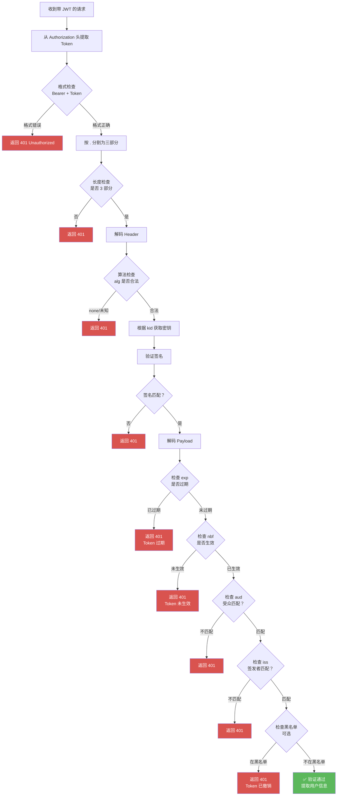
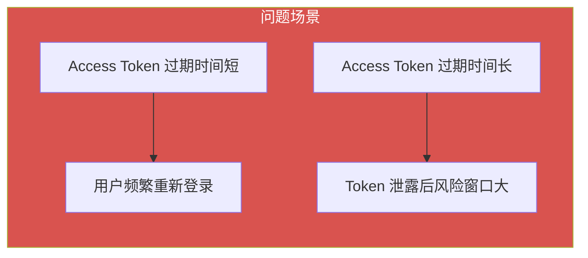
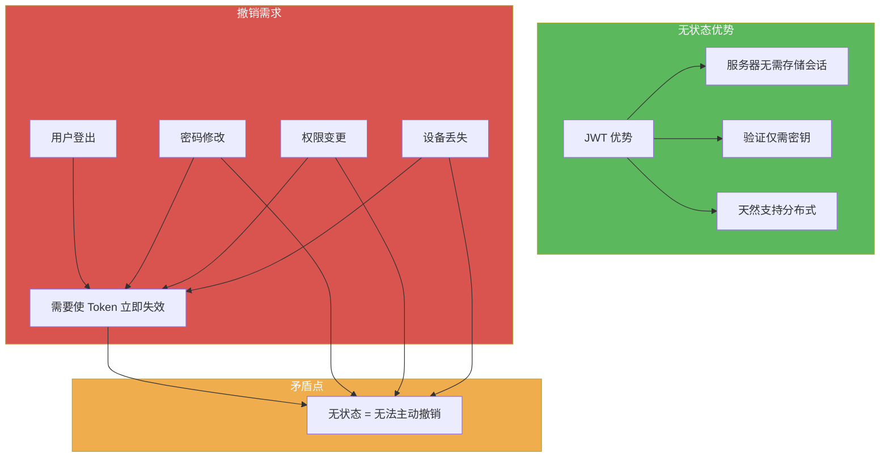
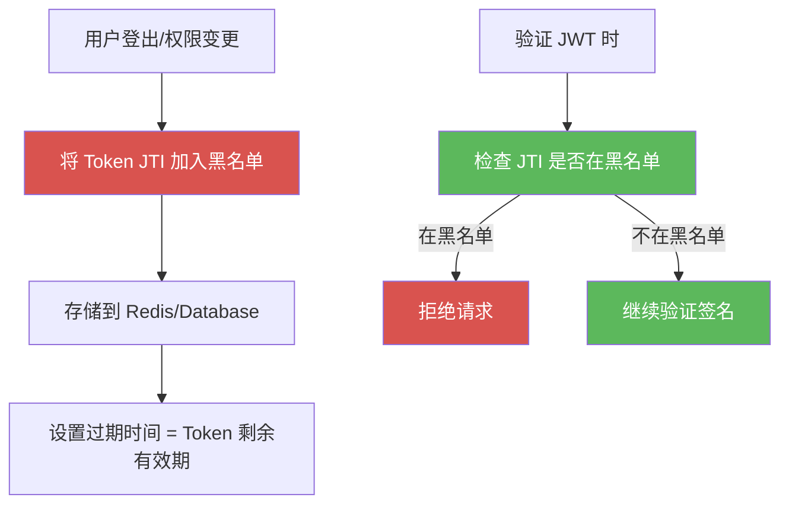
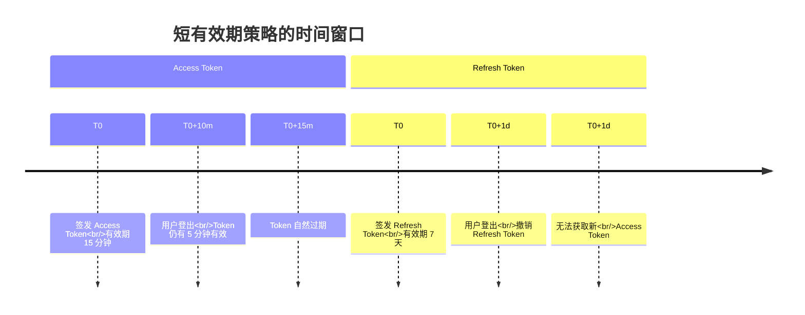
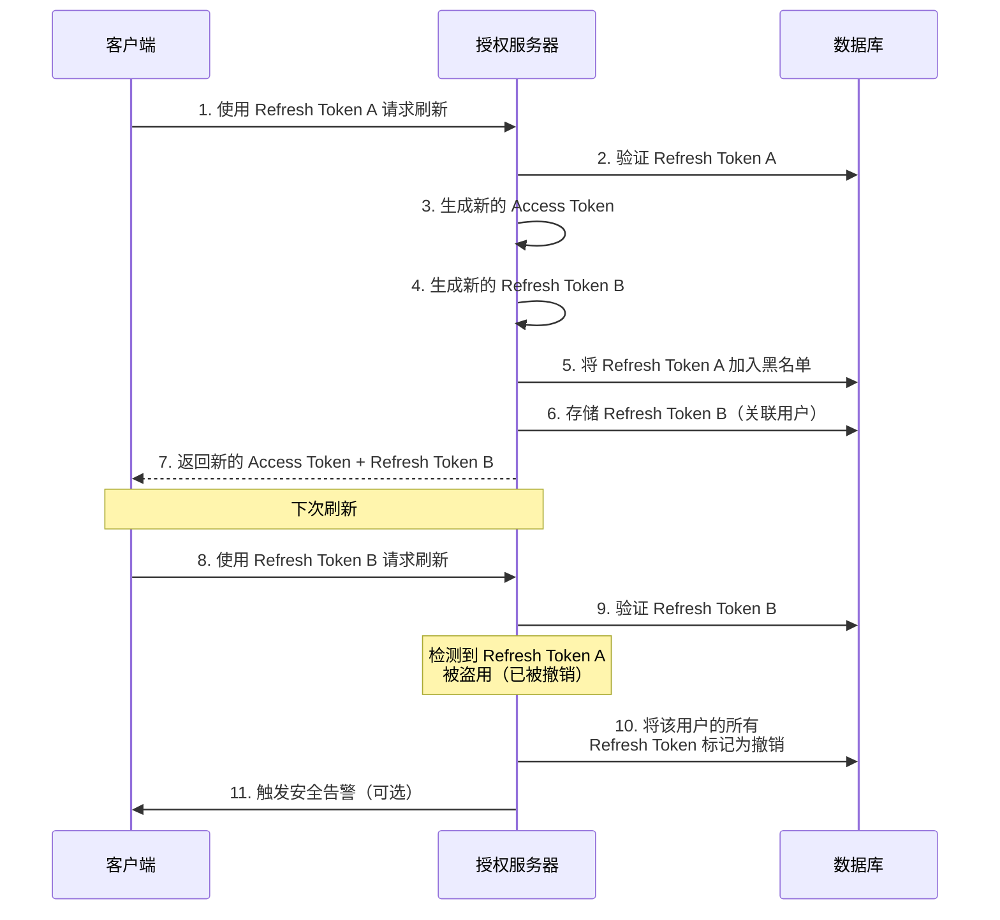

# 第 3 章：JWT 工作流程

## 3.1 签发流程：从用户登录到 Token 生成

### 3.1.1 完整签发流程图

JWT 的签发（Issuing）是指授权服务器在验证用户身份后，生成并返回 JWT Token 的完整过程。以下是标准的签发流程：

```mermaid
sequenceDiagram
    participant C as 客户端 (前端/App)
    participant AS as 授权服务器<br/>(Authorization Server)
    participant DB as 数据库/用户存储
    
    C->>C: 1. 用户输入用户名密码
    C->>AS: 2. POST /login<br/>{username, password}<br/>(HTTPS 加密传输)
    AS->>DB: 3. 验证用户凭证
    DB-->>AS: 4. 返回用户信息
    AS->>AS: 5. 构建 JWT Payload<br/>(sub, iss, exp, role 等)
    AS->>AS: 6. 构建 JWT Header<br/>(alg: RS256, typ: JWT)
    AS->>AS: 7. 生成签名<br/>Signature = Sign(Header.Payload, PrivateKey)
    AS->>AS: 8. 拼接 JWT<br/>Header.Payload.Signature
    AS-->>C: 9. 返回 JWT Token<br/>{access_token, token_type, expires_in}
    C->>C: 10. 安全存储 Token<br/>(LocalStorage/Secure Cookie)
    
    style AS fill:#5CB85C,color:#fff
    style C fill:#4A90D9,color:#fff
    style DB fill:#F0AD4E,color:#fff
```

### 3.1.2 签发流程详细步骤解析

#### 步骤 1-2：客户端发起登录请求

**前端实现示例（React）**：

```javascript
async function login(username, password) {
  try {
    const response = await fetch('https://auth.example.com/login', {
      method: 'POST',
      headers: {
        'Content-Type': 'application/json',
      },
      body: JSON.stringify({ username, password }),
    });
    
    if (!response.ok) {
      throw new Error(`登录失败：${response.status}`);
    }
    
    const data = await response.json();
    // data.access_token 即为 JWT Token
    return data;
  } catch (error) {
    console.error('登录异常:', error);
    throw error;
  }
}
```

**关键安全要求**：

| 要求 | 说明 | 实现方式 |
|------|------|----------|
| **HTTPS 传输** | 防止密码被中间人窃取 | 强制使用 TLS 1.2+ |
| **密码加密** | 避免明文密码在网络传输 | 可配合前端哈希（如 SHA-256） |
| **防重放攻击** | 防止请求被截获后重复提交 | 添加时间戳 + nonce |

#### 步骤 3-4：服务器验证用户凭证

**后端实现示例（Node.js + Express）**：

```javascript
const bcrypt = require('bcrypt');
const jwt = require('jsonwebtoken');

app.post('/login', async (req, res) => {
  const { username, password } = req.body;
  
  try {
    // 1. 查询用户
    const user = await db.users.findOne({ where: { username } });
    if (!user) {
      return res.status(401).json({ error: '用户名或密码错误' });
    }
    
    // 2. 验证密码（使用 bcrypt 比较哈希值）
    const passwordMatch = await bcrypt.compare(password, user.passwordHash);
    if (!passwordMatch) {
      return res.status(401).json({ error: '用户名或密码错误' });
    }
    
    // 3. 凭证验证通过，准备生成 JWT
    // ...（下一步）
  } catch (error) {
    console.error('登录失败:', error);
    res.status(500).json({ error: '服务器内部错误' });
  }
});
```

**安全最佳实践**：

1. **错误信息模糊化**：不要明确提示"用户名不存在"或"密码错误"，统一返回"用户名或密码错误"
2. **登录失败限制**：实施账户锁定策略（如 5 次失败后锁定 15 分钟）
3. **密码存储**：使用 bcrypt、Argon2 等慢哈希算法，禁止明文存储

#### 步骤 5-6：构建 JWT Header 和 Payload

**Payload 设计原则**：

```javascript
const payload = {
  // 注册声明（推荐使用）
  sub: String(user.id),           // 主题（用户 ID）
  iss: 'https://auth.example.com', // 签发者
  aud: 'https://api.example.com',  // 受众（目标服务）
  iat: Math.floor(Date.now() / 1000), // 签发时间（秒级时间戳）
  exp: Math.floor(Date.now() / 1000) + 3600, // 过期时间（1 小时后）
  
  // 自定义声明（业务数据）
  role: user.role,                 // 用户角色
  permissions: user.permissions,   // 权限列表
  tenant_id: user.tenantId,        // 租户 ID（多租户场景）
  
  // 安全相关
  jti: crypto.randomUUID(),        // JWT 唯一 ID（用于防重放/黑名单）
};
```

**Header 配置**：

```javascript
const header = {
  alg: 'RS256',  // 使用 RSA-SHA256 非对称签名
  typ: 'JWT',    // 令牌类型
  kid: 'key-2024-01'  // 密钥 ID（多密钥轮换场景）
};
```

#### 步骤 7-8：生成签名并拼接 JWT

**Node.js 实现（使用 jsonwebtoken 库）**：

```javascript
const jwt = require('jsonwebtoken');
const fs = require('fs');

// 读取私钥（实际生产中应从环境变量或密钥管理服务获取）
const privateKey = fs.readFileSync('private.key', 'utf8');

const token = jwt.sign(
  payload,           // Payload 数据
  privateKey,        // 私钥
  {
    algorithm: 'RS256',  // 签名算法
    expiresIn: '1h',     // 过期时间（可选，会覆盖 payload.exp）
    issuer: 'https://auth.example.com',  // 签发者
    audience: 'https://api.example.com', // 受众
    jwtid: crypto.randomUUID()  // JWT ID
  }
);

console.log('生成的 JWT Token:', token);
```

**Java 实现（使用 jjwt 库）**：

```java
import io.jsonwebtoken.*;
import io.jsonwebtoken.security.Keys;
import java.security.KeyPair;
import java.security.KeyPairGenerator;
import java.util.Date;
import java.util.UUID;

public class JwtTokenProvider {
    
    private final KeyPair keyPair;
    
    public JwtTokenProvider() throws Exception {
        // 生成 RSA 密钥对（实际生产中应预先生成并安全存储）
        KeyPairGenerator keyGen = KeyPairGenerator.getInstance("RSA");
        keyGen.initialize(2048);
        this.keyPair = keyGen.generateKeyPair();
    }
    
    public String generateToken(String userId, String username, String role) {
        long now = System.currentTimeMillis();
        long expiryDate = now + 3600000; // 1 小时后过期
        
        return Jwts.builder()
            .setHeaderParam("kid", "key-2024-01")  // 密钥 ID
            .setSubject(userId)                     // sub
            .claim("username", username)            // 自定义声明
            .claim("role", role)
            .setIssuer("https://auth.example.com")  // iss
            .setAudience("https://api.example.com") // aud
            .setIssuedAt(new Date(now))             // iat
            .setExpiration(new Date(expiryDate))    // exp
            .setId(UUID.randomUUID().toString())    // jti
            .signWith(keyPair.getPrivate(), SignatureAlgorithm.RS256)
            .compact();
    }
}
```

#### 步骤 9-10：返回并存储 Token

**标准响应格式**：

```json
{
  "access_token": "eyJhbGciOiJSUzI1NiIsInR5cCI6IkpXVCJ9...",
  "token_type": "Bearer",
  "expires_in": 3600,
  "refresh_token": "dGhpcyBpcyBhIHJlZnJlc2ggdG9rZW4...",
  "scope": "read write"
}
```

**客户端安全存储**：

```javascript
// ✅ 推荐：存储在 HttpOnly Cookie（防 XSS）
document.cookie = `access_token=${accessToken}; HttpOnly; Secure; SameSite=Strict; path=/`;

// ⚠️ 可选：LocalStorage（方便但需注意 XSS 风险）
localStorage.setItem('access_token', accessToken);

// ❌ 不推荐：明文存储在普通 Cookie
// document.cookie = `access_token=${accessToken}`;
```

---

## 3.2 验证流程：服务器如何校验 JWT

### 3.2.1 验证流程总览



### 3.2.2 签名验证原理

#### HS256 签名验证

**验证公式**：

```
expectedSignature = HMACSHA256(
  base64UrlEncode(header) + "." + base64UrlEncode(payload),
  secret
)

isValid = (expectedSignature === signature)
```

**Node.js 实现**：

```javascript
const crypto = require('crypto');

function verifyHS256(jwtToken, secret) {
  const [encodedHeader, encodedPayload, signature] = jwtToken.split('.');
  
  // 重新计算签名
  const signingInput = `${encodedHeader}.${encodedPayload}`;
  const expectedSignature = crypto
    .createHmac('sha256', secret)
    .update(signingInput)
    .digest('base64url');
  
  // 比较签名（使用常量时间比较防止时序攻击）
  return crypto.timingSafeEqual(
    Buffer.from(signature, 'base64url'),
    Buffer.from(expectedSignature, 'base64url')
  );
}
```

#### RS256 签名验证

**验证公式**：

```
isValid = RSASSA_PKCS1_v1_5_Verify(
  publicKey,
  SHA256(base64UrlEncode(header) + "." + base64UrlEncode(payload)),
  base64UrlDecode(signature)
)
```

**Node.js 实现**：

```javascript
const jwt = require('jsonwebtoken');
const fs = require('fs');

const publicKey = fs.readFileSync('public.key', 'utf8');

function verifyRS256(jwtToken) {
  try {
    const decoded = jwt.verify(jwtToken, publicKey, {
      algorithms: ['RS256'],           // 明确指定允许算法
      issuer: 'https://auth.example.com', // 验证签发者
      audience: 'https://api.example.com', // 验证受众
    });
    return { valid: true, payload: decoded };
  } catch (error) {
    return { valid: false, error: error.message };
  }
}
```

### 3.2.3 过期检查（exp 验证）

**时间戳验证原理**：

```javascript
function checkExpiration(payload, clockSkew = 0) {
  const now = Math.floor(Date.now() / 1000); // 当前时间（秒）
  const exp = payload.exp;
  
  // 考虑时钟偏移（clock skew）
  if (now > exp + clockSkew) {
    return { valid: false, reason: 'Token has expired' };
  }
  
  return { valid: true };
}
```

**时钟偏移（Clock Skew）问题**：

| 问题 | 描述 | 解决方案 |
|------|------|----------|
| **服务器时间不同步** | 分布式系统中各节点时间可能不一致 | 使用 NTP 同步所有服务器时间 |
| **客户端时间偏差** | 客户端设备时间可能不准确 | 不依赖客户端时间，以服务器时间为准 |
| **验证容错** | 严格验证可能因微小时间差导致合法 Token 被拒 | 设置合理的 clockSkew（如 60 秒） |

**Node.js 配置 clockSkew**：

```javascript
jwt.verify(token, publicKey, {
  clockSkew: '60s',  // 允许 60 秒时钟偏移
});
```

### 3.2.4 完整验证代码示例

#### Node.js 中间件实现

```javascript
const jwt = require('jsonwebtoken');
const fs = require('fs');

const publicKey = fs.readFileSync('public.key', 'utf8');

// JWT 验证中间件
function authMiddleware(req, res, next) {
  // 1. 从 Authorization 头提取 Token
  const authHeader = req.headers.authorization;
  if (!authHeader || !authHeader.startsWith('Bearer ')) {
    return res.status(401).json({ error: '缺少 Authorization 头或格式错误' });
  }
  
  const token = authHeader.split(' ')[1];
  
  // 2. 验证 JWT
  jwt.verify(token, publicKey, {
    algorithms: ['RS256'],
    issuer: 'https://auth.example.com',
    audience: 'https://api.example.com',
    clockSkew: '60s',
  }, (err, decoded) => {
    if (err) {
      // 详细错误处理
      if (err.name === 'TokenExpiredError') {
        return res.status(401).json({ 
          error: 'Token 已过期',
          expiredAt: err.expiredAt 
        });
      }
      if (err.name === 'JsonWebTokenError') {
        return res.status(401).json({ error: 'Token 无效' });
      }
      return res.status(401).json({ error: 'Token 验证失败' });
    }
    
    // 3. 验证通过，将用户信息附加到请求对象
    req.user = decoded;
    next();
  });
}

// 使用示例
app.get('/api/protected', authMiddleware, (req, res) => {
  res.json({ 
    message: '访问成功',
    user: req.user 
  });
});
```

#### Java Spring Security 实现

```java
import org.springframework.security.oauth2.jwt.JwtDecoder;
import org.springframework.security.oauth2.jwt.NimbusJwtDecoder;
import org.springframework.context.annotation.Bean;
import org.springframework.context.annotation.Configuration;
import org.springframework.security.config.annotation.web.builders.HttpSecurity;
import org.springframework.security.web.SecurityFilterChain;

@Configuration
public class JwtConfig {
    
    @Bean
    public JwtDecoder jwtDecoder() throws Exception {
        // 读取公钥
        String publicKey = new String(Files.readAllBytes(Paths.get("public.key")));
        return NimbusJwtDecoder.withPublicKey(
            KeyFactory.getInstance("RSA")
                .generatePublic(new X509EncodedKeySpec(
                    Base64.getDecoder().decode(publicKey)
                ))
        ).build();
    }
    
    @Bean
    public SecurityFilterChain filterChain(HttpSecurity http) throws Exception {
        http
            .authorizeHttpRequests(auth -> auth
                .requestMatchers("/api/public/**").permitAll()
                .requestMatchers("/api/protected/**").authenticated()
            )
            .oauth2ResourceServer(oauth2 -> oauth2.jwt(Customizer.withDefaults()));
        
        return http.build();
    }
}
```

---

## 3.3 刷新机制：Access Token + Refresh Token 双令牌模式

### 3.3.1 为什么需要双令牌？

**单令牌模式的问题**：



| 方案 | Access Token 有效期 | 用户体验 | 安全性 |
|------|-------------------|----------|--------|
| **短有效期** | 15-30 分钟 | ❌ 频繁重新登录 | ✅ 泄露风险窗口小 |
| **长有效期** | 7-30 天 | ✅ 无需频繁登录 | ❌ 泄露后长期有效 |

**双令牌模式的解决方案**：

```
Access Token（访问令牌）
├── 有效期短：15-60 分钟
├── 用于访问受保护资源
└── 泄露后影响有限

Refresh Token（刷新令牌）
├── 有效期长：7-30 天
├── 仅用于获取新的 Access Token
└── 严格保管（HttpOnly Cookie）
```

### 3.3.2 双令牌工作流程

```mermaid
sequenceDiagram
    participant C as 客户端
    participant AS as 授权服务器
    participant RS as 资源服务器
    participant DB as 数据库/Redis
    
    Note over C,RS: 初始登录
    C->>AS: 1. 登录请求
    AS-->>C: 2. 返回 Access Token + Refresh Token
    C->>C: 3. 存储 Access Token (内存)<br/>Refresh Token (HttpOnly Cookie)
    
    Note over C,RS: 正常访问
    C->>RS: 4. 请求 API (带 Access Token)
    RS-->>C: 5. 返回响应
    
    Note over C,RS: Access Token 过期
    C->>RS: 6. 请求 API (Access Token 已过期)
    RS-->>C: 7. 返回 401 Token Expired
    
    Note over C,AS: 刷新流程
    C->>AS: 8. POST /refresh (带 Refresh Token)
    AS->>DB: 9. 验证 Refresh Token
    DB-->>AS: 10. 验证通过
    AS->>AS: 11. 生成新的 Access Token<br/>(可选：轮换 Refresh Token)
    AS-->>C: 12. 返回新的 Access Token<br/>(+ 新的 Refresh Token)
    
    Note over C,RS: 继续访问
    C->>RS: 13. 请求 API (带新 Access Token)
    RS-->>C: 14. 返回响应
    
    style AS fill:#5CB85C,color:#fff
    style C fill:#4A90D9,color:#fff
```

### 3.3.3 刷新令牌实现

#### Node.js 实现

```javascript
const jwt = require('jsonwebtoken');
const crypto = require('crypto');

// 生成 Access Token（短有效期）
function generateAccessToken(userId, role) {
  return jwt.sign(
    { 
      sub: userId, 
      role,
      type: 'access'  // 标识令牌类型
    },
    process.env.ACCESS_TOKEN_SECRET,
    { 
      algorithm: 'HS256',
      expiresIn: '15m'  // 15 分钟
    }
  );
}

// 生成 Refresh Token（长有效期）
function generateRefreshToken(userId) {
  return jwt.sign(
    { 
      sub: userId,
      type: 'refresh',
      jti: crypto.randomUUID()  // 唯一 ID（用于撤销）
    },
    process.env.REFRESH_TOKEN_SECRET,
    { 
      algorithm: 'HS256',
      expiresIn: '7d'  // 7 天
    }
  );
}

// 刷新令牌接口
app.post('/refresh', async (req, res) => {
  const refreshToken = req.cookies.refreshToken;  // 从 HttpOnly Cookie 读取
  
  if (!refreshToken) {
    return res.status(401).json({ error: '缺少 Refresh Token' });
  }
  
  try {
    // 1. 验证 Refresh Token
    const decoded = jwt.verify(refreshToken, process.env.REFRESH_TOKEN_SECRET, {
      algorithms: ['HS256'],
    });
    
    // 2. 检查令牌类型
    if (decoded.type !== 'refresh') {
      return res.status(401).json({ error: '无效的令牌类型' });
    }
    
    // 3. 检查是否在黑名单（撤销列表）
    const isRevoked = await redis.get(`refresh_blacklist:${decoded.jti}`);
    if (isRevoked) {
      return res.status(401).json({ error: 'Refresh Token 已撤销' });
    }
    
    // 4. 生成新的 Access Token
    const newAccessToken = generateAccessToken(decoded.sub, decoded.role);
    
    // 5. （可选）轮换 Refresh Token
    // 6. 将旧的 Refresh Token 加入黑名单
    await redis.set(
      `refresh_blacklist:${decoded.jti}`,
      'revoked',
      'EX',
      7 * 24 * 60 * 60  // 7 天
    );
    
    // 7. 生成新的 Refresh Token
    const newRefreshToken = generateRefreshToken(decoded.sub);
    
    // 8. 设置新的 HttpOnly Cookie
    res.cookie('refreshToken', newRefreshToken, {
      httpOnly: true,
      secure: true,
      sameSite: 'strict',
      maxAge: 7 * 24 * 60 * 60 * 1000  // 7 天
    });
    
    // 9. 返回新的 Access Token
    res.json({
      access_token: newAccessToken,
      token_type: 'Bearer',
      expires_in: 900  // 15 分钟
    });
    
  } catch (error) {
    if (error.name === 'TokenExpiredError') {
      return res.status(401).json({ error: 'Refresh Token 已过期' });
    }
    return res.status(401).json({ error: 'Refresh Token 无效' });
  }
});
```

#### 前端自动刷新实现

```javascript
class AuthClient {
  constructor() {
    this.accessToken = null;
    this.isRefreshing = false;
    this.refreshPromise = null;
  }
  
  // 带自动刷新的请求方法
  async fetchWithAuth(url, options = {}) {
    // 1. 确保有 Access Token
    if (!this.accessToken) {
      throw new Error('未登录');
    }
    
    // 2. 发起请求
    let response = await fetch(url, {
      ...options,
      headers: {
        ...options.headers,
        'Authorization': `Bearer ${this.accessToken}`,
      },
    });
    
    // 3. 如果返回 401（Token 过期），尝试刷新
    if (response.status === 401) {
      try {
        await this.refreshAccessToken();
        
        // 4. 用新 Token 重试请求
        response = await fetch(url, {
          ...options,
          headers: {
            ...options.headers,
            'Authorization': `Bearer ${this.accessToken}`,
          },
        });
      } catch (error) {
        // 刷新失败，重定向到登录页
        window.location.href = '/login';
        throw error;
      }
    }
    
    return response;
  }
  
  // 刷新 Access Token
  async refreshAccessToken() {
    // 防止并发刷新
    if (this.isRefreshing) {
      return this.refreshPromise;
    }
    
    this.isRefreshing = true;
    this.refreshPromise = (async () => {
      try {
        const response = await fetch('/refresh', {
          method: 'POST',
          credentials: 'include',  // 携带 HttpOnly Cookie
        });
        
        if (!response.ok) {
          throw new Error('刷新失败');
        }
        
        const data = await response.json();
        this.accessToken = data.access_token;
        
        // 触发令牌更新事件（通知其他标签页）
        window.dispatchEvent(new CustomEvent('tokenRefreshed', {
          detail: { accessToken: this.accessToken }
        }));
        
        return this.accessToken;
      } finally {
        this.isRefreshing = false;
        this.refreshPromise = null;
      }
    })();
    
    return this.refreshPromise;
  }
}

// 使用示例
const authClient = new AuthClient();

// 登录成功后存储 Token
authClient.accessToken = loginResponse.access_token;

// 发起请求（自动处理刷新）
const data = await authClient.fetchWithAuth('/api/user/profile');
```

---

## 3.4 撤销难题与解决方案

### 3.4.1 JWT 的撤销困境

**无状态 vs 可撤销的矛盾**：



**问题本质**：
JWT 的设计哲学是**无状态验证**，验证方只需持有公钥即可验证签名，无需与签发方通信或查询数据库。这一优势恰恰导致撤销困难——一旦 Token 签发，在过期前始终有效。

### 3.4.2 解决方案 1：Token 黑名单（Blacklist）

**实现原理**：



**Redis 实现示例**：

```javascript
const redis = require('redis');
const client = redis.createClient();

// 将 Token 加入黑名单
async function revokeToken(token) {
  try {
    // 1. 解码 Token（无需验证签名）
    const payload = jwt.decode(token);
    if (!payload || !payload.exp) {
      return false;  // 无过期时间的 Token 无法处理
    }
    
    // 2. 计算剩余有效期（秒）
    const now = Math.floor(Date.now() / 1000);
    const ttl = payload.exp - now;
    
    if (ttl <= 0) {
      return false;  // 已过期，无需加入黑名单
    }
    
    // 3. 以 JTI 为键存入 Redis
    const key = `jwt:blacklist:${payload.jti}`;
    await client.setEx(key, ttl, 'revoked');
    
    return true;
  } catch (error) {
    console.error('撤销 Token 失败:', error);
    return false;
  }
}

// 检查 Token 是否在黑名单中
async function isTokenBlacklisted(token) {
  try {
    const payload = jwt.decode(token);
    if (!payload || !payload.jti) {
      return true;  // 无 JTI 的 Token 视为无效
    }
    
    const key = `jwt:blacklist:${payload.jti}`;
    const status = await client.get(key);
    
    return status === 'revoked';
  } catch (error) {
    return true;  // 检查失败时默认拒绝
  }
}

// 验证中间件集成黑名单检查
async function authMiddleware(req, res, next) {
  const token = extractToken(req);
  
  // 1. 检查黑名单
  const blacklisted = await isTokenBlacklisted(token);
  if (blacklisted) {
    return res.status(401).json({ error: 'Token 已撤销' });
  }
  
  // 2. 正常验证签名
  jwt.verify(token, publicKey, { algorithms: ['RS256'] }, (err, decoded) => {
    if (err) {
      return res.status(401).json({ error: 'Token 无效' });
    }
    req.user = decoded;
    next();
  });
}

// 登出接口
app.post('/logout', authMiddleware, async (req, res) => {
  const token = extractToken(req);
  await revokeToken(token);
  res.json({ message: '已登出' });
});
```

**黑名单方案优缺点**：

| 优点 | 缺点 |
|------|------|
| ✅ 支持立即撤销 | ❌ 需要存储状态（牺牲无状态优势） |
| ✅ 实现简单 | ❌ 每次验证需查询 Redis/数据库 |
| ✅ 可控制单个 Token | ❌ 分布式场景需共享存储 |

### 3.4.3 解决方案 2：短有效期 + Refresh Token

**核心思想**：
不直接解决 Access Token 的撤销问题，而是通过**缩短有效期**将风险窗口控制在可接受范围内。



**实现策略**：

```javascript
// 配置建议
const TOKEN_CONFIG = {
  // Access Token：短有效期
  access: {
    expiresIn: '15m',  // 15 分钟
    maxLifetime: '30m' // 绝对最大值（可选）
  },
  
  // Refresh Token：长有效期但可撤销
  refresh: {
    expiresIn: '7d',           // 7 天
    rotateOnRefresh: true,     // 每次刷新时轮换
    revokeOnLogout: true,      // 登出时撤销
    singleUse: true            // 一次性使用（检测重放）
  }
};
```

### 3.4.4 解决方案 3：Refresh Token 轮换（Rotate Refresh Token）

**轮换机制原理**：



**轮换实现**：

```javascript
// 刷新令牌时实施轮换
async function refreshTokenWithRotation(oldRefreshToken) {
  try {
    // 1. 验证旧 Refresh Token
    const decoded = jwt.verify(oldRefreshToken, REFRESH_SECRET);
    
    // 2. 检查是否是重复使用（检测盗用）
    const reused = await checkTokenReuse(decoded.jti);
    if (reused) {
      // 发现盗用！撤销该用户的所有 Refresh Token
      await revokeAllUserTokens(decoded.sub);
      throw new Error('检测到 Refresh Token 盗用');
    }
    
    // 3. 将旧 Token 加入黑名单
    await blacklistToken(decoded.jti);
    
    // 4. 生成新的 Refresh Token（新 jti）
    const newRefreshToken = generateRefreshToken(decoded.sub, {
      jti: crypto.randomUUID(),
    });
    
    // 5. 存储新 Token 的 JTI 到数据库（用于轮换追踪）
    await storeUserRefreshToken(decoded.sub, newRefreshToken.jti);
    
    return {
      accessToken: generateAccessToken(decoded.sub),
      refreshToken: newRefreshToken,
    };
    
  } catch (error) {
    if (error.name === 'TokenExpiredError') {
      throw new Error('Refresh Token 已过期');
    }
    throw error;
  }
}

// 检查 Token 是否被重复使用
async function checkTokenReuse(jti) {
  // 如果 JTI 已经在"已使用"集合中，说明被盗用
  const used = await redis.sismember('used_refresh_jti', jti);
  return used === 1;
}

// 撤销用户所有 Refresh Token
async function revokeAllUserTokens(userId) {
  // 获取该用户的所有 JTI
  const jtis = await redis.smembers(`user:${userId}:refresh_jtis`);
  
  // 批量加入黑名单
  const pipeline = redis.pipeline();
  for (const jti of jtis) {
    pipeline.setEx(`jwt:blacklist:${jti}`, 7 * 24 * 60 * 60, 'revoked');
  }
  await pipeline.exec();
  
  // 清空用户的 JTI 集合
  await redis.del(`user:${userId}:refresh_jtis`);
  
  // 触发安全告警
  await sendSecurityAlert(userId, 'REFRESH_TOKEN_REUSE_DETECTED');
}
```

### 3.4.5 三种方案对比

| 方案 | 实时性 | 性能影响 | 实现复杂度 | 推荐场景 |
|------|--------|----------|------------|----------|
| **黑名单** | ✅ 立即生效 | ⚠️ 每次验证查询存储 | 简单 | 高安全需求 |
| **短有效期** | ⚠️ 最多等待过期 | ✅ 无额外开销 | 简单 | 一般场景 |
| **轮换 Refresh Token** | ✅ 检测盗用 | ⚠️ 需存储轮换状态 | 中等 | 金融/敏感数据 |

### 3.4.6 最佳实践组合

**推荐方案**：短有效期 + Refresh Token 轮换 + 选择性黑名单

```javascript
const BEST_PRACTICE_CONFIG = {
  // 1. Access Token 短有效期
  accessToken: {
    expiresIn: '15m',
    algorithm: 'RS256',
  },
  
  // 2. Refresh Token 轮换 + 一次性使用
  refreshToken: {
    expiresIn: '7d',
    rotateOnRefresh: true,
    singleUse: true,
    secureStorage: 'HttpOnly Cookie',
  },
  
  // 3. 选择性黑名单（仅关键场景）
  blacklist: {
    enabled: true,
    // 仅在以下场景加入黑名单：
    // - 用户主动登出
    // - 密码修改
    // - 检测到异常活动
    triggerOn: ['logout', 'password_change', 'security_alert'],
  },
  
  // 4. 监控与告警
  monitoring: {
    detectReuse: true,
    alertOnReuse: true,
    revokeAllOnReuse: true,
  },
};
```

---

## 3.5 本章小结

### 核心要点回顾

1. **签发流程**：用户登录 → 验证凭证 → 构建 Payload → 生成签名 → 返回 Token
2. **验证流程**：提取 Token → 验证签名 → 检查过期 → 验证声明（iss/aud）→ 可选黑名单检查
3. **刷新机制**：Access Token（短有效期）+ Refresh Token（长有效期）组合使用
4. **撤销方案**：黑名单（实时）、短有效期（被动）、轮换 Refresh Token（检测盗用）

### 安全最佳实践

| 实践 | 说明 |
|------|------|
| ✅ 使用 HTTPS | 所有 Token 传输必须加密 |
| ✅ Access Token 短有效期 | 建议 15-30 分钟 |
| ✅ Refresh Token HttpOnly Cookie | 防止 XSS 窃取 |
| ✅ 验证所有标准声明 | exp、nbf、iss、aud |
| ✅ 实施 Refresh Token 轮换 | 检测并响应盗用 |
| ✅ 关键操作加入黑名单 | 登出、密码修改时撤销 |
| ❌ Payload 存储敏感信息 | 密码、信用卡号等 |
| ❌ 使用 none 算法 | 明确禁止 |

### 关键引用来源

1. **RFC 7519** - JSON Web Token (JWT)：https://www.rfc-editor.org/rfc/rfc7519
2. **RFC 8725** - JWT 安全最佳实践：https://www.rfc-editor.org/rfc/rfc8725
3. **OAuth 2.1 Draft** - Refresh Token 轮换机制：https://oauth.net/2.1/
4. **OWASP JWT Security Cheat Sheet**：https://cheatsheetseries.owasp.org/cheatsheets/JSON_Web_Token_for_Java_Cheat_Sheet.html
5. **Auth0 JWT Handbook**：https://auth0.com/resources/ebooks/jwt-handbook

### 下一章预告

第 4 章将深入探讨 JWT 签名算法，包括：
- HS256（HMAC-SHA256）对称签名原理与实现
- RS256/RS384/RS512（RSA）非对称签名
- ES256/ES384/ES512（ECDSA）椭圆曲线签名
- EdDSA（Ed25519）现代高效签名算法
- 算法选择最佳实践与对比分析

---

*文档版本：1.0*  
*最后更新：2026-04-07*  
*字数统计：约 6,500 字*
