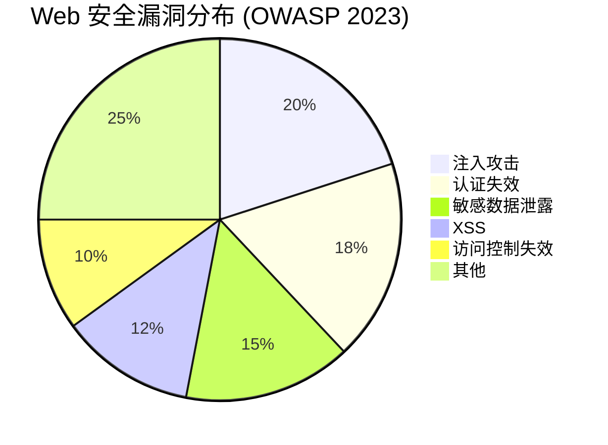
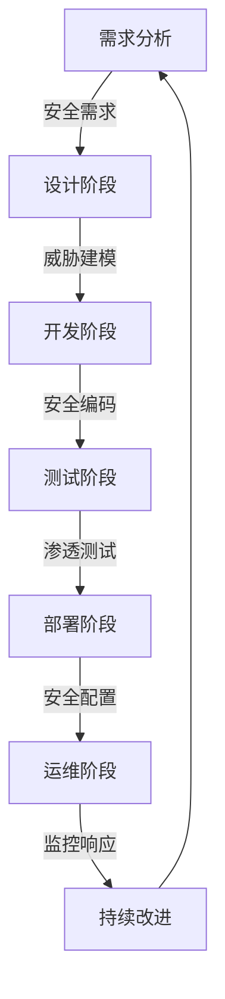
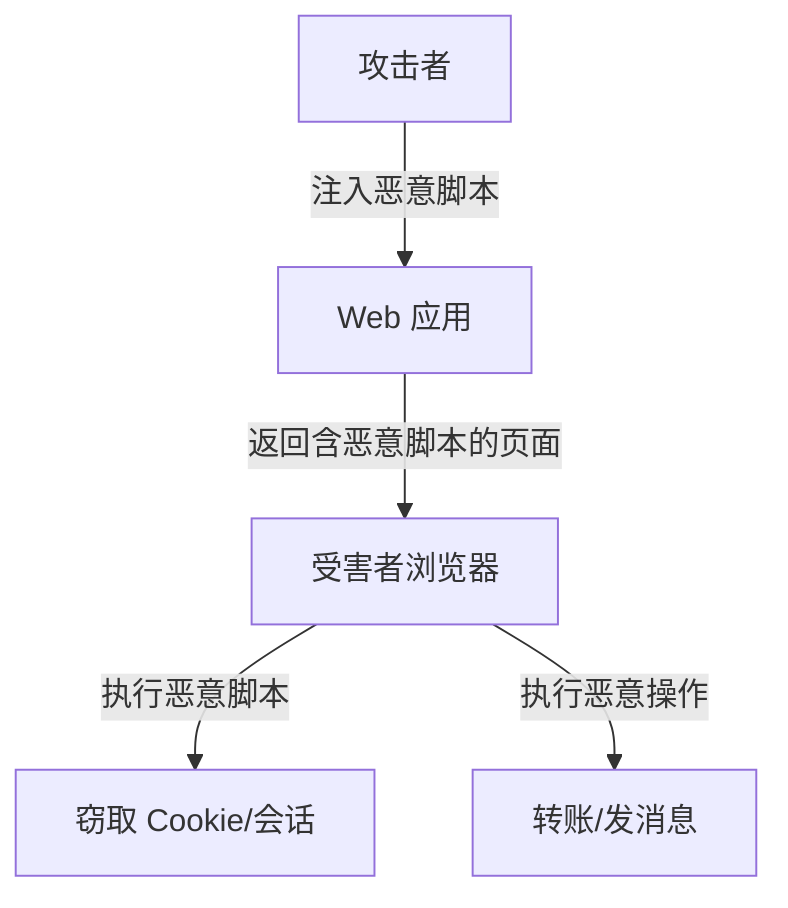
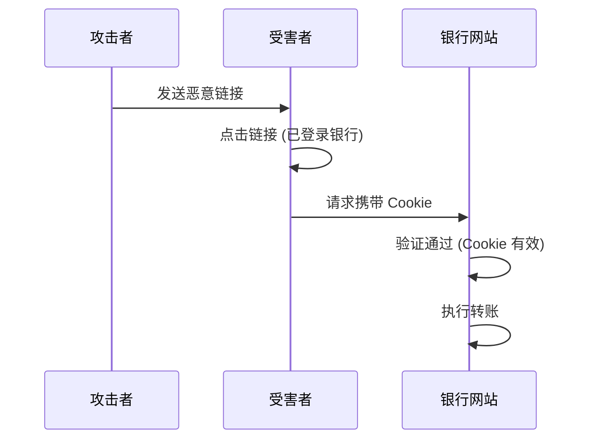
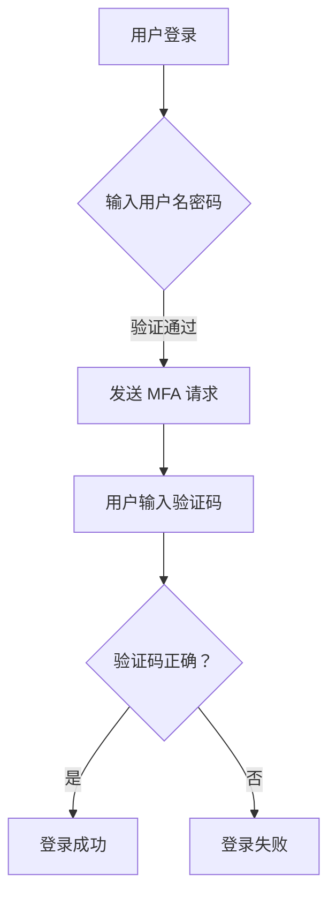

# Web 安全核心知识体系

> Web 应用安全攻防指南

**最后更新：** 2026-04-05 | **版本：** 1.0.0

---

## 目录

1. [Web 安全基础认知](#第 1 章-web-安全基础认知)
2. [XSS 跨站脚本攻击](#第 2 章-xss-跨站脚本攻击)
3. [CSRF 跨站请求伪造](#第 3 章-csrf-跨站请求伪造)
4. [注入攻击](#第 4 章-注入攻击)
5. [认证与会话安全](#第 5 章-认证与会话安全)
6. [内容安全策略 CSP](#第 6 章-内容安全策略-csp)
7. [传输层安全](#第 7 章-传输层安全)
8. [安全最佳实践](#第 8 章-安全最佳实践)

---

## 第 1 章 Web 安全基础认知

### 1.1 Web 安全威胁现状

根据 OWASP 2023 年度报告，75% 的 Web 应用攻击通过 API 接口实施，最常见的安全威胁包括：



**数据泄露代价：**
- 2018 年英国航空 XSS 攻击：38 万张信用卡泄露，罚款 1.83 亿英镑
- 2018 年电商平台 CSRF 漏洞：2300 万用户数据泄露
- 2021 年社交平台 DOM 型 XSS：800 万用户受影响

### 1.2 OWASP Top 10 2023

| 排名 | 漏洞类型 | 说明 |
|------|----------|------|
| A01 | 失效的访问控制 | 未正确限制资源访问权限 |
| A02 | 加密机制失效 | 敏感数据未加密或加密不当 |
| A03 | 注入攻击 | SQL、NoSQL、OS 命令注入等 |
| A04 | 不安全设计 | 设计缺陷导致的安全漏洞 |
| A05 | 安全配置错误 | 默认配置、未打补丁等 |
| A06 | 易受攻击的组件 | 使用有漏洞的第三方库 |
| A07 | 认证失效 | 身份验证和会话管理缺陷 |
| A08 | 软件和数据完整性故障 | 未验证代码和数据完整性 |
| A09 | 安全日志和监控失效 | 日志记录不足，检测不及时 |
| A10 | 服务端请求伪造 SSRF | 诱导服务器发起恶意请求 |

### 1.3 安全开发生命周期



### 1.4 安全原则

| 原则 | 说明 |
|------|------|
| **最小权限原则** | 只授予必要的权限 |
| **纵深防御** | 多层安全控制叠加 |
| **零信任架构** | 始终验证请求来源 |
| **默认安全** | 默认配置应是安全的 |
| **故障安全** | 出错时应进入安全状态 |

---

## 第 2 章 XSS 跨站脚本攻击

### 2.1 XSS 攻击原理

XSS（Cross-Site Scripting，跨站脚本攻击）是指攻击者向网页注入恶意脚本，当用户浏览时触发执行。



### 2.2 XSS 攻击类型

#### 2.2.1 反射型 XSS

恶意脚本通过 URL 参数注入，服务器直接返回到页面渲染。

```
# 攻击 URL
https://example.com/search?q=<script>alert('XSS')</script>

# 服务器返回（未转义）
<div>搜索结果：${q}</div>

# 受害者访问后，脚本执行
```

**特点：**
- 需要诱导用户点击恶意链接
- 恶意脚本不存储在服务器
- 通常用于钓鱼攻击

#### 2.2.2 存储型 XSS

恶意代码永久存储在服务器（如数据库），每次页面加载自动执行。

```
# 攻击者提交评论
POST /comment
Content-Type: application/json

{
  "content": "<script>stealCookie()</script>"
}

# 服务器存储评论
# 其他用户查看文章时，脚本自动执行
```

**特点：**
- 危害最大，影响范围广
- 常见于评论、留言板、论坛
- 无需诱导用户点击

#### 2.2.3 DOM 型 XSS

完全在客户端完成攻击，不经过服务器处理。

```javascript
// 不安全的代码
const userInput = new URLSearchParams(window.location.search).get('search')
document.write(`搜索结果：${userInput}`)

// 攻击 URL
https://example.com/?search=<script>alert('XSS')</script>

// 安全的代码
const userInput = new URLSearchParams(window.location.search).get('search')
document.textContent = `搜索结果：${userInput}`  // 自动转义
```

**特点：**
- 服务器无法检测
- 依赖前端代码质量
- 难以通过 WAF 防护

### 2.3 XSS 防御措施

#### 2.3.1 输入验证与过滤

```javascript
// 使用 DOMPurify 进行 HTML 消毒
import DOMPurify from 'dompurify'

const userInput = getUntrustedInput()
const clean = DOMPurify.sanitize(userInput, {
  ALLOWED_TAGS: ['b', 'i', 'em', 'strong'],  // 白名单
  ALLOWED_ATTR: ['href']
})

// Express 中间件
const express = require('express')
const xss = require('xss')

app.use(express.json({
  validate: (req, res, buf) => {
    if (buf.indexOf('<script>') !== -1) {
      throw new Error('Invalid input')
    }
  }
}))
```

#### 2.3.2 输出编码

```javascript
// ❌ 不安全
element.innerHTML = userInput

// ✅ 安全
element.textContent = userInput

// React 自动转义
function Comment({ content }) {
  return <div>{content}</div>  // 自动 HTML 转义
}

// Vue 自动转义
<template>
  <div>{{ content }}</div>  <!-- 自动 HTML 转义 -->
</template>

// 必须使用 v-html 时
<div v-html="sanitizedContent"></div>  <!-- 需要先消毒 -->
```

**HTML 实体编码表：**

| 字符 | 编码 |
|------|------|
| `<` | `&lt;` |
| `>` | `&gt;` |
| `&` | `&amp;` |
| `"` | `&quot;` |
| `'` | `&#x27;` |
| `/` | `&#x2F;` |

#### 2.3.3 安全 Cookie 标记

```javascript
// Express 设置会话 Cookie
app.use(session({
  cookie: {
    httpOnly: true,    // 阻止 JS 访问
    secure: true,      // 仅 HTTPS 传输
    sameSite: 'Lax',   // 阻止跨站发送
    maxAge: 24 * 60 * 60 * 1000  // 24 小时
  }
}))
```

---

## 第 3 章 CSRF 跨站请求伪造

### 3.1 CSRF 攻击原理

CSRF（Cross-Site Request Forgery，跨站请求伪造）是指攻击者诱导用户在已登录的情况下，向目标网站发送恶意请求。



### 3.2 CSRF 攻击示例

```html
<!-- 攻击页面 -->
<html>
<body>
  <!-- GET 请求 CSRF -->
  
  
  <!-- POST 请求 CSRF -->
  <form id="csrfForm" action="https://bank.com/transfer" method="POST">
    <input type="hidden" name="to" value="attacker">
    <input type="hidden" name="amount" value="10000">
  </form>
  <script>
    document.getElementById('csrfForm').submit()
  </script>
</body>
</html>
```

### 3.3 CSRF 防御措施

#### 3.3.1 CSRF Token（同步令牌模式）

```javascript
// 服务端生成 Token
app.get('/form', (req, res) => {
  const csrfToken = crypto.randomBytes(32).toString('hex')
  req.session.csrfToken = csrfToken
  
  res.send(`
    <form method="POST" action="/transfer">
      <input type="hidden" name="_csrf" value="${csrfToken}">
      <!-- 其他表单字段 -->
    </form>
  `)
})

// 服务端验证 Token
app.post('/transfer', (req, res) => {
  if (req.body._csrf !== req.session.csrfToken) {
    return res.status(403).send('Invalid CSRF token')
  }
  
  // 处理业务逻辑
  res.send('Transfer successful')
})
```

**Token 要求：**
- 随机生成，不可预测
- 与用户会话绑定
- 单次有效或定期更换
- 长度足够（至少 32 字节）

#### 3.3.2 SameSite Cookie 属性

```http
# SameSite=Lax（默认值）
Set-Cookie: sessionId=abc123; SameSite=Lax
# 允许：导航到目标网站
# 阻止：跨站 POST 请求

# SameSite=Strict
Set-Cookie: sessionId=abc123; SameSite=Strict
# 阻止：所有跨站请求

# SameSite=None（需要跨站时）
Set-Cookie: sessionId=abc123; SameSite=None; Secure
# 允许：所有跨站请求
# 必须：配合 Secure 属性
```

#### 3.3.3 验证请求来源

```javascript
// 验证 Referer/Origin 头
app.post('/transfer', (req, res) => {
  const origin = req.headers.origin
  const referer = req.headers.referer
  
  const allowedOrigins = ['https://example.com']
  
  if (!allowedOrigins.includes(origin)) {
    return res.status(403).send('Invalid origin')
  }
  
  // 处理业务逻辑
})
```

#### 3.3.4 要求用户重新认证

```javascript
// 敏感操作需要重新输入密码
app.post('/delete-account', (req, res) => {
  if (!req.session.recentlyAuthenticated) {
    return res.redirect('/re-authenticate')
  }
  
  // 执行删除操作
})
```

---

## 第 4 章 注入攻击

### 4.1 SQL 注入

#### 4.1.1 攻击原理

```javascript
// ❌ 不安全代码（字符串拼接 SQL）
const sql = `SELECT * FROM users WHERE username='${username}' AND password='${password}'`

// 攻击者输入
username = "admin' OR '1'='1"
password = "anything"

// 生成的 SQL
SELECT * FROM users WHERE username='admin' OR '1'='1' AND password='anything'
// 绕过密码验证，直接登录
```

#### 4.1.2 防御措施

```javascript
// ✅ 使用预编译语句（参数化查询）
// Node.js + MySQL
const sql = 'SELECT * FROM users WHERE username = ? AND password = ?'
db.execute(sql, [username, password])

// Node.js + PostgreSQL
const sql = 'SELECT * FROM users WHERE username = $1 AND password = $2'
db.query(sql, [username, password])

// ✅ 使用 ORM
const user = await User.findOne({ where: { username, password } })

// ✅ 使用存储过程
CALL sp_authenticate(?, ?)
```

### 4.2 NoSQL 注入

```javascript
// ❌ 不安全代码
const user = await db.collection('users').findOne({
  username: req.body.username,
  password: req.body.password
})

// 攻击者输入
{
  "username": "admin",
  "password": { "$gt": "" }  // MongoDB 操作符注入
}

// ✅ 安全代码（使用转义）
const { escapeRegExp } = require('lodash')
const username = escapeRegExp(req.body.username)
```

### 4.3 命令注入

```javascript
// ❌ 不安全代码
const { exec } = require('child_process')
const filename = req.query.file
exec(`cat ${filename}`, (err, output) => {
  res.send(output)
})

// 攻击者输入
file = "test.txt; rm -rf /"

// ✅ 安全代码
const { execFile } = require('child_process')
execFile('cat', [filename], (err, output) => {
  res.send(output)
})

// 或使用白名单
const allowedFiles = ['test.txt', 'readme.md']
if (!allowedFiles.includes(filename)) {
  throw new Error('Invalid file')
}
```

---

## 第 5 章 认证与会话安全

### 5.1 认证安全

#### 5.1.1 密码存储

```javascript
// ❌ 禁止明文存储
users = [
  { username: 'admin', password: 'password123' }  // 危险！
]

// ❌ 禁止使用弱哈希
const hash = md5(password)  // MD5 已不安全
const hash = sha1(password) // SHA-1 已不安全

// ✅ 使用 bcrypt
const bcrypt = require('bcrypt')
const saltRounds = 12
const hash = await bcrypt.hash(password, saltRounds)

// 验证密码
const valid = await bcrypt.compare(password, hash)

// ✅ 或使用 Argon2（推荐）
const argon2 = require('argon2')
const hash = await argon2.hash(password)
const valid = await argon2.verify(hash, password)
```

#### 5.1.2 多因素认证（MFA）



### 5.2 会话安全

#### 5.2.1 安全会话配置

```javascript
// Express 会话配置
app.use(session({
  secret: process.env.SESSION_SECRET,  // 强随机密钥
  resave: false,
  saveUninitialized: false,
  cookie: {
    httpOnly: true,      // 禁止 JS 访问
    secure: true,        // 仅 HTTPS
    sameSite: 'Lax',     // CSRF 防护
    maxAge: 24 * 60 * 60 * 1000,  // 24 小时
    path: '/',
    domain: 'example.com'
  },
  store: new RedisStore({ client: redisClient })  // 使用 Redis 存储
}))
```

#### 5.2.2 会话固定攻击防护

```javascript
// 登录后重新生成会话 ID
app.post('/login', (req, res) => {
  // 验证凭证...
  
  // 销毁旧会话，生成新会话
  req.session.regenerate((err) => {
    if (err) throw err
    
    // 设置新会话数据
    req.session.userId = user.id
    req.session.authenticated = true
    
    res.send('Login successful')
  })
})
```

#### 5.2.3 会话超时

```javascript
// 设置会话超时
app.use((req, res, next) => {
  if (req.session && req.session.lastActivity) {
    const maxInactivity = 30 * 60 * 1000  // 30 分钟
    
    if (Date.now() - req.session.lastActivity > maxInactivity) {
      req.session.destroy()
      return res.status(401).send('Session expired')
    }
  }
  
  req.session.lastActivity = Date.now()
  next()
})
```

---

## 第 6 章 内容安全策略 CSP

### 6.1 CSP 是什么

CSP（Content Security Policy，内容安全策略）是一种安全机制，通过限制网页可以加载的资源来防止 XSS 等攻击。

### 6.2 CSP 配置

#### 6.2.1 基础配置

```http
# 只允许从本站加载资源
Content-Security-Policy: default-src 'self'

# 允许从特定 CDN 加载脚本
Content-Security-Policy: 
  default-src 'self';
  script-src 'self' https://cdn.example.com;
  style-src 'self' 'unsafe-inline';
  img-src 'self' data: https:;
  font-src 'self';
  connect-src 'self' https://api.example.com;
  frame-ancestors 'none';
  base-uri 'self';
  form-action 'self'
```

#### 6.2.2 指令说明

| 指令 | 说明 | 示例 |
|------|------|------|
| `default-src` | 默认策略 | `default-src 'self'` |
| `script-src` | 脚本来源 | `script-src 'self' https://cdn.com` |
| `style-src` | 样式来源 | `style-src 'self' 'unsafe-inline'` |
| `img-src` | 图片来源 | `img-src 'self' data:` |
| `connect-src` | AJAX/WebSocket 目标 | `connect-src 'self' https://api.com` |
| `font-src` | 字体来源 | `font-src 'self'` |
| `frame-src` | 框架来源 | `frame-src 'none'` |
| `frame-ancestors` | 允许嵌入页面的来源 | `frame-ancestors 'none'` |
| `base-uri` | 基准 URL | `base-uri 'self'` |
| `form-action` | 表单提交目标 | `form-action 'self'` |

#### 6.2.3 源值说明

| 源值 | 说明 |
|------|------|
| `'self'` | 仅允许本站 |
| `'unsafe-inline'` | 允许内联脚本/样式 |
| `'unsafe-eval'` | 允许 eval() 等（不推荐） |
| `'none'` | 禁止所有 |
| `https://cdn.com` | 指定域名 |
| `data:` | 允许 data URI |
| `'nonce-abc123'` | 随机 nonce 值 |

### 6.3 CSP 实施

```javascript
// Express 配置 CSP
const helmet = require('helmet')

app.use(helmet.contentSecurityPolicy({
  directives: {
    defaultSrc: ["'self'"],
    scriptSrc: ["'self'", "https://cdn.example.com"],
    styleSrc: ["'self'", "'unsafe-inline'"],
    imgSrc: ["'self'", "data:", "https:"],
    connectSrc: ["'self'", "https://api.example.com"],
    fontSrc: ["'self'"],
    frameAncestors: ["'none'"]
  }
}))

// 或者手动设置
app.use((req, res, next) => {
  res.setHeader('Content-Security-Policy', [
    "default-src 'self'",
    "script-src 'self' https://cdn.example.com",
    "style-src 'self' 'unsafe-inline'",
    "img-src 'self' data: https:",
    "frame-ancestors 'none'"
  ].join('; '))
  next()
})
```

### 6.4 CSP 报告

```http
# 设置报告 URL
Content-Security-Policy: default-src 'self'; report-uri /csp-violation-report
Content-Security-Policy-Report-Only: default-src 'self'; report-uri /csp-violation-report
```

```javascript
// 接收 CSP 违规报告
app.post('/csp-violation-report', express.json({ type: 'application/csp-report' }), (req, res) => {
  console.log('CSP Violation:', req.body['csp-report'])
  
  // 记录日志或发送告警
  res.sendStatus(200)
})
```

---

## 第 7 章 传输层安全

### 7.1 HTTPS 配置

#### 7.1.1 Nginx HTTPS 配置

```nginx
server {
    listen 443 ssl http2;
    server_name example.com;
    
    # SSL 证书
    ssl_certificate /etc/ssl/certs/example.com.crt;
    ssl_certificate_key /etc/ssl/private/example.com.key;
    
    # 协议版本（仅允许 TLS 1.2 和 1.3）
    ssl_protocols TLSv1.2 TLSv1.3;
    
    # 加密套件
    ssl_ciphers TLS_AES_256_GCM_SHA384:TLS_CHACHA20_POLY1305_SHA256:ECDHE-RSA-AES256-GCM-SHA384;
    ssl_prefer_server_ciphers on;
    
    # 会话配置
    ssl_session_timeout 1d;
    ssl_session_cache shared:MozSSL:10m;
    ssl_session_tickets off;
    
    # OCSP Stapling
    ssl_stapling on;
    ssl_stapling_verify on;
    ssl_trusted_certificate /etc/ssl/certs/chain.pem;
    
    # HSTS（强制 HTTPS）
    add_header Strict-Transport-Security "max-age=63072000" always;
    
    location / {
        proxy_pass http://backend;
    }
}

# 强制 HTTP 重定向到 HTTPS
server {
    listen 80;
    server_name example.com;
    return 301 https://$server_name$request_uri;
}
```

### 7.2 Cookie 安全属性

```http
# 完整的安全 Cookie 配置
Set-Cookie: sessionId=abc123; 
  Path=/; 
  Domain=example.com; 
  HttpOnly; 
  Secure; 
  SameSite=Lax; 
  Max-Age=86400
```

| 属性 | 作用 | 推荐值 |
|------|------|--------|
| `HttpOnly` | 禁止 JS 访问 | 总是设置 |
| `Secure` | 仅 HTTPS 传输 | 总是设置 |
| `SameSite` | 限制跨站发送 | `Lax` 或 `Strict` |
| `Path` | 限制 URL 路径 | 最小范围 |
| `Domain` | 限制域名 | 最小范围 |
| `Max-Age` | 过期时间 | 合理时长 |

### 7.3 安全响应头

```javascript
// 使用 helmet 中间件设置安全头
const helmet = require('helmet')

app.use(helmet({
  // HSTS
  hsts: {
    maxAge: 63072000,
    includeSubDomains: true,
    preload: true
  },
  
  // 防止 MIME 类型嗅探
  noSniff: true,
  
  // 防止点击劫持
  frameguard: {
    action: 'deny'
  },
  
  // 禁止缓存敏感页面
  noCache: { route: '/api/' },
  
  // 禁用 IE 的 XSS 过滤器
  ieNoOpen: true,
  
  // 阻止 DNS 预取
  dnsPrefetchControl: {
    allow: false
  },
  
  // 跨域策略
  crossOriginEmbedderPolicy: true,
  crossOriginOpenerPolicy: true,
  crossOriginResourcePolicy: { policy: 'same-site' }
}))
```

**常用安全响应头：**

```http
# 强制 HTTPS
Strict-Transport-Security: max-age=63072000; includeSubDomains; preload

# 防止 MIME 类型嗅探
X-Content-Type-Options: nosniff

# 防止点击劫持
X-Frame-Options: DENY

# XSS 保护（旧版浏览器）
X-XSS-Protection: 1; mode=block

# 内容安全策略
Content-Security-Policy: default-src 'self'

# 跨域隔离
Cross-Origin-Embedder-Policy: require-corp
Cross-Origin-Opener-Policy: same-origin
Cross-Origin-Resource-Policy: same-site

# Referrer 策略
Referrer-Policy: strict-origin-when-cross-origin

# 权限策略
Permissions-Policy: camera=(), microphone=(), geolocation=(self)
```

---

## 第 8 章 安全最佳实践

### 8.1 安全编码规范

#### 8.1.1 输入验证

```javascript
// 使用 express-validator
const { body, validationResult } = require('express-validator')

app.post('/register', [
  body('username')
    .isLength({ min: 3, max: 20 }).withMessage('用户名长度必须在 3-20 之间')
    .matches(/^[a-zA-Z0-9_]+$/).withMessage('用户名只能包含字母、数字和下划线'),
  
  body('email')
    .isEmail().withMessage('邮箱格式不正确')
    .normalizeEmail(),
  
  body('password')
    .isLength({ min: 8 }).withMessage('密码至少 8 位')
    .matches(/\d/).withMessage('密码必须包含数字'),
  
  body('age')
    .optional()
    .isInt({ min: 1, max: 150 }).withMessage('年龄必须在 1-150 之间')
], (req, res) => {
  const errors = validationResult(req)
  if (!errors.isEmpty()) {
    return res.status(400).json({ errors: errors.array() })
  }
  
  // 处理业务逻辑
})
```

#### 8.1.2 错误处理

```javascript
// ❌ 不安全的错误处理
app.get('/user/:id', async (req, res) => {
  try {
    const user = await db.user.findById(req.params.id)
    res.send(user)
  } catch (err) {
    res.send({ error: err.message, stack: err.stack })  // 泄露敏感信息
  }
})

// ✅ 安全的错误处理
app.get('/user/:id', async (req, res) => {
  try {
    const user = await db.user.findById(req.params.id)
    if (!user) {
      return res.status(404).json({ error: '用户不存在' })
    }
    res.send(user)
  } catch (err) {
    // 记录详细错误日志
    logger.error('User fetch failed', { error: err, userId: req.params.id })
    
    // 返回通用错误消息
    res.status(500).json({ error: '服务器内部错误' })
  }
})
```

### 8.2 速率限制

```javascript
// 使用 express-rate-limit
const rateLimit = require('express-rate-limit')

// 全局限流
const limiter = rateLimit({
  windowMs: 15 * 60 * 1000,  // 15 分钟
  max: 100,  // 最多 100 个请求
  message: { error: '请求过多，请稍后重试' },
  standardHeaders: true,
  legacyHeaders: false
})

app.use('/api/', limiter)

// 登录限流（更严格）
const loginLimiter = rateLimit({
  windowMs: 15 * 60 * 1000,
  max: 5,  // 15 分钟内最多 5 次登录尝试
  message: { error: '登录尝试过多，请稍后重试' },
  keyGenerator: (req) => req.body.username || req.ip  // 按用户名限流
})

app.post('/login', loginLimiter, authController.login)
```

### 8.3 安全审计清单

#### 8.3.1 开发阶段检查

- [ ] 所有用户输入都经过验证和转义
- [ ] 使用参数化查询，无 SQL 拼接
- [ ] 密码使用 bcrypt/Argon2 哈希
- [ ] Cookie 设置 HttpOnly、Secure、SameSite
- [ ] 启用 CSP 策略
- [ ] 敏感操作需要 CSRF Token
- [ ] 错误信息不泄露敏感数据

#### 8.3.2 部署前检查

- [ ] 已启用 HTTPS
- [ ] SSL/TLS 配置正确（TLS 1.2+）
- [ ] 安全响应头已配置
- [ ] 数据库远程访问已禁用
- [ ] 默认密码已修改
- [ ] 调试模式已关闭
- [ ] 错误日志不包含敏感信息
- [ ] 依赖包无已知漏洞

#### 8.3.3 运维阶段检查

- [ ] 定期更新系统和依赖
- [ ] 监控异常访问
- [ ] 定期备份数据
- [ ] 定期进行渗透测试
- [ ] 制定应急响应计划
- [ ] 员工安全意识培训

### 8.4 安全工具推荐

| 工具 | 用途 |
|------|------|
| **OWASP ZAP** | 渗透测试、漏洞扫描 |
| **sqlmap** | SQL 注入检测 |
| **DOMPurify** | HTML 消毒 |
| **helmet** | Express 安全头 |
| **express-validator** | 输入验证 |
| **express-rate-limit** | 速率限制 |
| **bcrypt/Argon2** | 密码哈希 |
| **Snyk** | 依赖漏洞扫描 |

---

## 附录 A：OWASP Top 10 快速参考

| 编号 | 漏洞 | 防御要点 |
|------|------|----------|
| A01 | 访问控制失效 | 实施最小权限、服务端验证 |
| A02 | 加密失效 | TLS 1.2+、敏感数据加密存储 |
| A03 | 注入 | 参数化查询、输入验证 |
| A04 | 不安全设计 | 威胁建模、安全设计模式 |
| A05 | 配置错误 | 安全基线、自动化检查 |
| A06 | 易受攻击组件 | 定期更新、漏洞监控 |
| A07 | 认证失效 | MFA、强密码策略 |
| A08 | 完整性故障 | 代码签名、完整性验证 |
| A09 | 日志失效 | 完整日志、告警机制 |
| A10 | SSRF | 输入验证、网络隔离 |

---

## 参考资料

- [OWASP Top 10 2023](https://owasp.org/www-project-top-ten/)
- [OWASP Cheat Sheet Series](https://cheatsheetseries.owasp.org/)
- [Content Security Policy](https://developer.mozilla.org/en-US/docs/Web/HTTP/CSP)
- [Node.js 安全最佳实践](https://nodejs.org/en/docs/guides/security/)

---

*文档版本：1.0.0 | 最后更新：2026-04-05*
