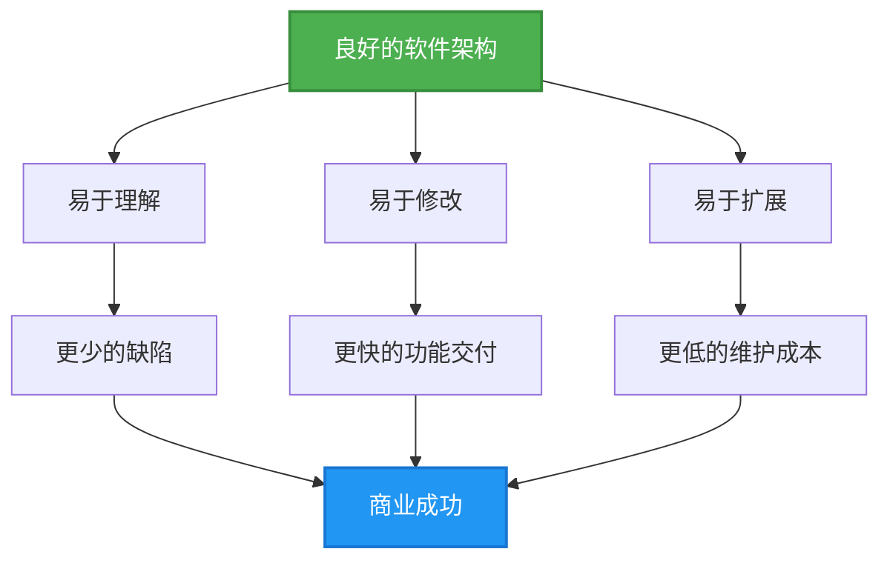
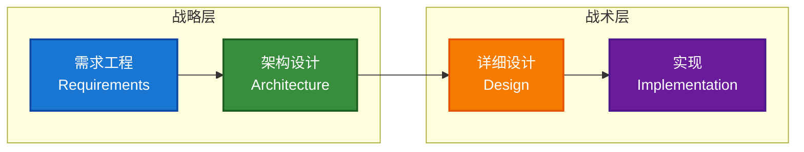
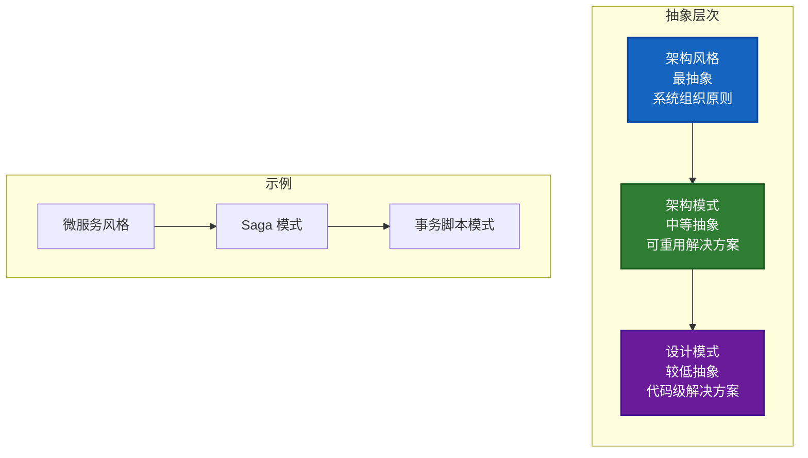
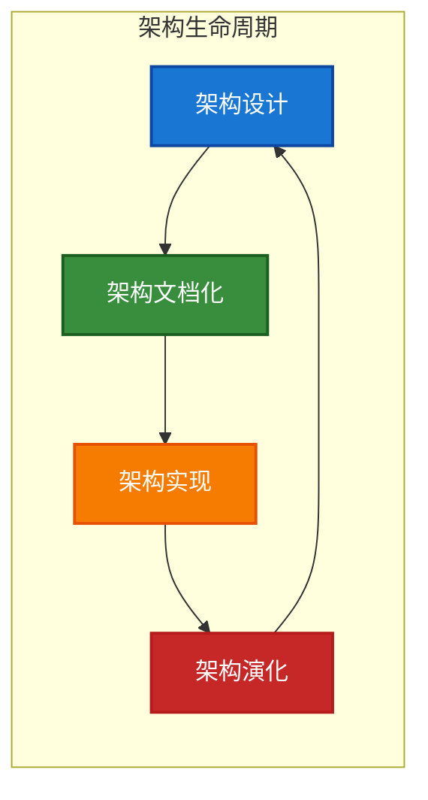
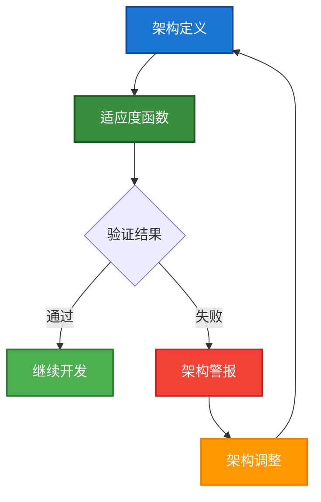

# 第 1 章 - 软件架构概述

---

## 1.1 什么是软件架构

### 1.1.1 核心定义

**软件架构（Software Architecture）** 是用于推理软件系统所需的结构集合，以及创建这些结构和系统的学科。每个结构包含软件元素、元素之间的关系，以及元素和关系的属性。

> **权威来源**：IEEE 1471 / ISO/IEC/IEEE 42010 标准定义

软件架构类似于建筑架构的隐喻，它作为系统和开发项目的**蓝图**，项目管理可据此推断团队和人员需要执行的任务。

### 1.1.2 架构的本质特征

软件架构涉及做出**基础性结构决策**，这些决策一旦实施就很难更改。架构决策包括从软件设计的可能性中选择特定的结构选项。

软件架构中有两条基本定律：

1. **一切皆是权衡（Everything is a trade-off）**
2. **"为什么"比"如何"更重要（"Why is more important than how"）**

### 1.1.3 Ralph Johnson 的经典定义

Martin Fowler 在与面向对象之父之一 Ralph Johnson 的通信后，得出了对软件架构最精辟的理解：

> **"架构就是关于重要的东西。不管那是什么。"**
> 
> *"Architecture is about the important stuff. Whatever that is."*

这个看似简单的定义蕴含深刻的意义：
- 架构思维的核心是**识别什么是重要的**（即什么是架构性的）
- 然后投入精力保持这些架构元素处于良好状态
- 开发者要成为架构师，需要能够识别哪些元素如果不加以控制会导致严重问题

---

## 1.2 为什么架构很重要

### 1.2.1 架构对用户的隐性影响

架构对软件产品的客户和用户来说是一个**难以直接感知**的概念。但糟糕的架构是导致**代码腐化（cruft）** 增长的主要因素。

**代码腐化**：阻碍开发者理解软件的元素。

### 1.2.2 内部质量与交付速度的关系

| 直觉认知 | 架构现实 |
|----------|----------|
| "高质量 = 高成本" | 对架构等内部质量而言，**关系是反转的** |
| 花更多时间做架构 = 更慢交付 | **高内部质量 = 更快的新功能交付** |

原因：
- 架构腐化会阻碍开发者理解软件
- 腐化代码更难修改，导致功能交付更慢、缺陷更多
- 经验丰富的开发者认为：**关注内部质量在数周内（而非数月）就能看到回报**

### 1.2.3 架构的价值体现

---

## 1.3 架构的范围（Scope）

对于软件架构的范围，业界存在不同观点：

| 观点 | 描述 |
|------|------|
| **宏观系统结构** | 架构是软件系统的高层次抽象，由计算组件集合及描述组件间交互的连接器组成 |
| **重要的东西** | 架构师应关注对系统和利益相关者有高影响力的决策 |
| **在环境中理解系统的基础** | 架构是理解系统及其环境所必需的基础 |
| **难以更改的东西** | 架构决策应在生命周期早期就"第一次就做对"，因为后期更改成本高昂 |
| **架构设计决策集合** | 架构不仅是模型或结构，还应包括导致这些结构的决策及其背后的**理由（rationale）** |

> **关键洞察**：架构应包含**架构决策记录（Architecture Decision Records, ADR）**，作为单一事实来源记录决策的技术和商业理由。

---

## 1.4 软件架构 vs 软件设计 vs 需求工程

这三者之间没有明确的分界线，它们共同构成从高层意图到低层细节的**"意图链（chain of intentionality）"**。

### 1.4.1 架构设计与应用设计的区别

| 维度 | 架构设计 | 应用设计 |
|------|----------|----------|
| **焦点** | 设计基础设施 | 设计流程和数据 |
| **目标** | 满足**非功能性需求** | 满足**功能性需求** |
| **内容** | 系统如何被构建和执行 | 系统提供什么功能 |
| **抽象级别** | 高层结构、组件关系 | 具体业务逻辑、算法 |

---

## 1.5 架构风格 vs 架构模式

这两个概念经常被混淆，但存在明确的区别：

### 1.5.1 软件架构风格（Architecture Style）

**定义**：定义系统整体组织的高层次结构组织，指定组件如何组织、如何交互，以及对这些交互的约束。

**特点**：
- 包含组件和连接器类型的词汇表
- 提供解释系统属性的语义模型
- 代表系统组织的**最粗粒度**级别

**常见示例**：
- 分层架构（Layered Architecture）
- 微服务（Microservices）
- 事件驱动架构（Event-Driven Architecture）
- 六边形架构 / 端口和适配器（Hexagonal / Ports and Adapters）
- 微内核架构（Microkernel）
- 管道 - 过滤器架构（Pipes and Filters）
- 面向服务架构（SOA）

### 1.5.2 软件架构模式（Architecture Pattern）

**定义**：在系统级别可重用的、经过验证的解决方案，用于解决重复出现的问题，关注整体结构、组件交互和质量属性。

**特点**：
- 操作抽象级别**高于设计模式**
- 解决更广泛的系统级挑战
- 通常影响系统级关注点

**常见示例**：
- 断路器（Circuit Breaker）
- 模型 - 视图 - 控制器（MVC）
- 发布 - 订阅（Publish-Subscribe）
- 客户端 - 服务器（Client-Server）
- 对等网络（Peer-to-Peer）
- Saga 模式
-  strangler fig 模式（绞杀榕模式）

### 1.5.3 风格与模式的关系

---

## 1.6 架构活动

### 1.6.1 核心架构活动

### 1.6.2 架构文档化的价值

根据《Fundamentals of Software Architecture》一书，架构文档化有三个核心价值：

1. **促进利益相关者之间的沟通**
2. **捕获高层设计的早期决策**
3. **允许在不同项目间重用设计组件**

### 1.6.3 架构设计策略

常见的架构设计策略包括：

| 策略 | 描述 |
|------|------|
| **自顶向下** | 从系统整体开始，逐步细化到组件 |
| **自底向上** | 从现有组件开始，组合成系统 |
| **演进式架构** | 通过迭代逐步演化架构 |
| **基于场景** | 使用场景驱动架构决策 |

---

## 1.7 软件架构的复杂性与适应度函数

### 1.7.1 架构复杂性的自然增长

软件架构倾向于随时间推移变得**更加复杂**。这种复杂性增长是自然的，因为：
- 新功能添加
- 技术债务累积
- 团队规模变化
- 业务需求演进

### 1.7.2 适应度函数（Fitness Functions）

**适应度函数**是一种机制，用于持续验证架构是否符合预期的质量属性。

> **建议**：软件架构师应使用适应度函数持续检查架构状态。

适应度函数的示例：
- 代码依赖关系检查（防止循环依赖）
- 性能基准测试
- 安全扫描
- 架构合规性测试

---

## 1.8 架构决策记录（ADR）

### 1.8.1 什么是 ADR

**架构决策记录（Architecture Decision Record, ADR）** 是记录架构决策及其背景的文档。

### 1.8.2 常见架构反模式

| 反模式 | 描述 | 解决方案 |
|--------|------|----------|
| **决策拖延** | 因害怕选择错误而延迟或避免架构决策 | 与开发团队紧密协作，在"最后责任时刻"做决策 |
| **决策遗忘** | 架构决策被遗忘、未文档化或未被理解，导致重复讨论 | 使用 ADR 记录技术和商业理由，存储在可访问的仓库（如 Wiki） |
| **沟通分散** | 使用邮件沟通架构决策，信息分散 | 创建单一事实来源，邮件只沟通变更上下文并链接到 ADR |

### 1.8.3 ADR 的核心要素

一个完整的 ADR 应包含：
- **决策背景**：为什么需要做这个决策
- **决策选项**：考虑过的各种方案
- **最终决策**：选择的方案
- **技术理由**：技术层面的原因
- **商业理由**：与成本、用户满意度、上市时间相关的价值
- **影响评估**：决策对系统的影响

---

## 1.9 架构与敏捷开发

### 1.9.1 架构在敏捷中的位置

敏捷开发强调快速迭代和响应变化，但这并不意味着可以忽视架构。相反，**良好的架构支持自身的演进**。

### 1.9.2 架构思维的培养

开发者要成为架构师，需要：
1. 识别哪些元素是重要的
2. 理解哪些元素如果不加以控制会导致严重问题
3. 能够平衡短期交付压力和长期架构质量

---

## 1.10 总结

本章介绍了软件架构的核心概念：

| 关键要点 | 说明 |
|----------|------|
| **定义** | 架构是用于推理系统的结构集合 |
| **重要性** | 架构决定长期交付能力和维护成本 |
| **范围** | 架构包含结构、决策及其理由 |
| **风格 vs 模式** | 风格定义组织原则，模式是可重用解决方案 |
| **文档化** | ADR 是记录架构决策的最佳实践 |
| **演进** | 适应度函数帮助持续验证架构质量 |

---

## 参考资料

1. IEEE 1471 / ISO/IEC/IEEE 42010 - 系统与软件工程 - 架构描述标准
2. Martin Fowler, "Software Architecture Guide", martinfowler.com
3. Richards, Mark & Ford, Neal. "Fundamentals of Software Architecture: An Engineering Approach", O'Reilly Media, 2020
4. Software Engineering Institute (SEI), Carnegie Mellon University
5. Simon Brown, "The C4 Model for Software Architecture", c4model.com
6. Wikipedia: Software Architecture, Non-functional Requirement, Software Design
