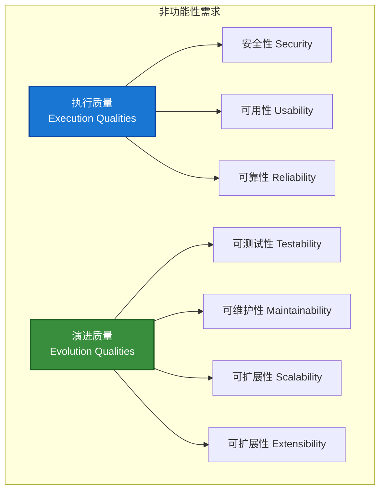
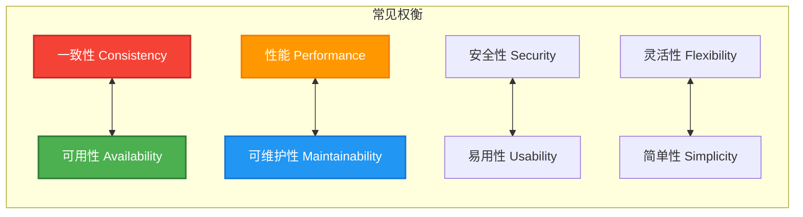
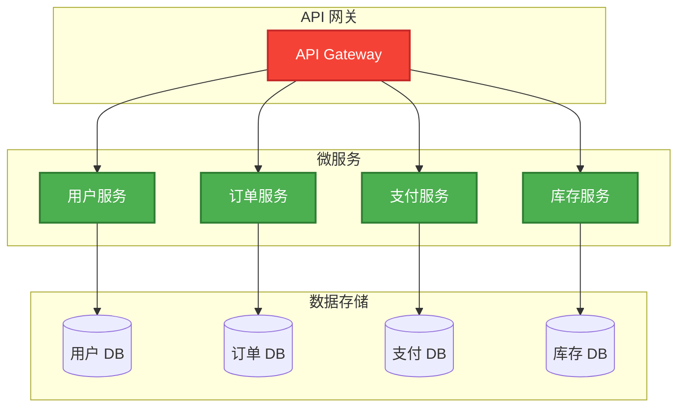
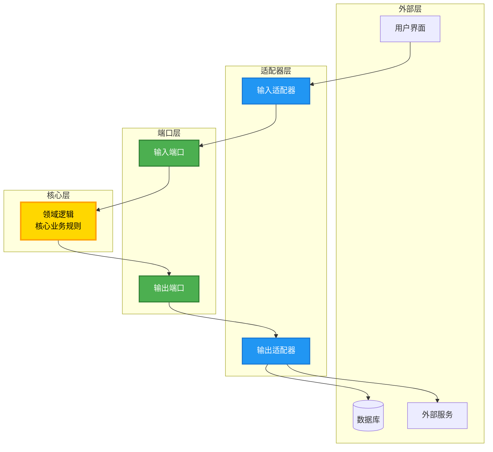
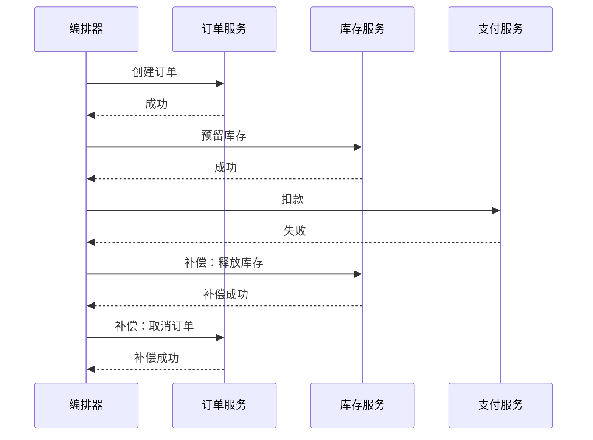
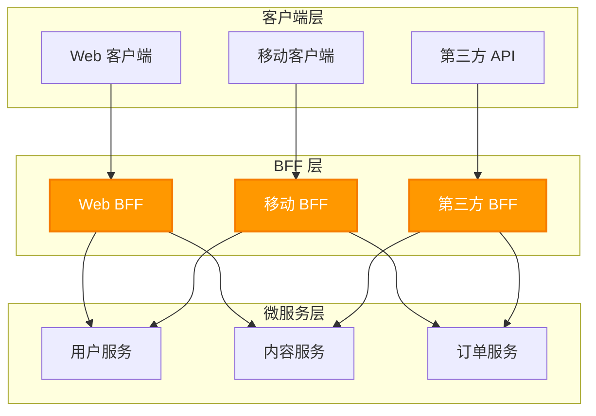
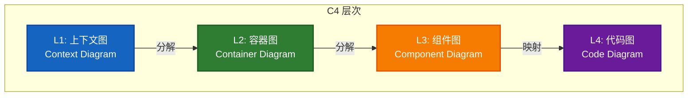
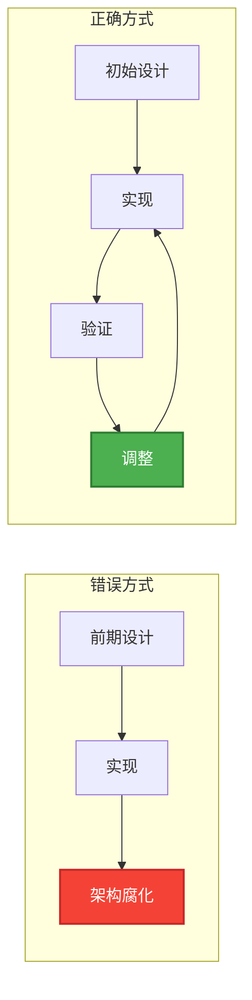
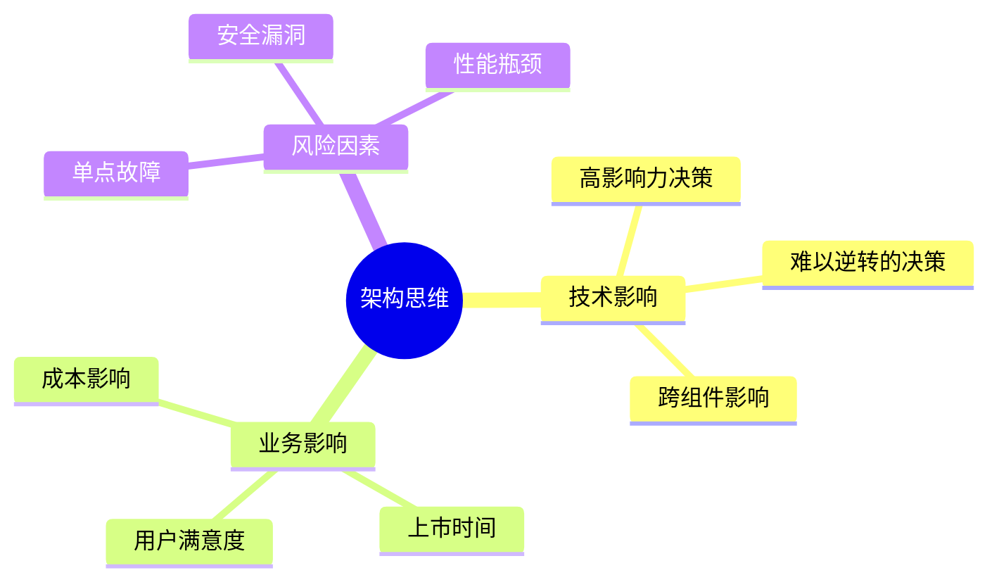

# 第 2 章 - 核心概念详解

---

## 2.1 功能性需求 vs 非功能性需求

### 2.1.1 核心定义

在软件架构中，需求分为两大类：

| 类型 | 定义 | 形式 | 关注点 |
|------|------|------|--------|
| **功能性需求** | 定义系统**做什么** | "系统应做 <需求>" | 具体行为、功能 |
| **非功能性需求** | 定义系统**如何做** | "系统应是 <需求>" | 整体属性、质量 |

> **权威来源**：Wikipedia - Non-functional Requirement / IEEE 标准

### 2.1.2 非功能性需求的本质

**非功能性需求（NFR）** 是用于评判系统运行效果的标准，而非具体行为。它们在软件架构中被称为**"架构特征（Architectural Characteristics）"**。

非功能性需求的其他术语：
- 质量属性（Quality Attributes）
- 质量目标（Quality Goals）
- 服务质量需求（Quality of Service Requirements）
- 约束（Constraints）
- 技术需求（Technical Requirements）
- 非行为需求（Non-behavioral Requirements）

**通俗称呼**："-ilities"（来自 stability、portability 等后缀）

### 2.1.3 非功能性需求的分类



**执行质量**：在运行时可观察的属性，如安全性、可用性、可靠性。

**演进质量**：体现在系统静态结构中的属性，如可测试性、可维护性、可扩展性。

### 2.1.4 实际示例

**场景**：系统需要向用户显示数据库中的记录数量。

| 需求类型 | 示例 |
|----------|------|
| **功能性需求** | "系统应显示数据库记录数量" |
| **非功能性需求** | "数字必须在记录变更后的 **实时** 内更新" |

这个非功能性需求迫使架构师确保系统能够在可接受的时间间隔内显示记录计数。

### 2.1.5 常见的非功能性需求列表

| 类别 | 具体需求 |
|------|----------|
| **性能** | 响应时间、吞吐量、电池寿命、资源消耗 |
| **可靠性** | 可用性、容错性、故障管理、灾难恢复 |
| **可维护性** | 可修改性、可测试性、平均修复时间（MTTR） |
| **安全性** | 隐私合规、漏洞利用防护、审计控制 |
| **可扩展性** | 弹性、容量（当前和预测）、水平/垂直扩展 |
| **互操作性** | 集成能力、数据完整性、协议兼容性 |
| **部署** | 启动时间、平台兼容性、 footprint 优化 |
| **合规性** | 法规遵从、认证、数据保留 |

### 2.1.6 指定 NFR 的最佳实践

> **关键原则**：非功能性需求必须以**具体和可衡量**的方式指定。

❌ **不好的示例**：
- "系统应该快速响应"
- "系统应该是可靠的"

✅ **好的示例**：
- "系统应在 95% 的请求中在 200ms 内响应"
- "系统应保证 99.9% 的可用性（年度停机时间不超过 8.76 小时）"
- "系统应支持每秒 10,000 次并发请求"

---

## 2.2 架构特征的权衡

### 2.2.1 架构第一定律：一切皆是权衡

在软件架构中，**没有免费的午餐**。每个架构决策都涉及权衡：



### 2.2.2 CAP 定理示例

在分布式系统中，CAP 定理指出三者不可兼得：

| 属性 | 描述 | 权衡 |
|------|------|------|
| **一致性（Consistency）** | 所有节点看到相同的数据 | 与可用性权衡 |
| **可用性（Availability）** | 每个请求都得到响应 | 与一致性权衡 |
| **分区容错性（Partition Tolerance）** | 系统在消息丢失时继续运行 | 通常必须接受 |

### 2.2.3 架构第二定律：为什么比如何更重要

> **"Why is more important than how"**

架构决策的**理由**比决策本身更重要：
- 理解"为什么"可以帮助团队在情况变化时做出新的正确决策
- 没有理由的决策会在团队变动时丢失
- 这是 ADR（架构决策记录）的核心价值

---

## 2.3 软件架构风格详解

### 2.3.1 分层架构（Layered Architecture）

**定义**：将系统组织成水平层次，每层有特定职责，上层依赖下层。

```mermaid
flowchart TB
    subgraph 分层架构
        P[表示层<br/>Presentation Layer]
        B[业务逻辑层<br/>Business Logic Layer]
        D[数据访问层<br/>Data Access Layer]
        DB[(数据库)<br/>Database]
    end
    
    P --> B
    B --> D
    D --> DB
    
    style P fill:#1976D2,stroke:#0D47A1,stroke-width:2px,color:#fff
    style B fill:#388E3C,stroke:#1B5E20,stroke-width:2px,color:#fff
    style D fill:#F57C00,stroke:#E65100,stroke-width:2px,color:#fff
    style DB fill:#6A1B9A,stroke:#4A148C,stroke-width:2px,color:#fff
```

**优点**：
- 关注点分离清晰
- 易于理解和维护
- 支持标准的企业应用开发

**缺点**：
- 可能产生"架构下沉"问题（所有代码都经过所有层）
- 性能开销（请求必须穿过所有层）
- 难以独立部署各层

**适用场景**：传统企业应用、需要清晰分离的系统

### 2.3.2 微服务架构（Microservices Architecture）

**定义**：将单一应用开发为一组小型服务，每个服务运行在独立进程中，通过轻量级机制（通常是 HTTP API）通信。



**核心特征**：
- 围绕业务能力构建
- 独立部署
- 去中心化数据管理
- 基础设施自动化

**优点**：
- 独立部署和扩展
- 技术异质性（不同服务可用不同技术栈）
- 故障隔离
- 支持团队自治

**缺点**：
- 分布式系统复杂性
- 数据一致性挑战
- 运维复杂度高
- 网络延迟问题

### 2.3.3 事件驱动架构（Event-Driven Architecture）

**定义**：组件通过生产、检测和消费事件进行通信和协调的架构风格。

```mermaid
flowchart LR
    subgraph 事件生产者
        P1[服务 A]
        P2[服务 B]
    end
    
    subgraph 事件总线
        E[((事件总线<br/>Event Bus))]
    end
    
    subgraph 事件消费者
        C1[服务 C]
        C2[服务 D]
        C3[服务 E]
    end
    
    P1 --> E
    P2 --> E
    E --> C1
    E --> C2
    E --> C3
    
    style P1 fill:#1976D2,stroke:#0D47A1,stroke-width:2px,color:#fff
    style P2 fill:#1976D2,stroke:#0D47A1,stroke-width:2px,color:#fff
    style E fill:#FF9800,stroke:#F57C00,stroke-width:2px,color:#fff
    style C1 fill:#388E3C,stroke:#1B5E20,stroke-width:2px,color:#fff
    style C2 fill:#388E3C,stroke:#1B5E20,stroke-width:2px,color:#fff
    style C3 fill:#388E3C,stroke:#1B5E20,stroke-width:2px,color:#fff
```

**优点**：
- 松耦合
- 高可扩展性
- 支持实时处理
- 易于扩展新功能

**缺点**：
- 调试困难
- 事件流复杂性
- 消息顺序和重复处理

### 2.3.4 六边形架构（Hexagonal / Ports and Adapters）

**定义**：将核心业务逻辑与外部关注点（UI、数据库、第三方服务）隔离的架构风格。



**核心原则**：
- 依赖指向内部（依赖倒置）
- 核心业务逻辑不依赖外部
- 通过端口定义交互契约
- 通过适配器实现具体技术

### 2.3.5 微内核架构（Microkernel / Plugin Architecture）

**定义**：由核心系统（提供基本功能）和插件模块（提供特定功能）组成的架构。

**适用场景**：IDE（如 VS Code、Eclipse）、浏览器扩展、ERP 系统

### 2.3.6 架构风格对比总结

| 风格 | 优点 | 缺点 | 典型场景 |
|------|------|------|----------|
| **分层** | 简单、标准、易理解 | 性能开销、难以独立部署 | 企业应用 |
| **微服务** | 独立部署、可扩展 | 分布式复杂性 | 大型互联网应用 |
| **事件驱动** | 松耦合、实时 | 调试困难 | 流处理、通知系统 |
| **六边形** | 关注点分离、可测试 | 初始复杂度 | 领域驱动设计 |
| **微内核** | 高度可扩展 | 核心设计挑战 | 平台型产品 |

---

## 2.4 软件架构模式详解

### 2.4.1 断路器模式（Circuit Breaker）

**问题**：在分布式系统中，服务调用可能因网络问题或下游服务故障而失败，导致级联故障。

**解决方案**：断路器模式通过三种状态管理服务调用：

```mermaid
stateDiagram-v2
    [*] --> 关闭：正常操作
    
    关闭 --> 打开：连续失败超过阈值
    打开 --> 半开：超时等待后
    半开 --> 关闭：调用成功
    半开 --> 打开：调用失败
    关闭 --> 关闭：调用成功
    打开 --> 打开：请求被拒绝
    
    note right of 关闭：所有请求正常通过
    note right of 打开：所有请求立即失败
    note right of 半开：允许有限请求测试
```

**状态说明**：
- **关闭（Closed）**：正常操作，请求通过
- **打开（Open）**：断路器跳闸，请求立即失败
- **半开（Half-Open）**：允许有限请求测试服务是否恢复

**实现考虑**：
- 失败阈值设置
- 超时时间配置
- 降级策略（fallback）

### 2.4.2 Saga 模式

**问题**：在微服务架构中，如何管理跨多个服务的分布式事务？

**解决方案**：Saga 将长运行事务分解为本地事务序列，每个事务有补偿操作。



**实现模式**：
- **编排（Orchestration）**：中央编排器协调事务
- **编舞（Choreography）**：服务间通过事件协作

### 2.4.3 后端对前端（Backends for Frontends, BFF）

**问题**：不同客户端（Web、移动端）有不同的数据需求，单一 API 难以满足所有需求。

**解决方案**：为每种客户端创建专用的后端服务。



### 2.4.4 其他重要架构模式

| 模式 | 解决的问题 | 核心思想 |
|------|-----------|----------|
| **CQRS** | 读写负载不均衡 | 分离读写模型 |
| **Event Sourcing** | 需要完整审计历史 | 存储事件而非状态 |
| **队列负载平衡** | 突发流量 | 使用队列缓冲请求 |
| **重试模式** | 临时故障 | 自动重试失败操作 |
| **限流模式** | 资源保护 | 限制请求速率 |
| **绞杀榕模式** | 遗留系统迁移 | 逐步替换旧功能 |

---

## 2.5 C4 架构模型

### 2.5.1 什么是 C4 模型

**C4 模型**是一种轻量级的图形化符号技术，用于建模软件系统架构。它基于系统的层次化分解（容器、组件），并依赖 UML 或 ERD 等现有建模技术进行更详细的分解。

**创建者**：Simon Brown（2006-2011）
**基础**：UML 和 4+1 架构视图模型

### 2.5.2 C4 的四个层次



### 2.5.3 各层次详细说明

| 层次 | 名称 | 描述 | 受众 |
|------|------|------|------|
| **L1** | **上下文图** | 显示系统及其与用户和其他系统的关系 | 所有人 |
| **L2** | **容器图** | 将系统分解为相互关联的容器（应用、数据存储） | 技术人员 |
| **L3** | **组件图** | 将容器分解为组件，展示组件间关系 | 架构师、开发者 |
| **L4** | **代码图** | 提供代码级细节（使用 UML、ERD 或 IDE 生成） | 开发者 |

### 2.5.4 C4 元素

| 元素 | 描述 | 示例 |
|------|------|------|
| **人员（Person）** | 系统的用户 | 终端用户、管理员 |
| **软件系统（Software System）** | 顶层系统边界 | 电子商务系统 |
| **容器（Container）** | 应用或数据存储 | Web 应用、移动应用、数据库 |
| **组件（Component）** | 容器内的功能单元 | 控制器、服务、存储库 |
| **关系（Relationship）** | 元素间的交互 | 使用、读取、写入 |

### 2.5.5 C4 模型的优势

- **轻量级**：比 UML 更简单易用
- **层次化**：支持从宏观到微观的渐进式理解
- **敏捷友好**：适合协作式视觉架构设计
- **工具支持**：Structurizr、PlantUML、IcePanel 等

---

## 2.6 架构决策中的常见误区

### 2.6.1 误区一：架构设计是前期一次性活动

❌ **错误认知**：架构在项目开始时设计完成，之后只需实现。

✅ **正确理解**：架构是演进的，需要持续关注和调整。



### 2.6.2 误区二：微服务是银弹

❌ **错误认知**：微服务解决所有架构问题。

✅ **正确理解**：微服务引入分布式系统复杂性，应在必要时使用。

| 考虑因素 | 单体 | 微服务 |
|----------|------|--------|
| **团队规模** | 小团队友好 | 需要多团队协调 |
| **部署复杂度** | 简单 | 需要 DevOps 成熟度 |
| **数据一致性** | ACID 事务 | 最终一致性 |
| **调试** | 简单 | 需要分布式追踪 |

### 2.6.3 误区三：架构文档无用

❌ **错误认知**：代码即文档，不需要架构文档。

✅ **正确理解**：架构文档捕获早期决策，促进沟通，支持重用。

### 2.6.4 误区四：同步通信总是更好

❌ **错误认知**：同步调用简单直接，应优先使用。

✅ **正确理解**：同步通信会纠缠组件，它们必须共享相同的架构特征。

> **重要洞察**：架构组件间的同步通信会导致耦合，这些组件必须共享相同的可用性、延迟等特征。

### 2.6.5 误区五：非功能性需求可以后期添加

❌ **错误认知**：先实现功能，再优化性能/安全。

✅ **正确理解**：非功能性需求是架构特征，必须在设计时考虑。

---

## 2.7 架构师的思维模式

### 2.7.1 识别重要的东西

架构师的核心能力是识别**什么对系统最重要**：



### 2.7.2 最后责任时刻决策

在**最后责任时刻**做决策：
- 有足够的信息来验证决策
- 避免不必要的延迟导致分析瘫痪
- 平衡前期设计和敏捷响应

### 2.7.3 持续架构验证

使用适应度函数持续验证：
- 依赖关系检查
- 性能基准
- 安全扫描
- 架构合规性测试

---

## 2.8 总结

本章详细解释了软件架构的核心概念：

| 概念 | 关键要点 |
|------|----------|
| **NFR** | 定义系统"如何"，分为执行质量和演进质量 |
| **权衡** | 一切皆是权衡，理解为什么比如何更重要 |
| **架构风格** | 定义系统组织原则（分层、微服务、事件驱动等） |
| **架构模式** | 可重用的系统级解决方案（断路器、Saga、BFF 等） |
| **C4 模型** | 四层架构可视化方法（上下文→容器→组件→代码） |
| **常见误区** | 避免架构反模式，持续验证架构质量 |

---

## 参考资料

1. Wikipedia: Non-functional Requirement
2. Wikipedia: List of Software Architecture Styles and Patterns
3. Richards, Mark & Ford, Neal. "Fundamentals of Software Architecture", O'Reilly, 2020
4. Simon Brown. "The C4 Model for Software Architecture", c4model.com
5. Martin Fowler. "Software Architecture Guide", martinfowler.com
6. Microsoft. "Azure Application Architecture Fundamentals", learn.microsoft.com
