# 第 3 章 - 架构风格与模式

> **本章目标**：深入理解软件架构风格与模式的核心概念，掌握常见架构风格的结构特征、适用场景、优缺点及最佳实践

---

## 3.1 架构风格 vs 架构模式

### 3.1.1 概念定义

**架构风格（Architecture Style）** 和**架构模式（Architecture Pattern）** 是两个相关但有区别的概念：

| 维度 | 架构风格 | 架构模式 |
|------|----------|----------|
| **抽象层级** | 最高层结构组织 | 系统级 reusable 解决方案 |
| **关注点** | 整体系统组织方式和组件交互约束 | 特定 recurring 问题的通用解决方案 |
| **约束范围** | 定义组件类型、连接器和语义模型 | 解决具体设计挑战，可在多种风格中使用 |
| **示例** | 微服务、分层架构、事件驱动 | Circuit Breaker、发布 - 订阅、MVC |

**来源验证**：
- Wikipedia：架构风格是"高粒度系统组织的结构组织，定义组件如何组织、如何交互及约束"
- O'Reilly《Fundamentals of Software Architecture》：架构模式是"系统级的可复用解决方案，解决整体结构和质量属性相关的关注点"
- Microsoft Azure Architecture Center：架构风格是"共享特定特征的架构家族"

### 3.1.2 核心区别

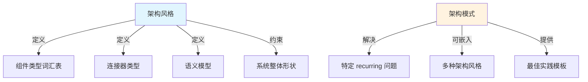

**关键理解**：
- 架构风格像"建筑风格"（如哥特式、现代主义），定义整体特征
- 架构模式像"建筑元素"（如拱门、飞扶壁），可在多种风格中复用

---

## 3.2 主要架构风格详解

### 3.2.1 N 层架构（N-tier Architecture）

#### 结构图

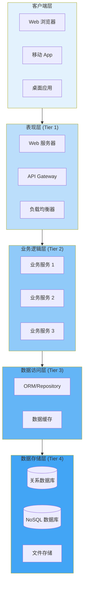

#### 工作原理

N 层架构将应用程序划分为**逻辑层（layers）**和**物理层（tiers）**：
- **逻辑层**：代码组织方式（如表现层、业务层、数据层）
- **物理层**：实际部署单元，可独立扩展

**核心特征**：
1. **水平分层**：每层有明确职责，只能调用下层
2. **依赖单向**：上层依赖下层，下层不知道上层
3. **层间通信**：通常使用同步调用（如 HTTP、RPC）

#### 适用场景

| ✅ 推荐场景 | ❌ 不推荐场景 |
|-------------|---------------|
| 传统企业应用迁移到云 | 需要频繁迭代和快速创新的领域 |
| 更新频率较低的业务系统 | 复杂度高且需要团队独立开发的系统 |
| 混合环境（本地 + 云） | 需要高可扩展性的互联网应用 |
| 团队结构按技术栈划分 | 需要独立部署和扩展各组件的系统 |

#### 优缺点分析

| 优点 | 缺点 |
|------|------|
| ✅ 结构清晰，易于理解 | ❌ 水平分层导致变更影响多个层级 |
| ✅ 职责分离明确 | ❌ 难以独立扩展单层 |
| ✅ 适合遗留系统迁移 | ❌ 容易形成"单体应用" |
| ✅ 开发工具成熟 | ❌ 敏捷性受限，发布周期长 |

#### 最佳实践

1. **明确层边界**：使用接口定义层间通信契约
2. **避免跨层调用**：严格遵循"只能调用直接下层"原则
3. **合理定义层数**：常见为 3 层（表现 - 业务 - 数据），避免过度分层
4. **数据缓存策略**：在业务层和数据层之间引入缓存减少数据库压力

---

### 3.2.2 微服务架构（Microservices Architecture）

#### 结构图

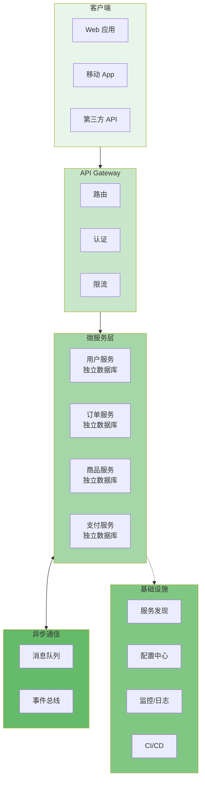

#### 核心定义

> "微服务架构是一种将单一应用程序开发为**一组小型服务**的方法，每个服务运行在**独立进程**中，通过**轻量级机制**（通常是 HTTP API）通信。这些服务围绕**业务能力**构建，可**独立部署**，使用**最少量的集中式管理**。"  
> — James Lewis & Martin Fowler (2014)

#### 九大核心特征

| 特征 | 说明 |
|------|------|
| **组件化通过服务** | 服务作为独立部署单元，进程间通信 |
| **围绕业务能力组织** | 服务按业务领域划分（用户、订单、支付） |
| **产品而非项目** | 团队对服务全生命周期负责 |
| **智能端点，哑管道** | 业务逻辑在服务内，消息队列只负责传输 |
| **去中心化治理** | 各服务可选择不同技术栈 |
| **去中心化数据管理** | 每个服务有自己的数据库，不共享数据 |
| **基础设施自动化** | CI/CD、容器化、编排平台 |
| **为失败设计** | 熔断器、降级、限流等容错机制 |
| **演进式设计** | 服务可独立演进，支持重构 |

#### 适用场景

| ✅ 推荐场景 | ❌ 不推荐场景 |
|-------------|---------------|
| 复杂业务领域需要多团队并行开发 | 简单业务 domain |
| 需要高发布频率（每天多次） | 团队缺乏 DevOps 经验 |
| 需要技术栈多样性 | 资源有限的小团队 |
| 需要独立扩展特定功能 | 对分布式事务强一致性要求高 |

#### 优缺点分析

| 优点 | 缺点 |
|------|------|
| ✅ 强模块边界，团队独立 | ❌ 分布式系统复杂性高 |
| ✅ 独立部署，发布风险低 | ❌ 网络延迟和失败处理复杂 |
| ✅ 技术栈多样性 | ❌ 最终一致性带来数据挑战 |
| ✅ 可扩展性强 | ❌ 运维复杂度高（需要成熟 DevOps） |
| ✅ 故障隔离 | ❌ 测试复杂度增加 |

#### 微服务权衡分析框架

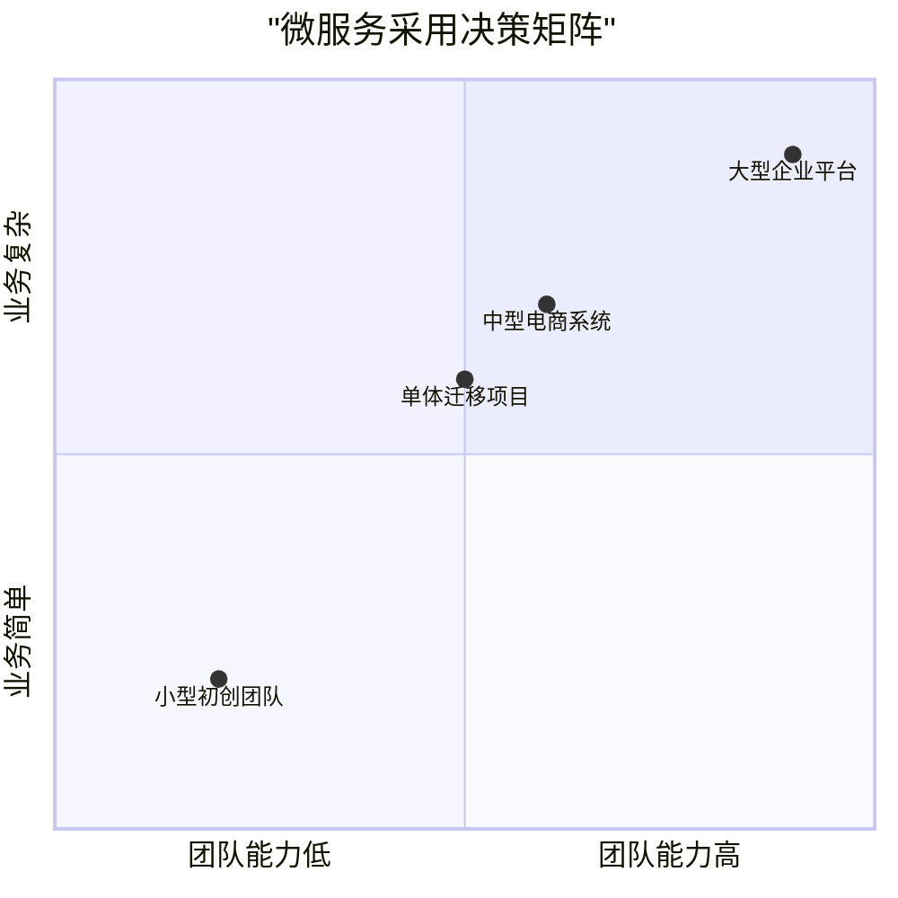

#### 最佳实践

1. **单体优先（Monolith First）**：新系统建议从结构良好的单体开始，随业务增长拆分
2. **围绕业务能力拆分**：按业务领域而非技术层划分服务边界
3. **数据库隔离**：每个服务拥有独立数据库，禁止共享表
4. **API 版本化**：设计向后兼容的 API，支持渐进式升级
5. **建设基础设施**：先建立完善的监控、日志、CI/CD 体系

---

### 3.2.3 事件驱动架构（Event-Driven Architecture, EDA）

#### 结构图

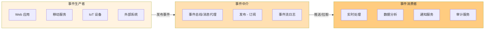

#### 工作原理

事件驱动架构使用**发布 - 订阅模型**：
- **事件生产者**：生成事件流，不知道消费者是谁
- **事件消费者**：订阅感兴趣的事件类型，异步处理
- **事件通道**：解耦生产者和消费者，提供可靠传递

**两种主要模式**：

| 模式 | 特点 | 适用场景 |
|------|------|----------|
| **发布 - 订阅** | 事件不持久化，新订阅者看不到历史事件 | 实时通知、状态同步 |
| **事件流** | 事件写入持久化日志，消费者可随时加入并重放 | 审计、数据管道、恢复场景 |

#### 事件拓扑结构

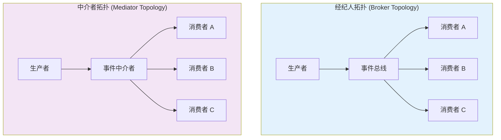

| 拓扑 | 优点 | 缺点 |
|------|------|------|
| **经纪人拓扑** | 高度解耦、动态扩展、无单点故障 | 难以追踪业务事务、数据一致性风险 |
| **中介者拓扑** | 更好的错误处理、可控的数据流 | 中介者可能成为瓶颈、耦合度增加 |

#### 适用场景

| ✅ 推荐场景 | ❌ 不推荐场景 |
|-------------|---------------|
| 多子系统需要处理相同事件 | 简单请求 - 响应工作流 |
| 实时处理要求最低延迟 | 需要强一致性的业务事务 |
| IoT 高吞吐量数据场景 | 团队缺乏异步系统经验 |
| 需要解耦生产者和消费者 | 调试和监控能力不足 |

#### 优缺点分析

| 优点 | 缺点/挑战 |
|------|----------|
| ✅ 生产者和消费者完全解耦 | ❌ 最终一致性（数据不是立即可用） |
| ✅ 可独立扩展 | ❌ 事件顺序和精确一次处理困难 |
| ✅ 高响应性（近实时处理） | ❌ 错误处理复杂 |
| ✅ 支持复杂事件处理（模式匹配） | ❌ 跨服务可观测性困难 |

#### 事件 payload 设计策略

| 策略 | 说明 | 权衡 |
|------|------|------|
| **包含所有属性** | 事件携带完整数据 | ✅ 消费者无需额外查询 ❌ payload 大、数据一致性问题 |
| **只包含键（Keys Only）** | 事件只携带 ID，消费者自己查询 | ✅ 数据一致性好 ❌ 性能开销大 |

#### 最佳实践

1. **事件命名规范化**：使用过去时态（如 `OrderCreated`）表示已发生的事实
2. **包含 Correlation ID**：追踪跨服务的业务事务
3. **设计 Schema 演进**：向后兼容，消费者能处理未知版本
4. **实现幂等处理**：消费者能安全处理重复事件
5. **建立死信队列**：处理无法消费的事件

---

### 3.2.4 Web-Queue-Worker 架构

#### 结构图

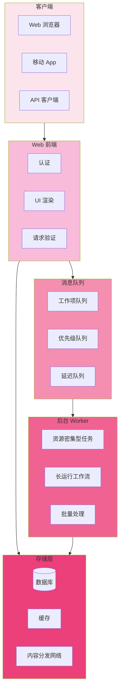

#### 工作原理

Web-Queue-Worker 架构包含三个核心组件：
1. **Web 前端**：处理 HTTP 请求和用户交互
2. **消息队列**：异步缓冲工作项
3. **后台 Worker**：独立处理资源密集型任务

**通信流程**：
1. 用户请求到达 Web 前端
2. Web 前端将耗时任务放入队列
3. Worker 异步从队列拉取并处理
4. 结果写入存储或通过通知返回用户

#### 适用场景

| ✅ 推荐场景 | ❌ 不推荐场景 |
|-------------|---------------|
| 有资源密集型处理需求 | 需要实时响应的场景 |
| 简单业务 domain | 高度复杂的业务逻辑 |
| 需要解耦前端和后台 | 需要频繁双向通信 |
| 批处理和后台任务 | 状态管理复杂的场景 |

#### 优缺点分析

| 优点 | 缺点 |
|------|------|
| ✅ 简单易理解和部署 | ❌ 不加控制会变成"大泥球" |
| ✅ 前端和 Worker 可独立扩展 | ❌ 不适合复杂业务逻辑 |
| ✅ 异步处理提升响应速度 | ❌ 调试和追踪复杂 |
| ✅ 天然支持背压（队列缓冲） | ❌ 需要额外的监控机制 |

#### 最佳实践

1. **队列类型选择**：
   - 标准队列：高吞吐量、至少一次投递
   - 优先级队列：区分任务优先级
   - 延迟队列：定时任务

2. **Worker 设计**：
   - 无状态设计，易于水平扩展
   - 实现优雅关闭（处理完当前任务再退出）
   - 配置合理的并发度

3. **错误处理**：
   - 设置消息可见性超时
   - 配置最大重试次数
   - 使用死信队列处理失败消息

---

### 3.2.5 其他常见架构风格

#### 管道 - 过滤器（Pipes and Filters）

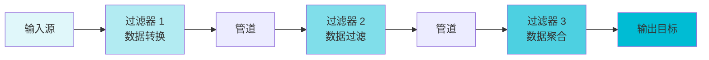

**特点**：
- 每个过滤器独立处理数据并传递给下一个
- 支持并行执行和复用
- 适用于：数据处理管道、编译器、ETL 流程

#### 六边形架构（Hexagonal / Ports and Adapters）

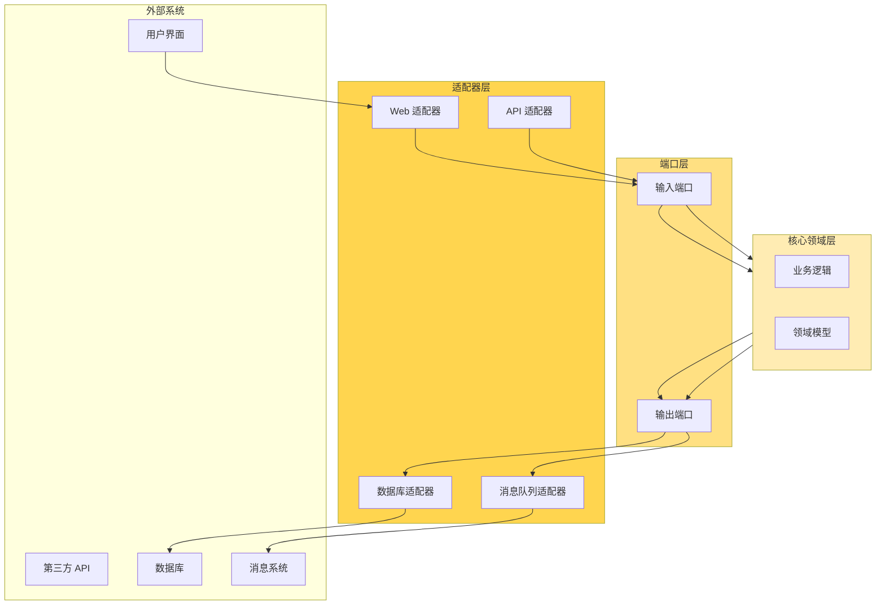

**特点**：
- 核心业务逻辑不依赖外部系统
- 通过端口定义交互契约
- 适配器实现具体技术细节
- 适用于：需要高度可测试性和可维护性的系统

#### 空间架构（Space-Based Architecture）

**核心概念**：
- 数据存储在内存空间（Tuple Space）中
- 处理单元无状态，按需读取数据
- 支持极高并发和弹性扩展

**适用场景**：高并发 Web 应用、需要弹性伸缩的系统

---

## 3.3 架构风格对比总结

### 3.3.1 依赖管理对比

| 架构风格 | 依赖管理方式 | 领域类型 |
|----------|-------------|----------|
| **N 层架构** | 水平分层，按子网划分 | 传统业务 domain，更新频率低 |
| **Web-Queue-Worker** | 前端和后台作业通过异步消息解耦 | 相对简单 domain，有资源密集型任务 |
| **微服务** | 垂直（功能）拆分，通过 API 调用 | 复杂 domain，频繁更新 |
| **事件驱动** | 生产者/消费者独立视图 | IoT、实时系统 |
| **大数据** | 大数据集分块，本地并行处理 | 批处理和实时分析，ML 预测 |
| **大计算** | 数据分配到数千核心 | 计算密集型 domain（如仿真） |

### 3.3.2 选择决策框架

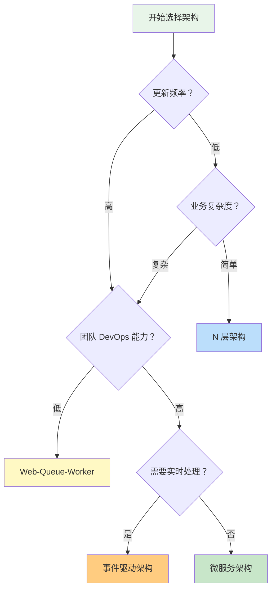

### 3.3.3 常见误区

| 误区 | 正确理解 |
|------|----------|
| ❌ "微服务总是优于单体" | ✅ 微服务有成本，简单场景单体更合适 |
| ❌ "架构风格必须纯粹" | ✅ 可以混合使用（如微服务 + 事件驱动） |
| ❌ "架构决定一切" | ✅ 架构是手段，业务需求才是核心 |
| ❌ "一次选择永不改变" | ✅ 架构应随业务演进，适时重构 |
| ❌ "事件驱动解决所有解耦问题" | ✅ EDA 引入最终一致性，不适合强一致场景 |

---

## 3.4 实践建议

### 3.4.1 架构选型流程

1. **理解业务需求**：识别关键业务驱动因素和非功能需求
2. **评估团队能力**：DevOps 成熟度、分布式系统经验
3. **分析约束条件**：预算、时间、技术栈限制
4. **定义成功标准**：可维护性、可扩展性、发布频率
5. **选择合适风格**：基于以上分析选择最匹配的架构
6. **持续验证调整**：通过适配度函数验证架构有效性

### 3.4.2 混合架构示例

现代系统通常**组合多种架构风格**：

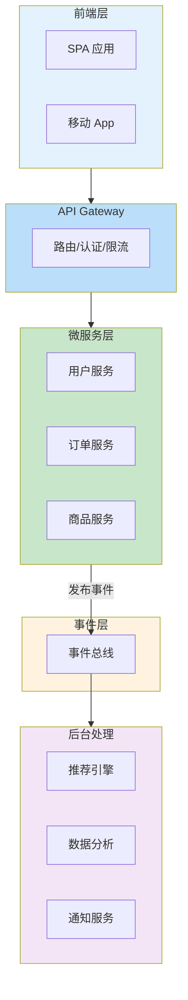

此架构结合了：
- **微服务**：核心业务逻辑拆分
- **事件驱动**：异步通信和解耦
- **Web-Queue-Worker**：后台批量处理

---

## 来源引用

1. **Microsoft Azure Architecture Center** - Architecture Styles
   - https://learn.microsoft.com/en-us/azure/architecture/guide/architecture-styles/

2. **Wikipedia** - Software architecture styles and patterns
   - https://en.wikipedia.org/wiki/List_of_software_architecture_styles_and_patterns

3. **Martin Fowler** - Microservices
   - https://martinfowler.com/articles/microservices.html

4. **Martin Fowler** - Microservices Guide
   - https://martinfowler.com/microservices/

5. **SEI (Software Engineering Institute)** - Software Architecture
   - https://sei.cmu.edu/software-architecture/

6. **Fundamentals of Software Architecture: An Engineering Approach** (O'Reilly, 2020)

---

*文档版本：1.0*  
*最后更新：2026-04-08*
