# 第 4 章 - 架构设计原则

> **本章目标**：掌握软件架构设计的核心原则和权衡分析方法，理解架构决策的本质和时机

---

## 4.1 两大基本法则

### 4.1.1 Everything is a Trade-off（一切皆权衡）

#### 核心定义

> **软件架构中没有银弹**——每个设计决策都是在多个相互竞争的目标之间进行权衡。

这是软件架构的**第一法则**，意味着：
- 没有"最佳"架构，只有"最适合"特定场景的架构
- 每个选择都有收益（benefit）和成本（cost）
- 优秀架构师的标志是能够清晰阐述权衡理由

#### 常见权衡维度

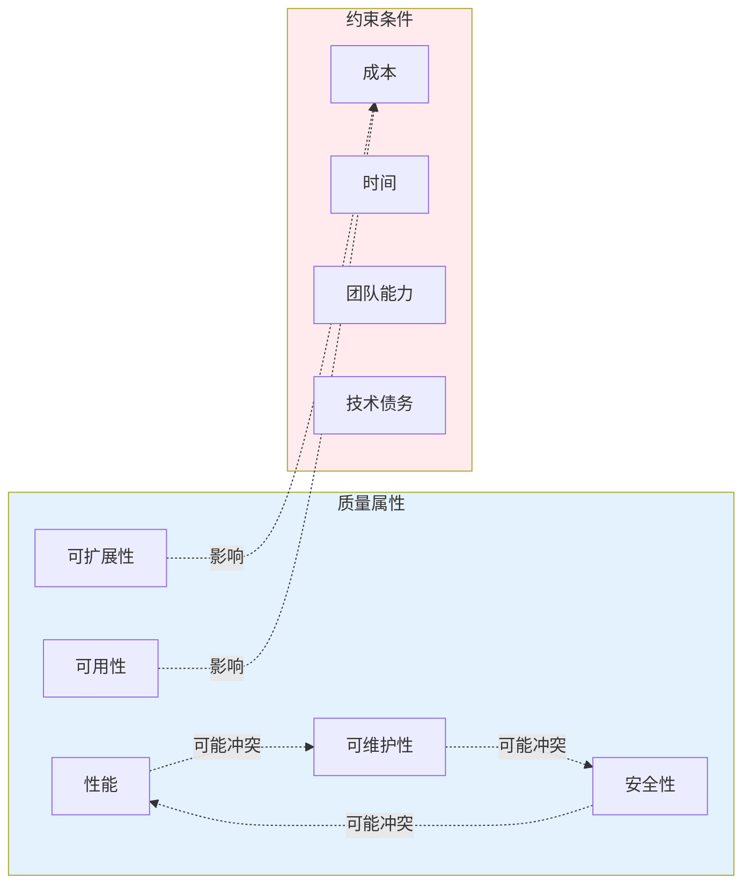

#### 实际案例分析

**案例 1：缓存策略的权衡**

| 决策 | 收益 | 成本 |
|------|------|------|
| 引入分布式缓存 | ✅ 读性能提升 10-100 倍<br>✅ 数据库负载降低 | ❌ 数据一致性问题（缓存过期）<br>❌ 系统复杂度增加<br>❌ 需要处理缓存穿透/击穿 |

**架构分析**：
- **权衡本质**：用一致性换取性能
- **适用场景**：读多写少、可容忍短暂不一致（如商品详情、用户资料）
- **不适用场景**：强一致性要求（如账户余额、库存扣减）

**案例 2：微服务拆分的权衡**

| 决策 | 收益 | 成本 |
|------|------|------|
| 将单体拆分为微服务 | ✅ 团队独立开发部署<br>✅ 技术栈多样性<br>✅ 故障隔离 | ❌ 分布式系统复杂度<br>❌ 网络延迟增加<br>❌ 运维成本上升<br>❌ 数据一致性挑战 |

**架构分析**：
- **权衡本质**：用运维复杂度换取组织敏捷性
- **Conway 定律**：系统结构反映组织沟通结构
- **决策框架**：只有当团队规模和组织结构需要时才拆分

**案例 3：数据库选型的权衡**

| 选择 | 收益 | 成本 |
|------|------|------|
| 关系型数据库 (SQL) | ✅ ACID 事务保证<br>✅ 复杂查询能力强<br>✅ 工具生态成熟 | ❌ 水平扩展困难<br>❌ Schema 变更成本高 |
| NoSQL 数据库 | ✅ 水平扩展容易<br>✅ Schema 灵活<br>✅ 高吞吐量 | ❌ 无标准事务<br>❌ 查询能力受限<br>❌ 最终一致性 |

#### 权衡分析框架

使用以下框架系统化分析权衡：

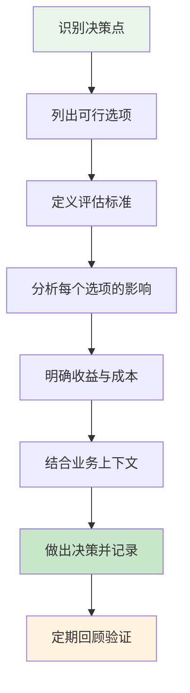

**评估标准示例**：
- 性能（延迟、吞吐量）
- 可用性（SLA 目标）
- 可维护性（代码复杂度、文档质量）
- 可扩展性（水平/垂直）
- 安全性（威胁模型）
- 成本（开发、运维、基础设施）
- 团队能力匹配度

---

### 4.1.2 Why > How（为什么比怎么做更重要）

#### 核心定义

> **架构决策的核心是理解"为什么选择这个方案"，而非"如何实现这个方案"。**

这一原则强调：
- **意图优先**：先明确目标和约束，再选择方案
- **背景理解**：理解决策产生的上下文比记住决策本身更重要
- **避免盲目跟从**：不复制"最佳实践"，而是理解其适用条件

#### 为什么这个原则重要

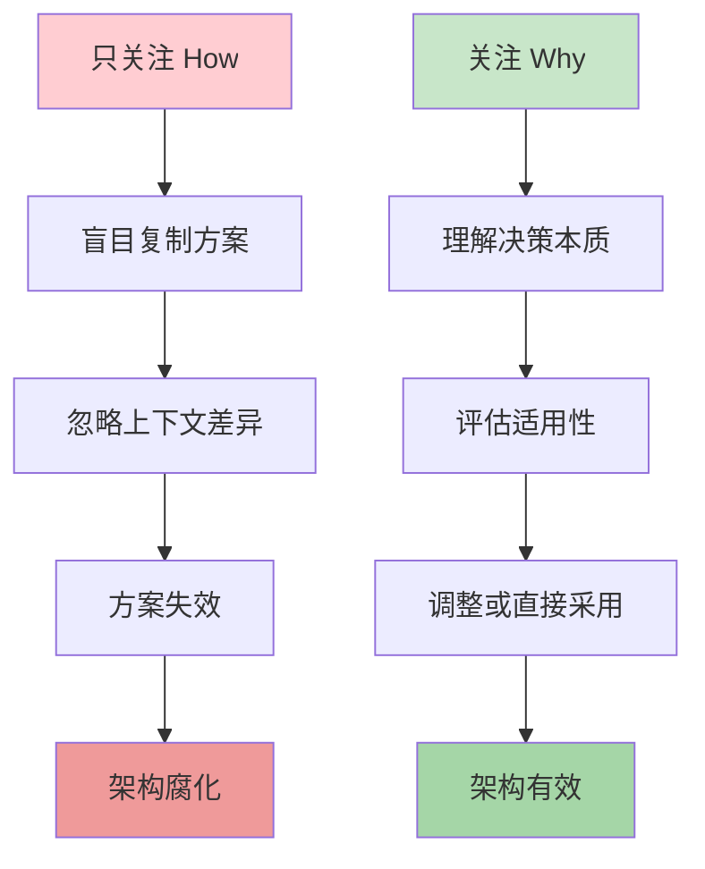

#### 实际案例分析

**案例：选择消息队列**

| 问题层次 | 错误方式 | 正确方式 |
|----------|----------|----------|
| **What** | "我们需要 Kafka" | "我们需要一个消息系统" |
| **How** | "部署 Kafka 集群，配置 3 副本" | "评估 Kafka、RabbitMQ、Pulsar 的差异" |
| **Why** | （缺失） | "我们需要高吞吐量事件流，支持重放和持久化" |

**决策分析框架**：

```
需求分析（Why）：
├── 吞吐量要求：10 万条/秒
├── 持久化需求：需要保留 7 天历史数据
├── 消费模式：多消费者独立消费同一事件流
├── 延迟容忍：秒级可接受
└── 团队能力：有运维 Kafka 经验

方案评估（How）：
├── Kafka：✅ 高吞吐 ✅ 持久化 ✅ 支持重放 ❌ 运维复杂
├── RabbitMQ：✅ 简单 ❌ 吞吐有限 ❌ 不支持重放
└── 结论：Kafka 最合适

决策记录（ADR）：
- 决策：采用 Apache Kafka 作为事件流平台
- 理由：满足吞吐量和持久化需求，支持事件重放
- 权衡：接受运维复杂度换取功能匹配
```

#### "Why > How"实践清单

在架构评审中，确保回答以下问题：

- [ ] **业务目标**：这个架构决策支持什么业务目标？
- [ ] **约束条件**：有哪些技术/业务/组织约束？
- [ ] **替代方案**：考虑过哪些其他方案？为什么排除？
- [ ] **假设前提**：决策依赖哪些假设？假设失效会怎样？
- [ ] **验证方式**：如何验证这个决策是正确的？

---

## 4.2 架构设计核心原则

### 4.2.1 自愈合设计（Design for Self-Healing）

#### 核心原理

> 在分布式系统中，**故障是必然的**而非偶然的。架构必须能够检测故障、响应并自动恢复。

#### 关键模式

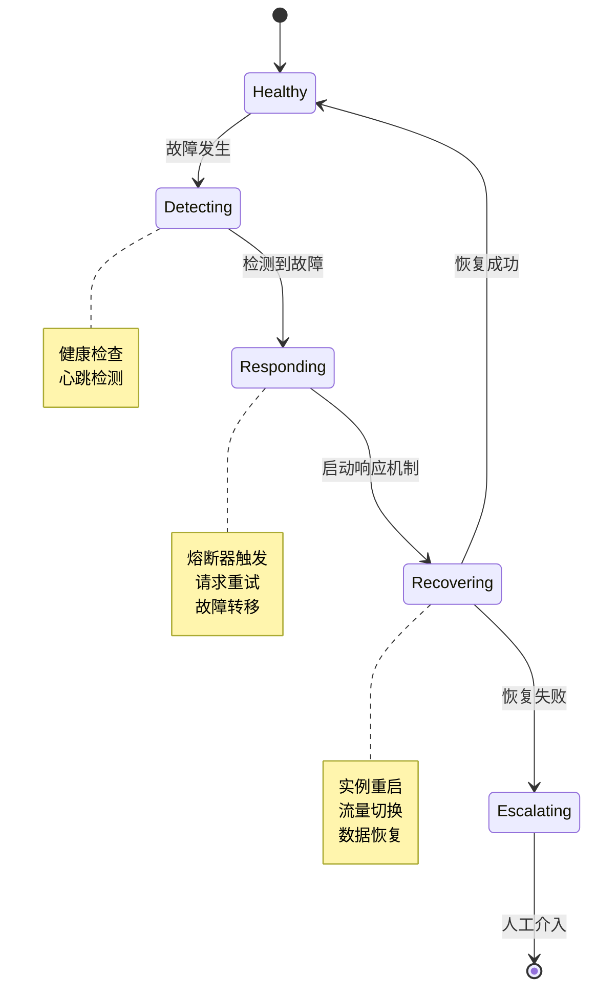

**核心模式详解**：

| 模式 | 原理 | 实现方式 |
|------|------|----------|
| **熔断器（Circuit Breaker）** | 防止级联故障 | 失败次数超阈值时断开连接，定期尝试恢复 |
| **重试（Retry）** | 处理瞬时故障 | 带退避策略的重试（指数退避） |
| **舱壁（Bulkhead）** | 隔离故障影响 | 资源池隔离，防止单点故障扩散 |
| **降级（Fallback）** | 保证核心功能 | 返回缓存数据或默认值 |

#### 实践案例

**熔断器实现（伪代码）**：

```javascript
class CircuitBreaker {
  constructor(threshold, timeout) {
    this.failureThreshold = threshold;  // 失败阈值
    this.resetTimeout = timeout;        // 重置超时
    this.state = 'CLOSED';              // CLOSED/OPEN/HALF_OPEN
    this.failures = 0;
  }
  
  async execute(operation) {
    if (this.state === 'OPEN') {
      if (Date.now() > this.nextRetry) {
        this.state = 'HALF_OPEN';  // 尝试恢复
      } else {
        throw new Error('Circuit is OPEN');
      }
    }
    
    try {
      const result = await operation();
      this.onSuccess();
      return result;
    } catch (error) {
      this.onFailure();
      throw error;
    }
  }
  
  onSuccess() {
    this.failures = 0;
    this.state = 'CLOSED';
  }
  
  onFailure() {
    this.failures++;
    if (this.failures >= this.failureThreshold) {
      this.state = 'OPEN';
      this.nextRetry = Date.now() + this.resetTimeout;
    }
  }
}
```

---

### 4.2.2 冗余设计（Make All Things Redundant）

#### 核心原理

> **消除单点故障（SPOF）**——任何关键组件都必须有备份。

#### 冗余层级

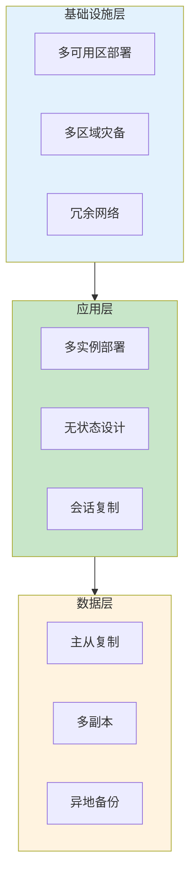

#### 冗余策略权衡

| 策略 | 优点 | 缺点 | 适用场景 |
|------|------|------|----------|
| **主动 - 主动** | 零故障转移时间<br>资源充分利用 | 数据一致性复杂<br>成本高 | 高可用性要求（99.99%+） |
| **主动 - 被动** | 实现简单<br>数据一致性容易 | 故障转移有延迟<br>资源闲置 | 一般可用性要求（99.9%） |
| **多区域部署** | 抗区域级故障<br>低延迟就近访问 | 成本极高<br>运维复杂 | 全球业务、灾难恢复 |

---

### 4.2.3 最小化协调（Minimize Coordination）

#### 核心原理

> **协调是扩展性的敌人**——组件间的同步和依赖限制了系统的可扩展性。

#### 协调成本分析

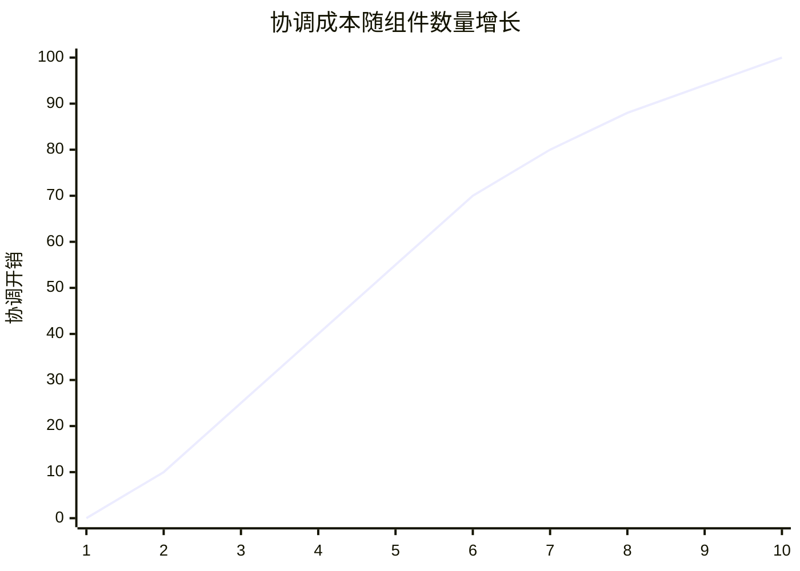

**核心问题**：n 个组件间的双向协调复杂度为 O(n²)

#### 减少协调的策略

| 策略 | 说明 | 示例 |
|------|------|------|
| **异步通信** | 用消息队列替代同步调用 | 事件驱动架构 |
| **最终一致性** | 接受短暂不一致换取可用性 | CQRS、事件溯源 |
| **领域边界** | 按业务领域划分，减少跨域依赖 | 领域驱动设计 |
| **幂等设计** | 允许重复处理，减少协调确认 | 重试无需特殊处理 |

#### 案例：电商订单系统

**高协调方案（不推荐）**：
```
用户下单 → 锁定库存 → 扣减余额 → 创建订单 → 通知物流
         ↑________同步阻塞_________↑
```
- 问题：所有步骤同步执行，任一失败导致整个事务回滚
- 扩展性：无法独立扩展各组件

**低协调方案（推荐）**：
```
用户下单 → 创建订单 (pending) → 返回成功
              ↓
        [异步事件流]
              ↓
    库存扣减 ←→ 余额扣减 ←→ 物流通知
```
- 优势：快速响应用户，后台异步处理
- 权衡：需要处理最终一致性和补偿事务

---

### 4.2.4 水平扩展设计（Design to Scale Out）

#### 核心原理

> **优先水平扩展（加机器）而非垂直扩展（升级机器）**——成本更低、弹性更好。

#### 扩展策略对比

| 维度 | 垂直扩展（Scale Up） | 水平扩展（Scale Out） |
|------|---------------------|----------------------|
| **方式** | 增加 CPU/内存 | 增加实例数量 |
| **成本** | 指数增长 | 线性增长 |
| **上限** | 硬件限制 | 理论上无限 |
| **弹性** | 慢（需停机） | 快（自动扩缩容） |
| **复杂度** | 低 | 高（需处理分布式） |

#### 水平扩展设计要点


**关键实践**：
1. **无状态服务**：实例不保存会话状态
2. **会话存储外置**：使用 Redis 等集中存储
3. **避免亲和性**：不依赖特定实例（sticky session 是反模式）
4. **识别瓶颈**：找到无法水平扩展的组件并优化

---

### 4.2.5 分区设计（Partition Around Limits）

#### 核心原理

> **所有系统都有极限**——通过分区（Sharding/Partitioning）突破单节点限制。

#### 分区策略

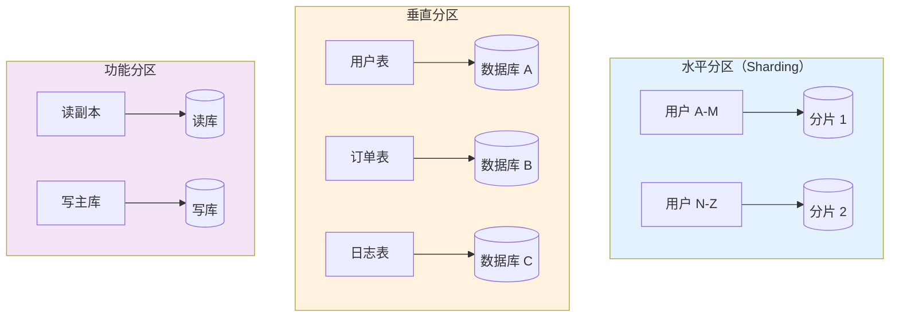

#### 分区键设计原则

| 原则 | 说明 | 反面案例 |
|------|------|----------|
| **均匀分布** | 避免热点分片 | 按时间分区导致最新分片过热 |
| **稳定性** | 分区键不频繁变更 | 按订单状态分区（状态会变） |
| **业务相关** | 支持常见查询模式 | 随机分区导致跨分片查询 |

---

### 4.2.6 演进式设计（Design for Evolution）

#### 核心原理

> **变化是唯一的不变**——架构必须支持持续演进，而非一次性设计。

#### 演进策略

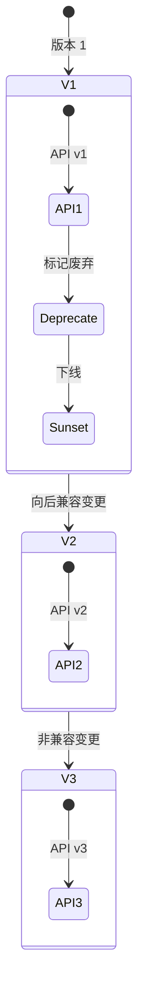

**关键实践**：
1. **向后兼容**：新版本的输入能被旧版本接受
2. **API 版本化**：在 URL/Header 中包含版本号
3. **废弃策略**：提前通知，给迁移时间
4. **扩展点设计**：预留扩展接口（Plugin 架构）

---

### 4.2.7 业务导向设计（Build for Business Needs）

#### 核心原理

> **架构是服务业务的手段，而非目的**——所有技术决策必须对齐业务目标。

#### 从业务到架构的映射

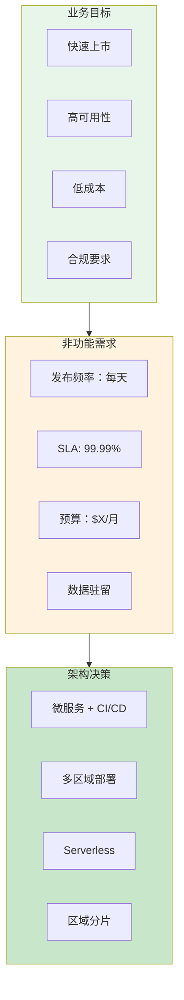

#### SLA/SLO/SLI 框架

| 概念 | 定义 | 示例 |
|------|------|------|
| **SLI（指标）** | 衡量系统行为的量化指标 | 请求延迟、错误率 |
| **SLO（目标）** | SLI 的目标值 | 99% 请求<100ms |
| **SLA（协议）** | 违反 SLO 的后果 | 赔偿条款 |

---

## 4.3 其他关键设计原则

### 4.3.1 SOLID 原则（面向对象设计）

| 原则 | 含义 | 应用场景 |
|------|------|----------|
| **SRP** 单一职责 | 一个类只有一个变化理由 | 模块划分、类设计 |
| **OCP** 开闭原则 | 对扩展开放，对修改关闭 | 插件架构、策略模式 |
| **LSP** 里氏替换 | 子类可替换父类不破坏程序 | 继承设计、多态 |
| **ISP** 接口隔离 | 客户端不应依赖不需要的接口 | API 设计、微服务接口 |
| **DIP** 依赖倒置 | 依赖抽象而非具体实现 | 依赖注入、测试 |

### 4.3.2 DRY vs AHA（避免过度抽象）

| 原则 | 核心思想 | 适用时机 |
|------|----------|----------|
| **DRY** | 避免重复，单一真实来源 | 确定需求稳定后 |
| **AHA** | 避免过早抽象，接受适度重复 | 需求不明确时 |

**决策框架**：
```
第一次出现：实现
第二次出现：复制（观察差异）
第三次出现：抽象（模式清晰）
```

### 4.3.3 KISS & YAGNI

| 原则 | 含义 | 实践指导 |
|------|------|----------|
| **KISS** | 保持简单 | 选择最简单的可行方案 |
| **YAGNI** | 你不会需要它 | 不为"可能"的需求编码 |

---

## 4.4 架构决策时机

### 4.4.1 最后责任时刻（Last Responsible Moment）

#### 核心定义

> **决策时机**：在不增加项目风险的前提下，尽可能延迟决策，以获取更多信息。

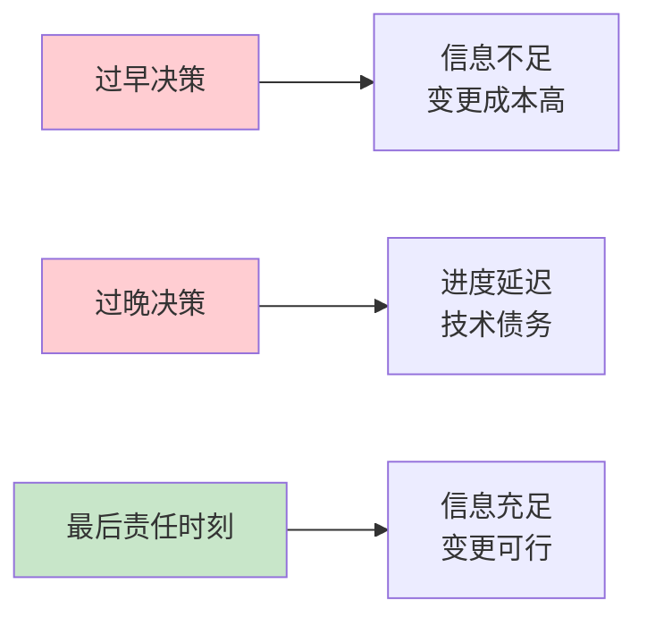

#### 判断框架

**何时应该决策**：
- [ ] 不决策会阻塞其他团队/工作
- [ ] 获取更多信息的成本超过决策风险
- [ ] 决策窗口即将关闭（如基础设施采购）

**何时应该延迟**：
- [ ] 关键信息即将获得（如 PoC 结果）
- [ ] 需求可能变化
- [ ] 技术选型尚未成熟

### 4.4.2 架构决策记录（ADR）

```markdown
# ADR-001: 采用事件驱动架构进行订单处理

## 状态
已采纳 (2026-04-08)

## 背景
- 订单处理需要与多个下游系统集成（库存、物流、财务）
- 当前同步调用导致耦合严重，任一系统故障影响全局
- 需要支持订单事件的审计和重放

## 决策
采用事件驱动架构：
1. 订单创建后发布 `OrderCreated` 事件
2. 下游系统订阅并异步处理
3. 使用 Kafka 作为事件流平台

## 权衡
**收益**：
- 系统解耦，独立扩展
- 故障隔离
- 支持事件溯源和审计

**成本**：
- 最终一致性复杂
- 运维 Kafka 集群
- 调试困难

## 符合性
- 符合非功能需求：可用性 99.9%
- 支持业务目标：订单处理延迟<1 秒

## 备注
需实现补偿事务处理失败场景
```

---

## 4.5 适应度函数（Fitness Functions）

### 4.5.1 核心定义

> **适应度函数**：可自动执行的测量，用于验证架构是否符合预期质量属性。

源自《Building Evolutionary Architectures》

### 4.5.2 适应度函数类型

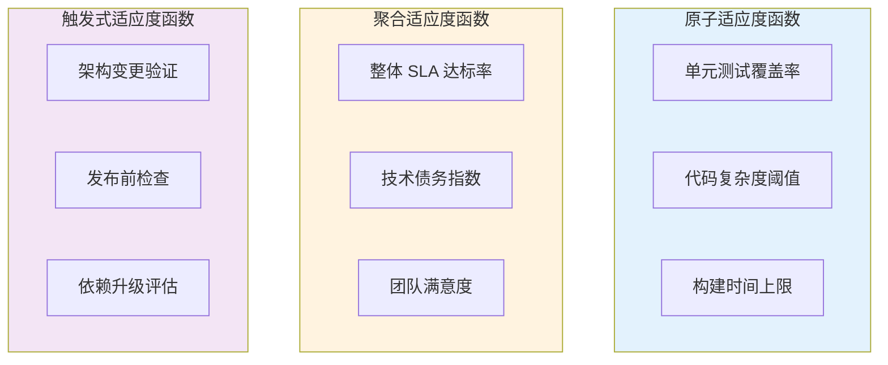

### 4.5.3 实践示例

| 质量属性 | 适应度函数 | 实现方式 |
|----------|------------|----------|
| **模块化** | 循环依赖检测 | ArchUnit、jQAssistant |
| **可测试性** | 测试覆盖率>80% | CI 流水线检查 |
| **性能** | P99 延迟<100ms | 监控告警 |
| **安全性** | 无高危漏洞 | SAST/DAST 扫描 |
| **可维护性** | 圈复杂度<10 | 静态分析工具 |

**代码示例（ArchUnit）**：
```java
@AnalyzeClasses(packages = "com.example")
class ArchitectureTest {
    @ArchTest
    static final ArchRule LAYER_DEPENDENCY = 
        layeredArchitecture()
            .layer("Controller").definedBy("..controller..")
            .layer("Service").definedBy("..service..")
            .layer("Repository").definedBy("..repository..")
            .whereLayer("Controller").mayOnlyBeAccessedByLayers("Controller")
            .whereLayer("Service").mayOnlyBeAccessedByLayers("Controller", "Service")
            .whereLayer("Repository").mayOnlyBeAccessedByLayers("Service");
}
```

---

## 4.6 架构权衡分析框架

### 4.6.1 ATAM（Architecture Tradeoff Analysis Method）

SEI 开发的系统化架构评估方法：

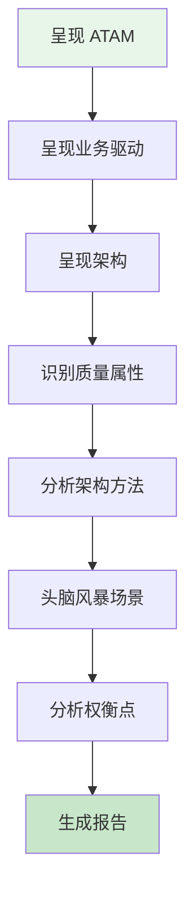

### 4.6.2 质量属性效用树

```
可用性 (Availability)
├── 故障恢复
│   ├── 数据库故障 → RTO<5 分钟
│   └── 网络分区 → 自动故障转移
├── 一般故障
│   ├── 单实例故障 → 自动重启
│   └── 配置错误 → 回滚部署
└── 灾难恢复
    └── 区域故障 → RTO<1 小时

性能 (Performance)
├── 用户操作
│   ├── 页面加载 <2 秒
│   └── API 响应 P95<100ms
└── 批处理
    └── 夜间作业 <4 小时完成
```

### 4.6.3 决策矩阵示例

**场景：选择 API 通信协议**

| 标准 | 权重 | REST | GraphQL | gRPC |
|------|------|------|---------|------|
| 学习曲线 | 20% | ✅ 5 | ⚠️ 3 | ❌ 2 |
| 前端灵活性 | 25% | ⚠️ 3 | ✅ 5 | ⚠️ 3 |
| 性能 | 25% | ⚠️ 3 | ⚠️ 3 | ✅ 5 |
| 工具生态 | 15% | ✅ 5 | ✅ 4 | ⚠️ 3 |
| 流式支持 | 15% | ❌ 1 | ⚠️ 3 | ✅ 5 |
| **加权得分** | - | **3.55** | **3.85** | **3.40** |

**决策**：GraphQL（基于前端灵活性优先的业务需求）

---

## 4.7 常见误区与陷阱

### 4.7.1 架构决策误区

| 误区 | 表现 | 正确做法 |
|------|------|----------|
| **过度工程化** | 为"可能的未来需求"设计复杂架构 | YAGNI 原则，从简单开始 |
| **架构宇航员** | 设计脱离实际，不接地气 | 深入一线，了解实际约束 |
| **盲目跟风** | 使用"热门"技术而不评估适用性 | Why>How，基于业务需求选型 |
| **一次性决策** | 认为架构决定后不可更改 | 设计演进式架构，定期回顾 |
| **忽视组织因素** | 忽略团队能力和沟通结构 | Conway 定律，架构匹配组织 |

### 4.7.2 权衡分析陷阱

| 陷阱 | 描述 | 规避方法 |
|------|------|----------|
| **虚假权衡** | 认为两个选项互斥，实际可兼得 | 寻找第三选择 |
| **局部优化** | 优化单点而忽略整体 | 系统思维，端到端分析 |
| **确认偏误** | 只寻找支持预设结论的证据 | 主动寻找反面证据 |
| **沉没成本** | 因已投入而不愿改变方向 | 基于当前信息重新评估 |

---

## 4.8 实践检查清单

### 架构设计评审清单

- [ ] **业务对齐**：架构决策是否支持业务目标？
- [ ] **权衡分析**：是否清晰记录收益与成本？
- [ ] **替代方案**：是否评估过其他可行方案？
- [ ] **假设验证**：决策依赖的假设是否成立？
- [ ] **适应度函数**：是否有可执行的验证方式？
- [ ] **演进路径**：是否支持未来变化？
- [ ] **团队能力**：团队是否有能力实现和维护？
- [ ] **风险识别**：是否识别主要风险并有缓解措施？

---

## 来源引用

1. **Microsoft Azure Architecture Center** - Design Principles for Azure Applications
   - https://learn.microsoft.com/en-us/azure/architecture/guide/design-principles/

2. **SEI (Software Engineering Institute)** - Architecture Tradeoff Analysis Method
   - https://sei.cmu.edu/software-architecture/

3. **Wikipedia** - SOLID principles
   - https://en.wikipedia.org/wiki/SOLID

4. **Wikipedia** - DRY, KISS, YAGNI principles
   - https://en.wikipedia.org/wiki/Don%27t_repeat_yourself
   - https://en.wikipedia.org/wiki/KISS_principle
   - https://en.wikipedia.org/wiki/You_aren%27t_gonna_need_it

5. **Martin Fowler** - Microservices Trade-offs
   - https://martinfowler.com/articles/microservices.html

6. **《Building Evolutionary Architectures》** - Fitness Functions

7. **《Fundamentals of Software Architecture》** (O'Reilly, 2020)

---

*文档版本：1.0*  
*最后更新：2026-04-08*
