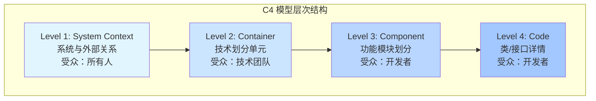
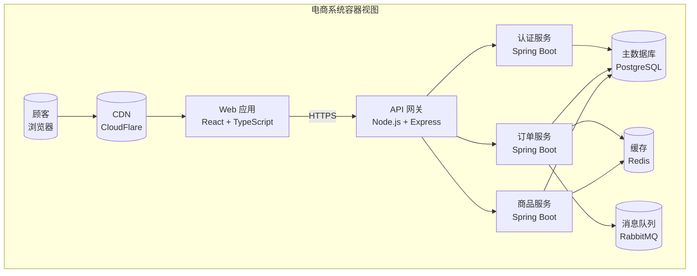
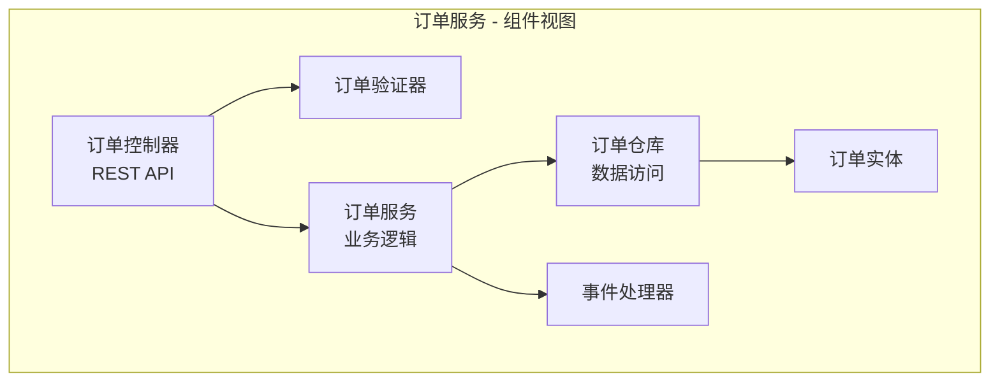

# 第 5 章 - 架构文档化

> 架构文档化的核心目标是建立"项目专家对系统设计的共享理解"。—— Martin Fowler

---

## 5.1 架构文档化的核心价值

### 5.1.1 为什么需要架构文档化

架构文档化是软件工程中至关重要但常被忽视的实践。根据 IEEE 标准和行业研究，有效的架构文档化能够：

- **降低知识传递成本**：新团队成员通过文档快速理解系统结构
- **支持架构决策追溯**：记录"为什么这样设计"而非仅仅"设计成什么样"
- **促进利益相关者沟通**：为开发、运维、业务和管理层提供共同语言
- **降低维护风险**：防止关键人员离开后系统知识断层
- **支持架构治理**：为架构评审和合规检查提供依据

> **Martin Fowler 观点**："架构文档化的目标是建立项目专家对系统设计的共享理解"（Architecture documentation should foster the shared understanding that the expert developers have of the system design.）

**常见误区**：架构文档不是越多越好，而是应该**恰好足够**（just enough），聚焦于对目标受众有价值的内容。

### 5.1.2 文档化原则

根据 Microsoft Azure Architecture Center 的最佳实践：

```markdown
## 有效架构文档的特征

✅ 聚焦"重要内容"
   - Architecture is about the important stuff. Whatever that is.
   - 记录希望早期就做对的决策

✅ 保持同步更新
   - 文档与代码版本关联
   - 建立审查和更新周期

✅ 面向目标受众
   - 明确文档的预期读者
   - 使用受众理解的语言和抽象级别

✅ 轻量且可维护
   - 避免过度详细的 UML 图
   - 优先使用文本 + 简单图表
```

---

## 5.2 架构决策记录（ADR）

### 5.2.1 ADR 概念定义

**架构决策记录（Architectural Decision Record, ADR）** 是一种简洁的文档格式，用于捕获单个架构决策及其上下文、理由和后果。ADR 由 Michael Nygard 在 2011 年推广，已成为敏捷架构实践的核心工具。

**核心特点**：
- **单一职责**：每个 ADR 记录一个决策
- **不可变**：已创建的 ADR 不修改，如需变更创建新 ADR 并标注替代关系
- **版本化**：与代码一起存储和管理（通常在 `/docs/adr/` 目录）
- **简洁**：通常 1-2 页，聚焦核心决策点

### 5.2.2 ADR 标准模板

以下是基于 **adr.github.io** 和 **Michael Nygard 原始文章** 推荐的标准 ADR 模板：

```markdown
# ADR-001: [标题 - 简明描述决策内容]

## 状态 (Status)

[提议 (Proposed) | 已接受 (Accepted) | 已废弃 (Deprecated) | 已替代 (Superseded)]

## 上下文 (Context)

描述面临问题、背景约束和相关需求。包括：
- 需要解决的技术或业务问题
- 相关的质量属性要求（性能、可扩展性、安全性等）
- 现有系统的约束条件
- 利益相关者的关注点
- 技术、政治、社会和项目本地等多维度作用力

## 决策 (Decision)

清晰陈述所选方案。使用肯定语气和主动语态，例如：
"我们将使用 PostgreSQL 作为主数据库"
而非 "我们考虑使用 PostgreSQL"

## 后果 (Consequences)

### 正面影响
- [列出采用该决策带来的好处]
- [量化的预期收益，如适用]

### 负面影响/权衡
- [承认并记录接受的不利影响]
- [缓解策略，如适用]

### 备选方案
- [方案 A]：优点/缺点
- [方案 B]：优点/缺点
- [为何未选择]

## 合规性 (Compliance)

[如何验证该决策被正确实施]

## 参考 (References)

- [相关链接、文档、RFC 等]
```

**模板来源说明**：
- Y-statement 格式源于 Zdun 等人的 "Sustainable Architectural Decisions"
- Michael Nygard 在 2011 年的博客文章确立了广泛认知
- AWS 推荐使用 ADR 简化技术决策流程

### 5.2.3 ADR 实践指南

**何时创建 ADR**：
- 架构风格选择（如微服务 vs 单体）
- 核心技术栈决策（数据库、消息队列、框架）
- 跨服务/模块的接口设计
- 影响多个团队的技术决策
- 涉及重大成本或风险的决策

**何时不需要 ADR**：
- 局部代码实现细节
- 可轻松逆转的决策
- 遵循既定标准的常规选择

**ADR 管理最佳实践**：
1. **编号连续**：使用 ADR-001、ADR-002 等格式
2. **状态追踪**：明确标注每个 ADR 的当前状态
3. **链接关系**：使用 "Replaces ADR-003" 等标注决策演进
4. **可搜索**：使用标签或关键词便于检索
5. **定期回顾**：在架构评审会议中检查 ADR 合规性

### 5.2.4 ADR 示例

```markdown
# ADR-006: 采用 C4 模型作为架构图标准

## 状态

已接受

## 上下文

当前项目中架构图风格不统一，存在以下问题：
- 不同团队使用不同符号和抽象级别
- 新成员难以理解现有图表
- 架构图与代码脱节，更新滞后

我们需要一个标准化的可视化方法来：
1. 降低学习曲线
2. 支持从抽象到具体的多层次视图
3. 与敏捷开发流程兼容

## 决策

我们将采用 C4 模型（Context, Containers, Components, Code）作为项目架构图的标准化方法。

## 理由

### 正面影响
- 统一视觉语言，降低沟通成本
- 层次化抽象支持不同受众需求
- 工具生态成熟（Structurizr、C4-PlantUML 等）
- 与代码集成，支持文档即代码实践

### 负面影响
- 团队需要学习时间（预计 2-3 天）
- 需要投资工具配置

### 备选方案
- UML：过于复杂，学习曲线陡峭
- ArchiMate：适合企业架构，对软件开发过重
- 自定标准：重复造轮子，缺乏工具支持

## 合规性

- 所有新架构图必须使用 C4 符号
- 在 Confluence 建立 C4 模板库
- 代码评审包含架构图更新检查
```

---

## 5.3 C4 模型详解

### 5.3.1 C4 模型概述

C4 模型由 **Simon Brown** 创建，是一种**易于学习、对开发者友好**的软件架构可视化方法，用于"描述和沟通软件架构"。C4 代表四个层次的抽象：

1. **Context（上下文）**：系统在业务环境中的位置
2. **Container（容器）**：系统的技术组成单元
3. **Component（组件）**：容器内部的功能模块
4. **Code（代码）**：代码级别的详细设计（可选）

> **C4 模型核心理念**：创建"代码地图"（maps of your code），在不同抽象级别描述软件系统，帮助团队建立共享词汇和轻量级模型。

**来源**：https://c4model.com/ 和 https://simonbrown.je/

### 5.3.2 C4 层次结构图



### 5.3.3 各层级详解

#### Level 1：系统上下文图 (System Context Diagram)

**目的**：展示目标系统如何与外部系统、用户交互

**元素**：
- **人员 (Person)**：系统的用户或其他人员角色
- **外部系统 (External System)**：与目标系统交互的其他系统
- **边界 (Boundary)**：明确系统责任范围

**示例**：
```
┌─────────────────────────────────────────────────────────────┐
│                    电子商务系统                              │
│                                                             │
│   ┌──────────┐      ┌───────────────┐      ┌──────────┐   │
│   │  顾客    │─────▶│  电商网站     │◀────▶│ 支付网关 │   │
│   └──────────┘      └───────────────┘      └──────────┘   │
│         │                                       │          │
│         │                                       ▼          │
│   ┌──────────┐                          ┌──────────────┐   │
│   │  客服    │◀────────────────────────│  物流系统    │   │
│   └──────────┘                          └──────────────┘   │
└─────────────────────────────────────────────────────────────┘
```

#### Level 2：容器图 (Container Diagram)

**目的**：展示系统内部的技术组成单元

**容器定义**：独立部署/运行的技术单元，如：
- Web 应用（React SPA）
- 移动应用（iOS/Android）
- 后端服务（Spring Boot API）
- 数据库（PostgreSQL）
- 消息队列（RabbitMQ）

**示例**：


#### Level 3：组件图 (Component Diagram)

**目的**：展示容器内部的功能模块划分

**组件定义**：逻辑功能分组，封装相关操作和数据

**示例**（订单服务内部）：


#### Level 4：代码图 (Code Diagram)

**目的**：展示关键类、接口的详细设计

**建议**：
- 仅针对复杂或关键模块
- 优先使用 IDE 生成
- 保持与代码同步

### 5.3.4 C4 模型支持图表

除了核心的 4 层图，C4 还支持：

| 图表类型 | 目的 | 使用场景 |
|---------|------|---------|
| 系统全景图 (System Landscape) | 展示组织内所有系统 | 企业架构视图 |
| 动态图 (Dynamic) | 展示功能执行流程 | 关键用例追踪 |
| 部署图 (Deployment) | 展示基础设施拓扑 | 运维和 DevOps |

### 5.3.5 C4 工具生态

**主流工具对比**：

| 工具 | 类型 | 优点 | 适用场景 |
|-----|------|------|---------|
| Structurizr | 商业/免费 | 完整 C4 支持，DSL 强大 | 企业级项目 |
| C4-PlantUML | 开源 | 免费，与 PlantUML 集成 | 开发者友好 |
| Mermaid | 开源 | GitHub 原生支持 | 文档内嵌 |
| Draw.io | 免费 | 拖拽式，易上手 | 快速原型 |
| Lucidchart | 商业 | 协作功能强 | 团队设计 |

---

## 5.4 其他架构文档化方法

### 5.4.1 架构视图和视角 (Views and Perspectives)

基于 ISO/IEC/IEEE 42010 标准，架构文档应包含多个视角：

- **逻辑视角**：系统结构和组件关系
- **物理视角**：部署和基础设施
- **开发视角**：模块划分和依赖
- **过程视角**：运行时行为和交互
- **安全视角**：安全控制和威胁缓解

### 5.4.2 文档即代码 (Documentation as Code)

**核心理念**：将架构文档视为代码的一部分，纳入版本控制和 CI/CD 流程

**实践方法**：
1. **Markdown + Git**：文档与代码同仓库存放
2. **DSL 定义**：使用 Structurizr DSL 等定义架构
3. **自动生成**：从代码生成架构图和文档
4. **CI 验证**：在 PR 流程中检查文档更新

**示例目录结构**：
```
project/
├── src/                    # 源代码
├── docs/
│   ├── adr/               # 架构决策记录
│   │   ├── 001-use-c4-model.md
│   │   ├── 002-postgres-db.md
│   │   └── 003-microservices.md
│   ├── architecture/      # C4 图表
│   │   ├── context.md
│   │   ├── containers.md
│   │   └── components.md
│   └── decisions/         # 设计决策
└── README.md
```

### 5.4.3 轻量级架构文档清单

对于敏捷团队，最小可行架构文档应包含：

- [ ] **系统上下文图**：展示系统与外部关系
- [ ] **关键容器图**：展示核心技术组件
- [ ] **Top 10 架构决策**：最重要的 ADR
- [ ] **部署拓扑图**：生产环境基础设施
- [ ] **关键流程说明**：核心业务功能的端到端流程

---

## 5.5 架构文档化检查清单

在发布架构文档前，使用以下清单进行验证：

### 内容完整性
- [ ] 目标受众明确定义
- [ ] 系统边界清晰标注
- [ ] 关键决策及理由记录
- [ ] 权衡取舍透明说明

### 可维护性
- [ ] 文档与代码版本关联
- [ ] 变更历史和责任人记录
- [ ] 审查和更新周期定义

### 可读性
- [ ] 图表符号一致
- [ ] 术语表完整
- [ ] 抽象层次适合受众

---

## 5.6 参考资料

- **ADR 官方**：https://adr.github.io/
- **C4 模型官网**：https://c4model.com/
- **Michael Nygard 原始文章**：Documenting Architecture Decisions (2011)
- **Simon Brown 著作**：The C4 Model for Visualising Software Architecture
- **IEEE 标准**：ISO/IEC/IEEE 42010 - Systems and Software Engineering
- **Microsoft Azure Architecture Center**：https://learn.microsoft.com/azure/architecture/
