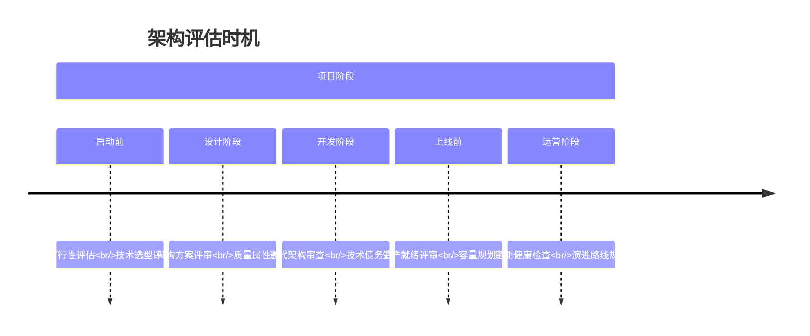
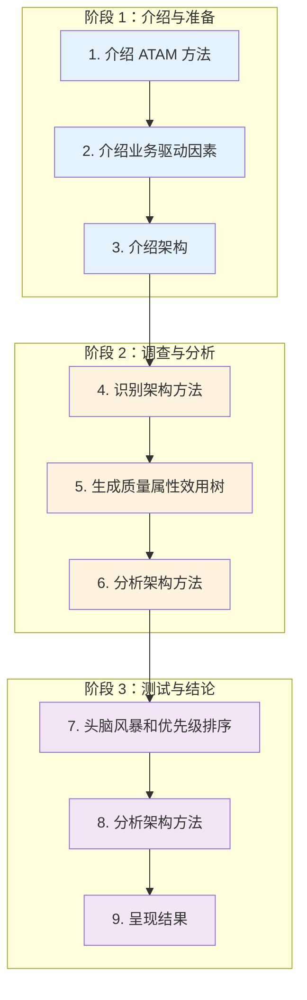
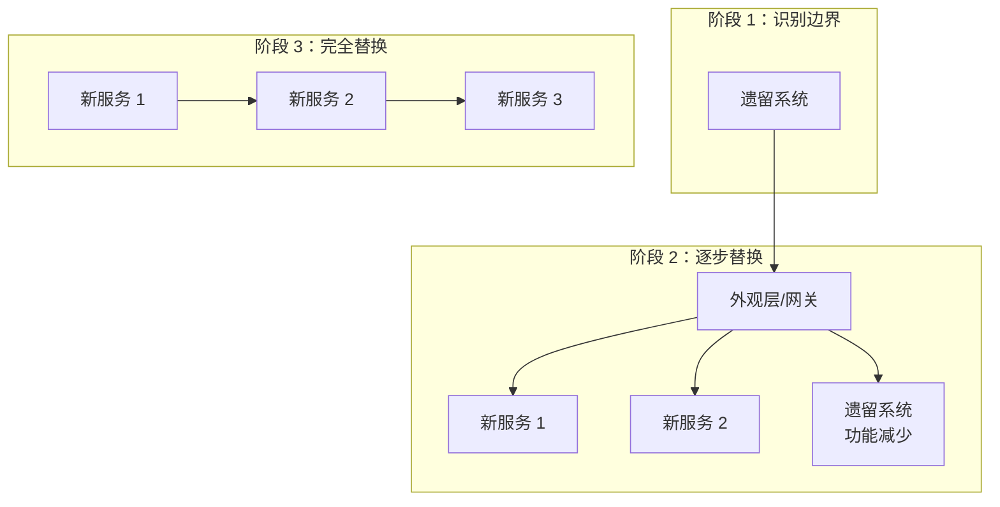
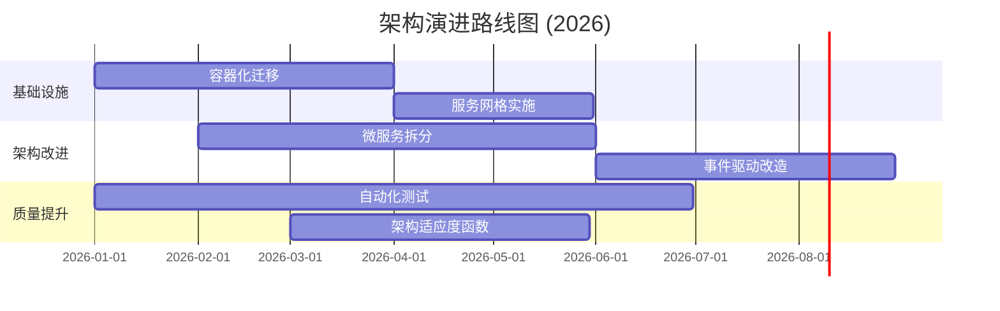

# 第 6 章 - 架构评估与演进

> 架构缺陷在后期修复的成本是设计阶段的 10-100 倍。—— IBM 系统科学研究所

---

## 6.1 架构评估的核心价值

### 6.1.1 为什么需要架构评估

架构评估是系统性地检查架构决策是否满足质量属性要求的过程。根据 **IEEE** 和 **SEI（软件工程研究所）** 的研究，架构评估能够：

- **早期发现风险**：在实现前识别架构缺陷，修复成本最低
- **验证质量属性**：确保性能、安全性、可扩展性等非功能需求得到满足
- **促进利益相关者对齐**：为业务、开发、运维提供共同评审平台
- **支持持续改进**：建立架构演进的反馈循环
- **降低技术债务**：及时发现并解决架构层面的技术债务

> **关键洞察**：架构缺陷在后期修复的成本是设计阶段的 10-100 倍（IBM 系统科学研究所数据）。

### 6.1.2 评估时机



---

## 6.2 架构评估方法

### 6.2.1 ATAM（架构权衡分析方法）

**ATAM（Architecture Tradeoff Analysis Method）** 是由 **卡内基梅隆大学 SEI（Software Engineering Institute）** 开发的标准化评估方法，专注于**质量属性之间的权衡分析**。

#### ATAM 的 9 个步骤



#### 质量属性效用树（Utility Tree）

效用树是 ATAM 的核心工具，用于系统化地识别和优先级排序质量属性场景。

**质量属性分类**：
| 属性类别 | 具体属性 |
|---------|---------|
| **性能相关** | 响应时间、吞吐量、容量 |
| **安全性** | 机密性、完整性、可用性、可审计性 |
| **可修改性** | 可维护性、可扩展性、可移植性 |
| **可用性** | 故障恢复、容错、平均修复时间 |

**场景模板（6 元组）**：
```
刺激源 (Source)：[谁/什么触发]
刺激 (Stimulus)：[发生什么]
工件 (Artifact)：[被评估的系统部分]
环境 (Environment)：[运行条件]
响应 (Response)：[系统如何反应]
响应度量 (Response Measure)：[可测量的指标]
```

**示例场景**：
- **性能**：用户在高峰期（环境）点击搜索按钮（刺激），系统应在 2 秒内（响应度量）返回结果（响应）
- **安全性**：攻击者（刺激源）尝试 SQL 注入（刺激），系统应阻止并记录（响应）
- **可修改性**：开发人员（刺激源）添加新 API 端点（刺激），应在 1 人日内完成（响应度量）

#### 评估输出

ATAM 评估产生以下关键输出：
1. **已记录的质量属性效用树**
2. **架构方法目录及其与质量属性的关系**
3. **风险点和非风险点**
4. **敏感点和权衡点**
5. **改进建议列表**

**来源**：SEI Carnegie Mellon - ATAM Method (https://www.sei.cmu.edu/research/atam/)

### 6.2.2 架构评审会议（Architecture Review Board）

**ARB（Architecture Review Board）** 是组织级的架构治理机制，通过定期评审确保架构符合标准和最佳实践。

#### ARB 组成

| 角色 | 职责 | 代表 |
|-----|------|-----|
| ARB 主席 | 主持评审、决策仲裁 | 首席架构师 |
| 技术代表 | 技术可行性评估 | 资深工程师 |
| 业务代表 | 业务对齐验证 | 产品负责人 |
| 运维代表 | 运营可行性 | SRE/DevOps |
| 安全代表 | 安全合规审查 | 安全工程师 |

#### 评审检查清单

**战略对齐**：
- [ ] 架构决策支持业务目标
- [ ] 技术投资与路线图一致
- [ ] 风险和成本已充分评估

**技术质量**：
- [ ] 满足性能 SLA
- [ ] 安全控制充分
- [ ] 可扩展性规划合理
- [ ] 故障恢复机制完善

**工程实践**：
- [ ] 遵循编码和架构规范
- [ ] 测试策略充分
- [ ] 监控和日志计划完整
- [ ] 文档充分且最新

### 6.2.3 轻量级评估方法

对于敏捷团队，以下轻量级方法更适合：

#### 1. 架构看板（Architecture Kanban）

```
┌─────────────┬─────────────┬─────────────┬─────────────┐
│   Backlog   │   待评审    │   评审中    │   已批准    │
├─────────────┼─────────────┼─────────────┼─────────────┤
│ - 新服务选型│ - API 网关   │ - 数据库   │ - 缓存策略  │
│ - 消息队列  │   方案      │   迁移      │   已实施    │
└─────────────┴─────────────┴─────────────┴─────────────┘
```

#### 2. 架构决策日志（ADL）

维护决策日志，定期回顾：
- 决策日期和背景
- 参与决策人员
- 预期结果
- 实际结果（后续补充）
- 经验教训

#### 3. 同行评审（Peer Review）

- 设计文档在团队内公开评审
- 使用 GitHub PR 或类似工具
- 至少 2 名资深工程师批准

---

## 6.3 架构健康度评估

### 6.3.1 架构健康度指标

**结构指标**：
| 指标 | 说明 | 健康阈值 |
|-----|------|---------|
| 耦合度 | 模块间依赖数量 | 越低越好 |
| 内聚度 | 模块内元素关联度 | 越高越好 |
| 循环依赖 | 依赖环的数量 | 0 |
| 抽象度 | 抽象类/接口占比 | 30-70% |
| 不稳定度 | 传出依赖/（传入 + 传出） | 因角色而异 |

**过程指标**：
| 指标 | 说明 | 健康阈值 |
|-----|------|---------|
| 架构变更频率 | 架构层变更次数/月 | < 5 次 |
| 技术债务密度 | 技术债务项/千行代码 | < 3 项 |
| 架构违规数 | 违反架构规则的数量 | 0 严重 |
| 文档覆盖率 | 有文档的组件占比 | > 80% |

### 6.3.2 架构适应度函数（Fitness Functions）

**定义**：架构适应度函数是 **ThoughtWorks** 提出的概念，用于**持续验证架构约束**的自动化机制。

**示例**：

```java
// 使用 ArchUnit 的 Java 适配度函数
@AnalyzeClasses(packages = "com.example")
class ArchitectureTest {
    
    // 分层架构约束
    @ArchTest
    static final ArchRule LAYERED_ARCHITECTURE =
        layeredArchitecture()
            .layer("Controller").definedBy("..controller..")
            .layer("Service").definedBy("..service..")
            .layer("Repository").definedBy("..repository..")
            .whereLayer("Controller").mayNotBeAccessedByAnyLayer()
            .whereLayer("Service").mayOnlyBeAccessedByLayers("Controller")
            .whereLayer("Repository").mayOnlyBeAccessedByLayers("Service");
    
    // 禁止循环依赖
    @ArchTest
    static final ArchRule NO_CYCLES =
        noClasses().should().dependOnClassesThat().dependOnClasses();
}
```

**适配度函数类型**：

| 类型 | 验证内容 | 工具示例 |
|-----|---------|---------|
| 结构适配度 | 依赖规则、分层约束 | ArchUnit, NetArchTest |
| 质量适配度 | 性能、安全指标 | SonarQube, OWASP ZAP |
| 流程适配度 | CI/CD 合规性 | Jenkins, GitHub Actions |

### 6.3.3 架构待办事项（Architecture Backlog）

将架构改进作为明确的待办事项管理：

```markdown
## 架构待办事项

### P0 - 紧急（本 Sprint）
- [ ] 修复订单服务的循环依赖
- [ ] 解决数据库连接池泄漏问题

### P1 - 高优先级（本季度）
- [ ] 重构认证模块，降低耦合度
- [ ] 实现服务间通信的熔断机制

### P2 - 中优先级（半年内）
- [ ] 迁移到事件驱动架构
- [ ] 建立架构适应度函数自动化
```

---

## 6.4 架构演进策略

### 6.4.1 演进式架构原则

根据《Building Evolutionary Architectures》（Neal Ford 等），演进式架构的核心原则：

1. **增量式变更**：小步快跑，避免大规模重构
2. **适应度验证**：持续测试架构约束
3. **实验文化**：鼓励技术探索和试错
4. **反馈循环**：快速收集和分析架构效果
5. **最后责任时刻**：在必要时才做决策，保持灵活性

### 6.4.2 架构演进模式

#### 1. 绞杀者模式（Strangler Fig Pattern）

**适用场景**：遗留系统现代化



**实施步骤**：
1. 识别可独立替换的功能边界
2. 在新系统中实现该功能
3. 通过网关/代理将流量路由到新系统
4. 验证并移除旧功能的代码
5. 重复直至完全替换

#### 2. 抽象分支模式（Branch by Abstraction）

**适用场景**：替换底层实现而不影响上层

```
阶段 1: 创建抽象层
┌─────────────────────┐
│     业务逻辑层       │
├─────────────────────┤
│   抽象接口层        │ ← 新增
├─────────────────────┤
│   旧实现            │
└─────────────────────┘

阶段 2: 实现新实现
┌─────────────────────┐
│     业务逻辑层       │
├─────────────────────┤
│   抽象接口层        │
├──────────┬──────────┤
│ 旧实现   │ 新实现    │
└──────────┴──────────┘

阶段 3: 切换并移除
┌─────────────────────┐
│     业务逻辑层       │
├─────────────────────┤
│   抽象接口层        │
├─────────────────────┤
│   新实现            │
└─────────────────────┘
```

#### 3. 并行运行模式（Parallel Run）

**适用场景**：高风险系统替换

- 新旧系统同时运行
- 对比输出结果验证正确性
- 逐步将流量迁移到新系统
- 确认无误后下线旧系统

### 6.4.3 技术债务管理

**技术债务（Technical Debt）** 概念由 Ward Cunningham 提出，用于描述"为了短期利益而牺牲长期质量"的决策。

> **Martin Fowler 定义**：技术债务是"使系统比理想状态更难修改和扩展的内部质量缺陷"。

#### 技术债务象限（Martin Fowler）

```
                    谨慎 (Prudent)           鲁莽 (Reckless)
              ┌───────────────────┬───────────────────┐
              │                   │                   │
         有意 │   谨慎 - 有意      │   鲁莽 - 有意      │
             │   "现在欠债        │   "还不清了       │
             │    以后还"         │    随便写吧"      │
              │                   │                   │
              ├───────────────────┼───────────────────┤
       无意中 │   谨慎 - 无意      │   鲁莽 - 无意      │
              │   "应该知道        │   "现在知道       │
              │    但不知道"       │    了"           │
              │                   │                   │
              └───────────────────┴───────────────────┘
```

**象限说明**：
| 象限 | 描述 | 典型场景 |
|-----|------|---------|
| 谨慎 - 有意 | 经过权衡的战略性决策 | 为赶 deadline 暂时妥协 |
| 鲁莽 - 有意 | 明知不好但仍为之 | "先上线再说" |
| 谨慎 - 无意 | 当时认为正确，后来发现更好方案 | 技术演进导致 |
| 鲁莽 - 无意 | 缺乏知识导致的糟糕设计 | 新手写的代码 |

#### 技术债务识别

**症状表现**：
- 代码"腐烂"（cruft）堆积，修改困难
- 相同 bug 反复出现
- 新功能开发时间越来越长
- 团队士气下降

**偿还策略**：

| 策略 | 适用场景 | 实施方式 |
|-----|---------|---------|
| 定期偿还 | 高利息债务 | 每 Sprint 分配 20% 容量 |
| 重构时机 | 功能变更时 | 童子军规则：让代码比来时更干净 |
| 专项攻坚 | 系统性问题 | 技术债务 Sprint |
| 预防新增 | 所有项目 | 代码评审 + 适配度函数 |

> **关键原则**："像处理金融债务一样，逐步偿还本金"。优先处理频繁修改的代码区域，稳定区域可以暂时不处理。

**来源**：Martin Fowler - Technical Debt (https://martinfowler.com/bliki/TechnicalDebt.html)

---

## 6.5 架构演进路线图

### 6.5.1 路线图制定

**步骤**：
1. **现状评估**：当前架构状态、技术债务、痛点
2. **目标定义**：未来 1-3 年的架构愿景
3. **差距分析**：现状与目标的差距
4. **里程碑规划**：分阶段的改进目标
5. **资源规划**：人力、时间、成本估算

### 6.5.2 路线图模板



### 6.5.3 演进风险管理

| 风险 | 影响 | 缓解策略 |
|-----|------|---------|
| 业务中断 | 高 | 灰度发布、回滚预案 |
| 团队阻力 | 中 | 培训、试点项目 |
| 技术不确定性 | 中 | POC 验证、渐进式采用 |
| 资源不足 | 高 | 优先级排序、分阶段实施 |

---

## 6.6 评估与演进检查清单

### 架构评估检查清单
- [ ] 质量属性场景已定义并优先级排序
- [ ] 架构决策与业务目标对齐
- [ ] 技术风险已识别并制定缓解计划
- [ ] 利益相关者参与评审并达成共识

### 架构演进检查清单
- [ ] 架构健康度指标已定义并监控
- [ ] 适应度函数已自动化
- [ ] 技术债务已量化并跟踪
- [ ] 演进路线图已制定并沟通
- [ ] 变更管理和回滚策略已准备

---

## 6.7 参考资料

- **ATAM 官方文档**：SEI Carnegie Mellon - ATAM Method (https://www.sei.cmu.edu/research/atam/)
- **IBM Garage**：企业架构评估实践
- **IEEE Xplore**：Software Architecture Evaluation 相关论文
- **ThoughtWorks**：Building Evolutionary Architectures
- **Martin Fowler**：Technical Debt Quadrant (https://martinfowler.com/bliki/TechnicalDebt.html)
- **InfoQ**：Architecture & Design 最佳实践
