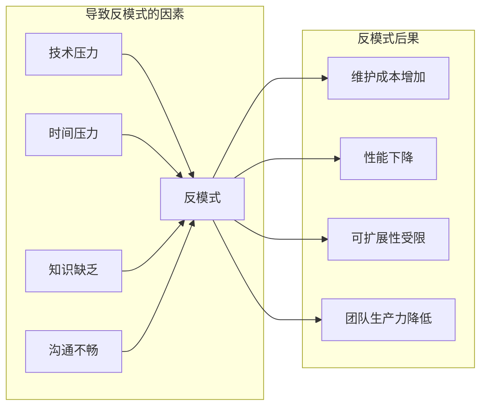
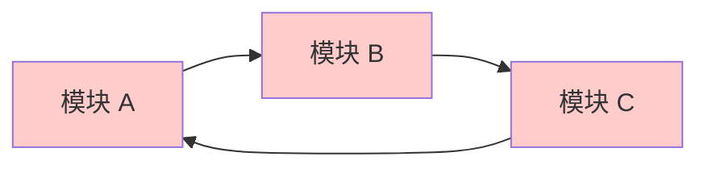
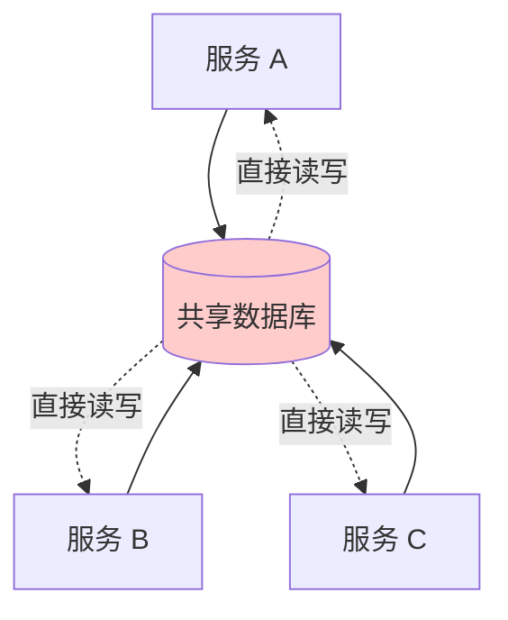
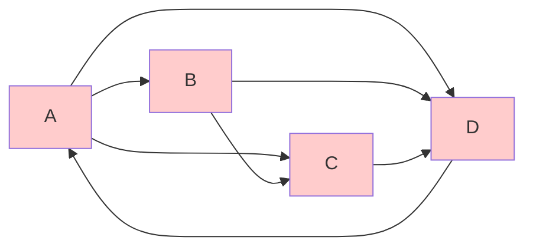

# 第 7 章 - 常见误区与反模式

> 架构反模式是反复出现的、对系统质量产生负面影响的架构设计决策。

---

## 7.1 架构反模式概述

### 7.1.1 什么是架构反模式

**架构反模式（Architecture Anti-pattern）** 是反复出现的、对系统质量产生负面影响的架构设计决策。与代码级别的设计模式相反，反模式描述了**应该避免的做法**。

**核心特征**：
- **可识别**：有明确的症状和表现
- **可重复**：在不同项目中反复出现
- **有害性**：对质量属性产生负面影响
- **可修复**：存在已知的重构方案

### 7.1.2 反模式与技术的关系



---

## 7.2 结构类反模式

### 7.2.1 大泥球（Big Ball of Mud）

**定义**：系统没有清晰的架构结构，代码随意组织，模块边界模糊，依赖关系混乱。

**表现症状**：
- 找不到代码应该放在哪里
- 修改一处代码引发多处意外故障
- 新成员无法理解系统结构
- "utils"、"common"模块无限膨胀

**根本原因**：
- 缺乏架构设计和治理
- 持续的短期决策累积
- 没有代码所有权意识

**负面影响**：
| 影响领域 | 具体表现 |
|---------|---------|
| 维护成本 | 修改时间成倍增加 |
| 人员依赖 | 只有"老员工"敢改代码 |
| 测试困难 | 无法隔离单元测试 |
| 技术债务 | 利息越来越高 |

**解决方案**：
1. **识别边界**：找出自然的功能聚类
2. **定义分层**：建立清晰的责任层次
3. **逐步重构**：使用绞杀者模式逐步替换
4. **建立约束**：实施架构适应度函数

**示例对比**：
```
❌ 反模式：
src/
├── utils/          # 500+ 文件，什么都放
├── helpers/        # 又是 200+ 文件
├── controllers/    # 包含业务逻辑
├── models/         # 包含数据库和业务逻辑
└── random_file.js  # 不知道放哪里

✅ 重构后：
src/
├── api/            # API 层（路由、控制器）
├── services/       # 业务逻辑层
├── domain/         # 领域模型（纯业务）
├── repositories/   # 数据访问层
└── shared/         # 有限共享工具（有明确标准）
```

### 7.2.2 循环依赖（Circular Dependency）

**定义**：模块 A 依赖模块 B，模块 B 又依赖模块 A，形成依赖环。

**表现症状**：


**具体表现**：
- 编译/构建顺序难以确定
- 修改一个模块引发连锁反应
- 无法单独测试某个模块
- 打包后出现运行时错误

**根本原因**：
- 职责划分不清晰
- 过早优化（"可能以后会用到"）
- 缺乏依赖管理工具/约束

**负面影响**：
- **构建时间增加**：无法增量编译
- **耦合度高**：牵一发而动全身
- **复用困难**：无法单独提取模块

**解决方案**：
1. **依赖倒置**：引入抽象接口打破循环
2. **提取公共模块**：将共享代码移至新模块
3. **事件驱动**：使用消息解耦

**重构示例**：
```typescript
// ❌ 循环依赖
// OrderService.ts
import { UserService } from './UserService';
export class OrderService {
  constructor(private userService: UserService) {}
}

// UserService.ts
import { OrderService } from './OrderService';
export class UserService {
  constructor(private orderService: OrderService) {}
}

// ✅ 重构后：引入事件解耦
// events.ts
export interface OrderCreatedEvent {
  userId: string;
  orderId: string;
}

// OrderService.ts
import { EventEmitter } from 'events';
export class OrderService {
  constructor(private eventEmitter: EventEmitter) {}
  
  createOrder(userId: string) {
    const order = /* ... */;
    this.eventEmitter.emit('orderCreated', { userId, orderId: order.id });
  }
}

// UserService.ts
export class UserService {
  constructor(private eventEmitter: EventEmitter) {
    this.eventEmitter.on('orderCreated', this.handleOrderCreated.bind(this));
  }
}
```

### 7.2.3 过度工程化（Over-Engineering）

**定义**：在需求不明确或过于简单时，设计过度复杂的架构。

**表现症状**：
- 为"可能的未来需求"提前设计
- 引入不必要的抽象层
- 使用复杂技术解决简单问题
- 代码量是实际需要的 3-5 倍

**常见场景**：
| 场景 | 过度设计方案 | 合理方案 |
|-----|-------------|---------|
| CRUD 应用 | 微服务 + 事件溯源 | 单体应用 |
| 小型配置 | 配置中心 + 动态刷新 | 配置文件 |
| 内部工具 | 完整 DDD 架构 | 简单分层 |

**根本原因**：
- **简历驱动开发**：使用新技术丰富简历
- **过度抽象恐惧**：害怕以后改代码
- **从众心理**：别人都用微服务

**负面影响**：
- 开发周期延长
- 维护复杂度增加
- 团队学习成本高
- 性能开销增加

**解决方案**：
1. **YAGNI 原则**：You Aren't Gonna Need It
2. **KISS 原则**：Keep It Simple, Stupid
3. **演进式设计**：在真正需要时再重构
4. **量化决策**：用数据证明复杂性必要

### 7.2.4 模块/服务粒度不当

#### 反模式：过度细分（Nano-service）

**定义**：将系统拆分为过小、功能单一的服务。

**表现症状**：
- 一个服务只有几十行代码
- 服务间调用次数远超业务逻辑执行时间
- 部署和运维复杂度远超业务价值

**负面影响**：
```
业务逻辑执行时间：10ms
├─ 服务 A → B: 5ms (网络)
├─ 服务 B → C: 5ms (网络)
├─ 服务 C → D: 5ms (网络)
└─ 实际业务处理：2ms
```

**合理建议**：
- 服务边界应基于**业务领域**而非技术功能
- 单个服务应是**可独立部署**的最小有意义单元
- 考虑团队结构（Conway 定律）

#### 反模式：过度聚合（Mono-service）

**定义**：名义上是微服务，实际上是单体应用的分布式版本。

**表现症状**：
- 服务包含所有业务功能
- 修改任何功能需要重新部署整个服务
- 服务间共享数据库

---

## 7.3 集成类反模式

### 7.3.1 集成数据库（Integration Database）

**定义**：多个服务共享同一个数据库，通过数据库进行服务间集成。

**表现症状**：


**具体表现**：
- 服务 A 直接读取服务 B 的表
- 跨服务的数据库事务
- 数据库 schema 变更影响所有服务

**根本原因**：
- 对微服务原则理解不足
- 遗留系统集成路径依赖
- 消息队列等基础设施缺失

**负面影响**：
| 问题 | 说明 |
|-----|------|
| 紧耦合 | 服务无法独立演进 |
| 部署风险 | 单一服务变更影响全局 |
| 数据所有权模糊 | 不清楚谁负责数据一致性 |
| 扩展困难 | 无法按服务独立扩展 |

**解决方案**：
1. **数据库按服务拆分**：每个服务拥有独立数据库
2. **API 集成**：通过定义良好的 API 交互
3. **事件驱动**：使用消息队列进行异步集成
4. **CQRS**：需要读数据时使用物化视图

### 7.3.2 点对点集成（Point-to-Point Integration）

**定义**：服务之间直接一对一集成，没有中央协调机制。

**表现症状**：


**负面影响**：
- **连接数爆炸**：n 个服务需要 n(n-1)/2 个连接
- **协议不统一**：每个集成点可能使用不同协议
- **监控困难**：无法追踪端到端流程

**解决方案**：
- 引入**企业服务总线（ESB）**或**API 网关**
- 采用**消息代理**进行解耦
- 实施**服务网格**统一管理

---

## 7.4 分布式系统反模式

### 7.4.1 分布式单体（Distributed Monolith）

**定义**：名义上是微服务架构，但服务间耦合度极高，无法独立部署和运维。

**表现症状**：
- 部署一个服务需要同时部署其他服务
- 服务间调用链过长（> 10 跳）
- 共享数据库或强一致性要求
- 本地开发需要启动所有服务

**根本原因**：
- 将单体应用机械拆分为多个服务
- 没有基于业务领域定义边界
- 缺乏服务治理和契约管理

**负面影响**：
| 微服务优势 | 分布式单体实际表现 |
|-----------|------------------|
| 独立部署 | 必须一起部署 |
| 独立扩展 | 必须一起扩展 |
| 技术多样性 | 必须技术栈一致 |
| 故障隔离 | 故障连锁传播 |

**解决方案**：
1. **识别边界**：使用 DDD 重新定义服务边界
2. **解耦数据**：消除共享数据库
3. **异步通信**：引入消息队列减少同步依赖
4. **定义契约**：使用 API 契约和版本管理

### 7.4.2 链式依赖（Chain of Dependencies）

**定义**：服务调用形成过长的链式依赖，单一故障影响整个链路。

**表现症状**：
```
用户 → API 网关 → 服务 A → 服务 B → 服务 C → 服务 D → 数据库
       (100ms)    (50ms)    (50ms)    (50ms)    (50ms)   (20ms)
       
总延迟 = 100 + 50 + 50 + 50 + 50 + 20 = 320ms
```

**负面影响**：
- **延迟累积**：每跳增加网络延迟
- **故障放大**：任一节点故障导致全链路失败
- **调试困难**：问题定位复杂

**解决方案**：
1. **扁平化架构**：减少调用层次
2. **聚合服务**：合并相关功能
3. **缓存**：缓存中间结果
4. **异步处理**：非实时需求使用异步

### 7.4.3 忽略失败（Ignoring Failure）

**定义**：设计时假设所有依赖服务始终可用，未考虑故障场景。

**表现症状**：
- 没有超时设置
- 没有重试机制
- 没有熔断器
- 没有降级策略

**常见场景**：
```javascript
// ❌ 忽略失败
async function getUserData(userId) {
  const user = await userService.getUser(userId);
  const orders = await orderService.getOrders(userId);
  const prefs = await preferenceService.getPrefs(userId);
  return { user, orders, prefs };
}

// ✅ 考虑失败
async function getUserData(userId) {
  const user = await userService.getUser(userId).timeout(3000);
  const orders = await orderService.getOrders(userId)
    .timeout(3000)
    .catch(() => []); // 降级
  const prefs = await preferenceService.getPrefs(userId)
    .timeout(1000)
    .catch(() => ({})); // 降级
  return { user, orders, prefs };
}
```

**解决方案**：
- **超时**：所有外部调用设置合理超时
- **重试**：对暂时性失败实施重试（带退避）
- **熔断器**：防止故障传播和级联失败
- **降级**：提供功能降级方案
- **Bulkhead**：隔离资源防止耗尽

---

## 7.5 安全类反模式

### 7.5.1 安全作为附加组件（Security as an Afterthought）

**定义**：在架构设计完成后才考虑安全需求，而非内建于设计中。

**表现症状**：
- 安全评审在上线前进行
- 认证/授权逻辑散落在各服务
- 敏感数据明文存储
- 没有审计日志

**负面影响**：
- 安全漏洞修复成本高
- 合规风险增加
- 数据泄露风险

**解决方案**：
- **左移安全**：在设计阶段考虑安全
- **零信任架构**：默认不信任任何请求
- **统一安全层**：集中处理认证授权

### 7.5.2 硬编码凭证（Hardcoded Credentials）

**定义**：在代码中直接写入密码、API 密钥等敏感信息。

**表现症状**：
```java
// ❌ 反模式
String dbPassword = "SuperSecret123!";
String apiKey = "sk-1234567890abcdef";

// ✅ 正确做法
String dbPassword = System.getenv("DB_PASSWORD");
String apiKey = configService.getApiKey();
```

**解决方案**：
- 使用**环境变量**或**配置中心**
- 实施**密钥管理系统**（如 AWS Secrets Manager）
- 使用**CI/CD 秘密注入**

---

## 7.6 组织与流程反模式

### 7.6.1 架构象牙塔（Ivory Tower Architecture）

**定义**：架构师脱离实际开发，设计出无法实施的"完美"架构。

**表现症状**：
- 架构文档与实际代码脱节
- 开发人员不理解或不认同架构决策
- 架构决策没有考虑实施约束

**负面影响**：
- 架构无法落地
- 团队士气低落
- 项目延期

**解决方案**：
- **嵌入式架构师**：架构师参与实际开发
- **协作设计**：与开发团队共同设计
- **渐进式演进**：小步验证而非大设计

### 7.6.2 委员会设计（Design by Committee）

**定义**：架构决策由委员会投票决定，导致设计过于复杂或折中。

**表现症状**：
- 设计满足所有人但谁都不满意
- 过度抽象以适应所有场景
- 决策周期过长

**解决方案**：
- **单一决策者**：明确决策责任人
- **咨询后决策**：征求意见但责任明确
- **ADR 记录**：记录决策背景和理由

---

## 7.7 反模式识别与修复清单

### 识别检查清单
- [ ] 是否存在循环依赖
- [ ] 服务边界是否清晰
- [ ] 是否有共享数据库
- [ ] 调用链是否过长
- [ ] 是否考虑了故障场景
- [ ] 安全是否内建于设计

### 修复优先级
| 优先级 | 反模式类型 | 理由 |
|-------|-----------|-----|
| P0 | 循环依赖 | 阻碍基本工程实践 |
| P0 | 集成数据库 | 无法独立部署 |
| P1 | 分布式单体 | 失去微服务优势 |
| P1 | 忽略失败 | 生产风险高 |
| P2 | 过度工程化 | 维护成本高 |
| P2 | 安全后置 | 合规风险 |

---

## 7.8 参考资料

- **Martin Fowler**：Big Ball of Mud, Technical Debt (https://martinfowler.com/)
- **InfoQ**：Architecture Antipatterns
- **Microsoft Azure**：Cloud Design Patterns (https://learn.microsoft.com/azure/architecture/patterns/)
- **O'Reilly**：Software Architecture Patterns
- **IEEE Software**：Architecture Antipatterns 相关论文
