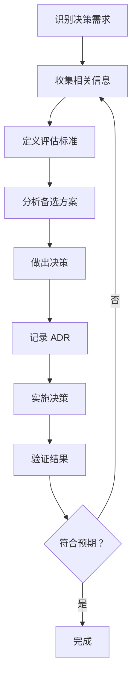
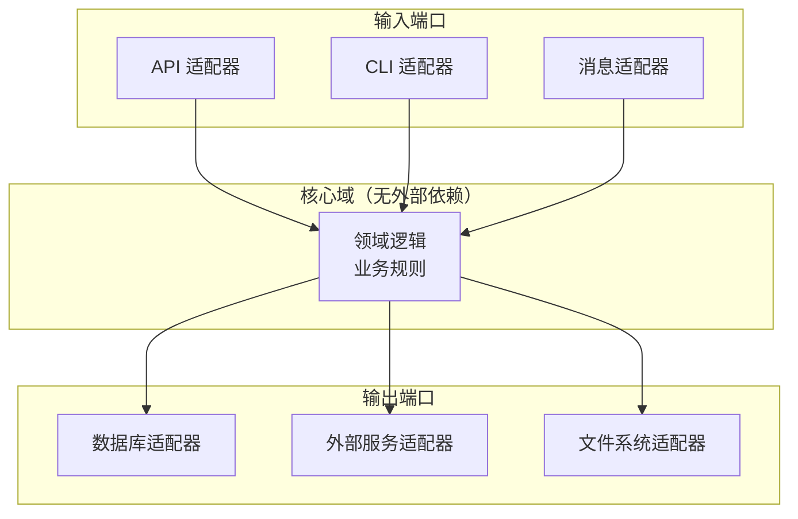
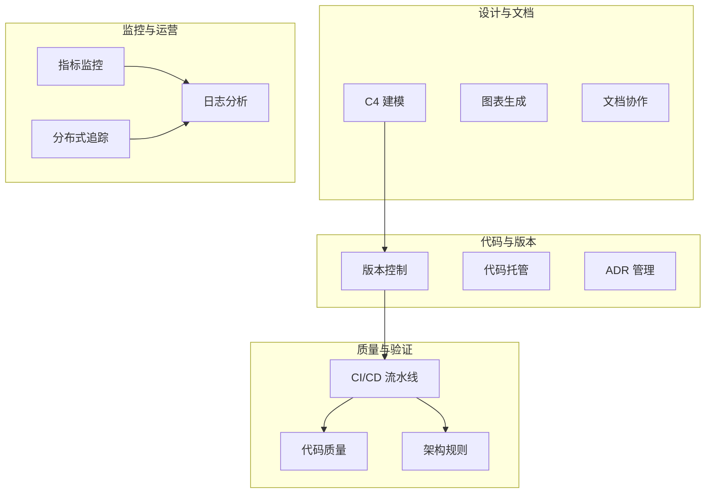
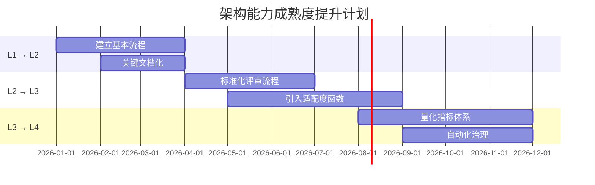

# 第 8 章 - 最佳实践与工具

> 成功的软件架构遵循核心原则，并借助适当工具持续验证和改进。

---

## 8.1 架构最佳实践概览

### 8.1.1 核心原则

成功的软件架构遵循以下核心原则：

| 原则 | 说明 | 实践指导 |
|-----|------|---------|
| **单一职责** | 每个模块/服务只做一件事 | 清晰的边界定义 |
| **关注点分离** | 分离不同关注点 | 分层架构 |
| **依赖倒置** | 依赖抽象而非具体实现 | 接口驱动设计 |
| **最小知识** | 减少模块间了解 | 减少耦合 |
| **演进式设计** | 架构随需求演进 | 避免过度设计 |
| **自动化验证** | 持续验证架构约束 | 适应度函数 |

### 8.1.2 架构决策框架



---

## 8.2 架构设计最佳实践

### 8.2.1 分层架构模式

**经典三层架构**：
```
┌─────────────────────────────────────┐
│         表示层 (Presentation)        │
│   - 用户界面                         │
│   - API 端点                         │
│   - 请求验证                         │
├─────────────────────────────────────┤
│         业务层 (Business Logic)      │
│   - 业务规则                         │
│   - 工作流                           │
│   - 数据转换                         │
├─────────────────────────────────────┤
│         数据层 (Data Access)         │
│   - 数据库操作                       │
│   - 缓存管理                         │
│   - 外部服务调用                     │
└─────────────────────────────────────┘
```

**最佳实践**：
- **依赖方向**：上层依赖下层，下层无依赖
- **跨层禁止**：表示层不应直接访问数据层
- **接口隔离**：层间通过接口通信

**现代变体 - 六边形架构（端口与适配器）**：


### 8.2.2 领域驱动设计（DDD）实践

**战略设计模式**：

| 模式 | 用途 | 实施要点 |
|-----|------|---------|
| 通用语言 | 统一业务与技术术语 | 术语表、持续维护 |
| 限界上下文 | 定义模型边界 | 明确的上下文映射 |
| 上下文映射 | 管理上下文关系 | Partnership, ACL, ACL |

**战术设计模式**：
```
┌─────────────────────────────────────────┐
│              应用层                      │
│  - 应用服务（编排业务流程）              │
│  - DTO（数据传输对象）                   │
├─────────────────────────────────────────┤
│              领域层                      │
│  - 实体（有身份的对象）                  │
│  - 值对象（无身份的对象）                │
│  - 聚合根（一致性边界）                  │
│  - 领域服务（跨实体逻辑）                │
│  - 领域事件（状态变更通知）              │
├─────────────────────────────────────────┤
│            基础设施层                    │
│  - 仓储实现                              │
│  - 外部服务实现                          │
└─────────────────────────────────────────┘
```

### 8.2.3 微服务设计原则

**服务拆分策略**：

1. **基于业务能力**：按业务功能划分（订单、用户、支付）
2. **基于子域**：使用 DDD 战略设计识别子域
3. **基于变更频率**：将频繁变更与稳定部分分离
4. **基于数据敏感性**：敏感数据独立服务

**服务间通信最佳实践**：

| 场景 | 推荐方式 | 技术选型 |
|-----|---------|---------|
| 同步请求 - 响应 | REST/gRPC | 实时查询 |
| 异步命令 | 消息队列 | RabbitMQ, Kafka |
| 事件通知 | 发布 - 订阅 | Kafka, SNS/SQS |
| 流式数据 | 事件流 | Kafka, Kinesis |

**数据管理**：
- **数据库每服务**：每个服务拥有独立数据库
- **事件溯源**：记录状态变更事件而非当前状态
- **CQRS**：读写分离优化性能

---

## 8.3 架构文档化工具

### 8.3.1 C4 模型工具对比

| 工具 | 类型 | 价格 | 核心优势 | 适用场景 |
|-----|------|-----|---------|---------|
| **Structurizr** | SaaS/本地 | 免费/付费 | DSL 强大、版本控制 | 企业级项目 |
| **C4-PlantUML** | 开源 | 免费 | PlantUML 集成 | 开发者友好 |
| **Mermaid** | 开源 | 免费 | GitHub 原生 | 文档内嵌 |
| **Draw.io** | 在线/本地 | 免费 | 拖拽式 | 快速原型 |
| **Lucidchart** | SaaS | 付费 | 协作功能 | 团队设计 |
| **IcePanel** | SaaS | 免费/付费 | 交互式 C4 | 演示沟通 |

### 8.3.2 Structurizr DSL 示例

```dsl
workspace {
    model {
        user = person "User" "A user of the system"
        softwareSystem = softwareSystem "Software System" "My software system" {
            webapp = container "Web Application" "Delivers UI" "Java, Spring MVC"
            api = container "API Application" "Provides API" "Java, Spring Boot"
            database = container "Database" "Stores data" "PostgreSQL"
            
            webapp -> api "Uses" "JSON/HTTPS"
            api -> database "Reads from and writes to" "JDBC"
        }
        
        user -> webapp "Uses" "HTTPS"
    }
    
    views {
        systemContext softwareSystem "SystemContext" {
            include *
        }
        
        container softwareSystem "Containers" {
            include *
        }
        
        theme default
    }
}
```

### 8.3.3 ADR 管理工具

| 工具 | 平台 | 特点 |
|-----|------|-----|
| **adr-tools** | CLI | 命令行创建管理 ADR |
| **log4brains** | Web/CLI | 本地知识库、知识图谱 |
| **Structurizr** | SaaS | ADR 与架构视图集成 |
| **Decisions** | VSCode 扩展 | IDE 内管理 ADR |

**adr-tools 使用示例**：
```bash
# 创建新 ADR
adr create "Use PostgreSQL as primary database"

# 生成索引
adr generate toc

# 查看状态
adr status
```

---

## 8.4 架构评估工具

### 8.4.1 静态分析工具

| 工具 | 语言 | 功能 | 集成方式 |
|-----|------|-----|---------|
| **SonarQube** | 多语言 | 代码质量、技术债务 | CI/CD |
| **ArchUnit** | Java | 架构规则验证 | 单元测试 |
| **NetArchTest** | .NET | 架构规则验证 | 单元测试 |
| **ESLint + 自定义规则** | JavaScript | 代码和架构规则 | 编辑器/CI |

### 8.4.2 ArchUnit 示例

```java
import com.tngtech.archunit.core.domain.JavaClasses;
import com.tngtech.archunit.junit.AnalyzeClasses;
import com.tngtech.archunit.junit.ArchTest;
import com.tngtech.archunit.lang.ArchRule;

import static com.tngtech.archunit.lang.syntax.ArchRuleDefinition.*;

@AnalyzeClasses(packages = "com.example")
class ArchitectureTests {
    
    // 分层架构规则
    @ArchTest
    static final ArchRule LAYERED_ARCHITECTURE =
        layeredArchitecture()
            .consideringAllDependencies()
            .layer("Controller").definedBy("..controller..")
            .layer("Service").definedBy("..service..")
            .layer("Repository").definedBy("..repository..")
            .layer("Domain").definedBy("..domain..")
            
            .whereLayer("Controller").mayNotBeAccessedByAnyLayer()
            .whereLayer("Service").mayOnlyBeAccessedByLayers("Controller")
            .whereLayer("Repository").mayOnlyBeAccessedByLayers("Service")
            .whereLayer("Domain").mayOnlyBeAccessedByLayers("Service");
    
    // 禁止循环依赖
    @ArchTest
    static final ArchRule NO_CYCLES =
        noClasses().should().dependOnClassesThat().dependOnClasses();
    
    // 命名约定
    @ArchTest
    static final ArchRule REPOSITORY_NAMING =
        classes().that().resideInAPackage("..repository..")
            .should().haveSimpleNameEndingWith("Repository");
    
    // 依赖约束
    @ArchTest
    static final ArchRule DOMAIN_NO_EXTERNAL_DEPENDENCIES =
        noClasses().that().resideInAPackage("..domain..")
            .should().dependOnClassesThat().resideInAPackage("..external..");
}
```

### 8.4.3 架构健康度仪表板

**推荐指标**：
```yaml
架构健康度指标:
  结构指标:
    - 循环依赖数：0
    - 平均耦合度：< 5
    - 平均内聚度：> 0.7
    - 技术债务比率：< 5%
  
  过程指标:
    - 架构违规数：0 严重
    - ADR 合规率：> 90%
    - 文档覆盖率：> 80%
    - 适配度函数通过率：100%
```

---

## 8.5 架构治理工具

### 8.5.1 工具全景图



### 8.5.2 CI/CD 集成示例

**GitHub Actions 架构验证流水线**：
```yaml
name: Architecture Validation

on:
  pull_request:
    branches: [main]
  push:
    branches: [main]

jobs:
  architecture-tests:
    runs-on: ubuntu-latest
    steps:
      - uses: actions/checkout@v3
      
      - name: Set up JDK
        uses: actions/setup-java@v3
        with:
          java-version: '17'
          distribution: 'temurin'
      
      - name: Run ArchUnit tests
        run: mvn test -Dtest=ArchitectureTests
      
      - name: SonarQube scan
        run: mvn sonar:sonar
        env:
          SONAR_TOKEN: ${{ secrets.SONAR_TOKEN }}
      
      - name: Check ADR compliance
        run: |
          # 验证新 ADR 是否创建（如需要）
          # 验证 ADR 格式是否正确
      
      - name: Generate architecture report
        run: |
          # 生成架构健康度报告
          # 上传到 artifacts
```

---

## 8.6 架构决策支持工具

### 8.6.1 技术雷达

**ThoughtWorks 技术雷达模式**：
```
         采纳 (Adopt)
            ▲
            │
  试验 ◄────┼────► 保持 (Hold)
 (Trial)    │    (Hold)
            │
            ▼
         评估 (Assess)
```

**实施方法**：
1. 定期（每季度）评估技术栈
2. 分类为 Adopt/Trial/Assess/Hold
3. 发布内部技术雷达
4. 指导技术选型决策

### 8.6.2 决策矩阵模板

| 评估维度 | 权重 | 方案 A | 方案 B | 方案 C |
|---------|-----|-------|-------|-------|
| 性能 | 25% | 8 | 6 | 7 |
| 可维护性 | 20% | 7 | 8 | 6 |
| 学习曲线 | 15% | 6 | 7 | 8 |
| 社区支持 | 15% | 9 | 7 | 5 |
| 成本 | 15% | 7 | 8 | 9 |
| 与现有集成 | 10% | 8 | 6 | 7 |
| **加权总分** | **100%** | **7.55** | **6.95** | **6.85** |

### 8.6.3 架构待办事项管理

**工具推荐**：
- **Jira**：企业级项目管理
- **Linear**：开发者友好
- **GitHub Projects**：与代码深度集成

**待办事项分类**：
```markdown
## 架构待办事项模板

### 技术债务
- [ ] [P0] 修复订单服务循环依赖
- [ ] [P1] 重构认证模块降低耦合

### 架构改进
- [ ] [P1] 实施事件驱动架构
- [ ] [P2] 迁移到服务网格

### 文档更新
- [ ] [P2] 更新 C4 容器图
- [ ] [P3] 补充 ADR-015 实施结果
```

---

## 8.7 架构能力成熟度模型

### 8.7.1 成熟度评估维度

| 维度 | L1 初始 | L2 可重复 | L3 已定义 | L4 已管理 | L5 优化 |
|-----|-------|---------|---------|---------|-------|
| **架构治理** | 无流程 | 临时评审 | 标准化流程 | 量化管理 | 持续优化 |
| **文档化** | 无文档 | 关键文档 | 完整文档 | 自动化更新 | 知识图谱 |
| **质量保障** | 事后检查 | 基本测试 | 适配度函数 | 持续验证 | 预测性分析 |
| **技术债务** | 无管理 | 被动修复 | 主动管理 | 量化追踪 | 预防为主 |

### 8.7.2 改进路线图



---

## 8.8 最佳实践检查清单

### 架构设计
- [ ] 遵循单一职责原则
- [ ] 明确的模块/服务边界
- [ ] 依赖方向符合分层规则
- [ ] 故障场景已考虑
- [ ] 安全内建于设计

### 架构文档化
- [ ] C4 图表完整且最新
- [ ] ADR 记录关键决策
- [ ] 文档与代码版本同步
- [ ] 新成员可通过文档上手

### 架构治理
- [ ] 定期架构评审会议
- [ ] 适应度函数自动化
- [ ] 技术债务可视化
- [ ] 架构健康度监控

### 持续改进
- [ ] 架构回顾会议（每季度）
- [ ] 技术雷达更新
- [ ] 最佳实践分享机制
- [ ] 外部对标学习

---

## 8.9 参考资料

### 权威来源
- **IEEE Xplore**：Software Architecture 相关论文和标准
- **Martin Fowler**：bliki 架构相关文章 (https://martinfowler.com/)
- **InfoQ**：Architecture & Design 最佳实践
- **Microsoft Azure Architecture Center**：云设计模式 (https://learn.microsoft.com/azure/architecture/)
- **AWS Architecture Center**：参考架构

### 书籍
- 《Software Architecture in Practice》- Len Bass 等
- 《Building Evolutionary Architectures》- Neal Ford 等
- 《The C4 Model for Visualising Software Architecture》- Simon Brown
- 《Domain-Driven Design》- Eric Evans

### 工具资源
- **Structurizr**：https://structurizr.com/
- **C4 Model**：https://c4model.com/
- **ADR GitHub**：https://adr.github.io/
- **ArchUnit**：https://www.archunit.org/
- **Azure Patterns**：https://docs.microsoft.com/azure/architecture/patterns/
