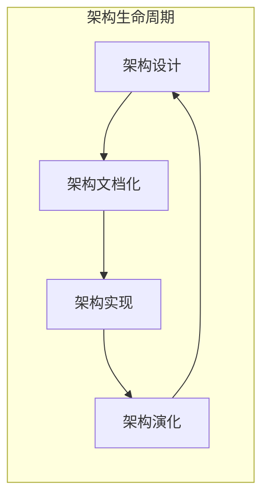
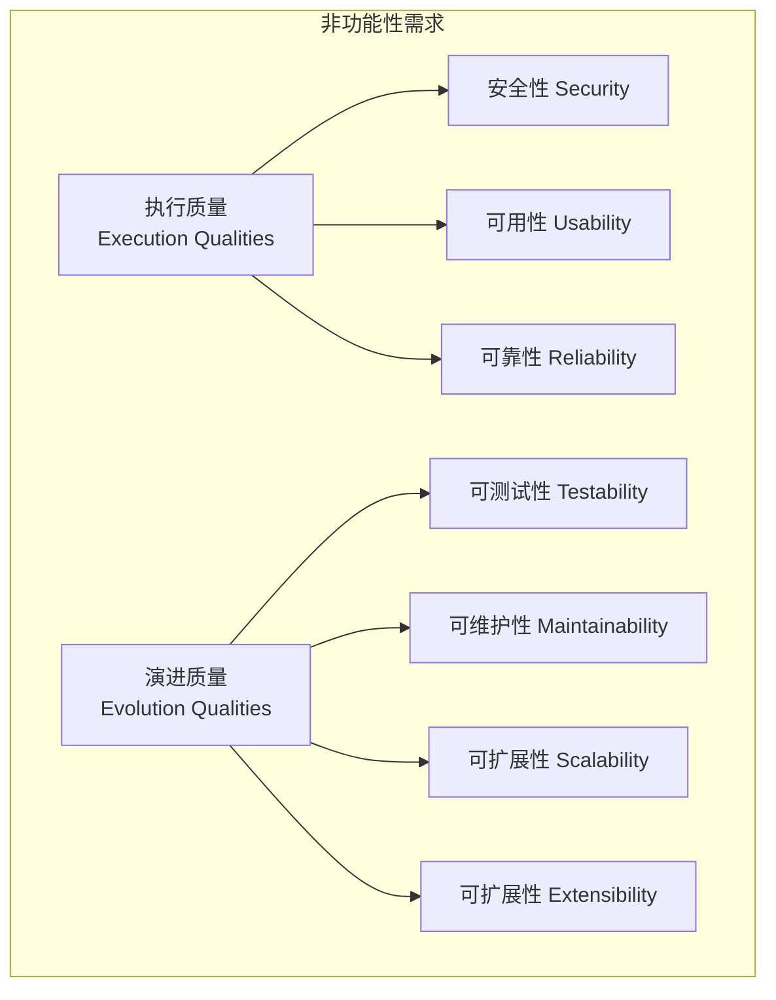
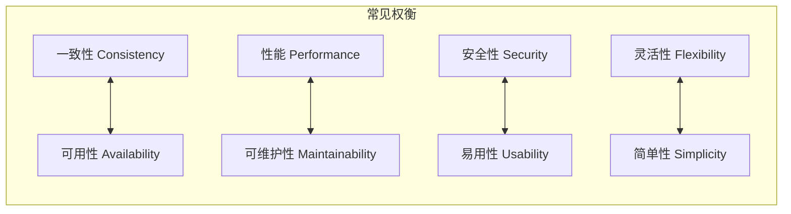

# 软件架构核心知识体系

> **文档说明**：本文档系统化阐述软件架构的核心概念、设计原则、架构风格与模式、文档化方法、评估与演进策略，以及常见误区与最佳实践。
> 
> **目标受众**：软件工程师、技术负责人、架构师
> **先验知识**：具备软件开发基础知识，了解至少一种编程语言和常见开发框架

---

## 目录

1. [软件架构概述](#第 1 章 - 软件架构概述)
2. [核心概念详解](#第 2 章 - 核心概念详解)
3. [架构风格与模式](#第 3 章 - 架构风格与模式)
4. [架构设计原则](#第 4 章 - 架构设计原则)
5. [架构文档化](#第 5 章 - 架构文档化)
6. [架构评估与演进](#第 6 章 - 架构评估与演进)
7. [常见误区与反模式](#第 7 章 - 常见误区与反模式)
8. [最佳实践与工具](#第 8 章 - 最佳实践与工具)

---

## 第 1 章 - 软件架构概述

### 1.1 什么是软件架构

**软件架构（Software Architecture）** 是用于推理软件系统所需的结构集合，以及创建这些结构和系统的学科。每个结构包含软件元素、元素之间的关系，以及元素和关系的属性。

> **权威来源**：IEEE 1471 / ISO/IEC/IEEE 42010 标准定义

软件架构类似于建筑架构的隐喻，它作为系统和开发项目的**蓝图**，项目管理可据此推断团队和人员需要执行的任务。

### 1.2 架构的本质特征

软件架构涉及做出**基础性结构决策**，这些决策一旦实施就很难更改。架构决策包括从软件设计的可能性中选择特定的结构选项。

软件架构中有两条基本定律：

1. **一切皆是权衡（Everything is a trade-off）**
2. **"为什么"比"如何"更重要（"Why is more important than how"）**

### 1.3 Ralph Johnson 的经典定义

Martin Fowler 在与面向对象之父之一 Ralph Johnson 的通信后，得出了对软件架构最精辟的理解：

> **"架构就是关于重要的东西。不管那是什么。"**
> 
> *"Architecture is about the important stuff. Whatever that is."*

这个看似简单的定义蕴含深刻的意义：
- 架构思维的核心是**识别什么是重要的**（即什么是架构性的）
- 然后投入精力保持这些架构元素处于良好状态
- 开发者要成为架构师，需要能够识别哪些元素如果不加以控制会导致严重问题

### 1.4 为什么架构很重要

#### 1.4.1 架构对用户的隐性影响

架构对软件产品的客户和用户来说是一个**难以直接感知**的概念。但糟糕的架构是导致**代码腐化（cruft）**增长的主要因素。

**代码腐化**：阻碍开发者理解软件的元素。

#### 1.4.2 内部质量与交付速度的关系

| 直觉认知 | 架构现实 |
|----------|----------|
| "高质量 = 高成本" | 对架构等内部质量而言，**关系是反转的** |
| 花更多时间做架构 = 更慢交付 | **高内部质量 = 更快的新功能交付** |

原因：
- 架构腐化会阻碍开发者理解软件
- 腐化代码更难修改，导致功能交付更慢、缺陷更多
- 经验丰富的开发者认为：**关注内部质量在数周内（而非数月）就能看到回报**

### 1.5 架构的范围（Scope）

对于软件架构的范围，业界存在不同观点：

| 观点 | 描述 |
|------|------|
| **宏观系统结构** | 架构是软件系统的高层次抽象，由计算组件集合及描述组件间交互的连接器组成 |
| **重要的东西** | 架构师应关注对系统和利益相关者有高影响力的决策 |
| **在环境中理解系统的基础** | 架构是理解系统及其环境所必需的基础 |
| **难以更改的东西** | 架构决策应在生命周期早期就"第一次就做对"，因为后期更改成本高昂 |
| **架构设计决策集合** | 架构不仅是模型或结构，还应包括导致这些结构的决策及其背后的**理由（rationale）** |

> **关键洞察**：架构应包含**架构决策记录（Architecture Decision Records, ADR）**，作为单一事实来源记录决策的技术和商业理由。

### 1.6 软件架构 vs 软件设计 vs 需求工程

这三者之间没有明确的分界线，它们共同构成从高层意图到低层细节的**"意图链（chain of intentionality）"**。

#### 1.6.1 架构设计与应用设计的区别

| 维度 | 架构设计 | 应用设计 |
|------|----------|----------|
| **焦点** | 设计基础设施 | 设计流程和数据 |
| **目标** | 满足**非功能性需求** | 满足**功能性需求** |
| **内容** | 系统如何被构建和执行 | 系统提供什么功能 |
| **抽象级别** | 高层结构、组件关系 | 具体业务逻辑、算法 |

### 1.7 架构风格 vs 架构模式

这两个概念经常被混淆，但存在明确的区别：

#### 1.7.1 软件架构风格（Architecture Style）

**定义**：定义系统整体组织的高层次结构组织，指定组件如何组织、如何交互，以及对这些交互的约束。

**特点**：
- 包含组件和连接器类型的词汇表
- 提供解释系统属性的语义模型
- 代表系统组织的**最粗粒度**级别

**常见示例**：
- 分层架构（Layered Architecture）
- 微服务（Microservices）
- 事件驱动架构（Event-Driven Architecture）
- 六边形架构 / 端口和适配器（Hexagonal / Ports and Adapters）
- 微内核架构（Microkernel）
- 管道 - 过滤器架构（Pipes and Filters）
- 面向服务架构（SOA）

#### 1.7.2 软件架构模式（Architecture Pattern）

**定义**：在系统级别可重用的、经过验证的解决方案，用于解决重复出现的问题，关注整体结构、组件交互和质量属性。

**特点**：
- 操作抽象级别**高于设计模式**
- 解决更广泛的系统级挑战
- 通常影响系统级关注点

**常见示例**：
- 断路器（Circuit Breaker）
- 模型 - 视图 - 控制器（MVC）
- 发布 - 订阅（Publish-Subscribe）
- 客户端 - 服务器（Client-Server）
- 对等网络（Peer-to-Peer）
- Saga 模式
- strangler fig 模式（绞杀榕模式）

### 1.8 架构活动

#### 1.8.1 核心架构活动



#### 1.8.2 架构文档化的价值

根据《Fundamentals of Software Architecture》一书，架构文档化有三个核心价值：

1. **促进利益相关者之间的沟通**
2. **捕获高层设计的早期决策**
3. **允许在不同项目间重用设计组件**

### 1.9 软件架构的复杂性与适应度函数

#### 1.9.1 架构复杂性的自然增长

软件架构倾向于随时间推移变得**更加复杂**。这种复杂性增长是自然的，因为：
- 新功能添加
- 技术债务累积
- 团队规模变化
- 业务需求演进

#### 1.9.2 适应度函数（Fitness Functions）

**适应度函数**是一种机制，用于持续验证架构是否符合预期的质量属性。

> **建议**：软件架构师应使用适应度函数持续检查架构状态。

适应度函数的示例：
- 代码依赖关系检查（防止循环依赖）
- 性能基准测试
- 安全扫描
- 架构合规性测试

### 1.10 架构决策记录（ADR）

#### 1.10.1 什么是 ADR

**架构决策记录（Architecture Decision Record, ADR）** 是记录架构决策及其背景的文档。

#### 1.10.2 常见架构反模式

| 反模式 | 描述 | 解决方案 |
|--------|------|----------|
| **决策拖延** | 因害怕选择错误而延迟或避免架构决策 | 与开发团队紧密协作，在"最后责任时刻"做决策 |
| **决策遗忘** | 架构决策被遗忘、未文档化或未被理解，导致重复讨论 | 使用 ADR 记录技术和商业理由，存储在可访问的仓库（如 Wiki） |
| **沟通分散** | 使用邮件沟通架构决策，信息分散 | 创建单一事实来源，邮件只沟通变更上下文并链接到 ADR |

### 1.11 总结

| 关键要点 | 说明 |
|----------|------|
| **定义** | 架构是用于推理系统的结构集合 |
| **重要性** | 架构决定长期交付能力和维护成本 |
| **范围** | 架构包含结构、决策及其理由 |
| **风格 vs 模式** | 风格定义组织原则，模式是可重用解决方案 |
| **文档化** | ADR 是记录架构决策的最佳实践 |
| **演进** | 适应度函数帮助持续验证架构质量 |

---

## 第 2 章 - 核心概念详解

### 2.1 功能性需求 vs 非功能性需求

#### 2.1.1 核心定义

在软件架构中，需求分为两大类：

| 类型 | 定义 | 形式 | 关注点 |
|------|------|------|--------|
| **功能性需求** | 定义系统**做什么** | "系统应做 <需求>" | 具体行为、功能 |
| **非功能性需求** | 定义系统**如何做** | "系统应是 <需求>" | 整体属性、质量 |

> **权威来源**：Wikipedia - Non-functional Requirement / IEEE 标准

#### 2.1.2 非功能性需求的本质

**非功能性需求（NFR）** 是用于评判系统运行效果的标准，而非具体行为。它们在软件架构中被称为**"架构特征（Architectural Characteristics）"**。

非功能性需求的其他术语：
- 质量属性（Quality Attributes）
- 质量目标（Quality Goals）
- 服务质量需求（Quality of Service Requirements）
- 约束（Constraints）
- 技术需求（Technical Requirements）
- 非行为需求（Non-behavioral Requirements）

**通俗称呼**："-ilities"（来自 stability、portability 等后缀）

#### 2.1.3 非功能性需求的分类



**执行质量**：在运行时可观察的属性，如安全性、可用性、可靠性。

**演进质量**：体现在系统静态结构中的属性，如可测试性、可维护性、可扩展性。

#### 2.1.4 指定 NFR 的最佳实践

> **关键原则**：非功能性需求必须以**具体和可衡量**的方式指定。

❌ **不好的示例**：
- "系统应该快速响应"
- "系统应该是可靠的"

✅ **好的示例**：
- "系统应在 95% 的请求中在 200ms 内响应"
- "系统应保证 99.9% 的可用性（年度停机时间不超过 8.76 小时）"
- "系统应支持每秒 10,000 次并发请求"

### 2.2 架构特征的权衡

#### 2.2.1 架构第一定律：一切皆是权衡

在软件架构中，**没有免费的午餐**。每个架构决策都涉及权衡：



#### 2.2.2 CAP 定理示例

在分布式系统中，CAP 定理指出三者不可兼得：

| 属性 | 描述 | 权衡 |
|------|------|------|
| **一致性（Consistency）** | 所有节点看到相同的数据 | 与可用性权衡 |
| **可用性（Availability）** | 每个请求都得到响应 | 与一致性权衡 |
| **分区容错性（Partition Tolerance）** | 系统在消息丢失时继续运行 | 通常必须接受 |

#### 2.2.3 架构第二定律：为什么比如何更重要

> **"Why is more important than how"**

架构决策的**理由**比决策本身更重要：
- 理解"为什么"可以帮助团队在情况变化时做出新的正确决策
- 没有理由的决策会在团队变动时丢失
- 这是 ADR（架构决策记录）的核心价值

### 2.3 软件架构风格详解

#### 2.3.1 分层架构（Layered Architecture）

**定义**：将系统组织成水平层次，每层有特定职责，上层依赖下层。

**优点**：
- 关注点分离清晰
- 易于理解和维护
- 支持标准的企业应用开发

**缺点**：
- 可能产生"架构下沉"问题（所有代码都经过所有层）
- 性能开销（请求必须穿过所有层）
- 难以独立部署各层

**适用场景**：传统企业应用、需要清晰分离的系统

#### 2.3.2 微服务架构（Microservices Architecture）

**定义**：将单一应用开发为一组小型服务，每个服务运行在独立进程中，通过轻量级机制（通常是 HTTP API）通信。

**核心特征**：
- 围绕业务能力构建
- 独立部署
- 去中心化数据管理
- 基础设施自动化

**优点**：
- 独立部署和扩展
- 技术异质性（不同服务可用不同技术栈）
- 故障隔离
- 支持团队自治

**缺点**：
- 分布式系统复杂性
- 数据一致性挑战
- 运维复杂度高
- 网络延迟问题

#### 2.3.3 事件驱动架构（Event-Driven Architecture）

**定义**：组件通过生产、检测和消费事件进行通信和协调的架构风格。

**优点**：
- 松耦合
- 高可扩展性
- 支持实时处理
- 易于扩展新功能

**缺点**：
- 调试困难
- 事件流复杂性
- 消息顺序和重复处理

### 2.4 软件架构模式详解

#### 2.4.1 断路器模式（Circuit Breaker）

**问题**：在分布式系统中，服务调用可能因网络问题或下游服务故障而失败，导致级联故障。

**解决方案**：断路器模式通过三种状态管理服务调用：

**状态说明**：
- **关闭（Closed）**：正常操作，请求通过
- **打开（Open）**：断路器跳闸，请求立即失败
- **半开（Half-Open）**：允许有限请求测试服务是否恢复

#### 2.4.2 Saga 模式

**问题**：在微服务架构中，如何管理跨多个服务的分布式事务？

**解决方案**：Saga 将长运行事务分解为本地事务序列，每个事务有补偿操作。

**实现模式**：
- **编排（Orchestration）**：中央编排器协调事务
- **编舞（Choreography）**：服务间通过事件协作

#### 2.4.3 后端对前端（Backends for Frontends, BFF）

**问题**：不同客户端（Web、移动端）有不同的数据需求，单一 API 难以满足所有需求。

**解决方案**：为每种客户端创建专用的后端服务。

### 2.5 C4 架构模型

#### 2.5.1 什么是 C4 模型

**C4 模型**是一种轻量级的图形化符号技术，用于建模软件系统架构。它基于系统的层次化分解（容器、组件），并依赖 UML 或 ERD 等现有建模技术进行更详细的分解。

**创建者**：Simon Brown（2006-2011）
**基础**：UML 和 4+1 架构视图模型

#### 2.5.2 C4 的四个层次

| 层次 | 名称 | 描述 | 受众 |
|------|------|------|------|
| **L1** | **上下文图** | 显示系统及其与用户和其他系统的关系 | 所有人 |
| **L2** | **容器图** | 将系统分解为相互关联的容器（应用、数据存储） | 技术人员 |
| **L3** | **组件图** | 将容器分解为组件，展示组件间关系 | 架构师、开发者 |
| **L4** | **代码图** | 提供代码级细节（使用 UML、ERD 或 IDE 生成） | 开发者 |

### 2.6 架构师的思维模式

#### 2.6.1 识别重要的东西

架构师的核心能力是识别**什么对系统最重要**：
- 技术影响：高影响力决策、难以逆转的决策、跨组件影响
- 业务影响：成本影响、上市时间、用户满意度
- 风险因素：单点故障、安全漏洞、性能瓶颈

#### 2.6.2 最后责任时刻决策

在**最后责任时刻**做决策：
- 有足够的信息来验证决策
- 避免不必要的延迟导致分析瘫痪
- 平衡前期设计和敏捷响应

---

## 第 3 章 - 架构风格与模式

### 3.1 架构风格 vs 架构模式

#### 3.1.1 概念定义

**架构风格（Architecture Style）**和**架构模式（Architecture Pattern）**是两个相关但有区别的概念：

| 维度 | 架构风格 | 架构模式 |
|------|----------|----------|
| **抽象层级** | 最高层结构组织 | 系统级 reusable 解决方案 |
| **关注点** | 整体系统组织方式和组件交互约束 | 特定 recurring 问题的通用解决方案 |
| **约束范围** | 定义组件类型、连接器和语义模型 | 解决具体设计挑战，可在多种风格中使用 |
| **示例** | 微服务、分层架构、事件驱动 | Circuit Breaker、发布 - 订阅、MVC |

**来源验证**：
- Wikipedia：架构风格是"高粒度系统组织的结构组织，定义组件如何组织、如何交互及约束"
- O'Reilly《Fundamentals of Software Architecture》：架构模式是"系统级的可复用解决方案，解决整体结构和质量属性相关的关注点"
- Microsoft Azure Architecture Center：架构风格是"共享特定特征的架构家族"

### 3.2 主要架构风格详解

#### 3.2.1 N 层架构（N-tier Architecture）

**工作原理**：
N 层架构将应用程序划分为**逻辑层（layers）**和**物理层（tiers）**：
- **逻辑层**：代码组织方式（如表现层、业务层、数据层）
- **物理层**：实际部署单元，可独立扩展

**核心特征**：
1. **水平分层**：每层有明确职责，只能调用下层
2. **依赖单向**：上层依赖下层，下层不知道上层
3. **层间通信**：通常使用同步调用（如 HTTP、RPC）

**适用场景**：
- ✅ 传统企业应用迁移到云
- ✅ 更新频率较低的业务系统
- ✅ 混合环境（本地 + 云）
- ❌ 需要频繁迭代和快速创新的领域
- ❌ 复杂度高且需要团队独立开发的系统

**优缺点分析**：

| 优点 | 缺点 |
|------|------|
| ✅ 结构清晰，易于理解 | ❌ 水平分层导致变更影响多个层级 |
| ✅ 职责分离明确 | ❌ 难以独立扩展单层 |
| ✅ 适合遗留系统迁移 | ❌ 容易形成"单体应用" |
| ✅ 开发工具成熟 | ❌ 敏捷性受限，发布周期长 |

**最佳实践**：
1. **明确层边界**：使用接口定义层间通信契约
2. **避免跨层调用**：严格遵循"只能调用直接下层"原则
3. **合理定义层数**：常见为 3 层（表现 - 业务 - 数据），避免过度分层
4. **数据缓存策略**：在业务层和数据层之间引入缓存减少数据库压力

#### 3.2.2 微服务架构（Microservices Architecture）

**核心定义**：

> "微服务架构是一种将单一应用程序开发为**一组小型服务**的方法，每个服务运行在**独立进程**中，通过**轻量级机制**（通常是 HTTP API）通信。这些服务围绕**业务能力**构建，可**独立部署**，使用**最少量的集中式管理**。"  
> — James Lewis & Martin Fowler (2014)

**九大核心特征**：

| 特征 | 说明 |
|------|------|
| **组件化通过服务** | 服务作为独立部署单元，进程间通信 |
| **围绕业务能力组织** | 服务按业务领域划分（用户、订单、支付） |
| **产品而非项目** | 团队对服务全生命周期负责 |
| **智能端点，哑管道** | 业务逻辑在服务内，消息队列只负责传输 |
| **去中心化治理** | 各服务可选择不同技术栈 |
| **去中心化数据管理** | 每个服务有自己的数据库，不共享数据 |
| **基础设施自动化** | CI/CD、容器化、编排平台 |
| **为失败设计** | 熔断器、降级、限流等容错机制 |
| **演进式设计** | 服务可独立演进，支持重构 |

**适用场景**：
- ✅ 复杂业务领域需要多团队并行开发
- ✅ 需要高发布频率（每天多次）
- ✅ 需要技术栈多样性
- ✅ 需要独立扩展特定功能
- ❌ 简单业务 domain
- ❌ 团队缺乏 DevOps 经验
- ❌ 资源有限的小团队
- ❌ 对分布式事务强一致性要求高

**微服务权衡分析框架**：

| 团队能力 | 业务简单 | 业务复杂 |
|----------|----------|----------|
| **低** | 单体架构 | Web-Queue-Worker |
| **高** | 分层架构 | 微服务架构 |

**最佳实践**：
1. **单体优先（Monolith First）**：新系统建议从结构良好的单体开始，随业务增长拆分
2. **围绕业务能力拆分**：按业务领域而非技术层划分服务边界
3. **数据库隔离**：每个服务拥有独立数据库，禁止共享表
4. **API 版本化**：设计向后兼容的 API，支持渐进式升级
5. **建设基础设施**：先建立完善的监控、日志、CI/CD 体系

#### 3.2.3 事件驱动架构（Event-Driven Architecture, EDA）

**工作原理**：

事件驱动架构使用**发布 - 订阅模型**：
- **事件生产者**：生成事件流，不知道消费者是谁
- **事件消费者**：订阅感兴趣的事件类型，异步处理
- **事件通道**：解耦生产者和消费者，提供可靠传递

**两种主要模式**：

| 模式 | 特点 | 适用场景 |
|------|------|----------|
| **发布 - 订阅** | 事件不持久化，新订阅者看不到历史事件 | 实时通知、状态同步 |
| **事件流** | 事件写入持久化日志，消费者可随时加入并重放 | 审计、数据管道、恢复场景 |

**事件拓扑结构**：

| 拓扑 | 优点 | 缺点 |
|------|------|------|
| **经纪人拓扑** | 高度解耦、动态扩展、无单点故障 | 难以追踪业务事务、数据一致性风险 |
| **中介者拓扑** | 更好的错误处理、可控的数据流 | 中介者可能成为瓶颈、耦合度增加 |

**适用场景**：
- ✅ 多子系统需要处理相同事件
- ✅ 实时处理要求最低延迟
- ✅ IoT 高吞吐量数据场景
- ✅ 需要解耦生产者和消费者
- ❌ 简单请求 - 响应工作流
- ❌ 需要强一致性的业务事务
- ❌ 团队缺乏异步系统经验

**事件 payload 设计策略**：

| 策略 | 说明 | 权衡 |
|------|------|------|
| **包含所有属性** | 事件携带完整数据 | ✅ 消费者无需额外查询<br>❌ payload 大、数据一致性问题 |
| **只包含键（Keys Only）** | 事件只携带 ID，消费者自己查询 | ✅ 数据一致性好<br>❌ 性能开销大 |

**最佳实践**：
1. **事件命名规范化**：使用过去时态（如 `OrderCreated`）表示已发生的事实
2. **包含 Correlation ID**：追踪跨服务的业务事务
3. **设计 Schema 演进**：向后兼容，消费者能处理未知版本
4. **实现幂等处理**：消费者能安全处理重复事件
5. **建立死信队列**：处理无法消费的事件

#### 3.2.4 Web-Queue-Worker 架构

**工作原理**：

Web-Queue-Worker 架构包含三个核心组件：
1. **Web 前端**：处理 HTTP 请求和用户交互
2. **消息队列**：异步缓冲工作项
3. **后台 Worker**：独立处理资源密集型任务

**通信流程**：
1. 用户请求到达 Web 前端
2. Web 前端将耗时任务放入队列
3. Worker 异步从队列拉取并处理
4. 结果写入存储或通过通知返回用户

**适用场景**：
- ✅ 有资源密集型处理需求
- ✅ 简单业务 domain
- ✅ 需要解耦前端和后台
- ❌ 需要实时响应的场景
- ❌ 高度复杂的业务逻辑

**优缺点分析**：

| 优点 | 缺点 |
|------|------|
| ✅ 简单易理解和部署 | ❌ 不加控制会变成"大泥球" |
| ✅ 前端和 Worker 可独立扩展 | ❌ 不适合复杂业务逻辑 |
| ✅ 异步处理提升响应速度 | ❌ 调试和追踪复杂 |
| ✅ 天然支持背压（队列缓冲） | ❌ 需要额外的监控机制 |

**最佳实践**：
1. **队列类型选择**：标准队列、优先级队列、延迟队列
2. **Worker 设计**：无状态设计、优雅关闭、合理并发度
3. **错误处理**：消息可见性超时、最大重试次数、死信队列

#### 3.2.5 其他常见架构风格

**管道 - 过滤器（Pipes and Filters）**：
- 每个过滤器独立处理数据并传递给下一个
- 支持并行执行和复用
- 适用于：数据处理管道、编译器、ETL 流程

**六边形架构（Hexagonal / Ports and Adapters）**：
- 核心业务逻辑不依赖外部系统
- 通过端口定义交互契约
- 适配器实现具体技术细节
- 适用于：需要高度可测试性和可维护性的系统

**空间架构（Space-Based Architecture）**：
- 数据存储在内存空间（Tuple Space）中
- 处理单元无状态，按需读取数据
- 支持极高并发和弹性扩展

### 3.3 架构风格对比总结

#### 3.3.1 依赖管理对比

| 架构风格 | 依赖管理方式 | 领域类型 |
|----------|-------------|----------|
| **N 层架构** | 水平分层，按子网划分 | 传统业务 domain，更新频率低 |
| **Web-Queue-Worker** | 前端和后台作业通过异步消息解耦 | 相对简单 domain，有资源密集型任务 |
| **微服务** | 垂直（功能）拆分，通过 API 调用 | 复杂 domain，频繁更新 |
| **事件驱动** | 生产者/消费者独立视图 | IoT、实时系统 |

#### 3.3.2 选择决策框架

1. **理解业务需求**：识别关键业务驱动因素和非功能需求
2. **评估团队能力**：DevOps 成熟度、分布式系统经验
3. **分析约束条件**：预算、时间、技术栈限制
4. **定义成功标准**：可维护性、可扩展性、发布频率
5. **选择合适风格**：基于以上分析选择最匹配的架构
6. **持续验证调整**：通过适配度函数验证架构有效性

### 3.4 常见误区

| 误区 | 正确理解 |
|------|----------|
| ❌ "微服务总是优于单体" | ✅ 微服务有成本，简单场景单体更合适 |
| ❌ "架构风格必须纯粹" | ✅ 可以混合使用（如微服务 + 事件驱动） |
| ❌ "架构决定一切" | ✅ 架构是手段，业务需求才是核心 |
| ❌ "一次选择永不改变" | ✅ 架构应随业务演进，适时重构 |
| ❌ "事件驱动解决所有解耦问题" | ✅ EDA 引入最终一致性，不适合强一致场景 |

---

## 第 4 章 - 架构设计原则

### 4.1 两大基本法则

#### 4.1.1 Everything is a Trade-off（一切皆权衡）

> **软件架构中没有银弹**——每个设计决策都是在多个相互竞争的目标之间进行权衡。

这是软件架构的**第一法则**，意味着：
- 没有"最佳"架构，只有"最适合"特定场景的架构
- 每个选择都有收益（benefit）和成本（cost）
- 优秀架构师的标志是能够清晰阐述权衡理由

**常见权衡维度**：
- 性能 vs 可维护性
- 安全性 vs 易用性
- 可扩展性 vs 成本
- 可用性 vs 一致性

**实际案例分析**：

| 决策 | 收益 | 成本 |
|------|------|------|
| 引入分布式缓存 | ✅ 读性能提升 10-100 倍<br>✅ 数据库负载降低 | ❌ 数据一致性问题（缓存过期）<br>❌ 系统复杂度增加<br>❌ 需要处理缓存穿透/击穿 |

**权衡本质**：用一致性换取性能

#### 4.1.2 Why > How（为什么比怎么做更重要）

> **架构决策的核心是理解"为什么选择这个方案"，而非"如何实现这个方案"。**

这一原则强调：
- **意图优先**：先明确目标和约束，再选择方案
- **背景理解**：理解决策产生的上下文比决策本身更重要
- **避免盲目跟从**：不复制"最佳实践"，而是理解其适用条件

**"Why > How"实践清单**：

在架构评审中，确保回答以下问题：
- [ ] **业务目标**：这个架构决策支持什么业务目标？
- [ ] **约束条件**：有哪些技术/业务/组织约束？
- [ ] **替代方案**：考虑过哪些其他方案？为什么排除？
- [ ] **假设前提**：决策依赖哪些假设？假设失效会怎样？
- [ ] **验证方式**：如何验证这个决策是正确的？

### 4.2 架构设计核心原则

#### 4.2.1 自愈合设计（Design for Self-Healing）

> 在分布式系统中，**故障是必然的**而非偶然的。架构必须能够检测故障、响应并自动恢复。

**核心模式**：

| 模式 | 原理 | 实现方式 |
|------|------|----------|
| **熔断器（Circuit Breaker）** | 防止级联故障 | 失败次数超阈值时断开连接，定期尝试恢复 |
| **重试（Retry）** | 处理瞬时故障 | 带退避策略的重试（指数退避） |
| **舱壁（Bulkhead）** | 隔离故障影响 | 资源池隔离，防止单点故障扩散 |
| **降级（Fallback）** | 保证核心功能 | 返回缓存数据或默认值 |

#### 4.2.2 冗余设计（Make All Things Redundant）

> **消除单点故障（SPOF）**——任何关键组件都必须有备份。

**冗余策略权衡**：

| 策略 | 优点 | 缺点 | 适用场景 |
|------|------|------|----------|
| **主动 - 主动** | 零故障转移时间<br>资源充分利用 | 数据一致性复杂<br>成本高 | 高可用性要求（99.99%+） |
| **主动 - 被动** | 实现简单<br>数据一致性容易 | 故障转移有延迟<br>资源闲置 | 一般可用性要求（99.9%） |
| **多区域部署** | 抗区域级故障<br>低延迟就近访问 | 成本极高<br>运维复杂 | 全球业务、灾难恢复 |

#### 4.2.3 最小化协调（Minimize Coordination）

> **协调是扩展性的敌人**——组件间的同步和依赖限制了系统的可扩展性。

**核心问题**：n 个组件间的双向协调复杂度为 O(n²)

**减少协调的策略**：
- 异步通信：用消息队列替代同步调用
- 最终一致性：接受短暂不一致换取可用性
- 领域边界：按业务领域划分，减少跨域依赖
- 幂等设计：允许重复处理，减少协调确认

#### 4.2.4 水平扩展设计（Design to Scale Out）

> **优先水平扩展（加机器）而非垂直扩展（升级机器）**——成本更低、弹性更好。

**水平扩展设计要点**：
1. **无状态服务**：实例不保存会话状态
2. **会话存储外置**：使用 Redis 等集中存储
3. **避免亲和性**：不依赖特定实例（sticky session 是反模式）
4. **识别瓶颈**：找到无法水平扩展的组件并优化

#### 4.2.5 分区设计（Partition Around Limits）

> **所有系统都有极限**——通过分区（Sharding/Partitioning）突破单节点限制。

**分区键设计原则**：

| 原则 | 说明 | 反面案例 |
|------|------|----------|
| **均匀分布** | 避免热点分片 | 按时间分区导致最新分片过热 |
| **稳定性** | 分区键不频繁变更 | 按订单状态分区（状态会变） |
| **业务相关** | 支持常见查询模式 | 随机分区导致跨分片查询 |

#### 4.2.6 演进式设计（Design for Evolution）

> **变化是唯一的不变**——架构必须支持持续演进，而非一次性设计。

**关键实践**：
1. **向后兼容**：新版本的输入能被旧版本接受
2. **API 版本化**：在 URL/Header 中包含版本号
3. **废弃策略**：提前通知，给迁移时间
4. **扩展点设计**：预留扩展接口（Plugin 架构）

#### 4.2.7 业务导向设计（Build for Business Needs）

> **架构是服务业务的手段，而非目的**——所有技术决策必须对齐业务目标。

**SLA/SLO/SLI 框架**：

| 概念 | 定义 | 示例 |
|------|------|------|
| **SLI（指标）** | 衡量系统行为的量化指标 | 请求延迟、错误率 |
| **SLO（目标）** | SLI 的目标值 | 99% 请求<100ms |
| **SLA（协议）** | 违反 SLO 的后果 | 赔偿条款 |

### 4.3 架构决策时机

#### 4.3.1 最后责任时刻（Last Responsible Moment）

> **决策时机**：在不增加项目风险的前提下，尽可能延迟决策，以获取更多信息。

**何时应该决策**：
- 不决策会阻塞其他团队/工作
- 获取更多信息的成本超过决策风险
- 决策窗口即将关闭（如基础设施采购）

**何时应该延迟**：
- 关键信息即将获得（如 PoC 结果）
- 需求可能变化
- 技术选型尚未成熟

### 4.4 适应度函数（Fitness Functions）

> **适应度函数**：可自动执行的测量，用于验证架构是否符合预期质量属性。

**适应度函数类型**：

| 类型 | 验证内容 | 工具示例 |
|------|---------|---------|
| 结构适配度 | 依赖规则、分层约束 | ArchUnit, NetArchTest |
| 质量适配度 | 性能、安全指标 | SonarQube, OWASP ZAP |
| 流程适配度 | CI/CD 合规性 | Jenkins, GitHub Actions |

**实践示例**：

| 质量属性 | 适应度函数 | 实现方式 |
|----------|------------|----------|
| **模块化** | 循环依赖检测 | ArchUnit、jQAssistant |
| **可测试性** | 测试覆盖率>80% | CI 流水线检查 |
| **性能** | P99 延迟<100ms | 监控告警 |
| **安全性** | 无高危漏洞 | SAST/DAST 扫描 |
| **可维护性** | 圈复杂度<10 | 静态分析工具 |

### 4.5 常见误区与陷阱

| 误区 | 表现 | 正确做法 |
|------|------|----------|
| **过度工程化** | 为"可能的未来需求"设计复杂架构 | YAGNI 原则，从简单开始 |
| **架构宇航员** | 设计脱离实际，不接地气 | 深入一线，了解实际约束 |
| **盲目跟风** | 使用"热门"技术而不评估适用性 | Why>How，基于业务需求选型 |
| **一次性决策** | 认为架构决定后不可更改 | 设计演进式架构，定期回顾 |
| **忽视组织因素** | 忽略团队能力和沟通结构 | Conway 定律，架构匹配组织 |

---

## 第 5 章 - 架构文档化

### 5.1 架构文档化的核心价值

架构文档化是软件工程至关重要但常被忽视的实践。根据 IEEE 标准和行业研究，有效的架构文档化能够：

- **降低知识传递成本**：新团队成员通过文档快速理解系统结构
- **支持架构决策追溯**：记录"为什么这样设计"而非仅仅"设计成什么样"
- **促进利益相关者沟通**：为开发、运维、业务和管理层提供共同语言
- **降低维护风险**：防止关键人员离开后系统知识断层
- **支持架构治理**：为架构评审和合规检查提供依据

**常见误区**：架构文档不是越多越好，而是应该**恰好足够**（just enough），聚焦于对目标受众有价值的内容。

### 5.2 架构决策记录（ADR）

#### 5.2.1 ADR 概念定义

**架构决策记录（Architectural Decision Record, ADR）** 是一种简洁的文档格式，用于捕获单个架构决策及其上下文、理由和后果。ADR 由 Michael Nygard 在 2011 年推广，已成为敏捷架构实践的核心工具。

**核心特点**：
- **单一职责**：每个 ADR 记录一个决策
- **不可变**：已创建的 ADR 不修改，如需变更创建新 ADR 并标注替代关系
- **版本化**：与代码一起存储和管理（通常在 `/docs/adr/` 目录）
- **简洁**：通常 1-2 页，聚焦核心决策点

#### 5.2.2 ADR 标准模板

```markdown
# ADR-001: [标题 - 简明描述决策内容]

## 状态 (Status)

[提议 | 已接受 | 已废弃 | 已替代]

## 上下文 (Context)

描述面临问题、背景约束和相关需求。

## 决策 (Decision)

清晰陈述所选方案。使用肯定语气。

## 理由 (Consequences)

### 正面影响
- [列出采用该决策带来的好处]

### 负面影响/权衡
- [承认并记录接受的不利影响]

### 备选方案
- [方案 A]：优点/缺点
- [方案 B]：优点/缺点

## 合规性 (Compliance)

[如何验证该决策被正确实施]
```

#### 5.2.3 何时创建 ADR

**何时创建 ADR**：
- 架构风格选择（如微服务 vs 单体）
- 核心技术栈决策（数据库、消息队列、框架）
- 跨服务/模块的接口设计
- 影响多个团队的技术决策
- 涉及重大成本或风险的决策

**何时不需要 ADR**：
- 局部代码实现细节
- 可轻松逆转的决策
- 遵循既定标准的常规选择

### 5.3 C4 模型详解

#### 5.3.1 C4 模型概述

C4 模型由 Simon Brown 创建，是一种**易于学习、对开发者友好**的软件架构可视化方法。C4 代表四个层次的抽象：

1. **Context（上下文）**：系统在业务环境中的位置
2. **Container（容器）**：系统的技术组成单元
3. **Component（组件）**：容器内部的功能模块
4. **Code（代码）**：代码级别的详细设计（可选）

#### 5.3.2 各层级详解

**Level 1：系统上下文图 (System Context Diagram)**
- **目的**：展示目标系统如何与外部系统、用户交互
- **元素**：人员、外部系统、边界
- **受众**：所有人（技术和非技术人员）

**Level 2：容器图 (Container Diagram)**
- **目的**：展示系统内部的技术组成单元
- **容器定义**：独立部署/运行的技术单元（Web 应用、移动应用、数据库、消息队列）
- **受众**：技术团队

**Level 3：组件图 (Component Diagram)**
- **目的**：展示容器内部的功能模块划分
- **组件定义**：逻辑功能分组，封装相关操作和数据
- **受众**：开发者

**Level 4：代码图 (Code Diagram)**
- **目的**：展示关键类、接口的详细设计
- **建议**：仅针对复杂或关键模块，优先使用 IDE 生成

#### 5.3.3 C4 工具生态

| 工具 | 类型 | 优点 | 适用场景 |
|-----|------|------|---------|
| **Structurizr** | 商业/免费 | DSL 强大，版本控制 | 企业级项目 |
| **C4-PlantUML** | 开源 | 免费，与 PlantUML 集成 | 开发者友好 |
| **Mermaid** | 开源 | GitHub 原生支持 | 文档内嵌 |
| **Draw.io** | 免费 | 拖拽式，易上手 | 快速原型 |
| **Lucidchart** | 商业 | 协作功能强 | 团队设计 |

### 5.4 文档即代码 (Documentation as Code)

**核心理念**：将架构文档视为代码的一部分，纳入版本控制和 CI/CD 流程

**实践方法**：
1. **Markdown + Git**：文档与代码同仓库存放
2. **DSL 定义**：使用 Structurizr DSL 等定义架构
3. **自动生成**：从代码生成架构图和文档
4. **CI 验证**：在 PR 流程中检查文档更新

**示例目录结构**：
```
project/
├── src/                    # 源代码
├── docs/
│   ├── adr/               # 架构决策记录
│   │   ├── 001-use-c4-model.md
│   │   └── 002-postgres-db.md
│   ├── architecture/      # C4 图表
│   │   ├── context.md
│   │   └── containers.md
│   └── decisions/         # 设计决策
└── README.md
```

### 5.5 轻量级架构文档清单

对于敏捷团队，最小可行架构文档应包含：

- [ ] **系统上下文图**：展示系统与外部关系
- [ ] **关键容器图**：展示核心技术组件
- [ ] **Top 10 架构决策**：最重要的 ADR
- [ ] **部署拓扑图**：生产环境基础设施
- [ ] **关键流程说明**：核心业务功能的端到端流程

---

## 第 6 章 - 架构评估与演进

### 6.1 架构评估的核心价值

架构评估是系统性地检查架构决策是否满足质量属性要求的过程。根据 IEEE 和 SEI（软件工程研究所）的研究，架构评估能够：

- **早期发现风险**：在实现前识别架构缺陷，修复成本最低
- **验证质量属性**：确保性能、安全性、可扩展性等非功能需求得到满足
- **促进利益相关者对齐**：为业务、开发、运维提供共同评审平台
- **支持持续改进**：建立架构演进的反馈循环
- **降低技术债务**：及时发现并解决架构层面的技术债务

**关键洞察**：架构缺陷在后期修复的成本是设计阶段的 10-100 倍（IBM 系统科学研究所数据）。

### 6.2 架构评估方法

#### 6.2.1 ATAM（架构权衡分析方法）

**ATAM（Architecture Tradeoff Analysis Method）**是由卡内基梅隆大学 SEI 开发的标准化评估方法，专注于**质量属性之间的权衡分析**。

**ATAM 流程**：
1. 介绍 ATAM 方法
2. 介绍业务驱动因素
3. 介绍架构
4. 识别架构方法
5. 生成质量属性效用树
6. 分析架构方法
7. 头脑风暴和优先级排序
8. 分析结果

**质量属性效用树（Utility Tree）**示例：
```
                    效用树
                       │
        ┌──────────────┼──────────────┐
        ▼              ▼              ▼
    性能          安全性          可修改性
      │              │              │
   ┌──┴──┐       ┌──┴──┐       ┌──┴──┐
   ▼     ▼       ▼     ▼       ▼     ▼
 响应  吞吐量   认证   审计    模块  接口
  时间             授权         化    定义
   │               │            │
   ▼               ▼            ▼
[H] 高         [M] 中        [L] 低
优先级         优先级        优先级
```

#### 6.2.2 架构评审会议（ARB）

**ARB（Architecture Review Board）**是组织级的架构治理机制，通过定期评审确保架构符合标准和最佳实践。

**ARB 组成**：
- ARB 主席：主持评审、决策仲裁（首席架构师）
- 技术代表：技术可行性评估（资深工程师）
- 业务代表：业务对齐验证（产品负责人）
- 运维代表：运营可行性（SRE/DevOps）
- 安全代表：安全合规审查（安全工程师）

#### 6.2.3 轻量级评估方法

对于敏捷团队，以下轻量级方法更适合：

1. **架构看板（Architecture Kanban）**：Backlog → 待评审 → 评审中 → 已批准
2. **架构决策日志（ADL）**：维护决策日志，定期回顾
3. **同行评审（Peer Review）**：设计文档在团队内公开评审

### 6.3 架构健康度评估

#### 6.3.1 架构健康度指标

**结构指标**：

| 指标 | 说明 | 健康阈值 |
|------|------|---------|
| 耦合度 | 模块间依赖数量 | 越低越好 |
| 内聚度 | 模块内元素关联度 | 越高越好 |
| 循环依赖 | 依赖环的数量 | 0 |
| 抽象度 | 抽象类/接口占比 | 30-70% |
| 不稳定度 | 传出依赖/（传入 + 传出） | 因角色而异 |

**过程指标**：

| 指标 | 说明 | 健康阈值 |
|------|------|---------|
| 架构变更频率 | 架构层变更次数/月 | < 5 次 |
| 技术债务密度 | 技术债务项/千行代码 | < 3 项 |
| 架构违规数 | 违反架构规则的数量 | 0 严重 |
| 文档覆盖率 | 有文档的组件占比 | > 80% |

#### 6.3.2 架构适应度函数

**定义**：架构适应度函数是 ThoughtWorks 提出的概念，用于**持续验证架构约束**的自动化机制。

**适配度函数类型**：

| 类型 | 验证内容 | 工具示例 |
|------|---------|---------|
| 结构适配度 | 依赖规则、分层约束 | ArchUnit, NetArchTest |
| 质量适配度 | 性能、安全指标 | SonarQube, OWASP ZAP |
| 流程适配度 | CI/CD 合规性 | Jenkins, GitHub Actions |

### 6.4 架构演进策略

#### 6.4.1 演进式架构原则

根据《Building Evolutionary Architectures》（Neal Ford 等），演进式架构的核心原则：

1. **增量式变更**：小步快跑，避免大规模重构
2. **适应度验证**：持续测试架构约束
3. **实验文化**：鼓励技术探索和试错
4. **反馈循环**：快速收集和分析架构效果
5. **最后责任时刻**：在必要时才做决策，保持灵活性

#### 6.4.2 架构演进模式

**绞杀者模式（Strangler Fig Pattern）**：
- **适用场景**：遗留系统现代化
- **实施步骤**：识别边界 → 逐步替换 → 完全替换

**抽象分支模式（Branch by Abstraction）**：
- **适用场景**：替换底层实现而不影响上层
- **步骤**：创建抽象层 → 实现新实现 → 切换并移除

**并行运行模式（Parallel Run）**：
- **适用场景**：高风险系统替换
- **方法**：新旧系统同时运行，对比输出验证正确性

### 6.5 技术债务管理

**技术债务象限**（Martin Fowler）：

| | 谨慎 | 鲁莽 |
|---|---|---|
| **有意** | "现在欠债以后还" | "还不清了随便写吧" |
| **无意中** | "应该知道但不知道" | "现在知道了" |

**技术债务偿还策略**：

| 策略 | 适用场景 | 实施方式 |
|------|---------|---------|
| 定期偿还 | 高利息债务 | 每 Sprint 分配 20% 容量 |
| 重构时机 | 功能变更时 | 童子军规则：让代码比来时更干净 |
| 专项攻坚 | 系统性问题 | 技术债务 Sprint |
| 预防新增 | 所有项目 | 代码评审 + 适配度函数 |

---

## 第 7 章 - 常见误区与反模式

### 7.1 架构反模式概述

**架构反模式（Architecture Anti-pattern）**是反复出现的、对系统质量产生负面影响的架构设计决策。与代码级别的设计模式相反，反模式描述了**应该避免的做法**。

**核心特征**：
- **可识别**：有明确的症状和表现
- **可重复**：在不同项目中反复出现
- **有害性**：对质量属性产生负面影响
- **可修复**：存在已知的重构方案

### 7.2 结构类反模式

#### 7.2.1 大泥球（Big Ball of Mud）

**定义**：系统没有清晰的架构结构，代码随意组织，模块边界模糊，依赖关系混乱。

**表现症状**：
- 找不到代码应该放在哪里
- 修改一处代码引发多处意外故障
- 新成员无法理解系统结构
- "utils"、"common"模块无限膨胀

**解决方案**：
1. **识别边界**：找出自然的功能聚类
2. **定义分层**：建立清晰的责任层次
3. **逐步重构**：使用绞杀者模式逐步替换
4. **建立约束**：实施架构适应度函数

#### 7.2.2 循环依赖（Circular Dependency）

**定义**：模块 A 依赖模块 B，模块 B 又依赖模块 A，形成依赖环。

**表现症状**：
- 编译/构建顺序难以确定
- 修改一个模块引发连锁反应
- 无法单独测试某个模块
- 打包后出现运行时错误

**解决方案**：
1. **依赖倒置**：引入抽象接口打破循环
2. **提取公共模块**：将共享代码移至新模块
3. **事件驱动**：使用消息解耦

#### 7.2.3 过度工程化（Over-Engineering）

**定义**：在需求不明确或过于简单时，设计过度复杂的架构。

**表现症状**：
- 为"可能的未来需求"提前设计
- 引入不必要的抽象层
- 使用复杂技术解决简单问题
- 代码量是实际需要的 3-5 倍

**解决方案**：
1. **YAGNI 原则**：You Aren't Gonna Need It
2. **KISS 原则**：Keep It Simple, Stupid
3. **演进式设计**：在真正需要时再重构

#### 7.2.4 模块/服务粒度不当

**过度细分（Nano-service）**：
- 一个服务只有几十行代码
- 服务间调用次数远超业务逻辑执行时间
- 部署和运维复杂度远超业务价值

**过度聚合（Mono-service）**：
- 服务包含所有业务功能
- 修改任何功能需要重新部署整个服务
- 服务间共享数据库

### 7.3 集成类反模式

#### 7.3.1 集成数据库（Integration Database）

**定义**：多个服务共享同一个数据库，通过数据库进行服务间集成。

**表现症状**：
- 服务 A 直接读取服务 B 的表
- 跨服务的数据库事务
- 数据库 schema 变更影响所有服务

**负面影响**：
- 紧耦合：服务无法独立演进
- 部署风险：单一服务变更影响全局
- 数据所有权模糊：不清楚谁负责数据一致性

**解决方案**：
1. **数据库按服务拆分**：每个服务拥有独立数据库
2. **API 集成**：通过定义良好的 API 交互
3. **事件驱动**：使用消息队列进行异步集成

#### 7.3.2 点对点集成（Point-to-Point Integration）

**定义**：服务之间直接一对一集成，没有中央协调机制。

**负面影响**：
- **连接数爆炸**：n 个服务需要 n(n-1)/2 个连接
- **协议不统一**：每个集成点可能使用不同协议
- **监控困难**：无法追踪端到端流程

**解决方案**：
- 引入**企业服务总线（ESB）**或**API 网关**
- 采用**消息代理**进行解耦
- 实施**服务网格**统一管理

### 7.4 分布式系统反模式

#### 7.4.1 分布式单体（Distributed Monolith）

**定义**：名义上是微服务架构，但服务间耦合度极高，无法独立部署和运维。

**表现症状**：
- 部署一个服务需要同时部署其他服务
- 服务间调用链过长（> 10 跳）
- 共享数据库或强一致性要求
- 本地开发需要启动所有服务

**解决方案**：
1. **识别边界**：使用 DDD 重新定义服务边界
2. **解耦数据**：消除共享数据库
3. **异步通信**：引入消息队列减少同步依赖
4. **定义契约**：使用 API 契约和版本管理

#### 7.4.2 链式依赖（Chain of Dependencies）

**定义**：服务调用形成过长的链式依赖，单一故障影响整个链路。

**负面影响**：
- **延迟累积**：每跳增加网络延迟
- **故障放大**：任一节点故障导致全链路失败
- **调试困难**：问题定位复杂

**解决方案**：
1. **扁平化架构**：减少调用层次
2. **聚合服务**：合并相关功能
3. **缓存**：缓存中间结果
4. **异步处理**：非实时需求使用异步

#### 7.4.3 忽略失败（Ignoring Failure）

**定义**：设计时假设所有依赖服务始终可用，未考虑故障场景。

**解决方案**：
- **超时**：所有外部调用设置合理超时
- **重试**：对暂时性失败实施重试（带退避）
- **熔断器**：防止故障传播和级联失败
- **降级**：提供功能降级方案
- **Bulkhead**：隔离资源防止耗尽

### 7.5 组织与流程反模式

#### 7.5.1 架构象牙塔（Ivory Tower Architecture）

**定义**：架构师脱离实际开发，设计出无法实施的"完美"架构。

**解决方案**：
- **嵌入式架构师**：架构师参与实际开发
- **协作设计**：与开发团队共同设计
- **渐进式演进**：小步验证而非大设计

#### 7.5.2 委员会设计（Design by Committee）

**定义**：架构决策由委员会投票决定，导致设计过于复杂或折中。

**解决方案**：
- **单一决策者**：明确决策责任人
- **咨询后决策**：征求意见但责任明确
- **ADR 记录**：记录决策背景和理由

### 7.6 反模式识别与修复清单

**识别检查清单**：
- [ ] 是否存在循环依赖
- [ ] 服务边界是否清晰
- [ ] 是否有共享数据库
- [ ] 调用链是否过长
- [ ] 是否考虑了故障场景
- [ ] 安全是否内建于设计

**修复优先级**：

| 优先级 | 反模式类型 | 理由 |
|-------|-----------|-----|
| P0 | 循环依赖 | 阻碍基本工程实践 |
| P0 | 集成数据库 | 无法独立部署 |
| P1 | 分布式单体 | 失去微服务优势 |
| P1 | 忽略失败 | 生产风险高 |
| P2 | 过度工程化 | 维护成本高 |
| P2 | 安全后置 | 合规风险 |

---

## 第 8 章 - 最佳实践与工具

### 8.1 架构最佳实践概览

#### 8.1.1 核心原则

成功的软件架构遵循以下核心原则：

| 原则 | 说明 | 实践指导 |
|------|------|---------|
| **单一职责** | 每个模块/服务只做一件事 | 清晰的边界定义 |
| **关注点分离** | 分离不同关注点 | 分层架构 |
| **依赖倒置** | 依赖抽象而非具体实现 | 接口驱动设计 |
| **最小知识** | 减少模块间了解 | 减少耦合 |
| **演进式设计** | 架构随需求演进 | 避免过度设计 |
| **自动化验证** | 持续验证架构约束 | 适应度函数 |

### 8.2 架构设计最佳实践

#### 8.2.1 分层架构模式

**经典三层架构**：
- **表示层（Presentation）**：用户界面、API 端点、请求验证
- **业务层（Business Logic）**：业务规则、工作流、数据转换
- **数据层（Data Access）**：数据库操作、缓存管理、外部服务调用

**最佳实践**：
- **依赖方向**：上层依赖下层，下层无依赖
- **跨层禁止**：表示层不应直接访问数据层
- **接口隔离**：层间通过接口通信

#### 8.2.2 领域驱动设计（DDD）实践

**战略设计模式**：
- 通用语言：统一业务与技术术语
- 限界上下文：定义模型边界
- 上下文映射：管理上下文关系

**战术设计模式**：
- 实体（有身份的对象）
- 值对象（无身份的对象）
- 聚合根（一致性边界）
- 领域服务（跨实体逻辑）
- 领域事件（状态变更通知）

### 8.3 架构文档化工具

#### 8.3.1 C4 模型工具对比

| 工具 | 类型 | 价格 | 核心优势 | 适用场景 |
|------|------|-----|---------|---------|
| **Structurizr** | SaaS/本地 | 免费/付费 | DSL 强大、版本控制 | 企业级项目 |
| **C4-PlantUML** | 开源 | 免费 | PlantUML 集成 | 开发者友好 |
| **Mermaid** | 开源 | 免费 | GitHub 原生 | 文档内嵌 |
| **Draw.io** | 在线/本地 | 免费 | 拖拽式 | 快速原型 |
| **Lucidchart** | SaaS | 付费 | 协作功能 | 团队设计 |
| **IcePanel** | SaaS | 免费/付费 | 交互式 C4 | 演示沟通 |

#### 8.3.2 ADR 管理工具

| 工具 | 平台 | 特点 |
|------|------|-----|
| **adr-tools** | CLI | 命令行创建管理 ADR |
| **log4brains** | Web/CLI | 本地知识库、知识图谱 |
| **Structurizr** | SaaS | ADR 与架构视图集成 |
| **Decisions** | VSCode 扩展 | IDE 内管理 ADR |

### 8.4 架构评估工具

#### 8.4.1 静态分析工具

| 工具 | 语言 | 功能 | 集成方式 |
|------|------|-----|---------|
| **SonarQube** | 多语言 | 代码质量、技术债务 | CI/CD |
| **ArchUnit** | Java | 架构规则验证 | 单元测试 |
| **NetArchTest** | .NET | 架构规则验证 | 单元测试 |
| **ESLint + 自定义规则** | JavaScript | 代码和架构规则 | 编辑器/CI |

#### 8.4.2 架构健康度仪表板

**推荐指标**：
```yaml
架构健康度指标:
  结构指标:
    - 循环依赖数：0
    - 平均耦合度：< 5
    - 平均内聚度：> 0.7
    - 技术债务比率：< 5%
  
  过程指标:
    - 架构违规数：0 严重
    - ADR 合规率：> 90%
    - 文档覆盖率：> 80%
    - 适配度函数通过率：100%
```

### 8.5 架构治理工具

#### 8.5.1 工具全景图

- **设计与文档**：C4 建模、图表生成、文档协作
- **代码与版本**：版本控制、代码托管、ADR 管理
- **质量与验证**：代码质量、架构规则、CI/CD 流水线
- **监控与运营**：指标监控、分布式追踪、日志分析

### 8.6 架构决策支持工具

#### 8.6.1 技术雷达

**ThoughtWorks 技术雷达模式**：
- **采纳 (Adopt)**：推荐使用
- **试验 (Trial)**：在试点项目中尝试
- **评估 (Assess)**：持续观察
- **保持 (Hold)**：不建议使用

#### 8.6.2 决策矩阵模板

| 评估维度 | 权重 | 方案 A | 方案 B | 方案 C |
|----------|-----|-------|-------|-------|
| 性能 | 25% | 8 | 6 | 7 |
| 可维护性 | 20% | 7 | 8 | 6 |
| 学习曲线 | 15% | 6 | 7 | 8 |
| 社区支持 | 15% | 9 | 7 | 5 |
| 成本 | 15% | 7 | 8 | 9 |
| 与现有集成 | 10% | 8 | 6 | 7 |
| **加权总分** | **100%** | **7.55** | **6.95** | **6.85** |

### 8.7 最佳实践检查清单

#### 架构设计
- [ ] 遵循单一职责原则
- [ ] 明确的模块/服务边界
- [ ] 依赖方向符合分层规则
- [ ] 故障场景已考虑
- [ ] 安全内建于设计

#### 架构文档化
- [ ] C4 图表完整且最新
- [ ] ADR 记录关键决策
- [ ] 文档与代码版本同步
- [ ] 新成员可通过文档上手

#### 架构治理
- [ ] 定期架构评审会议
- [ ] 适应度函数自动化
- [ ] 技术债务可视化
- [ ] 架构健康度监控

#### 持续改进
- [ ] 架构回顾会议（每季度）
- [ ] 技术雷达更新
- [ ] 最佳实践分享机制
- [ ] 外部对标学习

---

## 参考资料

### 权威来源
1. **IEEE 1471 / ISO/IEC/IEEE 42010** - 系统与软件工程 - 架构描述标准
2. **Software Engineering Institute (SEI)** - ATAM 方法、架构研究
3. **Martin Fowler** - Software Architecture Guide, bliki 文章
4. **Microsoft Azure Architecture Center** - 云设计模式和最佳实践
5. **InfoQ** - Architecture & Design 最佳实践

### 书籍
1. **《Fundamentals of Software Architecture》** - Mark Richards & Neal Ford (O'Reilly, 2020)
2. **《Building Evolutionary Architectures》** - Neal Ford et al.
3. **《Software Architecture in Practice》** - Len Bass et al.
4. **《Domain-Driven Design》** - Eric Evans
5. **《The C4 Model for Visualising Software Architecture》** - Simon Brown

### 在线资源
1. **C4 Model** - https://c4model.com/
2. **ADR GitHub** - https://adr.github.io/
3. **ArchUnit** - https://www.archunit.org/
4. **Azure Patterns** - https://docs.microsoft.com/azure/architecture/patterns/

---

*文档版本：1.0*
*最后更新：2026-04-08*
*创建者：Kei*
*调研方法：web-access Skill 并行调研（3 组 SubAgent）*
