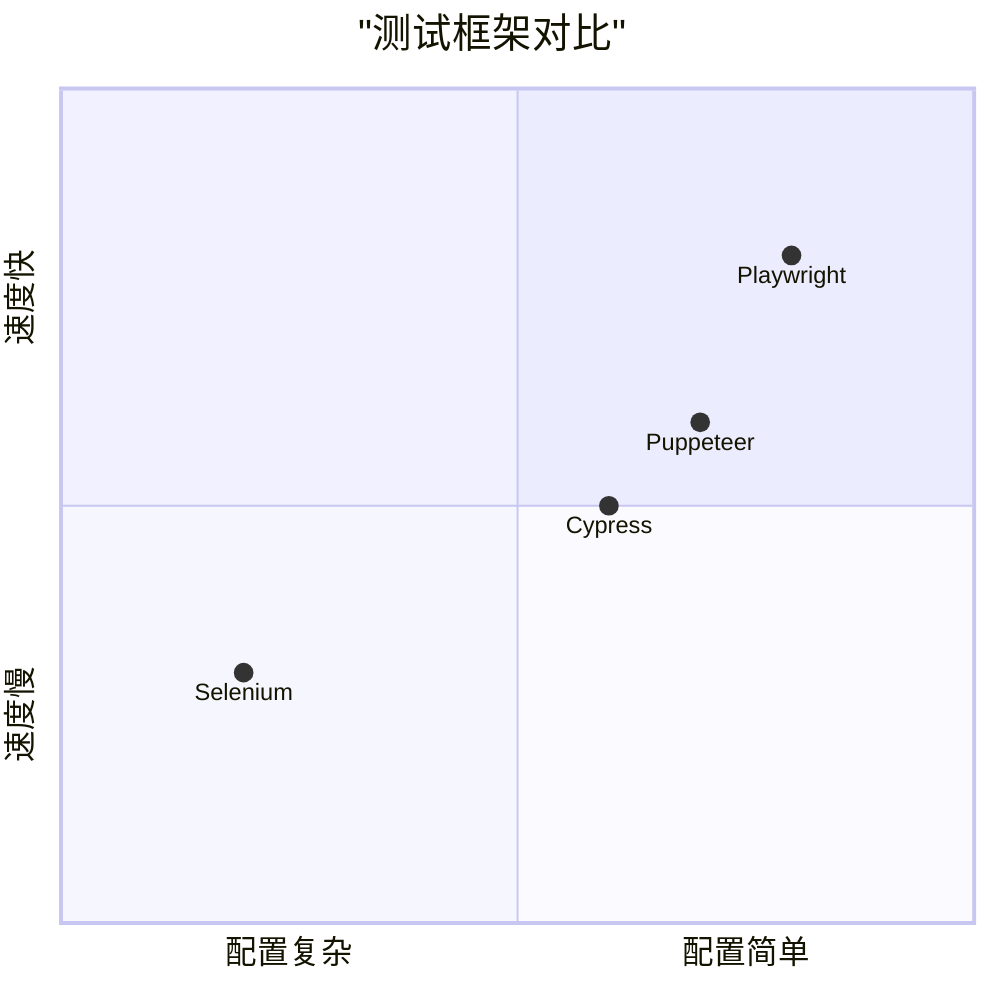
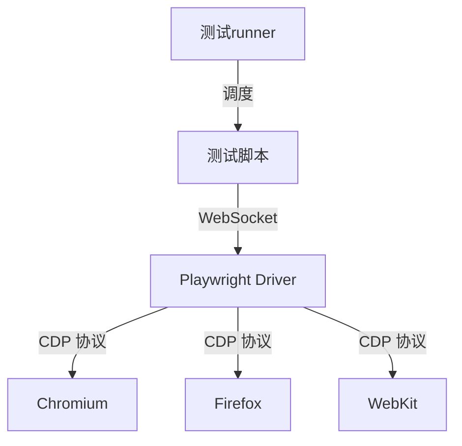
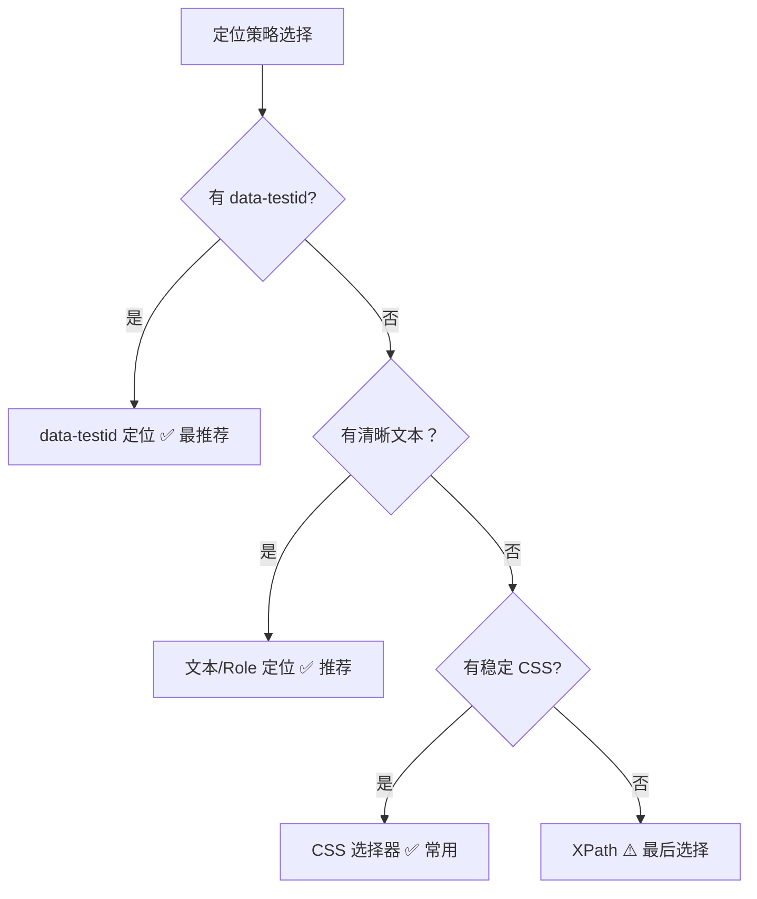
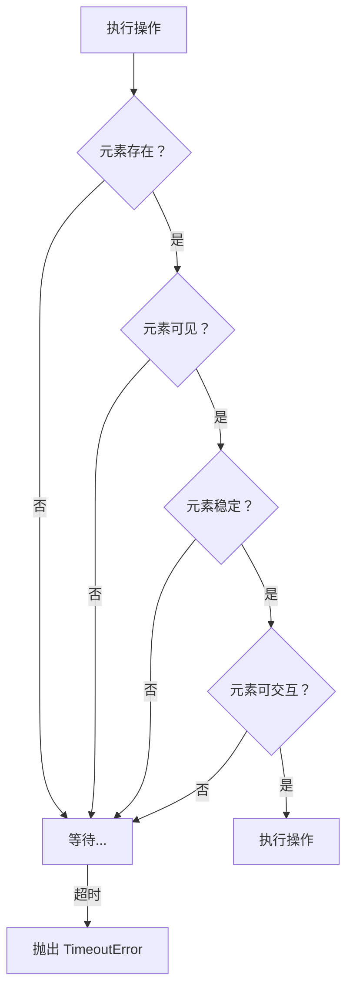
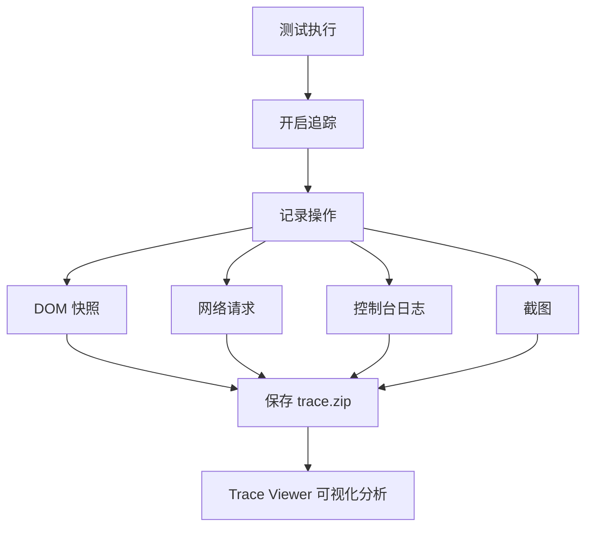

# Playwright 测试核心知识体系

> 新一代 Web 自动化测试框架

**最后更新：** 2026-04-05 | **版本：** 1.0.0

---

## 目录

1. [Playwright 基础认知](#第 1 章-playwright-基础认知)
2. [快速开始与配置](#第 2 章-快速开始与配置)
3. [核心 API 与定位器](#第 3 章-核心-api-与定位器)
4. [自动等待机制](#第 4 章-自动等待机制)
5. [断言系统](#第 5 章-断言系统)
6. [调试与 Trace Viewer](#第 6 章-调试与-trace-viewer)
7. [高级特性](#第 7 章-高级特性)
8. [实战最佳实践](#第 8 章-实战最佳实践)

---

## 第 1 章 Playwright 基础认知

### 1.1 什么是 Playwright

Playwright 是由微软开发的**开源端到端（E2E）测试框架**，支持所有主流浏览器和多种编程语言。它专为现代 Web 应用设计，提供可靠、快速且功能丰富的自动化测试解决方案。

**核心定义：**
- Playwright 是一个 E2E 测试框架，支持浏览器自动化
- 它支持 Chromium、Firefox、WebKit 三大浏览器引擎
- 它支持 TypeScript/JavaScript、Python、Java、.NET 多种语言
- 它提供跨浏览器、跨平台的测试能力

### 1.2 Playwright 与 Selenium 对比



| 维度 | Selenium | Playwright |
|------|----------|------------|
| 架构设计 | WebDriver（浏览器驱动） | CDP 协议（直接通信） |
| 执行速度 | 较慢（需经过 WebDriver） | 极快（直接浏览器协议） |
| 自动等待 | 需手动配置显式/隐式等待 | 内置自动等待 |
| 多标签/多窗口 | 支持但 API 复杂 | 支持且 API 简洁 |
| 网络拦截 | 不支持（需额外工具） | 原生支持 |
| 文件上传下载 | 复杂 | 简单 |
| 浏览器覆盖 | 广泛（包括移动端） | 主流桌面浏览器 |
| 定位器 | CSS/XPath | CSS/XPath/文本/Role |

### 1.3 为什么选择 Playwright

#### 1.3.1 核心优势

**1. 自动等待机制**

Playwright 在执行操作前自动等待元素满足条件，无需手动添加等待逻辑：

```typescript
// ❌ Selenium 需要手动等待
await WebDriverWait(driver, Duration.ofSeconds(10))
  .until(ExpectedConditions.elementToBeClickable(By.id('submit')));

// ✅ Playwright 自动等待
await page.click('#submit');  // 自动等待元素可点击
```

**2. 跨浏览器支持**

```typescript
import { chromium, firefox, webkit } from 'playwright'

// Chromium (Chrome/Edge)
const chromiumBrowser = await chromium.launch()

// Firefox
const firefoxBrowser = await firefox.launch()

// WebKit (Safari)
const webkitBrowser = await webkit.launch()
```

**3. 网络拦截能力**

```typescript
// 拦截 API 请求
await page.route('**/api/**', route => {
  route.fulfill({
    status: 200,
    body: JSON.stringify({ data: 'mocked' })
  })
})
```

#### 1.3.2 适用场景

- ✅ **E2E 测试** - 完整的用户流程测试
- ✅ **跨浏览器测试** - 验证多浏览器兼容性
- ✅ **API Mock** - 拦截和模拟网络请求
- ✅ **视觉回归测试** - 截图对比
- ✅ **爬虫开发** - 抓取动态网页内容
- ✅ **性能测试** - 测量页面加载时间

### 1.4 架构设计



**架构说明：**

| 组件 | 职责 |
|------|------|
| 测试脚本 | 用户编写的测试代码 |
| Playwright Driver | 核心驱动层，处理协议转换 |
| CDP 协议 | Chrome DevTools Protocol，直接与浏览器通信 |
| 浏览器 | Chromium/Firefox/WebKit 实际浏览器实例 |

---

## 第 2 章 快速开始与配置

### 2.1 安装与初始化

#### 2.1.1 Node.js/TypeScript 安装

```bash
# 初始化项目
npm init playwright@latest

# 或手动安装
npm install -D @playwright/test
npx playwright install  # 安装浏览器
```

#### 2.1.2 Python 安装

```bash
# 安装 Playwright
pip install playwright

# 安装浏览器
playwright install

# 安装 pytest 插件
pip install pytest-playwright
```

### 2.2 配置文件

#### 2.2.1 playwright.config.ts（Node.js）

```typescript
import { defineConfig, devices } from '@playwright/test'

export default defineConfig({
  // 测试目录
  testDir: './tests',
  
  // 超时设置
  timeout: 30 * 1000,
  expect: {
    timeout: 5000
  },
  
  // 失败重试次数
  retries: 2,
  
  // 并行执行
  workers: 4,
  
  // 报告器
  reporter: [
    ['html'],
    ['json', { outputFile: 'test-results.json' }],
    ['junit', { outputFile: 'test-results.xml' }]
  ],
  
  // 共享配置
  use: {
    // 浏览器选项
    headless: true,
    screenshot: 'only-on-failure',
    video: 'retain-on-failure',
    trace: 'retain-on-failure',
    
    // 基础 URL
    baseURL: 'http://localhost:3000',
    
    // 浏览器上下文选项
    locale: 'zh-CN',
    timezoneId: 'Asia/Shanghai'
  },
  
  // 多浏览器配置
  projects: [
    {
      name: 'chromium',
      use: { ...devices['Desktop Chrome'] }
    },
    {
      name: 'firefox',
      use: { ...devices['Desktop Firefox'] }
    },
    {
      name: 'webkit',
      use: { ...devices['Desktop Safari'] }
    },
    {
      name: 'Mobile Chrome',
      use: { ...devices['Pixel 5'] }
    },
    {
      name: 'Mobile Safari',
      use: { ...devices['iPhone 12'] }
    }
  ]
})
```

### 2.3 第一个测试

```typescript
import { test, expect } from '@playwright/test'

test('第一个 Playwright 测试', async ({ page }) => {
  // 导航到页面
  await page.goto('https://playwright.dev/')
  
  // 截图
  await page.screenshot({ path: 'example.png' })
  
  // 断言页面标题
  await expect(page).toHaveTitle(/Playwright/)
  
  // 点击链接
  await page.getByText('Get started').click()
  
  // 断言 URL
  await expect(page).toHaveURL(/.*intro/)
})
```

### 2.4 运行测试

```bash
# 运行所有测试
npx playwright test

# 运行特定测试文件
npx playwright test first-test.spec.ts

# 运行特定测试用例
npx playwright test -g "登录"

# 有头模式（显示浏览器）
npx playwright test --headed

# 指定浏览器
npx playwright test --project=chromium

# 调试模式
npx playwright test --debug

# 生成测试报告
npx playwright show-report
```

---

## 第 3 章 核心 API 与定位器

### 3.1 Page 对象

Page 是 Playwright 的核心对象，代表单个浏览器标签页：

```typescript
import { test } from '@playwright/test'

test('Page API 示例', async ({ page }) => {
  // 导航
  await page.goto('https://example.com')
  
  // 设置内容
  await page.setContent('<div>Hello</div>')
  
  // 截图
  await page.screenshot({ path: 'screenshot.png' })
  
  // PDF
  await page.pdf({ path: 'page.pdf' })
  
  // 执行 JS
  const title = await page.evaluate(() => document.title)
  
  // 网络等待
  await page.waitForLoadState('networkidle')
})
```

### 3.2 定位器（Locator）

#### 3.2.1 定位器优先级



#### 3.2.2 getByRole（语义化定位）

```typescript
// 按 ARIA 角色定位
await page.getByRole('button').click()
await page.getByRole('link', { name: '首页' }).click()
await page.getByRole('textbox', { name: '邮箱' }).fill('test@example.com')

// 常用角色
// button, link, textbox, checkbox, radio, combobox, listbox...
```

#### 3.2.3 getByText（文本定位）

```typescript
// 精确匹配
await page.getByText('登录').click()

// 模糊匹配
await page.getByText('欢迎').click()  // 包含"欢迎"即可

// 正则匹配
await page.getByText(/Log\s*in/i).click()  // 不区分大小写
```

#### 3.2.4 getByTestId（推荐）

```typescript
// 开发添加 data-testid 属性
// <button data-testid="submit-btn">提交</button>

await page.getByTestId('submit-btn').click()
await page.getByTestId('user-avatar').isVisible()
```

**团队协作建议：** 与开发团队约定统一的 `data-testid` 命名规范，避免因样式或结构调整导致测试失败。

#### 3.2.5 CSS 选择器

```typescript
// ID 定位
await page.locator('#submit-btn').click()

// Class 定位
await page.locator('.primary-button').click()

// 属性定位
await page.locator('[type="submit"]').click()
await page.locator('[name="email"]').fill('test@example.com')

// 层级定位
await page.locator('div.container > button').click()  // 直接子元素
await page.locator('div.container button').click()    // 后代元素

// 伪类选择
await page.locator('button:nth-child(2)').click()     // 第二个按钮
await page.locator('tr:nth-of-type(odd)')             // 奇数行
```

#### 3.2.6 XPath（最后选择）

```typescript
// 仅在 CSS 无法满足时使用
await page.locator('//button[contains(text(), "提交")]').click()
await page.locator('//input[@type="text" and @placeholder="手机号"]').fill('13800138000')

// 跨层级定位
await page.locator('//td[text()="张三"]/following-sibling::td/button').click()
```

### 3.3 定位器操作

```typescript
import { test, expect } from '@playwright/test'

test('定位器操作', async ({ page }) => {
  const button = page.getByRole('button')
  
  // 点击
  await button.click()
  await button.dblclick()
  await button.click({ button: 'right' })  // 右键
  
  // 输入
  await page.locator('#email').fill('test@example.com')
  await page.locator('#search').press('Enter')
  
  // 选择下拉框
  await page.locator('#country').selectOption('CN')
  await page.locator('#city').selectOption({ label: '北京' })
  
  // 复选框
  await page.locator('#agree').check()
  await page.locator('#agree').uncheck()
  await page.locator('#agree').isChecked()
  
  // 悬停
  await page.locator('.menu-item').hover()
  
  // 拖放
  await page.locator('.draggable').dragTo(page.locator('.droppable'))
})
```

### 3.4 定位器过滤与链式调用

```typescript
// 过滤
await page.locator('button').filter({ hasText: '提交' })
await page.locator('li').filter({ has: page.locator('.active') })

// 链式调用
await page
  .locator('div.container')
  .getByRole('button')
  .filter({ hasText: '确认' })
  .click()

// 获取多个
const items = page.locator('li')
await items.count()           // 数量
await items.first().click()   // 第一个
await items.last().click()    // 最后一个
await items.nth(2).click()    // 第三个（索引从 0 开始）
```

---

## 第 4 章 自动等待机制

### 4.1 自动等待原理

Playwright 在执行操作前会自动执行以下检查：



**检查条件：**

| 检查项 | 说明 |
|--------|------|
| 元素是否存在 | DOM 中至少有一个匹配元素 |
| 元素是否可见 | 没有 `display: none` 或 `visibility: hidden` |
| 元素是否稳定 | 元素没有动画或位置变化 |
| 元素是否可交互 | 没有被遮挡，`disabled` 属性为 false |

### 4.2 配置等待

```typescript
// 全局超时配置
export default defineConfig({
  timeout: 30000,        // 测试超时 30 秒
  expect: {
    timeout: 5000        // 断言超时 5 秒
  }
})

// 单个操作超时
await page.click('#submit', { timeout: 10000 })

// 显式等待
await page.waitForSelector('.loaded', { state: 'visible' })
await page.waitForTimeout(1000)  // 固定等待（不推荐）
```

### 4.3 等待状态

```typescript
// 等待页面加载状态
await page.waitForLoadState('load')         // load 事件触发
await page.waitForLoadState('domcontentloaded')  // DOMContentLoaded
await page.waitForLoadState('networkidle')  // 网络空闲（无请求 500ms）

// 等待特定条件
await page.waitForFunction(() => window.innerWidth > 1000)
await page.waitForSelector('.success-message')

// 等待导航
await page.waitForNavigation({ url: '**/dashboard' })
await page.getByRole('link').click()  // 点击后等待导航完成
```

### 4.4 自动重试

Playwright 的断言和部分操作会自动重试：

```typescript
// 断言自动重试直到成功或超时
await expect(page.getByText('提交成功')).toBeVisible()

// 操作自动重试
await page.click('#submit', { trial: false })  // trial: true 时只检查不执行
```

---

## 第 5 章 断言系统

### 5.1 Web 优先断言

Playwright 的断言会自动重试直到条件满足：

```typescript
import { expect } from '@playwright/test'

// 页面断言
await expect(page).toHaveTitle(/首页/)
await expect(page).toHaveURL('**/dashboard')

// 元素断言
const button = page.getByRole('button')
await expect(button).toBeVisible()
await expect(button).toBeEnabled()
await expect(button).toHaveText('提交')
await expect(button).toHaveAttribute('type', 'submit')

// 计数断言
await expect(page.locator('li')).toHaveCount(5)

// 包含关系
await expect(page.locator('ul')).toContainText(['项目 1', '项目 2'])
```

### 5.2 常用断言类型

```typescript
// 可见性
await expect(locator).toBeVisible()
await expect(locator).toBeHidden()
await expect(locator).toBeEnabled()
await expect(locator).toBeDisabled()

// 文本内容
await expect(locator).toHaveText('完整文本')
await expect(locator).toContainText('部分文本')
await expect(locator).toHaveText(/正则匹配/)

// 属性
await expect(locator).toHaveAttribute('href', '/link')
await expect(locator).toHaveValue('输入框内容')
await expect(locator).toHaveClass(/active/)

// 计数
await expect(page.locator('tr')).toHaveCount(10)

// 截图对比（视觉回归）
await expect(page).toHaveScreenshot('homepage.png')
```

### 5.3 软断言

软断言失败后测试继续执行：

```typescript
import { expect } from '@playwright/test'

// 软断言（失败后继续）
await expect.soft(page.locator('.header')).toHaveText('标题')
await expect.soft(page.locator('.content')).toContainText('内容')

// 测试结束时会汇总所有软断言的失败
```

---

## 第 6 章 调试与 Trace Viewer

### 6.1 调试模式

```bash
# 调试模式运行
npx playwright test --debug

# 有头模式 + 慢动作
npx playwright test --headed --slowmo=1000
```

### 6.2 Trace Viewer

Trace Viewer 是 Playwright 最强大的调试工具，提供录屏级的追踪：



#### 6.2.1 配置追踪

```typescript
// playwright.config.ts
export default defineConfig({
  use: {
    trace: 'retain-on-failure'  // 失败时保留追踪
    // 其他选项：'off' | 'on-first-retry' | 'on-all-retries' | 'retain-on-failure'
  }
})
```

#### 6.2.2 代码中控制

```typescript
test('带追踪的测试', async ({ page, context }) => {
  // 开始追踪
  await context.tracing.start({
    screenshots: true,    // 记录截图
    snapshots: true,      // 记录 DOM 快照
    sources: true         // 关联源代码
  })
  
  // 执行测试
  await page.goto('https://example.com')
  await page.click('#submit')
  
  // 停止追踪
  await context.tracing.stop({ path: 'trace.zip' })
})
```

#### 6.2.3 查看追踪

```bash
# 本地查看
npx playwright show-trace trace.zip

# 在线查看（上传到 https://trace.playwright.dev/）
```

**Trace Viewer 功能：**
- 左侧时间轴：点击步骤回放
- 中央视窗：DOM 快照（支持元素检查）
- 右侧面板：Action Log、Console、Network 详情

### 6.3 测试报告

```bash
# 生成 HTML 报告
npx playwright show-report

# 配置多个报告器
export default defineConfig({
  reporter: [
    ['html'],           // HTML 报告
    ['json'],           // JSON 报告
    ['junit'],          // JUnit XML
    ['github']          // GitHub Actions 注释
  ]
})
```

---

## 第 7 章 高级特性

### 7.1 网络拦截

```typescript
// 拦截 API 请求
await page.route('**/api/users', route => {
  route.fulfill({
    status: 200,
    body: JSON.stringify({ users: ['Alice', 'Bob'] })
  })
})

// 修改请求
await page.route('**/api/**', route => {
  const request = route.request()
  console.log('请求:', request.url(), request.method())
  route.continue()
})

// 模拟错误
await page.route('**/api/error', route => {
  route.abort('failed')  // 模拟网络失败
})

// 等待特定请求
const [response] = await Promise.all([
  page.waitForResponse('**/api/submit'),
  page.click('#submit-btn')
])
console.log('响应状态:', response.status())
```

### 7.2 文件处理

```typescript
// 文件下载
const [download] = await Promise.all([
  page.waitForEvent('download'),
  page.click('#download-btn')
])
await download.saveAs('./downloads/file.pdf')

// 文件上传
await page.locator('input[type="file"]').setInputFiles('./file.txt')

// 多文件上传
await page.locator('input[type="file"]').setInputFiles([
  './file1.txt',
  './file2.pdf'
])
```

### 7.3 多标签页与多浏览器

```typescript
// 多标签页
const [popup] = await Promise.all([
  page.waitForEvent('popup'),
  page.getByRole('link', { name: '新窗口' }).click()
])
await popup.click('#submit')

// 多浏览器上下文
const context1 = await browser.newContext()
const context2 = await browser.newContext()
const page1 = await context1.newPage()
const page2 = await context2.newPage()

// 模拟不同用户
await page1.goto('/login')
await page2.goto('/login')
```

### 7.4 身份验证

```typescript
// 保存认证状态
test('登录并保存状态', async ({ page, browser }) => {
  await page.goto('/login')
  await page.fill('#email', 'user@example.com')
  await page.fill('#password', 'password')
  await page.click('#submit')
  
  // 保存 storage state
  await page.context().storageState({ path: 'auth.json' })
})

// 复用认证状态
test('使用已认证状态', async ({ browser }) => {
  const context = await browser.newContext({
    storageState: 'auth.json'
  })
  const page = await context.newPage()
  await page.goto('/dashboard')  // 已登录
})
```

### 7.5 移动端测试

```typescript
import { devices } from '@playwright/test'

// 使用预定义设备
test('Mobile Safari', async ({ browser }) => {
  const context = await browser.newContext({
    ...devices['iPhone 12']
  })
  const page = await context.newPage()
  await page.goto('https://example.com')
})

// 自定义设备
test('Custom Device', async ({ browser }) => {
  const context = await browser.newContext({
    viewport: { width: 414, height: 896 },
    deviceScaleFactor: 2,
    isMobile: true,
    hasTouch: true
  })
})
```

### 7.6 并行执行

```typescript
// playwright.config.ts
export default defineConfig({
  // 工作进程数
  workers: 4,
  
  // 或根据 CPU 核心
  workers: '100%',  // 使用所有 CPU 核心
  
  // 每个文件最大工人
  maxFailures: 10,  // 失败 10 次后停止
})
```

---

## 第 8 章 实战最佳实践

### 8.1 页面对象模式（Page Object）

```typescript
// pages/LoginPage.ts
import { Page, Locator } from '@playwright/test'

export class LoginPage {
  readonly page: Page
  readonly emailInput: Locator
  readonly passwordInput: Locator
  readonly submitButton: Locator

  constructor(page: Page) {
    this.page = page
    this.emailInput = page.getByTestId('email-input')
    this.passwordInput = page.getByTestId('password-input')
    this.submitButton = page.getByRole('button', { name: '登录' })
  }

  async goto() {
    await this.page.goto('/login')
  }

  async login(email: string, password: string) {
    await this.emailInput.fill(email)
    await this.passwordInput.fill(password)
    await this.submitButton.click()
  }
}

// tests/login.spec.ts
import { test, expect } from '@playwright/test'
import { LoginPage } from '../pages/LoginPage'

test('登录成功', async ({ page }) => {
  const loginPage = new LoginPage(page)
  await loginPage.goto()
  await loginPage.login('user@example.com', 'password')
  await expect(page).toHaveURL('**/dashboard')
})
```

### 8.2 测试夹具（Fixtures）

```typescript
// tests/fixtures.ts
import { test as base } from '@playwright/test'
import { LoginPage } from '../pages/LoginPage'

type MyFixtures = {
  loginPage: LoginPage
  authenticatedPage: Page
}

export const test = base.extend<MyFixtures>({
  loginPage: async ({ page }, use) => {
    const loginPage = new LoginPage(page)
    await loginPage.goto()
    await use(loginPage)
  },
  
  authenticatedPage: async ({ browser }, use) => {
    const context = await browser.newContext({
      storageState: 'auth.json'
    })
    const page = await context.newPage()
    await use(page)
    await context.close()
  }
})

// tests/dashboard.spec.ts
import { test, expect } from './fixtures'

test('访问仪表盘', async ({ authenticatedPage }) => {
  await authenticatedPage.goto('/dashboard')
  await expect(authenticatedPage).toHaveTitle('仪表盘')
})
```

### 8.3 数据驱动测试

```typescript
import { test, expect } from '@playwright/test'

const users = [
  { email: 'user1@example.com', name: '用户 1' },
  { email: 'user2@example.com', name: '用户 2' },
  { email: 'user3@example.com', name: '用户 3' }
]

for (const user of users) {
  test(`登录：${user.email}`, async ({ page }) => {
    await page.goto('/login')
    await page.fill('#email', user.email)
    await page.fill('#password', 'password')
    await page.click('#submit')
    await expect(page.getByText(user.name)).toBeVisible()
  })
}
```

### 8.4 CI/CD 集成

```yaml
# .github/workflows/playwright.yml
name: Playwright Tests

on: [push, pull_request]

jobs:
  test:
    runs-on: ubuntu-latest
    steps:
      - uses: actions/checkout@v4
      
      - uses: actions/setup-node@v4
        with:
          node-version: '20'
      
      - name: Install dependencies
        run: |
          npm ci
          npx playwright install --with-deps
      
      - name: Run tests
        run: npx playwright test
      
      - name: Upload test report
        uses: actions/upload-artifact@v4
        if: always()
        with:
          name: playwright-report
          path: playwright-report/
          retention-days: 30
```

### 8.5 常见问题与解决方案

#### 8.5.1 元素定位失败

**问题：** `Error: Locator resolved to 0 elements`

**解决方案：**
1. 使用 Trace Viewer 分析 DOM 结构
2. 检查元素是否在 iframe 中（需要切换 frame）
3. 使用更稳定的定位策略（data-testid > role > text > CSS）
4. 添加适当的等待条件

#### 8.5.2 测试不稳定（Flaky Tests）

**问题：** 测试有时通过有时失败

**解决方案：**
```typescript
// 配置重试
export default defineConfig({
  retries: 2,  // 失败重试 2 次
  
  // 使用项目隔离
  projects: [
    { name: 'setup', testMatch: /global.setup.ts/ },
    { 
      name: 'chromium',
      use: { ...devices['Desktop Chrome'] },
      dependencies: ['setup']
    }
  ]
})
```

#### 8.5.3 跨域问题

**问题：** 测试涉及多个域名

**解决方案：**
```typescript
test('跨域测试', async ({ browser }) => {
  const context = await browser.newContext({
    bypassCSP: true  // 绕过 CSP
  })
  const page = await context.newPage()
  
  await page.goto('https://domain-a.com')
  // ...
  await page.goto('https://domain-b.com')
  // ...
})
```

---

## 附录 A：常用命令速查

```bash
# 安装
npm init playwright@latest
npx playwright install

# 运行
npx playwright test
npx playwright test --headed
npx playwright test --debug

# 报告
npx playwright show-report
npx playwright show-trace trace.zip

# 浏览器
npx playwright install chromium
npx playwright install firefox
npx playwright install webkit
```

---

## 参考资料

- [Playwright 官方文档](https://playwright.dev/)
- [Playwright GitHub](https://github.com/microsoft/playwright)
- [Playwright Trace Viewer](https://trace.playwright.dev/)

---

*文档版本：1.0.0 | 最后更新：2026-04-05*
