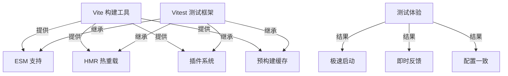
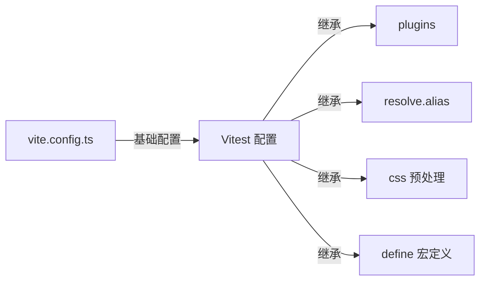
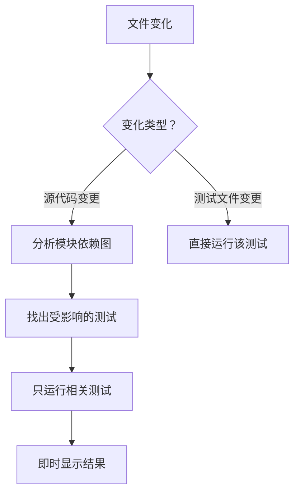
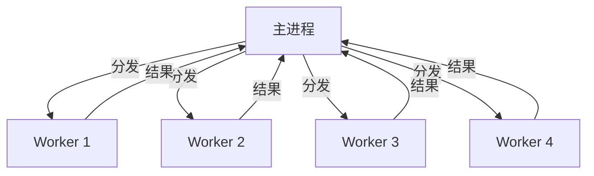
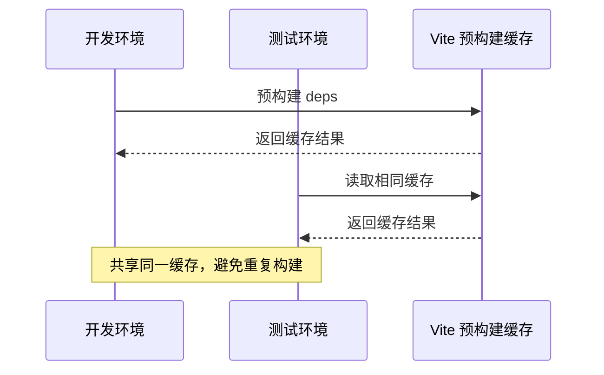

# Vitest 核心知识体系

> 下一代由 Vite 驱动的测试框架

**最后更新：** 2026-04-05 | **版本：** 1.0.0

---

## 目录

1. [Vitest 基础认知](#第 1 章-vitest-基础认知)
2. [快速开始与配置](#第 2 章-快速开始与配置)
3. [核心测试 API](#第 3 章-核心测试-api)
4. [Mock 与依赖注入](#第 4 章-mock-与依赖注入)
5. [组件测试](#第 5 章-组件测试)
6. [快照测试与覆盖率](#第 6 章-快照测试与覆盖率)
7. [高级特性与原理](#第 7 章-高级特性与原理)
8. [实战最佳实践](#第 8 章-实战最佳实践)

---

## 第 1 章 Vitest 基础认知

### 1.1 什么是 Vitest

Vitest 是一个由 Vite 团队开发的**下一代测试框架**，专为现代前端项目设计。它充分利用 Vite 的构建能力，提供极速的测试体验和丰富的功能集。

**核心定义：**
- Vitest 是一个单元测试框架，支持集成测试和端到端测试
- 它基于 Vite 构建，原生理解 Vite 配置
- 它兼容 Jest API，迁移成本低
- 它支持浏览器和非浏览器（Node.js）环境

### 1.2 Vitest 与 Vite/Jest 的关系

#### 1.2.1 Vitest 与 Vite



**关系说明：**

| 特性 | Vite 提供 | Vitest 继承 |
|------|----------|------------|
| ESM 支持 | ✅ 原生 ES 模块 | ✅ 无需配置 |
| HMR | ✅ 热模块替换 | ✅ 测试热重载 |
| 插件系统 | ✅ Rollup 插件 | ✅ 复用 Vite 插件 |
| 预构建缓存 | ✅ deps 预打包 | ✅ 共享缓存 |
| 配置结构 | ✅ vite.config.ts | ✅ vitest.config.ts |

**配置继承示例：**

```typescript
// vite.config.ts
import { defineConfig } from 'vite'
import react from '@vitejs/plugin-react'

export default defineConfig({
  plugins: [react()],
  resolve: {
    alias: {
      '@': '/src'
    }
  },
  // Vitest 配置作为 test 字段嵌入
  test: {
    globals: true,
    environment: 'jsdom'
  }
})
```

#### 1.2.2 Vitest 与 Jest


**核心差异对比：**

| 维度 | Jest | Vitest |
|------|------|--------|
| 构建基础 | CommonJS + Babel | Native ESM + Vite |
| 启动速度 | 较慢（需转译） | 极快（原生 ESM） |
| Watch 模式 | 全量重跑 | 智能增量 |
| 配置方式 | jest.config.js | vitest.config.ts（嵌入 Vite） |
| ESM 支持 | 需额外配置 | 开箱即用 |
| TypeScript | 需 ts-jest | 开箱即用 |
| 覆盖率 | Istanbul | Istanbul / V8 |

**API 兼容性：**

```typescript
// Jest 写法
import { describe, it, expect, jest } from '@jest/globals'

// Vitest 写法（完全兼容）
import { describe, it, expect, vi } from 'vitest'

// 几乎相同的 API
describe('测试套件', () => {
  it('测试用例', () => {
    expect(1 + 1).toBe(2)
  })
})
```

### 1.3 为什么需要 Vitest（诞生背景）

**传统测试框架的痛点：**

1. **启动缓慢** - Jest 需要初始化完整的运行环境，大型项目启动需数秒
2. **配置复杂** - 需要单独配置测试环境的转译、模块解析
3. **反馈延迟** - Watch 模式下修改代码后需等待完整测试重跑
4. **ESM 支持差** - 需要额外配置才能测试 ESM 模块
5. **配置不一致** - 开发、构建、测试使用不同配置栈

**Vitest 的解决方案：**

| 问题 | Vitest 方案 |
|------|------------|
| 启动慢 | 共享 Vite 预构建缓存，启动从秒级降至毫秒级 |
| 配置复杂 | 复用 Vite 配置，零额外配置 |
| 反馈延迟 | HMR 式热重载，只运行相关测试 |
| ESM 支持 | 原生 ESM，无需转换 |
| 配置不一致 | 开发/构建/测试统一配置栈 |

**性能提升数据（来自社区实测）：**

```
100 个测试文件的项目对比：

指标              | Jest    | Vitest  | 提升
-----------------|---------|---------|--------
冷启动时间        | 3.2s    | 0.4s    | 87%↑
Watch 响应时间    | 2.1s    | 0.8s    | 62%↑
内存占用          | 450MB   | 280MB   | 38%↓
```

### 1.4 适用场景与局限性

#### 1.4.1 推荐使用场景

- ✅ **Vite 项目** - 无缝集成，配置零成本
- ✅ **TypeScript 项目** - 开箱即用，无需 ts-jest
- ✅ **React/Vue 组件测试** - 支持 JSX，配合 Testing Library
- ✅ **Node.js 后端测试** - 支持 CommonJS 和 ESM
- ✅ **需要快速反馈的项目** - Watch 模式体验极佳

#### 1.4.2 局限性

- ⚠️ **非 Vite 项目** - 虽可用但失去配置一致性优势
- ⚠️ **超大型单文件测试** - 文件内测试并发需手动配置
- ⚠️ **需要 Jest 特定功能** - 部分 Jest 插件不兼容

---

## 第 2 章 快速开始与配置

### 2.1 安装与初始化

#### 2.1.1 基础安装

```bash
# npm
npm install -D vitest

# yarn
yarn add -D vitest

# pnpm
pnpm add -D vitest
```

#### 2.1.2 package.json 配置

```json
{
  "scripts": {
    "test": "vitest",
    "test:watch": "vitest --watch",
    "test:run": "vitest run",
    "test:coverage": "vitest run --coverage",
    "test:ui": "vitest --ui"
  }
}
```

**命令说明：**

| 命令 | 说明 |
|------|------|
| `vitest` | 默认启动 Watch 模式 |
| `vitest run` | 单次运行（适合 CI） |
| `vitest --coverage` | 生成覆盖率报告 |
| `vitest --ui` | 打开可视化 UI 界面 |

### 2.2 vitest.config.ts 配置详解

#### 2.2.1 基础配置

```typescript
/// <reference types="vitest" />
import { defineConfig } from 'vitest/config'

export default defineConfig({
  test: {
    // 全局注册测试 API（可在测试中直接使用 describe/it/expect）
    globals: true,
    
    // 测试环境：'jsdom' | 'node' | 'happy-dom' | 'edge-runtime'
    environment: 'jsdom',
    
    // 测试文件匹配模式
    include: ['**/*.{test,spec}.{js,mjs,cjs,ts,mts,cts,jsx,tsx}'],
    
    // 排除的文件
    exclude: ['**/node_modules/**', '**/dist/**', '**/e2e/**'],
    
    // 超时时间（毫秒）
    timeout: 5000,
    
    // 是否监听测试文件变化
    watch: true
  }
})
```

#### 2.2.2 常用配置选项

```typescript
import { defineConfig } from 'vitest/config'
import vue from '@vitejs/plugin-vue'
import path from 'path'

export default defineConfig({
  plugins: [vue()],
  resolve: {
    alias: {
      '@': path.resolve(__dirname, './src')
    }
  },
  test: {
    // === 环境配置 ===
    environment: 'jsdom',
    
    // === 全局配置 ===
    globals: true,              // 全局注册 describe/it/expect
    setupFiles: ['./vitest.setup.ts'],  // setup 文件
    
    // === 文件匹配 ===
    include: ['src/**/*.{test,spec}.{ts,tsx}'],
    exclude: ['**/node_modules/**', '**/e2e/**'],
    
    // === 行为配置 ===
    watch: true,                // Watch 模式
    pool: 'threads',            // 线程池类型
    maxWorkers: 4,              // 最大工作进程数
    minWorkers: 1,              // 最小工作进程数
    
    // === 覆盖率配置 ===
    coverage: {
      provider: 'v8',           // 'v8' | 'istanbul'
      reporter: ['text', 'json', 'html'],
      exclude: ['node_modules/', '**/*.d.ts']
    },
    
    // === 浏览器测试配置 ===
    browser: {
      enabled: true,
      name: 'chromium',
      provider: 'playwright'
    }
  }
})
```

### 2.3 与 Vite 配置的继承关系

**配置继承流程：**



**继承内容：**

| Vite 配置项 | Vitest 是否继承 | 说明 |
|------------|----------------|------|
| `plugins` | ✅ | 所有 Vite 插件自动生效 |
| `resolve.alias` | ✅ | 路径别名直接可用 |
| `css` | ✅ | CSS 模块和预处理器配置 |
| `define` | ✅ | 全局宏定义（如 `import.meta.env`） |
| `optimizeDeps` | ✅ | 依赖预优化配置 |
| `server` | ❌ | 开发服务器配置不继承 |

### 2.4 TypeScript/JSX/ESM 支持

#### 2.4.1 TypeScript

Vitest **开箱即用** TypeScript 支持，无需额外配置：

```typescript
// math.ts
export const add = (a: number, b: number): number => a + b

// math.test.ts - 直接 import 测试
import { describe, it, expect } from 'vitest'
import { add } from './math'

describe('add 函数', () => {
  it('正确计算加法', () => {
    expect(add(1, 2)).toBe(3)
  })
})
```

#### 2.4.2 JSX/TSX

```typescript
// Button.tsx
export const Button = ({ label }: { label: string }) => {
  return <button>{label}</button>
}

// Button.test.tsx - 直接测试组件
import { render, screen } from '@testing-library/react'
import { Button } from './Button'

it('渲染按钮文本', () => {
  render(<Button label="点击我" />)
  expect(screen.getByText('点击我')).toBeInTheDocument()
})
```

#### 2.4.3 ESM

原生 ESM 支持，无需转换：

```typescript
// 直接使用 ESM 语法
import { add } from './math.js'
import { describe, it, expect } from 'vitest'

// 动态导入也支持
const { subtract } = await import('./math.js')
```

---

## 第 3 章 核心测试 API

### 3.1 测试套件与测试用例

#### 3.1.1 describe - 测试套件

```typescript
import { describe, it, test } from 'vitest'

// describe 用于组织测试套件
describe('数学运算模块', () => {
  // 嵌套 describe
  describe('加法运算', () => {
    it('两个正数相加', () => {
      // 测试逻辑
    })
    
    it('负数相加', () => {
      // 测试逻辑
    })
  })
  
  describe('减法运算', () => {
    test('基本减法', () => {
      // test 是 it 的别名
    })
  })
})
```

#### 3.1.2 it/test - 测试用例

```typescript
import { it, test, expect } from 'vitest'

// it 和 test 完全等价
it('应该返回正确结果', () => {
  expect(1 + 1).toBe(2)
})

test('应该处理边界情况', () => {
  expect(Number.MAX_SAFE_INTEGER + 1).toBe(9007199254740992)
})

// 异步测试
it('异步操作', async () => {
  const result = await fetchData()
  expect(result).toEqual({ status: 'success' })
})

// 带超时的测试
it('长时间运行的操作', { timeout: 10000 }, async () => {
  await longRunningTask()
})
```

### 3.2 断言系统（expect）

#### 3.2.1 基础断言

```typescript
import { expect } from 'vitest'

// 相等性断言
expect(value).toBe(expected)           // 严格相等 (===)
expect(value).toEqual({ key: 'val' })  // 深度相等
expect(value).toBeNull()
expect(value).toBeUndefined()
expect(value).toBeDefined()

// 布尔值断言
expect(value).toBeTruthy()
expect(value).toBeFalsy()

// 数字断言
expect(num).toBeGreaterThan(10)
expect(num).toBeLessThan(100)
expect(num).toBeCloseTo(3.14, 2)  // 浮点数接近

// 字符串断言
expect(str).toContain('substring')
expect(str).toMatch(/regex/)

// 数组断言
expect(arr).toContain('item')
expect(arr).toHaveLength(3)
```

#### 3.2.2 对象断言

```typescript
const user = {
  id: 1,
  name: '张三',
  email: 'zhangsan@example.com'
}

// 完整匹配
expect(user).toEqual({
  id: 1,
  name: '张三',
  email: 'zhangsan@example.com'
})

// 部分匹配（包含关键属性）
expect(user).toEqual(
  expect.objectContaining({
    id: 1,
    name: '张三'
  })
)

// 属性类型检查
expect(user).toEqual({
  id: expect.any(Number),
  name: expect.any(String),
  email: expect.stringContaining('@')
})
```

#### 3.2.3 错误断言

```typescript
// 函数抛出错误
expect(() => {
  throw new Error('test error')
}).toThrow()

expect(() => {
  throw new Error('test error')
}).toThrow('test error')

expect(() => {
  throw new Error('test error')
}).toThrowError(Error)
```

### 3.3 异步测试

#### 3.3.1 Promise 测试

```typescript
// 方式 1: async/await（推荐）
it('获取用户数据', async () => {
  const user = await fetchUser(1)
  expect(user.id).toBe(1)
})

// 方式 2: 返回 Promise
it('获取用户数据', () => {
  return fetchUser(1).then(user => {
    expect(user.id).toBe(1)
  })
})
```

#### 3.3.2 异步错误处理

```typescript
// 测试 Promise 拒绝
it('处理 API 错误', async () => {
  await expect(fetchUser(-1)).rejects.toThrow('User not found')
})

// 或者使用 try-catch
it('处理 API 错误', async () => {
  try {
    await fetchUser(-1)
  } catch (error) {
    expect(error.message).toBe('User not found')
  }
})
```

### 3.4 测试超时与重试

```typescript
import { it, expect } from 'vitest'

// 单个测试超时
it('超时设置', { timeout: 10000 }, async () => {
  await slowOperation()
})

// 重试机制（适合不稳定的测试）
it('不稳定的 API', { retry: 3 }, async () => {
  const data = await unstableApi()
  expect(data.status).toBe('success')
})
```

---

## 第 4 章 Mock 与依赖注入

### 4.1 vi.mock() 模块模拟

#### 4.1.1 基础用法

```typescript
import { vi, expect, it } from 'vitest'
import { calculateTotal } from './priceCalculator'

// 完全替换模块实现
vi.mock('./priceCalculator', () => ({
  calculateTotal: vi.fn(() => 100)  // 固定返回 100
}))

it('使用 mock 的 calculateTotal', () => {
  expect(calculateTotal()).toBe(100)
})
```

#### 4.1.2 部分 Mock（保留部分原始实现）

```typescript
import { vi } from 'vitest'

vi.mock('./complexModule', async () => {
  // 获取原始模块
  const actual = await vi.importActual('./complexModule')
  
  return {
    ...actual,  // 保留原始导出
    expensiveOperation: vi.fn(() => 'mock-result')  // 只 mock 特定函数
  }
})
```

#### 4.1.3 Mock 计时器

```typescript
import { vi, it, expect } from 'vitest'

vi.useFakeTimers()  // 启用假计时器

it('测试定时器', () => {
  const callback = vi.fn()
  setTimeout(callback, 1000)
  
  // 时间快进
  vi.advanceTimersByTime(1000)
  
  expect(callback).toHaveBeenCalledTimes(1)
})

// 恢复真实计时器
vi.useRealTimers()
```

### 4.2 vi.fn() / vi.spyOn() 函数模拟

#### 4.2.1 vi.fn() 创建模拟函数

```typescript
import { vi, expect } from 'vitest'

// 基础用法
const fn = vi.fn()
fn('hello', 'world')
expect(fn.mock.calls[0]).toEqual(['hello', 'world'])

// 带返回值
const mockFn = vi.fn()
  .mockReturnValueOnce('first')
  .mockReturnValueOnce('second')
  .mockReturnValue('default')

mockFn()  // 'first'
mockFn()  // 'second'
mockFn()  // 'default'

// 带实现
const implFn = vi.fn((a: number, b: number) => a + b)
expect(implFn(2, 3)).toBe(5)
```

#### 4.2.2 vi.spyOn() 监控方法调用

```typescript
import { vi, expect } from 'vitest'

const market = {
  getApples: () => 100
}

// 监控方法调用
const spy = vi.spyOn(market, 'getApples')

market.getApples()

expect(spy).toHaveBeenCalledTimes(1)
expect(spy).toHaveReturnedWith(100)

// 模拟实现
spy.mockImplementation(() => 50)
expect(market.getApples()).toBe(50)
```

### 4.3 常见 Mock 场景

#### 4.3.1 API 请求 Mock

```typescript
import { vi } from 'vitest'

// Mock fetch
global.fetch = vi.fn()

beforeEach(() => {
  fetch.mockResolvedValue({
    ok: true,
    json: async () => ({ data: 'mocked' })
  })
})

it('获取数据', async () => {
  const response = await fetch('/api/data')
  const data = await response.json()
  expect(data).toEqual({ data: 'mocked' })
})
```

#### 4.3.2 依赖注入模式

```typescript
// 被测试模块
export class UserService {
  constructor(private apiClient: ApiClient) {}
  
  async getUser(id: number) {
    return this.apiClient.fetch(`/users/${id}`)
  }
}

// 测试
import { vi } from 'vitest'

const mockApiClient = {
  fetch: vi.fn().mockResolvedValue({ id: 1, name: '张三' })
}

it('获取用户', async () => {
  const service = new UserService(mockApiClient)
  const user = await service.getUser(1)
  expect(user.name).toBe('张三')
})
```

---

## 第 5 章 组件测试

### 5.1 React 组件测试

#### 5.1.1 基础配置

```bash
npm install -D @testing-library/react @testing-library/jest-dom
```

```typescript
// vitest.setup.ts
import '@testing-library/jest-dom'
```

#### 5.1.2 组件测试示例

```typescript
import { render, screen, fireEvent } from '@testing-library/react'
import { describe, it, expect } from 'vitest'
import { Button } from './Button'

describe('Button 组件', () => {
  it('渲染按钮文本', () => {
    render(<Button label="点击我" />)
    expect(screen.getByText('点击我')).toBeInTheDocument()
  })
  
  it('处理点击事件', () => {
    const handleClick = vi.fn()
    render(<Button label="点击" onClick={handleClick} />)
    
    fireEvent.click(screen.getByText('点击'))
    expect(handleClick).toHaveBeenCalledTimes(1)
  })
  
  it('禁用状态', () => {
    render(<Button label="禁用" disabled />)
    expect(screen.getByText('禁用')).toBeDisabled()
  })
})
```

### 5.2 Vue 组件测试

#### 5.2.1 基础配置

```bash
npm install -D @vue/test-utils
```

```typescript
// vitest.config.ts
import { defineConfig } from 'vitest/config'
import vue from '@vitejs/plugin-vue'

export default defineConfig({
  plugins: [vue()],
  test: {
    environment: 'jsdom',
    globals: true
  }
})
```

#### 5.2.2 组件测试示例

```vue
<!-- HelloWorld.vue -->
<template>
  <div>
    <h1>{{ message }}</h1>
    <button @click="updateMessage">点击我</button>
  </div>
</template>

<script setup lang="ts">
import { ref } from 'vue'
const message = ref('你好，Vue!')
function updateMessage() {
  message.value = '你点击了按钮!'
}
</script>
```

```typescript
import { mount } from '@vue/test-utils'
import { describe, it, expect } from 'vitest'
import HelloWorld from './HelloWorld.vue'

describe('HelloWorld 组件', () => {
  it('渲染初始消息', () => {
    const wrapper = mount(HelloWorld)
    expect(wrapper.find('h1').text()).toBe('你好，Vue!')
  })
  
  it('更新消息', async () => {
    const wrapper = mount(HelloWorld)
    await wrapper.find('button').trigger('click')
    expect(wrapper.find('h1').text()).toBe('你点击了按钮!')
  })
})
```

### 5.3 浏览器模式测试

#### 5.3.1 安装与配置

```bash
npm install -D @vitest/browser-playwright
```

```typescript
// vitest.config.ts
import { defineConfig } from 'vitest/config'
import { playwright } from '@vitest/browser-playwright'

export default defineConfig({
  test: {
    browser: {
      enabled: true,
      provider: 'playwright',
      name: 'chromium'
    }
  }
})
```

#### 5.3.2 浏览器测试示例

```typescript
import { page } from '@vitest/browser'
import { expect, test } from 'vitest'

test('导航测试', async () => {
  await page.goto('/login')
  await page.getByLabel('用户名').fill('admin')
  await page.getByLabel('密码').fill('password')
  await page.getByRole('button', { name: '登录' }).click()
  
  await expect(page.getByText('欢迎回来')).toBeVisible()
})
```

---

## 第 6 章 快照测试与覆盖率

### 6.1 基础快照测试

#### 6.1.1 对象快照

```typescript
import { expect, test } from 'vitest'

test('用户对象快照', () => {
  const user = {
    id: 1,
    name: '张三',
    email: 'zhangsan@example.com',
    roles: ['admin', 'user']
  }
  
  expect(user).toMatchSnapshot()
})
```

**首次运行生成快照文件：**

```
// __snapshots__/user.test.ts.snap
exports[`用户对象快照 1`] = `
{
  "email": "zhangsan@example.com",
  "id": 1,
  "name": "张三",
  "roles": [
    "admin",
    "user"
  ]
}
`
```

#### 6.1.2 内联快照

```typescript
import { expect, test } from 'vitest'

test('内联快照', () => {
  const config = {
    apiUrl: 'https://api.example.com',
    timeout: 5000
  }
  
  // 快照直接嵌入测试文件
  expect(config).toMatchInlineSnapshot(`
    {
      "apiUrl": "https://api.example.com",
      "timeout": 5000,
    }
  `)
})
```

### 6.2 更新快照

```bash
# 更新所有快照
npx vitest -u

# 更新特定文件的快照
npx vitest user.test.ts -u
```

### 6.3 代码覆盖率

#### 6.3.1 配置覆盖率

```typescript
// vitest.config.ts
export default defineConfig({
  test: {
    coverage: {
      provider: 'v8',  // 'v8' | 'istanbul'
      reporter: ['text', 'json', 'html'],
      exclude: [
        'node_modules/',
        '**/*.d.ts',
        '**/*.config.ts'
      ]
    }
  }
})
```

#### 6.3.2 运行覆盖率

```bash
# 生成覆盖率报告
npx vitest run --coverage

# 覆盖率阈值检查
npx vitest run --coverage --coverage.thresholds.100
```

#### 6.3.3 覆盖率报告输出

```
----------|---------|----------|---------|---------|-------------------
File      | % Stmts | % Branch | % Funcs | % Lines | Uncovered Line #s 
----------|---------|----------|---------|---------|-------------------
All files |   85.42 |    72.34 |   91.67 |   86.11 |                   
 math.ts  |     100 |      100 |     100 |     100 |                   
 utils.ts |   70.83 |    44.44 |   83.33 |   72.22 | 15-18,25          
----------|---------|----------|---------|---------|-------------------
```

---

## 第 7 章 高级特性与原理

### 7.1 Watch 模式与 HMR 机制

#### 7.1.1 Watch 模式工作原理



**Watch 模式流程：**

1. **文件监听** - 使用 Vite 的文件监控器检测变化
2. **依赖分析** - 构建完整的模块依赖图谱
3. **智能过滤** - 只选择受影响的测试用例
4. **即时反馈** - 毫秒级结果显示

#### 7.1.2 配置 Watch 行为

```typescript
export default defineConfig({
  test: {
    watch: true,
    
    // 排除监听的文件
    watchExclude: [
      '**/node_modules/**',
      '**/dist/**',
      '**/coverage/**'
    ],
    
    // 包含的文件
    watchInclude: [
      'src/**/*.{js,ts,jsx,tsx}',
      'tests/**/*.{js,ts,jsx,tsx}'
    ],
    
    // 触发模式
    watchTriggerPatterns: [
      'src/**/*.template.html'
    ]
  }
})
```

#### 7.1.3 性能对比

```
项目规模：100 个测试文件

操作                  | 传统 Watch  | Vitest Watch | 提升
---------------------|-------------|--------------|------
全量重跑             | 15s         | -            | -
增量测试（单文件）    | 15s         | 0.8s         | 94%↑
增量测试（依赖变更）  | 15s         | 2.1s         | 86%↑
```

### 7.2 多线程并行执行原理

#### 7.2.1 并行执行架构



#### 7.2.2 配置并发

```typescript
export default defineConfig({
  test: {
    // 工作进程数量
    maxWorkers: 4,        // 或使用 '50%' 百分比
    minWorkers: 1,
    
    // 线程池类型
    pool: 'threads',      // 'threads' | 'forks' | 'vmThreads' | 'vmForks'
    
    // 文件级并行
    fileParallelism: true,
    
    // 测试级并发
    sequence: {
      concurrent: true    // 文件内测试并发执行
    }
  }
})
```

#### 7.2.3 Pool 类型对比

| Pool 类型 | 机制 | 优点 | 缺点 | 适用场景 |
|----------|------|------|------|----------|
| threads | Worker Threads | 高性能通信 | 不支持 process API | 大多数场景 |
| forks | Child Processes | 支持 process API | 通信开销大 | 需要进程操作 |
| vmThreads | VM + Threads | 最快 | 内存泄漏风险 | 性能要求极高 |
| vmForks | VM + Forks | 平衡性能与兼容 | 配置复杂 | 需要隔离的复杂场景 |

### 7.3 与 Vite 构建缓存的共享

**缓存共享机制：**



**性能提升：**

```
首次启动：
- Jest: 需要独立初始化，3-5 秒
- Vitest: 共享 Vite 缓存，0.5-1 秒

后续启动：
- Jest: 每次 2-3 秒
- Vitest: 每次 0.2-0.5 秒
```

---

## 第 8 章 实战最佳实践

### 8.1 单元测试最佳实践

#### 8.1.1 测试命名规范

```typescript
// ❌ 不推荐
it('测试加法', () => {})
it('应该工作', () => {})

// ✅ 推荐
it('两个正数相加返回正确结果', () => {})
it('负数与正数相加返回正确结果', () => {})
it('超过 MAX_SAFE_INTEGER 时正确处理', () => {})
```

#### 8.1.2 测试结构（AAA 模式）

```typescript
import { describe, it, expect } from 'vitest'

describe('UserService', () => {
  it('创建新用户', () => {
    // Arrange - 准备数据
    const userData = { name: '张三', email: 'test@example.com' }
    const service = new UserService(mockRepo)
    
    // Act - 执行操作
    const user = service.createUser(userData)
    
    // Assert - 验证结果
    expect(user.id).toBeDefined()
    expect(user.name).toBe('张三')
    expect(user.email).toBe('test@example.com')
  })
})
```

#### 8.1.3 测试隔离

```typescript
// ❌ 避免测试间依赖
let sharedState = {}

it('第一个测试修改状态', () => {
  sharedState.value = 1
})

it('第二个测试依赖前一个状态', () => {
  expect(sharedState.value).toBe(1)  // 脆弱！
})

// ✅ 每个测试独立
it('独立测试 1', () => {
  const state = { value: 1 }
  expect(state.value).toBe(1)
})

it('独立测试 2', () => {
  const state = { value: 2 }
  expect(state.value).toBe(2)
})
```

### 8.2 CI/CD 集成

#### 8.2.1 GitHub Actions

```yaml
name: Tests

on: [push, pull_request]

jobs:
  test:
    runs-on: ubuntu-latest
    
    steps:
      - uses: actions/checkout@v4
      
      - name: Setup Node.js
        uses: actions/setup-node@v4
        with:
          node-version: '20'
          
      - name: Install dependencies
        run: npm ci
        
      - name: Run tests
        run: npm run test:run
        
      - name: Upload coverage
        uses: codecov/codecov-action@v3
        with:
          files: ./coverage/coverage-final.json
```

#### 8.2.2 测试质量门禁

```typescript
// vitest.config.ts
export default defineConfig({
  test: {
    coverage: {
      thresholds: {
        lines: 80,
        functions: 80,
        branches: 70,
        statements: 80
      }
    }
  }
})
```

### 8.3 常见问题与解决方案

#### 8.3.1 vi.mock() 不生效

**问题：** Mock 没有生效

**原因：** vi.mock() 必须置于顶层作用域

```typescript
// ❌ 错误 - 在 describe 内部调用
describe('测试', () => {
  vi.mock('./module', () => ({}))
})

// ✅ 正确 - 顶层作用域
vi.mock('./module', () => ({}))

describe('测试', () => {
  // 测试代码
})
```

#### 8.3.2 测试超时

**问题：** 异步测试超时失败

**解决方案：**

```typescript
// 方式 1: 增加超时时间
it('长时间操作', { timeout: 10000 }, async () => {
  await longRunningTask()
})

// 方式 2: 全局配置
export default defineConfig({
  test: {
    testTimeout: 10000
  }
})
```

#### 8.3.3 覆盖率报告不准确

**问题：** 某些文件覆盖率显示为 0%

**原因：** 测试没有导入这些文件

**解决方案：**

```typescript
// 强制导入被测试文件
import { add } from './math'
// 即使不使用，也会触发覆盖率统计
add  // 防止 tree-shaking
```

---

## 附录 A：常用命令速查

```bash
# 基础命令
npx vitest              # 启动 Watch 模式
npx vitest run          # 单次运行
npx vitest --ui         # 打开 UI 界面

# 过滤测试
npx vitest testname     # 运行匹配名称的测试
npx vitest --grep "xxx" # grep 模式

# 覆盖率
npx vitest run --coverage

# 更新快照
npx vitest -u

# 调试
npx vitest --inspect    # 启用 inspector
npx vitest --reporter verbose  # 详细输出
```

---

## 附录 B：Jest 迁移指南

```typescript
// Jest → Vitest 映射

// 导入变化
// ❌ Jest
import { jest } from '@jest/globals'

// ✅ Vitest
import { vi } from 'vitest'

// API 映射
jest.fn()           → vi.fn()
jest.spyOn()        → vi.spyOn()
jest.mock()         → vi.mock()
jest.useFakeTimers() → vi.useFakeTimers()

// expect 完全兼容，无需修改
```

---

## 参考资料

- [Vitest 官方文档](https://vitest.dev/)
- [Vitest GitHub 仓库](https://github.com/vitest-dev/vitest)
- [Testing Library](https://testing-library.com/)
- [Vite 官方文档](https://vitejs.dev/)

---

*文档版本：1.0.0 | 最后更新：2026-04-05*
