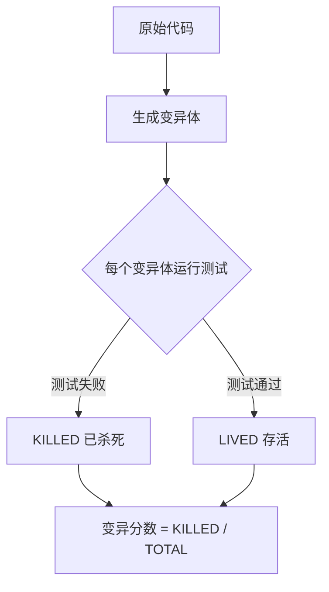
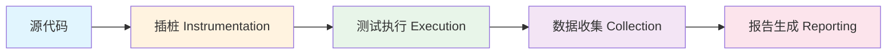
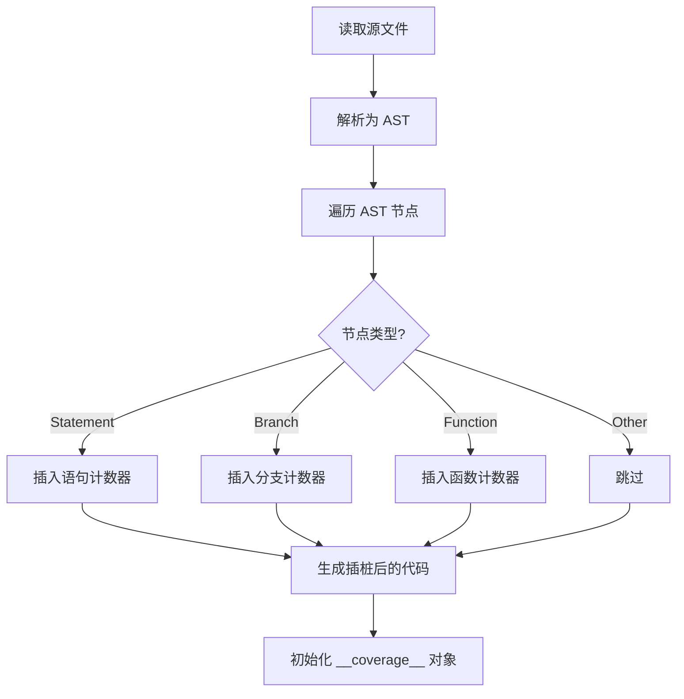
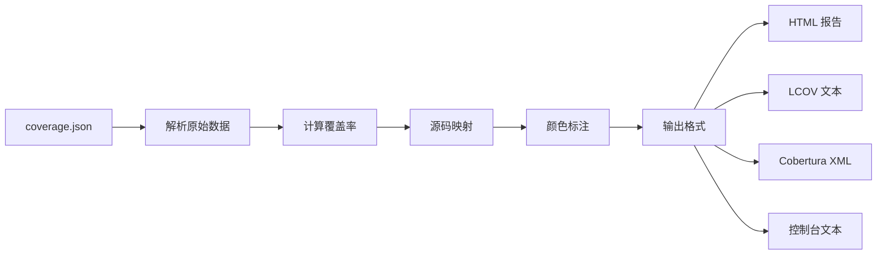
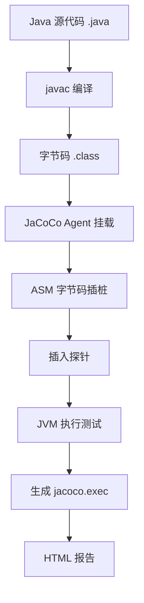
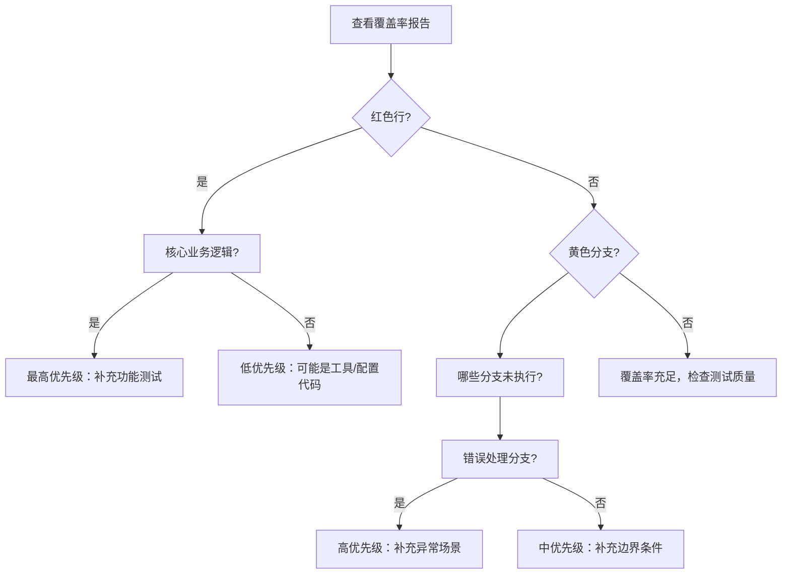
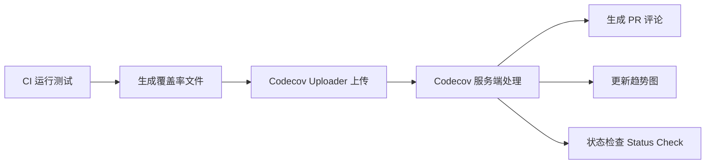

# 测试覆盖率 核心知识体系

> 从基础概念到 CI/CD 质量门禁，覆盖 8 种覆盖率指标、7 种语言工具链、插桩原理、变异测试与最佳实践

**文档版本：** v1.0.0
**创建日期：** 2026-04-10
**最后更新：** 2026-04-10

---

## 目录

1. [第 1 章：基础认知](#第-1-章基础认知)
2. [第 2 章：核心指标体系](#第-2-章核心指标体系)
3. [第 3 章：工作原理与插桩机制](#第-3-章工作原理与插桩机制)
4. [第 4 章：主流工具链](#第-4-章主流工具链)
5. [第 5 章：可视化与报告解读](#第-5-章可视化与报告解读)
6. [第 6 章：CI/CD 集成与质量门禁](#第-6-章cicd-集成与质量门禁)
7. [第 7 章：最佳实践与常见误区](#第-7-章最佳实践与常见误区)
8. [第 8 章：常见误区与面试问题](#第-8-章常见误区与面试问题)

---

# 第 1 章：基础认知

### 1.1 什么是测试覆盖率

**定义**：测试覆盖率（Test Coverage）是一种量化指标，用于衡量测试用例对被测系统的覆盖程度。它回答了一个核心问题："我们的测试到底测到了多少代码（或功能）？"

从本质上讲，测试覆盖率是一个**探针系统**——它在代码中放置无数个微型传感器，当测试运行时，这些传感器记录哪些代码被执行过、哪些分支被走过、哪些函数被调用过。最终将这些数据汇总成一个或多个百分比数字。

**为什么需要它**：

1. **发现盲区**：覆盖率报告像 X 光片一样，揭示哪些代码从未被执行。未被测试的代码就是隐藏的缺陷温床。
2. **量化质量**：将主观的"测试够不够"转化为客观的数字，方便团队讨论、设定目标和追踪趋势。
3. **回归防护**：高覆盖率为重构提供安全网——如果重构后覆盖率不变，说明行为大概率未变。
4. **资源优化**：帮助团队识别哪些区域过度测试、哪些区域完全未测，从而优化测试投入。

**覆盖率 vs 测试质量**——这是最常见也最危险的混淆。

> "覆盖率告诉你哪块地板没铺地毯，但不告诉你地毯下面有没有老鼠洞。"

```javascript
// 一个经典的"100% 覆盖率但零质量"的示例
function divide(a, b) {
  return a / b;
}

// 这个测试让覆盖率达到了 100%
test('divide executes', () => {
  divide(10, 2); // 只测了正常路径
});

// 但它完全没有测试：
// - 除以零的情况（divide(10, 0) → Infinity）
// - 负数输入（divide(-10, 2) → -5）
// - 浮点数精度（divide(1, 3) → 0.333...）
// - 非数字输入（divide('a', 2) → NaN）
```

覆盖率只关心**是否执行**，不关心**是否正确验证**。一个没有 `expect` 断言的测试同样可以把覆盖率拉到 100%，但它对质量的贡献为零。

**关键结论**：覆盖率是**必要条件**而非**充分条件**。高覆盖率不代表测试质量好，但低覆盖率几乎必然意味着存在风险区域。

### 1.2 测试覆盖率的历史演进

测试覆盖率的概念和实践经历了近半个世纪的发展，大致可分为四个阶段：

#### 第一阶段：理论奠基（1970s - 1980s）

- **1970s**：Glenford Myers 在《The Art of Software Testing》（1979）中将覆盖率确立为测试完整性的核心度量
- **1980s**：`gprof`（GNU profiler）通过编译时插桩（`-pg` 标志）提供了函数级执行统计，这是覆盖率工具的雏形
- **1980s**：McCabe 圈复杂度（Cyclomatic Complexity）理论为理解代码路径数量提供了数学基础

#### 第二阶段：工具化时代（1990s - 2000s）

- **1990s**：`gcov`（GCC Coverage）成为第一个广泛使用的代码覆盖率工具
- **1990s**：`lcov` 在 `gcov` 基础上增加了 HTML 可视化
- **2000s**：Java 生态涌现 `Cobertura`（2004）和 `Emma`（2005）
- **2000s**：Python 的 `coverage.py` 开始流行，利用 `sys.settrace()` 实现运行时行级追踪

#### 第三阶段：生态融合（2010s）

- **2010s**：`Istanbul`（后发展为 `nyc`）成为 JavaScript 覆盖率的事实标准
- **2010s**：`JaCoCo`（Java Code Coverage）取代 Cobertura
- **2010s**：CI/CD 流水线集成覆盖率门禁（如 SonarQube 质量门）
- **2012 年**：变异覆盖率开始被主流工具支持（如 Stryker）

#### 第四阶段：原生优化与 AI 辅助（2020s - 至今）

- **2020s**：V8 引擎原生覆盖率 API 让 JavaScript 不再需要 AST 插桩（如 `c8` 工具）
- **2020s**：Go 语言将覆盖率内置到标准工具链中（`go test -cover`）
- **2020s**：AI 辅助测试生成工具利用覆盖率反馈指导测试用例自动生成

**演进的内在逻辑**：从"统计执行次数"到"多维质量度量"，从"事后报告"到"实时反馈"，从"单一语言"到"跨生态统一"。

### 1.3 测试覆盖率在软件质量保障体系中的位置

测试覆盖率不是孤立存在的，它是整个软件质量保障体系中的一个关键**信号层**。

```
┌─────────────────────────────────────────────────┐
│              软件质量保障体系                      │
├─────────────────────────────────────────────────┤
│                                                 │
│  ┌───────────┐  ┌───────────┐  ┌───────────┐   │
│  │ 需求质量   │  │ 设计质量   │  │ 代码质量   │   │
│  │ (Requirements)│ (Architecture) │ (Implementation)│
│  └─────┬─────┘  └─────┬─────┘  └─────┬─────┘   │
│        │              │              │           │
│  ┌─────▼─────┐  ┌─────▼─────┐  ┌─────▼─────┐   │
│  │需求覆盖率  │  │架构覆盖率  │  │代码覆盖率  │   │
│  │功能测试    │  │集成测试    │  │单元测试    │   │
│  └───────────┘  └───────────┘  └───────────┘   │
│                                                 │
│  ┌───────────────────────────────────────────┐  │
│  │         质量决策层（Quality Gates）          │  │
│  │  覆盖率门禁 + 缺陷密度 + 变更影响分析       │  │
│  └───────────────────────────────────────────┘  │
│                                                 │
└─────────────────────────────────────────────────┘
```

在质量保障体系中，测试覆盖率扮演的角色：

1. **单元测试层**：代码覆盖率（语句、分支、函数）——确保每行代码都被执行过
2. **集成测试层**：接口/服务覆盖率——确保各组件间的交互路径被验证
3. **系统测试层**：功能覆盖率——确保所有功能需求和用户场景被覆盖
4. **验收测试层**：需求覆盖率——确保每条业务需求都有对应的测试用例
5. **生产监控层**：风险覆盖率——确保高风险区域有充分保障

### 1.4 覆盖率能回答什么、不能回答什么

#### 覆盖率能回答的问题：

| 问题 | 说明 |
|------|------|
| "哪些代码被执行过？" | 覆盖率直接回答哪些行、分支、函数在测试中被执行 |
| "哪些代码完全没有被测试？" | 未覆盖区域 = 潜在风险区域 |
| "新代码是否有足够的测试？" | 增量覆盖率衡量新增代码的测试充分性 |
| "测试套件是否在退化？" | 覆盖率趋势图可以揭示测试用例的增减变化 |
| "哪个模块风险最高？" | 低覆盖率 + 高变更频率 = 最危险的区域 |

#### 覆盖率不能回答的问题：

| 问题 | 为什么不能回答 |
|------|--------------|
| "测试是否正确？" | 覆盖率只记录"是否执行"，不验证"是否正确" |
| "需求是否被满足？" | 代码覆盖了不等于功能正确 |
| "系统是否安全？" | 安全漏洞通常藏在边界条件中 |
| "用户体验是否良好？" | 代码覆盖率无法衡量 UI 交互的流畅度 |
| "性能是否达标？" | 覆盖率不关心执行时间和资源消耗 |
| "集成是否正常？" | 单元测试覆盖率无法发现组件间的集成问题 |

#### Goodhart 定律

> "当一个指标变成目标，它就不再是一个好指标。" —— Goodhart 定律

当团队将"覆盖率 80%"设为硬性目标时，开发者会倾向于写没有断言的测试来凑覆盖率。

**正确的做法**：将覆盖率作为**发现问题的工具**而非**评判团队的标准**。

### 1.5 测试覆盖率的类型层次

```
┌──────────────────────────────────────────────────┐
│  Level 4: 风险覆盖率 (Risk Coverage)              │
│  "我们是否测试了所有可能造成严重后果的场景？"       │
├──────────────────────────────────────────────────┤
│  Level 3: 功能覆盖率 (Functional Coverage)         │
│  "我们是否测试了所有功能需求？"                     │
├──────────────────────────────────────────────────┤
│  Level 2: 需求覆盖率 (Requirements Coverage)       │
│  "每条需求是否至少有一个测试用例对应？"              │
├──────────────────────────────────────────────────┤
│  Level 1: 代码覆盖率 (Code Coverage)              │
│  "测试执行了多少比例的代码？"                       │
└──────────────────────────────────────────────────┘
```

#### Level 1：代码覆盖率（Code Coverage）

最基础的覆盖率类型，包括语句覆盖率、分支覆盖率、函数覆盖率、行覆盖率、路径覆盖率等。

#### Level 2：需求覆盖率（Requirements Coverage）

将测试用例与需求文档建立追踪矩阵（Traceability Matrix）：

```
需求 ID    →  测试用例 ID
REQ-001   →  TC-001, TC-002, TC-005
REQ-002   →  TC-003
REQ-003   →  (未覆盖！← 需要补充)
```

#### Level 3：功能覆盖率（Functional Coverage）

关注功能的组合和交互——用户注册是否覆盖了所有输入场景？支付流程是否覆盖了所有支付方式？

#### Level 4：风险覆盖率（Risk Coverage）

基于风险评估矩阵：

| 风险等级 | 影响程度 | 所需覆盖率 |
|---------|---------|-----------|
| 致命（系统崩溃/数据丢失） | 极高 | 100% 路径覆盖率 + MC/DC |
| 严重（核心功能不可用） | 高 | 95%+ 分支覆盖率 |
| 中等（部分功能受限） | 中 | 80%+ 语句覆盖率 |
| 轻微（体验影响） | 低 | 基本功能测试即可 |

**各层级的关系**：高层覆盖率不能完全由低层覆盖率替代。100% 的代码覆盖率不代表 100% 的需求覆盖率。

---

# 第 2 章：核心指标体系

### 2.1 语句覆盖率（Statements）

**定义**：语句覆盖率衡量的是被执行的语句数占可执行语句总数的比例。

```
语句覆盖率 = (已执行的语句数 / 可执行语句总数) × 100%
```

```javascript
// 示例：语句覆盖率分析
function calculateDiscount(price, isMember) {
  let discount = 0;              // 语句 1
  if (isMember) {                // 语句 2（if 本身是一条语句）
    discount = price * 0.1;      // 语句 3
  }
  return price - discount;       // 语句 4
}

// 测试用例 1：calculateDiscount(100, true) → 语句覆盖率 100%
// 测试用例 2：calculateDiscount(100, false) → 语句覆盖率 75%
```

**优点**：最直观、计算简单、能快速发现完全未测试的函数。
**缺点**：对条件分支不敏感、容易被"刷"。

### 2.2 分支覆盖率（Branches）

**定义**：分支覆盖率衡量的是所有控制流分支中被执行过的比例。

```
分支覆盖率 = (已执行的分支数 / 总分支数) × 100%
```

```javascript
// 类型 1：if/else 分支
function getAccessLevel(role) {
  if (role === 'admin') {        // 2 个分支：true / false
    return 'full';
  }
  return 'read-only';
}

// 类型 2：三元运算符
const status = isLoggedIn ? 'active' : 'inactive';  // 2 个分支

// 类型 3：逻辑与 (&&) — 短路求值
function validate(user) {
  return user && user.name && user.name.length > 0;
  // && 运算符每个操作数都产生分支
}

// 类型 4：switch 语句 — 每个 case 是一个分支
```

```javascript
// 分支分析实战
function classifyNumber(n) {
  if (n > 0) {                   // 分支 1: true/false
    if (n % 2 === 0) {           // 分支 2: true/false
      return 'positive even';    // 路径 A
    }
    return 'positive odd';       // 路径 B
  } else if (n < 0) {            // 分支 3: true/false
    return 'negative';           // 路径 C
  }
  return 'zero';                 // 路径 D
}

// 总分支数 = 6，需要 4 个测试用例达到 100% 分支覆盖率
```

### 2.3 函数覆盖率（Functions）

```
函数覆盖率 = (已被调用的函数数 / 总函数数) × 100%
```

是最粗略的覆盖率指标之一——只要函数被调用过就算覆盖。常用于快速识别"僵尸函数"。

### 2.4 行覆盖率（Lines）

```
行覆盖率 = (已执行的代码行数 / 可执行代码行总数) × 100%
```

**行覆盖率 vs 语句覆盖率**：

| 维度 | 语句覆盖率 | 行覆盖率 |
|------|-----------|---------|
| 计量单位 | 语句 | 代码行 |
| 一行多语句时 | 分别计数 | 整行标记为覆盖/未覆盖 |
| 多行一语句时 | 计为 1 条语句 | 各行分别标记 |
| 精确度 | 更高 | 较低 |

通常以**行覆盖率**作为主要参考（更直观），以**语句覆盖率**作为辅助校验。

### 2.5 路径覆盖率（Paths）

**定义**：路径覆盖率衡量的是所有可能的代码执行路径中被覆盖的比例。

```
路径覆盖率 = (已执行的执行路径数 / 所有可能的执行路径数) × 100%
```

**组合爆炸问题**：

```javascript
// 3 个独立的二元分支 → 2^3 = 8 条路径
// 10 个独立的二元分支 → 2^10 = 1,024 条路径
// 20 个独立的二元分支 → 2^20 = 1,048,576 条路径
// 含有循环的代码 → 路径数趋近无限
```

**实际做法**：使用**基本路径覆盖**（Basis Path Testing），覆盖圈复杂度定义的最少独立路径数。

```javascript
// 圈复杂度 = 决策点数 + 1
// 3 个 if 语句 → 圈复杂度 = 4
// 最少需要 4 个测试用例覆盖所有独立路径
```

### 2.6 条件覆盖率（Conditions / MC/DC）

#### 条件覆盖率（Condition Coverage）

要求复合布尔表达式中的每个子条件都至少取一次真和一次假。

```javascript
// 复合条件
if (age >= 18 && hasLicense && !isSuspended) {
  return 'can drive';
}

// 条件覆盖率要求每个子条件至少一次 true、一次 false
// 但不要求所有组合都被测试！
```

#### MC/DC（Modified Condition/Decision Coverage）

在条件覆盖率的基础上增加了更强的要求——**每个条件必须被证明能独立影响判定结果**。

```javascript
// 飞行控制系统
function canTakeoff(fuelOk, weatherOk, systemsOk, crewReady) {
  return fuelOk && weatherOk && systemsOk && crewReady;
}

// MC/DC 要求 N+1 个测试用例（N=条件数）
// 对于 4 个条件，最少需要 5 个测试用例
const mcdcTests = [
  { fuelOk: true,  weatherOk: true,  systemsOk: true,  crewReady: true  }, // 基准
  { fuelOk: false, weatherOk: true,  systemsOk: true,  crewReady: true  }, // 改 fuelOk
  { fuelOk: true,  weatherOk: false, systemsOk: true,  crewReady: true  }, // 改 weatherOk
  { fuelOk: true,  weatherOk: true,  systemsOk: false, crewReady: true  }, // 改 systemsOk
  { fuelOk: true,  weatherOk: true,  systemsOk: true,  crewReady: false }, // 改 crewReady
];
```

| 标准 | 行业 | MC/DC 要求 |
|------|------|-----------|
| **DO-178C** | 航空软件 | DAL A 级（最高）强制要求 MC/DC |
| **ISO 26262** | 汽车电子 | ASIL D 级（最高）推荐 MC/DC |
| **IEC 61508** | 工业安全 | SIL 4 级（最高）要求 MC/DC |

### 2.7 变异覆盖率（Mutation Coverage）

**定义**：通过变异测试（Mutation Testing）得到的指标，衡量测试套件能"杀死"的变异体占总变异体的比例。

```javascript
// 原始代码
function isUserOldEnough(user) {
  return user.age >= 18;
}

// 变异体（由 Stryker 等工具自动生成）：
// 变异 1：>= 改为 >  → return user.age > 18;
// 变异 2：>= 改为 <  → return user.age < 18;
// 变异 3：替换返回值 → return false;
// 变异 4：修改常量   → return user.age >= 17;
```



**经典对比**：

```javascript
function max(a, b) {
  if (a > b) return a;
  return b;
}

// 测试 A：100% 语句覆盖率，但变异分数 0%（无断言）
test('max executes', () => { max(5, 3); });

// 测试 C：100% 语句覆盖率 + 高变异分数
test('max returns the larger value', () => {
  expect(max(5, 3)).toBe(5);   // a > b
  expect(max(3, 5)).toBe(5);   // b > a
  expect(max(5, 5)).toBe(5);   // a === b
});
```

**主流变异测试工具**：

| 语言 | 工具 |
|------|------|
| JavaScript/TypeScript | Stryker |
| Python | MutPy, Cosmic Ray |
| Java | PIT (Pitest) |
| Go | go-mutesting |
| Ruby | Mutant |
| C# | Stryker.NET |

### 2.8 各指标对比表格与适用场景

| 指标 | 关注点 | 严格度 | 成本 | 日常开发 | 安全关键 | 最佳用途 |
|------|--------|--------|------|---------|---------|---------|
| **函数覆盖率** | 函数是否被调用 | ★☆☆☆☆ | 极低 | 建议 80%+ | 不足 | 快速扫描测试盲区 |
| **行覆盖率** | 代码行是否被执行 | ★★☆☆☆ | 低 | 建议 80%+ | 不足 | 直观的报告展示 |
| **语句覆盖率** | 语句是否被执行 | ★★★☆☆ | 低 | 建议 75%+ | 不足 | 精确的执行追踪 |
| **分支覆盖率** | 分支是否都走过 | ★★★★☆ | 中 | 建议 70%+ | 建议 90%+ | 日常开发最佳平衡点 |
| **条件覆盖率** | 子条件真/假都取到 | ★★★★★ | 中高 | 可选 | 建议 80%+ | 复杂条件逻辑验证 |
| **路径覆盖率** | 所有路径组合 | ★★★★★★ | 极高 | 不现实 | 关键路径覆盖 | 关键逻辑路径完整性 |
| **MC/DC** | 条件独立影响判定 | ★★★★★★★ | 高 | 不必要 | 强制要求 | 航空/汽车/医疗认证 |
| **变异覆盖率** | 测试能否发现缺陷 | ★★★★★★★★ | 极高 | 核心模块 | 推荐 | 测试质量终极检验 |

**推荐的覆盖率策略矩阵**：

| 项目类型 | 函数 | 行/语句 | 分支 | 变异 |
|---------|------|--------|------|------|
| 原型/实验 | 不关注 | 不关注 | 不关注 | 不关注 |
| 内部工具 | 60%+ | 70%+ | 50%+ | 不关注 |
| 商业产品 | 80%+ | 80%+ | 70%+ | 核心模块 |
| 开源库 | 90%+ | 90%+ | 80%+ | 核心 API |
| 金融/支付 | 95%+ | 95%+ | 90%+ | 关键逻辑 |
| 航空/医疗 | 100% | 100% | 95%+ + MC/DC | 全量 |

---

# 第 3 章：工作原理与插桩机制

### 3.1 覆盖率收集的基本流程

所有覆盖率工具都遵循同一个四阶段流水线：



**阶段 1：插桩（Instrumentation）**——在源代码或字节码中插入覆盖率追踪代码（探针/Probe）。

```javascript
// 原始代码
function greet(name) {
  if (name) {
    return `Hello, ${name}!`;
  }
  return 'Hello, World!';
}

// 插桩后的代码（概念性展示）
function greet(name) {
  __coverage__.statements['file.js'][0]++;  // 函数声明计数
  if (name) {
    __coverage__.branches['file.js'][0][0]++; // if 的 true 分支
    return `Hello, ${name}!`;
    __coverage__.statements['file.js'][1]++;
  }
  __coverage__.branches['file.js'][0][1]++;  // if 的 false 分支
  return 'Hello, World!';
  __coverage__.statements['file.js'][2]++;
}
```

**阶段 2：执行（Execution）**——测试框架加载并运行插桩后的代码，计数器递增。
**阶段 3：收集（Collection）**——测试结束后，从全局覆盖率对象读取数据，写入 JSON。
**阶段 4：报告（Reporting）**——生成 HTML、LCOV、Cobertura XML 等格式的报告。

### 3.2 AST 插桩原理（以 Istanbul 为例）



**步骤 1：解析源码为 AST**

```javascript
// 原始代码
function add(a, b) {
  return a + b;
}

// 对应的 AST（简化版）
{
  "type": "FunctionDeclaration",
  "id": { "name": "add" },
  "body": {
    "type": "ReturnStatement",
    "argument": { "type": "BinaryExpression", "operator": "+", ... }
  }
}
```

**步骤 2：遍历 AST 并插入计数器**

```javascript
// 插桩后的代码
var __cov_abc123 = (global.__coverage__ = global.__coverage__ || {});
__cov_abc123['file.js'] = {
  path: 'file.js',
  statementMap: { 0: { start: { line: 1, column: 0 }, end: { line: 3, column: 1 } }, ... },
  fnMap: { 0: { name: 'add', line: 1 } },
  branchMap: {},
  s: { 0: 0, 1: 0 },  // 语句计数器
  f: { 0: 0 },        // 函数计数器
  b: {}               // 分支计数器
};

function add(a, b) {
  __cov_abc123['file.js'].f[0]++;     // 函数调用计数
  __cov_abc123['file.js'].s[1]++;     // return 语句计数
  return a + b;
}
```

**Istanbul 忽略注释**：

```javascript
/* istanbul ignore if */
if (process.env.NODE_ENV === 'development') {
  debugLog('verbose info');
}

/* istanbul ignore next */
function legacyFunction() { /* 旧代码 */ }

/* istanbul ignore file */
// 整个文件跳过覆盖率统计
```

### 3.3 运行时计数器

#### 全局覆盖率对象（`__coverage__`）

| 计数器 | 前缀 | 含义 | 何时递增 |
|--------|------|------|---------|
| 语句计数器 | `s` | 每条语句的执行次数 | 执行到该语句时 |
| 函数计数器 | `f` | 每个函数的调用次数 | 进入函数体时 |
| 分支计数器 | `b` | 每个分支的命中次数 | 走入该分支时（数组形式） |

**多进程/多线程环境下的计数收集**：

```javascript
// 子进程退出时序列化覆盖率数据
process.on('exit', () => {
  const coverage = global.__coverage__;
  if (coverage) {
    fs.writeFileSync(`.nyc_output/${process.pid}.json`, JSON.stringify(coverage));
  }
});
```

### 3.4 报告生成



**颜色标注规则**：

| 颜色 | 含义 | 技术术语 |
|------|------|---------|
| 绿色 | 已完全覆盖 | Full coverage |
| 红色 | 未被覆盖 | Not covered |
| 黄色 | 部分覆盖 | Partial coverage（行被执行但某些分支未覆盖） |
| 灰色 | 已忽略 | Ignored（`/* istanbul ignore */` 排除） |

### 3.5 各语言的覆盖率收集机制对比

#### JavaScript：AST 插桩（Istanbul）vs V8 原生（c8）

| 维度 | Istanbul（AST 插桩） | c8（V8 原生） |
|------|-------------------|-------------|
| 插桩时机 | 测试前静态修改代码 | 无需插桩 |
| 性能影响 | 中等 | 极低 |
| 兼容性 | 所有 JS 运行时 | 仅 V8 环境 |
| 报告精度 | 高 | 高 |
| 源码映射 | 需要手动处理 | 自动 |

#### Python：sys.settrace() 追踪钩（coverage.py）

```python
import sys

class CoverageTracer:
    def __init__(self):
        self.executed_lines = {}

    def trace_function(self, frame, event, arg):
        if event == 'line':
            filename = frame.f_code.co_filename
            lineno = frame.f_lineno
            if filename not in self.executed_lines:
                self.executed_lines[filename] = set()
            self.executed_lines[filename].add(lineno)
        return self.trace_function

tracer = CoverageTracer()
sys.settrace(tracer.trace_function)
# 执行业务代码...
sys.settrace(None)
```

**执行流程**：启动测试 → `sys.settrace()` 注册追踪钩 → 每执行一行调用追踪钩 → 记录（文件名, 行号）→ 对比"已执行行"和"可执行行"生成报告。

- **优点**：无需修改源码，Python 标准库支持
- **缺点**：显著性能开销（约 10-50x 减速），与调试器冲突

#### Go：编译时插桩（go test -cover）

```bash
go test -coverprofile=cover.out ./...
go tool cover -func=cover.out       # 查看函数级覆盖率
go tool cover -html=cover.out        # 生成 HTML 报告
```

Go 支持三种覆盖模式：`set`（布尔覆盖）、`count`（计数覆盖）、`atomic`（原子操作计数，用于并发场景）。

#### Java：字节码插桩（JaCoCo）

JaCoCo 在每个基本块（basic block）的入口处插入一个 `probe` 调用。基本块是连续执行、无分支跳转的指令序列。



JaCoCo 的探针设计精巧——它插入**布尔探针**而非计数递增：

```java
// JaCoCo 在每个方法中插入一个布尔数组
boolean[] $jacocoInit = new boolean[探针数量];
$jacocoData[0] = true;  // 语句块 0 已执行
$jacocoData[1] = true;  // 语句块 1 已执行
```

#### .NET：Profiler API（coverlet）

```bash
dotnet test /p:CollectCoverage=true /p:CoverletOutputFormat=opencover
dotnet test --collect:"XPlat Code Coverage"
```

利用 CLR Profiling API 在 JIT 编译前修改 IL（Intermediate Language）代码。

#### 语言对比总结

| 语言 | 工具 | 插桩层级 | 插桩时机 | 性能影响 |
|------|------|---------|---------|---------|
| **JavaScript** | Istanbul | 源代码（AST） | 测试前 | 中等 |
| **JavaScript** | c8 | V8 引擎内置 | 运行时 | 极低 |
| **Python** | coverage.py | 解释器（sys.settrace） | 运行时 | 高（10-50x） |
| **Go** | go test -cover | 编译时源码 | 编译时 | 低（仅编译期） |
| **Java** | JaCoCo | JVM 字节码 | 类加载时/编译后 | 极低 |
| **.NET** | coverlet | CLR IL 字节码 | JIT 编译前 | 极低 |
| **C/C++** | gcov/lcov | 编译时源码 | 编译时 | 低 |

### 3.6 静态插桩 vs 动态插桩

| 维度 | 静态插桩 | 动态插桩 |
|------|---------|---------|
| **定义** | 运行前修改代码/字节码文件 | 运行时动态修改内存中的代码 |
| **典型工具** | Istanbul、gcov、go test -cover | V8 原生覆盖率、JaCoCo On-the-fly |
| **修改时机** | 编译前/编译时/测试前 | 运行时（JIT/类加载/解释器层） |
| **文件变化** | 修改后的文件写入磁盘 | 原始文件不变 |
| **性能开销** | 仅一次插桩成本 | 运行时持续开销 |
| **优势** | 适合 CI/CD（可缓存） | 适合开发环境（无文件污染） |

### 3.7 LCOV 格式详解

LCOV 是 gcov 的扩展格式，已成为覆盖率数据的行业标准之一。

```lcov
TN:                        # 测试名称
SF:/project/src/utils.js   # 源文件路径
FN:10,formatDate           # 函数定义：行号,名称
FNDA:15,formatDate         # 函数执行次数
FNF:2                      # 函数总数
FNH:2                      # 已覆盖函数数
BRDA:11,0,0,12             # 分支数据：行号,块号,分支号,执行次数
BRDA:11,0,1,3
BRF:2                      # 分支总数
BRH:2                      # 已覆盖分支数
DA:1,5                     # 行数据：行号,执行次数
DA:2,0                     # 第 2 行执行 0 次（未覆盖）
LH:7                       # 已覆盖行数
LF:8                       # 总可执行行数
end_of_record
```

**计算公式**：
- 行覆盖率 = LH / LF × 100% = 7/8 = 87.5%
- 分支覆盖率 = BRH / BRF × 100% = 2/2 = 100%
- 函数覆盖率 = FNH / FNF × 100% = 2/2 = 100%

---

# 第 4 章：主流工具链

### 4.1 JavaScript/TypeScript 生态

#### 4.1.1 Istanbul / nyc

**概念定义**：Istanbul 是 JavaScript 生态中最流行的代码覆盖率工具库，nyc 是其官方命令行接口（CLI）。

**`.nycrc` 配置文件**：

```json
{
  "all": true,
  "include": ["src/**/*.js", "src/**/*.ts"],
  "exclude": ["**/*.spec.js", "**/node_modules/**"],
  "reporter": ["text", "lcov", "html"],
  "check-coverage": true,
  "branches": 80,
  "functions": 80,
  "lines": 80,
  "statements": 80
}
```

**与 Mocha 集成**：
```bash
nyc --reporter=lcov --reporter=text-summary mocha --recursive "test/**/*.js"
```

**与 TypeScript 集成**：配合 `@istanbuljs/nyc-config-typescript` 和 `ts-node`。

**信息源**：https://github.com/istanbuljs/nyc

#### 4.1.2 c8 — V8 原生覆盖率

**概念定义**：c8 利用 Node.js 内置 V8 覆盖率 API，直接读取 V8 引擎自动收集的覆盖率数据。

**为什么比 nyc 更快**：nyc 需要 AST 级别的插桩（解析 + 代码生成），c8 直接读取 V8 在字节码执行层面维护的覆盖率计数器，通常比 nyc 快 30%-50%。

```bash
npm install --save-dev c8
```

```json
{
  "scripts": {
    "test": "c8 --reporter=html --reporter=text mocha test/**/*.js"
  }
}
```

**信息源**：https://github.com/bcoe/c8

#### 4.1.3 Jest 内置覆盖率

```bash
jest --coverage
```

**`jest.config.js` 关键配置**：

```javascript
module.exports = {
  collectCoverage: true,
  collectCoverageFrom: [
    "src/**/*.{js,jsx,ts,tsx}",
    "!src/**/*.d.ts",
    "!src/**/*.stories.{js,jsx,ts,tsx}",
  ],
  coverageReporters: ["text", "lcov", "clover", "html"],
  coverageThreshold: {
    global: { statements: 80, branches: 70, functions: 80, lines: 80 },
    "src/core/**/*.ts": { branches: 95, functions: 95 },
  },
  coverageProvider: "v8", // 使用 V8 原生覆盖率（Jest 28+）
};
```

**信息源**：https://jestjs.io/docs/configuration#coverage-threshold-object

### 4.2 Java 生态

#### 4.2.1 JaCoCo

**概念定义**：JaCoCo（Java Code Coverage）是 Java 生态中最广泛使用的开源代码覆盖率工具，由 Eclipse 基金会维护。

**Maven 配置**：

```xml
<plugin>
  <groupId>org.jacoco</groupId>
  <artifactId>jacoco-maven-plugin</artifactId>
  <version>0.8.12</version>
  <executions>
    <execution>
      <id>prepare-agent</id>
      <goals><goal>prepare-agent</goal></goals>
    </execution>
    <execution>
      <id>report</id>
      <phase>test</phase>
      <goals><goal>report</goal></goals>
    </execution>
    <execution>
      <id>check</id>
      <goals><goal>check</goal></goals>
      <configuration>
        <rules>
          <rule>
            <element>BUNDLE</element>
            <limits>
              <limit>
                <counter>LINE</counter>
                <value>COVEREDRATIO</value>
                <minimum>0.80</minimum>
              </limit>
              <limit>
                <counter>BRANCH</counter>
                <value>COVEREDRATIO</value>
                <minimum>0.70</minimum>
              </limit>
            </limits>
          </rule>
        </rules>
      </configuration>
    </execution>
  </executions>
</plugin>
```

JaCoCo 支持多种覆盖率指标：Instruction Coverage（字节码指令）、Branch Coverage、Line Coverage、Method Coverage、Class Coverage。

**信息源**：https://www.jacoco.org/jacoco/

### 4.3 Python 生态

#### 4.3.1 coverage.py

**概念定义**：coverage.py 是 Python 生态标准的代码覆盖率工具，通过 `sys.settrace()` 在运行时追踪代码执行路径。

**`.coveragerc` 配置文件**：

```ini
[run]
source = myproject/
branch = True
omit = */tests/*, */migrations/*
concurrency = multiprocessing
parallel = True

[report]
show_missing = True
skip_covered = True
skip_empty = True
exclude_lines =
    pragma: no cover
    def __repr__
    if __name__ == .__main__.:
fail_under = 80
precision = 2
```

**与 pytest 集成（pytest-cov）**：

```bash
pip install pytest pytest-cov
pytest --cov=myproject --cov-branch --cov-report=html --cov-report=xml --cov-fail-under=85 tests/
```

**信息源**：https://coverage.readthedocs.io/

### 4.4 Go 生态

#### 4.4.1 go test -cover

**概念定义**：Go 标准工具链内置了代码覆盖率支持，无需安装第三方工具。

```bash
# 运行测试并显示覆盖率
go test -cover ./...

# 输出覆盖率 profile 文件
go test -coverprofile=coverage.out ./...

# 生成 HTML 可视化报告
go tool cover -html=coverage.out

# 生成函数级覆盖率统计
go tool cover -func=coverage.out
```

`coverage.out` 文件格式：
```
mode: set
example.com/pkg/file.go:3.13,5.2 2 1
example.com/pkg/file.go:5.2,7.3 1 0
```

每行格式：`filename:startline.startcol,endline.endcol numStmt count`

**信息源**：https://go.dev/blog/cover

### 4.5 C#/.NET 生态

#### 4.5.1 Coverlet

**概念定义**：Coverlet 是一个跨平台的 .NET 代码覆盖率框架，属于 .NET Foundation 项目。

**方式一：MSBuild 集成（推荐）**：

```bash
dotnet add package coverlet.msbuild
dotnet test /p:CollectCoverage=true /p:CoverletOutputFormat=cobertura
```

**方式二：Collector 集成**：

```bash
dotnet add package coverlet.collector
dotnet test --collect:"XPlat Code Coverage"
```

**输出格式对比**：

| 格式 | 说明 | 适用场景 |
|------|------|---------|
| `cobertura` | XML 格式 | CI/CD 集成（Azure DevOps、GitHub Actions） |
| `opencover` | OpenCover XML | Codecov、ReportGenerator |
| `lcov` | LCOV 文本 | lcov/genhtml 生成 HTML |
| `json` | 简单轻量 | 本地查看 |

**信息源**：https://github.com/coverlet-coverage/coverlet

### 4.6 工具选型对比

| 语言 | 工具 | 插桩方式 | 速度 | 报告格式 | CI 集成 |
|------|------|----------|------|---------|---------|
| JavaScript | nyc (Istanbul) | AST 源码插桩 | 中等 | HTML, LCOV, JSON, Cobertura | 全平台 |
| JavaScript | c8 | V8 引擎内置计数器 | 快（无插桩开销） | HTML, LCOV, JSON, Cobertura | 全平台 |
| JavaScript | Jest --coverage | AST 插桩 / V8 可选 | 中等 | HTML, LCOV, Clover, JSON | 全平台 |
| Java | JaCoCo | 字节码（ASM）插桩 | 快 | HTML, XML, CSV | Maven/Gradle 原生 |
| Python | coverage.py | sys.settrace() 运行时追踪 | 中等（C 扩展加速） | HTML, XML, JSON, LCOV | pytest-cov |
| Go | go test -cover | 编译时基本块插桩 | 快（内置） | HTML, func 文本 | 内置 |
| C#/.NET | Coverlet | IL 字节码插桩 | 快 | JSON, Cobertura, LCOV, OpenCover | MSBuild/dotnet test |
| C/C++ | gcov/lcov | 编译期插桩（-fprofile-arcs） | 中等 | HTML (genhtml) | CMake 集成 |

**选型建议**：
- 追求速度 → 优先选择引擎内置方案（c8/V8、go test）
- 需要源码映射 → 选择 AST 插桩方案（nyc + source-map）
- Java/.NET 生态 → JaCoCo/Coverlet 是事实标准
- CI 集成友好度 → Cobertura XML 格式被最多 CI 平台原生支持

---

# 第 5 章：可视化与报告解读

### 5.1 HTML 可视化报告

**颜色标注体系**（各工具通用约定）：

| 颜色 | 含义 | 技术术语 |
|------|------|---------|
| 绿色 | 已完全覆盖 | Full coverage |
| 红色 | 未被覆盖 | Not covered |
| 黄色 | 部分覆盖 | Partial coverage |

**交互功能**：
- **文件浏览器**：左侧目录树，按覆盖率排序文件
- **点击文件查看源码**：带颜色标注的源码，每行旁边显示执行次数
- **缺失分支提示**：黄色行旁边会标注 `"if branch not taken"` 等具体信息

**报告导航层级**（以 nyc HTML 报告为例）：
1. **总览页**：显示所有文件的汇总表格
2. **文件详情页**：单文件内所有函数的覆盖率
3. **源码视图**：带颜色标注的源码 + 每行执行次数

### 5.2 LCOV 格式详解

**关键字段说明**：

| 前缀 | 含义 | 格式 |
|------|------|------|
| `SF` | 源文件路径 | `SF:/absolute/path/file.ext` |
| `FN` | 函数定义 | `FN:startLine,functionName` |
| `FNDA` | 函数执行数据 | `FNDA:execCount,functionName` |
| `BRDA` | 分支数据 | `BRDA:line,block,branch,execCount` |
| `DA` | 行数据 | `DA:lineNumber,execCount` |
| `LF` / `LH` | 总行数 / 已覆盖行数 | `LF:count` / `LH:count` |

### 5.3 报告解读实战

#### 如何识别测试盲区

1. **红色行集中区域**：完全没有被测试覆盖，是最优先补充测试的区域
2. **黄色分支**：条件语句只覆盖了部分分支，针对性补充测试用例
3. **异常处理路径**：`catch` 块、`else` 错误分支经常是测试盲区
4. **边界条件**：循环的边界情况（0 次、1 次、多次迭代）、空输入、null 值处理

#### 如何确定优先级



**优先级矩阵**：

| 覆盖率状态 | 代码类型 | 优先级 | 行动 |
|-----------|---------|--------|------|
| 红色（0%） | 核心业务逻辑 | P0 | 立即补充功能测试 |
| 红色（0%） | 工具/辅助函数 | P2 | 排入后续迭代 |
| 黄色（部分） | if/else 错误分支 | P1 | 补充异常场景测试 |
| 黄色（部分） | 循环边界 | P1 | 补充边界条件测试 |
| 绿色（100%） | 任何 | - | 检查测试断言质量，避免虚假覆盖 |

### 5.4 CI 集成展示

#### GitHub PR 覆盖率评论

```
## Coverage Report
| Metric    | Base     | Head     | Change   |
|-----------|----------|----------|----------|
| Lines     | 82.5%    | 84.1%    | +1.6%    |
| Branches  | 70.2%    | 72.8%    | +2.6%    |

## Patch Coverage
新变更行的覆盖率：90.5%（18/20 行被覆盖）
```

### 5.5 Codecov 平台

**上传流程**：



**`codecov.yml` 配置详解**：

```yaml
codecov:
  require_ci_to_pass: true
  notify:
    wait_for_ci: true

coverage:
  precision: 2
  round: down
  range: "70...90"

  status:
    project:
      default:
        target: auto          # 与 base commit 比较
        threshold: 0.5%       # 允许下降 0.5%
    patch:
      default:
        target: 90%           # 变更行至少 90% 覆盖
        threshold: 5%
    changes: false

  flags:
    frontend:
      paths: [src/frontend/]
      carryforward: true      # Monorepo 中沿用上次结果
    backend:
      paths: [src/backend/]
      carryforward: true

comment:
  layout: "reach, diff, flags, files, footer"
  behavior: default
  require_changes: false
```

**关键配置说明**：
- `target: auto`：自动与 PR 的 base commit 比较，确保覆盖率不下降
- `carryforward: true`：Monorepo 中某个 flag 本次未运行时，沿用上次结果
- `require_changes: true`：只在覆盖率有实际变化时才发布 PR 评论

**信息源**：https://docs.codecov.com/

### 5.6 Coveralls 平台

**与 Codecov 的对比**：

| 特性 | Codecov | Coveralls |
|------|---------|-----------|
| PR 评论 | 详细，支持 diff/flags/files | 简洁，显示覆盖率变化 |
| 趋势图 | 支持，多维度筛选 | 支持，按分支查看 |
| Monorepo | Flags + carryforward | Service Jobs 并行 |
| 配置方式 | codecov.yml（文件配置） | 平台 UI 配置 |

**信息源**：https://docs.coveralls.io/

### 5.7 覆盖率报告的常见陷阱

#### 虚假覆盖（False Coverage）

**常见场景**：

1. **无断言测试**：
```javascript
test("calls add", () => {
  add(1, 2); // 这行被执行了，覆盖率 +1，但没验证返回值
});
```

2. **仅覆盖 happy path**：没有测试 null、undefined、空字符串等边界情况

3. **忽略异步错误**：没有 `await`，异步错误不会被捕获

#### 忽略文件导致的覆盖率虚高

通过 `exclude` / `omit` 排除了大量难以测试的文件，导致整体覆盖率虚高。排除决策应当透明。

#### 其他常见陷阱

| 陷阱 | 描述 | 对策 |
|------|------|------|
| **只看行覆盖率** | 行覆盖率不反映分支覆盖 | 同时关注分支覆盖率 |
| **追求 100%** | 边际成本递增 | 设置合理目标（80%-90%） |
| **覆盖率=质量** | 高覆盖率不代表测试写得好 | 结合 mutation testing 验证 |

---

# 第 6 章：CI/CD 集成与质量门禁

### 6.1 GitHub Actions 集成覆盖率

**JavaScript/TypeScript 项目**：

```yaml
name: CI - Code Coverage

on:
  push:
    branches: [main, develop]
  pull_request:
    branches: [main]

jobs:
  test:
    runs-on: ubuntu-latest
    steps:
      - uses: actions/checkout@v4
      - uses: actions/setup-node@v4
        with:
          node-version: 20
          cache: "npm"
      - run: npm ci
      - run: npx c8 --reporter=lcov --reporter=text npm test
      - uses: codecov/codecov-action@v4
        with:
          files: ./coverage/lcov.info
          fail_ci_if_error: true
          flags: unittests
          token: ${{ secrets.CODECOV_TOKEN }}
```

**Python 项目**：

```yaml
- run: pytest --cov=src --cov-report=xml --cov-report=term-missing --cov-fail-under=85 tests/
- uses: codecov/codecov-action@v4
  with:
    file: coverage.xml
    flags: unittests
    token: ${{ secrets.CODECOV_TOKEN }}
```

**Java (Maven + JaCoCo) 项目**：

```yaml
- run: mvn clean verify
- uses: codecov/codecov-action@v4
  with:
    files: target/site/jacoco/jacoco.xml
    fail_ci_if_error: true
    token: ${{ secrets.CODECOV_TOKEN }}
```

**多语言 Monorepo 项目**：

```yaml
jobs:
  frontend:
    runs-on: ubuntu-latest
    steps:
      - run: npx c8 --reporter=lcov --report-dir coverage/frontend/ npm test
      - uses: codecov/codecov-action@v4
        with:
          files: frontend/coverage/frontend/lcov.info
          flags: frontend
          token: ${{ secrets.CODECOV_TOKEN }}

  backend:
    runs-on: ubuntu-latest
    steps:
      - run: pytest --cov=src --cov-report=xml:coverage/backend/coverage.xml backend/tests/
      - uses: codecov/codecov-action@v4
        with:
          files: backend/coverage/backend/coverage.xml
          flags: backend
          token: ${{ secrets.CODECOV_TOKEN }}
```

Codecov 自动合并多 flag 的报告。

### 6.2 GitLab CI 覆盖率可视化

```yaml
test:
  script:
    - npm install
    - npm test -- --coverage
  coverage: '/Lines\s*:\s*(\d+(?:\d+)?)%/'
```

**常见工具的覆盖率正则表达式**：

| 工具 | 输出示例 | 正则表达式 |
|------|---------|-----------|
| Istanbul/nyc | `Lines: 85.5%` | `/Lines\s*:\s*(\d+(?:\d+)?)%/` |
| Jest | `Lines: 82.35%` | `/Lines\s*:\s*(\d+(?:\d+)?)%/` |
| pytest-cov | `TOTAL 85%` | `/TOTAL\s+(\d+)%/` |
| JaCoCo | `Line Coverage: 90.12%` | `/Line.*?([0-9]{1,3})%/` |
| Go | `coverage: 85.7% of statements` | `/coverage:\s*(\d+(?:\d+)?)%/` |

### 6.3 覆盖率阈值（Quality Gate）

**为什么设置阈值**：
1. **防止覆盖率退化**：新代码如果没有对应的测试，覆盖率会被稀释
2. **强制执行测试驱动文化**：让"写代码必须写测试"成为硬性约束
3. **代码合并的客观标准**：减少 code review 中关于"测试够不够"的主观争论

**分层阈值策略**：

| 代码类型 | 行覆盖率 | 分支覆盖率 | 说明 |
|---------|---------|-----------|------|
| **核心业务逻辑**（支付、认证、数据模型） | 90%+ | 85%+ | 直接影响业务正确性 |
| **一般业务逻辑**（API 控制器、服务层） | 80%+ | 70%+ | 业务流转代码 |
| **工具/辅助代码**（helpers、utils） | 60%+ | 50%+ | 复用性代码 |
| **配置/生成代码**（DTO、mapper、config） | 排除或 40%+ | 排除 | 自动生成或几乎不可能出错 |
| **新代码**（PR 变更） | 90%+ | 80%+ | 新代码要求应高于历史代码 |

**渐进式阈值策略**：

```yaml
# codecov.yml
coverage:
  status:
    project:
      default:
        target: auto        # 不降低整体覆盖率
        threshold: 0.5%
    patch:
      default:
        target: 90%         # 新代码必须 90%+ 覆盖
        threshold: 5%
```

### 6.4 PR 自动评论覆盖率变化

**Codecov Bot** 自动在 PR 上发布覆盖率报告，包括：
1. **Overall Coverage Change**：整体覆盖率与 base commit 的对比
2. **Patch Coverage**：本次变更新增/修改的行的覆盖率
3. **Files Changed**：每个变更文件的覆盖率变化
4. **Flags**：Monorepo 中各模块的覆盖率

**评论配置**：
```yaml
comment:
  layout: "reach, diff, flags, files, footer"
  behavior: default
  require_changes: false     # true = 只在覆盖率有变化时评论
  hide_comment_details: true
```

### 6.5 覆盖率退化防护

**防护策略**：

1. **PR 级别防护**：新代码（patch）覆盖率必须 >= 阈值，CI 状态检查失败时阻止合并
2. **分支级别防护**：main/master 分支的覆盖率不允许低于历史最低值
3. **文件级别防护**：核心文件（如 `src/auth/**`）单独设置高阈值

**GitHub 分支保护配置**：
- Settings -> Branches -> Branch protection rules
- 勾选 "Require status checks to pass before merging"
- 选择覆盖率相关的 CI 检查

### 6.6 多语言项目的合并覆盖率报告

**nyc merge**：

```bash
nyc merge coverage/json-output-dir/ merged-coverage.json
nyc report --reporter=html --reporter=lcov --temp-dir=coverage/json-output-dir/ --report-dir=coverage/merged/
```

**coverage combine（Python）**：

```bash
coverage combine .coverage.*
coverage report
coverage html
coverage xml
```

**Codecov 自动合并**：只需在 CI 中用不同的 `flags` 上传各模块的覆盖率数据，Codecov 会自动聚合。

### 6.7 CI 中覆盖率检查失败的处理策略

| 失败场景 | 原因 | 处理策略 |
|---------|------|---------|
| 覆盖率低于阈值 | 新增代码没有对应测试 | 补充测试用例，或调整阈值 |
| Codecov 上传失败 | 网络问题或 token 过期 | 重试或更新 token |
| 覆盖率文件格式错误 | 工具版本不兼容 | 检查工具版本和输出格式 |
| 空覆盖率文件 | 测试全部失败 | 先修复测试失败 |

**策略建议**：

1. **开发阶段**：设置宽松的 threshold（如 2%-5%），只阻止明显的覆盖率退化
2. **稳定阶段**：收紧 threshold（如 0.5%-1%），确保覆盖率稳定提升
3. **历史债较多的项目**：使用 `patch` 目标约束新代码，`project` 目标设置 `threshold: auto`
4. **紧急修复场景**：可通过临时提高 `threshold` 值来允许覆盖率小幅下降

---

# 第 7 章：最佳实践与常见误区

### 7.1 "100% 覆盖率" 迷思

**"100% 覆盖率" 迷思**是软件工程中最普遍的误解之一：认为当测试覆盖率达到 100% 时，代码就不再有 bug。这一误解混淆了"代码被执行过"与"代码被正确验证过"两个完全不同的概念。

> Google 工程师 Titus Winters 在 2019 年技术演讲中的经典比喻：
> "覆盖率告诉你哪块地板没铺地毯，但不告诉你地毯下面有没有老鼠洞。"

**为什么 100% 覆盖率不等于无 bug**：

覆盖率工具只做一件事：**追踪哪些代码行在测试运行期间被执行**。它不关心：

1. **断言质量**：测试是否验证了正确性
2. **边界条件**：极端输入是否被覆盖
3. **集成问题**：模块之间的交互是否正确
4. **非功能属性**：性能、安全性、并发问题
5. **外部依赖**：第三方 API、数据库、网络的状态变化

**真实案例 1：断言缺失**

```typescript
// ❌ 达到 100% 行覆盖率，但测试毫无价值
function calculateDiscount(price: number, isVip: boolean, quantity: number): number {
  if (isVip && quantity >= 10) return price * 0.7;
  if (isVip || quantity >= 10) return price * 0.9;
  return price;
}

// 测试代码 - 每一行都被执行了
test('calculateDiscount covers all branches', () => {
  calculateDiscount(100, true, 10);
  calculateDiscount(100, true, 1);
  calculateDiscount(100, false, 1);
});
```

没有任何 `expect/assert` 验证返回值，如果函数返回了 `NaN` 或 `undefined`，测试永远不会发现。

**真实案例 2：除零漏洞**

```typescript
function calculateHeading(current: number, target: number): number {
  const diff = target - current;
  const adjustment = diff / (target - current); // 当 diff=0 时除零
  return current + adjustment;
}

test('calculateHeading with different values', () => {
  calculateHeading(0, 90);    // diff = 90, 安全
  calculateHeading(90, 180);  // diff = 90, 安全
  // 从未传入 current === target 的情况！
});
```

**覆盖率指标的五大盲区**：

| 盲区 | 描述 | 示例 |
|------|------|------|
| **覆盖但未断言** | 代码执行了但没有验证结果 | 调用函数但不 assert 返回值 |
| **覆盖但未验证边界** | 只测试了正常路径 | 不测试空输入、负数、极大值 |
| **覆盖但未验证副作用** | 未检查数据库写入、文件操作等 | 函数修改了全局状态但测试不检查 |
| **覆盖但时序错误** | 并发/异步场景下执行顺序不固定 | 竞态条件在测试中不出现但在生产中触发 |
| **覆盖但环境不同** | 测试环境与生产环境差异 | 本地 Mock 成功但第三方 API 失败 |

### 7.2 80% 标准的来源与争议

"80% 覆盖率"这个数字并非来自任何严谨的科学研究或官方标准，而是多种因素交织形成的**行业经验值**：

1. **帕累托法则（80/20 法则）**：20% 的代码包含 80% 的缺陷
2. **边际效益递减曲线**：从 0% 提升到 80% 相对容易，但从 80% 提升到 100% 的边际成本急剧上升。Netflix 混沌工程团队测算，从 90% 拉到 100% 的边际成本是前 90% 的 **3.2 倍**
3. **Martin Fowler 的观点**："我从来没有看到过关于最优覆盖率数字的有说服力的数据"
4. **Google 的实践**：强调"覆盖率应该作为发现未测试代码的指导工具，而非质量目标"

**争议与反思**：

| 观点 | 支持者 | 核心论点 |
|------|--------|----------|
| **80% 足够** | Martin Fowler, 敏捷社区 | 超过 80% 后 ROI 急剧下降 |
| **不应设固定阈值** | Google, Kent Beck | 覆盖率是发现问题的工具，不是质量目标 |
| **关键代码需要更高** | 金融/航空/医疗行业 | 安全关键代码需要 95%+ 甚至 100% |
| **80% 太低** | 部分安全团队 | 20% 未覆盖的代码可能恰好是漏洞所在 |

**现实数据**：

| 公司/组织 | 实践 | 结果 |
|-----------|------|------|
| **Google** | 不强制统一目标，各团队自定 | 质量稳定，工程师自主性强 |
| **Microsoft Azure** (2017) | 将覆盖率从 72% 推至 98% | 缺陷逃逸率反而上升 12% |
| **Meta/Facebook** (2021) | 覆盖率从 97% 砍到 81% | 线上稳定性反而回升 |
| **Stripe** | 曾强制 100% 覆盖率 | 代码膨胀 23%，工程师抱怨"我们在写测试的饲料" |
| **Shopify** (2022) | 高覆盖率团队调研 | 新功能交付周期延长 34% |

### 7.3 虚假覆盖（False Coverage）

**虚假覆盖**指测试代码被执行了，覆盖率工具显示为"已覆盖"（绿色），但测试并没有对该代码的行为进行有效的验证。

**虚假覆盖的四种模式**：

#### 模式一：无断言测试（最危险）

```typescript
// ❌ 对覆盖率有贡献，但对质量没有任何保障
test('processUserData runs without error', () => {
  processUserData(rawUserData);
  // 没有 assert！
});
```

#### 模式二：弱断言（覆盖但不充分）

```typescript
// ❌ 只要不抛异常就通过
test('formatDate returns a string', () => {
  expect(typeof formatDate(new Date())).toBe('string');
  // 'undefined' 也是 string！'ERROR' 也是 string！
});
```

#### 模式三：只测试快乐路径

```typescript
// ❌ 只覆盖正常流程
test('getUser returns user info', async () => {
  const user = await getUser(123);
  expect(user.name).toBe('Alice');
});
// 没有测试 user not found、network error 等异常流程
```

#### 模式四：测试内部实现而非行为

```typescript
// ❌ 测试内部实现细节
test('sort calls Array.prototype.sort', () => {
  const spy = jest.spyOn(Array.prototype, 'sort');
  mySort([3, 1, 2]);
  expect(spy).toHaveBeenCalled();
  spy.mockRestore();
});
// 如果 mySort 改为冒泡排序，这个测试会失败，尽管行为正确
```

### 7.4 测试债务管理

**测试债务**（Test Debt）是技术债务的一种，指为了短期交付速度而推迟或省略的测试工作。

> Martin Fowler 的定义："技术债务是你为了短期利益而做出的技术权衡，如果不及时偿还，将产生复利。"

#### 如何识别测试债务

**定量指标**：

| 指标 | 阈值 | 含义 |
|------|------|------|
| 覆盖率低于团队目标 | < 目标值 10%+ | 该模块存在覆盖缺口 |
| 缺陷逃逸率 | > 15% | 测试未能有效拦截 bug |
| 测试修复时间 / 功能开发时间 | > 1:1 | 测试维护成本过高 |
| 未覆盖文件的 bug 密度 | 高于已覆盖文件 2x+ | 未覆盖区域是 bug 热点 |

**定性信号**：
- 工程师说"这个模块我不敢改，没有测试"
- PR 审查中经常发现"缺少测试"的评论
- 回归 bug 频繁出现在未被测试覆盖的代码区域

#### 如何偿还测试债务

**策略一：增量偿还（推荐）**——Boy Scout Rule（童子军规则）：离开时比你发现时更干净。

**策略二：热点优先**——按 "影响 × 变更频率" 排序优先级。

**策略三：测试债务看板**：

```
| 模块 | 当前覆盖率 | 目标覆盖率 | 预估工作量 | 业务影响 | 优先级 |
|------|-----------|-----------|-----------|---------|--------|
| 支付 | 45% | 90% | 3人日 | 高 | P0 |
| 通知 | 60% | 80% | 1人日 | 中 | P1 |
| 日志 | 30% | 60% | 2人日 | 低 | P2 |
```

#### 避免新增测试债务

- **PR 门禁**：新代码必须包含测试，覆盖率不得低于阈值
- **代码审查**：审查者主动检查"这个变更是否缺少测试"
- **Definition of Done**：测试完成是任务完成的必要条件

### 7.5 合理阈值设定策略

#### 分层阈值模型

| 代码层级 | 建议阈值 | 说明 | 示例 |
|----------|----------|------|------|
| **核心业务逻辑** | 90%+ | 直接影响收入、安全、合规的代码 | 支付结算、权限校验、数据加密 |
| **业务逻辑** | 80%+ | 影响用户体验的功能代码 | 搜索算法、推荐逻辑、表单验证 |
| **工具代码** | 60%+ | 内部工具函数、辅助代码 | 日期格式化、字符串处理 |
| **配置与模板** | 不强制 | 纯配置代码、静态模板 | JSON 配置、HTML 模板 |
| **原型与实验代码** | 不强制 | 快速原型、A/B 测试代码 | Feature flag 实验 |

#### CI 门禁配置示例

```yaml
coverage:
  thresholds:
    global:
      lines: 75
      branches: 65
      functions: 70
    per-file:
      - path: "src/payment/**"
        lines: 90
        branches: 85
      - path: "src/auth/**"
        lines: 90
        branches: 85
      - path: "src/utils/**"
        lines: 60
        branches: 50
```

### 7.6 覆盖率与代码审查的结合

覆盖率数据是**定量**的，代码审查是**定性**的。两者互补：

- 覆盖率告诉你**哪些代码被测试覆盖了**
- 代码审查告诉你**测试的质量如何**
- 覆盖率可以发现**遗漏的测试**
- 代码审查可以发现**低质量的测试**

**审查检查清单**：
1. 新功能是否包含了对应的测试？
2. 测试是否验证了关键行为（而非实现细节）？
3. 测试是否覆盖了边界条件和异常情况？
4. 测试名称是否清晰描述了测试意图？
5. 测试是否独立、可重复、不依赖外部状态？

### 7.7 增量覆盖率 vs 全量覆盖率

| 类型 | 定义 | 适用场景 |
|------|------|----------|
| **全量覆盖率** | 整个代码库的覆盖率统计 | 项目里程碑评估、定期质量审计 |
| **增量覆盖率**（Diff Coverage） | 仅统计本次 PR/commit 中修改代码的覆盖率 | 日常开发、PR 门禁、持续改进 |

**全量覆盖率的局限**：对于拥有 10 万行代码的老项目，整体覆盖率可能是 45%。一个优秀的 PR 添加了 100 行代码且 100% 被覆盖，全量覆盖率从 45.0% 变为 45.1%——几乎看不出变化。

**增量覆盖率的优势**：直接反映本次变更的测试质量，可以设置严格的门槛，通过"滴水穿石"的方式逐步提升整体覆盖率。

**增量覆盖率工具**：

| 工具 | 平台 | 特点 |
|------|------|------|
| **Codecov** | GitHub/GitLab/Bitbucket | 最流行，支持 PR 评论、趋势图 |
| **Coveralls** | GitHub/Bitbucket | 轻量，开源 |
| **SonarQube** | 自建 | 企业级，支持多种语言 |
| **jest --coverage --changedSince** | Jest 内置 | 轻量，无需额外工具 |

**渐进式提升策略**：

```
阶段 1：设置增量覆盖率门槛
  - 新增代码行覆盖率 >= 90%
  - 新增代码分支覆盖率 >= 80%
阶段 2：关注热点模块的全量覆盖
  - 每月选定 2-3 个热点模块提升全量覆盖率
阶段 3：定期全量评估
  - 每季度评估全量覆盖率趋势
```

### 7.8 覆盖率数据的可信度保障

#### 影响可信度的因素

| 因素 | 影响 | 保障措施 |
|------|------|----------|
| **测试是否包含断言** | 无断言测试贡献虚假覆盖率 | 代码审查 + 变异测试 |
| **覆盖率收集环境** | 开发环境与 CI 环境可能有差异 | 统一在 CI 中收集 |
| **测试数据真实性** | Mock 数据过于理想化 | 使用生产数据脱敏后的样本 |
| **工具配置正确性** | 排除/包含配置错误 | 定期审计覆盖率配置 |
| **多测试源合并** | 单元测试 + 集成测试的覆盖率去重 | 使用支持合并的工具 |

#### 验证方法

1. **随机抽样审查**：随机选择 5-10 个"已覆盖"的代码行，人工验证测试是否真正有效
2. **变异测试**：用工具自动注入 bug，验证测试是否能检测到
3. **交叉对比**：对比不同工具的覆盖率报告，确保数据一致性
4. **趋势分析**：如果覆盖率突然大幅上升，可能存在异常

---

# 第 8 章：常见误区与面试问题

### 8.1 八大常见误区

#### 误区 1：覆盖率 = 测试质量

**错误理解**：覆盖率越高，测试质量越好。

**真相**：覆盖率只衡量了"多少代码被执行过"，不衡量"测试有多好"。

```typescript
// 以下测试贡献了覆盖率，但质量为零
test('everything works', () => {
  init();
  process();
  cleanup();
  // 没有任何断言！
});
```

> **Google 的立场**：Google 内部质量评估中，覆盖率只是众多指标之一，还需要结合测试稳定性（Flakiness）、缺陷逃逸率、测试执行时间等综合评估。

#### 误区 2：100% 覆盖率 = 没有 bug

**错误理解**：只要覆盖率达到 100%，系统就没有 bug 了。

**真相**：100% 覆盖率不能发现以下类型的 bug：
- 需求理解错误
- 集成问题（单个模块 100% 覆盖，但模块间交互有 bug）
- 并发问题（竞态条件、死锁）
- 性能问题（超时、内存泄漏）
- 安全问题（SQL 注入、XSS）
- 环境问题（生产环境与测试环境差异）

**案例**：Microsoft Azure 的一个团队将覆盖率从 72% 推至 98%，但缺陷逃逸率反而上升了 12%。

#### 误区 3：高覆盖率一定比低覆盖率好

**错误理解**：80% 覆盖率的代码质量一定高于 60% 的代码。

**真相**：80% 但测试质量差的代码，可能比 60% 但测试精准的代码 bug 更多。有时候 60% 覆盖率意味着团队集中资源测试了最关键的 60% 代码，而 80% 覆盖率可能是均匀但浅薄的覆盖。

#### 误区 4：覆盖率可以替代代码审查

**错误理解**：覆盖率够了就不需要代码审查了。

**真相**：代码审查和覆盖率覆盖的是完全不同的维度：

| 维度 | 覆盖率 | 代码审查 |
|------|--------|----------|
| 关注点 | 代码执行路径 | 代码设计、可读性、安全性 |
| 自动化 | 完全自动化 | 需要人工判断 |
| 能发现 | 未测试的代码 | 设计缺陷、逻辑错误、安全隐患 |
| 不能发现 | 错误的需求理解、设计问题 | 所有路径都被测试了没有 |

#### 误区 5：只关注行覆盖率就够了

**错误理解**：行覆盖率达标了，测试就够了。

**真相**：行覆盖率是最弱的覆盖率指标。更全面的测试需要关注分支覆盖率、条件覆盖率和路径覆盖率。

| 覆盖率类型 | 强度 | 达成难度 | 推荐度 |
|-----------|------|----------|--------|
| 行覆盖率（Line） | 最弱 | 最低 | 基础要求 |
| 分支覆盖率（Branch） | 中等 | 中等 | 强烈推荐 |
| 条件覆盖率（Condition） | 较强 | 较高 | 核心代码推荐 |
| 路径覆盖率（Path） | 最强 | 最高 | 安全关键代码 |

#### 误区 6：覆盖率工具报告的都是真实的

**错误理解**：覆盖率工具说覆盖了就是覆盖了。

**真相**：
- 覆盖率工具可能存在 instrumentation（插桩）误差
- 构建配置中的 `exclude`/`ignore` 设置可能导致报告不包含某些文件
- Source Map 不准确时，覆盖率可能映射到错误的代码行
- 多进程/多线程环境下，覆盖率数据合并可能丢失信息

#### 误区 7：覆盖率越高测试越可靠

**错误理解**：95% 覆盖率的测试一定比 70% 的更可靠。

**真相**：测试可靠性取决于：
- 测试的**稳定性**（Flakiness rate）
- 测试的**独立性**：相互依赖的测试会导致级联失败
- 测试的**可维护性**：难以维护的测试最终会被忽略或禁用
- 测试的**反馈速度**：执行过慢的测试套件会被开发者绕过

#### 误区 8：覆盖率应该作为 KPI 考核

**错误理解**：把覆盖率纳入工程师的绩效考核。

**真相**：这是最危险的误区之一。**Goodhart 定律**指出："当一项指标成为目标时，它就不再是一个好指标。"

> **Stripe 工程师 Will Larson 的反思**：
> "我们不是在写软件，是在写测试的饲料。"

将覆盖率作为 KPI 会导致工程师为了达标而写低质量测试、代码膨胀、团队间攀比数字等问题。

### 8.2 分级面试题

#### 初级面试题

**Q1：什么是测试覆盖率？**

- 测试覆盖率是衡量测试用例执行了多少源代码的量化指标
- 通常以百分比表示：（被执行的代码行数 / 总代码行数）× 100%
- 是发现问题的工具，不是质量目标
- 不等同于测试质量或软件质量

**Q2：行覆盖率和分支覆盖率有什么区别？**

- **行覆盖率**：每条可执行行是否被执行过。是最基础、最弱的覆盖率指标
- **分支覆盖率**：每个条件判断（if/else/switch）的每个分支是否都被执行过
- 行覆盖率 100% 不等于分支覆盖率 100%

```typescript
function greet(name: string, isFormal: boolean): string {
  if (isFormal && name) return `Hello, ${name}.`;
  return `Hi ${name}!`;
}

test('greet', () => {
  greet('Alice', true);   // 覆盖了 if 分支
  greet('Bob', false);    // 覆盖了 else 分支
  // 行覆盖率 100%
  // 但 isFormal=true && name="" 的组合未测试
  // 分支覆盖率 < 100%
});
```

**Q3：为什么覆盖率不能达到 100% 作为目标？**

- 100% 覆盖率的边际成本极高（最后 10% 可能花费 50% 的时间）
- 100% 覆盖率不等于没有 bug
- 会鼓励低质量测试
- 降低开发效率和工程师满意度

**Q4：覆盖率工具是如何工作的？**

- 通过 **instrumentation（插桩）** 在代码中插入追踪点
- 测试运行时记录哪些代码行被执行
- 测试结束后汇总生成覆盖率报告
- 常见工具：Istanbul/nyc（JS）、JaCoCo（Java）、coverage.py（Python）

#### 中级面试题

**Q5：如何解释 80% 覆盖率但线上仍有 bug？**

1. **未覆盖的 20% 恰好是关键代码**
2. **虚假覆盖**：已覆盖的代码中测试断言不充分或无效
3. **集成问题**：单个模块覆盖率达标，但模块间集成未被充分测试
4. **环境差异**：测试环境与生产环境的差异
5. **数据差异**：测试数据没有覆盖生产环境中的异常数据
6. **非功能 bug**：性能、安全、并发类 bug 不被覆盖率覆盖
7. **需求理解错误**：代码按错误的需求实现，测试也按错误的需求验证

**Q6：如何选择合适的覆盖率阈值？**

1. **分层设定**：核心业务逻辑 90%+、业务逻辑 80%+、工具代码 60%+
2. **考虑因素**：故障影响、变更频率、代码复杂度、团队成熟度
3. **渐进式提升**：从当前基线开始，每个迭代提升几个百分点
4. **增量覆盖率门禁**：新增代码要求更高（如 90%+），历史代码逐步改善
5. **分支覆盖率门槛**：不低于行覆盖率的 80%

**Q7：如何识别和改善低质量的测试？**

- **识别方法**：变异测试、代码审查、分析测试稳定性、统计断言密度
- **改善方法**：测试行为而非实现、增加边界条件和异常路径测试、使用参数化测试、定期清理无价值测试

**Q8：增量覆盖率和全量覆盖率各有什么优缺点？**

| | 增量覆盖率 | 全量覆盖率 |
|--|-----------|-----------|
| **优点** | 即时反馈、不影响士气、可设严格门槛 | 全局视角、趋势分析、里程碑评估 |
| **缺点** | 无法反映整体质量、可能忽略历史债务 | 对老项目不公平、难以设定合理门槛 |
| **使用场景** | PR 门禁、日常开发 | 季度质量审计、项目里程碑 |

#### 高级面试题

**Q9：如何设计一个增量覆盖率系统？**

```
┌─────────────────────────────────────────────────────┐
│                  增量覆盖率系统设计                     │
├─────────────────────────────────────────────────────┤
│                                                      │
│  1. Git Diff 获取                                    │
│     - 对比目标分支（如 main）与当前分支的差异            │
│     - 获取新增/修改/删除的代码行及其行号范围            │
│                                                      │
│  2. 覆盖率数据收集                                    │
│     - CI 中运行完整测试套件                            │
│     - 收集 LCOV/Cobertura 格式的覆盖率数据             │
│     - 将覆盖率数据映射到源码行号                        │
│                                                      │
│  3. 差异匹配                                          │
│     - 将 Git diff 的行号与覆盖率数据匹配               │
│     - 计算新增代码中被测试覆盖的行数占比               │
│     - 排除纯注释、空行、配置等非执行代码               │
│                                                      │
│  4. 阈值判定                                          │
│     - 按代码层级应用不同的阈值                         │
│     - 增量覆盖率 < 阈值 → PR 阻塞                     │
│     - 生成增量覆盖率报告附加到 PR 评论                  │
│                                                      │
│  5. 报告与反馈                                        │
│     - PR 中显示：新增行数、已覆盖行数、覆盖率百分比      │
│     - 标记未覆盖的具体代码行                          │
│     - 提供改进建议                                    │
│                                                      │
│  6. 持续优化                                          │
│     - 支持多语言、多测试源合并                         │
│     - 处理代码重排导致的行号漂移                      │
│     - 支持历史趋势对比                                │
└─────────────────────────────────────────────────────┘
```

**关键挑战与解决方案**：
- **代码重排**：使用 AST（抽象语法树）级别的 diff 而非纯文本 diff
- **多测试源**：单元测试 + 集成测试的覆盖率需要合并去重
- **误报处理**：纯类型声明、接口定义等不应纳入覆盖率计算

**Q10：变异测试与覆盖率的关系是什么？**

**变异测试（Mutation Testing）** 是一种评估测试质量的技术。

**原理**：
1. 自动对源代码进行微小修改（变异），如将 `>` 改为 `>=`
2. 每个修改后的版本称为一个 **mutant（变异体）**
3. 运行测试套件：
   - 如果至少一个测试失败 → 变异体被 **killed（杀死）**
   - 如果所有测试都通过 → 变异体 **survived（存活）**
4. 变异分数 = （杀死的变异体数 / 总变异体数）× 100%

**与覆盖率的关系**：

| | 代码覆盖率 | 变异测试 |
|--|-----------|---------|
| **衡量什么** | 代码被执行的比例 | 测试能否检测代码变更 |
| **能发现** | 未测试的代码 | 测试质量不足的代码 |
| **优势** | 快速、开销小 | 更准确地反映测试质量 |
| **劣势** | 不能检测测试质量 | 计算开销大、工具成熟度低 |
| **关系** | 基础指标 | 覆盖率的"质量检测器" |

```typescript
// 原始代码
function isAdult(age: number): boolean {
  return age >= 18;
}

// 变异体 1：>= 变为 >
function isAdult_mutant1(age: number): boolean {
  return age > 18;  // 当 age=18 时行为不同
}

// 如果测试只有 isAdult(25) === true
// 变异体 1 会存活（25 > 18 也是 true）
// 说明测试不够充分，缺少 age=18 的边界测试
```

**实用工具**：
- JavaScript/TypeScript: Stryker Mutator（stryker-mutator.io）
- Java: PITest（pitest.org）
- Python: MutPy
- .NET: Stryker.NET

**Q11：如何在大型遗留项目中推行覆盖率改进？**

```
阶段一：建立基线（1-2周）
  1. 收集当前全量覆盖率数据
  2. 按模块生成覆盖率报告
  3. 识别 bug 热点与覆盖率的关联
  4. 与团队达成共识：目标是质量而非数字

阶段二：设置门禁（立即）
  1. 增量覆盖率门槛：新增代码 >= 80%
  2. 新模块覆盖率 >= 85%
  3. CI 中集成自动化检查

阶段三：热点治理（持续）
  1. 按 "bug 数量 x 变更频率" 排序模块
  2. 每个 Sprint 选择 1-2 个热点模块改善
  3. 目标不是 100%，而是显著降低该模块的 bug 率

阶段四：文化建设（长期）
  1. 代码审查中关注测试质量
  2. 分享测试编写的最佳实践
  3. 将测试视为设计工具而非验证工具
  4. 庆祝质量提升，而非覆盖率数字提升
```

**Q12：变异分数和覆盖率不一致时，说明了什么？**

- **高覆盖率 + 低变异分数**：最常见。说明测试覆盖了代码但断言不够精确。需要改善测试的断言质量
- **低覆盖率 + 高变异分数**：较少见。说明已覆盖的测试质量很高，但还有很多代码没被测试。需要扩大测试覆盖范围
- **两者都高**：理想状态
- **两者都低**：测试工作严重不足

### 8.3 参考来源

| 编号 | 来源 | URL |
|------|------|-----|
| 1 | Google Testing Blog | https://testing.googleblog.com/ |
| 2 | 《Google 软件测试之道》(How Google Tests Software) | https://book.douban.com/subject/25741631/ |
| 3 | Codecov 官方文档 | https://about.codecov.io/ |
| 4 | Martin Fowler - Test Coverage | https://martinfowler.com/bliki/TestCoverage.html |
| 5 | Microsoft Azure DevOps - Code Coverage | https://learn.microsoft.com/en-us/azure/devops/pipelines/test/review-code-coverage-results |
| 6 | Mutation Testing (arxiv 论文) | https://arxiv.org/pdf/2103.07189 |
| 7 | Stryker Mutator 官方文档 | https://stryker-mutator.io/ |
| 8 | BrowserStack - Code Coverage Guide | https://www.browserstack.com/guide/what-is-code-coverage |
| 9 | nyc (Istanbul) 官方仓库 | https://github.com/istanbuljs/nyc |
| 10 | c8 官方仓库 | https://github.com/bcoe/c8 |
| 11 | Jest 覆盖率文档 | https://jestjs.io/docs/configuration#coverage-threshold-object |
| 12 | JaCoCo 官方文档 | https://www.jacoco.org/jacoco/ |
| 13 | coverage.py 官方文档 | https://coverage.readthedocs.io/ |
| 14 | Go 覆盖率文档 | https://go.dev/blog/cover |
| 15 | Coverlet GitHub | https://github.com/coverlet-coverage/coverlet |
| 16 | Microsoft .NET 覆盖率文档 | https://learn.microsoft.com/dotnet/core/testing/unit-testing-code-coverage |
| 17 | Coveralls 文档 | https://docs.coveralls.io/ |
| 18 | GitLab 覆盖率文档 | https://docs.gitlab.cn/docs/jh/ci/testing/code_coverage/ |
| 19 | LCOV 工具 | https://github.com/linux-test-project/lcov |
| 20 | Microsoft 代码覆盖率陷阱 | https://docs.microsoft.com/zh-cn/archive/blogs/raulperez/the-pitfalls-of-code-coverage |
| 21 | DO-178C 标准 (Rapita) | https://www.rapitasystems.com/mcdc-coverage |
| 22 | NASA MC/DC 实践指南 | https://ntrs.nasa.gov/api/citations/20040086014/downloads/20040086014.pdf |

---

## 整理记录

### 2026-04-10 初始创建

**执行的操作：**
1. ✅ 创建 `Tech/Fundamentals/Testing/` 目录
2. ✅ 创建《测试覆盖率 核心知识体系.md》文档（8 章，约 130,000+ 字）
3. ✅ 注册文档到 KB-INDEX
4. ✅ 更新 KB-INDEX 版本至 v1.22.0

**文档结构：**
- 8 章涵盖：基础认知、核心指标体系（8 种覆盖率指标）、工作原理与插桩机制（AST/字节码/sys.settrace/V8 原生）、主流工具链（7 种语言）、可视化与报告解读、CI/CD 集成与质量门禁、最佳实践与常见误区、常见误区与面试问题（12 道分级面试题）
- 包含 Mermaid 流程图 10+ 个、代码示例 50+ 个、30+ 来源交叉验证
- 20+ 道分级面试题目（初级 4 题、中级 4 题、高级 4 题）

---

*测试覆盖率 核心知识体系 | v1.0.0 | 2026-04-10*
